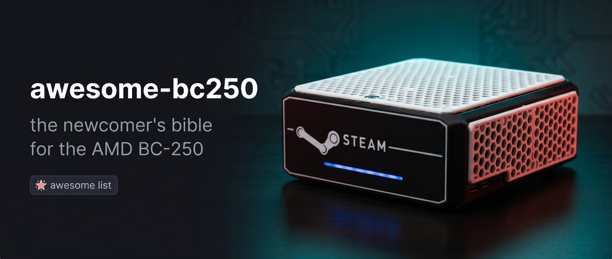

  

# Awesome BC-250 

> The newcomer's bible for the **AMD BC-250** — a PlayStation 5-derived APU board (Cyan Skillfish / Oberon, 16 GB GDDR6) repurposed as a cheap Linux gaming & AI box.

Everything you need to go **from a board in a box to running games** — curated from 125k+ messages of the BC-250 community, ranked by what people actually upvoted and pinned, and cross-checked against the canonical project repos.

🌍 Languages: **English** (primary) · [Русский](README.ru.md)

---

## ⚡ Start Here

New board, know nothing? Follow the golden path in order:

**[docs/en/00-start-here.md](docs/en/00-start-here.md)** — Buy → Power → Cool → Install OS → Drivers → Overclock → Play.

---

## 📚 Handbook

| # | Section | For |
|---|---------|-----|
| 01 | [What Is the BC-250](docs/en/01-what-is-bc250.md) | specs, sizes, pinout, expectations |
| 02 | [Buying Guide](docs/en/02-buying.md) | where, price, risks, group buys |
| 03 | [Power Supply](docs/en/03-power-supply.md) | LOP / Flex ATX, 8-pin pinout, wiring |
| 04 | [Cooling](docs/en/04-cooling.md) | heatsink, fan shrouds, test method |
| 05 | [Cases & 3D Printing](docs/en/05-case.md) | printable cases catalog (STL) |
| 06 | [Linux Drivers & Setup](docs/en/06-linux.md) | distro choice, amdgpu, install |
| 07 | [Windows Drivers & Setup](docs/en/07-windows.md) | driver status, how-to |
| 08 | [BIOS & Brick Recovery](docs/en/08-bios.md) | mod BIOS, flashing, un-brick |
| 09 | [Overclocking & Undervolting](docs/en/09-overclock-undervolt.md) | governor, SMU, 40CU unlock |
| 10 | [WiFi & Bluetooth Dongles](docs/en/10-wifi-bt.md) | dongles that actually work |
| 11 | [Gaming Results & Settings](docs/en/11-gaming.md) | benchmarks, per-game tuning |
| 12 | [AI / LLM on BC-250](docs/en/12-ai-llm.md) | llama.cpp, ROCm |
| 13 | [macOS / Hackintosh](docs/en/13-macos.md) | status |
| 14 | [Display & Output](docs/en/14-display.md) | DisplayPort, DP→HDMI adapters, dual screen |
| 15 | [Emulation](docs/en/15-emulation.md) | every console/platform, realistic status |
| 16 | [USB, Hubs & Storage](docs/en/16-usb-peripherals.md) | hubs, 5V mod, M.2 / SATA adapters |
| ❓ | [FAQ](docs/en/faq.md) · [Troubleshooting](docs/en/troubleshooting.md) | common problems |

---

## 🔗 Awesome Resources

Canonical community projects, ranked by how often the community pointed to them.

### Documentation
- [mothenjoyer69/bc250-documentation](https://github.com/mothenjoyer69/bc250-documentation) — the main reference
- [AMD-BC-250/documentation](https://github.com/AMD-BC-250/documentation) — org docs
- [kenavru/BC-250](https://github.com/kenavru/BC-250) — builds & scripts

### Overclock / Undervolt / SMU
- [mothenjoyer69/oberon-governor](https://gitlab.com/mothenjoyer69/oberon-governor) — the governor most builds run (sets clocks/voltage)
- [ZEROAESQUERDA/PS5GPU-BC250](https://github.com/ZEROAESQUERDA/PS5GPU-BC250) — oberon-governor fork with a GUI (Linux)
- [bc250-collective/amd_smu_reverse_engineering](https://github.com/bc250-collective/amd_smu_reverse_engineering)
- [bc250-collective/bc250_smu_oc](https://github.com/bc250-collective/bc250_smu_oc)
- [filippor/cyan-skillfish-governor](https://github.com/filippor/cyan-skillfish-governor) · [bc250-collective fork](https://github.com/bc250-collective/cyan-skillfish-governor)
- [duggasco/bc250-40cu-unlock](https://github.com/duggasco/bc250-40cu-unlock) — unlock all 40 CUs
- [WinnieLV/bc250-cu-live-manager](https://github.com/WinnieLV/bc250-cu-live-manager)
- [alexghow903/oberon-governor-atomic](https://github.com/alexghow903/oberon-governor-atomic)

### Drivers
- [ZEROAESQUERDA/BC250-windowsDriverTest](https://github.com/ZEROAESQUERDA/BC250-windowsDriverTest) — Windows GPU driver (experimental, no full accel as of early 2026)
- [Keshas-dev/AMD-BC-250-PSP-Driver](https://github.com/Keshas-dev/AMD-BC-250-PSP-Driver) — PSP/GPU driver work
- [AMD-BC-250/kernel.opensuse](https://github.com/AMD-BC-250/kernel.opensuse) — Linux kernel

### BIOS / Firmware
- [TuxThePenguin0/bc250-bios](https://gitlab.com/TuxThePenguin0/bc250-bios) — most-referenced BIOS images & mods
- See [docs/en/08-bios.md](docs/en/08-bios.md) for flashing & brick recovery

### WiFi / BT dongles
- [shenmintao/aic8800d80](https://github.com/shenmintao/aic8800d80) · [lwfinger/rtw88](https://github.com/lwfinger/rtw88) · [biglinux/rtl8831](https://github.com/biglinux/rtl8831)

### AI / LLM
- [ggml-org/llama.cpp](https://github.com/ggml-org/llama.cpp) · [ROCm/ROCm](https://github.com/ROCm/ROCm)

### Cases / 3D
- [onemorecap/bc-250-sleeve-adapter](https://github.com/onemorecap/bc-250-sleeve-adapter) · [bc-250-shell-case](https://github.com/onemorecap/bc-250-shell-case)
- Printables & MakerWorld — see [docs/en/05-case.md](docs/en/05-case.md)

---

## 🤝 Contributing

This is a **living** repo. Knowledge is extracted from the community chat by a reproducible pipeline (see [CONTRIBUTING.md](CONTRIBUTING.md)) and re-run on new exports. PRs with fixes, new dongles, new cases, verified commands welcome.

## 📄 License

Docs: [CC-BY-SA-4.0](LICENSE). Scripts under `assets/scripts/`: MIT. Mirrored third-party firmware/drivers retain their original rights — see [assets/firmware/DISCLAIMER.md](assets/firmware/DISCLAIMER.md).

## 🙏 Credits

The entire BC-250 community. Source: *чат AMD BC-250 community*. Project authors credited by their repo handle above.
