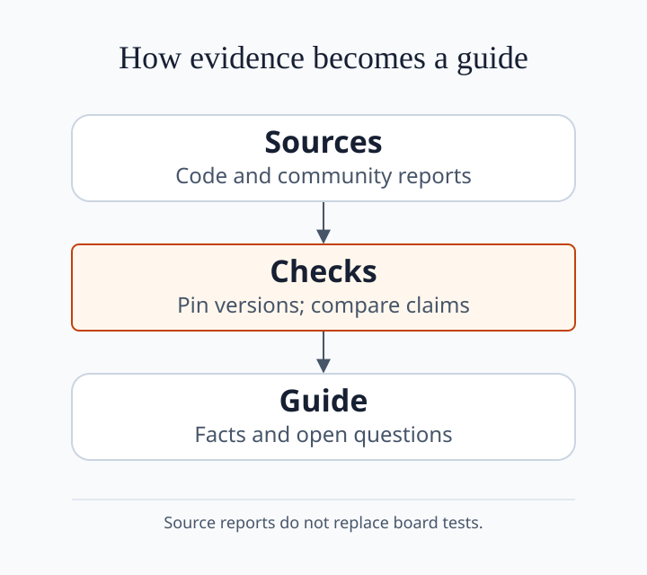

  

# Awesome BC-250 

> **Everything for BC250 in one place:** buying and assembly, power and cooling, OS choice, applications, upscalers, cases and research. This handbook explains the steps here; primary links credit developers and provide downloads. Community messages are evidence, not a substitute for instructions.

**Bought a board? [Follow steps 00–06 below](#quick-start), then connect the network and launch a game.**

_Catalog expanded **October 2026** · project snapshot **September 2026** · [llms.txt](llms.txt) for AI agents_

**English** · [Русский](README.ru.md) · [Українська](README.uk.md)

---

## Contents

- [Step-by-step guide: 00–17](#quick-start).
- [Help and choosing the next step](#guide).
- [Alternative projects and catalog](#catalog).
- [Board overview](#what-the-board-is).
- [Selected resource entry points](#selected-resource-entry-points).
- [Research scope and status](#research-scope-and-status).

---

## Quick start

**From a board in a box to a working computer.** For your first build, follow **00–06**, then **10 — networking** and **11 — games**. Numbers match the handbook chapters. Windows, BIOS flashing, overclocking and unlocking are not required steps for the first boot.

| No. | What to do | Instructions |
|---|---|---|
| **00** | Start with the overall route and parts checklist: what you have and what is missing. | [Start here](docs/en/00-start-here.md) |
| **01** | Identify your board, its connectors and limitations. | [What is the BC-250](docs/en/01-what-is-bc250.md) |
| **02** | Check the bundle before buying; if you already own the board, work out which parts to add. | [Buying and parts](docs/en/02-buying.md) |
| **03** | Choose the PSU and check the cable and pinout **before applying power**. | [Power supply](docs/en/03-power-supply.md) |
| **04** | Arrange active heatsink airflow **before loading the board**. | [Cooling](docs/en/04-cooling.md) |
| **05** | Secure the board and cooler; prepare a case or open mounting arrangement. | [Cases and assembly](docs/en/05-case.md) |
| **06** | Choose and install Linux; follow the setup for your specific image and verify GPU acceleration. | [Linux installation and drivers](docs/en/06-linux.md) |
| **07** | **Alternative OS:** check the state of Windows drivers if Linux does not fit. | [Windows](docs/en/07-windows.md) |
| **08** | **Only when needed:** backup, BIOS settings, flashing and recovery. | [BIOS](docs/en/08-bios.md) |
| **09** | **After a working first boot:** configure the governor; overclocking and undervolting are separate, board-validated steps. | [Clocks and voltage](docs/en/09-overclock-undervolt.md) |
| **10** | Connect networking; for WiFi/Bluetooth choose a dongle and install its required driver. | [WiFi and Bluetooth](docs/en/10-wifi-bt.md) |
| **11** | Launch a game and choose settings for that title. | [Games and settings](docs/en/11-gaming.md) |
| **12** | **Another workload:** set up local models and compute. | [AI / LLM](docs/en/12-ai-llm.md) |
| **13** | **Alternative OS:** MetalCyan requirements and installation. | [macOS](docs/en/13-macos.md) |
| **14** | Connect a DisplayPort monitor; work through adapters, audio and extra screens. | [Display and output](docs/en/14-display.md) |
| **15** | **Optional:** choose and configure emulators. | [Emulation](docs/en/15-emulation.md) |
| **16** | Connect storage and USB peripherals; check adapter limitations. | [USB, hubs and storage](docs/en/16-usb-peripherals.md) |
| **17** | **After basic setup:** install Control Center, upscalers or streaming tools for your task. | [Applications and tools](docs/en/17-projects-and-tools.md) |

**First power-on — between 05 and 06.** With power disconnected, secure the cooler, connect storage following **16**, a checked power cable following **03**, and a monitor following **14**. Then power on and check that the BIOS screen appears; only then install the OS. No picture or no boot? Do not jump to overclocking — open [Troubleshooting](docs/en/troubleshooting.md).

---

## Project catalog

- **[Browse the catalog](catalog/en/README.md)** — 440 named entries from all sources in one thematic catalog: applications, firmware, cases, models, experiments and history. Each project has a purpose and primary source; sections link to practical handbook chapters.
- **Documentation and firmware:** [Guides & build notes](catalog/en/README.md#documentation) · [BIOS, UEFI & recovery](catalog/en/README.md#firmware) · [CPU cores, SMU & ACPI](catalog/en/README.md#cpu).
- **Graphics and systems:** [GPU governors, CU/WGP & memory](catalog/en/README.md#gpu) · [Linux images & setup](catalog/en/README.md#linux) · [Graphics drivers & other OS experiments](catalog/en/README.md#drivers).
- **Control and hardware:** [Toolkits & game mode](catalog/en/README.md#control) · [Telemetry, fans & displays](catalog/en/README.md#monitoring) · [Power adapters & controllers](catalog/en/README.md#power) · [Cases, CAD & cooling](catalog/en/README.md#cases).
- **Workloads and peripherals:** [Video codecs, VCN & audio](catalog/en/README.md#video) · [AI, compute & clusters](catalog/en/README.md#ai) · [Games, tests & emulation](catalog/en/README.md#gaming) · [WiFi & Bluetooth](catalog/en/README.md#peripherals).
- **[Topic bibliography](catalog/en/topics.md)** — 702 distinct external links from the 19 handbook chapters: documentation, models, videos, discussions and message-level references; [community entry points](catalog/en/topics.md#communities) are listed separately.
- **[Discovery inventory](catalog/discovery.md)** — all 971 repository hits from the dated search, including forks and zero-star projects. Unresolved and unrelated matches remain identifiable rather than being presented as BC-250 recommendations.
- **The second layer, not the start of a build.** The step-by-step route above leads to instructions. Use the catalog to choose alternatives, find projects and explore their history; a listing does not itself recommend installation.

---

## What the board is

- **Board.** An ex-mining APU board from the PlayStation 5 family: a 6-core Zen 2 CPU, 24 or 40 RDNA 2 **compute units** (CUs, the GPU's basic execution blocks), and 16 GB GDDR6 memory.
- **Price.** Community reports put a bare board near **$60–130**, and a full build with power supply, cooler, and SSD near **$150–250**. These are reports, not quotes.
- **Operating system.** Linux is the primary gaming path: Bazzite, Fedora, CachyOS/Arch or SteamOS with board-specific setup. macOS has a separate [MetalCyan](docs/en/13-macos.md) path with version/driver limitations. Windows drivers remain experimental.
- **Display, network, storage.** Display output is DisplayPort. WiFi and Bluetooth need a tested USB dongle. Storage uses an M.2 or SATA adapter.
- **Cooling and power.** Community guides describe added airflow for the stock heatsink and several power-connector configurations. Check the exact connector pinout and size the power supply for the measured build; see [Cooling](docs/en/04-cooling.md) and [Power supply](docs/en/03-power-supply.md).
- **Tuning evidence.** Community measurements compare GPU clocks, voltage, GDDR6 speed and CU counts; outcomes vary by board. The [source data](assets/diagrams/data.json) is not a universal safe setting or a board test.
- **Evidence caveat.** This page collects links and community reports. A README entry, a code match, or a successful build is not a board test. [SOURCE_STATUS](SOURCE_STATUS.md) separates what was verified from what remains open.

---

## Guide

All chapters **00–17** are in the [step-by-step route above](#quick-start). You do not need to install everything in the catalog or follow experimental branches to play your first game.

- **Stuck on a step:** [Troubleshooting](docs/en/troubleshooting.md) · [FAQ](docs/en/faq.md).
- **Looking for an alternative to the main route:** [Project catalog](catalog/en/README.md).
- **Checking sources or history:** [Topic bibliography](catalog/en/topics.md) · [Source status](SOURCE_STATUS.md).

---

## Selected resource entry points

- **Full list:** the [project catalog](catalog/en/README.md) covers the alternatives and research projects beyond these entry points.

### Documentation
- [mothenjoyer69/bc250-documentation](https://github.com/mothenjoyer69/bc250-documentation) — the main hardware reference (reverse-engineering)
- [elektricM/amd-bc250-docs](https://github.com/elektricM/amd-bc250-docs) · [site](https://elektricm.github.io/amd-bc250-docs/) — comprehensive community docs (pinouts, per-distro, troubleshooting)
- [AMD-BC-250/documentation](https://github.com/AMD-BC-250/documentation) — organization documentation
- [kenavru/BC-250](https://github.com/kenavru/BC-250) — builds and scripts

### Overclock / Undervolt / SMU
- [mothenjoyer69/oberon-governor](https://gitlab.com/mothenjoyer69/oberon-governor) — GPU clock and voltage governor; check its own prerequisites before use
- [ZEROAESQUERDA/PS5GPU-BC250](https://github.com/ZEROAESQUERDA/PS5GPU-BC250) — oberon-governor fork with a Linux GUI
- [bc250-collective/amd_smu_reverse_engineering](https://github.com/bc250-collective/amd_smu_reverse_engineering)
- [bc250-collective/bc250_smu_oc](https://github.com/bc250-collective/bc250_smu_oc)
- [filippor/cyan-skillfish-governor](https://github.com/filippor/cyan-skillfish-governor) · [bc250-collective fork](https://github.com/bc250-collective/cyan-skillfish-governor)
- [rw-r-r-0644/bc250-core-unlock](https://github.com/rw-r-r-0644/bc250-core-unlock) — project for enabling disabled CPU cores; a mask value alone does not prove core health, and forcing extra cores can hang a board
- [duggasco/bc250-40cu-unlock](https://github.com/duggasco/bc250-40cu-unlock) — project for enabling up to 40 CUs; the result is board-specific and unverified here
- [WinnieLV/bc250-cu-live-manager](https://github.com/WinnieLV/bc250-cu-live-manager)
- [alexghow903/oberon-governor-atomic](https://github.com/alexghow903/oberon-governor-atomic)

### Toolkits & ready-made images
- [redbeard1083/bc250-toolkit](https://github.com/redbeard1083/bc250-toolkit) — menu-driven setup for CachyOS: kernel, CPU/GPU governors, swap, ZRAM→ZSWAP, ACPI and boot tweaks
- [movacx/bc250-control-center](https://github.com/movacx/bc250-control-center) — Linux GUI project for BC-250 monitoring and tuning; it also offers privileged and firmware operations, so read its prerequisites and recovery guidance before using those functions
- [62fixolab/Latest-Bazzite-AMD-BC-250-Patched-Images](https://github.com/62fixolab/Latest-Bazzite-AMD-BC-250-Patched-Images) — prebuilt Bazzite Deck/GNOME/KDE images with the BC-250 patches applied

### Drivers
- [ZEROAESQUERDA/BC250-windowsDriverTest](https://github.com/ZEROAESQUERDA/BC250-windowsDriverTest) — Windows GPU driver (experimental, no full acceleration as of early 2026)
- [Keshas-dev/AMD-BC-250-PSP-Driver](https://github.com/Keshas-dev/AMD-BC-250-PSP-Driver) — PSP and GPU driver development
- [DryhoppedIPA/bc250-gfx1013-fix](https://github.com/DryhoppedIPA/bc250-gfx1013-fix) — kernel + Mesa/RADV patches for the broken GPU compute queue (async compute); also fixes the FSR 4 / XeSS 3 INT8 path
- [MastaG/linux-cachyos-bc250](https://github.com/MastaG/linux-cachyos-bc250) — CachyOS kernel with BC-250 cherry-picks
- [AMD-BC-250/kernel.opensuse](https://github.com/AMD-BC-250/kernel.opensuse) — Linux kernel

### BIOS / Firmware
- [TuxThePenguin0/bc250-bios](https://gitlab.com/TuxThePenguin0/bc250-bios) — community BIOS images and modifications
- [TheRetroWeb — BC-250 BIOS database](https://theretroweb.com/bios?itemsPerPage=24&chipsetIds%5B%5D=1990) — stock BIOS dumps, browse/download by version
- [Forbidden-Darkness/AMD-BC-250-UEFI-v2.2-Firmware-Menu-Script](https://github.com/Forbidden-Darkness/AMD-BC-250-UEFI-v2.2-Firmware-Menu-Script) — menu-driven firmware backup and custom-firmware flashing
- See [docs/en/08-bios.md](docs/en/08-bios.md) for flashing and brick recovery

### WiFi / BT dongles
- [shenmintao/aic8800d80](https://github.com/shenmintao/aic8800d80) · [lwfinger/rtw88](https://github.com/lwfinger/rtw88) · [biglinux/rtl8831](https://github.com/biglinux/rtl8831)

### AI / LLM
- [ggml-org/llama.cpp](https://github.com/ggml-org/llama.cpp) · [ROCm/ROCm](https://github.com/ROCm/ROCm)

### Cases / 3D
- [onemorecap/bc-250-sleeve-adapter](https://github.com/onemorecap/bc-250-sleeve-adapter) · [bc-250-shell-case](https://github.com/onemorecap/bc-250-shell-case)
- Printables & MakerWorld — see [docs/en/05-case.md](docs/en/05-case.md)

---

## Research scope and status

  

- **Scope.** [SOURCE_STATUS](SOURCE_STATUS.md) reports a dated source audit as of 2026-09-29, not all information about the BC-250. Coverage is bounded to the source set stated there.
- **What was inventoried.** A repository-name search found 971 public GitHub repositories; known Discord sources hold 338,589 message IDs; three Reddit listings exposed 1,441 post IDs. These are counts of identifiers.
- **What remains open.** Archived forum threads, deleted or private messages, attachment contents, and many repositories outside the name set are not covered. Disputes such as whether `I2C_HEADER1` reaches a live PMBus stay unresolved.
- **Translation note.** Changed procedures and navigation are synchronized in EN/RU/UK for this pass. Historical source excerpts remain dated reports, not a whole-handbook or hardware certification; see [source review](SOURCE_REVIEW.md).
- **Reading the numbers.** An identifier count shows coverage of a source list; it does not confirm that any listed project works on the board.

---

## Contributing and safety

- **Contributions.** The knowledge here is extracted from community chat by a reproducible pipeline; see [CONTRIBUTING.md](CONTRIBUTING.md). Fixes, new dongles, new cases, and verified commands are welcome.
- **Safety.** Firmware and BIOS changes carry brick risk. Keep a full dump and a tested recovery path before flashing; see [BIOS & brick recovery](docs/en/08-bios.md).
- **Reported risk.** The 40-CU and memory overclocks have returned boards as bricks in community reports. Prefer the smallest staged change and keep a stock control.
- **No guarantee.** Nothing here is board-verified unless a specific test says so. Do not treat a merged file or a passing build as hardware confirmation.
- **License.** Documentation uses [CC-BY-SA-4.0](LICENSE); scripts in `assets/scripts/` use MIT.
- **Third-party rights.** Mirrored firmware and drivers retain their owners’ rights; see [the firmware disclaimer](assets/firmware/DISCLAIMER.md). Contributors are listed in [CREDITS](CREDITS.md).
