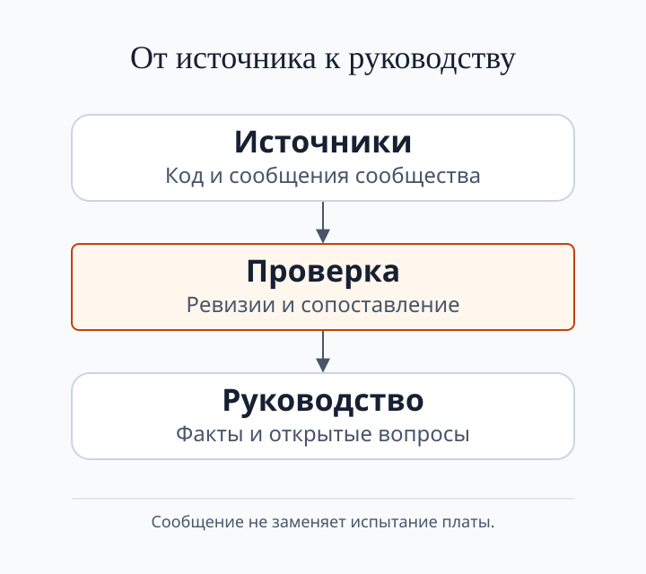

  

# Awesome BC-250 

> Курируемый справочник по **ASRock AMD BC-250**: APU-плата на базе PlayStation 5 (Cyan Skillfish / Oberon; 6-ядерный Zen 2 и графика RDNA 2, 16 ГБ GDDR6), переработанная в недорогой Linux-мини-ПК для игр и задач ИИ.

_Поддерживается · обновлено **сентябрь 2026** · [llms.txt](llms.txt) для ИИ-агентов_

[English](README.md) · **Русский** · [Українська](README.uk.md)

---

## Быстрый старт

- **Новый владелец.** Идите по порядку по [docs/ru/00-start-here.md](docs/ru/00-start-here.md): покупка, питание, охлаждение, установка операционной системы, настройка, игра. Каждый шаг описан в справочнике ниже.
- **Геймер.** Начните с [результатов в играх](docs/ru/11-gaming.md) и [эмуляции](docs/ru/15-emulation.md). Перед изменением частот или напряжения прочитайте [разгон и андервольт](docs/ru/09-overclock-undervolt.md).
- **Исследователь.** Начните с [SOURCE_STATUS](SOURCE_STATUS.ru.md), обзора источников на конкретную дату. Затем прочитайте [BIOS и восстановление прошивки](docs/ru/08-bios.md) и [ИИ / LLM](docs/ru/12-ai-llm.md).

---

## Что это за плата

- **Плата.** Бывшая майнинговая APU-плата из семейства PlayStation 5: 6-ядерный Zen 2, 24 или 40 **вычислительных блоков** RDNA 2 (CU: базовый блок исполнения GPU) и 16 ГБ памяти GDDR6.
- **Цена.** По сообщениям сообщества, голая плата стоит около **$60–130**, а сборка с блоком питания, охлаждением и SSD стоит около **$150–250**. Это ориентиры из сообщений, а не текущие цены.
- **Операционная система.** Ускорение GPU работает в Linux: Bazzite, Fedora, CachyOS или Arch с Mesa 25.1 и новее. Windows-драйвер GPU экспериментальный; этот справочник не предлагает его как штатный путь.
- **Дисплей, сеть, накопители.** Вывод изображения идёт через DisplayPort. Для WiFi и Bluetooth нужен проверенный USB-донгл. Накопители подключаются через адаптер M.2 или SATA.
- **Охлаждение и питание.** Сообщество описывает дополнительный обдув штатного радиатора и несколько схем подключения питания. Проверьте распиновку своих разъёмов и подбирайте блок питания по измеренной нагрузке; см. [охлаждение](docs/ru/04-cooling.md) и [блок питания](docs/ru/03-power-supply.md).
- **Данные о настройках.** Сообщество сопоставляет частоты GPU, напряжение, скорость GDDR6 и число CU; результат зависит от конкретной платы. [Исходные данные](assets/diagrams/data.json) не задают универсально безопасные настройки и не заменяют испытание.
- **Оговорка о доказательствах.** Эта страница собирает ссылки и сообщения сообщества. Запись в README, совпадение в коде или успешная сборка не заменяют испытание платы. [SOURCE_STATUS](SOURCE_STATUS.ru.md) отделяет проверенное от открытого.

---

## Справочник

- **[Начни отсюда](docs/ru/00-start-here.md)**: порядок подготовки платы и запуска игры.
- **Основы сборки:** [Что такое BC-250](docs/ru/01-what-is-bc250.md) · [Покупка](docs/ru/02-buying.md) · [Блок питания](docs/ru/03-power-supply.md) · [Охлаждение](docs/ru/04-cooling.md) · [Корпуса и 3D-печать](docs/ru/05-case.md).
- **Программная часть:** [Драйверы и установка Linux](docs/ru/06-linux.md) · [Драйверы и настройка Windows](docs/ru/07-windows.md) · [macOS / Hackintosh](docs/ru/13-macos.md).
- **Тюнинг и прошивки:** [Разгон и андервольт](docs/ru/09-overclock-undervolt.md) · [BIOS и восстановление прошивки](docs/ru/08-bios.md).
- **Периферия и вывод:** [WiFi- и Bluetooth-донглы](docs/ru/10-wifi-bt.md) · [Видео и вывод](docs/ru/14-display.md) · [USB, хабы и периферия](docs/ru/16-usb-peripherals.md).
- **Нагрузки:** [Результаты в играх и настройки](docs/ru/11-gaming.md) · [ИИ / LLM](docs/ru/12-ai-llm.md) · [Эмуляция](docs/ru/15-emulation.md).
- **Помощь:** [FAQ](docs/ru/faq.md) · [Решение проблем](docs/ru/troubleshooting.md).

---

## Ресурсы сообщества

### Документация
- [mothenjoyer69/bc250-documentation](https://github.com/mothenjoyer69/bc250-documentation): аппаратная документация и материалы по реверс-инжинирингу
- [elektricM/amd-bc250-docs](https://github.com/elektricM/amd-bc250-docs) · [сайт](https://elektricm.github.io/amd-bc250-docs/): руководство сообщества по контактам, дистрибутивам и диагностике
- [AMD-BC-250/documentation](https://github.com/AMD-BC-250/documentation): документация организации
- [kenavru/BC-250](https://github.com/kenavru/BC-250): сборки и скрипты

### Разгон / андервольт / SMU
- [mothenjoyer69/oberon-governor](https://gitlab.com/mothenjoyer69/oberon-governor): governor для частот и напряжения GPU; перед использованием проверьте требования проекта
- [ZEROAESQUERDA/PS5GPU-BC250](https://github.com/ZEROAESQUERDA/PS5GPU-BC250): форк oberon-governor с GUI для Linux
- [bc250-collective/amd_smu_reverse_engineering](https://github.com/bc250-collective/amd_smu_reverse_engineering)
- [bc250-collective/bc250_smu_oc](https://github.com/bc250-collective/bc250_smu_oc)
- [filippor/cyan-skillfish-governor](https://github.com/filippor/cyan-skillfish-governor) · [форк bc250-collective](https://github.com/bc250-collective/cyan-skillfish-governor)
- [rw-r-r-0644/bc250-core-unlock](https://github.com/rw-r-r-0644/bc250-core-unlock): проект включения отключённых ядер CPU; одна маска не доказывает исправность ядра, а принудительное включение может вызвать зависание
- [duggasco/bc250-40cu-unlock](https://github.com/duggasco/bc250-40cu-unlock): проект разблокировки до 40 CU; результат зависит от платы и здесь не проверен
- [WinnieLV/bc250-cu-live-manager](https://github.com/WinnieLV/bc250-cu-live-manager)
- [alexghow903/oberon-governor-atomic](https://github.com/alexghow903/oberon-governor-atomic)

### Инструменты и готовые образы
- [redbeard1083/bc250-toolkit](https://github.com/redbeard1083/bc250-toolkit): меню настройки CachyOS (ядро, CPU/GPU governor, swap, ZRAM→ZSWAP, ACPI и параметры загрузки)
- [movacx/bc250-control-center](https://github.com/movacx/bc250-control-center): проект Linux-панели для мониторинга и настройки BC-250; в нём есть и привилегированные операции с прошивкой, поэтому перед их использованием изучите требования и процедуру восстановления
- [62fixolab/Latest-Bazzite-AMD-BC-250-Patched-Images](https://github.com/62fixolab/Latest-Bazzite-AMD-BC-250-Patched-Images): готовые образы Bazzite Deck/GNOME/KDE с применёнными патчами BC-250

### Драйверы
- [ZEROAESQUERDA/BC250-windowsDriverTest](https://github.com/ZEROAESQUERDA/BC250-windowsDriverTest): Windows-драйвер GPU (экспериментальный, без полного ускорения на начало 2026)
- [Keshas-dev/AMD-BC-250-PSP-Driver](https://github.com/Keshas-dev/AMD-BC-250-PSP-Driver): работа над PSP/GPU-драйвером
- [DryhoppedIPA/bc250-gfx1013-fix](https://github.com/DryhoppedIPA/bc250-gfx1013-fix): патчи ядра и Mesa/RADV для сломанной вычислительной очереди GPU (async compute); также чинит путь INT8 для FSR 4 / XeSS 3
- [MastaG/linux-cachyos-bc250](https://github.com/MastaG/linux-cachyos-bc250): ядро CachyOS с изменениями для BC-250
- [AMD-BC-250/kernel.opensuse](https://github.com/AMD-BC-250/kernel.opensuse): ядро Linux

### BIOS / прошивки
- [TuxThePenguin0/bc250-bios](https://gitlab.com/TuxThePenguin0/bc250-bios): образы BIOS и модификации сообщества
- [TheRetroWeb: база BIOS BC-250](https://theretroweb.com/bios?itemsPerPage=24&chipsetIds%5B%5D=1990): образы исходных версий BIOS для просмотра и скачивания
- [Forbidden-Darkness/AMD-BC-250-UEFI-v2.2-Firmware-Menu-Script](https://github.com/Forbidden-Darkness/AMD-BC-250-UEFI-v2.2-Firmware-Menu-Script): скрипт меню для резервного копирования и установки модифицированной прошивки
- Прошивка и восстановление: см. [docs/ru/08-bios.md](docs/ru/08-bios.md)

### WiFi / BT донглы
- [shenmintao/aic8800d80](https://github.com/shenmintao/aic8800d80) · [lwfinger/rtw88](https://github.com/lwfinger/rtw88) · [biglinux/rtl8831](https://github.com/biglinux/rtl8831)

### ИИ / LLM
- [ggml-org/llama.cpp](https://github.com/ggml-org/llama.cpp) · [ROCm/ROCm](https://github.com/ROCm/ROCm)

### Корпуса / 3D
- [onemorecap/bc-250-sleeve-adapter](https://github.com/onemorecap/bc-250-sleeve-adapter) · [bc-250-shell-case](https://github.com/onemorecap/bc-250-shell-case)
- Printables и MakerWorld: см. [docs/ru/05-case.md](docs/ru/05-case.md)

---

## Охват и статус исследования

  

- **Охват.** [SOURCE_STATUS](SOURCE_STATUS.ru.md) описывает датированный обзор источников на 2026-09-29, а не всю информацию о BC-250. Охват ограничен набором источников, указанным там.
- **Что было проинвентаризировано.** Поиск по именам репозиториев нашёл 971 публичный репозиторий GitHub; известные источники Discord содержат 338 589 ID сообщений; три списка Reddit дали 1 441 ID публикаций. Это подсчёт идентификаторов.
- **Что остаётся открытым.** Архивные ветки форумов, удалённые и приватные сообщения, содержимое вложений и многие репозитории вне набора имён не охвачены. Споры, например о том, доходит ли `I2C_HEADER1` до живой PMBus, остаются нерешёнными.
- **Примечание о переводе.** Подробные украинские страницы справочника могут отставать от фактических обновлений на английском и русском. Сам README переведён на все три языка.
- **Как читать числа.** Подсчёт идентификаторов показывает охват списка источников; он не подтверждает работу какого-либо проекта на плате.

---

## Вклад и безопасность

- **Вклад.** Знания здесь извлекаются из чата сообщества воспроизводимым пайплайном; см. [CONTRIBUTING.md](CONTRIBUTING.md). Правки, новые донглы, новые корпуса и проверенные команды приветствуются.
- **Безопасность.** Изменение прошивки и BIOS несёт риск «кирпича». Перед прошивкой сохраните полный дамп и проверенный путь восстановления; см. [BIOS и восстановление прошивки](docs/ru/08-bios.md).
- **Заявленный риск.** По сообщениям сообщества, разблокировка 40 CU и разгон памяти возвращали платы «кирпичом». Предпочитайте минимальное поэтапное изменение и держите стоковый контроль.
- **Без гарантий.** Ничто здесь не проверено на плате, если об этом не сказано в конкретном тесте. Не считайте слитый файл или успешную сборку подтверждением работы железа.
- **Лицензия.** Документация распространяется по [CC-BY-SA-4.0](LICENSE); скрипты в `assets/scripts/` распространяются по MIT.
- **Права и участники.** Зеркальные копии прошивок и драйверов сохраняют права владельцев; см. [оговорку о прошивках](assets/firmware/DISCLAIMER.md). Участники перечислены в [CREDITS](CREDITS.ru.md).
