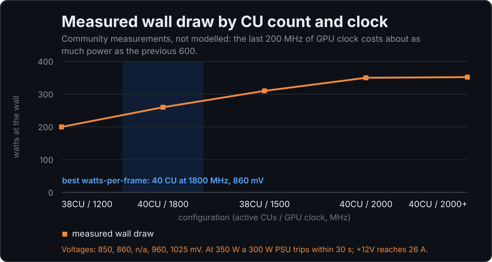
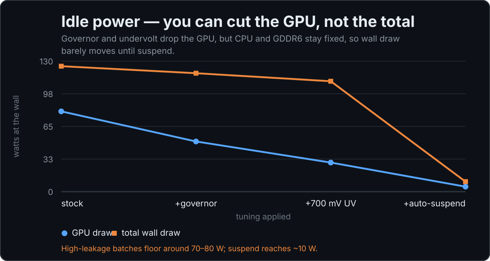

  

# Awesome BC-250 

> **ASRock AMD BC-250** için yeni başlayanların kutsal kitabı — PlayStation 5 türevi bir APU kartı (Cyan Skillfish / Oberon, 6 çekirdekli Zen 2 + RDNA 2, 16 GB GDDR6) olup ucuz bir **Linux oyun ve yapay zeka mini PC**'sine dönüştürülmüştür — DIY bütçe dostu bir Steam Machine.

**Kutudaki bir karttan oyun çalıştırmaya** kadar ihtiyacınız olan her şey — BC-250 topluluğunun 130 binin üzerindeki mesajından derlendi, insanların gerçekten oy verdiği ve sabitlediği içeriklere göre sıralandı ve projenin asıl depolarıyla çapraz kontrol edildi.

🌍 [English](README.md) · [Русский](README.ru.md) · [Українська](README.uk.md) · [Қазақша](README.kk.md) · [Кыргызча](README.ky.md) · [Español](README.es.md) · [Português (BR)](README.pt-BR.md) · [Français](README.fr.md) · [Deutsch](README.de.md) · [Polski](README.pl.md) · **Türkçe** · [中文](README.zh.md) · [日本語](README.ja.md) · [العربية](README.ar.md) · [हिन्दी](README.hi.md)

_Bakımı yapılıyor · son güncelleme **Ağustos 2026** · yapay zeka ajanları için [llms.txt](llms.txt)_

---

## ❓ Hızlı Cevaplar

- **ASRock AMD BC-250 nedir?** PlayStation 5 türevi bir APU kartı — 6 çekirdekli Zen 2 + 24/40 RDNA 2 CU ("Cyan Skillfish"), 16 GB GDDR6 — eski bir madencilik kartı olarak ucuza satıldı ve bir Linux oyun ve yapay zeka mini PC'sine, DIY bütçe dostu bir Steam Machine'e dönüştürüldü.
- **Fiyatı ne kadar?** Çıplak kart için yaklaşık **$60–130**; tam bir kurulum (PSU, soğutucu, SSD) **$150–250** civarına denk gelir. Bkz. [Satın Alma Rehberi](docs/en/02-buying.md).
- **Oyun performansı nasıl?** Çoğu oyunda FSR / Frame-Gen ve GPU+CPU overclock ile kabaca **1080p 60 FPS** (RX 6600 sınıfı). Bkz. [Oyun Sonuçları ve Ayarları](docs/en/11-gaming.md).
- **Hangi işletim sistemi?** GPU ivmelendirmesi için **yalnızca Linux** — Mesa 25.1+ ile Bazzite, Fedora, CachyOS veya Arch. Windows GPU sürücüsü yoktur. Bkz. [Linux Sürücüleri ve Kurulum](docs/en/06-linux.md).
- **LLM çalıştırabilir mi?** Evet — Vulkan üzerinden llama.cpp / Ollama, 16 GB GDDR6'yı VRAM olarak kullanır (küçük modellerde ~30–47 tok/s). Bkz. [BC-250'de Yapay Zeka / LLM](docs/en/12-ai-llm.md).
- **Nasıl soğutulur?** Stok sunucu soğutucusu masa üstünde kısıtlamaya (throttle) girer; kanatçıkları inceltin ve 120 mm fan ekleyin ya da sıvı soğutmaya geçin. Bkz. [Soğutma](docs/en/04-cooling.md).

---

## ⚡ Buradan Başlayın

Yeni kart, hiçbir şey bilmiyor musunuz? Altın yolu sırasıyla takip edin:

**[docs/tr/00-start-here.md](docs/tr/00-start-here.md)** — Satın al → Güç ver → Soğut → İşletim sistemi kur → Sürücüler → Overclock → Oyna.

---

## 📈 Ayarın Size Gerçekte Kazandırdıkları

Bu karttaki her ayar bir şeyden ödün verir. Önemli olan dört ayar şunlardır; topluluğun ölçümlerinden derlendi — hiçbir şey flashlemeden önce bunları okuyun.

  

  

  

  

  

Bu beş nokta bir model değil, ölçümdür: 1800'den 2000 MHz'e çıkmak yaklaşık 90 W'a mal olur — kabaca önceki 600 MHz'in maliyetiyle aynı — ve 960 mV'yi 1025 mV'ye zorlamak 2 W'lık ısıdan başka hiçbir şey kazandırmaz. 350 W'ta 300 W'lık bir güç kaynağı 30 saniye içinde korumaya geçer ve +12V hattı 26 A taşır.

Boştaki güç — duvar ölçer neden neredeyse hiç hareket etmiyor

  

Governor ve undervolt GPU'yu keser, ancak CPU ve GDDR6 ne olursa olsun güç çekmeye devam eder. Otomatik askıya alma devreye girene kadar duvar ölçer neredeyse hiç fark etmez. Yüksek kaçak akımlı partiler yaklaşık 70–80 W'ta taban yapar.

Kaynak veri: [`assets/diagrams/data.json`](assets/diagrams/data.json) · `node assets/diagrams/build.mjs` ile yeniden oluşturun

---

## 📚 El Kitabı

| # | Bölüm | Ne için |
|---|---------|-----|
| 01 | [BC-250 Nedir](docs/en/01-what-is-bc250.md) | teknik özellikler, boyutlar, pinout, beklentiler |
| 02 | [Satın Alma Rehberi](docs/en/02-buying.md) | nereden, fiyat, riskler, toplu alımlar |
| 03 | [Güç Kaynağı](docs/en/03-power-supply.md) | LOP / Flex ATX, 8 pinli pinout, kablolama |
| 04 | [Soğutma](docs/en/04-cooling.md) | soğutucu blok, fan kanalları, test yöntemi |
| 05 | [Kasalar ve 3D Baskı](docs/en/05-case.md) | yazdırılabilir kasa kataloğu (STL) |
| 06 | [Linux Sürücüleri ve Kurulum](docs/en/06-linux.md) | dağıtım seçimi, amdgpu, kurulum |
| 07 | [Windows Sürücüleri ve Kurulum](docs/en/07-windows.md) | sürücü durumu, nasıl yapılır |
| 08 | [BIOS ve Tuğla Kurtarma](docs/en/08-bios.md) | mod BIOS, flashleme, tuğladan kurtarma |
| 09 | [Overclock ve Undervolt](docs/en/09-overclock-undervolt.md) | governor, SMU, 40CU açma |
| 10 | [WiFi ve Bluetooth Dongle'ları](docs/en/10-wifi-bt.md) | gerçekten çalışan dongle'lar |
| 11 | [Oyun Sonuçları ve Ayarları](docs/en/11-gaming.md) | benchmark'lar, oyun başına ayar |
| 12 | [BC-250'de Yapay Zeka / LLM](docs/en/12-ai-llm.md) | llama.cpp, ROCm |
| 13 | [macOS / Hackintosh](docs/en/13-macos.md) | durum |
| 14 | [Ekran ve Çıkış](docs/en/14-display.md) | DisplayPort, DP→HDMI adaptörleri, çift ekran |
| 15 | [Emülasyon](docs/en/15-emulation.md) | her konsol/platform, gerçekçi durum |
| 16 | [USB, Hub'lar ve Depolama](docs/en/16-usb-peripherals.md) | hub'lar, 5V mod, M.2 / SATA adaptörleri |
| ❓ | [SSS](docs/tr/faq.md) · [Sorun Giderme](docs/tr/troubleshooting.md) | yaygın sorunlar |

---

## 🔗 Harika Kaynaklar

Topluluğun ne sıklıkla atıfta bulunduğuna göre sıralanmış, asıl topluluk projeleri.

### Dokümantasyon
- [mothenjoyer69/bc250-documentation](https://github.com/mothenjoyer69/bc250-documentation) — ana donanım referansı (tersine mühendislik)
- [elektricM/amd-bc250-docs](https://github.com/elektricM/amd-bc250-docs) · [site](https://elektricm.github.io/amd-bc250-docs/) — kapsamlı topluluk dokümanları (pinout'lar, dağıtım başına, sorun giderme)
- [AMD-BC-250/documentation](https://github.com/AMD-BC-250/documentation) — kuruluş dokümanları
- [kenavru/BC-250](https://github.com/kenavru/BC-250) — build'ler ve scriptler

### Overclock / Undervolt / SMU
- [mothenjoyer69/oberon-governor](https://gitlab.com/mothenjoyer69/oberon-governor) — çoğu build'in çalıştırdığı governor (saat hızlarını/voltajı ayarlar)
- [ZEROAESQUERDA/PS5GPU-BC250](https://github.com/ZEROAESQUERDA/PS5GPU-BC250) — GUI'li oberon-governor fork'u (Linux)
- [bc250-collective/amd_smu_reverse_engineering](https://github.com/bc250-collective/amd_smu_reverse_engineering)
- [bc250-collective/bc250_smu_oc](https://github.com/bc250-collective/bc250_smu_oc)
- [filippor/cyan-skillfish-governor](https://github.com/filippor/cyan-skillfish-governor) · [bc250-collective fork](https://github.com/bc250-collective/cyan-skillfish-governor)
- [rw-r-r-0644/bc250-core-unlock](https://github.com/rw-r-r-0644/bc250-core-unlock) — devre dışı bırakılmış 2 CPU çekirdeğini açar (stok maske 0x77; 0xB7 maskesi fiziksel olarak kusurlu çekirdek anlamına gelir — zorlamak artefaktlara ve çökmelere neden olur)
- [duggasco/bc250-40cu-unlock](https://github.com/duggasco/bc250-40cu-unlock) — 40 CU'nun tamamını açar
- [WinnieLV/bc250-cu-live-manager](https://github.com/WinnieLV/bc250-cu-live-manager)
- [alexghow903/oberon-governor-atomic](https://github.com/alexghow903/oberon-governor-atomic)

### Araç Setleri ve Hazır İmajlar
- [redbeard1083/bc250-toolkit](https://github.com/redbeard1083/bc250-toolkit) — CachyOS için menü güdümlü kurulum: çekirdek, CPU/GPU governor'ları, swap, ZRAM→ZSWAP, ACPI ve önyükleme ince ayarları
- [62fixolab/Latest-Bazzite-AMD-BC-250-Patched-Images](https://github.com/62fixolab/Latest-Bazzite-AMD-BC-250-Patched-Images) — BC-250 yamaları uygulanmış hazır Bazzite Deck/GNOME/KDE imajları

### Sürücüler
- [ZEROAESQUERDA/BC250-windowsDriverTest](https://github.com/ZEROAESQUERDA/BC250-windowsDriverTest) — Windows GPU sürücüsü (deneysel, 2026 başı itibarıyla tam ivmelendirme yok)
- [Keshas-dev/AMD-BC-250-PSP-Driver](https://github.com/Keshas-dev/AMD-BC-250-PSP-Driver) — PSP/GPU sürücü çalışması
- [DryhoppedIPA/bc250-gfx1013-fix](https://github.com/DryhoppedIPA/bc250-gfx1013-fix) — bozuk GPU hesaplama kuyruğu (async compute) için çekirdek + Mesa/RADV yamaları; ayrıca FSR 4 / XeSS 3 INT8 yolunu da düzeltir
- [MastaG/linux-cachyos-bc250](https://github.com/MastaG/linux-cachyos-bc250) — BC-250 cherry-pick'leri içeren CachyOS çekirdeği
- [AMD-BC-250/kernel.opensuse](https://github.com/AMD-BC-250/kernel.opensuse) — Linux çekirdeği

### BIOS / Firmware
- [TuxThePenguin0/bc250-bios](https://gitlab.com/TuxThePenguin0/bc250-bios) — en çok atıfta bulunulan BIOS imajları ve modları
- [TheRetroWeb — BC-250 BIOS veritabanı](https://theretroweb.com/bios?itemsPerPage=24&chipsetIds%5B%5D=1990) — stok BIOS dökümleri, sürüme göre göz atın/indirin
- [Forbidden-Darkness/AMD-BC-250-UEFI-v2.2-Firmware-Menu-Script](https://github.com/Forbidden-Darkness/AMD-BC-250-UEFI-v2.2-Firmware-Menu-Script) — menü güdümlü firmware yedekleme ve özel firmware flashleme
- Flashleme ve tuğla kurtarma için bkz. [docs/en/08-bios.md](docs/en/08-bios.md)

### WiFi / BT dongle'ları
- [shenmintao/aic8800d80](https://github.com/shenmintao/aic8800d80) · [lwfinger/rtw88](https://github.com/lwfinger/rtw88) · [biglinux/rtl8831](https://github.com/biglinux/rtl8831)

### Yapay Zeka / LLM
- [ggml-org/llama.cpp](https://github.com/ggml-org/llama.cpp) · [ROCm/ROCm](https://github.com/ROCm/ROCm)

### Kasalar / 3D
- [onemorecap/bc-250-sleeve-adapter](https://github.com/onemorecap/bc-250-sleeve-adapter) · [bc-250-shell-case](https://github.com/onemorecap/bc-250-shell-case)
- Printables ve MakerWorld — bkz. [docs/en/05-case.md](docs/en/05-case.md)

---

## 🤝 Katkıda Bulunma

Bu **yaşayan** bir depodur. Bilgiler, yeniden üretilebilir bir pipeline ile topluluk sohbetinden çıkarılır (bkz. [CONTRIBUTING.md](CONTRIBUTING.md)) ve yeni dışa aktarımlarda tekrar çalıştırılır. Düzeltmeler, yeni dongle'lar, yeni kasalar ve doğrulanmış komutlar içeren PR'ler memnuniyetle karşılanır.

## 📄 Lisans

Dokümanlar: [CC-BY-SA-4.0](LICENSE). `assets/scripts/` altındaki scriptler: MIT. Yansıtılan üçüncü taraf firmware/sürücüler kendi orijinal haklarını korur — bkz. [assets/firmware/DISCLAIMER.md](assets/firmware/DISCLAIMER.md).

## 🙏 Teşekkürler

Tüm BC-250 topluluğu — bu el kitabını mümkün kılan en iyi katkı sağlayanlar için bkz. **[CREDITS](CREDITS.md)**. Kaynak: *AMD BC-250 topluluk sohbeti*. Proje yazarları yukarıda depo kullanıcı adlarıyla anılmıştır.
