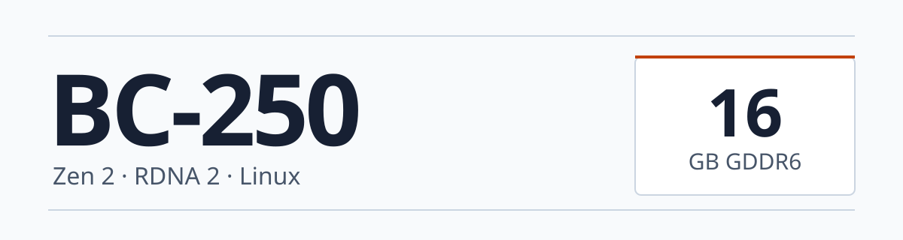
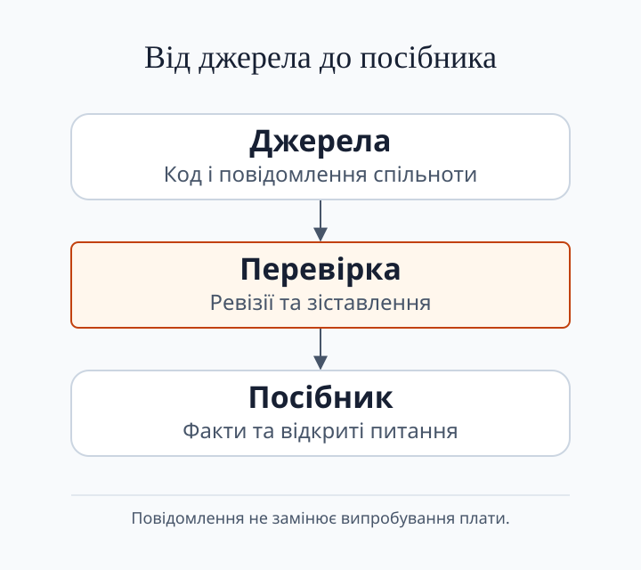

  

# Awesome BC-250 

> **Усе для BC250 в одному місці:** купівля й збірка, живлення й охолодження, вибір ОС, програми, апскейлери, корпуси та дослідження. Посібник пояснює дії тут; основні посилання ведуть на проєкти авторів і файли. Повідомлення спільнот — джерела, не заміна інструкції.

**Купив плату? [Іди за кроками 00–06 нижче](#швидкий-старт), потім підключи мережу й запусти гру.**

_Каталог розширено **в жовтні 2026** · знімок проєктів **за вересень 2026** · [llms.txt](llms.txt) для ШІ-агентів_

[English](README.md) · [Русский](README.ru.md) · **Українська**

---

## Зміст

- [Покроковий посібник: 00–17](#швидкий-старт).
- [Допомога й вибір наступного кроку](#довідник).
- [Каталог альтернатив і проєктів](#catalog).
- [Що це за плата](#що-це-за-плата).
- [Початкові посилання на ресурси](#початкові-посилання-на-ресурси).
- [Охоплення дослідження](#обсяг-і-статус-дослідження).

---

## Швидкий старт

**Від плати в коробці до робочого компʼютера.** Для першої збірки проходь **00–06**, потім **10 — мережа** та **11 — ігри**. Номери відповідають главам. Windows, прошивка BIOS, розгін і розблокування — не обовʼязкові етапи першого запуску.

| № | Що робимо | Інструкція |
|---|---|---|
| **00** | Почни із загального маршруту й списку деталей: що вже є та чого бракує. | [Почни звідси](docs/uk/00-start-here.md) |
| **01** | Зʼясуй, що за плата в тебе, які в неї розʼєми та обмеження. | [Що таке BC-250](docs/uk/01-what-is-bc250.md) |
| **02** | До купівлі перевір комплект; якщо плату вже куплено — визнач, що треба докупити. | [Купівля та комплект](docs/uk/02-buying.md) |
| **03** | Вибери БЖ і перевір кабель та розпіновку **до подачі живлення**. | [Блок живлення](docs/uk/03-power-supply.md) |
| **04** | Організуй активний обдув радіатора **до навантаження**. | [Охолодження](docs/uk/04-cooling.md) |
| **05** | Закріпи плату й охолодження; підготуй корпус або відкрите кріплення. | [Корпуси та збірка](docs/uk/05-case.md) |
| **06** | Вибери й установи Linux; виконай налаштування саме вибраного образу та перевір прискорення GPU. | [Встановлення Linux і драйверів](docs/uk/06-linux.md) |
| **07** | **Альтернативна ОС:** вивчи стан Windows-драйверів, якщо Linux не підходить. | [Windows](docs/uk/07-windows.md) |
| **08** | **Лише за потреби:** резервна копія, налаштування BIOS, прошивка й відновлення. | [BIOS](docs/uk/08-bios.md) |
| **09** | **Після робочого першого запуску:** налаштуй governor; розгін і андервольт — окремо, з перевіркою своєї плати. | [Частоти та напруга](docs/uk/09-overclock-undervolt.md) |
| **10** | Підключи мережу; для WiFi/Bluetooth вибери донгл і встанови потрібний драйвер. | [WiFi та Bluetooth](docs/uk/10-wifi-bt.md) |
| **11** | Запусти гру та вибери налаштування під її вимоги. | [Ігри та налаштування](docs/uk/11-gaming.md) |
| **12** | **Інше завдання:** налаштуй локальні моделі й обчислення. | [AI / LLM](docs/uk/12-ai-llm.md) |
| **13** | **Альтернативна ОС:** вимоги та встановлення MetalCyan. | [macOS](docs/uk/13-macos.md) |
| **14** | Підключи монітор через DisplayPort; розбери перехідники, звук і додаткові екрани. | [Дисплей та вивід](docs/uk/14-display.md) |
| **15** | **За бажанням:** вибери й налаштуй емулятори. | [Емуляція](docs/uk/15-emulation.md) |
| **16** | Підключи накопичувач і потрібну USB-периферію; перевір обмеження адаптерів. | [USB, хаби й накопичувачі](docs/uk/16-usb-peripherals.md) |
| **17** | **Після базового налаштування:** встанови Control Center, апскейлери чи стримінг під своє завдання. | [Програми та інструменти](docs/uk/17-projects-and-tools.md) |

**Перше ввімкнення — між 05 і 06.** На знеструмленій платі закріпи охолодження, підключи накопичувач за главою **16**, перевірений кабель живлення за **03** і монітор за **14**. Потім увімкни й перевір, що зʼявляється екран BIOS; лише після цього встановлюй ОС. Немає зображення чи плата не стартує? Не переходь до розгону — відкрий [діагностику](docs/uk/troubleshooting.md).

---

## Каталог проєктів

- **[Відкрити каталог](catalog/uk/README.md)** — 429 іменних записів з усіх джерел у спільному тематичному каталозі: програми, прошивки, корпуси, моделі, експерименти та історія. Кожен проєкт має призначення й основне джерело; розділ веде до практичної глави.
- **Документація та прошивки:** [Посібники й збірки](catalog/uk/README.md#documentation) · [BIOS, UEFI та відновлення](catalog/uk/README.md#firmware) · [Ядра CPU, SMU та ACPI](catalog/uk/README.md#cpu).
- **Графіка та системи:** [Говернори GPU, CU/WGP та памʼять](catalog/uk/README.md#gpu) · [Образи й встановлення Linux](catalog/uk/README.md#linux) · [Графічні драйвери та інші ОС](catalog/uk/README.md#drivers).
- **Керування та залізо:** [Утиліти й ігровий режим](catalog/uk/README.md#control) · [Телеметрія, вентилятори й екрани](catalog/uk/README.md#monitoring) · [Адаптери й контролери живлення](catalog/uk/README.md#power) · [Корпуси, CAD та охолодження](catalog/uk/README.md#cases).
- **Завдання та периферія:** [Відеокодеки, VCN та звук](catalog/uk/README.md#video) · [AI, обчислення й кластери](catalog/uk/README.md#ai) · [Ігри, тести та емуляція](catalog/uk/README.md#gaming) · [WiFi та Bluetooth](catalog/uk/README.md#peripherals).
- **[Тематична бібліографія](catalog/uk/topics.md)** — 702 різні зовнішні посилання з 19 розділів: документація, моделі, відео, обговорення й повідомлення-джерела; окремо зібрані [посилання на спільноти](catalog/uk/topics.md#communities).
- **[Пошуковий індекс](catalog/discovery.md)** — усі 971 збіг із датованого пошуку, включно з форками й проєктами без зірок. Випадкові й ще не розібрані збіги збережені, але не видані за рекомендації BC-250.
- **Другий шар, не початок збірки.** Покроковий маршрут вище веде до інструкцій. Каталог потрібен для вибору альтернатив, пошуку проєктів і вивчення історії; сам запис не рекомендує встановлення.

---

## Що це за плата

- **Плата.** Колишня майнінгова APU-плата із сімейства PlayStation 5: 6-ядерний Zen 2, 24 або 40 **обчислювальних блоків** RDNA 2 (CU — базовий блок виконання GPU) та 16 ГБ пам'яті GDDR6.
- **Ціна.** За повідомленнями спільноти, гола плата коштує близько **$60–130**, а повна збірка з блоком живлення, охолодженням і SSD — близько **$150–250**. Це повідомлення, а не комерційна пропозиція.
- **Операційна система.** Linux — основний шлях ігрової збірки: Bazzite, Fedora, CachyOS/Arch чи SteamOS із налаштуванням плати. Для macOS є окремий шлях [MetalCyan](docs/uk/13-macos.md) з обмеженнями версії ОС та драйвера. Драйвери Windows лишаються експериментальними.
- **Дисплей, мережа, накопичувачі.** Виведення зображення йде через DisplayPort. Для WiFi та Bluetooth потрібен перевірений USB-донгл. Накопичувачі підключаються через адаптер M.2 або SATA.
- **Охолодження та живлення.** Спільнота описує додатковий обдув штатного радіатора й різні схеми підключення живлення. Перевірте контакти своїх роз’ємів і добирайте блок за виміряним навантаженням; див. [охолодження](docs/uk/04-cooling.md) та [блок живлення](docs/uk/03-power-supply.md).
- **Дані про налаштування.** Спільнота порівнює частоти GPU, напругу, швидкість GDDR6 і кількість CU; результат залежить від конкретної плати. [Вихідні дані](assets/diagrams/data.json) не задають універсально безпечних налаштувань і не замінюють випробування.
- **Застереження щодо доказів.** Ця сторінка збирає посилання та повідомлення спільноти. Запис у README, збіг у коді чи успішна збірка не є випробуванням плати. [SOURCE_STATUS](SOURCE_STATUS.uk.md) відокремлює перевірене від відкритого.

---

## Довідник

Усі глави **00–17** доступні в [покроковому маршруті вище](#швидкий-старт). Не треба встановлювати все з каталогу чи проходити експериментальні гілки заради першої гри.

- **Застряг на кроці:** [Усунення проблем](docs/uk/troubleshooting.md) · [FAQ](docs/uk/faq.md).
- **Шукаєш альтернативу основному шляху:** [Каталог проєктів](catalog/uk/README.md).
- **Перевіряєш джерело чи історію:** [Тематична бібліографія](catalog/uk/topics.md) · [Статус джерел](SOURCE_STATUS.uk.md).

---

## Початкові посилання на ресурси

- **Повний список:** [каталог проєктів](catalog/uk/README.md) включає альтернативи й дослідження поза цими початковими посиланнями.

### Документація
- [mothenjoyer69/bc250-documentation](https://github.com/mothenjoyer69/bc250-documentation) — головний апаратний довідник (зворотна розробка)
- [elektricM/amd-bc250-docs](https://github.com/elektricM/amd-bc250-docs) · [сайт](https://elektricm.github.io/amd-bc250-docs/) — вичерпна документація спільноти (розпіновки, по дистрибутивах, усунення проблем)
- [AMD-BC-250/documentation](https://github.com/AMD-BC-250/documentation) — документація організації
- [kenavru/BC-250](https://github.com/kenavru/BC-250) — збірки та скрипти

### Розгін / андервольтинг / SMU
- [mothenjoyer69/oberon-governor](https://gitlab.com/mothenjoyer69/oberon-governor) — governor для частот і напруги GPU; перед використанням перевірте вимоги проєкту
- [ZEROAESQUERDA/PS5GPU-BC250](https://github.com/ZEROAESQUERDA/PS5GPU-BC250) — форк oberon-governor із GUI для Linux
- [bc250-collective/amd_smu_reverse_engineering](https://github.com/bc250-collective/amd_smu_reverse_engineering)
- [bc250-collective/bc250_smu_oc](https://github.com/bc250-collective/bc250_smu_oc)
- [filippor/cyan-skillfish-governor](https://github.com/filippor/cyan-skillfish-governor) · [форк bc250-collective](https://github.com/bc250-collective/cyan-skillfish-governor)
- [rw-r-r-0644/bc250-core-unlock](https://github.com/rw-r-r-0644/bc250-core-unlock) — проєкт увімкнення вимкнених ядер CPU; сама маска не доводить справність ядра, а примусове ввімкнення може спричинити зависання
- [duggasco/bc250-40cu-unlock](https://github.com/duggasco/bc250-40cu-unlock) — проєкт розблокування до 40 CU; результат залежить від плати й тут не перевірений
- [WinnieLV/bc250-cu-live-manager](https://github.com/WinnieLV/bc250-cu-live-manager)
- [alexghow903/oberon-governor-atomic](https://github.com/alexghow903/oberon-governor-atomic)

### Інструментарій та готові образи
- [redbeard1083/bc250-toolkit](https://github.com/redbeard1083/bc250-toolkit) — меню-орієнтоване налаштування для CachyOS: ядро, CPU/GPU governor, swap, ZRAM→ZSWAP, ACPI та твіки завантаження
- [movacx/bc250-control-center](https://github.com/movacx/bc250-control-center) — проєкт Linux-панелі для моніторингу та налаштування BC-250; у ньому є й привілейовані операції з прошивкою, тому перед їх використанням вивчіть вимоги та процедуру відновлення
- [62fixolab/Latest-Bazzite-AMD-BC-250-Patched-Images](https://github.com/62fixolab/Latest-Bazzite-AMD-BC-250-Patched-Images) — готові образи Bazzite Deck/GNOME/KDE із застосованими патчами BC-250

### Драйвери
- [ZEROAESQUERDA/BC250-windowsDriverTest](https://github.com/ZEROAESQUERDA/BC250-windowsDriverTest) — драйвер GPU для Windows (експериментальний, без повного апаратного прискорення станом на початок 2026)
- [Keshas-dev/AMD-BC-250-PSP-Driver](https://github.com/Keshas-dev/AMD-BC-250-PSP-Driver) — робота над драйвером PSP/GPU
- [DryhoppedIPA/bc250-gfx1013-fix](https://github.com/DryhoppedIPA/bc250-gfx1013-fix) — патчі ядра та Mesa/RADV для зламаної черги обчислень GPU (async compute); також виправляє шлях FSR 4 / XeSS 3 INT8
- [MastaG/linux-cachyos-bc250](https://github.com/MastaG/linux-cachyos-bc250) — ядро CachyOS із чері-піками BC-250
- [AMD-BC-250/kernel.opensuse](https://github.com/AMD-BC-250/kernel.opensuse) — ядро Linux

### BIOS / Прошивка
- [TuxThePenguin0/bc250-bios](https://gitlab.com/TuxThePenguin0/bc250-bios) — образи BIOS та модифікації спільноти
- [TheRetroWeb — база даних BIOS BC-250](https://theretroweb.com/bios?itemsPerPage=24&chipsetIds%5B%5D=1990) — стокові дампи BIOS, перегляд/завантаження за версією
- [Forbidden-Darkness/AMD-BC-250-UEFI-v2.2-Firmware-Menu-Script](https://github.com/Forbidden-Darkness/AMD-BC-250-UEFI-v2.2-Firmware-Menu-Script) — керований через меню скрипт резервного копіювання прошивки та прошивання кастомної прошивки
- Прошивку та відновлення з «цеглини» див. у [docs/uk/08-bios.md](docs/uk/08-bios.md)

### WiFi- / BT-донгли
- [shenmintao/aic8800d80](https://github.com/shenmintao/aic8800d80) · [lwfinger/rtw88](https://github.com/lwfinger/rtw88) · [biglinux/rtl8831](https://github.com/biglinux/rtl8831)

### ШІ / LLM
- [ggml-org/llama.cpp](https://github.com/ggml-org/llama.cpp) · [ROCm/ROCm](https://github.com/ROCm/ROCm)

### Корпуси / 3D
- [onemorecap/bc-250-sleeve-adapter](https://github.com/onemorecap/bc-250-sleeve-adapter) · [bc-250-shell-case](https://github.com/onemorecap/bc-250-shell-case)
- Printables та MakerWorld — див. [docs/uk/05-case.md](docs/uk/05-case.md)

---

## Обсяг і статус дослідження

  

- **Обсяг.** [SOURCE_STATUS](SOURCE_STATUS.uk.md) описує датований огляд джерел станом на 2026-09-29, а не всю інформацію про BC-250. Обсяг обмежено набором джерел, зазначеним там.
- **Що було проінвентаризовано.** Пошук за назвами репозиторіїв знайшов 971 публічний репозиторій GitHub; відомі джерела Discord містять 338 589 ID повідомлень; три списки Reddit дали 1 441 ID публікацій. Це підрахунок ідентифікаторів.
- **Що залишається відкритим.** Архівні гілки форумів, видалені та приватні повідомлення, вміст вкладень і багато репозиторіїв поза набором назв не охоплено. Суперечки, наприклад про те, чи доходить `I2C_HEADER1` до живої PMBus, залишаються невирішеними.
- **Примітка про переклад.** Докладні українські сторінки довідника можуть відставати від фактичних оновлень англійською та російською. Сам README перекладено всіма трьома мовами.
- **Як читати числа.** Підрахунок ідентифікаторів показує охоплення списку джерел; він не підтверджує роботу якогось проєкту на платі.

---

## Внесок і безпека

- **Внесок.** Знання тут витягуються з чату спільноти відтворюваним пайплайном; див. [CONTRIBUTING.md](CONTRIBUTING.md). Правки, нові донгли, нові корпуси та перевірені команди вітаються.
- **Безпека.** Зміна прошивки та BIOS несе ризик «цеглини». Перед прошиванням збережіть повний дамп і перевірений шлях відновлення; див. [BIOS та відновлення](docs/uk/08-bios.md).
- **Заявлений ризик.** За повідомленнями спільноти, розблокування 40 CU та розгін пам'яті повертали плати «цеглиною». Надавайте перевагу мінімальній поетапній зміні та тримайте стоковий контроль.
- **Без гарантій.** Ніщо тут не перевірено на платі, якщо про це не сказано в конкретному тесті. Не вважайте злитий файл чи успішну збірку підтвердженням роботи заліза.
- **Ліцензія.** Документація поширюється за [CC-BY-SA-4.0](LICENSE); скрипти в `assets/scripts/` — за MIT.
- **Права та учасники.** Дзеркальні копії прошивок і драйверів зберігають права власників; див. [застереження про прошивки](assets/firmware/DISCLAIMER.md). Учасників перелічено в [CREDITS](CREDITS.md).
