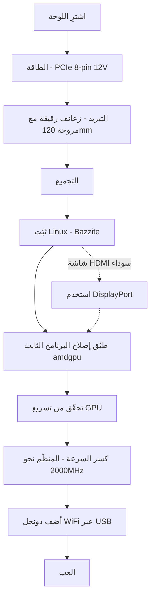

> 🌐 ترجمة مجتمعية. النسخة الإنجليزية هي المرجع الأساسي وقد تكون أحدث. وجدت خطأ؟ افتح issue: [English](../en/00-start-here.md) · https://github.com/lildebil0/awesome-bc250/issues

# ابدأ من هنا — من الصفر إلى الألعاب

> **باختصار** — لقد اشتريت (أو أنت على وشك شراء) لوحة AMD BC-250. إنها لوحة APU مشتقة من PlayStation 5 بذاكرة 16 GB GDDR6 تصنع صندوقًا رخيصًا لألعاب Linux والذكاء الاصطناعي — **إنْ** حللت ثلاثة أمور بالترتيب: **الطاقة**، و**التبريد**، و**تعريفات Linux**. هذه الصفحة هي الخط المستقيم من لوحة داخل علبة إلى لعبة تعمل. اتبع الخطوات؛ يربط كلٌّ منها بفصل كامل.

هذه اللوحة مشروع، لا حاسوب جاهزًا للتشغيل الفوري. خصِّص لها عطلة نهاية أسبوع. الطريقتان اللتان يُتلِف بهما الناس لوحاتهم مبكرًا هما **توصيل الطاقة الخاطئ** و**تشغيلها وهي ساخنة** — لذا نبدأ بهذين أولًا.

---

## قبل أن تبدأ — القطع والأدوات

اجعل هذه في متناول يدك *قبل* أن تشرع، حتى لا تكتشف كلًّا منها في منتصف التجميع:

- **مصدر طاقة (PSU)** بخرج PCIe 8-pin بجهد 12 V ← **[03 — مصدر الطاقة](../en/03-power-supply.md)**
- **مروحة 120 mm عالية الضغط الساكن** + غطاء مطبوع ← **[04 — التبريد](../en/04-cooling.md)** / **[05 — العلب والطباعة ثلاثية الأبعاد](../en/05-case.md)**
- **علبة أو حامل مطبوع** ← **[05 — العلب والطباعة ثلاثية الأبعاد](../en/05-case.md)**
- **ذاكرة USB سعتها ≥ 16 GB** لمثبِّت Linux
- **كابل DisplayPort** (أو محوّل DP→HDMI — غالبًا لا يُظهر منفذ HDMI في اللوحة شيئًا، وDisplayPort هو الأكثر أمانًا)
- **مفك براغي**
- **مقياس متعدد (multimeter)** — لاختبار توصيل مصدر الطاقة بالمغناطيس/الاستمرارية ← **[03 — مصدر الطاقة](../en/03-power-supply.md)**

---

## المسار



### 0. اعرف ما لديك
لوحة BC-250 هي شفرة خادم/تعدين: معالج APU واحد (وحدة معالجة مركزية Zen 2 + وحدة معالجة رسومية من فئة RDNA2، باسم "Cyan Skillfish/Oberon")، وذاكرة 16 GB GDDR6، و**مشتت حراري سلبي**، تُغذَّى عبر منفذ **12 V PCIe 8-pin** واحد. لا WiFi مدمج، ولا تعريف GPU عامل لـ Windows، ولا ترميز فيديو عتادي. ← **[01 — ما هي BC-250](../en/01-what-is-bc250.md)**

### 1. اشترِ الشيء الصحيح
اعرف ما هو السعر العادل، وما الموجود في العلبة (اللوحة فقط؟ مشتت حراري؟ مصدر طاقة؟)، وأي بائعين/عمليات احتيال ينبغي تجنّبها. ← **[02 — دليل الشراء](../en/02-buying.md)**

### 2. رتِّب أمر الطاقة *قبل أول إقلاع*
تطلب اللوحة نحو ~235 W (أكثر عند كسر السرعة) عند 12 V عبر PCIe 8-pin. استخدم مصدر طاقة حقيقيًا (Flex خادم / صندوق Mean Well / ATX)، ووصّل منفذ 8-pin بشكل صحيح بـ**سلك نحاسي أصلي بمقطع مناسب**، ولا تخمّن توزيع الأطراف — الخطأ هنا يعني لوحة ميتة. ← **[03 — مصدر الطاقة](../en/03-power-supply.md)**

### 3. أصلِح التبريد *قبل أن تُجهِدها*
المشتت الحراري الأصلي مصمَّم لنفق رياح في خزانة خوادم و**يخنق الأداء على المكتب**. رقِّق الزعانف وثبّت مروحة 120 mm عالية الضغط الساكن عبر غطاء مطبوع (أو انتقل إلى تبريد AIO). الهدف: البقاء تحت ~80 °C في Furmark. ← **[04 — التبريد](../en/04-cooling.md)**

### 4. ضعها في علبة (اختياري لكنه لطيف)
اطبع علبة على طراز أجهزة الألعاب تثبّت اللوحة والمروحة ومصدر الطاقة مع تدفق هواء حقيقي. كتالوج من ملفات STL المجتمعية. ← **[05 — العلب والطباعة ثلاثية الأبعاد](../en/05-case.md)**

### 5. جمّعها
الترتيب المادي للعمليات لتجميع بسيط: ثبّت المروحة على الغطاء المطبوع ← ثبّت الغطاء بالمشابك/البراغي فوق زعانف المشتت الحراري (المرقَّقة) ← ضع اللوحة في العلبة/الحامل ← وصّل منفذ 8-pin من مصدر الطاقة إلى اللوحة (بتوزيع أطراف صحيح، **[03 — مصدر الطاقة](../en/03-power-supply.md)**) ← وصّل كابل DisplayPort بالشاشة ← شغّلها وتأكّد أنها **تجتاز POST** (POST = اختبار التشغيل الذاتي؛ تُقلع وتُخرج فيديو — تحصل على صورة / تدور المروحة). نفّذ أي سنفرة للزعانف *قبل* التثبيت (راجع **[04 — التبريد](../en/04-cooling.md)**) وأبعِد غبار المعدن عن اللوحة.

> صورة/مخطط موسوم لهذا التجميع مساهمة مُرحَّب بها — المستودع لا يملك واحدًا بعد.

### 6. ثبّت Linux + تعريفات GPU
هذه هي الخطوة الفاصلة. الأسهل للمبتدئين: **صورة قائمة على Bazzite** مبنية لـ BC-250 (أو **Fedora 43** — اختيار elektricM الآخر الذي "يعمل ببساطة"؛ Fedora 42 انتهى دعمها). ثم طبّق **إصلاح البرنامج الثابت amdgpu** (الرابط الرمزي `navi10_gpu_info.bin`) ومعاملات النواة، وأعد توليد initramfs/grub، وتحقّق من أن GPU مُسرَّع (`vainfo`، `dmesg`). ← **[06 — تعريفات Linux والإعداد](../en/06-linux.md)**

> **إعدادان يسبّبان ساعات من المعاناة إن أهملتهما** (elektricM): على BIOS المعدّل اضبط **VRAM = 512 MB ديناميكي** و**عطّل IOMMU** (IOMMU المعطوب يسبّب إخفاقات في العرض وانهيارات)، ثم **امسح CMOS** بعد التحديث. ثبّت مع معامل الإقلاع `nomodeset` و**أزِله بمجرد دخول التعريفات**. الحد الأدنى لـ Mesa هو **25.1+** (يُوصى بـ 25.3.x). و**تجنّب النوى 6.15.0–6.15.6 و6.17.8–6.17.10** — فهي تكسر تعريف GPU؛ استخدم بدلًا منها 6.18 LTS / 6.17.11+ / 6.12–6.14 LTS. ([بداية سريعة من elektricM](https://elektricm.github.io/amd-bc250-docs/getting-started/quick-start/)، [مرجع سريع](https://elektricm.github.io/amd-bc250-docs/reference/quick-reference/))

> تفكّر في Windows؟ حتى أوائل 2026 **لا يوجد تعريف GPU عامل لـ Windows** — إنه تجريبي. استخدم Linux. ← **[07 — Windows](../en/07-windows.md)**

### 7. تحقّق من أنها تعمل بالإعداد القياسي، ثم اكسر السرعة
بمجرد أن يصبح سطح المكتب مُسرَّعًا، ثبّت **oberon-governor** وارفع الترددات (1500 MHz القياسي ضعيف؛ **2000 MHz ≈ +30 % إطارات في الثانية**). اختياريًا افتح كل وحدات الحوسبة الأربعين **40 CUs** واخفض الجهد. أعِد اختبار الحرارة عند الترددات الجديدة. ← **[09 — كسر السرعة وخفض الجهد](../en/09-overclock-undervolt.md)**

### 8. اتّصل بالإنترنت
لا WiFi مدمج — أضِف **دونجل USB معروف الجودة** (aic8800d80 هو المفضّل لدى المجتمع) وتعريفه. ← **[10 — WiFi وBluetooth](../en/10-wifi-bt.md)**

### 9. العب
ضع توقعات واقعية (معالج Zen 2 غالبًا هو الحد، لا GPU)، فعّل FSR، واستخدم إعدادات المجتمع لكل لعبة. ← **[11 — نتائج الألعاب والإعدادات](../en/11-gaming.md)**

### إضافة — شغّل نماذج LLM محلية
16 GB من VRAM كثيرة مقابل السعر. شغّل llama.cpp على واجهة **Vulkan** الخلفية (ROCm طريق مسدود على هذه GPU). ← **[12 — الذكاء الاصطناعي / LLM](../en/12-ai-llm.md)**

### إضافة — المحاكاة
Switch وPS3 وPS4 والألعاب الكلاسيكية والأركيد — ما الذي يعمل فعلًا، وكيف ← **[15 — المحاكاة](../en/15-emulation.md)**

> لا صورة عند أول إقلاع؟ تُخرج اللوحة عبر **DisplayPort** (غالبًا ما يكون HDMI أسود) ← **[14 — العرض والإخراج](../en/14-display.md)**. نفدت منافذ USB، أو تضيف قرصًا؟ ← **[16 — USB والموزِّعات والتخزين](../en/16-usb-peripherals.md)**

---

## إذا تعطّل شيء
شاشة سوداء، أو لا تسريع، أو إعادة ضبط عشوائية، أو انقطاع الدونجل، أو لوحة معطوبة بعد تحديث BIOS — راجع **[استكشاف الأخطاء](troubleshooting.md)** و**[الأسئلة الشائعة](faq.md)**.

> تحديث BIOS معدّل **ليس** خطوة بداية. قد يُعطِب اللوحة ويحتاج عتاد استعادة. لا تذهب إلى هناك إلا بقصد. ← **[08 — BIOS واستعادة اللوحة المعطوبة](../en/08-bios.md)**

---

## قائمة التحقق في 60 ثانية

| الخطوة | تمّت عندما |
|------|-----------|
| الطاقة | مصدر الطاقة موصول بمنفذ 8-pin، توزيع أطراف صحيح، سلك نحاسي أصلي، اللوحة تجتاز POST |
| التبريد | الزعانف مُرقَّقة + مروحة/غطاء 120 mm؛ أقل من 80 °C في Furmark |
| نظام التشغيل | Bazzite-bc250 مثبّت، يُقلع إلى سطح المكتب |
| GPU | `vainfo`/`dmesg` يُظهران amdgpu نشطًا، لا الرجوع إلى المعالج |
| كسر السرعة | oberon-governor يعمل، نحو ~2000 MHz، مستقر في لعبة حقيقية |
| الشبكة | دونجل USB يتصل ويبقى متصلًا |
| اللعبة | تعمل بمعدل الإطارات المتوقَّع لتردداتك |

عندما يُؤشَّر كل صف، تكون قد انتهيت. أهلًا بك في نادي BC-250.

---

## مرجع سريع (ورقة غش)

الأوامر والإعدادات التي ستحتاجها أكثر من غيرها، مكثَّفة من [المرجع السريع](https://elektricm.github.io/amd-bc250-docs/reference/quick-reference/) لـ elektricM. التفاصيل الكاملة في **[06 — Linux](../en/06-linux.md)** و**[09 — كسر السرعة](../en/09-overclock-undervolt.md)**.

**BIOS:** VRAM `512MB` ديناميكي · IOMMU **معطّل** · إقلاع UEFI · امسح CMOS بعد كل تحديث USB.

**تحقّق من أن GPU مُسرَّع (وليس llvmpipe/CPU):**
```bash
glxinfo | grep "OpenGL version"          # Mesa 25.1+ expected
vulkaninfo | grep deviceName             # → AMD Radeon Graphics (RADV GFX1013)
cat /sys/class/drm/card0/device/pp_dpm_sclk   # multiple freqs, current marked *
```

**المنظِّم** (تثبت الترددات عند 1500 MHz دونه). نسختنا تستخدم `oberon-governor` افتراضيًا؛ يوفّر elektricM نسخة SMU الأحدث عبر COPR — وكلاهما يعمل:
```bash
sudo dnf copr enable filippor/bazzite
sudo dnf install cyan-skillfish-governor-smu          # rpm-ostree install … on Bazzite
sudo systemctl enable --now cyan-skillfish-governor-smu.service
systemctl status cyan-skillfish-governor-smu          # → active (running)
```
> الحد الأدنى للجهد **700 mV** — تحته تُقفَل GPU عند 1500 MHz. قد يستهدف المنظِّم البطاقة الخاطئة (card0 مقابل card1) — تحقّق إن لم يبدأ التحجيم.

**أزِل `nomodeset` بعد دخول التعريفات:**
```bash
# GRUB distros: drop "nomodeset" from /etc/default/grub, then
sudo grub2-mkconfig -o /boot/grub2/grub.cfg && sudo reboot
# Bazzite / Fedora Atomic:
rpm-ostree kargs --delete-if-present="nomodeset" && systemctl reboot
```

**خيار تشغيل Steam** الذي يُصلح الأعطال الرسومية في بعض الألعاب: `RADV_DEBUG=nohiz %command%`.

**انهيار في RDR2 / Company of Heroes 3؟** بدّل VRAM من `512MB` ديناميكي إلى **10GB/6GB ثابت** (تعارض ZRAM). ([المرجع السريع من elektricM](https://elektricm.github.io/amd-bc250-docs/reference/quick-reference/))
