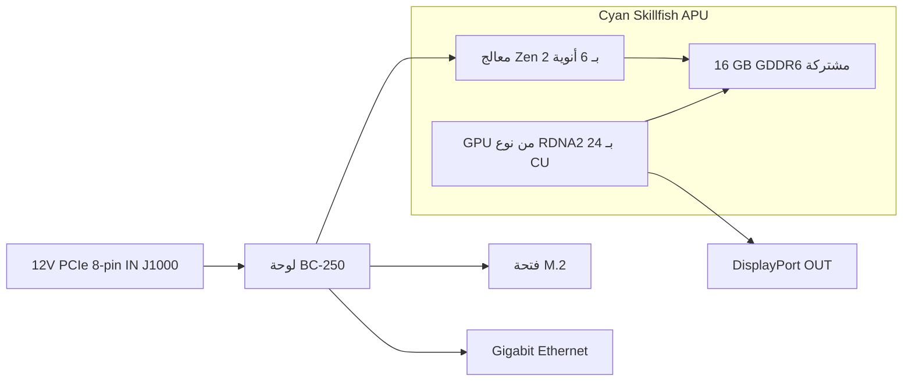

> 🌐 ترجمة مجتمعية. النسخة الإنجليزية هي المرجع الأساسي وقد تكون أحدث. وجدت خطأ؟ افتح issue: [English](../en/01-what-is-bc250.md) · https://github.com/lildebil0/awesome-bc250/issues

# ما هو الـ BC-250

> **باختصار** — الـ BC-250 هو **APU بمستوى PlayStation 5 على لوحة سيرفر/تعدين**. شريحة واحدة (الاسم الرمزي لدى AMD **Cyan Skillfish**، نسخة مخفّضة من سيليكون **Oberon/Ariel** الخاص بالـ PS5) تحمل **معالج Zen 2 بـ 6 أنوية / 12 خيطًا** و**وحدة معالجة رسومية RDNA 2 بـ 24 وحدة حوسبة**، تتغذى من **16 GB من GDDR6 الملحومة**. هي **ليست بطاقة رسومية وليست حاسوبًا عاديًا** — ليس لها **BIOS من نوع x86 الذي تعرفه، ولا فتحة PCIe، ولا موصل ATX بـ 24-pin**: تأخذ **12 V مباشرة إلى موصل طاقة PCIe بـ 8-pin** وتُقلع البرنامج الثابت الخاص بها. يشتريها الناس لأنها **صندوق ألعاب لينكس / ذكاء اصطناعي محلي رخيص جدًا**. ويغضب منها الناس لأن **التعريفات والتبريد وغياب ترميز الفيديو العتادي** تجعلها مشروعًا، لا جهازًا يعمل بمجرد التوصيل. إذا أردت صفر متاعب، فهذه اللوحة شراء خاطئ — أرجعها الآن. إذا كنت تحب العبث والتجربة، تابع القراءة.

هذه الصفحة هي مرجع "ماذا اشتريت فعلًا". الطاقة والتبريد وتثبيت نظام التشغيل والتعريفات يحصل كل منها على قسمه الخاص ([03](03-power-supply.md) / [04](04-cooling.md) / [06](06-linux.md)).

---

## ما هي فعلًا

صمّمت AMD الـ BC-250 كـ **مسرّع تعدين عملات مشفّرة** (الحرفان "BC" يرمزان إلى blockchain). ولجعلها رخيصة، أعادت AMD استخدام **سيليكون معالج PlayStation 5 الفائض** — نفس عائلة الشريحة التي تضعها Sony في الكونسول. اللوحة هي APU واحد مع ذاكرته ودوائر طاقته؛ هذا هو المنتج بأكمله.

المصطلحات، مُعرَّفة مرة واحدة:

- **APU** (Accelerated Processing Unit) — اسم AMD لشريحة واحدة تحتوي على **المعالج ووحدة المعالجة الرسومية معًا**. لا توجد بطاقة رسومية منفصلة؛ فالـ GPU داخل نفس الحزمة، يتشارك نفس الذاكرة.
- **Cyan Skillfish** — **الاسم الرمزي** الهندسي لدى AMD لهذا الـ APU. ستراه في كل مكان في لينكس: ملف البرنامج الثابت للـ GPU اسمه حرفيًا `cyan_skillfish_gpu_info.bin` ([src](https://t.me/c/2424231195/57962) — انظر إصلاح الـ symlink في [src](https://t.me/c/2424231195/41252)). قد تُبلغ الأدوات عنه أيضًا تحت أسماء قالب الـ PS5 **Oberon** / **Ariel**.
- **GDDR6** — ذاكرة الرسوميات السريعة الموجودة عادةً على بطاقة الفيديو. على الـ BC-250 هي **ذاكرة النظام وذاكرة الفيديو في آنٍ واحد** (يتشارك المعالج والـ GPU مجمّعًا واحدًا). لا توجد فتحات DIMM؛ الـ 16 GB ملحومة وغير قابلة للترقية.
- **RDNA 2** — جيل معمارية الـ GPU (نفس عائلة الـ PS5 وXbox Series وبطاقات Radeon RX 6000).

الشريحة جزء **مخفّض** من الـ PS5، لا الكامل. ثبّت المجتمع هذه المقارنة ([src](https://t.me/c/2424231195/11282)، استنادًا إلى [مدخل Oberon لدى TechPowerUp](https://www.techpowerup.com/gpu-specs/amd-oberon.g936)):

| | BC-250 | الـ PS5 الكامل (Oberon) |
|---|---|---|
| أنوية / خيوط المعالج | **6 / 12** | 8 / 16 |
| وحدات حوسبة الـ GPU (CU) | **24** | 36 |

"وحدة الحوسبة" هي كتلة نواة GPU واحدة؛ و24 منها تقع تقريبًا في نطاق GPU اللابتوب المتوسط، وهو بالضبط شريحة الأداء التي تُبلغ عنها الدردشة في الألعاب.

الـ BC-250 ليس "سيليكون الكونسول الفائض على لوحة سطح مكتب" الوحيد لدى AMD. لها ابنا عمّ قريبان مبنيّان على نفس الفكرة: **AMD 4700S Desktop Kit** (طقم معالج مشتق من **PlayStation 5**) — والذي تحذّر الدردشة من أنه يُدرَج بالتبادل مع الـ BC-250 على المتاجر ([02-buying.md](02-buying.md)) — و**AMD 4800S Desktop Kit**، النسخة المشتقة من **Xbox Series X** (8 أنوية Zen 2 موصولة بـ GDDR6، مع تعطيل GPU من نوع RDNA 2 الخاص بالكونسول). كلاهما منتجان حقيقيان من AMD يقرنان، مثل الـ BC-250، معالج كونسول مُنقَذًا مع GDDR6 ملحومة ([VideoCardz](https://videocardz.com/newz/amd-4800s-desktop-kit-a-pc-repurposed-apu-from-xbox-series-x-has-been-tested)). وهما سياق مفيد لتمييز الـ BC-250 عن أشقائه عند التسوّق.

شغّل الناس **لينكس سطح المكتب على الـ BC-250 بنفس الطريقة التي كُسر بها قيد الـ PS5 نفسه** — فيديو 4K HDMI كامل + صوت، وجميع منافذ USB تعمل، والـ APU يصل تردده إلى ~3.2 GHz على المعالج و~2.0 GHz على الـ GPU ([src](https://t.me/c/2424231195/122260)).

---

## فيمَ هي جيدة

- **أرخص طريقة للدخول إلى ألعاب لينكس عند هذه الفئة من الأداء.** عبر Steam/Proton (طبقة توافق تشغّل ألعاب Windows على لينكس) يلعب الناس Star Citizen ([src](https://t.me/c/2424231195/38702))، وحتى عناوين حديثة مثل *Doom: The Dark Ages* عبر غلاف Vulkan مجتمعي بـ ~60 FPS على إعدادات منخفضة/FSR ([src](https://t.me/c/2424231195/127696)). نتائج كل لعبة على حدة في [11-gaming.md](11-gaming.md).
- **صندوق ذكاء اصطناعي محلي قادر.** بـ 16 GB من GDDR6 يمكنه احتواء نماذج لغوية متوسطة الحجم. يشغّل الأعضاء نماذج LLM محليًا عبر `llama.cpp`/`jan` على خلفية **Vulkan**؛ تضبط الـ BIOS لتخصيص 12 GB للـ GPU أولًا ([src](https://t.me/c/2424231195/92421)). انظر [12-ai-llm.md](12-ai-llm.md).
- **صغيرة ومكتفية بذاتها.** هي لوحة طويلة واحدة بمشتت حراري من طراز الـ GPU مبني فيها — تدخل في صناديق DIY/مطبوعة ثلاثية الأبعاد صغيرة وتعمل بمصدر طاقة صغير واحد ([build src](https://t.me/c/2424231195/137825)).

إجماع المجتمع على *لماذا* تعمل أصلًا: لأن الشريحة قريبة جدًا من عتاد Steam Deck / PS5، تواصل Valve وحزمة الرسوميات مفتوحة المصدر Mesa تحسين نفس التعريفات بالضبط، فيركب الـ BC-250 معها مجانًا ([src](https://t.me/c/2424231195/93006)).

---

## ما هو مؤلم (اضبط توقعاتك)

هذا هو النصف الذي يستهين به القادمون الجدد. لا شيء منه عائق نهائي، لكنه كله عمل حقيقي.

- **التعريفات مهمة افعلها-بنفسك.** لا تشحن AMD **أي تعريف رسمي ولا أي توثيق عام** لهذه اللوحة ([src](https://t.me/c/2424231195/37764)). كل شيء — حزمة رسوميات لينكس، و"محافظ" التردد/الجهد، والـ BIOS — مبنيٌّ من قِبل المجتمع. توقّع اتّباع سكربتات الإعداد وإصلاح أشياء يدويًا أحيانًا. ابدأ من [06-linux.md](06-linux.md).
- **التبريد هو الشيء رقم 1 الذي يخطئ فيه الناس.** صُمّم المشتت الحراري الأصلي لنفق هواء قسري في رف تعدين، لذا على المكتب يسخن بإفراط ويخنق الأداء بمجرد إخراجه من الصندوق. ستحتاج إلى تعديل التبريد. لهذا قسمه الخاص — اقرأ [04-cooling.md](04-cooling.md) **قبل** السعي وراء الأداء.
- **لا مرمّز فيديو عتادي.** كتلة ترميز الفيديو في الـ GPU (ما تسميه AMD **VCN** — الدائرة المخصصة التي تضغط الفيديو للبث/التسجيل) **غير متاحة**. تسجيل الشاشة وبث الألعاب يرتدّان إلى **مرمّز برمجي**، وهو ما يكلّف المعالج. يعمل (يبثّ الناس عبر Sunshine/Moonlight) لكنه أبطأ وأقل جودة من GPU عادي ([src](https://t.me/c/2424231195/88026)). وبالمثل، كان تعريف Mesa المبكر شهيرًا بكونه **تصييرًا برمجيًا** إلى أن جعل المجتمع التسريع العتادي يعمل ([src](https://t.me/c/2424231195/11243)).
- **طاقة غريبة ولا عرض افتراضيًا.** لا تأخذ موصل ATX قياسيًا بـ 24-pin — انظر القسم التالي. كثير من اللوحات تصل أيضًا بحاجة إلى **إعادة ضبط BIOS** قبل أن تجتاز الـ POST أصلًا ([src](https://t.me/c/2424231195/57930))، وعادةً تُخرج الصورة عبر **DisplayPort** (يحتاج HDMI إلى محوّل DP→HDMI، وهو يحمل الصوت أيضًا بلا مشكلة — [src](https://t.me/c/2424231195/9148)).
- **هي لوحة للعابثين، نقطة.** كما عبّر عضو قديم: رغم رخصها، فإن الـ BC-250 "تتطلّب مهارات معيّنة وجهدًا وعقلًا" ([src](https://t.me/c/2424231195/73002)). خصّص وقتًا، لا مالًا فقط.
- ⚠ **الـ eGPU لن ينقذها — وفق تقارير المجتمع (r/BC250Gaming).** فتحة الـ M.2 الوحيدة هي فقط **PCIe 2.0 ×2** (انظر بطاقة العتاد أدناه)، وعند هذا النطاق يُبلَّغ عن أن GPU خارجيًا معلّقًا على الـ M.2 **يؤدي *أسوأ* من وحدة المعالجة الرسومية RDNA 2 المدمجة** — يخنقه الرابط البطيء. إذا أردت قوة رسومية أكبر، فالإجماع أن هذه ليست اللوحة المناسبة لذلك. *(ما أبلغ به المجتمع؛ تعامل معه كتحذير، لا كقياس أداء.)*

> ⚠ **ماذا يعني الـ LED ثنائي اللون — وفق تقارير المجتمع (r/BC250Gaming).** الـ LED ثنائي اللون بجوار الـ NIC هو **مؤشّر استغلال من حقبة التعدين، لا ضوء خطأ**: وفق روايات المجتمع **الأحمر = الـ GPU/RAM *ليس* عند استغلال 100 %، الأخضر = استغلال كامل**. إذن الضوء الأحمر على لوحة سطح مكتب خاملة أمر طبيعي، لا عطل. *(ما أبلغ به المجتمع؛ لا تشحن AMD أي توثيق لهذه اللوحة، لذا تعامل مع خريطة الألوان الدقيقة كغير مؤكدة.)*

> ⚠ **تحذير تعامُل، تُعلِّم بالطريقة الصعبة.** **لا** تدع أي شيء معدني يلمس اللوحة المُشغَّلة بالطاقة، ولا تستبدل المعجون الحراري إلا بحذر — قتل عضو لوحة الـ BC-250 خاصته نهائيًا بإحداث قصر فيها ([src](https://t.me/c/2424231195/95998)). تصل اللوحات أيضًا **منحنية** قليلًا من تثبيت المشتت الحراري؛ أصلح أحد الأعضاء عدم إقلاع بتسطيح اللوحة مستويةً مقابل المشتت الحراري باستخدام ورق ([src](https://t.me/c/2424231195/117347)).

---

## بطاقة المرجع العتادي

تُدقَّق المواصفات تقاطعيًا مقابل الهندسة العكسية للعتاد من قِبل المجتمع (لا تنشر AMD أي ورقة بيانات). أرقام ناقل الذاكرة والأبعاد الفيزيائية، التي كانت غير مؤكدة سابقًا، مصدرها الآن [مواصفات العتاد لدى elektricM](https://github.com/elektricm/elektricm) (التي تنسب الهندسة العكسية إلى mothenjoyer69 / Segfault / neggles / yeyus). مخطط الأطراف وأرقام الطاقة أدناه تأتي من وثيقة العتاد المجتمعية المعتمدة.

اللوحة بلمحة — دخل الطاقة على اليسار، الـ APU وذاكرته المشتركة في الوسط، الإدخال/الإخراج على اليمين:



### المواصفات الأساسية

| المواصفة | القيمة | المصدر |
|------|-------|--------|
| الفئة | APU مشتق من PlayStation 5 على لوحة تعدين/سيرفر | [hardware.md](https://github.com/mothenjoyer69/bc250-documentation/blob/main/hardware.md) |
| الاسم الرمزي للـ APU | **Cyan Skillfish** (قالب الـ PS5: Oberon / Ariel) | الدردشة ([src](https://t.me/c/2424231195/57962)) |
| المعالج | **6 أنوية / 12 خيطًا، Zen 2** (6 أنوية مؤكدة) | [hardware.md](https://github.com/mothenjoyer69/bc250-documentation) · الدردشة ([src](https://t.me/c/2424231195/11282)) |
| تردد المعالج | حتى **~3.49 GHz** ("تقريبًا") | [hardware.md](https://github.com/mothenjoyer69/bc250-documentation) · الدردشة ([src](https://t.me/c/2424231195/122260)) |
| الـ GPU | **24 وحدة حوسبة، RDNA 2** (`gfx1013`؛ الـ SoC في الـ PS5 لديه 36)؛ التنقيط ≈ **بين RX 6600 وRX 6600 XT** / فئة GTX 1660 Ti؛ **Vulkan 1.4** | [hardware.md](https://github.com/mothenjoyer69/bc250-documentation) · الدردشة ([src](https://t.me/c/2424231195/11282)) · [elektricM](https://github.com/elektricm/elektricm) |
| تردد الـ GPU | ~1500 MHz افتراضيًا، ~2000 MHz بعد كسر السرعة (≈2.23 GHz كحد أقصى) | ([src](https://t.me/c/2424231195/122260)) · [09](09-overclock-undervolt.md) |
| الذاكرة | **16 GB GDDR6**، مشتركة بين المعالج والـ GPU، ملحومة (غير قابلة للترقية) | [hardware.md](https://github.com/mothenjoyer69/bc250-documentation) · [README](../../README.md) |
| تخصيص VRAM للـ GPU | يُضبط في الـ BIOS؛ **12 GB** قابلة للاختيار على BIOS 3.00+ | ([src](https://t.me/c/2424231195/92421)) |
| ناقل / عرض حزمة الذاكرة | **256-bit** GDDR6 @ **14 Gbps**، **~448 GB/s** | [مواصفات العتاد لدى elektricM](https://github.com/elektricm/elektricm) |
| TDP | **220 W** (قدرة التصميم الحراري للوحة) | [hardware.md](https://github.com/mothenjoyer69/bc250-documentation) |
| سحب الطاقة | ~67–85 W نموذجيًا تحت حمل من فئة التعدين | [hashrate.no](https://www.hashrate.no/gpus/bc250) |
| ترميز الفيديو العتادي (VCN) | **لا شيء** — ترميز برمجي فقط | ([src](https://t.me/c/2424231195/88026)) |
| خرج الفيديو | **DisplayPort 1.4** (حتى **4K@120 / 8K@60**)؛ استخدم محوّل DP→HDMI من أجل HDMI؛ يحمل الصوت | ([src](https://t.me/c/2424231195/9148)) · [elektricM](https://github.com/elektricm/elektricm) |
| التخزين (M.2) | فتحة M.2 2280 واحدة — **PCIe 2.0 x2 أو SATA III** | [elektricM](https://github.com/elektricm/elektricm) |
| منفذ DisplayPort الثاني | موجود لكن **غير مأهول**؛ يمكن تفعيله برمجيًا | ([src](https://t.me/c/2424231195/88026)) |
| الحجم الفيزيائي | بطول **340 mm / 310 mm** (حسب طريقة القياس)، بعرض **~115 mm**، **~400 g** مع المشتت الحراري؛ شكل تعدين مخصص غير قياسي | [مواصفات العتاد لدى elektricM](https://github.com/elektricm/elektricm) |

> ⚠ **كسر سرعة GDDR6 = عرض حزمة، لا FPS — وفق تقارير المجتمع (r/BC250Gaming).** وفق روايات المجتمع، يرفع كسر سرعة الـ GDDR6 عرض حزمة الذاكرة من نحو **~256 GB/s إلى ~445 GB/s** ومع ذلك لا يقدّم **أي مكسب في الألعاب** — فالـ 24 وحدة حوسبة في الـ GPU، لا عرض حزمة الذاكرة، هي عنق الزجاجة، فيذهب العرض الإضافي بلا استخدام في الألعاب. (لاحظ أن الرقم *الافتراضي* المؤكد في المستودع أعلاه هو بالفعل **~448 GB/s** عند 256-bit / 14 Gbps، فإن "خط الأساس ~256 GB/s" لدى المجتمع لا يطابق ورقة المواصفات — تعامل مع أرقام الـ GB/s الدقيقة كغير مؤكدة؛ الخلاصة بأنك لا تكسب FPS هي الجزء الراسخ.) لكسر سرعة الـ GPU/الذاكرة عمومًا انظر [09-overclock-undervolt.md](09-overclock-undervolt.md).

> **عن أبعاد اللوحة:** تعطي [مواصفات العتاد لدى elektricM](https://github.com/elektricm/elektricm) طولًا قدره **340 mm / 310 mm** (الرقمان يعكسان طرق قياس مختلفة)، وعرضًا قدره **~115 mm** و**~400 g** مع المشتت الحراري، على شكل تعدين مخصص غير قياسي. ووثيقة `hardware.md` المعتمدة نفسها لا تسرد الأبعاد؛ ومنشور العتاد الأكثر تفاعلًا في الدردشة عنوانه حرفيًا *"Размеры amd bc-250"* ("أبعاد الـ AMD BC-250"، ❤20 — [src](https://t.me/c/2424231195/379))، ما يؤكد أن الناس يهتمون بهذا لبناء الصناديق. للملاءمة الدقيقة للصندوق، انطلق من نموذج ثلاثي الأبعاد مقيس — ملفات STL للوحة المفهرسة من قِبل المجتمع (مثل `BC250 Board.stl`، [Printables 1103626](https://www.printables.com/model/1103626-amd-bc250-board) والنموذج الدقيق في [Printables 1341336](https://www.printables.com/model/1341336-accurate-3d-model-of-the-amd-bc-250-board)) صحيحة الأبعاد. انظر [05-case.md](05-case.md).

<p align="center">
  <br>
  <sub>صورة: مجتمع AMD BC-250 · <a href="https://t.me/c/2424231195/379">المصدر</a></sub>
</p>

### مخطط أطراف موصل الطاقة (اقرأ هذا قبل توصيل أي شيء)

الـ BC-250 ليس لها **رأس ATX بـ 24-pin**. تُغذّى بـ **12 V فقط**، تُسلَّم عبر **موصل طاقة PCIe بـ 8-pin (J1000)** — نفس المقبس الفيزيائي لمقبس البطاقة الرسومية، لكن اللوحة تتوقّع تغذية جميع أطراف الطاقة الثلاثة من 12 V. التوصيل الكامل واختيار مصدر الطاقة في [03-power-supply.md](03-power-supply.md)؛ مخطط الأطراف المعتمد من [hardware.md](https://github.com/mothenjoyer69/bc250-documentation/blob/main/hardware.md):

**J1000 — طاقة PCIe الرئيسية بـ 8-pin (هذا هو الذي توصّله):**

```
[ GND  GND  GND  GND ]
[ GND  12V  12V  12V ]
```

- ثلاثة أطراف 12 V؛ تقدّر الوثيقة أطراف Mini-Fit Jr بـ **حتى 9 A لكل طرف**، لذا "يمكن لهذا الموصل أن يزوّد حتى **324 W** بأمان"، وتوصي بسلك **16 AWG** للاستخدام المستقل ([hardware.md](https://github.com/mothenjoyer69/bc250-documentation)).
- **GND = الأرضي (0 V)، 12V = +12 فولت.** اضبط القطبية بشكل صحيح — هذه اللوحة لا تتسامح مع عكس الجهد.

**J2000 / J2001 — موصّلات طاقة الرف (لا تُستخدم عادةً على المكتب):**

```
        J2000                  J2001
 [ LED1  12V  12V  12V ]   [ 12V  12V  12V  PGD ]
 [ LED2  GND  GND  GND ]   [ GND  GND  GND  GND ]
```

- هذه موصّلات **Molex Micro-Fit BMI** ([الجزء 444280801](https://www.molex.com/en-us/products/part-detail/444280801))، *لا* مقابس PCIe/EPS — كانت تغذّي اللوحة داخل هيكل التعدين الأصلي. **J2000 وJ2001 ليسا متطابقين:** كما يبيّن مخطط الأطراف أعلاه، يحمل J2000 طرفَي **LED1/LED2** بينما يحمل J2001 طرف **PGD**، فالموصّلان يختلفان ([وثائق العتاد لدى elektricM / mothenjoyer69](https://github.com/mothenjoyer69/bc250-documentation)).
- **PGD** (على J2001) هو طرف power-good/استشعار: يرى **5 V عندما تكون اللوحة مركّبة في الـ PSU2 الخاص بالرف**. في بناء مستقل تُغذّي عادةً عبر J1000 بدلًا من ذلك ويمكنك تجاهل J2000/J2001 — لكن تأكّد من ذلك مقابل [03-power-supply.md](03-power-supply.md) لمحوّل مصدر الطاقة الخاص بك تحديدًا.

---

## إلى أين تذهب بعد ذلك

1. **[02-buying.md](02-buying.md)** — إذا لم تشترِ بعد، أو أردت معرفة السعر العادل والمخاطر الحقيقية.
2. **[03-power-supply.md](03-power-supply.md)** — كيف تُغذّيها فعلًا (12 V إلى الـ 8-pin).
3. **[04-cooling.md](04-cooling.md)** — افعل هذا **قبل** أي شيء آخر بمجرد وصول اللوحة إلى يدك.
4. **[06-linux.md](06-linux.md)** — احصل على نظام تشغيل وتعريفات المجتمع عليه.

---

## المصادر

- وثيقة العتاد ومخطط الأطراف المعتمدان — [mothenjoyer69/bc250-documentation `hardware.md`](https://github.com/mothenjoyer69/bc250-documentation/blob/main/hardware.md)
- ناقل/عرض حزمة الذاكرة، الأبعاد الفيزيائية، تموضع الـ GPU، DP 1.4، M.2 — [مواصفات العتاد لدى elektricM](https://github.com/elektricm/elektricm) (تنسب الهندسة العكسية إلى mothenjoyer69 / Segfault / neggles / yeyus)
- سيليكون الـ PS5 المخفّض مقابل الكامل (6/12 + 24 CU مقابل 8/16 + 36 CU) — https://t.me/c/2424231195/11282 · [TechPowerUp Oberon](https://www.techpowerup.com/gpu-specs/amd-oberon.g936)
- لينكس على عتاد الـ PS5، 4K HDMI، الترددات — https://t.me/c/2424231195/122260
- لا تعريف رسمي / لا توثيق — https://t.me/c/2424231195/37764
- التصيير البرمجي / لا ترميز عتادي — https://t.me/c/2424231195/11243 · https://t.me/c/2424231195/88026
- DisplayPort + صوت DP→HDMI — https://t.me/c/2424231195/9148
- اسم البرنامج الثابت Cyan Skillfish — https://t.me/c/2424231195/57962 · https://t.me/c/2424231195/41252
- LLM محلي + 12 GB VRAM عبر BIOS 3.00 — https://t.me/c/2424231195/92421
- "تتطلّب مهارات وجهدًا وعقلًا" — https://t.me/c/2424231195/73002
- تحذير التعامُل/القصر الكهربائي — https://t.me/c/2424231195/95998 · إصلاح اللوحة المنحنية — https://t.me/c/2424231195/117347
- "أبعاد الـ BC-250" (منشور العتاد الأكثر تفاعلًا) — https://t.me/c/2424231195/379
- 220 W TDP، معالج 6 أنوية/3.49 GHz، GPU بـ 24 CU، 16 GB GDDR6 (تأكيد المستودع) — [mothenjoyer69/bc250-documentation README](https://github.com/mothenjoyer69/bc250-documentation)
- أرقام سحب الطاقة من فئة التعدين — https://www.hashrate.no/gpus/bc250
- لماذا تظل تعمل (جهد تعريفات Steam Deck/PS5 المشترك) — https://t.me/c/2424231195/93006
- أطقم الأشقاء — AMD 4700S (طقم معالج PS5، يُدرَج بالتبادل مع الـ BC-250، [02-buying.md](02-buying.md)) وAMD 4800S (معالج Xbox Series X + GDDR6، GPU معطّل) — [VideoCardz: 4800S Desktop Kit](https://videocardz.com/newz/amd-4800s-desktop-kit-a-pc-repurposed-apu-from-xbox-series-x-has-been-tested)
- الـ eGPU عبر M.2 أبطأ من الـ GPU المدمج (الـ M.2 هو PCIe 2.0 ×2)، الـ LED ثنائي اللون للـ NIC = إشارة استغلال (الأحمر = ليس 100 % استغلالًا، الأخضر = استغلال كامل)، كسر سرعة الـ GDDR6 يرفع عرض الحزمة (~256→~445 GB/s) بلا مكسب في الألعاب — ما أبلغ به المجتمع (r/BC250Gaming)

> لا تنشر AMD أي ورقة بيانات أولية لهذه اللوحة؛ الأرقام أعلاه هي أفضل هندسة عكسية مجتمعية (`hardware.md` المعتمد بالإضافة إلى مواصفات العتاد لدى elektricM). التصحيحات مرحَّب بها عبر PR (انظر [CONTRIBUTING.md](../../CONTRIBUTING.md)).
