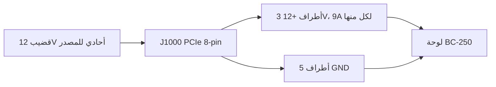

> 🌐 ترجمة مجتمعية. النسخة الإنجليزية هي المرجع الأساسي وقد تكون أحدث. وجدت خطأ؟ افتح issue: [English](../en/03-power-supply.md) · https://github.com/lildebil0/awesome-bc250/issues

# مصدر الطاقة

> **باختصار** — لا تحتوي BC-250 على **زر تشغيل ولا قابس طاقة حاسوب قياسي**. إنها تستهلك **12 V** عبر موصّل **PCIe 8-pin (6+2)** واحد — نفس القابس الذي تستخدمه بطاقة الرسوميات في الحاسوب المكتبي — وتبلغ ذروتها حوالي **~235 W** (أكثر إن كسرت السرعة). تحتاج إلى مصدر 12 V قادر على تقديم **~250–300 W على قضيب واحد**. ثلاثة مسارات يسلكها المجتمع: مصدر طاقة خادم **"Flex"** رخيص (HP 500 W، ~$12 على eBay)، أو **لبنة صناعية** (Mean Well LOP-300/LOP-500)، أو **مصدر طاقة ATX عادي** (فقط أوصل كابل PCIe الخاص به). القاتلان اللذان يجب تجنبهما: **مصدر طاقة قديم يقسّم 12 V على قضبان ضعيفة**، و**أسلاك فولاذية مطلية بالنحاس مزيفة** ترتفع حرارتها وتشتعل. استخدم نحاسًا حقيقيًا، **16 AWG أو أسمك**.

تغذية اللوحة هي **الأمر الثاني الذي يجب على المبتدئ أن يتقنه** (بعد [التبريد](04-cooling.md)) — وهو الأرجح في إشعال حريق إذا اختصرت في الأسلاك.

---

## ما تحتاجه اللوحة فعليًا

BC-250 هي نواة PlayStation 5 منقوصة على لوحة تعدين/خادم. كانت مصممة للجلوس في رفّ وتُغذّى بـ 12 V — لذا فهي تفتقر إلى **كل وسائل راحة الحاسوب العادي**:

- **لا يوجد موصّل ATX 24-pin** للوحة الأم.
- **لا يوجد زر تشغيل** — تعمل في اللحظة التي يصل فيها 12 V (مفتاح مصدر الطاقة نفسه هو زر تشغيلك).
- **مهمة واحدة لمصدر الطاقة: تقديم 12 V بتيار كافٍ.**

**أرقام الطاقة (مؤكدة):**

| المواصفة | القيمة | المصدر |
|------|-------|--------|
| جهد الدخل | 12 V DC | [hardware.md](https://github.com/mothenjoyer69/bc250-documentation/blob/main/hardware.md) |
| سحب الذروة النموذجي | ~220–235 W | مُلاحَظ من المجتمع ([src](https://t.me/c/2424231195/31076)) |
| الموصّل | PCIe 8-pin (6+2) | [hardware.md](https://github.com/mothenjoyer69/bc250-documentation/blob/main/hardware.md) · ([src](https://t.me/c/2424231195/14450)) |
| تيار الذروة على 12 V | ~18–20 A نموذجيًا، مع هامش تصميمي حتى ~40 A | ([src](https://t.me/c/2424231195/31076)) |

> **"PCIe 8-pin (6+2)"** تعني قابس طاقة بطاقة رسوميات: ستة أطراف في كتلة، إضافة إلى مشبك 2-pin قابل للفصل، فيعمل الكابل نفسه إما كـ 6-pin أو 8-pin. **6+2** = 6 ثابتة + 2 قابلة للإزالة. هذا *ليس* موصّل CPU/EPS 8-pin من لوحتك الأم — راجع التحذير أدناه.

موصّل PCIe 8-pin مُصنّف لـ **150 W** بحسب معيار PCIe، ويمكن لتماسات 12 V الثلاثة على اللوحة (Molex Mini-Fit Jr، 9 A لكل منها) تمرير **حتى ~324 W** بأمان ([hardware.md](https://github.com/mothenjoyer69/bc250-documentation/blob/main/hardware.md)). إذًا موصّل 8-pin واحد كافٍ بمريح عند الإعدادات المصنعية؛ الهامش يهم فقط عند دفع كسر سرعة عدواني.

**كم قدرة مصدر طاقة تشتري:** استهدف **300 W أو أكثر على قضيب 12 V**. تمنحك وحدة 300 W هامشًا صحيًا فوق ذروة الـ ~235 W وتُبقي مروحة مصدر الطاقة هادئة؛ يفيد الناس أن مصدر طاقة خادم Flex بقدرة 500 W يعمل شبه صامت على هذا الحمل ([src](https://t.me/c/2424231195/31076)). لا تشترِ أقل من ~250 W "للتوفير" — ستشغّله على الحافة وسيصبح صاخبًا أو ينطفئ.

> **منحنى الطاقة بمقياس الكماشة (شدّة تيار من مصدر أول).** قام تفكيك بتثبيت مقياس تيار DC بالكماشة على تغذية 12 V وقرأ التيار الفعلي للوحة: **اللعب يسحب ≈17 A / ~190 W**، بينما **حمل إجهاد صناعي كامل يبلغ ≈21 A / ~240–250 W** عند **2000 MHz / 960 mV**؛ رفع الجهد قليلًا يدفعه إلى **22–23 A وأبعد** ([Old Lamer — Part VII](https://youtu.be/pxahl9-YgkY) ~9:01). تشحذ هذه أرقام طاقة الحائط المجتمعية أعلاه بشدّة تيار القضيب المقاسة — وتؤكد لماذا يترك هدف الـ 300 W الهامش الصحيح. *(الأرقام مقروءة من ترجمات تلقائية — عامِل الأرقام الدقيقة كتقريبية.)*

> ⚠️ **مصادر طاقة مسماة يجب تجنبها:** **Dell D220P-01** الرخيص (220 W) و**Dell D250AD-00** (250 W) موصوفان بأنهما **غير كافيين وخطيرين** لهذه اللوحة — عند 220 W / 250 W يجلسان دون ذروة اللوحة، وقد أُبلغ عن انقطاعهما أو حتى تعطّلهما تحت حمل اللعب. لا تشترِ وحدة لمجرد أنها رخيصة و"تبدو كافية." ([elektricM: power](https://elektricm.github.io/amd-bc250-docs/hardware/power/))

---

## الفيزياء: فولت وأمبير ووات — ولماذا يحترق السلك الرفيع

كل قاعدة في هذا الفصل تنبثق من ثلاث معادلات. تعلّمها وستتوقف جداول المقاس وتحذيرات "لا تستخدم SATA أبدًا" عن كونها اعتباطية.

**القدرة = فولت × أمبير (`P = U·I`).** تحتاج اللوحة إلى **~235 W** عند **12 V**، فتسحب `235 ÷ 12 ≈ 19.6 A`. هذا تحديدًا سبب قراءة مقياس الكماشة لـ **~17 A عند اللعب / ~21 A عند الإجهاد** ([أعلاه](#ما-تحتاجه-اللوحة-فعليًا)): القدرة مثبّتة بالسيليكون، فيكون *الأمبير* مهما فرضه 12 V. ادفع الترددات/الجهد للأعلى وسيتسلق الأمبير مع الوات.

**لماذا 12 V — ولماذا يقتلها 24 V.** 12 V هو معيار رفّ مراكز البيانات الذي بُنيت اللوحة لأجله؛ منظِّمات الجهد VRM على متنها تخفضه إلى ~1 V التي تعمل عليها نواة APU. اللوحة **موصولة بدارة ثابتة لـ 12 V دون حماية من فرط الجهد**، فتغذيتها بـ 24 V (مثلًا [LOP-300-**24**](#الخيار-b--لبنة-mean-well-الصناعية)) يضع الضعف على كل جزء من أجزاء 12 V ويدمّرها فورًا. على عكس الأمبير، الجهد غير قابل للتفاوض.

**سعة التيار (Ampacity) — لماذا للسلك حدّ أمبير.** السلك مقاومة، والتيار عبر المقاومة يولّد حرارة: `P_loss = I²·R`. نحاس أسمك = مقطع أكبر = **R أقل** = حرارة أقل عند نفس الأمبير. هذا هو كامل معنى جدول AWG أعلاه — **رقم AWG أصغر = سلك أسمك = آمن عند أمبير أكثر**. عند ~20 A، يبقى **نحاس 16 AWG** باردًا؛ أرفع من ذلك، ويُذيب `I²·R` العازل. لاحظ **التربيع**: مضاعفة التيار *تُربّع* الحرارة، ولهذا يحتاج كسر السرعة الثقيل إلى تغذية ثانية، لا مجرد "قليل من السلك الإضافي."

**هبوط الجهد — النصف الآخر.** الحرارة المفقودة في السلك هي جهد لا تراه اللوحة أبدًا: `V_drop = I·R`. كابل طويل ورفيع **يرتفع حرارة** و**يجوّع** اللوحة معًا، فقد ينخفض جهدها تحت الحمل حتى عندما لا يذوب شيء بوضوح. نحاس قصير وسميك يعالج الاثنين دفعةً واحدة.

**لماذا "النحاس" المزيف قاتل.** الفولاذ المطلي بالنحاس له **~6× مقاومة** النحاس الحقيقي — نفس الأمبير، نفس `I²·R`، فـ **6× الحرارة** في السلك نفسه. اختبار المغناطيس أدناه ليس تفضيلًا للجودة؛ إنه يلتقط **مُضاعِفًا بـ 6×** على حدٍّ هو أصلًا مُربَّع في التيار.

**لماذا لا SATA ولا Molex أبدًا.** إنه *الموصّل*، لا السلك. تماس طاقة SATA مُصنّف لـ **~54 W** ← `54 ÷ 12 ≈ 4.5 A` قبل أن يطبخ التماس الصغير نفسه؛ تريد اللوحة ~20 A، **4× بعد** ذلك الحد. أما PCIe 8-pin فيحمل ثلاثة تماسات 12 V سميكة (**9 A لكل منها = 27 A / 324 W**) — وهذا *سبب* كونه القابس الصحيح وأن SATA/Molex لا يمكن أن يكون كذلك أبدًا (راجع [مخطط الأطراف](#مخطط-أطراف-الموصّل-ذي-الـ-8-أطراف-j1000)).

---

## ⚠️ الخطآن اللذان يدمّران اللوحات

اقرأ هذا القسم قبل أن تشتري أي شيء.

### 1. لا تخلط بين PCIe 8-pin و CPU/EPS 8-pin

مصدر طاقة ATX لديك فيه **قابسان 8-pin مختلفان**: واحد لبطاقات الرسوميات (**PCIe**) وواحد للمعالج (**EPS/CPU**، يُوسم أحيانًا "CPU" أو "4+4"). **يبدوان متطابقين تقريبًا لكن أشكال أطرافهما وقطبيتهما معكوسة.** دفع قابس CPU في BC-250 يضع **+12 V حيث يجب أن يكون الأرضي** — يمكن أن تحرق اللوحة بأكملها.

> *"نوقش هذا مليار مرة — لدينا دخل طاقة PCIe. إن كان شكل الطرف الأخير مختلفًا، فلديك قابس CPU… حرفيًا له القطبية المعاكسة، الموجب حيث يجب أن يكون السالب. يمكنك أن تحرق كل شيء إلى الجحيم."* ([src](https://t.me/c/2424231195/14450))

اللوحة **لا تملك فحص أطراف استشعار**، فلا شيء يمنعك من توصيل الشيء الخطأ. العادة الآمنة: **انظر إلى شكل مشبك الموصّل، وإن لم تكن متأكدًا، افحص + و− بمقياس متعدد قبل التشغيل.**

### 2. لا تستخدم سلك "نحاس" مزيف — إنه خطر حريق

هذا أكثر تحذير سلامة تكرارًا في الدردشة. غالبًا ما تكون كابلات المحوّلات الرخيصة الجاهزة وكابلات "PCIe" الزهيدة **فولاذًا مطليًا بالنحاس (CCS)** أو **ألمنيومًا مطليًا بالنحاس (CCA)** — قشرة نحاس رقيقة فوق نواة فولاذية/ألمنيومية. للفولاذ **~6× مقاومة النحاس**، فيرتفع حرارة السلك تحت الحمل وقد يذوب أو يشتعل.

> *"السلك من المحوّل ارتفعت حرارته بشدة تحت الحمل. تبيّن أنه لم يكن نحاسًا بل حديدًا (فولاذًا) بطلاء نحاسي رقيق… مقاومة عالية، يسخن كثيرًا، قد يسبب حريقًا. للتشغيل الموثوق والآمن يجب عليك استخدام أسلاك نحاسية كاملة لا تقل عن 2.5 mm²."* ([src](https://t.me/c/2424231195/108733))

> *"فحصته بمغناطيس 🤣 — خيوط فولاذية. مقاومة هذه 'الخيوط' الفولاذية أعلى 6× من النحاس. عن أي 450 W يتحدثون أصلًا؟"* ([src](https://t.me/c/2424231195/133546))

**اختبر قبل أن تثق:** المغناطيس يلتصق بالفولاذ، لا بالنحاس. إن كان موصّل أو سلك مغناطيسيًا، فارمِ الكابل.

وهذا ليس فقط كابلات بلا علامة تجارية. **رُئيت مصادر طاقة Apevia Flex/ITX بأسلاك فولاذية** — افحصها بالمغناطيس، لأن الفولاذ يسخن جدًا تحت الحمل وهو خطر حريق. مصدر **Apevia ITX-PFC400W** بحجم Mini-ITX يستخدم **موصّل 14-pin** (يعمل مع [محوّل LITE](#تشغيل-ps_on-تلقائيًا--محوّل-المجتمع) أدناه، لكن يُنصح بتجنبه). (r/BC250Gaming)

> 🔴 **لا تغذِّ BC-250 أبدًا عبر محوّل SATA أو Molex.** تسحب اللوحة **220–280 W**، وهذه الموصّلات لا تستطيع فيزيائيًا تقديم ذلك بأمان:
> - **محوّل SATA→PCIe/8-pin خطر حريق** — موصّل طاقة SATA مُصنّف لـ **~54 W** فقط ([elektricM: power](https://elektricm.github.io/amd-bc250-docs/hardware/power/)).
> - **تغذية Molex مجردة تبلغ سقفها ~156 W** مجتمعةً (موصّلا Molex) — وما زالت غير كافية ([elektricM: power](https://elektricm.github.io/amd-bc250-docs/hardware/power/)).
>
> غذِّ اللوحة فقط من **مصدر 12 V حقيقي بفئة PCIe 8-pin / EPS**. هذا منفصل عن تحذير النحاس مقابل الفولاذ أعلاه: حتى محوّل SATA أو Molex *نحاسي كامل* غير آمن هنا، لأن الموصّل نفسه مُصنّف أدنى من حمل 220–280 W.

---

## إرشادات مقاس السلك والموصّل

توثيق اللوحة والدردشة يتفقان على الخط الأساسي الآمن نفسه:

| حالة الاستخدام | السلك | المصدر |
|----------|------|--------|
| 8-pin واحد، مصنعي / كسر سرعة خفيف | **16 AWG** نحاس (~1.3 mm²) | [hardware.md](https://github.com/mothenjoyer69/bc250-documentation/blob/main/hardware.md) |
| كابل مبني يدويًا، تريد هامشًا | **2.5 mm²** (~13 AWG) نحاس كامل | ([src](https://t.me/c/2424231195/108733)) |
| كسر سرعة ثقيل | أسمك / **تغذية مزدوجة** (راجع J2000/J2001) | [hardware.md](https://github.com/mothenjoyer69/bc250-documentation/blob/main/hardware.md) |

الأرقام لا تتعارض — **16 AWG هو الحد الأدنى الموثّق**؛ ورقم 2.5 mm² هو اختيار باني واحد لهامش إضافي بعد فزع من سلك CCS. **الجزء غير القابل للتفاوض هو "نحاس حقيقي"، لا المقاس بالضبط.** رقم AWG أصغر = سلك أسمك = أأمن.

لتماسات الموصّل التي تحمل التيار الكامل، استهدف ما هو مُصنّف للذروة: يستهدف البناة تماسات/سلكًا صالحًا لـ **~40 A** في بناء ثقيل، ويربطونها بالبراغي أو يكبسونها بشكل سليم بدلًا من الاعتماد على تركيب ضغط هشّ ([src](https://t.me/c/2424231195/31076)).

---

## مخطط أطراف الموصّل ذي الـ 8 أطراف (J1000)

بالنظر إلى موصّل الطاقة الرئيسي للوحة — **الصف العلوي كله أرضي، والصف السفلي 12 V باستثناء أرضي واحد**. من [hardware.md](https://github.com/mothenjoyer69/bc250-documentation/blob/main/hardware.md):

```
J1000 (PCIe 8-pin), contacts facing you:

  [ GND  GND  GND  GND ]   ← top row: all ground (−)
  [ GND  12V  12V  12V ]   ← bottom row: one ground + three 12 V (+)
```

تذكر الدردشة القطبية نفسها بكلمات بسيطة — عُدّ الأطراف **1 إلى 3 = +12 V، الأطراف 4 إلى 8 = أرضي**:

> *"الأطراف من واحد إلى ثلاثة يجب أن تكون +، والباقي من أربعة إلى ثمانية سالب… اللوحة بلا فحص استشعار. خذ مفحاصًا وانظر أين + و−."* ([src](https://t.me/c/2424231195/14450))

كيف ينقسم قضيب 12 V الواحد على التماسات الثمانية — ثلاثة تحمل +12 V، خمسة أرضي:



هذا يطابق PCIe 8-pin قياسيًا تمامًا، وهو *سبب* عمل كابل PCIe من مصدر طاقة ATX عادي مباشرةً. **إن بنيت كابلك الخاص، تحقق من كل طرف بمقياس متعدد قبل أول تشغيل** — أخطاء القطبية لا تُغتفر هنا.

كما أن للوحة موصّلَي طاقة بديلين أصغر، **J2000** و**J2001** — مفيدان فقط لكسر سرعة ثقيل ومغطّيان بالكامل أدناه.

---

## ما بعد 300 W — موصّل الطاقة الثاني J2000 / J2001

> ⚠️ **اقرأ هذا أولًا.** كل ما في هذا القسم هو **أسلاك 12 V إضافية تُنجَز يدويًا**. اللوحة **بلا فحص قطبية أو استشعار** على هذه الأطراف (مثل J1000) — بدّل +12 V والأرضي وستحرق اللوحة في لحظة تشغيلها. تغذية ثانية تضيف هامشًا فقط إذا **شاركت التغذيتان نفس المصدر / نفس قضيب 12 V عند نفس الجهد**؛ ربط مصدرين مختلفين معًا قد يدفع التيار عكسيًا عبر أحدهما. إن لم تكن مرتاحًا في كبس وقياس موصّلاتك الخاصة، فتوقف هنا وابقَ على [J1000 8-pin](#مخطط-أطراف-الموصّل-ذي-الـ-8-أطراف-j1000) الواحد.

موصّل PCIe 8-pin واحد إلى [J1000](#مخطط-أطراف-الموصّل-ذي-الـ-8-أطراف-j1000) مريح عند المصنعي وكسر السرعة الخفيف — تماساته الثلاثة لـ 12 V صالحة لـ **~324 W** (9 A × 3 × 12 V، أو حتى ~468 W بتماسات بدرجة صناعية) ([hardware.md](https://github.com/mothenjoyer69/bc250-documentation/blob/main/hardware.md)). سبب وجود هذا القسم: **لوحة بـ 40-CU على كسر سرعة عدواني قد تسحب أكثر من 300 W** ([src](https://t.me/c/2424231195/143787))، وهو تمامًا عند حافة منطقة راحة موصّل 8-pin واحد. صُممت اللوحة لرفّ يغذّي فيه **مصدر طاقة ثانٍ** موصّلين إضافيين — **J2000** و**J2001** — فالطريقة النظيفة للحصول على هامش كسر سرعة مكتبي هي **تكميل J1000 بـ J2000/J2001** (أو اللحام مباشرةً إلى اللوحة) بدلًا من إثقال قابس واحد ([hardware.md](https://github.com/mothenjoyer69/bc250-documentation/blob/main/hardware.md)). وهذا أيضًا أكثر مخطط مطلوب في الدردشة ([src](https://t.me/c/2424231195/135741)).

### مخطط الأطراف (من توثيق اللوحة)

J2000 و J2001 **غير متطابقين**. هما متوافقان مع **Molex Micro-Fit BMI** ([part 444280801](https://www.molex.com/en-us/products/part-detail/444280801)). الطرف 1 هو مثلث الطباعة الحريرية الأبيض (`v` أدناه):

```
        J2000                    J2001
   v                        v
[ LED1  12V  12V  12V ]   [ 12V  12V  12V  PGD ]
[ LED2  GND  GND  GND ]   [ GND  GND  GND  GND ]
```

| الطرف | المعنى |
|-----|---------|
| `12V` | دخل طاقة +12 V (ثلاثة لكل موصّل) |
| `GND` | أرضي |
| `PGD` | **PGOOD** — يقرأ 5 V عند وجود مصدر طاقة ثانٍ في لوحة خلفية لرفّ؛ طرف إشارة، **وليس** مخرج طاقة |
| `LED1` / `LED2` | مخارج LED نشطة-منخفضة تعكس مؤشرات LED الخضراء / الحمراء للوحة الخلفية |

**للتكرار الاحتياطي، يقول التوثيق باستخدام كلٍّ من J2000 و J2001** ([hardware.md](https://github.com/mothenjoyer69/bc250-documentation/blob/main/hardware.md#j2000-and-j2001)). لاحظ أن **تخطيط الأعمدة يختلف** بين الاثنين — على J2000 تجلس أطراف LED في العمود الأول وكل أطراف 12 V الثلاثة على الصف العلوي؛ على J2001 يجلس طرف PGD في أعلى اليمين والصف السفلي كله أرضي. **اقِس كل طرف قبل التوصيل** — لا تفترض أن سكن Micro-Fit يستقر بالطريقة نفسها على كليهما. ⚠ تحقق من توجيه الطرف-1 الدقيق على لوحتك بمقياس متعدد؛ يجب **ألا** تتلقى أطراف LED/PGD أبدًا 12 V.

### الطريقة العملية التي يستخدمها المجتمع

لست بحاجة إلى اللوحة الخلفية للرفّ. وصفة الدردشة المتكررة ببساطة هي: **مرّر موصّل PCIe 8-pin واحد إلى J1000، ثم اكبس قابس Molex Micro-Fit 3.0 وغذِّ نفس 12 V إلى J2000 المجاور** ([src](https://t.me/c/2424231195/142662)، [src](https://t.me/c/2424231195/138371)). يصف باني الكابل تحديدًا بأنه *"موصّل PCIe واحد وموصّلا Micro-Fit ثلاثيا الأطراف"* من مصدر واحد ([src](https://t.me/c/2424231195/143938)) — أي قسّم 12 V/GND من كابل PCIe واحد إلى كلٍّ من 8-pin وتغذية Micro-Fit.

**الموصّل الذي تشتريه** (تركيب ذاتي، Molex Micro-Fit 3.0):

| القطعة | رقم Molex | ملاحظة |
|------|--------------|------|
| السكن | **43025-0800** (8 دارات) | جسم القابس ([src](https://t.me/c/2424231195/142659)، [src](https://t.me/c/2424231195/14797)) |
| أطراف الكبس | سلسلة **43030** | واحد لكل سلك ([src](https://t.me/c/2424231195/142659)) |

املأ فقط مواضع **12 V و GND** (طابق جدول مخطط الأطراف أعلاه)؛ اترك `PGD` / `LED1` / `LED2` فارغة. استخدم نفس سلك **النحاس الحقيقي، ≥16 AWG** وانضباط الكبس كما في [موصّل 8-pin الرئيسي — راجع إرشادات مقاس السلك](#إرشادات-مقاس-السلك-والموصّل)؛ تغذية 12 V مكبوسة يدويًا ترتفع حرارتها هي تحديدًا خطر الحريق الموصوف سابقًا في هذا الفصل.

> 🛠 **مزالق تركيب Micro-Fit (من دليل Molex العملي).** ملاحظات عملية لكبس هذه القوابس ([Molex Micro-Fit video](https://youtu.be/aaDUkPn9ASE)):
> - **مقاس السلك:** **18 AWG موصى به، 20 AWG مقبول** — الحمل يتوزع ثلاثيًا على أطراف 12 V الثلاثة، فيحمل كل سلك ثلثًا.
> - **احلق المزلاج البلاستيكي** عن القابس ليستقر مسطّحًا على اللوحة.
> - **الموصّلان غير قابلين للتبديل** — بمجرد توصيلهما، **علّمهما** كي لا تبدّل أبدًا قابسي J2000 و J2001.
> - **لا كبّاسة؟ اللحام بديل صالح** — الحم السلك في الطرف بدلًا من الكبس.
> - مُنجَزًا بشكل صحيح، **تحمل خطوط 12 V التسعة عبر كلا الموصّلين >400 W بأمان.**


### تغذية لوحة بـ 40-CU — تعديل كابل بثلاثة مخارج

بعد **فتح 40-CU** يمكن للوحة أن تسحب **~280 W عند الحائط** في FurMark (مقاسة في CPU-X)، و**موصّل PCIe 8-pin واحد يبلغ ذروته ~220 W** في FurMark — فلوحة مفتوحة بكثافة تريد أكثر من تغذية واحدة. يحتوي **[Metalfish 500W](#نماذج-مصادر-الطاقة-الشائعة-التي-يستخدمها-المجتمع)** على **3 مخارج PCIe/CPU مشتركة**؛ لبناء 40-CU، أوصل **الثلاثة جميعًا** إلى اللوحة (*"تعديل كابل بثلاثة مخارج"*):

- استخدم **18 AWG** — تبقى الكابلات باردة تحت FurMark؛ قبل توزيع الحمل على 3 تغذيات كانت تسخن بشكل خطير.
- **جانب اللوحة** = مقابس Micro-Fit 3.0؛ **جانب المصدر** = مقابس Mini-Fit PCIe بقياس 4.2 mm. **اربط كل سلك بمقياس متعدد أولًا.**
- حساب مقاس تقريبي من السلسلة: 18 AWG ≈ **5 A @ 12 V ≈ 60 W لكل سلك** × 3 في موصّل واحد ≈ 180 W، × 2 موصّل ≈ 360 W — **لكن الموصِّلات المتوازية لا تتقاسم التيار بالتساوي، فلا تشغّلها حتى الحد.**

(الفضل: **Korayosulu**، r/BC250Gaming، مستلهَم من فيديو Oldlamer على YouTube.)

> **الإسناد:** مخطط أطراف J2000/J2001 أعلاه من **توثيق عتاد elektricM**، الذي تستند هندسته العكسية إلى **[bc250-documentation الخاص بـ mothenjoyer69](https://github.com/mothenjoyer69/bc250-documentation)** (الفضل أيضًا لـ Segfault وneggles وyeyus). طريقة الكبس العملية وأرقام القطع من دردشة المجتمع، مُستشهَد بها داخل السطور.

---

## خيارات مصدر الطاقة التي يستخدمها المجتمع

هناك ثلاثة مسارات عملية. كلها تقدّم 12 V؛ تختلف في السعر والحجم والضجيج وكم عمل أسلاك تنجزه.

> 💡 **تغذية عدة لوحات من مصدر طاقة واحد؟** كل ما في هذا الفصل مكتوب للوحة واحدة. لمنصة متعددة اللوحات تغذّيها مصدر خادم كبير واحد، استخدم **[Needleroozer/bc250-power-board](https://github.com/Needleroozer/bc250-power-board)** المجتمعي — لوحة PCB لتوزيع الطاقة تقسّم مصدرًا واحدًا إلى تغذيات 12 V نظيفة لكل BC-250 ([elektricM: power](https://elektricm.github.io/amd-bc250-docs/hardware/power/)).

| الخيار | ما هو | السعر | المزايا | العيوب |
|--------|-----------|-------|------|------|
| **مصدر طاقة خادم "Flex Slot"** | لبنة مركز بيانات 1U من HP/Dell/إلخ (مثل HP 500 W Platinum) | ~$12–25 مستعمل | رخيص، شبه غير قابل للتدمير، قضيب 12 V أحادي ضخم، مدمج جدًا | يحتاج جسرًا/مقاومة للبدء؛ مروحة 15 000 RPM صغيرة صاخبة كنفّاثة ما لم تُستبدل؛ تربط 8-pin بنفسك |
| **لبنة صناعية (Mean Well)** | مصدر AC→DC مغلق، 12 V أحادي (LOP-300 = 300 W/25 A، LRS-350، LOP-500) | ~$25–45 جديد | جديد، قضيب أحادي نظيف، هادئ، مواصفات من ورقة البيانات | تربط 8-pin بنفسك؛ الأطراف العارية تحتاج علبة |
| **مصدر طاقة حاسوب ATX / Flex-ATX / SFX عادي** | أي مصدر طاقة حاسوب حديث لائق | متفاوت | **بلا أي تعديل** — كابل PCIe 8-pin الخاص به يدخل مباشرةً؛ الأأمن للمبتدئين | ضخم لبناء صغير؛ قدرة مفرطة؛ انتبه لقاعدة أحادي القضيب أدناه |

### الخيار A — مصدر طاقة خادم Flex (أشهر مسار رخيص)

المفضّل لدى المجتمع هو مصدر خادم **HP Flex Slot 500 W** مستعمل — *"اشتُري بـ $12 مضحك على eBay… تعمل هذه إلى الأبد تقريبًا، هامش أكبر بكثير من معدّل استبدال مراكز البيانات لها، إضافة إلى كفاءة Platinum"* ([src](https://t.me/c/2424231195/31076)). هذه لا تملك قابس PCIe، فتكيّف واحدًا:

1. **ابدأ مصدر الطاقة:** اجسر طرفَي البدء القصيرين (الطرفان 1–2) بجسر أو مفتاح قافل.
2. **فعّل قضيب 12 V:** ضع **مقاومة ~500 Ω بين الطرف 3 و GND** (الطرف الأيسر العريض).
3. **استمدّ 12 V:** إما الحم PCIe 8-pin مباشرةً على أطراف 12 V، أو ركّب موصّلًا في السكن — *"لكن يجب أن تتحمل الأسلاك والموصّل ذروة 40 A"* ([src](https://t.me/c/2424231195/31076)).

لبنات خادم/كونسول مثبتة أخرى يستخدمها الناس: **مصدر PlayStation 3 FAT** (32 A / 12 V — *"أكثر من كافٍ ومستقر جدًا، أنصح به لـ BC-250"* ([src](https://t.me/c/2424231195/62332))، [src](https://t.me/c/2424231195/102734))، وDell D550E، وJuniper JPSU-350، ومصادر معدّنات ASIC متنوعة.

> **شغّل اللوحة بأكملها من ذراع تحكم Xbox — [ESP32-BC250-LOP_PSU-PowerON-Xbox](https://github.com/dexikdex/ESP32-BC250-LOP_PSU-PowerON-Xbox)** ([src](https://t.me/c/2424231195/142498)). تقوم هذه اللوحة المجتمعية (**ESP32_Relay X2**، الطراز **303E32DC210**، مرحّل مزدوج) بـ **مسح BLE سلبي**: عندما تُشغَّل ذراع Xbox المقترنة بك، يرى ESP32 إعلان Bluetooth الخاص بها ويُطلق مرحّلًا على **GPIO17** موصولًا بأطراف **PWR_SW** للوحة ليبدّل التشغيل. مرحّل ثانٍ (**GPIO16**) يبدّل في الوقت نفسه 12 V للملحقات (مثل متحكم مروحة). أطراف أخرى: **GPIO23** = دخل زر العلبة الفيزيائي، **GPIO19** = مخرج LED للزر، **GPIO4** = مراقب حالة الحاسوب. تبقى ذراع التحكم مقترنة بالحاسوب كالمعتاد — المسح لا يسرق اقترانها بنظام التشغيل. الرخصة GPL-3.0، المؤلف dexikdex.

> **تنبيه بخصوص المروحة:** يمكن لمروحة 40 mm المصنعية في هذه اللبنات أن تدور حتى ~15 000 RPM و*"تبدو كنفّاثة تُقلع."* عمليًا، على حمل BC-250 المتواضع تبقى هادئة، ويؤكد عدة مستخدمين أنها *"ليست صاخبة إطلاقًا مع لوحتنا الصغيرة"* ([src](https://t.me/c/2424231195/33455)). إن أزعجتك، استبدلها بمروحة 40 mm أهدأ بتدفق هواء كافٍ.

> 💡 **أفضل اختيار اقتصادي = مصدر خادم مستعمل.** مصدر خادم مستعمل بقدرة ~500 W بسعر **$10–30** هو أرخص مسار إلى قضيب 12 V أحادي ضخم ويصعب التغلب عليه في السعر-لكل-وات ([Old Lamer — Part VII](https://youtu.be/pxahl9-YgkY) ~10:12). **لبنة طاقة شريط LED بـ 12 V / كاميرات مراقبة ستشغّل اللوحة أيضًا**، لكن احذر: غالبًا ما **تفتقر هذه إلى دارات الحماية الموجودة في مصدر طاقة الحاسوب** (قطع فرط التيار، فرط الحرارة، الدارة القصيرة)، فلا شيء يفصلها عند عطل. فضّل مصدر حاسوب/خادم حقيقيًا؛ استخدم مصدر شريط LED كملاذ أخير فقط وأبقِه ضمن تصنيفه بمريح. *(من ترجمات — الأرقام تقريبية.)*

### الخيار B — لبنة Mean Well الصناعية

**Mean Well LOP-300-12** جديد (300 W، 12 V، 25 A) أو **LRS-350** هو الاختيار المرتب الموثوق: قضيب 12 V أحادي مباشرةً من ورقة البيانات، بلا ألاعيب تقسيم قضبان، وهادئ. **LOP-500** أكبر موجود إن أردت أقصى هامش كسر سرعة. تظل تربط PCIe 8-pin إلى أطرافه اللولبية بنفسك، ولأن الأطراف مكشوفة فعليك تعليبه. صفحات منتج تداولتها الدردشة: [LOP-300-12 على ChipDip](https://www.chipdip.ru/product/lop-300-12-blok-pitaniya-12v-25a-300vt-mean-well-9001511866) · [LRS-350-12](https://www.chipdip.ru/product/lrs-350-12-blok-pitaniya-12v-29a-348vt-mean-well-9000334417).

> 🔴 **اشترِ `-12`، وليس `-24` — اللاحقة هي جهد الخرج.** تبيع Mean Well الـ LOP-300 بجهود متعددة، و**[LOP-300-24](https://www.meanwell.com/webapp/product/search.aspx?prod=LOP-300) يُخرج 24 V** — **ضعف** ما تتحمله هذه اللوحة. BC-250 هي **12 V فقط** (راجع [ما تحتاجه اللوحة](#ما-تحتاجه-اللوحة-فعليًا))؛ تغذيتها بـ 24 V سـ**تدمّرها فورًا**. **يجب** عليك استخدام صيغة **LOP-300-_12_** (12 V / 25 A). تنطبق القاعدة نفسها على كل طراز في هذه العائلة — **تأكد دائمًا أن الرقم الأخير هو `-12`** (LOP-300-12، LRS-350-12، LOP-500-12 …) قبل أن توصله. هذه اللوحة بلا حماية من فرط الجهد.

**قائمة مواد DIY لموصّل 8-pin لـ LOP-300 (بناء روسي).** وثّق باني واحد قطع JST الدقيقة لكبس موصّل بجانب اللوحة، كلها من ChipDip ([4pda — sftk](https://4pda.to/forum/index.php?showtopic=1104980)):

| القطعة | رقم JST | الدور |
|------|-----------|------|
| سكن 6-pin | **VHR-6N** | جسم قابس +12 V / GND |
| طرف كبس | **SVH-21T-P1.1** | واحد لكل سلك |
| سكن 3-pin | **VHR-3N** (المعروف أيضًا بـ **PHU2-03**) | تغذية ثانوية |

مخطط الأطراف على الـ 6-pin: المواضع **1-2-3 = +12 V (أسلاك صفراء)**، المواضع **4-5-6 = GND (أسلاك سوداء)**. أوصله بنحاس **16 AWG** (يمر **الحد الأدنى 18 AWG** أيضًا؛ **22 AWG ليس خيارًا** — رفيع جدًا للتيار). نفس قاعدة النحاس الحقيقي كما في [إرشادات مقاس السلك](#إرشادات-مقاس-السلك-والموصّل) أعلاه.

### الخيار C — مصدر طاقة حاسوب عادي (الأسهل، الأأمن للمبتدئ)

إن كنت تملك بالفعل مصدر طاقة **ATX أو Flex-ATX أو SFX أو TFX** لائقًا، فقد انتهيت: **أوصل كابل PCIe 8-pin الخاص به في اللوحة.** بلا جسور، بلا لحام، بلا مقاومة. هذا أقل الخيارات خطرًا لمن فتح صندوق اللوحة بالأمس. لتشغيله دون لوحة أم، اجسر **سلك PS_ON الأخضر إلى أي أرضي أسود** على الـ 24-pin (حيلة "مشبك الورق" القياسية). وحدات **Flex-ATX 400 W** المدمجة شائعة للعلب الصغيرة.

---

## تشغيل مصدر الطاقة وإطفاؤه (لا يوجد زر تشغيل على اللوحة)

اللوحة **بلا تحكم طاقة ATX أصلي** — تقلع في لحظة ظهور 12 V (راجع [قائمة انعدام وسائل الراحة](#ما-تحتاجه-اللوحة-فعليًا) أعلاه)، فعلى مفتاح التشغيل/الإطفاء أن يعيش على **جانب مصدر الطاقة**. توثّق سلسلة مجتمع r/linux_gaming الطرق العملية المؤكدة:

- **أضف مفتاح تشغيل حقيقيًا إلى PS_ON.** اجسر **PS_ON ← GND** لمصدر الطاقة عبر **مفتاح هزّاز / قافل** بدلًا من مشبك ورق ثابت — قلبه يشغّل ويطفئ كل شيء. على موصّل 24-pin، PS_ON عادةً هو **السلك الأخضر / الطرف 16**، وأي سلك أسود أرضي. اقرن هذا بالنقطة التالية كي تقلع اللوحة فعليًا عند صعود القضيب.
- **اضبط مِجسَر `AUTO_PWRON` للوحة على التشغيل-التلقائي-عند-التغذية.** مع هذا المجسر في وضع التشغيل التلقائي، تقلع BC-250 بمجرد أن يقدّم مصدر الطاقة 12 V — فيصبح مفتاح PS_ON لمصدر الطاقة زر تشغيل واحدًا حقيقيًا للنظام.
- **اعثر على PS_ON قبل أن تجسره على مصدر طاقة معياري — موقع الطرف يختلف حسب الطراز.** على أسلاك 24-pin القياسية هو السلك الأخضر، لكن الوحدات المعيارية تختلف: **TFSkywind 350 W** يستخدم **الطرفين المركزيين من كل صف (4 + 11)**، بينما **Apevia 400/500 W** يستخدم **طرفين على الصف نفسه (8 + 13)**. افحص وحدتك (مقياس متعدد / مخطط أطراف مصدر الطاقة نفسه) بدلًا من افتراض الأخضر/الطرف-16.
- **قلّم مصدر طاقة رخيص إلى ضفيرة نظيفة.** تحتاج فقط **1 أخضر (PS_ON) + 3 أصفر (12 V) + 6 أسود (GND)** للوحة؛ يمكن قطع بقية الحزمة لبناء مرتب.
- **أوقف مروحة مصدر الطاقة أثناء النوم (حلول مجتمعية بديلة).** لأن مصدر الطاقة يبقى يعمل بينما تنام اللوحة، يقوم بعض المالكين بـ **ربط مروحة مصدر الطاقة تسلسليًا إلى رأس مروحة BC-250** فتتباطأ مع اللوحة. الإصلاحات الأنظف المُهندَسة بشكل سليم لهذا هي [محوّل المجتمع](#تشغيل-ps_on-تلقائيًا--محوّل-المجتمع) و[تعديل عتاد ATX الحقيقي](#تعديل-عتادي-لسلوك-atx-حقيقي-iamdarkyoshi) أدناه — كلاهما يجعل مصدر الطاقة يطفئ تمامًا عند إطفاء اللوحة، بدلًا من تركه يدور في الفراغ.
- **ابنِ خاصّتك بمتحكم دقيق صغير.** إن فضّلت بناء منطق PS_ON التلقائي بنفسك بدلًا من شراء [محوّل المجتمع](#تشغيل-ps_on-تلقائيًا--محوّل-المجتمع)، يمكن لأي متحكم دقيق صغير أن يمسك PS_ON ويراقب إشارة `system_on`/رأس المروحة للوحة. خياران رخيصان حقيقيان يلجأ إليهما الناس: **ESP32** (مستخدَم في [لوحة التشغيل بذراع Xbox](#الخيار-a--مصدر-طاقة-خادم-flex-أشهر-مسار-رخيص) أعلاه) أو، لأقل قائمة مواد ممكنة، **[WCH CH32V003](https://www.wch-ic.com/products/CH32V003.html)** — متحكم RISC-V بأقل من $0.15 بـ **دخل/خرج 3.3 V/5 V** مناسب جدًا لبوّبة خط PS_ON. إنه مسار DIY (تكتب البرنامج الثابت وتوصله بأمان)؛ [محوّل mosfet.party](#تشغيل-ps_on-تلقائيًا--محوّل-المجتمع) الجاهز و[تعديل عتاد iamdarkyoshi](#تعديل-عتادي-لسلوك-atx-حقيقي-iamdarkyoshi) أدناه هما البديلان بلا برمجة.

### تشغيل PS_ON تلقائيًا — محوّل المجتمع

الطرق أعلاه تترك PS_ON إما مجسورًا دائمًا (مصدر الطاقة لا يطفئ تمامًا) أو على مفتاح تقلبه يدويًا. يبيع **u/pilim_** (r/BC250Gaming) **"BC250 ATX PSU Control Adapter"** يمسك PS_ON **تلقائيًا**، فيمكنك استخدام مصدر طاقة حاسوب عادي **دون** قصر سلك PS_ON الأخضر أو توصيل زر قافل. المتجر: https://mosfet.party/products/adapter-1

كيف يُطلق تلقائيًا:

1. تضغط زرًا ← يؤكّد المحوّل **PS_ON**.
2. تقلع BC-250 (المضبوطة على **التشغيل التلقائي في BIOS**) وترفع إشارة **`system_on`**.
3. يُمسك المحوّل **PS_ON** طالما تلك الإشارة موجودة.
4. عند إطفاء نظام التشغيل تسقط الإشارة ← يُبقي المحوّل PS_ON لـ **~3 ثوانٍ أخرى** كي تنطفئ الملحقات بنظافة ← ثم **يطفئ مصدر الطاقة تمامًا**.

تُقرأ إشارة `system_on` من **رأس مروحة اللوحة**، فـ **لا يلزم أي لحام** لتركيبه (ويترك منفذًا حرًا لمروحة ثانية). ولأن **5VSB يسحب ~لا تيار في الخمول**، يطفئ مصدر الطاقة تمامًا — وهذا يحل مشكلة *"مروحة مصدر الطاقة تظل تدور بينما اللوحة مطفأة"* الشائعة المذكورة أعلاه كحيلة غير محلولة.

**ثلاث نسخ:**

| النسخة | ما هي | السعر التقريبي |
|---------|-----------|-------------|
| **FSP500 بلا لحام (plug-and-play)** | بلا لحام؛ يستخدم كابل FSP500-30AS ذا الـ 10 أطراف | ~$35–45 |
| **العالمية "LITE"** | PCB عارية بوسادات لحام | ~$25 |
| **24-pin بلا لحام (plug-and-play)** | لمصادر 24-pin القياسية | — |

**التوافق:**

- **FSP500 بلا لحام** يعمل مع **FSP500-30AS** (وبعض مصادر 10-pin الأخرى) لكن **ليس** مع 24-pin قياسي (مثل Corsair CV750) — لتلك استخدم نسخة **LITE** أو **24-pin**.
- نسختا **LITE / 24-pin** تعملان مع **Metalfish 500W**.
- **لن** يقود **Mean Well LOP** — فالـ LOP بلا طرف تفعيل، فسيحتاج مرحّلًا خارجيًا.

**دخل/خرج الزر / LED:** يقبل أي زر **مفتوح-عادةً** (حتى سلكين عاريين يُلمَسان معًا)؛ به زر على اللوحة إضافة إلى مواضع لزر **6×6 mm** ومفتاح لوحة مفاتيح ميكانيكية. يمكن لـ **`BTN_OUT`** اختياري أن يُلحَم إلى زر طاقة BC-250 الداخلي (سلك واحد) للإطفاء من الزر.

**مفتوح المصدر:** نشر الصانع مخططات الأسلاك ونماذج 3D على **GitHub / GitLab** الخاص به، مرتبطة من [mosfet.party](https://mosfet.party/products/adapter-1). يوجد أيضًا فتحة علبة جاهزة — علبة **NexGen3D "Redux" (v4.1)** بها مثبت لـ PCB الـ LITE: https://www.printables.com/model/1614131

### تعديل عتادي لسلوك ATX حقيقي (iamdarkyoshi)

> ⚠️ **تعديل عتادي متقدم، على مسؤوليتك.** هذا يعيد أسلاك دارة طاقة اللوحة — زلّة تحرق اللوحة. [المحوّل أعلاه](#تشغيل-ps_on-تلقائيًا--محوّل-المجتمع) يمنحك الراحة نفسها بلا لحام.

عكَس **iamdarkyoshi** (r/BC250Gaming) هندسة دارة طاقة BC-250 وعدّلها لـ **سلوك ATX حقيقي**: شغّل BC-250 ← يستيقظ مصدر الطاقة؛ أطفئها ← يطفئ مصدر الطاقة؛ ميزات الاستعداد (مثل طاقة منفذ USB) تظل تعمل.

أسلاك بمعيار ATX مستخدمة:

| لون السلك | الإشارة |
|-------------|--------|
| **أخضر** | PS_ON (التشغيل) |
| **بنفسجي** | +5VSB |
| **رمادي** | PG (Power Good) |

مؤكد العمل على **Corsair SFX450** / وحدات بفئة SFX450. التعديل **يزيل محثًّا**؛ لاحظ أن **`PLD5`** هو المحث الموجود فوق المُزال للتعديل مباشرةً، و**جانبه الأيسر يحمل 5 V** — مفيد لاستمداد 5 V الاستعداد.

التوثيق: YouTube https://youtube.com/watch?v=jIhgyB8x3fQ · BC-250 Discord https://discord.gg/8eZfFWhczz

---

## نماذج مصادر الطاقة الشائعة التي يستخدمها المجتمع

هذه هي الوحدات الدقيقة التي بنى بها الناس في الدردشة فعليًا — **اختيارات مشاركة من المجتمع، لا توصيات.** أيًا كان عامل الشكل، تذكر أن اللوحة تحتاج **قضيب 12 V أحاديًا موصولًا إلى موصّل PCIe 8-pin (6+2) واحد** — راجع [مخطط الأطراف (J1000)](#مخطط-أطراف-الموصّل-ذي-الـ-8-أطراف-j1000) و[إرشادات مقاس السلك](#إرشادات-مقاس-السلك-والموصّل) أعلاه. أي شيء غير مغلق (Mean Well، لبنات الخوادم، مصادر كونسول مستصلَحة) تربط 8-pin بنفسك.

> **اختيار جغرافي (r/BC250Gaming):** **خارج الولايات المتحدة**، **Metalfish 500W Flex ATX** هو اختيار المجتمع؛ **داخل الولايات المتحدة**، **FSP500-30AS**. صيغة **Metalfish 600W** مُبلَّغ أنها **ليست** موثوقة — بحسب روايات المجتمع **لن تبدأ حتى** مع BC-250، لأن **متطلب الحمل الأدنى ~5 V غير ملبّى** (اللوحة تسحب شيئًا لا يُذكر على 5 V، فلا يرى المصدر حملًا كافيًا للنهوض). التزم بـ 500W، التي اختبرها NexGen3D حتى تحت كسر سرعة متطرف وهي طراز موصى به في [توثيق bc250](https://github.com/mothenjoyer69/bc250-documentation). عيبها الوحيد ضجيج المروحة — استبدلها بـ Noctua.

| الطراز | عامل الشكل | القدرة التقريبية | ملاحظة |
|-------|-------------|---------------|------|
| **Mean Well LOP-300(-12)** | لبنة صناعية مفتوحة/مغلقة | 300 W / 25 A على 12 V | الاختيار المدمج الأشهر؛ يناسب أصغر العلب. مستخدَم في عدة تجميعات مرتبة ([src](https://t.me/c/2424231195/80841)، [src](https://t.me/c/2424231195/78870)، [src](https://t.me/c/2424231195/134585)) ويُباع جديدًا ([src](https://t.me/c/2424231195/74703)). 🔴 **احصل على `-12` (12 V)؛ الـ `-24` يُخرج 24 V وسيقتل اللوحة** — راجع [الخيار B](#الخيار-b--لبنة-mean-well-الصناعية). |
| **Mean Well LRS-350-12** | إطار مفتوح صناعي | 350 W / 29 A على 12 V | خيار إطار مفتوح 350 W 12 V من العائلة نفسها ([src](https://t.me/c/2424231195/41013)). |
| **Mean Well LOP-500 / LOP-600** | لبنة صناعية | 500–600 W | أشقّاء أكبر لأقصى هامش كسر سرعة؛ طلب مستخدم واحد LOP-500-12 ([src](https://t.me/c/2424231195/111161)). ⚠ تحقق من المواصفات الدقيقة على ورقة البيانات. |
| ★ **Mean Well GST280A12-C6P** | محوّل سطح مكتب مغلق | 280 W (~252 W قابلة للاستخدام) على 12 V | **الاختيار بلا لحام.** يُشحَن بـ **خرج PCIe 6-pin مصنعي** — أوصله عبر **محوّل 8-pin-180°** وتنتهي، بلا إعادة ترتيب أطراف. اشتُري على Ozon ([4pda — sairius](https://4pda.to/forum/index.php?showtopic=1104980)). |
| **Flex ATX** (مثل Seasonic flex، SSP-250SUB) | لبنة خادم Flex-ATX | ~250–400 W | عامل خادم مدمج شائع. غذّى Seasonic flex جهازًا متكاملًا معدّلًا ([src](https://t.me/c/2424231195/30914))؛ بناء آخر استخدم flex-ATX عاديًا ([src](https://t.me/c/2424231195/84001)). |
| **TFX** (مثل Vinga 400W / TFX-400) | TFX | ~400 W | مستخدَم في عدة تجميعات — مثل Vinga 400 W (TFX-400) يشغّل كسر سرعة 3750/2000 ([src](https://t.me/c/2424231195/118771)). |
| **SFX** | SFX | متفاوت (~250–600 W) | عامل حاسوب مدمج، يدخل مباشرةً — مثل وحدة SFX في تجميعة MasterBox NR200P ([src](https://t.me/c/2424231195/81149)). |
| **PS3 FAT ("phat") PSU** | لبنة كونسول مستصلَحة | ~32 A على 12 V (فئة ~380 W) | خيار استصلاح رخيص، *"أكثر من كافٍ ومستقر جدًا"* ([src](https://t.me/c/2424231195/62332))؛ مؤكد في الاستخدام طويل الأمد ([src](https://t.me/c/2424231195/78829)، [src](https://t.me/c/2424231195/78821)). استمداد الأسلاك: الحم إلى وسادات 12 V / 12 V-RTN، اجسر STBY+5V للبدء ([src](https://t.me/c/2424231195/102734)). **وحدات الإصدار الأول تُخرج أعلى قدرة** (شحنت FATs المبكرة مصدر ~400 W ([src](https://t.me/c/2424231195/9254))) — ⚠ تحقق من الإصدار الذي بحوزتك، فالمتأخرة مخفّضة. |
| **Huntkey 360W** (مصدر ASIC) | لبنة معدّن ASIC | 360 W، كل كابل 180 W | مصدر ASIC مستصلَح، *"كل كابل 180 W"* ([src](https://t.me/c/2424231195/37009)). |
| **بطراز Pico-PSU** | Pico (12 V DC-DC) | منخفض — يغذّي القضبان، لا APU | مذكور للحجم فائق الصغر / خمول أقل ([src](https://t.me/c/2424231195/66387)، [src](https://t.me/c/2424231195/123545)). ⚠ تحقق — في الدردشة، Pico-PSU هو محوّل 12 V→5/3.3 V للوحة أم، مقترن بلبنة 12 V خارجية تقوم بالعمل الحقيقي ([src](https://t.me/c/2424231195/66064))؛ إنه **ليس** مصدر 12 V مستقلًا للـ 8-pin. |
| **Metalfish 500W** Flex ATX | Flex ATX | 500 W | **اختيار مجتمع خارج الولايات المتحدة** (راجع الملاحظة الجغرافية أعلاه). اختبره NexGen3D حتى تحت كسر سرعة متطرف؛ العيب الوحيد ضجيج المروحة (استبدلها بـ Noctua). به **3 مخارج PCIe/CPU مشتركة** — راجع [تغذية 40-CU بثلاثة مخارج](#تغذية-لوحة-بـ-40-cu--تعديل-كابل-بثلاثة-مخارج) أدناه. (r/BC250Gaming) |
| **FSP500-30AS** | Flex ATX (10-pin) | 500 W | **اختيار مجتمع الولايات المتحدة** (راجع الملاحظة الجغرافية أعلاه). بُني أصلًا لأنظمة NUC، فـ **اقصر السلك الرئيسي لإجباره على التشغيل**، مثل ATX 24-pin. ~$10–30 على eBay. يعمل مع [محوّل FSP500 بلا لحام](#تشغيل-ps_on-تلقائيًا--محوّل-المجتمع). نصيحة إعادة الترتيب أدناه. |

> **حيلة إعادة ترتيب FSP500-30AS بلا كبس (r/BC250Gaming).** شحنت RTX 30-series Founders Edition **ضفيرة PCIe أنثى مزدوجة ← Micro-Fit 12-pin**؛ اشترِ واحدة من السوق الثانوي (~$12–18 على Amazon)، إضافة إلى سكنات Micro-Fit فارغة و**أداة طرد أطراف Micro-Fit بـ ~$6**، ثم **استخرج الأطراف المكبوسة مصنعيًا وأعِد إدخالها** في سكنات جديدة تطابق مخطط أطراف BC-250 — **بلا قطع أو كبس أو لحام**.

> ★ **مصدر الطاقة الوحيد الذي يتخطى الأسلاك تمامًا — Mean Well GST280A12-C6P.** كل اختيار آخر هنا (LOP / LRS / Metalfish / FSP) يجبرك على **لحام أو إعادة ترتيب 8-pin** بنفسك. **GST280A12-C6P** هو الاستثناء: يغادر المصنع بـ **قابس PCIe 6-pin موصول بالفعل**، فتغذّيه فقط عبر **محوّل 8-pin-180°** — **بلا لحام، بلا إعادة ترتيب.** اترك الطرفين الداخليين لموصّل 8-pin للوحة حرّين (الـ 6-pin يملأ المواضع الخارجية فقط، مطابقًا [مخطط أطراف J1000](#مخطط-أطراف-الموصّل-ذي-الـ-8-أطراف-j1000)). مُصنّف 280 W ≈ **252 W قابلة للاستخدام** على 12 V — كافية للمصنعي وكسر السرعة الخفيف. مصدره Ozon ([4pda — sairius](https://4pda.to/forum/index.php?showtopic=1104980)).

---

## ⚠️ مواصفة مصدر الطاقة الوحيدة التي توقع الجميع: 12 V أحادي القضيب مقابل متعدد القضبان

يمكن لمصدر طاقة قديم ذي علامة تجارية أن يملك قدرة إجمالية عالية و**يفشل مع ذلك**، لأنه **يقسّم 12 V إلى عدة قضبان ضعيفة** يبلغ كلٌّ منها سقفه دون ما تحتاجه اللوحة:

> *"ملاحظة مهمة لكل من يغريه شراء FSP قديم ذي علامة تجارية وما شابه. ما يهم هنا هو تقديم تيار 12 V. في المصادر القديمة يُقسَّم 12 V على قضيبين، ولا يستطيع أيٌّ منهما وحده تقديم طاقة كافية. إما أن تشتري بهامش كبير، أو احصل على مصدر DC-DC حديث حيث 12 V قضيب أحادي يقدّم القدرة الكاملة."* ([src](https://t.me/c/2424231195/7561))

**قاعدة:** فضّل مصدر طاقة **أحادي القضيب 12 V** (أي تصميم DC-DC حديث، أو خادم Flex، أو Mean Well يفي بذلك). إن اضطُررت لاستخدام وحدة قديمة متعددة القضبان، فتأكد أن **قضيبًا واحدًا** وحده يغطي ~250 W، أو اشترِ بهامش كبير.

---

## كيف يبدو بناء حقيقي

- **بلا تعديل في علبة:** لوحة مركّبة في علبة ألمنيوم صغيرة تُغذّى بكابل **ATX PCIe 8-pin** عادي (جراب مكتوب عليه *PCI-E 16AWG*) — هو تحديدًا مسار بلا تعديل ([src](https://t.me/c/2424231195/41666)).
- **منطقة الموصّل:** لقطة قريبة للوحة تُظهر **رأس المروحة** الأبيض و**موصّلات الطاقة** السوداء (منطقة J2000/J2001) التي ستوصلها ([src](https://t.me/c/2424231195/39395)).
- **وحدة مكتب عاملة:** لوحة واقفة على حامل I/O الخاص بها، مؤشرات LED مضاءة، تعمل من لبنة 12 V خارجية ([src](https://t.me/c/2424231195/27556)).
- **للخبراء فقط:** **موصّل Molex Micro-Fit ملحوم مباشرةً إلى وسادات 12 V للوحة** بنحاس سميك ولحام ثقيل — تعديل كسر السرعة "تجاوز القابس المصنعي". فعّال لكن لا يغتفر؛ لا تحاوله إلا إن كنت تتقن لحامًا بمستوى ГОСТ ([src](https://t.me/c/2424231195/135782)، و[ملاحظات تفكيك Jack Fisher](https://t.me/c/2424231195/92185)).
- **مصدر طاقة لم يتحمل:** شغّل مالك واحد **Corsair VS450** ورأى **أسلاكه ترتفع حرارتها إلى 40–60 °C** قبل أن **تنطفئ الوحدة تحت الحمل**؛ التحويل إلى **Aerocool W550** أصلحها دون أي مشكلة أخرى ([4pda — IlopGG](https://4pda.to/forum/index.php?showtopic=1104980)). حالة دراسية نموذجية لقاعدة [أحادي مقابل متعدد القضبان / الهامش](#مواصفة-مصدر-الطاقة-الوحيدة-التي-توقع-الجميع-12-v-أحادي-القضيب-مقابل-متعدد-القضبان) أدناه — هامش 12 V قليل جدًا يظهر كأسلاك ساخنة وانطفاءات.

<p align="center">
  <br>
  <sub>صورة: Maxim · <a href="https://t.me/c/2424231195/39231">source</a></sub>
</p>

---

## إعداد البداية الموصى به

| المستوى | افعل هذا | لماذا |
|------|---------|-----|
| **الأسهل / الأأمن** | أي مصدر طاقة **ATX/SFX أحادي القضيب** حديث، أوصل PCIe 8-pin، مشبك ورق على PS_ON | بلا تعديل، قطبية صحيحة مضمونة |
| **الأرخص / المدمج** | **HP Flex 500 W** مستعمل، جسر الطرفين 1–2، 500 Ω على الطرف 3→GND، 8-pin نحاس حقيقي 16 AWG | ~$12، صغير، قضيب 12 V ضخم |
| **أنظف بناء جديد** | **Mean Well LOP-300-12** في علبة، 8-pin مكبوس 16 AWG | جديد، هادئ، قضيب أحادي، مواصفات من ورقة البيانات |

أيًا كان اختيارك: **قضيب 12 V أحادي، ≥300 W، سلك نحاس حقيقي ≥16 AWG، قطبية PCIe (لا CPU)، اختبر كابلاتك بالمغناطيس.**

---

## المصادر

- مرجع العتاد (الموصّل، مخطط الأطراف، AWG، J2000/J2001) — [mothenjoyer69/bc250-documentation `hardware.md`](https://github.com/mothenjoyer69/bc250-documentation/blob/main/hardware.md) · [قسم J2000/J2001](https://github.com/mothenjoyer69/bc250-documentation/blob/main/hardware.md#j2000-and-j2001)
- تحذير قطبية ومخطط أطراف PCIe مقابل CPU — https://t.me/c/2424231195/14450
- 12 V أحادي القضيب مقابل متعدد القضبان — https://t.me/c/2424231195/7561
- خطر حريق سلك الفولاذ المطلي بالنحاس المزيف — https://t.me/c/2424231195/108733 · https://t.me/c/2424231195/133546 · تحذير سلك Apevia الفولاذي / ITX-PFC400W 14-pin — r/BC250Gaming
- محوّلات SATA/Molex غير الآمنة (SATA ~54 W، اثنا Molex ~156 W مجتمعةً)، Dell D220P-01 / D250AD-00 الموصوفان بالخطر، PCB توزيع طاقة متعدد اللوحات ([Needleroozer/bc250-power-board](https://github.com/Needleroozer/bc250-power-board)) — [elektricM: power](https://elektricm.github.io/amd-bc250-docs/hardware/power/)
- محوّل PS_ON التلقائي (u/pilim_، "BC250 ATX PSU Control Adapter") — المتجر https://mosfet.party/products/adapter-1 · مثبت LITE في NexGen3D "Redux" v4.1 https://www.printables.com/model/1614131 · r/BC250Gaming
- تعديل عتاد ATX الحقيقي (iamdarkyoshi) — YouTube https://youtube.com/watch?v=jIhgyB8x3fQ · BC-250 Discord https://discord.gg/8eZfFWhczz · r/BC250Gaming
- Metalfish 500W (اختيار خارج الولايات المتحدة) / FSP500-30AS (اختيار الولايات المتحدة)، 600W غير موثوق، تعديل كابل 40-CU بثلاثة مخارج (Korayosulu، بعد فيديو Oldlamer على YouTube)، حيلة إعادة ترتيب FSP500-30AS بلا كبس — r/BC250Gaming
- دليل HP Flex 500 W الكامل (إجراء البدء، المروحة، أسلاك 40 A) — https://t.me/c/2424231195/31076 · متابعة ضجيج المروحة — https://t.me/c/2424231195/33455
- مصدر PS3 FAT كمصدر 12 V — https://t.me/c/2424231195/62332 · طريقة الاستمداد/البدء https://t.me/c/2424231195/102734 · استخدام طويل الأمد https://t.me/c/2424231195/78829 · https://t.me/c/2424231195/78821 · مصدر الإصدار الأول ~400 W https://t.me/c/2424231195/9254
- نماذج مصادر طاقة مجتمعية شائعة — تجميعات Mean Well LOP-300 https://t.me/c/2424231195/80841 · https://t.me/c/2424231195/78870 · https://t.me/c/2424231195/134585 · https://t.me/c/2424231195/74703 · LRS-350-12 https://t.me/c/2424231195/41013 · LOP-500-12 https://t.me/c/2424231195/111161 · Seasonic/flex-ATX https://t.me/c/2424231195/30914 · https://t.me/c/2424231195/84001 · TFX Vinga 400W https://t.me/c/2424231195/118771 · SFX في NR200P https://t.me/c/2424231195/81149 · Huntkey 360W ASIC https://t.me/c/2424231195/37009 · Pico-PSU https://t.me/c/2424231195/66387 · https://t.me/c/2424231195/66064 · https://t.me/c/2424231195/123545
- قطع/لحام موصّل 8-pin الخاص بك — https://t.me/c/2424231195/41646 · تفكيك موصّل لحام مباشر — https://t.me/c/2424231195/92185
- ما بعد 300 W عبر J2000/J2001 (الموصّل الثاني) — طريقة PCIe-إلى-J1000 + Micro-Fit-إلى-J2000 العملية https://t.me/c/2424231195/142662 · https://t.me/c/2424231195/138371 · كابل PCIe-واحد-Micro-Fit-اثنان https://t.me/c/2424231195/143938 · قطع Micro-Fit 3.0 (سكن 43025-0800 + أطراف 43030) https://t.me/c/2424231195/142659 · https://t.me/c/2424231195/14797 · كسر سرعة 40-CU يسحب >300 W https://t.me/c/2424231195/143787 · طلب مخطط الموصّل الثاني https://t.me/c/2424231195/135741
- صور البناء — 8-pin في علبة https://t.me/c/2424231195/41666 · منطقة الموصّل https://t.me/c/2424231195/39395 · وحدة عاملة https://t.me/c/2424231195/27556 · Micro-Fit ملحوم https://t.me/c/2424231195/135782
- تشغيل ESP32 التلقائي لمصدر Flex/LOP — [dexikdex/ESP32-BC250-LOP_PSU-PowerON-Xbox](https://github.com/dexikdex/ESP32-BC250-LOP_PSU-PowerON-Xbox) ([src](https://t.me/c/2424231195/142498))
- تحكم تشغيل/إطفاء مصدر الطاقة (مفتاح هزّاز PS_ON → GND + مجسر AUTO_PWRON؛ مواقع أطراف PS_ON المعيارية — TFSkywind 4+11، Apevia 8+13؛ ضفيرة 1 أخضر + 3 أصفر + 6 أسود؛ حل بديل لربط مروحة المصدر برأس اللوحة) — سلسلة مجتمع r/linux_gaming https://www.reddit.com/r/linux_gaming/comments/1nvsgji/
- صفحات منتج Mean Well — [LOP-300-12](https://www.chipdip.ru/product/lop-300-12-blok-pitaniya-12v-25a-300vt-mean-well-9001511866) · [LRS-350-12](https://www.chipdip.ru/product/lrs-350-12-blok-pitaniya-12v-29a-348vt-mean-well-9000334417)
- 🔴 LOP-300-**24** يُخرج 24 V (يقتل اللوحة 12 V-فقط) — استخدم LOP-300-**12** — [Mean Well LOP-300 series](https://www.meanwell.com/webapp/product/search.aspx?prod=LOP-300) · [قائمة ورقة بيانات LOP-300-24 (24 V/12.5 A)، DigiKey](https://www.digikey.com/en/products/detail/mean-well-usa-inc/LOP-300-24/22040910)
- CH32V003 (متحكم WCH RISC-V، دخل/خرج 3.3/5 V، ~$0.10) كبديل DIY لمتحكم PS_ON عن ESP32 / محوّل mosfet.party / تعديل iamdarkyoshi — [WCH CH32V003](https://www.wch-ic.com/products/CH32V003.html)
- Metalfish 600 W لن يبدأ (حمل 5 V الأدنى غير ملبّى) — مُبلَّغ من المجتمع (r/BC250Gaming)
- منحنى الطاقة بمقياس الكماشة (اللعب ≈17 A/190 W، الإجهاد ≈21 A/240–250 W @2000 MHz/960 mV)، احتياط مصدر شريط LED بـ 12 V، مصدر خادم مستعمل كأفضل اختيار اقتصادي — [Old Lamer — Part VII](https://youtu.be/pxahl9-YgkY) (ترجمة تلقائية / ASR — الأرقام الدقيقة تقريبية)
- Mean Well GST280A12-C6P (6-pin مصنعي، بلا لحام، عبر محوّل 8-pin-180°، Ozon)، قائمة مواد DIY روسية لـ LOP-300 (JST VHR-6N / SVH-21T-P1.1 / VHR-3N المعروف بـ PHU2-03 من ChipDip؛ 1-2-3=+12 V أصفر، 4-5-6=GND أسود؛ 16 AWG، 18 AWG حد أدنى، 22 AWG ليس خيارًا)، Corsair VS450 ارتفعت حرارته/انطفأ → Aerocool W550 — [4pda thread](https://4pda.to/forum/index.php?showtopic=1104980) (sairius، sftk، IlopGG)
- تركيب Molex Micro-Fit (18 AWG موصى به / 20 AWG مقبول، احلق المزلاج، علّم الموصّلين غير القابلين للتبديل، اللحام كبديل بلا كبس، 9× خطوط 12 V >400 W) — [Molex Micro-Fit video](https://youtu.be/aaDUkPn9ASE)

> تبريد تدفق هواء مصدر الطاقة إلى المشتت الحراري للوحة مغطّى في [04-cooling.md](04-cooling.md). تجميعات العلب التي تدمج مصدر الطاقة في [05-case.md](05-case.md).
