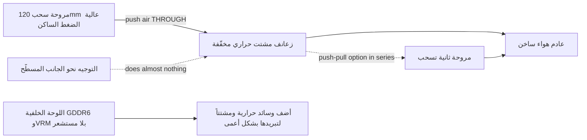

> 🌐 ترجمة مجتمعية. النسخة الإنجليزية هي المرجع الأساسي وقد تكون أحدث. وجدت خطأ؟ افتح issue: [English](../en/04-cooling.md) · https://github.com/lildebil0/awesome-bc250/issues

# التبريد

> **باختصار** — المشتت الحراري الأصلي للـ BC-250 صُمِّم لنفق هواء مدفوع في خزانة خوادم، لا لمكتب. خارج الصندوق يخنق الأداء. حل المجتمع: **تخفيف كثافة الزعانف الأصلية الكثيفة** (بردها/صنفرتها) وتثبيت **مروحة 120 mm عالية الضغط الساكن** (**Arctic P12 Max/Pro** هي المرجع؛ وNoctua NF-P12 redux هو البديل الفاخر الهادئ) تدفع الهواء *عبرها*. هذا وحده يوصل لوحة معدّلة إلى **~73 °C في Furmark، و63–65 °C في الألعاب**. التبريد المائي AIO والحاويات المخصصة الكاملة هما المستويان التاليان.

التبريد هو **الشيء رقم 1 الذي يخطئ فيه المبتدئ**، فافعل هذا قبل ملاحقة كسر السرعة.

---

## لماذا لا يكفي المبرّد الأصلي

الـ BC-250 لوحة تعدين/خوادم. مشتتها الحراري **سلبي (passive)** ومصمّم ليجلس في هيكل حيث تدفع مراوح صاخبة الهواء من الأمام إلى الخلف عبره. على مكتب بلا تدفق هواء يتشبّع بالحرارة وتخنق وحدة معالجة الرسوميات أداءها. توجيه مروحة *نحو* الجانب المسطّح لا يفعل شيئاً تقريباً — يجب أن ينتقل الهواء **عبر قنوات الزعانف**، بالإضافة إلى فوق اللوحة الخلفية (ذاكرة GDDR6 في الخلف **لا تملك مستشعر حرارة**، فتبرّدها بشكل أعمى).

حدود لاحظها المجتمع: يبدأ خنق الأداء حول **85 °C**، والتعليق/إعادة التشغيل الكامل حول **90 °C**. أبقِ درجات حرارة الحمل تحت ~80 °C مع هامش.

> **توجد ثلاثة أنواع من المشتت الحراري** (زعانف بـ 8 صفوف و9 صفوف). تعريف سريع: **رمز QR بجانب موصل PCIe ذي الـ 8 سنون** يميّز نوع الـ 9 صفوف. النوع ذو **زعانف أقل وأسمك** قد يبرّد أفضل قليلاً بحالته الأصلية. ([elektricM Cooling](https://elektricm.github.io/amd-bc250-docs/hardware/cooling/))

**أهداف الحرارة لكل مكوّن** (أرقام elektricM المختبَرة، أدقّ تفصيلاً من حدّي الخنق/التعليق أعلاه):

| المكوّن | الخمول | حمل خفيف | اللعب | الأقصى |
|-----------|------|-----------|--------|-----|
| حافة GPU/APU | 40–50 °C | 50–60 °C | 65–80 °C | 90 °C |
| المعالج (Tctl) | 45–55 °C | 55–65 °C | 70–85 °C | 95 °C |
| الذاكرة (الجانب السفلي) | 40–55 °C | 50–65 °C | 55–70 °C | 80 °C |
| NVMe/SSD | 40–55 °C | 50–65 °C | 60–75 °C | 80 °C (حرج 81.8 °C) |

استهدف **70–80 °C لوحدة GPU في الألعاب**. يهمّ هنا سقف NVMe لأن **ذاكرة GDDR6 وقرص M.2 SSD يتشاركان الجانب الخلفي الساخن من اللوحة** — يجلس الـ SSD في أسوأ بقعة حرارية ويمكن أن يُطهى، فراقبه (`80 °C` أقصى، `81.8 °C` حرج حسب مواصفة القرص). ([elektricM: sensors](https://elektricm.github.io/amd-bc250-docs/system/sensors/))

> **سلّم CPU Tctl.** يشير elektricM إلى **90 °C Tctl** كنقطة التراجع الموصى بها؛ والـ **95 °C** في الجدول هي الحافة العليا التي ستراها مع اللعب الثقيل؛ و**TJmax = 100 °C** هو الحدّ المطلق للسيليكون (جدول طاقة الحزمة أدناه يثبّت المعالج عند ذلك بالضبط تحت تشغيل ضغط متواصل). إذن: **90 °C = "تراجع الآن"، و95 °C = "في المنطقة الحمراء"، و100 °C = "عند الجدار."** ([elektricM: sensors](https://elektricm.github.io/amd-bc250-docs/system/sensors/))

> **طاقة الحزمة لكل حالة حرارية** (يقرن elektricM كل حالة بسحب طاقة اللوحة): الخمول **50–70 W**، خفيف **100–150 W**، ثقيل **150–200 W**، ضغط **200–235 W**. مفيد لتحديد حجم مزوّد الطاقة وقراءة مدى الجهد الفعلي للوحة من المقبس. ([elektricM: sensors](https://elektricm.github.io/amd-bc250-docs/system/sensors/))

> **عيوب بكسلية أثناء اللعب = ارتفاع حرارة VRAM.** لأن ذاكرة GDDR6 الخلفية لا مستشعر لها، فذلك الخلل البصري هو علامة تحذيرك — أضف تدفق هواء/وسائد للوحة الخلفية (أدناه). ([elektricM Cooling](https://elektricm.github.io/amd-bc250-docs/hardware/cooling/))

> **يانصيب السيليكون — خصّص هامشاً حرارياً لكل شريحة.** لوحتان متطابقتان فيزيائياً، بهيكل واحد وإعداد كسر سرعة واحد، يمكن أن تعملا **بفارق 5–10 °C**، والأسخن بقيت أسخن حتى بعد إعادة المعجون/الوسائد. لا تفترض أن درجات حرارة شخص آخر ستطابق درجاتك. ([r/BC250Gaming](https://www.reddit.com/r/BC250Gaming/))



---

## الحمل الحوسبي المتواصل نظام مختلف (لا مجرّد دفقات اللعب)

تفترض الأهداف أعلاه **اللعب**، حيث يأتي الحمل دفقات. أما الحوسبة **المتواصلة** — `llama-bench` متكرّر، تشغيلات Stable-Diffusion طويلة، أي شيء يثبّت وحدة GPU عشرات الدقائق، **خصوصاً مع [فتح الـ 40 CU](09-overclock-undervolt.md)** — فهي حمل أقسى بكثير وقد يتجاوز ما يحتمله مبرّد بمستوى اللعب.

قاس elektricM مشتتاً حرارياً أصلياً + **مروحتي Arctic P12 Max بالدفع والسحب**، `llama-bench` متواصلاً لمدة 10 دقائق عند **40 CU / 2 GHz**:

| المقياس | المتوسط | الذروة |
|--------|---------|------|
| حافة GPU | 89.6 °C | 107 °C |
| طاقة الحزمة | 136 W | 223 W |
| المعالج | 96.7 °C | 100 °C (TJmax) |
| VRM MOSFETs | 57 °C | 58.5 °C |
| سرعة المروحة | ~2950 RPM | 2977 RPM (السقف) |

تراجعت الإنتاجية **~10 %** خلال التشغيل مع خنق الحزمة لأدائها. الخلاصة: **المشتت الحراري الأصلي + مروحتي P12 Max ليس هامشاً كافياً لـ 40 CU متواصلة @ 2 GHz** — ولاحظ أن **وحدات VRM ليست قريبة إطلاقاً من حدّها** (57 °C)، فعنق الزجاجة هو *المشتت الحراري في تبديده للحرارة*، لا المراوح أو مرحلة الطاقة. حلّان: **تحديد حاكم GPU عند 1500 MHz** (يظل 40 CU يقيس ~1.5× من الحوسبة، وتثبت الحرارة عند ~83 °C — مستدام إلى ما لا نهاية على مروحتي P12 Max)، أو **ترقية المشتت الحراري** (مساحة زعانف أكبر). لـ **اللعب الأصلي بـ 24 CU**، مروحتا P12 Max مريحتان؛ الجدار لا يظهر إلا تحت الحوسبة المتواصلة بكامل وحدات الحساب. ([elektricM Cooling](https://elektricm.github.io/amd-bc250-docs/hardware/cooling/))

---

## المسار A — تعديل الهواء (الأكثر شيوعاً، الأرخص)

هذا ما يشغّله معظم أفراد الدردشة.

### 1. تخفيف/تنظيف الزعانف الأصلية
الزعانف الأصلية كثيفة جداً وكثيراً ما تكون غير منتظمة. يفتح الناس القنوات ليمرّ الهواء:

- **صنفرة مدارية (لامركزية)** — الأسرع، تنجز في دقائق، وأفضل نتيجة. ([src](https://t.me/c/2424231195/31571))
- **ورق صنفرة باليد** — حُبيبات 60 ثم 240، ~3–4 ساعات + ساعتان على مدى يومين. تنجح لكنها بطيئة. ([src](https://t.me/c/2424231195/50330))
- **مقص / قاطع** — طريقة "чекрыжить" الفجّة، الملاذ الأخير؛ النتائج هي الأسوأ. ([src](https://t.me/c/2424231195/41252))
- **مقص + موجِّه مسطرة (نسخة نظيفة)** — أدخل مقص حِرف/حلاقة في فجوة الزعنفة مع **مسطرة مائلة على النصل كموجِّه**؛ "فتّاحة علب" من سكين جيب تعمل بالقدر نفسه. تحذير: بعض أنواع اللوحات **بلا فجوة لبدء النصل** — افتح واحدة بمفك/ملقط، أو اقطع شقّ دخول بـ **قرص قطع Dremel صغير**. النصال الأعرض من شقوق الزعانف قد تتلف المشتت الحراري. ([r/BC250Gaming](https://www.reddit.com/r/BC250Gaming/))
- قوّم الزعانف المنحنية بـ **ملقط مسطّح + كمّاشة**. ([src](https://t.me/c/2424231195/30670))
- **اسحب الزعانف باليد** — يلاحظ elektricM أن زعانف الألمنيوم الطرية يمكن **تمزيقها/فصلها بنظافة باليد** (المشتت الحراري خارج اللوحة)، تفادياً لنشارة المعدن التي تنتجها أدوات القطع. أبطأ لكن بلا حطام. ([elektricM Cooling](https://elektricm.github.io/amd-bc250-docs/hardware/cooling/))
- **"Scooper by Justin"** — **أداة قابلة للطباعة ثلاثية الأبعاد مصنوعة خصيصاً لضغط/فتح زعانف مشتت BC-250 الحراري** ([Printables 1282906](https://www.printables.com/model/1282906-bc-250-scooper)). أأمن من مفك عارٍ: يوقفك عن الدفع بقوة مفرطة وحفر **قاعدة** المشتت الحراري بين الزعانف. ([r/linux_gaming community thread](https://www.reddit.com/r/linux_gaming/comments/1nvsgji/)) اضبط التوقعات: أبلغ مالك واحد أن أداة **"المشط/الملعقة" المطبوعة انكسرت في الاستخدام الثاني** وأرهقت اليدين. ([r/BC250Gaming](https://www.reddit.com/r/BC250Gaming/))
- **كمّاشة هوايات — طريقة "التقشير"** — أمسك **أعلى** الزعانف بكمّاشة هوايات صغيرة وقشّرها، **مستخدماً ذاكرة المعدن نفسها كنقطة كسر** لتنقطع بنظافة عند الانحناء بدل تمزيق القاعدة. بديل قليل الحطام للقطع. ([r/linux_gaming community thread](https://www.reddit.com/r/linux_gaming/comments/1nvsgji/))

عائد الحرارة التقريبي (elektricM): **تقويم الزعانف المنحنية ~5–10 °C**، **إزالة الزعانف المركزية ~10–15 °C** (لا رجعة فيه — غطاء مروحة جيد يحقّق مكاسب مشابهة بلا قطع)، **معجون طازج ~5–10 °C** إن كان المعجون القديم قد جفّ. ([elektricM Cooling](https://elektricm.github.io/amd-bc250-docs/hardware/cooling/))

> ⚠ **انزع المشتت الحراري عن اللوحة أولاً** (أو غطِّ/احمِ اللوحة والشريحة بالكامل) قبل الصنفرة/البرد، و**نظّف كل ذرة غبار معدني قبل إعادة التجميع**. نشارة المعدن الموصِّلة التي تستقر على اللوحة قد تُحدِث قِصراً وتُتلف **اللوحة** — حدث هذا فعلاً في الدردشة.

<p align="center">
  <br>
  <sub>صورة: مجتمع AMD BC-250 · <a href="https://t.me/c/2424231195/31571">المصدر</a></sub>
</p>

### 2. ثبّت مروحة حقيقية
ركّب **مروحة 120 mm عالية الضغط الساكن** تدفع الهواء عبر الزعانف. الاختيار المرجعي هو **Arctic P12 Max (أو P12 Pro)** — أعلى ضغط ساكن (~6.9 mm H₂O)، خيار المجتمع + elektricM لهذا المشتت الحراري الكثيف. أما **Noctua NF-P12 redux** فهو البديل الفاخر الهادئ، وسجّل نتيجة مرجعية بلغت **أقصى 73 °C في Furmark، و63–65 °C في الألعاب** ([src](https://t.me/c/2424231195/42843)).

**اختيارات مراوح ملموسة بمواصفاتها** (elektricM — اختر بناءً على *الضغط الساكن*، لا تدفق الهواء):

| المروحة | الحجم | أقصى RPM | الضغط الساكن | تدفق الهواء | الضوضاء | حرارة اللعب |
|-----|------|---------|----------------|---------|-------|--------------|
| **Arctic P12 Max** | 120 mm | 3300 | **6.9 mm H₂O** | 73.3 CFM | 52.5 dB(A) | 65–75 °C |
| **Arctic P12 Pro** | 120 mm | 2100 | **6.9 mm H₂O** | 68.9 CFM | 37.8 dB(A) | 65–75 °C |
| Arctic P14 PWM | 140 mm | 1700 | 2.40 mm H₂O | 72.8 CFM | 38 dB(A) | 70–80 °C |
| Noctua NF-A12x25 | 120 mm | 2000 | 2.34 mm H₂O | 60.1 CFM | 22.6 dB(A) | 70–85 °C |

أكثر اختيارات elektricM توصيةً هو **Arctic P12 Max / P12 Pro** — ضغطه الساكن ~6.9 mm H₂O يقزّم ضغط Noctua البالغ 2.34 mm وهو أرخص بكثير؛ والـ P12 Pro هو النسخة الأهدأ والأوفر توفّراً. الـ Noctua الفاخر أهدأ منه لكنه يطابق الـ Arctic في الحرارة فقط عند RPM أعلى. ([elektricM Cooling](https://elektricm.github.io/amd-bc250-docs/hardware/cooling/))

**مراوح أخرى مذكورة من بنى المجتمع** (طرز محدّدة ركّبها الناس، بخلاف مرجع Arctic/Noctua-P12):

- **Noctua NF-A12x25 G2** (PWM) كـ **مبرّد شريحة 120 mm** — مراجعة G2 الأحدث من A12x25، استُخدمت كمروحة رئيسية ([TiredDadTech](https://youtu.be/zi7sldeRd2w)). (يدرج جدول المراوح أعلاه النسخة *الأصلية* فقط من NF-A12x25.)
- **Noctua NF-A6x15 PWM** (≈3500 rpm) كـ **استبدال لمروحة مزوّد الطاقة 60 mm** — البديل الهادئ لمروحة قالب الخادم الصارخة ([TiredDadTech](https://youtu.be/zi7sldeRd2w)).
- **Thermalright 120 mm 1550 rpm ARGB** كمروحة شريحة اقتصادية، و**وسائد حرارية 6.0 W/mK** للوحة الخلفية — كلاهما من **قائمة مكوّنات بناء TMG HD** ([نظرة عامة على البناء](https://youtu.be/OEO0r01zcfU)).

> **المرجع مقابل البديل الهادئ.** الـ **Arctic P12 Max/Pro** هو المروحة المرجعية هنا — أعلى ضغط ساكن (~6.9 mm H₂O)، الأرخص، خيار المجتمع + elektricM لهذا المشتت الحراري الكثيف. أما **Noctua NF-P12 redux** فهو البديل الفاخر الهادئ (نتيجة 73 °C في Furmark من الدردشة)، يطابق الـ Arctic في الحرارة فقط عند RPM أعلى. اختر Arctic لأفضل سعر/أداء، وNoctua إن كان الهدوء هو الأهم.

استخدم **غطاء/مهايئ مروحة مطبوعاً** ليُحكِم إغلاق المروحة على المشتت الحراري بدل تسريب الهواء حولها. ملفات STL مجتمعية:
- `Fan_Shroud_Single_120mm.stl`, `Fan_Shroud_Dual_120mm.stl`, `Fan_Shroud_Single_140mm.stl`, `Twin_120mm_Fan_Shroud.stl`
- `BC250_FanAdapter_120mm.step`, `bc250 cooler mount.stl`, `cooler adapter v3.0.stl`

> **لماذا الضغط الساكن لا تصنيف تدفق الهواء؟** الزعانف الكثيفة حمل عالي المقاومة. "مروحة هيكل" عالية تدفق الهواء تتوقف أمامها؛ ومروحة عالية الضغط الساكن (≥3 mm H₂O؛ Noctua P12، Arctic P12) تدفع الهواء فعلاً *عبرها*. للزعانف شديدة الكثافة، مروحتان بالدفع والسحب (على التوالي) تضاعفان الضغط الساكن — هذا هو التصرّف الصحيح هنا، لا مروحتان جنباً إلى جنب.

**التثبيت:** الغطاء المطبوع هو الأفضل، لكن **ربط المروحة برباط بلاستيكي (zip-tie)** على المشتت الحراري يعمل، و**مجرى هواء من كرتون/لوح رغوي** ملصق بين المروحة والزعانف بديل مجاني صالح (قبيح، غير متين، لكنه يُحكِم مسار الهواء). ([elektricM Cooling](https://elektricm.github.io/amd-bc250-docs/hardware/cooling/))

> ⚠ **لا تثقب/تبرغِ المراوح مباشرةً في الزعانف.** الألمنيوم طري والزعانف رقيقة — البرغي فيها يتلف رصّة الزعانف ويضرّ بالتبريد. استخدم أربطة بلاستيكية أو غطاءً مطبوعاً. ([elektricM Cooling](https://elektricm.github.io/amd-bc250-docs/hardware/cooling/))

> ### 🛠 هندسة تدفق الهواء — ما يحدِث الفرق فعلاً
>
> نتائج المجتمع حول *كيفية* تحريك الهواء، لا مجرّد أي مروحة:
>
> - **الضغط الساكن يتغلّب على CFM الخام** عبر رصّة الزعانف الكثيفة — لهذا تتفوّق **Arctic P12 Max (6.9 mm H₂O)** عالية الضغط الساكن على المراوح الأهدأ عالية تدفق الهواء/منخفضة الضغط على هذا المشتت الحراري.
> - **مروحة واحدة في المنتصف قد تتغلّب على اثنتين جنباً إلى جنب** على مستوى زعانف مقطوع بالكامل: مروحة مركزية واحدة تحمّل **الأنابيب الحرارية المركزية الأربعة** مباشرةً، بينما تترك مروحتان "خياطة" ميتة من البلاستيك فوق المركز. القائم بأول قطع للزعانف بالمستوى الكامل قاس درجتين مئويتين **أقل** على مروحة مركزية واحدة منه على اثنتين ([src](https://t.me/c/2424231195/46175)). يصل تفكيك إلى الاستنتاج نفسه من جانب تدفق الهواء: **مروحتان مثبّتتان جنباً إلى جنب ليستا أفضل من واحدة** لأن **منطقة ميتة تتشكّل فوق مركز الشريحة الساخن** حيث يلتقي مأخذا الهواء — **اترك فجوة بينهما، أو اذهب للدفع والسحب بدلاً من ذلك** ([Old Lamer — Part VII](https://youtu.be/pxahl9-YgkY) ~19:55). *(مصدره التعليق التوضيحي — عامِله كنوعي لا دقيق.)*
> - **حدّ أدنى لسرعة مروحة 120 mm ≈1800 RPM** لتحريك الهواء فعلاً عبر هذه الرصّة الكثيفة؛ والـ **Arctic P12 Pro** ($8–10، مدى **600–3000 rpm**) خيار سهل يخمل بهدوء ويظل يملك الهامش ([Old Lamer — Part VII](https://youtu.be/pxahl9-YgkY)). *(أرقام ASR — تقريبية.)*
> - **أضف مروحة عادم = −3 إلى −5 °C.** سحب فقط **73 °C** → مع عادم **67–68 °C** ([src](https://t.me/c/2424231195/68183)، [src](https://t.me/c/2424231195/31553)). فالإعداد البسيط الأمثل هو **مروحة سحب مركزية واحدة + مروحة عادم خلفية واحدة**، لا مروحتي سحب جنباً إلى جنب.
> - **اللوحة الخلفية عمياء وساخنة.** تبلغ VRM MOSFETs **~100 °C بلا تبريد** ([src](https://t.me/c/2424231195/110955)) — **يجب** أن تحصل على وسائد + مشتتات + تدفق هواء مخصّص؛ ومع مشتتات خلفية تعمل *"باردة تحت الحمل"* ([src](https://t.me/c/2424231195/93056)).
> - **فيزياء مجانية.** الهواء الدافئ يرتفع، فحتى توجيه **إمالة/مدخنة** يساعد — لوحة خلفية بالكاد مهوّاة قِيست عند **47 °C من الحمل الحراري وحده** ([src](https://t.me/c/2424231195/76962)). والمشعّ **المؤكسد بالأسود يشعّ ~1.8×** المصقول، ما يتيح تقليص مساحة الزعانف **~45 %** في البنى المدمجة السلبية/شبه السلبية ([src](https://t.me/c/2424231195/86878)).
> - **شغّل السحب > العادم** (ضغط **إيجابي** طفيف) ليبقى VRM/VRAM بلا مستشعر مغموراً بهواء طازج.

### بديل: أبقِ الزعانف الأصلية (حالة الدفع والسحب بلا قطع)
قطع الزعانف ليس إلزامياً. صمّم **penzoiders** حاوية ([MakerWorld، مصدر FreeCAD](https://makerworld.com/models/2505974)) **لا** تقطع المشتت الحراري: تستخدم **مراوح دفع وسحب عالية الضغط الساكن** لدفع الهواء عبر **الزعانف الأصلية غير المعدّلة**، بالإضافة إلى **فرق ضغط بين حجرتين** يبرّد اللوحة الخلفية أيضاً (مشتتات 5 mm + وسائد حرارية؛ مشتتات NVMe المعاد استخدامها تعمل). ضبط يبقى بارداً: **CPU 3800 MHz / 1050 mV، GPU 2100 MHz / 950 mV** → Furmark + `stress-ng` بالتوازي يبقى **تحت 85 °C**؛ واللعب **~75 °C عند حوالي 50 % من دورة المروحة** (منحنى CoolerControl)، "بالكاد مسموع". ([r/BC250Gaming](https://www.reddit.com/r/BC250Gaming/))

## المسار B — مبرّد سائل AIO

مبرّد AIO بقياس 120 mm مثبّت على الشريحة عبر حامل مهايئ. هادئ وبارد، لكن أجزاء وتكلفة أكثر. تستخدم البنى الشائعة مبرّدات AIO رخيصة (مثل aigo). ([مصدر مثال](https://t.me/c/2424231195/19336))

<p align="center">
  <br>
  <sub>صورة: مجتمع AMD BC-250 · <a href="https://t.me/c/2424231195/19336">المصدر</a></sub>
</p>

**حامل AIO مذكور وقابل للتنزيل — NexGen3D** ([Printables 1554003](https://www.printables.com/model/1554003)، اطبعه بـ ABS-GF أو PETG). جرى التحقّق منه بـ **مبرّد Thermalright 240 mm AIO**: GPU **~50 °C @ 2000 MHz**، CPU **أقصى 60 °C**. ([r/BC250Gaming](https://www.reddit.com/r/BC250Gaming/))

### ملفّات كسر السرعة بالتبريد السائل
مع AIO يمكنك الدفع أقوى بكثير. **NexGen3D** قاس من المقبس (Furmark Vulkan + `stress-ng --matrix 0 -t 60m` كتوليفة الحرق):

| الملف | CPU | GPU | أقصى حرارة حرق | طاقة المقبس | ملاحظة |
|---------|-----|-----|---------------|------------|------|
| 1 | 4000 MHz | 2400 MHz | ~65 °C | >350 W | "صامت تماماً" |
| 2 | 4100 MHz | 2450 MHz | ~75 °C | <400 W | أسخن، أعلى صوتاً |

اللعب العادي بدقة 1080p يعمل **10–15 °C تحت** درجات حرارة الحرق هذه و**تحت 250 W** على الملف 1. **مخطّط تدفق هواء يستحقّ النسخ:** مراوح الـ 120 mm **تطرد الهواء عبر المشعّ**، ما يسحب هواءً خارجياً طازجاً عبر **VRM / مزوّد الطاقة / اللوحة الخلفية لـ VRAM**؛ ومروحة منفصلة **80 mm (Arctic P8 Max)** تبرّد وحدات VRM في GPU — هذا يجيب على تحذير "VRM/VRAM بلا مستشعر لا يزال يحتاج تدفق هواء" أعلاه. ([r/BC250Gaming](https://www.reddit.com/r/BC250Gaming/))

## حلقة ماء مخصّصة (متقدّم)

أبعد من AIO المغلق، يشغّل قلّة **حلقة مخصّصة كاملة**. مشهد حقيقي لكنه **DIY/خبير**: يقوم البناة بـ **تفريز CNC أو لحام مكتل ماء مخصّص** يغطّي **الشريحة *و* VRM** في كتلة واحدة ([src](https://t.me/c/2424231195/131065)، [src](https://t.me/c/2424231195/131844)، [src](https://t.me/c/2424231195/118582)). الوصلات غير حرجة — *"يمكنك تأمين أو خرط أو لصق أي وصلة تقريباً"* ([src](https://t.me/c/2424231195/132007)).

**ماذا يمنحك:** حلقة مخصّصة خشنة تبلغ **~50 °C تحت الحمل والمراوح عند 30 % فقط، والمضخة الخارجية شبه صامتة** ([src](https://t.me/c/2424231195/133040)). (ثم لاحظ أحد البناة صفير ملف من خانقات VRM تحت الحمل على إعداد حاكم cyan-skillfish الافتراضي — مشكلة *منفصلة*، لا حرارية.) كما أنك **لا تحتاج Corsair Commander**: [التحكم في المروحة](#التحكم-في-سرعة-المروحة-برمجياً) الخاص بالـ BC-250 يمكنه تشغيل المضخة بالإضافة إلى **~5 مراوح** ([src](https://t.me/c/2424231195/140123)).

> ⚠ **لماذا هذا "متقدّم": الـ BC-250 لا ينجو من فيضان مبرّد.** أعطال حقيقية من المجتمع: خرطوم **انثنى عند 90°، انفجر، وأغرق GPU ومزوّد الطاقة** ([src](https://t.me/c/2424231195/81158))؛ ومضخة Corsair AIO **علقت فطهت المعالج** ([src](https://t.me/c/2424231195/133147)، [src](https://t.me/c/2424231195/126053)). راقب أيضاً **تكهّف/ضوضاء المضخة فوق ~50 % من سرعتها** ([src](https://t.me/c/2424231195/7034)). **اختبر تسرّب الحلقة كاملةً خارج اللوحة لمدة 24 ساعة قبل أول تشغيل مبلّل.**

**الحكم:** أدنى درجات حرارة وأهدأ من أي خيار، ويتيح 40 وحدة حساب متواصلة — لكنه الأعلى خطراً وجهداً. **ليس لبناء أول.**

## المسار C — نافخ ("улитка") — غير موصى به

مراوح نافخة منتزعة من بطاقات GPU كانت تجربة مبكرة. صاخبة بالنسبة للنتيجة؛ انتقل الناس إلى المسار A. ([src](https://t.me/c/2424231195/100086))

## المسار D — تحويل لمبرّد برجي (متقدّم)

يبرغي بعض المستخدمين **مبرّداً برجياً لمقبس AM4** (مثل **Thermalright Peerless Assassin**، أو أبراج AM4/AM5 أخرى) على الشريحة لتبريد ممتاز وهادئ باستخدام عتاد جاهز. المأخذ: يجب أن **تثبّته عبر حامل**، وقد يحجب برج عالٍ **فتحة M.2 أو مكوّنات أخرى**. ليس تعديلاً لمبتدئ. لم تعد مضطراً لصنع واحد من الصفر — يوجد حاملان مطبوعان ثلاثي الأبعاد منشوران:

- **مهايئ مبرّد مكتبي AM4/AM5** ([MakerWorld 2596083](https://makerworld.com/en/models/2596083)، مع مصدر FreeCAD). يثبّت مبرّد AM4/AM5 مكتبياً قياسياً على الـ BC-250. التثبيت: **براغي M5 + صواميل، بلا فواصل** (يلاحظ الناشر أن M4 سيكون مثالياً لكن M5 كان مناسباً بإحكام). اطبعه بـ **ABS أو PETG أو ASA**. جرى التحقّق عند **CPU 3.95 GHz / 1.150 V، GPU 2200 MHz / 1000 mV، وحرارة لا تتجاوز 80 °C**. المبرّدات المستخدمة: **من فئة AXP90** منخفض الارتفاع (استخدم أحد المعلّقين **AXP120**)، وحتى **AMD Wraith Spire** تغلّب على المشتت الحراري الأصلي. ([r/BC250Gaming](https://www.reddit.com/r/BC250Gaming/))
- **حامل Thermalright AXP90-X53** ([Printables 1694793](https://www.printables.com/model/1694793)). تُلحَم إدخالات لولبية في **الجانب السفلي** من الحامل المطبوع لكي **تعيد استخدام براغي المشتت الحراري الأصلية المحمّلة بنابض**؛ تأتي براغي رأس الزر من الأسفل وتُغطَّس، وللحامل **فجوة 0.5 mm تحت الدعامة** لتفادي مكوّنات اللوحة. صُمِّم بـ Fusion 360، و**اطبعه بـ PETG** (يلين PLA عند هذه الحرارات). النتيجة: **65–67 °C تحت الحمل الكامل @ 2150 MHz بدقة 1080p**، هادئ جداً (مبرّد نحاسي، مقترن بمروحة Arctic P12 Pro 120 mm). ارتفاع الرصّة المقيس **54 mm من اللوحة إلى أعلى مروحة الـ 15 mm** — مفيد لملاءمة الحاوية. توجد أيضاً **مجموعة بثلاثة سُمكات** ونسخة **AXP120-X67**. ([r/BC250Gaming](https://www.reddit.com/r/BC250Gaming/))

---

## التحكم في سرعة المروحة (برمجياً)

بمجرد تثبيت مروحة، تتحكم في PWM الخاص بها عبر شريحة Super I/O من نوع **Nuvoton NCT6686D** في اللوحة — لكن **يهمّ أيّ تعريف تحمّله** ([مواصفة عتاد elektricM](https://elektricm.github.io/amd-bc250-docs/)):

- **مستشعرات للقراءة فقط** (RPM المروحة، الحرارات): وحدة **`nct6683`** داخل النواة، محمّلة بـ `force=true`. تبلّغ عن القراءات لكنها **لا تستطيع كتابة PWM**، فتبقى المروحة عند ما يضبطه BIOS/البرنامج الثابت.
- **قراءة + كتابة PWM** (ضبط سرعة المروحة فعلاً): استخدم وحدة **`nct6687`** خارج الشجرة من **[Fred78290/nct6687d](https://github.com/Fred78290/nct6687d)**، أيضاً بـ `force=true`. هذه هي التي تبنيها إن أردت منحنيات مروحة / تحكّماً يدوياً بالسرعة بدل المراقبة فقط.

```bash
# monitoring only (in-kernel):
echo 'options nct6683 force=true' | sudo tee /etc/modprobe.d/nct6683.conf
# PWM control (DKMS from Fred78290/nct6687d):
echo 'options nct6687 force=true' | sudo tee /etc/modprobe.d/nct6687.conf
```

> لا تحمّل كليهما — اختر `nct6683` لمستشعرات القراءة فقط أو `nct6687` للقراءة+الكتابة. توصيل المستشعرات (`CPU_FAN1` / `J4003`) وترقيم المراوح بين BIOS↔Linux موجودان في خطوة التحقّق ضمن [06-linux.md](06-linux.md).

**أيّ موصل هو المروحة الرئيسية؟** يبلّغ elektricM أن مروحة التبريد عادةً على موصل **Pump Fan** = **`fan2` / `pwm2`** في sysfs؛ وموصل `CPU Fan` (`fan1`) وموصلات `System Fan` (`fan3`+) عادةً غير مستخدمة. فعّل الوضع اليدوي قبل كتابة PWM (`echo 1 > .../pwm2_enable`، ثم قيمة 0–255 إلى `.../pwm2`). قد يتغيّر ترقيم hwmon بين عمليات إعادة التشغيل — تأكّد بـ `cat /sys/class/hwmon/hwmon*/name`. ([elektricM Cooling](https://elektricm.github.io/amd-bc250-docs/hardware/cooling/))

**منحنيات المروحة بواجهة رسومية — CoolerControl.** بمجرد تحميل `nct6687`، يمنحك **CoolerControl** منحنيات مروحة رسومية: اختر جهاز **nct6686**، وابنِ منحنى على **pwm2** مستخدماً **k10temp Tctl** كمصدر. التثبيت: `ujust install-coolercontrol` (Bazzite)، أو copr الخاص بـ `codifryed/CoolerControl` (Fedora)، أو `coolercontrol` من AUR (Arch)؛ واجهة الويب على `https://localhost:11987`. ([elektricM Cooling](https://elektricm.github.io/amd-bc250-docs/hardware/cooling/))

**أوضاع مروحة BIOS** (إن لم تشغّل تحكّماً من جهة نظام التشغيل): **Default** يثبّت المراوح عند **حدّ أدنى 40 %** (منخفض جداً — غير موصى به)، و**Full Speed** يثبّتها عند 100 % (صاخب لكن آمن)، و**Customize** يضبط سرعات لكل عتبة. ([elektricM Cooling](https://elektricm.github.io/amd-bc250-docs/hardware/cooling/))

> ⚠ **لا تشغّل وضع BIOS Customize وCoolerControl في الوقت نفسه** — يتنازعان على التحكم في PWM. اختر واحداً. ([elektricM Cooling](https://elektricm.github.io/amd-bc250-docs/hardware/cooling/))

---

## الواجهة الحرارية (معجون، وسائد، متغيّر الطور، معدن سائل)

أيّاً كان المروحة/المشتت الحراري الذي تشغّله، فإن **مادة الواجهة الحرارية (TIM)** بين الشريحة والمشتت الحراري — وبين خلف اللوحة وأي مشعّ لوحة خلفية — تستحق ضبطها جيداً. شريحة الـ BC-250 ذات **كثافة حرارية عالية**، فالـ TIM الجيد بضع درجات مجانية.

> **مجرّد تغيير المعجون الأصلي يساعد.** بدّل أحد المالكين المعجون المصنعي بعد سنة فانخفضت درجات حرارة الحمل **~4–5 °C**، مع بقاء كل شيء آخر دون تغيير. ([src](https://t.me/c/2424231195/88565))

### معاجين تعمل
- **Arctic MX-6** — معجون عادي راقٍ. في بناء بحاوية حافظ على **87–88 °C في Furmark**؛ ولاحظ المالك نفسه أن PTM7950 سيقتطع ~4 °C إضافية من ذلك. ([src](https://t.me/c/2424231195/30211))
- **المعجون الأصلي + الوسائد الأصلية** هما خطّ الأساس الموثّق: ~**76 °C** بعد 10 دقائق حمل، ~**55 °C** خمول (قبل تعديل الزعانف/المروحة). ([src](https://t.me/c/2424231195/22992))
- معاجين أخرى يدرجها elektricM كجيدة هنا: **Arctic MX-4** (قيمة)، **Thermal Grizzly Kryonaut** (فاخر)، **Noctua NT-H1** (موثوق)، **Thermalright TFX** (اقتصادي). معجون اللوحات المستعملة **غالباً جاف** — مجرّد إعادة المعجون تستحق **~5–10 °C**. ضع نقطة بحجم حبة بازلاء على الشريحة، وثبّت بالتساوي، واربط البراغي بنمط **X**. ([elektricM Cooling](https://elektricm.github.io/amd-bc250-docs/hardware/cooling/))

### PTM7950 — مفضّل المجتمع (موصى به)
**PTM7950** هو **وسادة متغيّرة الطور** (فيلم جرافيت/متغيّر الطور من Honeywell). في حرارة الغرفة هو رقاقة صلبة رقيقة؛ وعند الحمل (~45–55 °C) يلين ويتدفّق إلى طبقة بسماكة ميكرونية، ثم يثبت مكانه. **لا يُضخّ خارجاً** ولا يجفّ كالشحم، وهو بالضبط ما تريده تحت شريحة ساخنة تتقلّب حرارياً — فتضعه مرة وتنساه. خلاصة الدردشة الصريحة: *"PTM7950 ولا تفكّر كثيراً"* ([src](https://t.me/c/2424231195/101582))؛ ومتغيّر الطور هو التوصية العامة ([src](https://t.me/c/2424231195/61511)).

**كيفية التطبيق:**
1. نظّف الشريحة وقاعدة المشتت الحراري (كحول أيزوبروبيل)، واترك ليجفّ.
2. اقطع مربّعاً من PTM7950 بحجم الشريحة — قطعة **~26×30 mm** تغطّي شريحة الـ BC-250 ([src](https://t.me/c/2424231195/125748)).
3. اقشر فيلماً واقياً واحداً، ضع الوسادة على الشريحة، ثم اقشر الفيلم الثاني.
4. ثبّت المشتت الحراري واربطه بعزم متساوٍ. **بلا فرد** — أول دورة حرارة تنجز العمل. توقّع أفضل حرارة بعد بضع دورات حمل/خمول ("التطويع").

بناء مرجعي بحاوية على PTM7950 (Honeywell، 26×30) بالإضافة إلى مشعّ لوحة خلفية يبلغ ذروته عند **~84 °C على مدى ساعة، و66–71 °C في الألعاب** عند CPU 3850 MHz / GPU 2100 MHz. ([src](https://t.me/c/2424231195/125748))

> **اقتران مذكور: معجون Upsiren اللزج تحت المشتت الحراري + PTM7950 على الشريحة.** يقرن فيديو بناء **معجون Upsiren UTP-6 / UTP-8 اللزج** (درجة **UTP-8** مصنّفة ≈**14.8 W/mK**) للبقع المالئة للفجوات مع **رقاقة PTM7950 مقطوعة 40×80×0.25 mm** موضوعة على الشريحة ([فيديو PTM7950 + Upsiren](https://youtu.be/FJapqZSdt6I)). المعجون اللزج لملء الفجوات غير المنتظمة نحو مشتت حراري/لوحة؛ وفيلم متغيّر الطور يذهب على الشريحة نفسها.
>
> - **PTM7950 الرخيص من AliExpress يعمل.** جرى التحقّق من أداء رقاقة AliExpress بحوالي **$13** — لست بحاجة لقطعة Honeywell ذات العلامة التجارية ([فيديو PTM7950 + Upsiren](https://youtu.be/FJapqZSdt6I)).
> - **PTM7950 يحتاج تطويعاً.** يبلغ أفضل حرارته فقط بعد **عدة دورات تسخين/تبريد** — لا تحكم عليه في التشغيل الأول ([عرض TIM لحاسوب محمول](https://youtu.be/U4Zm8msXJHM)).
>
> *(كلا المصدرين بتعليق توضيحي تلقائي — عامِل قيم W/mK والأبعاد بدقّتها كتقريبية.)*

### وسائد اللوحة الخلفية وGDDR6 (برّد الخلف بشكل أعمى)
**ذاكرة GDDR6 وVRM في خلف اللوحة لا تملك مستشعر حرارة** — فتبرّدها بشكل أعمى. أضف **مشتتاً/مشعّاً على اللوحة الخلفية** مقروناً بـ **وسائد حرارية** ليكون لحرارة الجانب الخلفي مكان تذهب إليه. ([src](https://t.me/c/2424231195/125748)) أمسك أحد البناة الروس ببساطة **مشتتاً حرارياً من Yandex.Market**، ألصقه على اللوحة الخلفية، فـ **برّد اللوحة السفلية جيداً** — أي مشتت ألمنيوم بحجم معقول يؤدي المهمة هنا ([4pda — mananoid1](https://4pda.to/forum/index.php?showtopic=1104980)).

سُمكات وسائد مبلّغ عنها (مشاركة مجتمعية، بتفاعل "حفظت هذا"):
- **VRM: 1 mm**
- **GDDR6: 2 mm** ([src](https://t.me/c/2424231195/121181))

> ⚠ **تحقّق** — تعتمد هذه السُمكات على الفجوة نحو لوحتك الخلفية/مشعّك المحدّد. تأكّد بقياس الفجوة (أو اختبار معجون/صلصال) قبل شراء كومة وسائد.

يعطي elektricM **مخطّط وسائد مختلفاً قليلاً** لتبريد الذاكرة نفسها: **وسائد 1.5 mm على *مقدّمة* اللوحة، و2.0 mm على *الخلف***، ثم لوحة/مشتت ألمنيوم على الجانب السفلي. استخدم وسائد **غير موصِّلة فقط** قرب اللوحة (لا معجون/وسائد موصِّلة قد تُحدِث قِصراً في المكوّنات). العلامات التي يدرجها: **Thermalright Odyssey** (أداء عالٍ)، **Arctic Thermal Pad** (قيمة)، **Gelid GP-Ultimate** (فاخر). ([elektricM Cooling](https://elektricm.github.io/amd-bc250-docs/hardware/cooling/))

> ⚠ **تحقّق (سُمكات الوسائد تختلف بين المصادر)** — أرقامنا من الدردشة هي **VRM 1 mm / GDDR6 2 mm (خلف)**؛ ويحدّد elektricM **1.5 mm مقدّمة / 2.0 mm خلف** لشرائح الذاكرة. بنى مختلفة، فجوات مختلفة — **قِس خلوصك أنت** بدل الثقة بأيٍّ من الرقمين بشكل أعمى.

> **التعليق/عدم الاستقرار بعد 30–60 دقيقة من اللعب** (غالباً مع عيوب بكسلية) هو التوقيع الكلاسيكي لـ **ارتفاع حرارة الذاكرة**. الحلول: أضف وسائد + لوحة سفلية، أضف مروحة لوحة خلفية، حسّن تدفق هواء الحاوية، أو **قلّل مؤقتاً تقسيم VRAM** (مثلاً 4 GB → 512 MB) لخفض حرارة الذاكرة. ([elektricM Cooling](https://elektricm.github.io/amd-bc250-docs/hardware/cooling/))

### المعدن السائل — عموماً غير موصى به هنا
يُطرح المعدن السائل (LM) لأن PS5 (APU من العائلة نفسها) يستخدمه ([src](https://t.me/c/2424231195/18105))، وفي الأداء الخام يتفوّق قليلاً على المعجون/PTM ([src](https://t.me/c/2424231195/124112)). سأل الناس عنه وجرّبوه على الـ BC-250 ([src](https://t.me/c/2424231195/18098)، [src](https://t.me/c/2424231195/77180)).

**لكنه القرار الخاطئ على هذه اللوحة:**
- المعدن السائل **موصِّل كهربائياً**. تجلس شريحة الـ BC-250 مباشرةً بجوار **GDDR6 وVRM كثيفين**؛ وقطرة تفرّ من الشريحة تُحدِث قِصراً في اللوحة (نفس خطر "الشيء الموصِّل قرب الذاكرة يتلفها" الوارد في تحذير نشارة المعدن أعلاه).
- **يُضخّ خارجاً / يحتاج إعادة عمل سنوياً تقريباً**، ويهاجم الألمنيوم العاري — حتى مناصر PTM7950 تخلّى عن المعدن السائل على عتاده لهذا العناء بالضبط، وتحوّل إلى PTM7950 / KryoSheet. ([src](https://t.me/c/2424231195/69688))
- "لن يقبل الجميع حتى مهمة العمل بالمعدن السائل." ([src](https://t.me/c/2424231195/106787))

**الخلاصة:** **PTM7950 هو الخيار الأأمن عالي الأداء** — ~99 % من الفائدة، بلا أيٍّ من خطر القِصر/الصيانة. احتفظ بالمعدن السائل لمن يعرفون فعلاً ما يفعلونه بالضبط.

---

## كيف تختبر تبريدك (طريقة المجتمع، مثبّتة)

من الإجراء المثبّت ([src](https://t.me/c/2424231195/108407)):

1. **ضغط GPU:** Furmark (Vulkan / "Furmark VK").
2. **المعالج في الوقت نفسه:** أضف اختبار معالج (cpu-x) أو حملاً قائماً على `stress`/`pipx` — يتشارك الـ APU مشتتاً حرارياً واحداً، فاختبر كليهما معاً.
   - هذه الأدوات (Furmark، OCCT، cpu-x، `stress`) **ليست مثبّتة مسبقاً** على نظام Linux جديد — ثبّتها عبر مدير الحزم أو Flatpak أولاً.
3. **اختبر تحت كسر سرعتك**، لا بالحالة الأصلية — 1500 MHz ضعيف؛ و**2000 MHz هو ~+30 % إطارات** وما ستشغّله فعلاً، فبرّد لأجله.
4. راقب الحرارة؛ إن تجاوزت ~85 °C فأنت تخنق الأداء — أضف عمل مروحة/غطاء/زعانف.

> ℹ️ **لا تخلط بين ادّعاءين مختلفين بـ "+30 %".** الـ **+30 % لساعة GPU** هنا (1500 → 2000 MHz ترفع الإطارات بحوالي الثلث) هو مكسب *أداء* من كسر السرعة. وهو **ليس** نفس **التحسّن الحراري ~+30 %** المذكور لـ **إعادة معجون** في عرض منفصل لواجهة حرارية لحاسوب محمول ([عرض TIM لحاسوب محمول](https://youtu.be/U4Zm8msXJHM)) — ذاك نتيجة *حرارة* على عتاد مختلف. نفس الرقم، أشياء غير مترابطة.

يوجد أيضاً عرض فيديو قصير لأبسط طريقة مثبّت في الموضوع. ([src](https://t.me/c/2424231195/100024))

---

## الإعداد المبدئي الموصى به

| المستوى | افعل هذا | توقّع |
|------|---------|--------|
| الأدنى | صنفر الزعانف (صنفرة مدارية) + 1× Arctic P12 Max/Pro (أو Noctua NF-P12) + غطاء مطبوع | ~73 °C Furmark |
| أفضل | دفع وسحب (2× P12) عبر غطاء | أقل، أهدأ عند الحرارة نفسها |
| الأقصى | AIO 120 mm على مهايئ | الأبرد، جهد بناء أكثر |

---

## المصادر

- طريقة الاختبار المثبّتة — https://t.me/c/2424231195/108407 · فيديو — https://t.me/c/2424231195/100024
- أدوات الزعانف — https://t.me/c/2424231195/31571 · https://t.me/c/2424231195/30670 · https://t.me/c/2424231195/50330 · أداة زعانف "Scooper by Justin" ([Printables 1282906](https://www.printables.com/model/1282906-bc-250-scooper)) + طريقة التقشير بكمّاشة الهوايات — [r/linux_gaming thread](https://www.reddit.com/r/linux_gaming/comments/1nvsgji/)
- نتيجة Noctua P12 — https://t.me/c/2424231195/42843
- مثال AIO — https://t.me/c/2424231195/19336
- الواجهة الحرارية — إعادة المعجون −4–5 °C https://t.me/c/2424231195/88565 · MX-6 https://t.me/c/2424231195/30211 · خط الأساس الأصلي https://t.me/c/2424231195/22992 · PTM7950 https://t.me/c/2424231195/101582 · https://t.me/c/2424231195/61511 · بناء PTM7950 + لوحة خلفية https://t.me/c/2424231195/125748 · سماكة الوسائد https://t.me/c/2424231195/121181 · معدن سائل https://t.me/c/2424231195/18098 · https://t.me/c/2424231195/69688
- دليل تبريد elektricM (أنواع المشتت الحراري، جدول الحرارة لكل مكوّن، بيانات الحمل المتواصل، مواصفات المراوح، أوضاع مروحة CoolerControl/BIOS، المبرّد البرجي، مخطّط الوسائد) — https://elektricm.github.io/amd-bc250-docs/hardware/cooling/
- [elektricM: sensors](https://elektricm.github.io/amd-bc250-docs/system/sensors/) (العتبات الحرارية: CPU Tctl 90 °C أقصى / TJmax 100 °C، NVMe/SSD 80 °C أقصى / 81.8 °C حرج، طاقة الحزمة لكل حالة حرارية)
- r/BC250Gaming (تقارير مجتمعية: تباين يانصيب السيليكون، طريقة الزعانف بمقص+مسطرة، كسر أداة المشط، حاوية الدفع والسحب بلا قطع، حامل AIO + نتيجة 240 mm، ملفّات OC بالسائل، حوامل AM4/AM5 + AXP90-X53) — https://www.reddit.com/r/BC250Gaming/ · مهايئ مبرّد AM4/AM5 [MakerWorld 2596083](https://makerworld.com/en/models/2596083) · حامل AXP90-X53 [Printables 1694793](https://www.printables.com/model/1694793) · حامل AIO من NexGen3D [Printables 1554003](https://www.printables.com/model/1554003) · حاوية الدفع والسحب بلا قطع [MakerWorld 2505974](https://makerworld.com/models/2505974)
- مرجع العتاد — [mothenjoyer69/bc250-documentation `hardware.md`](https://github.com/mothenjoyer69/bc250-documentation/blob/main/hardware.md)
- حاويات/مهايئات مع تبريد — [onemorecap/bc-250-sleeve-adapter](https://github.com/onemorecap/bc-250-sleeve-adapter)
- منطقة ميتة فوق الشريحة بمروحتين جنباً إلى جنب / اترك فجوة أو دفع وسحب، حدّ مروحة 120 mm ≈1800 RPM، Arctic P12 Pro ($8–10، 600–3000 rpm) — [Old Lamer — Part VII](https://youtu.be/pxahl9-YgkY) (تعليق تلقائي / ASR — أرقام تقريبية)
- معجون Upsiren UTP-6 / UTP-8 اللزج (UTP-8 ≈14.8 W/mK) + PTM7950 مقطوع 40×80×0.25 mm على الشريحة، PTM7950 الرخيص من AliExpress (~$13) متحقّق منه — [فيديو PTM7950 + Upsiren](https://youtu.be/FJapqZSdt6I) · PTM7950 يحتاج عدة دورات تطويع تسخين/تبريد + إعادة المعجون "+30 %" المنفصلة (حاسوب محمول، لا +30 % لساعة GPU) — [عرض TIM لحاسوب محمول](https://youtu.be/U4Zm8msXJHM)
- مشعّ لوحة خلفية روسي (مشتت Yandex.Market برّد اللوحة السفلية) — [4pda — mananoid1](https://4pda.to/forum/index.php?showtopic=1104980)

> ملفّات STL لغطاء المروحة والمهايئ مفهرسة في [05-case.md](05-case.md) ومنسوخة تحت `assets/stl/`.
