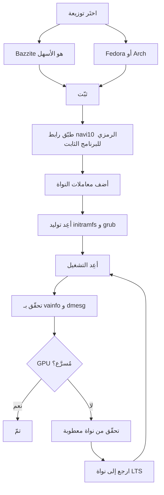

> 🌐 ترجمة مجتمعية. النسخة الإنجليزية هي المرجع الأساسي وقد تكون أحدث. وجدت خطأ؟ افتح issue: [English](../en/06-linux.md) · https://github.com/lildebil0/awesome-bc250/issues

# تعريفات وإعداد Linux

> **باختصار** — معظم الناس يشغّلون BC-250 على Linux، وهو يعمل جيدًا *بمجرد إصلاح GPU*. عند التثبيت المباشر لا يتعرّف `amdgpu` على الشريحة فتحصل على رسم بمعالج (CPU) بإطارات في خانة الآحاد. أمران يجعلانه حقيقيًا: **نواة حديثة + Mesa جديد (25.1+)**، و**إصلاح `amdgpu`** — رابط رمزي للبرنامج الثابت كي يتمكّن التعريف من التحميل (`navi10_gpu_info.bin` → `cyan_skillfish_gpu_info.bin`) بالإضافة إلى معاملات النواة (`amdgpu.sg_display=0`، `mitigations=off`، وعلى النوى الجديدة `amdgpu.bc250_cc_write_mode=3`). أسهل مسار للوافد الجديد: اكتب **[Bazzite](https://bazzite.gg/)** وأعِد الأساس إلى الصورة المخصّصة **`bazzite-bc250`** — الإصلاحات مخبوزة فيها. تريد تعلّم الجهاز: **Fedora** أو **CachyOS/EndeavourOS (Arch)** مع سكربت إعداد لمرة واحدة.

هذا هو القسم الذي يحوّل "لوحة في صندوق" إلى سطح مكتب يعمل. نفّذ [التبريد](04-cooling.md) و[الطاقة](03-power-supply.md) أولًا — ثم هذا.

> **لم تستخدم Linux من قبل؟ عُدّة نجاة في 60 ثانية.**
> - **افتح طرفية:** ابحث عن تطبيق اسمه *Terminal* / *Konsole* (KDE) / *Console* في قائمتك، أو اضغط `Ctrl-Alt-T`.
> - **`sudo`** قبل الأمر يشغّله كمسؤول. سيطلب كلمة مرورك — و**أثناء كتابتك لا يظهر شيء على الشاشة** (لا نقاط ولا نجوم). هذا طبيعي؛ اكتبها واضغط Enter.
> - **`nano /etc/...`** يفتح محرّر نصوص بسيط في الطرفية. للحفظ والخروج: **Ctrl-O**، ثم **Enter**، ثم **Ctrl-X**.
> - **النسخ واللصق** في الطرفية عادةً **Ctrl-Shift-V** (ليس Ctrl-V).
> - كثير من الخطوات لا تسري مفعولها إلا بعد **إعادة تشغيل** (`systemctl reboot`). عندما تقول خطوة "أعِد التشغيل،" أعِد التشغيل فعلًا قبل الحكم على ما إذا كانت نجحت.

---

## الشيء الوحيد الذي يجب أن تفهمه

GPU في BC-250 هو **Cyan Skillfish / Oberon** (قطعة RDNA2 مشتقّة من PlayStation 5). لم يكن لدى `amdgpu` الرئيسي تاريخيًا **أي كتلة برنامج ثابت تحمل اسمه**، لذا عند التثبيت القياسي لا تستطيع النواة تهيئة GPU ويعود سطح المكتب إلى الرسم البرمجي (LLVMpipe) — كل شيء بطيء و`vulkaninfo` لا يُظهر جهازًا حقيقيًا. أمضى أحد المستخدمين أيامًا على "تعريفات معطوبة" قبل أن يدرك أن توزيعته ببساطة أقلعت بنواة لا تستطيع تحميل البرنامج الثابت لـ GPU ([src](https://t.me/c/2424231195/98466)).

لذا كل إعداد ناجح يفعل الأشياء الثلاثة نفسها، بشكل أو بآخر:

1. **شغّل نواة + Mesa جديدتين بما يكفي.** اكتسب Mesa العلوي دعم BC-250 في **25.1** (لا تلزم رقع منذ ذلك الحين؛ **25.3.x** هو المستقر الموصى به حاليًا) — ([Mesa MR !33116](https://gitlab.freedesktop.org/mesa/mesa/-/merge_requests/33116)، [src](https://t.me/c/2424231195/20891)). وصلت مستشعرات الحرارة في **النواة 6.15** ([src](https://t.me/c/2424231195/23542))؛ والنواة **6.18.18 LTS** هي النقطة المثالية الحالية.
2. **أعطِ `amdgpu` البرنامج الثابت الذي يريده** — في الإعدادات الحالية يأتي **`linux-firmware`** المحدّث بالفعل مع `cyan_skillfish_gpu_info.bin`؛ الأنظمة الأقدم ما زالت تحتاج **رابط navi10 الرمزي** (أو حزمة mesa/نواة مرقّعة). انظر المسار C.
3. **مرّر معاملات النواة الصحيحة** وأعِد توليد initramfs + محمّل الإقلاع. (وثبّت **منظِّم GPU** كي لا تبقى الترددات مثبّتة عند 1500 MHz.)

كل ما تحت هذا هو فقط *كيف* تنفّذ كل توزيعة تلك الأشياء الثلاثة.



---

## أي توزيعة؟ (مفضّلات استطلاع المجتمع)

تعود الدردشة مرارًا إلى أربع. لا توجد إجابة "صحيحة" واحدة — إنها مقايضة بين *انعدام الجهد* و*فهم جهازك*. وثائق elektricM تختبر ميدانًا أوسع؛ إليك جميعها بنظرة واحدة ([elektricM: التوزيعات](https://elektricm.github.io/amd-bc250-docs/linux/distributions/)):

| التوزيعة | الأساس | الجهد | إصلاح GPU | الأفضل لـ |
|--------|------|--------|---------|----------|
| **Bazzite** (صورة `bazzite-bc250`) | Fedora atomic | **الأدنى** — الإصلاحات مخبوزة | مطبَّق مسبقًا في الصورة | الوافدون الجدد، "فقط العب الألعاب" |
| **Fedora 43** (Workstation / KDE) | Fedora | منخفض | Mesa 25.x في المستودعات الرئيسية + منظِّم COPR | تعلّم Linux، البقاء قريبًا من العلوي |
| **CachyOS** | Arch | متوسط | Mesa 25.1+ في المستودعات + منظِّم (AUR) | أقصى سلاسة (مجدول BORE)، HDR+VRR |
| **EndeavourOS / Arch** | Arch | متوسط | Mesa 25.1+ في المستودعات + منظِّم | Arch دون ألم التثبيت |
| **Debian (Testing/Sid) / PikaOS** | Debian | متوسط–مرتفع | Mesa من `experimental` (Debian) / جاهز (PikaOS) | الاستقرار، **أدنى طاقة في وضع الخمول (~50–60 W)** |
| **Manjaro** | Arch | متوسط | Mesa 25.1+ في المستودعات؛ يقلع جاهزًا بعد كتابة BIOS | Arch سهل؛ GNOME الأكثر استقرارًا |
| **Alpine** | Alpine (OpenRC) | مرتفع | mesa + برنامج ثابت + منظِّم يدويًا | بأدنى/بلا شاشة، ~150 MB RAM / ~35 W |
| **Fedora CoreOS** | Fedora atomic | مرتفع | مضيف حاويات؛ تخصيصات بعد التثبيت | خوادم حاويات/LLM بلا شاشة |
| **SteamOS** (Valve) | Arch (غير قابلة للتعديل) | متوسط | Mesa من صورة **main-branch** (ليس المستقرة) + منظِّم | إحساس Steam Machine حقيقي؛ أريكة/وضع Gaming |
| **Batocera** | Linux (توزيعة محاكاة) | منخفض–متوسط | Mesa مرفق + إعداد | صندوق **محاكاة** بأسلوب كونسول ([15-emulation.md](15-emulation.md)) |

ملاحظات من الدردشة ومن [elektricM](https://elektricm.github.io/amd-bc250-docs/linux/distributions/):
- **Bazzite هو الأسهل** ولديه **صورة مخصّصة لـ BC-250** مع إصلاح البرنامج الثابت، ومعاملات النواة، ومنظِّم GPU، ورقعة 40-CU/التردد مطبّقة بالفعل. تجدها على artifacthub: [`bazzite-bc250`](https://artifacthub.io/packages/container/bazzite-bc250/bazzite_bc250). انتقل إليها عدّة مستخدمين تحديدًا لإيقاف الترقيع اليدوي ([src](https://t.me/c/2424231195/121246)).
- **اعتبارًا من Fedora 43، Mesa 25.x موجود في المستودعات الرئيسية** — لم يعد COPR الخاص بـ `mixaill/amd-bc-250` مطلوبًا لأجل Mesa فقط. Fedora 42 **منتهية الدعم**؛ رقِّ إلى 43. أثناء التثبيت، إن حصلت على شاشة سوداء، استخدم *Troubleshooting → Install in Basic Graphics Mode* ([elektricM: Fedora](https://elektricm.github.io/amd-bc250-docs/linux/fedora/)).
- **لا تأخذ توزيعات "الألعاب" بشكل أعمى.** يجادل رأي مفصّل بأن **Fedora عاديًا (Workstation/KDE)** أو **Arch خام بنواة LTS + Mesa جديد** هو الحل الوسط الخالي من الألم، وأن الفروع المضبوطة الثقيلة قد *تكسر* أحيانًا Steam/FSR/vsync بدل أن تساعد ([src](https://t.me/c/2424231195/102834)). عامِل هذا كنصيحة "اعتبارًا من أواخر 2025" — فصورة Bazzite نضجت منذ ذلك الحين.
- **CachyOS بدلًا من Bazzite، إن كنت تطارد أقصى سلاسة.** تقرير مجتمعي مفصّل من r/BC250Gaming (Reddit) انتقل من Bazzite إلى **CachyOS** ووجد الألعاب أكثر سلاسة بوضوح بصرف النظر عن المصدر، مع تشنّجات/تجمّدات صغرى أقل (مثل *Mortal Kombat 1*)، وأعطال عشوائية وإعادات تشغيل لوضع Steam أقل، وإحساس سريع الاستجابة جدًا على تخطيط **Btrfs الافتراضي**. كما جعل **HDR + VRR يعملان بشكل صحيح** حيث لم يستطع Bazzite (HDR كان معطلًا، VRR لم يعمل أبدًا) — انظر [14-display.md](14-display.md). عامِله كتجربة واحدة موثّقة جيدًا، لا كحكم عام، لكنه خيار قوي إن تركك Bazzite مع تشنّج أو عدم استقرار. الإعداد آلي عبر سكربت **[`redbeard1083/bc250-toolkit`](https://github.com/redbeard1083/bc250-toolkit)** (BC-250 على CachyOS). ⚠ نقطة بيانات مجتمعية منفصلة تضيف زاوية حرارية/FPS: عند كسر سرعة *مطابق*، يُبلَّغ أن CachyOS يعمل **~10 °C أبرد من Bazzite** ويعطي FPS أعلى في العناوين المقيّدة بالمعالج (مثل *Elden Ring* ~60–75 على CachyOS مقابل ~45–60 على Bazzite) ([+14]، r/BC250Gaming — ما أبلغ به المجتمع، يتفاوت؛ غير مؤكَّد بشكل مستقل).
- **إصدار النواة أهم من التوزيعة.** تجنّب النوى المعروفة بأنها معطوبة (انظر صندوق التحذير أدناه). عند الشك، نواة **LTS** (يُوصى بـ 6.18.18 LTS) هي الخيار الآمن — اصطدم عدّة مستخدمين بجدار على نواة جديدة أكثر مما ينبغي وأنقذهم التبديل إلى LTS ([src](https://t.me/c/2424231195/56529)، [src](https://t.me/c/2424231195/59839)).
- **بيئة سطح المكتب:** **GNOME لديه أفضل سجلّ** على BC-250. عانى KDE Plasma من أعطال Qt في RDRAND/RDSEED — أُصلِحت في Qt حديث (منتصف 2025) لكن GNOME ما زال الافتراضي الآمن؛ Cinnamon (X11) خيار خفيف مستقر ([elektricM: التوزيعات](https://elektricm.github.io/amd-bc250-docs/linux/distributions/)).
- **توزيعتان إضافيتان مؤكَّد إقلاعهما مجتمعيًا** ([خيط مجتمع r/linux_gaming](https://www.reddit.com/r/linux_gaming/comments/1nvsgji/)): **SteamOS** يعمل على BC-250 — لكن استخدم صورة SteamOS من **main-branch**، **لا** القناة المستقرة (المستقرة تأتي مع Mesa أقدم دون دعم BC-250). و**Batocera**، توزيعة المحاكاة المخصّصة، تقلع وتعمل أيضًا — طريقة مريحة لتحويل اللوحة إلى صندوق محاكاة بأسلوب كونسول (انظر [15-emulation.md](15-emulation.md)). كلاهما يتبع القواعد الثلاث نفسها كما كل ما سبق (Mesa حديث + إصلاح البرنامج الثابت لـ `amdgpu` + معاملات النواة/المنظِّم).

> لخّص أحد المخضرمين التجربة بعد ثلاثة أشهر من استخدام BC-250 يوميًا على Linux: الألعاب تنطلق بنقرة واحدة، RTX يعمل، VR يعمل، "بسلاسة مطلقة" — وبدّل سطح مكتبه الأساسي إلى Linux بسببه ([src](https://t.me/c/2424231195/61870)).

---

## المسار A — Bazzite (موصى به للوافدين الجدد)

Bazzite نظام ألعاب غير قابل للتعديل قائم على Fedora (شبيه بـ SteamOS). يصون المجتمع **صورة خاصة بـ BC-250** كي لا تلمس البرنامج الثابت أو معاملات النواة بنفسك.

### A1. ثبّت Bazzite العادي أولًا
1. نزّل من **[bazzite.gg](https://bazzite.gg/#image-picker)** (اختَر متغيّر سطح المكتب أو "Deck"/وضع Gaming).
2. اكتبه إلى USB (Ventoy أو Rufus أو balenaEtcher) وثبّت بشكل عادي. **أنشئ مستخدمًا غير root** — Steam يرفض الانطلاق كـ root ([src](https://t.me/c/2424231195/121246)).

> **اختيار صورة Bazzite الصحيحة (خطوة بخطوة).** على [bazzite.gg](https://bazzite.gg/) اسلك المنتقي **Desktop PC → AMD (modern) → KDE → Gaming-Mode image** — خذ بناء **Gaming-Mode**، لا صورة ISO الحيّة العادية: صورة ISO الحيّة تُثبّت جيدًا لكنها **لا تستطيع فعليًا تشغيل الألعاب**. اكتبها بـ **Balena Etcher** على عصا USB سعة **≥16 GB**. يمكن أن يكون **هدف** التثبيت M.2 NVMe، أو SATA SSD عبر محوّل M.2-إلى-SATA، أو حتى قرص **USB خارجي**. صورة من منتصف نوفمبر 2025 أتت بـ **Mesa 25.2.4** جاهزًا ([Old Lamer — Part IV](https://youtu.be/YuBmGF536II)).

> **عصا الفلاش صغيرة جدًا؟** صورة Bazzite ISO أكبر من 9 GB. يمكنك تثبيت **Fedora** عاديًا (ISO ≈3 GB، مثل Kinoite/KDE) على عصا صغيرة، ثم *إعادة الأساس* إلى Bazzite من الطرفية ([src](https://t.me/c/2424231195/121246)):
> ```bash
> # KDE desktop:
> rpm-ostree rebase ostree-image-signed:docker://ghcr.io/ublue-os/bazzite:stable
> # or with Gaming Mode (SteamOS-like):
> rpm-ostree rebase ostree-image-signed:docker://ghcr.io/ublue-os/bazzite-deck:stable
> ```
> أعِد التشغيل وأنت في Bazzite.

### A2. ثبّت منظِّم GPU (أبسط مسار حالي)
اعتبارًا من أوائل 2026، **نواة Bazzite القياسية تتضمّن بالفعل رقعة نطاق تردد GPU** — لذا عادةً **لا تحتاج صورة مخصّصة على الإطلاق**. فقط ثبّت المنظِّم فوق Bazzite العادي ([elektricM: Bazzite](https://elektricm.github.io/amd-bc250-docs/linux/bazzite/)):
```bash
sudo dnf copr enable filippor/bazzite
rpm-ostree install cyan-skillfish-governor-smu   # SMU variant — no kernel patch needed
systemctl reboot
sudo systemctl enable --now cyan-skillfish-governor-smu.service
# Pin the known-good deployment so an update can't silently break you:
rpm-ostree pin 0
```
الـ **`cyan-skillfish-governor-smu`** يقود الترددات عبر استدعاءات برنامج SMU الثابت ويحلّ محلّ `oberon-governor` الأقدم (انظر *[منظِّم الطاقة](#b3-منظِّم-الطاقة-cyan-skillfish-governor)*). يوجد أيضًا متغيّر `cyan-skillfish-governor-tt` لكنه يحتاج رقعة تردد النواة (موجودة بالفعل في Bazzite). ⚠ قد يستهدف المنظِّم البطاقة الخطأ (card0 مقابل card1) — تحقّق إن لم يبدأ التحجيم.

### A2-alt. (اختياري) أعِد الأساس إلى صورة BC-250
فقط إن أردت التحسينات الإضافية المخبوزة مسبقًا: بدّل إلى صورة BC-250 مصونة — بناءات **`vietsman` "Bazzite on Steroids"** (إصلاح البرنامج الثابت، معاملات النواة، المنظِّم، رقعة التردد الموسّعة 350–2230 MHz مخبوزة فيها). اختَر سطح المكتب الذي ثبّته — **GNOME هو الافتراضي الموصى به** — وشغّل:
```bash
# GNOME (recommended):
rpm-ostree rebase ostree-image-signed:docker://ghcr.io/vietsman/bazzite-gnome-patched:latest
# KDE:
rpm-ostree rebase ostree-image-signed:docker://ghcr.io/vietsman/bazzite-kde-patched:latest
# Deck / Gaming-Mode (SteamOS-like):
rpm-ostree rebase ostree-image-signed:docker://ghcr.io/vietsman/bazzite-deck-patched:latest
systemctl reboot
```
⚠ تحقّق من الصورة/الوسم الحالي قبل التشغيل — مسارات الصور تتغيّر. الأوامر المحدّثة موجودة على [صفحة Bazzite في وثائق BC-250](https://elektricm.github.io/amd-bc250-docs/linux/bazzite/) (مدرجة أيضًا على artifacthub كـ [`bazzite-bc250`](https://artifacthub.io/packages/container/bazzite-bc250/bazzite_bc250)).

> ⚠ **إعادة الأساس إلى صورة مرقّعة قد تقتل USB WiFi لديك (elektricM Issue #10).** قد لا تتضمّن النواة المخصّصة تعريف دونغل USB WiFi/Bluetooth لديك (BC-250 ليس فيه لاسلكي مدمج). جهّز Ethernet، تحقّق بـ `lsmod | grep <your_driver>` بعد إعادة الأساس، و`rpm-ostree install <driver-package>` إن كان مفقودًا، أو `rpm-ostree rollback && systemctl reboot`.

> **إن كسر فتح 40-CU التحكم بالمروحة أو ذراع Xbox لديك، استبدله بصورة نواة مخصّصة.** فتح 40-CU المدمج في Bazzite (طريقة "Old-Lamer") يُبلَّغ مجتمعيًا أنه يكسر **التحكم بالمروحة ودعم ذراع Xbox** على بعض الإعدادات ([+ r/BC250Gaming — ما أبلغ به المجتمع، يتفاوت]). صورة **[`hafriedlander/kernel-bazzite`](https://github.com/hafriedlander/kernel-bazzite)** هي نواة مخصّصة تصلح ذلك — مؤكَّد أنها *"نواة Bazzite (القديمة) مع رقعة فتح 40CU للوحات BC250،"* مبنية مباشرة من kernel-ark الخاص بـ Fedora مع طقم رقع المحمول/الأداء المعتاد (مُحزّمة أيضًا على AUR كـ `linux-bazzite-bin`). ⚠ ما إذا كانت تحلّ ارتداد المروحة/الذراع المحدّد لديك هو نقطة بيانات مجتمعية، لا ضمان — أبقِ نشرًا معروفًا جيدًا مثبّتًا كي تستطيع `rpm-ostree rollback`.

بعد إعادة التشغيل، حدّث لاحقًا بمساعد Bazzite:
```bash
ujust update          # update everything (or: rpm-ostree upgrade && flatpak update)
rpm-ostree rollback   # if an update breaks something, roll back and reboot
```

> **مطبّان في Bazzite يستحقّان المعرفة** ([elektricM: Bazzite](https://elektricm.github.io/amd-bc250-docs/linux/bazzite/)): **التشنّج الصغري** المستمر حتى في ألعاب 2D الخفيفة عادةً هو فشل Handheld Daemon في حلقة — عطّله بـ `sudo systemctl mask --now hhd`. و**التجمّدات عند تحميل المراحل** بعد كتابة BIOS تعني عادةً **أن CMOS لم يُمسح** — امسح CMOS، وأعِد تطبيق إعداد VRAM.

> ⚠ **عدم قابلية تعديل Bazzite يحجب أدوات الشبكة منخفضة المستوى.** كون `/usr` للقراءة فقط يعني أن أدوات تشكيل الحركة / مكافحة الخنق التي تثبّت خدمات نظام أو أجزاء نواة (مثل أدوات بأسلوب `zapret`) لا تُثبّت بنظافة. إن كنت تعتمد على واحدة — شائع لدى بعض مزوّدي الإنترنت الذين يخنقون Steam — فإن توزيعة قابلة للتعديل (Fedora/Arch) هي المضيف الأسهل (تفاصيل خاصة بروسيا في النسخة الروسية).

### A3. تمّ — تحقّق
انتقل إلى **[التحقّق من تسريع GPU](#التحقّق-من-تسريع-gpu)** أدناه. على صورة BC-250 (أو بعد A2) يكون الرابط الرمزي للبرنامج الثابت ومعاملات النواة والمنظِّم في مكانها بالفعل.

---

## المسار B — Fedora (Workstation / KDE)

Fedora هو المسار غير الذرّي الأكثر توثيقًا ويبقى قريبًا من العلوي. **على Fedora 43 لا تحتاج مكدّسة الرسوميات أي مستودع إضافي — Mesa 25.x موجود بالفعل في المستودعات الرئيسية** ([elektricM: Fedora](https://elektricm.github.io/amd-bc250-docs/linux/fedora/)). الـ COPR الأقدم `mixaill/amd-bc-250` (أدناه) مطلوب فقط على إصدارات ما قبل 43.

### B1. ثبّت Fedora
نزّل **Fedora 43 Workstation أو KDE** ([fedoraproject.org](https://fedoraproject.org/workstation/download)) وثبّت بشكل عادي — **Fedora 42 منتهية الدعم**، رقِّ إلى 43. إن أظهر المثبّت شاشة سوداء، اختَر *Troubleshooting → Install Fedora in basic graphics mode* (هذا يضبط `nomodeset`؛ أزِله بعد دخول التعريفات). خط أساس مُبلَّغ جيدًا من الدردشة: نواة 6.14، GNOME 48، Mesa 25.0.2+ — "يطير" ([src](https://t.me/c/2424231195/29150)). وُصِفت Fedora 41 مع Cinnamon بأنها "مستقرة كالجحيم" وهي تشغّل Cyberpunk وWitcher 3 إلخ ([src](https://t.me/c/2424231195/12756)). على 43 فضّل النواة **6.18.18 LTS** أو **6.17.11+** وتجنّب النطاقات المعطوبة (صندوق التحذير أدناه).

### B2. سكربت الإعداد (يقوم بالعمل نيابةً عنك)
الإعداد القانوني لـ Fedora آلي عبر **`fedora-setup.sh`** الخاص بـ `mothenjoyer69/bc250-documentation`. يفعّل COPR، ويثبّت mesa المرقّع، ويضبط `amdgpu`، ويبني المنظِّم، ويصلح محمّل الإقلاع. الخطوات الدقيقة التي يشغّلها (مدقّقة مقابل السكربت):

```bash
# 1. Patched mesa from COPR
sudo dnf copr enable mixaill/amd-bc-250 -y
sudo dnf upgrade --refresh -y

# 2. amdgpu module option + sensor module
echo 'options amdgpu sg_display=0'    | sudo tee /etc/modprobe.d/options-amdgpu.conf
echo 'nct6683'                        | sudo tee /etc/modules-load.d/99-sensors.conf
echo 'options nct6683 force=true'     | sudo tee /etc/modprobe.d/options-sensors.conf

# 3. Regenerate initramfs (Fedora uses dracut)
sudo dracut --regenerate-all --force

# 4. Bootloader: drop nomodeset, add kernel params
sudo sed -i 's/nomodeset//g' /etc/default/grub
sudo grub2-mkconfig -o /etc/grub2.cfg
sudo grubby --update-kernel=ALL --args="amdgpu.sg_display=0"
sudo grubby --update-kernel=ALL --args="mitigations=off"

# 5. OpenCL (optional, for compute/AI)
sudo dnf install mesa-libOpenCL --allowerasing
```
*(المصدر: `fedora-setup.sh` في [mothenjoyer69/bc250-documentation](https://github.com/mothenjoyer69/bc250-documentation)، مؤكَّد حرفيًا.)*

لتشغيل السكربت بدلًا من كتابة الخطوات، انظر قسم **"Simple setup script"** في README ذلك المستودع (يشير إلى [`fedora-setup.sh`](https://raw.githubusercontent.com/mothenjoyer69/bc250-documentation/refs/heads/main/fedora-setup.sh)). ⚠ اقرأ سكربت الإعداد قبل توجيهه إلى الـ shell.

### B3. منظِّم الطاقة (cyan-skillfish-governor)
تعمل اللوحة بتردد ثابت 1500 MHz / 1000 mV عند التثبيت المباشر؛ يقوم **المنظِّم** بتحجيم الترددات (خمول ↔ ~2000 MHz) ويتيح لك خفض الجهد. الموصى به حاليًا هو **`cyan-skillfish-governor-smu`**، من COPR الخاص بـ `filippor/bazzite` ([elektricM: Fedora](https://elektricm.github.io/amd-bc250-docs/linux/fedora/)، مؤكَّد مارس 2026):
```bash
sudo dnf copr enable filippor/bazzite
sudo dnf install cyan-skillfish-governor-smu
sudo systemctl enable --now cyan-skillfish-governor-smu
systemctl status cyan-skillfish-governor-smu        # check it's running
```
الإعدادات تعيش في `/etc/cyan-skillfish-governor-smu/config.toml`. الضبط الكامل مغطّى في **[09-overclock-undervolt.md](09-overclock-undervolt.md)**.

> **SMU مقابل oberon-governor الأقدم.** يقود `cyan-skillfish-governor-smu` الترددات عبر استدعاءات برنامج SMU الثابت و**لا يحتاج أي رقعة تردد نواة على أي توزيعة** — وقد حلّ فعليًا محلّ `oberon-governor` الأقدم في كل مكان في وثائق elektricM ([elektricM: kernel](https://elektricm.github.io/amd-bc250-docs/linux/kernel/)). نفس COPR يأتي أيضًا بمتغيّر `cyan-skillfish-governor-tt`، الذي *يحتاج* رقعة النواة. إن كنت تشغّل `oberon-governor` بالفعل، أوقفه/عطّله/أزِله (`sudo systemctl disable --now oberon-governor`، أزِل `/etc/oberon-config.yaml`) قبل تثبيت SMU.

### B4. أعِد التشغيل وتحقّق
أعِد التشغيل، ثم انتقل إلى **[التحقّق من تسريع GPU](#التحقّق-من-تسريع-gpu)**.

---

## المسار C — عائلة Arch (CachyOS / EndeavourOS)

التثبيتات القائمة على Arch احتاجت تاريخيًا إلى **الرابط الرمزي للبرنامج الثابت يدويًا** بالإضافة إلى Mesa جديد. هذا أكثر مسار "يدوي" لكن الأفكار الثلاث نفسها تنطبق.

> **انتبه — قد يكون الرابط الرمزي عتيقًا بالفعل بالنسبة لك.** أدلّة elektricM لكل توزيعة لـ [Arch](https://elektricm.github.io/amd-bc250-docs/linux/arch/) و[CachyOS](https://elektricm.github.io/amd-bc250-docs/linux/cachyos/) وغيرها **لم تعد تنشئ رابط navi10 الرمزي** إطلاقًا — على نواة حالية مع حزمة `linux-firmware` (Arch) / `linux-firmware-amdgpu` (Alpine) محدّثة تأتي الآن كتلة `cyan_skillfish_gpu_info.bin`، وMesa 25.1+ يقوم بالباقي. جرّب **بدون** الرابط الرمزي أولًا؛ ارجع إلى C1 فقط إن أظهر `dmesg` رسالة `amdgpu: Failed to get gpu_info firmware` (أي أن حزمة برنامجك الثابت أقدم من أن تتضمّنها).

### C1. إصلاح البرنامج الثابت لـ amdgpu (الرابط الرمزي الحرج) — فقط إن كان البرنامج الثابت مفقودًا
يبحث `amdgpu` عن `cyan_skillfish_gpu_info.bin`؛ كتلة **navi10** تعمل في مكانه. كان هذا الأمر الأكثر تكرارًا في الدردشة (5×) ([src](https://t.me/c/2424231195/45453)) وما زال الإصلاح إن كان `linux-firmware` في توزيعتك أقدم من الكتلة:

```bash
sudo ln -s /lib/firmware/amdgpu/navi10_gpu_info.bin.zst \
           /lib/firmware/amdgpu/cyan_skillfish_gpu_info.bin.zst
```

> ⚠ **تحقّق من المسار على نظامك.** على التوزيعات التي تأتي ببرنامج ثابت **غير مضغوط**، أسقِط `.zst` من كلا الاسمين:
> ```bash
> sudo ln -s /lib/firmware/amdgpu/navi10_gpu_info.bin \
>            /lib/firmware/amdgpu/cyan_skillfish_gpu_info.bin
> ```
> **أيّهما لديك؟** شغّل `ls /lib/firmware/amdgpu/ | grep -i navi10` وانظر إلى اسم الملف المصدر: إن انتهى بـ `.zst` استخدم الأمر الأول (`.zst`)، وإلا استخدم الثاني — يجب أن يطابق اسم الرابط الملف الموجود فعلًا. بعد إنشاء الرابط **يجب** أن تعيد توليد initramfs (الخطوة التالية) كي يُلتقَط البرنامج الثابت عند الإقلاع.

### C2. Mesa جديد
على EndeavourOS/CachyOS المسار المجتمعي هو **chaotic-aur** + `mesa-tkg-git`. مكثّف من دليل EndeavourOS مصغّر مثبّت ([src](https://t.me/c/2424231195/50399)) ودليل SteamOS ([src](https://t.me/c/2424231195/52411)):

```bash
# Add the chaotic-aur key + mirrorlist (see https://aur.chaotic.cx/docs for the current keys)
sudo pacman-key --recv-key 3056513887B78AEB --keyserver keyserver.ubuntu.com
sudo pacman-key --lsign-key 3056513887B78AEB
sudo pacman -U 'https://cdn-mirror.chaotic.cx/chaotic-aur/chaotic-keyring.pkg.tar.zst'
sudo pacman -U 'https://cdn-mirror.chaotic.cx/chaotic-aur/chaotic-mirrorlist.pkg.tar.zst'

# Append to /etc/pacman.conf:
#   [chaotic-aur]
#   Include = /etc/pacman.d/chaotic-mirrorlist
sudo nano /etc/pacman.conf

sudo pacman -Syu
sudo pacman -Sy mesa-tkg-git lib32-mesa-tkg-git   # (or: yay -S mesa-tkg-git lib32-mesa-tkg-git)
sudo pacman -S vulkan-tools                        # for vulkaninfo
```
توجد أيضًا حزم AUR مبنية مسبقًا: [`amdonly-gaming-mesa-git`](https://aur.archlinux.org/packages/amdonly-gaming-mesa-git) و[`mesa-amd-bc250`](https://aur.archlinux.org/packages/mesa-amd-bc250). ⚠ مفتاح توقيع chaotic-aur قد يتغيّر دوريًا — انسخ دائمًا المفاتيح الحالية من [aur.chaotic.cx/docs](https://aur.chaotic.cx/docs).

> **أبسط مسار على Arch/CachyOS الحالي:** Mesa **25.1+ موجود في مستودعات `extra` الرسمية** الآن — `sudo pacman -S mesa vulkan-radeon lib32-vulkan-radeon` يكفي، لا حاجة إلى chaotic-aur أو `mesa-tkg-git`. بناءات `-tkg`/AUR تهمّ فقط على التوزيعات الأقدم ([elektricM: Arch](https://elektricm.github.io/amd-bc250-docs/linux/arch/)، [src](https://t.me/c/2424231195/20891)). Mesa **26** (git) مؤكَّد بالفعل أنه يعمل على Debian sid / Ubuntu 26.04 اليومي.
>
> لتخطّي الخطوات اليدوية كليًا، يشير دليل Arch الخاص بـ elektricM إلى سكربت الإعداد **`eabarriosTGC/BC250--ARCH`** (`Arch-setup.sh`، أو `bc520-manjaro.sh` لـ Manjaro)، الذي يثبّت المنظِّم، ويُعدّ المستشعرات، ويكتب `/etc/environment.d/99-radv-bc250.conf` بـ `RADV_DEBUG=nohiz`، ويعيد توليد initramfs ([elektricM: Arch](https://elektricm.github.io/amd-bc250-docs/linux/arch/)). على **CachyOS** تحديدًا، يستخدم تقرير مجتمع r/BC250Gaming (Reddit) سكربت **[`redbeard1083/bc250-toolkit`](https://github.com/redbeard1083/bc250-toolkit)** المخصّص لـ BC-250 على CachyOS. ⚠ اقرأ أي سكربت إعداد قبل تشغيله.

### C3. معاملات النواة + إعادة التوليد
أضف معاملات نواة BC-250، ثم أعِد بناء initramfs و grub. عدّل `/etc/default/grub` وضع هذه في `GRUB_CMDLINE_LINUX_DEFAULT` (المجموعة القانونية وفق [وثائق elektricm لـ BC-250](https://elektricm.github.io/amd-bc250-docs/linux/kernel/)):

```
amdgpu.sg_display=0 mitigations=off amdgpu.bc250_cc_write_mode=3 ttm.pages_limit=3959290 ttm.page_pool_size=3959290
```

ثم أعِد التوليد (Arch يستخدم **mkinitcpio**، ثم grub):
```bash
sudo mkinitcpio -P
sudo grub-mkconfig -o /boot/grub/grub.cfg
```
على التوزيعات التي تستخدم `update-grub` (Debian/Ubuntu/SteamOS)، يحلّ ذلك الغلاف محلّ سطر `grub-mkconfig` ([src](https://t.me/c/2424231195/52411)).

### C4. المنظِّم + إعادة التشغيل
ثبّت **`cyan-skillfish-governor-smu`** من AUR (البديل الحديث لـ `oberon-governor` — لا تلزم رقعة نواة)، فعّل الخدمة، أعِد التشغيل، وتحقّق ([elektricM: CachyOS](https://elektricm.github.io/amd-bc250-docs/linux/cachyos/)):
```bash
yay -S cyan-skillfish-governor-smu
sudo systemctl enable --now cyan-skillfish-governor-smu.service
cat /sys/class/drm/card0/device/pp_dpm_sclk   # the * should move between clocks under load
```
يوجد متغيّر `cyan-skillfish-governor-tt` لمن يفضّلون مسار رقعة النواة. الـ `oberon-governor` الأقدم ([gitlab.com/mothenjoyer69/oberon-governor](https://gitlab.com/mothenjoyer69/oberon-governor)، `cmake . && make && sudo make install`) ما زال يعمل لكن يجري التخلّص منه تدريجيًا.

> ⚠ **خاصية معروفة في Arch/Manjaro/CachyOS:** غالبًا **لا يبدأ المنظِّم التحجيم عند الإقلاع** — يجلس GPU عند 1500 MHz حتى تشغّل أي لعبة/قياس أداء مرة واحدة، وبعدها يتصرّف بشكل صحيح. Fedora/Bazzite غير متأثّرتين. الحل الالتفافي: `sudo systemctl restart cyan-skillfish-governor-smu` بعد الإقلاع ([elektricM: Arch](https://elektricm.github.io/amd-bc250-docs/linux/arch/)).

---

## فروقات التوزيعات المتخصّصة (Alpine / CoreOS / Debian / CachyOS)

المسارات الأربعة أعلاه تغطّي معظم الناس. التوزيعات أدناه تحتاج *الأشياء الثلاثة نفسها*، لكن بأسماء حزم وآليات خاصة بكل توزيعة — هذه فروقات BC-250، لا أدلّة تثبيت كاملة.

### CachyOS — اختَر مستوى المعمارية الدقيقة الصحيح
يطلب CachyOS منك اختيار **مستوى معمارية دقيقة** x86-64 عند التثبيت. **اختَر `x86-64-v3`** — إنه أفضل خيار توافق لـ **Zen 2** ([elektricM: CachyOS](https://elektricm.github.io/amd-bc250-docs/linux/cachyos/)). ⚠ **لا** تختر `x86-64-v4`: يتطلّب ذلك المستوى AVX-512، وهو ما تفتقر إليه أنوية Zen 2 في BC-250، فتثبيت v4 لن يعمل. استخدم نواة LTS — `sudo pacman -S linux-cachyos-lts linux-cachyos-lts-headers`. لترحيل صندوق **Arch موجود** إلى مستودعات CachyOS بدلًا من إعادة التثبيت:
```bash
wget https://mirror.cachyos.org/cachyos-repo.tar.xz
tar xvf cachyos-repo.tar.xz
cd cachyos-repo
sudo ./cachyos-repo.sh   # choose x86-64-v3 when prompted
```
كل ما عدا ذلك (البرنامج الثابت، Mesa 25.1+، المنظِّم، معاملات النواة) يتبع **المسار C** أعلاه.

### Debian — ثبّت Mesa على `experimental`
Mesa في Stable/Testing أقدم من اللازم؛ تريد Mesa **فقط** من `experimental` دون جرّ بقية النظام إلى هناك ([elektricM: Debian](https://elektricm.github.io/amd-bc250-docs/linux/debian/)). أضف المستودع:
```
deb http://deb.debian.org/debian experimental main contrib non-free non-free-firmware
```
ثم **ثبّت بـ APT-pin** كي تتعقّب حزم Mesa فقط experimental — `/etc/apt/preferences.d/experimental`:
```
Package: mesa-vulkan-drivers libgl1-mesa-dri
Pin: release a=experimental
Pin-Priority: 500
```
ثبّت Mesa ونواة أحدث:
```bash
sudo apt install -t experimental mesa-vulkan-drivers libgl1-mesa-dri
sudo apt install linux-xanmod-lts-x64v3       # Xanmod LTS, v3 build
```
المنظِّم **ليس له COPR/AUR على Debian** — ثبّته من حزمة الإصدار العلوي (tarball):
```bash
tar -xf cyan-skillfish-governor-smu-*-x86_64-linux.tar.gz
cd cyan-skillfish-governor-smu-*/
sudo ./scripts/install.sh
sudo systemctl enable --now cyan-skillfish-governor-smu.service
```

### Alpine — وصفة المنظِّم الوحيدة الخالية من systemd
يستخدم Alpine **OpenRC**، لا systemd، لذا يحتاج المنظِّم توصيلًا يدويًا ([elektricM: Alpine](https://elektricm.github.io/amd-bc250-docs/linux/alpine/)). حزمة البرنامج الثابت هي **`linux-firmware-amdgpu`** (تأتي بـ `cyan_skillfish_gpu_info.bin`) — الاسم العام `linux-firmware` المستخدَم في موضع آخر من هذا المستند **لا ينطبق على Alpine**. ثبّت المكدّسة (لا `sudo` افتراضيًا — استخدم **`doas`**، أو `apk add sudo`):
```sh
doas apk add linux-lts linux-firmware-amdgpu \
  mesa-vulkan-ati vulkan-loader vulkan-tools mesa-dri-gallium
```
معاملات النواة تذهب في **`/etc/update-extlinux.conf`** (Alpine يستخدم extlinux، **لا** grub/dracut)؛ بعد التعديل، أعِد البناء:
```sh
doas mkinitfs
doas update-extlinux
```
يُبنى المنظِّم من فرع **`smu`** بـ `cargo build --release`، ولأنه يتحدّث عبر D-Bus فإنه يحتاج **كليهما** ملف سياسة D-Bus وخدمة OpenRC:
- **سياسة D-Bus** `/etc/dbus-1/system.d/com.cyan.skillfishgovernor.conf` (تتيح له امتلاك اسم الناقل `com.cyan.SkillFishGovernor`)؛
- **خدمة OpenRC** `/etc/init.d/cyan-skillfish-governor-smu`، التي تعلن `need dbus`.

فعّل D-Bus وأعِد التشغيل:
```sh
doas rc-update add dbus default
doas rc-service dbus start
```

### Fedora CoreOS — فتح 40-CU على مضيف غير قابل للتعديل وإصلاح ACPI
على مضيف CoreOS غير القابل للتعديل لا تستطيع ببساطة تمرير `amdgpu.bc250_cc_write_mode=3` بالطريقة السهلة، لذا يُنفَّذ فتح 40-CU كـ **خدمة إقلاع عبر `umr`** تكتب سجلّات GPU مرة واحدة كل إقلاع ([elektricM: CoreOS](https://elektricm.github.io/amd-bc250-docs/linux/fedora-coreos/)):
```bash
rpm-ostree install umr
# then a oneshot /etc/systemd/system/gpu-unlock.service that runs the umr
# register writes (mmRLC_PG_ALWAYS_ON_WGP_MASK / mmCC_GC_SHADER_ARRAY_CONFIG /
# mmSPI_PG_ENABLE_STATIC_WGP_MASK on *.gfx1013) after a short boot delay,
# then: systemctl enable gpu-unlock.service
```
يُطبَّق **إصلاح ACPI cpufreq** (جداول `bc250-acpi-fix` من نوع SSDT) بطريقة rpm-ostree — ضع ملفات `.aml` في `/etc/dracut.conf.d/acpi/`، وأضف `/etc/dracut.conf.d/99-acpi-override.conf`:
```
acpi_override="yes"
acpi_table_dir="/etc/dracut.conf.d/acpi"
```
ثم اخبزها في initramfs بـ `rpm-ostree initramfs --enable` وأعِد التشغيل. (انظر *النوى المعروفة بالعطب والمطبّات* أدناه لمسار dracut غير الذرّي.)

---

## ما الذي يفعله كل معامل نواة

مدقّق مقابل [وثائق elektricm لـ BC-250](https://elektricm.github.io/amd-bc250-docs/linux/kernel/) وسكربتات الإعداد AMD-BC-250 / mothenjoyer69:

| المعامل | ما يفعله |
|-----------|--------------|
| `amdgpu.sg_display=0` | يعطّل عرض scatter-gather. لازم على **النوى < 6.10** لتجنّب شاشة سوداء؛ غير ضارّ إن أبقيته. أكثر إصلاح إقلاع مذكور في الدردشة ([src](https://t.me/c/2424231195/52411)). |
| `mitigations=off` | يوقف مخفّفات ثغرات المعالج. يقيس elektricM **+18 FPS في Cyberpunk 2077** (60 → 78 عند 1080p high)، مكسب معالج ~5–10% إجمالًا — على حساب الأمان. اختياري؛ للأنظمة المخصّصة للألعاب فقط. |
| `amdgpu.bc250_cc_write_mode=3` | **فتح 40-CU** اختياري للنوى الجديدة: يكتب سجلّين عتاديين لإعادة تمكين كل وحدات الحوسبة الأربعين (مُعطَّل افتراضيًا). محمي بمعرّف PCI `0x13FE`، لا تغيير عتادي دائم. تقفز الطاقة بشدة (مثلًا 56 W → 181 W في llama-bench) — يستحقّ للحوسبة فقط. انظر [09-overclock-undervolt.md](09-overclock-undervolt.md). |
| `amdgpu.gttsize=14750` **+** `ttm.pages_limit=3959290` `ttm.page_pool_size=3959290` | يتيح لـ GPU تعيين مزيد من ذاكرة النظام (≈14.5–14.75 GB). يستخدم elektricM **الثلاثة معًا**، لا كبدائل — `gttsize` يضبط حجم GTT والقيمتان `ttm` ترفعان حدود الصفحات. يقترن مع تقسيم VRAM في BIOS بـ 512 MB ديناميكي ([elektricM: kernel](https://elektricm.github.io/amd-bc250-docs/linux/kernel/)). |

> ⚠ **لا تمرّر `amd_iommu=on`** لتعمل معاملات الذاكرة — إنها تعمل *بدون* IOMMU، الذي يجب أن يبقى معطّلًا (القسم التالي). يمكن أيضًا وضع القيم أعلاه في `/etc/modprobe.d/` بدلًا من سطر أوامر النواة: `options ttm pages_limit=3959290 page_pool_size=3959290` / `options amdgpu gttsize=14750`، ثم أعِد بناء initramfs.

> **ملاحظة حول حجم VRAM/المخزن المؤقت:** يؤدي APU أفضل أداء مع **أصغر** اقتطاع لمخزن إطار GPU (مثل 512 MB) كي يستطيع مشاركة تجمّع الـ 16 GB ديناميكيًا — لكن تغيير ذلك يحتاج **BIOS معدّلًا**، مغطّى في [08-bios.md](08-bios.md) ([src](https://t.me/c/2424231195/38599)).

> 📋 **إعداد قانوني للاستخدام اليومي من أحد المخضرمين (مرجع سريع):** **CPU 4 GHz / GPU 2 GHz 40 CU / VRAM BIOS 512 MB / `mitigations=off` / zswap + 32 GB swap.** هذا هو كامل الإعداد المضبوط في سطر واحد — تردد GPU + فتح 40-CU + تقسيم BIOS صغير 512 MB + إيقاف المخفّفات + إصلاح zswap swap أدناه ([Old Lamer](https://youtu.be/bXlKcFPeSoU)). كل جزء مفصّل في [09-overclock-undervolt.md](09-overclock-undervolt.md) والصناديق هنا.

> 💥 **الألعاب تنهار لنقص RAM (RDR2، Company of Heroes 3)؟ استخدم zswap + ملف swap كبير على Btrfs.** بـ 16 GB فقط مشتركة بين CPU وGPU، تنفد العناوين الشرهة للذاكرة وتنهار — وswap من نوع **ZRAM** الخاص بـ systemd يجعلها أسوأ على تقسيم 512 MB الديناميكي (يربك المخصّص فيدخل OOM وما زال RAM متاحًا). الإصلاح الثابت: **عطّل ZRAM الخاص بـ systemd، فعّل zswap، وأضف ملف swap بحجم 32 GB على Btrfs** (على Btrfs استخدم `btrfs filesystem mkswapfile`). لا يضيف ذاكرة حقيقية، لكنه يوقف انهيارات نقص RAM ([Old Lamer — Part XIV](https://youtu.be/A6juAoY70aU)). الخطوة بخطوة الكاملة (zswap بـ `lz4`، ملف swap، `vm.swappiness=180`، متغيّر Bazzite/`rpm-ostree`) في [09-overclock-undervolt.md](09-overclock-undervolt.md).

---

## ⚠ عطّل IOMMU في BIOS (افعل هذا مرة واحدة)

**IOMMU معطوب على BC-250 ويجب تعطيله.** إن بقي مُفعّلًا، يسبّب **فشل العرض، وشاشات سوداء، وأعطالًا عشوائية**، وتمرير GPU إلى آلة افتراضية غير ممكن على أي حال. هذا إعداد BIOS، لا خيار توزيعة — افعله عند الإقلاع الأول بصرف النظر عن أي مسار اتّبعته أعلاه. ابحث عن خيار **IOMMU** في إعداد BIOS (عادةً تحت *Advanced → AMD CBS / NBIO* أو *North Bridge*) واضبطه على **Disabled**، ثم احفظ وأعِد التشغيل ([وثائق elektricM للعتاد](https://elektricm.github.io/amd-bc250-docs/)، هندسة عكسية بواسطة mothenjoyer69 / Segfault / neggles / yeyus).

> ⚠ تحقّق — مصدر elektricM يوثّق التعطيل من **BIOS** فقط. بعض النوى تقبل أيضًا `iommu=off` / `amd_iommu=off` كمعامل نواة، لكن هذا **لم** يُؤكَّد على BC-250؛ عامِله كغير مُتحقَّق منه وفضّل إعداد BIOS.

---

## التحقّق من تسريع GPU

بعد إعادة التشغيل الأولى، تأكّد أن GPU يُستخدَم فعلًا (لا الرسم البرمجي).

**1. هل الجهاز مرئي لـ Vulkan؟** يجب أن ترى جهاز BC-250 / AMD، لا LLVMpipe فقط:
```bash
vulkaninfo | grep deviceName
```
الإعداد الصحيح يُظهر **جهازين** (الـ iGPU يظهر مرتين على هذه اللوحة) ([src](https://t.me/c/2424231195/50399)).

**2. تعريف Vulkan هو RADV** (لا AMDVLK ولا llvmpipe):
```bash
vulkaninfo | grep driverName     # expect: driverName = radv
```
يجب أن يقرأ اسم الجهاز **`AMD Radeon Graphics (RADV GFX1013)`**.

> ⚠ **لا تتوقّع أن يعمل `vainfo` — فكّ/ترميز الفيديو العتادي ميت على BC-250.** البرنامج الثابت لكتلة VCN **محجوب من Sony**، لذا يفشل `vainfo` (`vaInitialize failed ... -1`) ولا يوجد تسريع GPU لـ H.264/H.265. هذه ليست علّة في إعدادك — استخدم **فكّ الترميز البرمجي** (mpv/VLC يعودان تلقائيًا) و**x264** لـ OBS. من غير المرجّح أن يتغيّر يومًا ([elektricM: RADV](https://elektricm.github.io/amd-bc250-docs/drivers/radv/)).

**3. سلسلة معرّض OpenGL** (يجب أن تسمّي AMD/`gfx1013`، لا `llvmpipe`):
```bash
glxinfo | grep -i "OpenGL renderer"
# e.g. AMD Radeon Graphics (radv gfx1013 ...) — llvmpipe here means the GPU is NOT working
```

**4. وحدات الحوسبة نشطة** — أكّد أن `amdgpu` هيّأ GPU وكم عدد الـ CU الحيّة:
```bash
sudo dmesg | grep -i active_cu_number
```
هذا أسرع فحص لتحميل البرنامج الثابت و(إن ضبطت `bc250_cc_write_mode=3`) لظهور كل وحدات الـ 40 CU. ⚠ تحقّق — اسم حقل `dmesg` الدقيق قد يتفاوت بحسب النواة؛ إن كان فارغًا، جرّب أيضًا `dmesg | grep -i amdgpu` وابحث عن تحميلات برنامج ثابت ناجحة بدلًا من أخطاء `cyan_skillfish_gpu_info` *failed to load*.

> **فحص `dmesg`/الـ CU لا يُظهر شيئًا كمستخدم عادي؟** كثير من التوزيعات تقيّد الوصول إلى سجلّ النواة، لذا تطبع قراءة الـ CU وسكربتات مساعدة مثل **`cu_map.sh`** فارغًا. ارفع التقييد للجلسة كي تظهر الفحوص بشكل صحيح ([4pda — das504](https://4pda.to/forum/index.php?showtopic=1104980)):
> ```bash
> sudo sysctl kernel.dmesg_restrict=0
> ```

**5. تحقّق من سلامة الحرارة/الترددات** ([src](https://t.me/c/2424231195/23542)؛ يلاحظ elektricM أن الوحدة تحتاج النواة **6.11+**):
```bash
sudo modprobe nct6683 force=true   # force=true is ALWAYS required — the chip isn't auto-detected
sensors                            # reports as nct6686-isa-0a20
```
خمول صحّي يقرأ ~1500 MHz SCLK / ~47 °C؛ تحت Furmark ~1900 MHz / ~78 °C ([src](https://t.me/c/2424231195/89232)). لـ **التحكم بالمروحة** بـ PWM (لا مجرّد المراقبة) تحتاج تعريف `nct6687` الخارج عن الشجرة بدلًا منه — انظر **[المستشعرات والتحكم بالمروحة](#المستشعرات-والتحكم-بالمروحة)** أدناه.

إن أظهر `vulkaninfo` فقط `llvmpipe` و`dmesg` أظهر أخطاء تحميل برنامج amdgpu الثابت، فأنت على الأرجح **أقلعت بنواة معطوبة** أو لم تأخذ خطوة **الرابط الرمزي للبرنامج الثابت/initramfs** مفعولها — انظر أدناه.

---

## متغيّرات بيئة RADV (إصلاح الأعطال والألعاب)

تعريف Vulkan في BC-250 هو **RADV** (إنه التعريف *الوحيد* العامل — AMDVLK وAMDGPU-PRO لا يدعمان GFX1013). بضعة متغيّرات بيئة تصلح الزخارف التي يصطدم بها الناس أكثر. القائمة الكاملة على [elektricM: environment](https://elektricm.github.io/amd-bc250-docs/drivers/environment/) و[elektricM: RADV](https://elektricm.github.io/amd-bc250-docs/drivers/radv/).

> ⚠ **`RADV_DEBUG` متغيّر بيئة، وليس معامل نواة.** لا تضعه أبدًا في `/etc/default/grub`. اضبطه لكل لعبة في Steam، أو في الـ shell، أو على مستوى النظام في `/etc/environment`.

| المتغيّر | ما يصلحه | أين |
|----------|---------------|-------|
| `RADV_DEBUG=nohiz` | الزخارف البصرية / المربّعات السوداء — يعطّل hierarchical-Z. الـ **افتراضي الموصى به** على Mesa 25.1+. | Steam: `RADV_DEBUG=nohiz %command%` |
| `RADV_DEBUG=nocompute` | طابور الحوسبة-فقط المعطوب. **مُهمَل على Mesa 25.1+** — مُعطَّل تلقائيًا الآن؛ لازم فقط على Mesa ≤ 25.0. | `/etc/environment` |
| `RADV_DEBUG=aco AMD_DEBUG=aco` | **مربّعات سوداء مستمرة على النوى المخصّصة/المرقّعة** عندما لا يساعد `nohiz` وحده — يفرض خلفية مظلِّل ACO. | لكل لعبة |
| `AMD_VULKAN_ICD=RADV` | يفرض RADV إن حُمِّل AMDVLK بدلًا منه يومًا. | `/etc/environment` |
| `MESA_LOADER_DRIVER_OVERRIDE=zink` | يوجّه **OpenGL عبر Vulkan** (Zink) — قد يساعد بعض عناوين GL. | لكل لعبة |
| `VK_ICD_FILENAMES=…/radeon_icd.x86_64.json` | Steam Big Picture / التطبيقات التي لا تجد تعريف Vulkan. | لكل لعبة/جلسة |

سطر إطلاق Steam افتراضي جيد: `RADV_DEBUG=nohiz mangohud %command%`. لـ **أخطاء الذاكرة** في الألعاب، أضف `radv_enable_unified_heap_on_apu` إلى `/etc/drirc`:
```xml
<driconf><device><application name="Default">
  <option name="radv_enable_unified_heap_on_apu" value="true" />
</application></device></driconf>
```

> **ملاحظة الحوسبة / LLM:** ROCm على GFX1013 بالكاد يعمل (rocBLAS لا يأتي بنوى `gfx1013`) — استخدم خلفية **Vulkan** بدلًا منها. `llama.cpp` على Vulkan يشغّل نموذج 8B بدقة 4-bit عند ~60 tok/s؛ اضبط `GGML_VK_FORCE_MAX_ALLOCATION_SIZE=2000000000` لتجنّب OOM. يرى Vulkan فقط ~10 GB من تقسيم 12 GB. لكشف GPU للحاويات تحت Podman: `--device /dev/dri --device /dev/kfd` ([elektricM: RADV](https://elektricm.github.io/amd-bc250-docs/drivers/radv/)، [elektricM: CoreOS](https://elektricm.github.io/amd-bc250-docs/linux/fedora-coreos/)).

> ⚠ **بعد ترقية Mesa، يمكن أن تسبّب ذاكرة مخبّأ المظلِّلات القديمة أعطالًا/زخارف جديدة.** قسّمها بالإطلاق بـ `MESA_SHADER_CACHE_DISABLE=1` — إن اختفت المشكلة، امسح المخبّأ ودعه يُعاد بناؤه ([elektricM: RADV](https://elektricm.github.io/amd-bc250-docs/drivers/radv/)):
> ```bash
> rm -rf ~/.cache/mesa_shader_cache
> rm -rf ~/.local/share/Steam/steamapps/shadercache   # Steam keeps its own
> ```

> **الفحص القاطع لـ "هل GPU مُحمَّل فعلًا؟"** هو عقدة debugfs `amdgpu_pm_info` — تطبع SCLK/MCLK وسحب الطاقة حيًّا، فتردد متحرّك تحت الحمل يثبت أن GPU (لا LLVMpipe) يقوم بالعمل؛ وهو يكمّل `pp_dpm_sclk` من فحوص المنظِّم أعلاه:
> ```bash
> sudo cat /sys/kernel/debug/dri/0/amdgpu_pm_info
> ```
> ⚠ تحقّق — المسار هو عقدة amdgpu **debugfs** القياسية (فهرس DRI قد يكون `0` أو `1`؛ جرّب كليهما). صفحة elektricM لـ RADV نفسها توثّق `pp_dpm_sclk` + `nvtop` لهذا؛ عامِل `amdgpu_pm_info` كمكمّل على مستوى النواة.

---

## المستشعرات والتحكم بالمروحة

شريحة Super-I/O في BC-250 هي **Nuvoton NCT6686D**. يوجد تعريفان — اختر بحسب ما تحتاج ([elektricM: sensors](https://elektricm.github.io/amd-bc250-docs/system/sensors/)):

- **`nct6683`** (داخل النواة) — مراقبة **للقراءة فقط** (الحرارة، الجهود، دورات المروحة). لا تحكّم بالمروحة.
- **`nct6687`** (خارج الشجرة، [Fred78290/nct6687d](https://github.com/Fred78290/nct6687d)) — **قراءة + كتابة، بما في ذلك التحكم بالمروحة عبر PWM.** لازم لـ CoolerControl/المنحنيات اليدوية.

كلاهما يحتاج **`force=true`** (الشريحة لا تُكتشف تلقائيًا) وكلاهما يُبلَّغ كـ `nct6686-isa-0a20`. **لا تحمّل كليهما** — يتعارضان.

> **ثبّت `lm-sensors` أولًا — اسم الحزمة منقسم.** إنه **`lm_sensors`** (شرطة سفلية) على **Fedora/Bazzite** (`sudo dnf install lm_sensors`) و**Arch** (`sudo pacman -S lm_sensors`)، لكن **`lm-sensors`** (شرطة) على **Debian/Ubuntu** (`sudo apt install lm-sensors`). ثم شغّل `sudo sensors-detect` (أجب **YES** على كل المطالبات) ([elektricM: sensors](https://elektricm.github.io/amd-bc250-docs/system/sensors/)).

> **التعريفان أيضًا يسمّيان الحقول بشكل مختلف** ([elektricM: sensors](https://elektricm.github.io/amd-bc250-docs/system/sensors/)). يُظهر `nct6683` (للقراءة فقط) تسميات **عامة** — `VIN0`–`VIN16`، `fan1`–`fan5`، وحرارات مثل `AMD TSI Addr 98h` / `Thermistor 14/15`. يُظهر `nct6687` (PWM قابل للكتابة) تسميات **ودودة** — `+12V`، `+5V`، `+3.3V`، `CPU Soc`، `CPU Vcore`، `VRM MOS`، `CPU Fan`، `Pump Fan`، `System Fan #1`–`#6`. إلى جانب شريحة Nuvoton، تأتي حرارة المعالج نفسها من **`k10temp`** (المحوّل `k10temp-pci-00c3`، الحقل `Tctl`) — وهو مستشعر قالب Zen 2، منفصل عن `nct6686`.

**للقراءة فقط (nct6683):**
```bash
echo 'options nct6683 force=true' | sudo tee /etc/modprobe.d/sensors.conf
echo 'nct6683'                    | sudo tee /etc/modules-load.d/99-sensors.conf
# then regenerate initramfs: dracut --force (Fedora) / mkinitcpio -P (Arch) / update-initramfs -u (Debian), reboot
```

**التحكم بالمروحة عبر PWM (nct6687 — بناء من المصدر، حظر nct6683):**
```bash
git clone https://github.com/Fred78290/nct6687d.git && cd nct6687d && make && sudo make install
echo 'blacklist nct6683'          | sudo tee    /etc/modprobe.d/sensors.conf
echo 'options nct6687 force=true' | sudo tee -a /etc/modprobe.d/sensors.conf
echo 'nct6687'                    | sudo tee    /etc/modules-load.d/99-sensors.conf
# regenerate initramfs + reboot (as above)
```

> ⚠ **قيم PWM لا تستمرّ عبر إعادة التشغيل** مع `nct6687` — استخدم **CoolerControl** (`ujust install-coolercontrol` على Bazzite؛ `dnf install coolercontrol` من Terra COPR على Fedora؛ `yay -S coolercontrol` على Arch) أو قاعدة systemd/udev لضبطها عند الإقلاع.

اللوحة فيها موصّلا مروحة (**J1** أساسي، **J4003** ثانوي)؛ المروحة الرئيسية تظهر عادةً كـ **Pump Fan** / `fan2`. قراءات مباشرة مفيدة — ملفات sysfs الخام تأتي بوحدات ميلّي/مايكرو، لذا مرّرها عبر `awk` للحصول على قيم بشرية ([elektricM: sensors](https://elektricm.github.io/amd-bc250-docs/system/sensors/)):
```bash
# GPU temp: temp1_input is milli-°C → °C
cat /sys/class/drm/card0/device/hwmon/hwmon*/temp1_input    | awk '{print $1/1000 "°C"}'
# GPU power: power1_average is µW → W
cat /sys/class/drm/card0/device/hwmon/hwmon*/power1_average | awk '{print $1/1000000 "W"}'
```
مراقبات الطرفية: `nvtop`، `radeontop`، `MangoHud` داخل اللعبة. لدى BIOS أيضًا أوضاع مروحة **Default / Full Speed / Customize** — استخدم **Full Speed** أثناء التحقّق من التبريد ([elektricM: sensors](https://elektricm.github.io/amd-bc250-docs/system/sensors/)).

### تراكب داخل اللعبة — إعداد MangoHud جاهز
يُظهر `MangoHud` حرارات GPU/CPU، والطاقة، وVRAM/RAM، وتوقيت الإطار مباشرةً فوق اللعبة (سطر إطلاق Steam `mangohud %command%`، أو `mangohud <app>`). ضع هذا في `~/.config/MangoHud/MangoHud.conf` لقراءة مناسبة لـ BC-250 ([elektricM: sensors](https://elektricm.github.io/amd-bc250-docs/system/sensors/)):
```ini
gpu_temp
cpu_temp
gpu_power
cpu_power
vram
ram
fps_limit=60
frame_timing=1
position=top-left
font_size=24
```
`gpu_power`/`cpu_power` يقرآن نفس مستشعرات hwmon أعلاه؛ `fps_limit=60` يحدّ معدّل الإطارات (BC-250 أسعد بهدف ثابت بدل السباق)، و`frame_timing=1` يرسم رسم زمن الإطار الذي يكشف التشنّج.

> **لا تريد تحرير الإعداد يدويًا؟** ثبّت **`goverlay`** (`dnf install goverlay` على Fedora، مُحزّم أيضًا لـ Arch/Bazzite) — واجهة رسومية أمامية تكتب `MangoHud.conf` نيابةً عنك. لمراقب **سطح مكتب** دائم خارج الألعاب، **GKrellM** عنصر خفيف للحرارة/التردد ([4pda](https://4pda.to/forum/index.php?showtopic=1104980)).

---

## ⚠ النوى المعروفة بالعطب والمطبّات

تغيّرت قصّة التعريف كثيرًا عبر الـ 17 شهرًا من الدردشة. مصفوفة نواة elektricM هي القائمة المرجعية إصدارًا بإصدار ([elektricM: kernel](https://elektricm.github.io/amd-bc250-docs/linux/kernel/)) — مكثّفة (اعتبارًا من مارس 2026):

| النواة | الحالة | ملاحظة |
|--------|--------|------|
| 6.12 / 6.14 LTS | ✅ جيدة | احتياطي مستقر موثوق |
| **6.15.0 – 6.15.6** | ❌ **معطوبة** | تهيئة GPU تفشل، أعطال نواة |
| 6.15.7 – 6.17.7 | ✅ جيدة | دعم كامل |
| **6.17.8 – 6.17.10** | ❌ **معطوبة** | تعريف GPU معطوب — **أُصلِح في 6.17.11** |
| 6.17.11+ | ✅ جيدة | الإصلاح مطبّق (Fedora، ديسمبر 2025+) |
| **6.18.18 LTS** | ✅ **الأفضل / موصى به** | LTS الحالي، أسرع بـ ~5–10% من 6.17 |
| 6.19.x | ✅ جيدة | المستقر الحالي (6.19.8 مؤكَّد) |
| 7.0-rc | 🔬 رئيسي | غير مُختبَر على BC-250، ليس للاستخدام اليومي |

- **نافذتان معطوبتان، لا واحدة.** علّمت الدردشة سابقًا `6.14.7` ([خيط تحذير Fedora](https://www.reddit.com/r/Fedora/comments/1kqyhyf/warning_for_amdgpu_users_dont_update_to_6147_or/))؛ والنطاقات الثابتة الواجب تجنّبها هي **6.15.0–6.15.6** و**6.17.8–6.17.10**. أقلعت Fedora أحد المستخدمين بصمت بـ 6.17 معطوبة، لم يستطع amdgpu تحميل البرنامج الثابت (`amdgpu: Failed to get gpu_info firmware` / `Fatal error during GPU init`)، وسقط كل شيء إلى المعالج. الإصلاح: أقلِع بنواة عاملة، ثم **أزِل وثبّت إصدار** المعطوبة ([src](https://t.me/c/2424231195/98466)) — `dnf versionlock add kernel` (Fedora)، `IgnorePkg = linux` في `/etc/pacman.conf` (Arch)، `apt-mark hold` (Debian).
  - **Arch — وصفة تخفيض ملموسة.** للرجوع إلى نواة معروفة جيدًا ثم تثبيتها ([4pda — InfernalWolf666](https://4pda.to/forum/index.php?showtopic=1104980)):
    ```bash
    yay -S downgrade
    sudo downgrade linux          # in the list, pick e.g. 6.17.7 arch 1-2
    sudo grub-mkconfig -o /boot/grub/grub.cfg
    # then skip it on future upgrades:
    sudo pacman -Syu --ignore linux,linux-headers,linux-zen
    ```
- **عند التعثّر، استخدم LTS.** اصطدم عدّة وافدين جدد بجدار في بناء مكتبات/تعريفات التطوير على نواة بأحدث طراز وفُكَّ حصارهم بالتبديل إلى نواة **LTS** ([src](https://t.me/c/2424231195/56529)).
- **على Arch، خذ لقطة قبل كل تحديث.** لأن قفزة نواة/Mesa قد تكسر GPU، ضع الجذر على **Btrfs** وخذ لقطة **snapper** أو **timeshift** قبل `pacman -Syu` — عندها يكون التحديث المعطوب رجوعًا بأمر واحد بدلًا من إعادة تثبيت ([4pda](https://4pda.to/forum/index.php?showtopic=1104980)). (التوزيعات الذرّية مثل Bazzite تحصل على هذا مجانًا عبر `rpm-ostree rollback`.)
- **النوى غير المرقّعة تحدّ ترددات GPU عند 1000–2000 MHz.** النطاق الموسّع **350–2230 MHz** يحتاج إما رقعة تردد النواة (مطبّقة مسبقًا في Bazzite/PikaOS) **أو** منظِّم SMU، الذي يفتحه دون ترقيع ([elektricM: kernel](https://elektricm.github.io/amd-bc250-docs/linux/kernel/)).
- **صوت HDMI على النواة 6.17+** احتاج حلًا التفافيًا (إعادة بناء بـ `CONFIG_SND_HDA_CODEC_HDMI_ATI=m` / `snd-hda-codec-atihdmi.ko`) — DisplayPort هو المخرج الأكثر أمانًا ([src](https://t.me/c/2424231195/68051)). صوت DisplayPort على BC-250 قد يخرج أيضًا **منخفض النبرة/مبطّأ** — محوّل سلبي DP→HDMI أو محوّل صوت USB هو الإصلاح ([elektricM: Arch](https://elektricm.github.io/amd-bc250-docs/linux/arch/)).
- **تحجيم تردد المعالج يحتاج إصلاح ACPI.** عند التثبيت المباشر ليس لدى BC-250 **`cpufreq` عامل** — المعالج عالق. تثبيت جداول [`bc250-acpi-fix`](https://github.com/bc250-collective/bc250-acpi-fix) من نوع SSDT-PST/CST (ضع ملفات `.aml` عبر dracut/initramfs) يفعّل 8 حالات P (800–3200 MHz)؛ ثم `schedutil` هو المنظِّم الموصى به ([elektricM: Fedora](https://elektricm.github.io/amd-bc250-docs/linux/fedora/)، [elektricM: CoreOS](https://elektricm.github.io/amd-bc250-docs/linux/fedora-coreos/)).
- **`amdgpu.sg_display=0` للنوى القديمة (< 6.10).** ما زال في معظم الأدلّة لأنه غير ضارّ، لكنه لا يفعل شيئًا على نواة حالية.
- **محطّات Mesa:** 25.0.1 أصلح تعليق Avowed ([src](https://t.me/c/2424231195/22019))؛ 25.1 جلب دعم BC-250 العلوي مع ACO + Rusticl افتراضيًا ([src](https://t.me/c/2424231195/48588))؛ **25.3.x هو المستقر الموصى به حاليًا** (مثل 25.3.6 على Fedora 43) و**Mesa 26** متوفّر على Debian sid / Ubuntu 26.04. إن كنت على Mesa أقدم من 25.1، حدّث قبل تنقيح أي شيء آخر.

- **تم الإبلاغ عن تعطل فك ترميز الفيديو بواسطة العتاد (VA-API).** يفشل `ffmpeg -hwaccel vaapi` بـ `libva error: …/radeonsi_drv_video.so init failed`، لذا تتراجع المتصفحات ومشغلات الوسائط إلى فك الترميز بواسطة المعالج (CPU). اختبر إعداداتك باستخدام `ffmpeg -v verbose -hwaccel vaapi -hwaccel_output_format vaapi -i clip.h264.mp4 -vf hwdownload,format=nv12 -f null -`. ([bc250-documentation #21](https://github.com/mothenjoyer69/bc250-documentation/issues/21))
- **KDE/GNOME: لن تعمل التطبيقات للمرة الثانية.** على Fedora 41 KDE و Arch + KDE، يفشل تشغيل التطبيق لأكثر من مرة من شريط المهام أو القائمة بـ `kf.kio.gui: Failed to launch process as service` — وتظهر هذه المشكلة على GNOME أيضاً، وحتى من Live ISO دون تثبيت. ([bc250-documentation #13](https://github.com/mothenjoyer69/bc250-documentation/issues/13)) وجد أحد الأعضاء أن الانتقال إلى GNOME على Fedora 42 beta يتجاوز هذه المشكلة ([src](https://t.me/c/2424231195/29693)).

---

## صندوق BC-250 مبني مجتمعيًا

نتيجة منتهية نموذجية — BC-250 في صندوق مخصّص مع شاشة LCD صغيرة للحالة (ترددات GPU/CPU، الحرارة، RAM) وشارة "From E-Waste to Steam Machine"، تشغّل Steam على Linux ([src](https://t.me/c/2424231195/58037)):

> قراءة الخمول على ذلك البناء: `GPU: 1000 MHz 41 °C` · `CPU: 2036 MHz 41 °C` · `RAM: 2.8 GB` — هادئة، باردة، وتلعب.

---

## المصادر

- **الوثائق الرئيسية:** [mothenjoyer69/bc250-documentation](https://github.com/mothenjoyer69/bc250-documentation) · [`fedora-setup.sh`](https://raw.githubusercontent.com/mothenjoyer69/bc250-documentation/refs/heads/main/fedora-setup.sh)
- **وثائق elektricM لـ BC-250:** [distributions](https://elektricm.github.io/amd-bc250-docs/linux/distributions/) · [Arch](https://elektricm.github.io/amd-bc250-docs/linux/arch/) · [Fedora](https://elektricm.github.io/amd-bc250-docs/linux/fedora/) · [Bazzite](https://elektricm.github.io/amd-bc250-docs/linux/bazzite/) · [CachyOS](https://elektricm.github.io/amd-bc250-docs/linux/cachyos/) · [Debian/PikaOS](https://elektricm.github.io/amd-bc250-docs/linux/debian/) · [Alpine](https://elektricm.github.io/amd-bc250-docs/linux/alpine/) · [Fedora CoreOS](https://elektricm.github.io/amd-bc250-docs/linux/fedora-coreos/) · [kernel](https://elektricm.github.io/amd-bc250-docs/linux/kernel/) · [Mesa](https://elektricm.github.io/amd-bc250-docs/linux/mesa/) · [RADV](https://elektricm.github.io/amd-bc250-docs/drivers/radv/) · [environment](https://elektricm.github.io/amd-bc250-docs/drivers/environment/) · [sensors](https://elektricm.github.io/amd-bc250-docs/system/sensors/)
- **منظمة AMD-BC-250:** [installation_fedora.md](https://github.com/AMD-BC-250/documentation/blob/main/installation_fedora.md) · [installation_opensuse_tumbleweed.md](https://github.com/AMD-BC-250/documentation/blob/main/installation_opensuse_tumbleweed.md) · [issues.md](https://github.com/AMD-BC-250/documentation/blob/main/issues.md)
- **Bazzite:** [bazzite.gg](https://bazzite.gg/) · [صورة `bazzite-bc250`](https://artifacthub.io/packages/container/bazzite-bc250/bazzite_bc250) · [vietsman/bazzite-patched](https://github.com/vietsman/bazzite-patched) · [buoyantbeaver bazzite-setup.sh](https://github.com/buoyantbeaver/bc250-documentation/blob/main/bazzite-setup.sh) · [hafriedlander/kernel-bazzite](https://github.com/hafriedlander/kernel-bazzite) (نواة Bazzite القديمة + رقعة فتح 40-CU؛ إصلاح المروحة/الذراع مُبلَّغ مجتمعيًا)
- **Arch:** [eabarriosTGC/BC250--ARCH](https://github.com/eabarriosTGC/BC250--ARCH) · [pnbarbeito/bc250-arch](https://github.com/pnbarbeito/bc250-arch) · [aur.chaotic.cx/docs](https://aur.chaotic.cx/docs) · AUR [`amdonly-gaming-mesa-git`](https://aur.archlinux.org/packages/amdonly-gaming-mesa-git)
- **CachyOS:** [redbeard1083/bc250-toolkit](https://github.com/redbeard1083/bc250-toolkit) (سكربت إعداد CachyOS) · سلاسة CachyOS + HDR/VRR فوق Bazzite، ونقطة بيانات الـ ~10 °C-أبرد / FPS-أعلى للمقيّد بالمعالج — تقارير مجتمع r/BC250Gaming (Reddit) (ما أبلغ به المجتمع، يتفاوت)
- **Fedora COPR (mesa مرقّع، لما قبل 43 فقط):** [mixaill/amd-bc-250](https://copr.fedorainfracloud.org/coprs/mixaill/amd-bc-250/package/mesa/)
- **المنظِّم:** [filippor/cyan-skillfish-governor](https://github.com/filippor/cyan-skillfish-governor) (فرع SMU، COPR `filippor/bazzite`) · [mothenjoyer69/oberon-governor](https://gitlab.com/mothenjoyer69/oberon-governor) (قديم)
- **المستشعرات / مروحة PWM:** [Fred78290/nct6687d](https://github.com/Fred78290/nct6687d) · **cpufreq للمعالج:** [bc250-collective/bc250-acpi-fix](https://github.com/bc250-collective/bc250-acpi-fix) · **فتح 40-CU:** [duggasco/bc250-40cu-unlock](https://github.com/duggasco/bc250-40cu-unlock)
- **Mesa العلوي:** [MR !33116](https://gitlab.freedesktop.org/mesa/mesa/-/merge_requests/33116) · [MR !33962](https://gitlab.freedesktop.org/mesa/mesa/-/merge_requests/33962)
- **تقارير مجتمعية:** SteamOS (صورة main-branch) + Batocera مؤكَّد إقلاعهما على BC-250 — [خيط r/linux_gaming](https://www.reddit.com/r/linux_gaming/comments/1nvsgji/)
- **سلسلة Old Lamer (YouTube) لـ BC-250:** [Part IV — تثبيت Bazzite](https://youtu.be/YuBmGF536II) · [Part XIV — zswap + 32 GB Btrfs swap](https://youtu.be/A6juAoY70aU) · [Part XV — `install_gpu_usage_fix.sh` (655 % MangoHud)](https://youtu.be/lSipaWjU6D4) · [إعداد الاستخدام اليومي](https://youtu.be/bXlKcFPeSoU)
- **خيط 4pda لـ BC-250** ([موضوع المنتدى 1104980](https://4pda.to/forum/index.php?showtopic=1104980)): تخفيض نواة Arch (InfernalWolf666) · `kernel.dmesg_restrict=0` لفحوص CU (das504) · نصائح goverlay/GKrellM/snapper-timeshift
- **أبرز نقاط الدردشة:** الرابط الرمزي للبرنامج الثابت — https://t.me/c/2424231195/45453 · دليل EndeavourOS — https://t.me/c/2424231195/50399 · دليل SteamOS — https://t.me/c/2424231195/52411 · إعادة الأساس Fedora→Bazzite — https://t.me/c/2424231195/121246 · إنقاذ النواة المعطوبة — https://t.me/c/2424231195/98466 · Mesa 25.1 العلوي — https://t.me/c/2424231195/20891

> كسر السرعة وخفض الجهد وفتح 40-CU في [09-overclock-undervolt.md](09-overclock-undervolt.md). تعريفات دونغل WiFi/BT في [10-wifi-bt.md](10-wifi-bt.md).
