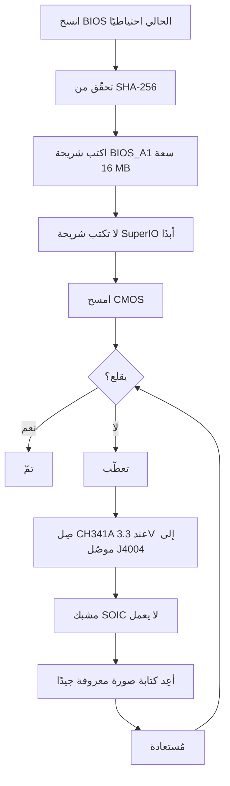

> 🌐 ترجمة مجتمعية. النسخة الإنجليزية هي المرجع الأساسي وقد تكون أحدث. وجدت خطأ؟ افتح issue: [English](../en/08-bios.md) · https://github.com/lildebil0/awesome-bc250/issues

# BIOS واستعادة التعطيب

> **باختصار** — إعداد BIOS خاطئ يمكن أن **يعطّب BC-250 موتًا**، وعلى هذه اللوحة لا يستعيدها مسح CMOS *دائمًا* ([src](https://t.me/c/2424231195/54971)). قبل أن تكتب *أي شيء*، افهم هذا: تحتاج إلى **عُدّة استعادة عتادية** (**مبرمج SPI من فئة CH341A + أسلاك DuPont أنثى-أنثى**) في متناول اليد، لأن وسيلة إزالة التعطيب الموثوقة الوحيدة هي إعادة كتابة الشريحة خارجيًا عبر موصّل **J4004** في اللوحة. التعديل المجتمعي الشائع (BIOS الخاص بـ "death"، الأحدث مبني على **5.00** القياسي) يفتح كسر السرعة، وتوقيتات GDDR6، وتخصيص ذاكرة iGPU — مفيد، لكن **ليست كل الإعدادات آمنة، وبعضها يعطّب اللوحة فورًا** ([src](https://t.me/c/2424231195/78922)). تحقّق من **SHA-256** لكل صورة أولًا، واقرأ [`assets/firmware/DISCLAIMER.md`](../../assets/firmware/DISCLAIMER.md). **لا تكتب باستهتار.**

⚠️ **هذا أخطر فصل في الدليل.** الكتابة مدمّرة وغير قابلة للعكس دون عتاد استعادة. إن لم تكن مستعدًّا للّحام/التثبيت على شريحة SPI لإحياء لوحة معطّبة، **توقّف هنا وشغّل BIOS القياسي.**

---

## ما هو BIOS على BC-250

BC-250 لوحة تعدين/خادم من صنع AsRock تحمل APU من نوع PS5 "Oberon" بنسخة مقلّمة. يعيش برنامج UEFI الثابت لها على **شريحة فلاش SPI سعة 16 MB** (Winbond **W25Q128** / Macronix MX25L128 في حزمة SOIC ذات 8 أطراف). البرنامج الثابت القياسي مُقفل بشدّة: لا شيء مفيد تقريبًا مكشوف في Setup. الإصدارات القياسية المعروفة في الدردشة هي **3.00** و**5.00**؛ وأنظمة BIOS المعدّلة معاد بناؤها من هذه (رقم الإصدار هو مرساتك — لاحظ دائمًا على أي أساس بُني التعديل).

> نسخة Stock **4.00** موجودة أيضاً. الفرق الوظيفي الوحيد بين نسخة Stock **v4.0** و **v5.0** هو أن v5.0 يُفعّل **الإقلاع عبر الشبكة** بشكل افتراضي. ([المصدر](https://discord.com/channels/1315924807128449065/1316030225338863636/1326825429595848816))

سببان لإعادة الكتابة:

1. **لتثبيت BIOS معدّل** يفتح قوائم مخفية (كسر السرعة، خفض الجهد، الذاكرة، VRAM لـ iGPU).
2. **لاستعادة لوحة معطّبة** — استعادة صورة معروفة جيدًا بعد إعداد سيّئ أو كتابة فاشلة.

> 💡 **قد لا تحتاج إلى الكتابة إطلاقًا.** إن كان هدفك *الوحيد* تغيير تقسيم VRAM/UMA، يمكنك فعل ذلك من Linux قيد التشغيل على BIOS **القياسي** P3.00 / P5.00 بـ **[fanoush/bc250_memcfg](https://github.com/fanoush/bc250_memcfg)** — بلا كتابة، بلا مبرمج، بلا خطر تعطيب ([elektricM: BIOS flashing](https://elektricm.github.io/amd-bc250-docs/bios/flashing/)، [elektricM: VRAM](https://elektricm.github.io/amd-bc250-docs/bios/vram/)). كتابة BIOS معدّل لازمة فقط لأجل *قوائم شرائح المجموعة المفتوحة* والميزات التي تتجاوز تحجيم VRAM (انظر [09-overclock-undervolt.md](09-overclock-undervolt.md) لأمر `bc250_memcfg`).

---

## BIOS المعدّل (تعديل "death") — ما الذي يغيّره ولماذا

التعديل المجتمعي المرجعي يصونه **death** في الدردشة. إنه *ليس* برنامجًا ثابتًا من الصفر — بل يعيد تمكين (يُظهر) خيارات Setup من AMD/AMI كان BIOS القياسي يأتي بها مخفية. تتبّع الإصدارات، لأن النصيحة تغيّرت مع الوقت:

| إصدار التعديل | الأساس | الإصدار | ما كشفه / غيّره | الحالة |
|---|---|---|---|---|
| **1.0** (أول إصدار) | القياسي **3.00** | 2025-06-28 | تردد GDDR6، توقيتات GDDR6، حجم ذاكرة UMA لـ iGPU، تردد الأنوية، الجهود | ⚠️ القيم السيّئة تعطّب اللوحة، **مسح CMOS لم يساعد** ([src](https://t.me/c/2424231195/54971)) |
| متغيّرات 3.0 | 3.00 | 2025-07 → 10 | نفس الفتحات؛ بناء واحد أضاف **شعار إقلاع Steam مخصّصًا** | بناء الشعار التجميلي مُنعكس كـ `bc250-Steam.rom` ([src](https://t.me/c/2424231195/86420)) |
| **تعديل 5.00** (الحالي) | القياسي **5.00** | 2025-10-05 | أُعيد تجميع التبويبات؛ **فُتح مزيد من الإعدادات**؛ **إعدادات توقيت RAM/GDDR6 تسري الآن فعليًا** على هذه اللوحة | الأحدث؛ "ليست كل الإعدادات مفيدة، لكنه أفضل من لا شيء" ([src](https://t.me/c/2424231195/78922)) |

ما الذي يمكنك ضبطه فعليًا به (من ملاحظات أول إصدار، [src](https://t.me/c/2424231195/54971)):

- **تردد GDDR6** — أُبلِغ أنه يعمل عند **1800** لأحد المستخدمين (`@Haswellb`)، لكن *نفس النوع من التغيير عطّب لوحة أخرى* — القيم خاصة باللوحة، لا عامة.
- **توقيتات GDDR6** — تسري، لكن التوقيتات **المنخفضة/الضيّقة جدًا تعطّب** اللوحة.
- **حجم ذاكرة iGPU (UMA)** — يعمل ويعطي ارتفاعًا حقيقيًا. إن لم يأخذ تغييرك مفعوله، اضبط **IGC: Forces** و**UMA Mode: UMA_SPECIFIED** ([src](https://t.me/c/2424231195/54971)؛ نفس التركيبة مؤكَّدة من وثائق المجتمع).
- **تردد الأنوية / الجهود** — مكشوفة لكن **"غير مُختبَرة"** من المؤلّف.

> ❗ **تحذيران من المؤلّف، ما زالا ساريين:** (1) **لا تعطّل Integrated Graphics** — إنها مخرج العرض الوحيد. (2) على أي من هذه التعديلات، **إعداد خاطئ يمكن أن يعطّب اللوحة وإعادة ضبط CMOS قد لا تستعيدها** — وهذا بالضبط سبب حاجتك إلى مبرمج. (انظر سلّم "أي إصدار؟" أدناه لاختيار أساس.)

> ### أي إصدار؟ (سلّم القرار)
>
> 1. **P3.00 المعدّل (ROM قائمة الشرائح) — الافتراضي الآمن.** هذا هو **"المعيار المجتمعي... الأكثر استقرارًا واختبارًا،"** الراسخ، متحقَّق-عام بـ SHA-256 معروف، ويغطّي بالفعل **فتح VRAM + إعدادات الشرائح**. ابدأ هنا ما لم يكن لديك سبب محدّد لغير ذلك ([elektricM: BIOS flashing](https://elektricm.github.io/amd-bc250-docs/bios/flashing/)).
> 2. **5.00 المعدّل — الحالي؛ اختره إن أردت ضبط الذاكرة.** إنه الأساس الأحدث وهو الذي **تسري فيه إعدادات توقيت RAM/GDDR6 فعليًا** على هذه اللوحة ([src](https://t.me/c/2424231195/78922)). اختره على P3.00 تحديدًا عندما تريد ضبط توقيتات الذاكرة.
> 3. **`P5.00_clv` — للخبراء فقط.** "يفتح **كل شيء**" (كل قائمة مخفية، بما في ذلك **ReBAR / Resizable BAR** التجريبي وإعدادات التنقيح/الشرائح)، ما يجعل *"من السهل جدًا تعطيب اللوحة إن غيّرت الشيء الخطأ... التزم بـ P3.00 ما لم تكن مستخدمًا متقدّمًا."* والأسوأ، **`P5.00_clv` ليس في أي مستودع عام** يمكن للدليل إيجاده — يتداول فقط كمرفق Discord، لذا **لا توجد بصمة قانونية**؛ إن كان لا بدّ من استخدامه، احصل على نسخ من **شخصين** يشغّلانه بشكل مستقل وأكّد أن لكليهما **نفس SHA-256** قبل الكتابة ([elektricM: BIOS flashing](https://elektricm.github.io/amd-bc250-docs/bios/flashing/)).

> **غرائب النسخة المعدلة 5.00 التي تستحق المعرفة.** تُظهر إعداداتها **تردد معالج افتراضي بقيمة 3600** — وهي قيمة تجميلية لواجهة المستخدم، وليست سرعة ساعة مطبقة ([src](https://discord.com/channels/1315924807128449065/1452152658168381593/1452406964780007515)). كما أنها تعرض خيار **تقسيم PCIe `x1x1x1x1`** في إعدادات الشرائح ([src](https://discord.com/channels/1315924807128449065/1452152658168381593/1474231812598534351)). كن حذرًا للغاية مع تواقيت الذاكرة على هذه القاعدة: **القيم المتطرفة للتواقيت يمكن أن تعطل اللوحة تمامًا لحين إعادة البرمجة خارجيًا، وتأثير ذلك يكون أشد على P5.00** ([src](https://discord.com/channels/1315924807128449065/1371527281947971604/1468745940994101372)). وكما هو الحال مع أي عملية تحديث، فإن الانتقال إلى النسخة المعدلة 5.00 قد يؤدي إلى **عدم ظهور أي عرض على الشاشة حتى تقوم بمسح CMOS** ([src](https://discord.com/channels/1315924807128449065/1315933088668454942/1508568321346502892)).

يوجد أيضًا **تعديل قائمة شرائح** منفصل (`BC250_3.00_CHIPSETMENU.ROM`) من أكثر مستودع BIOS مرجعيًا، **[TuxThePenguin0/bc250-bios](https://gitlab.com/TuxThePenguin0/bc250-bios/)**، يكشف **قائمة الشرائح / NBIO Common Options** فوق القياسي 3.00. README ذلك المستودع يقول بصراحة: *"لا شيء في هذا المستودع مدعوم أو لديه أي نوع من الضمان — خذ نسخًا احتياطية."*

> 🚫 **تجنّب `Smokeless_UMAF`.** يعلّم دليل كسر السرعة المجتمعي أداة تحرير UEFI هذه كشيء **لا يُشغَّل على BC-250 — قد يسبّب ضررًا دائمًا للوحة** ([elektricM: BIOS overclocking](https://elektricm.github.io/amd-bc250-docs/bios/overclocking/)). التزم بـ ROMs المعروفة جيدًا أعلاه.

---

## قبل الكتابة — قائمة فحص السلامة

1. **انسخ BIOS الحالي احتياطيًا أولًا** (اقرأه بالأداة نفسها التي ستكتب بها — انظر المسار B/الاستعادة). النسخة الاحتياطية هي تراجعك المجاني.
2. **تحقّق من SHA-256** للصورة مقابل `assets/PROVENANCE.md` / منشور المصدر. ينشر دليل الكتابة المجتمعي بصمة ROM قائمة الشرائح كـ
   `48fbe5d366e6a56e2fdffdca848426216ba1f083610dab63db89d2f4e6c940b5` ([وثائق elektricm](https://elektricm.github.io/amd-bc250-docs/bios/flashing/)).
3. **أكّد حجم الشريحة**، لا مجرّد العلامة. شريحة BIOS سعة 16 MB هي الهدف؛ **لا** تكتب شريحة SuperIO الصغيرة (انظر قسم الاستعادة). مراجعات اللوحة المختلفة قد تحمل أرقام أجزاء شرائح مختلفة قليلًا — الـ **السعة (16 MB)** هي ما يهمّ، الأحرف الأخيرة من العلامة قد تختلف ([src](https://t.me/c/2424231195/67880)).
4. **جهّز عتاد الاستعادة** *قبل* أول كتابة، لا بعد أن تعطّب.
5. بعد الكتابة، **امسح CMOS** كي تسري الإعدادات الجديدة (خاصة تخصيص VRAM) (انظر "بعد كل كتابة").



### تحقّق من المجموع الاختباري قبل الكتابة

تقول الخطوة 2 أعلاه أن تتحقّق من SHA-256 — إليك كيف. احسب بصمة الملف الذي توشك كتابته وقارنها، حرفًا بحرف، مع القيمة المدرجة لذلك الملف في [`assets/PROVENANCE.md`](../../assets/PROVENANCE.md).

```bash
# Linux:
sha256sum BC250_3.00_CHIPSETMENU.ROM
```

```powershell
# Windows (PowerShell):
Get-FileHash BC250_3.00_CHIPSETMENU.ROM -Algorithm SHA256
```

قد يدرج `PROVENANCE.md` فقط **أول 16 حرفًا ست عشريًا** كبصمة قصيرة. إن كان كذلك، تحقّق أن بصمتك المحسوبة **تبدأ بـ** تلك الـ 16 حرفًا — تطابق كامل لتلك البادئة هو فعلًا فحص قوي (يمكن للصائن نشر البصمات الكاملة عند الطلب).

**بصمات SHA-256 كاملة متحقَّقة** للصور المستضافة علنًا (مدقّقة عبر عدّة مستودعات مجتمعية — كل ملف BIOS معروف جيدًا لـ BC-250 هو **بالضبط 16 MB / 16777216 bytes**؛ حجم مختلف يعني أنه تالف، أو أداة/رقعة، أو غير ذي صلة) ([elektricM: BIOS flashing](https://elektricm.github.io/amd-bc250-docs/bios/flashing/)):

| الملف | النوع | SHA-256 |
|---|---|---|
| `BC250_3.00_CHIPSETMENU.ROM` (يُعرف أيضًا بـ `Robin3.00`، `BC250CHIPSETMENU.ROM`) | **P3.00 المعدّل** — فتح VRAM + شرائح، *موصى به* | `48fbe5d366e6a56e2fdffdca848426216ba1f083610dab63db89d2f4e6c940b5` |
| `Robin5.00` | **القياسي** P5.00 (ليس `P5.00_clv` المعدّل) | `0d6f136cb120cf3b2de26d5c4d7f255604fdbf4b9442af5ba55419b95b89aa82` |
| `BC250_3.00.ROM` | القياسي P3.00 | `07595ca3aecf8a4caa28a397b5298f3946a1b769f87b16f67adc369c3f69045c` |
| `BC250_2.00.bin` | القياسي P2.00 | `ee6150dfed33bd05ea46063a352549416fdf3f45fa0e5edac2a68ef78d71083c` |
| `P5.00_clv` | P5.00 المعدّل (فتح كل شيء) | **لا توجد بصمة عامة** — Discord فقط، تحقّق من تطابق نسختين مستقلّتين |

> يظهر P3.00 المعدّل بعدّة أسماء ملفات عبر المستودعات (`BC250_3.00_CHIPSETMENU.ROM`، `BC250CHIPSETMENU.ROM`، `Robin3.00`) — كلها تنتج البصمة أعلاه، لذا الاسم لا يهمّ. `Robin5.00` هو P5.00 **القياسي**، *ملف مختلف* عن `P5.00_clv` المعدّل. المصادر العامة لكل منها (TuxThePenguin0 GitLab، forgenam، tipitochen، csabakecskemeti، scrakcho، dannybastos، kenavru، MrrZed0) مدرجة في [دليل الكتابة elektricM](https://elektricm.github.io/amd-bc250-docs/bios/flashing/).

> 🔴 **إن لم يتطابق المجموع الاختباري، لا تكتب.** عدم التطابق يعني ملفًا تالفًا أو خاطئًا — كتابته هي بالضبط كيف تعطّب اللوحة. أعِد تنزيل الصورة وتحقّق مرة أخرى.

---

## المسار A — كتابة برمجية (من اللوحة، بلا مبرمج)

هذه هي الطريقة العادية لتثبيت/ترقية BIOS بينما اللوحة ما زالت تقلع. استخدم **عصا USB بنظام FAT32** وأداة تحديث برنامج AMI الثابت.

**طريقة EFI / AFU** ([src](https://t.me/c/2424231195/54979)):

1. هيّئ عصا USB إلى **FAT32**.
2. انسخ محتويات أرشيف AFU (مثل `AfuEfi64_5.16.zip`) **وملف BIOS** عليها.
3. أعِد تشغيل BC-250 و**أقلِع من عصا USB** إلى صدفة EFI.
4. شغّل:
   ```
   afuefix64.efi <filename>.<ext> /P /N
   ```
   - `/P` = برمجة BIOS الرئيسي.
   - `/N` = برمجة **NVRAM** أيضًا. هذا يتجنّب الأخطاء عند الانتقال *بين* الإصدارات (مثلًا إلى 3.00 من إصدار آخر) — **لكنه يمسح إعداداتك المحفوظة.** يمكنك إسقاط `/N`، لكن توقّع عندها أخطاء محتملة. ([src](https://t.me/c/2424231195/54979))
5. إن لم تستطع الأداة رؤية الملف، جرّب `fs0:`، `fs1:`، … لإيجاد أيّها العصا ([src](https://t.me/c/2424231195/54979)).

بعض البناءات المجتمعية تأتي بسكربت `Flash.nsh` جاهز وROM معاد تسميته (مثلًا أعِد تسمية ROM المعدّل ليطابق السكربت) كي تقلع فقط إلى صدفة EFI وتشغّل السكربت ([وثائق elektricm](https://elektricm.github.io/amd-bc250-docs/bios/flashing/)). على Linux يوجد أيضًا بناء **`afulnx`** (`afulnx-5.05.04Z.tar.gz`) للكتابة من نظام قيد التشغيل ([src](https://t.me/c/2424231195/54507)).

#### وصفة صدفة EFI القانونية (طريقة `Flash.nsh` / `Robin5.00`)

يوحّد دليل الكتابة المجتمعي على عُدّة قائمة بذاتها واسم ملف ثابت — هذا أكثر مسار USB قابلية لإعادة الإنتاج ([elektricM: BIOS flashing](https://elektricm.github.io/amd-bc250-docs/bios/flashing/)):

1. **احصل على عُدّة EFI:** `4U12G BIOS Update.zip` (من مستودع [kenavru/BC-250](https://github.com/kenavru/BC-250)) — تحتوي على `AfuEfix64.efi`، و`Flash.nsh`، و`amdvbflash.efi`. *كما تحزم BIOS قياسيًا P5.00 باسم `Robin5.00` — أبعِده عن الطريق كي لا تكتبه عرضًا.*
2. **جهّز عصا FAT32 (يُوصى بـ ≤ 32 GB).** انسخ محتويات مجلّد `BIOS EFI` من العُدّة إلى **الجذر**.
3. **أعِد تسمية ROM المعدّل إلى `Robin5.00`** (أسقِط امتداد `.ROM`) — هذا الاسم بالضبط ما يبحث عنه `Flash.nsh`. *(أو عدّل `Flash.nsh` ليطابق اسم ملفك بدلًا من ذلك.)* يجب أن يحوي الجذر عندها: `AfuEfix64.efi`، و`Flash.nsh`، و`amdvbflash.efi`، و`Robin5.00` (تعديلك المعاد تسميته)، ومجلّد `EFI`.
4. **استخدم شاشة DisplayPort مباشرة.** محوّلات **HDMI النشطة/السلبية قد تُسوّد شاشة قائمة BIOS** — مطبّ عرض معروف على هذه اللوحة.
5. **افصل كل أقراص SSD/الأقراص** كي تسقط اللوحة تلقائيًا إلى صدفة EFI، أدخِل العصا، شغّل الطاقة. تصل إلى موجّه `Shell>` أصفر.
6. عند الموجّه اكتب **`blk0:`** ثم Enter — **لاحظ المسافة بعد النقطتين** (هذا يختار قرص USB؛ `blk0:` هو المحدِّد الموثَّق من elektricM، متمايز عن استكشاف `fs0:`/`fs1:` أعلاه). ثم اكتب **`Flash.nsh`** و Enter.
7. **انتظر. لا تلمس لوحة المفاتيح، لا تطفئ الطاقة.** إن *بدا* أنه معلّق أثناء الكتابة، **انتظر 15 دقيقة على الأقل** — إطفاء الطاقة في منتصف الكتابة يعطّب اللوحة. تعيد التشغيل (أو تطلب منك) عند الانتهاء.
8. **أطفئ الطاقة فورًا وأزِل العصا** كي لا تعود في حلقة إلى الكاتب.

> 🔴 **قبل تشغيل الطاقة للكتابة: تحقّق من توصيل طاقة PCIe ذي 8 أطراف** مقابل مخطّط 12 V/GND في مزوّد طاقتك. **قطبية معكوسة يمكن أن تتلف اللوحة دائمًا** ([elektricM: BIOS flashing](https://elektricm.github.io/amd-bc250-docs/bios/flashing/)).

#### إعدادات BIOS المطلوبة بعد الكتابة (افعل هذا مباشرة بعد مسح CMOS)

بعد الكتابة **و**مسح CMOS (القسم التالي)، ادخل Setup (انقر **Del** بكثرة) واضبط هذه — لن يتصرّف تقسيم VRAM بشكل صحيح حتى تكون سليمة ([elektricM: BIOS flashing](https://elektricm.github.io/amd-bc250-docs/bios/flashing/)، [elektricM: BIOS VRAM](https://elektricm.github.io/amd-bc250-docs/bios/vram/)):

| الإعداد | المسار | القيمة |
|---|---|---|
| Integrated Graphics Controller | Chipset → GFX Configuration | **Forces** |
| UMA Mode | Chipset → GFX Configuration | **UMA_SPECIFIED** |
| UMA Frame Buffer Size | Chipset → GFX Configuration | **512MB** (موصى به) أو حجم ثابت |
| IOMMU | Advanced → CPU Configuration | **Disabled** |
| Boot Mode | Boot → Boot Mode | **UEFI** |

تحقّق أولًا أن مسح CMOS أخذ مفعوله فعلًا — يجب أن **تقرأ الساعة خطأً**؛ إن كانت ما زالت صحيحة، أعِد المسح. ثم F10 للحفظ. خيار `512MB` هو تخصيص *ديناميكي*، لا حدّ أقصى 512 MB (انظر [09-overclock-undervolt.md](09-overclock-undervolt.md)).

> ★ **لماذا UMA بحجم 512 MB *يكسب* FPS (الآلية).** ضبط مخزن UMA إلى **512 MB** لا يجوّع GPU — بل يتيح للنظام **موازنة RAM مقابل VRAM ديناميكيًا** بدلًا من قفل شريحة ثابتة كبيرة بعيدًا، وتلك الموازنة وحدها نُسِب إليها قفزة FPS حقيقية: Cyberpunk 2077 انتقل من **60 → 66 fps (عند كسر سرعة 2 GHz) → 76 fps** تحت FSR 3.0 *balanced*، 1080p، إعداد Steam-Deck المسبق ([Old Lamer — Part I](https://youtu.be/ohpEY2XQ_lo) ~11:21؛ ⚠ تقريبي — الأرقام منقولة من الفيديو، عاملها كنتيجة بناء واحد). فـ "512 MB هو الأفضل" ليس مجرّد تحجيم آمن — المخزن الديناميكي الصغير *جزء من* قصة الأداء، لا تنازل.

**احتياطي flashrom** (إن أخطأ AFU) ([src](https://t.me/c/2424231195/54979)، اقترحه واختبره `@mrartemsid`):

```bash
# Read (back up):
sudo flashrom -p internal:boardmismatch=force -r <name>.bin
# Write:
sudo flashrom -p internal:boardmismatch=force -w <name>.bin
```

> ⚠️ الكتابة البرمجية تساعد فقط **بينما اللوحة ما زالت تجتاز POST**. لحظة أن يعطّبها إعداد سيّئ، يختفي المسار A وتكون على المسار العتادي أدناه.

---

## المسار B — كتابة عتادية / إزالة تعطيب (مبرمج SPI من نوع CH341A)

هذا هو مسار **الاستعادة**، و"أكثر طريقة مريحة لكتابة لوحة معطّبة" المثبّت ([src](https://t.me/c/2424231195/67880)). تعيد كتابة شريحة SPI سعة 16 MB مباشرةً، من حاسوب آخر، باستخدام مبرمج SPI عبر USB. البرنامج المستخدَم: **NeoProgrammer** (Windows) أو **flashrom** (Linux).

> 🔴 **مشبك SOIC-8 لا يعمل على هذه اللوحة.** death صريح بشأنه: *"المشبك على لوحتنا يعمل... أساسًا لا إطلاقًا."* ([src](https://t.me/c/2424231195/67880)). ملاحظة: `assets/firmware/DISCLAIMER.md` يذكر "مشبك SOIC" بشكل عام — لكن عمليًا يجب أن **توصِل إلى موصّل J4004 في اللوحة بدلًا منه.** هذه أهمّ حقيقة استعادة منفردة في هذا الفصل.

### مخطط أطراف موصّل J4004 (صِل هنا)

تكشف اللوحة **موصّل J4004 بخطوة 2.54 mm** خصيصًا لإعادة كتابة شريحة SPI/BIOS. مخطط الأطراف (من لقطة التوصيل المثبّتة، [src](https://t.me/c/2424231195/67880)):

```
J4004
[ GND  SCLK  MOSI  UNK ]
[ VCC  CS    MISO      ]
   ^  (pin-1 marker)
```

| طرف J4004 | الإشارة | لاقطة CH341A |
|---|---|---|
| VCC | طاقة 3.3 V | VDD / 3.3V |
| GND | أرضي | GND |
| CS | اختيار الشريحة | CS / SS |
| SCLK | الساعة | CLK / SCK |
| MOSI | دخل البيانات (إلى الشريحة) | MOSI |
| MISO | خرج البيانات (من الشريحة) | MISO |

الـ **خريطة ألوان W25Q128 SOIC-8 / CH341A** المقابلة في اللقطة المثبّتة نفسها — طابِق `/CS, DO(MISO), CLK, DI(MOSI), VCC, GND` مع لواقط CH341A `CS, MISO, CLK, MOSI, VDD, GND`. **دقّق ثلاثيًا في VCC وGND** قبل تشغيل الطاقة؛ عكسهما يقتل الشريحة ([src](https://t.me/c/2424231195/67880)).

> **ترقيم أطراف J4004 والطرفان المجهولان.** يرقّم دليل elektricM الموصّل VCC=1، GND=2، CS=3، SCLK=4، MISO=5، MOSI=6، مع **الطرفين 7 و8 غير مستخدمين للكتابة — مؤرّضان عبر مقاومات 10 kΩ.** الطرف 1 (VCC) معلّم بـ **سهم `>` أو لاقطة مربّعة** على لوحة PCB ([elektricM: BIOS flashing](https://elektricm.github.io/amd-bc250-docs/bios/flashing/)).

> **الشريحة الهدف الدقيقة وخطأ الكثافة المطبعي.** الجزء سعة 16 MB هو Winbond **W25Q128JVSQ** (128 Mbit / 16 MB) أو، في بعض الدفعات، Macronix **MX25L12835F**. بعض وثائق المجتمع تكتبها خطأً **"25Q168" — وهذا خاطئ**؛ رمز كثافة الـ 16 MB الصحيح هو **128** ([elektricM: BIOS flashing](https://elektricm.github.io/amd-bc250-docs/bios/flashing/)). إن كتبت عبر **مشبك SOIC-8** عارٍ بدلًا من J4004، فترتيب أطراف الشريحة نفسها هو تخطيط SPI القياسي: `1 CS · 2 DO · 3 WP · 4 GND · 5 DI · 6 CLK · 7 HOLD · 8 VCC` ([elektricM: BIOS recovery](https://elektricm.github.io/amd-bc250-docs/bios/recovery/)) — لكن تذكّر اكتشاف death أن **المشبك بالكاد يعمل على هذه اللوحة**، لذا فضّل J4004.

> 🙏 شكر: مخطط أطراف J4004، والهندسة العكسية، ومستودع صورة البرنامج الثابت المعدّل هي إلى حدّ كبير عمل **Segfault** (ROM قائمة الشرائح P3.00 هو "تعديل Segfault") ([elektricM: BIOS flashing](https://elektricm.github.io/amd-bc250-docs/bios/flashing/)).

### إجراء NeoProgrammer (مثبّت) ([src](https://t.me/c/2424231195/67880))

1. صِل المبرمج إلى **J4004** بأسلاك أنثى-أنثى وفق مخطط الأطراف. **افحص التوصيل ~10×، خاصة VCC وGND.** (مزوّد الطاقة مفصول.)
2. افتح **NeoProgrammer**.
3. شغّل **الكشف التلقائي** للشريحة، واقرأ أيضًا العلامة على الشريحة نفسها.
4. **قارن العلامات.** إن اختلفت الأحرف الأخيرة عن القائمة لكن **السعة تطابق (16 MB)**، فلا بأس.
5. **امسح** الشريحة.
6. **افتح ملف BIOS** في البرنامج (السحب والإفلات يعمل).
7. **اكتب** الشريحة.
8. **افصل الأسلاك من J4004.**
9. شغّل طاقة اللوحة.

### مكافئ flashrom (Linux)، مدقّق مع وثائق المجتمع

يستخدم دليل الكتابة المجتمعي مبرمج **CH347** ويحذّر من لوحات CH341A الرخيصة بـ PCB أسود (القسم التالي). حدّد الشريحة الصحيحة — استهدف **شريحة BIOS سعة 16 MB** (`BIOS_A1`)، **أبدًا** SuperIO سعة 512 KB (`SIO1_R`)، الذي يعطّب SuperIO إن كُتب ([وثائق elektricm](https://elektricm.github.io/amd-bc250-docs/bios/flashing/)):

```bash
# Detect / identify the chip:
sudo flashrom -p ch347_spi

# Back up the stock BIOS (twice, then diff to be sure the read is stable):
sudo flashrom -p ch347_spi -r backup_stock.bin
sudo flashrom -p ch347_spi -r backup_verify.bin

# Write the new image, then verify it read back identical:
sudo flashrom -p ch347_spi -w BC250_3.00_CHIPSETMENU.ROM
sudo flashrom -p ch347_spi -v BC250_3.00_CHIPSETMENU.ROM
```

(استخدم `-p ch341a_spi` لـ CH341A، أو `serprog` لـ Raspberry Pi Pico، بدلًا من `ch347_spi`.) ⚠ تخطيط `ch347_spi` / `serprog` لتوصيل *هذه* اللوحة بالضبط من دليل المجتمع — `⚠ verify` مقابل طراز مبرمجك الخاص.

> **الكشف يخبرك على أي شريحة أنت.** إن أبلغ `flashrom -p …` عن **`Winbond W25Q128…`** أو **`Macronix MX25L128…`**، فأنت على شريحة BIOS الصحيحة سعة 16 MB. إن أبلغ عن **`Macronix MX25L4005…` (512 KB)**، **توقّف — أنت متّصل بشريحة SuperIO** (`SIO1_R`)؛ كتابتها تعطّب التحكم بالمروحة/المستشعرات. انتقل إلى الشريحة الأخرى ([elektricM: BIOS flashing](https://elektricm.github.io/amd-bc250-docs/bios/flashing/)). اكتب مع **مزوّد الطاقة مفصولًا عن الجدار** والمكثّفات مفرّغة (انقر زرّ الطاقة بضع مرات) — تشغيل اللوحة أثناء كتابة بالمشبك *غير* مُوصى به ([elektricM: BIOS recovery](https://elektricm.github.io/amd-bc250-docs/bios/recovery/)).

### فخّ CH341A بجهد 3.3 V (اقرأ هذا وإلا أحرقت الشريحة)

كثير من مبرمجات **CH341A الرخيصة ذات PCB الأسود** تقود **خطوط بياناتها عند 5 V رغم أن VCC هو 3.3 V** — شريحة BIOS في BC-250 جزء **3.3 V**، لذا 5 V على خطوط البيانات يمكن أن يتلفها. هذا عطل معروف ومقيس على بعض اللوحات (لوحة Fabian، ولوحة مطابقة في الدردشة، أُكّدتا بقياس الجهد) ([src](https://t.me/c/2424231195/100285)). الإصلاحات:

- فضّل مبرمجًا يكون فعلًا 3.3 V على خطوط بياناته (مثل **CH347**)، **أو**
- طبّق **إصلاح CH341A بلا لحام لخطوط البيانات 5V→3.3V**: اقطع خط طاقة USB 5 V إلى الشريحة وأطعِمها 3.3 V بدلًا منه — انظر [شرح sawyershepherd.org](https://sawyershepherd.org/post/solderless-ch341ab-fix-5v-to-33v-data-lines/) و[إصلاح CH341A على wej.k.vu](https://wej.k.vu/electronics/ch341a-mini-programmer-fix/) ([src](https://t.me/c/2424231195/100285)).

---

### الموصّلات منخفضة المستوى والتنقيح والسيليكون على اللوحة

إلى جانب موصّل كتابة J4004 أعلاه، تحمل اللوحة عدّة موصّلات أخرى ومجموعة معروفة من الشرائح على اللوحة. هذه مهندَسة عكسيًا في وثائق elektricM للعتاد ومفيدة لمسح CMOS، والتنقيح بالمجسّ، وتوصيل المروحة، وتأكيد أي شريحة هي أيها قبل الكتابة. قيم الأطراف منقولة حرفيًا من ([elektricM: pinouts](https://elektricm.github.io/amd-bc250-docs/hardware/pinouts/)).

**CLRCMOS1 — وصلة عبور مسح CMOS (3 أطراف).** هذه هي الوصلة المشار إليها في كل مكان في هذا الفصل بـ "قصّر وصلة CMOS" — إليك خريطتها:

| الوضع | السلوك |
|---|---|
| الطرفان 1–2 | CR2032 يغذّي CMOS (الافتراضي) |
| الطرفان 2–3 | مسح CMOS |

> 💡 عندما تطلب منك [قائمة فحص ما بعد الكتابة](#قبل-الكتابة--قائمة-فحص-السلامة) و["بعد كل كتابة"](#بعد-كل-كتابة--امسح-cmos-لا-تتخطَّ-هذا) "قصّر وصلة CMOS لـ ~20 ثانية،" فإن **CLRCMOS1** هي تلك الوصلة: انقلها من الطرفين 1–2 إلى الطرفين 2–3، انتظر، ثم أعِدها. (إزالة CR2032 لـ 60+ ثانية هي البديل.)

**TPMS1 — موصّل تنقيح LPC (18 طرفًا، خطوة 2.0 mm):**

| الطرف | الإشارة | الطرف | الإشارة |
|---|---|---|---|
| 1 | PCICLK | 2 | GND |
| 3 | FRAME | 4 | SMB_CLK_MAIN |
| 5 | PCIRST# | 6 | SMB_DATA_MAIN |
| 7 | LAD3 | 8 | LAD2 |
| 9 | 3V | 10 | LAD1 |
| 11 | LAD0 | 12 | GND |
| 13 | (فارغ) | 14 | S_PWRDWN# |
| 15 | 3VSB | 16 | SERIRQ# |
| 17 | GND | 18 | GND |

> 💡 **الطرف 9 (3V) حيّ فقط عندما تكون اللوحة مشغّلة** — لذا يعمل كإشارة كشف "النظام مشغّل". هذا يجعله نقطة استشعار بديلة لبناءات التشغيل التلقائي / محوّل ATX حقيقي (انظر مرجع [وصلة `AUTO_PWRON` في 03-power-supply.md](03-power-supply.md)).

**J2 — موصّل تنقيح JTAG/HDT (20 طرفًا، خطوة 1.27 mm، غير مأهول، على الجهة السفلية للوحة):**

| الطرف | الإشارة | الطرف | الإشارة |
|---|---|---|---|
| 1 | VDDIO | 2 | TCK |
| 3 | GND | 4 | TMS |
| 5 | GND | 6 | TDI |
| 7 | GND | 8 | TDO |
| 9 | TRST_L | 10 | PWROK_BUF |
| 11 | DBRDY3 | 12 | RESET_L |
| 13 | DBRDY2 | 14 | DBRDY0 |
| 15 | DBRDY1 | 16 | DBREQ_L |
| 17 | GND | 18 | TEST19 |
| 19 | VDDIO | 20 | TEST18 |

> TEST18 وTEST19 وDBRDY0 متروكة عائمة. هذه هي واجهة إعادة الضبط/التنقيح العتادية **الوحيدة** على اللوحة.

**I2C_HEADER1 (3 أطراف):** `SCL · SDA · GND`. SCL هو الطرف **الأقرب إلى موصّلات الطاقة**. يحمل هذا الناقل **PMBUS إلى Intersil PMICs** — نقطة وصول لقياس الطاقة عن بُعد.

**CPU_FAN1 (4 أطراف):** `PWM · Tach · 12V · GND`.

**J4003 — موصّل متعدّد المراوح (16 طرفًا، 2×8، 2.54 mm):**

| الصف 1 | 1 GND | 2 F1T | 3 F2T | 4 F3T | 5 F4T | 6 F5T | 7 DET | 8 (فارغ) |
|---|---|---|---|---|---|---|---|---|
| **الصف 2** | 1 GND | 2 F1P | 3 F2P | 4 F3P | 5 F4P | 6 F5P | 7 GND | 8 GND |

هنا `T` = tach و`P` = PWM، لكل مروحة 1–5.

> 💡 **DET (الصف 1، الطرف 7) مؤرّض عندما تجلس اللوحة على لوحة مروحة / توزيع طاقة** — أي يكشف الحامل. (ترقيم المروحة بين BIOS↔Linux مغطّى في [06-linux.md → المستشعرات والتحكم بالمروحة](06-linux.md#sensors--fan-control)؛ لا يُكرَّر هنا.)

**السيليكون على اللوحة (BOM).** يسمّي المستودع بالفعل `SIO1_R` و`BIOS_A1` في أقسام الكتابة لكنه لم يعطِ قط أرقام أجزاء أو أحجامًا؛ هذا الجدول يتيح للكاتب تأكيد أي شريحة هي أيها (Winbond سعة 16 MiB هي BIOS، Macronix سعة 512 KiB هي SuperIO — اتركها وشأنها):

| الرمز | الجزء | الدور |
|---|---|---|
| PUA1 | Intersil ISL69247 | PMIC الرئيسي |
| PUIO1 | Intersil ISL95712 | PMIC تغذية الأنوية |
| PUA11… | Intersil ISL99360 | مراحل طاقة ذكية (الأطوار) |
| M2U2 | NXP CBTL04083B | مازج PCIe x4 بنسبة 2:1 |
| U30 | Realtek RTL8111H | بطاقة Ethernet (PCIe x1) |
| SU1 | AMD 218-0844029 | شرائح FCH من نوع A68H "Bolton-D2H" |
| UIO1 | Nuvoton NCT6686D | SuperIO (شريحة مستشعر hwmon) |
| BIOS_A1 | Winbond 25Q128JVSQ | فلاش SPI سعة 16 MiB = الـ **BIOS** (اكتب هذه) |
| SIO1_R | Macronix MX25L4006E | فلاش SPI سعة 512 KiB = برنامج SuperIO (**لا تكتب — يعطّب SuperIO**) |

> شريحة مستشعر SuperIO المسمّاة هنا (Nuvoton **NCT6686D**) هي التي يرتبط بها تعريف Linux `nct6687`/`nct6683` — انظر [06-linux.md](06-linux.md) لإعداد المستشعر/المروحة.

**أدوات البرامج الثابتة (متقدم).** تظهر أداتان مساعدتان بشكل متكرر للتنقيب داخل الصورة:

- **`psptool`** تفحص وتستخرج كتل البرامج الثابتة (firmware blobs) لـ AMD داخل ملف BIOS dump. يعرض الأمر `psptool -E bios.bin` قائمة بالمدخلات؛ بينما يقوم الأمر `psptool -X -d 0 -e 1 -o firmware.bin bios.bin` باستخراج برنامج SMU الثابت للتحليل. ([bc250-collective/amd_smu_reverse_engineering](https://github.com/bc250-collective/amd_smu_reverse_engineering))
- **`Zentool`** تقوم بترقيع الكود المصغر (microcode) للمعالج — على سبيل المثال لاستبدال تعليمة `RDRAND`. ([AMD-BC-250/documentation #1](https://github.com/AMD-BC-250/documentation/issues/1))

---

## Secure Boot و CSM (متطلّبات الإقلاع)

أضف هذين إلى قائمة متطلّبات إعداد BIOS — مطلوبان وإلا **لن تقلع النوى المخصّصة/المرقّعة** (رقعة 40-CU، رقعة التردد، إلخ):

| الإعداد | القيمة |
|---|---|
| Secure Boot | **Disabled** |
| CSM (Compatibility Support Module) | **Disabled** |

المصدر: [elektricM: boot troubleshooting](https://elektricm.github.io/amd-bc250-docs/troubleshooting/boot/).

---

## فكرة إعادة الضبط التلقائي "srep" (تجريبية — ليست ميزة منتهية)

لأن إعدادًا سيّئًا يمكن أن يعطّب اللوحة و**مسح CMOS لا يصلحها**، جرّب death خبز روتين **`srep`** في BIOS لـ **إعادة ضبط الإعدادات تلقائيًا عند التعطيب** — الفكرة في الأصل من `@Jacky_Fish` ([src](https://t.me/c/2424231195/60552)). المفهوم: أن يرقّع BIOS متغيّرات NVRAM/`amdsetup` عائدًا إلى الافتراضيات، اختياريًا فقط عند وجود ملفات تشغيل على عصا USB (كي لا يمسح إعداداتك كل إقلاع). كما في الدردشة، **هذا لم يعمل بعد** — *"تتظاهر اللوحة بعناد بأنها لوحة معطّبة تمامًا ولا شيء يُعاد ضبطه"* ([src](https://t.me/c/2424231195/60883)). عامِل أي ادّعاء "BIOS ذاتي الشفاء" كـ **غير مُثبَت**؛ شبكة أمانك الحقيقية تبقى المبرمج الخارجي. `⚠ verify` قبل الاعتماد على أي بناء srep.

---

## بعد كل كتابة — امسح CMOS (لا تتخطَّ هذا)

كتابة BIOS **لا** تعيد ضبط الإعدادات المخزّنة، وعدّة إعدادات (خاصة **تخصيص VRAM/UMA**) لن تسري فعليًا حتى تمسح CMOS. اصطدم مستخدم بهذا بالضبط: أظهر BIOS حجم VRAM الجديد و"حفظه"، لكن نظام التشغيل (Bazzite) ظلّ يُبلّغ عن تقسيم 4 GB RAM / 12 GB VRAM القديم حتى مُسح CMOS ([src](https://t.me/c/2424231195/97290)). كيف تمسح:

- **أزِل بطارية CR2032 القرصية لـ 60+ ثانية** (موصى به)، **أو**
- **قصّر وصلة CMOS لـ ~20 ثانية.** ([وثائق elektricm](https://elektricm.github.io/amd-bc250-docs/bios/flashing/))

> لاحظ الحدّ: مسح CMOS يصلح "الإعدادات لم تسرِ" والإعدادات السيّئة *المعتدلة* — لكن على جيل تعديل 1.0/3.00 أُبلِغ أنه **لا** يستعيد تعطيبًا حقيقيًا ([src](https://t.me/c/2424231195/54971)). لذلك، انظر المسار B.

---

## البرنامج الثابت المنعكس

صور BIOS المناقَشة في الدردشة منعكسة تحت `assets/firmware/` لأجل **الاستعادة/الحفظ** (انظر [`DISCLAIMER.md`](../../assets/firmware/DISCLAIMER.md) وتحقّق من SHA-256 لكل ملف في `PROVENANCE.md` قبل الكتابة):

| الملف | الحجم | ما هو | المصدر |
|---|---|---|---|
| `BC250_3.00.ROM` | 16 MB | تفريغ القياسي 3.00 | ([src](https://t.me/c/2424231195/5215)) |
| `BC250_3.00_CHIPSETMENU.ROM` | 16 MB | تعديل قائمة الشرائح (TuxThePenguin0) | ([src](https://t.me/c/2424231195/86395)) |
| `dump_5.00.bin` | 16 MB | تفريغ القياسي 5.00 | ([src](https://t.me/c/2424231195/24661)) |
| `BC250_5.00_clv.zip` | 16 MB | **تعديل death لـ 5.00 (الحالي)** | ([src](https://t.me/c/2424231195/78922)) |
| `bc250_3.00_clv1.zip` | 16 MB | أول تعديل death لـ 3.00 (1.0) | ([src](https://t.me/c/2424231195/54971)) |
| `bc250-Steam.rom` | 16 MB | تعديل 3.0 مع شعار إقلاع Steam | ([src](https://t.me/c/2424231195/86420)) |
| `bc250 modded bios.ROM` | 16 MB | صورة معدّلة مبكرة | ([src](https://t.me/c/2424231195/30100)) |
| `my_4.0_MODED.bin` | 16 MB | تعديل 4.0 انتقالي | ([src](https://t.me/c/2424231195/45580)) |
| `W25Q128BV@WSON8_…BIN` | 16 MB | قراءة شريحة خام (W25Q128) | ([src](https://t.me/c/2424231195/5217)) |
| `AfuEfi64_5.16.zip` | — | كاتب AMI AFU EFI | ([src](https://t.me/c/2424231195/54979)) |
| `afulnx-5.05.04Z.tar.gz` | — | كاتب AMI AFU Linux | ([src](https://t.me/c/2424231195/54507)) |

> لا تكتب BIOS من PS5 (`PS5 Disk Edition … BIOS.bin`، 2 MB) أو شرائح 512 KB على شريحة BIOS سعة 16 MB في BC-250 — هدف خاطئ، انظر تحذيرات الاستعادة.

---

## المصادر

- تعديل death — أول إصدار (3.00) — https://t.me/c/2424231195/54971 · الحالي (5.00) — https://t.me/c/2424231195/78922 · بناء شعار Steam — https://t.me/c/2424231195/86420
- الكتابة البرمجية (AFU `/P /N`، flashrom) — https://t.me/c/2424231195/54979 · afulnx — https://t.me/c/2424231195/54507
- إزالة التعطيب العتادية (مثبّت، NeoProgrammer + لقطات توصيل J4004) — https://t.me/c/2424231195/67880
- فكرة إعادة الضبط التلقائي srep — https://t.me/c/2424231195/60552 · النتيجة (لم تعمل) — https://t.me/c/2424231195/60883
- الحاجة إلى مسح CMOS بعد الكتابة — https://t.me/c/2424231195/97290
- فخّ خطوط البيانات CH341A 5V→3.3V — https://t.me/c/2424231195/100285 · شرح الإصلاح — https://sawyershepherd.org/post/solderless-ch341ab-fix-5v-to-33v-data-lines/
- أكثر مستودع BIOS مرجعيًا — [TuxThePenguin0/bc250-bios](https://gitlab.com/TuxThePenguin0/bc250-bios/) (`BC250_3.00_CHIPSETMENU.ROM`، `CHIPSETMENU.md`)
- دليل الكتابة/الاستعادة المجتمعي (جدول SHA-256 المتحقَّق، وصفة `Flash.nsh`/`Robin5.00`، محدِّد `blk0:`، مطبّ DisplayPort/HDMI، قاعدة التعليق 15 دقيقة، مخطط أطراف J4004 + الطرفان 7/8، خطأ W25Q128JVSQ/"25Q168" المطبعي، CH347، قيم Setup بعد الكتابة، شكر Segfault) — [elektricM: BIOS flashing](https://elektricm.github.io/amd-bc250-docs/bios/flashing/)
- دليل الاستعادة (مخطط أطراف SPI ذي 8 أطراف، كشف MX25L4005 = SuperIO، الكتابة مع فصل مزوّد الطاقة، سيناريوهات تفصيلية) — [elektricM: BIOS recovery](https://elektricm.github.io/amd-bc250-docs/bios/recovery/)
- مخططات أطراف اللوحة والسيليكون عليها (CLRCMOS1، TPMS1 LPC، J2 JTAG/HDT، I2C_HEADER1، CPU_FAN1، J4003 متعدّد المراوح، BOM من Intersil/NXP/Realtek/Nuvoton/Winbond/Macronix) — [elektricM: pinouts](https://elektricm.github.io/amd-bc250-docs/hardware/pinouts/)
- دليل VRAM (تحجيم `bc250_memcfg` بلا كتابة، قيم UMA Frame Buffer، VRAM بمعامل نواة، تبليغ Vulkan مقابل OpenGL) — [elektricM: BIOS VRAM](https://elektricm.github.io/amd-bc250-docs/bios/vram/)
- ★ UMA بحجم 512 MB → موازنة RAM/VRAM ديناميكية → آلية كسب FPS (Cyberpunk 60 → 66 عند 2 GHz OC → 76 fps، FSR 3.0 balanced، 1080p، إعداد Steam-Deck المسبق) — [Old Lamer — Part I](https://youtu.be/ohpEY2XQ_lo) ~11:21 (⚠ تقريبي، منقول من الفيديو)
- ملاحظة خطر `Smokeless_UMAF` — [elektricM: BIOS overclocking](https://elektricm.github.io/amd-bc250-docs/bios/overclocking/)
- أداة VRAM بلا كتابة — [fanoush/bc250_memcfg](https://github.com/fanoush/bc250_memcfg)
- أداة توقيت الذاكرة — `Mem_Timing_Utility.zip` https://t.me/c/2424231195/55351
- سياسة انعكاس البرنامج الثابت — [`assets/firmware/DISCLAIMER.md`](../../assets/firmware/DISCLAIMER.md)

> كسر السرعة/خفض الجهد *باستخدام* هذه الإعدادات المفتوحة مغطّى في [09-overclock-undervolt.md](09-overclock-undervolt.md). صور BIOS المنعكسة تعيش تحت `assets/firmware/` مع SHA-256 لكل ملف في `PROVENANCE.md`.
