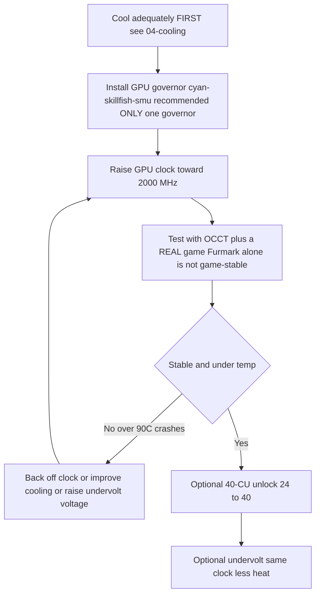

> 🌐 ترجمة مجتمعية. النسخة الإنجليزية هي المرجع الأساسي وقد تكون أحدث. وجدت خطأ؟ افتح issue: [English](../en/09-overclock-undervolt.md) · https://github.com/lildebil0/awesome-bc250/issues

# كسر السرعة وخفض الجهد (Overclocking & Undervolting)

> **باختصار** — من العلبة مباشرة تعمل وحدة معالجة الرسومات في BC-250 ببطء (غالبًا مثبَّتة عند **1500 MHz**، أداء ضعيف تقريبًا). الإصلاح المجتمعي هو **منظِّم (governor)** يتجاوز الترددات/الجهد: المُوصى به اليوم هو **[cyan-skillfish-governor-smu](https://github.com/filippor/cyan-skillfish-governor)** (لا يحتاج رقعة نواة، ومحزَّم على Arch/CachyOS/Bazzite/Fedora)؛ و**[oberon-governor](https://gitlab.com/mothenjoyer69/oberon-governor)** هو الأصلي ولا يزال يعمل. أيًّا اخترت تعدّله لدفع GPU إلى **2000 MHz (~+30 % FPS)**. كما أن طقم الأدوات الأحدث **[bc250_smu_oc](https://github.com/bc250-collective/bc250_smu_oc)** يكسر سرعة **المعالج** أيضًا (الموصى به **4 GHz @ 1275 mV**). بمعزل عن ذلك، يعيد **[فتح الـ 40 وحدة حوسبة (40-CU unlock)](https://github.com/duggasco/bc250-40cu-unlock)** تفعيل **24 ← 40 وحدة حوسبة** عطّلتها AMD في البرنامج الثابت — وهو مكسب GPU أكبر من الترددات وحدها (قفزت إحدى تشغيلات Superposition من **4647 ← 6863** نقطة، ([src](https://t.me/c/2424231195/137035))). **كل هذا حرارة. برِّد اللوحة أولًا** — راجع [04-cooling.md](04-cooling.md) — لأن كسر السرعة دون تبريد كافٍ يُعطِّل اللوحة ويعيد ضبطها فوق ~90 °C.

هذه هي الخطوة **الأخيرة** من المسار الذهبي، لا الأولى. اجعل لوحتك مستقرة وباردة وتعمل ([06-linux.md](06-linux.md)، [04-cooling.md](04-cooling.md)) قبل أن تلمس أيًّا من هذا. كل ما هنا هو "على مسؤوليتك الخاصة" — يقول المجتمع ذلك مرارًا ([src](https://t.me/c/2424231195/106844)).

---

## الروافع الأربع (وما تساويه كلٌّ منها)

في BC-250 **أربعة** أشياء مستقلة يمكنك ضبطها. وهي تتراكم:

| الرافعة | الأداة | المكسب النموذجي | كلفة الحرارة |
|-------|------|--------------|-----------|
| **تردد GPU** 1500 ← 2000 MHz | المنظِّم (cyan-skillfish-smu / oberon) | **~+30 % FPS** عند الحدّ بالـ GPU | عالية |
| **خفض جهد GPU** عند تردد ثابت | المنظِّم نفسه | نفس FPS، **أبرد بكثير** | *سالبة* (حرارة أقل) |
| **تردد CPU** 3.5 ← 4.0 GHz | `bc250_smu_oc` | يساعد الألعاب المحدودة بالمعالج | عالية |
| **فتح الـ 40 وحدة حوسبة** 24 ← 40 CU | `bc250-40cu-unlock` | **حتى ~+48 %** من عمل GPU | عالية |

تحذيران صادقان من المحادثة قبل أن تبدأ:

- **معظم ألعاب BC-250 محدودة بالمعالج، لا بالـ GPU.** دفع GPU من 2000 ← 2229 MHz كسب أحدَ المختبِرين *1 fps* في Shadow of the Tomb Raider (90 ← 91) بينما قفزت الطاقة والحرارة بشدة — فعنوان "+30 %" لا يتحقّق إلا في الحفنة القليلة من الألعاب التي تكون فيها GPU هي عنق الزجاجة ([src](https://t.me/c/2424231195/67029)).
- **الحرارة تتوسّع أسوأ من الأداء.** المختبِر نفسه: 2000 MHz @ 960 mV = **75 °C** في اختبار إجهاد؛ 2229 MHz @ 1030 mV = **93 °C** — وقد تراجع لأن مصدر طاقته ومبرّده لم يقدرا على الصمود ([src](https://t.me/c/2424231195/66972)، [src](https://t.me/c/2424231195/67029)).

> ⚠️ **أرضية الأمان.** يبدأ خنق الأداء عند نحو **85 °C** وتتعطّل اللوحة بقسوة / تُعيد الضبط عند نحو **90 °C** (راجع [04-cooling.md](04-cooling.md)). إن تجاوزت ~85 °C تحت الحمل، فأنت *فوق* ميزانية تبريدك — اخفِض التردد أو اخفِض الجهد، لا تدفع أعلى.



---

## الخطوة 1 — تردد GPU وخفض جهده: المنظِّم

لا يكشف تعريف amdgpu في BC-250 عن كسر سرعة sysfs الاعتيادي. الحل المجتمعي هو **منظِّم (governor)** — خفيٌّ صغير يكتب حالات التردد/الجهد مباشرة. لتثبيت جديد اليوم، المُوصى به هو **cyan-skillfish-governor-smu**؛ و**oberon-governor** هو الأصلي ولا يزال يعمل (محفوظ أدناه بوصفه البديل الراسخ).

<p align="center"></p>
<sub>📈 المصدر القابل للتحرير: <a href="../../assets/diagrams/gpu-clock-tradeoff.drawio">gpu-clock-tradeoff.drawio</a> (افتحه في <a href="https://draw.io">draw.io</a>). الأخضر = مكسب، الأحمر = كلفة.</sub>

### cyan-skillfish-governor-smu (المُوصى به)

[filippor/cyan-skillfish-governor](https://github.com/filippor/cyan-skillfish-governor)، فرع SMU — يقود التردد/الجهد عبر **استدعاءات البرنامج الثابت SMU**، لذا لا يحتاج **أي رقعة تردد نواة على أي توزيعة**، وهو مُصان بفاعلية، ومحزَّم على كل توزيعة رئيسية. كما يضيف التحكّم في **ملف طاقة متحكّم الذاكرة (memory-controller power-profile)**، الذي يخفض TDP في الخمول إلى **~30–35 W** (أبرد وأهدأ في الخمول) ([src](https://t.me/c/2424231195/125821)).

**التثبيت (محزَّم على كل توزيعة رئيسية)** — COPR `filippor/bazzite` (Fedora/Bazzite) أو AUR `cyan-skillfish-governor-smu` (Arch/CachyOS)؛ يستخدم Debian/Ubuntu أرشيف الإصدار (tarball) + `sudo ./scripts/install.sh`:

```bash
# Fedora / Bazzite (COPR):
sudo dnf copr enable filippor/bazzite
sudo dnf install cyan-skillfish-governor-smu        # rpm-ostree install … on Bazzite
sudo systemctl enable --now cyan-skillfish-governor-smu.service

# Arch / CachyOS (AUR):
paru -S cyan-skillfish-governor-smu                  # or: yay -S …
sudo systemctl enable --now cyan-skillfish-governor-smu.service
```

يمكن أيضًا بناء فرع SMU من المصدر بـ `cargo build --release`. **اضبط ترددك وجهدك** في `/etc/cyan-skillfish-governor-smu/config.toml` (المخطط أدناه) — للانتقال من القياسي الضعيف إلى نقطة المجتمع المثلى، ارفع أعلى نقطة آمنة نحو **2000 MHz** واخفض الجهد حتى يستقر (راجع خفض الجهد أدناه)؛ أعد تشغيل الخدمة بعد كل تعديل.

> **تأكّد أنه سرى.** راقب الترددات/الحرارة الحيّة بـ `amdgpu_top` أو MangoHud أو LACT بينما تُحمِّل GPU. إن بقيت الترددات عند ~1500 MHz، فالخدمة لا تعمل أو أن إعداداتك لم تُحلَّل — `sudo systemctl status cyan-skillfish-governor-smu`.

> شغّل **منظِّمًا واحدًا** في كل مرة — إن كنت تشغّل oberon سابقًا، فعطّله قبل تفعيل cyan-skillfish، وإلا تنازعا على السجلّات نفسها.

> 🔇 **الضبط لكونسول هادئ في غرفة المعيشة.** الدفع للأقصى (2000 MHz GPU / 4000 MHz CPU) يشتري قليلًا في الألعاب المحدودة بالمعالج لكنه يكلّف كثيرًا من الحرارة وضجيج المروحة والواتات. وجد تقرير مجتمعي من r/BC250Gaming (Reddit) أن توازنًا عند **~1600 MHz GPU / ~3500 MHz CPU** يعطي أداءً-لكل-ضجيج-لكل-واط أفضل بكثير للعب اليومي — شبه صامت وبارد، مع FPS يصمد لأن معظم العناوين ليست محدودة بالـ GPU أصلًا (راجع تحذير المحدودية بالمعالج أعلاه). إن كنت تهتم بصندوق هادئ بارد أكثر من معايير قياسية متصدّرة، فاجعل ذلك سقوف منظِّمك بدلًا من الأقصى.

### oberon-governor (الأصلي — لا يزال يعمل)

[mothenjoyer69/oberon-governor](https://gitlab.com/mothenjoyer69/oberon-governor) — خفيٌّ مكتوب بـ C++، أول منظِّم لـ BC-250 والأكثر اختبارًا؛ لا يزال يعمل، لكن خلافًا لمنظِّم SMU فهو يعتمد على رقعة نواة التردد الموسَّع (أو توزيعة تشحنها) لبلوغ أعلى الترددات. وفق README خاصته يعتمد على **CMake وسلسلة أدوات C++ وlibdrm**، وهو **مختبَر فقط على ASRock BC-250**. كثير من التوزيعات تشحنه مبنيًّا مسبقًا (Arch AUR، وCOPR على Fedora، وصور Bazzite)، فالبناء من المصدر لا يلزم إلا إن لم يكن لتوزيعتك حزمة.

**البناء من المصدر** (يطابق التسلسل المُعاد إنتاجه في المحادثة، ([src](https://t.me/c/2424231195/54666)) وتدفّق CMake القياسي للمستودع):

```bash
# Dependencies (Arch example — adjust per distro)
sudo pacman -S --needed base-devel cmake pkgconf make libdrm glibc linux-api-headers

git clone https://gitlab.com/mothenjoyer69/oberon-governor.git && cd oberon-governor
sudo cmake . && sudo make && sudo make install
sudo systemctl enable --now oberon-governor.service
```

> إن أخطأ `cmake`، فالإصلاح في المحادثة كان ببساطة تثبيت اعتماديات البناء الناقصة وإعادة التشغيل: `sudo pacman -S pkgconf cmake` ثم أعد البناء ([src](https://t.me/c/2424231195/54666)).

**اضبط ترددك وجهدك.** يقرأ oberon إعدادات YAML:

```bash
sudo nano /etc/oberon-config.yaml      # adjust min/max frequency and voltage
sudo systemctl restart oberon-governor # apply
```

يتيح لك الملف ضبط **الجهد والتردد الأقصى والأدنى** لحالات GPU (وفق README المستودع). ارفع التردد الأقصى نحو **2000 MHz** واخفض الجهد حتى يستقر. أعد تشغيل الخدمة بعد كل تعديل. للانتقال لاحقًا إلى منظِّم SMU: أوقِف+عطّل+أزِل `oberon-governor`، و`rm /etc/oberon-config.yaml`، ثم ثبّت وفعّل خدمة SMU.

#### TT مقابل SMU — متغيّرا cyan-skillfish

> بناء SMU المُوصى به أعلاه هو أحد **متغيّرين** لـ cyan-skillfish. SMU هو الافتراضي؛ ومتغيّر TT هو البديل لمن يريد تحديدًا مسار رقعة-النواة/sysfs ([elektricM: governor](https://elektricm.github.io/amd-bc250-docs/system/governor/)):

> **`perf_profile` — مستوى متحكم الذاكرة / Infinity Fabric (منفصل عن منحنى GPU).** تعرض SMU مؤشر ملف تعريف الأداء `0–3`: **3** هو الأداء الأعلى لمتحكم الذاكرة / Infinity-Fabric، بينما **1** هو ملف تعريف الطاقة المنخفضة الموصى به لأدنى نقطة خمول. يجبره الحاكم تلقائيًا على `3` كلما تجاوز حمل المعالج `cpu-load-target.upper`. ([bc250-collective/cyan-skillfish-governor](https://github.com/bc250-collective/cyan-skillfish-governor))

| المتغيّر | الخدمة | كيف يضبط الترددات | رقعة نواة؟ | الإصدار / ملاحظات |
|---|---|---|---|---|
| **SMU** *(مُوصى به)* | `cyan-skillfish-governor-smu` | **استدعاءات البرنامج الثابت** SMU | **لا — يعمل على أي توزيعة دون رقعة** | 2026-01-18؛ يبلغ 2300+ MHz؛ CPU ~0.9–1.3 % |
| **TT** (بديل) | `cyan-skillfish-governor-tt` | sysfs | **نعم** (مُضمَّن مسبقًا في Bazzite) | يراعي خنق الأداء الحراري؛ يبلغ 2175+ MHz |

> **إعادة تسمية الخدمة (2025-12-13):** أعاد filippor تسمية `cyan-skillfish-governor` ← `cyan-skillfish-governor-tt`، وانتقل مجلد الإعداد `/etc/cyan-skillfish-governor/` ← `/etc/cyan-skillfish-governor-tt/`. إن كنت تُحدِّث، فانسخ `config.toml` القديم عبره ([elektricM: governor](https://elektricm.github.io/amd-bc250-docs/system/governor/)). متغيّر TT محزَّم في نفس COPR/AUR (`cyan-skillfish-governor-tt`) ومُضمَّن مسبقًا في Bazzite.

> 🔴 **700 mV أرضية صلبة.** ضبط الجهد *الأدنى* لـ GPU في المنظِّم دون **700 mV يقفل GPU عائدًا إلى 1500 MHz** — وهو ما يبطل الغرض كله. أبقِ الجهد الأدنى ≥ 700 mV في أي منظِّم ([elektricM: governor](https://elektricm.github.io/amd-bc250-docs/system/governor/)، [elektricM: BIOS overclocking](https://elektricm.github.io/amd-bc250-docs/bios/overclocking/)).

> 🔴 **~1100–1129 mV هو السقف — نظير أرضية 700 mV.** لا تدفع الجهد *الأقصى* لـ GPU في المنظِّم فوق سقف `OD_RANGE` القياسي البالغ **1129 mV**؛ ما بعد ذلك **خطر تدهور للسيليكون دون أي مكسب استقرار**. السقف المحافظ للتبريد الهوائي يقع حول **1100 mV (خطر عالٍ فوقه)**، وفقط التبريد المائي يبرّر الطبقة العليا **1125 mV** (الجدول أدناه). إن احتاج منحنًى أكثر من ~1129 mV ليستقر، فالإصلاح الحقيقي هو *التبريد أو تردد أقل*، لا مزيد من الفولتات ([elektricM: BIOS overclocking](https://elektricm.github.io/amd-bc250-docs/bios/overclocking/)).

> **تحقّق أن GPU الصحيحة مستهدَفة.** قد يتحكّم المنظِّم في `card0` أو `card1` حسب نظامك — `ls /sys/class/drm/ | grep card`. إن لم تُطبَّق الإعدادات، فقد تحتاج إلى توجيه الإعداد للبطاقة الصحيحة. على Arch/CachyOS لا يُفعَّل المنظِّم أحيانًا حتى تُستخدَم GPU أول مرة — شغّل لعبة/معيارًا مرة واحدة بعد الإقلاع ([elektricM: governor](https://elektricm.github.io/amd-bc250-docs/system/governor/)).

#### مخطط إعداد cyan-skillfish-smu (TOML قائم على الأقسام)

يستخدم فرع `smu` مخططًا **قائمًا على الأقسام**، **لا** مصفوفة `safe-points = [...]` الأقدم — كل نقطة منحنى هي جدول `[[safe-points]]` خاص بها. الحقول الأساسية ([elektricM: governor](https://elektricm.github.io/amd-bc250-docs/system/governor/)):

```toml
# /etc/cyan-skillfish-governor-smu/config.toml
[timing.intervals]
sample = 500          # µs; raise (e.g. 1000) to cut CPU overhead, keep adjust = sample*400
adjust = 200_000
[gpu-usage]
fix-metrics = true    # fixes the MangoHud "655 %" GPU-usage bug on BC-250
method  = "busy-flag"
[gpu]
set-method = "smu"    # "smu" or "kernel"
[load-target]
upper = 0.80          # fractions, not percents
lower = 0.65
[temperature]
throttling = 85       # °C
throttling_recovery = 75

[[safe-points]]
frequency = 1000
voltage   = 800
[[safe-points]]
frequency = 2000
voltage   = 1000      # gaming
[[safe-points]]
frequency = 2200
voltage   = 1000      # many boards hold a flat 1000 mV here; bump per-board only if it crashes
```

> **ترتيب الضبط عند عدم الاستقرار: التبريد ← التردد ← *ثم* الجهد.** على التبريد القياسي يكون السبب الحقيقي دائمًا تقريبًا هو الحرارة (95 °C+). أنزِل كتل `[[safe-points]]` العليا لتحديد التردد قبل إضافة جهد؛ وفقط إن كانت الحرارة بخير وما زال يتعطّل عند 2150–2200 MHz، فارفع **النقطة العليا فقط** بمقدار +15–25 mV. ما بعد ~1075 mV عند 2200 MHz تكون تضيف حرارةً فحسب — أنزِل التردد بدلًا من ذلك ([elektricM: governor](https://elektricm.github.io/amd-bc250-docs/system/governor/)).

> **شاشة سوداء بسبب إعادة ضبط GPU، خاصة بالمنظِّم.** إن تعطّلت GPU *بينما يكتب المنظِّم sysfs بفاعلية*، فلا يمكن لإعادة الضبط أن تكتمل وتحصل على شاشة سوداء دائمة (النظام لا يزال حيًّا عبر SSH) تحتاج إعادة إقلاع قسرية. الحل المؤقت: `systemctl stop` للمنظِّم قبل الألعاب المعروفة بكثرة الأعطال؛ والإصلاح الحقيقي منحنًى مستقر ([elektricM: governor](https://elektricm.github.io/amd-bc250-docs/system/governor/)).

##### كيف يتجاوز منظِّم SMU عتبة 2230 MHz — ولماذا يُشحَن معطَّلًا

لأن فرع SMU يتحدّث إلى البرنامج الثابت SMU مباشرة بدلًا من المرور عبر `OD_RANGE` في amdgpu، يمكنه **تجاوز الحدّ الصلب 2230 MHz لـ Oberon** — قاده أحد الشروحات إلى **≈2700 MHz** على لوحة واحدة ([Old Lamer — Part XII](https://youtu.be/Chzxaryjncs)). هذا الهامش هو بالضبط سبب شحن filippor له بحذر:

> 🔴 **إعداد منظِّم SMU الافتراضي قد يسبّب شاشة سوداء عند الإقلاع — لذا يُشحَن غيرَ ذاتي البدء.** يترك filippor الخدمة معطّلة عمدًا بعد التثبيت كي لا يقفلك منحنًى افتراضي سيّئ عند الإقلاع؛ تحصل على فرصة لـ **ضبط واختبار المنحنى أولًا، ثم `systemctl enable`** بمجرد استقراره على لوحتك. فعّله *قبل* أن تتحقّق من منحنًى، فشاشة سوداء عند الإقلاع التالي مسؤوليتك ([Old Lamer — Part XII](https://youtu.be/Chzxaryjncs)). *(⚠ الأرقام مولَّدة تلقائيًا من ترجمة الفيديو — عامِل عدد الميغاهرتز الدقيق كتقريبي.)*

خلافًا لإنزال Oberon الصلب للتردد عند ارتفاع الحرارة، فإن منظِّم SMU **يتدرّج تدريجيًا نحو هدف حراري**. ويكشف الشرح أيضًا حقول `config.toml` إضافية تتجاوز المخطط أعلاه ([Old Lamer — Part XII](https://youtu.be/Chzxaryjncs)):

```toml
# extra tuning knobs shown in the Part XII walkthrough
[ramp-rates]
normal = 1
burst  = 50
[gpu-usage]
burst-samples = 60
down-events   = 5
[frequency-thresholds]
adjust = 10
[temperature]
throttling_recovery = 80
```

> ⚠️ **منحنى هواء تجريبي للمؤلف من 16 نقطة — غير مُوصى به، يتجاوز سقف الهواء في هذا الدليل.** شغّل مؤلف Part XII هذا المنحنى على الهواء، لكن نقاطه العليا (2333–2400 MHz عند 1120–1150 mV) تقع **فوق حدود التبريد الهوائي المحافِظة الموثّقة في الخطوة 3** (≈2230 MHz / 1060 mV على الهواء؛ و1125 mV طبقة *مائية فقط*). يُعرَض للمرجعية، لا كهدف — على الهواء، توقّف حيث يقول جدول فئات التبريد في الخطوة 3:
>
> ```toml
> # ⚠ author-experimental, air-cooled — DO NOT copy blindly (exceeds the air ceiling)
> # frequency (MHz) @ voltage (mV)
> 1000@800,  1175@850,  1500@900,  1700@920,
> 2000@960,  2100@1000, 2150@1035, 2200@1050,
> 2250@1070, 2300@1090, 2333@1120, 2400@1150
> ```
>
> عند قمة ذلك المنحنى، **سحبت 2.4 GHz نحو ~30 A ≈ 360 W** — كافٍ ليحتاج **مولكس مزدوج / تغذية لوحة ثانية** ([03-power-supply.md](03-power-supply.md))، لا موصّلًا واحدًا. توسّعت Superposition من **≈4200 عند 2.2 GHz ← ≈4500 عند 2.4 GHz** ([Old Lamer — Part XII](https://youtu.be/Chzxaryjncs)). *(⚠ كل القيم مولَّدة تلقائيًا — تقريبية.)*

#### رقعة نواة نطاق تردد GPU (فقط لـ TT / sysfs اليدوي)

نطاق GPU القياسي لتعريف amdgpu هو **1000–2000 MHz**؛ ورقعة تعريف من سطر واحد (بقلم **ViRazY**، `linux-6.12-bc250-freq.mypatch`، ~**639 بايت**، مختبَرة على النوى **6.12 / 6.15 / 6.16.x**) توسّعه إلى **350–2230 MHz** (350 MHz للخمول العميق توفّر طاقة؛ والطرف العلوي يتيح كسر سرعة 2230+). **تشحن Bazzite وPikaOS ونوى Arch AUR هذا مرقَّعًا مسبقًا**، و**منظِّم SMU يتجاوز الحاجة إليه كليًّا** عبر استدعاءات البرنامج الثابت — فأنت ترقّع يدويًا فقط إن أردت منظِّم TT أو كسر سرعة sysfs خام بالنطاق الموسَّع على توزيعة غير مرقَّعة. تحقّق بـ `cat …/pp_od_clk_voltage` (ينبغي أن يُظهِر 350–2230). **لا** تستخدم رقعة الجهد الموسَّع (600–1300 mV) — غير ضرورية وخطِرة ([elektricM: BIOS overclocking](https://elektricm.github.io/amd-bc250-docs/bios/overclocking/)).

> 🔧 **خفض جهد sysfs خام (سبر لمرة واحدة).** لسبر استقرار سريع لكل نقطة دون المنظِّم، اكتب نقطة منحنى جهد مباشرة إلى sysfs (الصيغة `vc <level> <MHz> <mV>`) واعتمدها ([elektricM: BIOS overclocking](https://elektricm.github.io/amd-bc250-docs/bios/overclocking/)):
> ```bash
> echo "vc 0 2100 1025" | sudo tee /sys/class/drm/card0/device/pp_od_clk_voltage   # set point: 2100 MHz @ 1025 mV
> echo "c" | sudo tee /sys/class/drm/card0/device/pp_od_clk_voltage                # commit
> ```
> هذا للسبر السريع فقط — لا يصمد بعد إعادة الإقلاع. `config.toml` للمنظِّم هو المسار **الدائم** المُوصى به؛ استخدم sysfs الخام لإيجاد جهد مستقر لكل نقطة، ثم اخبزه في منحنى المنظِّم.

#### PS5GPU-BC250 — متحكّم رسومي (بلا ملفات إعداد)

تفضّل واجهة رسومية؟ **[ZEROAESQUERDA/PS5GPU-BC250](https://github.com/ZEROAESQUERDA/PS5GPU-BC250)** تطبيق Qt (KDE/GNOME) يضبط التردد والجهد الأقصى/الأدنى لـ GPU، ويضع حدًّا حراريًا، ويوفّر تعزيزًا تلقائيًا من 4 مراحل أو تحكّمًا يدويًا — بأسلوب MSI-Afterburner، بلا رقع نواة أو تحرير TOML. **عطّل أي منظِّم يعمل أولًا** (cyan-skillfish-smu/tt أو oberon) وإلا تعارضا ([elektricM: governor](https://elektricm.github.io/amd-bc250-docs/system/governor/)).

---

## الخطوة 2 — كسر سرعة CPU وخفض جهد سليم: `bc250_smu_oc`

أُصدِر في **2025-12-30** بواسطة bc250-collective (بعكس هندسة SMU)، [bc250_smu_oc](https://github.com/bc250-collective/bc250_smu_oc) هو الأداة التي تتيح أخيرًا لمس تردد **المعالج** وجهده (أنوية Zen 2)، لا GPU وحدها. يوصي المؤلفون بـ **4 GHz @ 1275 mV** كنقطة استقرار/حرارة مثلى ويشحنون ذلك كمثال في المستودع ([src](https://t.me/c/2424231195/106844)).

**التثبيت والاستخدام** (حرفيًا من README المستودع):

```bash
# Prerequisite: install the `stress` CPU load tool from your package manager
git clone https://github.com/bc250-collective/bc250_smu_oc.git
cd bc250_smu_oc
pip install .        # or: pipx install .

# Detect / test a target (CPU 4 GHz at 1275 mV), keep it applied:
bc250-detect --frequency 4000 --vid 1275 --keep

# Once you've found a stable config, install it and enable at boot:
bc250-apply --install overclock.conf
sudo systemctl enable --now bc250-smu-oc
```

> 🔴 **حدّ جهد صلب.** وفق المستودع: لا تدع جهد نواة المعالج (**Vid**) يتجاوز **1.325 V** تحت أي ظرف — يبدأ تدهور السيليكون فوق ~1.35 V ([src](https://t.me/c/2424231195/115726)). و: **رفع تردد المعالج دون خفض الجهد يجعل Vid يتوسّع بلا سقف وقد يدمّر العتاد** — اقرن دائمًا رفع التردد بهدف جهد.

لماذا 4 GHz هو السقف: تعدّ AMD حتى ~4 GHz آمنًا لهذا السيليكون؛ بل إن BIOS طقم سطح المكتب 4700S يُقلِع تيربو عند 4000 MHz / 1.35 V من العلبة. *عادةً* يبلغ Zen 2 نحو ~4200، لكن هذه الرقائق **سيليكون مرفوض من التعدين**، فـ 4200 فقط "إن حالفك حظ كبير" ([src](https://t.me/c/2424231195/115726)).

> ❓ **هل أستطيع فتح المعالج إلى 8 أنوية؟** الجواب المختصر: **لا — ليس حاليًا، ولن يفيد على أي حال.** يُشحَن BC-250 بـ 6 من أنوية Zen 2 الثماني مفعّلة؛ وتصف تقارير مجتمع r/BC250Gaming الاثنين الباقيين بأنهما **مقفولان برمجيًا عبر eFuses يقرؤها SMU** (التصنيف اصطناعي إلى حدّ كبير — قرار من حقبة التعدين)، *لا* مقطوعان فيزيائيًا. لكن فتحهما يعني **تجاوز فحص توقيع PSP وتعديل البرنامج الدقيق (microcode) لـ SMU**، ومحاولات المجتمع (على Discord) **لم تنجح**. وحتى لو نجح أحدهم، فالمكسب للألعاب **هامشي**: BC-250 محدود بـ **أداء الخيط الواحد الضعيف، وذاكرة L3 صغيرة مجزّأة 2×4 MB، ووحدة فاصلة عائمة مقلَّمة / AVX2 فقط** — إضافة أنوية لا ترفع FPS ولا الأشياء التي تتضوّر هذه الرقاقة جوعًا إليها فعلًا. لا تطارد ذلك ([تقارير مجتمع r/BC250Gaming](https://www.reddit.com/r/BC250Gaming/)).

> منشور `bc250_smu_oc` المثبّت يمكنه أيضًا **استبدال** منظِّم GPU لديك (له خدمته الخاصة `bc250-smu-oc`). لا تشغّل منظِّمَين معًا.

**توسّع كسر سرعة CPU المتحقَّق منه** (Fedora 43، نواة 6.19.8؛ جهد مضبوط تلقائيًا؛ 7-zip MIPS؛ مع منحنى مروحة مبني على الحرارة) ([elektricM: governor](https://elektricm.github.io/amd-bc250-docs/system/governor/)):

| التردد | Vid التلقائي | 7-zip MIPS | الحرارة (حمل كامل) | مقابل القياسي |
|---|---|---|---|---|
| 3500 (قياسي) | تلقائي | 26,062 | 60 °C | الأساس |
| 3600 MHz | 1150 mV | 26,518 | 65 °C | +1.7 % |
| 3700 MHz | 1199 mV | 27,212 | 68 °C | +4.4 % |
| 3800 MHz | 1250 mV | 27,919 | 72 °C | +7.1 % |
| 3900 MHz | 1275 mV | 28,410 | 75 °C | +9.0 % |
| 4000 MHz | — | يخنق عند PWM 80 | 77 °C | ❌ (يحتاج مزيد تبريد/مروحة) |

رايات الأداة: `bc250-detect -f <MHz> -v <mV>` للاختبار، أضف **`-k`** للإبقاء على كسر السرعة بعد خروج الأداة، و**`-c <path>`** لكتابة إعداد. اجعله دائمًا بـ `bc250-apply -a -i /etc/bc250-overclock.conf` ثم `systemctl enable bc250-smu-oc`. المؤلفان: **mrfrakes & dantistnfs** (عكس هندسة SMU) ([elektricM: governor](https://elektricm.github.io/amd-bc250-docs/system/governor/)، [elektricM: BIOS overclocking](https://elektricm.github.io/amd-bc250-docs/bios/overclocking/)). لاحظ أن **4000 MHz خنقت عند مروحة PWM 80 شبه القياسية** — السقف محدود بالتبريد، متّسقًا مع ملاحظة الهواء-مقابل-الماء أعلاه.

#### كيف يبحث `bc250-detect` فعلًا (وسقف الجهد الذي يفرضه)

يُظهِر شرح فيديو للأداة نفسها آليّة البحث التلقائي: **يتصاعد من 3.5 GHz بخطوات 100 MHz / 25 mV**، مشغّلًا **اختبار إجهاد ~300 ثانية** عند كل خطوة ولا يتقدّم إلا إذا نجحت — مثلًا `bc250-detect -f 3850 -v 1150 -k` لاختبار 3.85 GHz @ 1150 mV والإبقاء عليه. على Bazzite التثبيت هو `sudo rpm-ostree install stress pipx` ثم `pipx install .` ([Old Lamer — Part VIII](https://youtu.be/ciDpPhoioKM)).

> ⚠️ **سقفا جهد — لاحِظ كليهما، وهما يختلفان.** يذكر فيديو Part VIII سقف Vid-المعالج الصلب **1300 mV**، وهو **أكثر تحفّظًا** من حدّ المستودع الموثّق **1.325 V** المستخدَم أعلاه. لا يتعارضان مع رسالة الأمان (ابقَ دون ~1.35 V بهامش)، لكن الرقم *الدقيق* يختلف حسب المصدر — عند الشكّ، خذ الأدنى (1300 mV) سقفًا عمليًا ولا تتجاوز 1.325 V أبدًا ([Old Lamer — Part VIII](https://youtu.be/ciDpPhoioKM)). *(⚠ رقم 1300 mV مولَّد تلقائيًا من الترجمة.)*

في تلك التجربة، **نجحت 4 GHz @ 1225 mV في الاختبار السريع لكنها تعطّلت داخل اللعبة**، فعاد المؤلف إلى **3.85 GHz @ 1150 mV** المستقرة — نفس نمط "4 GHz تنجح سريعًا، تفشل تحت الحمل المستمر" الذي يُظهره جدول elektricM ([Old Lamer — Part VIII](https://youtu.be/ciDpPhoioKM)). *(⚠ ASR — قيم تقريبية.)*

**توسّع CPU+GPU من الطرف إلى الطرف (Horizon Zero Dawn، 1080p Ultra، أصلي، 1× Arctic P12 Pro ~2200 rpm).** يكدّس فيديو واحد كل رافعة ويقيس النتيجة داخل اللعبة، وهو أوضح برهان على لماذا هذه اللوحة **محدودة بالمعالج**: GPU سعيدة بعرض ~88–90 fps قبل أن يستطيع المعالج تغذيتها بمدة طويلة ([Old Lamer — Part X](https://youtu.be/1hgSQxf6RXE)). *(⚠ كل fps/°C مولَّدة تلقائيًا — عامِلها كـ ≈.)*

| الخطوة (تراكمية) | تردد GPU @ mV | تردد CPU @ mV | fps داخل اللعبة | fps يقدر عليها GPU | حرارة CPU / GPU |
|---|---|---|---|---|---|
| خفض جهد قياسي | 1500 @ 850 | 3.5 G @ 1020 | **≈62** | — | 53 / 51 °C |
| + كسر سرعة GPU | 2000 @ 960 | 3.5 G @ 1020 | **≈69** | 81 | 64 / 63 °C |
| + كسر سرعة CPU | 2000 @ 960 | 3.85 G @ 1155 | **≈72** | — | 65 / 64 °C |
| + كسر سرعة GPU | 2200 @ 1030 | 3.85 G @ 1155 | **≈74** | 88 | ~70 °C |
| + كسر سرعة CPU | 2200 @ 1030 | 4.0 G @ 1270 | **≈76–77** | 88 | 72 / 68 °C |
| + إيقاف التخفيفات | 2200 @ 1030 | 4.0 G @ 1270 | **≈80** | 90 | — |

**الصافي: ≈62 ← ≈80 fps (~+29 %)، وهي محدودة بالمعالج بشدّة** — تعرض GPU 88–90 fps داخليًا بينما يحدّ المعالج المعدّل القابل للّعب عند نحو 80. ملاحظات من التجربة نفسها ([Old Lamer — Part X](https://youtu.be/1hgSQxf6RXE)):

- **تحتاج 4 GHz نحو ~1270 mV** هنا، وإلا تعطي اللوحة شاشة خضراء — اقتران التردد بـ Vid كافٍ إلزامي (يردّد قاعدة "لا ترفع التردد أبدًا دون خفض الجهد" أعلاه).
- **يحوي `bc250_smu_oc` خنق-أداء تلقائيًا مدمَجًا عند ~90 °C**، فتتراجع الأداة نفسها قبل حرارة التعطّل الصلب للوحة.
- **mitigations=off كسبت ≈+3 fps فقط** (تخفيفات النواة لثغرات المعالج)؛ عصرة أخيرة صغيرة اختيارية.
- **توقيتات الذاكرة المخصّصة لم تعطِ مكسبًا هنا وتحمل خطر إتلاف (brick)** — تجاوزها (راجع قسم GDDR6 أدناه).
- **3.85 GHz @ 1155 mV تُسمّى نقطة المعالج المثلى** — مطابقةً لجدول 7-zip من elektricM، حيث تخنق 4 GHz على تبريد شبه قياسي.
- عند كسر السرعة النهائي، شغّلت اللوحة **1440p Ultra أصلي @ 60**، و**4K + FSR قرب 60** ([Old Lamer — Part X](https://youtu.be/1hgSQxf6RXE)).

> 📊 **أرقام FurMark أساس القياسي للتعقّل (تجربة مختلفة).** سجّل شرح منفصل FurMark عند **القياسي FHD ≈4085 نقطة / 67 fps**؛ رفع GPU من **1500 ← 2000 MHz كسب ~+30 % (≈5340 نقطة / 87 fps)**، بينما **2229 MHz أضافت شيئًا يكاد لا يُذكر وعملت >90 °C** (خنق). قاعدة تقريبية من ذلك الفيديو: **"<80 °C في FurMark + إجهاد CPU ⇐ <70 °C في الألعاب،"** و**FurMark Vulkan يسخّن الرقاقة أكثر من مسار GL** ([Old Lamer — Part IV](https://youtu.be/YuBmGF536II)). *(⚠ ASR — تقريبي.)*

#### يحتاج توسّع تردد CPU إلى إصلاح ACPI (وإلا فلا cpufreq إطلاقًا)

> ❗ **من العلبة مباشرة لا يكشف BC-250 أي توسّع لتردد المعالج** — *لا* توجد واجهة cpufreq، فلا يفعل `cpupower`/`schedutil` شيئًا ويجلس المعالج عند تردد ثابت. تشحن **[bc250-collective/bc250-acpi-fix](https://github.com/bc250-collective/bc250-acpi-fix)** جدولَي SSDT (يُحمَّلان عبر تجاوز initrd) يصلحان هذا ([elektricM: governor](https://elektricm.github.io/amd-bc250-docs/system/governor/)):
> - **SSDT-PST** ← يفعّل cpufreq القياسي في Linux بـ **8 حالات P، 800 MHz ← 3200 MHz** (المنظِّمات: `schedutil`، `powersave`، `performance`، …).
> - **SSDT-CST** ← يفعّل **حالات الخمول C1/C2/C3** فتنام الأنوية فعلًا في الخمول (طاقة خمول أقل).
>
> كلاهما مؤكَّد العمل على النواة 6.19.8. يبني التثبيت cpio من `SSDT-CST.aml`+`SSDT-PST.aml` إلى `/boot`، يُسبَق على سطر initrd (Fedora BLS) أو عبر `GRUB_EARLY_INITRD_LINUX_CUSTOM` (GRUB). ثم `echo schedutil | sudo tee /sys/devices/system/cpu/cpu*/cpufreq/scaling_governor`. **تحذير:** لن يحمل تحديث النواة التجاوز إلى مدخل الإقلاع الجديد — أعد إضافته أو استخدم خطّاف kernel-install. مقترنًا بـ `bc250_smu_oc`، يتوسّع المعالج عندها من **800 MHz خمول ← 3900 MHz حمل** بدل العمل مثبَّتًا ([elektricM: governor](https://elektricm.github.io/amd-bc250-docs/system/governor/)، [elektricM: power](https://elektricm.github.io/amd-bc250-docs/system/power/)).

#### طاقة الخمول — لماذا هي عالية، وإلى أين يصل بها الضبط

يخمل BC-250 ساخنًا ونهِمًا افتراضيًا؛ الضبط يخفضها في طبقات واضحة ([elektricM: power](https://elektricm.github.io/amd-bc250-docs/system/power/)):

- **سلّم الخمول: ~105 W (بلا منظِّم) ← ~85 W (منظِّم) ← ~55 W (محسَّن: Debian + منظِّم + خفض جهد).** يوفّر المنظِّم وحده ~20 W؛ و**~55 W هي أفضل أرضية خمول ممكنة**، ولا تبلغها إلا بتكديس توزيعة + منظِّم + خفض جهد.
- **لماذا الخمول عالٍ — تفصيل غير محسَّن (~93 W):** **CPU+GPU ~31 W**، و**RAM + متحكّم الذاكرة ~35 W**، و**بقية اللوحة ~27 W**. نظام الذاكرة الفرعي هو أكبر سحب خمول مفرد، ومعظم رقم اللوحة سيليكون ثابت — أي أن الضبط يستطيع حلق CPU/GPU و(عبر ملف متحكّم الذاكرة في المنظِّم) بعض سحب RAM، لكن جزءًا كبيرًا لا يُمَسّ.

ثلاثة ملفات ضبط مسمّاة تحصر الأظرفة الواقعية (طاقة الخمول / الحرارة المستمرة) ([elektricM: power](https://elektricm.github.io/amd-bc250-docs/system/power/)):

| الملف | الطاقة | الحرارة |
|---|---|---|
| الكفاءة | 55–65 W | 60–70 °C |
| الألعاب | 70–85 W | 65–75 °C |
| الأداء | 85–95 W | 75–85 °C |

---

## الخطوة 3 — خفض الجهد (افعل هذا للحرارة، كل رقاقة تختلف)

خفض الجهد هو أعلى حركة قيمةً على هذه اللوحة: **نفس التردد، حرارة أقل بكثير**، وهو *مطلوب* إن رفعت تردد المعالج. لكن **كل رقاقة مختلفة** — يانصيب السيليكون حقيقي هنا. شغّل أحد المالكين ثلاث لوحات شبه متتالية وواحدة فقط صمدت عند 900 mV تحت الإجهاد؛ تبريد متطابق، حرارة متطابقة، استقرار مختلف ([src](https://t.me/c/2424231195/50568)).

<p align="center"></p>
<sub>📈 المصدر القابل للتحرير: <a href="../../assets/diagrams/undervolt-tradeoff.drawio">undervolt-tradeoff.drawio</a> (افتحه في <a href="https://draw.io">draw.io</a>). الأخضر = مكسب، الأحمر = كلفة.</sub>

**التردد المستهدَف ← الجهد، أرقام مجتمعية حقيقية (رقاقتك ستختلف):**

| تردد GPU | الجهد الذي وجده المالكون *مستقرًا في الألعاب* | ملاحظات |
|-----------|------------------------------------------|-------|
| 1500 MHz | ~710 mV | لوحة "الأكثر استقرارًا" لأحد المختبِرين ([src](https://t.me/c/2424231195/23545)) |
| 2000 MHz | **~955 mV** | مستقرة في Furmark عند 905 mV لكن أعطال بصرية في الألعاب حتى 955 mV ([src](https://t.me/c/2424231195/68126)، [src](https://t.me/c/2424231195/136773)) |
| 2000 MHz | ~960 mV ← **75 °C** إجهاد | نقطة الضبط الشائعة للاستخدام اليومي ([src](https://t.me/c/2424231195/66972)) |
| 2229 MHz | ~1030–1050 mV ← **93 °C** إجهاد | "أطفأتها، أنا خائف" — عوائد متناقصة ([src](https://t.me/c/2424231195/66972)) |

**ما تستطيع كل فئة تبريد أن تصمد عنده فعلًا** — يتوقّف الجدول أعلاه عند "2229 MHz @ ~1030–1050 mV ← مخيف" على تبريد شبه قياسي. للذهاب أعلى تحتاج التبريد المطابق؛ هذه سقوف elektricM لكل فئة تبريد ([elektricM: BIOS overclocking](https://elektricm.github.io/amd-bc250-docs/bios/overclocking/)):

| التبريد | تردد GPU | الجهد |
|---|---|---|
| هواء محافظ (أقصى) | 2230 MHz | 1060 mV |
| هواء عالي الضغط الساكن (Arctic P12 Max) | 2300 MHz | 1075 mV |
| سائل (وفق NexGen3D) | 2400 MHz | 1125 mV |

> 🧪 **نقاط ضبط خفض جهد مجتمعية (4pda).** منحنيان حقيقيان آخران من المنتدى الروسي، نقطتا انطلاق مفيدتان (لا تزالان معتمدتين على الرقاقة): على لوحة **24 وحدة حوسبة (Oberon)**، منحنى من نقطتين `1000 MHz @ 0.8 V + 1700 MHz @ 0.85 V` ([4pda — dreamerok](https://4pda.to/forum/index.php?showtopic=1104980))؛ على لوحة **40 وحدة حوسبة**، `1500 MHz @ 900 mV`. لرقاقة عالية التسريب، ابدأ منخفضًا — `500 MHz / 900 mV` — و**أضِف التردد من هناك** بدلًا من مطاردة خفض الجهد ([4pda — Lakan](https://4pda.to/forum/index.php?showtopic=1104980)).

> ⚡ **تأطير الأداء-لكل-واط.** يلاحظ الاختبار المجتمعي أن **40 وحدة حوسبة مخفّضة الجهد + مخفّضة التردد تسحب ~100 W أقل من 24 وحدة حوسبة عند نفس نتيجة FurMark** — أي لإخراج متساوٍ يكون الجزء الأعرض-لكن-الأبطأ هو نقطة التشغيل الأكفأ، وهي الحجّة كلها للفتح ثم *خفض* التردد بدل دفع الـ 24 وحدة حوسبة بقوة.

> **Furmark وحده ليس اختبار استقرار.** حِمله الثابت يخفي عدم استقرار لا يظهر إلا عند تغيّر *السياق* — التبديل بين النوافذ، تحميل القوام، القوائم. لوحة "مستقرة" في Furmark عند 905 mV قذفت أعطال قوام في ألعاب حقيقية بعد 1–2 ساعة حتى رُفع الجهد إلى 955 mV. تحقّق في **ألعاب فعلية + مسح تبديل-نوافذ/قوائم**، واستخدم أداة إجهاد متنوّعة مثل **OCCT** (تُحمِّل VRM، لا التظليلات فقط)، لا Furmark وحده ([src](https://t.me/c/2424231195/68126)، [src](https://t.me/c/2424231195/136773)، [src](https://t.me/c/2424231195/23545)).

> **مؤشّر عتاد مفيد:** لـ BC-250 **مؤشّر حمل (LED)** — **أحمر = GPU خامل، أخضر = GPU محمّل**. بعض المشاهد "الخاملة" (مثل Novigrad في Witcher 3) تُجهِد GPU فعليًا وتُظهِر أعطال خفض جهد تفوّتها Furmark/Cyberpunk ([src](https://t.me/c/2424231195/12285)).

خفض الجهد المفرط **ليس خطِرًا** — في أسوأ الأحوال تسقط اللوحة أو تعطّل فتحة M.2، وهو ما يزول في خمس ثوانٍ لأن كسر السرعة غير مخزَّن في BIOS ([src](https://t.me/c/2424231195/105998)).

> 💡 **أعطال غير متعلّقة بخفض الجهد؟** القوام الأسود / الوميض قد يكون أيضًا مشكلة HiZ في التعريف — جرّب ضبط **`RADV_DEBUG=nohiz`** في بيئة اللعبة قبل مطاردة الجهد. ولاحظ أن نافذة جهد **`OD_RANGE`** في النواة القياسية هي 700–1129 mV؛ والأقصى المحافظ للتبريد الهوائي ~1085 mV، والأقصى المطلق ~1100 mV — ما بعد ذلك خطر تدهور دون مكسب استقرار حقيقي ([elektricM: BIOS overclocking](https://elektricm.github.io/amd-bc250-docs/bios/overclocking/)).

---

## الخطوة 4 — فتح الـ 40 وحدة حوسبة (24 ← 40 وحدة حوسبة)

أكبر مكسب GPU مفرد، والأحدث. شريحة Cyan Skillfish في BC-250 تملك فيزيائيًا **40 وحدة حوسبة**، لكن البرنامج الثابت القياسي يترك **24 فقط مفعّلة** (16 "محصودة"). معامل النواة **`amdgpu.bc250_cc_write_mode=3`** مع تعريف amdgpu مرقَّع يعيد تفعيل الأربعين كلها. النتيجة المقيسة — قفزت تشغيلة Superposition بدقة 4K من **4647 ← 6863** نقطة (24/40 ← 40/40 وحدة مفعّلة)، مع أداة `cu_map.sh` تُظهِر امتلاء خريطة الحصاد ([src](https://t.me/c/2424231195/137035)):


يشغّل الناس **40 وحدة حوسبة @ 1850 MHz** (RE4 Remake أصلي 1440p high، 60 fps) بل يُبلِغون عن جهود منخفضة جدًا عند 40 وحدة حوسبة (مثلًا 1400 MHz @ 750 mV على رقاقة محظوظة) ([src](https://t.me/c/2424231195/137260)، [src](https://t.me/c/2424231195/137157)).

> ⚠️ **يتطلّب هذا ترقيع وإعادة بناء وحدة نواة amdgpu** — وهو أكثر المهام تعقيدًا في هذا الدليل وهو **خاص بـ BC-250 فقط** (الرقعة محروسة بمعرّف جهاز PCI للوحة **`0x13FE`**). الرقعة غير دائمة: بلا إعداد modprobe، تعيد إعادة الإقلاع الأمر إلى 24 وحدة حوسبة.

**كيف يعمل فعلًا (سجلّان، كلاهما مطلوب).** يكتب الفتح **سجلَّين** عتاديَّين أثناء تهيئة التعريف — لا واحد منهما وحده يوسّع الحوسبة ([elektricM: 40-CU unlock](https://elektricm.github.io/amd-bc250-docs/system/40cu-unlock/)):

| السجلّ | الدور | القياسي ← المفتوح |
|---|---|---|
| `CC_GC_SHADER_ARRAY_CONFIG` | يخبر التعريف كم وحدة حوسبة موجودة | `0xfff80000` ← `0xffe00000` |
| `SPI_PG_ENABLE_STATIC_WGP_MASK` | يخبر SPI أين يوزّع الموجات | `0x07` (WGP 0–2) ← `0x1F` (WGP 0–4) |

(الأداة الزمنية أدناه تكتب سجلًّا **ثالثًا**، `RLC`، أيضًا.) هذا فتح **حوسبة**، لا فتح ألعاب: تُظهِر مقارنة duggasco المضبوطة A/B قفزة Vulkan `llama-bench pp512` بمقدار **1.61×** (230 ← 372 رمزًا/ثانية عند 1500 MHz)، بينما يكسب `glmark2` **+4.4 %** فقط لأن العرض ثلاثي الأبعاد محدود بمعدّل التعبئة، لا بوحدات الحوسبة ([elektricM: 40-CU unlock](https://elektricm.github.io/amd-bc250-docs/system/40cu-unlock/)). لتفاصيل الذكاء الاصطناعي/LLM راجع أيضًا [akandr/bc250](https://github.com/akandr/bc250).

> 🎯 **نقطة التشغيل الموصى بها هي 1500 MHz، لا 2 GHz.** تضع مقارنة duggasco A/B **1500 MHz / ~900 mV** نقطةً مثلى — تلتقط معظم التوسّع النظري ~1.67× دون متاعب حرارية (1500 MHz/874 mV: 372 رمزًا/ثانية، 125 W، 83 °C). عند 2 GHz يقفز الاختبار نفسه إلى 466 رمزًا/ثانية لكن الطاقة/الحرارة ترتفعان بشدّة وتخنق الحزمة حراريًا بعد دقائق ([elektricM: 40-CU unlock](https://elektricm.github.io/amd-bc250-docs/system/40cu-unlock/)).

> ⚠️ **لا تُفتَح كل لوحة بنظافة — افحص نمط حصادك أولًا.** الـ 16 وحدة حوسبة المنصهرة المعطَّلة ليست مضمونةَ السلامة السيليكونية. اللوحات ذات نمط حصاد **متّصل** (مثلًا CU 0–5 مفعّلة، 6–9 منصهرة، نفسه على المصفوفات الأربع للتظليل) تميل إلى النجاح؛ واللوحات ذات نمط **متناثر** قد تحوي وحدات حوسبة معيبة حقًا تُعدَّد لكنها تفشل تحت الحمل. شغّل **`./scripts/cu_map.sh`** من المستودع *قبل* اعتماد إعداد modprobe. إن كان متناثرًا، فتوقّع تشغيل اختبار صحة لكل WGP والاستقرار عند مكان **بين 24 و40 وحدة حوسبة مستقرة** ([elektricM: 40-CU unlock](https://elektricm.github.io/amd-bc250-docs/system/40cu-unlock/)). أيضًا: **يجب إيقاف Secure Boot** (أو وقّع الوحدة المُعاد بناؤها بنفسك).

> 🎰 **الأربعون وحدة حوسبة يانصيب لا ضمان — كثير من اللوحات يتوقّف عند 38.** تجتمع تقارير مجتمع r/BC250Gaming على هذا: بينما تملك الشريحة 40، يستقرّ كثير من الرقائق عند **38 وحدة حوسبة** فقط، وتسبّب الأخيرة أو الأخيرتان عادةً **أعطالًا رسومية ("خط" مميِّز عبر الإطار) أو تعطّلات صلبة**. تتفاوت الأعداد المستقرّة المُبلَّغة حسب الرقاقة — **36 أو 38 أو 40**. والأسوأ، أن "مستقر عند 40" قد يكون *خادعًا*: قد تتعطّل لوحة عند أول إطلاق لعبة لكنها تعمل جيدًا في محاولة لاحقة، فمعيار واحد نظيف لا يثبت شيئًا. **الطريقة الموصى بها — افتح وحدات الحوسبة واحدةً تلو الأخرى واختبر بعد كل واحدة.** استخدم **[WinnieLV/bc250-cu-live-manager](https://github.com/WinnieLV/bc250-cu-live-manager)** لتفعيل وحدة حوسبة واحدة في كل مرة والتحقّق قبل إضافة التالية (مثلًا FurMark 20+ دقيقة زائد معيارَي لعبة لكل خطوة). وحدة حوسبة سيّئة **تقفل النظام فورًا**، فيخبرك كل اختبار بالضبط أي وحدة تتركها مقنّعة — أأمن بكثير من تشغيل الـ 16 دفعةً واحدة والأمل. عامِل "24 ← 40" كأفضل حالة؛ وخطّط لـ **38** ([تقارير مجتمع r/BC250Gaming](https://www.reddit.com/r/BC250Gaming/)).

يلخّص المخطط أدناه لماذا تستحقّ هذه الرافعة العناء لكنها صعبة: **الحوسبة تتوسّع بقوة مع وحدات الحوسبة** (قفزات Superposition / llama-bench أعلاه)، بينما **FPS الألعاب بالكاد يتحرّك لأن معظم العناوين محدودة بالمعالج**، وسحب الطاقة وعدم الاستقرار يرتفعان كلما صعدت أعلى — 38 وحدة هي العدد المستقر النموذجي، و40 يانصيب.

<p align="center"></p>
<sub>📈 المصدر القابل للتحرير: <a href="../../assets/diagrams/cu40-tradeoff.drawio">cu40-tradeoff.drawio</a> (افتحه في <a href="https://draw.io">draw.io</a>). الأخضر = حوسبة، الكهرماني = FPS الألعاب، الأحمر = طاقة/عدم استقرار.</sub>

#### كم تساوي وحدات الحوسبة الإضافية (FurMark)

تُكمِّم سلسلة فيديو الـ 40 وحدة حوسبة قفزة الحوسبة في FurMark — وهو حمل GPU شبه نقي، فيُظهِر *الحدّ الأعلى* لما يشتريه الفتح (الألعاب تكسب أقل بكثير، لكونها محدودة بالمعالج). على لوحة واحدة ([Old Lamer — Part I](https://youtu.be/Zvo4UsNocDQ)): *(⚠ كل الأرقام مولَّدة تلقائيًا — ≈.)*

| الإعداد | FurMark fps | مقابل 24 وحدة قياسية |
|---|---|---|
| 24 وحدة @ 2000 MHz | ≈91 | الأساس |
| 40 وحدة @ 1500 MHz (الأساس) | ≈110 | **~+25 %** |
| 40 وحدة @ 2000 MHz | — | **≈+60 %** |

**24 وحدة مكسورة السرعة تسحب نحو نفس طاقة/حرارة 40 وحدة قياسية**، بينما **40 وحدة مكسورة السرعة تسحب ~+40 W** فوق القياسي. كسب Black Myth: Wukong **~+30 % عند التردد نفسه بالانتقال 24 ← 40 وحدة**. وعند الدفع، **تعطّلت اللوحة عند 2.4 GHz مع 40 وحدة** — ظرف التردد+الوحدات المُجمَّع هو الحدّ، لا أيٌّ منهما وحده ([Old Lamer — Part I](https://youtu.be/Zvo4UsNocDQ)).

> 🟢 **توسّع FurMark حيًّا عبر `bc250-cu-live-manager` (بلا إعادة بناء نواة).** تبديل وحدات الحوسبة حيًّا عند **1500 MHz** ثابتة في Vulkan FurMark رفع النتيجة بنظافة: **24 وحدة ≈70 ← 32 وحدة ≈100 ← 40 وحدة ≈127–128 fps** ([Old Lamer — 40CU Part III](https://youtu.be/lAxY2RZcvg0)). اختصارات لوحة المفاتيح في TUI: **E** = تحرير جدول WGP، **F** = التوزيع الكامل، **W** = كتابة الجدول، **I** = تثبيت خدمة systemd، **Q** = خروج؛ وكلمة مرور sudo الافتراضية على الصورة هي `bazzite`. يحتاج **بلا نواة مخصّصة** و**يصمد عبر تحديثات Bazzite**، لأنه يكتب السجلّات زمنيًا عبر `umr` بدل ترقيع amdgpu — اكتب الجدول مرة، ثبّت الخدمة مرة، أعد الإقلاع. *(⚠ fps مولَّدة تلقائيًا — ≈.)*

### أسهل مسار — سكربت بناء المشروع

[duggasco/bc250-40cu-unlock](https://github.com/duggasco/bc250-40cu-unlock) يشحن سكربتًا ينجز البناء/التفعيل نيابةً عنك (يحتاج `gcc` و`make` و`zstd` وترويسات النواة):

```bash
git clone https://github.com/duggasco/bc250-40cu-unlock.git
cd bc250-40cu-unlock
sudo ./scripts/bc250-enable-40cu.sh build
sudo ./scripts/bc250-enable-40cu.sh enable    # writes the modprobe config and reboots
# Roll back if anything misbehaves:
sudo ./scripts/bc250-enable-40cu.sh disable   # turn the unlock off
sudo ./scripts/bc250-enable-40cu.sh restore   # restore the original amdgpu module
```

يحتفظ السكربت بنسخة احتياطية من الوحدة القياسية قبل الترقيع، باسم `…/amdgpu/amdgpu.ko.*.bc250-backup-*`، فيظلّ لـ `restore` أصلٌ يعود إليه دائمًا. **اعتماديات البناء لكل توزيعة** ([elektricM: 40-CU unlock](https://elektricm.github.io/amd-bc250-docs/system/40cu-unlock/)):

| التوزيعة | الحزم |
|---|---|
| Debian / Ubuntu | `linux-headers-$(uname -r) build-essential zstd` |
| Fedora | `kernel-devel gcc make zstd curl` |
| Arch / CachyOS | `linux-headers` |

### المسار اليدوي (رقّع الوحدة بنفسك)

لمن يفضّل قيادتها بنفسه (مثلًا CachyOS/Arch، التوزيعة الأكثر استخدامًا لهذا في المحادثة). مُعاد إنتاجها من التعليمة المجتمعية المثبّتة ([src](https://t.me/c/2424231195/137241)) — قارِن الرقعة ومستوى تقشير `-p` مع [المستودع](https://github.com/duggasco/bc250-40cu-unlock)، الذي يستخدم `patch -p5`:

```bash
# 1. Get matching kernel headers (CachyOS example)
sudo pacman -Suy
sudo pacman -S linux-cachyos-headers
sudo reboot

# 2. Patch the amdgpu source, rebuild & install the module
cd /usr/lib/modules/$(uname -r)/build/drivers/gpu/drm/amd/amdgpu
# apply bc250-40cu-amdgpu.patch to gfx_v10_0.c  (patch -p5 < .../patch/bc250-40cu-amdgpu.patch)
sudo make -C /usr/lib/modules/$(uname -r)/build M=$(pwd) modules
sudo make -C /usr/lib/modules/$(uname -r)/build M=$(pwd) modules_install
sudo reboot

# 3. Turn the feature on via kernel param, rebuild initramfs, reboot
echo 'options amdgpu bc250_cc_write_mode=3' | sudo tee /etc/modprobe.d/bc250-40cu.conf
sudo mkinitcpio -P     # Fedora/atomic: dracut --force  (or rpm-ostree kargs, below)
sudo reboot
```

**على Fedora atomic / Bazzite** (rpm-ostree)، يدخل المعامل كوسيط نواة بدلًا من ذلك ([src](https://t.me/c/2424231195/137916)):

```bash
sudo rpm-ostree kargs --append-if-missing='amdgpu.bc250_cc_write_mode=3'
sudo systemctl reboot
```

> 📦 **نواة فتح-40-وحدة مبنية مسبقًا على Bazzite، والترتيب الآمن.** توجد نواة فتح محزَّمة `6.17.7-ba29.fc43.bc250cu.x86_64` لـ Bazzite. تسلسل الشرح هو: `rpm-ostree update` ← **ثبِّت النشر الحالي** (كي تستطيع التراجع) ← **عطّل + أوقِف منظِّم GPU *قبل* الفتح** (منظِّم يكتب الترددات أثناء تغيير وحدات الحوسبة قد يُعطِّل GPU) ← بدّل لنواة الفتح ← أعد الإقلاع ← أعد فحص خريطة وحدات الحوسبة. افعل إيقاف-المنظِّم أولًا؛ ذلك الترتيب هو الجزء الذي يفوّته الناس ([Old Lamer — 40CU Part I](https://youtu.be/Zvo4UsNocDQ)). *(⚠ سلسلة النواة وفق الفيديو — تحقّق منها مقابل المستودع.)*

> 🥾 **على CachyOS يستخدم الفتح Limine، لا GRUB.** إن كان تثبيت CachyOS لديك يُقلِع عبر محمّل إقلاع **Limine**، فإن وسيط النواة `amdgpu.bc250_cc_write_mode=3` يدخل في **`/etc/default/limine`**، لا في إعداد GRUB — هناك شرح خطوة بخطوة في [دليل psenyukov.ru](https://psenyukov.ru/topics/5564) (مرتبط من [فيديو فتح وحدات الحوسبة بالروسية](https://youtu.be/M7PsojWr4KA)). نفس المعامل، ملف محمّل إقلاع مختلف.

### تحقّق أن الفتح نجح

```bash
sudo dmesg | grep active_cu_number     # success = ...active_cu_number 40
sudo dmesg | grep bc250-40cu           # shows the mode=3 register writes

# Non-root check (no sudo needed) — ask the Vulkan driver directly:
RADV_DEBUG=info vulkaninfo --summary 2>&1 | grep num_cu   # expect: num_cu = 40 and num_cu_per_sh = 10
```

إن انتهى العدد بـ **40**، فكل وحدات الحوسبة حيّة ([src](https://t.me/c/2424231195/137241)). ينبغي أيضًا أن ترى أسطر سجلّ مثل `bc250-40cu-enable: mode=3 ... CC=0xfff80000->0xffe00000 SPI=0x00000007->0x0000001f` ([src](https://t.me/c/2424231195/137889)). إن أظهر `vulkaninfo` قيمة `num_cu = 24` (أو كان `active_cu_number` يساوي 24)، فالوحدة المرقَّعة لم تُحمَّل ([elektricM: 40-CU unlock](https://elektricm.github.io/amd-bc250-docs/system/40cu-unlock/)).

> **لا تريد إعادة ترجمة نواة؟** المجتمع يبني سكربتات مساعِدة وحزم وحدات مبنية مسبقًا. راجع [WinnieLV/bc250-cu-live-manager](https://github.com/WinnieLV/bc250-cu-live-manager) (تبديل وحدات الحوسبة حيًّا) و[gennro/bc250-toolkit](https://github.com/gennro/bc250-toolkit) (`bc250-toolkit.sh` / `bc250-unlock.sh`). هذه تتحرّك بسرعة — راجع المستودعات للحالة الراهنة.

> **UMR الزمني مقابل رقعة النواة — نفس الحالة النهائية، مفاضلة مختلفة.** يكتب `bc250-cu-live-manager` نفس السجلّات (**CC + SPI + RLC**) من فضاء المستخدم عبر `umr` *بعد* إقلاع التعريف، مع TUI ووحدة systemd للدوام — ويثبّت `umr` بنفسه (pacman/dnf/rpm-ostree). **اختر UMR الزمني** إن لم ترِد إعادة بناء amdgpu مع كل تحديث نواة، أو أردت مقارنة A/B لتخطيطات WGP حيًّا (رائع للوحات الحصاد المتناثر — يرفض تعطيل WGPs النشطة في التعريف، فتجارب اللوحة الفردية أأمن من تشغيل `umr -w` يدويًا). **اختر رقعة النواة** إن أردت `active_cu_number 40` في طوبولوجيا التعريف من الإقلاع 0، أو كنت تخبزها في صورة توزيعة ([elektricM: 40-CU unlock](https://elektricm.github.io/amd-bc250-docs/system/40cu-unlock/)).

#### تقنيع انتقائي لوحدات الحوسبة (للوحات الحصاد المتناثر)

إن أظهرت `cu_map.sh` نمطًا متناثرًا، يشحن duggasco اختبار صحة لكل WGP يُعيد الإقلاع في كل إعداد WGP بمعزل ويشغّل فحوص صحة، ثم يقنّع السيّئة ([elektricM: 40-CU unlock](https://elektricm.github.io/amd-bc250-docs/system/40cu-unlock/)):

```bash
sudo ./scripts/bc250-cu-health-test.sh start
./scripts/bc250-cu-mask.sh --results /var/lib/bc250-cu-health-test/results.tsv --install
```

يستخدم التقنيع معامل **`amdgpu.disable_cu`** القياسي بـ **دقّة WGP** (تعطيل CU 6 يعطّل CU 7 أيضًا — نفس WGP).

> 🧩 **تقنيع يدوي بمعرّف الزوج (المسار يدوي الصنع).** يفعل شرح منفصل هذا يدويًا: أولًا **أعِد ترسيخ الصورة** (`brh → bazzite-deck → stable → tag 20260406`)، ثم قنّع وحدات الحوسبة بترميز **معرّف-زوج** `row.col`، حيث الصف أحد `00 / 01 / 10 / 11` (المصفوفات الأربع للتظليل) والعمود `0–4` (الـ WGP) — مثلًا `011`، `013`. **تُلحِق تلك المعرّفات بـ `rpm-ostree kargs amdgpu.disable_cu`**. لأن وحدات الحوسبة تتعطّل **أزواجًا**، فتقنيع زوجين يُنزِلك إلى **36 وحدة** وتقنيع معرّف واحد إلى **38 وحدة**؛ ويحتفظ المؤلف بـ **جدول بحث ~210 تركيبة** لاختيار أي المعرّفات يُسقِط. (يُقال إن AMD بنت الشريحة وفق **مواصفة 24 وحدة حوسبة متّفق عليها تعاقديًا مع ASRock**، ولهذا وُجِد الحصاد أصلًا.) ([Old Lamer — 40CU Part II](https://youtu.be/iUVLXmoMyqM)) *(⚠ الوسم/المعرّفات وفق الفيديو — تحقّق قبل التطبيق.)*

#### فحص واقعي للحرارة — 40 وحدة عند 2 GHz ستخنق على التبريد القياسي

`llama-bench` مستمر متحقَّق منه لـ 10 دقائق (Llama-3.2-1B Q4_K_M، 40 وحدة @ 2 GHz، مشتت قياسي + مروحتا Arctic P12 Max دفع-سحب) ([elektricM: 40-CU unlock](https://elektricm.github.io/amd-bc250-docs/system/40cu-unlock/)):

| المقياس | المتوسط | الذروة |
|---|---|---|
| حافة GPU | 89.6 °C | **107 °C** |
| طاقة الحزمة (PPT) | 136 W | **223 W** |
| حرارة CPU | 96.7 °C | **100 °C (TJmax)** |
| ترانزستور VRM (MOSFET) | 57 °C | 58.5 °C |
| المروحة | ~2950 RPM | 2977 RPM (السقف) |

ينخفض الإنتاج المستمر **~10 %** خلال 10 دقائق مع خنق الحزمة؛ وعنق الزجاجة هو **المشتت + حرارة CPU، لا VRM**. الفتح *نفسه* متين — 25 دقيقة من اختبار صحة Vulkan المتكرّر أعطت صفر أخطاء عائمة/صحيحة، ولا تعليقات، ولا إعادات ضبط. **الخلاصة: حدّد المنظِّم عند 1500 MHz لعمل 40 وحدة المستمر** ما لم يكن لديك تبريد جادّ — القيد هو الظرف الحراري، لا السيليكون ([elektricM: 40-CU unlock](https://elektricm.github.io/amd-bc250-docs/system/40cu-unlock/)).

> ⚡ **تشغيل الأربعين كلها بموثوقية يحتاج مزيد تبريد *و* مزيد طاقة.** تقارير مجتمع r/BC250Gaming متّسقة: 40 وحدة كاملة عند تردد مفيد تريد **مبرّدًا مدمجًا (AIO) أو مبرّدًا هوائيًا كبيرًا**، لا المشتت القياسي — أحد المالكين لم يصمد عند 40 وحدة مستقرّة إلا بـ **AIO يُبقي الحرارة دون 70 °C**. وتريد أيضًا **تيارًا أكثر مما يقدّمه الـ 8-pin الواحد (J1000) بأريحية**: غذِّ موصّلَي اللوحة **J2000 / J2001** كمصدر ثانٍ (طريقة التغذية المزدوجة "ما بعد 300 W" في [03-power-supply.md](03-power-supply.md)). إن تركتها على المبرّد القياسي و8-pin واحد، فتوقّع أن تخنق 40 وحدة أو تُسقِط اللوحة — رتّب التبريد ([04-cooling.md](04-cooling.md)) والطاقة أولًا ([تقارير مجتمع r/BC250Gaming](https://www.reddit.com/r/BC250Gaming/)).

---

## ذاكرة GDDR6: تخصيص VRAM وكسر السرعة والتوقيتات

> 🔴 **اقرأ هذا قبل أي شيء آخر في هذا القسم. ضبط الذاكرة هو المكان الوحيد على BC-250 الذي يمكن أن يُتلِف اللوحة (brick) دائمًا.** خلافًا للتردد/خفض الجهد أعلاه — اللذين يعيشان في منظِّم ويزولان عند إعادة الإقلاع — تُكتَب **ترددات وتوقيتات GDDR6 في BIOS/CMOS**، وقيمة سيّئة قد تترك اللوحة عاجزة عن POST. أتلف المجتمع لوحات بهذه الطريقة بالضبط: ضبط أحد الأعضاء تردد VRAM إلى **1950 MHz** فقتل اللوحة ([src](https://t.me/c/2424231195/55317))؛ وملاحظة إصدار مؤلف BIOS المعدَّل نفسها تسجّل تردد GDDR6 **أقلع على لوحة (1800 MHz) لكنه أتلف أخرى** ([src](https://t.me/c/2424231195/54971))، و"التوقيتات المنخفضة جدًا تُتلِف اللوحة، وإعادة ضبط CMOS لا تنفع" ([src](https://t.me/c/2424231195/54971)، [src](https://t.me/c/2424231195/54851)). الاسترداد هو فصل BIOS — أحيانًا يكون المبرمِج (programmer) هو السبيل الوحيد للعودة. **لا تلمس التردد/التوقيتات ما لم تقرأ [08-bios.md](08-bios.md) وتقبل خطر الإتلاف.**

الـ 16 GB من GDDR6 على BC-250 هي **ذاكرة موحَّدة (UMA)** — مجمَّع واحد مشترك بين GPU والمعالج. هناك شيئان مختلفان جدًا تستطيع فعلهما بها، عند مستويَي خطر مختلفين جدًا:

| ماذا | أين | الخطر | من ينبغي له |
|------|-------|------|------------|
| **تخصيص VRAM / UMA** (تقسيم GPU↔CPU) | قائمة BIOS عادية | **آمن** — مجرّد حجم حاجز | الجميع، هذا روتيني |
| **تردد وتوقيتات GDDR6** | BIOS **معدَّل** فقط | **مستوى إتلاف** — راجع التحذير أعلاه | الخبراء فقط |

### تخصيص VRAM / UMA — آمن، افعله في BIOS

كم من الـ 16 GB يُسلَّم لـ GPU مقابل ما يُترَك للمعالج هو إعداد BIOS اعتيادي (لا حاجة لتعديل؛ حتى BIOS المعدَّل المجرَّد يكشف "لا شيء سوى إعداد حجم الحاجز" ([src](https://t.me/c/2424231195/94419))). تتصرّف الخيارات ذات الصلة هكذا ([src](https://t.me/c/2424231195/81203)):

| خيار BIOS | النتيجة المرصودة |
|-------------|-----------------|
| **Auto** | يخصّص **8 GB** لـ GPU |
| **UMA_SPECIFIED** ← Auto | مثل Auto (8 GB) |
| **UMA_AUTO** (تلقائي) | يخصّص **256 MB** فقط — **غير موثوق، تجنّبه** |
| **UMA_SPECIFIED** | تختار حجمًا ثابتًا (512 MB / 1 / 4 / 6 / 8 GB) |

> 🔴 **لا تستخدم التلقائي (`UMA_AUTO`).** يسلّم GPU ~256 MB فقط، وهو غير كافٍ — عند هذا الحجم لا ينتهي إلا ~2 GB قابلة للاستخدام وقد ترتدّ GPU إلى **llvmpipe (عرض برمجي — بلا تسريع GPU، كل شيء يعمل على المعالج)** ([src](https://t.me/c/2424231195/81203)). اضبط حاجزًا **ثابتًا** بدلًا من ذلك.

**ماذا تختار — اضبط حاجزًا ثابتًا صغيرًا 512 MB.** الإجماع المجتمعي صريح: تؤدّي APUs أفضل أداء بحاجز الفيديو عند **الحدّ الأدنى (512 MB)**، لأن التعريف عندئذٍ **يشارك ديناميكيًا كامل مجمَّع 16 GB GDDR6** ويسحب بالضبط ما تحتاجه GPU عند الطلب ([src](https://t.me/c/2424231195/38599)، [src](https://t.me/c/2424231195/17948)). تقسيم ثابت أكبر *ليس* أسرع تلقائيًا — في معايير ألعاب أحد الأعضاء بالكاد تحرّك حجم VRAM متوسط FPS؛ بل أثّر غالبًا في الإطارات **الدنيا / أدنى 1 %** وفيما إن كان عنوان سيُطلَق أصلًا (تعلّق بضعة عناوين عند 256 MB / 512 MB / 1 GB وعملت فقط من 4 GB فأعلى) ([src](https://t.me/c/2424231195/81203)). المكسب الحقيقي لـ 512 MB هو *التقسيم الذي تنتجه*: عند 512 MB تنزل تشغيلة سليمة عند ~**5.8 GB للفيديو / 11.5 GB للـ RAM / ~1.6 GB swap**، مقابل تقسيم عالق عند 8 GB يجوّع نظام التشغيل ([src](https://t.me/c/2424231195/138294)).

> **هذا معتمد على عبء العمل.** بعض الألعاب تتصرّف بشكل مختلف وقليل منها **يتعلّق صراحةً إن أُسيء ضبطه** ([src](https://t.me/c/2424231195/131105)، [src](https://t.me/c/2424231195/94993)، [src](https://t.me/c/2424231195/139016)). أوضح مثال: Cyberpunk 2077، إن أعطيته **4 GB** ثابتة، يتوقّف عن معاملة الذاكرة فوق 8 GB كـ RAM متاحة و**يبدّل (swaps) بقوّة** حتى مع هامش فائض؛ وعند **512 MB** لا يزال يلتقط ~4–5 GB لـ GPU لكنه يترك بصواب 12 GB+ لنظام التشغيل ولا يبدّل إلا بعد نفادها — فنصيحة أحد الأعضاء الثابتة هي *"512 ودعها ترتّب نفسها"* ([src](https://t.me/c/2424231195/94993)، [src](https://t.me/c/2424231195/131105)). لمعظم الناس: **512 MB ثابتة، تجنّب التلقائي.** ارفعها إلى **4 GB** فقط لعنوان محدّد موثَّق أنه يفضّلها (حفنة تفعل)، أو لأعباء GPU النهِمة للذاكرة (راجع الذكاء الاصطناعي/LLM أدناه). تحذير واحد: تخصيص VRAM ثابت أكبر من 512 MB قد يجعل **تخصيصات Vulkan للحواجز الكبيرة** تسيء التصرّف (مثل `llama.cpp`)، وهو ما تعالجه رقعة نواة مجتمعية كي يظلّ التخصيص الديناميكي يعمل فوق 512 MB ([src](https://t.me/c/2424231195/20001)، [src](https://t.me/c/2424231195/20002)).

> 📋 **سلوك عناوين ملموس من دليل VRAM المجتمعي** ([elektricM: BIOS VRAM](https://elektricm.github.io/amd-bc250-docs/bios/vram/)): مع 512 MB ديناميكية، قد تتعطّل/تشوّه **RDR2** و**Company of Heroes 3** حين يكون ZRAM فاعلًا (راجع أدناه)، وقد تتعطّل **Expedition 33** و**Mafia** ما لم يُخصَّص **4–8 GB ثابتًا**. تنطبق الإعدادات المسبقة الثابتة القياسية على UMA Frame Buffer Size: **6144 MB = 10 GB/6 GB** (جيدة لـ AAA)، **8192 MB = 8 GB/8 GB** (متوازنة، جيدة للذكاء الاصطناعي/الحوسبة)، **4096 MB = 12 GB/4 GB** (ألعاب خفيفة، أقصى RAM للنظام، أدنى طاقة خمول).

> 🔧 **غيّر VRAM دون تفليش — `bc250_memcfg`.** على BIOS القياسي P3.00/P5.00 تستطيع ضبط التقسيم من Linux يعمل ([elektricM: BIOS VRAM](https://elektricm.github.io/amd-bc250-docs/bios/vram/)):
> ```bash
> git clone https://github.com/fanoush/bc250_memcfg && cd bc250_memcfg && make
> sudo ./bc250memcfg UMA_SIZE 512   # values: 512, 4096, 6144, 8192 — then reboot
> ```
> تحقّق بعد إعادة الإقلاع: `cat /sys/class/drm/card0/device/mem_info_vram_total` و`free -h`.

> ⚠ **إبلاغ VRAM في Vulkan مقابل OpenGL.** يرى Vulkan كامل المجمَّع الديناميكي (~10–12 GB)، لكن **OpenGL يرى فقط القدر المخصّص في BIOS** (512 MB) — فقد ترفض لعبة OpenGL الإطلاق على "512 MB" بينما عناوين Vulkan/Proton بخير. إن اشتكت لعبة OpenGL محدّدة، فبدّل لتخصيص ثابت يطابق متطلبها ([elektricM: BIOS VRAM](https://elektricm.github.io/amd-bc250-docs/bios/vram/)).

> ⚙️ **ZRAM يتعارض مع 512 MB الديناميكية — استخدم zswap بدلًا منه.** قد يربك swap المضغوط ZRAM المخصّصَ الديناميكي ويُطلِق تعطّلات OOM في الألعاب النهِمة للذاكرة (RDR2، CoH3) حتى مع RAM فائضة. الإصلاح المجتمعي هو **تعطيل ZRAM، وتفعيل zswap (lz4)، وإضافة ملف swap 16–32 GB، وضبط `vm.swappiness=180`** ([elektricM: power](https://elektricm.github.io/amd-bc250-docs/system/power/)، [elektricM: BIOS VRAM](https://elektricm.github.io/amd-bc250-docs/bios/vram/)):
> ```bash
> # Fedora example
> sudo systemctl disable --now zram-swap
> sudo dd if=/dev/zero of=/swapfile bs=1G count=16 && sudo chmod 600 /swapfile
> sudo mkswap /swapfile && sudo swapon /swapfile
> echo '/swapfile none swap defaults 0 0' | sudo tee -a /etc/fstab
> echo 'zswap.enabled=1 zswap.max_pool_percent=25 zswap.compressor=lz4' >> /etc/default/grub
> sudo grub2-mkconfig -o /boot/grub2/grub.cfg
> echo 'vm.swappiness=180' | sudo tee /etc/sysctl.d/99-swap.conf && sudo sysctl -p /etc/sysctl.d/99-swap.conf
> ```
> (يستخدم Bazzite/rpm-ostree الأمر `btrfs filesystem mkswapfile` + `rpm-ostree kargs`؛ الوصفة في صفحة طاقة elektricM.) مع zswap، يُبقي swappiness 180 بيانات التطبيقات مقيمة ويبدّل الصفحات الباردة بدل إسقاط ذاكرة الملفات المؤقتة — التحيّز الصحيح لصندوق منخفض RAM.

### تردد وتوقيتات GDDR6 — BIOS معدَّل، للخبراء فقط

<p align="center"></p>
<sub>📈 المصدر القابل للتحرير: <a href="../../assets/diagrams/memory-tradeoff.drawio">memory-tradeoff.drawio</a> (افتحه في <a href="https://draw.io">draw.io</a>). الأخضر = مكسب، الأحمر = كلفة.</sub>

توقيتات GDDR6 الافتراضية محافِظة؛ هناك عرض نطاق حقيقي يُكسَب، لكن **هذه منطقة BIOS/أداة-تعديل، لا المنظِّم** — وترتبط مباشرة بـ BIOS المعدَّل في [08-bios.md](08-bios.md). المرجع المجتمعي هو كتابة **"#BC-250 GDDR6 Memory Explained"** المثبّتة ([src](https://t.me/c/2424231195/126436))؛ وتضعها ملاحظة إنجليزية موازية بصراحة: *"إن أفسدت هذا، فستُعطِّل الرقاقة. مع ذلك، الافتراضيات سيّئة، وهناك أداء كثير يُكسَب"* ([src](https://t.me/c/2424231195/55353)).

> ❓ **"ماذا يشتري لي ضبط الذاكرة فعلًا؟" — بصراحة، قليلًا جدًا.** تردد GDDR6 القياسي هو **1750 MHz**، وأقصى ما تُقلِع عنده لوحة عادةً هو **~1875 MHz** ([src](https://t.me/c/2424231195/126436))؛ والأعضاء الذين يضبطونه يستقرّون عادةً حول **1800 MHz @ 860 mV**، مُبقًى دون ~70 °C في الألعاب ([src](https://t.me/c/2424231195/140223)، [src](https://t.me/c/2424231195/139654)). **المكسب صغير.** تردد/توقيتات الذاكرة تضيف غالبًا عرض نطاق قليلًا، وهو لا يساعد إلا اللحظات المحدودة بعرض نطاق GPU؛ والأداء الحقيقي لـ BC-250 يأتي من **تردد نواة GPU + فتح الـ 40 وحدة حوسبة + التبريد**، لا الذاكرة. ضبط الذاكرة هو "آخر بضع %" للهواة — ويحمل **أعلى خطر على اللوحة كلها**: تردد/توقيت سيّئ يُكتَب إلى CMOS وقد يُتلِف دائمًا (1950 MHz أتلفت لوحات؛ 1800 MHz أقلعت لوحة وأتلفت أخرى). لذا **اضبط نواة GPU + التبريد أولًا**، ولا تلمس الذاكرة إلا إن قرأت [08-bios.md](08-bios.md) وقبلت خطر الإتلاف. المخطط أعلاه يجسّد هذا بالضبط — خطّ مكسب أخضر ضئيل مقابل جرف خطر-إتلاف أحمر حادّ.

ما تقول الكتابة إنه قابل للضبط (القيم نتائج **مختبِر واحد**، لا عالمية — ⚠ تحقّق مقابل لوحتك) ([src](https://t.me/c/2424231195/126436)):

- **`ClockSpeed`** — القياسي **1750**. **~1875 MHz يبدو الأقصى الذي سيُقلِع عنده**؛ فوق ذلك لن تُقلِع اللوحة. أي تغيير هنا يتفاعل مع `tCL`.
- **`tCL`** (زمن استجابة CAS) — **24** عند 1750 MHz فأدنى؛ **26** مطلوبة عند 1755 MHz فأعلى.
- **`tRAS`** — يجب أن يساوي `tCL + tRCD + 1`؛ تستخدم الكتابة قيمة write-RCD لخفضه لمكسب طفيف.
- **`tRCDRD` / `tRCDWR`** — الأفضل تركهما عند القياسي 27 / 19؛ وجد المختبِر أن خفضهما *أضرّ* بالأداء.
- **`tRCAb`** — لن تُقلِع دون ~70؛ الأفضل عند 71–72.
- **`tRFC` / `tREF`** (التحديث) — الأعلى يقلّل الطاقة والحرارة؛ **12000 قياسي، ~13000 لن تُقلِع**.
- عدّة حقول (`tRPAb`، `tRRDS`، `tRRDL`، `tRTP`، `tFAW`) يُعتقَد أنها خاصة بالمصنّع وتُرِكت **دون مساس** — لم يكن لدى المختبِر بيانات عنها.

> 🔴 **لماذا يُتلِف هذا والباقي لا.** تُكتَب هذه القيم إلى **CMOS**، ومجموعة توقف اللوحة *قبل* أن تبلغ روتين إعادة ضبط الإعدادات في BIOS تنتج إتلافًا صلبًا **لا يصلحه مسح CMOS / نزع البطارية** ([src](https://t.me/c/2424231195/54971)، [src](https://t.me/c/2424231195/94419)). جسّد أحد الأعضاء جوّ القسم كله في أغنية (حرفيًا) — *"перепутал тайминг, не могу загрузиться"* / "خلطت توقيتًا، لا أستطيع الإقلاع" — وخشي الإتلاف ([src](https://t.me/c/2424231195/66381)). يتجنّب بعض المالكين تغييرات الذاكرة الدائمة في BIOS كليًّا لأن **دورات كتابة GDDR6/CMOS محدودة** ويفضّلون نهجًا زمنيًا فقط ([src](https://t.me/c/2424231195/126437)). ⚠ تحقّق: أداة كسر سرعة ذاكرة زمنية متينة لم تُرسَّخ بعد — عامِل تعديلات التردد/التوقيت كعمليات تفليش BIOS و**ضع خطة استرداد أولًا** ([08-bios.md](08-bios.md)).

### لماذا تهمّ الذاكرة للذكاء الاصطناعي / LLM — وأنها يجب أن تُبرَّد

السبب العنوان للاهتمام بـ GDDR6 هنا هو **عرض النطاق والسعة لعمل الذكاء الاصطناعي/LLM**: يشغّل الأعضاء LLMs محلية على BC-250، ويحجمون **تخصيص UMA كحاجز للنموذج** ([src](https://t.me/c/2424231195/57659)) — ويُبلِغ أحدهم عن نموذج 14B عند **~24 رمزًا/ثانية** ونماذج متعدّدة الوسائط عاملة، بعد ترقيع النواة كي يرى `llama.cpp` مزيدًا من الذاكرة المشتركة ([src](https://t.me/c/2424231195/57767)). لهذه الأعباء يكون **تقسيم VRAM أكبر** (أعلاه) هو الرافعة الأهمّ بكثير من تعديلات التوقيت الخطِرة.

> 🧠 **ابلغ ~14.75 GB للاستدلال عبر معاملات النواة (بدل تقسيم ثابت كبير).** بدلًا من حجز VRAM ثابتًا، يُبقي مستخدمو الذكاء الاصطناعي المتقدّمون **512 MB ديناميكية** ويرفعون حدود GTT/TTM كي تستعير GPU المجمَّع كله تقريبًا ([elektricM: BIOS VRAM](https://elektricm.github.io/amd-bc250-docs/bios/vram/)):
> ```bash
> # GRUB_CMDLINE_LINUX_DEFAULT:
> amdgpu.gttsize=14750 ttm.pages_limit=3959290 ttm.page_pool_size=3959290
> ```
> ثم حدّد تخصيص النموذج تحت الحدّ بقليل (مثلًا `llama.cpp --mem 14500`) لتجنّب OOM. هذا للحوسبة/الاستدلال، لا للألعاب. يتعمّق دليل akandr/bc250 ([مشار إليه من elektricM](https://elektricm.github.io/amd-bc250-docs/system/40cu-unlock/)) أكثر في اختيار النموذج والتكميم وحجم KV-cache وROCm-مقابل-Vulkan.

> 🌡️ **برِّد الذاكرة، لا الشريحة فقط.** رقائق GDDR6 تجلس على **ظهر** اللوحة وتحتاج مسارها الحراري الخاص — تعديلات اللوحة الخلفية/وسائد المشتت المجتمعية توجد تحديدًا لتبريد الذاكرة. دفع تردد GDDR6 (أو حتى مجرّد تشغيل أعباء ذكاء اصطناعي ثقيلة) دون تبريد الرقائق دعوةٌ لعدم الاستقرار — راجع [04-cooling.md](04-cooling.md) لوسائد اللوحة الخلفية.

---

## التدرّج الموصى به

| الطبقة | افعل هذا | توقّع |
|------|---------|--------|
| **البداية** | cyan-skillfish-governor-smu ← GPU **2000 MHz**، خفض الجهد إلى **~955 mV** مستقر في الألعاب | ~+30 % FPS حيث المحدودية بالـ GPU، ~75 °C، ~30–35 W خمول |
| **+ المعالج** | `bc250_smu_oc` ← **4 GHz @ 1275 mV** (Vid لا يتجاوز 1.325 V أبدًا) | يساعد العناوين المحدودة بالمعالج |
| **أقصى GPU** | فتح 40 وحدة حوسبة + ضبط التردد/الجهد عند 40 وحدة | حتى ~+48 % من عمل GPU |

بعد **أي** تغيير: حمّل GPU **و** المعالج معًا (يتشاركان شريحة واحدة ومشتتًا واحدًا)، وراقب الحرارة، وأبقِ الحمل دون ~85 °C. إن لم تستطع، فالجواب هو **مزيد تبريد، لا مزيد مطاردة للترددات** — عُد إلى [04-cooling.md](04-cooling.md). التبريد المائي هو ما يفتح الطرف العلوي (مثلًا 4.0 GHz CPU على الماء مقابل 3.85 GHz على الهواء) ([src](https://t.me/c/2424231195/135417)).

---

## ⏳ مؤرَّخ / متطوّر — اقرأ قبل الوثوق بمحادثة قديمة

تغيّرت هذه الأدوات بسرعة عبر 2025–2026. راقب التواريخ:

- **قبل ~ديسمبر 2025:** كان المنظِّم الوحيد هو **oberon-governor** (تردد/جهد GPU فقط). المنشورات الأقدم التي تقول "لا يمكنك كسر سرعة المعالج" تسبق `bc250_smu_oc` (أُصدِر **2025-12-30**) ([src](https://t.me/c/2424231195/106844)).
- **فتح الـ 40 وحدة حوسبة جديد (~مايو 2026)** ولا يزال ينضج. الرسائل المبكّرة تسمّيه "معلومات داخلية / واعد لكنه غير موثوق" ([src](https://t.me/c/2424231195/137022))؛ وبحلول منتصف مايو صار إجراءً مثبّتًا عاملًا ([src](https://t.me/c/2424231195/137241)). الطرق والرقع والحزم المبنية مسبقًا لا تزال تتحرّك — فضّل [المستودع](https://github.com/duggasco/bc250-40cu-unlock) على أي رسالة محادثة مفردة. ⚠ تحقّق من مستوى تقشير الرقعة (`-p5`) وإصدار النواة مقابل المستودع قبل البناء.
- **تطوّرت المنظِّمات عبر ديسمبر 2025 – يناير 2026.** انضمّ إلى **oberon-governor** الأصلي (تردد/جهد GPU فقط) **cyan-skillfish-governor** في **~مارس 2026** ([src](https://t.me/c/2424231195/125821))؛ و**أُعيد تسمية الخدمة** `cyan-skillfish-governor` ← `-tt` في **2025-12-13**، و**شُحِن فرع SMU في 2026-01-18**. لتثبيت جديد اليوم، **cyan-skillfish-governor-smu** هو المنظِّم الموصى به — لا يحتاج **رقعة نواة** ومحزَّم على Arch/CachyOS/Bazzite/Fedora — بينما يبقى **oberon-governor** الأصلي ولا يزال يعمل ([elektricM: governor](https://elektricm.github.io/amd-bc250-docs/system/governor/)).
- **توسّع تردد المعالج مرهون بـ `bc250-acpi-fix`.** بدون جدول SSDT-PST خاصته لا يملك BC-250 *أي* واجهة cpufreq إطلاقًا — النصائح الأقدم التي تفترض أن `schedutil` "يعمل ببساطة" تسبق هذا الاكتشاف ([elektricM: governor](https://elektricm.github.io/amd-bc250-docs/system/governor/)).
- توجد أيضًا كتابة **توقيت ذاكرة** حيّة للشجعان حقًا (GDDR6 tCL/tRAS إلخ.)، لكنها منطقة BIOS/أداة-تعديل، لا المنظِّم — راجع [08-bios.md](08-bios.md) ومنشور التوقيت ([src](https://t.me/c/2424231195/126436)).

---

## 🔎 تعمّق أكثر على Reddit

محادثة Telegram و**BC-250 Discord** هما حيث يحدث العمل في الحافّة المتقدّمة، لكن Reddit يملك أفضل الكتابات الطويلة القابلة للبحث عن رحلة كسر السرعة / فتح وحدات الحوسبة. منتديان فرعيان:

- **[r/BC250Gaming](https://www.reddit.com/r/BC250Gaming/)** — المحور الرئيسي لـ BC-250 (كسر السرعة، فتح وحدات الحوسبة، التبريد، اختيارات التوزيعات).
- **[r/linux_gaming](https://www.reddit.com/r/linux_gaming/)** — سياق ألعاب Linux الأوسع وخيوط "هل ينبغي أن أشتري واحدة أصلًا" الصادقة.

**مصطلحات بحث مفيدة:** `BC-250 40CU unlock` · `BC-250 overclock` · `BC-250 undervolt governor` · `BC-250 GDDR6 memory timings` · `BC-250 idle power` · `BC-250 2575mhz limit` · `BC-250 cooling fins` · `BC-250 SteamOS Batocera`.

**خيوط جديرة بالقراءة:**
- "GPU CU cores unlock" — خيط اكتشاف الـ 40 وحدة حوسبة الأصلي.
- "BC-250 8-Core Unlock possible?" — لماذا تبقى نواتا المعالج المقفولتان مقفولتين (ولماذا لن يفيد ذلك).
- "The 40 CU unlock and BC250 original purpose" — سياق تصنيف حقبة التعدين.
- "i think i found the limit of my bc250 (2575mhz)" — سقف تردد GPU في العالم الواقعي.
- "My BC250 Journey: From Bazzite to CachyOS" — شرح إعداد/ضبط كامل.
- "What are the main downsides of the BC-250 board?" (على r/linux_gaming) — السلبيات الصادقة قبل أن تلتزم.

> 💬 معظم **تطوير كسر السرعة / فتح وحدات الحوسبة / حالات الطاقة النشط** يحدث على **BC-250 Discord**، الذي تربطه هذه الخيوط — Reddit هو أفضل مكان لإيجاد تلك الدعوة والقصة الخلفية لكل تقنية.

---

## المصادر

- cyan-skillfish-governor-smu (منظِّم GPU الموصى به — بلا رقعة نواة، طاقة الخمول) — https://github.com/filippor/cyan-skillfish-governor · TDP الخمول — https://t.me/c/2424231195/125821 · وصفة swap — https://t.me/c/2424231195/118249
- oberon-governor (منظِّم GPU الأصلي، لا يزال يعمل) — https://gitlab.com/mothenjoyer69/oberon-governor · تسلسل البناء وإصلاح cmake — https://t.me/c/2424231195/54666
- bc250_smu_oc (كسر سرعة CPU، 4 GHz @ 1275 mV) — https://github.com/bc250-collective/bc250_smu_oc · الإصدار/الإعلان — https://t.me/c/2424231195/106844
- فتح الـ 40 وحدة حوسبة — https://github.com/duggasco/bc250-40cu-unlock · الدليل اليدوي المثبّت — https://t.me/c/2424231195/137241 · Fedora atomic — https://t.me/c/2424231195/137916 · تأكيد dmesg — https://t.me/c/2424231195/137889
- مدير/طقم أدوات وحدات الحوسبة الحيّ — https://github.com/WinnieLV/bc250-cu-live-manager · https://github.com/gennro/bc250-toolkit
- بيانات التردد/الجهد/الحرارة — https://t.me/c/2424231195/66972 · https://t.me/c/2424231195/67029 · استقرار خفض الجهد — https://t.me/c/2424231195/68126 · https://t.me/c/2424231195/136773 · https://t.me/c/2424231195/23545
- يانصيب السيليكون والحدود الآمنة — https://t.me/c/2424231195/50568 · https://t.me/c/2424231195/115726
- النقطة المثلى الهادئة/الكفؤة (~1600 MHz GPU / ~3500 MHz CPU لأفضل أداء-لكل-ضجيج-لكل-واط) — تقرير مجتمع r/BC250Gaming (Reddit)
- نتيجة Superposition 24-مقابل-40 وحدة — https://t.me/c/2424231195/137035
- **سلسلة Old Lamer على YouTube (⚠ ترجمة تلقائية / ASR — الأرقام الدقيقة تقريبية)** — توسّع CPU+GPU من الطرف إلى الطرف، Horizon Zero Dawn، نقطة 3.85 GHz @1155 المثلى، 4 GHz تحتاج ~1270 mV، التخفيفات≈+3 fps، 1440p@60 / 4K+FSR — [Part X](https://youtu.be/1hgSQxf6RXE) · خطوات `bc250-detect` 100 MHz/25 mV، اختبار إجهاد 300 ثانية، سقف 1300 mV (مقابل 1.325 V في المستودع)، 4 GHz@1225 تعطّلت ← 3.85 GHz@1150 — [Part VIII](https://youtu.be/ciDpPhoioKM) · FurMark قياسي 4085 نقطة/67 fps، 1500←2000 = +30 %، 2229 ضئيلة >90 °C، Vulkan أسخن من GL — [Part IV](https://youtu.be/YuBmGF536II) · منظِّم SMU يتجاوز عتبة Oberon 2230 (≈2700)، يُشحَن غير ذاتي البدء، حقول التدرّج، منحنى هواء تجريبي 16 نقطة (غير مُوصى به)، 2.4 GHz ≈30 A/360 W، Superposition 2.2 GHz≈4200 / 2.4≈4500 — [Part XII](https://youtu.be/Chzxaryjncs) · توسّع FurMark 24/40 وحدة (91←110←+60 %)، Wukong +30 %، تعطّل عند 2.4 GHz+40 وحدة، نواة فتح مبنية مسبقًا `6.17.7-ba29.fc43.bc250cu`، عطّل المنظِّم قبل الفتح — [40CU Part I](https://youtu.be/Zvo4UsNocDQ) · تقنيع انتقائي بمعرّف الزوج، وسم rebase 20260406، أزواج←36/38، جدول ~210 تركيبة، مواصفة 24 وحدة لـ ASRock — [40CU Part II](https://youtu.be/iUVLXmoMyqM) · FurMark حيّ عبر bc250-cu-live-manager @1500 MHz (70←100←127–128)، اختصارات TUI E/F/W/I/Q، كلمة المرور الافتراضية `bazzite`، بلا نواة مخصّصة — [40CU Part III](https://youtu.be/lAxY2RZcvg0) · مسار محمّل الإقلاع Limine لفتح CachyOS — [فيديو فتح وحدات الحوسبة بالروسية](https://youtu.be/M7PsojWr4KA) + [دليل psenyukov.ru](https://psenyukov.ru/topics/5564)
- نقاط ضبط خفض الجهد المجتمعية (4pda) — 24 وحدة Oberon `1000@0.8V + 1700@0.85V` / 40 وحدة `1500@900mV` / ابدأ `500 MHz/900 mV` للرقائق عالية التسريب — [4pda — dreamerok / Lakan](https://4pda.to/forum/index.php?showtopic=1104980)؛ الأداء-لكل-واط: 40 وحدة مخفّضة الجهد ~100 W أقل من 24 وحدة عند نتيجة FurMark متساوية (تأطير مجتمعي)
- **[تقارير مجتمع r/BC250Gaming (Reddit)](https://www.reddit.com/r/BC250Gaming/)** — فتح الـ 40 وحدة يانصيب (كثير من اللوحات مستقرّة عند 38 فقط، عطل "خط" / تعطّلات على الوحدات الأخيرة، اختبر تدريجيًا بـ `bc250-cu-live-manager`)؛ 40 وحدة كاملة تحتاج AIO/مبرّد هوائي كبير + طاقة إضافية على J2000/J2001؛ فتح المعالج لـ 8 أنوية غير ممكن حاليًا (مقفول بـ eFuse/SMU) وهامشي للألعاب على أي حال
- **تعمّق أكثر على Reddit** — [r/BC250Gaming](https://www.reddit.com/r/BC250Gaming/) (المحور الرئيسي) · [r/linux_gaming](https://www.reddit.com/r/linux_gaming/) (السلبيات / السياق)؛ ابحث `BC-250 40CU unlock`، `BC-250 overclock`، `BC-250 undervolt governor`، `BC-250 GDDR6 memory timings`، `BC-250 2575mhz limit`؛ خيوط "GPU CU cores unlock"، "BC-250 8-Core Unlock possible?"، "My BC250 Journey: From Bazzite to CachyOS"، "What are the main downsides of the BC-250 board?" — معظم تطوير كسر السرعة/وحدات الحوسبة النشط يحدث على **BC-250 Discord** المرتبط من هذه
- ذاكرة GDDR6 — تخصيص VRAM/UMA: السلوك وارتداد llvmpipe — https://t.me/c/2424231195/81203 · اضبط 512 MB ثابتة (التعريف يشارك كامل 16 GB) — https://t.me/c/2424231195/38599 · https://t.me/c/2424231195/17948 · التقسيم الصحيح 5.8/11.5/1.6 عند 512 MB — https://t.me/c/2424231195/138294 · معتمد على عبء العمل / swap وتعليقات Cyberpunk — https://t.me/c/2424231195/131105 · https://t.me/c/2424231195/94993 · https://t.me/c/2424231195/139016 · "GDDR6 Memory Explained" التوقيتات والقياسي 1750 / أقصى POST ~1875 — https://t.me/c/2424231195/126436 · ملاحظة توقيت إنجليزية — https://t.me/c/2424231195/55353 · تحذير دورة كتابة CMOS — https://t.me/c/2424231195/126437 · نقطة ضبط مضبوطة 1800 MHz @ 860 mV — https://t.me/c/2424231195/140223 · https://t.me/c/2424231195/139654
- خطر إتلاف GDDR6 — إتلاف 1950 MHz — https://t.me/c/2424231195/55317 · تردد أقلع على لوحة، أتلف أخرى / إعادة ضبط CMOS لا تنفع — https://t.me/c/2424231195/54971 · إتلاف التوقيتات — https://t.me/c/2424231195/54851 · استرداد بالمبرمِج فقط — https://t.me/c/2424231195/94419 · "перепутал тайминг" — https://t.me/c/2424231195/66381
- الذاكرة للذكاء الاصطناعي/LLM — UMA كحاجز للنموذج — https://t.me/c/2424231195/57659 · 14B @ ~24 رمزًا/ثانية + رقعة نواة — https://t.me/c/2424231195/57767 · Vulkan كبير VRAM / رقعة تخصيص ديناميكي فوق 512 — https://t.me/c/2424231195/20001 · https://t.me/c/2424231195/20002
- أدوات المراقبة — [LACT](https://github.com/ilya-zlobintsev/LACT) · [MangoHud](https://github.com/flightlessmango/MangoHud) · [amdgpu_top](https://github.com/Umio-Yasuno/amdgpu_top)
- دليل منظِّم elektricM (متغيّرا TT مقابل SMU، إعادة تسمية الخدمة، مخطط TOML، أرضية 700 mV، شاشة سوداء بإعادة ضبط GPU، جدول كسر سرعة CPU، إصلاح ACPI، PS5GPU-BC250) — [elektricM: governor](https://elektricm.github.io/amd-bc250-docs/system/governor/)
- elektricM كسر سرعة BIOS (رقعة نواة تردد GPU / ViRazY، OD_RANGE 700–1129 mV، RADV_DEBUG=nohiz، تحذير Smokeless_UMAF، حدود الهواء/السائل) — [elektricM: BIOS overclocking](https://elektricm.github.io/amd-bc250-docs/bios/overclocking/)
- elektricM فتح الـ 40 وحدة (خريطة سجلّ مزدوجة/ثلاثية، PCI ID 0x13FE، الحصاد متّصل-مقابل-متناثر، cu_map.sh، تقنيع انتقائي لوحدات الحوسبة، UMR الزمني، واقع حراري 107 °C) — [elektricM: 40-CU unlock](https://elektricm.github.io/amd-bc250-docs/system/40cu-unlock/)
- elektricM VRAM (`bc250_memcfg` بلا تفليش، إعدادات UMA Frame Buffer المسبقة، معامل نواة ~14.75 GB، إبلاغ Vulkan-مقابل-OpenGL، ZRAM←zswap) — [elektricM: BIOS VRAM](https://elektricm.github.io/amd-bc250-docs/bios/vram/)
- elektricM الطاقة (طبقات طاقة الخمول، وصفة zswap/swappiness 180، PSU/قضيب 12 V، ملاحظة بلا تردد ذاكرة ديناميكي) — [elektricM: power](https://elektricm.github.io/amd-bc250-docs/system/power/)
- bc250-acpi-fix (حالات C للمعالج + حالات P 800–3200 MHz) — https://github.com/bc250-collective/bc250-acpi-fix · أداة VRAM بلا تفليش — [fanoush/bc250_memcfg](https://github.com/fanoush/bc250_memcfg) · متحكّم رسومي — [PS5GPU-BC250](https://github.com/ZEROAESQUERDA/PS5GPU-BC250)

> **برِّد أولًا.** لا شيء من هذه الترددات آمن دون عمل الزعانف/المروحة في [04-cooling.md](04-cooling.md). فوق ~90 °C تُعيد اللوحة الضبط.
