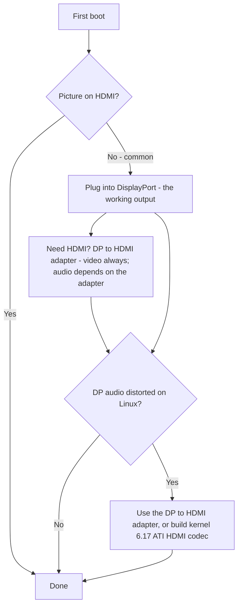

> 🌐 ترجمة مجتمعية. النسخة الإنجليزية هي المرجع الأساسي وقد تكون أحدث. وجدت خطأ؟ افتح issue: [English](../en/14-display.md) · https://github.com/lildebil0/awesome-bc250/issues

# العرض والإخراج

> **باختصار** — تُشغّل BC-250 شاشتك عبر **DisplayPort**. هذا هو الموصّل الذي تصله. وإن كانت لوحتك تملك أيضًا منفذ HDMI، فإنه **كثيرًا ما لا يُظهر شيئًا** — فالشاشة السوداء هناك *ليست* لوحة ميتة، أنت فقط على المنفذ الخطأ. تحتاج HDMI؟ استخدم **محوّل DP→HDMI** — **الفيديو يمرّ دائمًا، بلا تأخير**؛ بعض المحوّلات تحمل **الصوت** أيضًا (محوّل مُختبَر فعل ذلك، [src](https://t.me/c/2424231195/9148)) لكن الصوت يعتمد على المحوّل بعينه، فلا تعتمد عليه (راجع قسم الصوت). شذوذ حقيقي واحد: **صوت DisplayPort يخرج مشوَّهًا/مُبطَّأً على Linux**؛ محوّل DP→HDMI نفسه يتفاداه، وإصلاح صحيح على جانب النواة يصل نحو **النواة 6.17** ([src](https://t.me/c/2424231195/17953)، [src](https://t.me/c/2424231195/68051)).

"لا صورة عند أول إقلاع" هو **ذعر القادم الجديد رقم 1**. اقرأ الصندوق أدناه قبل أن تقرّر أن شيئًا معطوب.

---

## لا صورة؟ افعل هذا

1. **وصّل بـ DisplayPort، لا HDMI.** منفذ الفيديو العامل في BC-250 هو DisplayPort ([src](https://t.me/c/2424231195/104784)). منفذ HDMI (حيث وُجد) هو الذي يكون عادةً فارغًا — لا تحكم على اللوحة من خلاله.
2. **أعِد تثبيت البطاقة وحاول مجددًا.** اللوحات روتينيًا لا تتهيّأ من المحاولة الأولى — أعِد دورة الطاقة (إطفاء/تشغيل كاملان)، وأعِد التثبيت فيزيائيًا. قال أحد المالكين: *"حين وصلت بطاقتي لم تشتغل من المحاولة الأولى أيضًا … أحيانًا لا تتهيّأ بالكامل عند إعادة تشغيل بالزر — الإطفاء/التشغيل يصلحها"* ([src](https://t.me/c/2424231195/15701)).
3. **اشتبه في الكابل/المحوّل قبل اللوحة.** مع بطاقة واحدة، الكابل أو المحوّل المعطوب هو المشتبه الأول ([src](https://t.me/c/2424231195/15699)). بعض المحوّلات تعمل في البرنامج الثابت لكنها تُظلم بمجرد تحميل نظام التشغيل — *"كانت الصورة سليمة قبل GRUB، شاشة سوداء في النظام"* ([src](https://t.me/c/2424231195/38184)).
4. **أعِد ضبط BIOS / أعِد كتابة صورة معروفة الصلاح** إن أعطت عدة بطاقات في دفعة واحدة لا صورة — فهذا يشير إلى البرنامج الثابت، لا إلى شاشتك ([src](https://t.me/c/2424231195/15697)، [src](https://t.me/c/2424231195/15705)).

إن شطبت الأربعة كلها وما زلت بلا شيء، توجّه إلى [troubleshooting.md](troubleshooting.md).



---

## المنافذ بنظرة سريعة

| المنفذ | يعمل؟ | ملاحظات |
|--------|--------|-------|
| **DisplayPort** | **نعم — هذا هو المنفذ** | موصّل العرض الأساسي/الوحيد؛ يحمل الصوت. مواصفة الدخل/الخرج في المستودع تسرد `1x DisplayPort` ([repo](https://github.com/mothenjoyer69/bc250-documentation)). إنه **DisplayPort 1.4**، بسقف **4K@120 Hz**، مع HDR10 ([elektricM](https://github.com/elektricM/amd-bc250-docs/blob/main/docs/hardware/display.md)). |
| **منفذ HDMI** (إن وُجد) | **فارغ غالبًا** | يظن القادمون الجدد أن اللوحة ميتة؛ هي عادةً ليست كذلك — انتقل إلى DP. ([src](https://t.me/c/2424231195/104784)) |
| **DP → HDMI عبر محوّل** | **الفيديو: نعم. الصوت: يعتمد على المحوّل** | الفيديو يمرّ بلا تأخير ([src](https://t.me/c/2424231195/9148))؛ الصوت يعتمد على طقم الرقائق — اختبره (راجع قسم الصوت). وهو أيضًا الإصلاح القياسي لتشويه صوت DP (أدناه). |
| **منفذ فيديو ثانٍ** | **ليس جاهزًا من العلبة** | حاضر كهربائيًا لكنه **غير مُجهَّز**؛ فرض شاشة ثانية يحتاج حيلًا، ويقول آخرون إن الشريحة لا تملك رأس عرض ثانيًا حقيقيًا — اعتبر المنفذ الواحد هو الافتراض الآمن. ([src](https://t.me/c/2424231195/92978)، [src](https://t.me/c/2424231195/104682)) |
| **شاشة ثانية عبر الشبكة** | **نعم** | ابثّ خرج BC-250 إلى جهاز آخر عبر الشبكة المحلية (Steam/Sunshine). ([src](https://t.me/c/2424231195/23660)) |

---

## الدقّات ومعدل التحديث والكابل

مرجع elektricM يحدّد بدقة ما يفعله رابط DP الوحيد فعلًا — مفيد عند اختيار شاشة أو محوّل ([elektricM](https://github.com/elektricM/amd-bc250-docs/blob/main/docs/hardware/display.md)):

| الدقة | معدل التحديث | المسار |
|------------|---------|------|
| 1920×1080 (1080p) | 144 Hz+ | DP أصلي، أو أي محوّل |
| 2560×1440 (1440p) | 144 Hz+ | DP أصلي (المحوّلات السلبية كثيرًا ما تحدّ عند 1440p@60 / DP 1.2) |
| 3840×2160 (4K) | 60 Hz | DP أصلي، أو محوّل DP→HDMI 2.0 **نشط** |
| 3840×2160 (4K) | 120 Hz | **DP أصلي فقط** — يلزم محوّل DP 1.4→HDMI 2.1 نشط لتشغيل 4K@120 عبر HDMI، وهو غير مستقر |

- **الكابل:** استخدم كابل **DisplayPort 1.4 معتمد من VESA**، بطول **1–2 m**؛ الكابلات الأطول تسبّب مشاكل تزامن/انقطاع ([elektricM](https://github.com/elektricM/amd-bc250-docs/blob/main/docs/hardware/display.md)).
- **عالق عند دقة منخفضة** (مثلًا 1024×768/1080p، 60 Hz فقط) يعني عادةً أن تعريف GPU غير محمَّل — تحقّق بـ `glxinfo | grep "OpenGL renderer"`؛ `llvmpipe` = عرض برمجي، ثبّت Mesa 25.1+ وأزِل `nomodeset` ([elektricM](https://github.com/elektricM/amd-bc250-docs/blob/main/docs/troubleshooting/display.md)). راجع [06-linux.md](06-linux.md).
- **HDR (HDR10) وVRR** يعملان لكنهما تجريبيان على Linux — **KDE Plasma 6+** له أفضل دعم ويحتاج عمومًا إلى جلسة Wayland ([elektricM](https://github.com/elektricM/amd-bc250-docs/blob/main/docs/hardware/display.md)). **التوزيعة مهمّة هنا:** تقرير مجتمعي من r/BC250Gaming (Reddit) أوصل **HDR + VRR إلى العمل بشكل صحيح على CachyOS فقط** (Plasma 6 + Wayland)، بينما على **Bazzite تسبّب HDR في أعطال رسومية ولم يعمل VRR إطلاقًا**. مثالهم: *Forza Horizon 6* عند **1440p إعدادات عالية، HDR + VRR مفعَّلان، 60–80 FPS** عبر محوّل **UGREEN DP→HDMI 2.1**. إن كان HDR/VRR أولوية، راجع ملاحظة CachyOS في [06-linux.md](06-linux.md).
  - **إن كنت على Bazzite KDE وتريد VRR/FreeSync عبر HDMI**، يوجد ريمكس مجتمعي يستبدل عمل نواة AMD لـ HDMI 2.1 / FRL: **[`dyllan500/bazzite-amd-hdmi-kde`](https://github.com/dyllan500/bazzite-amd-hdmi-kde)** — صورة Bazzite KDE مُعاد بناؤها على نواة تحمل ترقيعات AMD الرسمية لـ HDMI-2.1 VRR (من `amd-staging-drm-next`). ⚠ **تحفّظ بشدة:** إنها صورة طرف ثالث، اختبر المؤلف VRR على **Radeon 9070 XT** فقط (لا BC-250)، ويُقصد بها أن تصبح متقادمة بمجرد وصول الترقيعات إلى نواة Bazzite القياسية. إنها *ليست* إصلاحًا مؤكَّدًا لـ BC-250 — اعتبرها مسارًا تجريبيًا للتجربة، لا ضمانًا.

> **شاشة سوداء *بعد تسجيل الدخول* (GRUB وشاشة الدخول كانتا سليمتين)** هي مشكلة جلسة سطح مكتب، عادةً **Wayland** — اختر "GNOME on Xorg"/"Plasma (X11)" من ترس الدخول، أو اضبط `WaylandEnable=false` في `/etc/gdm/custom.conf` ([elektricM](https://github.com/elektricM/amd-bc250-docs/blob/main/docs/hardware/display.md)). الشاشة السوداء *قبل* الدخول هي مشكلة التعريف/`nomodeset` أعلاه، لا هذه.

---

## صوت DisplayPort مشوَّه — إصلاح المحوّل

على Linux، الصوت المُرسَل **مباشرة من DisplayPort** يخرج خطأً على BC-250 — يُوصَف بأنه مشوَّه، *"مطّاط، كأنه مُبطَّأ إلى نصف السرعة،"* مع طقطقة ([src](https://t.me/c/2424231195/9895)). هذه **مشكلة في Linux/بروتوكول DP، لا عيب في اللوحة** — لقد شوهدت على عتاد غير BC-250 أيضًا ([src](https://t.me/c/2424231195/15983)).

الحل البديل الفظّ الموثوق الذي استقرّت عليه المحادثة: **مرّر الإشارة عبر محوّل DP→HDMI.** بعد التحويل إلى HDMI، تختفي تشوهات الصوت ([src](https://t.me/c/2424231195/17953)، [src](https://t.me/c/2424231195/51763)). تحقّق أحد المستخدمين منه مباشرة: *"اختبرت خرج الصوت عبر محوّل DisplayPort→HDMI. كل شيء سليم، بلا تأخير"* ([src](https://t.me/c/2424231195/9148)).

**أنظف المسارات جميعًا هو *كابل* DP→HDMI مباشر — قابس DP في طرف، قابس HDMI في الطرف الآخر، بلا دونجل محوّل أو صندوق في أي طرف.** يبلّغ عدة مستخدمين على خيط مجتمع r/linux_gaming بشكل مستقل أن هذا يعطي أوثق صوت: كابل عادي (مثل كابل Amazon Basics من DP إلى HDMI، ~$10) "يعمل ببساطة" حيث تكون المحوّلات بأسلوب الدونجل عشوائية النجاح. قد يحدث كتم صوت قصير عرضي، لكن كابلًا من قطعة واحدة يزيل طقم رقائق المحوّل الإضافي الذي يجعل مسار الدونجل مقامرة ([r/linux_gaming](https://www.reddit.com/r/linux_gaming/comments/1nvsgji/)). إن كنت ستشتري على أي حال، **فضّل الكابل على الدونجل.**

**إن لم يكن لديك محوّل في المتناول،** مرّر الصوت عبر **Bluetooth** بدلًا من ذلك — معظم السماعات/السماعات الرأسية تدعمه ويتفادى مسار DP تمامًا ([src](https://t.me/c/2424231195/89769)). راجع [10-wifi-bt.md](10-wifi-bt.md) لدونجل BT.

### ملاحظات المحوّلات (المجتمع)
- **لـ 4K@60+ تحتاج محوّلًا/كابلًا *نشطًا*** (السلبي يحدّ عند ~1440p@60). مثال عامل مُختبَر: **UGREEN DP125 (كابل DP→HDMI 4K)** — مُصنَّف 4K@30 لكنه تفاوض على 4K@60 على تلفاز ([src](https://t.me/c/2424231195/52398)). النشط مقابل السلبي يحدّد سقف الدقة — وهو **لا** يقرّر ما إذا كان الصوت يمرّ (انظر أدناه).
- **ليست كل المحوّلات تحمل الصوت.** محوّل Belsis لأحد المالكين مرّر 4K@60 *مع* صوت، بينما عدة وحدات Ugreen أغلى أظهرت "HDMI digital audio" في قائمة الأجهزة لكنها لم تُخرج صوتًا — وواحدة خفضت الأصوات أوكتاڤًا ([src](https://t.me/c/2424231195/106617)). إن حصلت على فيديو بلا صوت، فالمحوّل هو المتغيّر — جرّب آخر.
- **لـ *صوت* HDMI، تناول محوّلًا *سلبيًا* أولًا.** نمط مجتمعي على خيط r/linux_gaming: المحوّلات السلبية DP→HDMI تميل إلى تمرير الصوت بنقاء، بينما المحوّلات **النشطة** كثيرًا ما **تُسقط الصوت بالكامل أو تُزيح نغمته** (الأصوات أُبلِغ عنها تنزلق نحو ~20 % / نحو خُمس تقريبًا). المأزق: أنت *تحتاج* محوّلًا نشطًا فقط لـ **HDR** حقيقي (ولـ 4K@60+)، فهي مفاضلة حقيقية — سلبي لصوت موثوق، نشط لـ HDR. خيارات *سلبية* مؤكَّدة العمل مجتمعيًا: **Silver Monkey**، و**BENFEI (ASIN B017Q8ZVWK)**، و**كابل AmazonBasics من DP إلى HDMI** (الكابل من قطعة واحدة — *لا* محوّلهم بأسلوب الدونجل) ([r/linux_gaming](https://www.reddit.com/r/linux_gaming/comments/1nvsgji/)). ⚠ رموز SKU المحدّدة مُبلَّغة مجتمعيًا، لا مُتحقَّقة مخبريًا هنا — والمحوّل السلبي يبقى محدودًا عند ~**1440p@60**.
- محوّلات **4K@60 DP→HDMI** الرخيصة التي تمرّر الفيديو والصوت معًا موجودة فعلًا ومُبلَّغ عنها بأنها تعمل ([src](https://t.me/c/2424231195/133977)).
- بعض المحوّلات تسيء التصرف تحديدًا على **شاشات 4K** ([src](https://t.me/c/2424231195/1988)).
- **الصوت عبر محوّل DP→HDMI غير متّسق ويعتمد على طقم رقائق المحوّل — لا ببساطة على النشط مقابل السلبي.** الفيديو يمرّ دائمًا؛ **الصوت هو المتغيّر.** تقاريرنا المجتمعية محوّلًا-بمحوّل (وحدات UGREEN/Belsis أُبلِغ عنها أنها تحمل الصوت، بعض الوحدات الأخرى صامتة)، ويبلّغ دليل elektricM عن الانقسام *المعاكس* (السلبي يحمل الصوت، بعض الوحدات النشطة صامتة — مثل Cable Matters/StarTech) — وهذا بالضبط لماذا لا تتنبّأ به علامة النشط/السلبي ([elektricM](https://github.com/elektricM/amd-bc250-docs/blob/main/docs/troubleshooting/display.md)). للحصول على صوت **موثوق**، لا تراهن على محوّل: فضّل **شاشة/مستقبِل صوت-فيديو أصلي بـ DisplayPort**، أو أخرِج الصوت عبر **USB (جهاز DAC/صوت بـ USB)**. وإن استخدمت محوّلًا، **اختبر الصوت قبل أن تعتمد عليه** — وتذكّر أن المحوّل **السلبي** يحدّ عند ~**1440p@60**.

### إصلاح النواة 6.17 (صوت DP المباشر، بلا محوّل)

إن أردت صوتًا نقيًّا **مباشرة عبر DisplayPort** بلا محوّل، فقد تُتُبِّع السبب والإصلاح في المحادثة. بنى تكوين نواة Fedora القياسي `snd-hda-codec-hdmi.ko` + `snd-hdmi-lpe-audio.ko`؛ **النواة 6.17 غيّرت مسار صوت HDMI** وعطّلت الصوت على ذلك التكوين الافتراضي. الإصلاح هو أن تبني أيضًا **ATI HDMI codec** — اقلب تكوين النواة من `# CONFIG_SND_HDA_CODEC_HDMI_ATI is not set` إلى `CONFIG_SND_HDA_CODEC_HDMI_ATI=m`، ما يحزم `snd-hda-codec-atihdmi.ko`؛ يعمل الصوت عندئذٍ **بلا ترقيعات** ([src](https://t.me/c/2424231195/68051)، [src](https://t.me/c/2424231195/68061)).

```text
# Fedora kernel config change for DP/HDMI audio on kernel 6.17+
# from:
# CONFIG_SND_HDA_CODEC_HDMI_ATI is not set
# to:
CONFIG_SND_HDA_CODEC_HDMI_ATI=m
```

بوجود ذلك الكوديك الثالث (`snd-hda-codec-atihdmi.ko`)، يكشف ALSA منافذ صوت اللوحة (مثل `pcm=3` و`pcm=7` كجهازَي HDMI) ([src](https://t.me/c/2424231195/68062)، [src](https://t.me/c/2424231195/67569)). ⚠ تحقّق — هذا يتطلب بناء نواة مخصّصة؛ اعتبر محوّل DP→HDMI هو المسار بلا بناء لمعظم المستخدمين. راجع [06-linux.md](06-linux.md) لإعداد النواة/التعريف.

### الصوت المحيطي (5.1) — استخدم بطاقة صوت USB، لا HDMI

**الصوت المحيطي 5.1 عبر HDMI *لا* يعمل على BC-250.** برنامج AMD الثابت لـ HDMI على Linux لهذه الشفرة عديمة الرأس/التعدينية لا يكشف LPCM متعدد القنوات، فيرجع خرج HDMI إلى ستيريو عادي مهما يدعم المستقبِل ([r/linux_gaming](https://www.reddit.com/r/linux_gaming/comments/1nvsgji/)). للحصول على تعدد قنوات حقيقي، مرّر الصوت عبر **بطاقة صوت USB / DAC بـ USB** بدلًا من ذلك — اضبطها كالمصرف الافتراضي في `pavucontrol`، ثم أكّد القنوات الست كلها بـ:

```bash
speaker-test -D pipewire -c 6 -t wav
```

مسار DAC-USB نفسه هو أيضًا الإصلاح الموثوق لصوت الستيريو حين تسيء المحوّلات التصرف (أعلاه).

---

## المنفذ الثاني (غير نشط مبدئيًا)

يوجد **منفذ فيديو ثانٍ على اللوحة غير نشط من العلبة.** قراءة المجتمع منقسمة ويستحق نصفاها المعرفة:

- إنه **حاضر كهربائيًا لكنه غير مُجهَّز/ملحوم**، و*"بالحيل يمكنك تشغيل شاشة ثانية"* ([src](https://t.me/c/2424231195/92978)).
- يبلّغ آخرون أن الشريحة ببساطة **لا تملك رأس عرض ثانيًا صالحًا للاستخدام** — *"المشكلة في الشريحة، المنفذ الثاني فيزيائيًا غير موجود"* ([src](https://t.me/c/2424231195/104682)).

عمليًا: **افترض منفذ DisplayPort واحدًا.** **مُقسِّم DP MST لشاشتين مستقلتين سُئِل عنه لكنه غير مؤكَّد العمل** في محادثتنا ([src](https://t.me/c/2424231195/92109)).

**تحديث من elektricM — MST يمكنه تشغيل شاشتين بالموزِّع المناسب.** يبلّغ اختبار elektricM عن حتى **شاشتين عبر موزِّع DP MST** (عرض النطاق مشترك، الدقة لكل شاشة محدودة)، مع نتائج موزِّعًا-بموزِّع ([elektricM](https://github.com/elektricM/amd-bc250-docs/blob/main/docs/hardware/display.md)):

| موزِّع MST | الخرج | إصدار DP | شاشات مستقلة؟ | الصوت | ملاحظات |
|---------|-----|--------|-----------------------|-------|-------|
| StarTech MST14DP122DP | 2× DP | 1.4 | **نعم** | نعم | عمل باتّساق عبر الشاشات/الكابلات |
| Monoprice 21972 | 2× DP | 1.2 | **نسخ مطابق فقط** | نعم | لم يستطع إلا النسخ المطابق |
| ENBUER | 2× DP | 1.2 | **نسخ مطابق فقط** | نعم | لم يستطع إلا النسخ المطابق |
| Generic HDMI MST | 2× HDMI | — | **لا** | لا | لا فيديو ولا صوت |

إذن، الشاشتان المزدوجتان الأصليتان **ممكنتان** عبر MST بموزِّع DP 1.4 (StarTech مؤكَّد)؛ موزِّعات DP 1.2 الأرخص قد تنسخ مطابقًا فقط، وموزِّعات HDMI MST فشلت. ⚠ تحقّق — طراز موزِّع واحد مؤكَّد؛ النتائج تختلف بحسب الموزِّع.

**مسار عرض متعدد آخر — محوّل USB DisplayLink.** أضِف محوّل USB→HDMI/DP من DisplayLink لشاشة **سطح مكتب** إضافية (وصّله *بعد* الإقلاع للحصول على أفضل النتائج). **ليس للألعاب** — فهو يضغط على المعالج، وهو عنق زجاجة BC-250، فالكمون عالٍ؛ كما أنه لا يعمل في **وضع اللعب** بـ Steam Deck ([elektricM](https://github.com/elektricM/amd-bc250-docs/blob/main/docs/hardware/display.md)).

---

## شاشة ثانية عبر الشبكة ("الشاشة الثانية" السهلة)

إن كنت تريد فعلًا صورة BC-250 على جهاز ثانٍ، فالمسار المُثبَت ليس كابلًا ثانيًا — إنه **البثّ عبر الشبكة المحلية.** قال أحد المستخدمين: *"أطلقت لعبة Steam على BC-250 (Fedora) وبثثتها عبر الشبكة إلى حاسوب العمل المحمول، وتحكّمت بها من المحمول. كل شيء عمل"* ([src](https://t.me/c/2424231195/23660)).

- **Sunshine** (مرمِّز المضيف) يعمل هنا لأنه ليس حصريًا لـ NVIDIA — فهو يقوم بالترميز، والعميل يكتفي بفكّ الترميز ([src](https://t.me/c/2424231195/25091)). عبر شبكة محلية بسرعة جيجابت أُبلِغ عنه أنه شبه مثالي ([src](https://t.me/c/2424231195/25563)).
- **Moonlight كمضيف** *لا* يصلح — فهو يتوقّع مرمِّز NVIDIA ويتلعثم/يشتكي من غياب فاكّ ترميز عتادي ([src](https://t.me/c/2424231195/25050)). استخدم Sunshine كمضيف، وMoonlight كعميل فقط.

هذه أيضًا الطريقة العملية للحصول على إحساس "العرض المزدوج" بلا المنفذ الثاني غير المُجهَّز أعلاه.

---

## المصادر

- محوّل DP→HDMI يمرّر فيديو+صوت، بلا تأخير — https://t.me/c/2424231195/9148
- تشويه صوت DP مشكلة Linux؛ المحوّل يصلحها — https://t.me/c/2424231195/17953 · https://t.me/c/2424231195/9895 · https://t.me/c/2424231195/51763 · https://t.me/c/2424231195/15983
- إصلاح صوت النواة 6.17 (`CONFIG_SND_HDA_CODEC_HDMI_ATI=m`) — https://t.me/c/2424231195/68051 · https://t.me/c/2424231195/68061 · https://t.me/c/2424231195/68062 · https://t.me/c/2424231195/67569
- محوّلات عاملة — UGREEN DP125 https://t.me/c/2424231195/52398 · Belsis مقابل غيرها (الصوت يتفاوت) https://t.me/c/2424231195/106617 · 4K@60 رخيص https://t.me/c/2424231195/133977
- DP هو المنفذ العامل؛ أنفِق على محوّل DP→HDMI جيد — https://t.me/c/2424231195/104784
- لا صورة عند أول إقلاع / إعادة التثبيت / إعادة الكتابة — https://t.me/c/2424231195/15697 · https://t.me/c/2424231195/15699 · https://t.me/c/2424231195/15701 · https://t.me/c/2424231195/38184
- المنفذ الثاني حاضر لكنه غير مُجهَّز / متنازَع عليه — https://t.me/c/2424231195/92978 · https://t.me/c/2424231195/104682 · MST مسؤول عنه https://t.me/c/2424231195/92109
- الشاشة الثانية عبر الشبكة (Sunshine/Steam عبر الشبكة المحلية) — https://t.me/c/2424231195/23660 · https://t.me/c/2424231195/25091 · https://t.me/c/2424231195/25050 · https://t.me/c/2424231195/25563
- صوت Bluetooth كبديل — https://t.me/c/2424231195/89769
- *كابل* DP→HDMI مباشر (بلا محوّلات) هو أوثق صوت؛ 5.1 عبر HDMI لا يعمل (لا LPCM متعدد القنوات)، استخدم بطاقة صوت USB / DAC — خيط مجتمع r/linux_gaming https://www.reddit.com/r/linux_gaming/comments/1nvsgji/
- مرجع عتاد الدخل/الخرج (`1x DisplayPort`) — [mothenjoyer69/bc250-documentation](https://github.com/mothenjoyer69/bc250-documentation) · [`hardware.md`](https://github.com/mothenjoyer69/bc250-documentation/blob/main/hardware.md)
- DP 1.4 / 4K@120 / HDR10، حدود الدقة+الكابل، موزِّعات MST (حتى 2)، DisplayLink، شاشة سوداء عند دخول Wayland — elektricM [`hardware/display.md`](https://github.com/elektricM/amd-bc250-docs/blob/main/docs/hardware/display.md)
- HDR + VRR يعملان على CachyOS (Plasma 6 + Wayland) مقابل معطوبين على Bazzite؛ Forza Horizon 6 بـ 1440p عالية HDR+VRR عبر UGREEN DP→HDMI 2.1 — تقرير مجتمعي من r/BC250Gaming (Reddit) (راجع [06-linux.md](06-linux.md))
- DP→HDMI السلبي يحمل الصوت / النشط يُسقطه أو يُزيح نغمته؛ سلبي لكنه مطلوب لـ HDR؛ سلبيات مؤكَّدة Silver Monkey / BENFEI B017Q8ZVWK / كابل AmazonBasics من DP إلى HDMI — [خيط مجتمع r/linux_gaming](https://www.reddit.com/r/linux_gaming/comments/1nvsgji/)
- ريمكس Bazzite KDE لـ VRR/FreeSync عبر HDMI (نواة AMD لـ HDMI 2.1؛ مُختبَر على 9070 XT، لا BC-250) — [`dyllan500/bazzite-amd-hdmi-kde`](https://github.com/dyllan500/bazzite-amd-hdmi-kde)
- صوت المحوّل يعتمد على طقم الرقائق (رأى elektricM السلبي يحمله / بعض النشط صامت؛ رأى المجتمع العكس — فضّل DP الأصلي أو DAC بـ USB)، فحص llvmpipe للدقة المنخفضة — elektricM [`troubleshooting/display.md`](https://github.com/elektricM/amd-bc250-docs/blob/main/docs/troubleshooting/display.md)

> إعداد التعريف/النواة في [06-linux.md](06-linux.md)؛ مزالق الصوت/الإخراج مفهرسة أيضًا في [troubleshooting.md](troubleshooting.md) و[faq.md](faq.md).
