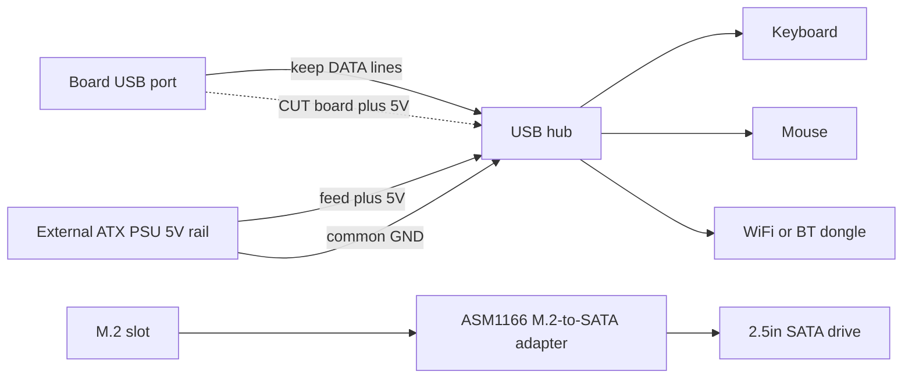

> 🌐 ترجمة مجتمعية. النسخة الإنجليزية هي المرجع الأساسي وقد تكون أحدث. وجدت خطأ؟ افتح issue: [English](../en/16-usb-peripherals.md) · https://github.com/lildebil0/awesome-bc250/issues

# USB والموزِّعات والطرفيات

> **باختصار** — تمنحك اللوحة **4 منافذ USB خلفية (2× USB 2.0 + 2× USB 3.0)** وهذا كل شيء — لا رؤوس توصيل داخلية موصَّلة افتراضيًا. دونجل WiFi/BT، وSSD عبر USB، ولوحة مفاتيح، وفأرة، ووحدة تحكم تلتهم هذه المنافذ بسرعة، فيضيف الجميع تقريبًا **موزِّع USB**. والمشكلة: **قضيب 5 V لـ USB في اللوحة ضعيف** ويهبط تحت الحمل، فتنقطع الموزِّعات الرخيصة المغذَّاة من الناقل (وحتى أقراص الفلاش الموصولة مباشرةً). الحلول الموثوقة، بالترتيب: **موزِّع مغذَّى (نشط)**، أو **تعديل حقن 5 V** المجتمعي — اقطع الـ 5 V التي يأخذها الموزِّع من اللوحة وغذِّه بـ 5 V من مصدر طاقة ATX بدلًا من ذلك. ([src](https://t.me/c/2424231195/119741))

هذه صفحة **ملحقات**. اضبط الموزِّع بشكل صحيح وكل ما تبقّى (الصوت، وEthernet عبر USB، والوحدات الإرساء) يعمل ببساطة.

---

## كم منفذ USB تحصل عليه فعلًا

وفق المرجع العتادي، فإن الإدخال/الإخراج الخلفي هو **1× DisplayPort، و1× GbE Ethernet، و2× USB 2.0، و2× USB 3.0**. أي أربعة منافذ USB فيزيائية. ([hardware.md](https://github.com/mothenjoyer69/bc250-documentation/blob/main/README.md))

عمليًا، منفذا **USB 3.0** هما اللذان يتنازع عليهما الناس (أسرع، يُستخدمان لأقراص SSD/الوحدات الإرساء)، وهما موصَّلان **ضيّقَين** كهربائيًا — يصف أحد المالكين الموصّل بأنه فعليًا "x2"، ويحذّر من تعليق مقسِّم عليه. ⚠ تحقّق من عرض المسار الدقيق. ([src](https://t.me/c/2424231195/75561))

الضائقة حقيقية بمجرد أن تسرد ما يريد منفذًا: **وصِّل SSD — يذهب منفذ واحد؛ أضِف دونجل WiFi عبر USB، وعصا تحكم، وقرصًا خارجيًا — تحتاج إلى موزِّع، وإلا خاطرت بحرق المنفذ.** ([src](https://t.me/c/2424231195/75558)) يبلّغ الناس روتينيًّا أن "كل منافذ USB 3.0 مشغولة، ولوحة المفاتيح والفأرة تمرّان عبر موزِّع." ([src](https://t.me/c/2424231195/110875))

**لا توجد رؤوس USB للوحة الأمامية مأهولة** من العلبة مباشرةً — لكن العلبة/اللوحة بها موضع مُعدّ بوضوح لتوجيه كابل الموزِّع إلى الأمام، وتستخدمه عدة تجميعات داخل علبة. ([src](https://t.me/c/2424231195/91322)) · ([src](https://t.me/c/2424231195/100249))

---

## المشكلة الحقيقية: قضيب 5 V لـ USB ضعيف

تولّد BC-250 جهد **5 V لـ USB على اللوحة نفسها** ([src](https://t.me/c/2424231195/57920))، ولا يستطيع ذلك القضيب تزويد الكثير. أوضح قياس من المحادثة، على لوحة لم تكن تُعدّد الأجهزة:

> "لوحتي BC-250 لا تعطي 5 V سليمة على USB… لوحة المفاتيح وحدها تعمل؛ إن وصّلتُ فأرة انطفأت لوحة المفاتيح. ~**4.3 V** مع لوحة المفاتيح فقط، و**2.3 V–3.2 V** مع لوحة المفاتيح + الفأرة، و**5.1 V** مع نزع كليهما." ([src](https://t.me/c/2424231195/119071))

هذا الهبوط في الجهد هو سبب تجمّع الأعراض حول **الحمل**: أقراص فلاش وميكروفونات **تسقط عند توصيلها مباشرةً لكنها تعمل بلا مشاكل عبر موزِّع**، ولوحات مفاتيح تفقد مؤشّراتها الضوئية، وأجهزة تنقطع لحظة سحب شيئين للطاقة في آن واحد. ([src](https://t.me/c/2424231195/53939)) إنها نفس الحساسية للطاقة التي تجعل دونجلات WiFi متقلّبة — راجع **[10-wifi-bt.md](10-wifi-bt.md)**، حيث تعمل العصِيّ في الخمول ثم تنقطع عند قفزة تنزيل.

> ⚠ ليست كل لوحة بهذا السوء. أحد المالكين يشغّل **دونجل WiFi + لوحة مفاتيح سلكية + فأرة عبر موزِّع بلا طاقة + شاشة 14″ + شاشة مساعدة 3.5″** من USB اللوحة ويبلّغ أنها بخير. ([src](https://t.me/c/2424231195/119231)) عامِل لوحتك على أنها مجهولة حتى تُحمِّلها بالكامل.

---

## اختيار موزِّع: مغذًّى مقابل غير مغذًّى

| نوع الموزِّع | متى يعمل | الحكم |
|----------|---------------|---------|
| **غير مغذًّى (مغذَّى من الناقل)** | أحمال خفيفة — لوحة مفاتيح، فأرة، دونجل. بعض اللوحات تشغّل قدرًا مفاجئًا بهذه الطريقة. ([src](https://t.me/c/2424231195/119231)) | لا بأس بتجربته أولًا؛ **توقّع الانقطاعات** لحظة إضافة قرص أو قفزات الحمل. |
| **مغذًّى / نشط (لبنة 5 V خارجية)** | أي شيء بأقراص، أو عدة دونجلات، أو تحت الحمل. هذه هي التوصية المجتمعية الثابتة لـ BC-250. ([src](https://t.me/c/2424231195/75558)) · ([src](https://t.me/c/2424231195/119229)) | **اشترِ هذا.** يحلّ الهبوط دون لمس اللوحة. ([src](https://t.me/c/2424231195/140091)) |
| **تعديل حقن 5 V** (انظر أدناه) | عندما تريد تجميعًا نظيفًا داخل علبة مغذًّى بالكامل من مصدر طاقة ATX ولا تريد محوّل حائط ثانيًا. | أفضل تكامل، يتطلّب لحامًا. ([src](https://t.me/c/2424231195/119741)) |

النصيحة المتكرّرة عندما تسيء أجهزة USB لأحدهم التصرّف هي ببساطة: **احصل على موزِّع USB نشط بمدخل محوّل طاقة.** ([src](https://t.me/c/2424231195/119229)) انتهى عدة مالكين إلى هناك بعد صراع مع الانقطاعات — "حُلّت بموزِّع مغذًّى خارجيًّا." ([src](https://t.me/c/2424231195/123789))

> تحذير أُثير في المحادثة: الاعتماد على موزِّع مغذًّى خارجيًّا قد يكون **دائمًا** — بمجرد أن تُفرِغ طاقة USB خارجيًّا، لا تتفاجأ إن علِقتَ بذلك الموزِّع إلى الأبد. ([src](https://t.me/c/2424231195/123924)) إنها مفاضلة جيدة لتجميع مكتبي.

---

## تعديل حقن 5 V (اجعل موزِّعًا عاديًا يتصرّف بشكل سليم)

هذا هو الإصلاح الأنيق لـ **تجميع داخل علبة يعمل أصلًا من مصدر طاقة ATX/SFX**: بدلًا من شراء موزِّع مغذًّى نشطًا بمحوّل حائط خاص به، تأخذ موزِّعًا عاديًا و**تبدّل مصدر الـ 5 V لديه**.

ما فعله أحد المستخدمين، وقد نجح ([src](https://t.me/c/2424231195/119741)):

> "عدّلتُ موزِّع USB عاديًا فنجح. **قطعتُ الـ 5 V القادمة من اللوحة الأم وأعطيتُ 5 V من مصدر الطاقة.** لم أحتج إلى توصيل الأرضي لأنني أستخدم نفس مصدر طاقة ATX لتشغيل BC-250."

كيف يعمل:

1. افتح الموزِّع؛ جد مسار/سلك **5 V (VBUS)** على الجانب **الصاعد** (الكابل الذي يُوصَل باللوحة).
2. **اقطع تلك الـ 5 V** كي لا يسحب الموزِّع الطاقة بعدها من قضيب اللوحة الضعيف.
3. غذِّ الموزِّع بـ **+5 V من مصدر طاقة ATX لديك** (خط 5 V احتياطي من SATA/Molex).
4. **الأرضي مشترك** تلقائيًا لأن نفس مصدر الطاقة يغذّي اللوحة أصلًا — لا حاجة إلى سلك أرضي إضافي. (إن غذّيتَ الموزِّع يومًا من مصدر *منفصل*، **فيجب** أن توحّد الأرضيات.)

تبقى خطوط البيانات دون مساس — أنت تغيّر مصدر الطاقة فقط. ترى اللوحة موزِّعًا لم يعد يُحمِّل قضيب 5 V لديها، وتحصل الأجهزة على طاقة نظيفة ووفيرة من مصدر الطاقة.



> ⚠ قطع المسار الخاطئ يُعطِب الموزِّع (وهو رخيص) — لكن تأكّد أنك تقطع **VBUS، لا خط بيانات**. تحقّق مرتين بمقياس متعدد قبل اللحام.

---

## خردة تجنّبها

- **موزِّعات Hoco** — صُنّفت بأنها غير موثوقة؛ اضطُرّ أحد المالكين إلى **إعادة لحام نفس موزِّع Hoco مرتين**. ([src](https://t.me/c/2424231195/74531))
- **موزِّعات "USB 3.0" الزائفة** — وُسِم "موزِّع/وحدة إرساء USB 3.0" بـ 160 ₽ من AliExpress بأنه **بالتأكيد ليس 3.0 حقيقيًا** بذلك السعر. ([src](https://t.me/c/2424231195/8761)) · ([src](https://t.me/c/2424231195/8764))
- **تسلسل الموزِّعات** لمضاعفة المنافذ — أُثير كفكرة ([src](https://t.me/c/2424231195/104653)) لكنه يكدّس مشكلة الطاقة؛ قضيب ضعيف واحد يغذّي الآن موزِّعَين. استخدم موزِّعًا مغذًّى جيدًا واحدًا بدلًا من ذلك.
- **"موزِّعات" مقسِّم SATA** من فتحة M.2 — التباس متكرّر. مع **مساري PCIe فقط** على M.2 لا يمكنك بشكل معقول تعليق وحدة تحكم SATA وتتوقّع أن تتفرّع؛ "تلك الموزِّعات بمدخل SATA واحد ومخارج كثيرة قمامة." ([src](https://t.me/c/2424231195/22539)) ليس موضوع USB — فقط لا تخلطه بتوسيع USB.
- ★ **وحدة تحكم M.2→SATA من نوع PH516 (6 منافذ) — مؤكَّد أنها لا تعمل.** يُعدَّد المنفذ لكن القرص لا يرتبط، و**أعاد شخص ثانٍ إنتاج** نفس الإخفاق ([4pda — Strange999](https://4pda.to/forum/index.php?showtopic=1104980)). اشترِ **ASM1166** الموصى به مجتمعيًّا بدلًا منه (راجع قسم التخزين) — PH516 طريق مسدود معروف على هذه اللوحة.

موزِّع به **مرمِّز صوت مدمج** هو موفِّر مساحة أنيق للتجميعات داخل علبة (جهاز واحد يمنحك منافذ إضافية *و* مقبس 3.5 mm)، ويستخدمه الناس فعلًا. ([src](https://t.me/c/2424231195/8751)) تتفاوت جودة الصوت — إنه مرمِّز رخيص. ([src](https://t.me/c/2424231195/39708))

---

## رأس USB 3.0 الداخلي (Type-E)

إن كانت علبتك بها **قابس USB 3.0 أمامي** (موصّل "Key-A/Type-E" بـ 20 طرفًا) فستريد تغذيته من USB 3.0 باللوحة. **لا يوجد رأس أصلي بـ 20 طرفًا**، فيتكيّف الناس:

- **كابل USB 3.1 Type-E → USB 3.0 (Type-A)** من AliExpress هو المسار النظيف. شُورِك AXONUS 50 سم في المحادثة. ([src](https://t.me/c/2424231195/133182)) كما نُشِر متغيّر Xiwai Type-E → 20 طرفًا. ([src](https://t.me/c/2424231195/125127))
- أو **اربط** كابل العلبة الأصلي بقابس USB 3.1 عادي — طريقة "وصل أفعى بقنفذ" حين لا يلائم أي محوّل. ([src](https://t.me/c/2424231195/135957))

**الحالة:** **USB 2.0 مؤكَّد أنه يعمل؛ USB 3.0 لم يُختبَر بالكامل بعد** من المالك الذي أبلغ عنه (الاختبار معلّق بعد التجميع داخل العلبة). عامِل 3.0 عبر محوّل على أنه ⚠ تحقّق على عتادك. ([src](https://t.me/c/2424231195/136215))

---

## التخزين (فتحة M.2 وأقراص SATA)

موصّل التخزين الداخلي الوحيد في اللوحة هو **فتحة M.2 واحدة**، وهي موصَّلة **PCIe 2.0 ×2** — فالسقف العملي هو **~1 GB/s** ([src](https://t.me/c/2424231195/66275)) · ([src](https://t.me/c/2424231195/135506)). سيعمل NVMe سريع من Gen3/Gen4، لكنه لا يستطيع بلوغ سرعته المقدَّرة هنا، فلا جدوى من الدفع مقابل قرص راقٍ. **قرص NVMe M.2 SSD عادي هو أبسط قرص إقلاع** — أسقطه في الفتحة وثبّت Linux عليه (راجع **[06-linux.md](06-linux.md)** للتثبيت).

### توصيل أقراص SATA HDD/SSD مقاس 2.5″

لا يوجد منفذ SATA على اللوحة، فلتعليق **قرص SATA مقاس 2.5″** (أو عدة أقراص) تضع **بطاقة محوّل M.2 → SATA** في فتحة M.2. اختيار المجتمع المؤكَّد هو بطاقة التوسيع **ASM1166 (M.2 PCIe → SATA)** ([src](https://t.me/c/2424231195/135180)). المسار الآخر الذي يسلكه الناس هو **قرص M.2 SATA SSD مباشرةً في اللوحة** — بلا محوّل، مجرد عصا M.2 ببروتوكول SATA. ([src](https://t.me/c/2424231195/87411))

هذا أحد **أكثر أسئلة القادمين الجدد شيوعًا** — *"هل هذا هو المحوّل الذي أحتاجه لتوصيل قرص صلب باللوحة؟"* و*"ما الطرق الأخرى لتوصيل قرص؟"* ([src](https://t.me/c/2424231195/135164)) · ([src](https://t.me/c/2424231195/135165)) — فإن كنت تسأله، فأنت في صحبة جيدة.

> ⚠ تحقّق — بطاقة ASM1166 توصية مجتمعية، لا نتيجة مختبَرة من كثيرين على BC-250 تحديدًا. أكّد أن المحوّل الذي اخترته يُعدَّد ويُقلِع قبل الاعتماد عليه. لاحظ أيضًا أن **مساري PCIe** في M.2 لا يمكنهما بشكل معقول تغذية *مقسِّم* بمدخل SATA واحد ومخارج كثيرة — راجع **خردة تجنّبها** أعلاه. ([src](https://t.me/c/2424231195/22539))

#### ★ تشغيل قرص SATA مقاس 2.5″ (اللوحة 12 V فقط)

بطاقة المحوّل أعلاه تتولّى **البيانات**، لكن قرص SATA مقاس 2.5″ يحتاج أيضًا إلى **طاقة 5 V** على موصّل طاقة SATA لديه — واللوحة BC-250 لا تقدّم سوى **12 V**، بلا رأس طاقة SATA للسحب منه. الإصلاح العملي من أحد التجميعات: **محوّل USB→طاقة SATA يغذّي 5 V** إلى القرص، مع **محوّل خفض (buck) من 12 V→5 V** يُنتج تلك الـ 5 V من جهد 12 V باللوحة ([تجميع TMG HD](https://youtu.be/OEO0r01zcfU)؛ ⚠ تقريبي — مُعاد صياغته من شرح الفيديو). بعبارة أخرى: ASM1166 (أو عصا M.2 SATA) تحمل *بيانات* SATA؛ ومحوّل الخفض + محوّل USB→طاقة SATA يحمل *طاقة* SATA. حاوية 2.5″ ذاتية التغذية أو وحدة إرساء مغذَّاة تتجاوز المشكلة برمّتها بجلب قضيب 5 V الخاص بها.

#### ★ "no nvme drive detected" في SteamOS مع عصا M.2 SATA

إن أقلعتَ SteamOS بقرص **M.2 SATA SSD** (مثلًا **Kingston SNS41**) بدلًا من NVMe، فقد يفشل مسار التثبيت/الإصلاح بـ **"no nvme drive detected"** — يفترض SteamOS أن القرص جهاز NVMe (`nvme…`)، لكن عصا SATA تُعدَّد كـ `sda`. الإصلاح هو تحرير سكربت الإصلاح وتوجيهه إلى اسم الجهاز الصحيح ([4pda — pornocrat](https://4pda.to/forum/index.php?showtopic=1104980)):

```bash
# Edit the SteamOS repair script and replace the device name nvme -> sda
nano ~/tools/repair_device.sh
# change every "nvme" reference to "sda", save, then re-run the install/repair
```

هذا مجرد عدم تطابق في تسمية الجهاز — تعمل عصا SATA بلا مشاكل بمجرد إخبار SteamOS بأن ينظر إلى `sda` بدلًا من عقدة `nvme`.

### أقراص SATA الأقدم لا بأس بها

لأن وصلة M.2 تحدّ كل شيء عند ~1 GB/s على أي حال، فإن قرص **SATA HDD/SSD مقاس 2.5″** قديمًا كافٍ تمامًا لـ **مكتبة ألعاب أو ألعاب أقدم** — السرعة التي ستفقدها هي سرعة لا تستطيع اللوحة تقديمها. ([src](https://t.me/c/2424231195/132739)) **حاوية USB-NVMe** خيار آخر إن كنت تفضّل إبقاء فتحة M.2 حرة، لكن الحاويات التي تدعم NVMe فعلًا (لا SATA) تبدأ بسعر أغلى — لعصا إقلاع صغيرة لا تستحق ذلك. ([src](https://t.me/c/2424231195/111022))

### Intel Optane 16 GB كذاكرة تخزين مؤقت/swap — فكرة مجتمعية، حكم فاتر

استخدام وحدة **Intel Optane 16 GB NVMe** صغيرة كجهاز تخزين مؤقت أو swap طُرِح كفكرة، مع حكم رصين ([4pda](https://4pda.to/forum/index.php?showtopic=1104980)): تبيّن أن وحدات **"Optane" بسعة 16 GB المباعة على Ozon ليست Optane حقيقية** باختبارات الأعضاء أنفسهم، و**فتحة M.2 في اللوحة بطيئة** (PCIe 2.0 ×2، ~1 GB/s) فميزة زمن الوصول مُضعَّفة، وبينما **ملف swap ممكن نظريًا**، فإنه ليس مكسبًا واضحًا هنا. عامِله كطُرفة، لا كترقية موصى بها.

---

## الوحدات الإرساء ومحطات الإرساء

يمكن لـ **وحدة إرساء** من طراز USB-C / Thunderbolt أن تعمل كموزِّع ضخم واحد (USB + Ethernet + أحيانًا فيديو)، وقد استخدمها المالكون:

- **وحدة إرساء Wavlink WL-UG69DK1 USB-C مزدوجة 4K** قيد الاستخدام لدى أحد الأعضاء. ([src](https://t.me/c/2424231195/68141))
- **وحدة إرساء DisplayLink** تعمل كـ **موزِّع USB + بطاقة صوت USB**؛ لم يستطع العضو إخراج فيديو منها (اصطدم بحائط TPM/BIOS)، فعامِل *فيديو* الوحدة الإرساء على أنه غير موثوق. ([src](https://t.me/c/2424231195/104776))
- لـ **الشاشات الإضافية تحديدًا**، لن تتفادى وحدة الإرساء حدّ خرج GPU نفسه — راجع **[14-display.md](14-display.md)** قبل أن تعتمد عليها.

الخلاصة: الوحدات الإرساء جيدة كـ **موزِّعات مغذَّاة** (تجلب مصدرها الخاص، الذي يتجاوز مشكلة الـ 5 V بأناقة). لا تشترِ واحدة متوقّعًا أن يعمل خرج **الفيديو** فيها.

---

## وحدات التحكم والإدخال

تركب أذرع الألعاب نفس قضيب USB الضعيف ونفس قصة Bluetooth المتقلّبة مثل كل شيء آخر (راجع **[10-wifi-bt.md](10-wifi-bt.md)** لدونجلات BT). بضع نتائج محدّدة:

- **DualSense على Linux عبر DS5Dongle (Raspberry Pi Pico 2W).** يمنح هذا الدونجل المفتوح لـ DualSense **اهتزازاته فائقة الدقة (HD haptics) + مكبّر الصوت** على Linux و**واجهة ويب** لمعدل الاستطلاع / مستوى الصوت — لكن هناك مشكلة في صوت اللعبة: عناوين Wine/Proton تحصل على صوت وحدة التحكم فقط في **وضع Direct** (تظهر وحدة التحكم كـ **بطاقة صوت رباعية القنوات** واحدة)، و**ليست كل توزيعة تعرض ذلك الوضع** ([4pda — korotyshev](https://4pda.to/forum/index.php?showtopic=1104980)). بمعزل عن ذلك، يحتاج تعريف النواة **`hid-playstation`** (دعم DualSense الأصلي) إلى **Bluetooth ≥ 5.0** على المحوّل ([4pda — xDarkman](https://4pda.to/forum/index.php?showtopic=1104980)).
- **GameSir T4 Kaleid + دونجل 2.4 GHz الخاص به** مسار وحدة تحكم/إدخال عامل يتجاوز Bluetooth بالكامل — إدخال بإحساس سلكي عبر مستقبِل USB بتردد 2.4 GHz بدلًا من الصراع مع إقران BT ([TiredDadTech](https://youtu.be/zi7sldeRd2w)؛ ⚠ تقريبي — مُعاد صياغته من الفيديو).
- **منفذ دونجل BT مهم: دونجل UGREEN Bluetooth يعمل فقط في منفذ USB 2.0، لا USB 3.0.** ضجيج التردد الراديوي/التوصيل الكهربائي لمنافذ 3.0 يكسره؛ انقله إلى أحد منفذي **USB 2.0** فيعمل ([4pda — InfernalWolf666](https://4pda.to/forum/index.php?showtopic=1104980)). (نفس تأثير ضجيج USB 3.0 الذي يبتلي عصِيّ WiFi/BT — راجع [10-wifi-bt.md](10-wifi-bt.md).)

---

## الإعداد المبدئي الموصى به

| المستوى | افعل هذا | لماذا |
|------|---------|-----|
| الحد الأدنى | موزِّع مغذًّى من الناقل للوحة المفاتيح/الفأرة/الدونجل | مجاني إن كنت تملك واحدًا؛ مناسب للأحمال الخفيفة ([src](https://t.me/c/2424231195/119231)) |
| **موصى به** | **موزِّع USB مغذًّى (نشط)** بلبنة 5 V خاصة به | يُصلح الهبوط، بلا لحام، تبقى الأقراص + الدونجلات تعمل ([src](https://t.me/c/2424231195/75558)) |
| تجميع داخل علبة | موزِّع عادي + **تعديل حقن 5 V** من مصدر طاقة ATX/SFX | أنظف تكامل، محوّل حائط أقل ([src](https://t.me/c/2424231195/119741)) |

تجميع مرجعي داخل علبة شائع هو هذا بالضبط: **Cooler Master MasterBox NR200P + موزِّع USB + مصدر طاقة SFX** — يُعامَل الموزِّع كجزء افتراضي من التجميع، لا كفكرة لاحقة. ([src](https://t.me/c/2424231195/81149)) راجع **[05-case.md](05-case.md)** لجانب العلبة؛ حتى أن علبة جاهزة للطباعة تتضمّن تخطيطًا لـ HDD + موزِّع USB. ([printables](https://www.printables.com/model/1580750-bc250-amd-case-v3-hp-server-psu-hdd-usb-hub))

---

## المصادر

- تعديل حقن 5 V (اقطع 5 V اللوحة، غذِّ من مصدر الطاقة) — https://t.me/c/2424231195/119741 · سؤال كيفية — https://t.me/c/2424231195/119795
- هبوط جهد USB المقيس (4.3 V → 2.3 V) — https://t.me/c/2424231195/119071 · اللوحة تصنع 5 V داخليًا — https://t.me/c/2424231195/57920
- ميزانية المنافذ / "تحتاج إلى موزِّع مغذًّى وإلا خاطرت بحرق المنفذ" — https://t.me/c/2424231195/75558 · USB هو x2 — https://t.me/c/2424231195/75561 · كل 3.0 مشغول — https://t.me/c/2424231195/110875
- الموزِّع النشط هو الإصلاح — https://t.me/c/2424231195/119229 · https://t.me/c/2424231195/123789 · https://t.me/c/2424231195/140091 · قد يكون دائمًا — https://t.me/c/2424231195/123924
- موزِّع بلا طاقة يعمل على بعض اللوحات — https://t.me/c/2424231195/119231 · التوصيل المباشر ينقطع، الموزِّع يُصلحه — https://t.me/c/2424231195/53939
- موزِّع Hoco غير موثوق / أُعيد لحامه مرتين — https://t.me/c/2424231195/74531 · موزِّع "3.0" رخيص زائف — https://t.me/c/2424231195/8761 · https://t.me/c/2424231195/8764
- التباس مقسِّم SATA — https://t.me/c/2424231195/22539 · تسلسل الموزِّعات — https://t.me/c/2424231195/104653
- التخزين: M.2 هو PCIe 2.0 ×2 / ~1 GB/s — https://t.me/c/2424231195/66275 · ضع M.2 SATA SSD بدلًا منه — https://t.me/c/2424231195/135506 · بطاقة ASM1166 M.2→SATA — https://t.me/c/2424231195/135180 · M.2 SATA مباشرةً في اللوحة — https://t.me/c/2424231195/87411 · "أي محوّل لتوصيل قرص؟" — https://t.me/c/2424231195/135164 · https://t.me/c/2424231195/135165 · SATA مقاس 2.5″ قديم مناسب لمكتبة ألعاب — https://t.me/c/2424231195/132739 · حاويات USB-NVMe أغلى — https://t.me/c/2424231195/111022
- ★ تشغيل قرص SATA مقاس 2.5″ (USB→طاقة SATA + خفض 12 V→5 V) على اللوحة ذات 12 V فقط — [تجميع TMG HD](https://youtu.be/OEO0r01zcfU) (⚠ تقريبي، مُعاد صياغته)
- ★ M.2→SATA من نوع PH516 (6 منافذ) مؤكَّد أنه لا يعمل، أعاد شخص ثانٍ إنتاجه — [4pda — Strange999](https://4pda.to/forum/index.php?showtopic=1104980)
- ★ "no nvme drive detected" في SteamOS مع عصا M.2 SATA (Kingston SNS41)، الإصلاح = تحرير `~/tools/repair_device.sh`، إعادة تسمية `nvme`→`sda` — [4pda — pornocrat](https://4pda.to/forum/index.php?showtopic=1104980)
- Intel Optane 16 GB كذاكرة تخزين مؤقت/swap (نسخ Ozon ليست Optane حقيقية، M.2 بطيء، ملف swap نظريًا) — [4pda](https://4pda.to/forum/index.php?showtopic=1104980)
- DS5Dongle (RPi Pico 2W) لـ DualSense على Linux — اهتزاز HD/مكبّر صوت/واجهة ويب، صوت Wine/Proton فقط في وضع Direct (بطاقة رباعية القنوات واحدة) — [4pda — korotyshev](https://4pda.to/forum/index.php?showtopic=1104980) · `hid-playstation` يحتاج BT ≥5.0 — [4pda — xDarkman](https://4pda.to/forum/index.php?showtopic=1104980)
- GameSir T4 Kaleid + دونجل 2.4 GHz كإصلاح وحدة تحكم/إدخال بديلًا عن Bluetooth — [TiredDadTech](https://youtu.be/zi7sldeRd2w) (⚠ تقريبي، مُعاد صياغته)
- دونجل UGREEN BT يعمل فقط في منفذ USB 2.0، لا 3.0 — [4pda — InfernalWolf666](https://4pda.to/forum/index.php?showtopic=1104980)
- موزِّع بصوت مدمج — https://t.me/c/2424231195/8751 · https://t.me/c/2424231195/39708
- كابل USB 3.1 Type-E → USB 3.0 (AXONUS) — https://t.me/c/2424231195/133182 · Xiwai Type-E 20 طرفًا — https://t.me/c/2424231195/125127 · ربط الكابل الأصلي — https://t.me/c/2424231195/135957
- USB 2.0 مؤكَّد، 3.0 سيُختبَر — https://t.me/c/2424231195/136215
- ثقب اللوحة الأمامية للموزِّع — https://t.me/c/2424231195/91322 · https://t.me/c/2424231195/100249
- الوحدات الإرساء: وحدة إرساء Wavlink — https://t.me/c/2424231195/68141 · وحدة إرساء DisplayLink كموزِّع+صوت، بلا فيديو — https://t.me/c/2424231195/104776
- تجميع داخل علبة NR200P + موزِّع USB + SFX — https://t.me/c/2424231195/81149 · علبة قابلة للطباعة بموزِّع USB — https://www.printables.com/model/1580750-bc250-amd-case-v3-hp-server-psu-hdd-usb-hub
- المرجع العتادي (قائمة الإدخال/الإخراج الخلفي) — [mothenjoyer69/bc250-documentation `README.md`](https://github.com/mothenjoyer69/bc250-documentation/blob/main/README.md)

> ذو صلة: حساسية دونجل WiFi/BT للطاقة → [10-wifi-bt.md](10-wifi-bt.md) · العلب وتوجيه اللوحة الأمامية → [05-case.md](05-case.md) · حدود عدد الشاشات → [14-display.md](14-display.md)
