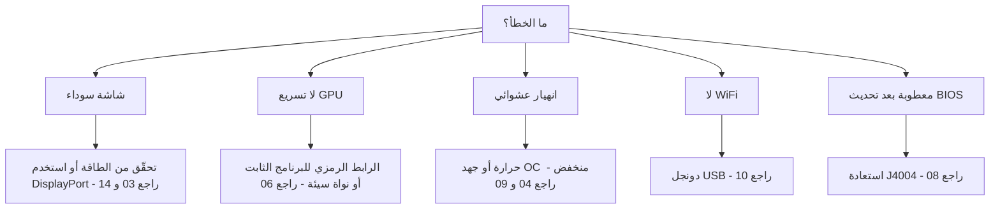

> 🌐 ترجمة مجتمعية. النسخة الإنجليزية هي المرجع الأساسي وقد تكون أحدث. وجدت خطأ؟ افتح issue: [English](../en/troubleshooting.md) · https://github.com/lildebil0/awesome-bc250/issues

# استكشاف الأخطاء وإصلاحها

> **باختصار** — أنماط أعطال BC-250 معروفة جيدًا: معظمها **طاقة**، أو **حرارة**، أو **نواة/برنامج ثابت**، أو **تحديث فاشل**. اعثر على عَرَضك أدناه، طبّق الإصلاح، واتبع الرابط إلى الفصل الكامل. عند الشك، يكون السبب عادةً *نواة سيئة*، أو *غياب الرابط الرمزي للبرنامج الثابت amdgpu*، أو *تبريد غير كافٍ*.

هذه الصفحة فهرس عَرَض ← سبب ← إصلاح، مستخلَص من مشاكل المجتمع المتكررة. إنها لا تحلّ محل الفصول — بل تشير إلى الفصل الصحيح بسرعة.

---

## الإقلاع / العرض

| العَرَض | السبب المرجَّح | الإصلاح |
|---------|--------------|-----|
| شاشة سوداء / لا POST | توصيل الطاقة أو توزيع الأطراف خاطئ | افحص توصيل 8-pin وتوزيع الأطراف من جديد؛ استخدم سلك نحاس أصلي بمقطع كافٍ ← [03 — الطاقة](../en/03-power-supply.md) |
| شاشة سوداء / انهيارات بعد أن كانت تعمل | **IOMMU ما زال مُفعَّلًا** (معطوب على هذه اللوحة) | عطّل IOMMU في BIOS (elektricM)؛ معامل النواة `iommu=off`/`amd_iommu=off` هو ⚠ تحقّق ← [06 — Linux](../en/06-linux.md) |
| شاشة سوداء عند إقلاع **المثبِّت** / USB حيّ | المثبِّت لا يملك تعريف GPU لـ BC-250؛ يفشل KMS | أضِف `nomodeset` في GRUB (Fedora: Troubleshooting → Basic Graphics Mode)؛ **أزِله بعد تثبيت Mesa** ([elektricM](https://github.com/elektricM/amd-bc250-docs/blob/main/docs/troubleshooting/boot.md)) ← [06 — Linux](../en/06-linux.md) |
| شاشة سوداء **بعد تسجيل الدخول** (GRUB + شاشة الدخول كانتا سليمتين) | جلسة سطح المكتب، عادةً **Wayland** | اختر X11 ("GNOME on Xorg"/"Plasma X11") عند الدخول، أو `WaylandEnable=false` ([elektricM](https://github.com/elektricM/amd-bc250-docs/blob/main/docs/troubleshooting/display.md)) ← [14 — العرض](../en/14-display.md) |
| تُقلع لكن لا تسريع GPU (كل شيء على المعالج) | غياب الرابط الرمزي للبرنامج الثابت amdgpu، أو نواة سيئة | طبّق الرابط الرمزي `navi10_gpu_info.bin` + معاملات النواة؛ تجنّب النوى السيئة المعروفة (أدناه) ← [06 — Linux](../en/06-linux.md) |
| `glxinfo` يُظهر **llvmpipe**، ألعاب 5–10 إطارًا | Mesa قديمة جدًا، أو amdgpu غير محمَّل | ثبّت **Mesa 25.1.3+**، أزِل `nomodeset`، أكّد `Kernel driver in use: amdgpu` ([elektricM](https://github.com/elektricM/amd-bc250-docs/blob/main/docs/troubleshooting/performance.md)) ← [06 — Linux](../en/06-linux.md) |
| كانت تعمل ثم تعطّلت بعد تحديث نواة | تراجع (regression) في تلك النواة | تراجَع إلى نواة LTS؛ يُبلَّغ أن **6.14.7** و**6.15.0–6.15.6** و**6.17.8–6.17.10** تكسر amdgpu (الرجوع إلى المعالج / انهيارات GPU)؛ يوصي elektricM بـ **6.18.x LTS أو 6.17.11+** ⚠ تحقّق من النطاقات الدقيقة ← [06 — Linux](../en/06-linux.md) |
| لا صوت عبر HDMI | تراجع في النواة 6.17+ | استخدم نواة LTS، أو وجّه الصوت عبر USB/DisplayPort ← [06 — Linux](../en/06-linux.md) |
| منفذ عرض واحد فقط يعمل | قيد في التعريف على هذه اللوحة | قيد معروف للعمل المزدوج الأصلي؛ **موزِّع MST يعطي حتى شاشتين** (موزِّع DP 1.4) ([elektricM](https://github.com/elektricM/amd-bc250-docs/blob/main/docs/hardware/display.md)) ← [14 — العرض](../en/14-display.md) |
| لا عرض، لا POST، **فقط مع تركيب NVMe** | القرص ما زال يحمل أقسام EFI/استعادة خاصة بـ **Windows** | انزع القرص، امسح كل الأقسام على حاسوب آخر (`wipefs -a`)، أعِد التثبيت ([elektricM](https://github.com/elektricM/amd-bc250-docs/blob/main/docs/troubleshooting/boot.md)) ← [06 — Linux](../en/06-linux.md) |
| لا تجتاز POST إطلاقًا (لا BIOS) | بعض اللوحات لا تجتاز POST **بدون بطارية CMOS** | ركّب بطارية CR2032 جديدة وأعِد المحاولة ([elektricM](https://github.com/elektricM/amd-bc250-docs/blob/main/docs/troubleshooting/boot.md)) ← [08 — BIOS](../en/08-bios.md) |
| الإقلاع **يتعلّق ~90 ثانية** ثم يستمر | خدمة systemd فاشلة / مهلة شبكة | `systemctl --failed`؛ عطّل الوحدة المتعلّقة ([elektricM](https://github.com/elektricM/amd-bc250-docs/blob/main/docs/troubleshooting/boot.md)) ← [06 — Linux](../en/06-linux.md) |
| ذعر نواة "**unable to mount root**" / "No init found" | نواة خاطئة **أو** initramfs تالف | أقلِع نواة أقدم/LTS؛ إن استمر الفشل، ادخل chroot وأعِد توليد initramfs (`dracut -f` / `update-initramfs -u -k all` / `mkinitcpio -P`) ([elektricM](https://github.com/elektricM/amd-bc250-docs/blob/main/docs/troubleshooting/boot.md)) ← [06 — Linux](../en/06-linux.md) |
| يسقط إلى `grub>` / `grub rescue>` | GRUB لا يجد ملفات الإعداد/الإقلاع خاصته | اضبط `root`/`prefix`، و`insmod normal`، ثم أقلِع؛ بعدها أعِد تثبيت GRUB ([elektricM](https://github.com/elektricM/amd-bc250-docs/blob/main/docs/troubleshooting/boot.md)) ← [06 — Linux](../en/06-linux.md) |
| لا يمكن دخول BIOS (Del/F2 يُتجاهَلان) | المحوّل بطيء في التهيئة، أو لوحة المفاتيح على USB 3.0 | اضغط Del فورًا؛ جرّب منفذ **USB 2.0** وكابل DP أصليًّا ([elektricM](https://github.com/elektricM/amd-bc250-docs/blob/main/docs/troubleshooting/display.md)) ← [08 — BIOS](../en/08-bios.md) |

## الحرارة / الاستقرار

| العَرَض | السبب المرجَّح | الإصلاح |
|---------|--------------|-----|
| يخنق الأداء / ينهار معدل الإطارات تحت الحمل | المشتت الحراري الأصلي لا يبرّد على المكتب | رقّق الزعانف + مروحة/غطاء 120 mm عالية الضغط الساكن؛ أبقِ <80 °C ← [04 — التبريد](../en/04-cooling.md) |
| انهيار / إعادة تشغيل عشوائية تحت الحمل | ارتفاع الحرارة (>90 °C) **أو** جهد كسر السرعة منخفض جدًا | حسّن التبريد أولًا؛ ثم ارفع جهد خفض الجهد — المستقر في Furmark ≠ المستقر في الألعاب (الألعاب تحتاج أعلى) ← [04](../en/04-cooling.md) · [09](../en/09-overclock-undervolt.md) |
| مستقر في Furmark، ينهار في الألعاب | الجهد مضبوط من Furmark، الذي يُجهِد دون اللازم | اختبر بـ OCCT + ألعاب حقيقية؛ ارفع الجهد ~50 mV ← [09 — كسر السرعة](../en/09-overclock-undervolt.md) |
| منظِّمان يتصارعان | تشغيل oberon-governor *و* smu_oc/cyan-skillfish معًا | شغّل منظِّمًا واحدًا فقط؛ عطّل الباقي ← [09 — كسر السرعة](../en/09-overclock-undervolt.md) |
| **النظام بأكمله** يموت عند انهيار GPU (لا التطبيق فقط) | APU: المعالج وGPU يتشاركان السيليكون، فإعادة ضبط GPU لا تستطيع التعافي — تُسقط النظام | متوقَّع على هذه البنية؛ امنع انهيارات GPU (جهد مستقر + تبريد جيد + نواة جيدة) بدلًا من توقّع التعافي ([elektricM](https://github.com/elektricM/amd-bc250-docs/blob/main/docs/troubleshooting/stability.md)) ← [09 — كسر السرعة](../en/09-overclock-undervolt.md) |
| انهيارات GPU ← **شاشة سوداء، لا تتعافى أبدًا** أثناء تشغيل منظِّم | المنظِّم يستمر بالكتابة إلى sysfs خلال إعادة الضبط ← حلقة إعادة ضبط عالقة | قبل الألعاب المعرّضة للانهيار، `systemctl stop cyan-skillfish-governor-smu`؛ أعِد تفعيله بعدها ([elektricM](https://github.com/elektricM/amd-bc250-docs/blob/main/docs/troubleshooting/stability.md)) ← [09 — كسر السرعة](../en/09-overclock-undervolt.md) |
| تجمّد / شاشة بيضاء عند **60–65 °C فقط** | بعض اللوحات حسّاسة للحرارة بشكل غير معتاد | حسّن التبريد، أعِد تركيب المشتت الحراري، أعِد المعجون الحراري (PTM7950)؛ السيليكون يتفاوت ([elektricM](https://github.com/elektricM/amd-bc250-docs/blob/main/docs/troubleshooting/stability.md)) ← [04 — التبريد](../en/04-cooling.md) |
| GPU **عالقة عند 1500 MHz**، لا تخفض الجهد أكثر | الجهد الأدنى مضبوط **تحت 700 mV** — وهو حد أرضي صارم يعيد قفل GPU | أبقِ الجهد الأدنى **≥ 700 mV** ([elektricM](https://github.com/elektricM/amd-bc250-docs/blob/main/docs/troubleshooting/stability.md)) ← [09 — كسر السرعة](../en/09-overclock-undervolt.md) |
| تشوّهات / انهيارات لا يصلحها مزيد من الجهد | **هبوط الجهد (droop)** تحت الحمل (الجهد الفعّال يهبط تحت المضبوط) | اضبط الأساس ~25 mV أعلى لتغطية الهبوط، أو استخدم BIOS فيه تعديل loadline/droop ([elektricM](https://github.com/elektricM/amd-bc250-docs/blob/main/docs/troubleshooting/stability.md)) ← [09 — كسر السرعة](../en/09-overclock-undervolt.md) |
| تُقلع ثم تنهار مع **أخطاء ACPI** (شاشة سوداء/خضراء) | علّة أو تلف في BIOS/ACPI | امسح CMOS / أعِد افتراضيات BIOS؛ جرّب `acpi=off noapic`؛ أعِد التحديث إن استمر ([elektricM](https://github.com/elektricM/amd-bc250-docs/blob/main/docs/troubleshooting/stability.md)) ← [08 — BIOS](../en/08-bios.md) |
| النوم/التعليق = **تجمّد زائف** (سوداء، تبدو معلّقة) | اللوحة لا تملك حالات نوم GPU صحيحة؛ SMU لا يدعم تعليق Linux | اضغط زر الطاقة للإيقاظ (لا تُطِل الضغط)؛ والأفضل **عطّل التعليق** واستخدم تعتيم الشاشة. الخمول يبقى ~65–85 W بغض النظر ([elektricM](https://github.com/elektricM/amd-bc250-docs/blob/main/docs/troubleshooting/stability.md)) ← [09 — كسر السرعة](../en/09-overclock-undervolt.md) |

## الأداء

| العَرَض | السبب المرجَّح | الإصلاح |
|---------|--------------|-----|
| معدل الإطارات أقل من المتوقَّع، GPU غير محمَّلة بالكامل | **محدود بالمعالج** (Zen 2 هو الحد في كثير من الألعاب) | طبيعي؛ اخفض الإعدادات الثقيلة على المعالج، واقبَل ذلك — كسر سرعة GPU لن يفيد هنا ← [11 — الألعاب](../en/11-gaming.md) |
| 24 وحدة حوسبة فقط نشطة، والمتوقَّع 40 | الإعداد القياسي يكشف وحدات أقل | طبّق فتح الـ 40 وحدة حوسبة (`amdgpu.bc250_cc_write_mode=3` + سكربت) ← [09 — كسر السرعة](../en/09-overclock-undervolt.md) |
| Steam / FSR / vsync معطوبة | تشعّب توزيعة "للألعاب" يتداخل | بعض التشعّبات المضبوطة تكسر هذه؛ Fedora العادية/Bazzite-bc250 أأمن ← [06 — Linux](../en/06-linux.md) |
| GPU **مقفولة عند 1500 MHz** بغض النظر عن الحمل | لا منظِّم في فضاء المستخدم (الافتراضي مقفول من BIOS) | ثبّت منظِّم GPU (cyan-skillfish-governor-smu) لتحجيم التردد ([elektricM](https://github.com/elektricM/amd-bc250-docs/blob/main/docs/troubleshooting/performance.md)) ← [09 — كسر السرعة](../en/09-overclock-undervolt.md) |
| المنظِّم يعمل لكن GPU **لا تتجاوز 2000 MHz** | النواة تفتقر إلى رقعة نطاق التردد (السقف الافتراضي 1000–2000) | استخدم نواة مرقَّعة (Bazzite/CachyOS مرقَّعتان مسبقًا) أو طبّق `amdgpu-frequency-range.patch` ([elektricM](https://github.com/elektricM/amd-bc250-docs/blob/main/docs/troubleshooting/performance.md)) ← [09 — كسر السرعة](../en/09-overclock-undervolt.md) |
| MangoHud يُظهر استخدام GPU **655 %** | amdgpu يترك مقياس النشاط عند `0xFFFF`؛ MangoHud يقرأ 65535/100 | شغّل cyan-skillfish-governor-smu (فرع smu) — يرقّع `gpu_metrics`؛ لا حاجة لتغيير MangoHud. أو طبّق سكربت **`install_gpu_usage_fix.sh`** المستقل ([Old Lamer — Part XV](https://youtu.be/lSipaWjU6D4)) ([elektricM](https://github.com/elektricM/amd-bc250-docs/blob/main/docs/troubleshooting/performance.md)) ← [09 — كسر السرعة](../en/09-overclock-undervolt.md) |
| في وضع **بلا رأس (headless)** "GPU لا تفعل شيئًا" في اختبار حمل | `glmark2 --off-screen` يرجع بصمت إلى **llvmpipe** (المعالج) دون شاشة | اختبر بـ `clpeak` / `vkmark` / `llama-bench -ngl 99`؛ أكّد ارتفاع SCLK والطاقة ([elektricM](https://github.com/elektricM/amd-bc250-docs/blob/main/docs/troubleshooting/performance.md)) ← [06 — Linux](../en/06-linux.md) |
| 60+ إطارًا لكن **تلعثم** / أزمنة إطارات غير منتظمة | إيقاع الإطارات (مُركِّب X11، أو إيقاع مرتبط بالصوت) | شغّل عبر **gamescope** (`-W 1920 -H 1080 -f`)، أو عطّل المُركِّب / جرّب Wayland ([elektricM](https://github.com/elektricM/amd-bc250-docs/blob/main/docs/troubleshooting/performance.md)) ← [11 — الألعاب](../en/11-gaming.md) |
| اللعبة **تنهار بنفاد الذاكرة / تشوّهات ثم تموت** (RDR2، CoH3) | تعارض **512 MB من VRAM الديناميكي + ZRAM**، أو ببساطة **نفاد RAM** | بدّل BIOS إلى **VRAM ثابت** (مثلًا 10 GB RAM / 6 GB VRAM)؛ **أو** عطّل ZRAM الخاص بـ systemd واستخدم **zswap + ملف تبديل Btrfs بحجم 32 GB** ([Old Lamer — Part XIV](https://youtu.be/A6juAoY70aU)، الوصفة في [06](../en/06-linux.md)/[09](../en/09-overclock-undervolt.md)) ([elektricM](https://github.com/elektricM/amd-bc250-docs/blob/main/docs/troubleshooting/stability.md)) ← [08 — BIOS](../en/08-bios.md) |
| لعبة بعينها (مثل **RDR2**) تُعرَض على المعالج/llvmpipe | اللعبة تتخلّف إلى مهايئ الرسومات الخاطئ افتراضيًا | اضبط المهايئ على GPU من AMD داخل اللعبة؛ RDR2: شغّلها بـ `-useMaximumSettings` ([elektricM](https://github.com/elektricM/amd-bc250-docs/blob/main/docs/troubleshooting/performance.md)) ← [11 — الألعاب](../en/11-gaming.md) |

## الشبكة

| العَرَض | السبب المرجَّح | الإصلاح |
|---------|--------------|-----|
| لا WiFi إطلاقًا | لا WiFi مدمج؛ الدونجل يحتاج تعريفًا | استخدم دونجلًا معروف الجودة (aic8800d80) + ابنِ تعريفه ← [10 — WiFi/BT](../en/10-wifi-bt.md) |
| WiFi ينقطع كل بضع دقائق | طقم رقائق Realtek + طاقة USB تحت الحمل | معروف مع بعض دونجلات RTL882x؛ انتقل إلى aic8800d80 أو طراز مؤكَّد ← [10 — WiFi/BT](../en/10-wifi-bt.md) |
| التعريف يختفي بعد إعادة التشغيل | بُني بـ `make` خام، لا كحزمة | استخدم مسار RPM/DKMS من المستودع كي يصمد عبر تحديثات النواة ← [10 — WiFi/BT](../en/10-wifi-bt.md) |
| مزوّد الخدمة **يخنق Steam** حتى الزحف | DPI/خنق على حركة شبكة Steam (CDN) | أدوات مكافحة الخنق (من نوع `zapret`) تساعد — لكن **نظام ملفات Bazzite للقراءة فقط يحجبها**؛ استخدم توزيعة قابلة للتعديل (Fedora/Arch). تفاصيل مزوّدي الخدمة الروس (Yota، zapret+warp) في [النسخة الروسية](../ru/06-linux.md) ← [06 — Linux](../en/06-linux.md) |

## Windows

| العَرَض | السبب المرجَّح | الإصلاح |
|---------|--------------|-----|
| GPU = Code 43 / لا تسريع | لا تعريف GPU عامل لـ Windows (حتى أوائل 2026) | متوقَّع. استخدم Linux. تعريفات Windows تجريبية قيد العمل ← [07 — Windows](../en/07-windows.md) |

## BIOS / الأعطاب

> ⚠ **اقرأ [08 — BIOS](../en/08-bios.md) كاملًا قبل أي تحديث.** التحديث السيئ يُعطب اللوحة ومسح CMOS **لا** يستعيد تعديل 1.0/3.00.

| العَرَض | السبب المرجَّح | الإصلاح |
|---------|--------------|-----|
| ميتة/سوداء بعد تحديث BIOS | صورة سيئة أو إعدادات خاطئة | استعادة خارجية: وصّل CH341A بمنفذ **J4004** (مشبك SOIC-8 **لا** يعمل على هذه اللوحة) وأعِد كتابة صورة معروفة الجودة ← [08 — BIOS](../en/08-bios.md) |
| المبرمج لا يستطيع قراءة الشريحة | خطوط بيانات 5 V / استُهدِفت الشريحة الخاطئة | استخدم 3.3 V؛ اكتب شريحة الـ 16 MB `BIOS_A1`، لا الـ 512 KB SuperIO أبدًا ← [08 — BIOS](../en/08-bios.md) |
| الإعدادات لا تثبت | نسخة تعديل قديمة | استخدم تعديل 5.00 حيث تُطبَّق توقيتات RAM/GDDR6 فعلًا ← [08 — BIOS](../en/08-bios.md) |
| لا تُقلع بعد تغيير **توقيتات/تردد RAM** | إعدادات ذاكرة غير مستقرة **أفسدت BIOS** (مراقب P3.00؛ أبلغت محادثة BC-250 الروسية بهذا) | قد لا يكفي مسح CMOS — **أعِد الكتابة عتاديًا** (CH341A / Pi Pico) بصورة معروفة الجودة. انسخ BIOS العامل احتياطيًا *قبل* ضبط RAM؛ اضبط توقيتًا واحدًا في كل مرة (tREF يعطي الأكثر) ([elektricM](https://github.com/elektricM/amd-bc250-docs/blob/main/docs/troubleshooting/stability.md)) ← [08 — BIOS](../en/08-bios.md) |
| إعدادات BIOS لا تثبت ← شاشة سوداء / RAM منخفضة | CMOS لم يُمسَح بعد تحديث USB (قد يحتاج 2–3 عمليات مسح) | امسح CMOS، أعِد الإعداد، أعِد التشغيل **إلى BIOS** للتأكد أن 512 MB ما زالت مضبوطة؛ تحقّق أن `free -h` يُظهر ~15.5 GB ([elektricM](https://github.com/elektricM/amd-bc250-docs/blob/main/docs/troubleshooting/stability.md)) ← [08 — BIOS](../en/08-bios.md) |

---

## ما زلت عالقًا؟
- راجع **[الأسئلة الشائعة](faq.md)**.
- ابحث في محادثة المجتمع حسب الموضوع (رابط **المصادر** في كل فصل يحيل إلى نقاشات حقيقية).
- عند طلب المساعدة، اذكر **توزيعتك + إصدار النواة**، و**الترددات/المنظِّم**، و**التبريد** — هذه الثلاثة تفسّر معظم المشاكل.

### مصادر للصفوف أعلاه
- أدلة استكشاف الأخطاء من elektricM — [`boot.md`](https://github.com/elektricM/amd-bc250-docs/blob/main/docs/troubleshooting/boot.md) · [`display.md`](https://github.com/elektricM/amd-bc250-docs/blob/main/docs/troubleshooting/display.md) · [`performance.md`](https://github.com/elektricM/amd-bc250-docs/blob/main/docs/troubleshooting/performance.md) · [`stability.md`](https://github.com/elektricM/amd-bc250-docs/blob/main/docs/troubleshooting/stability.md) · [`hardware/display.md`](https://github.com/elektricM/amd-bc250-docs/blob/main/docs/hardware/display.md)
- Old Lamer (YouTube): [Part XIV — zswap + 32 GB Btrfs swap](https://youtu.be/A6juAoY70aU) · [Part XV — `install_gpu_usage_fix.sh`](https://youtu.be/lSipaWjU6D4)
- [4pda BC-250 thread](https://4pda.to/forum/index.php?showtopic=1104980) — خنق Steam من مزوّدي الخدمة الروس (Yota، zapret+warp).
- استشهادات محادثة المجتمع لكل فصل تعيش في **المصادر** لكل فصل مرتبط.
