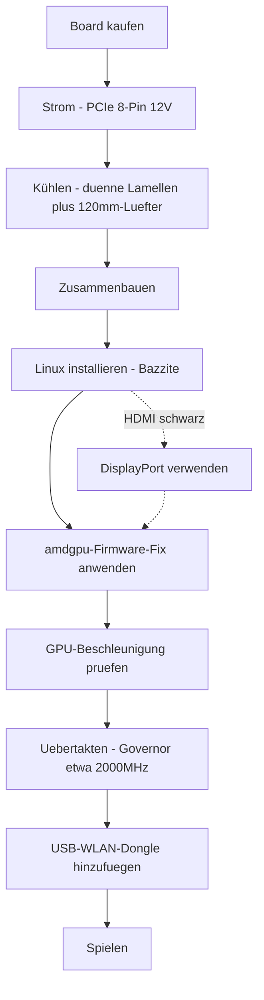

> 🌐 Community-Übersetzung. Die englische Version ist die maßgebliche Quelle und kann aktueller sein. Fehler gefunden? Öffne ein [Issue](https://github.com/lildebil0/awesome-bc250/issues). ([englisches Original](../en/00-start-here.md))

# Hier starten — von null zum Spielen

> **TL;DR** — Du hast eine AMD BC-250 gekauft (oder bist kurz davor). Es ist ein von der PlayStation 5 abgeleitetes APU-Board mit 16 GB GDDR6, aus dem eine günstige Linux-Gaming-/KI-Kiste wird — **wenn** du drei Dinge der Reihe nach löst: **Strom**, **Kühlung** und **Linux-Treiber**. Diese Seite ist die gerade Linie vom Board im Karton bis zum laufenden Spiel. Folge den Schritten; jeder verlinkt auf ein vollständiges Kapitel.

Dieses Board ist ein Projekt, kein Plug-and-Play-PC. Plane ein Wochenende ein. Die zwei häufigsten Wege, ein Board früh zu killen, sind **falsche Stromverkabelung** und **es heiß zu betreiben** — deshalb machen wir das zuerst.

---

## Bevor du anfängst — Teile & Werkzeug

Halte diese Dinge bereit, *bevor* du beginnst, damit du sie nicht jeweils mitten im Aufbau entdeckst:

- **Netzteil** mit einem PCIe-8-Pin-12-V-Ausgang → **[03 — Netzteil](../en/03-power-supply.md)**
- **120-mm-Lüfter mit hohem statischen Druck** + gedruckter Shroud → **[04 — Kühlung](../en/04-cooling.md)** / **[05 — Gehäuse & 3D-Druck](../en/05-case.md)**
- Ein **gedrucktes Gehäuse oder eine Halterung** → **[05 — Gehäuse & 3D-Druck](../en/05-case.md)**
- **USB-Stick ≥ 16 GB** für den Linux-Installer
- Ein **DisplayPort-Kabel** (oder DP→HDMI-Adapter — der HDMI-Ausgang des Boards zeigt oft nichts an, DisplayPort ist am sichersten)
- Ein **Schraubendreher**
- Ein **Multimeter** — um die Netzteilverkabelung mit Magnet/Durchgangsprüfung zu testen → **[03 — Netzteil](../en/03-power-supply.md)**

---

## Der Pfad



### 0. Wisse, was du hast
Eine BC-250 ist ein Server-/Mining-Blade: eine APU (Zen-2-CPU + GPU der RDNA2-Klasse, "Cyan Skillfish/Oberon"), 16 GB GDDR6, **passiver Kühlkörper**, versorgt über einen einzelnen **12-V-PCIe-8-Pin**. Kein WLAN onboard, kein funktionierender Windows-GPU-Treiber, keine Hardware-Video-Encodierung. → **[01 — Was ist die BC-250](../en/01-what-is-bc250.md)**

### 1. Das Richtige kaufen
Wisse, was ein fairer Preis ist, was im Karton liegt (nur das Board? Kühlkörper? Netzteil?) und welche Verkäufer/Betrügereien du meiden solltest. → **[02 — Kaufberatung](../en/02-buying.md)**

### 2. Den Strom *vor dem ersten Boot* klären
Das Board zieht ~235 W (übertaktet mehr) bei 12 V über einen PCIe-8-Pin. Verwende ein echtes Netzteil (Server-Flex / Mean-Well-Brick / ATX), verdrahte den 8-Pin korrekt mit **echtem Kupferdraht in ausreichendem Querschnitt** und rate nicht beim Pinout — ein Fehler hier bedeutet ein totes Board. → **[03 — Netzteil](../en/03-power-supply.md)**

### 3. Die Kühlung *bevor du es belastest* in Ordnung bringen
Der Serienkühlkörper ist für einen Rack-Windkanal gebaut und **drosselt auf dem Schreibtisch**. Dünne die Lamellen aus und schraube einen 120-mm-Lüfter mit hohem statischen Druck durch eine gedruckte Shroud davor (oder geh auf AIO). Ziel: bleibt unter ~80 °C in Furmark. → **[04 — Kühlung](../en/04-cooling.md)**

### 4. In ein Gehäuse einbauen (optional, aber schön)
Drucke ein konsolenartiges Gehäuse, das Board, Lüfter und Netzteil mit echter Luftführung montiert. Katalog von Community-STLs. → **[05 — Gehäuse & 3D-Druck](../en/05-case.md)**

### 5. Zusammenbauen
Physische Reihenfolge für einen minimalen Aufbau: Lüfter an die gedruckte Shroud montieren → Shroud über die (ausgedünnten) Kühlkörper-Lamellen klipsen/schrauben → Board ins Gehäuse/in die Halterung setzen → den 8-Pin des Netzteils ans Board anschließen (korrektes Pinout, **[03 — Netzteil](../en/03-power-supply.md)**) → ein DisplayPort-Kabel an den Monitor anschließen → einschalten und bestätigen, dass es **POSTet** (POST = Power-on Self-Test; es fährt hoch und gibt Video aus — du bekommst ein Bild / der Lüfter dreht). Erledige jedes Lamellen-Schleifen *vor* der Montage (siehe **[04 — Kühlung](../en/04-cooling.md)**) und halte Metallstaub vom Board fern.

> Ein beschriftetes Foto/Diagramm dieses Aufbaus ist ein willkommener Beitrag — das Repo hat noch keines.

### 6. Linux + GPU-Treiber installieren
Das ist der entscheidende Schritt. Am einfachsten für Einsteiger: ein **Bazzite-basiertes Image**, gebaut für die BC-250 (oder **Fedora 43** — elektricMs andere „läuft einfach"-Empfehlung; Fedora 42 ist EOL). Wende dann den **amdgpu-Firmware-Fix** an (der `navi10_gpu_info.bin`-Symlink) sowie Kernel-Parameter, generiere initramfs/grub neu und prüfe, ob die GPU beschleunigt ist (`vainfo`, `dmesg`). → **[06 — Linux-Treiber & Einrichtung](../en/06-linux.md)**

> **Zwei Einstellungen, die stundenlangen Ärger verursachen, wenn du sie überspringst** (elektricM): Setze im modifizierten BIOS **VRAM = 512 MB dynamisch** und **deaktiviere IOMMU** (ein kaputtes IOMMU verursacht Display-Ausfälle und Abstürze), und **lösche danach CMOS** nach dem Flash. Installiere mit dem Boot-Parameter `nomodeset` und **entferne ihn, sobald die Treiber drin sind**. Mesa **25.1+** ist das Minimum (25.3.x empfohlen). Und **meide Kernel 6.15.0–6.15.6 und 6.17.8–6.17.10** — sie zerschießen den GPU-Treiber; verwende stattdessen einen 6.18-LTS / 6.17.11+ / 6.12–6.14-LTS. ([elektricM Quick-Start](https://elektricm.github.io/amd-bc250-docs/getting-started/quick-start/), [Quick-Reference](https://elektricm.github.io/amd-bc250-docs/reference/quick-reference/))

> Denkst du an Windows? Stand Anfang 2026 gibt es **keinen funktionierenden Windows-GPU-Treiber** — es ist experimentell. Nimm Linux. → **[07 — Windows](../en/07-windows.md)**

### 7. Im Serienzustand prüfen, ob es läuft, dann übertakten
Sobald der Desktop beschleunigt ist, installiere den **oberon-governor** und treibe den Takt hoch (1500 MHz im Serienzustand ist schwach; **2000 MHz ≈ +30 % FPS**). Optional alle **40 CUs** freischalten und undervolten. Teste die Temperaturen unter den neuen Taktraten erneut. → **[09 — Übertakten & Undervolting](../en/09-overclock-undervolt.md)**

### 8. Ins Netz kommen
Kein WLAN onboard — füge einen **bewährten USB-Dongle** hinzu (aic8800d80 ist der Community-Favorit) samt Treiber. → **[10 — WLAN & Bluetooth](../en/10-wifi-bt.md)**

### 9. Spielen
Setze realistische Erwartungen (oft ist die Zen-2-CPU die Grenze, nicht die GPU), aktiviere FSR und nutze die Community-Einstellungen pro Spiel. → **[11 — Gaming-Ergebnisse & Einstellungen](../en/11-gaming.md)**

### Bonus — lokale LLMs laufen lassen
16 GB VRAM sind viel für den Preis. Lass llama.cpp auf dem **Vulkan**-Backend laufen (ROCm ist auf dieser GPU eine Sackgasse). → **[12 — KI / LLM](../en/12-ai-llm.md)**

### Bonus — Emulation
Switch, PS3, PS4, Retro, Arcade — was tatsächlich läuft und wie → **[15 — Emulation](../en/15-emulation.md)**

> Kein Bild beim ersten Boot? Das Board gibt über **DisplayPort** aus (HDMI ist oft schwarz) → **[14 — Display & Ausgabe](../en/14-display.md)**. Keine USB-Ports mehr frei oder ein Laufwerk hinzufügen? → **[16 — USB, Hubs & Speicher](../en/16-usb-peripherals.md)**

---

## Wenn etwas kaputtgeht
Schwarzer Bildschirm, keine Beschleunigung, zufällige Resets, abreißende Dongles, ein Brick nach einem BIOS-Flash — siehe **[Troubleshooting](troubleshooting.md)** und die **[FAQ](faq.md)**.

> Ein modifiziertes BIOS zu flashen ist **kein** Einstiegsschritt. Es kann das Board bricken und braucht Recovery-Hardware. Geh da nur bewusst hin. → **[08 — BIOS & Brick-Wiederherstellung](../en/08-bios.md)**

---

## Die 60-Sekunden-Checkliste

| Schritt | Erledigt, wenn |
|------|-----------|
| Strom | Netzteil mit dem 8-Pin verdrahtet, korrektes Pinout, echter Kupferdraht, Board POSTet |
| Kühlung | Lamellen ausgedünnt + 120-mm-Lüfter/Shroud; <80 °C in Furmark |
| OS | Bazzite-bc250 installiert, bootet zum Desktop |
| GPU | `vainfo`/`dmesg` zeigen amdgpu aktiv, kein CPU-Fallback |
| Übertakten | oberon-governor läuft, ~2000 MHz, stabil in einem echten Spiel |
| Netzwerk | USB-Dongle verbindet sich und bleibt verbunden |
| Spiel | Läuft mit der für deine Taktraten erwarteten FPS |

Wenn jede Zeile abgehakt ist, bist du fertig. Willkommen im BC-250-Club.

---

## Schnellreferenz (Spickzettel)

Befehle und Einstellungen, nach denen du am häufigsten greifst, verdichtet aus elektricMs [Quick-Reference](https://elektricm.github.io/amd-bc250-docs/reference/quick-reference/). Alle Details stehen in **[06 — Linux](../en/06-linux.md)** und **[09 — Übertakten](../en/09-overclock-undervolt.md)**.

**BIOS:** VRAM `512MB` dynamisch · IOMMU **Disabled** · UEFI-Boot · CMOS nach jedem USB-Flash löschen.

**Prüfen, ob die GPU beschleunigt ist (nicht llvmpipe/CPU):**
```bash
glxinfo | grep "OpenGL version"          # Mesa 25.1+ expected
vulkaninfo | grep deviceName             # → AMD Radeon Graphics (RADV GFX1013)
cat /sys/class/drm/card0/device/pp_dpm_sclk   # multiple freqs, current marked *
```

**Governor** (ohne ihn bleibt der Takt bei 1500 MHz hängen). Unsere Standardwahl ist `oberon-governor`; elektricM liefert den neueren SMU-Fork über COPR — beides funktioniert:
```bash
sudo dnf copr enable filippor/bazzite
sudo dnf install cyan-skillfish-governor-smu          # rpm-ostree install … on Bazzite
sudo systemctl enable --now cyan-skillfish-governor-smu.service
systemctl status cyan-skillfish-governor-smu          # → active (running)
```
> Spannungsuntergrenze **700 mV** — darunter rastet die GPU auf 1500 MHz fest. Der Governor kann die falsche Karte anvisieren (card0 vs card1) — prüfe das, wenn das Skalieren nicht greift.

**`nomodeset` entfernen, sobald die Treiber drin sind:**
```bash
# GRUB distros: drop "nomodeset" from /etc/default/grub, then
sudo grub2-mkconfig -o /boot/grub2/grub.cfg && sudo reboot
# Bazzite / Fedora Atomic:
rpm-ostree kargs --delete-if-present="nomodeset" && systemctl reboot
```

**Steam-Startoption**, die Grafikfehler in manchen Spielen behebt: `RADV_DEBUG=nohiz %command%`.

**Absturz bei RDR2 / Company of Heroes 3?** Stelle VRAM von `512MB` dynamisch auf **10GB/6GB fest** um (ZRAM-Konflikt). ([elektricM Quick-Reference](https://elektricm.github.io/amd-bc250-docs/reference/quick-reference/))
