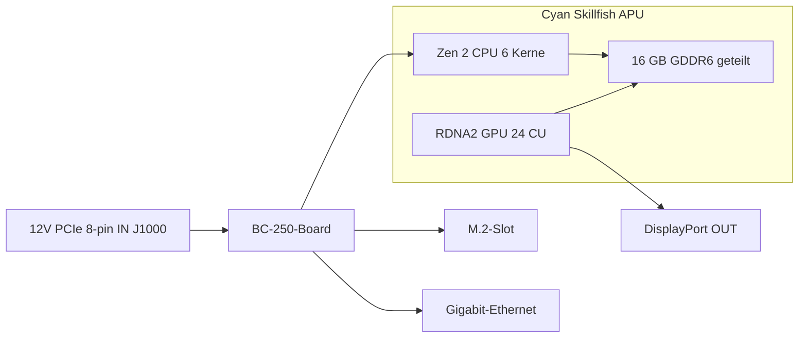

> 🌐 Community-Übersetzung. Die englische Version ist die maßgebliche Quelle und kann aktueller sein. Fehler gefunden? Öffne ein [Issue](https://github.com/lildebil0/awesome-bc250/issues). ([englisches Original](../en/01-what-is-bc250.md))

# Was ist die BC-250

> **TL;DR** — Die BC-250 ist eine **APU der PlayStation-5-Klasse auf einem Server-/Mining-Board**. Ein Chip (AMD-Codename **Cyan Skillfish**, eine beschnittene Version des **Oberon/Ariel**-Siliziums der PS5) trägt eine **6-Kern-/12-Thread-Zen-2-CPU** und eine **RDNA-2-GPU mit 24 Compute-Units**, gespeist aus **16 GB verlötetem GDDR6**. Es ist **keine Grafikkarte und kein normaler PC** — es hat **kein x86-BIOS, wie du es kennst, keinen PCIe-Slot, keinen 24-Pin-ATX-Stecker**: Es nimmt **12 V direkt in einen 8-Pin-PCIe-Stromstecker** und bootet seine eigene Firmware. Leute kaufen es, weil es eine **spottbillige Linux-Gaming-/Lokal-KI-Kiste** ist. Leute regen sich darüber auf, weil die **Treiber, die Kühlung und das fehlende Hardware-Videoencoding** es zu einem Projekt machen, nicht zu einer Plug-and-Play-Maschine. Wenn du null Aufwand willst, ist dieses Board der falsche Kauf — schick es jetzt zurück. Wenn du gern bastelst, lies weiter.

Diese Seite ist die „Was habe ich eigentlich gekauft"-Referenz. Strom, Kühlung, OS-Installation und Treiber bekommen jeweils ihren eigenen Abschnitt ([03](03-power-supply.md) / [04](04-cooling.md) / [06](06-linux.md)).

---

## Was es eigentlich ist

AMD baute die BC-250 als **Kryptowährungs-Mining-Beschleuniger** (das „BC" steht für Blockchain). Um es günstig zu machen, verwendete AMD **übrig gebliebenes PlayStation-5-Prozessor-Silizium** — dieselbe Chip-Familie, die Sony in die Konsole steckt. Ein Board ist eine APU plus ihr Speicher und ihre Stromschaltung; das ist das gesamte Produkt.

Fachjargon, einmal definiert:

- **APU** (Accelerated Processing Unit) — AMDs Bezeichnung für einen einzelnen Chip, der **sowohl die CPU als auch die GPU** enthält. Es gibt keine separate Grafikkarte; die GPU steckt im selben Gehäuse und teilt sich denselben Speicher.
- **Cyan Skillfish** — AMDs technischer **Codename** für diese APU. Du wirst ihn überall in Linux sehen: Die GPU-Firmware-Datei heißt buchstäblich `cyan_skillfish_gpu_info.bin` ([src](https://t.me/c/2424231195/57962) — siehe den Symlink-Fix unter [src](https://t.me/c/2424231195/41252)). Tools melden ihn möglicherweise auch unter den PS5-Die-Namen **Oberon** / **Ariel**.
- **GDDR6** — der schnelle Grafikspeicher, der normalerweise auf einer Grafikkarte zu finden ist. Auf der BC-250 ist er **gleichzeitig der System-RAM und der Video-RAM** (die CPU und die GPU teilen sich einen Pool). Es gibt keine DIMM-Slots; die 16 GB sind verlötet und nicht aufrüstbar.
- **RDNA 2** — die GPU-Architektur-Generation (dieselbe Familie wie die PS5, die Xbox Series und die Radeon-RX-6000-Karten).

Der Chip ist ein **beschnittenes** PS5-Teil, nicht das vollständige. Die Community hat diesen Vergleich angepinnt ([src](https://t.me/c/2424231195/11282), unter Berufung auf [TechPowerUps Oberon-Eintrag](https://www.techpowerup.com/gpu-specs/amd-oberon.g936)):

| | BC-250 | Volle PS5 (Oberon) |
|---|---|---|
| CPU-Kerne / Threads | **6 / 12** | 8 / 16 |
| GPU-Compute-Units (CU) | **24** | 36 |

Eine „Compute-Unit" ist ein GPU-Kernblock; 24 davon sind grob im Bereich einer Mittelklasse-Laptop-GPU, was genau die Leistungskategorie ist, die der Chat in Spielen berichtet.

Die BC-250 ist nicht AMDs einziges „übrig gebliebenes Konsolen-Silizium auf einem Desktop-Board". Sie hat zwei nahe Verwandte, die aus derselben Idee gebaut sind: das **AMD 4700S Desktop Kit** (ein von der **PlayStation 5** abgeleitetes CPU-Kit) — vor dem der Chat warnt, dass es auf Marktplätzen gegen die BC-250 falsch gelistet wird ([02-buying.md](02-buying.md)) — und das **AMD 4800S Desktop Kit**, die von der **Xbox Series X** abgeleitete Version (8 Zen-2-Kerne an GDDR6 verdrahtet, mit der RDNA-2-GPU der Konsole deaktiviert). Beides sind echte AMD-Produkte, die, wie die BC-250, eine geborgene Konsolen-CPU mit verlötetem GDDR6 kombinieren ([VideoCardz](https://videocardz.com/newz/amd-4800s-desktop-kit-a-pc-repurposed-apu-from-xbox-series-x-has-been-tested)). Sie sind nützlicher Kontext, um die BC-250 beim Einkaufen von ihren Geschwistern zu unterscheiden.

Leute haben **Desktop-Linux auf der BC-250 auf dieselbe Weise betrieben, wie die PS5 selbst gejailbreakt wurde** — volles 4K-HDMI-Video + Audio, alle USB-Ports funktionieren, die APU taktet bei der CPU auf bis zu ~3,2 GHz und bei der GPU auf ~2,0 GHz hoch ([src](https://t.me/c/2424231195/122260)).

---

## Worin es gut ist

- **Der günstigste Einstieg in Linux-Gaming auf dieser Leistungsstufe.** Über Steam/Proton (eine Kompatibilitätsschicht, die Windows-Spiele unter Linux ausführt) spielen Leute Star Citizen ([src](https://t.me/c/2424231195/38702)) und sogar moderne Titel wie *Doom: The Dark Ages* über einen Community-Vulkan-Wrapper mit ~60 FPS auf Low/FSR ([src](https://t.me/c/2424231195/127696)). Ergebnisse pro Spiel findest du in [11-gaming.md](11-gaming.md).
- **Eine fähige Lokal-KI-Kiste.** Mit 16 GB GDDR6 kann es mittelgroße Sprachmodelle halten. Mitglieder betreiben LLMs lokal über `llama.cpp`/`jan` auf dem **Vulkan**-Backend; du stellst im BIOS ein, zuerst 12 GB der GPU zuzuweisen ([src](https://t.me/c/2424231195/92421)). Siehe [12-ai-llm.md](12-ai-llm.md).
- **Winzig und in sich geschlossen.** Es ist ein einzelnes langes Board mit eingebautem GPU-artigem Kühlkörper — es passt in kleine DIY-/3D-gedruckte Gehäuse und läuft mit einem kleinen Netzteil ([Build-src](https://t.me/c/2424231195/137825)).

Der Community-Konsens darüber, *warum* es überhaupt funktioniert: Weil der Chip der Steam-Deck-/PS5-Hardware so nahekommt, verbessern Valve und der quelloffene Mesa-Grafikstack genau dieselben Treiber immer weiter, sodass die BC-250 gratis mitfährt ([src](https://t.me/c/2424231195/93006)).

---

## Was schmerzhaft ist (Erwartungen setzen)

Das ist die Hälfte, die Neulinge unterschätzen. Nichts davon ist ein K.-o.-Kriterium, aber alles davon ist echte Arbeit.

- **Treiber sind eine Do-it-yourself-Aufgabe.** AMD liefert **keinen offiziellen Treiber und keine öffentliche Dokumentation** für dieses Board ([src](https://t.me/c/2424231195/37764)). Alles — der Linux-Grafikstack, der Takt-/Spannungs-„Governor", das BIOS — ist Community-gebaut. Rechne damit, Setup-Skripten zu folgen und gelegentlich Dinge von Hand zu reparieren. Beginne bei [06-linux.md](06-linux.md).
- **Kühlung ist die Sache Nr. 1, die Leute falsch machen.** Der Standard-Kühlkörper wurde für den Zwangsluft-Tunnel eines Mining-Racks entworfen, sodass er auf einem Schreibtisch überhitzt und ab Werk drosselt. Du wirst die Kühlung modden müssen. Das hat seinen eigenen Abschnitt — lies [04-cooling.md](04-cooling.md), **bevor** du Leistung hinterherjagst.
- **Kein Hardware-Videoencoder.** Der Video-Encode-Block der GPU (was AMD **VCN** nennt — die dedizierte Schaltung, die Video fürs Streaming/Aufnehmen komprimiert) ist **nicht verfügbar**. Bildschirmaufnahme und Game-Streaming fallen auf einen **Software-Encoder (CPU)** zurück, was CPU kostet. Es funktioniert (Leute streamen über Sunshine/Moonlight), aber es ist langsamer und von geringerer Qualität als eine normale GPU ([src](https://t.me/c/2424231195/88026)). Ebenso war der frühe Mesa-Treiber bekanntlich **Software-Rendering**, bis die Community die Hardware-Beschleunigung zum Laufen brachte ([src](https://t.me/c/2424231195/11243)).
- **Seltsamer Strom und standardmäßig kein Bild.** Es nimmt keinen Standard-24-Pin-ATX-Stecker — siehe den nächsten Abschnitt. Viele Boards kommen außerdem an und brauchen ein **BIOS-Reset**, bevor sie überhaupt **POSTen** ([src](https://t.me/c/2424231195/57930)), und du gibst das Bild üblicherweise über **DisplayPort** aus (HDMI braucht einen DP→HDMI-Adapter, der auch Audio problemlos überträgt — [src](https://t.me/c/2424231195/9148)).
- **Es ist ein Bastler-Board, Punkt.** Wie ein langjähriges Mitglied es ausdrückte: Trotz seines niedrigen Preises „erfordert die BC-250 gewisse Fähigkeiten, Mühe und Köpfchen" ([src](https://t.me/c/2424231195/73002)). Plane Zeit ein, nicht nur Geld.
- ⚠ **Eine eGPU rettet es nicht — Community-berichtet (r/BC250Gaming).** Der einzige M.2-Slot ist nur **PCIe 2.0 ×2** (siehe die Hardware-Karte unten), und bei dieser Bandbreite **soll eine externe GPU am M.2 *schlechter* abschneiden als die integrierte RDNA-2-GPU** — die langsame Anbindung würgt sie ab. Wenn du mehr Grafikleistung willst, ist der Konsens, dass dies nicht das Board dafür ist. *(Community-berichtet; behandle es als Warnung, nicht als Benchmark.)*

> ⚠ **Was die zweifarbige LED bedeutet — Community-berichtet (r/BC250Gaming).** Die zweifarbige LED neben dem NIC ist ein **Auslastungsanzeiger aus der Mining-Ära, keine Fehler-Leuchte**: Laut Community-Berichten ist **rot = die GPU/der RAM ist *nicht* bei 100 % Auslastung, grün = volle Auslastung**. Eine rote Leuchte auf einem untätigen Desktop-Board ist also normal, kein Fehler. *(Community-berichtet; AMD liefert keine Dokumentation für dieses Board, also behandle die genaue Farbzuordnung als unbestätigt.)*

> ⚠ **Handhabungswarnung, auf die harte Tour gelernt.** Lass **nichts** Metallisches das mit Strom versorgte Board berühren und tausche die Wärmeleitpaste nur mit Sorgfalt — ein Mitglied hat seine BC-250 dauerhaft getötet, indem es sie kurzgeschlossen hat ([src](https://t.me/c/2424231195/95998)). Boards kommen außerdem leicht **verbogen** von der Kühlkörper-Montage; ein Mitglied behob ein Nicht-Booten, indem es das Board mit Papier flach gegen den Kühlkörper unterlegte ([src](https://t.me/c/2424231195/117347)).

---

## Hardware-Referenzkarte

Die Daten sind gegen das Community-Hardware-Reverse-Engineering gegengeprüft (AMD veröffentlicht kein Datenblatt). Die Angaben zum Speicherbus und zu den physischen Abmessungen, zuvor unbestätigt, stammen jetzt aus der [elektricM-Hardware-Spezifikation](https://github.com/elektricm/elektricm) (die mothenjoyer69 / Segfault / neggles / yeyus für das Reverse-Engineering nennt). Die Pinbelegung und die Stromangaben unten stammen aus dem kanonischen Community-Hardware-Dokument.

Das Board auf einen Blick — Stromeingang links, die APU und ihr geteilter Speicher in der Mitte, I/O rechts:



### Kerndaten

| Spezifikation | Wert | Quelle |
|------|-------|--------|
| Klasse | Von der PlayStation 5 abgeleitete APU auf einem Mining-/Server-Board | [hardware.md](https://github.com/mothenjoyer69/bc250-documentation/blob/main/hardware.md) |
| APU-Codename | **Cyan Skillfish** (PS5-Die: Oberon / Ariel) | Chat ([src](https://t.me/c/2424231195/57962)) |
| CPU | **6 Kerne / 12 Threads, Zen 2** (6 Kerne bestätigt) | [hardware.md](https://github.com/mothenjoyer69/bc250-documentation) · Chat ([src](https://t.me/c/2424231195/11282)) |
| CPU-Takt | bis zu **~3,49 GHz** („ungefähr") | [hardware.md](https://github.com/mothenjoyer69/bc250-documentation) · Chat ([src](https://t.me/c/2424231195/122260)) |
| GPU | **24 Compute-Units, RDNA 2** (`gfx1013`; PS5-SoC hat 36); Rasterisierung ≈ **zwischen RX 6600 und RX 6600 XT** / GTX-1660-Ti-Klasse; **Vulkan 1.4** | [hardware.md](https://github.com/mothenjoyer69/bc250-documentation) · Chat ([src](https://t.me/c/2424231195/11282)) · [elektricM](https://github.com/elektricm/elektricm) |
| GPU-Takt | ~1500 MHz Standard, ~2000 MHz übertaktet (≈2,23 GHz max.) | ([src](https://t.me/c/2424231195/122260)) · [09](09-overclock-undervolt.md) |
| Speicher | **16 GB GDDR6**, geteilt zwischen CPU und GPU, verlötet (nicht aufrüstbar) | [hardware.md](https://github.com/mothenjoyer69/bc250-documentation) · [README](../../README.md) |
| GPU-VRAM-Zuweisung | im BIOS eingestellt; **12 GB** auf BIOS 3.00+ wählbar | ([src](https://t.me/c/2424231195/92421)) |
| Speicherbus / Bandbreite | **256-Bit** GDDR6 @ **14 Gbps**, **~448 GB/s** | [elektricM-Hardware-Spezifikation](https://github.com/elektricm/elektricm) |
| TDP | **220 W** (thermische Verlustleistung des Boards) | [hardware.md](https://github.com/mothenjoyer69/bc250-documentation) |
| Stromaufnahme | ~67–85 W typisch unter Mining-Klasse-Last | [hashrate.no](https://www.hashrate.no/gpus/bc250) |
| Hardware-Videoencode (VCN) | **Keiner** — nur Software-Encode | ([src](https://t.me/c/2424231195/88026)) |
| Videoausgang | **DisplayPort 1.4** (bis zu **4K@120 / 8K@60**); nutze DP→HDMI-Adapter für HDMI; überträgt Audio | ([src](https://t.me/c/2424231195/9148)) · [elektricM](https://github.com/elektricm/elektricm) |
| Speicher (M.2) | 1x M.2 2280 — **PCIe 2.0 x2 oder SATA III** | [elektricM](https://github.com/elektricm/elektricm) |
| 2. DisplayPort | vorhanden, aber **unbestückt**; kann in Software aktiviert werden | ([src](https://t.me/c/2424231195/88026)) |
| Physische Größe | **340 mm / 310 mm** lang (je nach Messmethode), **~115 mm** breit, **~400 g** mit Kühlkörper; eigenes Nicht-Standard-Mining-Formfaktor | [elektricM-Hardware-Spezifikation](https://github.com/elektricm/elektricm) |

> ⚠ **GDDR6-Übertaktung = Bandbreite, nicht FPS — Community-berichtet (r/BC250Gaming).** Laut Community-Berichten hebt das Übertakten des GDDR6 die Speicherbandbreite von grob **~256 GB/s auf ~445 GB/s**, liefert aber **keinen Gaming-Gewinn** — die 24 CUs der GPU, nicht die Speicherbandbreite, sind der Flaschenhals, sodass die zusätzliche Bandbreite in Spielen ungenutzt bleibt. (Beachte, dass die verifizierte *Standard*-Angabe des Repos oben bereits **~448 GB/s** bei 256-Bit / 14 Gbps beträgt, sodass die „~256-GB/s-Basislinie" der Community nicht zum Datenblatt passt — behandle die genauen GB/s-Zahlen als unbestätigt; die Erkenntnis, dass du keine FPS gewinnst, ist der beständige Teil.) Zur GPU-/Speicher-Übertaktung im Allgemeinen siehe [09-overclock-undervolt.md](09-overclock-undervolt.md).

> **Zu den Board-Abmessungen:** Die [elektricM-Hardware-Spezifikation](https://github.com/elektricm/elektricm) gibt **340 mm / 310 mm** Länge an (die zwei Angaben spiegeln verschiedene Messmethoden wider), **~115 mm** Breite und **~400 g** mit dem Kühlkörper, auf einem eigenen Nicht-Standard-Mining-Formfaktor. Die kanonische `hardware.md` selbst listet keine Abmessungen; der meistreagierte Hardware-Beitrag des Chats trägt buchstäblich den Titel *„Размеры amd bc-250"* („Abmessungen der AMD BC-250", ❤20 — [src](https://t.me/c/2424231195/379)), was bestätigt, dass Leute dies fürs Gehäusebauen interessiert. Für die exakte Gehäusepassung arbeite mit einem vermessenen 3D-Modell — die von der Community katalogisierten Board-STLs (z. B. `BC250 Board.stl`, [Printables 1103626](https://www.printables.com/model/1103626-amd-bc250-board) und das akkurate Modell unter [Printables 1341336](https://www.printables.com/model/1341336-accurate-3d-model-of-the-amd-bc-250-board)) sind maßlich korrekt. Siehe [05-case.md](05-case.md).

<p align="center">
  <br>
  <sub>Foto: AMD BC-250 Community · <a href="https://t.me/c/2424231195/379">Quelle</a></sub>
</p>

### Stromstecker-Pinbelegung (lies das, bevor du etwas einsteckst)

Die BC-250 hat **keinen 24-Pin-ATX-Header**. Sie wird **nur mit 12 V** versorgt, geliefert über einen **8-Pin-PCIe-Stromstecker (J1000)** — derselbe physische Stecker wie bei einer Grafikkarte, aber das Board erwartet, dass alle drei Stromkontakte mit 12 V gespeist werden. Die vollständige Verkabelung und die Netzteilwahl findest du in [03-power-supply.md](03-power-supply.md); die kanonische Pinbelegung aus [hardware.md](https://github.com/mothenjoyer69/bc250-documentation/blob/main/hardware.md):

**J1000 — Haupt-8-Pin-PCIe-Strom (das ist der, den du anschließt):**

```
[ GND  GND  GND  GND ]
[ GND  12V  12V  12V ]
```

- Drei 12-V-Kontakte; das Dokument bewertet die Mini-Fit-Jr-Kontakte mit **bis zu 9 A je**, sodass dieser Stecker „bis zu **324 W** sicher liefern kann", und empfiehlt **16 AWG**-Draht für die eigenständige Nutzung ([hardware.md](https://github.com/mothenjoyer69/bc250-documentation)).
- **GND = Masse (0 V), 12V = +12 Volt.** Achte auf die richtige Polarität — dieses Board verzeiht keine Verpolung.

**J2000 / J2001 — Rack-Stromstecker (auf einem Schreibtisch üblicherweise NICHT genutzt):**

```
        J2000                  J2001
 [ LED1  12V  12V  12V ]   [ 12V  12V  12V  PGD ]
 [ LED2  GND  GND  GND ]   [ GND  GND  GND  GND ]
```

- Dies sind **Molex-Micro-Fit-BMI**-Stecker ([Teil 444280801](https://www.molex.com/en-us/products/part-detail/444280801)), *keine* PCIe-/EPS-Stecker — sie speisten das Board in seinem ursprünglichen Mining-Chassis. **J2000 und J2001 sind nicht identisch:** Wie die Pinbelegung oben zeigt, führt J2000 die **LED1/LED2**-Pins, während J2001 den **PGD**-Pin führt, sodass sich die zwei Stecker unterscheiden ([elektricM-/mothenjoyer69-Hardware-Dokumente](https://github.com/mothenjoyer69/bc250-documentation)).
- **PGD** (an J2001) ist ein Power-Good-/Sense-Pin: Er sieht **5 V, wenn das Board im PSU2 des Racks sitzt**. In einem eigenständigen Aufbau versorgst du typischerweise stattdessen über J1000 und kannst J2000/J2001 ignorieren — aber gleiche das mit [03-power-supply.md](03-power-supply.md) für deinen spezifischen Netzteil-Adapter ab.

---

## Wie es weitergeht

1. **[02-buying.md](02-buying.md)** — falls du noch nicht gekauft hast oder wissen willst, was ein fairer Preis und die echten Risiken sind.
2. **[03-power-supply.md](03-power-supply.md)** — wie man es tatsächlich mit Strom versorgt (12 V in den 8-Pin).
3. **[04-cooling.md](04-cooling.md)** — mach das **bevor** allem anderen, sobald das Board in der Hand ist.
4. **[06-linux.md](06-linux.md)** — bring ein OS und die Community-Treiber darauf.

---

## Quellen

- Kanonisches Hardware-Dokument & Pinbelegung — [mothenjoyer69/bc250-documentation `hardware.md`](https://github.com/mothenjoyer69/bc250-documentation/blob/main/hardware.md)
- Speicherbus/Bandbreite, physische Abmessungen, GPU-Positionierung, DP 1.4, M.2 — [elektricM-Hardware-Spezifikation](https://github.com/elektricm/elektricm) (nennt mothenjoyer69 / Segfault / neggles / yeyus für das Reverse-Engineering)
- Beschnittenes vs. volles PS5-Silizium (6/12 + 24 CU vs. 8/16 + 36 CU) — https://t.me/c/2424231195/11282 · [TechPowerUp Oberon](https://www.techpowerup.com/gpu-specs/amd-oberon.g936)
- Linux-auf-PS5-Hardware, 4K-HDMI, Takte — https://t.me/c/2424231195/122260
- Kein offizieller Treiber / keine Dokumentation — https://t.me/c/2424231195/37764
- Software-Rendering / kein Hardware-Encode — https://t.me/c/2424231195/11243 · https://t.me/c/2424231195/88026
- DisplayPort + DP→HDMI-Audio — https://t.me/c/2424231195/9148
- Cyan-Skillfish-Firmware-Name — https://t.me/c/2424231195/57962 · https://t.me/c/2424231195/41252
- Lokales LLM + 12 GB VRAM über BIOS 3.00 — https://t.me/c/2424231195/92421
- „Erfordert Fähigkeiten, Mühe und Köpfchen" — https://t.me/c/2424231195/73002
- Handhabungs-/Kurzschlusswarnung — https://t.me/c/2424231195/95998 · Fix für verbogenes Board — https://t.me/c/2424231195/117347
- „Abmessungen der BC-250" (meistreagierter Hardware-Beitrag) — https://t.me/c/2424231195/379
- 220 W TDP, 6-Kern-/3,49-GHz-CPU, 24-CU-GPU, 16 GB GDDR6 (Repo-Bestätigung) — [mothenjoyer69/bc250-documentation README](https://github.com/mothenjoyer69/bc250-documentation)
- Mining-Klasse-Stromaufnahme-Angaben — https://www.hashrate.no/gpus/bc250
- Warum es weiterhin funktioniert (geteilte Steam-Deck-/PS5-Treiber-Arbeit) — https://t.me/c/2424231195/93006
- Geschwister-Kits — AMD 4700S (PS5-CPU-Kit, gegen die BC-250 falsch gelistet, [02-buying.md](02-buying.md)) und AMD 4800S (Xbox-Series-X-CPU + GDDR6, GPU deaktiviert) — [VideoCardz: 4800S Desktop Kit](https://videocardz.com/newz/amd-4800s-desktop-kit-a-pc-repurposed-apu-from-xbox-series-x-has-been-tested)
- eGPU-über-M.2 langsamer als integrierte GPU (M.2 ist PCIe 2.0 ×2), zweifarbige NIC-LED = Auslastungssignal (rot = nicht 100 % Auslastung, grün = volle Auslastung), GDDR6-Übertaktung erhöht Bandbreite (~256→~445 GB/s) ohne Gaming-Gewinn — Community-berichtet (r/BC250Gaming)

> AMD veröffentlicht kein primäres Datenblatt für dieses Board; die Angaben oben sind das beste Community-Reverse-Engineering (kanonische `hardware.md` plus die elektricM-Hardware-Spezifikation). Korrekturen sind per PR willkommen (siehe [CONTRIBUTING.md](../../CONTRIBUTING.md)).
