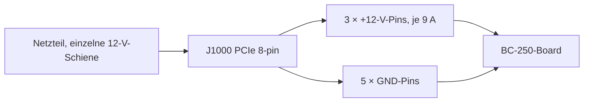

> 🌐 Community-Übersetzung. Die englische Version ist die maßgebliche Quelle und kann aktueller sein. Fehler gefunden? Öffne ein [Issue](https://github.com/lildebil0/awesome-bc250/issues). ([englisches Original](../en/03-power-supply.md))

# Netzteil

> **TL;DR** — Die BC-250 hat **keinen Einschaltknopf und keinen normalen PC-Stromstecker**. Sie frisst **12 V** über einen einzelnen **PCIe-8-Pin (6+2)**-Stecker — denselben Stecker, den eine Desktop-Grafikkarte nutzt — und erreicht in der Spitze etwa **~235 W** (mehr, wenn du übertaktest). Du brauchst eine 12-V-Quelle, die **~250–300 W auf einer Schiene** liefern kann. Drei Wege, die die Community geht: ein günstiges **Server-„Flex"-Netzteil** (HP 500 W, ~12 $ auf eBay), ein **Industrie-Brick** (Mean Well LOP-300/LOP-500) oder ein **normales ATX-Netzteil** (einfach dessen PCIe-Kabel einstecken). Die zwei Killer, die du vermeiden musst: ein **altes Netzteil, das 12 V auf schwache Schienen aufteilt**, und **Fake-Kupfer-Drähte aus kupferkaschiertem Stahl**, die überhitzen und Feuer fangen. Nimm echtes Kupfer, **16 AWG oder dicker**.

Das Board mit Strom zu versorgen ist die **zweite Sache, die ein Neuling richtig machen muss** (nach der [Kühlung](04-cooling.md)) — und diejenige, die am ehesten ein Feuer auslöst, wenn du bei der Verkabelung Abstriche machst.

---

## Was das Board tatsächlich braucht

Die BC-250 ist ein abgespeckter PlayStation-5-Die auf einem Krypto-Mining-/Server-Board. Sie war dafür gedacht, in einem Rack zu sitzen und mit 12 V gefüttert zu werden — daher hat sie **keine der Annehmlichkeiten eines normalen PCs**:

- **Keinen ATX-24-Pin**-Mainboard-Stecker.
- **Keinen Einschaltknopf** — sie schaltet sich in dem Moment ein, in dem 12 V anliegen (der eigene Schalter des Netzteils ist dein Einschaltknopf).
- **Eine Aufgabe für das Netzteil: 12 V mit genug Strom liefern.**

**Leistungswerte (bestätigt):**

| Spezifikation | Wert | Quelle |
|------|-------|--------|
| Eingangsspannung | 12 V DC | [hardware.md](https://github.com/mothenjoyer69/bc250-documentation/blob/main/hardware.md) |
| Typische Spitzenaufnahme | ~220–235 W | von der Community beobachtet ([src](https://t.me/c/2424231195/31076)) |
| Stecker | PCIe 8-pin (6+2) | [hardware.md](https://github.com/mothenjoyer69/bc250-documentation/blob/main/hardware.md) · ([src](https://t.me/c/2424231195/14450)) |
| Spitzenstrom auf 12 V | ~18–20 A typisch, Auslegungsreserve bis ~40 A | ([src](https://t.me/c/2424231195/31076)) |

> **„PCIe 8-pin (6+2)"** meint einen Grafikkarten-Stromstecker: sechs Pins in einem Block, plus einen abnehmbaren 2-Pin-Clip, sodass dasselbe Kabel entweder als 6-Pin oder 8-Pin funktioniert. **6+2** = 6 fest + 2 abnehmbar. Das ist *nicht* der CPU/EPS-8-Pin von deinem Mainboard — siehe die Warnung unten.

Ein PCIe 8-pin ist nach dem PCIe-Standard für **150 W** ausgelegt, und die drei 12-V-Kontakte des Boards (Molex Mini-Fit Jr, je 9 A) können sicher **bis zu ~324 W** durchleiten ([hardware.md](https://github.com/mothenjoyer69/bc250-documentation/blob/main/hardware.md)). Ein einzelner 8-Pin reicht also serienmäßig bequem aus; die Reserve zählt nur, wenn du eine aggressive Übertaktung fährst.

**Wie viel Netzteil-Leistung kaufen:** ziele auf **300 W oder mehr auf der 12-V-Schiene**. Ein 300-W-Gerät gibt eine gesunde Marge über der ~235-W-Spitze und hält den Netzteil-Lüfter ruhig; Leute berichten, dass ein 500-W-Flex-Server-Netzteil bei dieser Last nahezu lautlos läuft ([src](https://t.me/c/2424231195/31076)). Kauf nicht unter ~250 W, „um Geld zu sparen" — du betreibst es am Limit, und es wird laut oder schaltet ab.

> **Zangenamperemeter-Leistungskurve (Erstanbieter-Stromstärke).** Ein Teardown klemmte ein DC-Amperemeter an die 12-V-Zuleitung und las den tatsächlichen Strom des Boards: **Gaming zieht ≈17 A / ~190 W**, während eine **volle synthetische Stresslast ≈21 A / ~240–250 W** bei **2000 MHz / 960 mV** erreicht; die Spannung höher zu schieben treibt es auf **22–23 A und darüber** ([Old Lamer — Part VII](https://youtu.be/pxahl9-YgkY) ~9:01). Diese schärfen die Community-Wandleistungswerte oben mit gemessener Schienen-Stromstärke — und bestätigen, warum das 300-W-Ziel die richtige Marge lässt. *(Werte aus Auto-Untertiteln abgelesen — behandle die genauen Zahlen als ungefähr.)*

> ⚠️ **Genannte Netzteile, die zu vermeiden sind:** das günstige **Dell D220P-01** (220 W) und das **Dell D250AD-00** (250 W) werden als **unzureichend und gefährlich** für dieses Board benannt — mit 220 W / 250 W liegen sie unter der Spitze des Boards, und es wurde berichtet, dass sie unter Gaming-Last abschalten oder sogar kaputtgehen. Kauf kein Gerät nur, weil es günstig ist und „nach genug aussieht". ([elektricM: power](https://elektricm.github.io/amd-bc250-docs/hardware/power/))

---

## Die Physik: Volt, Ampere, Watt — und warum dünner Draht brennt

Jede Regel in diesem Kapitel folgt aus drei Gleichungen. Lerne diese, und die Querschnitt-Tabellen und „niemals SATA"-Warnungen hören auf, willkürlich zu sein.

**Leistung = Volt × Ampere (`P = U·I`).** Das Board braucht **~235 W** bei **12 V**, also zieht es `235 ÷ 12 ≈ 19.6 A`. Genau deshalb liest ein Zangenamperemeter **~17 A beim Gaming / ~21 A unter Stress** ([oben](#was-das-board-tatsächlich-braucht)): die Wattzahl ist durch das Silizium festgelegt, also sind die *Ampere* das, was 12 V erzwingt. Schiebe Takt/Spannung hoch, und die Ampere klettern mit den Watt.

**Warum 12 V — und warum 24 V es killt.** 12 V ist der Rechenzentrums-Rack-Standard, für den das Board gebaut wurde; seine On-Board-VRMs setzen sie auf die ~1 V herunter, mit denen der APU-Kern läuft. Das Board ist **fest auf 12 V verdrahtet, ohne Überspannungsschutz**, also setzt es das Doppelte über jedes 12-V-Bauteil und zerstört es sofort, wenn du es mit 24 V fütterst (z. B. ein [LOP-300-**24**](#option-b--mean-well-industrie-brick)). Anders als die Stromstärke ist die Spannung nicht verhandelbar.

**Strombelastbarkeit — warum ein Draht ein Amperelimit hat.** Ein Draht ist ein Widerstand, und Strom durch Widerstand erzeugt Wärme: `P_loss = I²·R`. Dickeres Kupfer = mehr Querschnitt = **niedrigeres R** = weniger Wärme bei denselben Ampere. Das ist die gesamte Bedeutung der AWG-Tabelle oben — **niedrigere AWG-Zahl = dickerer Draht = sicher bei mehr Ampere**. Bei ~20 A bleibt **16-AWG-Kupfer** kühl; dünner, und `I²·R` schmilzt die Isolierung. Beachte das **Quadrat**: den Strom zu verdoppeln *vervierfacht* die Wärme, weshalb eine starke Übertaktung eine zweite Zuleitung braucht, nicht nur „ein bisschen mehr Draht".

**Spannungsabfall — die andere Hälfte.** Im Draht verlorene Wärme ist Spannung, die das Board nie sieht: `V_drop = I·R`. Ein langes, dünnes Kabel **überhitzt** und **hungert** das Board zugleich aus, sodass es unter Last einbrechen kann, selbst wenn nichts sichtbar schmilzt. Kurzes, dickes Kupfer behebt beides auf einmal.

**Warum Fake-„Kupfer" tödlich ist.** Kupferkaschierter Stahl hat **~6× den Widerstand** von echtem Kupfer — dieselben Ampere, dasselbe `I²·R`, also **6× die Wärme** im selben Draht. Der Magnettest unten ist keine Qualitätsvorliebe; er fängt einen **6×-Multiplikator auf einem Term ab, der im Strom bereits quadriert ist**.

**Warum niemals SATA oder Molex.** Es ist der *Stecker*, nicht der Draht. Ein SATA-Stromkontakt ist für **~54 W** ausgelegt → `54 ÷ 12 ≈ 4.5 A`, bevor der kleine Kontakt sich selbst gart; das Board will ~20 A, **4× über** diesem Limit. Ein PCIe 8-pin trägt stattdessen drei dicke 12-V-Kontakte (**9 A each = 27 A / 324 W**) — was *der Grund* ist, warum er der richtige Stecker ist und SATA/Molex es nie sein können (siehe [die Pinbelegung](#die-8-pin-pinbelegung-j1000)).

---

## ⚠️ Die zwei Fehler, die Boards zerstören

Lies diesen Abschnitt, bevor du irgendetwas kaufst.

### 1. Verwechsle den PCIe-8-Pin nicht mit dem CPU/EPS-8-Pin

Dein ATX-Netzteil hat **zwei verschiedene 8-Pin-Stecker**: einen für Grafikkarten (**PCIe**) und einen für die CPU (**EPS/CPU**, manchmal mit „CPU" oder „4+4" beschriftet). **Sie sehen fast identisch aus, aber ihre Pinformen und ihre Polarität sind vertauscht.** Einen CPU-Stecker in die BC-250 zu zwingen setzt **+12 V dorthin, wo Masse sein sollte** — du kannst das ganze Board verbrennen.

> *„Es wurde schon eine Milliarde Mal diskutiert — wir haben einen PCIe-Stromeingang. Wenn die Form des Endpins anders ist, hast du einen CPU-Stecker… er hat buchstäblich die entgegengesetzte Polarität, Plus, wo Minus sein sollte. Du kannst alles zur Hölle verbrennen."* ([src](https://t.me/c/2424231195/14450))

Das Board hat **keine Sense-Pin-Prüfung**, also hält dich nichts davon ab, das Falsche einzustecken. Die sichere Gewohnheit: **schau dir die Clip-Form des Steckers an, und im Zweifel prüfe + und − mit einem Multimeter, bevor du einschaltest.**

### 2. Nimm keinen Fake-„Kupfer"-Draht — er ist eine Brandgefahr

Das ist die einzelne, am häufigsten wiederholte Sicherheitswarnung im Chat. Günstige vorgefertigte Adapterkabel und Schnäppchen-„PCIe"-Kabel sind oft **kupferkaschierter Stahl (CCS)** oder **kupferkaschiertes Aluminium (CCA)** — eine dünne Kupferhaut über einem Stahl-/Aluminiumkern. Stahl hat **~6× den Widerstand von Kupfer**, also überhitzt der Draht unter Last und kann schmelzen oder sich entzünden.

> *„Der Draht vom Adapter überhitzte unter Last stark. Es stellte sich heraus, dass es kein Kupfer war, sondern Eisen (Stahl) mit einer dünnen Kupferbeschichtung… hoher Widerstand, heizt sich stark auf, kann ein Feuer verursachen. Für zuverlässigen und sicheren Betrieb MUSST du Volllkupferdrähte von mindestens 2,5 mm² verwenden."* ([src](https://t.me/c/2424231195/108733))

> *„Mit einem Magneten geprüft 🤣 — Stahlfäden. Der Widerstand dieser Stahl-‚Fäden' ist 6× höher als Kupfer. Von welchen 450 W reden die überhaupt?"* ([src](https://t.me/c/2424231195/133546))

**Teste, bevor du vertraust:** ein Magnet haftet an Stahl, nicht an Kupfer. Wenn ein Stecker oder Draht magnetisch ist, wirf das Kabel weg.

Das betrifft nicht nur No-Name-Kabel. **Apevia-Flex/ITX-Netzteile wurden mit Stahldrähten gesehen** — teste sie mit dem Magneten, denn Stahl wird unter Last sehr heiß und ist eine Brandgefahr. Das **Apevia ITX-PFC400W** Mini-ITX nutzt einen **14-Pin-Stecker** (es funktioniert mit dem [LITE-Adapter](#automatischer-ps_on--community-adapter) unten, wird aber abgeraten). (r/BC250Gaming)

> 🔴 **Versorge die BC-250 niemals über einen SATA- oder Molex-Adapter.** Das Board zieht **220–280 W**, und diese Stecker können das physisch nicht sicher liefern:
> - Ein **SATA→PCIe/8-Pin-Adapter ist eine Brandgefahr** — ein SATA-Stromstecker ist nur für **~54 W** ausgelegt ([elektricM: power](https://elektricm.github.io/amd-bc250-docs/hardware/power/)).
> - Eine **blanke Molex-Zuleitung schafft maximal ~156 W** kombiniert (zwei Molex-Stecker) — immer noch nicht genug ([elektricM: power](https://elektricm.github.io/amd-bc250-docs/hardware/power/)).
>
> Versorge das Board nur aus einer **echten PCIe-8-Pin- / EPS-Klasse-12-V-Quelle**. Das ist getrennt von der Kupfer-vs.-Stahl-Warnung oben: selbst ein *Vollkupfer*-SATA- oder -Molex-Adapter ist hier unsicher, weil der Stecker selbst für eine Last von 220–280 W unterdimensioniert ist.

---

## Drahtquerschnitt & Stecker-Empfehlungen

Die Board-Dokumentation und der Chat stimmen in derselben sicheren Grundlinie überein:

| Anwendungsfall | Draht | Quelle |
|----------|------|--------|
| Einzelner 8-Pin, Serie / leichte OC | **16 AWG** Kupfer (~1,3 mm²) | [hardware.md](https://github.com/mothenjoyer69/bc250-documentation/blob/main/hardware.md) |
| Selbstgebautes Kabel, Marge gewünscht | **2,5 mm²** (~13 AWG) Vollkupfer | ([src](https://t.me/c/2424231195/108733)) |
| Starke Übertaktung | dicker / **doppelte Zuleitung** (siehe J2000/J2001) | [hardware.md](https://github.com/mothenjoyer69/bc250-documentation/blob/main/hardware.md) |

Die Zahlen widersprechen sich nicht — **16 AWG ist das dokumentierte Minimum**; der 2,5-mm²-Wert ist ein Bastler, der nach einem CCS-Draht-Schreck zusätzliche Reserve wählt. **Der nicht verhandelbare Teil ist „echtes Kupfer", nicht der genaue Querschnitt.** Niedrigere AWG-Zahl = dickerer Draht = sicherer.

Für Steckerkontakte, die den vollen Strom tragen, ziele auf solche, die für die Spitze ausgelegt sind: Bastler peilen Kontakte/Draht an, die für **~40 A** bei einem starken Build taugen, und verschrauben oder crimpen sie ordentlich, statt sich auf eine wacklige Steckverbindung zu verlassen ([src](https://t.me/c/2424231195/31076)).

---

## Die 8-Pin-Pinbelegung (J1000)

Wenn man auf den Hauptstromstecker des Boards schaut — die **obere Reihe ist komplett Masse, die untere Reihe ist 12 V bis auf eine Masse**. Aus [hardware.md](https://github.com/mothenjoyer69/bc250-documentation/blob/main/hardware.md):

```
J1000 (PCIe 8-pin), contacts facing you:

  [ GND  GND  GND  GND ]   ← obere Reihe: alles Masse (−)
  [ GND  12V  12V  12V ]   ← untere Reihe: eine Masse + drei 12 V (+)
```

Der Chat formuliert dieselbe Polarität in einfachen Worten — zähle die Pins **1 bis 3 = +12 V, Pins 4 bis 8 = Masse**:

> *„Pins eins bis drei sollten + sein, der Rest von vier bis acht ist Minus… Das Board hat keine Plausibilitätsprüfung. Nimm einen Tester und sieh, wo + und − sind."* ([src](https://t.me/c/2424231195/14450))

Wie sich die einzelne 12-V-Schiene auf die acht Kontakte aufteilt — drei tragen +12 V, fünf sind Masse:



Das entspricht exakt einem Standard-PCIe-8-Pin, was *der Grund* ist, warum das PCIe-Kabel eines normalen ATX-Netzteils einfach funktioniert. **Wenn du dein eigenes Kabel baust, prüfe vor dem ersten Einschalten jeden Pin mit einem Multimeter** — Polaritätsfehler sind hier gnadenlos.

Das Board hat außerdem zwei kleinere alternative Stromstecker, **J2000** und **J2001** — nur für eine starke Übertaktung nützlich und unten vollständig behandelt.

---

## Jenseits von 300 W — der zweite Stromstecker J2000 / J2001

> ⚠️ **Lies das zuerst.** Alles in diesem Abschnitt ist **zusätzliche 12-V-Verkabelung von Hand**. Das Board hat **keine Polaritäts- oder Sense-Prüfung** an diesen Pins (genau wie J1000) — vertausche +12 V und Masse, und du verbrennst das Board in dem Moment, in dem es einschaltet. Eine zweite Zuleitung bringt nur Reserve, wenn **beide Zuleitungen dasselbe Netzteil / dieselbe 12-V-Schiene auf demselben Potenzial teilen**; zwei verschiedene Versorgungen zusammenzuhängen kann Strom rückwärts durch eine von ihnen drücken. Wenn dir das Crimpen und Durchmessen eigener Stecker nicht geheuer ist, hör hier auf und bleib bei einem einzelnen [J1000-8-Pin](#die-8-pin-pinbelegung-j1000).

Ein einzelner PCIe 8-pin in [J1000](#die-8-pin-pinbelegung-j1000) ist serienmäßig und bei leichter OC bequem — seine drei 12-V-Kontakte taugen für **~324 W** (9 A × 3 × 12 V, oder bis zu ~468 W mit Industrie-Kontakten) ([hardware.md](https://github.com/mothenjoyer69/bc250-documentation/blob/main/hardware.md)). Der Grund, warum dieser Abschnitt existiert: ein **40-CU-Board auf einer aggressiven Übertaktung kann mehr als 300 W ziehen** ([src](https://t.me/c/2424231195/143787)), was genau am Rand der Komfortzone eines 8-Pins liegt. Das Board wurde für ein Rack ausgelegt, in dem ein **zweites Netzteil** zwei zusätzliche Stecker speist — **J2000** und **J2001** — also ist der saubere Weg zu Desktop-Übertaktungsreserve, **J1000 mit J2000/J2001 zu ergänzen** (oder direkt ans Board zu löten), statt einen Stecker zu überlasten ([hardware.md](https://github.com/mothenjoyer69/bc250-documentation/blob/main/hardware.md)). Das ist auch das am häufigsten angefragte Diagramm im Chat ([src](https://t.me/c/2424231195/135741)).

### Pinbelegung (aus der Board-Dokumentation)

J2000 und J2001 sind **nicht identisch**. Sie sind kompatibel mit **Molex Micro-Fit BMI** ([part 444280801](https://www.molex.com/en-us/products/part-detail/444280801)). Pin 1 ist das weiße Silkscreen-Dreieck (`v` unten):

```
        J2000                    J2001
   v                        v
[ LED1  12V  12V  12V ]   [ 12V  12V  12V  PGD ]
[ LED2  GND  GND  GND ]   [ GND  GND  GND  GND ]
```

| Pin | Bedeutung |
|-----|---------|
| `12V` | +12-V-Eingang (drei pro Stecker) |
| `GND` | Masse |
| `PGD` | **PGOOD** — liest 5 V, wenn ein zweites Netzteil in einer Rack-Backplane vorhanden ist; ein Signalpin, **kein** Stromausgang |
| `LED1` / `LED2` | Active-low-LED-Ausgänge, die die grüne / rote Backplane-LED spiegeln |

**Für Redundanz sagt die Dokumentation, sowohl J2000 als auch J2001 zu nutzen** ([hardware.md](https://github.com/mothenjoyer69/bc250-documentation/blob/main/hardware.md#j2000-and-j2001)). Beachte, dass das **Spaltenlayout sich unterscheidet** zwischen den beiden — bei J2000 sitzen die LED-Pins in der ersten Spalte und alle drei 12-V-Pins sind in der oberen Reihe; bei J2001 sitzt der PGD-Pin oben rechts und die untere Reihe ist komplett Masse. **Miss jeden Pin durch, bevor du anschließt** — geh nicht davon aus, dass ein Micro-Fit-Gehäuse bei beiden gleich sitzt. ⚠ verifiziere die genaue Pin-1-Orientierung an deinem eigenen Board mit einem Multimeter; die LED/PGD-Pins dürfen **niemals** 12 V erhalten.

### Die praktische Methode, die die Community nutzt

Du brauchst die Rack-Backplane nicht. Das wiederholte Chat-Rezept ist einfach: **führe einen PCIe 8-pin in J1000, dann crimpe einen Molex-Micro-Fit-3.0-Stecker und speise dieselben 12 V in das benachbarte J2000** ([src](https://t.me/c/2424231195/142662), [src](https://t.me/c/2424231195/138371)). Ein Bastler beschreibt das genaue Kabel als *„ein PCIe-Stecker und zwei Micro-Fit-3p-Stecker"* von einer einzelnen Versorgung ([src](https://t.me/c/2424231195/143938)) — d. h. teile die 12 V/GND aus einem PCIe-Kabel auf sowohl die 8-Pin- als auch die Micro-Fit-Zuleitung auf.

**Zu kaufender Stecker** (selbst zusammengebaut, Molex Micro-Fit 3.0):

| Teil | Molex-Nummer | Hinweis |
|------|--------------|------|
| Gehäuse | **43025-0800** (8-Schaltkreis) | der Steckerkörper ([src](https://t.me/c/2424231195/142659), [src](https://t.me/c/2424231195/14797)) |
| Crimp-Kontakte | **43030**-Serie | einer pro Draht ([src](https://t.me/c/2424231195/142659)) |

Bestücke nur die **12-V- und GND**-Positionen (passend zur Pinbelegungstabelle oben); lass `PGD` / `LED1` / `LED2` leer. Nimm denselben **echtes-Kupfer-, ≥16-AWG-**Draht und dieselbe Crimp-Disziplin wie beim [Haupt-8-Pin — siehe Drahtquerschnitt-Empfehlungen](#drahtquerschnitt--stecker-empfehlungen); eine handgecrimpte 12-V-Zuleitung, die überhitzt, ist genau das Brandrisiko, das früher in diesem Kapitel beschrieben wurde.

> 🛠 **Micro-Fit-Montage-Fallstricke (aus einer Molex-Anleitung).** Praktische Hinweise zum Crimpen dieser Stecker ([Molex Micro-Fit video](https://youtu.be/aaDUkPn9ASE)):
> - **Drahtquerschnitt:** **18 AWG empfohlen, 20 AWG akzeptabel** — die Last teilt sich dreifach über die drei 12-V-Pins, also trägt jeder Draht ein Drittel.
> - **Schäle die Kunststoff-Rastnase** vom Stecker ab, damit er bündig am Board sitzt.
> - **Die zwei Stecker sind NICHT austauschbar** — nach dem Verdrahten **markiere sie**, damit du J2000s und J2001s Stecker nie vertauschst.
> - **Kein Crimpwerkzeug? Löten ist eine gültige Alternative** — löte den Draht in den Kontakt, statt zu crimpen.
> - Richtig gemacht, tragen die **neun 12-V-Leitungen über beide Stecker >400 W sicher.**


### Ein 40-CU-Board speisen — die Triple-Output-Kabel-Mod

Nach einem **40-CU-Unlock** kann das Board in FurMark **~280 W an der Wand** ziehen (gemessen in CPU-X), und ein **einzelner 8-Pin-PCIe erreicht in der Spitze ~220 W** in FurMark — ein stark entsperrtes Board will also mehr als eine Zuleitung. Das **[Metalfish 500W](#beliebte-netzteil-modelle-die-die-community-nutzt)** hat **3 geteilte PCIe/CPU-Ausgänge**; für einen 40-CU-Build verdrahte **alle drei** zum Board (eine *„Triple-Output-Kabel-Mod"*):

- Nimm **18 AWG** — die Kabel bleiben unter FurMark kühl; bevor die Last auf 3 Zuleitungen aufgeteilt wurde, wurden sie gefährlich heiß.
- **Board-Seite** = Micro-Fit-3.0-Buchsen; **Netzteil-Seite** = 4,2-mm-Mini-Fit-PCIe-Buchsen. **Bilde jeden Draht zuerst mit einem Multimeter ab.**
- Grobe Querschnittsrechnung aus dem Thread: 18 AWG ≈ **5 A @ 12 V ≈ 60 W pro Draht** × 3 in einem Stecker ≈ 180 W, × 2 Stecker ≈ 360 W — **aber parallele Leiter teilen den Strom nicht gleichmäßig, also fahr sie nicht ans Limit.**

(Credit: **Korayosulu**, r/BC250Gaming, inspiriert von einem Oldlamer-YouTube-Video.)

> **Attribution:** die J2000/J2001-Pinbelegung oben stammt aus der **elektricM-Hardware-Dokumentation**, deren Reverse Engineering auf **[mothenjoyer69s bc250-documentation](https://github.com/mothenjoyer69/bc250-documentation)** aufbaut (Credit auch an Segfault, neggles, yeyus). Die praktische Crimp-Methode und die Teilenummern kommen aus dem Community-Chat, inline zitiert.

---

## Netzteil-Optionen, die die Community nutzt

Es gibt drei praktische Wege. Alle liefern 12 V; sie unterscheiden sich in Preis, Größe, Lautstärke und wie viel Verkabelungsarbeit du leistest.

> 💡 **Mehrere Boards aus einem Netzteil versorgen?** Alles in diesem Kapitel ist für ein einzelnes Board geschrieben. Für ein Multi-Board-Rig, gespeist von einem großen Server-Netzteil, nutze das Community-**[Needleroozer/bc250-power-board](https://github.com/Needleroozer/bc250-power-board)** — eine Stromverteilungs-PCB, die ein Netzteil in saubere 12-V-Zuleitungen zu jeder BC-250 aufteilt ([elektricM: power](https://elektricm.github.io/amd-bc250-docs/hardware/power/)).

| Option | Was es ist | Preis | Vorteile | Nachteile |
|--------|-----------|-------|------|------|
| **Server-„Flex-Slot"-Netzteil** | HP/Dell/usw. 1U-Rechenzentrums-Brick (z. B. HP 500 W Platinum) | ~12–25 $ gebraucht | Günstig, nahezu unzerstörbar, riesige einzelne 12-V-Schiene, sehr kompakt | Braucht einen Jumper/Widerstand zum Starten; winziger 15.000-RPM-Lüfter ist jet-laut, sofern nicht ersetzt; du verdrahtest den 8-Pin selbst |
| **Industrie-Brick (Mean Well)** | Geschlossene AC→DC-Versorgung, einzelne 12 V (LOP-300 = 300 W/25 A, LRS-350, LOP-500) | ~25–45 $ neu | Neu, saubere einzelne Schiene, leise, datenblatt-spezifiziert | Du verdrahtest den 8-Pin selbst; blanke Klemmen brauchen ein Gehäuse |
| **Normales ATX- / Flex-ATX- / SFX-PC-Netzteil** | Jedes anständige moderne PC-Netzteil | variiert | **Null Modding** — sein PCIe-8-Pin-Kabel steckt direkt ein; am sichersten für Neulinge | Sperrig für einen Mini-Build; überdimensionierte Wattzahl; beachte die Single-Rail-Regel unten |

### Option A — Server-Flex-Netzteil (beliebtester günstiger Weg)

Der Community-Favorit ist eine gebrauchte **HP Flex Slot 500 W** Server-Versorgung — *„für lächerliche 12 $ auf eBay gekauft… die laufen fast ewig, weit mehr Reserve, als wie oft Rechenzentren sie tauschen, plus Platinum-Effizienz"* ([src](https://t.me/c/2424231195/31076)). Diese haben keinen PCIe-Stecker, also adaptierst du einen:

1. **Starte das Netzteil:** überbrücke die zwei kurzen Start-Pins (Pins 1–2) mit einem Jumper oder einem rastenden Schalter.
2. **Aktiviere die 12-V-Schiene:** setze einen **~500-Ω-Widerstand zwischen Pin 3 und GND** (den breiten linken Pin).
3. **Greife 12 V ab:** entweder löte einen PCIe 8-pin direkt an die 12-V-Pins, oder setze einen Stecker ins Gehäuse — *„aber die Drähte und der Stecker müssen die Spitzen-40 A verkraften"* ([src](https://t.me/c/2424231195/31076)).

Andere bewährte Server-/Konsolen-Bricks, die Leute nutzen: **PlayStation 3 FAT PSU** (32 A / 12 V — *„mehr als genug und sehr stabil, ich empfehle es für die BC-250"* ([src](https://t.me/c/2424231195/62332)), [src](https://t.me/c/2424231195/102734)), Dell D550E, Juniper JPSU-350 und diverse ASIC-Miner-Versorgungen.

> **Das ganze Board per Xbox-Controller einschalten — [ESP32-BC250-LOP_PSU-PowerON-Xbox](https://github.com/dexikdex/ESP32-BC250-LOP_PSU-PowerON-Xbox)** ([src](https://t.me/c/2424231195/142498)). Dieses Community-Board (ein **ESP32_Relay X2**, Modell **303E32DC210**, Doppelrelais) macht **passives BLE-Scanning**: wenn dein gepairter Xbox-Gamepad sich einschaltet, sieht der ESP32 sein Bluetooth-Advertisement und feuert ein Relais an **GPIO17**, das mit den **PWR_SW**-Pins des Boards verdrahtet ist, um den Strom anzuschalten. Ein zweites Relais (**GPIO16**) schaltet gleichzeitig 12 V zu Peripherie (z. B. einer Lüftersteuerung). Andere Pins: **GPIO23** = physischer Gehäuse-Knopf-Eingang, **GPIO19** = Knopf-LED-Ausgang, **GPIO4** = PC-Zustands-Monitor. Das Gamepad bleibt wie gewohnt mit dem PC gepairt — der Scan stiehlt nicht sein OS-Pairing. Lizenz GPL-3.0, Autor dexikdex.

> **Hinweis zum Lüfter:** der Serien-40-mm-Lüfter in diesen Bricks kann auf ~15.000 RPM drehen und *„wie ein startender Jet klingen."* In der Praxis bleibt er bei der bescheidenen Last der BC-250 ruhig, und mehrere Nutzer bestätigen, dass er *„mit unserem kleinen Board überhaupt nicht laut"* ist ([src](https://t.me/c/2424231195/33455)). Wenn er dich stört, tausche einen leiseren 40-mm-Lüfter mit ausreichendem Luftstrom ein.

> 💡 **Beste Budget-Wahl = ein gebrauchtes Server-Netzteil.** Eine gebrauchte ~500-W-Server-Versorgung für **10–30 $** ist der günstigste Weg zu einer großen einzelnen 12-V-Schiene und beim Preis pro Watt schwer zu schlagen ([Old Lamer — Part VII](https://youtu.be/pxahl9-YgkY) ~10:12). **Ein 12-V-LED-Streifen-/CCTV-Netzteil-Brick lässt das Board ebenfalls laufen**, aber sei vorsichtig: diese **haben oft nicht die Schutzschaltungen, die ein PC-Netzteil hat** (Überstrom, Übertemperatur, Kurzschlussabschaltung), also hat ein Fehler nichts, das ihn auslöst. Bevorzuge ein echtes PC-/Server-Netzteil; nimm ein LED-Streifen-Netzteil nur als letzten Ausweg und halte es deutlich innerhalb seiner Auslegung. *(Aus Untertiteln stammend — Zahlen ungefähr.)*

### Option B — Mean Well Industrie-Brick

Ein neues **Mean Well LOP-300-12** (300 W, 12 V, 25 A) oder **LRS-350** ist die saubere, zuverlässige Wahl: eine einzelne 12-V-Schiene direkt aus dem Datenblatt, keine Schienen-Aufteilungs-Spielchen, und leise. Größere **LOP-500** gibt es, wenn du maximale Übertaktungsreserve willst. Du verdrahtest den PCIe 8-pin trotzdem selbst an die Schraubklemmen, und weil die Klemmen freiliegen, solltest du es einhausen. Im Chat kursierende Produktseiten: [LOP-300-12 auf ChipDip](https://www.chipdip.ru/product/lop-300-12-blok-pitaniya-12v-25a-300vt-mean-well-9001511866) · [LRS-350-12](https://www.chipdip.ru/product/lrs-350-12-blok-pitaniya-12v-29a-348vt-mean-well-9000334417).

> 🔴 **Kauf das `-12`, NICHT das `-24` — das Suffix ist die Ausgangsspannung.** Mean Well verkauft das LOP-300 in mehreren Spannungen, und das **[LOP-300-24](https://www.meanwell.com/webapp/product/search.aspx?prod=LOP-300) gibt 24 V aus** — **das Doppelte** dessen, was dieses Board verkraften kann. Die BC-250 ist **nur 12 V** (siehe [was das Board braucht](#was-das-board-tatsächlich-braucht)); sie mit 24 V zu füttern wird sie **sofort zerstören**. Du **musst** die **LOP-300-_12_**-Variante (12 V / 25 A) verwenden. Dieselbe Regel gilt für jedes Modell in dieser Familie — **bestätige immer, dass die nachgestellte Zahl `-12` ist** (LOP-300-12, LRS-350-12, LOP-500-12 …), bevor du es einverdrahtest. Dieses Board hat keinen Überspannungsschutz.

**DIY-8-Pin-BOM für das LOP-300 (RU-Build).** Ein Bastler dokumentierte die genauen JST-Teile, um einen board-seitigen Stecker zu crimpen, alle von ChipDip ([4pda — sftk](https://4pda.to/forum/index.php?showtopic=1104980)):

| Teil | JST-Nummer | Rolle |
|------|-----------|------|
| 6-Pin-Gehäuse | **VHR-6N** | der +12-V- / GND-Steckerkörper |
| Crimp-Kontakt | **SVH-21T-P1.1** | einer pro Draht |
| 3-Pin-Gehäuse | **VHR-3N** (a.k.a. **PHU2-03**) | sekundäre Zuleitung |

Pinbelegung am 6-Pin: Positionen **1-2-3 = +12 V (gelbe Drähte)**, Positionen **4-5-6 = GND (schwarze Drähte)**. Verdrahte es in **16 AWG** Kupfer (das **18-AWG-Minimum** geht noch; **22 AWG ist keine Option** — zu dünn für den Strom). Dieselbe echtes-Kupfer-Regel wie in den [Drahtquerschnitt-Empfehlungen](#drahtquerschnitt--stecker-empfehlungen) oben.

### Option C — Ein normales PC-Netzteil (am einfachsten, am sichersten für einen Neuling)

Wenn du bereits ein anständiges **ATX-, Flex-ATX-, SFX- oder TFX**-Netzteil besitzt, bist du fertig: **steck sein PCIe-8-Pin-Kabel ins Board.** Keine Jumper, kein Löten, kein Widerstand. Das ist die risikoärmste Option für jemanden, der das Board gestern ausgepackt hat. Um es ohne Mainboard einzuschalten, brücke den **grünen PS_ON-Draht auf eine beliebige schwarze Masse** am 24-Pin (der Standard-„Büroklammer"-Trick). Kompakte **Flex-ATX-400-W**-Geräte sind für kleine Gehäuse beliebt.

---

## Das Netzteil ein- und ausschalten (es gibt keinen Einschaltknopf am Board)

Das Board hat **keine native ATX-Stromsteuerung** — es bootet in dem Moment, in dem 12 V erscheinen (siehe die [Keine-Annehmlichkeiten-Liste](#was-das-board-tatsächlich-braucht) oben), also muss dein Ein/Aus-Schalter auf der **Netzteil-Seite** sitzen. Der r/linux_gaming-Community-Thread dokumentiert die praktischen, bestätigten Methoden:

- **Füge einen echten Einschaltknopf an PS_ON hinzu.** Brücke das **PS_ON → GND** des Netzteils über einen **Wipp- / Rastschalter** statt über eine feste Büroklammer — ihn umzulegen fährt das Ganze hoch und runter. An einem 24-Pin-Stecker ist PS_ON typischerweise der **grüne Draht / Pin 16**, und jeder schwarze Draht ist Masse. Paare das mit dem nächsten Punkt, damit das Board tatsächlich bootet, wenn die Schiene hochkommt.
- **Stelle den `AUTO_PWRON`-Jumper des Boards auf Auto-an-wenn-versorgt.** Mit diesem Jumper in der Auto-an-Position bootet die BC-250, sobald das Netzteil 12 V liefert — der PS_ON-Schalter des Netzteils wird so zu einem echten einzelnen Einschaltknopf für das System.
- **Finde PS_ON, bevor du es an einem modularen Netzteil brückst — die Pin-Lage variiert je nach Modell.** Bei Standard-24-Pin-Verkabelung ist es der grüne Draht, aber modulare Geräte unterscheiden sich: ein **TFSkywind 350 W** nutzt die **zwei mittleren Pins jeder Reihe (4 + 11)**, während ein **Apevia 400/500 W** **zwei Pins in derselben Reihe (8 + 13)** nutzt. Prüfe deins (Multimeter / die eigene Pinbelegung des Netzteils), statt grün/Pin 16 anzunehmen.
- **Kürze ein günstiges Netzteil auf einen sauberen Kabelbaum.** Du brauchst nur **1 grün (PS_ON) + 3 gelb (12 V) + 6 schwarz (GND)** für das Board; der Rest des Bündels kann für einen aufgeräumten Build weggeschnitten werden.
- **Stoppe den Netzteil-Lüfter im Schlaf (Community-Workarounds).** Weil das Netzteil weiterläuft, während das Board schläft, **verketten** manche Besitzer **den Netzteil-Lüfter an den Lüfter-Header der BC-250**, sodass er mit dem Board herunterdreht. Die saubereren, ordentlich konstruierten Lösungen dafür sind der **[Community-Adapter](#automatischer-ps_on--community-adapter)** und die **[echte-ATX-Hardware-Mod](#echte-atx-hardware-mod-iamdarkyoshi)** unten — beide schalten das Netzteil komplett aus, wenn das Board aus ist, statt es im Leerlauf zu lassen.
- **Bau deine eigene mit einem winzigen MCU.** Wenn du die Auto-PS_ON-Logik lieber selbst baust, statt den [Community-Adapter](#automatischer-ps_on--community-adapter) zu kaufen, kann jeder kleine Mikrocontroller PS_ON halten und das `system_on`-/Lüfter-Header-Signal des Boards überwachen. Zwei günstige, reale Optionen, zu denen Leute greifen: ein **ESP32** (genutzt vom [Xbox-Controller-Einschalt-Board](#option-a--server-flex-netzteil-beliebtester-günstiger-weg) oben) oder, für eine minimale Stückliste, der **[WCH CH32V003](https://www.wch-ic.com/products/CH32V003.html)** — ein RISC-V-MCU unter 0,15 $ mit **3,3 V/5 V I/O**, der sich gut zum Gaten einer PS_ON-Leitung eignet. Es ist ein DIY-Weg (du schreibst die Firmware und verdrahtest sie sicher); der fertige [mosfet.party-Adapter](#automatischer-ps_on--community-adapter) und die [iamdarkyoshi-Hardware-Mod](#echte-atx-hardware-mod-iamdarkyoshi) unten sind die No-Code-Alternativen.

### Automatischer PS_ON — Community-Adapter

Die Methoden oben lassen PS_ON entweder dauerhaft gebrückt (Netzteil nie ganz aus) oder an einem Schalter, den du von Hand umlegst. **u/pilim_** (r/BC250Gaming) verkauft einen **„BC250 ATX PSU Control Adapter"**, der PS_ON **automatisch** hält, sodass du ein normales PC-Netzteil **ohne** das Kurzschließen des grünen PS_ON-Drahts oder das Verdrahten eines Rastknopfs nutzen kannst. Shop: https://mosfet.party/products/adapter-1

Wie es automatisch auslöst:

1. Du drückst einen Knopf → der Adapter aktiviert **PS_ON**.
2. Die BC-250 (auf **Auto-Power-on im BIOS** gestellt) bootet und hebt ein **`system_on`**-Signal an.
3. Der Adapter **hält PS_ON**, solange dieses Signal anliegt.
4. Beim OS-Shutdown fällt das Signal ab → der Adapter hält PS_ON für **~3 weitere Sekunden**, damit Peripherie sauber herunterfährt → dann geht das **Netzteil ganz aus**.

Das `system_on`-Signal wird vom **Lüfter-Header des Boards** gelesen, also ist **kein Löten erforderlich**, um ihn zu installieren (und es lässt einen Port für einen zweiten Lüfter frei). Weil **5VSB im Leerlauf ~keinen Strom zieht**, schaltet das Netzteil komplett aus — das behebt das gängige Problem *„Netzteil-Lüfter dreht weiter, während das Board aus ist"*, oben als ungelöster Hack gelistet.

**Drei Versionen:**

| Version | Was es ist | Grober Preis |
|---------|-----------|-------------|
| **FSP500 Plug-and-Play** | Lötfrei; nutzt das FSP500-30AS-10-Pin-Kabel | ~35–45 $ |
| **Universal „LITE"** | Blanke PCB mit Lötpads | ~25 $ |
| **24-Pin Plug-and-Play** | Für Standard-24-Pin-Netzteile | — |

**Kompatibilität:**

- Das **FSP500 Plug-and-Play** funktioniert mit dem **FSP500-30AS** (und einigen anderen 10-Pin-Netzteilen), aber **nicht** mit einem Standard-24-Pin (z. B. Corsair CV750) — für die nimm die **LITE**- oder **24-Pin**-Version.
- Die **LITE- / 24-Pin**-Versionen funktionieren mit dem **Metalfish 500W**.
- Es wird ein **Mean Well LOP nicht** treiben — das LOP hat keinen Enable-Pin, also bräuchte es ein externes Relais.

**Knopf- / LED-I/O:** akzeptiert jeden **Schließer**-Knopf (sogar zwei blanke, zusammengehaltene Drähte); hat einen On-Board-Knopf plus Footprints für einen **6×6-mm**-Knopf und einen mechanischen Tastatur-Switch. Ein optionaler **`BTN_OUT`** kann an den internen Einschaltknopf der BC-250 gelötet werden (1 Draht), um vom Knopf aus herunterzufahren.

**Open Source:** der Macher hat die Verdrahtungsdiagramme und 3D-Modelle auf seinem **GitHub / GitLab** veröffentlicht, verlinkt von [mosfet.party](https://mosfet.party/products/adapter-1). Ein fertiger Gehäuse-Slot existiert auch — das **NexGen3D „Redux"-Gehäuse (v4.1)** hat eine Halterung für die LITE-PCB: https://www.printables.com/model/1614131

### Echte-ATX-Hardware-Mod (iamdarkyoshi)

> ⚠️ **Fortgeschrittene Hardware-Mod auf eigenes Risiko.** Diese verdrahtet die Stromschaltung des Boards um — ein Ausrutscher verbrennt das Board. Der [Adapter oben](#automatischer-ps_on--community-adapter) bringt dir denselben Komfort ohne Löten.

**iamdarkyoshi** (r/BC250Gaming) hat die Stromschaltung der BC-250 reverse-engineert und sie für **echtes ATX-Verhalten** modifiziert: schalte die BC-250 ein → das Netzteil erwacht; fahre sie herunter → das Netzteil schaltet aus; Standby-Funktionen (z. B. USB-Port-Strom) funktionieren weiterhin.

Verwendete ATX-Standard-Verdrahtung:

| Drahtfarbe | Signal |
|-------------|--------|
| **Grün** | PS_ON (Power On) |
| **Lila** | +5VSB |
| **Grau** | PG (Power Good) |

Bestätigt funktionierend an einer **Corsair SFX450** / SFX450-Klasse-Geräten. Die Mod **entfernt eine Drossel**; beachte, dass **`PLD5`** die Drossel direkt über der für die Mod entfernten ist, und **ihre linke Seite trägt 5 V** — praktisch zum Abgreifen von Standby-5-V.

Bericht: YouTube https://youtube.com/watch?v=jIhgyB8x3fQ · BC-250 Discord https://discord.gg/8eZfFWhczz

---

## Beliebte Netzteil-Modelle, die die Community nutzt

Das sind die genauen Geräte, mit denen Leute im Chat tatsächlich gebaut haben — **von der Community geteilte Empfehlungen, keine Befürwortungen.** Welcher Formfaktor auch immer, denk daran, dass das Board **eine einzelne 12-V-Schiene, verdrahtet auf einen PCIe 8-pin (6+2)** braucht — siehe die [Pinbelegung (J1000)](#die-8-pin-pinbelegung-j1000) und die [Drahtquerschnitt-Empfehlungen](#drahtquerschnitt--stecker-empfehlungen) oben. Alles, was nicht eingehaust ist (Mean Well, Server-Bricks, geborgene Konsolen-Netzteile), verdrahtest du am 8-Pin selbst.

> **Geo-Wahl (r/BC250Gaming):** **außerhalb der USA** ist das **Metalfish 500W Flex ATX** die Community-Wahl; **innerhalb der USA** das **FSP500-30AS**. Die **Metalfish-600W**-Variante wird als **nicht** zuverlässig berichtet — laut Community-Berichten **startet sie mit der BC-250 nicht einmal**, weil ihre **~5-V-Mindestlast-Anforderung nicht erfüllt** wird (das Board zieht auf 5 V fast nichts, also sieht das Netzteil nie genug Last, um hochzukommen). Bleib beim 500W, das NexGen3D selbst unter extremer OC getestet hat und das ein empfohlenes Modell in der [bc250-Dokumentation](https://github.com/mothenjoyer69/bc250-documentation) ist. Sein einziger Nachteil ist Lüfterlärm — tausche einen Noctua ein.

| Modell | Formfaktor | Grobe Wattzahl | Hinweis |
|-------|-------------|---------------|------|
| **Mean Well LOP-300(-12)** | Industrie-Brick offen/geschlossen | 300 W / 25 A auf 12 V | Die beliebteste kompakte Wahl; passt in die kleinsten Gehäuse. In mehreren aufgeräumten Builds genutzt ([src](https://t.me/c/2424231195/80841), [src](https://t.me/c/2424231195/78870), [src](https://t.me/c/2424231195/134585)) und neu weiterverkauft ([src](https://t.me/c/2424231195/74703)). 🔴 **Nimm das `-12` (12 V); das `-24` gibt 24 V aus und wird das Board killen** — siehe [Option B](#option-b--mean-well-industrie-brick). |
| **Mean Well LRS-350-12** | Industrie-Open-Frame | 350 W / 29 A auf 12 V | Open-Frame-350-W-12-V-Option aus derselben Familie ([src](https://t.me/c/2424231195/41013)). |
| **Mean Well LOP-500 / LOP-600** | Industrie-Brick | 500–600 W | Größere Geschwister für maximale Übertaktungsreserve; ein Nutzer bestellte das LOP-500-12 ([src](https://t.me/c/2424231195/111161)). ⚠ verifiziere die genauen Spezifikationen im Datenblatt. |
| ★ **Mean Well GST280A12-C6P** | Geschlossener Desktop-Adapter | 280 W (~252 W nutzbar) auf 12 V | **Die No-Löten-Wahl.** Wird mit einem **werkseitigen PCIe-6-Pin-Ausgang** geliefert — verbinde ihn über einen **8-Pin-180°-Adapter** und du bist fertig, kein Umpinnen. Auf Ozon gekauft ([4pda — sairius](https://4pda.to/forum/index.php?showtopic=1104980)). |
| **Flex ATX** (z. B. Seasonic flex, SSP-250SUB) | Flex-ATX-Server-Brick | ~250–400 W | Gängiger kompakter Server-Formfaktor. Ein Seasonic flex versorgte ein modifiziertes All-in-One ([src](https://t.me/c/2424231195/30914)); ein anderer Build nutzte ein generisches Flex-ATX ([src](https://t.me/c/2424231195/84001)). |
| **TFX** (z. B. Vinga 400W / TFX-400) | TFX | ~400 W | In mehreren Builds genutzt — z. B. ein Vinga 400 W (TFX-400) mit einer 3750/2000-OC ([src](https://t.me/c/2424231195/118771)). |
| **SFX** | SFX | variiert (~250–600 W) | Kompakter PC-Formfaktor, steckt direkt rein — z. B. ein SFX-Gerät in einem MasterBox-NR200P-Build ([src](https://t.me/c/2424231195/81149)). |
| **PS3 FAT („phat") PSU** | Geborgener Konsolen-Brick | ~32 A auf 12 V (~380-W-Klasse) | Günstige Bergungsoption, *„mehr als genug und sehr stabil"* ([src](https://t.me/c/2424231195/62332)); im Langzeitbetrieb bestätigt ([src](https://t.me/c/2424231195/78829), [src](https://t.me/c/2424231195/78821)). Verdrahtungs-Abgriff: an die 12-V- / 12-V-RTN-Pads löten, STBY+5V zum Starten brücken ([src](https://t.me/c/2424231195/102734)). **Geräte der ersten Revision geben die höchste Wattzahl aus** (frühe FATs lieferten ein ~400-W-Netzteil aus ([src](https://t.me/c/2424231195/9254))) — ⚠ verifiziere, welche Revision du hast, spätere drosseln. |
| **Huntkey 360W** (ASIC PSU) | ASIC-Miner-Brick | 360 W, jedes Kabel 180 W | Eine geborgene ASIC-Versorgung, *„jedes Kabel 180 W"* ([src](https://t.me/c/2424231195/37009)). |
| **Pico-PSU**-Stil | Pico (12 V DC-DC) | niedrig — speist Schienen, nicht die APU | Erwähnt für ultra-kompakt / niedrigere Leerlaufaufnahme ([src](https://t.me/c/2424231195/66387), [src](https://t.me/c/2424231195/123545)). ⚠ verifiziere — im Chat ist eine Pico-PSU ein 12-V→5/3,3-V-Wandler für ein Mainboard, gepaart mit einem externen 12-V-Brick, der die eigentliche Arbeit macht ([src](https://t.me/c/2424231195/66064)); sie ist **keine** eigenständige 12-V-Quelle für den 8-Pin. |
| **Metalfish 500W** Flex ATX | Flex ATX | 500 W | **Die Nicht-US-Community-Wahl** (siehe Geo-Hinweis oben). NexGen3D testete es selbst unter extremer OC; einziger Nachteil ist Lüfterlärm (tausche einen Noctua ein). Hat **3 geteilte PCIe/CPU-Ausgänge** — siehe die [40-CU-Triple-Output-Zuleitung](#ein-40-cu-board-speisen--die-triple-output-kabel-mod) unten. (r/BC250Gaming) |
| **FSP500-30AS** | Flex ATX (10-Pin) | 500 W | **Die US-Community-Wahl** (siehe Geo-Hinweis oben). Ursprünglich für NUC-Systeme gebaut, also **schließe die Hauptleitung kurz, um es einzuschalten**, wie ein 24-Pin-ATX. ~10–30 $ auf eBay. Funktioniert mit dem [FSP500-Plug-and-Play-Adapter](#automatischer-ps_on--community-adapter). Umpinn-Tipp unten. |

> **FSP500-30AS-No-Crimp-Umpinn-Trick (r/BC250Gaming).** Die RTX-30-Serie Founders Edition lieferte einen **dualen Buchsen-PCIe → 12-Pin-Micro-Fit-Pigtail**; kauf einen im Zubehörhandel (~12–18 $ auf Amazon), plus blanke Micro-Fit-Gehäuse und ein **~6-$-Micro-Fit-Pin-Auswerfer-Werkzeug**, dann **ziehe die werksgecrimpten Pins heraus und stecke sie um** in neue Gehäuse, die zur BC-250-Pinbelegung passen — **kein Schneiden, Crimpen oder Löten**.

> ★ **Das eine Netzteil, das die Verdrahtung komplett überspringt — Mean Well GST280A12-C6P.** Jede andere Wahl hier (LOP / LRS / Metalfish / FSP) zwingt dich, selbst einen 8-Pin zu **löten oder umzupinnen**. Das **GST280A12-C6P** ist die Ausnahme: es verlässt das Werk mit einem **bereits angebrachten 6-Pin-PCIe-Stecker**, also speist du es einfach über einen **8-Pin-180°-Adapter** — **kein Löten, kein Umpinnen**. Lass die zwei inneren Pins des 8-Pins am Board frei (der 6-Pin bestückt nur die äußeren Positionen, passend zur [J1000-Pinbelegung](#die-8-pin-pinbelegung-j1000)). 280 W ausgelegt ≈ **252 W nutzbar** auf 12 V — genug für Serie und leichte OC. Auf Ozon bezogen ([4pda — sairius](https://4pda.to/forum/index.php?showtopic=1104980)).

---

## ⚠️ Die eine Netzteil-Spezifikation, die alle übersieht: Single- vs. Multi-Rail-12 V

Ein altes Marken-Netzteil kann eine hohe Gesamtwattzahl haben und **trotzdem versagen**, weil es **12 V in mehrere schwache Schienen aufteilt**, die einzeln jeweils unter dem deckeln, was das Board braucht:

> *„Wichtiger Hinweis für alle, die versucht sind, ein altes Marken-FSP und dergleichen zu kaufen. Worauf es hier ankommt, ist die 12-V-Stromlieferung. In alten Netzteilen ist die 12 V auf zwei Schienen aufgeteilt, und jede allein kann nicht genug Leistung liefern. Kauf entweder mit großer Reserve, oder hol dir ein modernes DC-DC-Netzteil, bei dem die 12 V eine einzelne Schiene ist, die die volle Wattzahl liefert."* ([src](https://t.me/c/2424231195/7561))

**Regel:** bevorzuge ein **Single-Rail-12-V**-Netzteil (jede moderne DC-DC-Bauweise, Server-Flex oder Mean Well qualifiziert sich). Wenn du ein altes Multi-Rail-Gerät nehmen musst, stelle sicher, dass **eine Schiene** allein ~250 W abdeckt, oder kauf mit großer Reserve.

---

## Wie ein echter Build aussieht

- **Plug-and-Play in einem Gehäuse:** ein Board, montiert in einem kleinen Aluminiumgehäuse, gespeist von einem gewöhnlichen **ATX-PCIe-8-Pin-Kabel** (Hülle markiert *PCI-E 16AWG*) — genau der No-Mod-Weg ([src](https://t.me/c/2424231195/41666)).
- **Der Steckerbereich:** Nahaufnahme des Boards, die den weißen **Lüfter-Header** und die schwarzen **Stromstecker** (J2000/J2001-Bereich) zeigt, die du verdrahten wirst ([src](https://t.me/c/2424231195/39395)).
- **Ein laufendes Schreibtischgerät:** Board, auf seinem I/O-Blech stehend, LEDs leuchten, läuft an einem externen 12-V-Brick ([src](https://t.me/c/2424231195/27556)).
- **Nur für Experten:** ein **Molex-Micro-Fit-Stecker, direkt an die 12-V-Pads des Boards gelötet** mit dickem Kupfer und reichlich Lötzinn — die „den Serienstecker umgehen"-Übertaktungs-Mod. Effektiv, aber gnadenlos; versuch es nur, wenn du ГОСТ-Klasse-Löten beherrschst ([src](https://t.me/c/2424231195/135782), und [Jack Fishers Teardown-Notizen](https://t.me/c/2424231195/92185)).
- **Ein Netzteil, das es nicht packte:** ein Besitzer fuhr ein **Corsair VS450** und sah seine **Drähte auf 40–60 °C aufheizen**, bevor das Gerät **unter Last abschaltete**; der Wechsel zu einem **Aerocool W550** behob es ohne weitere Probleme ([4pda — IlopGG](https://4pda.to/forum/index.php?showtopic=1104980)). Ein Lehrbuchfall der [Single-vs.-Multi-Rail- / Margen-Regel](#die-eine-netzteil-spezifikation-die-alle-übersieht-single--vs-multi-rail-12-v) unten — zu wenig 12-V-Reserve zeigt sich als heiße Drähte und Abschaltungen.

<p align="center">
  <br>
  <sub>Foto: Maxim · <a href="https://t.me/c/2424231195/39231">Quelle</a></sub>
</p>

---

## Empfohlenes Einsteiger-Setup

| Stufe | Mach das | Warum |
|------|---------|-----|
| **Am einfachsten / sichersten** | Jedes moderne **Single-Rail-ATX/SFX-Netzteil**, dessen PCIe-8-Pin einstecken, PS_ON mit Büroklammer | Null Modding, korrekte Polarität garantiert |
| **Am günstigsten / kompakt** | Gebrauchtes **HP Flex 500 W**, Jumper auf Pins 1–2, 500 Ω an Pin 3→GND, echtes-Kupfer-16-AWG-8-Pin | ~12 $, winzig, riesige 12-V-Schiene |
| **Sauberster neuer Build** | **Mean Well LOP-300-12** in einem Gehäuse, gecrimpter 16-AWG-8-Pin | Neu, leise, einzelne Schiene, datenblatt-spezifiziert |

Was auch immer du wählst: **einzelne 12-V-Schiene, ≥300 W, echtes-Kupfer-Draht ≥16 AWG, PCIe- (nicht CPU-) Polarität, teste deine Kabel mit dem Magneten.**

---

## Quellen

- Hardware-Referenz (Stecker, Pinbelegung, AWG, J2000/J2001) — [mothenjoyer69/bc250-documentation `hardware.md`](https://github.com/mothenjoyer69/bc250-documentation/blob/main/hardware.md) · [J2000/J2001-Abschnitt](https://github.com/mothenjoyer69/bc250-documentation/blob/main/hardware.md#j2000-and-j2001)
- PCIe-vs.-CPU-Polarität & Pinbelegungs-Warnung — https://t.me/c/2424231195/14450
- Single-Rail vs. Multi-Rail 12 V — https://t.me/c/2424231195/7561
- Fake-kupferkaschierter-Stahl-Draht-Brandgefahr — https://t.me/c/2424231195/108733 · https://t.me/c/2424231195/133546 · Apevia-Stahldraht- / ITX-PFC400W-14-Pin-Warnung — r/BC250Gaming
- Unsichere SATA/Molex-Adapter (SATA ~54 W, zwei Molex ~156 W kombiniert), als gefährlich benannte Dell D220P-01 / D250AD-00, Multi-Board-Stromverteilungs-PCB ([Needleroozer/bc250-power-board](https://github.com/Needleroozer/bc250-power-board)) — [elektricM: power](https://elektricm.github.io/amd-bc250-docs/hardware/power/)
- Automatischer PS_ON-Adapter (u/pilim_, „BC250 ATX PSU Control Adapter") — Shop https://mosfet.party/products/adapter-1 · NexGen3D „Redux" v4.1 LITE-Halterung https://www.printables.com/model/1614131 · r/BC250Gaming
- Echte-ATX-Hardware-Mod (iamdarkyoshi) — YouTube https://youtube.com/watch?v=jIhgyB8x3fQ · BC-250 Discord https://discord.gg/8eZfFWhczz · r/BC250Gaming
- Metalfish 500W (Nicht-US-Wahl) / FSP500-30AS (US-Wahl), 600W nicht zuverlässig, 40-CU-Triple-Output-Kabel-Mod (Korayosulu, nach einem Oldlamer-YouTube-Video), FSP500-30AS-No-Crimp-Umpinn-Trick — r/BC250Gaming
- HP Flex 500 W vollständige Anleitung (Startprozedur, Lüfter, 40-A-Verdrahtung) — https://t.me/c/2424231195/31076 · Lüfterlärm-Nachtrag — https://t.me/c/2424231195/33455
- PS3 FAT PSU als 12-V-Quelle — https://t.me/c/2424231195/62332 · Abgriff-/Startmethode https://t.me/c/2424231195/102734 · Langzeitbetrieb https://t.me/c/2424231195/78829 · https://t.me/c/2424231195/78821 · Erste-Rev-~400-W-Netzteil https://t.me/c/2424231195/9254
- Beliebte Community-Netzteil-Modelle — Mean Well LOP-300-Builds https://t.me/c/2424231195/80841 · https://t.me/c/2424231195/78870 · https://t.me/c/2424231195/134585 · https://t.me/c/2424231195/74703 · LRS-350-12 https://t.me/c/2424231195/41013 · LOP-500-12 https://t.me/c/2424231195/111161 · Seasonic/flex-ATX https://t.me/c/2424231195/30914 · https://t.me/c/2424231195/84001 · TFX Vinga 400W https://t.me/c/2424231195/118771 · SFX in NR200P https://t.me/c/2424231195/81149 · Huntkey 360W ASIC https://t.me/c/2424231195/37009 · Pico-PSU https://t.me/c/2424231195/66387 · https://t.me/c/2424231195/66064 · https://t.me/c/2424231195/123545
- Eigenen 8-Pin schneiden/löten — https://t.me/c/2424231195/41646 · Direkt-Löt-Stecker-Teardown — https://t.me/c/2424231195/92185
- Jenseits von 300 W via J2000/J2001 (zweiter Stecker) — praktische PCIe-in-J1000- + Micro-Fit-in-J2000-Methode https://t.me/c/2424231195/142662 · https://t.me/c/2424231195/138371 · Ein-PCIe-zwei-Micro-Fit-Kabel https://t.me/c/2424231195/143938 · Micro-Fit-3.0-Teile (43025-0800-Gehäuse + 43030-Kontakte) https://t.me/c/2424231195/142659 · https://t.me/c/2424231195/14797 · 40-CU-OC zieht >300 W https://t.me/c/2424231195/143787 · Anfrage für das Zweit-Stecker-Diagramm https://t.me/c/2424231195/135741
- Build-Fotos — 8-Pin im Gehäuse https://t.me/c/2424231195/41666 · Steckerbereich https://t.me/c/2424231195/39395 · laufendes Gerät https://t.me/c/2424231195/27556 · gelöteter Micro-Fit https://t.me/c/2424231195/135782
- ESP32-Auto-Einschalten für Flex/LOP-Netzteil — [dexikdex/ESP32-BC250-LOP_PSU-PowerON-Xbox](https://github.com/dexikdex/ESP32-BC250-LOP_PSU-PowerON-Xbox) ([src](https://t.me/c/2424231195/142498))
- Netzteil-Ein/Aus-Steuerung (PS_ON → GND Wippschalter + AUTO_PWRON-Jumper; modulare PS_ON-Pin-Lagen — TFSkywind 4+11, Apevia 8+13; 1 grün + 3 gelb + 6 schwarz Kabelbaum; Netzteil-Lüfter-an-Board-Header-Workaround) — r/linux_gaming-Community-Thread https://www.reddit.com/r/linux_gaming/comments/1nvsgji/
- Mean Well Produktseiten — [LOP-300-12](https://www.chipdip.ru/product/lop-300-12-blok-pitaniya-12v-25a-300vt-mean-well-9001511866) · [LRS-350-12](https://www.chipdip.ru/product/lrs-350-12-blok-pitaniya-12v-29a-348vt-mean-well-9000334417)
- 🔴 LOP-300-**24** gibt 24 V aus (killt das 12-V-only-Board) — nimm LOP-300-**12** — [Mean Well LOP-300-Serie](https://www.meanwell.com/webapp/product/search.aspx?prod=LOP-300) · [LOP-300-24 (24 V/12,5 A) Datenblatt-Listung, DigiKey](https://www.digikey.com/en/products/detail/mean-well-usa-inc/LOP-300-24/22040910)
- CH32V003 (WCH RISC-V MCU, 3,3/5 V I/O, ~0,10 $) als DIY-PS_ON-Controller-Alternative zum ESP32 / mosfet.party-Adapter / iamdarkyoshi-Mod — [WCH CH32V003](https://www.wch-ic.com/products/CH32V003.html)
- Metalfish 600 W startet nicht (5-V-Mindestlast nicht erfüllt) — von der Community berichtet (r/BC250Gaming)
- Zangenamperemeter-Leistungskurve (Gaming ≈17 A/190 W, Stress ≈21 A/240–250 W @2000 MHz/960 mV), 12-V-LED-Streifen-Netzteil-Warnung, gebrauchtes Server-Netzteil als beste Budget-Wahl — [Old Lamer — Part VII](https://youtu.be/pxahl9-YgkY) (Auto-Untertitel / ASR — genaue Werte ungefähr)
- Mean Well GST280A12-C6P (werkseitiger 6-Pin, kein Löten, via 8-Pin-180°-Adapter, Ozon), RU-LOP-300-DIY-BOM (JST VHR-6N / SVH-21T-P1.1 / VHR-3N a.k.a. PHU2-03 von ChipDip; 1-2-3=+12 V gelb, 4-5-6=GND schwarz; 16 AWG, 18 AWG min, 22 AWG keine Option), Corsair VS450 überhitzt/abgeschaltet → Aerocool W550 — [4pda-Thread](https://4pda.to/forum/index.php?showtopic=1104980) (sairius, sftk, IlopGG)
- Molex-Micro-Fit-Montage (18 AWG empf. / 20 AWG ok, Rastnase abschälen, die zwei nicht austauschbaren Stecker markieren, Löten als No-Crimp-Alternative, 9× 12-V-Leitungen >400 W) — [Molex Micro-Fit video](https://youtu.be/aaDUkPn9ASE)

> Die Kühlung des Netzteil-Luftstroms in den Kühlkörper des Boards wird in [04-cooling.md](04-cooling.md) behandelt. Gehäuse-Builds, die das Netzteil integrieren, sind in [05-case.md](05-case.md).
