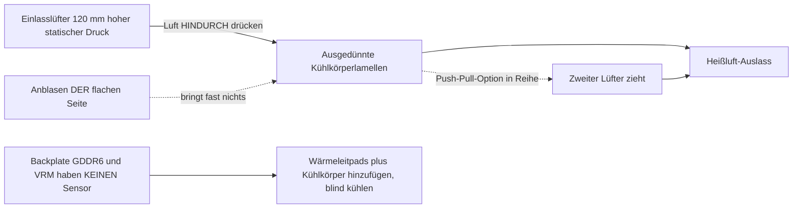

> 🌐 Community-Übersetzung. Die englische Version ist die maßgebliche Quelle und kann aktueller sein. Fehler gefunden? Öffne ein [Issue](https://github.com/lildebil0/awesome-bc250/issues). ([englisches Original](../en/04-cooling.md))

# Kühlung

> **TL;DR** — Der Serienkühlkörper des BC-250 wurde für den erzwungenen Luftkanal eines Server-Racks gebaut, nicht für einen Schreibtisch. Ab Werk drosselt er. Der Community-Fix: **die dichten Serienlamellen ausdünnen** (feilen/schleifen) und einen **120-mm-Lüfter mit hohem statischem Druck** anschrauben (**Arctic P12 Max/Pro** ist die Referenz; Noctua NF-P12 redux ist die leise Premium-Alternative), der *hindurch* bläst. Das allein bringt ein modifiziertes Board auf **~73 °C in Furmark, 63–65 °C in Spielen**. AIO-Wasserkühlung und voll-individuelle Gehäuse sind die nächsten Stufen.

Kühlung ist **das Nummer-1-Ding, das ein Neuling falsch macht**, also erledige das, bevor du Übertaktungen hinterherjagst.

---

## Warum der Serienkühler nicht ausreicht

Der BC-250 ist ein Mining-/Server-Board. Sein Kühlkörper ist **passiv** und dafür ausgelegt, in einem Gehäuse zu sitzen, in dem laute Lüfter die Luft von vorne nach hinten durch ihn pressen. Auf einem Schreibtisch ohne Luftdurchsatz heizt er sich auf und die GPU drosselt. Einen Lüfter *gegen* die flache Seite zu blasen bringt fast nichts — die Luft muss **durch die Lamellenkanäle** wandern, dazu über die Backplate (das GDDR6 auf der Rückseite hat **keinen Temperatursensor**, du kühlst es also blind).

Von der Community beobachtete Grenzen: Drosselung beginnt um **85 °C**, harter Absturz/Reset um **90 °C**. Halte die Lasttemperaturen mit Reserve unter ~80 °C.

> **Es existieren drei Kühlkörper-Varianten** (8-reihige und 9-reihige Lamellen). Schnelle Identifikation: ein **QR-Code neben dem PCIe-8-Pin-Anschluss** kennzeichnet die 9-reihige Variante. Die Variante mit **weniger, dickeren Lamellen** kühlt ab Werk eventuell etwas besser. ([elektricM Cooling](https://elektricm.github.io/amd-bc250-docs/hardware/cooling/))

**Temperaturziele pro Komponente** (von elektricM getestete Werte, feiner aufgeschlüsselt als die Drossel-/Crash-Grenzen oben):

| Komponente | Leerlauf | Leichte Last | Gaming | Max |
|-----------|------|-----------|--------|-----|
| GPU/APU-Kante | 40–50 °C | 50–60 °C | 65–80 °C | 90 °C |
| CPU (Tctl) | 45–55 °C | 55–65 °C | 70–85 °C | 95 °C |
| Speicher (Unterseite) | 40–55 °C | 50–65 °C | 55–70 °C | 80 °C |
| NVMe/SSD | 40–55 °C | 50–65 °C | 60–75 °C | 80 °C (kritisch 81,8 °C) |

Ziele auf **70–80 °C GPU in Spielen**. Die NVMe-Obergrenze ist hier wichtig, weil **das GDDR6 und die M.2-SSD sich die heiße Rückseite des Boards teilen** — die SSD sitzt am thermisch ungünstigsten Punkt und kann garen, also behalte sie im Auge (`80 °C` max, `81.8 °C` kritisch laut Laufwerks-Spec). ([elektricM: sensors](https://elektricm.github.io/amd-bc250-docs/system/sensors/))

> **CPU-Tctl-Leiter.** elektricM kennzeichnet **90 °C Tctl** als den empfohlenen Rückzugspunkt; die **95 °C** der Tabelle sind die Obergrenze, die du unter starkem Gaming noch sehen wirst; **TJmax = 100 °C** ist die absolute Silizium-Grenze (die Package-Leistungstabelle unten nagelt die CPU unter einem dauerhaften Stresslauf genau darauf fest). Also: **90 °C = „jetzt zurücknehmen", 95 °C = „in den roten Bereich", 100 °C = „an der Wand".** ([elektricM: sensors](https://elektricm.github.io/amd-bc250-docs/system/sensors/))

> **Package-Leistung je thermischem Zustand** (elektricM ordnet jedem Zustand eine Board-Leistungsaufnahme zu): Leerlauf **50–70 W**, Leicht **100–150 W**, Schwer **150–200 W**, Stress **200–235 W**. Nützlich, um das Netzteil zu dimensionieren und an der Steckdose abzulesen, wie hart das Board tatsächlich arbeitet. ([elektricM: sensors](https://elektricm.github.io/amd-bc250-docs/system/sensors/))

> **Pixel-Artefakte beim Gaming = VRAM-Überhitzung.** Da das rückseitige GDDR6 keinen Sensor hat, ist dieser visuelle Glitch dein Warnsignal — füge Backplate-Luftdurchsatz/-Pads hinzu (unten). ([elektricM Cooling](https://elektricm.github.io/amd-bc250-docs/hardware/cooling/))

> **Silizium-Lotterie — kalkuliere thermische Reserve pro Chip ein.** Zwei physisch identische Boards, identisches Gehäuse und identische OC-Konfiguration können **5–10 °C auseinanderliegen**, und das heißere blieb selbst nach Neu-Paste/Neu-Pad heißer. Geh nicht davon aus, dass die Temperaturen eines anderen mit deinen übereinstimmen. ([r/BC250Gaming](https://www.reddit.com/r/BC250Gaming/))



---

## Dauerlast beim Rechnen ist ein anderes Regime (nicht nur Gaming-Spitzen)

Die Ziele oben setzen **Gaming** voraus, wo die Last in Schüben kommt. **Dauerlast** beim Rechnen — ein geloopter `llama-bench`, lange Stable-Diffusion-Läufe, alles, was die GPU zigminutenlang auslastet, **besonders mit dem [40-CU-Unlock](09-overclock-undervolt.md)** — ist eine viel härtere Last und kann übersteigen, was ein Kühler auf Gaming-Niveau hält.

elektricM hat einen Serienkühlkörper + **zwei Arctic P12 Max im Push-Pull** vermessen, 10-min-Dauerlast `llama-bench` bei **40 CU / 2 GHz**:

| Metrik | Durchschnitt | Spitze |
|--------|---------|------|
| GPU-Kante | 89,6 °C | 107 °C |
| Package-Leistung | 136 W | 223 W |
| CPU | 96,7 °C | 100 °C (TJmax) |
| VRM-MOSFETs | 57 °C | 58,5 °C |
| Lüfterdrehzahl | ~2950 RPM | 2977 RPM (Obergrenze) |

Der Durchsatz sackte über den Lauf um **~10 %** ab, als das Package drosselte. Fazit: **Serienkühlkörper + zwei P12 Max sind nicht genug Reserve für dauerhafte 40 CU @ 2 GHz** — und beachte, dass die **VRMs weit von ihrer Grenze entfernt sind** (57 °C), der Flaschenhals ist also der *Kühlkörper, der Wärme abgibt*, nicht die Lüfter oder die Leistungsstufe. Zwei Fixes: **den GPU-Governor bei 1500 MHz deckeln** (40 CU skalieren immer noch ~1,5× Rechenleistung, Temperaturen halten ~83 °C — auf zwei P12 Max unbegrenzt durchhaltbar), oder **den Kühlkörper aufrüsten** (mehr Lamellenfläche). Für **24 CU Serien-Gaming** sind zwei P12 Max komfortabel; die Wand taucht nur unter dauerhafter Volllast aller CUs auf. ([elektricM Cooling](https://elektricm.github.io/amd-bc250-docs/hardware/cooling/))

---

## Weg A — Luft-Mod (am beliebtesten, am günstigsten)

Das ist, was die meisten im Chat fahren.

### 1. Serienlamellen ausdünnen/säubern
Die Serienlamellen sind zu dicht und oft ungleichmäßig. Leute öffnen die Kanäle, damit die Luft durchkommt:

- **Exzenterschleifer** — am schnellsten, in Minuten erledigt, bestes Ergebnis. ([src](https://t.me/c/2424231195/31571))
- **Schleifpapier von Hand** — 60er Körnung, dann 240er, ~3–4 h + 2 h über zwei Tage. Funktioniert, aber langsam. ([src](https://t.me/c/2424231195/50330))
- **Schere / Blechschere** — grobe „чекрыжить"-Methode, letzter Ausweg; Ergebnisse sind am schlechtesten. ([src](https://t.me/c/2424231195/41252))
- **Schere + Lineal als Führung (saubere Variante)** — schiebe eine Bastel-/Friseurschere in den Lamellenspalt, mit einem **als Führung an die Klinge angewinkelten Lineal**; ein Taschenmesser als „Dosenöffner" funktioniert genauso gut. Vorbehalt: manche Board-Varianten haben **keinen Spalt, um die Klinge anzusetzen** — heble einen mit einem Schraubendreher/einer Pinzette auf, oder schneide einen Einstiegsschlitz mit einer **kleinen Dremel-Trennscheibe**. Klingen breiter als die Lamellenschlitze können den Kühlkörper beschädigen. ([r/BC250Gaming](https://www.reddit.com/r/BC250Gaming/))
- Verbogene Lamellen mit einer **flachen Pinzette + Zange** geradebiegen. ([src](https://t.me/c/2424231195/30670))
- **Lamellen von Hand abziehen** — elektricM merkt an, dass die weichen Aluminium-Lamellen **von Hand sauber abgerissen/auseinandergezogen werden können** (Kühlkörper vom Board getrennt), wodurch der Metallspan vermieden wird, den Schneidwerkzeuge erzeugen. Langsamer, aber spanfrei. ([elektricM Cooling](https://elektricm.github.io/amd-bc250-docs/hardware/cooling/))
- **„Scooper by Justin"** — ein **3D-druckbares Werkzeug, speziell zum Drücken/Öffnen der BC-250-Kühlkörperlamellen gemacht** ([Printables 1282906](https://www.printables.com/model/1282906-bc-250-scooper)). Sicherer als ein blanker Schraubendreher: es hindert dich daran, zu fest zu drücken und die Kühlkörper-**Basis** zwischen den Lamellen zu zerkratzen. ([r/linux_gaming community thread](https://www.reddit.com/r/linux_gaming/comments/1nvsgji/)) Erwartungen setzen: ein Besitzer berichtete, das gedruckte **„Kamm-/Scooper"-Werkzeug brach beim 2. Einsatz** und verkrampfte die Hände. ([r/BC250Gaming](https://www.reddit.com/r/BC250Gaming/))
- **Hobbyzange — „Schäl"-Methode** — greife die **Oberseite** der Lamellen mit einer kleinen Hobbyzange und schäle sie ab, **indem du die Materialermüdung des Metalls selbst als Bruchpunkt nutzt**, sodass sie an der Biegung sauber abbrechen, statt die Basis aufzureißen. Eine spanarme Alternative zum Schneiden. ([r/linux_gaming community thread](https://www.reddit.com/r/linux_gaming/comments/1nvsgji/))

Grobe Temperatur-Ausbeute (elektricM): **verbogene Lamellen geradebiegen ~5–10 °C**, **mittlere Lamellen entfernen ~10–15 °C** (irreversibel — ein guter Lüfter-Shroud bringt ähnliche Gewinne ohne Schneiden), **frische Paste ~5–10 °C**, falls die alte Paste eingetrocknet war. ([elektricM Cooling](https://elektricm.github.io/amd-bc250-docs/hardware/cooling/))

> ⚠ **Nimm den Kühlkörper zuerst vom Board** (oder maskiere/schütze Board und Die vollständig), bevor du schleifst/feilst, und **entferne jeden Metallstaub-Krümel vor dem Zusammenbau**. Leitfähiger Metallspan, der sich auf dem Board absetzt, kann es kurzschließen und **das Board killen** — das ist im Chat bereits passiert.

<p align="center">
  <br>
  <sub>Foto: AMD BC-250 Community · <a href="https://t.me/c/2424231195/31571">Quelle</a></sub>
</p>

### 2. Einen echten Lüfter anschrauben
Montiere einen **120-mm-Lüfter mit hohem statischem Druck**, der Luft durch die Lamellen drückt. Die Referenzwahl ist der **Arctic P12 Max (oder P12 Pro)** — höchster statischer Druck (~6,9 mm H₂O), die Wahl der Community + elektricM für diesen dichten Kühlkörper. Der **Noctua NF-P12 redux** ist die leise Premium-Alternative und lieferte ein Referenzergebnis von **max 73 °C in Furmark, 63–65 °C in Spielen** ([src](https://t.me/c/2424231195/42843)).

**Konkrete Lüfter-Empfehlungen mit Specs** (elektricM — wähle nach *statischem Druck*, nicht nach Luftdurchsatz):

| Lüfter | Größe | Max RPM | Statischer Druck | Luftdurchsatz | Lautstärke | Gaming-Temperaturen |
|-----|------|---------|----------------|---------|-------|--------------|
| **Arctic P12 Max** | 120 mm | 3300 | **6.9 mm H₂O** | 73.3 CFM | 52.5 dB(A) | 65–75 °C |
| **Arctic P12 Pro** | 120 mm | 2100 | **6.9 mm H₂O** | 68.9 CFM | 37.8 dB(A) | 65–75 °C |
| Arctic P14 PWM | 140 mm | 1700 | 2.40 mm H₂O | 72.8 CFM | 38 dB(A) | 70–80 °C |
| Noctua NF-A12x25 | 120 mm | 2000 | 2.34 mm H₂O | 60.1 CFM | 22.6 dB(A) | 70–85 °C |

elektricMs **am stärksten empfohlene Wahl ist der Arctic P12 Max / P12 Pro** — sein statischer Druck von ~6,9 mm H₂O lässt die 2,34 mm der Noctua zwergenhaft aussehen und ist weit günstiger; der P12 Pro ist die leisere, breiter verfügbare Version. Die Premium-Noctua ist noch leiser, erreicht aber bei den Temperaturen nur bei höherer Drehzahl das Niveau der Arctic. ([elektricM Cooling](https://elektricm.github.io/amd-bc250-docs/hardware/cooling/))

**Weitere genannte Lüfter aus Community-Builds** (konkrete Modelle, die Leute verbaut haben, jenseits der Arctic/Noctua-P12-Referenz):

- **Noctua NF-A12x25 G2** (PWM) als **120-mm-Die-Kühler** — die neuere G2-Revision des A12x25, als Hauptlüfter verwendet ([TiredDadTech](https://youtu.be/zi7sldeRd2w)). (Die Lüftertabelle oben listet nur den *Original*-NF-A12x25.)
- **Noctua NF-A6x15 PWM** (≈3500 rpm) als **60-mm-PSU-Lüfter-Tausch** — der leise Ersatz für einen kreischenden Server-Brick-Lüfter ([TiredDadTech](https://youtu.be/zi7sldeRd2w)).
- **Thermalright 120 mm 1550 rpm ARGB** als Budget-Die-Lüfter und **6,0 W/mK Wärmeleitpads** für die Backplate — beides aus einer **TMG-HD-Build-Stückliste** ([build overview](https://youtu.be/OEO0r01zcfU)).

> **Referenz vs. leise Alternative.** Der **Arctic P12 Max/Pro** ist hier der Referenzlüfter — höchster statischer Druck (~6,9 mm H₂O), am günstigsten, die Wahl der Community + elektricM für diesen dichten Kühlkörper. Der **Noctua NF-P12 redux** ist die leise Premium-Alternative (das 73-°C-Furmark-Ergebnis aus dem Chat), die die Arctic bei den Temperaturen nur bei höherer Drehzahl erreicht. Wähle Arctic für das beste Preis-Leistungs-Verhältnis, Noctua, wenn Leise am wichtigsten ist.

Verwende einen **gedruckten Lüfter-Shroud/-Adapter**, damit der Lüfter gegen den Kühlkörper abdichtet, statt Luft drumherum entweichen zu lassen. Community-STLs:
- `Fan_Shroud_Single_120mm.stl`, `Fan_Shroud_Dual_120mm.stl`, `Fan_Shroud_Single_140mm.stl`, `Twin_120mm_Fan_Shroud.stl`
- `BC250_FanAdapter_120mm.step`, `bc250 cooler mount.stl`, `cooler adapter v3.0.stl`

> **Warum statischer Druck und nicht Luftdurchsatz-Wert?** Dichte Lamellen sind eine Last mit hohem Widerstand. Ein „Gehäuselüfter" mit hohem Luftdurchsatz blockiert an ihnen; ein Lüfter mit hohem statischem Druck (≥3 mm H₂O; Noctua P12, Arctic P12) drückt die Luft tatsächlich *hindurch*. Bei sehr dichten Lamellen verdoppeln zwei Lüfter im **Push-Pull (Reihe)** den statischen Druck — das ist hier der richtige Schritt, nicht zwei Lüfter nebeneinander.

**Montage:** ein gedruckter Shroud ist am besten, aber den Lüfter mit **Kabelbindern** am Kühlkörper zu befestigen funktioniert, und ein **Karton-/Schaumstoffplatten-Kanal**, zwischen Lüfter und Lamellen geklebt, ist eine gültige kostenlose Notlösung (hässlich, nicht dauerhaft, aber dichtet den Luftweg ab). ([elektricM Cooling](https://elektricm.github.io/amd-bc250-docs/hardware/cooling/))

> ⚠ **Bohre/schraube Lüfter nicht direkt in die Lamellen.** Das Aluminium ist weich und die Lamellen sind dünn — Hineinschrauben beschädigt das Lamellenpaket und schadet der Kühlung. Nutze Kabelbinder oder einen gedruckten Shroud. ([elektricM Cooling](https://elektricm.github.io/amd-bc250-docs/hardware/cooling/))

> ### 🛠 Luftstrom-Engineering — was wirklich etwas bewegt
>
> Community-Erkenntnisse dazu, *wie* die Luft bewegt wird, nicht nur welcher Lüfter:
>
> - **Statischer Druck schlägt rohen CFM** durch das dichte Lamellenpaket — deshalb übertrifft der **Arctic P12 Max (6,9 mm H₂O)** mit hohem statischem Druck leisere Lüfter mit hohem Luftdurchsatz/niedrigem Druck auf diesem Kühlkörper.
> - **Ein zentrierter Lüfter kann zwei nebeneinander schlagen** auf einer voll durchgeschnittenen Lamellenebene: ein einzelner zentraler Lüfter lädt die **4 zentralen Heatpipes** direkt, während zwei Lüfter eine tote „Naht" aus Plastik über der Mitte lassen. Der Builder, der die Lamellen als Erster vollflächig durchschnitt, maß mit einem zentralen Lüfter ein paar °C **niedriger** als mit zwei ([src](https://t.me/c/2424231195/46175)). Ein Teardown kommt von der Luftstrom-Seite zum selben Schluss: **zwei Lüfter nebeneinander angeschraubt sind nicht besser als einer**, weil sich **eine tote Zone genau über der heißen Die-Mitte bildet**, wo die beiden Einlässe aufeinandertreffen — **lass einen Spalt zwischen ihnen, oder geh stattdessen Push-Pull** ([Old Lamer — Part VII](https://youtu.be/pxahl9-YgkY) ~19:55). *(Aus Untertiteln — als qualitativ behandeln, nicht exakt.)*
> - **120-mm-Lüfterdrehzahl-Untergrenze ≈1800 RPM**, um durch dieses dichte Paket tatsächlich Luft zu bewegen; der **Arctic P12 Pro** ($8–10, **600–3000 rpm**-Bereich) ist eine einfache Wahl, die leise im Leerlauf bleibt und trotzdem Reserve hat ([Old Lamer — Part VII](https://youtu.be/pxahl9-YgkY)). *(ASR-Zahlen — ungefähr.)*
> - **Einen Auslasslüfter hinzufügen = −3 bis −5 °C.** Nur-Einlass **73 °C** → mit Auslass **67–68 °C** ([src](https://t.me/c/2424231195/68183), [src](https://t.me/c/2424231195/31553)). Das optimale einfache Setup ist also **1 zentraler Einlass + 1 hinterer Auslass**, nicht zwei Einlässe nebeneinander.
> - **Die Backplate ist blind und heiß.** VRM-MOSFETs erreichen **~100 °C ungekühlt** ([src](https://t.me/c/2424231195/110955)) — sie **muss** Pads + Kühlkörper + dedizierten Luftdurchsatz bekommen; mit hinteren Kühlkörpern läuft sie *„kalt unter Last"* ([src](https://t.me/c/2424231195/93056)).
> - **Kostenlose Physik.** Warme Luft steigt auf, also hilft selbst eine **Neigungs-/Kamin**-Ausrichtung — eine kaum belüftete Backplate maß **47 °C allein durch Konvektion** ([src](https://t.me/c/2424231195/76962)). Und ein **schwarz eloxierter Kühler strahlt ~1,8×** so viel ab wie ein polierter, was dir erlaubt, die Lamellenfläche **~45 %** zu verkleinern in passiven/semi-passiven Kompakt-Builds ([src](https://t.me/c/2424231195/86878)).
> - **Fahre Einlass > Auslass** (leichter **positiver Druck**), damit die sensorlosen VRM/VRAM ständig in frischer Luft baden.

### Alternative: Serienlamellen behalten (Push-Pull-Gehäuse ohne Schnitt)
Die Lamellen zu schneiden ist nicht zwingend. **penzoiders** hat ein Gehäuse entworfen ([MakerWorld, FreeCAD-Quelle](https://makerworld.com/models/2505974)), das den Kühlkörper **nicht** schneidet: es nutzt **Push-Pull-Lüfter mit hohem statischem Druck**, um Luft durch die **serienmäßigen, unmodifizierten Lamellen** zu pressen, plus ein **Zwei-Kammer-Druckdifferential**, das auch die Backplate kühlt (5-mm-Kühlkörper + Wärmeleitpads; wiederverwendete NVMe-Kühlkörper funktionieren). Eine Abstimmung, die kühl bleibt: **CPU 3800 MHz / 1050 mV, GPU 2100 MHz / 950 mV** → paralleles Furmark + `stress-ng` bleibt **unter 85 °C**; Gaming **~75 °C bei rund 50 % Lüfter-Duty** (CoolerControl-Kurve), „kaum hörbar". ([r/BC250Gaming](https://www.reddit.com/r/BC250Gaming/))

## Weg B — AIO-Wasserkühlung

Eine 120-mm-AIO, über ein Adapter-Bracket am Die montiert. Leise und kalt, aber mehr Teile und Kosten. Beliebte Builds nutzen günstige AIOs (z. B. aigo). ([example src](https://t.me/c/2424231195/19336))

<p align="center">
  <br>
  <sub>Foto: AMD BC-250 Community · <a href="https://t.me/c/2424231195/19336">Quelle</a></sub>
</p>

**Genanntes, herunterladbares AIO-Bracket — NexGen3D** ([Printables 1554003](https://www.printables.com/model/1554003), in ABS-GF oder PETG drucken). Verifiziert mit einer **Thermalright 240 mm AIO**: GPU **~50 °C @ 2000 MHz**, CPU **max 60 °C**. ([r/BC250Gaming](https://www.reddit.com/r/BC250Gaming/))

### OC-Profile mit Wasserkühlung
Mit einer AIO kannst du viel härter pushen. **NexGen3D** an der Steckdose gemessen (Furmark Vulkan + `stress-ng --matrix 0 -t 60m` als Burn-Kombi):

| Profil | CPU | GPU | Max. Burn-Temperatur | Leistung an der Steckdose | Hinweis |
|---------|-----|-----|---------------|------------|------|
| 1 | 4000 MHz | 2400 MHz | ~65 °C | >350 W | „totenstill" |
| 2 | 4100 MHz | 2450 MHz | ~75 °C | <400 W | heißer, lauter |

Normales 1080p-Gaming läuft **10–15 °C unter** diesen Burn-Temperaturen und **unter 250 W** bei Profil 1. **Nachahmenswertes Luftstrom-Schema:** die 120-mm-Lüfter **blasen durch den Radiator nach außen aus**, was frische Außenluft über die **VRMs / das PSU / die VRAM-Backplate** einzieht; ein separater **80-mm-Lüfter (Arctic P8 Max)** kühlt die GPU-VRMs — das beantwortet die Warnung „sensorlose VRM/VRAM brauchen trotzdem Luftdurchsatz" oben. ([r/BC250Gaming](https://www.reddit.com/r/BC250Gaming/))

## Custom-Wasserkreislauf (fortgeschritten)

Jenseits einer geschlossenen AIO fahren einige Leute einen **vollen Custom-Loop**. Es ist eine reale, aber **DIY/Experten**-Szene: Builder **fräsen per CNC oder löten einen Custom-Wasserblock**, der **das Die *und* das VRM** in einem Block abdeckt ([src](https://t.me/c/2424231195/131065), [src](https://t.me/c/2424231195/131844), [src](https://t.me/c/2424231195/118582)). Fittings sind unkritisch — *„du kannst fast jedes besorgen, drehen oder kleben"* ([src](https://t.me/c/2424231195/132007)).

**Was es dir bringt:** ein grober Custom-Loop erreicht **~50 °C unter Last mit den Lüftern bei nur 30 %, die externe Pumpe nahezu lautlos** ([src](https://t.me/c/2424231195/133040)). (Ein Builder bemerkte dann Spulenfiepen von den VRM-Drosseln unter Last bei der Standard-cyan-skillfish-Governor-Konfiguration — ein *separates* Problem, nicht thermisch.) Du brauchst auch **keinen Corsair Commander**: die eigene [Lüftersteuerung](#die-lüfterdrehzahl-steuern-software) des BC-250 kann die Pumpe plus **~5 Lüfter** antreiben ([src](https://t.me/c/2424231195/140123)).

> ⚠ **Warum das „fortgeschritten" ist: der BC-250 überlebt keine Kühlmittel-Flut.** Reale Ausfälle aus der Community: ein Schlauch **knickte bei 90°, platzte und flutete die GPU und das PSU** ([src](https://t.me/c/2424231195/81158)); eine **festgefressene Corsair-AIO-Pumpe garte die CPU** ([src](https://t.me/c/2424231195/133147), [src](https://t.me/c/2424231195/126053)). Achte außerdem auf **Pumpen-Kavitation/-Geräusch oberhalb ~50 % Pumpendrehzahl** ([src](https://t.me/c/2424231195/7034)). **Lecktest den gesamten Kreislauf 24 h lang VOM Board getrennt, bevor du das erste Mal nass einschaltest.**

**Fazit:** die niedrigsten Temperaturen und die leiseste aller Optionen, und sie ermöglicht dauerhafte 40 CU — aber das höchste Risiko und der höchste Aufwand. **Kein erster Build.**

## Weg C — Blower („улитка") — nicht empfohlen

Ausgeschlachtete GPU-Blower-Lüfter waren ein frühes Experiment. Laut für das Ergebnis; die Leute wechselten zu Weg A. ([src](https://t.me/c/2424231195/100086))

## Weg D — Tower-Kühler-Umbau (fortgeschritten)

Einige Nutzer schrauben einen **AM4-Tower-Kühler** (z. B. **Thermalright Peerless Assassin** oder andere AM4/AM5-Tower) auf das Die für exzellente, leise Kühlung mit Standardhardware. Der Haken: du musst ihn **über ein Bracket montieren**, und ein hoher Tower kann den **M.2-Slot oder andere Komponenten blockieren**. Kein Anfänger-Mod. Du musst ihn nicht mehr von Grund auf fertigen — zwei veröffentlichte 3D-gedruckte Brackets existieren:

- **AM4/AM5-Desktop-Kühler-Adapter** ([MakerWorld 2596083](https://makerworld.com/en/models/2596083), FreeCAD-Quelle inklusive). Montiert einen Standard-Desktop-AM4/AM5-Kühler auf den BC-250. Befestigung: **M5-Bolzen + Muttern, keine Standoffs** (OP merkt an, M4 wäre ideal gewesen, aber M5 passte stramm). Drucke in **ABS, PETG oder ASA**. Verifiziert bei **CPU 3,95 GHz / 1,150 V, GPU 2200 MHz / 1000 mV, Temperaturen nicht über 80 °C**. Verwendete Kühler: ein flacher **AXP90-Klasse** (ein Kommentator nutzte einen **AXP120**), und sogar ein **AMD Wraith Spire** schlug den Serienkühlkörper. ([r/BC250Gaming](https://www.reddit.com/r/BC250Gaming/))
- **Thermalright AXP90-X53 Halterung** ([Printables 1694793](https://www.printables.com/model/1694793)). Gewindeeinsätze werden **in die Unterseite** des gedruckten Brackets **eingelötet**, sodass du die **originalen federbelasteten Serienkühlkörper-Schrauben wiederverwendest**; Flachkopfbolzen kommen von unten hoch und sind versenkt, und das Bracket hat einen **0,5-mm-Spalt unter der Strebe**, um Board-Komponenten freizuhalten. In Fusion 360 entworfen, **in PETG drucken** (PLA erweicht bei diesen Temperaturen). Ergebnis: **65–67 °C unter Volllast @ 2150 MHz, 1080p**, sehr leise (Kupferkühler, gepaart mit einem 120-mm-Arctic-P12-Pro). Gemessene Stapelhöhe **54 mm von der Platine bis zur Oberseite des 15-mm-Lüfters** — nützlich für die Gehäusepassung. Ein **Set mit 3 Dicken-Varianten** und eine **AXP120-X67**-Version existieren ebenfalls. ([r/BC250Gaming](https://www.reddit.com/r/BC250Gaming/))

---

## Die Lüfterdrehzahl steuern (Software)

Sobald ein Lüfter angeschraubt ist, steuerst du seine PWM über den **Nuvoton NCT6686D** Super-I/O-Chip des Boards — aber **welchen Treiber du lädst, ist entscheidend** ([elektricM hardware spec](https://elektricm.github.io/amd-bc250-docs/)):

- **Nur-lesende Sensoren** (Lüfter-RPM, Temperaturen): das im Kernel enthaltene **`nct6683`**-Modul, geladen mit `force=true`. Es meldet Messwerte, **kann aber kein PWM schreiben**, der Lüfter bleibt also bei dem, was das BIOS/die Firmware vorgibt.
- **PWM lesen + schreiben** (Lüfterdrehzahl tatsächlich setzen): nutze das Out-of-Tree-Modul **`nct6687`** von **[Fred78290/nct6687d](https://github.com/Fred78290/nct6687d)**, ebenfalls mit `force=true`. Das ist das Modul, das du bauen solltest, wenn du Lüfterkurven / manuelle Drehzahlsteuerung willst statt nur Monitoring.

```bash
# monitoring only (in-kernel):
echo 'options nct6683 force=true' | sudo tee /etc/modprobe.d/nct6683.conf
# PWM control (DKMS from Fred78290/nct6687d):
echo 'options nct6687 force=true' | sudo tee /etc/modprobe.d/nct6687.conf
```

> Lade nicht beide — wähle `nct6683` für nur-lesende Sensoren oder `nct6687` für Lesen+Schreiben. Die Sensor-Verkabelung (`CPU_FAN1` / `J4003`) und die BIOS↔Linux-Lüfternummerierung stehen im Verifikationsschritt von [06-linux.md](06-linux.md).

**Welcher Header ist der Hauptlüfter?** elektricM berichtet, der Kühllüfter sitzt normalerweise am **Pump Fan**-Header = **`fan2` / `pwm2`** in sysfs; `CPU Fan` (`fan1`) und die `System Fan`-Header (`fan3`+) sind typischerweise ungenutzt. Aktiviere den manuellen Modus, bevor du PWM schreibst (`echo 1 > .../pwm2_enable`, dann einen Wert 0–255 nach `.../pwm2`). Die hwmon-Nummerierung kann sich zwischen Reboots verschieben — bestätige mit `cat /sys/class/hwmon/hwmon*/name`. ([elektricM Cooling](https://elektricm.github.io/amd-bc250-docs/hardware/cooling/))

**Lüfterkurven mit GUI — CoolerControl.** Sobald `nct6687` geladen ist, gibt dir **CoolerControl** grafische Lüfterkurven: wähle das **nct6686**-Gerät, baue eine Kurve auf **pwm2** mit **k10temp Tctl** als Quelle. Installation: `ujust install-coolercontrol` (Bazzite), das `codifryed/CoolerControl`-copr (Fedora) oder `coolercontrol` aus dem AUR (Arch); Web-UI unter `https://localhost:11987`. ([elektricM Cooling](https://elektricm.github.io/amd-bc250-docs/hardware/cooling/))

**BIOS-Lüftermodi** (falls du keine OS-seitige Steuerung fährst): **Default** hält die Lüfter bei einem **40-%-Minimum** (zu niedrig — nicht empfohlen), **Full Speed** nagelt sie auf 100 % fest (laut, aber sicher), **Customize** setzt Drehzahlen pro Schwelle. ([elektricM Cooling](https://elektricm.github.io/amd-bc250-docs/hardware/cooling/))

> ⚠ **Fahre BIOS-Customize-Modus und CoolerControl nicht gleichzeitig** — sie kämpfen um die PWM-Kontrolle. Wähle eines. ([elektricM Cooling](https://elektricm.github.io/amd-bc250-docs/hardware/cooling/))

---

## Wärmeübergang (Paste, Pads, Phasenwechsel, Flüssigmetall)

Egal welchen Lüfter/Kühlkörper du fährst, das **Wärmeleitmaterial (TIM)** zwischen Die und Kühlkörper — und zwischen der Board-Rückseite und einem etwaigen Backplate-Kühler — ist es wert, richtig gemacht zu werden. Das BC-250-Die hat eine **hohe Wärmedichte**, ein gutes TIM bringt also ein paar Grad gratis.

> **Schon der Wechsel der Serienpaste hilft.** Ein Besitzer tauschte die Werkspaste nach einem Jahr, und die Lasttemperaturen fielen **~4–5 °C**, bei sonst unverändertem Aufbau. ([src](https://t.me/c/2424231195/88565))

### Pasten, die funktionieren
- **Arctic MX-6** — eine reguläre High-End-Paste. In einem Build mit Gehäuse hielt sie **87–88 °C in Furmark**; derselbe Besitzer merkte an, PTM7950 würde davon weitere ~4 °C abnehmen. ([src](https://t.me/c/2424231195/30211))
- **Serienpaste + Serienpads** sind die dokumentierte Basis: ~**76 °C** nach 10 min Last, ~**55 °C** im Leerlauf (vor Lamellen-/Lüfter-Mod). ([src](https://t.me/c/2424231195/22992))
- Weitere Pasten, die elektricM hier als okay listet: **Arctic MX-4** (Preis-Leistung), **Thermal Grizzly Kryonaut** (Premium), **Noctua NT-H1** (zuverlässig), **Thermalright TFX** (Budget). Paste auf gebrauchten Boards ist **oft eingetrocknet** — schon Neu-Pasten ist **~5–10 °C** wert. Trage einen erbsengroßen Punkt aufs Die auf, montiere gleichmäßig, ziehe die Schrauben im **X-Muster** an. ([elektricM Cooling](https://elektricm.github.io/amd-bc250-docs/hardware/cooling/))

### PTM7950 — der Community-Favorit (empfohlen)
**PTM7950** ist ein **Phasenwechsel-Pad** (Honeywell Graphit-/Phasenwechsel-Film). Bei Raumtemperatur ist es ein dünnes festes Blatt; unter Last (~45–55 °C) erweicht es und fließt in eine mikrometerdünne Schicht, dann bleibt es liegen. Es **pumpt nicht aus** und trocknet nicht wie Paste, was genau das ist, was du unter einem heißen, thermisch zyklenden Die willst — du trägst es also einmal auf und vergisst es. Die unverblümte Zusammenfassung aus dem Chat: *„PTM7950 und denk nicht zu viel nach"* ([src](https://t.me/c/2424231195/101582)); Phasenwechsel ist die allgemeine Empfehlung ([src](https://t.me/c/2424231195/61511)).

**So trägst du es auf:**
1. Reinige Die und Kühlkörper-Basis (Isopropylalkohol), trocknen lassen.
2. Schneide ein Quadrat PTM7950 auf Die-Größe — ein **~26×30 mm**-Stück deckt das BC-250-Die ab ([src](https://t.me/c/2424231195/125748)).
3. Ziehe eine Schutzfolie ab, lege das Pad aufs Die, ziehe die zweite Folie ab.
4. Montiere den Kühlkörper und ziehe gleichmäßig fest. **Nicht verstreichen** — der erste Wärmezyklus erledigt die Arbeit. Erwarte beste Temperaturen nach ein paar Last-/Leerlauf-Zyklen („Burn-in").

Ein Referenz-Build mit Gehäuse auf PTM7950 (Honeywell, 26×30) plus Backplate-Kühler erreicht Spitzen von **~84 °C über eine Stunde, 66–71 °C in Spielen** bei CPU 3850 MHz / GPU 2100 MHz. ([src](https://t.me/c/2424231195/125748))

> **Genannte Paarung: Upsiren-Putty unter dem Kühlkörper + PTM7950 auf dem Die.** Ein Build-Video paart **Upsiren UTP-6 / UTP-8 Wärmeleit-Putty** (die **UTP-8**-Güte ist mit ≈**14,8 W/mK** angegeben) für die lückenfüllenden Stellen mit einem **PTM7950-Blatt, 40×80×0,25 mm zugeschnitten**, aufs Die gelegt ([PTM7950 + Upsiren video](https://youtu.be/FJapqZSdt6I)). Das Putty ist zum Füllen ungleichmäßiger Spalte zu einem Kühlkörper/einer Platte; der Phasenwechsel-Film kommt aufs Die selbst.
>
> - **Günstiges AliExpress-PTM7950 funktioniert.** Ein ~**$13**-AliExpress-Blatt wurde als funktionierend verifiziert — du brauchst nicht den Marken-Honeywell-Zuschnitt ([PTM7950 + Upsiren video](https://youtu.be/FJapqZSdt6I)).
> - **PTM7950 braucht Einlauf.** Es erreicht seine besten Temperaturen erst nach **mehreren Heiz-/Abkühl-Zyklen** — beurteile es nicht nach dem ersten Lauf ([laptop TIM demo](https://youtu.be/U4Zm8msXJHM)).
>
> *(Beide Quellen sind auto-untertitelt — behandle die genauen W/mK und Maße als ungefähr.)*

### Backplate & GDDR6-Pads (die Rückseite blind kühlen)
Das **GDDR6 und VRM auf der Board-Rückseite haben keinen Temperatursensor** — du kühlst sie blind. Füge einen **Kühlkörper/Radiator auf der Backplate** hinzu, gekoppelt mit **Wärmeleitpads**, damit die rückseitige Wärme irgendwohin abfließen kann. ([src](https://t.me/c/2424231195/125748)) Ein RU-Builder schnappte sich einfach einen **Kühlkörper von Yandex.Market**, klebte ihn auf die Backplate, und er **kühlte die Bodenplatte gut** — jeder einigermaßen große Aluminium-Kühlkörper erledigt hier den Job ([4pda — mananoid1](https://4pda.to/forum/index.php?showtopic=1104980)).

Berichtete Pad-Dicken (community-geteilt, „saved this"-Reaktion):
- **VRM: 1 mm**
- **GDDR6: 2 mm** ([src](https://t.me/c/2424231195/121181))

> ⚠ **verifizieren** — diese Dicken hängen vom Spalt zu *deiner* spezifischen Backplate/deinem Radiator ab. Bestätige mit einer Spaltmessung (oder einem Putty-/Knet-Test), bevor du einen Haufen Pads kaufst.

elektricM gibt ein **leicht abweichendes Pad-Schema** zum Kühlen des Speichers selbst: **1,5-mm-Pads auf der *Vorderseite* des Boards, 2,0 mm auf der *Rückseite***, dann eine Aluminiumplatte/ein Kühlkörper auf der Unterseite. Verwende **nur nicht-leitfähige** Pads nahe dem Board (niemals leitfähige Paste/Pads, die Komponenten kurzschließen könnten). Pad-Marken, die er listet: **Thermalright Odyssey** (Hochleistung), **Arctic Thermal Pad** (Preis-Leistung), **Gelid GP-Ultimate** (Premium). ([elektricM Cooling](https://elektricm.github.io/amd-bc250-docs/hardware/cooling/))

> ⚠ **verifizieren (Pad-Dicken unterscheiden sich zwischen Quellen)** — unsere Chat-Zahlen sind **VRM 1 mm / GDDR6 2 mm (Rückseite)**; elektricM gibt **1,5 mm vorne / 2,0 mm hinten** für die Speicherchips an. Verschiedene Builds, verschiedene Spalte — **miss deinen eigenen Abstand**, statt einer der beiden Zahlen blind zu trauen.

> **Abstürze/Instabilität nach 30–60 min Gaming** (oft mit Pixel-Artefakten) ist die klassische **Speicher-Überhitzungs**-Signatur. Fixes: Pads + eine Unterseiten-Platte hinzufügen, einen Backplate-Lüfter hinzufügen, den Gehäuse-Luftdurchsatz verbessern, oder vorübergehend **den VRAM-Split reduzieren** (z. B. 4 GB → 512 MB), um die Speicherwärme zu senken. ([elektricM Cooling](https://elektricm.github.io/amd-bc250-docs/hardware/cooling/))

### Flüssigmetall — hier generell NICHT empfohlen
Flüssigmetall (LM) kommt zur Sprache, weil die PS5 (APU derselben Familie) es nutzt ([src](https://t.me/c/2424231195/18105)), und bei roher Leistung kantet es Paste/PTM aus ([src](https://t.me/c/2424231195/124112)). Leute haben danach gefragt und es am BC-250 ausprobiert ([src](https://t.me/c/2424231195/18098), [src](https://t.me/c/2424231195/77180)).

**Aber es ist die falsche Wahl auf diesem Board:**
- LM ist **elektrisch leitfähig**. Das BC-250-Die sitzt direkt neben **dichtem GDDR6 und VRM**; ein Tropfen, der vom Die entkommt, schließt das Board kurz (dasselbe Risiko „leitfähiges Ding nahe dem Speicher killt es" wie die Metallspan-Warnung oben).
- Es **pumpt aus / muss etwa jährlich erneuert werden**, und es greift blankes Aluminium an — selbst der PTM7950-Befürworter ließ LM auf seiner eigenen Hardware genau wegen dieses Aufwands fallen und wechselte zu PTM7950 / KryoSheet. ([src](https://t.me/c/2424231195/69688))
- „Nicht jeder nimmt überhaupt den Job an, mit Flüssigmetall zu arbeiten." ([src](https://t.me/c/2424231195/106787))

**Fazit:** **PTM7950 ist die sicherere Hochleistungs-Wahl** — ~99 % des Nutzens, keines der Kurzschluss-/Wartungs-Risiken. Reserviere LM für Leute, die bereits genau wissen, was sie tun.

---

## So testest du deine Kühlung (Community-Methode, angepinnt)

Aus der angepinnten Prozedur ([src](https://t.me/c/2424231195/108407)):

1. **GPU-Stress:** Furmark (Vulkan / „Furmark VK").
2. **CPU gleichzeitig:** füge einen CPU-Bench (cpu-x) oder eine `stress`/`pipx`-basierte Last hinzu — die APU teilt sich einen Kühlkörper, also teste beide zusammen.
   - Diese Tools (Furmark, OCCT, cpu-x, `stress`) **sind auf einem frischen Linux-Rechner nicht vorinstalliert** — installiere sie zuerst über deinen Paketmanager oder Flatpak.
3. **Teste unter deiner Übertaktung**, nicht ab Werk — 1500 MHz ist schwach; **2000 MHz sind ~+30 % FPS** und das, was du tatsächlich fährst, also kühle dafür.
4. Beobachte die Temperaturen; wenn du ~85 °C überschreitest, drosselst du — füge Lüfter-/Shroud-/Lamellen-Arbeit hinzu.

> ℹ️ **Vermenge nicht zwei verschiedene „+30 %"-Aussagen.** Die **GPU-Takt-+30 %** hier (1500 → 2000 MHz, die die FPS um rund ein Drittel anhebt) ist ein *Leistungs*-Gewinn durch Übertaktung. Das ist **nicht** dasselbe wie die **~+30 % thermische Verbesserung**, die für ein **Neu-Pasten** in einer separaten Laptop-TIM-Demonstration ([laptop TIM demo](https://youtu.be/U4Zm8msXJHM)) zitiert wird — die ist ein *Temperatur*-Ergebnis auf anderer Hardware. Gleiche Zahl, nicht verwandte Dinge.

Es gibt auch eine kurze Video-Anleitung der einfachsten Methode, angepinnt im Topic. ([src](https://t.me/c/2424231195/100024))

---

## Empfohlenes Einsteiger-Setup

| Stufe | Mach das | Erwarte |
|------|---------|--------|
| Minimum | Lamellen schleifen (Exzenterschleifer) + 1× Arctic P12 Max/Pro (oder Noctua NF-P12) + gedruckter Shroud | ~73 °C Furmark |
| Besser | Push-Pull (2× P12) durch Shroud | niedriger, leiser bei gleicher Temperatur |
| Max | 120-mm-AIO auf Adapter | am kältesten, mehr Build-Aufwand |

---

## Quellen

- Angepinnte Testmethode — https://t.me/c/2424231195/108407 · Video — https://t.me/c/2424231195/100024
- Lamellen-Werkzeug — https://t.me/c/2424231195/31571 · https://t.me/c/2424231195/30670 · https://t.me/c/2424231195/50330 · „Scooper by Justin"-Lamellen-Werkzeug ([Printables 1282906](https://www.printables.com/model/1282906-bc-250-scooper)) + Hobbyzangen-Schäl-Methode — [r/linux_gaming thread](https://www.reddit.com/r/linux_gaming/comments/1nvsgji/)
- Noctua-P12-Ergebnis — https://t.me/c/2424231195/42843
- AIO-Beispiel — https://t.me/c/2424231195/19336
- Wärmeübergang — Neu-Paste −4–5 °C https://t.me/c/2424231195/88565 · MX-6 https://t.me/c/2424231195/30211 · Serien-Basis https://t.me/c/2424231195/22992 · PTM7950 https://t.me/c/2424231195/101582 · https://t.me/c/2424231195/61511 · PTM7950-Build + Backplate https://t.me/c/2424231195/125748 · Pad-Dicke https://t.me/c/2424231195/121181 · Flüssigmetall https://t.me/c/2424231195/18098 · https://t.me/c/2424231195/69688
- elektricM-Kühlungsleitfaden (Kühlkörper-Varianten, Temp-Tabelle pro Komponente, Dauerlast-Daten, Lüfter-Specs, CoolerControl/BIOS-Lüftermodi, Tower-Kühler, Pad-Schema) — https://elektricm.github.io/amd-bc250-docs/hardware/cooling/
- [elektricM: sensors](https://elektricm.github.io/amd-bc250-docs/system/sensors/) (thermische Schwellen: CPU Tctl 90 °C max / TJmax 100 °C, NVMe/SSD 80 °C max / 81,8 °C kritisch, Package-Leistung je thermischem Zustand)
- r/BC250Gaming (Community-Berichte: Silizium-Lotterie-Streuung, Schere+Lineal-Lamellenmethode, Kamm-Werkzeug-Bruch, Push-Pull-Gehäuse ohne Schnitt, AIO-Bracket + 240-mm-Ergebnis, Wasser-OC-Profile, AM4/AM5 + AXP90-X53 Brackets) — https://www.reddit.com/r/BC250Gaming/ · AM4/AM5-Kühler-Adapter [MakerWorld 2596083](https://makerworld.com/en/models/2596083) · AXP90-X53 Halterung [Printables 1694793](https://www.printables.com/model/1694793) · NexGen3D-AIO-Bracket [Printables 1554003](https://www.printables.com/model/1554003) · Push-Pull-Gehäuse ohne Schnitt [MakerWorld 2505974](https://makerworld.com/models/2505974)
- Hardware-Referenz — [mothenjoyer69/bc250-documentation `hardware.md`](https://github.com/mothenjoyer69/bc250-documentation/blob/main/hardware.md)
- Gehäuse/Adapter mit Kühlung — [onemorecap/bc-250-sleeve-adapter](https://github.com/onemorecap/bc-250-sleeve-adapter)
- Zwei-Lüfter-nebeneinander-Totzone über dem Die / Spalt lassen oder Push-Pull, 120-mm-≈1800-RPM-Untergrenze, Arctic P12 Pro ($8–10, 600–3000 rpm) — [Old Lamer — Part VII](https://youtu.be/pxahl9-YgkY) (Auto-Untertitel / ASR — Zahlen ungefähr)
- Upsiren UTP-6 / UTP-8 Putty (UTP-8 ≈14,8 W/mK) + PTM7950, 40×80×0,25 mm aufs Die zugeschnitten, günstiges AliExpress-PTM7950 (~$13) verifiziert — [PTM7950 + Upsiren video](https://youtu.be/FJapqZSdt6I) · PTM7950 braucht mehrere Heiz-/Abkühl-Einlaufzyklen + das separate Neu-Paste-„+30 %" (Laptop, nicht die GPU-Takt-+30 %) — [laptop TIM demo](https://youtu.be/U4Zm8msXJHM)
- RU-Backplate-Kühler (Yandex.Market-Kühlkörper kühlte die Bodenplatte) — [4pda — mananoid1](https://4pda.to/forum/index.php?showtopic=1104980)

> Lüfter-Shroud- und Adapter-STLs sind in [05-case.md](05-case.md) katalogisiert und unter `assets/stl/` gespiegelt.
