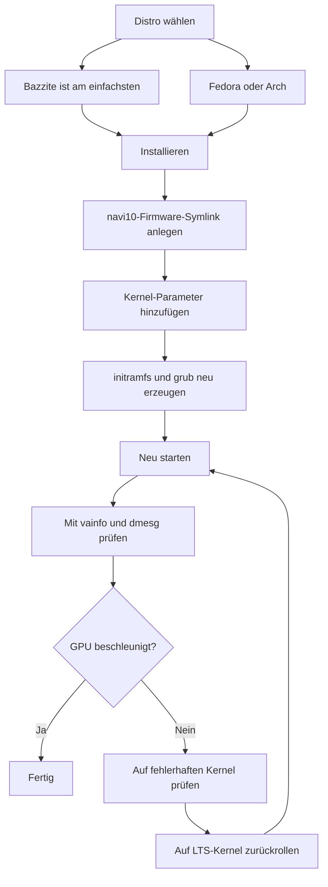

> 🌐 Community-Übersetzung. Die englische Version ist die maßgebliche Quelle und kann aktueller sein. Fehler gefunden? Öffne ein [Issue](https://github.com/lildebil0/awesome-bc250/issues). ([englisches Original](../en/06-linux.md))

# Linux-Treiber & Einrichtung

> **TL;DR** — Die meisten betreiben die BC-250 unter Linux, und sie läuft gut, *sobald die GPU gefixt ist*. Out of the box erkennt `amdgpu` den Chip nicht, und du bekommst CPU-gerendertes Bild mit einstelligen FPS. Zwei Dinge machen sie real: ein **moderner Kernel + frisches Mesa (25.1+)** und der **`amdgpu`-Fix** — ein Firmware-Symlink, damit der Treiber laden kann (`navi10_gpu_info.bin` → `cyan_skillfish_gpu_info.bin`), plus Kernel-Parameter (`amdgpu.sg_display=0`, `mitigations=off` und auf neuen Kernels `amdgpu.bc250_cc_write_mode=3`). Einfachster Weg für Einsteiger: **[Bazzite](https://bazzite.gg/)** flashen und auf das dedizierte **`bazzite-bc250`**-Image rebasen — die Fixes sind eingebacken. Willst du die Maschine kennenlernen: **Fedora** oder **CachyOS/EndeavourOS (Arch)** mit einem einmaligen Setup-Skript.

Dies ist der Abschnitt, der aus „einem Board in der Kiste" einen funktionierenden Desktop macht. Mach [Kühlung](04-cooling.md) und [Strom](03-power-supply.md) zuerst — dann das hier.

> **Noch nie Linux benutzt? Ein 60-Sekunden-Überlebenskit.**
> - **Ein Terminal öffnen:** Suche im Menü nach einer App namens *Terminal* / *Konsole* (KDE) / *Console*, oder drücke `Ctrl-Alt-T`.
> - **`sudo`** vor einem Befehl führt ihn als Administrator aus. Es fragt nach deinem Passwort — und **während du tippst, erscheint nichts auf dem Bildschirm** (keine Punkte, keine Sternchen). Das ist normal; tippe es und drücke Enter.
> - **`nano /etc/...`** öffnet einen einfachen Texteditor im Terminal. Zum Speichern und Beenden: **Ctrl-O**, dann **Enter**, dann **Ctrl-X**.
> - **Einfügen** in ein Terminal geht meist mit **Ctrl-Shift-V** (nicht Ctrl-V).
> - Viele Schritte greifen erst nach einem **Neustart** (`systemctl reboot`). Wenn ein Schritt „neu starten" sagt, starte tatsächlich neu, bevor du beurteilst, ob es funktioniert hat.

---

## Das Eine, das du verstehen musst

Die GPU der BC-250 ist **Cyan Skillfish / Oberon** (ein von der PlayStation 5 abgeleiteter RDNA2-Baustein). Mainline-`amdgpu` hatte historisch **keinen nach ihr benannten Firmware-Blob**, sodass der Kernel bei einer Standard-Installation die GPU nicht initialisieren kann und der Desktop auf Software-Rendering (LLVMpipe) zurückfällt — alles ist langsam, und `vulkaninfo` zeigt kein echtes Gerät. Ein Nutzer verbrachte Tage mit „kaputten Treibern", bevor ihm klar wurde, dass seine Distro schlicht einen Kernel gebootet hatte, der die GPU-Firmware nicht laden konnte ([src](https://t.me/c/2424231195/98466)).

Jedes funktionierende Setup macht also dieselben drei Dinge, in irgendeiner Form:

1. **Einen Kernel + Mesa betreiben, die neu genug sind.** Upstream-Mesa erhielt BC-250-Unterstützung in **25.1** (seitdem keine Patches nötig; **25.3.x** ist die aktuell empfohlene Stable) — ([Mesa MR !33116](https://gitlab.freedesktop.org/mesa/mesa/-/merge_requests/33116), [src](https://t.me/c/2424231195/20891)). Temperatursensoren kamen in **Kernel 6.15** ([src](https://t.me/c/2424231195/23542)); Kernel **6.18.18 LTS** ist der aktuelle Sweet Spot.
2. **`amdgpu` die Firmware geben, die er will** — auf aktuellen Setups liefert ein aktuelles **`linux-firmware`** bereits `cyan_skillfish_gpu_info.bin`; ältere Systeme brauchen weiterhin den **navi10-Symlink** (oder ein gepatchtes Mesa-/Kernel-Paket). Siehe Weg C.
3. **Die richtigen Kernel-Parameter übergeben** und initramfs + Bootloader neu erzeugen. (Und den **GPU-Governor** installieren, damit die Takte nicht bei 1500 MHz festgenagelt sind.)

Alles Folgende ist nur das *Wie* jede Distro diese drei Dinge erledigt.



---

## Welche Distro? (Community-Favoriten)

Der Chat kommt immer wieder auf vier zurück. Es gibt keine einzelne „richtige" Antwort — es ist ein Abwägen zwischen *null Aufwand* und *seine Maschine verstehen*. Die elektricM-Docs testen ein breiteres Feld; hier sind sie alle auf einen Blick ([elektricM: distributions](https://elektricm.github.io/amd-bc250-docs/linux/distributions/)):

| Distro | Basis | Aufwand | GPU-Fix | Am besten für |
|--------|------|--------|---------|----------|
| **Bazzite** (`bazzite-bc250`-Image) | Fedora atomic | **Am niedrigsten** — Fixes eingebacken | Im Image vorab angewendet | Einsteiger, „einfach Spielen" |
| **Fedora 43** (Workstation / KDE) | Fedora | Niedrig | Mesa 25.x in Mainline-Repos + Governor-COPR | Linux lernen, nah am Upstream bleiben |
| **CachyOS** | Arch | Mittel | Mesa 25.1+ in Repos + Governor (AUR) | Maximale Geschmeidigkeit (BORE-Scheduler), HDR+VRR |
| **EndeavourOS / Arch** | Arch | Mittel | Mesa 25.1+ in Repos + Governor | Arch ohne den Installationsschmerz |
| **Debian (Testing/Sid) / PikaOS** | Debian | Mittel–Hoch | Mesa aus `experimental` (Debian) / OOTB (PikaOS) | Stabilität, **niedrigste Idle-Leistung (~50–60 W)** |
| **Manjaro** | Arch | Mittel | Mesa 25.1+ in Repos; bootet OOTB nach BIOS-Flash | Einfaches Arch; GNOME am stabilsten |
| **Alpine** | Alpine (OpenRC) | Hoch | manuell Mesa + Firmware + Governor | Minimal/headless, ~150 MB RAM / ~35 W |
| **Fedora CoreOS** | Fedora atomic | Hoch | Container-Host; Anpassungen nach der Installation | Headless-Container-/LLM-Server |
| **SteamOS** (Valve) | Arch (immutable) | Mittel | Mesa aus dem **main-branch**-Image (nicht stable) + Governor | Echtes Steam-Machine-Gefühl; Couch/Gaming-Mode |
| **Batocera** | Linux (Emulations-Distro) | Niedrig–Mittel | gebündeltes Mesa + Setup | Eine konsolenartige **Emulations**-Kiste ([15-emulation.md](15-emulation.md)) |

Notizen aus dem Chat und von [elektricM](https://elektricm.github.io/amd-bc250-docs/linux/distributions/):
- **Bazzite ist am einfachsten** und hat ein **dediziertes BC-250-Image** mit dem Firmware-Fix, Kernel-Parametern, GPU-Governor und dem bereits angewendeten 40-CU-/Frequenz-Patch. Du findest es auf artifacthub: [`bazzite-bc250`](https://artifacthub.io/packages/container/bazzite-bc250/bazzite_bc250). Mehrere Nutzer wechselten genau deshalb dorthin, um mit dem Handpatchen aufzuhören ([src](https://t.me/c/2424231195/121246)).
- **Seit Fedora 43 ist Mesa 25.x in den Mainline-Repos** — der `mixaill/amd-bc-250`-COPR wird nicht mehr allein für Mesa benötigt. Fedora 42 ist **End-of-Life**; aktualisiere auf 43. Wenn du während der Installation ein Schwarzbild bekommst, nutze *Troubleshooting → Install in Basic Graphics Mode* ([elektricM: Fedora](https://elektricm.github.io/amd-bc250-docs/linux/fedora/)).
- **Greif nicht blind zu den „Gamer"-Distros.** Eine ausführliche Einschätzung argumentiert, dass ein schlichtes **Fedora (Workstation/KDE)** oder **vanilla Arch mit LTS-Kernel + frischem Mesa** der schmerzfreie Mittelweg ist und dass stark getunte Forks manchmal Steam/FSR/vsync eher *kaputtmachen* als helfen ([src](https://t.me/c/2424231195/102834)). Behandle das als Rat „Stand Ende 2025" — das Bazzite-Image ist seither gereift.
- **CachyOS statt Bazzite, wenn du maximale Geschmeidigkeit jagst.** Ein ausführlicher r/BC250Gaming-Community-Bericht (Reddit) wechselte von Bazzite zu **CachyOS** und fand Spiele quellenunabhängig spürbar geschmeidiger, mit weniger Stuttern/Micro-Freezes (z. B. *Mortal Kombat 1*), weniger zufälligen Abstürzen und Steam-Mode-Neustarts und einem sehr reaktionsfreudigen Gefühl auf dem **standardmäßigen Btrfs**-Layout. Es brachte außerdem **HDR + VRR ordentlich zum Laufen**, wo Bazzite es nicht konnte (HDR glitchte, VRR funktionierte nie) — siehe [14-display.md](14-display.md). Behandle es als eine gut dokumentierte Erfahrung, nicht als universelles Urteil, aber es ist eine starke Option, wenn Bazzite dir Stutter oder Instabilität hinterlässt. Das Setup ist durch das Skript **[`redbeard1083/bc250-toolkit`](https://github.com/redbeard1083/bc250-toolkit)** automatisiert (BC-250 auf CachyOS). ⚠ Ein separater Community-Datenpunkt fügt einen Thermik-/FPS-Aspekt hinzu: bei *identischer* Übertaktung läuft CachyOS Berichten zufolge **~10 °C kühler als Bazzite** und liefert höhere FPS in CPU-gebundenen Titeln (z. B. *Elden Ring* ~60–75 auf CachyOS vs. ~45–60 auf Bazzite) ([+14], r/BC250Gaming — community-gemeldet, schwankt; nicht unabhängig bestätigt).
- **Die Kernel-Version zählt mehr als die Distro.** Vermeide bekannte fehlerhafte Kernel (siehe die Warnbox unten). Im Zweifel ist ein **LTS-Kernel** (6.18.18 LTS empfohlen) die sichere Wahl — mehrere Nutzer rannten mit einem zu neuen Kernel gegen eine Wand und wurden durch den Wechsel auf LTS gerettet ([src](https://t.me/c/2424231195/56529), [src](https://t.me/c/2424231195/59839)).
- **Desktop-Umgebung:** **GNOME hat die beste Erfolgsbilanz** auf der BC-250. KDE Plasma hatte Qt-RDRAND/RDSEED-Abstürze — in neueren Qt (Mitte 2025) gefixt, aber GNOME ist weiterhin der sichere Standard; Cinnamon (X11) ist eine stabile leichtgewichtige Option ([elektricM: distributions](https://elektricm.github.io/amd-bc250-docs/linux/distributions/)).
- **Zwei weitere Distros sind community-bestätigt bootfähig** ([r/linux_gaming Community-Thread](https://www.reddit.com/r/linux_gaming/comments/1nvsgji/)): **SteamOS** läuft auf der BC-250 — aber nutze das **main-branch**-SteamOS-Image, **nicht** den Stable-Channel (Stable liefert ein älteres Mesa ohne BC-250-Unterstützung). Und **Batocera**, die dedizierte Emulations-Distro, bootet und läuft ebenfalls — ein bequemer Weg, das Board in eine konsolenartige Emulations-Kiste zu verwandeln (siehe [15-emulation.md](15-emulation.md)). Beide folgen denselben drei Regeln wie alles oben (aktuelles Mesa + der `amdgpu`-Firmware-Fix + Kernel-Parameter/Governor).

> Ein Veteran fasste die Erfahrung nach drei Monaten BC-250 als Daily Driver unter Linux zusammen: Spiele starten mit einem Klick, RTX funktioniert, VR funktioniert, „absolut nahtlos" — und er stellte deswegen seinen Haupt-Desktop auf Linux um ([src](https://t.me/c/2424231195/61870)).

---

## Weg A — Bazzite (empfohlen für Einsteiger)

Bazzite ist ein unveränderliches Fedora-basiertes Gaming-OS (SteamOS-ähnlich). Die Community pflegt ein **BC-250-spezifisches Image**, sodass du Firmware oder Kernel-Parameter nicht selbst anfasst.

### A1. Zuerst reguläres Bazzite installieren
1. Lade von **[bazzite.gg](https://bazzite.gg/#image-picker)** herunter (wähle die Desktop- oder „Deck"-/Gaming-Mode-Variante).
2. Flashe auf USB (Ventoy, Rufus oder balenaEtcher) und installiere normal. **Lege einen Nicht-Root-Benutzer an** — Steam weigert sich, als root zu starten ([src](https://t.me/c/2424231195/121246)).

> **Das richtige Bazzite-Image wählen (Schritt für Schritt).** Auf [bazzite.gg](https://bazzite.gg/) gehe den Picker durch **Desktop PC → AMD (modern) → KDE → Gaming-Mode-Image** — nimm den **Gaming-Mode**-Build, nicht die schlichte Live-ISO: Die Live-ISO installiert sauber, **kann aber tatsächlich keine Spiele ausführen**. Flashe sie mit **Balena Etcher** auf einen **≥16 GB** USB-Stick. Das Installations**ziel** kann eine M.2-NVMe, eine SATA-SSD an einem M.2-auf-SATA-Adapter oder sogar ein **externes USB**-Laufwerk sein. Ein Image von Mitte November 2025 lieferte **Mesa 25.2.4** out of the box ([Old Lamer — Part IV](https://youtu.be/YuBmGF536II)).

> **USB-Stick zu klein?** Die Bazzite-ISO ist >9 GB. Du kannst schlichtes **Fedora** (≈3 GB ISO, z. B. Kinoite/KDE) auf einen kleinen Stick installieren und dann vom Terminal aus auf Bazzite *rebasen* ([src](https://t.me/c/2424231195/121246)):
> ```bash
> # KDE desktop:
> rpm-ostree rebase ostree-image-signed:docker://ghcr.io/ublue-os/bazzite:stable
> # or with Gaming Mode (SteamOS-like):
> rpm-ostree rebase ostree-image-signed:docker://ghcr.io/ublue-os/bazzite-deck:stable
> ```
> Neu starten, und du bist in Bazzite.

### A2. Den GPU-Governor installieren (einfachster aktueller Weg)
Seit Anfang 2026 enthält der **Standard-Bazzite-Kernel bereits den GPU-Frequenzbereich-Patch** — du brauchst also meist **gar kein Custom-Image**. Installiere einfach den Governor auf regulärem Bazzite ([elektricM: Bazzite](https://elektricm.github.io/amd-bc250-docs/linux/bazzite/)):
```bash
sudo dnf copr enable filippor/bazzite
rpm-ostree install cyan-skillfish-governor-smu   # SMU variant — no kernel patch needed
systemctl reboot
sudo systemctl enable --now cyan-skillfish-governor-smu.service
# Pin the known-good deployment so an update can't silently break you:
rpm-ostree pin 0
```
Der **`cyan-skillfish-governor-smu`** steuert die Takte über SMU-Firmware-Aufrufe und ersetzt den älteren `oberon-governor` (siehe *[Power-Governor](#b3-power-governor-cyan-skillfish-governor)*). Eine `cyan-skillfish-governor-tt`-Variante existiert ebenfalls, braucht aber den Kernel-Frequenz-Patch (bereits in Bazzite). ⚠ Der Governor zielt eventuell auf die falsche Karte (card0 vs. card1) — prüfe das, falls die Skalierung nicht greift.

### A2-alt. (Optional) Auf das BC-250-Image rebasen
Nur wenn du die extra vorgebackenen Optimierungen willst: Wechsle auf ein gepflegtes BC-250-Image — die **`vietsman` „Bazzite on Steroids"**-Builds (Firmware-Fix, Kernel-Parameter, Governor, erweiterter 350–2230-MHz-Frequenz-Patch eingebacken). Wähle den Desktop, den du installiert hast — **GNOME ist der empfohlene Standard** — und führe aus:
```bash
# GNOME (recommended):
rpm-ostree rebase ostree-image-signed:docker://ghcr.io/vietsman/bazzite-gnome-patched:latest
# KDE:
rpm-ostree rebase ostree-image-signed:docker://ghcr.io/vietsman/bazzite-kde-patched:latest
# Deck / Gaming-Mode (SteamOS-like):
rpm-ostree rebase ostree-image-signed:docker://ghcr.io/vietsman/bazzite-deck-patched:latest
systemctl reboot
```
⚠ Prüfe vor dem Ausführen das aktuelle Image/Tag — Image-Pfade ändern sich. Die aktuellen Befehle stehen auf der [BC-250-Docs-Bazzite-Seite](https://elektricm.github.io/amd-bc250-docs/linux/bazzite/) (auch auf artifacthub als [`bazzite-bc250`](https://artifacthub.io/packages/container/bazzite-bc250/bazzite_bc250) gelistet).

> ⚠ **Das Rebasen auf ein gepatchtes Image kann dein USB-WLAN killen (elektricM Issue #10).** Der Custom-Kernel enthält eventuell nicht den Treiber deines USB-WLAN-/Bluetooth-Dongles (die BC-250 hat kein eingebautes Funkmodul). Halte Ethernet bereit, prüfe nach dem Rebase `lsmod | grep <your_driver>`, `rpm-ostree install <driver-package>` falls fehlend, oder `rpm-ostree rollback && systemctl reboot`.

> **Wenn das 40-CU-Unlock die Lüftersteuerung oder dein Xbox-Gamepad kaputtmacht, wechsle zu einem Custom-Kernel-Image.** Bazzites eingebautes 40-CU-Unlock (die „Old-Lamer"-Methode) bricht community-gemeldet auf manchen Setups **Lüftersteuerung und Xbox-Controller-Unterstützung** ([+ r/BC250Gaming — community-gemeldet, schwankt]). Das **[`hafriedlander/kernel-bazzite`](https://github.com/hafriedlander/kernel-bazzite)**-Image ist ein Custom-Kernel, der das fixt — verifiziert als *„der (Legacy-)Bazzite-Kernel mit dem 40CU-Unlock-Patch für BC250-Boards"*, direkt aus Fedoras kernel-ark mit dem üblichen Handheld-/Performance-Patch-Set gebaut (auch als `linux-bazzite-bin` auf dem AUR gepackt). ⚠ Ob es deine spezifische Lüfter-/Gamepad-Regression löst, ist ein Community-Datenpunkt, keine Garantie — halte ein bekannt-funktionierendes Deployment gepinnt, damit du `rpm-ostree rollback` kannst.

Nach dem Neustart aktualisierst du künftig mit dem Bazzite-Helfer:
```bash
ujust update          # update everything (or: rpm-ostree upgrade && flatpak update)
rpm-ostree rollback   # if an update breaks something, roll back and reboot
```

> **Zwei Bazzite-Stolperfallen, die man kennen sollte** ([elektricM: Bazzite](https://elektricm.github.io/amd-bc250-docs/linux/bazzite/)): Konstanter **Micro-Stutter** selbst in leichten 2D-Spielen ist meist der Handheld Daemon, der in einer Schleife versagt — deaktiviere ihn mit `sudo systemctl mask --now hhd`. Und **Freezes beim Laden von Levels** nach einem BIOS-Flash bedeuten meist, dass das **CMOS nicht gelöscht** wurde — CMOS löschen, die VRAM-Einstellung neu anwenden.

> ⚠ **Bazzites Unveränderlichkeit blockiert Low-Level-Netzwerk-Tools.** Das schreibgeschützte `/usr` bedeutet, dass Traffic-Shaping-/Anti-Throttling-Tools, die System-Services oder Kernel-Teile installieren (z. B. `zapret`-artige Tools), nicht sauber installieren. Wenn du auf eines angewiesen bist — verbreitet bei manchen ISPs, die Steam drosseln —, ist eine veränderliche Distro (Fedora/Arch) der einfachere Host (RU-spezifische Details in der russischen Ausgabe).

### A3. Fertig — verifizieren
Springe unten zu **[GPU-Beschleunigung verifizieren](#gpu-beschleunigung-verifizieren)**. Auf dem BC-250-Image (oder nach A2) sind der Firmware-Symlink, die Kernel-Parameter und der Governor bereits vorhanden.

---

## Weg B — Fedora (Workstation / KDE)

Fedora ist der am besten dokumentierte nicht-atomare Weg und bleibt nah am Upstream. **Auf Fedora 43 braucht der Grafik-Stack kein zusätzliches Repo — Mesa 25.x ist bereits in den Mainline-Repos** ([elektricM: Fedora](https://elektricm.github.io/amd-bc250-docs/linux/fedora/)). Der ältere `mixaill/amd-bc-250`-COPR (unten) wird nur auf Releases vor 43 benötigt.

### B1. Fedora installieren
Lade **Fedora 43 Workstation oder KDE** ([fedoraproject.org](https://fedoraproject.org/workstation/download)) herunter und installiere normal — **Fedora 42 ist End-of-Life**, aktualisiere auf 43. Wenn der Installer ein Schwarzbild zeigt, wähle *Troubleshooting → Install Fedora in basic graphics mode* (das setzt `nomodeset`; entferne es, nachdem die Treiber drin sind). Als gut gemeldete Basis aus dem Chat: Kernel 6.14, GNOME 48, Mesa 25.0.2+ — „fliegt" ([src](https://t.me/c/2424231195/29150)). Fedora 41 mit Cinnamon wurde als „stabil wie Hölle" bezeichnet, mit Cyberpunk, Witcher 3 etc. ([src](https://t.me/c/2424231195/12756)). Auf 43 bevorzuge Kernel **6.18.18 LTS** oder **6.17.11+** und vermeide die fehlerhaften Bereiche (Warnbox unten).

### B2. Das Setup-Skript (erledigt die Arbeit für dich)
Das kanonische Fedora-Setup wird durch `mothenjoyer69/bc250-documentation`s **`fedora-setup.sh`** automatisiert. Es aktiviert den COPR, installiert gepatchtes Mesa, konfiguriert `amdgpu`, baut den Governor und fixt den Bootloader. Die genauen Schritte, die es ausführt (gegen das Skript abgeglichen):

```bash
# 1. Patched mesa from COPR
sudo dnf copr enable mixaill/amd-bc-250 -y
sudo dnf upgrade --refresh -y

# 2. amdgpu module option + sensor module
echo 'options amdgpu sg_display=0'    | sudo tee /etc/modprobe.d/options-amdgpu.conf
echo 'nct6683'                        | sudo tee /etc/modules-load.d/99-sensors.conf
echo 'options nct6683 force=true'     | sudo tee /etc/modprobe.d/options-sensors.conf

# 3. Regenerate initramfs (Fedora uses dracut)
sudo dracut --regenerate-all --force

# 4. Bootloader: drop nomodeset, add kernel params
sudo sed -i 's/nomodeset//g' /etc/default/grub
sudo grub2-mkconfig -o /etc/grub2.cfg
sudo grubby --update-kernel=ALL --args="amdgpu.sg_display=0"
sudo grubby --update-kernel=ALL --args="mitigations=off"

# 5. OpenCL (optional, for compute/AI)
sudo dnf install mesa-libOpenCL --allowerasing
```
*(Quelle: `fedora-setup.sh` in [mothenjoyer69/bc250-documentation](https://github.com/mothenjoyer69/bc250-documentation), wortwörtlich bestätigt.)*

Um das Skript einfach auszuführen, statt die Schritte zu tippen, siehe den Abschnitt **„Simple setup script"** in der README dieses Repos (er verweist auf [`fedora-setup.sh`](https://raw.githubusercontent.com/mothenjoyer69/bc250-documentation/refs/heads/main/fedora-setup.sh)). ⚠ Lies ein Setup-Skript, bevor du es in eine Shell pipest.

### B3. Power-Governor (cyan-skillfish-governor)
Das Board läuft out of the box mit flachen 1500 MHz / 1000 mV; ein **Governor** skaliert die Takte (Idle ↔ ~2000 MHz) und lässt dich undervolten. Der aktuell empfohlene ist **`cyan-skillfish-governor-smu`**, aus dem `filippor/bazzite`-COPR ([elektricM: Fedora](https://elektricm.github.io/amd-bc250-docs/linux/fedora/), bestätigt Mär 2026):
```bash
sudo dnf copr enable filippor/bazzite
sudo dnf install cyan-skillfish-governor-smu
sudo systemctl enable --now cyan-skillfish-governor-smu
systemctl status cyan-skillfish-governor-smu        # check it's running
```
Die Konfiguration liegt in `/etc/cyan-skillfish-governor-smu/config.toml`. Das vollständige Tuning wird in **[09-overclock-undervolt.md](09-overclock-undervolt.md)** behandelt.

> **SMU vs. der ältere oberon-governor.** `cyan-skillfish-governor-smu` steuert die Takte über SMU-Firmware-Aufrufe und **braucht auf keiner Distro einen Kernel-Frequenz-Patch** — er hat den älteren `oberon-governor` in den elektricM-Docs praktisch überall ersetzt ([elektricM: kernel](https://elektricm.github.io/amd-bc250-docs/linux/kernel/)). Derselbe COPR liefert auch eine `cyan-skillfish-governor-tt`-Variante, die den Kernel-Patch *doch* braucht. Wenn du bereits `oberon-governor` betreibst, stoppe/deaktiviere/entferne ihn (`sudo systemctl disable --now oberon-governor`, `/etc/oberon-config.yaml` entfernen), bevor du den SMU-Governor installierst.

### B4. Neu starten und verifizieren
Starte neu, dann springe zu **[GPU-Beschleunigung verifizieren](#gpu-beschleunigung-verifizieren)**.

---

## Weg C — Arch-Familie (CachyOS / EndeavourOS)

Arch-basierte Installationen brauchten historisch den **von Hand erstellten Firmware-Symlink** plus ein frisches Mesa. Das ist der „manuellste" Weg, aber dieselben drei Ideen gelten.

> **Achtung — der Symlink ist für dich eventuell schon obsolet.** Die elektricM-Per-Distro-Guides für [Arch](https://elektricm.github.io/amd-bc250-docs/linux/arch/), [CachyOS](https://elektricm.github.io/amd-bc250-docs/linux/cachyos/) und andere **erstellen den navi10-Symlink gar nicht mehr** — auf einem aktuellen Kernel mit einem aktuellen `linux-firmware` (Arch) / `linux-firmware-amdgpu` (Alpine)-Paket wird der `cyan_skillfish_gpu_info.bin`-Blob inzwischen mitgeliefert, und Mesa 25.1+ erledigt den Rest. Versuche es zuerst **ohne** den Symlink; greife nur auf C1 zurück, wenn `dmesg` `amdgpu: Failed to get gpu_info firmware` zeigt (d. h. dein Firmware-Paket ist zu alt, um ihn zu enthalten).

### C1. Der amdgpu-Firmware-Fix (der kritische Symlink) — nur wenn die Firmware fehlt
`amdgpu` sucht nach `cyan_skillfish_gpu_info.bin`; der **navi10**-Blob funktioniert an seiner Stelle. Das war der am häufigsten wiederholte Befehl im Chat (5×) ([src](https://t.me/c/2424231195/45453)) und ist weiterhin der Fix, wenn das `linux-firmware` deiner Distro älter ist als der Blob:

```bash
sudo ln -s /lib/firmware/amdgpu/navi10_gpu_info.bin.zst \
           /lib/firmware/amdgpu/cyan_skillfish_gpu_info.bin.zst
```

> ⚠ **Prüfe den Pfad auf deinem System.** Auf Distros, die **unkomprimierte** Firmware liefern, lass das `.zst` bei beiden Namen weg:
> ```bash
> sudo ln -s /lib/firmware/amdgpu/navi10_gpu_info.bin \
>            /lib/firmware/amdgpu/cyan_skillfish_gpu_info.bin
> ```
> **Welche ist deine?** Führe `ls /lib/firmware/amdgpu/ | grep -i navi10` aus und schau auf den Namen der Quelldatei: Endet er auf `.zst`, nutze den ersten (`.zst`)-Befehl, sonst den zweiten — der Link-Name muss zu der Datei passen, die tatsächlich existiert. Nach dem Erstellen des Links **musst** du initramfs neu erzeugen (nächster Schritt), damit die Firmware beim Booten aufgegriffen wird.

### C2. Frisches Mesa
Auf EndeavourOS/CachyOS ist der Community-Weg **chaotic-aur** + `mesa-tkg-git`. Verdichtet aus einem angepinnten EndeavourOS-Mini-Guide ([src](https://t.me/c/2424231195/50399)) und einem SteamOS-Guide ([src](https://t.me/c/2424231195/52411)):

```bash
# Add the chaotic-aur key + mirrorlist (see https://aur.chaotic.cx/docs for the current keys)
sudo pacman-key --recv-key 3056513887B78AEB --keyserver keyserver.ubuntu.com
sudo pacman-key --lsign-key 3056513887B78AEB
sudo pacman -U 'https://cdn-mirror.chaotic.cx/chaotic-aur/chaotic-keyring.pkg.tar.zst'
sudo pacman -U 'https://cdn-mirror.chaotic.cx/chaotic-aur/chaotic-mirrorlist.pkg.tar.zst'

# Append to /etc/pacman.conf:
#   [chaotic-aur]
#   Include = /etc/pacman.d/chaotic-mirrorlist
sudo nano /etc/pacman.conf

sudo pacman -Syu
sudo pacman -Sy mesa-tkg-git lib32-mesa-tkg-git   # (or: yay -S mesa-tkg-git lib32-mesa-tkg-git)
sudo pacman -S vulkan-tools                        # for vulkaninfo
```
Es gibt auch vorgebaute AUR-Pakete: [`amdonly-gaming-mesa-git`](https://aur.archlinux.org/packages/amdonly-gaming-mesa-git) und [`mesa-amd-bc250`](https://aur.archlinux.org/packages/mesa-amd-bc250). ⚠ Der chaotic-aur-Signaturschlüssel kann rotieren — kopiere die aktuellen Schlüssel immer von [aur.chaotic.cx/docs](https://aur.chaotic.cx/docs).

> **Einfachster Weg auf aktuellem Arch/CachyOS:** Mesa **25.1+ ist jetzt in den offiziellen `extra`-Repos** — `sudo pacman -S mesa vulkan-radeon lib32-vulkan-radeon` reicht aus, kein chaotic-aur oder `mesa-tkg-git` nötig. Die `-tkg`-/AUR-Builds spielen nur auf älteren Distros eine Rolle ([elektricM: Arch](https://elektricm.github.io/amd-bc250-docs/linux/arch/), [src](https://t.me/c/2424231195/20891)). Mesa **26** (git) ist auf Debian sid / Ubuntu 26.04 daily bereits bestätigt funktionierend.
>
> Um die manuellen Schritte ganz zu überspringen, verweist der elektricM-Arch-Guide auf das **`eabarriosTGC/BC250--ARCH`**-Setup-Skript (`Arch-setup.sh`, oder `bc520-manjaro.sh` für Manjaro), das den Governor installiert, Sensoren einrichtet, `/etc/environment.d/99-radv-bc250.conf` mit `RADV_DEBUG=nohiz` schreibt und initramfs neu erzeugt ([elektricM: Arch](https://elektricm.github.io/amd-bc250-docs/linux/arch/)). Speziell auf **CachyOS** nutzt der r/BC250Gaming-Community-Bericht (Reddit) **[`redbeard1083/bc250-toolkit`](https://github.com/redbeard1083/bc250-toolkit)**, ein auf BC-250 auf CachyOS zugeschnittenes Setup-Skript. ⚠ Lies jedes Setup-Skript, bevor du es ausführst.

### C3. Kernel-Parameter + neu erzeugen
Füge die BC-250-Kernel-Parameter hinzu, baue dann initramfs und grub neu. Bearbeite `/etc/default/grub` und setze diese in `GRUB_CMDLINE_LINUX_DEFAULT` (kanonischer Satz laut [elektricm BC-250 docs](https://elektricm.github.io/amd-bc250-docs/linux/kernel/)):

```
amdgpu.sg_display=0 mitigations=off amdgpu.bc250_cc_write_mode=3 ttm.pages_limit=3959290 ttm.page_pool_size=3959290
```

Dann neu erzeugen (Arch nutzt **mkinitcpio**, dann grub):
```bash
sudo mkinitcpio -P
sudo grub-mkconfig -o /boot/grub/grub.cfg
```
Auf Distros, die `update-grub` nutzen (Debian/Ubuntu/SteamOS), ersetzt dieser Wrapper die `grub-mkconfig`-Zeile ([src](https://t.me/c/2424231195/52411)).

### C4. Governor + Neustart
Installiere **`cyan-skillfish-governor-smu`** aus dem AUR (der moderne Ersatz für `oberon-governor` — kein Kernel-Patch nötig), aktiviere den Service, starte neu und verifiziere ([elektricM: CachyOS](https://elektricm.github.io/amd-bc250-docs/linux/cachyos/)):
```bash
yay -S cyan-skillfish-governor-smu
sudo systemctl enable --now cyan-skillfish-governor-smu.service
cat /sys/class/drm/card0/device/pp_dpm_sclk   # the * should move between clocks under load
```
Eine `cyan-skillfish-governor-tt`-Variante existiert für die, die den Kernel-Patch-Weg bevorzugen. Der ältere `oberon-governor` ([gitlab.com/mothenjoyer69/oberon-governor](https://gitlab.com/mothenjoyer69/oberon-governor), `cmake . && make && sudo make install`) funktioniert noch, wird aber ausgemustert.

> ⚠ **Bekannte Arch-/Manjaro-/CachyOS-Eigenheit:** Der Governor **beginnt beim Booten oft nicht mit dem Skalieren** — die GPU bleibt bei 1500 MHz, bis du einmal irgendein Spiel/Benchmark startest, danach verhält sie sich. Fedora/Bazzite sind nicht betroffen. Workaround: `sudo systemctl restart cyan-skillfish-governor-smu` nach dem Booten ([elektricM: Arch](https://elektricm.github.io/amd-bc250-docs/linux/arch/)).

---

## Nischen-Distro-Deltas (Alpine / CoreOS / Debian / CachyOS)

Die vier Wege oben decken die meisten ab. Die Distros unten brauchen die *gleichen drei Dinge*, aber mit distro-spezifischen Paketnamen und Mechanismen — das sind die BC-250-Deltas, keine vollständigen Installationsanleitungen.

### CachyOS — die richtige Microarch-Stufe wählen
CachyOS bittet dich bei der Installation, eine x86-64-**Microarchitektur-Stufe** zu wählen. **Nimm `x86-64-v3`** — es ist die kompatibelste Wahl für **Zen 2** ([elektricM: CachyOS](https://elektricm.github.io/amd-bc250-docs/linux/cachyos/)). ⚠ Nimm **nicht** `x86-64-v4`: Diese Stufe erfordert AVX-512, das den Zen-2-Kernen der BC-250 fehlt, sodass eine v4-Installation nicht läuft. Nutze den LTS-Kernel — `sudo pacman -S linux-cachyos-lts linux-cachyos-lts-headers`. Um eine **bestehende Arch**-Box auf CachyOS-Repos zu migrieren, statt neu zu installieren:
```bash
wget https://mirror.cachyos.org/cachyos-repo.tar.xz
tar xvf cachyos-repo.tar.xz
cd cachyos-repo
sudo ./cachyos-repo.sh   # choose x86-64-v3 when prompted
```
Alles andere (Firmware, Mesa 25.1+, Governor, Kernel-Parameter) folgt **Weg C** oben.

### Debian — Mesa auf `experimental` pinnen
Stable-/Testing-Mesa ist zu alt; du willst Mesa **nur** aus `experimental`, ohne den Rest des Systems dorthin zu ziehen ([elektricM: Debian](https://elektricm.github.io/amd-bc250-docs/linux/debian/)). Füge das Repo hinzu:
```
deb http://deb.debian.org/debian experimental main contrib non-free non-free-firmware
```
Dann **APT-pinnen**, sodass nur die Mesa-Pakete experimental verfolgen — `/etc/apt/preferences.d/experimental`:
```
Package: mesa-vulkan-drivers libgl1-mesa-dri
Pin: release a=experimental
Pin-Priority: 500
```
Installiere Mesa und einen neueren Kernel:
```bash
sudo apt install -t experimental mesa-vulkan-drivers libgl1-mesa-dri
sudo apt install linux-xanmod-lts-x64v3       # Xanmod LTS, v3 build
```
Der Governor hat **kein COPR/AUR auf Debian** — installiere ihn aus dem Upstream-Release-Tarball:
```bash
tar -xf cyan-skillfish-governor-smu-*-x86_64-linux.tar.gz
cd cyan-skillfish-governor-smu-*/
sudo ./scripts/install.sh
sudo systemctl enable --now cyan-skillfish-governor-smu.service
```

### Alpine — das einzige systemd-freie Governor-Rezept
Alpine nutzt **OpenRC**, nicht systemd, sodass der Governor von Hand verdrahtet werden muss ([elektricM: Alpine](https://elektricm.github.io/amd-bc250-docs/linux/alpine/)). Das Firmware-Paket ist **`linux-firmware-amdgpu`** (es liefert `cyan_skillfish_gpu_info.bin`) — der generische Name `linux-firmware`, der anderswo in diesem Dokument benutzt wird, **gilt auf Alpine nicht**. Installiere den Stack (standardmäßig kein `sudo` — nutze **`doas`** oder `apk add sudo`):
```sh
doas apk add linux-lts linux-firmware-amdgpu \
  mesa-vulkan-ati vulkan-loader vulkan-tools mesa-dri-gallium
```
Kernel-Parameter gehen in **`/etc/update-extlinux.conf`** (Alpine nutzt extlinux, **nicht** grub/dracut); nach dem Bearbeiten neu bauen:
```sh
doas mkinitfs
doas update-extlinux
```
Der Governor wird aus dem **`smu`**-Branch mit `cargo build --release` gebaut, und weil er über D-Bus spricht, braucht er **sowohl** eine D-Bus-Policy-Datei **als auch** einen OpenRC-Service:
- **D-Bus-Policy** `/etc/dbus-1/system.d/com.cyan.skillfishgovernor.conf` (lässt ihn den Bus-Namen `com.cyan.SkillFishGovernor` besitzen);
- **OpenRC-Service** `/etc/init.d/cyan-skillfish-governor-smu`, der `need dbus` deklariert.

D-Bus aktivieren und neu starten:
```sh
doas rc-update add dbus default
doas rc-service dbus start
```

### Fedora CoreOS — Immutable-Host-40-CU-Unlock & ACPI-Fix
Auf dem unveränderlichen CoreOS-Host kannst du `amdgpu.bc250_cc_write_mode=3` nicht einfach auf dem leichten Weg übergeben, also wird das 40-CU-Unlock als **Boot-Service via `umr`** erledigt, der die GPU-Register einmal pro Boot schreibt ([elektricM: CoreOS](https://elektricm.github.io/amd-bc250-docs/linux/fedora-coreos/)):
```bash
rpm-ostree install umr
# then a oneshot /etc/systemd/system/gpu-unlock.service that runs the umr
# register writes (mmRLC_PG_ALWAYS_ON_WGP_MASK / mmCC_GC_SHADER_ARRAY_CONFIG /
# mmSPI_PG_ENABLE_STATIC_WGP_MASK on *.gfx1013) after a short boot delay,
# then: systemctl enable gpu-unlock.service
```
Der **ACPI-cpufreq-Fix** (die `bc250-acpi-fix`-SSDT-Tabellen) wird auf die rpm-ostree-Art angewendet — lege die `.aml`-Dateien in `/etc/dracut.conf.d/acpi/` ab, füge `/etc/dracut.conf.d/99-acpi-override.conf` hinzu:
```
acpi_override="yes"
acpi_table_dir="/etc/dracut.conf.d/acpi"
```
dann backe sie mit `rpm-ostree initramfs --enable` in die initramfs und starte neu. (Siehe *Bekannte fehlerhafte Kernel & Stolperfallen* unten für den nicht-atomaren dracut-Weg.)

---

## Was jeder Kernel-Parameter macht

Abgeglichen gegen die [elektricm BC-250 docs](https://elektricm.github.io/amd-bc250-docs/linux/kernel/) und die AMD-BC-250-/mothenjoyer69-Setup-Skripte:

| Parameter | Was er macht |
|-----------|--------------|
| `amdgpu.sg_display=0` | Deaktiviert Scatter-Gather-Display. Nötig auf **Kernels < 6.10**, um ein Schwarzbild zu vermeiden; schadet nicht, es zu behalten. Der am häufigsten zitierte Boot-Fix im Chat ([src](https://t.me/c/2424231195/52411)). |
| `mitigations=off` | Schaltet CPU-Sicherheitsmaßnahmen aus. elektricM misst **+18 FPS in Cyberpunk 2077** (60 → 78 bei 1080p high), insgesamt ~5–10 % CPU-Gewinn — auf Kosten der Sicherheit. Optional; nur für Gaming-Systeme. |
| `amdgpu.bc250_cc_write_mode=3` | Opt-in-**40-CU-Unlock** für neue Kernel: schreibt zwei HW-Register, um alle 40 Compute-Units wieder zu aktivieren (standardmäßig aus). Abgesichert durch PCI-ID `0x13FE`, keine dauerhafte HW-Änderung. Die Leistung springt heftig (z. B. 56 W → 181 W in llama-bench) — nur für Compute lohnend. Siehe [09-overclock-undervolt.md](09-overclock-undervolt.md). |
| `amdgpu.gttsize=14750` **+** `ttm.pages_limit=3959290` `ttm.page_pool_size=3959290` | Lassen die GPU mehr System-RAM mappen (≈14,5–14,75 GB). elektricM nutzt **alle drei zusammen**, nicht als Alternativen — `gttsize` setzt die GTT-Größe, und die zwei `ttm`-Werte heben die Page-Limits an. Passt zu einem 512-MB-dynamischen BIOS-VRAM-Split ([elektricM: kernel](https://elektricm.github.io/amd-bc250-docs/linux/kernel/)). |

> ⚠ **Übergib NICHT `amd_iommu=on`**, um die Speicher-Parameter zum Laufen zu bringen — sie funktionieren *ohne* IOMMU, das aus bleiben muss (nächster Abschnitt). Die Werte oben können auch in `/etc/modprobe.d/` statt in die Kernel-Cmdline: `options ttm pages_limit=3959290 page_pool_size=3959290` / `options amdgpu gttsize=14750`, dann initramfs neu bauen.

> **Eine Anmerkung zur VRAM-/Puffer-Größe:** Die APU läuft am besten mit dem **kleinsten** GPU-Framebuffer-Carve-out (z. B. 512 MB), damit sie den 16-GB-Pool dynamisch teilen kann — aber das zu ändern braucht ein **modifiziertes BIOS**, behandelt in [08-bios.md](08-bios.md) ([src](https://t.me/c/2424231195/38599)).

> 📋 **Die kanonische Daily-Driver-Konfiguration eines Veteranen (Schnellreferenz):** **CPU 4 GHz / GPU 2 GHz 40 CU / VRAM BIOS 512 MB / `mitigations=off` / zswap + 32 GB Swap.** Das ist das ganze getunte Setup in einer Zeile — GPU-Takt + das 40-CU-Unlock + ein winziger 512-MB-BIOS-Split + Mitigations aus + der zswap-Swap-Fix unten ([Old Lamer](https://youtu.be/bXlKcFPeSoU)). Jedes Teil ist in [09-overclock-undervolt.md](09-overclock-undervolt.md) und den Boxen hier herum ausführlich beschrieben.

> 💥 **Spiele stürzen aus RAM-Mangel ab (RDR2, Company of Heroes 3)? Nutze zswap + eine große Btrfs-Swapdatei.** Mit nur 16 GB, geteilt zwischen CPU und GPU, gehen speicherhungrige Titel aus und stürzen ab — und systemds **ZRAM**-Swap macht es auf dem 512-MB-dynamischen Split schlimmer (es verwirrt den Allocator zum OOM, während noch RAM frei ist). Der Fix, der hält: **systemd-ZRAM deaktivieren, zswap aktivieren und eine 32-GB-Btrfs-Swapdatei hinzufügen** (auf Btrfs `btrfs filesystem mkswapfile` nutzen). Es fügt keinen echten Speicher hinzu, stoppt aber die RAM-Mangel-Abstürze ([Old Lamer — Part XIV](https://youtu.be/A6juAoY70aU)). Die vollständige Schritt-für-Schritt-Anleitung (zswap `lz4`, Swapdatei, `vm.swappiness=180`, die Bazzite-/`rpm-ostree`-Variante) ist in [09-overclock-undervolt.md](09-overclock-undervolt.md).

---

## ⚠ IOMMU im BIOS deaktivieren (einmalig)

**IOMMU ist auf der BC-250 kaputt und muss deaktiviert werden.** Aktiviert gelassen, verursacht es **Display-Ausfälle, Schwarzbilder und zufällige Abstürze**, und GPU-Passthrough an eine VM ist ohnehin nicht möglich. Das ist eine BIOS-Einstellung, keine Distro-Wahl — mach es beim ersten Booten, egal welchen Weg oben du genommen hast. Finde die **IOMMU**-Option im BIOS-Setup (meist unter *Advanced → AMD CBS / NBIO* oder *North Bridge*) und setze sie auf **Disabled**, dann speichern und neu starten ([elektricM hardware docs](https://elektricm.github.io/amd-bc250-docs/), Reverse-Engineering von mothenjoyer69 / Segfault / neggles / yeyus).

> ⚠ Prüfen — die elektricM-Quelle dokumentiert nur das Deaktivieren im **BIOS**. Manche Kernel akzeptieren auch `iommu=off` / `amd_iommu=off` als Kernel-Parameter, aber das ist auf der BC-250 **nicht** bestätigt; behandle es als unverifiziert und bevorzuge die BIOS-Einstellung.

---

## GPU-Beschleunigung verifizieren

Bestätige nach dem ersten Neustart, dass die GPU tatsächlich genutzt wird (nicht Software-Rendering).

**1. Ist das Gerät für Vulkan sichtbar?** Du solltest das BC-250-/AMD-Gerät sehen, nicht nur LLVMpipe:
```bash
vulkaninfo | grep deviceName
```
Ein korrektes Setup zeigt **zwei Geräte** (die iGPU taucht auf diesem Board zweimal auf) ([src](https://t.me/c/2424231195/50399)).

**2. Vulkan-Treiber ist RADV** (nicht AMDVLK oder llvmpipe):
```bash
vulkaninfo | grep driverName     # expect: driverName = radv
```
Der Gerätename sollte **`AMD Radeon Graphics (RADV GFX1013)`** lauten.

> ⚠ **Erwarte nicht, dass `vainfo` funktioniert — Hardware-Video-Decode/-Encode ist auf der BC-250 tot.** Die Firmware des VCN-Blocks ist **von Sony gesperrt**, sodass `vainfo` fehlschlägt (`vaInitialize failed ... -1`) und es keine GPU-H.264/H.265-Beschleunigung gibt. Das ist kein Fehler in deinem Setup — nutze **Software-Decode** (mpv/VLC fallen automatisch zurück) und **x264** für OBS. Wird sich wahrscheinlich nie ändern ([elektricM: RADV](https://elektricm.github.io/amd-bc250-docs/drivers/radv/)).

**3. OpenGL-Renderer-String** (sollte AMD/`gfx1013` nennen, nicht `llvmpipe`):
```bash
glxinfo | grep -i "OpenGL renderer"
# e.g. AMD Radeon Graphics (radv gfx1013 ...) — llvmpipe here means the GPU is NOT working
```

**4. Compute-Units aktiv** — bestätige, dass `amdgpu` die GPU initialisiert hat und wie viele CUs live sind:
```bash
sudo dmesg | grep -i active_cu_number
```
Das ist der schnellste Check, dass die Firmware geladen hat und (falls du `bc250_cc_write_mode=3` gesetzt hast) dass alle 40 CUs hochkamen. ⚠ Prüfen — der genaue `dmesg`-Feldname kann je nach Kernel variieren; ist es leer, probiere auch `dmesg | grep -i amdgpu` und achte auf erfolgreiche Firmware-Ladevorgänge statt auf `cyan_skillfish_gpu_info` *failed to load*-Fehler.

> **`dmesg`/CU-Check zeigt nichts als normaler Benutzer?** Viele Distros beschränken den Kernel-Log-Zugriff, sodass die CU-Ausgabe und Helfer-Skripte wie **`cu_map.sh`** leer drucken. Hebe die Beschränkung für die Sitzung auf, damit die Checks korrekt angezeigt werden ([4pda — das504](https://4pda.to/forum/index.php?showtopic=1104980)):
> ```bash
> sudo sysctl kernel.dmesg_restrict=0
> ```

**5. Temps/Takte plausibilisieren** ([src](https://t.me/c/2424231195/23542); elektricM merkt an, dass das Modul Kernel **6.11+** braucht):
```bash
sudo modprobe nct6683 force=true   # force=true is ALWAYS required — the chip isn't auto-detected
sensors                            # reports as nct6686-isa-0a20
```
Ein gesunder Idle liest ~1500 MHz SCLK / ~47 °C; unter Furmark ~1900 MHz / ~78 °C ([src](https://t.me/c/2424231195/89232)). Für PWM-**Lüftersteuerung** (nicht nur Monitoring) brauchst du stattdessen den Out-of-Tree-`nct6687`-Treiber — siehe **[Sensoren & Lüftersteuerung](#sensoren--lüftersteuerung)** unten.

Wenn `vulkaninfo` nur `llvmpipe` zeigt und `dmesg` amdgpu-Firmware-Ladefehler zeigt, hast du mit ziemlicher Sicherheit **einen fehlerhaften Kernel gebootet** oder der **Firmware-Symlink-/initramfs**-Schritt hat nicht gegriffen — siehe unten.

---

## RADV-Umgebungsvariablen (Glitches & Spiele beheben)

Der Vulkan-Treiber der BC-250 ist **RADV** (es ist der *einzige* funktionierende Treiber — AMDVLK und AMDGPU-PRO unterstützen GFX1013 nicht). Ein paar Umgebungsvariablen beheben die Artefakte, auf die die Leute am häufigsten stoßen. Vollständige Liste auf [elektricM: environment](https://elektricm.github.io/amd-bc250-docs/drivers/environment/) und [elektricM: RADV](https://elektricm.github.io/amd-bc250-docs/drivers/radv/).

> ⚠ **`RADV_DEBUG` ist eine Umgebungsvariable, KEIN Kernel-Parameter.** Setze es niemals in `/etc/default/grub`. Setze es pro Spiel in Steam, in deiner Shell oder systemweit in `/etc/environment`.

| Variable | Was es behebt | Wo |
|----------|---------------|-------|
| `RADV_DEBUG=nohiz` | Visuelle Artefakte / schwarze Quadrate — deaktiviert Hierarchical-Z. Der **empfohlene Standard** auf Mesa 25.1+. | Steam: `RADV_DEBUG=nohiz %command%` |
| `RADV_DEBUG=nocompute` | Die kaputte Compute-only-Queue. **Veraltet auf Mesa 25.1+** — sie wird jetzt automatisch deaktiviert; nur auf Mesa ≤ 25.0 nötig. | `/etc/environment` |
| `RADV_DEBUG=aco AMD_DEBUG=aco` | Hartnäckige **schwarze Quadrate auf Custom-/gepatchten Kernels**, wenn `nohiz` allein nicht hilft — erzwingt das ACO-Shader-Backend. | pro Spiel |
| `AMD_VULKAN_ICD=RADV` | Erzwingt RADV, falls AMDVLK doch stattdessen lädt. | `/etc/environment` |
| `MESA_LOADER_DRIVER_OVERRIDE=zink` | Leitet **OpenGL über Vulkan** (Zink) — kann manchen GL-Titeln helfen. | pro Spiel |
| `VK_ICD_FILENAMES=…/radeon_icd.x86_64.json` | Steam Big Picture / Apps, die den Vulkan-Treiber nicht finden. | pro Spiel/Sitzung |

Eine gute Standard-Steam-Startzeile: `RADV_DEBUG=nohiz mangohud %command%`. Bei **Speicherfehlern** in Spielen füge `radv_enable_unified_heap_on_apu` zu `/etc/drirc` hinzu:
```xml
<driconf><device><application name="Default">
  <option name="radv_enable_unified_heap_on_apu" value="true" />
</application></device></driconf>
```

> **Compute-/LLM-Hinweis:** ROCm auf GFX1013 ist kaum funktionsfähig (rocBLAS liefert keine `gfx1013`-Kernel) — nutze stattdessen das **Vulkan**-Backend. `llama.cpp` Vulkan läuft ein 4-Bit-8B-Modell mit ~60 tok/s; setze `GGML_VK_FORCE_MAX_ALLOCATION_SIZE=2000000000`, um OOM zu vermeiden. Vulkan sieht nur ~10 GB eines 12-GB-Splits. Um die GPU in Containern unter Podman freizugeben: `--device /dev/dri --device /dev/kfd` ([elektricM: RADV](https://elektricm.github.io/amd-bc250-docs/drivers/radv/), [elektricM: CoreOS](https://elektricm.github.io/amd-bc250-docs/linux/fedora-coreos/)).

> ⚠ **Nach einem Mesa-Upgrade kann ein veralteter Shader-Cache neue Abstürze/Artefakte verursachen.** Grenze es ein, indem du mit `MESA_SHADER_CACHE_DISABLE=1` startest — verschwindet das Problem, leere den Cache und lass ihn neu aufbauen ([elektricM: RADV](https://elektricm.github.io/amd-bc250-docs/drivers/radv/)):
> ```bash
> rm -rf ~/.cache/mesa_shader_cache
> rm -rf ~/.local/share/Steam/steamapps/shadercache   # Steam keeps its own
> ```

> **Der endgültige „ist die GPU tatsächlich geladen?"-Check** ist das debugfs `amdgpu_pm_info` — es druckt live SCLK/MCLK und Leistungsaufnahme, sodass ein sich bewegender Takt unter Last beweist, dass die GPU (nicht LLVMpipe) die Arbeit macht; es ergänzt `pp_dpm_sclk` aus den Governor-Checks oben:
> ```bash
> sudo cat /sys/kernel/debug/dri/0/amdgpu_pm_info
> ```
> ⚠ Prüfen — der Pfad ist der Standard-amdgpu-**debugfs**-Knoten (der DRI-Index kann `0` oder `1` sein; probiere beide). Die elektricM-RADV-Seite selbst dokumentiert dafür `pp_dpm_sclk` + `nvtop`; behandle `amdgpu_pm_info` als die Ergänzung auf Kernel-Ebene.

---

## Sensoren & Lüftersteuerung

Der Super-I/O-Chip der BC-250 ist ein **Nuvoton NCT6686D**. Zwei Treiber existieren — wähle nach Bedarf ([elektricM: sensors](https://elektricm.github.io/amd-bc250-docs/system/sensors/)):

- **`nct6683`** (im Kernel) — **schreibgeschütztes** Monitoring (Temps, Spannungen, Lüfter-RPM). Keine Lüftersteuerung.
- **`nct6687`** (out-of-tree, [Fred78290/nct6687d](https://github.com/Fred78290/nct6687d)) — **Lesen + Schreiben, inklusive PWM-Lüftersteuerung.** Nötig für CoolerControl/manuelle Kurven.

Beide brauchen **`force=true`** (der Chip wird nicht automatisch erkannt) und beide melden sich als `nct6686-isa-0a20`. **Lade nicht beide** — sie kollidieren.

> **Installiere zuerst `lm-sensors` — der Paketname ist gespalten.** Es ist **`lm_sensors`** (Unterstrich) auf **Fedora/Bazzite** (`sudo dnf install lm_sensors`) und **Arch** (`sudo pacman -S lm_sensors`), aber **`lm-sensors`** (Bindestrich) auf **Debian/Ubuntu** (`sudo apt install lm-sensors`). Führe dann `sudo sensors-detect` aus (auf alle Abfragen mit **YES** antworten) ([elektricM: sensors](https://elektricm.github.io/amd-bc250-docs/system/sensors/)).

> **Die zwei Treiber beschriften die Felder auch unterschiedlich** ([elektricM: sensors](https://elektricm.github.io/amd-bc250-docs/system/sensors/)). `nct6683` (schreibgeschützt) zeigt **generische** Labels — `VIN0`–`VIN16`, `fan1`–`fan5` und Temps wie `AMD TSI Addr 98h` / `Thermistor 14/15`. `nct6687` (schreibbares PWM) zeigt **freundliche** Labels — `+12V`, `+5V`, `+3.3V`, `CPU Soc`, `CPU Vcore`, `VRM MOS`, `CPU Fan`, `Pump Fan`, `System Fan #1`–`#6`. Neben dem Nuvoton-Chip kommt die CPU-Temperatur selbst von **`k10temp`** (Adapter `k10temp-pci-00c3`, Feld `Tctl`) — das ist der Zen-2-Die-Sensor, getrennt von `nct6686`.

**Schreibgeschützt (nct6683):**
```bash
echo 'options nct6683 force=true' | sudo tee /etc/modprobe.d/sensors.conf
echo 'nct6683'                    | sudo tee /etc/modules-load.d/99-sensors.conf
# then regenerate initramfs: dracut --force (Fedora) / mkinitcpio -P (Arch) / update-initramfs -u (Debian), reboot
```

**PWM-Lüftersteuerung (nct6687 — aus Quelltext bauen, nct6683 auf die Blacklist):**
```bash
git clone https://github.com/Fred78290/nct6687d.git && cd nct6687d && make && sudo make install
echo 'blacklist nct6683'          | sudo tee    /etc/modprobe.d/sensors.conf
echo 'options nct6687 force=true' | sudo tee -a /etc/modprobe.d/sensors.conf
echo 'nct6687'                    | sudo tee    /etc/modules-load.d/99-sensors.conf
# regenerate initramfs + reboot (as above)
```

> ⚠ **PWM-Werte überleben den Neustart nicht** mit `nct6687` — nutze **CoolerControl** (`ujust install-coolercontrol` auf Bazzite; `dnf install coolercontrol` aus dem Terra-COPR auf Fedora; `yay -S coolercontrol` auf Arch) oder eine systemd-/udev-Regel, um sie beim Booten zu setzen.

Das Board hat zwei Lüfter-Header (**J1** primär, **J4003** sekundär); der Hauptlüfter taucht meist als **Pump Fan** / `fan2` auf. Nützliche direkte Auslesungen — die rohen sysfs-Dateien kommen in Milli-/Mikro-Einheiten, also pipe durch `awk`, um menschliche Werte zu bekommen ([elektricM: sensors](https://elektricm.github.io/amd-bc250-docs/system/sensors/)):
```bash
# GPU temp: temp1_input is milli-°C → °C
cat /sys/class/drm/card0/device/hwmon/hwmon*/temp1_input    | awk '{print $1/1000 "°C"}'
# GPU power: power1_average is µW → W
cat /sys/class/drm/card0/device/hwmon/hwmon*/power1_average | awk '{print $1/1000000 "W"}'
```
Terminal-Monitore: `nvtop`, `radeontop`, `MangoHud` in-game. Das BIOS hat außerdem **Default / Full Speed / Customize**-Lüftermodi — nutze **Full Speed** während du die Kühlung validierst ([elektricM: sensors](https://elektricm.github.io/amd-bc250-docs/system/sensors/)).

### In-Game-Overlay — eine fertige MangoHud-Konfiguration
`MangoHud` zeigt GPU-/CPU-Temps, Leistung, VRAM/RAM und Frame-Timing direkt über dem Spiel (Steam-Startzeile `mangohud %command%`, oder `mangohud <app>`). Lege dies in `~/.config/MangoHud/MangoHud.conf` für eine BC-250-passende Anzeige ([elektricM: sensors](https://elektricm.github.io/amd-bc250-docs/system/sensors/)):
```ini
gpu_temp
cpu_temp
gpu_power
cpu_power
vram
ram
fps_limit=60
frame_timing=1
position=top-left
font_size=24
```
`gpu_power`/`cpu_power` lesen dieselben hwmon-Sensoren wie oben; `fps_limit=60` deckelt die Frame-Rate (die BC-250 ist am glücklichsten mit einem festen Ziel statt im Rennen), und `frame_timing=1` zeichnet den Frametime-Graphen, der Stutter aufdeckt.

> **Willst du die Konfiguration nicht von Hand bearbeiten?** Installiere **`goverlay`** (`dnf install goverlay` auf Fedora, auch für Arch/Bazzite gepackt) — ein GUI-Frontend, das `MangoHud.conf` für dich schreibt. Für einen schlichten dauerhaften **Desktop**-Monitor außerhalb von Spielen ist **GKrellM** ein leichtgewichtiges Temp-/Takt-Widget ([4pda](https://4pda.to/forum/index.php?showtopic=1104980)).

---

## ⚠ Bekannte fehlerhafte Kernel & Stolperfallen

Die Treiber-Geschichte änderte sich über die 17 Monate des Chats stark. Die elektricM-Kernel-Matrix ist die maßgebliche Version-für-Version-Liste ([elektricM: kernel](https://elektricm.github.io/amd-bc250-docs/linux/kernel/)) — destilliert (Stand März 2026):

| Kernel | Status | Anmerkung |
|--------|--------|------|
| 6.12 / 6.14 LTS | ✅ Gut | Zuverlässiger stabiler Fallback |
| **6.15.0 – 6.15.6** | ❌ **Fehlerhaft** | GPU-Init schlägt fehl, Kernel-Panics |
| 6.15.7 – 6.17.7 | ✅ Gut | Volle Unterstützung |
| **6.17.8 – 6.17.10** | ❌ **Fehlerhaft** | GPU-Treiber kaputt — **gefixt in 6.17.11** |
| 6.17.11+ | ✅ Gut | Fix angewendet (Fedora, Dez 2025+) |
| **6.18.18 LTS** | ✅ **Am besten / empfohlen** | Aktuelle LTS, ~5–10 % schneller als 6.17 |
| 6.19.x | ✅ Gut | Aktuelle Stable (6.19.8 bestätigt) |
| 7.0-rc | 🔬 Mainline | Ungetestet auf BC-250, nicht für den täglichen Gebrauch |

- **Zwei kaputte Fenster, nicht eins.** Früherer Chat markierte `6.14.7` ([Fedora-Warn-Thread](https://www.reddit.com/r/Fedora/comments/1kqyhyf/warning_for_amdgpu_users_dont_update_to_6147_or/)); die dauerhaft zu vermeidenden Bereiche sind **6.15.0–6.15.6** und **6.17.8–6.17.10**. Das Fedora eines Nutzers bootete stillschweigend ein fehlerhaftes 6.17, amdgpu konnte die Firmware nicht laden (`amdgpu: Failed to get gpu_info firmware` / `Fatal error during GPU init`), alles fiel auf die CPU. Fix: einen funktionierenden Kernel booten, dann den fehlerhaften **entfernen und versions-locken** ([src](https://t.me/c/2424231195/98466)) — `dnf versionlock add kernel` (Fedora), `IgnorePkg = linux` in `/etc/pacman.conf` (Arch), `apt-mark hold` (Debian).
  - **Arch — konkretes Downgrade-Rezept.** Um auf einen bekannt-funktionierenden Kernel zurückzufallen und ihn dann zu halten ([4pda — InfernalWolf666](https://4pda.to/forum/index.php?showtopic=1104980)):
    ```bash
    yay -S downgrade
    sudo downgrade linux          # in the list, pick e.g. 6.17.7 arch 1-2
    sudo grub-mkconfig -o /boot/grub/grub.cfg
    # then skip it on future upgrades:
    sudo pacman -Syu --ignore linux,linux-headers,linux-zen
    ```
- **Im Zweifel LTS nutzen.** Mehrere Einsteiger rannten beim Bauen von Dev-Libs / Treibern auf einem Bleeding-Edge-Kernel gegen eine Wand und wurden durch den Wechsel auf einen **LTS-Kernel** entsperrt ([src](https://t.me/c/2424231195/56529)).
- **Auf Arch vor jedem Update snapshotten.** Weil ein Kernel-/Mesa-Sprung die GPU kaputtmachen kann, lege das Root auf **Btrfs** und nimm einen **snapper**- oder **timeshift**-Snapshot vor `pacman -Syu` — dann ist ein fehlerhaftes Update ein Ein-Befehl-Rollback statt einer Neuinstallation ([4pda](https://4pda.to/forum/index.php?showtopic=1104980)). (Atomare Distros wie Bazzite bekommen das via `rpm-ostree rollback` gratis.)
- **Ungepatchte Kernel deckeln die GPU-Takte bei 1000–2000 MHz.** Der erweiterte **350–2230-MHz**-Bereich braucht entweder den Kernel-Frequenz-Patch (vorab in Bazzite/PikaOS angewendet) **oder** den SMU-Governor, der ihn ohne Patchen freischaltet ([elektricM: kernel](https://elektricm.github.io/amd-bc250-docs/linux/kernel/)).
- **HDMI-Audio auf Kernel 6.17+** brauchte einen Workaround (Neubau mit `CONFIG_SND_HDA_CODEC_HDMI_ATI=m` / `snd-hda-codec-atihdmi.ko`) — DisplayPort ist der sicherere Ausgang ([src](https://t.me/c/2424231195/68051)). DisplayPort-Audio auf der BC-250 kann auch **heruntergetont/verlangsamt** herauskommen — ein passiver DP→HDMI- oder USB-Audio-Adapter ist der Fix ([elektricM: Arch](https://elektricm.github.io/amd-bc250-docs/linux/arch/)).
- **CPU-Frequenzskalierung braucht den ACPI-Fix.** Out of the box hat die BC-250 **kein funktionierendes `cpufreq`** — die CPU steckt fest. Das Installieren der [`bc250-acpi-fix`](https://github.com/bc250-collective/bc250-acpi-fix)-SSDT-PST/CST-Tabellen (die `.aml`-Dateien via dracut/initramfs ablegen) aktiviert 8 P-States (800–3200 MHz); dann ist `schedutil` der empfohlene Governor ([elektricM: Fedora](https://elektricm.github.io/amd-bc250-docs/linux/fedora/), [elektricM: CoreOS](https://elektricm.github.io/amd-bc250-docs/linux/fedora-coreos/)).
- **`amdgpu.sg_display=0` ist für alte Kernel (< 6.10).** Es steht noch in den meisten Guides, weil es harmlos ist, aber auf einem aktuellen Kernel tut es nichts.
- **Mesa-Meilensteine:** 25.0.1 fixte einen Avowed-Hang ([src](https://t.me/c/2424231195/22019)); 25.1 brachte Upstream-BC-250-Unterstützung mit ACO + Rusticl standardmäßig ([src](https://t.me/c/2424231195/48588)); **25.3.x ist die aktuell empfohlene Stable** (z. B. 25.3.6 auf Fedora 43), und **Mesa 26** ist auf Debian sid / Ubuntu 26.04 draußen. Wenn du auf einem Mesa älter als 25.1 bist, aktualisiere, bevor du irgendetwas anderes debuggst.

- **Hardware-Videodekodierung (VA-API) wird als fehlerhaft gemeldet.** `ffmpeg -hwaccel vaapi` schlägt mit `libva error: …/radeonsi_drv_video.so init failed` fehl, sodass Browser und Player auf CPU-Dekodierung ausweichen. Testen Sie Ihr Setup mit `ffmpeg -v verbose -hwaccel vaapi -hwaccel_output_format vaapi -i clip.h264.mp4 -vf hwdownload,format=nv12 -f null -`. ([bc250-documentation #21](https://github.com/mothenjoyer69/bc250-documentation/issues/21))
- **KDE/GNOME: Anwendungen lassen sich kein zweites Mal starten.** Unter Fedora 41 KDE und Arch + KDE schlägt das mehrfache Starten einer Anwendung aus der Taskleiste oder dem Menü mit `kf.kio.gui: Failed to launch process as service` fehl — dies tritt auch unter GNOME und sogar von einer Live-ISO ohne Installation auf. ([bc250-documentation #13](https://github.com/mothenjoyer69/bc250-documentation/issues/13)) Ein Mitglied fand heraus, dass der Wechsel zu GNOME unter Fedora 42 beta dies umging ([src](https://t.me/c/2424231195/29693)).

---

## Community-Build einer BC-250-Kiste

Ein typisches fertiges Ergebnis — eine BC-250 in einem Custom-Gehäuse mit einem kleinen Status-LCD (GPU-/CPU-Takte, Temps, RAM) und einem „From E-Waste to Steam Machine"-Badge, das Steam unter Linux laufen lässt ([src](https://t.me/c/2424231195/58037)):

> Idle-Anzeige auf diesem Build: `GPU: 1000 MHz 41 °C` · `CPU: 2036 MHz 41 °C` · `RAM: 2.8 GB` — leise, kühl und am Spielen.

---

## Quellen

- **Haupt-Docs:** [mothenjoyer69/bc250-documentation](https://github.com/mothenjoyer69/bc250-documentation) · [`fedora-setup.sh`](https://raw.githubusercontent.com/mothenjoyer69/bc250-documentation/refs/heads/main/fedora-setup.sh)
- **elektricM BC-250 docs:** [distributions](https://elektricm.github.io/amd-bc250-docs/linux/distributions/) · [Arch](https://elektricm.github.io/amd-bc250-docs/linux/arch/) · [Fedora](https://elektricm.github.io/amd-bc250-docs/linux/fedora/) · [Bazzite](https://elektricm.github.io/amd-bc250-docs/linux/bazzite/) · [CachyOS](https://elektricm.github.io/amd-bc250-docs/linux/cachyos/) · [Debian/PikaOS](https://elektricm.github.io/amd-bc250-docs/linux/debian/) · [Alpine](https://elektricm.github.io/amd-bc250-docs/linux/alpine/) · [Fedora CoreOS](https://elektricm.github.io/amd-bc250-docs/linux/fedora-coreos/) · [kernel](https://elektricm.github.io/amd-bc250-docs/linux/kernel/) · [Mesa](https://elektricm.github.io/amd-bc250-docs/linux/mesa/) · [RADV](https://elektricm.github.io/amd-bc250-docs/drivers/radv/) · [environment](https://elektricm.github.io/amd-bc250-docs/drivers/environment/) · [sensors](https://elektricm.github.io/amd-bc250-docs/system/sensors/)
- **AMD-BC-250-Org:** [installation_fedora.md](https://github.com/AMD-BC-250/documentation/blob/main/installation_fedora.md) · [installation_opensuse_tumbleweed.md](https://github.com/AMD-BC-250/documentation/blob/main/installation_opensuse_tumbleweed.md) · [issues.md](https://github.com/AMD-BC-250/documentation/blob/main/issues.md)
- **Bazzite:** [bazzite.gg](https://bazzite.gg/) · [`bazzite-bc250`-Image](https://artifacthub.io/packages/container/bazzite-bc250/bazzite_bc250) · [vietsman/bazzite-patched](https://github.com/vietsman/bazzite-patched) · [buoyantbeaver bazzite-setup.sh](https://github.com/buoyantbeaver/bc250-documentation/blob/main/bazzite-setup.sh) · [hafriedlander/kernel-bazzite](https://github.com/hafriedlander/kernel-bazzite) (Legacy-Bazzite-Kernel + 40-CU-Unlock-Patch; Lüfter-/Gamepad-Fix ist community-gemeldet)
- **Arch:** [eabarriosTGC/BC250--ARCH](https://github.com/eabarriosTGC/BC250--ARCH) · [pnbarbeito/bc250-arch](https://github.com/pnbarbeito/bc250-arch) · [aur.chaotic.cx/docs](https://aur.chaotic.cx/docs) · AUR [`amdonly-gaming-mesa-git`](https://aur.archlinux.org/packages/amdonly-gaming-mesa-git)
- **CachyOS:** [redbeard1083/bc250-toolkit](https://github.com/redbeard1083/bc250-toolkit) (CachyOS-Setup-Skript) · CachyOS-Geschmeidigkeit + HDR/VRR über Bazzite und der ~10 °C-kühler-/höhere-CPU-gebundene-FPS-Datenpunkt — r/BC250Gaming-Community-Berichte (Reddit) (community-gemeldet, schwankt)
- **Fedora COPR (gepatchtes Mesa, nur vor 43):** [mixaill/amd-bc-250](https://copr.fedorainfracloud.org/coprs/mixaill/amd-bc-250/package/mesa/)
- **Governor:** [filippor/cyan-skillfish-governor](https://github.com/filippor/cyan-skillfish-governor) (SMU-Branch, COPR `filippor/bazzite`) · [mothenjoyer69/oberon-governor](https://gitlab.com/mothenjoyer69/oberon-governor) (Legacy)
- **Sensoren / Lüfter-PWM:** [Fred78290/nct6687d](https://github.com/Fred78290/nct6687d) · **CPU-cpufreq:** [bc250-collective/bc250-acpi-fix](https://github.com/bc250-collective/bc250-acpi-fix) · **40-CU-Unlock:** [duggasco/bc250-40cu-unlock](https://github.com/duggasco/bc250-40cu-unlock)
- **Mesa-Upstream:** [MR !33116](https://gitlab.freedesktop.org/mesa/mesa/-/merge_requests/33116) · [MR !33962](https://gitlab.freedesktop.org/mesa/mesa/-/merge_requests/33962)
- **Community-Berichte:** SteamOS (main-branch-Image) + Batocera bestätigt bootfähig auf der BC-250 — [r/linux_gaming-Thread](https://www.reddit.com/r/linux_gaming/comments/1nvsgji/)
- **Old Lamer (YouTube) BC-250-Serie:** [Part IV — Bazzite-Installation](https://youtu.be/YuBmGF536II) · [Part XIV — zswap + 32 GB Btrfs-Swap](https://youtu.be/A6juAoY70aU) · [Part XV — `install_gpu_usage_fix.sh` (655 % MangoHud)](https://youtu.be/lSipaWjU6D4) · [Daily-Driver-Konfiguration](https://youtu.be/bXlKcFPeSoU)
- **4pda BC-250-Thread** ([Forum-Topic 1104980](https://4pda.to/forum/index.php?showtopic=1104980)): Arch-Kernel-Downgrade (InfernalWolf666) · `kernel.dmesg_restrict=0` für CU-Checks (das504) · goverlay/GKrellM/snapper-timeshift-Tipps
- **Chat-Highlights:** Firmware-Symlink — https://t.me/c/2424231195/45453 · EndeavourOS-Guide — https://t.me/c/2424231195/50399 · SteamOS-Guide — https://t.me/c/2424231195/52411 · Fedora→Bazzite-Rebase — https://t.me/c/2424231195/121246 · Bad-Kernel-Rescue — https://t.me/c/2424231195/98466 · Mesa-25.1-Upstream — https://t.me/c/2424231195/20891

> Übertaktung/Undervolting und das 40-CU-Unlock sind in [09-overclock-undervolt.md](09-overclock-undervolt.md). WLAN-/BT-Dongle-Treiber sind in [10-wifi-bt.md](10-wifi-bt.md).
