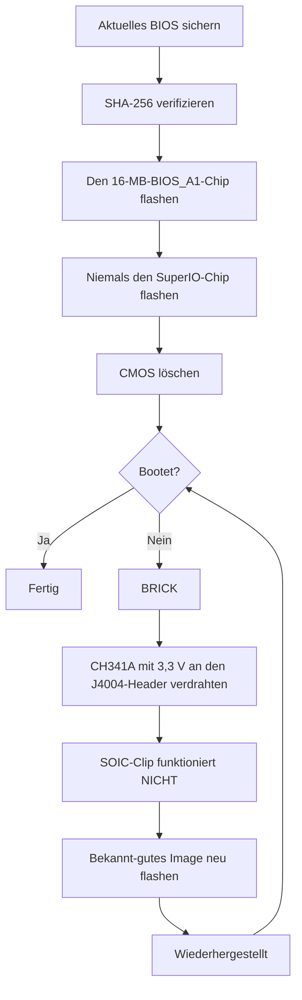

> 🌐 Community-Übersetzung. Die englische Version ist die maßgebliche Quelle und kann aktueller sein. Fehler gefunden? Öffne ein [Issue](https://github.com/lildebil0/awesome-bc250/issues). ([englisches Original](../en/08-bios.md))

# BIOS & Brick-Wiederherstellung

> **TL;DR** — Eine falsche BIOS-Einstellung kann die **BC-250 komplett bricken**, und auf diesem Board stellt ein CMOS-Reset es *nicht* immer wieder her ([src](https://t.me/c/2424231195/54971)). Bevor du *irgendetwas* flashst, verstehe das: Du brauchst ein **Hardware-Recovery-Kit** (einen **SPI-Programmer der CH341A-Klasse + Buchse-zu-Buchse-DuPont-Kabel**) griffbereit, denn das einzige zuverlässige Entbricken ist das externe Neuflashen des Chips über den **J4004-Header** des Boards. Der beliebte Community-Mod („death"-BIOS, neuester auf Basis von Stock **5.00**) schaltet Übertaktung, GDDR6-Timings und iGPU-Speicherzuteilung frei — nützlich, aber **nicht alle Einstellungen sind sicher, und manche bricken das Board sofort** ([src](https://t.me/c/2424231195/78922)). Verifiziere zuerst die **SHA-256** jedes Images und lies [`assets/firmware/DISCLAIMER.md`](../../assets/firmware/DISCLAIMER.md). **Flashe nicht leichtfertig.**

⚠️ **Das ist das gefährlichste Kapitel im Handbuch.** Flashen ist destruktiv und ohne Recovery-Hardware unumkehrbar. Wenn du nicht bereit bist, an einen SPI-Chip zu löten/klemmen, um einen Brick wiederzubeleben, **hör hier auf und betreibe das Stock-BIOS.**

---

## Was das BIOS auf der BC-250 ist

Die BC-250 ist ein von AsRock gebautes Mining-/Server-Board mit einer beschnittenen PS5-„Oberon"-APU. Ihre UEFI-Firmware sitzt auf einem **16-MB-SPI-Flash-Chip** (ein Winbond **W25Q128** / Macronix MX25L128 im 8-Pin-SOIC-Gehäuse). Die Stock-Firmware ist stark gesperrt: Im Setup ist fast nichts Nützliches freigegeben. Bekannte Stock-Versionen, die im Chat gesehen wurden, sind **3.00** und **5.00**; die modifizierten BIOSe werden aus diesen neu gebaut (die Versionsnummer ist dein Anker — notiere dir immer, auf welcher Basis ein Mod gebaut ist).

> Stock **4.00** existiert ebenfalls. Der einzige funktionelle Unterschied zwischen Stock **v4.0** und **v5.0** besteht darin, dass v5.0 standardmäßig **Netzwerk-Boot** aktiviert. ([Quelle](https://discord.com/channels/1315924807128449065/1316030225338863636/1326825429595848816))

Zwei Gründe, warum Leute neu flashen:

1. **Um ein modifiziertes BIOS zu installieren**, das versteckte Menüs freischaltet (Übertaktung, Undervolting, Speicher, iGPU-VRAM).
2. **Um einen Brick wiederherzustellen** — ein bekannt-gutes Image nach einer schlechten Einstellung oder einem fehlgeschlagenen Flash zurückspielen.

> 💡 **Vielleicht musst du gar nicht flashen.** Wenn dein *einziges* Ziel das Ändern des VRAM/UMA-Splits ist, kannst du das aus einem laufenden Linux mit dem **Stock**-P3.00-/P5.00-BIOS und **[fanoush/bc250_memcfg](https://github.com/fanoush/bc250_memcfg)** tun — kein Flashen, kein Programmer, kein Brick-Risiko ([elektricM: BIOS flashing](https://elektricm.github.io/amd-bc250-docs/bios/flashing/), [elektricM: VRAM](https://elektricm.github.io/amd-bc250-docs/bios/vram/)). Ein modifiziertes BIOS zu flashen ist nur für die *freigeschalteten Chipsatz-Menüs* und Features jenseits der VRAM-Größe nötig (siehe [09-overclock-undervolt.md](09-overclock-undervolt.md) für den `bc250_memcfg`-Befehl).

---

## Das modifizierte BIOS („death"-Mod) — was es ändert und warum

Der Referenz-Community-Mod wird von **death** im Chat gepflegt. Es ist *keine* von Grund auf neu gebaute Firmware — er reaktiviert (macht sichtbar) AMD/AMI-Setup-Optionen, die das Stock-BIOS versteckt ausliefert. Verfolge die Versionen, denn der Rat hat sich mit der Zeit geändert:

| Mod-Version | Basis | Veröffentlicht | Was es freigelegt / geändert hat | Status |
|---|---|---|---|---|
| **1.0** (erste Veröffentlichung) | Stock **3.00** | 2025-06-28 | GDDR6-Frequenz, GDDR6-Timings, iGPU-UMA-Speichergröße, Kernfrequenz, Spannungen | ⚠️ Schlechte Werte bricken das Board, **CMOS-Reset half nicht** ([src](https://t.me/c/2424231195/54971)) |
| 3.0-Varianten | 3.00 | 2025-07 → 10 | Gleiche Freischaltungen; ein Build fügte ein **eigenes Steam-Boot-Logo** hinzu | Kosmetischer Logo-Build gespiegelt als `bc250-Steam.rom` ([src](https://t.me/c/2424231195/86420)) |
| **5.00-Mod** (aktuell) | Stock **5.00** | 2025-10-05 | Tabs neu gruppiert; **mehr Einstellungen geöffnet**; **RAM/GDDR6-Timing-Einstellungen greifen jetzt tatsächlich** auf diesem Board | Neuester; „nicht alle Einstellungen sind nützlich, aber besser als nichts" ([src](https://t.me/c/2424231195/78922)) |

Was du damit tatsächlich tunen kannst (aus den Notizen zur Erstveröffentlichung, [src](https://t.me/c/2424231195/54971)):

- **GDDR6-Frequenz** — bei **1800** für einen Nutzer (`@Haswellb`) als funktionierend gemeldet, aber *dieselbe Art Änderung brickte ein anderes Board* — die Werte sind board-spezifisch, nicht universell.
- **GDDR6-Timings** — sie greifen, aber **zu niedrige/zu enge Timings bricken** das Board.
- **iGPU-Speicher (UMA)-Größe** — funktioniert und bringt einen echten Zuwachs. Wenn deine Änderung nicht greift, setze **IGC: Forces** und **UMA Mode: UMA_SPECIFIED** ([src](https://t.me/c/2424231195/54971); dieselbe Kombi durch die Community-Doku bestätigt).
- **Kernfrequenz / Spannungen** — freigegeben, aber **„nicht getestet"** vom Autor.

> ❗ **Zwei Autoren-Warnungen, weiterhin aktuell:** (1) **Deaktiviere Integrated Graphics nicht** — es ist die einzige Display-Ausgabe. (2) Bei jedem dieser Mods kann **eine falsche Einstellung das Board bricken und ein CMOS-Reset stellt es möglicherweise nicht wieder her** — genau deshalb brauchst du einen Programmer. (Siehe die „Welche Version?"-Leiter unten zur Wahl einer Basis.)

> ### Welche Version? (Entscheidungs-Leiter)
>
> 1. **Modifiziertes P3.00 (Chipsatz-Menü-ROM) — der sichere Standard.** Das ist der etablierte **„Community-Standard… am stabilsten und getestet"**, verifiziert-öffentlich mit bekannter SHA-256, und es deckt bereits **VRAM-Freischaltung + Chipsatz-Einstellungen** ab. Fang hier an, außer du hast einen bestimmten Grund, es nicht zu tun ([elektricM: BIOS flashing](https://elektricm.github.io/amd-bc250-docs/bios/flashing/)).
> 2. **Modifiziertes 5.00 — aktuell; nimm es, wenn du Speicher-Tuning willst.** Es ist die neueste Basis und die, bei der **RAM/GDDR6-Timing-Einstellungen tatsächlich greifen** auf diesem Board ([src](https://t.me/c/2424231195/78922)). Wähle es gegenüber P3.00 speziell dann, wenn du Speicher-Timings tunen willst.
> 3. **`P5.00_clv` — nur für Experten.** Es schaltet **Everything** frei (jedes versteckte Menü, einschließlich experimentellem **ReBAR / Resizable BAR** und Debug-/Chipsatz-Einstellungen), was es *„sehr leicht macht, das Board zu bricken, wenn du das Falsche änderst… Bleib bei P3.00, außer du bist ein fortgeschrittener Nutzer."* Schlimmer noch: **`P5.00_clv` ist in keinem öffentlichen Repo**, das der Guide finden konnte — es kursiert nur als Discord-Anhang, also **gibt es keinen kanonischen Hash**; wenn du es benutzen musst, besorge Kopien von **zwei** Leuten, die es unabhängig betreiben, und bestätige, dass beide die **gleiche SHA-256** haben, bevor du flashst ([elektricM: BIOS flashing](https://elektricm.github.io/amd-bc250-docs/bios/flashing/)).

> **Gemoddete 5.00-Eigenheiten, die man kennen sollte.** Das Setup zeigt eine **Standard-CPU-Frequenz von 3600** — ein kosmetischer UI-Wert, kein tatsächlich anliegender Takt ([src](https://discord.com/channels/1315924807128449065/1452152658168381593/1452406964780007515)). Es stellt auch eine **`x1x1x1x1` PCIe bifurcation**-Option in den Chipsatz-Einstellungen bereit ([src](https://discord.com/channels/1315924807128449065/1452152658168381593/1474231812598534351)). Besondere Vorsicht ist bei den Speicher-Timings auf dieser Basis geboten: **extreme Timing-Werte können das Board unbrauchbar machen, bis ein externer Reflash durchgeführt wird, und das schlägt bei P5.00 härter zu** ([src](https://discord.com/channels/1315924807128449065/1371527281947971604/1468745940994101372)). Und wie bei jedem Flash-Vorgang kann der Wechsel zur gemoddeten 5.00 dazu führen, dass **keine Bildanzeige erfolgt, bis das CMOS gelöscht wird** ([src](https://discord.com/channels/1315924807128449065/1315933088668454942/1508568321346502892)).

Es gibt außerdem einen separaten **Chipsatz-Menü-Mod** (`BC250_3.00_CHIPSETMENU.ROM`) aus dem meist-referenzierten BIOS-Repo, **[TuxThePenguin0/bc250-bios](https://gitlab.com/TuxThePenguin0/bc250-bios/)**, der das **Chipsatz-Menü / NBIO Common Options** zusätzlich zu Stock 3.00 freilegt. Die README dieses Repos sagt unmissverständlich: *„Nichts in diesem Repository wird unterstützt oder hat irgendeine Garantie — MACHT BACKUPS."*

> 🚫 **Vermeide `Smokeless_UMAF`.** Der Community-Overclocking-Guide markiert dieses UEFI-Editier-Tool als etwas, das man **auf der BC-250 nicht laufen lassen sollte — es kann dauerhaften Schaden am Board verursachen** ([elektricM: BIOS overclocking](https://elektricm.github.io/amd-bc250-docs/bios/overclocking/)). Bleib bei den bekannt-guten ROMs oben.

---

## Bevor du flashst — die Sicherheits-Checkliste

1. **Sichere zuerst dein aktuelles BIOS** (lies es mit demselben Tool aus, mit dem du flashen wirst — siehe Weg B/Wiederherstellung). Ein Backup ist dein kostenloses Rückgängig.
2. **Verifiziere die SHA-256** des Images gegen `assets/PROVENANCE.md` / den Quell-Post. Der Community-Flashing-Guide veröffentlicht den Hash für das Chipsatz-Menü-ROM als
   `48fbe5d366e6a56e2fdffdca848426216ba1f083610dab63db89d2f4e6c940b5` ([elektricM docs](https://elektricm.github.io/amd-bc250-docs/bios/flashing/)).
3. **Bestätige die Chip-Größe**, nicht nur die Beschriftung. Der 16-MB-BIOS-Chip ist das Ziel; flashe **nicht** den kleinen SuperIO-Chip (siehe den Wiederherstellungsabschnitt). Verschiedene Board-Revisionen können leicht unterschiedliche Chip-Teilenummern tragen — die **Kapazität (16 MB)** ist, was zählt, die letzten Buchstaben der Beschriftung können sich unterscheiden ([src](https://t.me/c/2424231195/67880)).
4. **Halte Recovery-Hardware bereit** *vor* dem ersten Flash, nicht nachdem du bereits gebrickt hast.
5. Nach dem Flashen **CMOS löschen**, damit neue Einstellungen (besonders die VRAM-Zuteilung) greifen (siehe „Nach jedem Flash").



### Die Prüfsumme vor dem Flashen verifizieren

Schritt 2 oben sagt, dass du die SHA-256 verifizieren sollst — hier ist, wie. Berechne den Hash der Datei, die du gleich flashen wirst, und vergleiche ihn Zeichen für Zeichen mit dem Wert, der für diese Datei in [`assets/PROVENANCE.md`](../../assets/PROVENANCE.md) gelistet ist.

```bash
# Linux:
sha256sum BC250_3.00_CHIPSETMENU.ROM
```

```powershell
# Windows (PowerShell):
Get-FileHash BC250_3.00_CHIPSETMENU.ROM -Algorithm SHA256
```

`PROVENANCE.md` listet eventuell nur die **ersten 16 Hex-Zeichen** als kurzen Fingerabdruck. Falls so, prüfe, dass dein berechneter Hash **mit** diesen 16 Zeichen **beginnt** — eine vollständige Übereinstimmung dieses Präfixes ist bereits eine starke Prüfung (der Maintainer kann auf Anfrage vollständige Hashes veröffentlichen).

**Verifizierte vollständige SHA-256-Hashes** für die öffentlich gehosteten Images (über mehrere Community-Repos gegengeprüft — jede bekannt-gute BC-250-BIOS-Datei ist **exakt 16 MB / 16777216 bytes**; eine andere Größe bedeutet, sie ist beschädigt, ein Tool/Patch oder nicht zugehörig) ([elektricM: BIOS flashing](https://elektricm.github.io/amd-bc250-docs/bios/flashing/)):

| Datei | Typ | SHA-256 |
|---|---|---|
| `BC250_3.00_CHIPSETMENU.ROM` (auch `Robin3.00`, `BC250CHIPSETMENU.ROM`) | **Modifiziertes P3.00** — VRAM + Chipsatz-Freischaltung, *empfohlen* | `48fbe5d366e6a56e2fdffdca848426216ba1f083610dab63db89d2f4e6c940b5` |
| `Robin5.00` | **Stock** P5.00 (nicht das modifizierte `P5.00_clv`) | `0d6f136cb120cf3b2de26d5c4d7f255604fdbf4b9442af5ba55419b95b89aa82` |
| `BC250_3.00.ROM` | Stock P3.00 | `07595ca3aecf8a4caa28a397b5298f3946a1b769f87b16f67adc369c3f69045c` |
| `BC250_2.00.bin` | Stock P2.00 | `ee6150dfed33bd05ea46063a352549416fdf3f45fa0e5edac2a68ef78d71083c` |
| `P5.00_clv` | Modifiziertes P5.00 (Alles-freischalten) | **kein öffentlicher Hash existiert** — nur Discord, verifiziere, dass zwei unabhängige Kopien übereinstimmen |

> Das modifizierte P3.00 taucht unter mehreren Dateinamen über die Repos hinweg auf (`BC250_3.00_CHIPSETMENU.ROM`, `BC250CHIPSETMENU.ROM`, `Robin3.00`) — sie hashen alle auf den Wert oben, also spielt der Name keine Rolle. `Robin5.00` ist das **Stock**-P5.00, eine *andere Datei* als das modifizierte `P5.00_clv`. Öffentliche Quellen für jede (TuxThePenguin0 GitLab, forgenam, tipitochen, csabakecskemeti, scrakcho, dannybastos, kenavru, MrrZed0) sind im [elektricM-Flashing-Guide](https://elektricm.github.io/amd-bc250-docs/bios/flashing/) gelistet.

> 🔴 **Wenn die Prüfsumme nicht übereinstimmt, NICHT flashen.** Eine Abweichung bedeutet eine beschädigte oder falsche Datei — sie zu flashen ist genau die Art, wie du das Board brickst. Lade das Image neu herunter und verifiziere erneut.

---

## Weg A — Software-Flash (vom Board, ohne Programmer)

Das ist der normale Weg, ein BIOS zu installieren/aktualisieren, solange das Board noch bootet. Verwende einen **FAT32-USB-Stick** und das AMI-Firmware-Update-Werkzeug.

**EFI- / AFU-Methode** ([src](https://t.me/c/2424231195/54979)):

1. Formatiere einen USB-Stick auf **FAT32**.
2. Kopiere den Inhalt des AFU-Archivs (z. B. `AfuEfi64_5.16.zip`) **und die BIOS-Datei** darauf.
3. Starte die BC-250 neu und **boote vom USB-Stick** in die EFI-Shell.
4. Führe aus:
   ```
   afuefix64.efi <filename>.<ext> /P /N
   ```
   - `/P` = das Haupt-BIOS programmieren.
   - `/N` = auch **NVRAM** programmieren. Das vermeidet Fehler beim Wechsel *zwischen* Versionen (z. B. auf 3.00 von einer anderen Version) — **aber es löscht deine gespeicherten Einstellungen.** Du kannst `/N` weglassen, aber dann sind mögliche Fehler zu erwarten. ([src](https://t.me/c/2424231195/54979))
5. Wenn das Tool die Datei nicht sieht, probiere `fs0:`, `fs1:`, … um herauszufinden, welche der Stick ist ([src](https://t.me/c/2424231195/54979)).

Manche Community-Builds liefern ein fertiges `Flash.nsh`-Skript und ein umbenanntes ROM (z. B. das modifizierte ROM passend zum Skript umbenennen), sodass du nur in die EFI-Shell bootest und das Skript ausführst ([elektricM docs](https://elektricm.github.io/amd-bc250-docs/bios/flashing/)). Unter Linux gibt es auch einen **`afulnx`**-Build (`afulnx-5.05.04Z.tar.gz`) zum Flashen aus einem laufenden System ([src](https://t.me/c/2424231195/54507)).

#### Kanonisches EFI-Shell-Rezept (die `Flash.nsh` / `Robin5.00`-Methode)

Der Community-Flashing-Guide standardisiert auf ein in sich geschlossenes Kit und einen festen Dateinamen — das ist der meist-reproduzierte USB-Weg ([elektricM: BIOS flashing](https://elektricm.github.io/amd-bc250-docs/bios/flashing/)):

1. **Hol das EFI-Kit:** `4U12G BIOS Update.zip` (aus dem [kenavru/BC-250](https://github.com/kenavru/BC-250)-Repo) — es enthält `AfuEfix64.efi`, `Flash.nsh` und `amdvbflash.efi`. *Es bündelt auch ein Stock-P5.00-BIOS namens `Robin5.00` — räum das aus dem Weg, damit du es nicht versehentlich flashst.*
2. **Bereite einen FAT32-Stick vor (≤ 32 GB empfohlen).** Kopiere den Inhalt des `BIOS EFI`-Ordners des Kits in das **Stammverzeichnis**.
3. **Benenne dein modifiziertes ROM in `Robin5.00` um** (lass die `.ROM`-Erweiterung weg) — das ist genau der Name, nach dem `Flash.nsh` sucht. *(Oder bearbeite `Flash.nsh` so, dass es zu deinem Dateinamen passt.)* Das Stammverzeichnis sollte dann enthalten: `AfuEfix64.efi`, `Flash.nsh`, `amdvbflash.efi`, `Robin5.00` (dein umbenannter Mod) und den `EFI`-Ordner.
4. **Verwende einen direkten DisplayPort-Monitor.** Aktive/passive **HDMI-Adapter können das BIOS-Menü auf Schwarz setzen** — eine bekannte Display-Falle auf diesem Board.
5. **Stöpsle alle SSDs/Laufwerke ab**, damit das Board automatisch in die EFI-Shell durchfällt, stecke den Stick ein, schalte ein. Du landest an einer gelben `Shell>`-Eingabeaufforderung.
6. An der Eingabeaufforderung tippe **`blk0:`** dann Enter — **beachte das Leerzeichen nach dem Doppelpunkt** (das wählt das USB-Volume; `blk0:` ist der von elektricM dokumentierte Selektor, verschieden vom `fs0:`/`fs1:`-Probing oben). Dann tippe **`Flash.nsh`** und Enter.
7. **WARTE. Berühre die Tastatur nicht, schalte nicht aus.** Wenn es während des Schreibens *scheinbar* hängt, **warte mindestens 15 Minuten** — ein Ausschalten mitten im Schreiben brickt das Board. Es startet neu (oder bittet dich darum), wenn fertig.
8. **Schalte sofort aus und entferne den Stick**, damit er nicht zurück in den Flasher schleift.

> 🔴 **Bevor du zum Flashen einschaltest: prüfe die 8-Pin-PCIe-Stromverdrahtung** gegen das 12-V/GND-Diagramm deines Netzteils. **Vertauschte Polarität kann das Board dauerhaft beschädigen** ([elektricM: BIOS flashing](https://elektricm.github.io/amd-bc250-docs/bios/flashing/)).

#### Erforderliche BIOS-Einstellungen nach dem Flash (gleich nach dem CMOS-Reset)

Nach dem Flashen **und** dem CMOS löschen (nächster Abschnitt) geh ins Setup (hämmere **Del**) und setze diese — der VRAM-Split verhält sich nicht richtig, bis sie stimmen ([elektricM: BIOS flashing](https://elektricm.github.io/amd-bc250-docs/bios/flashing/), [elektricM: BIOS VRAM](https://elektricm.github.io/amd-bc250-docs/bios/vram/)):

| Einstellung | Pfad | Wert |
|---|---|---|
| Integrated Graphics Controller | Chipset → GFX Configuration | **Forces** |
| UMA Mode | Chipset → GFX Configuration | **UMA_SPECIFIED** |
| UMA Frame Buffer Size | Chipset → GFX Configuration | **512MB** (empfohlen) oder eine feste Größe |
| IOMMU | Advanced → CPU Configuration | **Disabled** |
| Boot Mode | Boot → Boot Mode | **UEFI** |

Verifiziere zuerst, dass der CMOS-Reset tatsächlich gegriffen hat — die **Uhr sollte falsch gehen**; wenn sie noch stimmt, wiederhole den Reset. Dann F10 zum Speichern. Die `512MB`-Wahl ist *dynamische* Zuteilung, keine 512-MB-Obergrenze (siehe [09-overclock-undervolt.md](09-overclock-undervolt.md)).

> ★ **Warum 512 MB UMA FPS *bringt* (der Mechanismus).** Den UMA-Puffer auf **512 MB** zu setzen, hungert die GPU nicht aus — es lässt das System **RAM gegen VRAM dynamisch ausbalancieren**, anstatt eine große feste Scheibe wegzusperren, und allein dieses Rebalancing wurde einem echten FPS-Sprung zugeschrieben: Cyberpunk 2077 ging von **60 → 66 fps (bei 2 GHz OC) → 76 fps** unter FSR 3.0 *balanced*, 1080p, Steam-Deck-Preset ([Old Lamer — Part I](https://youtu.be/ohpEY2XQ_lo) ~11:21; ⚠ ungefähr — Zahlen aus dem Video transkribiert, behandle sie als Ergebnis eines einzelnen Builds). „512 MB ist am besten" ist also nicht nur sichere Dimensionierung — der kleine dynamische Puffer ist *Teil der* Performance-Geschichte, kein Kompromiss.

**flashrom-Notlösung** (falls AFU Fehler wirft) ([src](https://t.me/c/2424231195/54979), vorgeschlagen & getestet von `@mrartemsid`):

```bash
# Read (back up):
sudo flashrom -p internal:boardmismatch=force -r <name>.bin
# Write:
sudo flashrom -p internal:boardmismatch=force -w <name>.bin
```

> ⚠️ Software-Flashen hilft nur, **solange das Board noch POSTet**. In dem Moment, in dem eine schlechte Einstellung es brickt, ist Weg A weg und du bist auf dem Hardware-Weg unten.

---

## Weg B — Hardware-Flash / Entbricken (CH341A-SPI-Programmer)

Das ist der **Wiederherstellungs**-Weg und die angepinnte „bequemste Art, einen Brick zu flashen" ([src](https://t.me/c/2424231195/67880)). Du überschreibst den 16-MB-SPI-Chip direkt, von einem anderen PC aus, mit einem USB-SPI-Programmer. Verwendete Software: **NeoProgrammer** (Windows) oder **flashrom** (Linux).

> 🔴 **Der SOIC-8-Clip funktioniert NICHT auf diesem Board.** death ist da deutlich: *„der Clip auf unserem Board funktioniert… im Grunde überhaupt nicht."* ([src](https://t.me/c/2424231195/67880)). Hinweis: `assets/firmware/DISCLAIMER.md` erwähnt einen „SOIC-Clip" allgemein — in der Praxis musst du **stattdessen an den On-Board-J4004-Header verdrahten.** Das ist die wichtigste Wiederherstellungs-Tatsache in diesem Kapitel.

### J4004-Header-Pinbelegung (hier verdrahten)

Das Board legt einen **J4004-Header mit 2,54 mm Raster** speziell zum Neuflashen des SPI/BIOS-Chips offen. Pinbelegung (aus dem angepinnten Verdrahtungs-Screenshot, [src](https://t.me/c/2424231195/67880)):

```
J4004
[ GND  SCLK  MOSI  UNK ]
[ VCC  CS    MISO      ]
   ^  (pin-1 marker)
```

| J4004-Pin | Signal | CH341A-Pad |
|---|---|---|
| VCC | 3,3-V-Versorgung | VDD / 3.3V |
| GND | Masse | GND |
| CS | Chip-Select | CS / SS |
| SCLK | Takt | CLK / SCK |
| MOSI | Daten-Eingang (zum Chip) | MOSI |
| MISO | Daten-Ausgang (vom Chip) | MISO |

Die entsprechende **W25Q128-SOIC-8- / CH341A-Farbkarte** ist im selben angepinnten Screenshot — ordne `/CS, DO(MISO), CLK, DI(MOSI), VCC, GND` den `CS, MISO, CLK, MOSI, VDD, GND`-Pads des CH341A zu. **Prüfe VCC und GND dreifach**, bevor du einschaltest; sie zu vertauschen tötet den Chip ([src](https://t.me/c/2424231195/67880)).

> **J4004-Pin-Nummerierung & die zwei unbekannten Pins.** Der elektricM-Guide nummeriert den Header VCC=1, GND=2, CS=3, SCLK=4, MISO=5, MOSI=6, wobei **Pins 7 & 8 zum Flashen ungenutzt sind — sie sind über 10 kΩ Widerstände auf Masse gezogen.** Pin 1 (VCC) ist durch einen **Pfeil `>` oder ein quadratisches Pad** auf der Platine markiert ([elektricM: BIOS flashing](https://elektricm.github.io/amd-bc250-docs/bios/flashing/)).

> **Exakter Ziel-Chip & der Dichte-Tippfehler.** Das 16-MB-Bauteil ist ein Winbond **W25Q128JVSQ** (128 Mbit / 16 MB) oder, bei manchen Chargen, ein Macronix **MX25L12835F**. Manche Community-Doku vertippt sich hier als **„25Q168" — das ist falsch**; der korrekte 16-MB-Dichte-Code ist **128** ([elektricM: BIOS flashing](https://elektricm.github.io/amd-bc250-docs/bios/flashing/)). Wenn du über einen bloßen **SOIC-8-Clip** statt J4004 flashst, ist die Pin-Reihenfolge des Chips selbst das Standard-SPI-Layout: `1 CS · 2 DO · 3 WP · 4 GND · 5 DI · 6 CLK · 7 HOLD · 8 VCC` ([elektricM: BIOS recovery](https://elektricm.github.io/amd-bc250-docs/bios/recovery/)) — aber denk an deaths Befund, dass **der Clip auf diesem Board kaum funktioniert**, also bevorzuge J4004.

> 🙏 Credit: die J4004-Pinbelegung, das Reverse-Engineering und das modifizierte-Firmware-Image-Repo sind größtenteils **Segfaults** Arbeit (das P3.00-Chipsatz-Menü-ROM ist der „Segfault-Mod") ([elektricM: BIOS flashing](https://elektricm.github.io/amd-bc250-docs/bios/flashing/)).

### NeoProgrammer-Vorgehen (angepinnt) ([src](https://t.me/c/2424231195/67880))

1. Verbinde den Programmer mit **J4004** mittels Buchse-zu-Buchse-Kabeln gemäß der Pinbelegung. **Prüfe die Verdrahtung ~10×, besonders VCC und GND.** (Netzteil abgezogen.)
2. Öffne **NeoProgrammer**.
3. Führe die **Auto-Erkennung** des Chips aus und lies auch die Beschriftung auf dem Chip selbst.
4. **Vergleiche die Beschriftungen.** Wenn die letzten Buchstaben von der Liste abweichen, aber die **Kapazität übereinstimmt (16 MB)**, ist das in Ordnung.
5. **Lösche** den Chip.
6. **Öffne die BIOS-Datei** in der Software (Drag-and-Drop funktioniert).
7. **Schreibe** den Chip.
8. **Trenne die Kabel von J4004.**
9. Schalte das Board ein.

### flashrom-Äquivalent (Linux), abgeglichen mit Community-Doku

Der Community-Flashing-Guide verwendet einen **CH347**-Programmer und warnt vor billigen Schwarz-PCB-CH341A-Boards (nächster Abschnitt). Identifiziere den richtigen Chip — ziele auf den **16-MB-BIOS-Chip** (`BIOS_A1`), **niemals** auf den 512-KB-SuperIO (`SIO1_R`), der den SuperIO brickt, wenn geflasht ([elektricM docs](https://elektricm.github.io/amd-bc250-docs/bios/flashing/)):

```bash
# Detect / identify the chip:
sudo flashrom -p ch347_spi

# Back up the stock BIOS (twice, then diff to be sure the read is stable):
sudo flashrom -p ch347_spi -r backup_stock.bin
sudo flashrom -p ch347_spi -r backup_verify.bin

# Write the new image, then verify it read back identical:
sudo flashrom -p ch347_spi -w BC250_3.00_CHIPSETMENU.ROM
sudo flashrom -p ch347_spi -v BC250_3.00_CHIPSETMENU.ROM
```

(Verwende `-p ch341a_spi` für einen CH341A oder `serprog` für einen Raspberry Pi Pico anstelle von `ch347_spi`.) ⚠ Das `ch347_spi`- / `serprog`-Mapping für die exakte Verdrahtung *dieses* Boards stammt aus dem Community-Guide — `⚠ verify` gegen dein eigenes Programmer-Modell.

> **Die Erkennung sagt dir, auf welchem Chip du bist.** Wenn `flashrom -p …` **`Winbond W25Q128…`** oder **`Macronix MX25L128…`** meldet, bist du auf dem richtigen 16-MB-BIOS-Chip. Wenn es **`Macronix MX25L4005…` (512 KB)** meldet, **STOPP — du hängst am SuperIO-Chip** (`SIO1_R`); ihn zu flashen brickt Lüftersteuerung/Sensoren. Wechsle zum anderen Chip ([elektricM: BIOS flashing](https://elektricm.github.io/amd-bc250-docs/bios/flashing/)). Flashe mit dem **Netzteil aus der Steckdose gezogen** und entladenen Kondensatoren (tippe den Einschaltknopf ein paar Mal an) — das Board während eines Clip-Flashs zu versorgen ist *nicht* empfohlen ([elektricM: BIOS recovery](https://elektricm.github.io/amd-bc250-docs/bios/recovery/)).

### Die CH341A-3,3-V-Falle (lies das, sonst grillst du den Chip)

Viele billige **Schwarz-PCB-CH341A**-Programmer treiben ihre **Datenleitungen mit 5 V, obwohl VCC 3,3 V ist** — der BIOS-Chip der BC-250 ist ein **3,3-V**-Bauteil, also können 5 V auf den Datenleitungen ihn beschädigen. Das ist ein bekannter, gemessener Fehler auf manchen Boards (Fabians Board und ein identisches im Chat wurden per Spannungsmessung bestätigt) ([src](https://t.me/c/2424231195/100285)). Behebungen:

- Bevorzuge einen Programmer, der auf seinen Datenleitungen wirklich 3,3 V ist (z. B. **CH347**), **oder**
- Wende den **lötfreien CH341A-5V→3.3V-Datenleitungs-Fix** an: trenne die USB-5-V-Versorgungsleitung zum Chip und speise ihn stattdessen mit 3,3 V — siehe [sawyershepherd.org-Beitrag](https://sawyershepherd.org/post/solderless-ch341ab-fix-5v-to-33v-data-lines/) und [wej.k.vu CH341A-Fix](https://wej.k.vu/electronics/ch341a-mini-programmer-fix/) ([src](https://t.me/c/2424231195/100285)).

---

### Low-Level-Header, Debug & On-Board-Silizium

Über den J4004-Flash-Header oben hinaus trägt das Board mehrere weitere Header und einen bekannten Satz On-Board-Chips. Diese sind in der elektricM-Hardware-Doku reverse-engineered und sind nützlich zum CMOS-Löschen, Debug-Probing, zur Lüfterverdrahtung und um zu bestätigen, welcher Chip welcher ist, bevor du flashst. Pin-Werte wortwörtlich transkribiert aus ([elektricM: pinouts](https://elektricm.github.io/amd-bc250-docs/hardware/pinouts/)).

**CLRCMOS1 — Clear-CMOS-Jumper (3-Pin).** Das ist der Jumper, der in diesem Kapitel überall als „den CMOS-Jumper überbrücken" referenziert wird — hier seine Belegung:

| Position | Verhalten |
|---|---|
| Pins 1–2 | CR2032 versorgt CMOS (Standard) |
| Pins 2–3 | CMOS löschen |

> 💡 Wenn die [Checkliste vor dem Flash](#bevor-du-flashst--die-sicherheits-checkliste) und [„Nach jedem Flash"](#nach-jedem-flash--cmos-löschen-nicht-überspringen) dir sagen, „den CMOS-Jumper für ~20 Sekunden zu überbrücken", ist **CLRCMOS1** dieser Jumper: bewege ihn von Pins 1–2 auf Pins 2–3, warte, dann bewege ihn zurück. (Die CR2032 für 60+ s zu entfernen ist die Alternative.)

**TPMS1 — LPC-Debug-Header (18-Pin, 2,0 mm Raster):**

| Pin | Signal | Pin | Signal |
|---|---|---|---|
| 1 | PCICLK | 2 | GND |
| 3 | FRAME | 4 | SMB_CLK_MAIN |
| 5 | PCIRST# | 6 | SMB_DATA_MAIN |
| 7 | LAD3 | 8 | LAD2 |
| 9 | 3V | 10 | LAD1 |
| 11 | LAD0 | 12 | GND |
| 13 | (leer) | 14 | S_PWRDWN# |
| 15 | 3VSB | 16 | SERIRQ# |
| 17 | GND | 18 | GND |

> 💡 **Pin 9 (3V) ist nur live, wenn das Board eingeschaltet ist** — er funktioniert also als „System-an"-Erkennungssignal. Das macht ihn zu einem alternativen Sense-Punkt für Auto-Power-On- / echte ATX-Adapter-Bauten (Querverweis auf den [`AUTO_PWRON`-Jumper in 03-power-supply.md](03-power-supply.md)).

**J2 — JTAG/HDT-Debug-Header (20-Pin, 1,27 mm Raster, unbestückt, auf der Unterseite des Boards):**

| Pin | Signal | Pin | Signal |
|---|---|---|---|
| 1 | VDDIO | 2 | TCK |
| 3 | GND | 4 | TMS |
| 5 | GND | 6 | TDI |
| 7 | GND | 8 | TDO |
| 9 | TRST_L | 10 | PWROK_BUF |
| 11 | DBRDY3 | 12 | RESET_L |
| 13 | DBRDY2 | 14 | DBRDY0 |
| 15 | DBRDY1 | 16 | DBREQ_L |
| 17 | GND | 18 | TEST19 |
| 19 | VDDIO | 20 | TEST18 |

> TEST18, TEST19 und DBRDY0 sind floatend gelassen. Das ist die **einzige** Hardware-Reset-/Debug-Schnittstelle auf dem Board.

**I2C_HEADER1 (3-Pin):** `SCL · SDA · GND`. SCL ist der Pin **näher an den Stromsteckern**. Dieser Bus führt **PMBUS zu den Intersil-PMICs** — ein Zugangspunkt für Power-Telemetrie.

**CPU_FAN1 (4-Pin):** `PWM · Tach · 12V · GND`.

**J4003 — Multi-Lüfter-Header (16-Pin, 2×8, 2,54 mm):**

| Reihe 1 | 1 GND | 2 F1T | 3 F2T | 4 F3T | 5 F4T | 6 F5T | 7 DET | 8 (leer) |
|---|---|---|---|---|---|---|---|---|
| **Reihe 2** | 1 GND | 2 F1P | 3 F2P | 4 F3P | 5 F4P | 6 F5P | 7 GND | 8 GND |

Hier ist `T` = Tach und `P` = PWM, je Lüfter 1–5.

> 💡 **DET (Reihe 1, Pin 7) ist auf Masse gezogen, wenn das Board auf einem Lüfter- / Stromverteilungs-Board sitzt** — d. h. es erkennt den Träger. (Die BIOS↔Linux-Lüfternummerierung wird in [06-linux.md → Sensoren & Lüftersteuerung](06-linux.md#sensors--fan-control) behandelt; sie wird hier nicht dupliziert.)

**On-Board-Silizium (BOM).** Das Repo benennt `SIO1_R` und `BIOS_A1` bereits in den Flashing-Abschnitten, gab aber nie Teilenummern oder Größen an; diese Tabelle lässt einen Flasher bestätigen, welcher Chip welcher ist (das 16-MiB-Winbond ist das BIOS, das 512-KiB-Macronix ist der SuperIO — lass es in Ruhe):

| Bezeichner | Bauteil | Rolle |
|---|---|---|
| PUA1 | Intersil ISL69247 | Haupt-PMIC |
| PUIO1 | Intersil ISL95712 | Kernversorgungs-PMIC |
| PUA11… | Intersil ISL99360 | Smart Power Stages (Phasen) |
| M2U2 | NXP CBTL04083B | 2:1-PCIe-x4-Mux |
| U30 | Realtek RTL8111H | Ethernet-NIC (PCIe x1) |
| SU1 | AMD 218-0844029 | A68H „Bolton-D2H" FCH-Chipsatz |
| UIO1 | Nuvoton NCT6686D | SuperIO (der hwmon-Sensor-Chip) |
| BIOS_A1 | Winbond 25Q128JVSQ | 16-MiB-SPI-Flash = das **BIOS** (DIESEN flashen) |
| SIO1_R | Macronix MX25L4006E | 512-KiB-SPI-Flash = SuperIO-Programm (**NICHT flashen — brickt den SuperIO**) |

> Der hier genannte SuperIO-Sensor-Chip (Nuvoton **NCT6686D**) ist der, an den sich der Linux-`nct6687`/`nct6683`-Treiber bindet — siehe [06-linux.md](06-linux.md) für die Sensor-/Lüfter-Einrichtung.

**Firmware-Tooling (fortgeschritten).** Zwei Dienstprogramme tauchen immer wieder auf, um das Image zu untersuchen:

- **`psptool`** analysiert und extrahiert die AMD-Firmware-Blobs in einem BIOS-Dump. `psptool -E bios.bin` listet die Einträge auf; `psptool -X -d 0 -e 1 -o firmware.bin bios.bin` extrahiert die SMU-Firmware zur Analyse. ([bc250-collective/amd_smu_reverse_engineering](https://github.com/bc250-collective/amd_smu_reverse_engineering))
- **`Zentool`** patcht den CPU-Mikrocode — beispielsweise um den `RDRAND`-Befehl zu ersetzen. ([AMD-BC-250/documentation #1](https://github.com/AMD-BC-250/documentation/issues/1))

---

## Secure Boot & CSM (Boot-Voraussetzungen)

Füge diese zwei zur Liste der BIOS-Setup-Voraussetzungen hinzu — erforderlich, sonst **booten eigene/gepatchte Kernel nicht** (der 40-CU-Patch, der Frequenz-Patch usw.):

| Einstellung | Wert |
|---|---|
| Secure Boot | **Disabled** |
| CSM (Compatibility Support Module) | **Disabled** |

Quelle: [elektricM: boot troubleshooting](https://elektricm.github.io/amd-bc250-docs/troubleshooting/boot/).

---

## Die „srep"-Auto-Reset-Idee (experimentell — kein fertiges Feature)

Weil eine schlechte Einstellung das Board bricken kann und **ein CMOS-Reset es nicht behebt**, experimentierte death damit, eine **`srep`**-Routine ins BIOS einzubacken, um **Einstellungen bei einem Brick automatisch zurückzusetzen** — die Idee stammt ursprünglich von `@Jacky_Fish` ([src](https://t.me/c/2424231195/60552)). Das Konzept: das BIOS soll seine NVRAM-/`amdsetup`-Variablen auf Standardwerte zurückpatchen, optional nur, wenn Trigger-Dateien auf einem USB-Stick vorhanden sind (damit es nicht bei jedem Boot deine Einstellungen löscht). Stand des Chats: **das funktionierte noch nicht** — *„das Board gibt sich stur als kompletter Brick und nichts setzt sich zurück"* ([src](https://t.me/c/2424231195/60883)). Behandle jede „selbstheilendes BIOS"-Behauptung als **unbewiesen**; dein echtes Sicherheitsnetz bleibt der externe Programmer. `⚠ verify`, bevor du dich auf irgendeinen srep-Build verlässt.

---

## Nach jedem Flash — CMOS löschen (nicht überspringen)

Das Flashen des BIOS setzt gespeicherte Einstellungen **nicht** zurück, und mehrere Einstellungen (besonders die **VRAM/UMA-Zuteilung**) greifen erst, wenn du CMOS löschst. Ein Nutzer traf genau darauf: das BIOS zeigte die neue VRAM-Größe und „speicherte" sie, aber das OS (Bazzite) meldete weiterhin den alten 4-GB-RAM-/12-GB-VRAM-Split, bis CMOS gelöscht wurde ([src](https://t.me/c/2424231195/97290)). Wie löschen:

- **Entferne die CR2032-Knopfzelle für 60+ Sekunden** (empfohlen), **oder**
- **Überbrücke den CMOS-Jumper für ~20 Sekunden.** ([elektricM docs](https://elektricm.github.io/amd-bc250-docs/bios/flashing/))

> Beachte die Grenze: Ein CMOS-Reset behebt „Einstellungen griffen nicht" und *milde* schlechte Konfigurationen — aber auf der 1.0/3.00-Mod-Generation wurde berichtet, dass er einen echten Brick **nicht** wiederherstellt ([src](https://t.me/c/2424231195/54971)). Dafür siehe Weg B.

---

## Gespiegelte Firmware

Im Chat besprochene BIOS-Images sind unter `assets/firmware/` zur **Wiederherstellung/Bewahrung** gespiegelt (siehe [`DISCLAIMER.md`](../../assets/firmware/DISCLAIMER.md) und verifiziere die SHA-256 jeder Datei in `PROVENANCE.md` vor dem Flashen):

| Datei | Größe | Was es ist | Quelle |
|---|---|---|---|
| `BC250_3.00.ROM` | 16 MB | Stock-3.00-Dump | ([src](https://t.me/c/2424231195/5215)) |
| `BC250_3.00_CHIPSETMENU.ROM` | 16 MB | Chipsatz-Menü-Mod (TuxThePenguin0) | ([src](https://t.me/c/2424231195/86395)) |
| `dump_5.00.bin` | 16 MB | Stock-5.00-Dump | ([src](https://t.me/c/2424231195/24661)) |
| `BC250_5.00_clv.zip` | 16 MB | **deaths 5.00-Mod (aktuell)** | ([src](https://t.me/c/2424231195/78922)) |
| `bc250_3.00_clv1.zip` | 16 MB | deaths erster 3.00-Mod (1.0) | ([src](https://t.me/c/2424231195/54971)) |
| `bc250-Steam.rom` | 16 MB | 3.0-Mod mit Steam-Boot-Logo | ([src](https://t.me/c/2424231195/86420)) |
| `bc250 modded bios.ROM` | 16 MB | Frühes modifiziertes Image | ([src](https://t.me/c/2424231195/30100)) |
| `my_4.0_MODED.bin` | 16 MB | Zwischenzeitlicher 4.0-Mod | ([src](https://t.me/c/2424231195/45580)) |
| `W25Q128BV@WSON8_…BIN` | 16 MB | Roher Chip-Read (W25Q128) | ([src](https://t.me/c/2424231195/5217)) |
| `AfuEfi64_5.16.zip` | — | AMI-AFU-EFI-Flasher | ([src](https://t.me/c/2424231195/54979)) |
| `afulnx-5.05.04Z.tar.gz` | — | AMI-AFU-Linux-Flasher | ([src](https://t.me/c/2424231195/54507)) |

> Flashe kein PS5-BIOS (`PS5 Disk Edition … BIOS.bin`, 2 MB) oder die 512-KB-Chips auf den 16-MB-BIOS-Chip der BC-250 — falsches Ziel, siehe die Wiederherstellungs-Warnungen.

---

## Quellen

- deaths Mod — erste Veröffentlichung (3.00) — https://t.me/c/2424231195/54971 · aktuell (5.00) — https://t.me/c/2424231195/78922 · Steam-Logo-Build — https://t.me/c/2424231195/86420
- Software-Flash (AFU `/P /N`, flashrom) — https://t.me/c/2424231195/54979 · afulnx — https://t.me/c/2424231195/54507
- Hardware-Entbricken (angepinnt, NeoProgrammer + J4004-Verdrahtungs-Screenshots) — https://t.me/c/2424231195/67880
- srep-Auto-Reset-Idee — https://t.me/c/2424231195/60552 · Ergebnis (funktionierte nicht) — https://t.me/c/2424231195/60883
- CMOS-Reset-nach-Flash nötig — https://t.me/c/2424231195/97290
- CH341A-5V→3.3V-Datenleitungs-Falle — https://t.me/c/2424231195/100285 · Fix-Beitrag — https://sawyershepherd.org/post/solderless-ch341ab-fix-5v-to-33v-data-lines/
- Meist-referenziertes BIOS-Repo — [TuxThePenguin0/bc250-bios](https://gitlab.com/TuxThePenguin0/bc250-bios/) (`BC250_3.00_CHIPSETMENU.ROM`, `CHIPSETMENU.md`)
- Community-Flashing-/Recovery-Guide (verifizierte SHA-256-Tabelle, `Flash.nsh`/`Robin5.00`-Rezept, `blk0:`-Selektor, DisplayPort/HDMI-Falle, 15-Minuten-Hang-Regel, J4004-Pinbelegung + Pins 7/8, W25Q128JVSQ/„25Q168"-Tippfehler, CH347, Setup-Werte nach dem Flash, Segfault-Credit) — [elektricM: BIOS flashing](https://elektricm.github.io/amd-bc250-docs/bios/flashing/)
- Recovery-Guide (SPI-8-Pin-Pinbelegung, MX25L4005 = SuperIO-Erkennung, Flashen mit abgezogenem Netzteil, Szenario-Durchläufe) — [elektricM: BIOS recovery](https://elektricm.github.io/amd-bc250-docs/bios/recovery/)
- Board-Pinbelegungen & On-Board-Silizium (CLRCMOS1, TPMS1 LPC, J2 JTAG/HDT, I2C_HEADER1, CPU_FAN1, J4003 Multi-Lüfter, Intersil/NXP/Realtek/Nuvoton/Winbond/Macronix BOM) — [elektricM: pinouts](https://elektricm.github.io/amd-bc250-docs/hardware/pinouts/)
- VRAM-Guide (`bc250_memcfg` flashlose Dimensionierung, UMA-Frame-Buffer-Werte, Kernel-Parameter-VRAM, Vulkan-vs-OpenGL-Meldung) — [elektricM: BIOS VRAM](https://elektricm.github.io/amd-bc250-docs/bios/vram/)
- ★ 512 MB UMA → dynamische RAM/VRAM-Balance → FPS-Gewinn-Mechanismus (Cyberpunk 60 → 66 @ 2 GHz OC → 76 fps, FSR 3.0 balanced, 1080p, Steam-Deck-Preset) — [Old Lamer — Part I](https://youtu.be/ohpEY2XQ_lo) ~11:21 (⚠ ungefähr, aus Video transkribiert)
- `Smokeless_UMAF`-Gefahrenhinweis — [elektricM: BIOS overclocking](https://elektricm.github.io/amd-bc250-docs/bios/overclocking/)
- Flashloses VRAM-Tool — [fanoush/bc250_memcfg](https://github.com/fanoush/bc250_memcfg)
- Speicher-Timing-Werkzeug — `Mem_Timing_Utility.zip` https://t.me/c/2424231195/55351
- Firmware-Spiegelungs-Richtlinie — [`assets/firmware/DISCLAIMER.md`](../../assets/firmware/DISCLAIMER.md)

> Übertakten/Undervolting *unter Verwendung* dieser freigeschalteten Einstellungen wird in [09-overclock-undervolt.md](09-overclock-undervolt.md) behandelt. Gespiegelte BIOS-Images liegen unter `assets/firmware/` mit per-Datei-SHA-256 in `PROVENANCE.md`.
