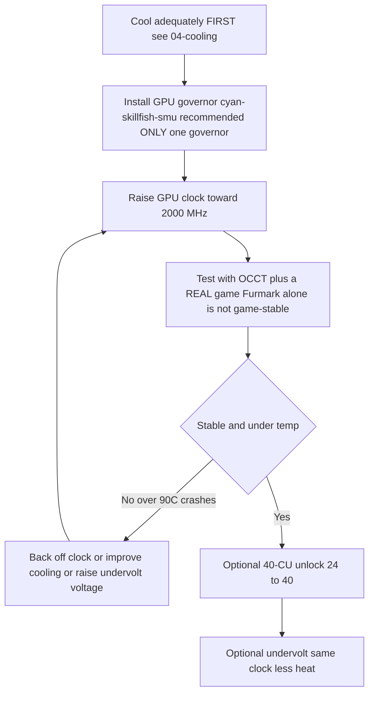

> 🌐 Community-Übersetzung. Die englische Version ist die maßgebliche Quelle und kann aktueller sein. Fehler gefunden? Öffne ein [Issue](https://github.com/lildebil0/awesome-bc250/issues). ([englisches Original](../en/09-overclock-undervolt.md))

# Overclocking & Undervolting

> **TL;DR** — Out of the box läuft die GPU der BC-250 langsam (oft auf **1500 MHz** festgenagelt, ~schwach). Der Community-Fix ist ein **Governor**, der die Takte/Spannung überschreibt: der heute empfohlene ist **[cyan-skillfish-governor-smu](https://github.com/filippor/cyan-skillfish-governor)** (braucht keinen Kernel-Patch, paketiert auf Arch/CachyOS/Bazzite/Fedora); **[oberon-governor](https://gitlab.com/mothenjoyer69/oberon-governor)** ist das Original und funktioniert weiterhin. Beide editierst du, um die GPU auf **2000 MHz (~+30 % FPS)** zu treiben. Das neuere **[bc250_smu_oc](https://github.com/bc250-collective/bc250_smu_oc)**-Toolkit übertaktet auch die **CPU** (empfohlen **4 GHz @ 1275 mV**). Separat re-aktiviert der **[40-CU-Unlock](https://github.com/duggasco/bc250-40cu-unlock)** die **24 → 40 Compute Units**, die AMD in der Firmware deaktiviert hat — ein größerer GPU-Gewinn als Takte allein (ein Superposition-Lauf ging **4647 → 6863** Punkte, ([src](https://t.me/c/2424231195/137035))). **Das alles ist Hitze. Kühle das Board zuerst** — siehe [04-cooling.md](04-cooling.md) — denn OC ohne ausreichende Kühlung crasht und resettet das Board oberhalb von ~90 °C.

Das ist der **letzte** Schritt des Golden Path, nicht der erste. Bring ein stabiles, kühles Board zum Laufen ([06-linux.md](06-linux.md), [04-cooling.md](04-cooling.md)), bevor du irgendetwas davon anfasst. Alles hier ist „auf eigene Gefahr" — die Community sagt das wiederholt ([src](https://t.me/c/2424231195/106844)).

---

## Die vier Hebel (und was jeder wert ist)

Die BC-250 hat **vier** unabhängige Dinge, die du tunen kannst. Sie stapeln sich:

| Hebel | Tool | Typischer Gewinn | Hitze-Kosten |
|-------|------|--------------|-----------|
| **GPU-Takt** 1500 → 2000 MHz | Governor (cyan-skillfish-smu / oberon) | **~+30 % FPS** wenn GPU-bound | hoch |
| **GPU-Undervolt** bei festem Takt | derselbe Governor | gleiche FPS, **viel kühler** | *negativ* (weniger Hitze) |
| **CPU-Takt** 3,5 → 4,0 GHz | `bc250_smu_oc` | hilft CPU-bound-Spielen | hoch |
| **40-CU-Unlock** 24 → 40 CUs | `bc250-40cu-unlock` | **bis zu ~+48 %** GPU-Arbeit | hoch |

Zwei ehrliche Vorbehalte aus dem Chat, bevor du anfängst:

- **Die meisten BC-250-Spiele sind CPU-bound, nicht GPU-bound.** Die GPU von 2000 → 2229 MHz zu pushen brachte einem Tester *1 fps* in Shadow of the Tomb Raider (90 → 91), während Strom und Temps hart hochsprangen — die Schlagzeile „+30 %" landet also nur in der Handvoll Titel, in denen die GPU der Engpass ist ([src](https://t.me/c/2424231195/67029)).
- **Hitze skaliert schlechter als Leistung.** Derselbe Tester: 2000 MHz @ 960 mV = **75 °C** in einem Stresstest; 2229 MHz @ 1030 mV = **93 °C** — und er ruderte zurück, weil sein Netzteil und Kühler es nicht halten konnten ([src](https://t.me/c/2424231195/66972), [src](https://t.me/c/2424231195/67029)).

> ⚠️ **Sicherheits-Untergrenze.** Das Throttling beginnt um **85 °C**, und das Board crasht hart / resettet sich um **90 °C** (siehe [04-cooling.md](04-cooling.md)). Wenn du unter Last ~85 °C überschreitest, bist du *über* deinem Kühlungs-Budget — senk den Takt oder undervolte, push nicht höher.



---

## Schritt 1 — GPU-Takt & Undervolt: der Governor

Der amdgpu-Treiber der BC-250 legt kein normales sysfs-Overclocking offen. Die Community-Lösung ist ein **Governor** — ein kleiner Daemon, der Takt-/Spannungs-States direkt schreibt. Für eine Neuinstallation heute ist der empfohlene **cyan-skillfish-governor-smu**; **oberon-governor** ist das Original und funktioniert weiterhin (unten als etablierte Alternative beibehalten).

<p align="center"></p>
<sub>📈 Editierbare Quelle: <a href="../../assets/diagrams/gpu-clock-tradeoff.drawio">gpu-clock-tradeoff.drawio</a> (öffnen in <a href="https://draw.io">draw.io</a>). Grün = Gewinn, rot = Kosten.</sub>

### cyan-skillfish-governor-smu (empfohlen)

[filippor/cyan-skillfish-governor](https://github.com/filippor/cyan-skillfish-governor), SMU-Branch — treibt Takt/Spannung über **SMU-Firmware-Calls** an, braucht also **keinen Kernel-Frequenz-Patch auf irgendeiner Distro**, wird aktiv gepflegt und ist auf jeder großen Distro paketiert. Er fügt außerdem **Memory-Controller-Power-Profile**-Steuerung hinzu, was die Idle-TDP auf **~30–35 W** senkt (kühler und leiser im Leerlauf) ([src](https://t.me/c/2424231195/125821)).

**Installation (auf jeder großen Distro paketiert)** — COPR `filippor/bazzite` (Fedora/Bazzite) oder AUR `cyan-skillfish-governor-smu` (Arch/CachyOS); Debian/Ubuntu verwenden den Release-Tarball + `sudo ./scripts/install.sh`:

```bash
# Fedora / Bazzite (COPR):
sudo dnf copr enable filippor/bazzite
sudo dnf install cyan-skillfish-governor-smu        # rpm-ostree install … auf Bazzite
sudo systemctl enable --now cyan-skillfish-governor-smu.service

# Arch / CachyOS (AUR):
paru -S cyan-skillfish-governor-smu                  # oder: yay -S …
sudo systemctl enable --now cyan-skillfish-governor-smu.service
```

Der SMU-Branch kann auch aus Quelle mit `cargo build --release` gebaut werden. **Setz deinen Takt & deine Spannung** in `/etc/cyan-skillfish-governor-smu/config.toml` (Schema unten) — um vom schwachen Default zum Community-Sweet-Spot zu kommen, heb den obersten Safe-Point Richtung **2000 MHz** und dreh die Spannung herunter, bis es stabil ist (siehe Undervolting unten); starte den Dienst nach jeder Bearbeitung neu.

> **Prüf, dass es griff.** Beobachte Live-Takte/-Temps mit `amdgpu_top`, MangoHud oder LACT, während du die GPU belastest. Wenn die Takte bei ~1500 MHz bleiben, läuft der Dienst nicht, oder deine Config wurde nicht geparst — `sudo systemctl status cyan-skillfish-governor-smu`.

> Fahr **einen** Governor zur Zeit — wenn du zuvor oberon gefahren hast, deaktiviere ihn, bevor du cyan-skillfish aktivierst, sonst streiten sie sich um dieselben Register.

> 🔇 **Tuning für eine leise Wohnzimmer-Konsole.** Maxing out (2000 MHz GPU / 4000 MHz CPU) bringt in CPU-bound-Spielen wenig, kostet aber viel Hitze, Lüfter-Lärm und Watt. Ein r/BC250Gaming-(Reddit-)Community-Bericht fand, dass ein balanciertes **~1600 MHz GPU / ~3500 MHz CPU** eine viel bessere Leistung-pro-Lärm-pro-Watt fürs alltägliche Gaming gibt — nahezu lautlos und kühl, mit FPS, die sich halten, weil die meisten Titel ohnehin nicht GPU-bound sind (siehe den CPU-bound-Vorbehalt oben). Wenn dir eine leise, kühle Kiste wichtiger ist als Chart-stürmende Benchmarks, setz diese als deine Governor-Obergrenzen statt das Maximum.

### oberon-governor (das Original — funktioniert weiterhin)

[mothenjoyer69/oberon-governor](https://gitlab.com/mothenjoyer69/oberon-governor) — ein C++-Daemon, der erste BC-250-Governor und der am meisten getestete; er funktioniert weiterhin, aber anders als der SMU-Governor verlässt er sich auf den Extended-Frequency-Kernel-Patch (oder eine Distro, die ihn mitliefert), um die obersten Takte zu erreichen. Laut seinem README hängt er von **CMake, einem C++-Toolchain und libdrm** ab und ist **nur auf der ASRock BC-250 getestet**. Viele Distros liefern ihn vorgefertigt (Arch AUR, ein Fedora COPR, die Bazzite-Images), also ist das Bauen aus Quelle nur nötig, wenn deine Distro kein Paket hat.

**Aus Quelle bauen** (passt zur im Chat reproduzierten Sequenz, ([src](https://t.me/c/2424231195/54666)) und zum Standard-CMake-Ablauf des Repos):

```bash
# Abhängigkeiten (Arch-Beispiel — pro Distro anpassen)
sudo pacman -S --needed base-devel cmake pkgconf make libdrm glibc linux-api-headers

git clone https://gitlab.com/mothenjoyer69/oberon-governor.git && cd oberon-governor
sudo cmake . && sudo make && sudo make install
sudo systemctl enable --now oberon-governor.service
```

> Wenn `cmake` Fehler wirft, war der Chat-Fix schlicht, die fehlenden Build-Abhängigkeiten zu installieren und erneut auszuführen: `sudo pacman -S pkgconf cmake` dann neu bauen ([src](https://t.me/c/2424231195/54666)).

**Setz deinen Takt & deine Spannung.** oberon liest eine YAML-Config:

```bash
sudo nano /etc/oberon-config.yaml      # Min-/Max-Frequenz und Spannung anpassen
sudo systemctl restart oberon-governor # anwenden
```

Die Datei lässt dich **maximale und minimale Spannung und Frequenz** für die GPU-States setzen (laut Repo-README). Heb die Max-Frequenz Richtung **2000 MHz** und dreh die Spannung herunter, bis es stabil ist. Starte den Dienst nach jeder Bearbeitung neu. Um später auf den SMU-Governor zu migrieren: stoppe+deaktiviere+entferne `oberon-governor`, `rm /etc/oberon-config.yaml`, dann installiere und aktiviere den SMU-Dienst.

#### TT vs. SMU — die zwei cyan-skillfish-Varianten

> Der empfohlene SMU-Build oben ist eine von **zwei** cyan-skillfish-Varianten. SMU ist der Default; die TT-Variante ist die Alternative für alle, die speziell den Kernel-Patch-/sysfs-Weg wollen ([elektricM: governor](https://elektricm.github.io/amd-bc250-docs/system/governor/)):

> **`perf_profile` — die Speichercontroller- / Infinity-Fabric-Stufe (getrennt von der GPU-Kurve).** Die SMU stellt einen Performance-Profil-Index `0–3` bereit: **3** ist die höchste Speichercontroller- / Infinity-Fabric-Leistung, während **1** das empfohlene Low-Power-Profil für den niedrigsten Leerlaufpunkt ist. Der Governor erzwingt dies automatisch auf **3**, sobald die CPU-Last `cpu-load-target.upper` überschreitet. ([bc250-collective/cyan-skillfish-governor](https://github.com/bc250-collective/cyan-skillfish-governor))

| Variante | Dienst | Wie sie Takte setzt | Kernel-Patch? | Veröffentlicht / Notizen |
|---|---|---|---|---|
| **SMU** *(empfohlen)* | `cyan-skillfish-governor-smu` | SMU-**Firmware-Calls** | **Nein — funktioniert auf jeder Distro ungepatcht** | 2026-01-18; erreicht 2300+ MHz; CPU ~0,9–1,3 % |
| **TT** (Alternative) | `cyan-skillfish-governor-tt` | sysfs | **Ja** (in Bazzite vorintegriert) | Thermal-Throttling-bewusst; erreicht 2175+ MHz |

> **Dienst-Umbenennung (2025-12-13):** filippor benannte `cyan-skillfish-governor` → `cyan-skillfish-governor-tt` um, und das Config-Verzeichnis wanderte `/etc/cyan-skillfish-governor/` → `/etc/cyan-skillfish-governor-tt/`. Beim Upgraden kopiere deine alte `config.toml` herüber ([elektricM: governor](https://elektricm.github.io/amd-bc250-docs/system/governor/)). Die TT-Variante ist im selben COPR/AUR paketiert (`cyan-skillfish-governor-tt`) und in Bazzite vorintegriert.

> 🔴 **700 mV ist eine harte Untergrenze.** Die *minimale* GPU-Spannung des Governors unter **700 mV zu setzen sperrt die GPU zurück auf 1500 MHz** — es macht den ganzen Sinn zunichte. Halte die Min-Spannung in jedem Governor ≥ 700 mV ([elektricM: governor](https://elektricm.github.io/amd-bc250-docs/system/governor/), [elektricM: BIOS overclocking](https://elektricm.github.io/amd-bc250-docs/bios/overclocking/)).

> 🔴 **~1100–1129 mV ist die Obergrenze — das Gegenstück zur 700-mV-Untergrenze.** Push die *maximale* GPU-Spannung des Governors nicht über das werkseitige `OD_RANGE`-Maximum von **1129 mV**; darüber hinaus ist **Silizium-Degradations-Risiko ohne Stabilitätsgewinn**. Die konservative luftgekühlte Obergrenze liegt bei rund **1100 mV (hohes Risiko darüber)**, und nur Flüssigkeitskühlung rechtfertigt die **1125-mV**-Top-Stufe (Tabelle unten). Wenn eine Kurve mehr als ~1129 mV braucht, um stabil zu sein, ist der eigentliche Fix *Kühlung oder ein niedrigerer Takt*, nicht mehr Volt ([elektricM: BIOS overclocking](https://elektricm.github.io/amd-bc250-docs/bios/overclocking/)).

> **Verifiziere, dass die richtige GPU anvisiert wird.** Der Governor steuert je nach System eventuell `card0` oder `card1` — `ls /sys/class/drm/ | grep card`. Wenn Einstellungen nicht greifen, musst du die Config eventuell auf die richtige Karte zeigen lassen. Auf Arch/CachyOS aktiviert sich der Governor manchmal erst, wenn die GPU zuerst genutzt wird — fahr einmal nach dem Boot ein Spiel/Benchmark ([elektricM: governor](https://elektricm.github.io/amd-bc250-docs/system/governor/)).

#### Das cyan-skillfish-smu-Config-Schema (Section-basiertes TOML)

Der `smu`-Branch verwendet ein **Section-basiertes** Schema, **nicht** das ältere `safe-points = [...]`-Array — jeder Kurvenpunkt ist seine eigene `[[safe-points]]`-Tabelle. Schlüsselfelder ([elektricM: governor](https://elektricm.github.io/amd-bc250-docs/system/governor/)):

```toml
# /etc/cyan-skillfish-governor-smu/config.toml
[timing.intervals]
sample = 500          # µs; erhöhen (z. B. 1000) um CPU-Overhead zu senken, adjust = sample*400 halten
adjust = 200_000
[gpu-usage]
fix-metrics = true    # behebt den MangoHud-"655 %"-GPU-Usage-Bug auf der BC-250
method  = "busy-flag"
[gpu]
set-method = "smu"    # "smu" oder "kernel"
[load-target]
upper = 0.80          # Bruchteile, keine Prozente
lower = 0.65
[temperature]
throttling = 85       # °C
throttling_recovery = 75

[[safe-points]]
frequency = 1000
voltage   = 800
[[safe-points]]
frequency = 2000
voltage   = 1000      # gaming
[[safe-points]]
frequency = 2200
voltage   = 1000      # viele Boards halten hier flache 1000 mV; pro Board nur erhöhen, wenn es crasht
```

> **Tuning-Reihenfolge bei Instabilität: Kühlung → Frequenz → *dann* Spannung.** Auf werkseitiger Kühlung ist die eigentliche Ursache fast immer Hitze (95 °C+). Senk die obersten `[[safe-points]]`-Blöcke, um die Frequenz zu deckeln, bevor du Spannung hinzufügst; nur wenn die Temps in Ordnung sind und es bei 2150–2200 MHz immer noch crasht, erhöhe den **obersten Punkt allein** um +15–25 mV. Über ~1075 mV bei 2200 MHz fügst du nur Hitze hinzu — senk stattdessen die Frequenz ([elektricM: governor](https://elektricm.github.io/amd-bc250-docs/system/governor/)).

> **GPU-Reset-Schwarzbild, governor-spezifisch.** Wenn die GPU crasht, *während der Governor aktiv sysfs schreibt*, kann der Reset nicht abschließen und du bekommst ein dauerhaftes Schwarzbild (System noch über SSH am Leben), das einen harten Reboot braucht. Workaround: `systemctl stop` den Governor vor bekannt-crash-anfälligen Spielen; der eigentliche Fix ist eine stabile Kurve ([elektricM: governor](https://elektricm.github.io/amd-bc250-docs/system/governor/)).

##### Wie der SMU-Governor über 2230 MHz hinaus pusht — und warum er deaktiviert ausgeliefert wird

Weil der SMU-Branch direkt mit der SMU-Firmware spricht statt über die amdgpu-`OD_RANGE`, kann er **Oberons harte 2230-MHz-Grenze überschreiten** — ein Walkthrough trieb ihn auf **≈2700 MHz** auf einem einzelnen Board ([Old Lamer — Part XII](https://youtu.be/Chzxaryjncs)). Genau dieser Spielraum ist der Grund, warum filippor ihn vorsichtig ausliefert:

> 🔴 **Die Default-Config des SMU-Governors kann beim Boot zum Schwarzbild führen — deshalb wird er NICHT auto-startend ausgeliefert.** filippor lässt den Dienst nach der Installation absichtlich deaktiviert, sodass eine schlechte Default-Kurve dich beim Boot nicht aussperren kann; du bekommst die Chance, **die Kurve zuerst zu tunen und zu testen, dann `systemctl enable`** zu setzen, sobald sie auf deinem Board stabil ist. Aktiviere ihn, *bevor* du eine Kurve validiert hast, und ein Schwarzbild beim nächsten Boot geht auf deine Kappe ([Old Lamer — Part XII](https://youtu.be/Chzxaryjncs)). *(⚠ Werte auto-untertitelt — behandle die exakten MHz als ungefähr.)*

Anders als Oberons harter Frequenz-Abfall bei Überhitzung **rampt der SMU-Governor allmählich auf ein Temperatur-Ziel zu**. Der Walkthrough legt außerdem zusätzliche `config.toml`-Felder über das obige Schema hinaus offen ([Old Lamer — Part XII](https://youtu.be/Chzxaryjncs)):

```toml
# zusätzliche Tuning-Stellschrauben aus dem Part-XII-Walkthrough
[ramp-rates]
normal = 1
burst  = 50
[gpu-usage]
burst-samples = 60
down-events   = 5
[frequency-thresholds]
adjust = 10
[temperature]
throttling_recovery = 80
```

> ⚠️ **Autor-experimentelle 16-Punkt-Luftkurve — NICHT empfohlen, überschreitet die Luft-Obergrenze dieses Guides.** Der Part-XII-Autor fuhr diese Kurve auf Luft, aber ihre obersten Punkte (2333–2400 MHz bei 1120–1150 mV) liegen **über den konservativen luftgekühlten Limits, die in Schritt 3 dokumentiert sind** (≈2230 MHz / 1060 mV auf Luft; 1125 mV ist eine *nur-Flüssigkeit*-Stufe). Sie wird als Referenz gezeigt, nicht als Ziel — auf Luft stopp dort, wo die Kühlklassen-Tabelle in Schritt 3 es sagt:
>
> ```toml
> # ⚠ autor-experimentell, luftgekühlt — NICHT blind kopieren (überschreitet die Luft-Obergrenze)
> # Frequenz (MHz) @ Spannung (mV)
> 1000@800,  1175@850,  1500@900,  1700@920,
> 2000@960,  2100@1000, 2150@1035, 2200@1050,
> 2250@1070, 2300@1090, 2333@1120, 2400@1150
> ```
>
> Am oberen Ende dieser Kurve zog **2,4 GHz ~30 A ≈ 360 W** — genug, dass es **Dual-Molex / eine zweite Board-Einspeisung** braucht ([03-power-supply.md](03-power-supply.md)), nicht einen einzelnen Anschluss. Superposition skalierte **≈4200 bei 2,2 GHz → ≈4500 bei 2,4 GHz** ([Old Lamer — Part XII](https://youtu.be/Chzxaryjncs)). *(⚠ alle Werte auto-untertitelt — ungefähr.)*

#### GPU-Frequenz-Bereich-Kernel-Patch (nur für TT / manuelles sysfs)

Der werkseitige GPU-Bereich des amdgpu-Treibers ist **1000–2000 MHz**; ein einzeiliger Treiber-Patch (von **ViRazY**, `linux-6.12-bc250-freq.mypatch`, ~**639 Bytes**, getestet auf Kerneln **6.12 / 6.15 / 6.16.x**) erweitert ihn auf **350–2230 MHz** (350 MHz Deep-Idle spart Strom; das obere Ende ermöglicht 2230+-Overclocks). **Bazzite, PikaOS und die Arch-AUR-Kernel liefern ihn vorgepatcht**, und der **SMU-Governor umgeht den Bedarf danach komplett** über Firmware-Calls — du patchst also nur manuell, wenn du den TT-Governor oder rohes sysfs-OC mit dem erweiterten Bereich auf einer ungepatchten Distro willst. Verifiziere mit `cat …/pp_od_clk_voltage` (sollte 350–2230 zeigen). Verwende **nicht** den Extended-Voltage-(600–1300-mV-)Patch — unnötig und riskant ([elektricM: BIOS overclocking](https://elektricm.github.io/amd-bc250-docs/bios/overclocking/)).

> 🔧 **Rohes sysfs-Undervolt (einmaliges Probing).** Für eine schnelle Pro-Punkt-Stabilitätsprobe ohne den Governor schreib einen Spannungskurven-Punkt direkt nach sysfs (Format `vc <level> <MHz> <mV>`) und committe ihn ([elektricM: BIOS overclocking](https://elektricm.github.io/amd-bc250-docs/bios/overclocking/)):
> ```bash
> echo "vc 0 2100 1025" | sudo tee /sys/class/drm/card0/device/pp_od_clk_voltage   # Punkt setzen: 2100 MHz @ 1025 mV
> echo "c" | sudo tee /sys/class/drm/card0/device/pp_od_clk_voltage                # committen
> ```
> Das ist nur für schnelles Probing — es überlebt keinen Reboot. Die `config.toml` des Governors ist der empfohlene **persistente** Weg; nutze rohes sysfs, um eine stabile Pro-Punkt-Spannung zu finden, und back sie dann in die Governor-Kurve ein.

#### PS5GPU-BC250 — ein GUI-Controller (keine Config-Dateien)

Bevorzugst du eine GUI? **[ZEROAESQUERDA/PS5GPU-BC250](https://github.com/ZEROAESQUERDA/PS5GPU-BC250)** ist eine Qt-App (KDE/GNOME), die Min-/Max-GPU-Frequenz & -Spannung anpasst, ein Temperatur-Limit setzt und automatischen 4-Stufen-Boost oder manuelle Steuerung bietet — im MSI-Afterburner-Stil, keine Kernel-Patches oder TOML-Bearbeitung. **Deaktiviere zuerst jeden laufenden Governor** (cyan-skillfish-smu/tt oder oberon), sonst kollidieren sie ([elektricM: governor](https://elektricm.github.io/amd-bc250-docs/system/governor/)).

---

## Schritt 2 — CPU-Overclock & richtiges Undervolt: `bc250_smu_oc`

Am **2025-12-30** vom bc250-collective veröffentlicht (Reverse-Engineering der SMU), ist [bc250_smu_oc](https://github.com/bc250-collective/bc250_smu_oc) das Tool, das dich endlich den **CPU**-Takt und die -Spannung anfassen lässt (Zen-2-Kerne), nicht nur die GPU. Die Autoren empfehlen **4 GHz @ 1275 mV** als Stabilitäts-/Hitze-Optimum und liefern das als Beispiel im Repo ([src](https://t.me/c/2424231195/106844)).

**Installation & Nutzung** (wörtlich aus dem Repo-README):

```bash
# Voraussetzung: das `stress`-CPU-Last-Tool aus deinem Paketmanager installieren
git clone https://github.com/bc250-collective/bc250_smu_oc.git
cd bc250_smu_oc
pip install .        # oder: pipx install .

# Ein Ziel erkennen / testen (CPU 4 GHz bei 1275 mV), angewendet lassen:
bc250-detect --frequency 4000 --vid 1275 --keep

# Sobald du eine stabile Config gefunden hast, installiere sie und aktiviere beim Boot:
bc250-apply --install overclock.conf
sudo systemctl enable --now bc250-smu-oc
```

> 🔴 **Hartes Spannungs-Limit.** Laut Repo: Lass die CPU-Core-Spannung (**Vid**) unter keinen Umständen **1,325 V** überschreiten — Silizium-Degradation beginnt über ~1,35 V ([src](https://t.me/c/2424231195/115726)). Und: **CPU-Frequenz ohne Undervolting zu erhöhen lässt Vid ungedeckelt skalieren und kann die Hardware zerstören** — paare einen Takt-Bump immer mit einem Spannungsziel.

Warum 4 GHz die Obergrenze ist: AMD betrachtet bis zu ~4 GHz als sicher für dieses Silizium; das 4700S-Desktop-Kit-BIOS bootet sogar Turbo bei 4000 MHz / 1,35 V out of the box. Zen 2 erreicht *typischerweise* ~4200, aber diese Chips sind **Mining-Reject-Silizium**, also 4200 nur „wenn du sehr viel Glück hast" ([src](https://t.me/c/2424231195/115726)).

> ❓ **Kann ich die CPU auf 8 Kerne freischalten?** Kurze Antwort: **nein — derzeit nicht, und es würde ohnehin nicht helfen.** Die BC-250 wird mit 6 ihrer 8 Zen-2-Kerne aktiv ausgeliefert; r/BC250Gaming-Community-Berichte beschreiben die anderen zwei als **software-gesperrt über eFuses, die von der SMU gelesen werden** (das Binning ist weitgehend künstlich — eine Mining-Ära-Entscheidung), *nicht* physisch durchtrennt. Aber sie freizuschalten würde bedeuten, **die PSP-Signaturprüfung zu umgehen und SMU-Microcode zu modifizieren**, und Community-Versuche (auf Discord) sind **nicht gelungen**. Selbst wenn es jemand täte, wäre der Gewinn fürs Gaming **marginal**: Die BC-250 wird durch **schwache Single-Thread-Leistung, einen kleinen fragmentierten 2×4-MB-L3-Cache und eine nur-AVX2-/verkrüppelte FPU** ausgebremst — Kerne hinzuzufügen hebt weder FPS noch die Dinge, an denen dieser Chip tatsächlich ausgehungert ist. Jag es nicht ([r/BC250Gaming-Community-Berichte](https://www.reddit.com/r/BC250Gaming/)).

> Der gepinnte `bc250_smu_oc`-Post kann auch deinen GPU-Governor **ersetzen** (er hat seinen eigenen `bc250-smu-oc`-Dienst). Fahr nicht zwei Governor gleichzeitig.

**Verifizierte CPU-OC-Skalierung** (Fedora 43, Kernel 6.19.8; auto-getunte Spannung; 7-zip MIPS; mit einer temperaturbasierten Lüfterkurve) ([elektricM: governor](https://elektricm.github.io/amd-bc250-docs/system/governor/)):

| Freq | Auto Vid | 7-zip MIPS | Temp (volle Last) | vs. Standard |
|---|---|---|---|---|
| 3500 (Standard) | auto | 26.062 | 60 °C | Baseline |
| 3600 MHz | 1150 mV | 26.518 | 65 °C | +1,7 % |
| 3700 MHz | 1199 mV | 27.212 | 68 °C | +4,4 % |
| 3800 MHz | 1250 mV | 27.919 | 72 °C | +7,1 % |
| 3900 MHz | 1275 mV | 28.410 | 75 °C | +9,0 % |
| 4000 MHz | — | drosselt bei PWM 80 | 77 °C | ❌ (braucht mehr Kühlung/Lüfter) |

Die Flags des Tools: `bc250-detect -f <MHz> -v <mV>` zum Testen, **`-k`** hinzufügen, um den OC nach dem Beenden des Tools zu behalten, **`-c <path>`**, um eine Config zu schreiben. Mach es permanent mit `bc250-apply -a -i /etc/bc250-overclock.conf` dann `systemctl enable bc250-smu-oc`. Autoren: **mrfrakes & dantistnfs** (SMU-Reverse-Engineering) ([elektricM: governor](https://elektricm.github.io/amd-bc250-docs/system/governor/), [elektricM: BIOS overclocking](https://elektricm.github.io/amd-bc250-docs/bios/overclocking/)). Beachte: **4000 MHz drosselte beim werkseitig-typischen PWM-80-Lüfter** — die Obergrenze ist kühlungs-gebunden, konsistent mit der Luft-vs-Wasser-Notiz oben.

#### Wie `bc250-detect` tatsächlich sucht (und die Spannungs-Obergrenze, die es erzwingt)

Ein Video-Walkthrough desselben Tools zeigt die Auto-Such-Mechanik: Es **rampt von 3,5 GHz in 100-MHz-/25-mV-Schritten hoch**, fährt bei jedem Schritt einen **~300-s-Stresstest** und rückt nur vor, wenn er besteht — z. B. `bc250-detect -f 3850 -v 1150 -k`, um 3,85 GHz @ 1150 mV zu testen und es zu behalten. Auf Bazzite ist die Installation `sudo rpm-ostree install stress pipx` dann `pipx install .` ([Old Lamer — Part VIII](https://youtu.be/ciDpPhoioKM)).

> ⚠️ **Zwei Spannungs-Obergrenzen — beachte beide, sie widersprechen sich.** Das Part-VIII-Video nennt eine **harte 1300-mV**-CPU-Vid-Obergrenze, die **konservativer** ist als das im Repo dokumentierte **1,325-V**-Limit, das oben verwendet wird. Sie widersprechen der Sicherheitsbotschaft nicht (bleib deutlich unter ~1,35 V), aber die *exakte* Zahl unterscheidet sich je nach Quelle — im Zweifel nimm die niedrigere (1300 mV) als deine Arbeits-Obergrenze und überschreite niemals 1,325 V ([Old Lamer — Part VIII](https://youtu.be/ciDpPhoioKM)). *(⚠ die 1300-mV-Zahl ist auto-untertitelt.)*

In diesem Lauf **bestand 4 GHz @ 1225 mV den kurzen Quick-Test, crashte aber im Spiel**, also ging der Autor zurück auf ein stabiles **3,85 GHz @ 1150 mV** — dasselbe „4 GHz besteht schnell, scheitert nachhaltig"-Muster, das die elektricM-Tabelle zeigt ([Old Lamer — Part VIII](https://youtu.be/ciDpPhoioKM)). *(⚠ ASR — ungefähre Werte.)*

**End-to-End-CPU+GPU-Skalierung (Horizon Zero Dawn, 1080p Ultra, nativ, 1× Arctic P12 Pro ~2200 rpm).** Ein einzelnes Video stapelt jeden Hebel und misst das In-Game-Ergebnis, was die klarste Demonstration ist, warum dieses Board **CPU-bound** ist: Die GPU rendert gerne ~88–90 fps, lange bevor die CPU sie füttern kann ([Old Lamer — Part X](https://youtu.be/1hgSQxf6RXE)). *(⚠ alle fps/°C auto-untertitelt — als ≈ behandeln.)*

| Schritt (kumulativ) | GPU-Takt @ mV | CPU-Takt @ mV | In-Game-fps | GPU-fähige fps | CPU- / GPU-Temp |
|---|---|---|---|---|---|
| Standard-Undervolt | 1500 @ 850 | 3,5 G @ 1020 | **≈62** | — | 53 / 51 °C |
| + GPU-OC | 2000 @ 960 | 3,5 G @ 1020 | **≈69** | 81 | 64 / 63 °C |
| + CPU-OC | 2000 @ 960 | 3,85 G @ 1155 | **≈72** | — | 65 / 64 °C |
| + GPU-OC | 2200 @ 1030 | 3,85 G @ 1155 | **≈74** | 88 | ~70 °C |
| + CPU-OC | 2200 @ 1030 | 4,0 G @ 1270 | **≈76–77** | 88 | 72 / 68 °C |
| + Mitigations aus | 2200 @ 1030 | 4,0 G @ 1270 | **≈80** | 90 | — |

**Netto: ≈62 → ≈80 fps (~+29 %), und es ist hart CPU-bound** — die GPU rendert intern 88–90 fps, während die CPU die spielbare Rate um 80 deckelt. Notizen aus demselben Lauf ([Old Lamer — Part X](https://youtu.be/1hgSQxf6RXE)):

- **4 GHz braucht hier ~1270 mV**, sonst gibt das Board Greenscreens — den Takt mit genug Vid zu paaren ist Pflicht (echot die „erhöhe nie die Frequenz ohne Undervolting"-Regel oben).
- **`bc250_smu_oc` hat ein eingebautes ~90 °C-Auto-Throttle**, das Tool selbst rudert also vor der Hart-Crash-Temperatur des Boards zurück.
- **mitigations=off brachte nur ≈+3 fps** (die CPU-Vuln-Kernel-Mitigations); ein kleiner, optionaler letzter Schub.
- **Custom-Memory-Timings brachten hier keinen Gewinn und tragen Brick-Risiko** — überspring sie (siehe den GDDR6-Abschnitt unten).
- **3,85 GHz @ 1155 mV wird der CPU-Sweet-Spot genannt** — passend zur elektricM-7-zip-Tabelle, wo 4 GHz auf werkseitig-typischer Kühlung drosselt.
- Beim finalen OC fuhr das Board **1440p Ultra nativ @ 60** und **4K + FSR nahe 60** ([Old Lamer — Part X](https://youtu.be/1hgSQxf6RXE)).

> 📊 **Standard-Baseline-FurMark-Sanity-Zahlen (anderer Lauf).** Ein separater Walkthrough loggte FurMark bei **Standard FHD ≈4085 Punkte / 67 fps**; die GPU **1500 → 2000 MHz zu heben brachte ~+30 % (≈5340 Punkte / 87 fps)**, während **2229 MHz fast nichts hinzufügte und >90 °C lief** (Throttle). Faustregel aus diesem Video: **„<80 °C in FurMark + CPU-Stress ⇒ <70 °C in Spielen"**, und **FurMark Vulkan heizt den Chip mehr als der GL-Pfad** ([Old Lamer — Part IV](https://youtu.be/YuBmGF536II)). *(⚠ ASR — ungefähr.)*

#### CPU-Frequenz-Skalierung braucht den ACPI-Fix (sonst gibt es überhaupt kein cpufreq)

> ❗ **Out of the box legt die BC-250 keine CPU-Frequenz-Skalierung offen** — es gibt *kein* cpufreq-Interface, also tun `cpupower`/`schedutil` nichts und die CPU sitzt bei einem festen Takt. Das **[bc250-collective/bc250-acpi-fix](https://github.com/bc250-collective/bc250-acpi-fix)** liefert zwei SSDT-Tabellen (über ein initrd-Override geladen), die das beheben ([elektricM: governor](https://elektricm.github.io/amd-bc250-docs/system/governor/)):
> - **SSDT-PST** → aktiviert Standard-Linux-cpufreq mit **8 P-States, 800 MHz → 3200 MHz** (Governor: `schedutil`, `powersave`, `performance`, …).
> - **SSDT-CST** → aktiviert **C1/C2/C3-Idle-States**, sodass Kerne im Leerlauf tatsächlich schlafen (niedrigere Idle-Leistung).
>
> Beide bestätigt funktionierend auf Kernel 6.19.8. Die Installation baut ein cpio aus `SSDT-CST.aml`+`SSDT-PST.aml` nach `/boot`, der initrd-Zeile vorangestellt (Fedora BLS) oder über `GRUB_EARLY_INITRD_LINUX_CUSTOM` (GRUB). Dann `echo schedutil | sudo tee /sys/devices/system/cpu/cpu*/cpufreq/scaling_governor`. **Vorbehalt:** Ein Kernel-Update trägt das Override nicht in den neuen Boot-Eintrag — füg es erneut hinzu oder verwende einen kernel-install-Hook. Kombiniert mit `bc250_smu_oc` skaliert die CPU dann **800 MHz Idle → 3900 MHz Last**, statt festgenagelt zu laufen ([elektricM: governor](https://elektricm.github.io/amd-bc250-docs/system/governor/), [elektricM: power](https://elektricm.github.io/amd-bc250-docs/system/power/)).

#### Idle-Leistung — warum sie hoch ist, und wie weit Tuning kommt

Die BC-250 läuft im Leerlauf standardmäßig heiß und hungrig; Tuning senkt sie in klaren Stufen ([elektricM: power](https://elektricm.github.io/amd-bc250-docs/system/power/)):

- **Idle-Leiter: ~105 W (kein Governor) → ~85 W (Governor) → ~55 W (optimiert: Debian + Governor + Undervolt).** Der Governor allein spart ~20 W; **~55 W ist die Best-Case-Idle-Untergrenze**, und du erreichst sie nur durch Stapeln von Distro + Governor + Undervolt.
- **Warum Idle hoch ist — unoptimierte Aufschlüsselung (~93 W):** **CPU+GPU ~31 W**, **RAM + Memory-Controller ~35 W**, **Rest des Boards ~27 W**. Das Speicher-Subsystem ist der einzelne größte Idle-Verbraucher, und der Großteil der Board-Zahl ist festes Silizium — d. h. Tuning kann die CPU/GPU und (über das Memory-Controller-Profil des Governors) etwas vom RAM-Verbrauch abschneiden, aber ein großer Brocken ist unantastbar.

Drei benannte Tuning-Profile klammern die realistischen Hüllkurven (Idle-Leistung / nachhaltige Temperatur) ([elektricM: power](https://elektricm.github.io/amd-bc250-docs/system/power/)):

| Profil | Leistung | Temp |
|---|---|---|
| Efficiency | 55–65 W | 60–70 °C |
| Gaming | 70–85 W | 65–75 °C |
| Performance | 85–95 W | 75–85 °C |

---

## Schritt 3 — Undervolting (mach das für die Hitze, jeder Chip ist anders)

Undervolting ist der wertvollste Zug auf diesem Board: **gleicher Takt, weit weniger Hitze**, und es ist *erforderlich*, wenn du den CPU-Takt erhöhst. Aber **jeder Chip ist anders** — die Silizium-Lotterie ist hier real. Ein Besitzer fuhr drei nahezu sequenzielle Boards, und nur eines hielt 900 mV unter Stress; identische Kühlung, identische Temps, andere Stabilität ([src](https://t.me/c/2424231195/50568)).

<p align="center"></p>
<sub>📈 Editierbare Quelle: <a href="../../assets/diagrams/undervolt-tradeoff.drawio">undervolt-tradeoff.drawio</a> (öffnen in <a href="https://draw.io">draw.io</a>). Grün = Gewinn, rot = Kosten.</sub>

**Ziel-Takt → Spannung, echte Community-Zahlen (dein Chip wird variieren):**

| GPU-Takt | Spannung, die Besitzer als *game-stable* fanden | Notizen |
|-----------|------------------------------------------|-------|
| 1500 MHz | ~710 mV | das „stabilste" Board eines Testers ([src](https://t.me/c/2424231195/23545)) |
| 2000 MHz | **~955 mV** | Furmark-stabil bei 905 mV, aber Artefakte in Spielen bis 955 mV ([src](https://t.me/c/2424231195/68126), [src](https://t.me/c/2424231195/136773)) |
| 2000 MHz | ~960 mV → **75 °C** Stress | der beliebte Daily-Driver-Setpoint ([src](https://t.me/c/2424231195/66972)) |
| 2229 MHz | ~1030–1050 mV → **93 °C** Stress | „hab's ausgeschaltet, ich hab Angst" — abnehmende Erträge ([src](https://t.me/c/2424231195/66972)) |

**Was jede Kühlklasse tatsächlich halten kann** — die Tabelle oben endet bei „2229 MHz @ ~1030–1050 mV → beängstigend" auf werkseitig-typischer Kühlung. Um höher zu gehen, brauchst du die passende Kühlung; das sind elektricMs Pro-Kühlklasse-Obergrenzen ([elektricM: BIOS overclocking](https://elektricm.github.io/amd-bc250-docs/bios/overclocking/)):

| Kühlung | GPU-Takt | Spannung |
|---|---|---|
| Konservative Luft (max) | 2230 MHz | 1060 mV |
| Hoch-Statikdruck-Luft (Arctic P12 Max) | 2300 MHz | 1075 mV |
| Flüssigkeit (laut NexGen3D) | 2400 MHz | 1125 mV |

> 🧪 **Community-Undervolt-Setpoints (4pda).** Zwei weitere echte Kurven aus dem russischen Forum, nützliche Ausgangspunkte (weiterhin chip-abhängig): auf einem **24-CU-(Oberon-)**Board eine Zwei-Punkt-Kurve `1000 MHz @ 0,8 V + 1700 MHz @ 0,85 V` ([4pda — dreamerok](https://4pda.to/forum/index.php?showtopic=1104980)); auf einem **40-CU**-Board `1500 MHz @ 900 mV`. Für einen Chip mit hohem Leckstrom starte niedrig — `500 MHz / 900 mV` — und **füge von dort Frequenz hinzu**, statt die Spannung herunterzujagen ([4pda — Lakan](https://4pda.to/forum/index.php?showtopic=1104980)).

> ⚡ **Leistung-pro-Watt-Einordnung.** Community-Tests merken an, dass ein **undervolteter + untertakteter 40-CU ~100 W weniger zieht als ein 24-CU bei gleichem FurMark-Score** — d. h. für gleichen Output ist das breitere-aber-langsamere Teil der effizientere Betriebspunkt, was das ganze Argument fürs Freischalten und dann *Unter*-takten statt 24 CU hart zu pushen ist.

> **Furmark allein ist kein Stabilitätstest.** Seine feste Last verbirgt Instabilität, die nur auftaucht, wenn sich der *Kontext* ändert — Alt-Tabbing, Texturen laden, Menüs. Ein in Furmark bei 905 mV „stabiles" Board warf in echten Spielen nach 1–2 Stunden Textur-Artefakte, bis die Spannung auf 955 mV ging. Validiere in **echten Spielen + einem Alt-Tab-/Menü-Durchlauf**, und verwende ein abwechslungsreiches Stress-Tool wie **OCCT** (es belastet das VRM, nicht nur die Shader), nicht nur Furmark ([src](https://t.me/c/2424231195/68126), [src](https://t.me/c/2424231195/136773), [src](https://t.me/c/2424231195/23545)).

> **Praktischer Hardware-Hinweis:** Die BC-250 hat eine **Last-LED** — **rot = GPU idle, grün = GPU geladen**. Manche „Idle"-Szenen (z. B. Novigrad in Witcher 3) hämmern tatsächlich die GPU und legen Undervolt-Artefakte offen, die Furmark/Cyberpunk verpassen ([src](https://t.me/c/2424231195/12285)).

Ein zu aggressives Undervolt ist **nicht gefährlich** — im schlimmsten Fall fällt das Board aus oder deaktiviert den M.2-Slot, was sich in fünf Sekunden klärt, weil der OC nicht im BIOS gespeichert ist ([src](https://t.me/c/2424231195/105998)).

> 💡 **Artefakte, die nicht undervolt-bezogen sind?** Schwarze Texturen / Flackern können auch ein Treiber-HiZ-Problem sein — versuch, **`RADV_DEBUG=nohiz`** in der Umgebung des Spiels zu setzen, bevor du der Spannung nachjagst. Und beachte, dass das werkseitige-Kernel-**`OD_RANGE`-Spannungsfenster 700–1129 mV** ist; das konservative luftgekühlte Maximum ist ~1085 mV, absolutes Maximum ~1100 mV — darüber hinaus ist Degradations-Risiko ohne echten Stabilitätsgewinn ([elektricM: BIOS overclocking](https://elektricm.github.io/amd-bc250-docs/bios/overclocking/)).

---

## Schritt 4 — Der 40-CU-Unlock (24 → 40 Compute Units)

Der größte einzelne GPU-Gewinn, und der neueste. Das Cyan-Skillfish-Die der BC-250 hat physisch **40 CUs**, aber die werkseitige Firmware lässt nur **24 aktiv** (16 „harvested"). Der Kernel-Parameter **`amdgpu.bc250_cc_write_mode=3`** plus ein gepatchter amdgpu-Treiber re-aktiviert alle 40. Gemessenes Ergebnis — ein 4K-Superposition-Lauf sprang **4647 → 6863** Punkte (24/40 → 40/40 CUs aktiv), wobei das `cu_map.sh`-Tool die Harvest-Map auffüllen zeigte ([src](https://t.me/c/2424231195/137035)):


Leute fahren **40 CU @ 1850 MHz** (RE4 Remake nativ 1440p high, 60 fps) und berichten sogar sehr niedrige Spannungen bei 40 CU (z. B. 1400 MHz @ 750 mV auf einem Glücks-Chip) ([src](https://t.me/c/2424231195/137260), [src](https://t.me/c/2424231195/137157)).

> ⚠️ **Das erfordert das Patchen und Neu-Bauen des amdgpu-Kernel-Moduls** — es ist die aufwendigste Aufgabe in diesem Guide und ist **nur-BC-250** (der Patch ist durch die PCI-Device-ID **`0x13FE`** des Boards gesichert). Der Patch ist nicht-persistent: ohne die modprobe-Config kehrt ein Reboot zu 24 CUs zurück.

**Wie es tatsächlich funktioniert (zwei Register, beide erforderlich).** Der Unlock schreibt **zwei** Hardware-Register während der Treiber-Init — keines allein skaliert Compute ([elektricM: 40-CU unlock](https://elektricm.github.io/amd-bc250-docs/system/40cu-unlock/)):

| Register | Rolle | Werkseitig → freigeschaltet |
|---|---|---|
| `CC_GC_SHADER_ARRAY_CONFIG` | sagt dem Treiber, wie viele CUs existieren | `0xfff80000` → `0xffe00000` |
| `SPI_PG_ENABLE_STATIC_WGP_MASK` | sagt SPI, wo Waves zu dispatchen sind | `0x07` (WGP 0–2) → `0x1F` (WGP 0–4) |

(Das Runtime-Tool unten schreibt zusätzlich ein **drittes**, `RLC`, Register.) Das ist ein **Compute**-Unlock, kein Gaming-: duggascos kontrolliertes A/B zeigt Vulkan-`llama-bench pp512` um **1,61×** springen (230 → 372 tok/s bei 1500 MHz), während `glmark2` nur **+4,4 %** gewinnt, weil 3D fill-rate-bound ist, nicht CU-bound ([elektricM: 40-CU unlock](https://elektricm.github.io/amd-bc250-docs/system/40cu-unlock/)). Für KI/LLM-Spezifika siehe auch [akandr/bc250](https://github.com/akandr/bc250).

> 🎯 **Der empfohlene Betriebspunkt ist 1500 MHz, nicht 2 GHz.** duggascos A/B setzt **1500 MHz / ~900 mV** als Sweet Spot — es fängt den Großteil der ~1,67×-theoretischen Skalierung ohne thermische Probleme ein (1500 MHz/874 mV: 372 tok/s, 125 W, 83 °C). Bei 2 GHz burstet derselbe Test auf 466 tok/s, aber Strom/Temps klettern hart und das Package thermal-throttlet nach ein paar Minuten ([elektricM: 40-CU unlock](https://elektricm.github.io/amd-bc250-docs/system/40cu-unlock/)).

> ⚠️ **Nicht jedes Board schaltet sauber frei — prüf zuerst dein Harvest-Muster.** Die 16 ausgefusten CUs sind nicht garantiert silizium-gesund. Boards mit einem **zusammenhängenden** Harvest-Muster (z. B. CU 0–5 aktiv, 6–9 ausgefust, gleich auf allen 4 Shader-Arrays) neigen dazu zu bestehen; Boards mit einem **verstreuten** Muster können wirklich defekte CUs haben, die enumerieren, aber unter Last scheitern. Fahr **`./scripts/cu_map.sh`** aus dem Repo *bevor* du eine modprobe-Config committest. Falls verstreut, erwarte, den Pro-WGP-Health-Test zu fahren und irgendwo **zwischen 24 und 40 stabilen CUs** zu landen ([elektricM: 40-CU unlock](https://elektricm.github.io/amd-bc250-docs/system/40cu-unlock/)). Außerdem: **Secure Boot muss aus sein** (oder signiere das neu gebaute Modul selbst).

> 🎰 **40 CUs ist eine Lotterie, keine Garantie — viele Boards enden bei 38.** r/BC250Gaming-Community-Berichte konvergieren darauf: Während das Die 40 hat, sind viele Chips nur bei **38 CUs** stabil, und die letzten ein oder zwei verursachen häufig **Grafik-Artefakte (eine verräterische „Linie" quer durch das Bild) oder harte Abstürze**. Berichtete stabile Anzahlen variieren je nach Chip — **36, 38 oder 40**. Schlimmer noch, „stabil bei 40" kann *trügerisch* sein: Ein Board kann beim ersten Spielstart crashen, aber bei einem späteren Versuch einwandfrei laufen, sodass ein einzelner sauberer Benchmark nichts beweist. **Empfohlene Methode — CUs einzeln freischalten und nach jeder testen.** Verwende **[WinnieLV/bc250-cu-live-manager](https://github.com/WinnieLV/bc250-cu-live-manager)**, um jeweils eine einzelne CU zu aktivieren und zu validieren, bevor du die nächste hinzufügst (z. B. FurMark 20+ min plus ein paar Spiel-Benchmarks pro Schritt). Eine schlechte CU **sperrt das System sofort**, also sagt dir jeder Test genau, welche CU maskiert zu lassen ist — weit sicherer, als alle 16 auf einmal umzulegen und zu hoffen. Behandle „24 → 40" als Best Case; plane für **38** ([r/BC250Gaming-Community-Berichte](https://www.reddit.com/r/BC250Gaming/)).

Das Diagramm unten fasst zusammen, warum dieser Hebel es wert, aber knifflig ist: **Compute skaliert stark mit CUs** (die Superposition-/llama-bench-Sprünge oben), während sich **Gaming-FPS kaum bewegt, weil die meisten Titel CPU-bound sind**, und Stromverbrauch und Instabilität klettern, je höher du gehst — 38 CUs ist die typische stabile Anzahl, 40 ist eine Lotterie.

<p align="center"></p>
<sub>📈 Editierbare Quelle: <a href="../../assets/diagrams/cu40-tradeoff.drawio">cu40-tradeoff.drawio</a> (öffnen in <a href="https://draw.io">draw.io</a>). Grün = Compute, bernstein = Gaming-FPS, rot = Strom/Instabilität.</sub>

#### Wie viel die zusätzlichen CUs wert sind (FurMark)

Die 40-CU-Videoserie quantifiziert den Compute-Sprung in FurMark — eine nahezu-reine GPU-Last, sie zeigt also die *Obergrenze* dessen, was der Unlock bringt (Spiele gewinnen weit weniger, da CPU-bound). Auf einem Board ([Old Lamer — Part I](https://youtu.be/Zvo4UsNocDQ)): *(⚠ alle Werte auto-untertitelt — ≈.)*

| Konfiguration | FurMark fps | vs. 24-CU Standard |
|---|---|---|
| 24 CU @ 2000 MHz | ≈91 | Baseline |
| 40 CU @ 1500 MHz (Basis) | ≈110 | **~+25 %** |
| 40 CU @ 2000 MHz | — | **≈+60 %** |

Ein **OC'd 24-CU zieht etwa denselben Strom/dieselbe Temp wie ein Standard-40-CU**, während ein **OC'd 40-CU ~+40 W** über Standard zieht. Black Myth: Wukong gewann **~+30 % bei gleicher Frequenz beim Wechsel 24 → 40 CU**. Beim Pushen **crashte das Board bei 2,4 GHz mit 40 CU** — die kombinierte Takt+CU-Hüllkurve ist das Limit, nicht eines allein ([Old Lamer — Part I](https://youtu.be/Zvo4UsNocDQ)).

> 🟢 **Live-FurMark-Skalierung über `bc250-cu-live-manager` (kein Kernel-Rebuild).** Das Live-Umschalten der CUs bei festen **1500 MHz** in Vulkan-FurMark trieb den Score sauber hoch: **24 CU ≈70 → 32 CU ≈100 → 40 CU ≈127–128 fps** ([Old Lamer — 40CU Part III](https://youtu.be/lAxY2RZcvg0)). Die TUI-Hotkeys sind **E** = WGP-Tabelle editieren, **F** = Full-Dispatch, **W** = Tabelle schreiben, **I** = den systemd-Dienst installieren, **Q** = beenden; das Standard-sudo-Passwort auf dem Image ist `bazzite`. Es braucht **keinen Custom-Kernel** und **überlebt Bazzite-Updates**, weil es die Register zur Laufzeit über `umr` schreibt, statt amdgpu zu patchen — schreib die Tabelle einmal, installiere den Dienst einmal, reboote. *(⚠ fps auto-untertitelt — ≈.)*

### Einfachster Weg — das Projekt-Build-Skript

[duggasco/bc250-40cu-unlock](https://github.com/duggasco/bc250-40cu-unlock) liefert ein Skript, das den Build/das Aktivieren für dich erledigt (braucht `gcc`, `make`, `zstd` und Kernel-Header):

```bash
git clone https://github.com/duggasco/bc250-40cu-unlock.git
cd bc250-40cu-unlock
sudo ./scripts/bc250-enable-40cu.sh build
sudo ./scripts/bc250-enable-40cu.sh enable    # schreibt die modprobe-Config und rebootet
# Zurückrollen, falls etwas schiefläuft:
sudo ./scripts/bc250-enable-40cu.sh disable   # den Unlock ausschalten
sudo ./scripts/bc250-enable-40cu.sh restore   # das originale amdgpu-Modul wiederherstellen
```

Das Skript sichert das werkseitige Modul vor dem Patchen, als `…/amdgpu/amdgpu.ko.*.bc250-backup-*`, sodass `restore` immer ein Original zum Zurückfallen hat. **Pro-Distro-Build-Abhängigkeiten** ([elektricM: 40-CU unlock](https://elektricm.github.io/amd-bc250-docs/system/40cu-unlock/)):

| Distro | Pakete |
|---|---|
| Debian / Ubuntu | `linux-headers-$(uname -r) build-essential zstd` |
| Fedora | `kernel-devel gcc make zstd curl` |
| Arch / CachyOS | `linux-headers` |

### Manueller Weg (das Modul selbst patchen)

Für den Fall, dass du es lieber selbst steuerst (z. B. CachyOS/Arch, die im Chat meistgenutzte Distro dafür). Aus der gepinnten Community-Anleitung reproduziert ([src](https://t.me/c/2424231195/137241)) — gegenprüfe den Patch und das `-p`-Strip-Level gegen das [Repo](https://github.com/duggasco/bc250-40cu-unlock), das `patch -p5` verwendet:

```bash
# 1. Passende Kernel-Header holen (CachyOS-Beispiel)
sudo pacman -Suy
sudo pacman -S linux-cachyos-headers
sudo reboot

# 2. Die amdgpu-Quelle patchen, das Modul neu bauen & installieren
cd /usr/lib/modules/$(uname -r)/build/drivers/gpu/drm/amd/amdgpu
# bc250-40cu-amdgpu.patch auf gfx_v10_0.c anwenden  (patch -p5 < .../patch/bc250-40cu-amdgpu.patch)
sudo make -C /usr/lib/modules/$(uname -r)/build M=$(pwd) modules
sudo make -C /usr/lib/modules/$(uname -r)/build M=$(pwd) modules_install
sudo reboot

# 3. Das Feature per Kernel-Param einschalten, initramfs neu bauen, rebooten
echo 'options amdgpu bc250_cc_write_mode=3' | sudo tee /etc/modprobe.d/bc250-40cu.conf
sudo mkinitcpio -P     # Fedora/atomic: dracut --force  (oder rpm-ostree kargs, unten)
sudo reboot
```

**Auf Fedora atomic / Bazzite** (rpm-ostree) geht der Parameter stattdessen als Kernel-Arg hinein ([src](https://t.me/c/2424231195/137916)):

```bash
sudo rpm-ostree kargs --append-if-missing='amdgpu.bc250_cc_write_mode=3'
sudo systemctl reboot
```

> 📦 **Vorgefertigter 40-CU-Unlock-Kernel auf Bazzite, und die sichere Reihenfolge.** Es gibt einen paketierten Unlock-Kernel `6.17.7-ba29.fc43.bc250cu.x86_64` für Bazzite. Die Sequenz des Walkthroughs ist: `rpm-ostree update` → **das aktuelle Deployment pinnen** (sodass du zurückrollen kannst) → **den GPU-Governor *vor* dem Unlock deaktivieren + stoppen** (ein Governor, der während der CU-Änderung Takte schreibt, kann die GPU verklemmen) → den Unlock-Kernel einwechseln → rebooten → die CU-Map erneut prüfen. Mach den Governor-Stopp zuerst; diese Reihenfolge ist der Teil, den Leute verpassen ([Old Lamer — 40CU Part I](https://youtu.be/Zvo4UsNocDQ)). *(⚠ Kernel-String laut Video — gegen das Repo verifizieren.)*

> 🥾 **Auf CachyOS verwendet der Unlock Limine, nicht GRUB.** Wenn deine CachyOS-Installation über den **Limine**-Bootloader bootet, geht das `amdgpu.bc250_cc_write_mode=3`-Kernel-Argument in **`/etc/default/limine`** hinein, nicht in eine GRUB-Config — eine Schritt-für-Schritt-Anleitung steht im [psenyukov.ru-Guide](https://psenyukov.ru/topics/5564) (verlinkt aus dem [RU-CU-Unlock-Video](https://youtu.be/M7PsojWr4KA)). Gleicher Parameter, andere Bootloader-Datei.

### Verifizieren, dass der Unlock funktioniert hat

```bash
sudo dmesg | grep active_cu_number     # Erfolg = ...active_cu_number 40
sudo dmesg | grep bc250-40cu           # zeigt die mode=3-Register-Schreibvorgänge

# Non-root-Check (kein sudo nötig) — den Vulkan-Treiber direkt fragen:
RADV_DEBUG=info vulkaninfo --summary 2>&1 | grep num_cu   # erwartet: num_cu = 40 und num_cu_per_sh = 10
```

Wenn die Anzahl auf **40** endet, sind alle CUs live ([src](https://t.me/c/2424231195/137241)). Du solltest außerdem Log-Zeilen sehen wie `bc250-40cu-enable: mode=3 ... CC=0xfff80000->0xffe00000 SPI=0x00000007->0x0000001f` ([src](https://t.me/c/2424231195/137889)). Wenn `vulkaninfo` `num_cu = 24` zeigt (oder `active_cu_number` 24 ist), hat das gepatchte Modul nicht geladen ([elektricM: 40-CU unlock](https://elektricm.github.io/amd-bc250-docs/system/40cu-unlock/)).

> **Willst du keinen Kernel neu kompilieren?** Die Community baut Helfer-Skripte und vorgefertigte Modul-Bundles. Siehe [WinnieLV/bc250-cu-live-manager](https://github.com/WinnieLV/bc250-cu-live-manager) (CUs live umschalten) und [gennro/bc250-toolkit](https://github.com/gennro/bc250-toolkit) (`bc250-toolkit.sh` / `bc250-unlock.sh`). Diese bewegen sich schnell — prüf die Repos für den aktuellen Stand.

> **Runtime-UMR vs. der Kernel-Patch — gleicher Endzustand, anderer Trade-off.** `bc250-cu-live-manager` schreibt dieselben Register (**CC + SPI + RLC**) aus dem Userspace über `umr` *nachdem* der Treiber gebootet hat, mit einer TUI und einer systemd-Unit für Persistenz — es installiert `umr` selbst (pacman/dnf/rpm-ostree). **Wähl Runtime-UMR**, wenn du amdgpu nicht bei jedem Kernel-Update neu bauen willst, oder WGP-Layouts live A/B-testen willst (großartig für verstreute-Harvest-Boards — es weigert sich, treiber-aktive WGPs zu deaktivieren, also sind Pro-Board-Experimente sicherer als das Hand-Ausführen von `umr -w`). **Wähl den Kernel-Patch**, wenn du `active_cu_number 40` in der Treiber-Topologie ab Boot 0 willst, oder du es in ein Distro-Image einbackst ([elektricM: 40-CU unlock](https://elektricm.github.io/amd-bc250-docs/system/40cu-unlock/)).

#### Selektives CU-Masking (für verstreute-Harvest-Boards)

Wenn `cu_map.sh` ein verstreutes Muster zeigt, liefert duggasco einen Pro-WGP-Health-Test, der in jede WGP-Config isoliert rebootet und Korrektheitsprüfungen fährt, dann die schlechten maskiert ([elektricM: 40-CU unlock](https://elektricm.github.io/amd-bc250-docs/system/40cu-unlock/)):

```bash
sudo ./scripts/bc250-cu-health-test.sh start
./scripts/bc250-cu-mask.sh --results /var/lib/bc250-cu-health-test/results.tsv --install
```

Masking verwendet den werkseitigen **`amdgpu.disable_cu`**-Parameter bei **WGP-Granularität** (CU 6 zu deaktivieren deaktiviert auch CU 7 — gleiches WGP).

> 🧩 **Manuelles Masking nach Pair-ID (der handgemachte Weg).** Ein separater Walkthrough macht das von Hand: zuerst **das Image rebasen** (`brh → bazzite-deck → stable → tag 20260406`), dann CUs nach einer **Pair-ID-Notation** `row.col` maskieren, wobei die Row eine von `00 / 01 / 10 / 11` (die vier Shader-Arrays) und die Col `0–4` (das WGP) ist — z. B. `011`, `013`. Du **hängst diese IDs an `rpm-ostree kargs amdgpu.disable_cu` an**. Weil CUs **in Paaren** deaktivieren, landet dich das Maskieren von zwei Paaren bei **36 CU** und das Maskieren einer einzelnen ID bei **38 CU**; der Autor führt eine **~210-Kombinations-Nachschlag-Tabelle**, um zu wählen, welche IDs gedroppt werden. (AMD baute das Die Berichten zufolge zu einer **24-CU-Spezifikation, vertraglich mit ASRock vereinbart**, weshalb das Harvesting überhaupt existiert.) ([Old Lamer — 40CU Part II](https://youtu.be/iUVLXmoMyqM)) *(⚠ Tag/IDs laut Video — vor dem Anwenden verifizieren.)*

#### Thermischer Realitäts-Check — 40 CU bei 2 GHz wird auf werkseitiger Kühlung drosseln

Verifizierter 10-minütiger nachhaltiger `llama-bench` (Llama-3.2-1B Q4_K_M, 40 CU @ 2 GHz, werkseitiger Kühlkörper + zwei Arctic P12 Max Push-Pull) ([elektricM: 40-CU unlock](https://elektricm.github.io/amd-bc250-docs/system/40cu-unlock/)):

| Metrik | Durchschnitt | Spitze |
|---|---|---|
| GPU-Edge | 89,6 °C | **107 °C** |
| Package-Leistung (PPT) | 136 W | **223 W** |
| CPU-Temp | 96,7 °C | **100 °C (TJmax)** |
| VRM-MOSFET | 57 °C | 58,5 °C |
| Lüfter | ~2950 RPM | 2977 RPM (Decke) |

Der nachhaltige Durchsatz **fällt ~10 %** über 10 min, während das Package drosselt; der Engpass ist **Kühlkörper + CPU-Thermik, nicht VRM**. Der Unlock *selbst* ist solide — 25 min geloopten Vulkan-Korrektheitstests gaben null fp/int-Fehler, keine Hänger, keine Resets. **Fazit: deckel den Governor bei 1500 MHz für nachhaltige 40-CU-Arbeit**, es sei denn, du hast ernsthafte Kühlung — die Beschränkung ist die thermische Hüllkurve, nicht das Silizium ([elektricM: 40-CU unlock](https://elektricm.github.io/amd-bc250-docs/system/40cu-unlock/)).

> ⚡ **Alle 40 zuverlässig zu fahren braucht mehr Kühlung *und* mehr Strom.** r/BC250Gaming-Community-Berichte sind konsistent: Volle 40 CU bei einem nützlichen Takt wollen einen **AIO oder einen großen Luftkühler**, nicht den werkseitigen Kühlkörper — ein Besitzer hielt 40 CU nur mit einem **AIO stabil, der die Temps unter 70 °C hielt**. Es will außerdem **mehr Strom, als der einzelne 8-Pin (J1000) komfortabel liefert**: speise die **J2000- / J2001**-Anschlüsse des Boards als zweite Versorgung (die „Beyond 300 W"-Dual-Feed-Methode in [03-power-supply.md](03-power-supply.md)). Wenn du es am werkseitigen Kühler und einem 8-Pin gelassen hast, erwarte, dass 40 CU drosselt oder das Board auslöst — regle Kühlung ([04-cooling.md](04-cooling.md)) und Strom zuerst ([r/BC250Gaming-Community-Berichte](https://www.reddit.com/r/BC250Gaming/)).

---

## GDDR6-Speicher: VRAM-Zuteilung, Overclock & Timings

> 🔴 **Lies das vor allem anderen in diesem Abschnitt. Memory-Tuning ist die eine Stelle auf der BC-250, die das Board dauerhaft bricken kann.** Anders als der Takt-/Undervolt oben — der in einem Governor lebt und beim Reboot löscht — werden GDDR6-**Takt und -Timings ins BIOS/CMOS geschrieben**, und ein schlechter Wert kann das Board unfähig zum POSTen lassen. Die Community hat Boards genau so gebrickt: Ein Mitglied setzte den VRAM-Takt auf **1950 MHz** und killte das Board ([src](https://t.me/c/2424231195/55317)); die eigene Release-Notiz des Modded-BIOS-Autors verzeichnet eine GDDR6-Frequenz, die **auf einem Board bootete (1800 MHz), aber ein anderes brickte** ([src](https://t.me/c/2424231195/54971)), und „zu niedrige Timings bricken das Board, ein CMOS-Reset hilft nicht" ([src](https://t.me/c/2424231195/54971), [src](https://t.me/c/2424231195/54851)). Die Wiederherstellung ist das BIOS-Kapitel — manchmal ist ein Programmer der einzige Weg zurück. **Fass Takt/Timings nicht an, es sei denn, du hast [08-bios.md](08-bios.md) gelesen und akzeptierst das Brick-Risiko.**

Die 16 GB GDDR6 auf der BC-250 sind **Unified Memory (UMA)** — ein Pool, geteilt zwischen GPU und CPU. Es gibt zwei sehr verschiedene Dinge, die du damit tun kannst, bei zwei sehr verschiedenen Risiko-Niveaus:

| Was | Wo | Risiko | Wer sollte |
|------|-------|------|------------|
| **VRAM-/UMA-Zuteilung** (GPU↔CPU-Split) | ein normales BIOS-Menü | **sicher** — nur eine Puffergröße | jeder, das ist Routine |
| **GDDR6-Takt & -Timings** | **nur** Modded-BIOS | **Brick-Niveau** — siehe Warnung oben | nur Experten |

### VRAM-/UMA-Zuteilung — sicher, mach das im BIOS

Wie viel der 16 GB der GPU vs. der CPU übergeben wird, ist eine gewöhnliche BIOS-Einstellung (kein Mod nötig; sogar das abgespeckte Modded-BIOS legt „nichts als die Puffergrößen-Einstellung" offen ([src](https://t.me/c/2424231195/94419))). Die relevanten Optionen verhalten sich so ([src](https://t.me/c/2424231195/81203)):

| BIOS-Option | Beobachtetes Ergebnis |
|-------------|-----------------|
| **Auto** | teilt **8 GB** der GPU zu |
| **UMA_SPECIFIED** → Auto | wie Auto (8 GB) |
| **UMA_AUTO** (automatisch) | teilt nur **256 MB** zu — **unzuverlässig, meiden** |
| **UMA_SPECIFIED** | du wählst eine feste Größe (512 MB / 1 / 4 / 6 / 8 GB) |

> 🔴 **Verwende nicht automatisch (`UMA_AUTO`).** Es übergibt der GPU nur ~256 MB, was nicht genug ist — bei dieser Größe enden nur ~2 GB nutzbar, und die GPU kann auf **llvmpipe (Software-Rendering — keine GPU-Beschleunigung, alles läuft auf der CPU)** zurückfallen ([src](https://t.me/c/2424231195/81203)). Setz stattdessen einen **festen** Puffer.

**Was wählen — setz einen kleinen FESTEN 512-MB-Puffer.** Der Community-Konsens ist unverblümt: APUs performen am besten mit dem Videobuffer am **Minimum (512 MB)**, weil der Treiber dann **den vollen 16-GB-GDDR6-Pool dynamisch teilt** und genau das zieht, was die GPU auf Abruf braucht ([src](https://t.me/c/2424231195/38599), [src](https://t.me/c/2424231195/17948)). Ein größerer fester Split ist *nicht* automatisch schneller — in den Spiel-Benchmarks eines Mitglieds bewegte die VRAM-Größe die durchschnittlichen FPS kaum; sie betraf hauptsächlich **Minimum- / 1%-Low**-Frames und ob ein Titel überhaupt startet (ein paar hingen bei 256 MB / 512 MB / 1 GB und liefen erst ab 4 GB) ([src](https://t.me/c/2424231195/81203)). Der eigentliche Gewinn von 512 MB ist der *Split, den es produziert*: Bei 512 MB landet ein gesunder Lauf bei ~**5,8 GB auf Video / 11,5 GB auf RAM / ~1,6 GB Swap**, gegenüber einem festhängenden-bei-8-GB-Split, der das OS aushungert ([src](https://t.me/c/2424231195/138294)).

> **Es ist workload-abhängig.** Manche Spiele verhalten sich anders, und ein paar **hängen schlicht, wenn fehlkonfiguriert** ([src](https://t.me/c/2424231195/131105), [src](https://t.me/c/2424231195/94993), [src](https://t.me/c/2424231195/139016)). Das klarste Beispiel: Cyberpunk 2077, wenn du ihm feste **4 GB** gibst, behandelt Speicher über 8 GB nicht mehr als verfügbaren RAM und **swappt aggressiv**, selbst mit Spielraum übrig; bei **512 MB** greift es immer noch ~4–5 GB für die GPU, lässt aber korrekt 12 GB+ für das OS und swappt erst, wenn das erschöpft ist — der ständige Rat eines Mitglieds ist also *„512 und lass es sich selbst regeln"* ([src](https://t.me/c/2424231195/94993), [src](https://t.me/c/2424231195/131105)). Für die meisten: **512 MB fest, Auto meiden.** Heb es nur auf **4 GB** für einen bestimmten Titel, der dokumentiert ist, es zu bevorzugen (eine Handvoll tun das), oder für speicherhungrige GPU-Workloads (siehe KI/LLM unten). Ein Vorbehalt: Eine feste VRAM-Zuteilung größer als 512 MB kann **Vulkan-Large-Buffer-Allokationen** fehlverhalten lassen (z. B. `llama.cpp`), was ein Community-Kernel-Patch adressiert, sodass dynamische Allokation auch über 512 MB hinaus funktioniert ([src](https://t.me/c/2424231195/20001), [src](https://t.me/c/2424231195/20002)).

> 📋 **Konkretes Titel-Verhalten aus dem Community-VRAM-Guide** ([elektricM: BIOS VRAM](https://elektricm.github.io/amd-bc250-docs/bios/vram/)): mit 512 MB dynamisch können **RDR2** und **Company of Heroes 3** crashen/artefakten, wenn ZRAM im Spiel ist (siehe unten), und **Expedition 33** und **Mafia** können crashen, sofern nicht **4–8 GB statisch zugeteilt** sind. Werkseitige feste Presets mappen auf UMA Frame Buffer Size: **6144 MB = 10 GB/6 GB** (gut für AAA), **8192 MB = 8 GB/8 GB** (balanciert, gut für KI/Compute), **4096 MB = 12 GB/4 GB** (leichtes Gaming, max System-RAM, niedrigste Idle-Leistung).

> 🔧 **VRAM ohne Flashen ändern — `bc250_memcfg`.** Auf dem *werkseitigen* P3.00/P5.00-BIOS kannst du den Split aus einem laufenden Linux setzen ([elektricM: BIOS VRAM](https://elektricm.github.io/amd-bc250-docs/bios/vram/)):
> ```bash
> git clone https://github.com/fanoush/bc250_memcfg && cd bc250_memcfg && make
> sudo ./bc250memcfg UMA_SIZE 512   # Werte: 512, 4096, 6144, 8192 — dann rebooten
> ```
> Nach dem Reboot verifizieren: `cat /sys/class/drm/card0/device/mem_info_vram_total` und `free -h`.

> ⚠ **Vulkan- vs. OpenGL-VRAM-Reporting.** Vulkan sieht den vollen dynamischen Pool (~10–12 GB), aber **OpenGL sieht nur den BIOS-zugeteilten Betrag** (512 MB) — ein OpenGL-Spiel kann sich also weigern, bei „512 MB" zu starten, während Vulkan/Proton-Titel in Ordnung sind. Wenn ein bestimmtes OpenGL-Spiel meckert, wechsel zu einer festen Zuteilung, die seiner Anforderung entspricht ([elektricM: BIOS VRAM](https://elektricm.github.io/amd-bc250-docs/bios/vram/)).

> ⚙️ **ZRAM kollidiert mit 512 MB dynamisch — verwende stattdessen zswap.** ZRAM-komprimierter Swap kann den dynamischen Allokator verwirren und OOM-Crashes in speicherhungrigen Spielen (RDR2, CoH3) auslösen, selbst mit freiem RAM. Der Community-Fix ist, **ZRAM zu deaktivieren, zswap (lz4) zu aktivieren, eine 16–32-GB-Swap-Datei hinzuzufügen und `vm.swappiness=180` zu setzen** ([elektricM: power](https://elektricm.github.io/amd-bc250-docs/system/power/), [elektricM: BIOS VRAM](https://elektricm.github.io/amd-bc250-docs/bios/vram/)):
> ```bash
> # Fedora-Beispiel
> sudo systemctl disable --now zram-swap
> sudo dd if=/dev/zero of=/swapfile bs=1G count=16 && sudo chmod 600 /swapfile
> sudo mkswap /swapfile && sudo swapon /swapfile
> echo '/swapfile none swap defaults 0 0' | sudo tee -a /etc/fstab
> echo 'zswap.enabled=1 zswap.max_pool_percent=25 zswap.compressor=lz4' >> /etc/default/grub
> sudo grub2-mkconfig -o /boot/grub2/grub.cfg
> echo 'vm.swappiness=180' | sudo tee /etc/sysctl.d/99-swap.conf && sudo sysctl -p /etc/sysctl.d/99-swap.conf
> ```
> (Bazzite/rpm-ostree verwendet `btrfs filesystem mkswapfile` + `rpm-ostree kargs`; Rezept auf der elektricM-Power-Seite.) Mit zswap hält Swappiness 180 App-Daten resident und swappt kalte Pages, statt File-Cache zu droppen — die richtige Tendenz für eine Low-RAM-Kiste.

### GDDR6-Takt & -Timings — Modded-BIOS, nur-Experten

<p align="center"></p>
<sub>📈 Editierbare Quelle: <a href="../../assets/diagrams/memory-tradeoff.drawio">memory-tradeoff.drawio</a> (öffnen in <a href="https://draw.io">draw.io</a>). Grün = Gewinn, rot = Kosten.</sub>

Die werkseitigen GDDR6-Timings sind konservativ; es gibt echte Bandbreite zu gewinnen, aber **das ist BIOS-/Mod-Tool-Territorium, nicht der Governor** — es ist direkt an das Modded-BIOS in [08-bios.md](08-bios.md) gebunden. Die Community-Referenz ist der gepinnte **„#BC-250 GDDR6 Memory Explained"**-Beitrag ([src](https://t.me/c/2424231195/126436)); eine parallele englische Notiz sagt es unverblümt: *„wenn du das versaust, wirst du den Chip crashen. Allerdings, die Defaults sind mies, es gibt eine Menge Leistung zu holen"* ([src](https://t.me/c/2424231195/55353)).

> ❓ **„Was bringt mir Memory-Tuning eigentlich?" — ehrlich, sehr wenig.** Der werkseitige GDDR6-Takt ist **1750 MHz**, und das Maximum, bei dem ein Board üblicherweise POSTet, ist **~1875 MHz** ([src](https://t.me/c/2424231195/126436)); Mitglieder, die es tunen, pendeln sich häufig um **1800 MHz @ 860 mV** ein, gehalten unter ~70 °C in Spielen ([src](https://t.me/c/2424231195/140223), [src](https://t.me/c/2424231195/139654)). **Der Gewinn ist klein.** Memory-Takt/-Timings fügen meist etwas Bandbreite hinzu, was nur den GPU-bandbreiten-gebundenen Momenten hilft; die echte Leistung der BC-250 kommt von **GPU-Core-Takt + dem 40-CU-Unlock + Kühlung**, nicht vom Speicher. Memory-Tuning ist die „letzten paar %" für Enthusiasten — und es trägt das **höchste Risiko auf dem ganzen Board**: Ein schlechter Takt/ein schlechtes Timing wird ins CMOS geschrieben und kann dauerhaft bricken (1950 MHz brickte Boards; 1800 MHz bootete ein Board und brickte ein anderes). Also **tune zuerst GPU-Core + Kühlung**, und fass Speicher nur an, wenn du [08-bios.md](08-bios.md) gelesen hast und das Brick-Risiko akzeptierst. Das Diagramm oben visualisiert genau das — eine winzige grüne Gewinn-Linie gegen eine steile rote Brick-Risiko-Klippe.

Was der Beitrag als tunbar nennt (Werte sind die Ergebnisse **eines Testers**, nicht universell — ⚠ gegen dein eigenes Board verifizieren) ([src](https://t.me/c/2424231195/126436)):

- **`ClockSpeed`** — werkseitig **1750**. **~1875 MHz scheint das Maximum zu sein, das noch POSTet**; darüber bootet das Board nicht. Jede Änderung hier interagiert mit `tCL`.
- **`tCL`** (CAS-Latenz) — **24** bei 1750 MHz und darunter; **26** ist bei 1755 MHz und darüber erforderlich.
- **`tRAS`** — muss `tCL + tRCD + 1` entsprechen; der Beitrag verwendet den Write-RCD-Wert, um es für einen leichten Gewinn zu senken.
- **`tRCDRD` / `tRCDWR`** — am besten beim werkseitigen 27 / 19 belassen; der Tester fand, dass sie zu senken die Leistung *verschlechterte*.
- **`tRCAb`** — POSTet nicht unter ~70; am besten bei 71–72.
- **`tRFC` / `tREF`** (Refresh) — höher reduziert Strom und Hitze; **12000 ist werkseitig, ~13000 POSTet nicht**.
- Mehrere Felder (`tRPAb`, `tRRDS`, `tRRDL`, `tRTP`, `tFAW`) gelten als hersteller-spezifisch und wurden **unangetastet gelassen** — der Tester hatte keine Daten zu ihnen.

> 🔴 **Warum das brickt und die anderen nicht.** Diese Werte werden ins **CMOS** geschrieben, und ein Satz, der das Board stoppt, *bevor* es die Settings-Reset-Routine des BIOS erreicht, produziert einen harten Brick, den **ein CMOS-Clear / Batterie-Zug nicht beheben kann** ([src](https://t.me/c/2424231195/54971), [src](https://t.me/c/2424231195/94419)). Ein Mitglied fing die Stimmung des ganzen Abschnitts in einem (wörtlichen) Lied ein — *„перепутал тайминг, не могу загрузиться"* / „ein Timing verwechselt, kann nicht booten" — und fürchtete das Bricken ([src](https://t.me/c/2424231195/66381)). Manche Besitzer meiden BIOS-persistente Memory-Änderungen ganz, weil **GDDR6-/CMOS-Schreibzyklen endlich sind**, und bevorzugen einen Nur-Runtime-Ansatz ([src](https://t.me/c/2424231195/126437)). ⚠ verifizieren: Ein robustes Runtime-Memory-OC-Tool ist noch nicht etabliert — behandle Takt-/Timing-Bearbeitungen als BIOS-Flash-Operationen und **hab zuerst einen Recovery-Plan** ([08-bios.md](08-bios.md)).

### Warum Speicher für KI / LLM zählt — und dass er gekühlt werden muss

Der Schlagzeilen-Grund, sich hier um GDDR6 zu kümmern, ist **Bandbreite und Kapazität für KI/LLM**-Arbeit: Mitglieder fahren lokale LLMs auf der BC-250 und dimensionieren die **UMA-Zuteilung als Modell-Puffer** ([src](https://t.me/c/2424231195/57659)) — einer berichtet ein 14B-Modell bei **~24 tok/s** und funktionierende multimodale Modelle, nachdem er den Kernel gepatcht hat, sodass `llama.cpp` mehr vom geteilten Speicher sehen kann ([src](https://t.me/c/2424231195/57767)). Für diese Workloads ist ein **größerer VRAM-Split** (oben) der Hebel, der weit mehr zählt als riskante Timing-Bearbeitungen.

> 🧠 **Erreiche ~14,75 GB für Inferenz über Kernel-Params (statt eines großen festen Splits).** Statt VRAM statisch zu reservieren, halten fortgeschrittene KI-Nutzer **512 MB dynamisch** und heben die GTT/TTM-Limits, sodass die GPU sich fast den ganzen Pool borgen kann ([elektricM: BIOS VRAM](https://elektricm.github.io/amd-bc250-docs/bios/vram/)):
> ```bash
> # GRUB_CMDLINE_LINUX_DEFAULT:
> amdgpu.gttsize=14750 ttm.pages_limit=3959290 ttm.page_pool_size=3959290
> ```
> Dann deckel die Modell-Allokation knapp unter dem Limit (z. B. `llama.cpp --mem 14500`), um OOM zu vermeiden. Das ist für Compute/Inferenz, nicht Gaming. Der akandr/bc250-Guide ([von elektricM referenziert](https://elektricm.github.io/amd-bc250-docs/system/40cu-unlock/)) geht tiefer auf Modellauswahl, Quantisierung, KV-Cache-Dimensionierung und ROCm-vs-Vulkan.

> 🌡️ **Kühle den Speicher, nicht nur das Die.** Die GDDR6-Chips sitzen auf der **Rückseite** des Boards und brauchen ihren eigenen Wärmepfad — die Community-Backplate-/Heatsink-Pad-Mods existieren speziell, um den Speicher zu kühlen. GDDR6-Takt zu pushen (oder nur schwere KI-Workloads zu fahren), ohne die Chips zu kühlen, lädt zu Instabilität ein — siehe [04-cooling.md](04-cooling.md) für die Backplate-Pads.

---

## Empfohlene Progression

| Stufe | Mach das | Erwarte |
|------|---------|--------|
| **Start** | cyan-skillfish-governor-smu → GPU **2000 MHz**, Undervolt auf **~955 mV** game-stable | ~+30 % FPS wo GPU-bound, ~75 °C, ~30–35 W Idle |
| **+ CPU** | `bc250_smu_oc` → **4 GHz @ 1275 mV** (Vid niemals > 1,325 V) | hilft CPU-bound-Titeln |
| **Max GPU** | 40-CU-Unlock + Takt/Spannung bei 40 CU tunen | bis zu ~+48 % GPU-Arbeit |

Nach **jeder** Änderung: belaste GPU **und** CPU zusammen (sie teilen sich ein Die und einen Kühlkörper), beobachte die Temps und halte die Last unter ~85 °C. Wenn du das nicht kannst, ist die Antwort **mehr Kühlung, nicht weniger Takt-Jagd** — geh zurück zu [04-cooling.md](04-cooling.md). Wasserkühlung ist es, was das obere Ende freischaltet (z. B. 4,0 GHz CPU auf Wasser vs. 3,85 GHz auf Luft) ([src](https://t.me/c/2424231195/135417)).

---

## ⏳ Datiert / sich entwickelnd — vor dem Vertrauen auf alten Chat lesen

Dieses Tooling änderte sich 2025–2026 schnell. Achte auf die Daten:

- **Vor ~Dez 2025:** Der einzige Governor war **oberon-governor** (nur GPU-Takt/-Spannung). Ältere Beiträge, die sagen „du kannst die CPU nicht übertakten", datieren vor `bc250_smu_oc` (veröffentlicht **2025-12-30**) ([src](https://t.me/c/2424231195/106844)).
- **Der 40-CU-Unlock ist neu (~Mai 2026)** und reift noch. Frühe Nachrichten nennen ihn „Insider-Info / vielversprechend, aber unzuverlässig" ([src](https://t.me/c/2424231195/137022)); bis Mitte Mai war es eine funktionierende gepinnte Prozedur ([src](https://t.me/c/2424231195/137241)). Methoden, Patches und vorgefertigte Bundles verschieben sich noch — bevorzuge das [Repo](https://github.com/duggasco/bc250-40cu-unlock) gegenüber jeder einzelnen Chat-Nachricht. ⚠ verifiziere das Patch-Strip-Level (`-p5`) und die Kernel-Version gegen das Repo, bevor du baust.
- **Governor entwickelten sich über Dez 2025 – Jan 2026.** Der ursprüngliche **oberon-governor** (nur GPU-Takt/-Spannung) bekam Gesellschaft von **cyan-skillfish-governor** **~Mär 2026** ([src](https://t.me/c/2424231195/125821)); der **Dienst wurde umbenannt** `cyan-skillfish-governor` → `-tt` am **2025-12-13**, und der **SMU-Branch wurde am 2026-01-18 veröffentlicht**. Für eine Neuinstallation heute ist **cyan-skillfish-governor-smu** der empfohlene Governor — er braucht **keinen Kernel-Patch** und ist auf Arch/CachyOS/Bazzite/Fedora paketiert — während **oberon-governor** das Original bleibt und weiterhin funktioniert ([elektricM: governor](https://elektricm.github.io/amd-bc250-docs/system/governor/)).
- **CPU-Frequenz-Skalierung hängt von `bc250-acpi-fix` ab.** Ohne seine SSDT-PST-Tabelle hat die BC-250 *überhaupt kein* cpufreq-Interface — ältere Ratschläge, die annehmen, dass `schedutil` „einfach funktioniert", datieren vor dieser Erkenntnis ([elektricM: governor](https://elektricm.github.io/amd-bc250-docs/system/governor/)).
- Ein Live-**Memory-Timing**-Beitrag existiert auch für die wirklich Mutigen (GDDR6 tCL/tRAS usw.), aber er ist BIOS-/Mod-Tool-Territorium, nicht der Governor — siehe [08-bios.md](08-bios.md) und den Timing-Post ([src](https://t.me/c/2424231195/126436)).

---

## 🔎 Tiefer graben auf Reddit

Der Telegram-Chat und der **BC-250 Discord** sind, wo die Bleeding-Edge-Arbeit passiert, aber Reddit hat die besten durchsuchbaren, langformatigen Aufschriebe der Overclock- / CU-Unlock-Reise. Zwei Subreddits:

- **[r/BC250Gaming](https://www.reddit.com/r/BC250Gaming/)** — der Haupt-BC-250-Hub (OC, CU-Unlock, Kühlung, Distro-Picks).
- **[r/linux_gaming](https://www.reddit.com/r/linux_gaming/)** — breiterer Linux-Gaming-Kontext und die ehrlichen „soll ich überhaupt eine kaufen"-Threads.

**Nützliche Suchbegriffe:** `BC-250 40CU unlock` · `BC-250 overclock` · `BC-250 undervolt governor` · `BC-250 GDDR6 memory timings` · `BC-250 idle power` · `BC-250 2575mhz limit` · `BC-250 cooling fins` · `BC-250 SteamOS Batocera`.

**Bemerkenswerte lesenswerte Threads:**
- „GPU CU cores unlock" — der ursprüngliche 40-CU-Entdeckungs-Thread.
- „BC-250 8-Core Unlock possible?" — warum die zwei gesperrten CPU-Kerne gesperrt bleiben (und warum es nicht helfen würde).
- „The 40 CU unlock and BC250 original purpose" — Kontext zum Mining-Ära-Binning.
- „i think i found the limit of my bc250 (2575mhz)" — reale GPU-Takt-Obergrenze.
- „My BC250 Journey: From Bazzite to CachyOS" — ein vollständiger Setup-/Tuning-Walkthrough.
- „What are the main downsides of the BC-250 board?" (auf r/linux_gaming) — die ehrlichen Nachteile, bevor du dich festlegst.

> 💬 Der Großteil der **aktiven OC- / CU-Unlock- / Power-State-Entwicklung** passiert auf dem **BC-250 Discord**, den diese Threads verlinken — Reddit ist der beste Ort, um diese Einladung und die Hintergrundgeschichte zu jeder Technik zu finden.

---

## Quellen

- cyan-skillfish-governor-smu (empfohlener GPU-Governor — kein Kernel-Patch, Idle-Leistung) — https://github.com/filippor/cyan-skillfish-governor · Idle-TDP — https://t.me/c/2424231195/125821 · Swap-Rezept — https://t.me/c/2424231195/118249
- oberon-governor (der ursprüngliche GPU-Governor, funktioniert weiterhin) — https://gitlab.com/mothenjoyer69/oberon-governor · Build-Sequenz & cmake-Fix — https://t.me/c/2424231195/54666
- bc250_smu_oc (CPU-OC, 4 GHz @ 1275 mV) — https://github.com/bc250-collective/bc250_smu_oc · Release/Ankündigung — https://t.me/c/2424231195/106844
- 40-CU-Unlock — https://github.com/duggasco/bc250-40cu-unlock · gepinnter manueller Guide — https://t.me/c/2424231195/137241 · Fedora atomic — https://t.me/c/2424231195/137916 · dmesg-Bestätigung — https://t.me/c/2424231195/137889
- Live-CU-Manager / Toolkit — https://github.com/WinnieLV/bc250-cu-live-manager · https://github.com/gennro/bc250-toolkit
- Takt-/Spannungs-/Hitze-Daten — https://t.me/c/2424231195/66972 · https://t.me/c/2424231195/67029 · Undervolt-Stabilität — https://t.me/c/2424231195/68126 · https://t.me/c/2424231195/136773 · https://t.me/c/2424231195/23545
- Silizium-Lotterie & sichere Limits — https://t.me/c/2424231195/50568 · https://t.me/c/2424231195/115726
- Leiser/effizienter Sweet-Spot (~1600 MHz GPU / ~3500 MHz CPU für beste Leistung-pro-Lärm-pro-Watt) — r/BC250Gaming-(Reddit-)Community-Bericht
- Superposition-24-vs-40-CU-Ergebnis — https://t.me/c/2424231195/137035
- **Old-Lamer-YouTube-Serie (⚠ auto-untertitelt / ASR — exakte Werte ungefähr)** — CPU+GPU-End-to-End-Skalierung, Horizon Zero Dawn, 3,85 GHz @1155 Sweet Spot, 4 GHz braucht ~1270 mV, mitigations≈+3 fps, 1440p@60 / 4K+FSR — [Part X](https://youtu.be/1hgSQxf6RXE) · `bc250-detect` 100 MHz/25 mV Schritte, 300 s Stresstest, 1300 mV Obergrenze (vs. Repo 1,325 V), 4 GHz@1225 crashte → 3,85 GHz@1150 — [Part VIII](https://youtu.be/ciDpPhoioKM) · FurMark Standard 4085 Pkt/67 fps, 1500→2000 = +30 %, 2229 minimal >90 °C, Vulkan heißer als GL — [Part IV](https://youtu.be/YuBmGF536II) · SMU-Governor überschreitet Oberon-2230-Grenze (≈2700), wird nicht-auto-startend ausgeliefert, Ramp-Felder, experimentelle 16-Pkt-Luftkurve (NICHT empfohlen), 2,4 GHz ≈30 A/360 W, Superposition 2,2 GHz≈4200 / 2,4≈4500 — [Part XII](https://youtu.be/Chzxaryjncs) · FurMark 24/40-CU-Skalierung (91→110→+60 %), Wukong +30 %, Crash bei 2,4 GHz+40CU, vorgefertigter Unlock-Kernel `6.17.7-ba29.fc43.bc250cu`, Governor vor Unlock deaktivieren — [40CU Part I](https://youtu.be/Zvo4UsNocDQ) · selektives Masking nach Pair-ID, Rebase-Tag 20260406, Paare→36/38, ~210-Kombo-Tabelle, 24-CU-ASRock-Spezifikation — [40CU Part II](https://youtu.be/iUVLXmoMyqM) · Live-FurMark über bc250-cu-live-manager @1500 MHz (70→100→127–128), TUI-Hotkeys E/F/W/I/Q, Standard-Pwd `bazzite`, kein Custom-Kernel — [40CU Part III](https://youtu.be/lAxY2RZcvg0) · Limine-Bootloader-Pfad für CachyOS-Unlock — [RU-CU-Unlock-Video](https://youtu.be/M7PsojWr4KA) + [psenyukov.ru-Guide](https://psenyukov.ru/topics/5564)
- Community-Undervolt-Setpoints (4pda) — 24-CU Oberon `1000@0,8V + 1700@0,85V` / 40-CU `1500@900mV` / Start `500 MHz/900 mV` für Chips mit hohem Leckstrom — [4pda — dreamerok / Lakan](https://4pda.to/forum/index.php?showtopic=1104980); Leistung-pro-Watt: undervolteter 40-CU ~100 W weniger als 24-CU bei gleichem FurMark-Score (Community-Einordnung)
- **[r/BC250Gaming-(Reddit-)Community-Berichte](https://www.reddit.com/r/BC250Gaming/)** — 40-CU-Unlock ist eine Lotterie (viele Boards nur bei 38 stabil, „Linie"-Artefakt / Crashes bei den letzten CUs, inkrementell mit `bc250-cu-live-manager` testen); volle 40 CU braucht AIO/großen Luftkühler + Extra-Strom auf J2000/J2001; 8-Kern-CPU-Unlock derzeit nicht möglich (eFuse/SMU-gesperrt) und fürs Gaming ohnehin marginal
- **Tiefer graben auf Reddit** — [r/BC250Gaming](https://www.reddit.com/r/BC250Gaming/) (Haupt-Hub) · [r/linux_gaming](https://www.reddit.com/r/linux_gaming/) (Nachteile / Kontext); suche `BC-250 40CU unlock`, `BC-250 overclock`, `BC-250 undervolt governor`, `BC-250 GDDR6 memory timings`, `BC-250 2575mhz limit`; Threads „GPU CU cores unlock", „BC-250 8-Core Unlock possible?", „My BC250 Journey: From Bazzite to CachyOS", „What are the main downsides of the BC-250 board?" — der aktivste OC/CU-Dev passiert auf dem **BC-250 Discord**, verlinkt aus diesen
- GDDR6-Speicher — VRAM-/UMA-Zuteilung: Verhalten & llvmpipe-Fallback — https://t.me/c/2424231195/81203 · 512 MB fest setzen (Treiber teilt vollen 16 GB) — https://t.me/c/2424231195/38599 · https://t.me/c/2424231195/17948 · korrekter 5,8/11,5/1,6-Split bei 512 MB — https://t.me/c/2424231195/138294 · workload-abhängig / Cyberpunk-Swap & Hänger — https://t.me/c/2424231195/131105 · https://t.me/c/2424231195/94993 · https://t.me/c/2424231195/139016 · „GDDR6 Memory Explained" Timings & Standard 1750 / ~1875 POST-Max — https://t.me/c/2424231195/126436 · englische Timing-Notiz — https://t.me/c/2424231195/55353 · CMOS-Schreibzyklus-Vorbehalt — https://t.me/c/2424231195/126437 · getunter 1800 MHz @ 860 mV Setpoint — https://t.me/c/2424231195/140223 · https://t.me/c/2424231195/139654
- GDDR6-Brick-Risiko — 1950 MHz Brick — https://t.me/c/2424231195/55317 · Freq bootete auf einem Board, brickte ein anderes / CMOS-Reset hilft nicht — https://t.me/c/2424231195/54971 · Timings-Brick — https://t.me/c/2424231195/54851 · nur-Programmer-Recovery — https://t.me/c/2424231195/94419 · „перепутал тайминг" — https://t.me/c/2424231195/66381
- Speicher für KI/LLM — UMA als Modell-Puffer — https://t.me/c/2424231195/57659 · 14B @ ~24 tok/s + Kernel-Patch — https://t.me/c/2424231195/57767 · Large-VRAM-Vulkan / Dynamic-Alloc-über-512-Patch — https://t.me/c/2424231195/20001 · https://t.me/c/2424231195/20002
- Monitoring-Tools — [LACT](https://github.com/ilya-zlobintsev/LACT) · [MangoHud](https://github.com/flightlessmango/MangoHud) · [amdgpu_top](https://github.com/Umio-Yasuno/amdgpu_top)
- elektricM-Governor-Guide (TT-vs-SMU-Varianten, Dienst-Umbenennung, TOML-Schema, 700-mV-Untergrenze, GPU-Reset-Schwarzbild, CPU-OC-Tabelle, ACPI-Fix, PS5GPU-BC250) — [elektricM: governor](https://elektricm.github.io/amd-bc250-docs/system/governor/)
- elektricM-BIOS-Overclocking (GPU-Freq-Kernel-Patch / ViRazY, OD_RANGE 700–1129 mV, RADV_DEBUG=nohiz, Smokeless_UMAF-Warnung, Luft-/Flüssigkeits-Limits) — [elektricM: BIOS overclocking](https://elektricm.github.io/amd-bc250-docs/bios/overclocking/)
- elektricM-40-CU-Unlock (Dual-/Triple-Register-Map, PCI-ID 0x13FE, Harvest zusammenhängend-vs-verstreut, cu_map.sh, selektives CU-Masking, Runtime-UMR, thermische Realität 107 °C) — [elektricM: 40-CU unlock](https://elektricm.github.io/amd-bc250-docs/system/40cu-unlock/)
- elektricM-VRAM (`bc250_memcfg` no-flash, UMA-Frame-Buffer-Presets, Kernel-Param ~14,75 GB, Vulkan-vs-OpenGL-Reporting, ZRAM→zswap) — [elektricM: BIOS VRAM](https://elektricm.github.io/amd-bc250-docs/bios/vram/)
- elektricM-Power (Idle-Leistungs-Stufen, zswap/Swappiness-180-Rezept, Netzteil/12-V-Schiene, Kein-dynamischer-Memory-Takt-Notiz) — [elektricM: power](https://elektricm.github.io/amd-bc250-docs/system/power/)
- bc250-acpi-fix (CPU-C-States + P-States 800–3200 MHz) — https://github.com/bc250-collective/bc250-acpi-fix · No-flash-VRAM-Tool — [fanoush/bc250_memcfg](https://github.com/fanoush/bc250_memcfg) · GUI-Controller — [PS5GPU-BC250](https://github.com/ZEROAESQUERDA/PS5GPU-BC250)

> **Zuerst kühlen.** Keiner dieser Takte ist ohne die Lamellen-/Lüfter-Arbeit in [04-cooling.md](04-cooling.md) sicher. Über ~90 °C resettet das Board.
