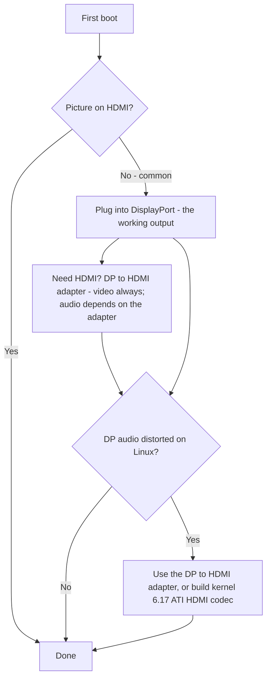

> 🌐 Community-Übersetzung. Die englische Version ist die maßgebliche Quelle und kann aktueller sein. Fehler gefunden? Öffne ein [Issue](https://github.com/lildebil0/awesome-bc250/issues). ([englisches Original](../en/14-display.md))

# Display & Ausgabe

> **TL;DR** — Die BC-250 treibt deinen Monitor über **DisplayPort** an. Das ist der Anschluss, den du einstecken musst. Falls dein Board auch einen HDMI-Port hat, **zeigt der häufig nichts** — ein schwarzer Bildschirm dort ist also *kein* totes Board, du bist nur am falschen Ausgang. HDMI nötig? Verwende einen **DP→HDMI-Adapter** — **Video kommt immer durch, ohne Verzögerung**; manche Adapter führen auch **Audio** (ein getesteter tat es, [src](https://t.me/c/2424231195/9148)), aber Audio hängt vom konkreten Adapter ab, also verlass dich nicht darauf (siehe den Audio-Abschnitt). Eine echte Eigenheit: **DisplayPort-Audio kommt unter Linux verzerrt/verlangsamt heraus**; derselbe DP→HDMI-Adapter umgeht das, und ein ordentlicher kernelseitiger Fix landet etwa bei **Kernel 6.17** ([src](https://t.me/c/2424231195/17953), [src](https://t.me/c/2424231195/68051)).

„Kein Bild beim ersten Boot" ist die **Panik Nr. 1 bei Einsteigern**. Lies den Kasten unten, bevor du irgendetwas für kaputt erklärst.

---

## Kein Bild? Mach das

1. **Stecke in DisplayPort, nicht HDMI.** Der funktionierende Videoausgang der BC-250 ist DisplayPort ([src](https://t.me/c/2424231195/104784)). Der HDMI-Port (wo vorhanden) ist der, der üblicherweise leer bleibt — beurteile das Board nicht nach ihm.
2. **Setz die Karte neu und versuch es erneut.** Boards initialisieren routinemäßig nicht beim ersten Versuch — Power-Cycle (komplett aus/an), und physisch neu setzen. Ein Besitzer: *„als meine ankam, sprang sie beim ersten Versuch auch nicht an … manchmal initialisiert sie bei einem Button-Reboot nicht vollständig — aus/an behebt es"* ([src](https://t.me/c/2424231195/15701)).
3. **Verdächtige das Kabel/den Adapter vor dem Board.** Bei einer einzelnen Karte ist ein schlechtes Kabel oder ein schlechter Adapter der Hauptverdächtige ([src](https://t.me/c/2424231195/15699)). Manche Adapter funktionieren in der Firmware, werden aber schwarz, sobald das OS lädt — *„Bild war vor GRUB in Ordnung, schwarzer Bildschirm im System"* ([src](https://t.me/c/2424231195/38184)).
4. **Setz das BIOS zurück / flash ein bekanntermaßen gutes Image neu**, wenn mehrere Karten einer Charge kein Bild geben — das deutet auf Firmware hin, nicht auf deinen Monitor ([src](https://t.me/c/2424231195/15697), [src](https://t.me/c/2424231195/15705)).

Wenn du alle vier abhakst und immer noch nichts hast, geh zu [troubleshooting.md](troubleshooting.md).



---

## Ausgänge auf einen Blick

| Ausgang | Funktioniert? | Anmerkungen |
|--------|--------|-------|
| **DisplayPort** | **Ja — das ist der Ausgang** | Primärer/einziger Display-Anschluss; trägt Audio. Die Repo-I/O-Spezifikation listet `1x DisplayPort` ([repo](https://github.com/mothenjoyer69/bc250-documentation)). Es ist **DisplayPort 1.4**, Obergrenze **4K@120 Hz**, mit HDR10 ([elektricM](https://github.com/elektricM/amd-bc250-docs/blob/main/docs/hardware/display.md)). |
| **HDMI-Port** (falls verbaut) | **Oft leer** | Einsteiger denken, das Board sei tot; ist es meist nicht — wechsel zu DP. ([src](https://t.me/c/2424231195/104784)) |
| **DP → HDMI über Adapter** | **Video: ja. Audio: hängt vom Adapter ab** | Video kommt ohne Verzögerung durch ([src](https://t.me/c/2424231195/9148)); Audio ist chipsatzabhängig — teste es (siehe Audio-Abschnitt). Auch der Standard-Fix für DP-Audio-Verzerrung (unten). |
| **Zweiter Videoausgang** | **Nicht out of the box** | Elektrisch vorhanden, aber **nicht bestückt**; einen 2. Monitor zu erzwingen erfordert Hacks, und andere sagen, der Chip habe keinen echten 2. Head — behandle Single-Output als die sichere Annahme. ([src](https://t.me/c/2424231195/92978), [src](https://t.me/c/2424231195/104682)) |
| **Zweiter Bildschirm übers Netzwerk** | **Ja** | Streame die Ausgabe der BC-250 über LAN an eine andere Maschine (Steam/Sunshine). ([src](https://t.me/c/2424231195/23660)) |

---

## Auflösungen, Bildwiederholrate & Kabel

elektricMs Referenz legt fest, was die einzelne DP-Anbindung tatsächlich leistet — nützlich bei der Wahl eines Monitors oder Adapters ([elektricM](https://github.com/elektricM/amd-bc250-docs/blob/main/docs/hardware/display.md)):

| Auflösung | Bildwiederholrate | Pfad |
|------------|---------|------|
| 1920×1080 (1080p) | 144 Hz+ | Natives DP, oder beliebiger Adapter |
| 2560×1440 (1440p) | 144 Hz+ | Natives DP (passive Adapter deckeln oft bei 1440p@60 / DP 1.2) |
| 3840×2160 (4K) | 60 Hz | Natives DP, oder **aktiver** DP→HDMI-2.0-Adapter |
| 3840×2160 (4K) | 120 Hz | **Nur natives DP** — ein aktiver DP-1.4→HDMI-2.1-Adapter wird für 4K@120 über HDMI benötigt und ist wackelig |

- **Kabel:** Verwende ein **VESA-zertifiziertes DisplayPort-1.4**-Kabel, **1–2 m**; längere Kabel verursachen Sync-/Aussetzer-Probleme ([elektricM](https://github.com/elektricM/amd-bc250-docs/blob/main/docs/hardware/display.md)).
- **In niedriger Auflösung festhängen** (z. B. nur 1024×768/1080p, 60 Hz) bedeutet meist, dass der GPU-Treiber nicht geladen ist — prüfe `glxinfo | grep "OpenGL renderer"`; `llvmpipe` = Software-Rendering, installiere Mesa 25.1+ und entferne `nomodeset` ([elektricM](https://github.com/elektricM/amd-bc250-docs/blob/main/docs/troubleshooting/display.md)). Siehe [06-linux.md](06-linux.md).
- **HDR (HDR10) & VRR** funktionieren, sind aber experimentell unter Linux — **KDE Plasma 6+** hat die beste Unterstützung und braucht im Allgemeinen eine Wayland-Sitzung ([elektricM](https://github.com/elektricM/amd-bc250-docs/blob/main/docs/hardware/display.md)). **Die Distro spielt hier eine Rolle:** Ein r/BC250Gaming-(Reddit-)Community-Bericht bekam **HDR + VRR nur auf CachyOS** ordentlich zum Laufen (Plasma 6 + Wayland), während auf **Bazzite HDR grafische Glitches verursachte und VRR nie funktionierte**. Ihr Beispiel: *Forza Horizon 6* bei **1440p High, HDR + VRR an, 60–80 FPS** über einen **UGREEN-DP→HDMI-2.1**-Adapter. Wenn HDR/VRR Priorität hat, siehe die CachyOS-Notiz in [06-linux.md](06-linux.md).
  - **Wenn du auf Bazzite KDE bist und VRR/FreeSync über HDMI willst**, gibt es einen Community-Remix, der AMDs HDMI-2.1-/FRL-Kernel-Arbeit einbaut: **[`dyllan500/bazzite-amd-hdmi-kde`](https://github.com/dyllan500/bazzite-amd-hdmi-kde)** — ein Bazzite-KDE-Image, neu gebaut auf einem Kernel, der AMDs offizielle HDMI-2.1-VRR-Patches trägt (aus `amd-staging-drm-next`). ⚠ **stark einschränken:** Es ist ein Drittanbieter-Image, der Autor testete VRR nur auf einer **Radeon 9070 XT** (nicht der BC-250), und es soll obsolet werden, sobald die Patches in einem Standard-Bazzite-Kernel landen. Es ist *kein* bestätigter BC-250-Fix — behandle es als experimentellen Weg zum Ausprobieren, nicht als Garantie.

> **Schwarzer Bildschirm *nach dem Login* (GRUB und der Login-Bildschirm waren in Ordnung)** ist ein Desktop-Sitzungs-Problem, meist **Wayland** — wähl „GNOME on Xorg"/„Plasma (X11)" am Login-Zahnrad, oder setz `WaylandEnable=false` in `/etc/gdm/custom.conf` ([elektricM](https://github.com/elektricM/amd-bc250-docs/blob/main/docs/hardware/display.md)). Ein schwarzer Bildschirm *vor* dem Login ist das Treiber-/`nomodeset`-Problem oben, nicht dieses.

---

## DisplayPort-Audio ist verzerrt — der Adapter-Fix

Unter Linux kommt Audio, das **direkt aus DisplayPort** gesendet wird, auf der BC-250 falsch heraus — beschrieben als verzerrt, *„gestreckt, als wäre es auf halbe Geschwindigkeit verlangsamt"*, mit Knistern ([src](https://t.me/c/2424231195/9895)). Das ist ein **Linux-/DP-Protokoll-Problem, kein Board-Defekt** — es wurde auch auf Nicht-BC-250-Hardware gesehen ([src](https://t.me/c/2424231195/15983)).

Die schroffe, zuverlässige Abhilfe, auf die sich der Chat einigte: **leite das Signal durch einen DP→HDMI-Adapter.** In HDMI umgewandelt verschwinden die Audio-Artefakte ([src](https://t.me/c/2424231195/17953), [src](https://t.me/c/2424231195/51763)). Ein Nutzer verifizierte es direkt: *„Ich habe Audio-Ausgabe über einen DisplayPort→HDMI-Adapter getestet. Alles in Ordnung, keine Verzögerung"* ([src](https://t.me/c/2424231195/9148)).

**Der allersauberste Weg ist ein direktes DP→HDMI-*Kabel* — DP-Stecker auf der einen Seite, HDMI-Stecker auf der anderen, kein Adapter-Dongle oder -Kasten an beiden Enden.** Mehrere Nutzer im r/linux_gaming-Community-Thread berichten unabhängig, dass dies das zuverlässigste Audio gibt: Ein schlichtes Kabel (z. B. ein Amazon-Basics-DP-zu-HDMI-Kabel, ~10 $) „funktioniert einfach", wo Dongle-artige Adapter Glückssache sind. Gelegentliche kurze Audio-Stummschaltungen können noch vorkommen, aber ein einteiliges Kabel entfernt den zusätzlichen Adapter-Chipsatz, der den Dongle-Weg zu einem Glücksspiel macht ([r/linux_gaming](https://www.reddit.com/r/linux_gaming/comments/1nvsgji/)). Wenn du ohnehin kaufst, **bevorzuge das Kabel gegenüber einem Dongle.**

**Wenn du keinen Adapter zur Hand hast,** leite Audio stattdessen über **Bluetooth** — die meisten Lautsprecher/Headsets unterstützen es und es umgeht den DP-Pfad komplett ([src](https://t.me/c/2424231195/89769)). Siehe [10-wifi-bt.md](10-wifi-bt.md) für den BT-Dongle.

### Adapter-Hinweise (Community)
- **Für 4K@60+ brauchst du einen *aktiven* Adapter/ein aktives Kabel** (passiv deckelt ~1440p@60). Ein funktionierendes, getestetes Beispiel: **UGREEN DP125 (DP→HDMI-4K-Kabel)** — mit 4K@30 angegeben, verhandelte aber 4K@60 an einem TV ([src](https://t.me/c/2424231195/52398)). Aktiv vs. passiv legt die Auflösungs-Obergrenze fest — es entscheidet **nicht**, ob Audio durchkommt (siehe unten).
- **Nicht alle Adapter führen Audio.** Der Belsis-Adapter eines Besitzers brachte 4K@60 *mit* Ton durch, während mehrere teurere Ugreen-Einheiten „HDMI digital audio" in der Geräteliste zeigten, aber keinen Ton ausgaben — und eine verschob Stimmen um eine Oktave nach unten ([src](https://t.me/c/2424231195/106617)). Wenn du Video, aber keinen Ton bekommst, ist der Adapter die Variable — probier einen anderen.
- **Für HDMI-*Audio* greif zuerst zu einem *passiven* Adapter.** Ein Community-Muster im r/linux_gaming-Thread: **passive** DP→HDMI-Adapter neigen dazu, Audio sauber durchzulassen, während **aktive** Adapter oft **das Audio ganz weglassen oder es im Pitch verschieben** (Stimmen rutschen berichtet ~20 % / etwa eine Quinte nach unten). Der Haken: Du *brauchst* einen aktiven Adapter nur für echtes **HDR** (und für 4K@60+), es ist also ein echter Kompromiss — passiv für zuverlässigen Ton, aktiv für HDR. Community-bestätigt-funktionierende *passive* Optionen: **Silver Monkey**, **BENFEI (ASIN B017Q8ZVWK)** und das **AmazonBasics-DP-zu-HDMI-_Kabel_** (das einteilige Kabel — *nicht* ihr Dongle-artiger Adapter) ([r/linux_gaming](https://www.reddit.com/r/linux_gaming/comments/1nvsgji/)). ⚠ Spezifische SKUs sind community-berichtet, hier nicht labor-verifiziert — und ein passiver Adapter deckelt trotzdem bei ~**1440p@60**.
- Billige **4K@60-DP→HDMI**-Adapter, die sowohl Video als auch Audio durchlassen, existieren und werden als funktionierend berichtet ([src](https://t.me/c/2424231195/133977)).
- Manche Adapter machen speziell an **4K-Monitoren** Ärger ([src](https://t.me/c/2424231195/1988)).
- **Audio über einen DP→HDMI-Adapter ist inkonsistent und hängt vom Chipsatz des Adapters ab — nicht einfach von aktiv vs. passiv.** Video kommt immer durch; **Audio ist die Variable.** Unsere Community-Berichte sind Adapter-für-Adapter (UGREEN-/Belsis-Einheiten berichtet als Ton führend, einige andere Einheiten stumm), und elektricMs Guide berichtet die *entgegengesetzte* Aufteilung (passiv führt Audio, einige aktive Einheiten stumm — z. B. Cable Matters/StarTech) — was genau der Grund ist, warum das Aktiv/Passiv-Label es nicht vorhersagt ([elektricM](https://github.com/elektricM/amd-bc250-docs/blob/main/docs/troubleshooting/display.md)). Für **zuverlässiges** Audio setz nicht auf einen Adapter: Bevorzuge ein **DisplayPort-natives Display/AV-Receiver**, oder gib den Ton über **USB (ein USB-DAC/Sound-Gerät)** aus. Wenn du doch einen Adapter verwendest, **teste Audio, bevor du dich darauf verlässt** — und denk daran, dass ein **passiver** Adapter bei ~**1440p@60** deckelt.

### Der Kernel-6.17-Fix (DP-direktes Audio, kein Adapter)

Wenn du sauberes Audio **direkt über DisplayPort** ohne Adapter willst, wurden Ursache und Fix im Chat aufgespürt. Fedoras Standard-Kernel-Config baute `snd-hda-codec-hdmi.ko` + `snd-hdmi-lpe-audio.ko`; **Kernel 6.17 änderte den HDMI-Audio-Pfad** und brach den Ton auf dieser Standard-Config. Der Fix ist, zusätzlich den **ATI-HDMI-Codec** zu bauen — kippe die Kernel-Config von `# CONFIG_SND_HDA_CODEC_HDMI_ATI is not set` auf `CONFIG_SND_HDA_CODEC_HDMI_ATI=m`, was `snd-hda-codec-atihdmi.ko` paketiert; der Ton funktioniert dann **ohne Patches** ([src](https://t.me/c/2424231195/68051), [src](https://t.me/c/2424231195/68061)).

```text
# Fedora kernel config change for DP/HDMI audio on kernel 6.17+
# from:
# CONFIG_SND_HDA_CODEC_HDMI_ATI is not set
# to:
CONFIG_SND_HDA_CODEC_HDMI_ATI=m
```

Mit diesem dritten Codec (`snd-hda-codec-atihdmi.ko`) vorhanden legt ALSA die Audio-Ausgänge des Boards offen (z. B. `pcm=3` und `pcm=7` als zwei HDMI-Geräte) ([src](https://t.me/c/2424231195/68062), [src](https://t.me/c/2424231195/67569)). ⚠ Überprüfe — das erfordert das Bauen eines benutzerdefinierten Kernels; behandle den DP→HDMI-Adapter als den No-Build-Pfad für die meisten Nutzer. Siehe [06-linux.md](06-linux.md) für Kernel-/Treiber-Einrichtung.

### Surround-Sound (5.1) — verwende eine USB-Soundkarte, nicht HDMI

**5.1-Surround über HDMI funktioniert auf der BC-250 *nicht*.** AMDs HDMI-Firmware unter Linux für dieses headless/Mining-Die legt kein Mehrkanal-LPCM offen, also fällt der HDMI-Ausgang auf reines Stereo zurück, egal was der Receiver unterstützt ([r/linux_gaming](https://www.reddit.com/r/linux_gaming/comments/1nvsgji/)). Für echtes Mehrkanal leite Audio über eine **USB-Soundkarte / einen USB-DAC** aus — setz sie als Standard-Sink in `pavucontrol`, dann bestätige alle sechs Kanäle mit:

```bash
speaker-test -D pipewire -c 6 -t wav
```

Derselbe USB-DAC-Weg ist auch der zuverlässige Fix für Stereo-Audio, wenn Adapter Ärger machen (oben).

---

## Der zweite Ausgang (anfangs inaktiv)

Es gibt einen **zweiten Videoausgang auf dem Board, der out of the box nicht aktiv ist.** Die Lesart der Community ist gespalten und beide Hälften sind wissenswert:

- Er ist **elektrisch vorhanden, aber nicht bestückt/verlötet**, und *„mit Hacks kannst du einen 2. Monitor zum Funktionieren bringen"* ([src](https://t.me/c/2424231195/92978)).
- Andere berichten, der Chip habe schlicht **keinen nutzbaren zweiten Head** — *„das Problem liegt im Chip, der zweite Ausgang ist physisch nicht da"* ([src](https://t.me/c/2424231195/104682)).

Praktisch: **geh von einem DisplayPort-Ausgang aus.** Nach einem DP-**MST-Splitter für zwei unabhängige Bildschirme wurde gefragt, aber nicht als funktionierend bestätigt** in unserem Chat ([src](https://t.me/c/2424231195/92109)).

**Update von elektricM — MST kann mit dem richtigen Hub zwei Bildschirme treiben.** elektricMs Tests berichten bis zu **2 Displays über einen DP-MST-Hub** (Bandbreite geteilt, Auflösung pro Display begrenzt), mit Hub-für-Hub-Ergebnissen ([elektricM](https://github.com/elektricM/amd-bc250-docs/blob/main/docs/hardware/display.md)):

| MST-Hub | Aus | DP-Version | Unabhängige Displays? | Audio | Anmerkungen |
|---------|-----|--------|-----------------------|-------|-------|
| StarTech MST14DP122DP | 2× DP | 1.4 | **Ja** | Ja | Funktionierte konsistent über Monitore/Kabel hinweg |
| Monoprice 21972 | 2× DP | 1.2 | **Nur Spiegelung** | Ja | Konnte nur spiegeln |
| ENBUER | 2× DP | 1.2 | **Nur Spiegelung** | Ja | Konnte nur spiegeln |
| Generic HDMI MST | 2× HDMI | — | **Nein** | Nein | Kein Video oder Audio |

Natives Dual-Monitor **ist** also via MST mit einem DP-1.4-Hub möglich (StarTech bestätigt); billigere DP-1.2-Hubs können nur spiegeln, und HDMI-MST-Hubs scheiterten. ⚠ Überprüfe — einzelnes bestätigtes Hub-Modell; Ergebnisse variieren je nach Hub.

**Anderer Mehr-Display-Weg — USB-DisplayLink-Adapter.** Füge einen USB→HDMI/DP-DisplayLink-Adapter für einen zusätzlichen **Desktop**-Bildschirm hinzu (für beste Ergebnisse *nach* dem Boot einstecken). **Nicht zum Spielen** — er komprimiert auf der CPU, was der Engpass der BC-250 ist, also ist die Latenz hoch; er funktioniert außerdem nicht im Steam-Deck-**Game-Mode** ([elektricM](https://github.com/elektricM/amd-bc250-docs/blob/main/docs/hardware/display.md)).

---

## Zweiter Bildschirm übers Netzwerk (das einfache „2. Display")

Wenn du das BC-250-Bild tatsächlich auf einem zweiten Gerät willst, ist der erprobte Weg kein zweites Kabel — es ist **Streaming über LAN.** Ein Nutzer: *„Ich startete ein Steam-Spiel auf der BC-250 (Fedora) und streamte es übers Netzwerk an mein Arbeits-Laptop, steuerte es vom Laptop aus. Alles funktionierte"* ([src](https://t.me/c/2424231195/23660)).

- **Sunshine** (Host-Encoder) funktioniert hier, weil es nicht NVIDIA-only ist — es macht das Encoding, der Client dekodiert nur ([src](https://t.me/c/2424231195/25091)). Über Gigabit-LAN wird es als nahezu makellos berichtet ([src](https://t.me/c/2424231195/25563)).
- **Moonlight als Host** passt *nicht* — es erwartet einen NVIDIA-Encoder und stottert/beschwert sich über einen fehlenden Hardware-Decoder ([src](https://t.me/c/2424231195/25050)). Verwende Sunshine als Host, Moonlight nur als Client.

Das ist auch der praktische Weg, ein „Dual-Display"-Gefühl ohne den unbestückten zweiten Ausgang oben zu bekommen.

---

## Quellen

- DP→HDMI-Adapter führt Video+Audio, keine Verzögerung — https://t.me/c/2424231195/9148
- DP-Audio-Verzerrung ist ein Linux-Problem; Adapter behebt es — https://t.me/c/2424231195/17953 · https://t.me/c/2424231195/9895 · https://t.me/c/2424231195/51763 · https://t.me/c/2424231195/15983
- Kernel-6.17-Audio-Fix (`CONFIG_SND_HDA_CODEC_HDMI_ATI=m`) — https://t.me/c/2424231195/68051 · https://t.me/c/2424231195/68061 · https://t.me/c/2424231195/68062 · https://t.me/c/2424231195/67569
- Funktionierende Adapter — UGREEN DP125 https://t.me/c/2424231195/52398 · Belsis vs. andere (Audio variiert) https://t.me/c/2424231195/106617 · billiges 4K@60 https://t.me/c/2424231195/133977
- DP ist der funktionierende Ausgang; gib Geld für einen guten DP→HDMI-Adapter aus — https://t.me/c/2424231195/104784
- Erster-Boot kein Bild / neu setzen / neu flashen — https://t.me/c/2424231195/15697 · https://t.me/c/2424231195/15699 · https://t.me/c/2424231195/15701 · https://t.me/c/2424231195/38184
- Zweiter Ausgang vorhanden, aber nicht bestückt / umstritten — https://t.me/c/2424231195/92978 · https://t.me/c/2424231195/104682 · MST gefragt https://t.me/c/2424231195/92109
- Netzwerk-Zweitbildschirm (Sunshine/Steam über LAN) — https://t.me/c/2424231195/23660 · https://t.me/c/2424231195/25091 · https://t.me/c/2424231195/25050 · https://t.me/c/2424231195/25563
- Bluetooth-Audio als Alternative — https://t.me/c/2424231195/89769
- Direktes DP→HDMI-**Kabel** (keine Adapter) ist das zuverlässigste Audio; 5.1 über HDMI funktioniert nicht (kein Mehrkanal-LPCM), USB-Soundkarte / DAC verwenden — r/linux_gaming-Community-Thread https://www.reddit.com/r/linux_gaming/comments/1nvsgji/
- Hardware-I/O-Referenz (`1x DisplayPort`) — [mothenjoyer69/bc250-documentation](https://github.com/mothenjoyer69/bc250-documentation) · [`hardware.md`](https://github.com/mothenjoyer69/bc250-documentation/blob/main/hardware.md)
- DP 1.4 / 4K@120 / HDR10, Auflösungs- + Kabel-Limits, MST-Hubs (max. 2), DisplayLink, Wayland-Login-Schwarzbild — elektricM [`hardware/display.md`](https://github.com/elektricM/amd-bc250-docs/blob/main/docs/hardware/display.md)
- HDR + VRR funktioniert auf CachyOS (Plasma 6 + Wayland) vs. kaputt auf Bazzite; Forza Horizon 6 1440p High HDR+VRR über UGREEN DP→HDMI 2.1 — r/BC250Gaming-(Reddit-)Community-Bericht (siehe [06-linux.md](06-linux.md))
- Passiver DP→HDMI führt Audio / aktiver lässt es weg oder verschiebt den Pitch; passiv aber für HDR nötig; bestätigte Passive Silver Monkey / BENFEI B017Q8ZVWK / AmazonBasics-DP-zu-HDMI-Kabel — [r/linux_gaming-Community-Thread](https://www.reddit.com/r/linux_gaming/comments/1nvsgji/)
- Bazzite-KDE-VRR/FreeSync-über-HDMI-Remix (AMD HDMI 2.1-Kernel; auf 9070 XT getestet, nicht BC-250) — [`dyllan500/bazzite-amd-hdmi-kde`](https://github.com/dyllan500/bazzite-amd-hdmi-kde)
- Adapter-Audio ist chipsatzabhängig (elektricM sah passiv es führen / einige aktive stumm; Community sah das Umgekehrte — also DP-nativ oder einen USB-DAC bevorzugen), Niedrigauflösungs-llvmpipe-Check — elektricM [`troubleshooting/display.md`](https://github.com/elektricM/amd-bc250-docs/blob/main/docs/troubleshooting/display.md)

> Treiber-/Kernel-Einrichtung ist in [06-linux.md](06-linux.md); Audio-/Ausgabe-Stolperfallen sind auch in [troubleshooting.md](troubleshooting.md) und [faq.md](faq.md) indexiert.
