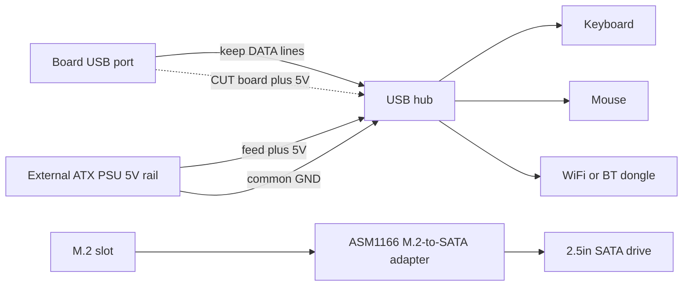

> 🌐 Community-Übersetzung. Die englische Version ist die maßgebliche Quelle und kann aktueller sein. Fehler gefunden? Öffne ein [Issue](https://github.com/lildebil0/awesome-bc250/issues). ([englisches Original](../en/16-usb-peripherals.md))

# USB, Hubs & Peripherie

> **TL;DR** — Das Board gibt dir **4 hintere USB-Ports (2× USB 2.0 + 2× USB 3.0)** und das war's — standardmäßig keine internen Header verdrahtet. Ein WiFi/BT-Dongle, eine SSD-per-USB, Tastatur, Maus und ein Controller fressen die schnell auf, also fügt fast jeder einen **USB-Hub** hinzu. Der Haken: Die **5-V-USB-Schiene des Boards ist schwach** und bricht unter Last ein, sodass billige bus-gespeiste Hubs (und sogar direkt angeschlossene Flash-Laufwerke) abbrechen. Die zuverlässigen Fixes, der Reihe nach: ein **aktiv versorgter (powered) Hub**, oder die Community-**5-V-Einspeisungs-Mod** — kapp die 5 V, die der Hub vom Board nimmt, und speise ihm stattdessen 5 V aus deinem ATX-Netzteil ein. ([src](https://t.me/c/2424231195/119741))

Das ist eine **Zubehör**-Seite. Mach den Hub richtig, und der Rest (Audio, Ethernet-über-USB, Docks) funktioniert einfach.

---

## Wie viele USB-Ports du tatsächlich bekommst

Laut Hardware-Referenz ist die hintere I/O **1× DisplayPort, 1× GbE-Ethernet, 2× USB 2.0, 2× USB 3.0**. Also vier physische USB-Ports. ([hardware.md](https://github.com/mothenjoyer69/bc250-documentation/blob/main/README.md))

In der Praxis sind die zwei **USB-3.0**-Ports die, um die sich die Leute streiten (schneller, für SSDs/Docks genutzt), und sie sind elektrisch **schmal** verdrahtet — ein Besitzer beschreibt den Anschluss als faktisch „x2" und warnt davor, einen Splitter daran zu hängen. ⚠ Überprüfe die genaue Lane-Breite. ([src](https://t.me/c/2424231195/75561))

Der Engpass ist real, sobald man auflistet, was einen Port will: **steck eine SSD ein — ein Port weg; füge einen USB-WiFi-Dongle, einen Joystick, ein externes Laufwerk hinzu — du brauchst einen Hub, sonst riskierst du, den Port durchzubrennen.** ([src](https://t.me/c/2424231195/75558)) Leute berichten routinemäßig „alle USB 3.0 belegt, Tastatur und Maus laufen über einen Hub". ([src](https://t.me/c/2424231195/110875))

Es gibt **keine bestückten Front-Panel-USB-Header** out of the box — aber das Gehäuse/Board hat einen Platz, der erkennbar dafür gedacht ist, das Kabel eines Hubs nach vorn zu führen, was mehrere Gehäuse-Builds nutzen. ([src](https://t.me/c/2424231195/91322)) · ([src](https://t.me/c/2424231195/100249))

---

## Das eigentliche Problem: Die 5-V-USB-Schiene ist schwach

Die BC-250 erzeugt **5 V für USB auf dem Board selbst** ([src](https://t.me/c/2424231195/57920)), und diese Schiene kann nicht viel liefern. Die klarste Messung aus dem Chat, an einem Board, das keine Geräte enumerieren wollte:

> „Meine BC-250 [liefert] keine ordentlichen 5 V auf USB … nur eine Tastatur funktioniert; wenn ich eine Maus einstecke, schaltet sich die Tastatur ab. ~**4,3 V** mit nur der Tastatur, **2,3 V–3,2 V** mit Tastatur + Maus, **5,1 V** mit beiden entfernt." ([src](https://t.me/c/2424231195/119071))

Dieser Spannungseinbruch ist der Grund, warum sich die Symptome um **Last** häufen: Flash-Laufwerke und Mikrofone, die **abfallen, wenn sie direkt eingesteckt werden, aber über einen Hub einwandfrei laufen**, Tastaturen, die ihre LEDs verlieren, Geräte, die abbrechen, sobald zwei Dinge gleichzeitig ziehen. ([src](https://t.me/c/2424231195/53939)) Es ist dieselbe Strom-Empfindlichkeit, die WiFi-Dongles wackelig macht — siehe **[10-wifi-bt.md](10-wifi-bt.md)**, wo Sticks im Leerlauf laufen und dann bei einem Download-Peak abbrechen.

> ⚠ Nicht jedes Board ist so schlimm. Ein Besitzer betreibt einen **WiFi-Dongle + kabelgebundene Tastatur + Maus über einen stromlosen Hub + ein 14"-Display + einen 3,5"-Hilfsbildschirm** an der USB des Boards und berichtet, es laufe einwandfrei. ([src](https://t.me/c/2424231195/119231)) Behandle dein eigenes Board als unbekannt, bis du es belastest.

---

## Hub-Auswahl: powered vs. unpowered

| Hub-Typ | Wann er funktioniert | Urteil |
|----------|---------------|---------|
| **Unpowered (bus-gespeist)** | Leichte Lasten — Tastatur, Maus, ein Dongle. Manche Boards betreiben erstaunlich viel auf diese Weise. ([src](https://t.me/c/2424231195/119231)) | OK zum ersten Ausprobieren; **erwarte Aussetzer**, sobald du ein Laufwerk hinzufügst oder die Last hochschnellt. |
| **Powered / aktiv (externer 5-V-Brick)** | Alles mit Laufwerken, mehreren Dongles oder unter Last. Die ständige Empfehlung der Community für die BC-250. ([src](https://t.me/c/2424231195/75558)) · ([src](https://t.me/c/2424231195/119229)) | **Kauf das.** Löst den Einbruch, ohne das Board anzufassen. ([src](https://t.me/c/2424231195/140091)) |
| **5-V-Einspeisungs-Mod** (siehe unten) | Wenn du einen sauberen, gehäusten Build willst, der komplett vom ATX-Netzteil versorgt wird, und kein zweites Steckernetzteil möchtest. | Beste Integration, erfordert Löten. ([src](https://t.me/c/2424231195/119741)) |

Der wiederholte Rat, wenn jemandes USB-Geräte Ärger machen, lautet schlicht: **besorg dir einen aktiven USB-Hub mit Netzteil-Eingang.** ([src](https://t.me/c/2424231195/119229)) Mehrere Besitzer landeten dort, nachdem sie sich mit Aussetzern herumgeschlagen hatten — „es löste sich mit einem extern versorgten Hub". ([src](https://t.me/c/2424231195/123789))

> Eine im Chat geäußerte Warnung: Sich auf einen extern versorgten Hub zu verlassen, kann **dauerhaft** sein — sobald du die USB-Stromversorgung extern auslagerst, sei nicht überrascht, wenn du auf Dauer an diesem Hub festhängst. ([src](https://t.me/c/2424231195/123924)) Das ist ein guter Kompromiss für einen Desktop-Build.

---

## Die 5-V-Einspeisungs-Mod (einen normalen Hub zum Funktionieren bringen)

Das ist der elegante Fix für einen **gehäusten Build, der bereits an einem ATX-/SFX-Netzteil läuft**: Statt einen aktiv versorgten Hub mit eigenem Steckernetzteil zu kaufen, nimmst du einen gewöhnlichen Hub und **tauschst aus, woher seine 5 V kommen**.

Was ein Nutzer tat, und es funktionierte ([src](https://t.me/c/2424231195/119741)):

> „Ich habe einen normalen USB-Hub modifiziert und es funktionierte. Ich **kappte die 5 V vom Mainboard und gab 5 V vom Netzteil**. Ich musste keine Masse anschließen, weil ich dasselbe ATX-Netzteil zur Versorgung meiner BC-250 verwende."

So funktioniert es:

1. Öffne den Hub; finde die **5-V- (VBUS-) ** Leiterbahn/Ader auf der **Upstream**-Seite (das Kabel, das ins Board gesteckt wird).
2. **Kapp diese 5 V**, sodass der Hub keinen Strom mehr von der schwachen Schiene des Boards zieht.
3. Speise dem Hub **+5 V aus deinem ATX-Netzteil** ein (eine freie SATA-/Molex-5-V-Leitung).
4. **Die Masse wird automatisch geteilt**, weil dasselbe Netzteil bereits das Board versorgt — kein zusätzlicher Masseleiter nötig. (Wenn du den Hub jemals aus einer *separaten* Versorgung speist, **musst** du die Massen verbinden.)

Datenleitungen bleiben unangetastet — du änderst nur die Stromquelle. Das Board sieht einen Hub, der seine 5-V-Schiene nicht mehr belastet, und die Geräte bekommen sauberen, reichlichen Strom vom Netzteil.



> ⚠ Die falsche Leiterbahn zu kappen bricht den Hub (billig) — aber stell sicher, dass du **VBUS kappst, nicht eine Datenleitung**. Prüf vor dem Löten mit einem Multimeter doppelt nach.

---

## Schrott, den man meiden sollte

- **Hoco-Hubs** — als unzuverlässig benannt; ein Besitzer **musste denselben Hoco-Hub zweimal nachlöten**. ([src](https://t.me/c/2424231195/74531))
- **„USB 3.0"-Hubs, die es nicht sind** — ein 160-₽-AliExpress-„USB-3.0-Hub/Dock" wurde als **definitiv kein echtes 3.0** zu diesem Preis markiert. ([src](https://t.me/c/2424231195/8761)) · ([src](https://t.me/c/2424231195/8764))
- **Hubs verketten (Daisy-Chaining)**, um Ports zu vervielfachen — als Idee aufgeworfen ([src](https://t.me/c/2424231195/104653)), aber das stapelt das Stromproblem; eine schwache Schiene speist nun zwei Hubs. Verwende stattdessen einen einzelnen guten powered Hub.
- **SATA-Splitter-„Hubs"** am M.2-Slot — eine wiederkehrende Verwechslung. Mit nur **2 PCIe-Lanes** am M.2 kannst du nicht vernünftig einen SATA-Controller anhängen und erwarten, dass er auffächert; „diese Ein-SATA-rein-, viele-raus-Hubs sind Müll". ([src](https://t.me/c/2424231195/22539)) Kein USB-Thema — verwechsle es nur nicht mit USB-Erweiterung.
- ★ **M.2→SATA-Controller PH516 (6-Port) — bestätigt NICHT funktionierend.** Der Port enumeriert, aber die Platte hängt sich nicht an, und eine **zweite Person reproduzierte** dasselbe Versagen ([4pda — Strange999](https://4pda.to/forum/index.php?showtopic=1104980)). Kauf stattdessen den community-empfohlenen **ASM1166** (siehe den Speicher-Abschnitt) — PH516 ist eine bekannte Sackgasse auf diesem Board.

Ein Hub mit **eingebautem Audio-Codec** ist ein netter Platzsparer für gehäuste Builds (ein Gerät gibt dir extra Ports *und* eine 3,5-mm-Buchse), und Leute nutzen sie. ([src](https://t.me/c/2424231195/8751)) Die Audioqualität schwankt — es ist ein billiger Codec. ([src](https://t.me/c/2424231195/39708))

---

## Interner USB-3.0-Header (Type-E)

Wenn dein Gehäuse einen **Front-USB-3.0-Stecker** hat (den 20-poligen „Key-A/Type-E"-Anschluss), willst du ihn aus dem USB 3.0 des Boards speisen. Es gibt **keinen nativen 20-Pin-Header**, also adaptieren die Leute:

- Ein **USB-3.1-Type-E → USB-3.0-(Type-A)-Kabel** von AliExpress ist der saubere Weg. AXONUS 50 cm wurde im Chat geteilt. ([src](https://t.me/c/2424231195/133182)) Eine Xiwai-Type-E → 20-Pin-Variante wurde ebenfalls gepostet. ([src](https://t.me/c/2424231195/125127))
- Oder **spleiße** das werkseitige Kabel des Gehäuses an einen gewöhnlichen USB-3.1-Stecker — die „Schlange an einen Igel anflanschen"-Methode, wenn kein Adapter passt. ([src](https://t.me/c/2424231195/135957))

**Status:** **USB 2.0 ist bestätigt funktionierend; USB 3.0 stand noch zum vollständigen Test aus** durch den Besitzer, der es berichtete (Test ausstehend nach dem In-Gehäuse-Build). Behandle 3.0-über-Adapter als ⚠ Überprüfe auf deiner Hardware. ([src](https://t.me/c/2424231195/136215))

---

## Speicher (M.2-Slot & SATA-Laufwerke)

Der einzige interne Speicheranschluss des Boards ist ein **einzelner M.2-Slot**, und er ist **PCIe 2.0 ×2** verdrahtet — die praktische Obergrenze liegt also bei **~1 GB/s** ([src](https://t.me/c/2424231195/66275)) · ([src](https://t.me/c/2424231195/135506)). Eine schnelle Gen3/Gen4-NVMe *funktioniert*, kann aber hier nicht ihre Nenngeschwindigkeit erreichen, daher lohnt es nicht, für ein High-End-Laufwerk zu zahlen. **Eine normale NVMe-M.2-SSD ist das einfachste Boot-Laufwerk** — steck sie in den Slot und installiere Linux darauf (siehe **[06-linux.md](06-linux.md)** für die Installation).

### 2,5"-SATA-HDDs/SSDs anschließen

Es gibt keinen SATA-Port auf dem Board, also steckst du, um ein **2,5"-SATA-Laufwerk** (oder mehrere) anzuhängen, eine **M.2 → SATA-Adapterkarte** in den M.2-Slot. Der bestätigte Favorit der Community ist die **ASM1166-(M.2-PCIe → SATA-)**-Erweiterungskarte ([src](https://t.me/c/2424231195/135180)). Der andere Weg, den Leute gehen, ist eine schlichte **M.2-SATA-SSD direkt im Board** — kein Adapter, nur ein SATA-Protokoll-M.2-Stick. ([src](https://t.me/c/2424231195/87411))

Das ist eine der **häufigsten Einsteigerfragen** — *„ist das der Adapter, den ich brauche, um eine Festplatte ans Board anzuschließen?"* und *„welche anderen Wege gibt es, ein Laufwerk anzuschließen?"* ([src](https://t.me/c/2424231195/135164)) · ([src](https://t.me/c/2424231195/135165)) — wenn du sie also stellst, bist du in guter Gesellschaft.

> ⚠ Überprüfe — die ASM1166-Karte ist eine Community-Empfehlung, kein von-vielen-getestetes Ergebnis speziell auf der BC-250. Bestätige, dass dein gewählter Adapter enumeriert und bootet, bevor du dich darauf verlässt. Beachte außerdem, dass die **2 PCIe-Lanes** des M.2 keinen Ein-SATA-rein-/viele-raus-*Splitter* vernünftig speisen können — siehe **Schrott, den man meiden sollte** oben. ([src](https://t.me/c/2424231195/22539))

#### ★ Ein 2,5"-SATA-Laufwerk mit Strom versorgen (das Board ist 12-V-only)

Die Adapterkarte oben kümmert sich um **Daten**, aber ein 2,5"-SATA-Laufwerk braucht auch **5-V-Strom** an seinem SATA-Stromanschluss — und das BC-250-Board liefert nur **12 V**, ohne SATA-Strom-Header zum Abgreifen. Der praktische Fix aus einem Build: ein **USB→SATA-Strom-Adapter, der 5 V einspeist** an das Laufwerk, mit einem **12-V→5-V-Step-down-(Buck-)Wandler**, der diese 5 V aus den 12 V des Boards erzeugt ([TMG-HD-Build](https://youtu.be/OEO0r01zcfU); ⚠ ungefähr — aus dem Video-Walkthrough paraphrasiert). Mit anderen Worten: ASM1166 (oder ein M.2-SATA-Stick) trägt die SATA-*Daten*; der Buck-Wandler + USB→SATA-Strom-Adapter trägt den SATA-*Strom*. Ein selbstversorgtes 2,5"-Gehäuse oder ein powered Dock umgeht das ganze Problem, indem es seine eigene 5-V-Schiene mitbringt.

#### ★ SteamOS „no nvme drive detected" mit einem M.2-SATA-Stick

Wenn du SteamOS mit einer **M.2-SATA-SSD** (z. B. einer **Kingston SNS41**) statt NVMe bootest, kann der Installer-/Reparatur-Ablauf mit **„no nvme drive detected"** fehlschlagen — SteamOS nimmt an, die Platte sei ein NVMe-Gerät (`nvme…`), aber ein SATA-Stick enumeriert als `sda`. Der Fix ist, das Reparaturskript zu bearbeiten und es auf den richtigen Gerätenamen zu zeigen ([4pda — pornocrat](https://4pda.to/forum/index.php?showtopic=1104980)):

```bash
# Das SteamOS-Reparaturskript bearbeiten und den Gerätenamen nvme -> sda ersetzen
nano ~/tools/repair_device.sh
# jede "nvme"-Referenz auf "sda" ändern, speichern, dann Install/Reparatur erneut ausführen
```

Das ist rein eine Gerätenamens-Diskrepanz — der SATA-Stick funktioniert einwandfrei, sobald SteamOS angewiesen wird, auf `sda` statt auf einen `nvme`-Knoten zu schauen.

### Ältere SATA-Laufwerke sind in Ordnung

Weil die M.2-Anbindung ohnehin alles auf ~1 GB/s deckelt, ist eine alte **2,5"-SATA-HDD/SSD** für eine **Spielebibliothek oder ältere Spiele** völlig ausreichend — die Geschwindigkeit, die du verlieren würdest, ist Geschwindigkeit, die das Board nicht liefern kann. ([src](https://t.me/c/2424231195/132739)) Ein **USB-NVMe-Gehäuse** ist eine weitere Option, wenn du den M.2-Slot lieber frei lassen möchtest, aber die Gehäuse, die tatsächlich NVMe (nicht SATA) können, fangen teurer an — für einen kleinen Boot-Stick lohnt es nicht. ([src](https://t.me/c/2424231195/111022))

### Intel Optane 16 GB als Cache/Swap — Community-Idee, lauwarmes Urteil

Ein kleines **Intel-Optane-16-GB-NVMe**-Modul als Cache- oder Swap-Gerät zu nutzen kam als Idee auf, mit einem nüchternen Urteil ([4pda](https://4pda.to/forum/index.php?showtopic=1104980)): Die **auf Ozon verkauften 16-GB-„Optane"-Module stellten sich nach eigenen Tests der Mitglieder als kein echtes Optane heraus**, der **M.2-Slot des Boards ist langsam** (PCIe 2.0 ×2, ~1 GB/s), sodass der Latenzvorteil abgestumpft wird, und während eine **Swap-Datei theoretisch möglich** ist, ist sie hier kein klarer Gewinn. Behandle es als Kuriosität, nicht als empfohlenes Upgrade.

---

## Docks & Dockingstationen

Ein USB-C-/Thunderbolt-artiges **Dock** kann als ein fetter Hub agieren (USB + Ethernet + manchmal Video), und Besitzer haben sie genutzt:

- Ein **Wavlink WL-UG69DK1 USB-C Dual-4K-Dock** ist bei einem Mitglied im Einsatz. ([src](https://t.me/c/2424231195/68141))
- Ein **DisplayLink-Dock** läuft als **USB-Hub + USB-Soundkarte**; das Mitglied bekam **kein** Video heraus (stieß auf eine TPM-/BIOS-Mauer), behandle Dock-*Video* also als unzuverlässig. ([src](https://t.me/c/2424231195/104776))
- Für extra **Monitore speziell** umgeht ein Dock nicht das eigene Ausgabe-Limit der GPU — siehe **[14-display.md](14-display.md)**, bevor du darauf zählst.

Fazit: Docks sind in Ordnung als **powered Hubs** (sie bringen ihre eigene Versorgung mit, was das 5-V-Problem elegant umgeht). Kauf keines in der Erwartung, dass seine **Video**-Ausgabe funktioniert.

---

## Controller & Eingabe

Gamepads reiten auf derselben schwachen USB-Schiene und derselben wackeligen-Bluetooth-Geschichte wie alles andere (siehe **[10-wifi-bt.md](10-wifi-bt.md)** für BT-Dongles). Ein paar spezifische Erkenntnisse:

- **DualSense unter Linux über DS5Dongle (Raspberry Pi Pico 2W).** Dieser offene Dongle gibt dem DualSense seine **HD-Haptik + Lautsprecher** unter Linux und eine **Web-UI** für Polling-Rate / Lautstärke — aber es gibt einen Haken beim Spiel-Audio: Wine/Proton-Titel bekommen das Audio des Controllers nur im **Direct-Modus** (der Controller erscheint als einzelne **4-Kanal-Audiokarte**), und **nicht jede Distro legt diesen Modus offen** ([4pda — korotyshev](https://4pda.to/forum/index.php?showtopic=1104980)). Separat braucht der Kernel-Treiber **`hid-playstation`** (native DualSense-Unterstützung) **Bluetooth ≥ 5.0** am Adapter ([4pda — xDarkman](https://4pda.to/forum/index.php?showtopic=1104980)).
- **GameSir T4 Kaleid + sein 2,4-GHz-Dongle** ist ein funktionierender Controller-/Eingabe-Pfad, der Bluetooth komplett umgeht — kabelgebunden-anmutende Eingabe über einen 2,4-GHz-USB-Empfänger, statt sich mit BT-Pairing herumzuschlagen ([TiredDadTech](https://youtu.be/zi7sldeRd2w); ⚠ ungefähr — aus dem Video paraphrasiert).
- **BT-Dongle-Port ist entscheidend: UGREEN-Bluetooth-Dongle funktioniert nur in einem USB-2.0-Port, nicht USB 3.0.** Das HF-Rauschen / die elektrische Verdrahtung der 3.0-Ports macht ihn kaputt; verschieb ihn auf einen der zwei **USB-2.0**-Ports, und er funktioniert ([4pda — InfernalWolf666](https://4pda.to/forum/index.php?showtopic=1104980)). (Derselbe USB-3.0-Rausch-Effekt, der WiFi/BT-Sticks plagt — siehe [10-wifi-bt.md](10-wifi-bt.md).)

---

## Empfohlenes Starter-Setup

| Stufe | Mach das | Warum |
|------|---------|-----|
| Minimum | Bus-gespeister Hub für Tastatur/Maus/Dongle | Gratis, wenn du einen besitzt; gut für leichte Lasten ([src](https://t.me/c/2424231195/119231)) |
| **Empfohlen** | **Powered (aktiver) USB-Hub** mit eigenem 5-V-Brick | Behebt den Einbruch, kein Löten, Laufwerke + Dongles bleiben an ([src](https://t.me/c/2424231195/75558)) |
| Gehäuse-Build | Gewöhnlicher Hub + **5-V-Einspeisungs-Mod** aus dem ATX-/SFX-Netzteil | Sauberste Integration, ein Steckernetzteil weniger ([src](https://t.me/c/2424231195/119741)) |

Ein beliebter gehäuster Referenz-Build ist genau das: **Cooler Master MasterBox NR200P + ein USB-Hub + ein SFX-Netzteil** — der Hub wird als Standard-Bestandteil des Builds behandelt, nicht als Nachgedanke. ([src](https://t.me/c/2424231195/81149)) Siehe **[05-case.md](05-case.md)** für die Gehäuse-Seite; ein fertig druckbares Gehäuse bündelt sogar ein HDD-+-USB-Hub-Layout. ([printables](https://www.printables.com/model/1580750-bc250-amd-case-v3-hp-server-psu-hdd-usb-hub))

---

## Quellen

- 5-V-Einspeisungs-Mod (Board-5 V kappen, aus Netzteil speisen) — https://t.me/c/2424231195/119741 · Anleitungs-Frage — https://t.me/c/2424231195/119795
- Gemessener USB-Spannungseinbruch (4,3 V → 2,3 V) — https://t.me/c/2424231195/119071 · Board erzeugt 5 V on-board — https://t.me/c/2424231195/57920
- Port-Budget / „du brauchst einen powered Hub oder riskierst, den Port durchzubrennen" — https://t.me/c/2424231195/75558 · USB ist x2 — https://t.me/c/2424231195/75561 · alle 3.0 belegt — https://t.me/c/2424231195/110875
- Aktiver Hub ist der Fix — https://t.me/c/2424231195/119229 · https://t.me/c/2424231195/123789 · https://t.me/c/2424231195/140091 · kann dauerhaft sein — https://t.me/c/2424231195/123924
- Stromloser Hub funktioniert auf manchen Boards — https://t.me/c/2424231195/119231 · Direktanschluss bricht ab, Hub behebt es — https://t.me/c/2424231195/53939
- Hoco-Hub unzuverlässig / zweimal nachgelötet — https://t.me/c/2424231195/74531 · gefälschter „3.0"-Billig-Hub — https://t.me/c/2424231195/8761 · https://t.me/c/2424231195/8764
- SATA-Splitter-Verwechslung — https://t.me/c/2424231195/22539 · Hubs verketten — https://t.me/c/2424231195/104653
- Speicher: M.2 ist PCIe 2.0 ×2 / ~1 GB/s — https://t.me/c/2424231195/66275 · stattdessen M.2-SATA-SSD einsetzen — https://t.me/c/2424231195/135506 · ASM1166 M.2→SATA-Karte — https://t.me/c/2424231195/135180 · M.2-SATA direkt im Board — https://t.me/c/2424231195/87411 · „welcher Adapter, um ein Laufwerk anzuschließen?" — https://t.me/c/2424231195/135164 · https://t.me/c/2424231195/135165 · alte 2,5"-SATA gut für Spielebibliothek — https://t.me/c/2424231195/132739 · USB-NVMe-Gehäuse kosten mehr — https://t.me/c/2424231195/111022
- ★ Ein 2,5"-SATA-Laufwerk mit Strom versorgen (USB→SATA-Strom + 12-V→5-V-Buck) am 12-V-only-Board — [TMG-HD-Build](https://youtu.be/OEO0r01zcfU) (⚠ ungefähr, paraphrasiert)
- ★ M.2→SATA PH516 (6-Port) bestätigt NICHT funktionierend, von einer zweiten Person reproduziert — [4pda — Strange999](https://4pda.to/forum/index.php?showtopic=1104980)
- ★ SteamOS „no nvme drive detected" mit M.2-SATA-Stick (Kingston SNS41), Fix = `~/tools/repair_device.sh` bearbeiten, `nvme`→`sda` umbenennen — [4pda — pornocrat](https://4pda.to/forum/index.php?showtopic=1104980)
- Intel Optane 16 GB als Cache/Swap (Ozon-Module kein echtes Optane, langsamer M.2, Swap-Datei in der Theorie) — [4pda](https://4pda.to/forum/index.php?showtopic=1104980)
- DS5Dongle (RPi Pico 2W) für DualSense unter Linux — HD-Haptik/Lautsprecher/Web-UI, Wine/Proton-Audio nur im Direct-Modus (einzelne 4-Kanal-Karte) — [4pda — korotyshev](https://4pda.to/forum/index.php?showtopic=1104980) · `hid-playstation` braucht BT ≥5.0 — [4pda — xDarkman](https://4pda.to/forum/index.php?showtopic=1104980)
- GameSir T4 Kaleid + 2,4-GHz-Dongle als Controller-/Eingabe-Fix über Bluetooth — [TiredDadTech](https://youtu.be/zi7sldeRd2w) (⚠ ungefähr, paraphrasiert)
- UGREEN-BT-Dongle funktioniert nur in einem USB-2.0-Port, nicht 3.0 — [4pda — InfernalWolf666](https://4pda.to/forum/index.php?showtopic=1104980)
- Hub mit eingebautem Audio — https://t.me/c/2424231195/8751 · https://t.me/c/2424231195/39708
- USB-3.1-Type-E → USB-3.0-Kabel (AXONUS) — https://t.me/c/2424231195/133182 · Xiwai Type-E 20-Pin — https://t.me/c/2424231195/125127 · werkseitiges Kabel spleißen — https://t.me/c/2424231195/135957
- USB 2.0 bestätigt, 3.0 zu testen — https://t.me/c/2424231195/136215
- Front-Panel-Loch für Hub — https://t.me/c/2424231195/91322 · https://t.me/c/2424231195/100249
- Docks: Wavlink-Dock — https://t.me/c/2424231195/68141 · DisplayLink-Dock als Hub+Audio, kein Video — https://t.me/c/2424231195/104776
- Gehäuse-Build NR200P + USB-Hub + SFX — https://t.me/c/2424231195/81149 · druckbares Gehäuse mit USB-Hub — https://www.printables.com/model/1580750-bc250-amd-case-v3-hp-server-psu-hdd-usb-hub
- Hardware-Referenz (hintere I/O-Liste) — [mothenjoyer69/bc250-documentation `README.md`](https://github.com/mothenjoyer69/bc250-documentation/blob/main/README.md)

> Verwandt: WiFi/BT-Dongle-Strom-Empfindlichkeit → [10-wifi-bt.md](10-wifi-bt.md) · Gehäuse & Front-Panel-Routing → [05-case.md](05-case.md) · Monitor-Anzahl-Limits → [14-display.md](14-display.md)
