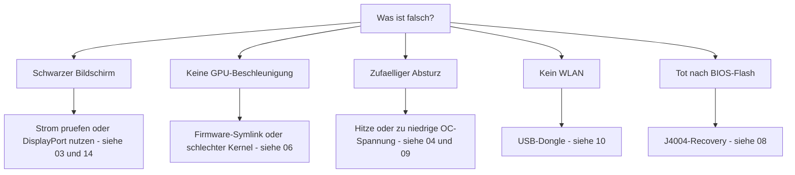

> 🌐 Community-Übersetzung. Die englische Version ist die maßgebliche Quelle und kann aktueller sein. Fehler gefunden? Öffne ein [Issue](https://github.com/lildebil0/awesome-bc250/issues). ([englisches Original](../en/troubleshooting.md))

# Troubleshooting

> **TL;DR** — Die Fehlerbilder der BC-250 sind gut bekannt: Die meisten sind **Strom**, **Hitze**, **Kernel/Firmware** oder **ein schiefgegangener Flash**. Finde dein Symptom unten, wende den Fix an und folge dem Link zum vollständigen Kapitel. Im Zweifel ist die Ursache meist *ein schlechter Kernel*, *der fehlende amdgpu-Firmware-Symlink* oder *zu wenig Kühlung*.

Diese Seite ist ein Symptom → Ursache → Fix-Index, destilliert aus den wiederkehrenden Problemen der Community. Sie ersetzt nicht die Kapitel — sie führt dich schnell zum richtigen.

---

## Boot / Display

| Symptom | Wahrscheinliche Ursache | Fix |
|---------|--------------|-----|
| Schwarzer Bildschirm / kein POST | Stromverkabelung oder Pinout falsch | Verkabelung und Pinout des 8-Pin erneut prüfen; echten Kupferdraht in ausreichendem Querschnitt verwenden → [03 — Strom](../en/03-power-supply.md) |
| Schwarzer Bildschirm / Abstürze, nachdem es lief | **IOMMU noch aktiviert** (auf diesem Board kaputt) | IOMMU im BIOS deaktivieren (elektricM); Kernel-Parameter `iommu=off`/`amd_iommu=off` ist ⚠ zu verifizieren → [06 — Linux](../en/06-linux.md) |
| Schwarzer Bildschirm beim Booten des **Installers** / Live-USB | Installer hat keinen BC-250-GPU-Treiber; KMS scheitert | `nomodeset` in GRUB hinzufügen (Fedora: Troubleshooting → Basic Graphics Mode); **nach der Mesa-Installation entfernen** ([elektricM](https://github.com/elektricM/amd-bc250-docs/blob/main/docs/troubleshooting/boot.md)) → [06 — Linux](../en/06-linux.md) |
| Schwarzer Bildschirm **nach dem Login** (GRUB + Login-Bildschirm waren in Ordnung) | Desktop-Sitzung, meist **Wayland** | X11 wählen („GNOME on Xorg"/„Plasma X11") beim Login, oder `WaylandEnable=false` ([elektricM](https://github.com/elektricM/amd-bc250-docs/blob/main/docs/troubleshooting/display.md)) → [14 — Display](../en/14-display.md) |
| Bootet, aber keine GPU-Beschleunigung (alles auf CPU) | Fehlender amdgpu-Firmware-Symlink oder ein schlechter Kernel | Den `navi10_gpu_info.bin`-Symlink + Kernel-Parameter anwenden; bekannt schlechte Kernel meiden (unten) → [06 — Linux](../en/06-linux.md) |
| `glxinfo` zeigt **llvmpipe**, Spiele 5–10 FPS | Mesa zu alt, oder amdgpu nicht geladen | **Mesa 25.1.3+** installieren, `nomodeset` entfernen, `Kernel driver in use: amdgpu` bestätigen ([elektricM](https://github.com/elektricM/amd-bc250-docs/blob/main/docs/troubleshooting/performance.md)) → [06 — Linux](../en/06-linux.md) |
| Lief, dann kaputt nach einem Kernel-Update | Regression in diesem Kernel | Auf einen LTS-Kernel zurückrollen; **6.14.7**, **6.15.0–6.15.6** und **6.17.8–6.17.10** zerschießen laut Berichten amdgpu (CPU-Fallback / GPU-Abstürze); elektricM empfiehlt **6.18.x LTS oder 6.17.11+** ⚠ exakte Bereiche verifizieren → [06 — Linux](../en/06-linux.md) |
| Kein HDMI-Audio | Regression in Kernel 6.17+ | Einen LTS-Kernel verwenden, oder Audio über USB/DisplayPort leiten → [06 — Linux](../en/06-linux.md) |
| Nur ein Display-Ausgang funktioniert | Treiber-Limitierung auf diesem Board | Bekannte Limitierung für natives Dual; ein **MST-Hub gibt bis zu 2 Bildschirme** (DP-1.4-Hub) ([elektricM](https://github.com/elektricM/amd-bc250-docs/blob/main/docs/hardware/display.md)) → [14 — Display](../en/14-display.md) |
| Kein Bild, kein POST, **nur mit eingebauter NVMe** | SSD hat noch **Windows**-EFI-/Recovery-Partitionen | SSD ausbauen, alle Partitionen an einem anderen PC löschen (`wipefs -a`), neu installieren ([elektricM](https://github.com/elektricM/amd-bc250-docs/blob/main/docs/troubleshooting/boot.md)) → [06 — Linux](../en/06-linux.md) |
| POSTet überhaupt nicht (kein BIOS) | Manche Boards POSTen nicht **ohne CMOS-Batterie** | Eine frische CR2032 einsetzen und erneut versuchen ([elektricM](https://github.com/elektricM/amd-bc250-docs/blob/main/docs/troubleshooting/boot.md)) → [08 — BIOS](../en/08-bios.md) |
| Boot **hängt ~90 s**, dann geht's weiter | Fehlgeschlagener systemd-Dienst / Netzwerk-Timeout | `systemctl --failed`; die hängende Unit deaktivieren ([elektricM](https://github.com/elektricM/amd-bc250-docs/blob/main/docs/troubleshooting/boot.md)) → [06 — Linux](../en/06-linux.md) |
| Kernel-Panic „**unable to mount root**" / „No init found" | Falscher Kernel **oder** beschädigtes initramfs | Einen älteren/LTS-Kernel booten; scheitert es weiter, chrooten und initramfs neu generieren (`dracut -f` / `update-initramfs -u -k all` / `mkinitcpio -P`) ([elektricM](https://github.com/elektricM/amd-bc250-docs/blob/main/docs/troubleshooting/boot.md)) → [06 — Linux](../en/06-linux.md) |
| Fällt auf `grub>` / `grub rescue>` | GRUB findet seine Config-/Boot-Dateien nicht | `root`/`prefix` setzen, `insmod normal`, booten; dann GRUB neu installieren ([elektricM](https://github.com/elektricM/amd-bc250-docs/blob/main/docs/troubleshooting/boot.md)) → [06 — Linux](../en/06-linux.md) |
| Komme nicht ins BIOS (Entf/F2 ignoriert) | Adapter zu langsam beim Init, oder Tastatur an USB 3.0 | Entf sofort tippen; einen **USB-2.0**-Port und ein natives DP-Kabel probieren ([elektricM](https://github.com/elektricM/amd-bc250-docs/blob/main/docs/troubleshooting/display.md)) → [08 — BIOS](../en/08-bios.md) |

## Hitze / Stabilität

| Symptom | Wahrscheinliche Ursache | Fix |
|---------|--------------|-----|
| Drosselt / FPS bricht unter Last ein | Serienkühlkörper kann auf dem Schreibtisch nicht kühlen | Lamellen ausdünnen + 120-mm-Lüfter/Shroud mit hohem statischem Druck; <80 °C halten → [04 — Kühlung](../en/04-cooling.md) |
| Zufälliger Absturz / Reboot unter Last | Überhitzung (>90 °C) **oder** Übertaktungsspannung zu niedrig | Zuerst die Kühlung verbessern; dann die Undervolt-Spannung anheben — Furmark-stabil ≠ spielstabil (Spiele brauchen mehr) → [04](../en/04-cooling.md) · [09](../en/09-overclock-undervolt.md) |
| Stabil in Furmark, stürzt in Spielen ab | Spannung aus Furmark ermittelt, das zu wenig belastet | Mit OCCT + echten Spielen testen; Spannung ~50 mV anheben → [09 — Übertakten](../en/09-overclock-undervolt.md) |
| Zwei Governor im Streit | oberon-governor *und* smu_oc/cyan-skillfish gleichzeitig am Laufen | Nur einen Governor laufen lassen; die anderen deaktivieren → [09 — Übertakten](../en/09-overclock-undervolt.md) |
| **Das ganze System** stirbt, wenn die GPU abstürzt (nicht nur die App) | APU: CPU+GPU teilen sich das Silizium, daher kann ein GPU-Reset nicht greifen — er reißt das System mit | Auf dieser Architektur zu erwarten; GPU-Abstürze verhindern (stabile Spannung + gute Kühlung + guter Kernel), statt auf Wiederherstellung zu hoffen ([elektricM](https://github.com/elektricM/amd-bc250-docs/blob/main/docs/troubleshooting/stability.md)) → [09 — Übertakten](../en/09-overclock-undervolt.md) |
| GPU stürzt ab → **schwarzer Bildschirm, erholt sich nie**, während ein Governor läuft | Governor schreibt während des Resets weiter ins sysfs → festhängende Reset-Schleife | Vor absturzgefährdeten Spielen `systemctl stop cyan-skillfish-governor-smu`; danach wieder aktivieren ([elektricM](https://github.com/elektricM/amd-bc250-docs/blob/main/docs/troubleshooting/stability.md)) → [09 — Übertakten](../en/09-overclock-undervolt.md) |
| Einfrieren / weißer Bildschirm bei **nur 60–65 °C** | Manche Boards sind ungewöhnlich temperaturempfindlich | Kühlung verbessern, Kühlkörper neu setzen, neu paste (PTM7950); Silizium variiert ([elektricM](https://github.com/elektricM/amd-bc250-docs/blob/main/docs/troubleshooting/stability.md)) → [04 — Kühlung](../en/04-cooling.md) |
| GPU **hängt bei 1500 MHz**, lässt sich nicht tiefer undervolten | Min-Spannung **unter 700 mV** gesetzt — das ist eine harte Untergrenze, die die GPU wieder festrastet | Min-Spannung **≥ 700 mV** halten ([elektricM](https://github.com/elektricM/amd-bc250-docs/blob/main/docs/troubleshooting/stability.md)) → [09 — Übertakten](../en/09-overclock-undervolt.md) |
| Artefakte / Abstürze, die mehr Spannung nicht behebt | **Spannungseinbruch (Droop)** unter Last (effektive V sackt unter gesetzte V) | Basis ~25 mV höher setzen, um den Droop abzudecken, oder ein BIOS mit dem Loadline-/Droop-Tweak verwenden ([elektricM](https://github.com/elektricM/amd-bc250-docs/blob/main/docs/troubleshooting/stability.md)) → [09 — Übertakten](../en/09-overclock-undervolt.md) |
| Bootet, stürzt dann mit **ACPI-Fehlern** ab (schwarzer/grüner Bildschirm) | BIOS-/ACPI-Eigenheit oder Korruption | CMOS löschen / BIOS-Defaults zurücksetzen; `acpi=off noapic` probieren; neu flashen, wenn es bestehen bleibt ([elektricM](https://github.com/elektricM/amd-bc250-docs/blob/main/docs/troubleshooting/stability.md)) → [08 — BIOS](../en/08-bios.md) |
| Sleep/Suspend = **Pseudo-Freeze** (schwarz, wirkt aufgehängt) | Board hat keine echten GPU-Schlafzustände; SMU unterstützt kein Linux-Suspend | Einschaltknopf zum Aufwecken drücken (nicht halten); besser: **Suspend deaktivieren** und Bildschirmabschaltung nutzen. Der Leerlauf bleibt ohnehin bei ~65–85 W ([elektricM](https://github.com/elektricM/amd-bc250-docs/blob/main/docs/troubleshooting/stability.md)) → [09 — Übertakten](../en/09-overclock-undervolt.md) |

## Performance

| Symptom | Wahrscheinliche Ursache | Fix |
|---------|--------------|-----|
| FPS niedriger als erwartet, GPU nicht ausgelastet | **CPU-limitiert** (Zen 2 ist in vielen Spielen die Grenze) | Normal; CPU-lastige Einstellungen senken, akzeptieren — die GPU zu übertakten hilft hier nicht → [11 — Gaming](../en/11-gaming.md) |
| Nur 24 CUs aktiv, 40 erwartet | Serienzustand legt weniger CUs frei | Die 40-CU-Freischaltung anwenden (`amdgpu.bc250_cc_write_mode=3` + Skript) → [09 — Übertakten](../en/09-overclock-undervolt.md) |
| Steam / FSR / VSync kaputt | „Gamer"-Distro-Fork stört | Manche getunten Forks zerschießen das; schlichtes Fedora/Bazzite-bc250 ist sicherer → [06 — Linux](../en/06-linux.md) |
| GPU **bei 1500 MHz festgenagelt**, unabhängig von der Last | Kein User-Space-Governor (Standard ist BIOS-gesperrt) | Einen GPU-Governor installieren (cyan-skillfish-governor-smu), um die Frequenz zu skalieren ([elektricM](https://github.com/elektricM/amd-bc250-docs/blob/main/docs/troubleshooting/performance.md)) → [09 — Übertakten](../en/09-overclock-undervolt.md) |
| Governor läuft, aber GPU **überschreitet 2000 MHz nicht** | Kernel fehlt der Frequenzbereich-Patch (Standard-Cap 1000–2000) | Einen gepatchten Kernel verwenden (Bazzite/CachyOS vorgepatcht) oder `amdgpu-frequency-range.patch` anwenden ([elektricM](https://github.com/elektricM/amd-bc250-docs/blob/main/docs/troubleshooting/performance.md)) → [09 — Übertakten](../en/09-overclock-undervolt.md) |
| MangoHud zeigt **655 %** GPU-Auslastung | amdgpu lässt die Aktivitäts-Metrik auf `0xFFFF`; MangoHud liest 65535/100 | cyan-skillfish-governor-smu (smu-Branch) laufen lassen — er patcht `gpu_metrics`; keine MangoHud-Änderung nötig. Oder das eigenständige **`install_gpu_usage_fix.sh`** anwenden ([Old Lamer — Teil XV](https://youtu.be/lSipaWjU6D4)) ([elektricM](https://github.com/elektricM/amd-bc250-docs/blob/main/docs/troubleshooting/performance.md)) → [09 — Übertakten](../en/09-overclock-undervolt.md) |
| **Headless** „GPU tut nichts" in einem Lasttest | `glmark2 --off-screen` fällt ohne Display still auf **llvmpipe** (CPU) zurück | Mit `clpeak` / `vkmark` / `llama-bench -ngl 99` testen; bestätigen, dass SCLK & Verbrauch steigen ([elektricM](https://github.com/elektricM/amd-bc250-docs/blob/main/docs/troubleshooting/performance.md)) → [06 — Linux](../en/06-linux.md) |
| 60+ FPS, aber **ruckelt** / ungleichmäßige Frame-Zeiten | Frame-Pacing (X11-Compositor oder audio-gekoppeltes Pacing) | Über **gamescope** laufen lassen (`-W 1920 -H 1080 -f`), oder den Compositor deaktivieren / Wayland probieren ([elektricM](https://github.com/elektricM/amd-bc250-docs/blob/main/docs/troubleshooting/performance.md)) → [11 — Gaming](../en/11-gaming.md) |
| Spiel **stürzt mit OOM ab / Artefakte, dann tot** (RDR2, CoH3) | Konflikt aus **512 MB dynamischem VRAM + ZRAM**, oder schlicht **RAM erschöpft** | BIOS auf **festen VRAM** umstellen (z. B. 10 GB RAM / 6 GB VRAM); **oder** systemd-ZRAM deaktivieren und **zswap + ein 32 GB großes Btrfs-Swapfile** nutzen ([Old Lamer — Teil XIV](https://youtu.be/A6juAoY70aU), Rezept in [06](../en/06-linux.md)/[09](../en/09-overclock-undervolt.md)) ([elektricM](https://github.com/elektricM/amd-bc250-docs/blob/main/docs/troubleshooting/stability.md)) → [08 — BIOS](../en/08-bios.md) |
| Bestimmtes Spiel (z. B. **RDR2**) rendert auf CPU/llvmpipe | Spiel wählt standardmäßig den falschen Grafik-Adapter | Den Adapter im Spiel auf die AMD-GPU setzen; RDR2: mit `-useMaximumSettings` starten ([elektricM](https://github.com/elektricM/amd-bc250-docs/blob/main/docs/troubleshooting/performance.md)) → [11 — Gaming](../en/11-gaming.md) |

## Netzwerk

| Symptom | Wahrscheinliche Ursache | Fix |
|---------|--------------|-----|
| Gar kein WLAN | Kein WLAN onboard; Dongle braucht einen Treiber | Einen bewährten Dongle nutzen (aic8800d80) + dessen Treiber bauen → [10 — WLAN/BT](../en/10-wifi-bt.md) |
| WLAN trennt sich alle paar Minuten | Realtek-Chipsatz + USB-Stromversorgung unter Last | Bekannt bei manchen RTL882x-Dongles; auf aic8800d80 oder ein bestätigtes Modell wechseln → [10 — WLAN/BT](../en/10-wifi-bt.md) |
| Treiber nach Reboot weg | Mit nacktem `make` gebaut, nicht paketiert | Den RPM-/DKMS-Weg des Repos nutzen, damit er Kernel-Updates übersteht → [10 — WLAN/BT](../en/10-wifi-bt.md) |
| ISP **drosselt Steam** bis zum Kriechtempo | DPI/Drosselung des Steam-CDN-Verkehrs | Anti-Drosselungs-Tools (`zapret`-Stil) helfen — aber **Bazzites schreibgeschütztes FS blockiert sie**; eine veränderbare Distro nutzen (Fedora/Arch). RU-Operator-Spezifika (Yota, zapret+warp) in der [russischen Ausgabe](../ru/06-linux.md) → [06 — Linux](../en/06-linux.md) |

## Windows

| Symptom | Wahrscheinliche Ursache | Fix |
|---------|--------------|-----|
| GPU = Code 43 / keine Beschleunigung | Kein funktionierender Windows-GPU-Treiber (Stand Anfang 2026) | Zu erwarten. Nimm Linux. Windows-Treiber sind experimentelle WIP → [07 — Windows](../en/07-windows.md) |

## BIOS / Brick

> ⚠ **Lies [08 — BIOS](../en/08-bios.md) vollständig vor jedem Flash.** Ein schlechter Flash brickt das Board, und ein CMOS-Clear stellt die 1.0/3.00-Mod **nicht** wieder her.

| Symptom | Wahrscheinliche Ursache | Fix |
|---------|--------------|-----|
| Tot/schwarz nach einem BIOS-Flash | Schlechtes Image oder falsche Einstellungen | Externe Wiederherstellung: einen CH341A mit dem **J4004-Header** verdrahten (der SOIC-8-Clip funktioniert auf diesem Board **nicht**) und ein bekannt gutes Image neu flashen → [08 — BIOS](../en/08-bios.md) |
| Programmer kann den Chip nicht lesen | 5-V-Datenleitungen / falscher Chip anvisiert | 3,3 V verwenden; den 16-MB-`BIOS_A1` flashen, niemals den 512-KB-SuperIO → [08 — BIOS](../en/08-bios.md) |
| Einstellungen bleiben nicht erhalten | Alte Mod-Version | Die 5.00-Mod verwenden, bei der RAM-/GDDR6-Timings tatsächlich greifen → [08 — BIOS](../en/08-bios.md) |
| Bootet nicht nach Ändern von **RAM-Timings/-Frequenz** | Instabile Speichereinstellungen haben das **BIOS beschädigt** (P3.00-Watchdog; im russischen BC-250-Chat berichtet) | Ein CMOS-Clear reicht eventuell nicht — **Hardware-Reflash** (CH341A / Pi Pico) eines bekannt guten Images. Funktionierendes BIOS *vor* dem RAM-Tuning sichern; ein Timing nach dem anderen tunen (tREF bringt am meisten) ([elektricM](https://github.com/elektricM/amd-bc250-docs/blob/main/docs/troubleshooting/stability.md)) → [08 — BIOS](../en/08-bios.md) |
| BIOS-Einstellungen bleiben nicht erhalten → schwarzer Bildschirm / wenig RAM | CMOS nach USB-Flash nicht gelöscht (eventuell 2–3 Clears nötig) | CMOS löschen, neu konfigurieren, **ins BIOS** rebooten, um zu bestätigen, dass 512 MB noch gesetzt sind; prüfen, dass `free -h` ~15,5 GB zeigt ([elektricM](https://github.com/elektricM/amd-bc250-docs/blob/main/docs/troubleshooting/stability.md)) → [08 — BIOS](../en/08-bios.md) |

---

## Immer noch hängen geblieben?
- Sieh in die **[FAQ](faq.md)**.
- Durchsuche den Community-Chat nach Thema (die **Quellen** jedes Kapitels verlinken auf echte Diskussionen).
- Wenn du um Hilfe bittest, nenne deine **Distro + Kernel-Version**, **Takt/Governor** und **Kühlung** — diese drei erklären die meisten Probleme.

### Quellen für die Zeilen oben
- elektricM-Troubleshooting-Guides — [`boot.md`](https://github.com/elektricM/amd-bc250-docs/blob/main/docs/troubleshooting/boot.md) · [`display.md`](https://github.com/elektricM/amd-bc250-docs/blob/main/docs/troubleshooting/display.md) · [`performance.md`](https://github.com/elektricM/amd-bc250-docs/blob/main/docs/troubleshooting/performance.md) · [`stability.md`](https://github.com/elektricM/amd-bc250-docs/blob/main/docs/troubleshooting/stability.md) · [`hardware/display.md`](https://github.com/elektricM/amd-bc250-docs/blob/main/docs/hardware/display.md)
- Old Lamer (YouTube): [Teil XIV — zswap + 32 GB Btrfs-Swap](https://youtu.be/A6juAoY70aU) · [Teil XV — `install_gpu_usage_fix.sh`](https://youtu.be/lSipaWjU6D4)
- [4pda BC-250-Thread](https://4pda.to/forum/index.php?showtopic=1104980) — RU-ISP-Steam-Drosselung (Yota, zapret+warp).
- Die kapitelweisen Community-Chat-Belege stehen in den **Quellen** des jeweils verlinkten Kapitels.
