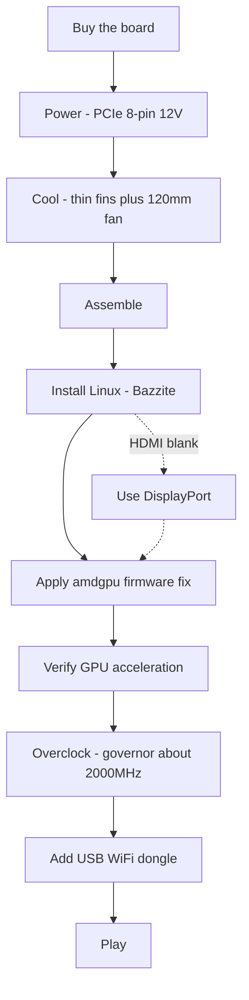

# Start Here — Zero to Gaming

> **TL;DR** — You bought (or are about to buy) an AMD BC-250. It's a PlayStation 5-derived APU board with 16 GB GDDR6 that makes a cheap Linux gaming/AI box — **if** you solve three things in order: **power**, **cooling**, and **Linux drivers**. This page is the straight line from a board in a box to a game running. Follow the steps; each links to a full chapter.

This board is a project, not a plug-and-play PC. Budget a weekend. The two ways people kill a board early are **wrong power wiring** and **running it hot** — so we do those first.

---

## Before you start — parts & tools

Have these on hand *before* you begin, so you don't discover each one mid-build:

- **PSU** with a PCIe 8-pin 12 V output → **[03 — Power Supply](03-power-supply.md)**
- **120 mm high-static-pressure fan** + printed shroud → **[04 — Cooling](04-cooling.md)** / **[05 — Cases & 3D Printing](05-case.md)**
- A **printed case or mount** → **[05 — Cases & 3D Printing](05-case.md)**
- **USB stick ≥ 16 GB** for the Linux installer
- A **DisplayPort cable** (or DP→HDMI adapter — the board's HDMI often shows nothing, DisplayPort is safest)
- A **screwdriver**
- A **multimeter** — to magnet/continuity-test the PSU wiring → **[03 — Power Supply](03-power-supply.md)**

---

## The path

### 0. Know what you have
A BC-250 is a server/mining blade: one APU (Zen 2 CPU + RDNA2-class GPU, "Cyan Skillfish/Oberon"), 16 GB GDDR6, **passive heatsink**, powered by a single **12 V PCIe 8-pin**. No onboard WiFi, no working Windows GPU driver, no hardware video encode. → **[01 — What Is the BC-250](01-what-is-bc250.md)**

### 1. Buy the right thing
Know what a fair price is, what's in the box (board only? heatsink? PSU?), and which sellers/scams to avoid. → **[02 — Buying Guide](02-buying.md)**

### 2. Sort out power *before first boot*
The board wants ~235 W (more overclocked) on 12 V through a PCIe 8-pin. Use a real PSU (server Flex / Mean Well brick / ATX), wire the 8-pin correctly with **genuine-copper wire of adequate gauge**, and don't guess the pinout — a mistake here is a dead board. → **[03 — Power Supply](03-power-supply.md)**

### 3. Fix the cooling *before you stress it*
The stock heatsink is built for a rack wind-tunnel and **throttles on a desk**. Thin the fins and bolt a high-static-pressure 120 mm fan through a printed shroud (or go AIO). Target: stays under ~80 °C in Furmark. → **[04 — Cooling](04-cooling.md)**

### 4. Put it in a case (optional but nice)
Print a console-style case that mounts the board, fan, and PSU with real airflow. Catalog of community STLs. → **[05 — Cases & 3D Printing](05-case.md)**

### 5. Assemble it
Physical order of operations for a minimal build: mount the fan to the printed shroud → clip/screw the shroud over the (thinned) heatsink fins → seat the board in the case/mount → connect the PSU's 8-pin to the board (correct pinout, **[03 — Power Supply](03-power-supply.md)**) → connect a DisplayPort cable to the monitor → power on and confirm it **POSTs** (POST = power-on self-test; it powers up and outputs video — you get a picture / the fan spins). Do any fin-sanding *before* mounting (see **[04 — Cooling](04-cooling.md)**) and keep metal dust off the board.

> A labeled photo/diagram of this assembly is a welcome contribution — the repo doesn't have one yet.

### 6. Install Linux + GPU drivers
This is the make-or-break step. Easiest for newcomers: a **Bazzite-based image** built for the BC-250. Then apply the **amdgpu firmware fix** (the `navi10_gpu_info.bin` symlink) and kernel params, regenerate initramfs/grub, and verify the GPU is accelerated (`vainfo`, `dmesg`). → **[06 — Linux Drivers & Setup](06-linux.md)**

> Thinking Windows? As of early 2026 there is **no working Windows GPU driver** — it's experimental. Use Linux. → **[07 — Windows](07-windows.md)**

### 7. Verify it works at stock, then overclock
Once the desktop is accelerated, install the **oberon-governor** and push clocks (1500 MHz stock is weak; **2000 MHz ≈ +30 % FPS**). Optionally unlock all **40 CUs** and undervolt. Re-test temps under the new clocks. → **[09 — Overclocking & Undervolting](09-overclock-undervolt.md)**

### 8. Get online
No onboard WiFi — add a **known-good USB dongle** (aic8800d80 is the community favorite) and its driver. → **[10 — WiFi & Bluetooth](10-wifi-bt.md)**

### 9. Play
Set realistic expectations (the Zen 2 CPU is often the limit, not the GPU), turn on FSR, and use community per-game settings. → **[11 — Gaming Results & Settings](11-gaming.md)**

### Bonus — run local LLMs
16 GB VRAM is a lot for the price. Run llama.cpp on the **Vulkan** backend (ROCm is a dead end on this GPU). → **[12 — AI / LLM](12-ai-llm.md)**

### Bonus — emulation
Switch, PS3, PS4, retro, arcade — what actually runs, and how → **[15 — Emulation](15-emulation.md)**

> No picture on first boot? The board outputs over **DisplayPort** (HDMI is often blank) → **[14 — Display & Output](14-display.md)**. Out of USB ports, or adding a drive? → **[16 — USB, Hubs & Storage](16-usb-peripherals.md)**

---

## If something breaks
Black screen, no acceleration, random resets, dongle drops, a brick after a BIOS flash — see **[Troubleshooting](troubleshooting.md)** and the **[FAQ](faq.md)**.

> Flashing a modded BIOS is **not** a starting step. It can brick the board and needs recovery hardware. Only go there deliberately. → **[08 — BIOS & Brick Recovery](08-bios.md)**

---

## The 60-second checklist

| Step | Done when |
|------|-----------|
| Power | PSU wired to 8-pin, correct pinout, genuine-copper wire, board POSTs |
| Cooling | Fins thinned + 120 mm fan/shroud; <80 °C in Furmark |
| OS | Bazzite-bc250 installed, boots to desktop |
| GPU | `vainfo`/`dmesg` show amdgpu active, not CPU fallback |
| Overclock | oberon-governor running, ~2000 MHz, stable in a real game |
| Network | USB dongle connects and stays up |
| Game | Runs at expected FPS for your clocks |

When every row is checked, you're done. Welcome to the BC-250 club.
