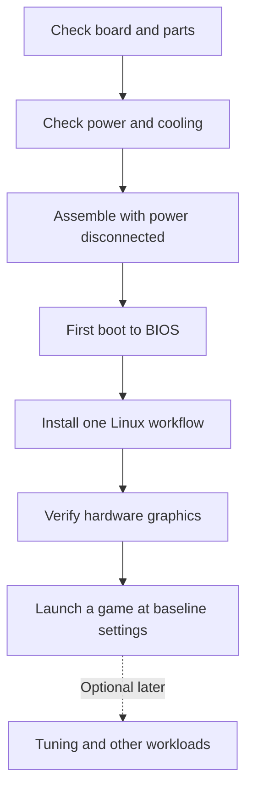

# Start Here — Zero to Gaming

> **The goal is a first working game, not a mandatory overclock.** Follow the build, first-boot, installation and verification steps below. BIOS flashing, CPU/CU unlocking and custom voltage curves are separate projects, not prerequisites.

[English](00-start-here.md) · [Русский](../ru/00-start-here.md) · [Українська](../uk/00-start-here.md) · [All chapters 00–17](../../README.md#quick-start)

## Before you start — parts & tools

Check what came with the board before buying anything else:

- **A suitable 12 V PSU and checked PCIe 8-pin cable.** An EPS/CPU plug is not interchangeable; neither a nominal PSU wattage nor a contact-current calculation certifies the cable. See [03 — Power supply](03-power-supply.md).
- **Active cooling:** a fan with a suitable mount/shroud to move air through the heatsink and around the back of the board. A 120 mm high-static-pressure fan is a common approach. See [04 — Cooling](04-cooling.md).
- **An SSD and the matching connection/adapter**, not just an installer USB stick. See [16 — Storage and peripherals](16-usb-peripherals.md).
- **A monitor and DisplayPort cable**, keyboard and mouse. Check any DP→HDMI adapter separately. See [14 — Display](14-display.md).
- **A USB installer drive** large enough for the chosen image; 16 GB is a useful starting choice, but check the download size.
- **A screwdriver and secure non-conductive mounting.** A printed case is optional. See [05 — Cases](05-case.md).
- **A multimeter** to check continuity with power disconnected and to measure voltage in the correct voltage mode. Do not use continuity mode on powered wiring; a multimeter is not a magnet or a certificate of wire material.
- **Network access** for downloads and installation: wired Ethernet, or a supported WiFi dongle and its driver. Arrange this before installation if the installer needs a connection. See [10 — Networking](10-wifi-bt.md).

## The path


```mermaid
flowchart TD
    A[Check board and parts] --> B[Check power and cooling]
    B --> C[Assemble with power disconnected]
    C --> D[First boot to BIOS]
    D --> E[Install one Linux workflow]
    E --> F[Verify hardware graphics]
    F --> G[Launch a game at baseline settings]
    G -. Optional later .-> H[Tuning and other workloads]
```

### 0. Know what you have

Identify the board, connector layout, heatsink and any changes made by a previous owner. BC-250 has a Zen 2 CPU, RDNA2-class graphics and a shared 16 GB GDDR6 pool; that is not 16 GB of independent RAM plus another 16 GB of VRAM. Record the BIOS version before changing settings. See [01 — Board overview](01-what-is-bc250.md).

### 1. Buy only what is missing

Compare the bundle against the checklist above. Check the seller's description, condition and included parts; if the board is already yours, skip buying another board. See [02 — Buying](02-buying.md).

### 2. Sort out power before first boot

Use the checked cable and pinout from [03 — Power supply](03-power-supply.md), not a plug that merely fits. For stock gaming, that chapter gives a 300 W+ 12 V rail starting point; sustained unlocked compute needs a separate power budget. Do not add parallel supplies, homemade splitters or SATA-power adapters as a beginner shortcut. Make all connections with the PSU disconnected.

### 3. Arrange cooling before loading the board

The passive rack heatsink needs forced airflow on a desk. Secure the fan, give air a route through the fins and leave the back of the board ventilated. Do not make sanding/cutting the heatsink a compulsory first step: choose a working cooling arrangement from [04 — Cooling](04-cooling.md). If you do modify it, remove it from the board and clean away conductive debris before reassembly.

### 4. Mount the board

Secure the board and cooler in a case or suitable open mount without shorts, loose metal parts or blocked airflow. Check cable clearance. Printed cases and mounts are in [05 — Cases](05-case.md).

### 5. Assemble and reach BIOS

With the board powered off and the PSU disconnected:

1. Secure the cooler/fan and board.
2. Connect the SSD with the appropriate adapter from [16](16-usb-peripherals.md).
3. Connect the verified power cable from [03](03-power-supply.md).
4. Connect the monitor over DisplayPort and a keyboard.
5. Apply power and enter BIOS/Setup; confirm that you get a setup screen and that the installation drive is available.

**A spinning fan alone does not prove POST or working graphics.** No picture or no boot? Stop here and use [Troubleshooting](troubleshooting.md); do not erase the SSD or flash firmware to guess at a fix. See [14](14-display.md) for monitor/adapter diagnosis.

### 6. Install one Linux workflow

Start with [06 — Linux](06-linux.md), choose **one** path and follow it through to its reboot and verification:

- **Bazzite:** install regular Bazzite first. Then choose stock Bazzite with the SMU governor, or the normal stable [62fixolab BC250 image](https://github.com/62fixolab/Latest-Bazzite-AMD-BC-250-Patched-Images) matching your desktop. `-40cu`, testing and unstable images are not the first-build path.
- **Fedora or CachyOS/Arch:** use the instructions for that distribution, not Bazzite's package/rebase commands.

**Do not apply a firmware symlink, rebuild initramfs or replace the kernel just because an old checklist says so.** Current firmware or a prepared image may already supply the required setup; manual fixes belong to the specific path that still needs them. Likewise, do not flash a modified BIOS or impose one UMA size on every OS as part of this generic route. If your selected path needs BIOS settings, follow [08 — BIOS](08-bios.md) with a record of the original settings.

If you used basic graphics mode / `nomodeset` to reach the installer, follow [06](06-linux.md) to remove it once the graphics setup is ready and reboot. Kernel regressions and driver versions are tracked there rather than frozen in this starting page. Create a normal user account; do not run Steam as root.

### 7. Verify the baseline before tuning

Open a terminal in the installed desktop. These commands only report graphics information:

```bash
glxinfo -B
vulkaninfo --summary
```

- The **OpenGL renderer** should identify the AMD hardware, not `llvmpipe`.
- Vulkan should expose an **AMD/BC250 hardware device**, typically `AMD Radeon Graphics (RADV GFX1013)`. A software device may also be listed; its presence does not invalidate the AMD device. Select the hardware device for games.
- A missing command means the diagnostic utility is missing, not that the GPU is broken; see [06](06-linux.md) for the distro workflow. A Mesa version alone does not prove hardware rendering.
- `vainfo` checks video-codec support, not OpenGL/Vulkan gaming acceleration. Codec failures and compute-based encoding are separate topics; see [17](17-projects-and-tools.md).

Check temperatures with the monitoring configured for your image ([04](04-cooling.md), [06](06-linux.md)). First use the image's documented baseline settings, without your own clock/voltage changes or core/CU unlock. If a governor is already supplied, check its configuration rather than starting a second one. Governor selection, installation and verification belong to [09](09-overclock-undervolt.md); reaching 2000 MHz is not a first-game acceptance criterion.

### 8. Get online

Try wired networking first if available. For WiFi/Bluetooth use the dongle's actual chipset and the driver for your OS, not just its retail name. Confirm that downloads stay connected. If the installer needed a network, do this before step 6. See [10 — WiFi and Bluetooth](10-wifi-bt.md).

### 9. Launch a game

Use Steam under your normal account, install a game and start with settings from [11 — Gaming](11-gaming.md). Check that the game uses hardware graphics, temperatures remain controlled, and there are no artifacts or resets. If it fails, diagnose the baseline before adding FSR, custom Mesa, undervolting or unlocked units.

After a successful run, **reboot and try again** so the result is not limited to one temporary session. Only then add optional tools from [17 — Control Center, upscalers and streaming](17-projects-and-tools.md), one change at a time.

## If something breaks

Use [Troubleshooting](troubleshooting.md) and [FAQ](faq.md) for the failed stage. Record the OS image/deployment, kernel, renderer output and recent changes. On Bazzite, preserve a known-working deployment with `sudo ostree admin pin booted`; if an update/rebase fails, select the preserved deployment or use the rollback procedure in [06](06-linux.md). Do not wipe a drive as a default diagnostic.

BIOS flashing and recovery are in [08](08-bios.md), not the first-boot checklist.

## The 60-second checklist

| Stage | Done when |
|---|---|
| Parts | PSU/cable, cooling, SSD, display, input devices and installer are ready |
| Power and assembly | Pinout checked, board securely mounted, BIOS screen reachable |
| Cooling | Active airflow works; temperatures do not run away or trigger resets in the game |
| OS | Selected Linux path completed; desktop boots after a reboot |
| GPU | OpenGL/Vulkan expose hardware rendering, not only software fallback |
| Network | Downloads complete without losing the connection |
| Game | Runs without artifacts/resets at baseline settings, including after a reboot |
| Recovery | Important data is backed up; working settings/deployment and rollback path recorded |

No row requires BIOS flashing, a specific overclock, eight CPU cores or 40 CUs.

## After the first game

- **Optional tuning:** [09 — Governor, clocks and voltage](09-overclock-undervolt.md).
- **Local models and compute:** [12 — AI / LLM](12-ai-llm.md).
- **Emulation:** [15 — Emulation](15-emulation.md).
- **Alternative OS paths:** [07 — Windows](07-windows.md) · [13 — macOS / MetalCyan](13-macos.md).
- **Applications:** [17 — Control Center, FSR4, HelixSR and streaming](17-projects-and-tools.md).
- **Other projects:** [Thematic catalog](../../catalog/en/README.md).

The [upstream quick-start](https://elektricm.github.io/amd-bc250-docs/getting-started/quick-start/) and [quick reference](https://elektricm.github.io/amd-bc250-docs/reference/quick-reference/) provide background; the per-OS instructions in chapter 06 determine which steps your installation actually needs. This page describes a workflow, not a claim that we tested your board.
