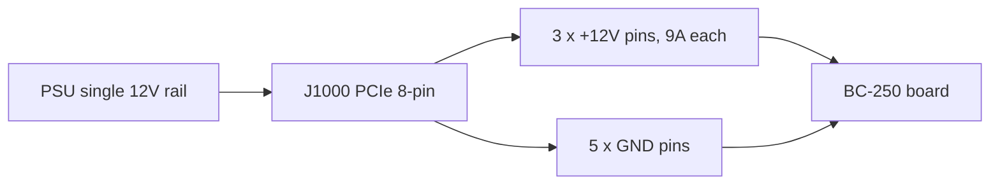

# Power Supply

> **TL;DR** — The BC-250 has **no power button and no standard PC power plug**. It eats **12 V** through a single **PCIe 8-pin (6+2)** connector — the same plug a desktop graphics card uses — and peaks around **~235 W** (more if you overclock). You need a 12 V source that can deliver **~250–300 W on one rail**. Three roads the community takes: a cheap **server "Flex" PSU** (HP 500 W, ~$12 on eBay), an **industrial brick** (Mean Well LOP-300/LOP-500), or a **normal ATX PSU** (just plug its PCIe cable in). The two killers to avoid: an **old PSU that splits 12 V across weak rails**, and **fake copper-clad-steel wires** that overheat and catch fire. Use real copper, **16 AWG or thicker**.

Powering the board is the **second thing a newcomer has to get right** (after [cooling](04-cooling.md)) — and the one most likely to start a fire if you cut corners on wiring.

---

## What the board actually needs

The BC-250 is a cut-down PlayStation 5 die on a crypto-mining/server board. It was meant to sit in a rack and be fed 12 V — so it has **none of the conveniences of a normal PC**:

- **No ATX 24-pin** motherboard connector.
- **No power button** — it powers on the instant 12 V arrives (the PSU's own switch is your power button).
- **One job for the PSU: deliver 12 V at enough current.**

**Power figures (confirmed):**

| Spec | Value | Source |
|------|-------|--------|
| Input voltage | 12 V DC | [hardware.md](https://github.com/mothenjoyer69/bc250-documentation/blob/main/hardware.md) |
| Typical peak draw | ~220–235 W | community-observed ([src](https://t.me/c/2424231195/31076)) |
| Connector | PCIe 8-pin (6+2) | [hardware.md](https://github.com/mothenjoyer69/bc250-documentation/blob/main/hardware.md) · ([src](https://t.me/c/2424231195/14450)) |
| Peak current on 12 V | ~18–20 A typical, design headroom to ~40 A | ([src](https://t.me/c/2424231195/31076)) |

> **"PCIe 8-pin (6+2)"** means a graphics-card power plug: six pins in a block, plus a detachable 2-pin clip, so the same cable works as either 6-pin or 8-pin. **6+2** = 6 fixed + 2 removable. This is *not* the CPU/EPS 8-pin from your motherboard — see the warning below.

A PCIe 8-pin is rated for **150 W** by the PCIe standard, and the board's three 12 V contacts (Molex Mini-Fit Jr, 9 A each) can safely pass **up to ~324 W** ([hardware.md](https://github.com/mothenjoyer69/bc250-documentation/blob/main/hardware.md)). So a single 8-pin is comfortably enough at stock; the headroom matters only when you push an aggressive overclock.

**How much PSU power to buy:** target **300 W or more on the 12 V rail**. A 300 W unit gives a healthy margin over the ~235 W peak and keeps the PSU fan calm; people report a 500 W Flex server PSU runs near-silent on this load ([src](https://t.me/c/2424231195/31076)). Don't buy below ~250 W "to save money" — you'll run it at the edge and it will get loud or shut down.

> **Clamp-meter power curve (first-party amperage).** A teardown clamped a DC ammeter on the 12 V feed and read the board's actual current: **gaming pulls ≈17 A / ~190 W**, while a **full synthetic stress load hits ≈21 A / ~240–250 W** at **2000 MHz / 960 mV**; nudging the voltage higher pushes it to **22–23 A and beyond** ([Old Lamer — Part VII](https://youtu.be/pxahl9-YgkY) ~9:01). These sharpen the community wall-power figures above with measured rail amperage — and confirm why the 300 W target leaves the right margin. *(Figures read from auto-captions — treat the exact numbers as approximate.)*

> ⚠️ **Named PSUs to avoid:** the cheap **Dell D220P-01** (220 W) and **Dell D250AD-00** (250 W) are called out as **insufficient and dangerous** for this board — at 220 W / 250 W they sit below the board's peak and have been reported to cut out or even break under gaming load. Don't buy a unit just because it's cheap and "looks like enough." ([elektricM: power](https://elektricm.github.io/amd-bc250-docs/hardware/power/))

---

## ⚠️ The two mistakes that destroy boards

Read this section before you buy anything.

### 1. Don't confuse the PCIe 8-pin with the CPU/EPS 8-pin

Your ATX PSU has **two different 8-pin plugs**: one for graphics cards (**PCIe**) and one for the CPU (**EPS/CPU**, sometimes labelled "CPU" or "4+4"). **They look almost identical but their pin shapes and polarity are reversed.** Forcing a CPU plug into the BC-250 puts **+12 V where ground should be** — you can burn the whole board.

> *"It's been discussed a billion times — we have a PCIe power input. If the shape of the end pin is different, you've got a CPU plug… it literally has the opposite polarity, plus where minus should be. You can burn everything to hell."* ([src](https://t.me/c/2424231195/14450))

The board has **no sense-pin checking**, so nothing stops you from plugging in the wrong thing. The safe habit: **look at the connector clip shape, and if unsure, check + and − with a multimeter before powering on.**

### 2. Don't use fake "copper" wire — it's a fire hazard

This is the single most-repeated safety warning in the chat. Cheap pre-made adapter cables and bargain "PCIe" cables are often **copper-clad steel (CCS)** or **copper-clad aluminium (CCA)** — a thin copper skin over a steel/aluminium core. Steel has **~6× the resistance of copper**, so the wire overheats under load and can melt or ignite.

> *"The wire from the adapter overheated badly under load. It turned out it wasn't copper but iron (steel) with a thin copper coating… high resistance, heats up a lot, can cause a fire. For reliable and safe operation you MUST use full-copper wires of at least 2.5 mm²."* ([src](https://t.me/c/2424231195/108733))

> *"Checked it with a magnet 🤣 — steel threads. Resistance of these steel 'threads' is 6× higher than copper. What 450 W are they even talking about?"* ([src](https://t.me/c/2424231195/133546))

**Test before you trust:** a magnet sticks to steel, not to copper. If a connector or wire is magnetic, throw the cable out.

This isn't only no-name cable. **Apevia Flex/ITX PSUs have been seen with steel wires** — magnet-test them, because steel gets very hot under load and is a fire hazard. The **Apevia ITX-PFC400W** Mini-ITX uses a **14-pin connector** (it works with the [LITE adapter](#automatic-ps_on--community-adapter) below, but is advised against). (r/BC250Gaming)

> 🔴 **Never power the BC-250 through a SATA or Molex adapter.** The board pulls **220–280 W**, and these connectors physically cannot deliver that safely:
> - A **SATA→PCIe/8-pin adapter is a fire hazard** — a SATA power connector is rated for only **~54 W** ([elektricM: power](https://elektricm.github.io/amd-bc250-docs/hardware/power/)).
> - A **bare Molex feed tops out at ~156 W** combined (two Molex connectors) — still not enough ([elektricM: power](https://elektricm.github.io/amd-bc250-docs/hardware/power/)).
>
> Feed the board only from a **real PCIe 8-pin / EPS-class 12 V source**. This is separate from the copper-vs-steel warning above: even a *full-copper* SATA or Molex adapter is unsafe here, because the connector itself is under-rated for a 220–280 W load.

---

## Wire gauge & connector guidance

The board documentation and the chat agree on the same safe baseline:

| Use case | Wire | Source |
|----------|------|--------|
| Single 8-pin, stock / light OC | **16 AWG** copper (~1.3 mm²) | [hardware.md](https://github.com/mothenjoyer69/bc250-documentation/blob/main/hardware.md) |
| Hand-built cable, want margin | **2.5 mm²** (~13 AWG) full copper | ([src](https://t.me/c/2424231195/108733)) |
| Heavy overclock | thicker / **dual feed** (see J2000/J2001) | [hardware.md](https://github.com/mothenjoyer69/bc250-documentation/blob/main/hardware.md) |

The numbers don't conflict — **16 AWG is the documented minimum**; the 2.5 mm² figure is one builder choosing extra headroom after a CCS-wire scare. **The non-negotiable part is "real copper," not the exact gauge.** Lower AWG number = thicker wire = safer.

For connector contacts that carry the full current, target ones rated for the peak: builders aim for contacts/wire good for **~40 A** on a heavy build, and bolt or properly crimp them rather than relying on a flimsy push-fit ([src](https://t.me/c/2424231195/31076)).

---

## The 8-pin pinout (J1000)

Looking at the board's main power connector — the **top row is all ground, the bottom row is 12 V except one ground**. From [hardware.md](https://github.com/mothenjoyer69/bc250-documentation/blob/main/hardware.md):

```
J1000 (PCIe 8-pin), contacts facing you:

  [ GND  GND  GND  GND ]   ← top row: all ground (−)
  [ GND  12V  12V  12V ]   ← bottom row: one ground + three 12 V (+)
```

The chat states the same polarity in plain words — count the pins **1 to 3 = +12 V, pins 4 to 8 = ground**:

> *"Pins one through three should be +, the rest from four to eight are minus… The board has no sense check. Take a tester and see where + and − are."* ([src](https://t.me/c/2424231195/14450))

How the single 12 V rail splits across the eight contacts — three carry +12 V, five are ground:



This matches a standard PCIe 8-pin exactly, which is *why* a normal ATX PSU's PCIe cable just works. **If you build your own cable, verify every pin with a multimeter before first power-on** — polarity mistakes are unforgiving here.

The board also has two smaller alternative power connectors, **J2000** and **J2001** — useful only for a heavy overclock and covered in full below.

---

## Beyond 300 W — the J2000 / J2001 second power connector

> ⚠️ **Read this first.** Everything in this section is **extra 12 V wiring done by hand**. The board has **no polarity or sense check** on these pins (same as J1000) — swap +12 V and ground and you burn the board the instant it powers on. A second feed only adds headroom if **both feeds share the same PSU / same 12 V rail at the same potential**; tying two different supplies together can push current backwards through one of them. If you are not comfortable crimping and metering your own connectors, stop here and stay on a single [J1000 8-pin](#the-8-pin-pinout-j1000).

A single PCIe 8-pin into [J1000](#the-8-pin-pinout-j1000) is comfortable at stock and light OC — its three 12 V contacts are good for **~324 W** (9 A × 3 × 12 V, or up to ~468 W with industrial-grade contacts) ([hardware.md](https://github.com/mothenjoyer69/bc250-documentation/blob/main/hardware.md)). The reason this section exists: a **40-CU board on an aggressive overclock can pull more than 300 W** ([src](https://t.me/c/2424231195/143787)), which is right at the edge of one 8-pin's comfort zone. The board was designed for a rack where a **second PSU** feeds two extra connectors — **J2000** and **J2001** — so the clean way to get desktop overclock headroom is to **supplement J1000 with J2000/J2001** (or solder straight to the board) rather than overload one plug ([hardware.md](https://github.com/mothenjoyer69/bc250-documentation/blob/main/hardware.md)). This is also the most-requested diagram in the chat ([src](https://t.me/c/2424231195/135741)).

### Pinout (from the board documentation)

J2000 and J2001 are **not identical**. They are compatible with **Molex Micro-Fit BMI** ([part 444280801](https://www.molex.com/en-us/products/part-detail/444280801)). Pin 1 is the white silkscreen triangle (`v` below):

```
        J2000                    J2001
   v                        v
[ LED1  12V  12V  12V ]   [ 12V  12V  12V  PGD ]
[ LED2  GND  GND  GND ]   [ GND  GND  GND  GND ]
```

| Pin | Meaning |
|-----|---------|
| `12V` | +12 V power in (three per connector) |
| `GND` | Ground |
| `PGD` | **PGOOD** — reads 5 V when a second PSU is present in a rack backplane; a signal pin, **not** a power output |
| `LED1` / `LED2` | Active-low LED outputs that mirror the green / red backplane LEDs |

**For redundancy, the documentation says to use both J2000 and J2001** ([hardware.md](https://github.com/mothenjoyer69/bc250-documentation/blob/main/hardware.md#j2000-and-j2001)). Note the **column layout differs** between the two — on J2000 the LED pins sit in the first column and all three 12 V pins are on the top row; on J2001 the PGD pin sits in the top-right and the bottom row is all ground. **Meter every pin before connecting** — do not assume a Micro-Fit housing seats the same way on both. ⚠ verify the exact pin-1 orientation against your own board with a multimeter; the LED/PGD pins must **never** receive 12 V.

### The practical method the community uses

You do not need the rack backplane. The repeated chat recipe is simply: **run one PCIe 8-pin into J1000, then crimp a Molex Micro-Fit 3.0 plug and feed the same 12 V into the adjacent J2000** ([src](https://t.me/c/2424231195/142662), [src](https://t.me/c/2424231195/138371)). One builder describes the exact cable as *"one PCIe connector and two Micro-Fit 3p connectors"* off a single supply ([src](https://t.me/c/2424231195/143938)) — i.e. split the 12 V/GND from one PCIe cable out to both the 8-pin and the Micro-Fit feed.

**Connector to buy** (self-assembled, Molex Micro-Fit 3.0):

| Part | Molex number | Note |
|------|--------------|------|
| Housing | **43025-0800** (8-circuit) | the plug body ([src](https://t.me/c/2424231195/142659), [src](https://t.me/c/2424231195/14797)) |
| Crimp terminals | **43030** series | one per wire ([src](https://t.me/c/2424231195/142659)) |

Only populate the **12 V and GND** positions (match the pinout table above); leave `PGD` / `LED1` / `LED2` empty. Use the same **real-copper, ≥16 AWG** wire and crimp discipline as the [main 8-pin — see wire-gauge guidance](#wire-gauge--connector-guidance); a hand-crimped 12 V feed that overheats is exactly the fire risk described earlier in this chapter.

> 🛠 **Micro-Fit assembly gotchas (from a Molex how-to).** Practical notes for crimping these plugs ([Molex Micro-Fit video](https://youtu.be/aaDUkPn9ASE)):
> - **Wire gauge:** **18 AWG recommended, 20 AWG acceptable** — the load splits three ways across the three 12 V pins, so each wire carries a third.
> - **Shave the plastic latch** off the plug so it seats flush against the board.
> - **The two connectors are NOT interchangeable** — once wired, **mark them** so you never swap J2000's and J2001's plugs.
> - **No crimper? Solder is a valid alternative** — solder the wire into the terminal instead of crimping.
> - Done right, the **nine 12 V lines across both connectors carry >400 W safely.**


### Feeding a 40-CU board — the triple-output cable mod

After a **40-CU unlock** the board can pull **~280 W at the wall** in FurMark (measured in CPU-X), and a **single 8-pin PCIe peaks ~220 W** in FurMark — so a heavily-unlocked board wants more than one feed. The **[Metalfish 500W](#popular-psu-models-the-community-uses)** has **3 shared PCIe/CPU outputs**; for a 40-CU build, wire **all three** to the board (a *"triple-output cable mod"*):

- Use **18 AWG** — the cables stay cool under FurMark; before splitting the load across 3 feeds they got dangerously hot.
- **Board side** = Micro-Fit 3.0 sockets; **PSU side** = 4.2 mm Mini-Fit PCIe sockets. **Map every wire with a multimeter first.**
- Rough gauge math from the thread: 18 AWG ≈ **5 A @ 12 V ≈ 60 W per wire** × 3 in one connector ≈ 180 W, × 2 connectors ≈ 360 W — **but parallel conductors do not share current equally, so don't run them to the limit.**

(Credit: **Korayosulu**, r/BC250Gaming, inspired by an Oldlamer YouTube video.)

> **Attribution:** the J2000/J2001 pinout above is from the **elektricM hardware documentation**, whose reverse-engineering is built on **[mothenjoyer69's bc250-documentation](https://github.com/mothenjoyer69/bc250-documentation)** (credit also to Segfault, neggles, yeyus). The hands-on crimp method and part numbers come from the community chat, cited inline.

---

## PSU options the community uses

There are three practical roads. All deliver 12 V; they differ in price, size, noise, and how much wiring work you do.

> 💡 **Powering several boards from one PSU?** Everything in this chapter is written for a single board. For a multi-board rig fed by one big server PSU, use the community **[Needleroozer/bc250-power-board](https://github.com/Needleroozer/bc250-power-board)** — a power-distribution PCB that splits one PSU into clean 12 V feeds to each BC-250 ([elektricM: power](https://elektricm.github.io/amd-bc250-docs/hardware/power/)).

| Option | What it is | Price | Pros | Cons |
|--------|-----------|-------|------|------|
| **Server "Flex Slot" PSU** | HP/Dell/etc. 1U datacenter brick (e.g. HP 500 W Platinum) | ~$12–25 used | Cheap, near-indestructible, huge single 12 V rail, very compact | Needs a jumper/resistor to start; tiny 15 000 RPM fan is jet-loud unless replaced; you wire the 8-pin yourself |
| **Industrial brick (Mean Well)** | Enclosed AC→DC supply, single 12 V (LOP-300 = 300 W/25 A, LRS-350, LOP-500) | ~$25–45 new | New, clean single rail, quiet, datasheet-spec'd | You wire the 8-pin yourself; bare terminals need an enclosure |
| **Normal ATX / Flex-ATX / SFX PC PSU** | Any decent modern PC power supply | varies | **Zero modding** — its PCIe 8-pin cable plugs straight in; safest for newcomers | Bulky for a mini build; overkill wattage; mind the single-rail rule below |

### Option A — Server Flex PSU (most popular cheap route)

The community favourite is a used **HP Flex Slot 500 W** server supply — *"bought for a laughable $12 on eBay… these run almost forever, far more headroom than how often datacenters swap them, plus Platinum efficiency"* ([src](https://t.me/c/2424231195/31076)). These don't have a PCIe plug, so you adapt one:

1. **Start the PSU:** bridge the two short start pins (pins 1–2) with a jumper or latching switch.
2. **Enable the 12 V rail:** put a **~500 Ω resistor between pin 3 and GND** (the wide left pin).
3. **Tap 12 V:** either solder a PCIe 8-pin straight to the 12 V pins, or fit a connector into the housing — *"but the wires and connector must handle the peak 40 A"* ([src](https://t.me/c/2424231195/31076)).

Other proven server/console bricks people use: **PlayStation 3 FAT PSU** (32 A / 12 V — *"more than enough and very stable, I recommend it for the BC-250"* ([src](https://t.me/c/2424231195/62332)), [src](https://t.me/c/2424231195/102734)), Dell D550E, Juniper JPSU-350, and various ASIC-miner supplies.

> **Power the whole board on from an Xbox controller — [ESP32-BC250-LOP_PSU-PowerON-Xbox](https://github.com/dexikdex/ESP32-BC250-LOP_PSU-PowerON-Xbox)** ([src](https://t.me/c/2424231195/142498)). This community board (an **ESP32_Relay X2**, model **303E32DC210**, dual relay) does **passive BLE scanning**: when your paired Xbox gamepad powers on, the ESP32 sees its Bluetooth advertisement and fires a relay on **GPIO17** wired to the board's **PWR_SW** pins to toggle power on. A second relay (**GPIO16**) simultaneously switches 12 V to peripherals (e.g. a fan controller). Other pins: **GPIO23** = physical case-button input, **GPIO19** = button-LED output, **GPIO4** = PC-state monitor. The gamepad stays paired to the PC as normal — the scan doesn't steal its OS pairing. License GPL-3.0, author dexikdex.

> **Heads-up on the fan:** the stock 40 mm fan in these bricks can spin to ~15 000 RPM and *"sound like a jet taking off."* In practice, on the BC-250's modest load it stays calm, and several users confirm it's *"not noisy at all with our little board"* ([src](https://t.me/c/2424231195/33455)). If it bothers you, swap in a quieter 40 mm fan with adequate airflow.

> 💡 **Best budget pick = a used server PSU.** A second-hand ~500 W server supply at **$10–30** is the cheapest route to a big single 12 V rail and is hard to beat on price-per-watt ([Old Lamer — Part VII](https://youtu.be/pxahl9-YgkY) ~10:12). **A 12 V LED-strip / CCTV power brick will also run the board**, but be careful: these often **lack the protection circuits a PC PSU has** (over-current, over-temp, short-circuit cutoff), so a fault has nothing to trip it. Prefer a real PC/server PSU; use an LED-strip supply only as a last resort and keep it well within its rating. *(Caption-sourced — numbers approximate.)*

### Option B — Mean Well industrial brick

A new **Mean Well LOP-300-12** (300 W, 12 V, 25 A) or **LRS-350** is the tidy, reliable choice: a single 12 V rail straight from the datasheet, no rail-splitting games, and quiet. Larger **LOP-500** exists if you want maximum overclock headroom. You still wire the PCIe 8-pin to its screw terminals yourself, and because the terminals are exposed you should box it in. Product pages circulated in the chat: [LOP-300-12 on ChipDip](https://www.chipdip.ru/product/lop-300-12-blok-pitaniya-12v-25a-300vt-mean-well-9001511866) · [LRS-350-12](https://www.chipdip.ru/product/lrs-350-12-blok-pitaniya-12v-29a-348vt-mean-well-9000334417).

**DIY 8-pin BOM for the LOP-300 (RU build).** One builder documented the exact JST parts to crimp a board-side connector, all from ChipDip ([4pda — sftk](https://4pda.to/forum/index.php?showtopic=1104980)):

| Part | JST number | Role |
|------|-----------|------|
| 6-pin housing | **VHR-6N** | the +12 V / GND plug body |
| Crimp terminal | **SVH-21T-P1.1** | one per wire |
| 3-pin housing | **VHR-3N** (a.k.a. **PHU2-03**) | secondary feed |

Pinout on the 6-pin: positions **1-2-3 = +12 V (yellow wires)**, positions **4-5-6 = GND (black wires)**. Wire it in **16 AWG** copper (the **18 AWG minimum** still passes; **22 AWG is not an option** — too thin for the current). Same real-copper rule as the [wire-gauge guidance](#wire-gauge--connector-guidance) above.

### Option C — A normal PC PSU (easiest, safest for a newcomer)

If you already own a decent **ATX, Flex-ATX, SFX or TFX** power supply, you're done: **plug its PCIe 8-pin cable into the board.** No jumpers, no soldering, no resistor. This is the lowest-risk option for someone who unboxed the board yesterday. To power it on without a motherboard, jump the **green PS_ON wire to any black ground** on the 24-pin (the standard "paperclip" trick). Compact **Flex-ATX 400 W** units are popular for small cases.

---

## Turning the PSU on and off (there's no board power button)

The board has **no native ATX power control** — it boots the instant 12 V appears (see the [no-conveniences list](#what-the-board-actually-needs) above), so your on/off switch has to live on the **PSU side**. The r/linux_gaming community thread documents the practical, confirmed methods:

- **Add a real power switch to PS_ON.** Bridge the PSU's **PS_ON → GND** through a **rocker / latching switch** instead of a fixed paperclip — flipping it powers the whole thing up and down. On a 24-pin connector PS_ON is typically the **green wire / pin 16**, and any black wire is ground. Pair this with the next point so the board actually boots when the rail comes up.
- **Set the board's `AUTO_PWRON` jumper to auto-on-when-powered.** With that jumper in the auto-on position, the BC-250 boots as soon as the PSU delivers 12 V — so the PSU's PS_ON switch becomes a true single power button for the system.
- **Find PS_ON before you bridge it on a modular PSU — the pin location varies by model.** On standard 24-pin wiring it's the green wire, but modular units differ: a **TFSkywind 350 W** uses the **two center pins of each row (4 + 11)**, while an **Apevia 400/500 W** uses **two pins on the same row (8 + 13)**. Check yours (multimeter / the PSU's own pinout) rather than assuming green/pin-16.
- **Trim a cheap PSU down to a clean harness.** You only need **1 green (PS_ON) + 3 yellow (12 V) + 6 black (GND)** for the board; the rest of the bundle can be cut away for a tidy build.
- **Stop the PSU fan during sleep (community workarounds).** Because the PSU keeps running while the board sleeps, some owners **daisy-chain the PSU fan to the BC-250's fan header** so it spins down with the board. The cleaner, properly engineered fixes for this are the **[community adapter](#automatic-ps_on--community-adapter)** and the **[true-ATX hardware mod](#true-atx-hardware-mod-iamdarkyoshi)** below — both make the PSU shut off completely when the board is off, instead of leaving it idling.

### Automatic PS_ON — community adapter

The methods above leave PS_ON either permanently bridged (PSU never fully off) or on a switch you flip by hand. **u/pilim_** (r/BC250Gaming) sells a **"BC250 ATX PSU Control Adapter"** that holds PS_ON **automatically**, so you can use a normal PC PSU **without** shorting the green PS_ON wire or wiring a latching button. Store: https://mosfet.party/products/adapter-1

How it auto-triggers:

1. You press a button → the adapter asserts **PS_ON**.
2. The BC-250 (set to **auto-power-on in BIOS**) boots and raises a **`system_on`** signal.
3. The adapter **holds PS_ON** for as long as that signal is present.
4. On OS shutdown the signal drops → the adapter keeps PS_ON for **~3 more seconds** so peripherals power down cleanly → then the **PSU goes fully off**.

The `system_on` signal is read from the **board's fan header**, so **no soldering is required** to install it (and it leaves a port free for a second fan). Because **5VSB draws ~no current at idle**, the PSU shuts off completely — this fixes the common *"PSU fan keeps spinning while the board is off"* problem listed above as an unsolved hack.

**Three versions:**

| Version | What it is | Rough price |
|---------|-----------|-------------|
| **FSP500 plug-and-play** | Solderless; uses the FSP500-30AS 10-pin cable | ~$35–45 |
| **Universal "LITE"** | Bare PCB with solder pads | ~$25 |
| **24-pin plug-and-play** | For standard 24-pin PSUs | — |

**Compatibility:**

- The **FSP500 plug-and-play** works with the **FSP500-30AS** (and some other 10-pin PSUs) but **not** a standard 24-pin (e.g. Corsair CV750) — for those use the **LITE** or **24-pin** version.
- The **LITE / 24-pin** versions work with the **Metalfish 500W**.
- It will **not** drive a **Mean Well LOP** — the LOP has no enable pin, so it would need an external relay.

**Button / LED I/O:** accepts any **normally-open** button (even two bare wires touched together); has an onboard button plus footprints for a **6×6 mm** button and a **mechanical-keyboard switch**. An optional **`BTN_OUT`** can solder to the BC-250's internal power button (1 wire) to shut down from the button.

**Open-source:** the maker has published the wiring diagrams and 3D models on their **GitHub / GitLab**, linked from [mosfet.party](https://mosfet.party/products/adapter-1). A ready case slot exists too — the **NexGen3D "Redux" case (v4.1)** has a mount for the LITE PCB: https://www.printables.com/model/1614131

### True-ATX hardware mod (iamdarkyoshi)

> ⚠️ **Advanced, at-your-own-risk hardware mod.** This rewires the board's power circuitry — a slip burns the board. The [adapter above](#automatic-ps_on--community-adapter) gets you the same convenience with no soldering.

**iamdarkyoshi** (r/BC250Gaming) reverse-engineered the BC-250 power circuitry and modified it for **true ATX behaviour**: power on the BC-250 → the PSU wakes; shut it down → the PSU turns off; standby features (e.g. USB-port power) still work.

ATX-standard wiring used:

| Wire colour | Signal |
|-------------|--------|
| **Green** | PS_ON (Power On) |
| **Purple** | +5VSB |
| **Grey** | PG (Power Good) |

Confirmed working on a **Corsair SFX450** / SFX450-class units. The mod **removes an inductor**; note that **`PLD5`** is the inductor just above the one removed for the mod, and **its left side carries 5 V** — handy for tapping standby 5 V.

Write-up: YouTube https://youtube.com/watch?v=jIhgyB8x3fQ · BC-250 Discord https://discord.gg/8eZfFWhczz

---

## Popular PSU models the community uses

These are the exact units people in the chat actually built with — **community-shared picks, not endorsements.** Whatever the form factor, remember the board needs **a single 12 V rail wired to one PCIe 8-pin (6+2)** — see the [pinout (J1000)](#the-8-pin-pinout-j1000) and [wire-gauge guidance](#wire-gauge--connector-guidance) above. Anything not enclosed (Mean Well, server bricks, salvaged console PSUs) you wire the 8-pin yourself.

> **Geo pick (r/BC250Gaming):** **outside the US**, the **Metalfish 500W Flex ATX** is the community choice; **inside the US**, the **FSP500-30AS**. The **Metalfish 600W** variant is reported **not** reliable — stick to the 500W, which NexGen3D tested even under extreme OC and which is a recommended model in the [bc250 documentation](https://github.com/mothenjoyer69/bc250-documentation). Its only downside is fan noise — swap in a Noctua.

| Model | Form factor | Rough wattage | Note |
|-------|-------------|---------------|------|
| **Mean Well LOP-300(-12)** | Industrial open/enclosed brick | 300 W / 25 A on 12 V | The most popular compact pick; fits the smallest cases. Used in several tidy builds ([src](https://t.me/c/2424231195/80841), [src](https://t.me/c/2424231195/78870), [src](https://t.me/c/2424231195/134585)) and sold on as new ([src](https://t.me/c/2424231195/74703)). |
| **Mean Well LRS-350-12** | Industrial open-frame | 350 W / 29 A on 12 V | Open-frame 350 W 12 V option from the same family ([src](https://t.me/c/2424231195/41013)). |
| **Mean Well LOP-500 / LOP-600** | Industrial brick | 500–600 W | Bigger siblings for maximum overclock headroom; one user ordered the LOP-500-12 ([src](https://t.me/c/2424231195/111161)). ⚠ verify exact specs on the datasheet. |
| ★ **Mean Well GST280A12-C6P** | Enclosed desktop adapter | 280 W (~252 W usable) on 12 V | **The no-soldering pick.** Ships with a **factory PCIe 6-pin output** — connect it through an **8-pin-180° adapter** and you're done, no re-pinning. Bought on Ozon ([4pda — sairius](https://4pda.to/forum/index.php?showtopic=1104980)). |
| **Flex ATX** (e.g. Seasonic flex, SSP-250SUB) | Flex-ATX server brick | ~250–400 W | Common compact server form. A Seasonic flex powered a moded all-in-one ([src](https://t.me/c/2424231195/30914)); another build used a generic flex-ATX ([src](https://t.me/c/2424231195/84001)). |
| **TFX** (e.g. Vinga 400W / TFX-400) | TFX | ~400 W | Used in several builds — e.g. a Vinga 400 W (TFX-400) running a 3750/2000 OC ([src](https://t.me/c/2424231195/118771)). |
| **SFX** | SFX | varies (~250–600 W) | Compact PC form, drops straight in — e.g. an SFX unit in a MasterBox NR200P build ([src](https://t.me/c/2424231195/81149)). |
| **PS3 FAT ("phat") PSU** | Salvaged console brick | ~32 A on 12 V (~380 W class) | Cheap salvage option, *"more than enough and very stable"* ([src](https://t.me/c/2424231195/62332)); confirmed in long-term use ([src](https://t.me/c/2424231195/78829), [src](https://t.me/c/2424231195/78821)). Wiring tap: solder to the 12 V / 12 V-RTN pads, bridge STBY+5V to start ([src](https://t.me/c/2424231195/102734)). **First-revision units output the most wattage** (early FATs shipped a ~400 W PSU ([src](https://t.me/c/2424231195/9254))) — ⚠ verify which revision you have, later ones derate. |
| **Huntkey 360W** (ASIC PSU) | ASIC-miner brick | 360 W, each cable 180 W | A salvaged ASIC supply, *"each cable 180 W"* ([src](https://t.me/c/2424231195/37009)). |
| **Pico-PSU** style | Pico (12 V DC-DC) | low — feeds rails, not the APU | Mentioned for ultra-compact / lower idle draw ([src](https://t.me/c/2424231195/66387), [src](https://t.me/c/2424231195/123545)). ⚠ verify — in the chat a Pico-PSU is a 12 V→5/3.3 V converter for a motherboard, paired with an external 12 V brick that does the real work ([src](https://t.me/c/2424231195/66064)); it is **not** a standalone 12 V source for the 8-pin. |
| **Metalfish 500W** Flex ATX | Flex ATX | 500 W | **The non-US community pick** (see geo note above). NexGen3D tested it even under extreme OC; only downside is fan noise (swap in a Noctua). Has **3 shared PCIe/CPU outputs** — see the [40-CU triple-output feed](#feeding-a-40-cu-board--the-triple-output-cable-mod) below. (r/BC250Gaming) |
| **FSP500-30AS** | Flex ATX (10-pin) | 500 W | **The US community pick** (see geo note above). Originally built for NUC systems, so **short the main lead to force it on**, like a 24-pin ATX. ~$10–30 on eBay. Works with the [FSP500 plug-and-play adapter](#automatic-ps_on--community-adapter). Re-pin tip below. |

> **FSP500-30AS no-crimp re-pin trick (r/BC250Gaming).** The RTX 30-series Founders Edition shipped a **dual female-PCIe → 12-pin Micro-Fit pigtail**; buy one aftermarket (~$12–18 on Amazon), plus blank Micro-Fit housings and a **~$6 Micro-Fit pin-ejector tool**, then **extract the factory-crimped pins and re-slot them** into new housings matching the BC-250 pinout — **no cutting, crimping or soldering**.

> ★ **The one PSU that skips wiring entirely — Mean Well GST280A12-C6P.** Every other pick here (LOP / LRS / Metalfish / FSP) makes you **solder or re-pin an 8-pin** yourself. The **GST280A12-C6P** is the exception: it leaves the factory with a **6-pin PCIe plug already attached**, so you just feed it through an **8-pin-180° adapter** — **no soldering, no re-pinning**. Leave the two inner pins of the board's 8-pin free (the 6-pin only populates the outer positions, matching the [J1000 pinout](#the-8-pin-pinout-j1000)). 280 W rated ≈ **252 W usable** on 12 V — enough for stock and light OC. Sourced on Ozon ([4pda — sairius](https://4pda.to/forum/index.php?showtopic=1104980)).

---

## ⚠️ The one PSU spec that catches everyone: single vs. multi-rail 12 V

An old branded PSU can have a high total wattage and **still fail**, because it **splits 12 V into several weak rails** that each cap out below what the board needs:

> *"Important note for everyone tempted to buy an old branded FSP and the like. What matters here is 12 V current delivery. In old PSUs the 12 V is split across two rails, and each one alone can't supply enough power. Either buy with a big margin, or get a modern DC-DC PSU where the 12 V is a single rail that delivers the full wattage."* ([src](https://t.me/c/2424231195/7561))

**Rule:** prefer a **single-rail 12 V** PSU (any modern DC-DC design, server Flex, or Mean Well qualifies). If you must use an old multi-rail unit, make sure **one rail** alone covers ~250 W, or buy with large headroom.

---

## What a real build looks like

- **Plug-and-play in a case:** a board mounted in a small aluminium case fed by an ordinary **ATX PCIe 8-pin cable** (sleeve marked *PCI-E 16AWG*) — exactly the no-mod route ([src](https://t.me/c/2424231195/41666)).
- **The connector area:** close-up of the board showing the white **fan header** and the black **power connectors** (J2000/J2001 region) you'll be wiring to ([src](https://t.me/c/2424231195/39395)).
- **A working desk unit:** board standing on its I/O bracket, LEDs lit, running off an external 12 V brick ([src](https://t.me/c/2424231195/27556)).
- **Experts-only:** a **Molex Micro-Fit connector soldered directly to the board's 12 V pads** with thick copper and heavy solder — the "bypass the stock plug" overclock mod. Effective but unforgiving; only attempt if you know ГОСТ-grade soldering ([src](https://t.me/c/2424231195/135782), and [Jack Fisher's teardown notes](https://t.me/c/2424231195/92185)).
- **A PSU that couldn't take it:** one owner ran a **Corsair VS450** and saw its **wires heat to 40–60 °C** before the unit **shut down under load**; swapping to an **Aerocool W550** fixed it with no further trouble ([4pda — IlopGG](https://4pda.to/forum/index.php?showtopic=1104980)). A textbook case of the [single-vs-multi-rail / margin rule](#the-one-psu-spec-that-catches-everyone-single-vs-multi-rail-12-v) below — too little 12 V headroom shows up as hot wires and shutdowns.

<p align="center">
  <br>
  <sub>Photo: Maxim · <a href="https://t.me/c/2424231195/39231">source</a></sub>
</p>

---

## Recommended starter setup

| Tier | Do this | Why |
|------|---------|-----|
| **Easiest / safest** | Any modern **single-rail ATX/SFX PSU**, plug its PCIe 8-pin in, paperclip PS_ON | Zero modding, correct polarity guaranteed |
| **Cheapest / compact** | Used **HP Flex 500 W**, jumper pins 1–2, 500 Ω on pin 3→GND, real-copper 16 AWG 8-pin | ~$12, tiny, huge 12 V rail |
| **Cleanest new build** | **Mean Well LOP-300-12** in an enclosure, crimped 16 AWG 8-pin | New, quiet, single rail, datasheet-spec'd |

Whatever you pick: **single 12 V rail, ≥300 W, real-copper wire ≥16 AWG, PCIe (not CPU) polarity, magnet-test your cables.**

---

## Sources

- Hardware reference (connector, pinout, AWG, J2000/J2001) — [mothenjoyer69/bc250-documentation `hardware.md`](https://github.com/mothenjoyer69/bc250-documentation/blob/main/hardware.md) · [J2000/J2001 section](https://github.com/mothenjoyer69/bc250-documentation/blob/main/hardware.md#j2000-and-j2001)
- PCIe-vs-CPU polarity & pinout warning — https://t.me/c/2424231195/14450
- Single-rail vs multi-rail 12 V — https://t.me/c/2424231195/7561
- Fake copper-clad-steel wire fire hazard — https://t.me/c/2424231195/108733 · https://t.me/c/2424231195/133546 · Apevia steel-wire / ITX-PFC400W 14-pin warning — r/BC250Gaming
- Unsafe SATA/Molex adapters (SATA ~54 W, two Molex ~156 W combined), named-dangerous Dell D220P-01 / D250AD-00, multi-board power-distribution PCB ([Needleroozer/bc250-power-board](https://github.com/Needleroozer/bc250-power-board)) — [elektricM: power](https://elektricm.github.io/amd-bc250-docs/hardware/power/)
- Automatic PS_ON adapter (u/pilim_, "BC250 ATX PSU Control Adapter") — store https://mosfet.party/products/adapter-1 · NexGen3D "Redux" v4.1 LITE mount https://www.printables.com/model/1614131 · r/BC250Gaming
- True-ATX hardware mod (iamdarkyoshi) — YouTube https://youtube.com/watch?v=jIhgyB8x3fQ · BC-250 Discord https://discord.gg/8eZfFWhczz · r/BC250Gaming
- Metalfish 500W (non-US pick) / FSP500-30AS (US pick), 600W not reliable, 40-CU triple-output cable mod (Korayosulu, after an Oldlamer YouTube video), FSP500-30AS no-crimp re-pin trick — r/BC250Gaming
- HP Flex 500 W full guide (start procedure, fan, 40 A wiring) — https://t.me/c/2424231195/31076 · fan noise follow-up — https://t.me/c/2424231195/33455
- PS3 FAT PSU as a 12 V source — https://t.me/c/2424231195/62332 · tap/start method https://t.me/c/2424231195/102734 · long-term use https://t.me/c/2424231195/78829 · https://t.me/c/2424231195/78821 · first-rev ~400 W PSU https://t.me/c/2424231195/9254
- Popular community PSU models — Mean Well LOP-300 builds https://t.me/c/2424231195/80841 · https://t.me/c/2424231195/78870 · https://t.me/c/2424231195/134585 · https://t.me/c/2424231195/74703 · LRS-350-12 https://t.me/c/2424231195/41013 · LOP-500-12 https://t.me/c/2424231195/111161 · Seasonic/flex-ATX https://t.me/c/2424231195/30914 · https://t.me/c/2424231195/84001 · TFX Vinga 400W https://t.me/c/2424231195/118771 · SFX in NR200P https://t.me/c/2424231195/81149 · Huntkey 360W ASIC https://t.me/c/2424231195/37009 · Pico-PSU https://t.me/c/2424231195/66387 · https://t.me/c/2424231195/66064 · https://t.me/c/2424231195/123545
- Cutting/soldering your own 8-pin — https://t.me/c/2424231195/41646 · direct-solder connector teardown — https://t.me/c/2424231195/92185
- Beyond 300 W via J2000/J2001 (second connector) — practical PCIe-into-J1000 + Micro-Fit-into-J2000 method https://t.me/c/2424231195/142662 · https://t.me/c/2424231195/138371 · one-PCIe-two-Micro-Fit cable https://t.me/c/2424231195/143938 · Micro-Fit 3.0 parts (43025-0800 housing + 43030 terminals) https://t.me/c/2424231195/142659 · https://t.me/c/2424231195/14797 · 40-CU OC draws >300 W https://t.me/c/2424231195/143787 · request for the second-connector diagram https://t.me/c/2424231195/135741
- Build photos — 8-pin in case https://t.me/c/2424231195/41666 · connector area https://t.me/c/2424231195/39395 · working unit https://t.me/c/2424231195/27556 · soldered Micro-Fit https://t.me/c/2424231195/135782
- ESP32 auto power-on for Flex/LOP PSU — [dexikdex/ESP32-BC250-LOP_PSU-PowerON-Xbox](https://github.com/dexikdex/ESP32-BC250-LOP_PSU-PowerON-Xbox) ([src](https://t.me/c/2424231195/142498))
- PSU power on/off control (PS_ON → GND rocker switch + AUTO_PWRON jumper; modular PS_ON pin locations — TFSkywind 4+11, Apevia 8+13; 1 green + 3 yellow + 6 black harness; PSU-fan-to-board-header workaround) — r/linux_gaming community thread https://www.reddit.com/r/linux_gaming/comments/1nvsgji/
- Mean Well product pages — [LOP-300-12](https://www.chipdip.ru/product/lop-300-12-blok-pitaniya-12v-25a-300vt-mean-well-9001511866) · [LRS-350-12](https://www.chipdip.ru/product/lrs-350-12-blok-pitaniya-12v-29a-348vt-mean-well-9000334417)
- Clamp-meter power curve (gaming ≈17 A/190 W, stress ≈21 A/240–250 W @2000 MHz/960 mV), 12 V LED-strip-PSU caution, used server PSU as best budget pick — [Old Lamer — Part VII](https://youtu.be/pxahl9-YgkY) (auto-caption / ASR — exact figures approximate)
- Mean Well GST280A12-C6P (factory 6-pin, no soldering, via 8-pin-180° adapter, Ozon), RU LOP-300 DIY BOM (JST VHR-6N / SVH-21T-P1.1 / VHR-3N a.k.a. PHU2-03 from ChipDip; 1-2-3=+12 V yellow, 4-5-6=GND black; 16 AWG, 18 AWG min, 22 AWG not an option), Corsair VS450 overheated/shut down → Aerocool W550 — [4pda thread](https://4pda.to/forum/index.php?showtopic=1104980) (sairius, sftk, IlopGG)
- Molex Micro-Fit assembly (18 AWG rec / 20 AWG ok, shave the latch, mark the two non-interchangeable connectors, solder as a no-crimp alternative, 9× 12 V lines >400 W) — [Molex Micro-Fit video](https://youtu.be/aaDUkPn9ASE)

> Cooling the PSU's airflow into the board's heatsink is covered in [04-cooling.md](04-cooling.md). Case builds that integrate the PSU are in [05-case.md](05-case.md).
