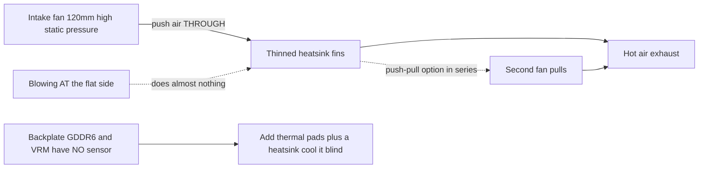

# Cooling

> **TL;DR** — The BC-250's stock heatsink was built for a server rack's forced air tunnel, not a desk. Out of the box it throttles. The community fix: **thin out the dense stock fins** (file/sand them) and bolt a **high-static-pressure 120 mm fan** (**Arctic P12 Max/Pro** is the reference; Noctua NF-P12 redux is the quiet premium alternative) blowing *through* them. That alone takes a modded board to **~73 °C in Furmark, 63–65 °C in games**. Liquid AIO and full custom cases are the next tiers.

Cooling is the **#1 thing a newcomer gets wrong**, so do this before chasing overclocks.

---

## Why the stock cooler isn't enough

The BC-250 is a mining/server board. Its heatsink is **passive** and designed to sit in a chassis where loud fans force air front-to-back through it. On a desk with no airflow it heat-soaks and the GPU throttles. Blowing a fan *at* the flat side does almost nothing — air has to travel **through the fin channels**, plus over the backplate (the GDDR6 on the back has **no temperature sensor**, so you cool it blind).

Community-observed limits: throttling starts around **85 °C**, hard crash/reset around **90 °C**. Keep load temps below ~80 °C with headroom.

> **Three heatsink variants exist** (8-row and 9-row fins). Quick ID: a **QR code next to the PCIe 8-pin connector** marks the 9-row variant. The variant with **fewer, thicker-gauge fins** may cool slightly better stock. ([elektricM Cooling](https://elektricm.github.io/amd-bc250-docs/hardware/cooling/))

**Per-component temperature targets** (elektricM's tested numbers, finer-grained than the throttle/crash limits above):

| Component | Idle | Light load | Gaming | Max |
|-----------|------|-----------|--------|-----|
| GPU/APU edge | 40–50 °C | 50–60 °C | 65–80 °C | 90 °C |
| CPU (Tctl) | 45–55 °C | 55–65 °C | 70–85 °C | 95 °C |
| Memory (underside) | 40–55 °C | 50–65 °C | 55–70 °C | 80 °C |

Aim for **70–80 °C GPU in games**. ([elektricM Cooling](https://elektricm.github.io/amd-bc250-docs/hardware/cooling/))

> **Pixel artifacts during gaming = VRAM overheating.** Because the back-side GDDR6 has no sensor, that visual glitch is your warning sign — add backplate airflow/pads (below). ([elektricM Cooling](https://elektricm.github.io/amd-bc250-docs/hardware/cooling/))

> **Silicon lottery — budget thermal headroom per chip.** Two physically identical boards, identical chassis and OC config, can run **5–10 °C apart**, and the hotter one stayed hotter even after re-pasting/re-padding. Don't assume someone else's temps will match yours. ([r/BC250Gaming](https://www.reddit.com/r/BC250Gaming/))



---

## Sustained compute is a different regime (not just gaming bursts)

The targets above assume **gaming**, where load comes in bursts. **Sustained** compute — a looped `llama-bench`, long Stable-Diffusion runs, anything pegging the GPU for tens of minutes, **especially with the [40 CU unlock](09-overclock-undervolt.md)** — is a much harsher load and can exceed what a gaming-grade cooler holds.

elektricM measured a stock heatsink + **dual Arctic P12 Max in push–pull**, 10-min sustained `llama-bench` at **40 CU / 2 GHz**:

| Metric | Average | Peak |
|--------|---------|------|
| GPU edge | 89.6 °C | 107 °C |
| Package power | 136 W | 223 W |
| CPU | 96.7 °C | 100 °C (TJmax) |
| VRM MOSFETs | 57 °C | 58.5 °C |
| Fan speed | ~2950 RPM | 2977 RPM (ceiling) |

Throughput sagged **~10 %** over the run as the package throttled. Takeaway: **stock heatsink + dual P12 Max is not enough headroom for sustained 40 CU @ 2 GHz** — and note the **VRMs are nowhere near their limit** (57 °C), so the bottleneck is the *heatsink shedding heat*, not the fans or power stage. Two fixes: **cap the GPU governor at 1500 MHz** (40 CU still scales ~1.5× compute, temps hold ~83 °C — sustainable indefinitely on dual P12 Max), or **upgrade the heatsink** (more fin area). For **24 CU stock gaming**, dual P12 Max is comfortable; the wall only appears under sustained full-CU compute. ([elektricM Cooling](https://elektricm.github.io/amd-bc250-docs/hardware/cooling/))

---

## Path A — Air mod (most popular, cheapest)

This is what most of the chat runs.

### 1. Thin/clean the stock fins
The stock fins are too dense and often uneven. People open up the channels so air can pass:

- **Orbital (eccentric) sander** — fastest, done in minutes, best result. ([src](https://t.me/c/2424231195/31571))
- **Sandpaper by hand** — 60 grit then 240 grit, ~3–4 h + 2 h over two days. Works but slow. ([src](https://t.me/c/2424231195/50330))
- **Scissors / snips** — crude "чекрыжить" method, last resort; results are worst. ([src](https://t.me/c/2424231195/41252))
- **Scissors + ruler guide (clean variant)** — slide craft/hairdresser scissors into the fin gap with a **ruler angled against the blade as a guide**; a pocket-knife "can-opener" works equally well. Caveat: some board variants have **no gap to start the blade** — pry one open with a screwdriver/tweezers, or cut an entry slot with a **small Dremel cutting wheel**. Blades wider than the fin slots can damage the heatsink. ([r/BC250Gaming](https://www.reddit.com/r/BC250Gaming/))
- Straighten bent fins with a **flat tweezers + pliers**. ([src](https://t.me/c/2424231195/30670))
- **Pull fins off by hand** — elektricM notes the soft aluminium fins can be **cleanly torn/pulled apart by hand** (heatsink off the board), avoiding the metal swarf that cutting tools create. Slower but debris-free. ([elektricM Cooling](https://elektricm.github.io/amd-bc250-docs/hardware/cooling/))
- **"Scooper by Justin"** — a **3D-printable tool made specifically for pressing/opening the BC-250 heatsink fins** ([Printables 1282906](https://www.printables.com/model/1282906-bc-250-scooper)). Safer than a bare screwdriver: it stops you pushing too hard and gouging the heatsink **base** between the fins. ([r/linux_gaming community thread](https://www.reddit.com/r/linux_gaming/comments/1nvsgji/)) Set expectations: one owner reported the printed **"comb/scooper" tool broke on the 2nd use** and cramped the hands. ([r/BC250Gaming](https://www.reddit.com/r/BC250Gaming/))
- **Hobby pliers — "peel" method** — grip the **top** of the fins with small hobby pliers and peel them off, **using the metal's own memory as a break point** so they snap cleanly at the bend rather than tearing the base. A debris-light alternative to cutting. ([r/linux_gaming community thread](https://www.reddit.com/r/linux_gaming/comments/1nvsgji/))

Rough temperature payoff (elektricM): **straightening bent fins ~5–10 °C**, **removing center fins ~10–15 °C** (irreversible — a good fan shroud gets similar gains without cutting), **fresh paste ~5–10 °C** if the old paste had dried. ([elektricM Cooling](https://elektricm.github.io/amd-bc250-docs/hardware/cooling/))

> ⚠ **Take the heatsink off the board first** (or fully mask/protect the board and die) before sanding/filing, and **clean every bit of metal dust off before reassembly**. Conductive metal swarf that settles on the board can short it and **kill the board** — this has already happened in the chat.

<p align="center">
  <br>
  <sub>Photo: AMD BC-250 community · <a href="https://t.me/c/2424231195/31571">source</a></sub>
</p>

### 2. Bolt on a real fan
Mount a **120 mm high-static-pressure fan** pushing air through the fins. The reference pick is the **Arctic P12 Max (or P12 Pro)** — highest static pressure (~6.9 mm H₂O), the community + elektricM choice for this dense heatsink. The **Noctua NF-P12 redux** is the quiet premium alternative, and posted a reference result of **max 73 °C in Furmark, 63–65 °C in games** ([src](https://t.me/c/2424231195/42843)).

**Concrete fan picks with specs** (elektricM — pick on *static pressure*, not airflow):

| Fan | Size | Max RPM | Static pressure | Airflow | Noise | Gaming temps |
|-----|------|---------|----------------|---------|-------|--------------|
| **Arctic P12 Max** | 120 mm | 3300 | **6.9 mm H₂O** | 73.3 CFM | 52.5 dB(A) | 65–75 °C |
| **Arctic P12 Pro** | 120 mm | 2100 | **6.9 mm H₂O** | 68.9 CFM | 37.8 dB(A) | 65–75 °C |
| Arctic P14 PWM | 140 mm | 1700 | 2.40 mm H₂O | 72.8 CFM | 38 dB(A) | 70–80 °C |
| Noctua NF-A12x25 | 120 mm | 2000 | 2.34 mm H₂O | 60.1 CFM | 22.6 dB(A) | 70–85 °C |

elektricM's **most-recommended pick is the Arctic P12 Max / P12 Pro** — its ~6.9 mm H₂O static pressure dwarfs the Noctua's 2.34 mm and is far cheaper; the P12 Pro is the quieter, more widely-stocked version. The premium Noctua is quieter still but only matches the Arctic on temps at higher RPM. ([elektricM Cooling](https://elektricm.github.io/amd-bc250-docs/hardware/cooling/))

> **Reference vs quiet alternative.** The **Arctic P12 Max/Pro** is the reference fan here — highest static pressure (~6.9 mm H₂O), cheapest, the community + elektricM pick for this dense heatsink. The **Noctua NF-P12 redux** is the quiet premium alternative (the chat's 73 °C Furmark result), matching the Arctic on temps only at higher RPM. Pick Arctic for best price/performance, Noctua if quiet matters most.

Use a **printed fan shroud/adapter** so the fan seals against the heatsink instead of leaking air around it. Community STLs:
- `Fan_Shroud_Single_120mm.stl`, `Fan_Shroud_Dual_120mm.stl`, `Fan_Shroud_Single_140mm.stl`, `Twin_120mm_Fan_Shroud.stl`
- `BC250_FanAdapter_120mm.step`, `bc250 cooler mount.stl`, `cooler adapter v3.0.stl`

> **Why static pressure, not airflow rating?** Dense fins are a high-resistance load. A high-airflow "case fan" stalls against them; a high-static-pressure fan (≥3 mm H₂O; Noctua P12, Arctic P12) actually pushes air *through*. For very dense fins, two fans in **push–pull (series)** doubles static pressure — that's the right move here, not two fans side-by-side.

**Mounting:** a printed shroud is best, but **zip-tying** the fan to the heatsink works, and a **cardboard/foam-board duct** taped between fan and fins is a valid free fallback (ugly, not durable, but seals the air path). ([elektricM Cooling](https://elektricm.github.io/amd-bc250-docs/hardware/cooling/))

> ⚠ **Don't drill/screw fans directly into the fins.** The aluminium is soft and the fins are thin — screwing into them damages the fin stack and hurts cooling. Use zip ties or a printed shroud. ([elektricM Cooling](https://elektricm.github.io/amd-bc250-docs/hardware/cooling/))

### Alternative: keep the stock fins (no-cut push-pull case)
Cutting the fins isn't mandatory. **penzoiders** designed a case ([MakerWorld, FreeCAD source](https://makerworld.com/models/2505974)) that does **not** cut the heatsink: it uses **push-pull high-static-pressure fans** to force air through the **stock, un-modified fins**, plus a **two-chamber pressure differential** that also cools the backplate (5 mm heatsinks + thermal pads; reused NVMe heatsinks work). A tuning that stays cool: **CPU 3800 MHz / 1050 mV, GPU 2100 MHz / 950 mV** → parallel Furmark + `stress-ng` stays **below 85 °C**; gaming **~75 °C at roughly 50 % fan duty** (CoolerControl curve), "barely audible". ([r/BC250Gaming](https://www.reddit.com/r/BC250Gaming/))

## Path B — AIO liquid cooler

A 120 mm AIO mounted to the die via an adapter bracket. Quiet and cold, but more parts and cost. Popular builds use cheap AIOs (e.g. aigo). ([example src](https://t.me/c/2424231195/19336))

<p align="center">
  <br>
  <sub>Photo: AMD BC-250 community · <a href="https://t.me/c/2424231195/19336">source</a></sub>
</p>

**Named, downloadable AIO bracket — NexGen3D** ([Printables 1554003](https://www.printables.com/model/1554003), print in ABS-GF or PETG). Verified with a **Thermalright 240 mm AIO**: GPU **~50 °C @ 2000 MHz**, CPU **max 60 °C**. ([r/BC250Gaming](https://www.reddit.com/r/BC250Gaming/))

### Liquid-cooled overclock profiles
With an AIO you can push much harder. **NexGen3D** wall-measured (Furmark Vulkan + `stress-ng --matrix 0 -t 60m` as the burn combo):

| Profile | CPU | GPU | Max burn temp | Wall power | Note |
|---------|-----|-----|---------------|------------|------|
| 1 | 4000 MHz | 2400 MHz | ~65 °C | >350 W | "dead silent" |
| 2 | 4100 MHz | 2450 MHz | ~75 °C | <400 W | hotter, louder |

Normal 1080p gaming runs **10–15 °C below** these burn temps and **under 250 W** on Profile 1. **Airflow scheme worth copying:** the 120 mm fans **exhaust out through the radiator**, which pulls fresh external air in across the **VRMs / PSU / VRAM backplate**; a separate **80 mm fan (Arctic P8 Max)** cools the GPU VRMs — this answers the "un-sensored VRM/VRAM still need airflow" warning above. ([r/BC250Gaming](https://www.reddit.com/r/BC250Gaming/))

## Path C — Blower ("улитка") — not recommended

Salvaged GPU blower fans were an early experiment. Loud for the result; people moved to Path A. ([src](https://t.me/c/2424231195/100086))

## Path D — Tower cooler conversion (advanced)

Some users bolt an **AM4 tower cooler** (e.g. **Thermalright Peerless Assassin**, or other AM4/AM5 towers) onto the die for excellent, quiet cooling using off-the-shelf hardware. The catch: you must **mount it via a bracket**, and a tall tower may **block the M.2 slot or other components**. Not a beginner mod. You no longer have to fabricate one from scratch — two published 3D-printed brackets exist:

- **AM4/AM5 desktop-cooler adapter** ([MakerWorld 2596083](https://makerworld.com/en/models/2596083), FreeCAD source included). Mounts a standard desktop AM4/AM5 cooler to the BC-250. Fastening: **M5 bolts + nuts, no standoffs** (OP notes M4 would be ideal but M5 was a snug fit). Print in **ABS, PETG, or ASA**. Verified at **CPU 3.95 GHz / 1.150 V, GPU 2200 MHz / 1000 mV, temps not exceeding 80 °C**. Coolers used: a low-profile **AXP90-class** (a commenter used an **AXP120**), and even an **AMD Wraith Spire** beat the stock heatsink. ([r/BC250Gaming](https://www.reddit.com/r/BC250Gaming/))
- **Thermalright AXP90-X53 mount** ([Printables 1694793](https://www.printables.com/model/1694793)). Threaded inserts are **soldered into the underside** of the printed bracket so you **reuse the original spring-loaded stock-heatsink screws**; button-head bolts come up from the bottom and are counter-sunk, and the bracket has a **0.5 mm gap under the brace** to clear board components. Designed in Fusion 360, **print in PETG** (PLA softens at these temps). Result: **65–67 °C under full load @ 2150 MHz, 1080p**, very quiet (copper cooler, paired with a 120 mm Arctic P12 Pro). Measured stack height **54 mm from PCB to top of the 15 mm fan** — useful for case fit. A **3-thickness variant set** and an **AXP120-X67** version also exist. ([r/BC250Gaming](https://www.reddit.com/r/BC250Gaming/))

---

## Controlling the fan speed (software)

Once a fan is bolted on, you control its PWM through the board's **Nuvoton NCT6686D** Super I/O chip — but **which driver you load matters** ([elektricM hardware spec](https://elektricm.github.io/amd-bc250-docs/)):

- **Read-only sensors** (fan RPM, temps): the in-kernel **`nct6683`** module, loaded with `force=true`. It reports readings but **cannot write PWM**, so the fan stays at whatever the BIOS/firmware sets.
- **Read + write PWM** (actually set fan speed): use the out-of-tree **`nct6687`** module from **[Fred78290/nct6687d](https://github.com/Fred78290/nct6687d)**, also with `force=true`. This is the one to build if you want fan curves / manual speed control rather than just monitoring.

```bash
# monitoring only (in-kernel):
echo 'options nct6683 force=true' | sudo tee /etc/modprobe.d/nct6683.conf
# PWM control (DKMS from Fred78290/nct6687d):
echo 'options nct6687 force=true' | sudo tee /etc/modprobe.d/nct6687.conf
```

> Don't load both — pick `nct6683` for read-only sensors or `nct6687` for read+write. Sensor wiring (`CPU_FAN1` / `J4003`) and the BIOS↔Linux fan numbering are in [06-linux.md](06-linux.md)'s verification step.

**Which header is the main fan?** elektricM reports the cooling fan is usually on the **Pump Fan** header = **`fan2` / `pwm2`** in sysfs; `CPU Fan` (`fan1`) and the `System Fan` headers (`fan3`+) are typically unused. Enable manual mode before writing PWM (`echo 1 > .../pwm2_enable`, then a 0–255 value to `.../pwm2`). hwmon numbering can shift between reboots — confirm with `cat /sys/class/hwmon/hwmon*/name`. ([elektricM Cooling](https://elektricm.github.io/amd-bc250-docs/hardware/cooling/))

**Fan curves with a GUI — CoolerControl.** Once `nct6687` is loaded, **CoolerControl** gives graphical fan curves: select the **nct6686** device, build a curve on **pwm2** using **k10temp Tctl** as the source. Install: `ujust install-coolercontrol` (Bazzite), the `codifryed/CoolerControl` copr (Fedora), or `coolercontrol` from the AUR (Arch); web UI at `https://localhost:11987`. ([elektricM Cooling](https://elektricm.github.io/amd-bc250-docs/hardware/cooling/))

**BIOS fan modes** (if you don't run OS-side control): **Default** holds fans at a **40 % minimum** (too low — not recommended), **Full Speed** pins them at 100 % (loud but safe), **Customize** sets per-threshold speeds. ([elektricM Cooling](https://elektricm.github.io/amd-bc250-docs/hardware/cooling/))

> ⚠ **Don't run BIOS Customize mode and CoolerControl at the same time** — they fight for PWM control. Pick one. ([elektricM Cooling](https://elektricm.github.io/amd-bc250-docs/hardware/cooling/))

---

## Thermal interface (paste, pads, phase-change, liquid metal)

Whatever fan/heatsink you run, the **thermal interface material (TIM)** between the die and the heatsink — and between the back of the board and any backplate radiator — is worth getting right. The BC-250 die has a **high heat density**, so a good TIM is a free few degrees.

> **Just changing the stock paste helps.** One owner swapped the factory paste after a year and load temps dropped **~4–5 °C**, with everything else unchanged. ([src](https://t.me/c/2424231195/88565))

### Pastes that work
- **Arctic MX-6** — a regular high-end paste. In one cased build it held **87–88 °C in Furmark**; the same owner noted PTM7950 would shave another ~4 °C off that. ([src](https://t.me/c/2424231195/30211))
- **Stock paste + stock pads** are the documented baseline: ~**76 °C** after 10 min load, ~**55 °C** idle (before fin/fan modding). ([src](https://t.me/c/2424231195/22992))
- Other pastes elektricM lists as fine here: **Arctic MX-4** (value), **Thermal Grizzly Kryonaut** (premium), **Noctua NT-H1** (reliable), **Thermalright TFX** (budget). Used-board paste is **often dried out** — just re-pasting is worth **~5–10 °C**. Apply a pea-sized dot to the die, mount evenly, tighten screws in an **X pattern**. ([elektricM Cooling](https://elektricm.github.io/amd-bc250-docs/hardware/cooling/))

### PTM7950 — the community favorite (recommended)
**PTM7950** is a **phase-change pad** (Honeywell graphite/phase-change film). At room temperature it's a thin solid sheet; at load (~45–55 °C) it softens and flows into a micron-thin layer, then stays put. It **doesn't pump out** or dry like grease, which is exactly what you want under a hot, thermally-cycling die — so you apply it once and forget it. The chat's blunt summary: *"PTM7950 and don't overthink it"* ([src](https://t.me/c/2424231195/101582)); phase-change is the general recommendation ([src](https://t.me/c/2424231195/61511)).

**How to apply:**
1. Clean the die and heatsink base (isopropyl alcohol), let dry.
2. Cut a square of PTM7950 to the die size — a **~26×30 mm** piece covers the BC-250 die ([src](https://t.me/c/2424231195/125748)).
3. Peel one protective film, lay the pad on the die, peel the second film.
4. Mount the heatsink and torque down evenly. **No spreading** — the first heat cycle does the work. Expect best temps after a few load/idle cycles ("burn-in").

A reference cased build on PTM7950 (Honeywell, 26×30) plus a backplate radiator peaks at **~84 °C over an hour, 66–71 °C in games** at CPU 3850 MHz / GPU 2100 MHz. ([src](https://t.me/c/2424231195/125748))

### Backplate & GDDR6 pads (cool the back, blind)
The **GDDR6 and VRM on the back of the board have no temperature sensor** — you cool them blind. Add a **heatsink/radiator on the backplate** coupled with **thermal pads** so that back-side heat has somewhere to go. ([src](https://t.me/c/2424231195/125748))

Reported pad thicknesses (community-shared, "saved this" reaction):
- **VRM: 1 mm**
- **GDDR6: 2 mm** ([src](https://t.me/c/2424231195/121181))

> ⚠ **verify** — these thicknesses depend on the gap to *your* specific backplate/radiator. Confirm with a gap measurement (or a putty/clay test) before buying a pile of pads.

elektricM gives a **slightly different pad scheme** for cooling the memory itself: **1.5 mm pads on the *front* of the board, 2.0 mm on the *back***, then an aluminium plate/heatsink on the underside. Use **only non-conductive** pads near the board (never conductive paste/pads that could short components). Pad brands it lists: **Thermalright Odyssey** (high performance), **Arctic Thermal Pad** (value), **Gelid GP-Ultimate** (premium). ([elektricM Cooling](https://elektricm.github.io/amd-bc250-docs/hardware/cooling/))

> ⚠ **verify (pad thicknesses differ between sources)** — our chat-sourced numbers are **VRM 1 mm / GDDR6 2 mm (back)**; elektricM specifies **1.5 mm front / 2.0 mm back** for the memory chips. Different builds, different gaps — **measure your own clearance** rather than trusting either figure blind.

> **Crashes/instability after 30–60 min of gaming** (often with pixel artifacts) is the classic **memory-overheating** signature. Fixes: add pads + an underside plate, add a backplate fan, improve case airflow, or temporarily **reduce the VRAM split** (e.g. 4 GB → 512 MB) to cut memory heat. ([elektricM Cooling](https://elektricm.github.io/amd-bc250-docs/hardware/cooling/))

### Liquid metal — generally NOT recommended here
Liquid metal (LM) comes up because the PS5 (same-family APU) uses it ([src](https://t.me/c/2424231195/18105)), and on raw performance it edges out paste/PTM ([src](https://t.me/c/2424231195/124112)). People have asked about and tried it on the BC-250 ([src](https://t.me/c/2424231195/18098), [src](https://t.me/c/2424231195/77180)).

**But it's the wrong call on this board:**
- LM is **electrically conductive**. The BC-250 die sits right next to **dense GDDR6 and VRM**; a drop that escapes the die shorts the board (the same "conductive thing near the memory kills it" risk as the metal-swarf warning above).
- It **pumps out / needs re-doing roughly yearly**, and it attacks bare aluminum — even the PTM7950 advocate ditched LM on his own hardware for exactly this hassle, switching to PTM7950 / KryoSheet. ([src](https://t.me/c/2424231195/69688))
- "Not everyone will even take the job of working with liquid metal." ([src](https://t.me/c/2424231195/106787))

**Bottom line:** **PTM7950 is the safer high-performance choice** — ~99 % of the benefit, none of the short-circuit/maintenance risk. Reserve LM for people who already know exactly what they're doing.

---

## How to test your cooling (community method, pinned)

From the pinned procedure ([src](https://t.me/c/2424231195/108407)):

1. **GPU stress:** Furmark (Vulkan / "Furmark VK").
2. **CPU at the same time:** add a CPU bench (cpu-x) or `stress`/`pipx`-based load — the APU shares one heatsink, so test both together.
   - These tools (Furmark, OCCT, cpu-x, `stress`) **aren't preinstalled** on a fresh Linux box — install them via your package manager or Flatpak first.
3. **Test under your overclock**, not stock — 1500 MHz is weak; **2000 MHz is ~+30 % FPS** and what you'll actually run, so cool for that.
4. Watch temps; if you cross ~85 °C you're throttling — add fan/shroud/fin work.

There's also a short video walkthrough of the simplest method pinned in the topic. ([src](https://t.me/c/2424231195/100024))

---

## Recommended starter setup

| Tier | Do this | Expect |
|------|---------|--------|
| Minimum | Sand fins (orbital sander) + 1× Arctic P12 Max/Pro (or Noctua NF-P12) + printed shroud | ~73 °C Furmark |
| Better | Push–pull (2× P12) through shroud | lower, quieter at same temp |
| Max | 120 mm AIO on adapter | coldest, more build effort |

---

## Sources

- Pinned test method — https://t.me/c/2424231195/108407 · video — https://t.me/c/2424231195/100024
- Fin tooling — https://t.me/c/2424231195/31571 · https://t.me/c/2424231195/30670 · https://t.me/c/2424231195/50330 · "Scooper by Justin" fin tool ([Printables 1282906](https://www.printables.com/model/1282906-bc-250-scooper)) + hobby-pliers peel method — [r/linux_gaming thread](https://www.reddit.com/r/linux_gaming/comments/1nvsgji/)
- Noctua P12 result — https://t.me/c/2424231195/42843
- AIO example — https://t.me/c/2424231195/19336
- Thermal interface — repaste −4–5 °C https://t.me/c/2424231195/88565 · MX-6 https://t.me/c/2424231195/30211 · stock baseline https://t.me/c/2424231195/22992 · PTM7950 https://t.me/c/2424231195/101582 · https://t.me/c/2424231195/61511 · PTM7950 build + backplate https://t.me/c/2424231195/125748 · pad thickness https://t.me/c/2424231195/121181 · liquid metal https://t.me/c/2424231195/18098 · https://t.me/c/2424231195/69688
- elektricM cooling guide (heatsink variants, per-component temp table, sustained-load data, fan specs, CoolerControl/BIOS fan modes, tower cooler, pad scheme) — https://elektricm.github.io/amd-bc250-docs/hardware/cooling/
- r/BC250Gaming (community reports: silicon-lottery variance, scissors+ruler fin method, comb-tool breakage, no-cut push-pull case, AIO bracket + 240 mm result, liquid OC profiles, AM4/AM5 + AXP90-X53 brackets) — https://www.reddit.com/r/BC250Gaming/ · AM4/AM5 cooler adapter [MakerWorld 2596083](https://makerworld.com/en/models/2596083) · AXP90-X53 mount [Printables 1694793](https://www.printables.com/model/1694793) · NexGen3D AIO bracket [Printables 1554003](https://www.printables.com/model/1554003) · no-cut push-pull case [MakerWorld 2505974](https://makerworld.com/models/2505974)
- Hardware reference — [mothenjoyer69/bc250-documentation `hardware.md`](https://github.com/mothenjoyer69/bc250-documentation/blob/main/hardware.md)
- Cases/adapters with cooling — [onemorecap/bc-250-sleeve-adapter](https://github.com/onemorecap/bc-250-sleeve-adapter)

> Fan-shroud and adapter STLs are cataloged in [05-case.md](05-case.md) and mirrored under `assets/stl/`.
