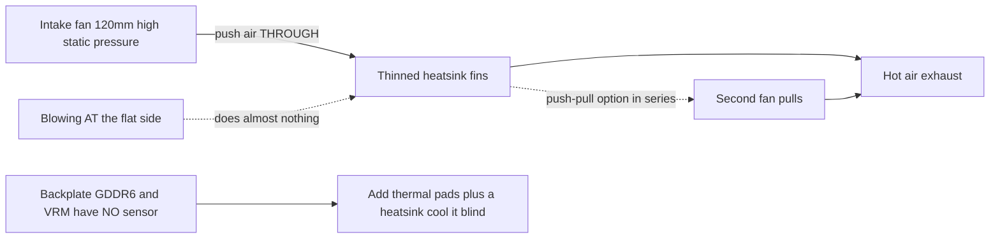
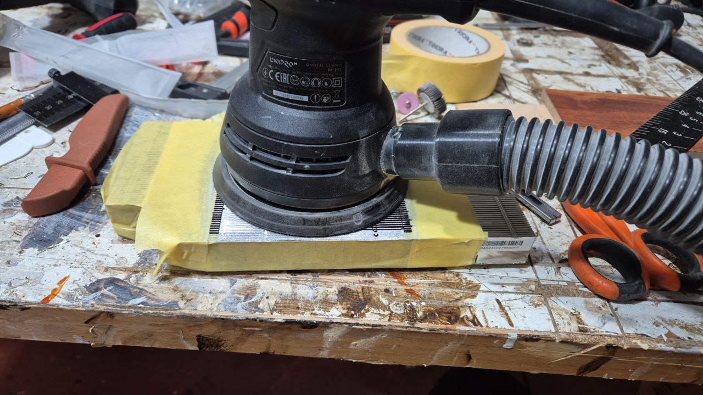
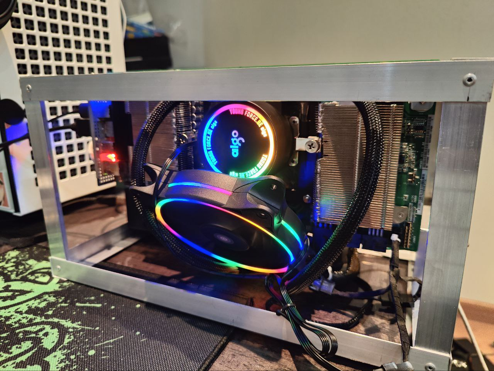

# Cooling

> **TL;DR** — The BC-250's stock heatsink was built for a server rack's forced air tunnel, not a desk. Out of the box it throttles. The community fix: **thin out the dense stock fins** (file/sand them) and bolt a **high-static-pressure 120 mm fan** (Noctua NF-P12 is the reference) blowing *through* them. That alone takes a modded board to **~73 °C in Furmark, 63–65 °C in games**. Liquid AIO and full custom cases are the next tiers.

Cooling is the **#1 thing a newcomer gets wrong**, so do this before chasing overclocks.

---

## Why the stock cooler isn't enough

The BC-250 is a mining/server board. Its heatsink is **passive** and designed to sit in a chassis where loud fans force air front-to-back through it. On a desk with no airflow it heat-soaks and the GPU throttles. Blowing a fan *at* the flat side does almost nothing — air has to travel **through the fin channels**, plus over the backplate (the GDDR6 on the back has **no temperature sensor**, so you cool it blind).

Community-observed limits: throttling starts around **85 °C**, hard crash/reset around **90 °C**. Keep load temps below ~80 °C with headroom.



---

## Path A — Air mod (most popular, cheapest)

This is what most of the chat runs.

### 1. Thin/clean the stock fins
The stock fins are too dense and often uneven. People open up the channels so air can pass:

- **Orbital (eccentric) sander** — fastest, done in minutes, best result. ([src](https://t.me/c/2424231195/31571))
- **Sandpaper by hand** — 60 grit then 240 grit, ~3–4 h + 2 h over two days. Works but slow. ([src](https://t.me/c/2424231195/50330))
- **Scissors / snips** — crude "чекрыжить" method, last resort; results are worst. ([src](https://t.me/c/2424231195/41252))
- Straighten bent fins with a **flat tweezers + pliers**. ([src](https://t.me/c/2424231195/30670))

> ⚠ **Take the heatsink off the board first** (or fully mask/protect the board and die) before sanding/filing, and **clean every bit of metal dust off before reassembly**. Conductive metal swarf that settles on the board can short it and **kill the board** — this has already happened in the chat.

<p align="center">
  <br>
  <sub>Photo: AMD BC-250 community · <a href="https://t.me/c/2424231195/31571">source</a></sub>
</p>

### 2. Bolt on a real fan
Mount a **120 mm high-static-pressure fan** pushing air through the fins. Reference result: **Noctua NF-P12 redux → max 73 °C in Furmark, 63–65 °C in games.** ([src](https://t.me/c/2424231195/42843))

Use a **printed fan shroud/adapter** so the fan seals against the heatsink instead of leaking air around it. Community STLs:
- `Fan_Shroud_Single_120mm.stl`, `Fan_Shroud_Dual_120mm.stl`, `Fan_Shroud_Single_140mm.stl`, `Twin_120mm_Fan_Shroud.stl`
- `BC250_FanAdapter_120mm.step`, `bc250 cooler mount.stl`, `cooler adapter v3.0.stl`

> **Why static pressure, not airflow rating?** Dense fins are a high-resistance load. A high-airflow "case fan" stalls against them; a high-static-pressure fan (≥3 mm H₂O; Noctua P12, Arctic P12) actually pushes air *through*. For very dense fins, two fans in **push–pull (series)** doubles static pressure — that's the right move here, not two fans side-by-side.

## Path B — AIO liquid cooler

A 120 mm AIO mounted to the die via an adapter bracket. Quiet and cold, but more parts and cost. Popular builds use cheap AIOs (e.g. aigo). ([example src](https://t.me/c/2424231195/19336))

<p align="center">
  <br>
  <sub>Photo: AMD BC-250 community · <a href="https://t.me/c/2424231195/19336">source</a></sub>
</p>

## Path C — Blower ("улитка") — not recommended

Salvaged GPU blower fans were an early experiment. Loud for the result; people moved to Path A. ([src](https://t.me/c/2424231195/100086))

---

## Controlling the fan speed (software)

Once a fan is bolted on, you control its PWM through the board's **Nuvoton NCT6686D** Super I/O chip — but **which driver you load matters** ([elektricM hardware spec](https://elektricm.github.io/amd-bc250-docs/)):

- **Read-only sensors** (fan RPM, temps): the in-kernel **`nct6683`** module, loaded with `force=true`. It reports readings but **cannot write PWM**, so the fan stays at whatever the BIOS/firmware sets.
- **Read + write PWM** (actually set fan speed): use the out-of-tree **`nct6687`** module from **[Fred78290/nct6687d](https://github.com/Fred78290/nct6687d)**, also with `force=true`. This is the one to build if you want fan curves / manual speed control rather than just monitoring.

```bash
# monitoring only (in-kernel):
echo 'options nct6683 force=true' | sudo tee /etc/modprobe.d/nct6683.conf
# PWM control (DKMS from Fred78290/nct6687d):
echo 'options nct6687 force=true' | sudo tee /etc/modprobe.d/nct6687.conf
```

> Don't load both — pick `nct6683` for read-only sensors or `nct6687` for read+write. Sensor wiring (`CPU_FAN1` / `J4003`) and the BIOS↔Linux fan numbering are in [06-linux.md](06-linux.md)'s verification step.

---

## Thermal interface (paste, pads, phase-change, liquid metal)

Whatever fan/heatsink you run, the **thermal interface material (TIM)** between the die and the heatsink — and between the back of the board and any backplate radiator — is worth getting right. The BC-250 die has a **high heat density**, so a good TIM is a free few degrees.

> **Just changing the stock paste helps.** One owner swapped the factory paste after a year and load temps dropped **~4–5 °C**, with everything else unchanged. ([src](https://t.me/c/2424231195/88565))

### Pastes that work
- **Arctic MX-6** — a regular high-end paste. In one cased build it held **87–88 °C in Furmark**; the same owner noted PTM7950 would shave another ~4 °C off that. ([src](https://t.me/c/2424231195/30211))
- **Stock paste + stock pads** are the documented baseline: ~**76 °C** after 10 min load, ~**55 °C** idle (before fin/fan modding). ([src](https://t.me/c/2424231195/22992))

### PTM7950 — the community favorite (recommended)
**PTM7950** is a **phase-change pad** (Honeywell graphite/phase-change film). At room temperature it's a thin solid sheet; at load (~45–55 °C) it softens and flows into a micron-thin layer, then stays put. It **doesn't pump out** or dry like grease, which is exactly what you want under a hot, thermally-cycling die — so you apply it once and forget it. The chat's blunt summary: *"PTM7950 and don't overthink it"* ([src](https://t.me/c/2424231195/101582)); phase-change is the general recommendation ([src](https://t.me/c/2424231195/61511)).

**How to apply:**
1. Clean the die and heatsink base (isopropyl alcohol), let dry.
2. Cut a square of PTM7950 to the die size — a **~26×30 mm** piece covers the BC-250 die ([src](https://t.me/c/2424231195/125748)).
3. Peel one protective film, lay the pad on the die, peel the second film.
4. Mount the heatsink and torque down evenly. **No spreading** — the first heat cycle does the work. Expect best temps after a few load/idle cycles ("burn-in").

A reference cased build on PTM7950 (Honeywell, 26×30) plus a backplate radiator peaks at **~84 °C over an hour, 66–71 °C in games** at CPU 3850 MHz / GPU 2100 MHz. ([src](https://t.me/c/2424231195/125748))

### Backplate & GDDR6 pads (cool the back, blind)
The **GDDR6 and VRM on the back of the board have no temperature sensor** — you cool them blind. Add a **heatsink/radiator on the backplate** coupled with **thermal pads** so that back-side heat has somewhere to go. ([src](https://t.me/c/2424231195/125748))

Reported pad thicknesses (community-shared, "saved this" reaction):
- **VRM: 1 mm**
- **GDDR6: 2 mm** ([src](https://t.me/c/2424231195/121181))

> ⚠ **verify** — these thicknesses depend on the gap to *your* specific backplate/radiator. Confirm with a gap measurement (or a putty/clay test) before buying a pile of pads.

### Liquid metal — generally NOT recommended here
Liquid metal (LM) comes up because the PS5 (same-family APU) uses it ([src](https://t.me/c/2424231195/18105)), and on raw performance it edges out paste/PTM ([src](https://t.me/c/2424231195/124112)). People have asked about and tried it on the BC-250 ([src](https://t.me/c/2424231195/18098), [src](https://t.me/c/2424231195/77180)).

**But it's the wrong call on this board:**
- LM is **electrically conductive**. The BC-250 die sits right next to **dense GDDR6 and VRM**; a drop that escapes the die shorts the board (the same "conductive thing near the memory kills it" risk as the metal-swarf warning above).
- It **pumps out / needs re-doing roughly yearly**, and it attacks bare aluminum — even the PTM7950 advocate ditched LM on his own hardware for exactly this hassle, switching to PTM7950 / KryoSheet. ([src](https://t.me/c/2424231195/69688))
- "Not everyone will even take the job of working with liquid metal." ([src](https://t.me/c/2424231195/106787))

**Bottom line:** **PTM7950 is the safer high-performance choice** — ~99 % of the benefit, none of the short-circuit/maintenance risk. Reserve LM for people who already know exactly what they're doing.

---

## How to test your cooling (community method, pinned)

From the pinned procedure ([src](https://t.me/c/2424231195/108407)):

1. **GPU stress:** Furmark (Vulkan / "Furmark VK").
2. **CPU at the same time:** add a CPU bench (cpu-x) or `stress`/`pipx`-based load — the APU shares one heatsink, so test both together.
   - These tools (Furmark, OCCT, cpu-x, `stress`) **aren't preinstalled** on a fresh Linux box — install them via your package manager or Flatpak first.
3. **Test under your overclock**, not stock — 1500 MHz is weak; **2000 MHz is ~+30 % FPS** and what you'll actually run, so cool for that.
4. Watch temps; if you cross ~85 °C you're throttling — add fan/shroud/fin work.

There's also a short video walkthrough of the simplest method pinned in the topic. ([src](https://t.me/c/2424231195/100024))

---

## Recommended starter setup

| Tier | Do this | Expect |
|------|---------|--------|
| Minimum | Sand fins (orbital sander) + 1× Noctua/Arctic P12 + printed shroud | ~73 °C Furmark |
| Better | Push–pull (2× P12) through shroud | lower, quieter at same temp |
| Max | 120 mm AIO on adapter | coldest, more build effort |

---

## Sources

- Pinned test method — https://t.me/c/2424231195/108407 · video — https://t.me/c/2424231195/100024
- Fin tooling — https://t.me/c/2424231195/31571 · https://t.me/c/2424231195/30670 · https://t.me/c/2424231195/50330
- Noctua P12 result — https://t.me/c/2424231195/42843
- AIO example — https://t.me/c/2424231195/19336
- Thermal interface — repaste −4–5 °C https://t.me/c/2424231195/88565 · MX-6 https://t.me/c/2424231195/30211 · stock baseline https://t.me/c/2424231195/22992 · PTM7950 https://t.me/c/2424231195/101582 · https://t.me/c/2424231195/61511 · PTM7950 build + backplate https://t.me/c/2424231195/125748 · pad thickness https://t.me/c/2424231195/121181 · liquid metal https://t.me/c/2424231195/18098 · https://t.me/c/2424231195/69688
- Hardware reference — [mothenjoyer69/bc250-documentation `hardware.md`](https://github.com/mothenjoyer69/bc250-documentation/blob/main/hardware.md)
- Cases/adapters with cooling — [onemorecap/bc-250-sleeve-adapter](https://github.com/onemorecap/bc-250-sleeve-adapter)

> Fan-shroud and adapter STLs are cataloged in [05-case.md](05-case.md) and mirrored under `assets/stl/`.
