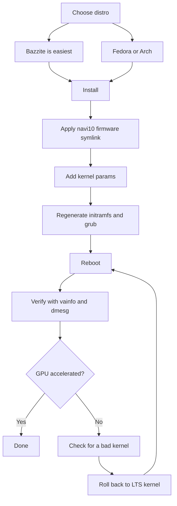

# Linux Drivers & Setup

> **TL;DR** — Most people run the BC-250 on Linux, and it works well *once the GPU is fixed*. Out of the box `amdgpu` doesn't recognize the chip and you get CPU-rendered, single-digit FPS. Two things make it real: a **modern kernel + fresh Mesa (25.1+)**, and the **`amdgpu` fix** — a firmware symlink so the driver can load (`navi10_gpu_info.bin` → `cyan_skillfish_gpu_info.bin`) plus kernel params (`amdgpu.sg_display=0`, `mitigations=off`, and on new kernels `amdgpu.bc250_cc_write_mode=3`). Easiest path for a newcomer: flash **[Bazzite](https://bazzite.gg/)** and rebase to the dedicated **`bazzite-bc250`** image — the fixes are baked in. Want to learn the machine: **Fedora** or **CachyOS/EndeavourOS (Arch)** with a one-time setup script.

This is the section that turns "a board in a box" into a working desktop. Do [cooling](04-cooling.md) and [power](03-power-supply.md) first — then this.

> **Never used Linux? A 60-second survival kit.**
> - **Open a terminal:** look for an app called *Terminal* / *Konsole* (KDE) / *Console* in your menu, or press `Ctrl-Alt-T`.
> - **`sudo`** in front of a command runs it as administrator. It will ask for your password — and **as you type, nothing shows on screen** (no dots, no stars). That's normal; type it and press Enter.
> - **`nano /etc/...`** opens a plain text editor in the terminal. To save and quit: **Ctrl-O**, then **Enter**, then **Ctrl-X**.
> - **Copy-paste** into a terminal is usually **Ctrl-Shift-V** (not Ctrl-V).
> - Many steps only take effect after a **reboot** (`systemctl reboot`). When a step says "reboot," actually reboot before judging whether it worked.

---

## The one thing you must understand

The BC-250's GPU is **Cyan Skillfish / Oberon** (a PlayStation 5-derived RDNA2 part). Mainline `amdgpu` historically had **no firmware blob named for it**, so on a stock install the kernel can't initialize the GPU and the desktop falls back to software (LLVMpipe) rendering — everything is slow and `vulkaninfo` shows no real device. One user spent days on "broken drivers" before realizing his distro had simply booted a kernel that couldn't load the GPU firmware ([src](https://t.me/c/2424231195/98466)).

So every working setup does the same three things, in some form:

1. **Run a kernel + Mesa new enough.** Upstream Mesa gained BC-250 support in **25.1** (no patches needed since then) — ([Mesa MR !33116](https://gitlab.freedesktop.org/mesa/mesa/-/merge_requests/33116), [src](https://t.me/c/2424231195/20891)). Temperature sensors landed in **kernel 6.15** ([src](https://t.me/c/2424231195/23542)).
2. **Give `amdgpu` the firmware it wants** — the `cyan_skillfish_gpu_info.bin` symlink (Arch-style installs) or a patched mesa/kernel package (Fedora COPR) that handles it.
3. **Pass the right kernel parameters** and regenerate initramfs + bootloader.

Everything below is just *how* each distro does those three things.



---

## Which distro? (community poll favorites)

The chat repeatedly comes back to four. There's no single "right" answer — it's a trade between *zero effort* and *understanding your machine*.

| Distro | Base | Effort | GPU fix | Best for |
|--------|------|--------|---------|----------|
| **Bazzite** (`bazzite-bc250` image) | Fedora atomic | **Lowest** — fixes baked in | Pre-applied in the image | Newcomers, "just play games" |
| **Fedora** (Workstation / KDE) | Fedora | Low | COPR `mixaill/amd-bc-250` + setup script | Learn Linux, stay close to upstream |
| **CachyOS** | Arch | Medium | `mesa-tkg-git` / AUR + manual symlink | Performance tuners |
| **EndeavourOS** | Arch | Medium | chaotic-aur `mesa-tkg-git` + manual symlink | Arch without the install pain |

Notes from the chat:
- **Bazzite is the easiest** and has a **dedicated BC-250 image** with the firmware fix, kernel params, oberon-governor and the 40-CU/frequency patch already applied. Find it on artifacthub: [`bazzite-bc250`](https://artifacthub.io/packages/container/bazzite-bc250/bazzite_bc250). Several users moved to it precisely to stop hand-patching ([src](https://t.me/c/2424231195/121246)).
- **Don't blindly grab the "gamer" distros.** One detailed take argues that a plain **Fedora (Workstation/KDE)** or **vanilla Arch with LTS kernel + fresh Mesa** is the painless middle ground, and that heavy tuned forks can sometimes *break* Steam/FSR/vsync rather than help ([src](https://t.me/c/2424231195/102834)). Treat this as "as of late 2025" advice — the Bazzite image has matured since.
- **Kernel version matters more than the distro.** Avoid known-bad kernels (see the warning box below). When in doubt, an **LTS kernel** is the safe choice — multiple users hit a wall on a too-new kernel and were rescued by switching to LTS ([src](https://t.me/c/2424231195/56529), [src](https://t.me/c/2424231195/59839)).

> One veteran summed up the experience after three months daily-driving the BC-250 on Linux: games launch from one click, RTX works, VR works, "abolutely seamlessly" — and he switched his main desktop to Linux because of it ([src](https://t.me/c/2424231195/61870)).

---

## Path A — Bazzite (recommended for newcomers)

Bazzite is an immutable Fedora-based gaming OS (SteamOS-like). The community maintains a **BC-250-specific image** so you don't touch firmware or kernel params yourself.

### A1. Install regular Bazzite first
1. Download from **[bazzite.gg](https://bazzite.gg/#image-picker)** (pick the desktop or "Deck"/Gaming-Mode variant).
2. Flash to USB (Ventoy, Rufus, or balenaEtcher) and install normally. **Create a non-root user** — Steam refuses to launch as root ([src](https://t.me/c/2424231195/121246)).

> **Flash drive too small?** The Bazzite ISO is >9 GB. You can install plain **Fedora** (≈3 GB ISO, e.g. Kinoite/KDE) on a small stick, then *rebase* to Bazzite from the terminal ([src](https://t.me/c/2424231195/121246)):
> ```bash
> # KDE desktop:
> rpm-ostree rebase ostree-image-signed:docker://ghcr.io/ublue-os/bazzite:stable
> # or with Gaming Mode (SteamOS-like):
> rpm-ostree rebase ostree-image-signed:docker://ghcr.io/ublue-os/bazzite-deck:stable
> ```
> Reboot and you're in Bazzite.

### A2. Rebase to the BC-250 image
Once on Bazzite, switch to the BC-250 image so the GPU fixes apply. The maintained images are the **`vietsman` "Bazzite on Steroids"** builds (firmware fix, kernel params, oberon-governor, 40-CU patch baked in). Pick the desktop you installed — **GNOME is the recommended default** — and run:
```bash
# GNOME (recommended):
rpm-ostree rebase ostree-image-signed:docker://ghcr.io/vietsman/bazzite-gnome-patched:latest
# KDE:
rpm-ostree rebase ostree-image-signed:docker://ghcr.io/vietsman/bazzite-kde-patched:latest
# Deck / Gaming-Mode (SteamOS-like):
rpm-ostree rebase ostree-image-signed:docker://ghcr.io/vietsman/bazzite-deck-patched:latest
systemctl reboot
```
⚠ verify the current image/tag before running — image paths change. The up-to-date commands live on the [BC-250 docs Bazzite page](https://elektricm.github.io/amd-bc250-docs/linux/bazzite/) (also listed on artifacthub as [`bazzite-bc250`](https://artifacthub.io/packages/container/bazzite-bc250/bazzite_bc250)).

After reboot, update going forward with the Bazzite helper:
```bash
ujust update
```

### A3. Done — verify
Skip to **[Verifying GPU acceleration](#verifying-gpu-acceleration)** below. On the BC-250 image the firmware symlink, kernel params and oberon-governor are already in place.

---

## Path B — Fedora (Workstation / KDE)

Fedora is the most-documented non-atomic path and stays close to upstream. The patched graphics stack comes from the **`mixaill/amd-bc-250` COPR**.

### B1. Install Fedora
Download **Fedora Workstation or KDE** ([fedoraproject.org](https://fedoraproject.org/workstation/download)) and install normally. Reported-good baseline from the chat: Fedora 41/42, kernel 6.14, GNOME 48, Mesa 25.0.2+ — "flies" ([src](https://t.me/c/2424231195/29150)). Fedora 41 with Cinnamon was called "stable as hell" running Cyberpunk, Witcher 3, etc. ([src](https://t.me/c/2424231195/12756)).

### B2. The setup script (does the work for you)
The canonical Fedora setup is automated by `mothenjoyer69/bc250-documentation`'s **`fedora-setup.sh`**. It enables the COPR, installs patched mesa, configures `amdgpu`, builds the governor and fixes the bootloader. The exact steps it runs (cross-checked against the script):

```bash
# 1. Patched mesa from COPR
sudo dnf copr enable mixaill/amd-bc-250 -y
sudo dnf upgrade --refresh -y

# 2. amdgpu module option + sensor module
echo 'options amdgpu sg_display=0'    | sudo tee /etc/modprobe.d/options-amdgpu.conf
echo 'nct6683'                        | sudo tee /etc/modules-load.d/99-sensors.conf
echo 'options nct6683 force=true'     | sudo tee /etc/modprobe.d/options-sensors.conf

# 3. Regenerate initramfs (Fedora uses dracut)
sudo dracut --regenerate-all --force

# 4. Bootloader: drop nomodeset, add kernel params
sudo sed -i 's/nomodeset//g' /etc/default/grub
sudo grub2-mkconfig -o /etc/grub2.cfg
sudo grubby --update-kernel=ALL --args="amdgpu.sg_display=0"
sudo grubby --update-kernel=ALL --args="mitigations=off"

# 5. OpenCL (optional, for compute/AI)
sudo dnf install mesa-libOpenCL --allowerasing
```
*(Source: `fedora-setup.sh` in [mothenjoyer69/bc250-documentation](https://github.com/mothenjoyer69/bc250-documentation), confirmed verbatim.)*

To just run the script instead of typing the steps, see the **"Simple setup script"** section of that repo's README (it points at [`fedora-setup.sh`](https://raw.githubusercontent.com/mothenjoyer69/bc250-documentation/refs/heads/main/fedora-setup.sh)). ⚠ Read a setup script before piping it to a shell.

### B3. Power governor (oberon-governor)
The board runs a flat 1500 MHz / 1000 mV out of the box; the **oberon-governor** scales clocks (idle ↔ ~2000 MHz) and lets you undervolt. The Fedora script installs it from source; you can also use the COPR:
```bash
sudo dnf copr enable g/exotic-soc/oberon-governor   # COPR alternative
sudo dnf install oberon-governor
sudo systemctl enable --now oberon-governor.service
systemctl status oberon-governor.service            # check it's running
```
Config lives in `/etc/oberon-config.yaml`. Full tuning is covered in **[09-overclock-undervolt.md](09-overclock-undervolt.md)**. ⚠ verify the exact COPR/package name for your Fedora release.

### B4. Reboot and verify
Reboot, then jump to **[Verifying GPU acceleration](#verifying-gpu-acceleration)**.

---

## Path C — Arch family (CachyOS / EndeavourOS)

Arch-based installs need the **firmware symlink done by hand** plus a fresh Mesa. This is the most "manual" path but the same three ideas apply.

### C1. The amdgpu firmware fix (the critical symlink)
`amdgpu` looks for `cyan_skillfish_gpu_info.bin`; the **navi10** blob works in its place. This is the single most-repeated command in the chat (5×) ([src](https://t.me/c/2424231195/45453)):

```bash
sudo ln -s /lib/firmware/amdgpu/navi10_gpu_info.bin.zst \
           /lib/firmware/amdgpu/cyan_skillfish_gpu_info.bin.zst
```

> ⚠ **verify the path on your system.** On distros that ship **uncompressed** firmware, drop the `.zst` on both names:
> ```bash
> sudo ln -s /lib/firmware/amdgpu/navi10_gpu_info.bin \
>            /lib/firmware/amdgpu/cyan_skillfish_gpu_info.bin
> ```
> **Which is yours?** Run `ls /lib/firmware/amdgpu/ | grep -i navi10` and look at the source file's name: if it ends in `.zst` use the first (`.zst`) command, otherwise use the second — the link name must match the file that actually exists. After creating the link you **must** regenerate initramfs (next step) so the firmware is picked up at boot.

### C2. Fresh Mesa
On EndeavourOS/CachyOS the community route is **chaotic-aur** + `mesa-tkg-git`. Condensed from a pinned EndeavourOS mini-guide ([src](https://t.me/c/2424231195/50399)) and a SteamOS guide ([src](https://t.me/c/2424231195/52411)):

```bash
# Add the chaotic-aur key + mirrorlist (see https://aur.chaotic.cx/docs for the current keys)
sudo pacman-key --recv-key 3056513887B78AEB --keyserver keyserver.ubuntu.com
sudo pacman-key --lsign-key 3056513887B78AEB
sudo pacman -U 'https://cdn-mirror.chaotic.cx/chaotic-aur/chaotic-keyring.pkg.tar.zst'
sudo pacman -U 'https://cdn-mirror.chaotic.cx/chaotic-aur/chaotic-mirrorlist.pkg.tar.zst'

# Append to /etc/pacman.conf:
#   [chaotic-aur]
#   Include = /etc/pacman.d/chaotic-mirrorlist
sudo nano /etc/pacman.conf

sudo pacman -Syu
sudo pacman -Sy mesa-tkg-git lib32-mesa-tkg-git   # (or: yay -S mesa-tkg-git lib32-mesa-tkg-git)
sudo pacman -S vulkan-tools                        # for vulkaninfo
```
There are also prebuilt AUR packages: [`amdonly-gaming-mesa-git`](https://aur.archlinux.org/packages/amdonly-gaming-mesa-git) and [`mesa-amd-bc250`](https://aur.archlinux.org/packages/mesa-amd-bc250). ⚠ The chaotic-aur signing key can rotate — always copy the current keys from [aur.chaotic.cx/docs](https://aur.chaotic.cx/docs).

> With Mesa **25.1+** on a recent kernel you may **not need a special mesa build at all** — upstream Mesa already supports the BC-250. The `-tkg`/COPR builds matter mainly on older distros ([src](https://t.me/c/2424231195/20891)).

### C3. Kernel parameters + regenerate
Add the BC-250 kernel parameters, then rebuild initramfs and grub. Edit `/etc/default/grub` and put these in `GRUB_CMDLINE_LINUX_DEFAULT` (canonical set per the [elektricm BC-250 docs](https://elektricm.github.io/amd-bc250-docs/linux/kernel/)):

```
amdgpu.sg_display=0 mitigations=off amdgpu.bc250_cc_write_mode=3 ttm.pages_limit=3959290 ttm.page_pool_size=3959290
```

Then regenerate (Arch uses **mkinitcpio**, then grub):
```bash
sudo mkinitcpio -P
sudo grub-mkconfig -o /boot/grub/grub.cfg
```
On distros that use `update-grub` (Debian/Ubuntu/SteamOS), that wrapper replaces the `grub-mkconfig` line ([src](https://t.me/c/2424231195/52411)).

### C4. Governor + reboot
Install the **oberon-governor** from [gitlab.com/mothenjoyer69/oberon-governor](https://gitlab.com/mothenjoyer69/oberon-governor) (build with `cmake . && make && sudo make install`), enable the service, reboot, and verify:
```bash
sudo systemctl enable --now oberon-governor.service
```

---

## What each kernel parameter does

Cross-checked against the [elektricm BC-250 docs](https://elektricm.github.io/amd-bc250-docs/linux/kernel/) and the AMD-BC-250 / mothenjoyer69 setup scripts:

| Parameter | What it does |
|-----------|--------------|
| `amdgpu.sg_display=0` | Disables scatter-gather display. Needed on **kernels < 6.10** to avoid a black screen; harmless to keep. The single most-cited boot fix in the chat ([src](https://t.me/c/2424231195/52411)). |
| `mitigations=off` | Turns off CPU vulnerability mitigations. The docs note **~18 FPS in Cyberpunk 2077** from this — at the cost of security. Optional. |
| `amdgpu.bc250_cc_write_mode=3` | Opt-in **40-CU unlock** for new kernels: writes two HW registers to re-enable all 40 compute units (default off). See [09-overclock-undervolt.md](09-overclock-undervolt.md). |
| `ttm.pages_limit=3959290` / `ttm.page_pool_size=3959290` | Let the GPU map more system RAM — these are the values from the mothenjoyer69 docs. |
| `amdgpu.gttsize=14750` | Older equivalent of the `ttm` limits (sets GTT size). Use one approach or the other, not both. |

> **A note on VRAM/buffer size:** the APU performs best with the **smallest** GPU framebuffer carve-out (e.g. 512 MB) so it can share the 16 GB pool dynamically — but changing that needs a **modified BIOS**, covered in [08-bios.md](08-bios.md) ([src](https://t.me/c/2424231195/38599)).

---

## Verifying GPU acceleration

After the first reboot, confirm the GPU is actually being used (not software rendering).

**1. Is the device visible to Vulkan?** You should see the BC-250 / AMD device, not just LLVMpipe:
```bash
vulkaninfo | grep deviceName
```
A correct setup shows **two devices** (the iGPU surfaces twice on this board) ([src](https://t.me/c/2424231195/50399)).

**2. Hardware video decode (VA-API):**
```bash
vainfo
```

**3. OpenGL renderer string** (should name AMD/`radeonsi`, not `llvmpipe`):
```bash
glxinfo | grep -i "OpenGL renderer"
```

**4. Compute units active** — confirm `amdgpu` initialized the GPU and how many CUs are live:
```bash
sudo dmesg | grep -i active_cu_number
```
This is the quickest check that the firmware loaded and (if you set `bc250_cc_write_mode=3`) that all 40 CUs came up. ⚠ verify — exact `dmesg` field name can vary by kernel; if it's empty, also try `dmesg | grep -i amdgpu` and look for successful firmware loads rather than `cyan_skillfish_gpu_info` *failed to load* errors.

**5. Sanity-check temps/clocks** (needs kernel 6.15+ for sensors, [src](https://t.me/c/2424231195/23542)):
```bash
sudo modprobe nct6683        # force=true only needed on kernels < 6.15
sensors
```
A healthy idle reads ~1500 MHz SCLK / ~47 °C; under Furmark ~1900 MHz / ~78 °C ([src](https://t.me/c/2424231195/89232)).

If `vulkaninfo` only shows `llvmpipe` and `dmesg` shows amdgpu firmware load errors, you almost certainly **booted a bad kernel** or the **firmware symlink/initramfs** step didn't take — see below.

---

## ⚠ Known-bad kernels & gotchas

The driver story changed a lot across the chat's 17 months. As of late 2025 / early 2026:

- **Avoid specific broken kernels.** `6.14.7` was flagged as breaking amdgpu for these users ([Fedora warning thread](https://www.reddit.com/r/Fedora/comments/1kqyhyf/warning_for_amdgpu_users_dont_update_to_6147_or/)). A user's Fedora silently booted **6.17.8**, which "completely breaks" Cyan Skillfish support — amdgpu couldn't load firmware and everything fell back to CPU. Fix: boot the older working kernel (6.14), then **remove and version-lock** the bad one ([src](https://t.me/c/2424231195/98466)).
- **When stuck, use LTS.** Several newcomers hit a wall building dev libs / drivers on a bleeding-edge kernel and were unblocked by switching to an **LTS kernel** ([src](https://t.me/c/2424231195/56529)).
- **HDMI audio on kernel 6.17+** needed a workaround (rebuild with `CONFIG_SND_HDA_CODEC_HDMI_ATI=m` / `snd-hda-codec-atihdmi.ko`) — DisplayPort is the safer output ([src](https://t.me/c/2424231195/68051)).
- **`amdgpu.sg_display=0` is for old kernels (< 6.10).** It's still in most guides because it's harmless, but it isn't doing anything on a current kernel.
- **Mesa milestones:** 25.0.1 fixed an Avowed hang ([src](https://t.me/c/2424231195/22019)); 25.1 brought upstream BC-250 support with ACO + Rusticl by default ([src](https://t.me/c/2424231195/48588)). If you're on Mesa older than 25.1, update before debugging anything else.

---

## Community-built BC-250 box

A typical finished result — a BC-250 in a custom case with a little status LCD (GPU/CPU clocks, temps, RAM) and a "From E-Waste to Steam Machine" badge, running Steam on Linux ([src](https://t.me/c/2424231195/58037)):

> idle reading on that build: `GPU: 1000 MHz 41 °C` · `CPU: 2036 MHz 41 °C` · `RAM: 2.8 GB` — quiet, cool, and gaming.

---

## Sources

- **Main docs:** [mothenjoyer69/bc250-documentation](https://github.com/mothenjoyer69/bc250-documentation) · [`fedora-setup.sh`](https://raw.githubusercontent.com/mothenjoyer69/bc250-documentation/refs/heads/main/fedora-setup.sh)
- **AMD-BC-250 org:** [installation_fedora.md](https://github.com/AMD-BC-250/documentation/blob/main/installation_fedora.md) · [installation_opensuse_tumbleweed.md](https://github.com/AMD-BC-250/documentation/blob/main/installation_opensuse_tumbleweed.md) · [issues.md](https://github.com/AMD-BC-250/documentation/blob/main/issues.md)
- **Kernel params reference:** [elektricm.github.io/amd-bc250-docs](https://elektricm.github.io/amd-bc250-docs/linux/kernel/)
- **Bazzite:** [bazzite.gg](https://bazzite.gg/) · [`bazzite-bc250` image](https://artifacthub.io/packages/container/bazzite-bc250/bazzite_bc250) · [buoyantbeaver bazzite-setup.sh](https://github.com/buoyantbeaver/bc250-documentation/blob/main/bazzite-setup.sh)
- **Arch:** [pnbarbeito/bc250-arch](https://github.com/pnbarbeito/bc250-arch) · [aur.chaotic.cx/docs](https://aur.chaotic.cx/docs) · AUR [`amdonly-gaming-mesa-git`](https://aur.archlinux.org/packages/amdonly-gaming-mesa-git)
- **Fedora COPR (patched mesa):** [mixaill/amd-bc-250](https://copr.fedorainfracloud.org/coprs/mixaill/amd-bc-250/package/mesa/)
- **Governor:** [mothenjoyer69/oberon-governor](https://gitlab.com/mothenjoyer69/oberon-governor) · [oberon-governor-atomic](https://github.com/alexghow903/oberon-governor-atomic)
- **Mesa upstream:** [MR !33116](https://gitlab.freedesktop.org/mesa/mesa/-/merge_requests/33116) · [MR !33962](https://gitlab.freedesktop.org/mesa/mesa/-/merge_requests/33962)
- **Chat highlights:** firmware symlink — https://t.me/c/2424231195/45453 · EndeavourOS guide — https://t.me/c/2424231195/50399 · SteamOS guide — https://t.me/c/2424231195/52411 · Fedora→Bazzite rebase — https://t.me/c/2424231195/121246 · bad-kernel rescue — https://t.me/c/2424231195/98466 · Mesa 25.1 upstream — https://t.me/c/2424231195/20891

> Overclocking/undervolting and the 40-CU unlock are in [09-overclock-undervolt.md](09-overclock-undervolt.md). WiFi/BT dongle drivers are in [10-wifi-bt.md](10-wifi-bt.md).
