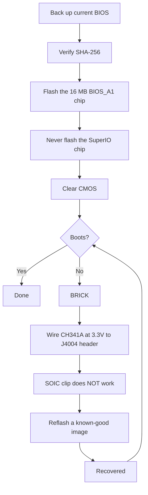

# BIOS & Brick Recovery

> **TL;DR** — A wrong BIOS setting can **brick the BC-250 dead**, and on this board a CMOS clear does *not* always recover it ([src](https://t.me/c/2424231195/54971)). Before you flash *anything*, understand this: you need a **hardware recovery kit** (a **CH341A-class SPI programmer + female-to-female DuPont wires**) on hand, because the only reliable un-brick is re-flashing the chip externally through the board's **J4004 header**. The popular community mod ("death's" BIOS, latest based on stock **5.00**) unlocks overclocking, GDDR6 timings and iGPU memory allocation — useful, but **not all settings are safe, and some brick the board instantly** ([src](https://t.me/c/2424231195/78922)). Verify the **SHA-256** of every image first, and read [`assets/firmware/DISCLAIMER.md`](../../assets/firmware/DISCLAIMER.md). **Do not flash casually.**

⚠️ **This is the most dangerous chapter in the handbook.** Flashing is destructive and irreversible without recovery hardware. If you are not prepared to solder/clip onto a SPI chip to revive a brick, **stop here and run the stock BIOS.**

---

## What the BIOS is on the BC-250

The BC-250 is an AsRock-built mining/server board carrying a cut-down PS5 "Oberon" APU. Its UEFI firmware lives on a **16 MB SPI flash chip** (a Winbond **W25Q128** / Macronix MX25L128 in an 8-pin SOIC package). Stock firmware is heavily locked: almost nothing useful is exposed in Setup. Known stock versions seen in the chat are **3.00**, **4.00** and **5.00**; the modded BIOSes are rebuilt from these (the version number is your anchor — always note which base a mod is built on). The only functional difference between stock **v4.0** and **v5.0** is that v5.0 enables **network boot** by default ([src](https://discord.com/channels/1315924807128449065/1316030225338863636/1326825429595848816)).

Two reasons people reflash:

1. **To install a modded BIOS** that unlocks hidden menus (overclock, undervolt, memory, iGPU VRAM).
2. **To recover a brick** — restore a known-good image after a bad setting or a failed flash.

> 💡 **You may not need to flash at all.** If your *only* goal is changing the VRAM/UMA split, you can do that from a running Linux on the **stock** P3.00 / P5.00 BIOS with **[fanoush/bc250_memcfg](https://github.com/fanoush/bc250_memcfg)** — no flashing, no programmer, no brick risk ([elektricM: BIOS flashing](https://elektricm.github.io/amd-bc250-docs/bios/flashing/), [elektricM: VRAM](https://elektricm.github.io/amd-bc250-docs/bios/vram/)). Flashing a modded BIOS is only needed for the *unlocked chipset menus* and features beyond VRAM sizing (see [09-overclock-undervolt.md](09-overclock-undervolt.md) for the `bc250_memcfg` command).

---

## The modded BIOS ("death" mod) — what it changes and why

The reference community mod is maintained by **death** in the chat. It is *not* a from-scratch firmware — it re-enables (unhides) AMD/AMI Setup options that the stock BIOS ships hidden. Track the versions, because the advice changed over time:

| Mod version | Base | Released | What it exposed / changed | Status |
|---|---|---|---|---|
| **1.0** (first release) | stock **3.00** | 2025-06-28 | GDDR6 frequency, GDDR6 timings, iGPU UMA memory size, core frequency, voltages | ⚠️ Bad values brick the board, **CMOS clear did not help** ([src](https://t.me/c/2424231195/54971)) |
| 3.0 variants | 3.00 | 2025-07 → 10 | Same unlocks; one build added a **custom Steam boot logo** | Cosmetic logo build mirrored as `bc250-Steam.rom` ([src](https://t.me/c/2424231195/86420)) |
| **5.00 mod** (current) | stock **5.00** | 2025-10-05 | Tabs regrouped; **more settings opened**; **RAM/GDDR6 timing settings now actually apply** on this board | Newest; "not all settings are useful, but better than nothing" ([src](https://t.me/c/2424231195/78922)) |

What you can actually tune with it (from the first-release notes, [src](https://t.me/c/2424231195/54971)):

- **GDDR6 frequency** — reported working at **1800** for one user (`@Haswellb`), but the *same kind of change bricked another board* — values are board-specific, not universal.
- **GDDR6 timings** — they apply, but **too-low/tight timings brick** the board.
- **iGPU memory (UMA) size** — works and gives a real uplift. If your change doesn't take effect, set **IGC: Forces** and **UMA Mode: UMA_SPECIFIED** ([src](https://t.me/c/2424231195/54971); same combo confirmed by the community docs).
- **Core frequency / voltages** — exposed but **"not tested"** by the author.

> ❗ **Two author warnings, still current:** (1) **Do not disable Integrated Graphics** — it is the only display output. (2) On any of these mods, **a wrong setting can brick the board and a CMOS reset may not recover it** — that is exactly why you need a programmer. (See the "which version?" ladder below for picking a base.)

> ### Which version? (decision ladder)
>
> 1. **Modded P3.00 (chipset-menu ROM) — the safe default.** This is the established **"community standard… most stable and tested,"** verified-public with a known SHA-256, and it already covers **VRAM-unlock + chipset settings**. Start here unless you have a specific reason not to ([elektricM: BIOS flashing](https://elektricm.github.io/amd-bc250-docs/bios/flashing/)).
> 2. **Modded 5.00 — current; pick it if you want memory tuning.** It's the newest base and is the one where **RAM/GDDR6 timing settings actually apply** on this board ([src](https://t.me/c/2424231195/78922)). Choose it over P3.00 specifically when you want to tune memory timings.
> 3. **`P5.00_clv` — expert-only.** It "unlocks **Everything**" (every hidden menu, including experimental **ReBAR / Resizable BAR** and debug/chipset settings), which makes it *"very easy to brick the board if you change the wrong thing… Stick to P3.00 unless you are an advanced user."* Worse, **`P5.00_clv` is not in any public repo** the guide could find — it circulates only as a Discord attachment, so **there is no canonical hash**; if you must use it, get copies from **two** people running it independently and confirm both have the **same SHA-256** before flashing ([elektricM: BIOS flashing](https://elektricm.github.io/amd-bc250-docs/bios/flashing/)).

> **Modded 5.00 quirks worth knowing.** Its Setup shows a **default CPU frequency of 3600** — a cosmetic UI value, not an applied clock ([src](https://discord.com/channels/1315924807128449065/1452152658168381593/1452406964780007515)). It also exposes an **`x1x1x1x1` PCIe bifurcation** option in the chipset settings ([src](https://discord.com/channels/1315924807128449065/1452152658168381593/1474231812598534351)). Be extra careful with memory timings on this base: **extreme timing values can brick the board until an external reflash, and that bites harder on P5.00** ([src](https://discord.com/channels/1315924807128449065/1371527281947971604/1468745940994101372)). And as with any flash, moving to the modded 5.00 can leave **no display until you clear CMOS** ([src](https://discord.com/channels/1315924807128449065/1315933088668454942/1508568321346502892)).

There is also a separate **chipset-menu mod** (`BC250_3.00_CHIPSETMENU.ROM`) from the most-referenced BIOS repo, **[TuxThePenguin0/bc250-bios](https://gitlab.com/TuxThePenguin0/bc250-bios/)**, which exposes the **chipset menu / NBIO Common Options** on top of stock 3.00. That repo's own README says plainly: *"Nothing in this repository is supported or has any kind of warranty — TAKE BACKUPS."*

> 🚫 **Avoid `Smokeless_UMAF`.** The community overclocking guide flags this UEFI-editing tool as a thing **not to run on the BC-250 — it may cause permanent damage to the board** ([elektricM: BIOS overclocking](https://elektricm.github.io/amd-bc250-docs/bios/overclocking/)). Stick to the known-good ROMs above.

---

## Before you flash — the safety checklist

1. **Back up your current BIOS first** (read it out with the same tool you'll flash with — see Path B/recovery). A backup is your free undo.
2. **Verify SHA-256** of the image against `assets/PROVENANCE.md` / the source post. The community flashing guide publishes the hash for the chipset-menu ROM as
   `48fbe5d366e6a56e2fdffdca848426216ba1f083610dab63db89d2f4e6c940b5` ([elektricm docs](https://elektricm.github.io/amd-bc250-docs/bios/flashing/)).
3. **Confirm the chip size**, not just the marking. The 16 MB BIOS chip is the target; **do not** flash the small SuperIO chip (see the recovery section). Different board revisions can carry slightly different chip part numbers — the **capacity (16 MB)** is what matters, last letters of the marking can differ ([src](https://t.me/c/2424231195/67880)).
4. **Have recovery hardware ready** *before* the first flash, not after you brick.
5. After flashing, **clear CMOS** so new settings (especially VRAM allocation) take effect (see "After every flash").



### Verify the checksum before flashing

Step 2 above says to verify the SHA-256 — here is how. Compute the hash of the file you are about to flash and compare it, character for character, against the value listed for that file in [`assets/PROVENANCE.md`](../../assets/PROVENANCE.md).

```bash
# Linux:
sha256sum BC250_3.00_CHIPSETMENU.ROM
```

```powershell
# Windows (PowerShell):
Get-FileHash BC250_3.00_CHIPSETMENU.ROM -Algorithm SHA256
```

`PROVENANCE.md` may list only the **first 16 hex characters** as a short fingerprint. If so, check that your computed hash **starts with** those 16 characters — a full match of that prefix is already a strong check (the maintainer can publish full hashes on request).

**Verified full SHA-256 hashes** for the publicly-hosted images (cross-checked across multiple community repos — every known-good BC-250 BIOS file is **exactly 16 MB / 16777216 bytes**; a different size means it's corrupted, a tool/patch, or unrelated) ([elektricM: BIOS flashing](https://elektricm.github.io/amd-bc250-docs/bios/flashing/)):

| File | Type | SHA-256 |
|---|---|---|
| `BC250_3.00_CHIPSETMENU.ROM` (a.k.a. `Robin3.00`, `BC250CHIPSETMENU.ROM`) | **Modded P3.00** — VRAM + chipset unlock, *recommended* | `48fbe5d366e6a56e2fdffdca848426216ba1f083610dab63db89d2f4e6c940b5` |
| `Robin5.00` | **Stock** P5.00 (not the modded `P5.00_clv`) | `0d6f136cb120cf3b2de26d5c4d7f255604fdbf4b9442af5ba55419b95b89aa82` |
| `BC250_3.00.ROM` | Stock P3.00 | `07595ca3aecf8a4caa28a397b5298f3946a1b769f87b16f67adc369c3f69045c` |
| `BC250_2.00.bin` | Stock P2.00 | `ee6150dfed33bd05ea46063a352549416fdf3f45fa0e5edac2a68ef78d71083c` |
| `P5.00_clv` | Modded P5.00 (unlock-everything) | **no public hash exists** — Discord-only, verify two independent copies match |

> The modded P3.00 shows up under several filenames across repos (`BC250_3.00_CHIPSETMENU.ROM`, `BC250CHIPSETMENU.ROM`, `Robin3.00`) — they all hash to the value above, so the name doesn't matter. `Robin5.00` is the **stock** P5.00, a *different file* from the modded `P5.00_clv`. Public sources for each (TuxThePenguin0 GitLab, forgenam, tipitochen, csabakecskemeti, scrakcho, dannybastos, kenavru, MrrZed0) are listed in the [elektricM flashing guide](https://elektricm.github.io/amd-bc250-docs/bios/flashing/).

> 🔴 **If the checksum does not match, DO NOT flash.** A mismatch means a corrupted or wrong file — flashing it is exactly how you brick the board. Re-download the image and verify again.

---

## Path A — Software flash (from the board, no programmer)

This is the normal way to install/upgrade a BIOS while the board still boots. Use a **FAT32 USB stick** and the AMI firmware update utility.

**EFI / AFU method** ([src](https://t.me/c/2424231195/54979)):

1. Format a USB stick to **FAT32**.
2. Copy the contents of the AFU archive (e.g. `AfuEfi64_5.16.zip`) **and the BIOS file** onto it.
3. Reboot the BC-250 and **boot from the USB stick** into the EFI shell.
4. Run:
   ```
   afuefix64.efi <filename>.<ext> /P /N
   ```
   - `/P` = program the main BIOS.
   - `/N` = also program **NVRAM**. This avoids errors when moving *between* versions (e.g. onto 3.00 from another version) — **but it wipes your saved settings.** You may drop `/N`, but then expect possible errors. ([src](https://t.me/c/2424231195/54979))
5. If the tool can't see the file, try `fs0:`, `fs1:`, … to find which one is the stick ([src](https://t.me/c/2424231195/54979)).

Some community builds ship a ready-made `Flash.nsh` script and a renamed ROM (e.g. rename the modded ROM to match the script) so you only boot to the EFI shell and run the script ([elektricm docs](https://elektricm.github.io/amd-bc250-docs/bios/flashing/)). On Linux there is also an **`afulnx`** build (`afulnx-5.05.04Z.tar.gz`) for flashing from a running system ([src](https://t.me/c/2424231195/54507)).

#### Canonical EFI-shell recipe (the `Flash.nsh` / `Robin5.00` method)

The community flashing guide standardises on a self-contained kit and a fixed filename — this is the most-reproduced USB path ([elektricM: BIOS flashing](https://elektricm.github.io/amd-bc250-docs/bios/flashing/)):

1. **Get the EFI kit:** `4U12G BIOS Update.zip` (from the [kenavru/BC-250](https://github.com/kenavru/BC-250) repo) — it contains `AfuEfix64.efi`, `Flash.nsh`, and `amdvbflash.efi`. *It also bundles a stock P5.00 BIOS named `Robin5.00` — move that out of the way so you don't flash it by accident.*
2. **Prep a FAT32 stick (≤ 32 GB recommended).** Copy the contents of the kit's `BIOS EFI` folder to the **root**.
3. **Rename your modded ROM to `Robin5.00`** (drop the `.ROM` extension) — that is the exact name `Flash.nsh` looks for. *(Or edit `Flash.nsh` to match your filename instead.)* Root should then hold: `AfuEfix64.efi`, `Flash.nsh`, `amdvbflash.efi`, `Robin5.00` (your renamed mod), and the `EFI` folder.
4. **Use a direct DisplayPort monitor.** Active/passive **HDMI adapters can black-screen the BIOS menu** — a known display gotcha on this board.
5. **Unplug all SSDs/drives** so the board falls through to the EFI shell automatically, insert the stick, power on. You land at a yellow `Shell>` prompt.
6. At the prompt type **`blk0:`** then Enter — **note the space after the colon** (this selects the USB volume; `blk0:` is the elektricM-documented selector, distinct from the `fs0:`/`fs1:` probing above). Then type **`Flash.nsh`** and Enter.
7. **WAIT. Do not touch the keyboard, do not power off.** If it *appears* to hang during the write, **wait at least 15 minutes** — powering off mid-write bricks the board. It reboots (or asks you to) when done.
8. **Power off immediately and remove the stick** so it doesn't loop back into the flasher.

> 🔴 **Before powering on to flash: check the 8-pin PCIe power wiring** against your PSU's 12 V/GND diagram. **Reversed polarity can permanently damage the board** ([elektricM: BIOS flashing](https://elektricm.github.io/amd-bc250-docs/bios/flashing/)).

#### Required post-flash BIOS settings (do this right after the CMOS clear)

After flashing **and** clearing CMOS (next section), enter Setup (spam **Del**) and set these — the VRAM split will not behave until they're right ([elektricM: BIOS flashing](https://elektricm.github.io/amd-bc250-docs/bios/flashing/), [elektricM: BIOS VRAM](https://elektricm.github.io/amd-bc250-docs/bios/vram/)):

| Setting | Path | Value |
|---|---|---|
| Integrated Graphics Controller | Chipset → GFX Configuration | **Forces** |
| UMA Mode | Chipset → GFX Configuration | **UMA_SPECIFIED** |
| UMA Frame Buffer Size | Chipset → GFX Configuration | **512MB** (recommended) or a fixed size |
| IOMMU | Advanced → CPU Configuration | **Disabled** |
| Boot Mode | Boot → Boot Mode | **UEFI** |

First verify the CMOS clear actually took — the **clock should read wrong**; if it's still correct, repeat the clear. Then F10 to save. The `512MB` choice is *dynamic* allocation, not a 512 MB cap (see [09-overclock-undervolt.md](09-overclock-undervolt.md)).

> ★ **Why 512 MB UMA *gains* FPS (the mechanism).** Setting the UMA buffer to **512 MB** doesn't starve the GPU — it lets the system **dynamically balance RAM vs VRAM** instead of locking a big fixed slice away, and that rebalancing alone was credited with a real FPS jump: Cyberpunk 2077 went **60 → 66 fps (at 2 GHz OC) → 76 fps** under FSR 3.0 *balanced*, 1080p, Steam-Deck preset ([Old Lamer — Part I](https://youtu.be/ohpEY2XQ_lo) ~11:21; ⚠ approx — figures transcribed from the video, treat as one build's result). So "512 MB is best" isn't just safe sizing — the small dynamic buffer is *part of* the performance story, not a compromise.

**flashrom fallback** (if AFU errors out) ([src](https://t.me/c/2424231195/54979), suggested & tested by `@mrartemsid`):

```bash
# Read (back up):
sudo flashrom -p internal:boardmismatch=force -r <name>.bin
# Write:
sudo flashrom -p internal:boardmismatch=force -w <name>.bin
```

> ⚠️ Software flashing only helps **while the board still POSTs**. The moment a bad setting bricks it, Path A is gone and you are on the hardware path below.

---

## Path B — Hardware flash / un-brick (CH341A SPI programmer)

This is the **recovery** path, and the pinned "most convenient way to flash a brick" ([src](https://t.me/c/2424231195/67880)). You re-write the 16 MB SPI chip directly, from another PC, using a USB SPI programmer. Software used: **NeoProgrammer** (Windows) or **flashrom** (Linux).

> 🔴 **The SOIC-8 clip does NOT work on this board.** death is blunt about it: *"the clip on our board works… basically not at all."* ([src](https://t.me/c/2424231195/67880)). Note: `assets/firmware/DISCLAIMER.md` mentions a "SOIC clip" generically — in practice you must **wire to the on-board J4004 header instead.** This is the single most important recovery fact in this chapter.

### J4004 header pinout (wire here)

The board exposes a **2.54 mm pitch J4004 header** specifically for reflashing the SPI/BIOS chip. Pinout (from the pinned wiring screenshot, [src](https://t.me/c/2424231195/67880)):

```
J4004
[ GND  SCLK  MOSI  UNK ]
[ VCC  CS    MISO      ]
   ^  (pin-1 marker)
```

| J4004 pin | Signal | CH341A pad |
|---|---|---|
| VCC | 3.3 V power | VDD / 3.3V |
| GND | ground | GND |
| CS | chip select | CS / SS |
| SCLK | clock | CLK / SCK |
| MOSI | data in (to chip) | MOSI |
| MISO | data out (from chip) | MISO |

The corresponding **W25Q128 SOIC-8 / CH341A color map** is in the same pinned screenshot — match `/CS, DO(MISO), CLK, DI(MOSI), VCC, GND` to the CH341A's `CS, MISO, CLK, MOSI, VDD, GND` pads. **Triple-check VCC and GND** before powering on; reversing them kills the chip ([src](https://t.me/c/2424231195/67880)).

> **J4004 pin numbering & the two unknown pins.** The elektricM guide numbers the header VCC=1, GND=2, CS=3, SCLK=4, MISO=5, MOSI=6, with **pins 7 & 8 unused for flashing — they're grounded through 10 kΩ resistors.** Pin 1 (VCC) is marked by an **arrow `>` or a square pad** on the PCB ([elektricM: BIOS flashing](https://elektricm.github.io/amd-bc250-docs/bios/flashing/)).

> **Exact target chip & the density typo.** The 16 MB part is a Winbond **W25Q128JVSQ** (128 Mbit / 16 MB) or, on some batches, a Macronix **MX25L12835F**. Some community docs typo this as **"25Q168" — that's wrong**; the correct 16 MB density code is **128** ([elektricM: BIOS flashing](https://elektricm.github.io/amd-bc250-docs/bios/flashing/)). If you flash via a bare **SOIC-8 clip** instead of J4004, the chip's own pin order is the standard SPI layout: `1 CS · 2 DO · 3 WP · 4 GND · 5 DI · 6 CLK · 7 HOLD · 8 VCC` ([elektricM: BIOS recovery](https://elektricm.github.io/amd-bc250-docs/bios/recovery/)) — but remember death's finding that **the clip barely works on this board**, so prefer J4004.

> 🙏 Credit: the J4004 pinout, reverse-engineering, and the modded-firmware image repo are largely **Segfault's** work (the P3.00 chipset-menu ROM is the "Segfault mod") ([elektricM: BIOS flashing](https://elektricm.github.io/amd-bc250-docs/bios/flashing/)).

### NeoProgrammer procedure (pinned) ([src](https://t.me/c/2424231195/67880))

1. Connect the programmer to **J4004** with female-to-female wires per the pinout. **Check the wiring ~10×, especially VCC and GND.** (PSU unplugged.)
2. Open **NeoProgrammer**.
3. Run **auto-detect** of the chip, and also read the marking on the chip itself.
4. **Compare markings.** If the last letters differ from the list but the **capacity matches (16 MB)**, that's fine.
5. **Erase** the chip.
6. **Open the BIOS file** in the software (drag-and-drop works).
7. **Write** the chip.
8. **Disconnect the wires from J4004.**
9. Power the board on.

### flashrom equivalent (Linux), cross-checked with community docs

The community flashing guide uses a **CH347** programmer and warns against cheap black-PCB CH341A boards (next section). Identify the right chip — target the **16 MB BIOS chip** (`BIOS_A1`), **never** the 512 KB SuperIO (`SIO1_R`), which bricks the SuperIO if flashed ([elektricm docs](https://elektricm.github.io/amd-bc250-docs/bios/flashing/)):

```bash
# Detect / identify the chip:
sudo flashrom -p ch347_spi

# Back up the stock BIOS (twice, then diff to be sure the read is stable):
sudo flashrom -p ch347_spi -r backup_stock.bin
sudo flashrom -p ch347_spi -r backup_verify.bin

# Write the new image, then verify it read back identical:
sudo flashrom -p ch347_spi -w BC250_3.00_CHIPSETMENU.ROM
sudo flashrom -p ch347_spi -v BC250_3.00_CHIPSETMENU.ROM
```

(Use `-p ch341a_spi` for a CH341A, or `serprog` for a Raspberry Pi Pico, in place of `ch347_spi`.) ⚠ `ch347_spi` / `serprog` mapping for *this* board's exact wiring is from the community guide — `⚠ verify` against your own programmer model.

> **Detection tells you which chip you're on.** If `flashrom -p …` reports **`Winbond W25Q128…`** or **`Macronix MX25L128…`**, you're on the right 16 MB BIOS chip. If it reports **`Macronix MX25L4005…` (512 KB)**, **STOP — you're attached to the SuperIO chip** (`SIO1_R`); flashing it bricks fan control/sensors. Move to the other chip ([elektricM: BIOS flashing](https://elektricm.github.io/amd-bc250-docs/bios/flashing/)). Flash with the **PSU unplugged from the wall** and capacitors discharged (tap the power button a few times) — powering the board during a clip flash is *not* recommended ([elektricM: BIOS recovery](https://elektricm.github.io/amd-bc250-docs/bios/recovery/)).

### The CH341A 3.3 V trap (read this or you'll cook the chip)

Many cheap **black-PCB CH341A** programmers drive their **data lines at 5 V even though VCC is 3.3 V** — the BC-250's BIOS chip is a **3.3 V** part, so 5 V on the data lines can damage it. This is a known, measured fault on some boards (Fabian's board, and an identical one in the chat, were confirmed by voltage measurement) ([src](https://t.me/c/2424231195/100285)). Fixes:

- Prefer a programmer that is genuinely 3.3 V on its data lines (e.g. **CH347**), **or**
- Apply the **solderless CH341A 5V→3.3V data-line fix**: cut the USB 5 V power line to the chip and feed it 3.3 V instead — see [sawyershepherd.org write-up](https://sawyershepherd.org/post/solderless-ch341ab-fix-5v-to-33v-data-lines/) and [wej.k.vu CH341A fix](https://wej.k.vu/electronics/ch341a-mini-programmer-fix/) ([src](https://t.me/c/2424231195/100285)).

---

### Low-level headers, debug & on-board silicon

Beyond the J4004 flash header above, the board carries several other headers and a known set of on-board chips. These are reverse-engineered in the elektricM hardware docs and are useful for clearing CMOS, debug probing, fan wiring, and confirming which chip is which before you flash. Pin values transcribed verbatim from ([elektricM: pinouts](https://elektricm.github.io/amd-bc250-docs/hardware/pinouts/)).

**CLRCMOS1 — clear-CMOS jumper (3-pin).** This is the jumper referenced everywhere in this chapter as "short the CMOS jumper" — here is its map:

| Position | Behavior |
|---|---|
| Pins 1–2 | CR2032 powers CMOS (default) |
| Pins 2–3 | Clear CMOS |

> 💡 When the [post-flash checklist](#before-you-flash--the-safety-checklist) and ["After every flash"](#after-every-flash--clear-cmos-dont-skip-this) tell you to "short the CMOS jumper for ~20 seconds," **CLRCMOS1** is that jumper: move it from pins 1–2 to pins 2–3, wait, then move it back. (Removing the CR2032 for 60+ s is the alternative.)

**TPMS1 — LPC debug header (18-pin, 2.0 mm pitch):**

| Pin | Signal | Pin | Signal |
|---|---|---|---|
| 1 | PCICLK | 2 | GND |
| 3 | FRAME | 4 | SMB_CLK_MAIN |
| 5 | PCIRST# | 6 | SMB_DATA_MAIN |
| 7 | LAD3 | 8 | LAD2 |
| 9 | 3V | 10 | LAD1 |
| 11 | LAD0 | 12 | GND |
| 13 | (empty) | 14 | S_PWRDWN# |
| 15 | 3VSB | 16 | SERIRQ# |
| 17 | GND | 18 | GND |

> 💡 **Pin 9 (3V) is live only when the board is powered on** — so it works as a "system-on" detect signal. That makes it an alternative sense point for auto-power-on / true-ATX adapter builds (cross-ref the [`AUTO_PWRON` jumper in 03-power-supply.md](03-power-supply.md)).

**J2 — JTAG/HDT debug header (20-pin, 1.27 mm pitch, unpopulated, on the bottom of the board):**

| Pin | Signal | Pin | Signal |
|---|---|---|---|
| 1 | VDDIO | 2 | TCK |
| 3 | GND | 4 | TMS |
| 5 | GND | 6 | TDI |
| 7 | GND | 8 | TDO |
| 9 | TRST_L | 10 | PWROK_BUF |
| 11 | DBRDY3 | 12 | RESET_L |
| 13 | DBRDY2 | 14 | DBRDY0 |
| 15 | DBRDY1 | 16 | DBREQ_L |
| 17 | GND | 18 | TEST19 |
| 19 | VDDIO | 20 | TEST18 |

> TEST18, TEST19 and DBRDY0 are left floating. This is the **only** hardware reset/debug interface on the board.

**I2C_HEADER1 (3-pin):** `SCL · SDA · GND`. SCL is the pin **closer to the power connectors**. This bus carries **PMBUS to the Intersil PMICs** — a power-telemetry access point.

**CPU_FAN1 (4-pin):** `PWM · Tach · 12V · GND`.

**J4003 — multi-fan header (16-pin, 2×8, 2.54 mm):**

| Row 1 | 1 GND | 2 F1T | 3 F2T | 4 F3T | 5 F4T | 6 F5T | 7 DET | 8 (empty) |
|---|---|---|---|---|---|---|---|---|
| **Row 2** | 1 GND | 2 F1P | 3 F2P | 4 F3P | 5 F4P | 6 F5P | 7 GND | 8 GND |

Here `T` = tach and `P` = PWM, per fan 1–5.

> 💡 **DET (row 1, pin 7) is grounded when the board sits on a fan / power-distribution board** — i.e. it detects the carrier. (The BIOS↔Linux fan numbering is covered in [06-linux.md → Sensors & fan control](06-linux.md#sensors--fan-control); it isn't duplicated here.)

**On-board silicon (BOM).** The repo already names `SIO1_R` and `BIOS_A1` in the flashing sections but never gave part numbers or sizes; this table lets a flasher confirm which chip is which (the 16 MiB Winbond is the BIOS, the 512 KiB Macronix is the SuperIO — leave it alone):

| Designator | Part | Role |
|---|---|---|
| PUA1 | Intersil ISL69247 | Main PMIC |
| PUIO1 | Intersil ISL95712 | Core-supply PMIC |
| PUA11… | Intersil ISL99360 | Smart power stages (phases) |
| M2U2 | NXP CBTL04083B | 2:1 PCIe x4 mux |
| U30 | Realtek RTL8111H | Ethernet NIC (PCIe x1) |
| SU1 | AMD 218-0844029 | A68H "Bolton-D2H" FCH chipset |
| UIO1 | Nuvoton NCT6686D | SuperIO (the hwmon sensor chip) |
| BIOS_A1 | Winbond 25Q128JVSQ | 16 MiB SPI flash = the **BIOS** (flash THIS) |
| SIO1_R | Macronix MX25L4006E | 512 KiB SPI flash = SuperIO program (**do NOT flash — bricks the SuperIO**) |

> The SuperIO sensor chip named here (Nuvoton **NCT6686D**) is the one the Linux `nct6687`/`nct6683` driver binds to — see [06-linux.md](06-linux.md) for the sensor/fan setup.

**Firmware tooling (advanced).** Two utilities come up repeatedly for digging into the image:

- **`psptool`** inspects and extracts the AMD firmware blobs inside a BIOS dump. `psptool -E bios.bin` lists the entries; `psptool -X -d 0 -e 1 -o firmware.bin bios.bin` pulls the SMU firmware out for analysis. ([bc250-collective/amd_smu_reverse_engineering](https://github.com/bc250-collective/amd_smu_reverse_engineering))
- **`Zentool`** patches the CPU microcode — for example to replace the `RDRAND` instruction. ([AMD-BC-250/documentation #1](https://github.com/AMD-BC-250/documentation/issues/1))

---

## Secure Boot & CSM (boot prerequisites)

Add these two to the BIOS-setup prerequisite list — required or **custom/patched kernels won't boot** (the 40-CU patch, the frequency patch, etc.):

| Setting | Value |
|---|---|
| Secure Boot | **Disabled** |
| CSM (Compatibility Support Module) | **Disabled** |

Source: [elektricM: boot troubleshooting](https://elektricm.github.io/amd-bc250-docs/troubleshooting/boot/).

---

## The "srep" auto-reset idea (experimental — not a finished feature)

Because a bad setting can brick the board and **CMOS clear doesn't fix it**, death experimented with baking an **`srep`** routine into the BIOS to **auto-reset settings on a brick** — idea originally from `@Jacky_Fish` ([src](https://t.me/c/2424231195/60552)). The concept: have the BIOS patch its NVRAM/`amdsetup` variables back to defaults, optionally only when trigger files are present on a USB stick (so it doesn't wipe your settings every boot). As of the chat, **this did not work yet** — *"the board stubbornly pretends to be a complete brick and nothing resets"* ([src](https://t.me/c/2424231195/60883)). Treat any "self-healing BIOS" claim as **unproven**; your real safety net remains the external programmer. `⚠ verify` before relying on any srep build.

---

## After every flash — clear CMOS (don't skip this)

Flashing the BIOS does **not** reset stored settings, and several settings (notably **VRAM/UMA allocation**) won't actually apply until you clear CMOS. A user hit exactly this: the BIOS showed the new VRAM size and "saved" it, but the OS (Bazzite) still reported the old 4 GB RAM / 12 GB VRAM split until CMOS was cleared ([src](https://t.me/c/2424231195/97290)). How to clear:

- **Remove the CR2032 coin battery for 60+ seconds** (recommended), **or**
- **Short the CMOS jumper for ~20 seconds.** ([elektricm docs](https://elektricm.github.io/amd-bc250-docs/bios/flashing/))

> Note the limit: CMOS clear fixes "settings didn't apply" and *mild* bad configs — but on the 1.0/3.00 mod generation it was reported **not** to recover a true brick ([src](https://t.me/c/2424231195/54971)). For that, see Path B.

---

## Mirrored firmware

BIOS images discussed in the chat are mirrored under `assets/firmware/` for **recovery/preservation** (see [`DISCLAIMER.md`](../../assets/firmware/DISCLAIMER.md) and verify each file's SHA-256 in `PROVENANCE.md` before flashing):

| File | Size | What it is | Source |
|---|---|---|---|
| `BC250_3.00.ROM` | 16 MB | Stock 3.00 dump | ([src](https://t.me/c/2424231195/5215)) |
| `BC250_3.00_CHIPSETMENU.ROM` | 16 MB | Chipset-menu mod (TuxThePenguin0) | ([src](https://t.me/c/2424231195/86395)) |
| `dump_5.00.bin` | 16 MB | Stock 5.00 dump | ([src](https://t.me/c/2424231195/24661)) |
| `BC250_5.00_clv.zip` | 16 MB | **death's 5.00 mod (current)** | ([src](https://t.me/c/2424231195/78922)) |
| `bc250_3.00_clv1.zip` | 16 MB | death's first 3.00 mod (1.0) | ([src](https://t.me/c/2424231195/54971)) |
| `bc250-Steam.rom` | 16 MB | 3.0 mod w/ Steam boot logo | ([src](https://t.me/c/2424231195/86420)) |
| `bc250 modded bios.ROM` | 16 MB | Early modded image | ([src](https://t.me/c/2424231195/30100)) |
| `my_4.0_MODED.bin` | 16 MB | Interim 4.0 mod | ([src](https://t.me/c/2424231195/45580)) |
| `W25Q128BV@WSON8_…BIN` | 16 MB | Raw chip read (W25Q128) | ([src](https://t.me/c/2424231195/5217)) |
| `AfuEfi64_5.16.zip` | — | AMI AFU EFI flasher | ([src](https://t.me/c/2424231195/54979)) |
| `afulnx-5.05.04Z.tar.gz` | — | AMI AFU Linux flasher | ([src](https://t.me/c/2424231195/54507)) |

> Don't flash a PS5 BIOS (`PS5 Disk Edition … BIOS.bin`, 2 MB) or the 512 KB chips onto the BC-250's 16 MB BIOS chip — wrong target, see recovery warnings.

---

## Sources

- death's mod — first release (3.00) — https://t.me/c/2424231195/54971 · current (5.00) — https://t.me/c/2424231195/78922 · Steam-logo build — https://t.me/c/2424231195/86420
- Software flash (AFU `/P /N`, flashrom) — https://t.me/c/2424231195/54979 · afulnx — https://t.me/c/2424231195/54507
- Hardware un-brick (pinned, NeoProgrammer + J4004 wiring screenshots) — https://t.me/c/2424231195/67880
- srep auto-reset idea — https://t.me/c/2424231195/60552 · result (didn't work) — https://t.me/c/2424231195/60883
- CMOS-clear-after-flash needed — https://t.me/c/2424231195/97290
- CH341A 5V→3.3V data-line trap — https://t.me/c/2424231195/100285 · fix write-up — https://sawyershepherd.org/post/solderless-ch341ab-fix-5v-to-33v-data-lines/
- Most-referenced BIOS repo — [TuxThePenguin0/bc250-bios](https://gitlab.com/TuxThePenguin0/bc250-bios/) (`BC250_3.00_CHIPSETMENU.ROM`, `CHIPSETMENU.md`)
- TheRetroWeb BIOS database (BC-250 chipset) — stock BIOS dumps, browse/download by version — [theretroweb.com/bios](https://theretroweb.com/bios?itemsPerPage=24&chipsetIds%5B%5D=1990) (verify SHA-256 before flashing)
- Community flashing/recovery guide (verified SHA-256 table, `Flash.nsh`/`Robin5.00` recipe, `blk0:` selector, DisplayPort/HDMI gotcha, 15-min hang rule, J4004 pinout + pins 7/8, W25Q128JVSQ/"25Q168" typo, CH347, post-flash Setup values, Segfault credit) — [elektricM: BIOS flashing](https://elektricm.github.io/amd-bc250-docs/bios/flashing/)
- Recovery guide (SPI 8-pin pinout, MX25L4005 = SuperIO detection, flash with PSU unplugged, scenario walkthroughs) — [elektricM: BIOS recovery](https://elektricm.github.io/amd-bc250-docs/bios/recovery/)
- Board pinouts & on-board silicon (CLRCMOS1, TPMS1 LPC, J2 JTAG/HDT, I2C_HEADER1, CPU_FAN1, J4003 multi-fan, Intersil/NXP/Realtek/Nuvoton/Winbond/Macronix BOM) — [elektricM: pinouts](https://elektricm.github.io/amd-bc250-docs/hardware/pinouts/)
- VRAM guide (`bc250_memcfg` no-flash sizing, UMA Frame Buffer values, kernel-param VRAM, Vulkan-vs-OpenGL reporting) — [elektricM: BIOS VRAM](https://elektricm.github.io/amd-bc250-docs/bios/vram/)
- ★ 512 MB UMA → dynamic RAM/VRAM balance → FPS-gain mechanism (Cyberpunk 60 → 66 @ 2 GHz OC → 76 fps, FSR 3.0 balanced, 1080p, Steam-Deck preset) — [Old Lamer — Part I](https://youtu.be/ohpEY2XQ_lo) ~11:21 (⚠ approx, transcribed from video)
- `Smokeless_UMAF` danger note — [elektricM: BIOS overclocking](https://elektricm.github.io/amd-bc250-docs/bios/overclocking/)
- No-flash VRAM tool — [fanoush/bc250_memcfg](https://github.com/fanoush/bc250_memcfg)
- Memory-timing utility — `Mem_Timing_Utility.zip` https://t.me/c/2424231195/55351
- Firmware mirror policy — [`assets/firmware/DISCLAIMER.md`](../../assets/firmware/DISCLAIMER.md)

> Overclock/undervolt *using* these unlocked settings is covered in [09-overclock-undervolt.md](09-overclock-undervolt.md). Mirrored BIOS images live under `assets/firmware/` with per-file SHA-256 in `PROVENANCE.md`.
