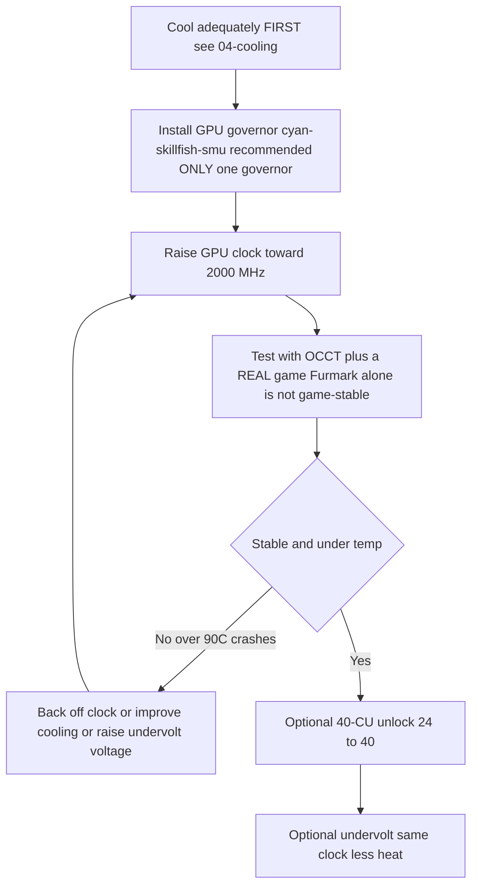
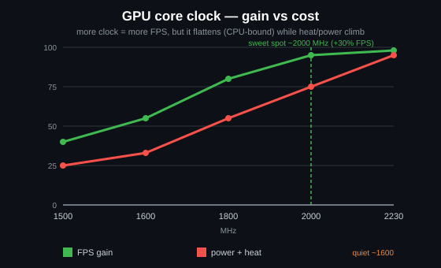
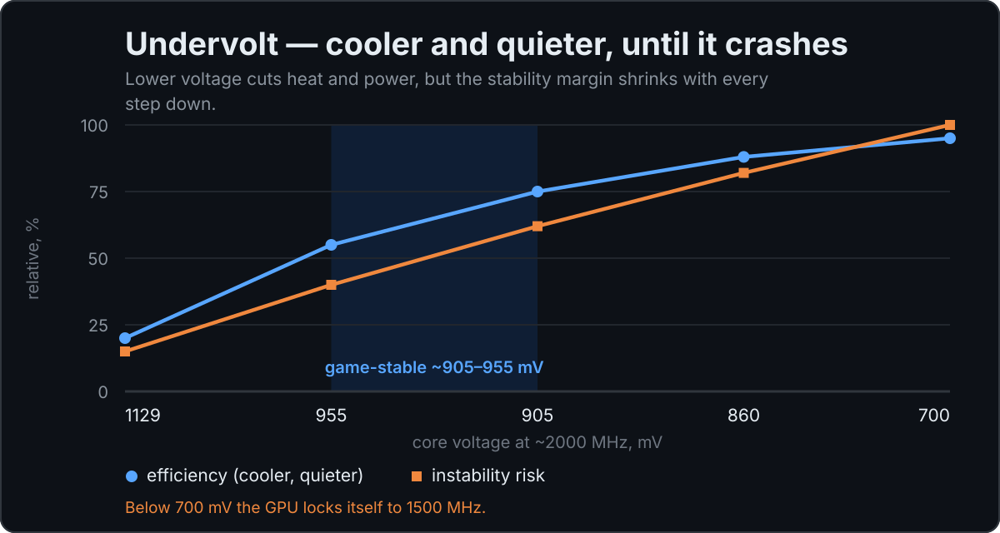
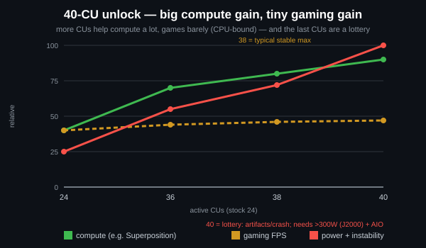
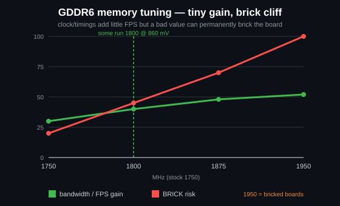

# Overclocking & Undervolting

> **TL;DR** — Out of the box the BC-250's GPU runs slow (often pinned to **1500 MHz**, ~weak). The community fix is a **governor** that overrides the clocks/voltage: the recommended one today is **[cyan-skillfish-governor-smu](https://github.com/filippor/cyan-skillfish-governor)** (needs no kernel patch, packaged on Arch/CachyOS/Bazzite/Fedora); **[oberon-governor](https://gitlab.com/mothenjoyer69/oberon-governor)** is the original and still works. Either one you edit to push the GPU to **2000 MHz (~+30 % FPS)**. The newer **[bc250_smu_oc](https://github.com/bc250-collective/bc250_smu_oc)** toolkit also overclocks the **CPU** (recommended **4 GHz @ 1275 mV**). Separately, the **[40-CU unlock](https://github.com/duggasco/bc250-40cu-unlock)** re-enables the **24 → 40 compute units** AMD disabled in firmware — a bigger GPU win than clocks alone (one Superposition run went **4647 → 6863** points, ([src](https://t.me/c/2424231195/137035))). **All of this is heat. Cool the board first** — see [04-cooling.md](04-cooling.md) — because OC without adequate cooling crashes and resets the board above ~90 °C.

This is the **last** step of the golden path, not the first. Get a stable, cool board running ([06-linux.md](06-linux.md), [04-cooling.md](04-cooling.md)) before you touch any of this. Everything here is "do it at your own risk" — the community says so repeatedly ([src](https://t.me/c/2424231195/106844)).

---

## The four levers (and what each is worth)

The BC-250 has **four** independent things you can tune. They stack:

| Lever | Tool | Typical gain | Heat cost |
|-------|------|--------------|-----------|
| **GPU clock** 1500 → 2000 MHz | governor (cyan-skillfish-smu / oberon) | **~+30 % FPS** when GPU-bound | high |
| **GPU undervolt** at a fixed clock | same governor | same FPS, **much cooler** | *negative* (less heat) |
| **CPU clock** 3.5 → 4.0 GHz | `bc250_smu_oc` | helps CPU-bound games | high |
| **40-CU unlock** 24 → 40 CUs | `bc250-40cu-unlock` | **up to ~+48 %** GPU work | high |

Two honest caveats from the chat before you start:

- **Most BC-250 games are CPU-bound, not GPU-bound.** Pushing the GPU from 2000 → 2229 MHz gained one tester *1 fps* in Shadow of the Tomb Raider (90 → 91) while power and temps jumped hard — so the headline "+30 %" only lands in the handful of titles where the GPU is the bottleneck ([src](https://t.me/c/2424231195/67029)).
- **Heat scales worse than performance.** Same tester: 2000 MHz @ 960 mV = **75 °C** in a stress test; 2229 MHz @ 1030 mV = **93 °C** — and he backed off because his PSU and cooler couldn't hold it ([src](https://t.me/c/2424231195/66972), [src](https://t.me/c/2424231195/67029)).

> ⚠️ **Safety floor.** Throttling starts around **85 °C** and the board hard-crashes / resets around **90 °C** (see [04-cooling.md](04-cooling.md)). If you cross ~85 °C under load, you are *over* your cooling budget — drop the clock or undervolt, don't push higher.



---

## Step 1 — GPU clock & undervolt: the governor

The BC-250's amdgpu driver does not expose normal sysfs overclocking. The community solution is a **governor** — a small daemon that writes clock/voltage states directly. For a new install today the recommended one is **cyan-skillfish-governor-smu**; **oberon-governor** is the original and still works (kept below as the established alternative).

<p align="center"></p>
<sub>📈 Editable source: <a href="../../assets/diagrams/gpu-clock-tradeoff.drawio">gpu-clock-tradeoff.drawio</a> (open in <a href="https://draw.io">draw.io</a>). Green = gain, red = cost.</sub>

### cyan-skillfish-governor-smu (recommended)

[filippor/cyan-skillfish-governor](https://github.com/filippor/cyan-skillfish-governor), SMU branch — drives clock/voltage through **SMU firmware calls**, so it needs **no kernel frequency patch on any distro**, is actively maintained, and is packaged on every major distro. It also adds **memory-controller power-profile** control, which lowers idle TDP to **~30–35 W** (cooler and quieter at idle) ([src](https://t.me/c/2424231195/125821)).

**Install (packaged on every major distro)** — COPR `filippor/bazzite` (Fedora/Bazzite) or AUR `cyan-skillfish-governor-smu` (Arch/CachyOS); Debian/Ubuntu use the release tarball + `sudo ./scripts/install.sh`:

```bash
# Fedora / Bazzite (COPR):
sudo dnf copr enable filippor/bazzite
sudo dnf install cyan-skillfish-governor-smu        # rpm-ostree install … on Bazzite
sudo systemctl enable --now cyan-skillfish-governor-smu.service

# Arch / CachyOS (AUR):
paru -S cyan-skillfish-governor-smu                  # or: yay -S …
sudo systemctl enable --now cyan-skillfish-governor-smu.service
```

The SMU branch can also be built from source with `cargo build --release`. **Set your clock & voltage** in `/etc/cyan-skillfish-governor-smu/config.toml` (schema below) — to go from the weak default to the community sweet spot, raise the top safe-point toward **2000 MHz** and dial the voltage down until it's stable (see undervolting below); restart the service after every edit.

> **Check it took.** Watch live clocks/temps with `amdgpu_top`, MangoHud, or LACT while you load the GPU. If clocks stay at ~1500 MHz, the service isn't running or your config didn't parse — `sudo systemctl status cyan-skillfish-governor-smu`.

> Run **one** governor at a time — if you previously ran oberon, disable it before enabling cyan-skillfish, or they fight over the same registers.

> 🔇 **Tuning for a quiet living-room console.** Maxing out (2000 MHz GPU / 4000 MHz CPU) buys little in CPU-bound games but costs a lot of heat, fan noise and watts. An r/BC250Gaming (Reddit) community report found a balanced **~1600 MHz GPU / ~3500 MHz CPU** gives a much better performance-per-noise-per-watt for everyday gaming — near-silent and cool, with FPS that holds up because most titles aren't GPU-bound anyway (see the CPU-bound caveat above). If you care more about a quiet, cool box than chart-topping benchmarks, set those as your governor ceilings instead of the max.

### oberon-governor (the original — still works)

[mothenjoyer69/oberon-governor](https://gitlab.com/mothenjoyer69/oberon-governor) — a C++ daemon, the first BC-250 governor and the most-tested; it still works, but unlike the SMU governor it relies on the extended-frequency kernel patch (or a distro that ships it) to reach the top clocks. Per its README it depends on **CMake, a C++ toolchain, and libdrm**, and is **tested only on the ASRock BC-250**. Many distros ship it prebuilt (Arch AUR, a Fedora COPR, the Bazzite images), so building from source is only needed if your distro has no package.

**Build from source** (matches the chat's reproduced sequence, ([src](https://t.me/c/2424231195/54666)) and the repo's standard CMake flow):

```bash
# Dependencies (Arch example — adjust per distro)
sudo pacman -S --needed base-devel cmake pkgconf make libdrm glibc linux-api-headers

git clone https://gitlab.com/mothenjoyer69/oberon-governor.git && cd oberon-governor
sudo cmake . && sudo make && sudo make install
sudo systemctl enable --now oberon-governor.service
```

> If `cmake` errors, the chat fix was simply to install the missing build deps and re-run: `sudo pacman -S pkgconf cmake` then rebuild ([src](https://t.me/c/2424231195/54666)).

**Set your clock & voltage.** oberon reads a YAML config:

```bash
sudo nano /etc/oberon-config.yaml      # adjust min/max frequency and voltage
sudo systemctl restart oberon-governor # apply
```

The file lets you set the **maximum and minimum voltage and frequency** for the GPU states (per the repo README). Raise the max frequency toward **2000 MHz** and dial the voltage down until it's stable. Restart the service after every edit. To migrate to the SMU governor later: stop+disable+remove `oberon-governor`, `rm /etc/oberon-config.yaml`, then install and enable the SMU service.

#### TT vs SMU — the two cyan-skillfish variants

> The recommended SMU build above is one of **two** cyan-skillfish variants. SMU is the default; the TT variant is the alternative for anyone who specifically wants the kernel-patch/sysfs route ([elektricM: governor](https://elektricm.github.io/amd-bc250-docs/system/governor/)):

| Variant | Service | How it sets clocks | Kernel patch? | Released / notes |
|---|---|---|---|---|
| **SMU** *(recommended)* | `cyan-skillfish-governor-smu` | SMU **firmware calls** | **No — works on any distro unpatched** | 2026-01-18; reaches 2300+ MHz; CPU ~0.9–1.3 % |
| **TT** (alternative) | `cyan-skillfish-governor-tt` | sysfs | **Yes** (pre-included in Bazzite) | thermal-throttling aware; reaches 2175+ MHz |

> **Service rename (2025-12-13):** filippor renamed `cyan-skillfish-governor` → `cyan-skillfish-governor-tt`, and the config dir moved `/etc/cyan-skillfish-governor/` → `/etc/cyan-skillfish-governor-tt/`. If upgrading, copy your old `config.toml` across ([elektricM: governor](https://elektricm.github.io/amd-bc250-docs/system/governor/)). The TT variant is packaged in the same COPR/AUR (`cyan-skillfish-governor-tt`) and pre-included in Bazzite.

> 🔴 **700 mV is a hard floor.** Setting the governor's *minimum* GPU voltage below **700 mV locks the GPU back to 1500 MHz** — it defeats the whole point. Keep min voltage ≥ 700 mV in any governor ([elektricM: governor](https://elektricm.github.io/amd-bc250-docs/system/governor/), [elektricM: BIOS overclocking](https://elektricm.github.io/amd-bc250-docs/bios/overclocking/)).

> 🔴 **~1100–1129 mV is the ceiling — the counterpart to the 700 mV floor.** Don't push the governor's *maximum* GPU voltage past the stock `OD_RANGE` top of **1129 mV**; beyond that is **silicon-degradation risk for no stability gain**. The conservative air-cooled ceiling sits around **1100 mV (high risk above)**, and only liquid cooling justifies the **1125 mV** top tier (table below). If a curve needs more than ~1129 mV to be stable, the real fix is *cooling or a lower clock*, not more volts ([elektricM: BIOS overclocking](https://elektricm.github.io/amd-bc250-docs/bios/overclocking/)).

> **Verify the right GPU is targeted.** The governor may control `card0` or `card1` depending on your system — `ls /sys/class/drm/ | grep card`. If settings don't apply, you may need to point the config at the correct card. On Arch/CachyOS the governor sometimes won't activate until the GPU is first used — run a game/benchmark once after boot ([elektricM: governor](https://elektricm.github.io/amd-bc250-docs/system/governor/)).

#### The cyan-skillfish-smu config schema (section-based TOML)

The `smu` branch uses a **section-based** schema, **not** the older `safe-points = [...]` array — each curve point is its own `[[safe-points]]` table. Key fields ([elektricM: governor](https://elektricm.github.io/amd-bc250-docs/system/governor/)):

```toml
# /etc/cyan-skillfish-governor-smu/config.toml
[timing.intervals]
sample = 500          # µs; raise (e.g. 1000) to cut CPU overhead, keep adjust = sample*400
adjust = 200_000
[gpu-usage]
fix-metrics = true    # fixes the MangoHud "655 %" GPU-usage bug on BC-250
method  = "busy-flag"
[gpu]
set-method = "smu"    # "smu" or "kernel"
[load-target]
upper = 0.80          # fractions, not percents
lower = 0.65
[temperature]
throttling = 85       # °C
throttling_recovery = 75

[[safe-points]]
frequency = 1000
voltage   = 800
[[safe-points]]
frequency = 2000
voltage   = 1000      # gaming
[[safe-points]]
frequency = 2200
voltage   = 1000      # many boards hold a flat 1000 mV here; bump per-board only if it crashes
```

> **Tuning order when unstable: cooling → frequency → *then* voltage.** On stock cooling the real cause is almost always heat (95 °C+). Drop the top `[[safe-points]]` blocks to cap frequency before adding voltage; only if temps are fine and it still crashes at 2150–2200 MHz, bump the **top point only** by +15–25 mV. Past ~1075 mV at 2200 MHz you're just adding heat — drop the frequency instead ([elektricM: governor](https://elektricm.github.io/amd-bc250-docs/system/governor/)).

> **GPU-reset black-screen, governor-specific.** If the GPU crashes *while the governor is actively writing sysfs*, the reset can't complete and you get a permanent black screen (system still alive over SSH) needing a hard reboot. Workaround: `systemctl stop` the governor before known crash-prone games; real fix is a stable curve ([elektricM: governor](https://elektricm.github.io/amd-bc250-docs/system/governor/)).

> **`perf_profile` — the memory-controller / Infinity Fabric tier (separate from the GPU curve).** The SMU exposes a performance-profile index `0–3`: **3** is the highest memory-controller / Infinity-Fabric performance, while **1** is the recommended low-power profile for the lowest idle point. The governor forces it to **3** automatically whenever CPU load crosses `cpu-load-target.upper`. ([bc250-collective/cyan-skillfish-governor](https://github.com/bc250-collective/cyan-skillfish-governor))

##### How the SMU governor pushes past 2230 MHz — and why it ships disabled

Because the SMU branch talks to the SMU firmware directly rather than through the amdgpu `OD_RANGE`, it can **exceed Oberon's 2230 MHz hard cap** — one walkthrough drove it to **≈2700 MHz** on a single board ([Old Lamer — Part XII](https://youtu.be/Chzxaryjncs)). That headroom is exactly why filippor ships it carefully:

> 🔴 **The SMU governor's default config can black-screen on boot — so it is shipped NOT auto-starting.** filippor deliberately leaves the service disabled after install so a bad default curve can't lock you out at boot; you get a chance to **tune and test the curve first, then `systemctl enable` it** once it's stable on your board. Enable it *before* you've validated a curve and a black screen on next boot is on you ([Old Lamer — Part XII](https://youtu.be/Chzxaryjncs)). *(⚠ figures auto-captioned — treat the exact MHz as approximate.)*

Unlike Oberon's hard frequency drop on overheat, the SMU governor **ramps gradually toward a temperature target**. The walkthrough also exposes extra `config.toml` fields beyond the schema above ([Old Lamer — Part XII](https://youtu.be/Chzxaryjncs)):

```toml
# extra tuning knobs shown in the Part XII walkthrough
[ramp-rates]
normal = 1
burst  = 50
[gpu-usage]
burst-samples = 60
down-events   = 5
[frequency-thresholds]
adjust = 10
[temperature]
throttling_recovery = 80
```

> ⚠️ **Author-experimental 16-point air curve — NOT recommended, exceeds this guide's air ceiling.** The Part XII author ran this curve on air, but its top points (2333–2400 MHz at 1120–1150 mV) sit **above the conservative air-cooled limits documented in Step 3** (≈2230 MHz / 1060 mV on air; 1125 mV is a *liquid-only* tier). It is shown for reference, not as a target — on air, stop where Step 3's cooling-class table says to:
>
> ```toml
> # ⚠ author-experimental, air-cooled — DO NOT copy blindly (exceeds the air ceiling)
> # frequency (MHz) @ voltage (mV)
> 1000@800,  1175@850,  1500@900,  1700@920,
> 2000@960,  2100@1000, 2150@1035, 2200@1050,
> 2250@1070, 2300@1090, 2333@1120, 2400@1150
> ```
>
> At the top of that curve, **2.4 GHz pulled ~30 A ≈ 360 W** — enough that it needs **dual Molex / a second board feed** ([03-power-supply.md](03-power-supply.md)), not a single connector. Superposition scaled **≈4200 at 2.2 GHz → ≈4500 at 2.4 GHz** ([Old Lamer — Part XII](https://youtu.be/Chzxaryjncs)). *(⚠ all values auto-captioned — approximate.)*

#### GPU frequency-range kernel patch (only for TT / manual sysfs)

The amdgpu driver's stock GPU range is **1000–2000 MHz**; a one-line driver patch (by **ViRazY**, `linux-6.12-bc250-freq.mypatch`, ~**639 bytes**, tested on kernels **6.12 / 6.15 / 6.16.x**) widens it to **350–2230 MHz** (350 MHz deep-idle saves power; the top end enables 2230+ overclocks). **Bazzite, PikaOS, and the Arch AUR kernels ship it pre-patched**, and the **SMU governor bypasses the need for it entirely** via firmware calls — so you only patch manually if you want the TT governor or raw sysfs OC with the extended range on an unpatched distro. Verify with `cat …/pp_od_clk_voltage` (should show 350–2230). **Do not** use the extended-voltage (600–1300 mV) patch — unnecessary and risky ([elektricM: BIOS overclocking](https://elektricm.github.io/amd-bc250-docs/bios/overclocking/)).

> 🔧 **Raw sysfs undervolt (one-off probing).** For a quick per-point stability probe without the governor, write a voltage-curve point straight to sysfs (format `vc <level> <MHz> <mV>`) and commit it ([elektricM: BIOS overclocking](https://elektricm.github.io/amd-bc250-docs/bios/overclocking/)):
> ```bash
> echo "vc 0 2100 1025" | sudo tee /sys/class/drm/card0/device/pp_od_clk_voltage   # set point: 2100 MHz @ 1025 mV
> echo "c" | sudo tee /sys/class/drm/card0/device/pp_od_clk_voltage                # commit
> ```
> This is for quick probing only — it doesn't survive a reboot. The governor's `config.toml` is the recommended **persistent** path; use raw sysfs to find a stable per-point voltage, then bake it into the governor curve.

#### PS5GPU-BC250 — a GUI controller (no config files)

Prefer a GUI? **[ZEROAESQUERDA/PS5GPU-BC250](https://github.com/ZEROAESQUERDA/PS5GPU-BC250)** is a Qt app (KDE/GNOME) that adjusts min/max GPU frequency & voltage, sets a temperature limit, and offers automatic 4-stage boost or manual control — MSI-Afterburner-style, no kernel patches or TOML editing. **Disable any running governor first** (cyan-skillfish-smu/tt or oberon) or they conflict ([elektricM: governor](https://elektricm.github.io/amd-bc250-docs/system/governor/)).

---

## Step 2 — CPU overclock & proper undervolt: `bc250_smu_oc`

Released **2025-12-30** by the bc250-collective (reverse-engineering the SMU), [bc250_smu_oc](https://github.com/bc250-collective/bc250_smu_oc) is the tool that finally lets you touch the **CPU** clock and voltage (Zen 2 cores), not just the GPU. The authors recommend **4 GHz @ 1275 mV** as the stability/heat optimum and ship that as the example in the repo ([src](https://t.me/c/2424231195/106844)).

**Install & use** (verbatim from the repo README):

```bash
# Prerequisite: install the `stress` CPU load tool from your package manager
git clone https://github.com/bc250-collective/bc250_smu_oc.git
cd bc250_smu_oc
pip install .        # or: pipx install .

# Detect / test a target (CPU 4 GHz at 1275 mV), keep it applied:
bc250-detect --frequency 4000 --vid 1275 --keep

# Once you've found a stable config, install it and enable at boot:
bc250-apply --install overclock.conf
sudo systemctl enable --now bc250-smu-oc
```

> 🔴 **Hard voltage limit.** Per the repo: never let CPU core voltage (**Vid**) exceed **1.325 V** under any circumstances — silicon degradation starts above ~1.35 V ([src](https://t.me/c/2424231195/115726)). And: **raising CPU frequency without undervolting lets Vid scale uncapped and can destroy the hardware** — always pair a clock bump with a voltage target.

Why 4 GHz is the ceiling: AMD considers up to ~4 GHz safe for this silicon; the 4700S desktop-kit BIOS even boots turbo at 4000 MHz / 1.35 V out of the box. Zen 2 *typically* reaches ~4200, but these chips are **mining-reject silicon**, so 4200 only "if you get very lucky" ([src](https://t.me/c/2424231195/115726)).

> ❓ **Can I unlock the CPU to 8 cores?** Short answer: **no — not currently, and it wouldn't help anyway.** The BC-250 ships with 6 of its 8 Zen 2 cores active; r/BC250Gaming community reports describe the other two as **software-locked via eFuses read by the SMU** (the binning is largely artificial — a mining-era decision), *not* physically severed. But unlocking them would mean **bypassing the PSP signature check and modifying SMU microcode**, and community attempts (on Discord) have **not succeeded**. Even if someone did, the gain for gaming would be **marginal**: the BC-250 is bottlenecked by **weak single-thread performance, a small fragmented 2×4 MB L3 cache, and an AVX2-only / crippled FPU** — adding cores raises neither FPS nor the things this chip is actually starved on. Don't chase it ([r/BC250Gaming community reports](https://www.reddit.com/r/BC250Gaming/)).

> The pinned `bc250_smu_oc` post can also **replace** your GPU governor (it has its own `bc250-smu-oc` service). Don't run two governors at once.

**Verified CPU-OC scaling** (Fedora 43, kernel 6.19.8; auto-tuned voltage; 7-zip MIPS; with a temperature-based fan curve) ([elektricM: governor](https://elektricm.github.io/amd-bc250-docs/system/governor/)):

| Freq | Auto Vid | 7-zip MIPS | Temp (full load) | vs stock |
|---|---|---|---|---|
| 3500 (stock) | auto | 26,062 | 60 °C | baseline |
| 3600 MHz | 1150 mV | 26,518 | 65 °C | +1.7 % |
| 3700 MHz | 1199 mV | 27,212 | 68 °C | +4.4 % |
| 3800 MHz | 1250 mV | 27,919 | 72 °C | +7.1 % |
| 3900 MHz | 1275 mV | 28,410 | 75 °C | +9.0 % |
| 4000 MHz | — | throttles at PWM 80 | 77 °C | ❌ (needs more cooling/fan) |

The tool's flags: `bc250-detect -f <MHz> -v <mV>` to test, add **`-k`** to keep the OC after the tool exits, **`-c <path>`** to write a config. Make it permanent with `bc250-apply -a -i /etc/bc250-overclock.conf` then `systemctl enable bc250-smu-oc`. Authors: **mrfrakes & dantistnfs** (SMU reverse-engineering) ([elektricM: governor](https://elektricm.github.io/amd-bc250-docs/system/governor/), [elektricM: BIOS overclocking](https://elektricm.github.io/amd-bc250-docs/bios/overclocking/)). Note **4000 MHz throttled at the stock-ish PWM 80 fan** — the ceiling is cooling-bound, consistent with the air-vs-water note above.

#### How `bc250-detect` actually searches (and the voltage ceiling it enforces)

A video walkthrough of the same tool shows the auto-search mechanics: it **ramps up from 3.5 GHz in 100 MHz / 25 mV steps**, running a **~300 s stress test** at each step and only advancing if it passes — e.g. `bc250-detect -f 3850 -v 1150 -k` to test 3.85 GHz @ 1150 mV and keep it. On Bazzite the install is `sudo rpm-ostree install stress pipx` then `pipx install .` ([Old Lamer — Part VIII](https://youtu.be/ciDpPhoioKM)).

> ⚠️ **Two voltage ceilings — note both, they disagree.** The Part VIII video states a **hard 1300 mV** CPU-Vid ceiling, which is **more conservative** than the repo's documented **1.325 V** limit used above. They don't contradict the safety message (stay well under ~1.35 V), but the *exact* number differs by source — when in doubt, take the lower (1300 mV) as your working cap and never exceed 1.325 V ([Old Lamer — Part VIII](https://youtu.be/ciDpPhoioKM)). *(⚠ the 1300 mV figure is auto-captioned.)*

In that run, **4 GHz @ 1225 mV passed the short quick-test but crashed in-game**, so the author dropped back to a stable **3.85 GHz @ 1150 mV** — the same "4 GHz quick-passes, fails sustained" pattern the elektricM table shows ([Old Lamer — Part VIII](https://youtu.be/ciDpPhoioKM)). *(⚠ ASR — approximate values.)*

**End-to-end CPU+GPU scaling (Horizon Zero Dawn, 1080p Ultra, native, 1× Arctic P12 Pro ~2200 rpm).** A single video stacks each lever and measures the in-game result, which is the clearest demonstration of why this board is **CPU-bound**: the GPU is happy to render ~88–90 fps long before the CPU can feed it ([Old Lamer — Part X](https://youtu.be/1hgSQxf6RXE)). *(⚠ all fps/°C auto-captioned — treat as ≈.)*

| Step (cumulative) | GPU clock @ mV | CPU clock @ mV | In-game fps | GPU-capable fps | CPU / GPU temp |
|---|---|---|---|---|---|
| Stock undervolt | 1500 @ 850 | 3.5 G @ 1020 | **≈62** | — | 53 / 51 °C |
| + GPU OC | 2000 @ 960 | 3.5 G @ 1020 | **≈69** | 81 | 64 / 63 °C |
| + CPU OC | 2000 @ 960 | 3.85 G @ 1155 | **≈72** | — | 65 / 64 °C |
| + GPU OC | 2200 @ 1030 | 3.85 G @ 1155 | **≈74** | 88 | ~70 °C |
| + CPU OC | 2200 @ 1030 | 4.0 G @ 1270 | **≈76–77** | 88 | 72 / 68 °C |
| + mitigations off | 2200 @ 1030 | 4.0 G @ 1270 | **≈80** | 90 | — |

**Net: ≈62 → ≈80 fps (~+29 %), and it's hard CPU-bound** — the GPU renders 88–90 fps internally while the CPU caps the playable rate around 80. Notes from the same run ([Old Lamer — Part X](https://youtu.be/1hgSQxf6RXE)):

- **4 GHz needs ~1270 mV** here, or the board green-screens — pairing the clock with enough Vid is mandatory (echoes the "never raise frequency without undervolting" rule above).
- **`bc250_smu_oc` has a built-in ~90 °C auto-throttle**, so the tool itself backs off before the board's hard-crash temp.
- **mitigations=off bought only ≈+3 fps** (the CPU-vuln kernel mitigations); a small, optional last squeeze.
- **Custom memory timings gave no gain here and carry brick risk** — skip them (see the GDDR6 section below).
- **3.85 GHz @ 1155 mV is called the CPU sweet spot** — matching the elektricM 7-zip table, where 4 GHz throttles on stock-ish cooling.
- At the final OC the board ran **1440p Ultra native @ 60**, and **4K + FSR near 60** ([Old Lamer — Part X](https://youtu.be/1hgSQxf6RXE)).

> 📊 **Stock-baseline FurMark sanity numbers (different run).** A separate walkthrough logged FurMark at **stock FHD ≈4085 points / 67 fps**; raising the GPU **1500 → 2000 MHz gained ~+30 % (≈5340 points / 87 fps)**, while **2229 MHz added almost nothing and ran >90 °C** (throttle). Rule of thumb from that video: **"<80 °C in FurMark + CPU stress ⇒ <70 °C in games,"** and **FurMark Vulkan heats the chip more than the GL path** ([Old Lamer — Part IV](https://youtu.be/YuBmGF536II)). *(⚠ ASR — approximate.)*

#### CPU frequency scaling needs the ACPI fix (else there's no cpufreq at all)

> ❗ **Out of the box the BC-250 exposes no CPU frequency scaling** — there is *no* cpufreq interface, so `cpupower`/`schedutil` do nothing and the CPU sits at a fixed clock. The **[bc250-collective/bc250-acpi-fix](https://github.com/bc250-collective/bc250-acpi-fix)** ships two SSDT tables (loaded via an initrd override) that fix this ([elektricM: governor](https://elektricm.github.io/amd-bc250-docs/system/governor/)):
> - **SSDT-PST** → enables standard Linux cpufreq with **8 P-states, 800 MHz → 3200 MHz** (governors: `schedutil`, `powersave`, `performance`, …).
> - **SSDT-CST** → enables **C1/C2/C3 idle states** so cores actually sleep at idle (lower idle power).
>
> Both confirmed working on kernel 6.19.8. Install builds a cpio from `SSDT-CST.aml`+`SSDT-PST.aml` into `/boot`, prepended to the initrd line (Fedora BLS) or via `GRUB_EARLY_INITRD_LINUX_CUSTOM` (GRUB). Then `echo schedutil | sudo tee /sys/devices/system/cpu/cpu*/cpufreq/scaling_governor`. **Caveat:** a kernel update won't carry the override into the new boot entry — re-add it or use a kernel-install hook. Combined with `bc250_smu_oc`, the CPU then scales **800 MHz idle → 3900 MHz load** instead of running pinned ([elektricM: governor](https://elektricm.github.io/amd-bc250-docs/system/governor/), [elektricM: power](https://elektricm.github.io/amd-bc250-docs/system/power/)).

#### Idle power — why it's high, and how far tuning gets you

The BC-250 idles hot and hungry by default; tuning lowers it in clear tiers ([elektricM: power](https://elektricm.github.io/amd-bc250-docs/system/power/)):

- **Idle ladder: ~105 W (no governor) → ~85 W (governor) → ~55 W (optimized: Debian + governor + undervolt).** The governor alone saves ~20 W; **~55 W is the best-case idle floor**, and you only reach it by stacking distro + governor + undervolt.
- **Why idle is high — unoptimized breakdown (~93 W):** **CPU+GPU ~31 W**, **RAM + memory controller ~35 W**, **rest of board ~27 W**. The memory subsystem is the single biggest idle draw, and most of the board figure is fixed silicon — i.e. tuning can shave the CPU/GPU and (via the governor's memory-controller profile) some of the RAM draw, but a large chunk is untouchable.

Three named tuning profiles bracket the realistic envelopes (idle power / sustained temp) ([elektricM: power](https://elektricm.github.io/amd-bc250-docs/system/power/)):

| Profile | Power | Temp |
|---|---|---|
| Efficiency | 55–65 W | 60–70 °C |
| Gaming | 70–85 W | 65–75 °C |
| Performance | 85–95 W | 75–85 °C |

---

## Step 3 — Undervolting (do this for heat, every chip differs)

Undervolting is the highest-value move on this board: **same clock, far less heat**, and it's *required* if you raise the CPU clock. But **every chip is different** — silicon lottery is real here. One owner ran three near-sequential boards and only one held 900 mV under stress; identical cooling, identical temps, different stability ([src](https://t.me/c/2424231195/50568)).

<p align="center"></p>
<sub>📈 Editable source: <a href="../../assets/diagrams/undervolt-tradeoff.drawio">undervolt-tradeoff.drawio</a> (open in <a href="https://draw.io">draw.io</a>). Green = gain, red = cost.</sub>

**Target clock → voltage, real community numbers (your chip will vary):**

| GPU clock | Voltage that owners found *game-stable* | Notes |
|-----------|------------------------------------------|-------|
| 1500 MHz | ~710 mV | one tester's "most stable" board ([src](https://t.me/c/2424231195/23545)) |
| 2000 MHz | **~955 mV** | Furmark-stable at 905 mV but artifacts in games until 955 mV ([src](https://t.me/c/2424231195/68126), [src](https://t.me/c/2424231195/136773)) |
| 2000 MHz | ~960 mV → **75 °C** stress | the popular daily-driver setpoint ([src](https://t.me/c/2424231195/66972)) |
| 2229 MHz | ~1030–1050 mV → **93 °C** stress | "turned it off, I'm scared" — diminishing returns ([src](https://t.me/c/2424231195/66972)) |

**What each cooling class can actually hold** — the table above stops at "2229 MHz @ ~1030–1050 mV → scary" on stock-ish cooling. To go higher you need the matching cooling; these are elektricM's per-cooling-class ceilings ([elektricM: BIOS overclocking](https://elektricm.github.io/amd-bc250-docs/bios/overclocking/)):

| Cooling | GPU clock | Voltage |
|---|---|---|
| Conservative air (max) | 2230 MHz | 1060 mV |
| High static-pressure air (Arctic P12 Max) | 2300 MHz | 1075 mV |
| Liquid (per NexGen3D) | 2400 MHz | 1125 mV |

> 🧪 **Community undervolt setpoints (4pda).** Two more real curves from the Russian forum, useful starting points (still chip-dependent): on a **24-CU (Oberon)** board, a two-point curve `1000 MHz @ 0.8 V + 1700 MHz @ 0.85 V` ([4pda — dreamerok](https://4pda.to/forum/index.php?showtopic=1104980)); on a **40-CU** board, `1500 MHz @ 900 mV`. For a high-leakage chip, start low — `500 MHz / 900 mV` — and **add frequency from there** rather than chasing voltage down ([4pda — Lakan](https://4pda.to/forum/index.php?showtopic=1104980)).

> ⚡ **Perf-per-watt framing.** Community testing notes that an **undervolted + underclocked 40-CU draws ~100 W less than a 24-CU at the same FurMark score** — i.e. for equal output the wider-but-slower part is the more efficient operating point, which is the whole argument for unlocking and then *under*-clocking rather than pushing 24 CU hard.

> **Furmark alone is not a stability test.** Its fixed load hides instability that only shows up when the *context* changes — alt-tabbing, loading textures, menus. A board "stable" in Furmark at 905 mV threw texture artifacts in real games after 1–2 hours until voltage went to 955 mV. Validate in **actual games + an alt-tab/menu sweep**, and use a varied stress tool like **OCCT** (it loads the VRM, not just the shaders), not just Furmark ([src](https://t.me/c/2424231195/68126), [src](https://t.me/c/2424231195/136773), [src](https://t.me/c/2424231195/23545)).

> **Handy hardware tell:** the BC-250 has a **load LED** — **red = GPU idle, green = GPU loaded**. Some "idle" scenes (e.g. Novigrad in Witcher 3) actually hammer the GPU and surface undervolt artifacts that Furmark/Cyberpunk miss ([src](https://t.me/c/2424231195/12285)).

A too-aggressive undervolt is **not dangerous** — at worst the board drops out or disables the M.2 slot, which clears in five seconds because the OC isn't stored in BIOS ([src](https://t.me/c/2424231195/105998)).

> 💡 **Artifacts that aren't undervolt-related?** Black textures / flickering can also be a driver HiZ issue — try setting **`RADV_DEBUG=nohiz`** in the game's environment before chasing voltage. And note the stock-kernel **`OD_RANGE` voltage window is 700–1129 mV**; the conservative air-cooled max is ~1085 mV, absolute max ~1100 mV — beyond that is degradation risk for no real stability gain ([elektricM: BIOS overclocking](https://elektricm.github.io/amd-bc250-docs/bios/overclocking/)).

---

## Step 4 — The 40-CU unlock (24 → 40 compute units)

The biggest single GPU win, and the newest. The BC-250's Cyan Skillfish die physically has **40 CUs**, but stock firmware leaves only **24 active** (16 "harvested"). The kernel parameter **`amdgpu.bc250_cc_write_mode=3`** plus a patched amdgpu driver re-enables all 40. Measured result — a 4K Superposition run jumped **4647 → 6863** points (24/40 → 40/40 CUs active), with the `cu_map.sh` tool showing the harvest map fill up ([src](https://t.me/c/2424231195/137035)):


People are running **40 CU @ 1850 MHz** (RE4 Remake native 1440p high, 60 fps) and even reporting very low voltages at 40 CU (e.g. 1400 MHz @ 750 mV on a lucky chip) ([src](https://t.me/c/2424231195/137260), [src](https://t.me/c/2424231195/137157)).

> ⚠️ **This requires patching and rebuilding the amdgpu kernel module** — it is the most involved task in this guide and is **BC-250-only** (the patch is guarded by the board's PCI device ID **`0x13FE`**). The patch is non-persistent: without the modprobe config, a reboot reverts to 24 CUs.

**How it actually works (two registers, both required).** The unlock writes **two** hardware registers during driver init — neither alone scales compute ([elektricM: 40-CU unlock](https://elektricm.github.io/amd-bc250-docs/system/40cu-unlock/)):

| Register | Role | Stock → unlocked |
|---|---|---|
| `CC_GC_SHADER_ARRAY_CONFIG` | tells the driver how many CUs exist | `0xfff80000` → `0xffe00000` |
| `SPI_PG_ENABLE_STATIC_WGP_MASK` | tells SPI where to dispatch waves | `0x07` (WGP 0–2) → `0x1F` (WGP 0–4) |

(The runtime tool below writes a **third**, `RLC`, register too.) This is a **compute** unlock, not a gaming one: duggasco's controlled A/B shows Vulkan `llama-bench pp512` jump **1.61×** (230 → 372 tok/s at 1500 MHz), while `glmark2` gains only **+4.4 %** because 3D is fill-rate-bound, not CU-bound ([elektricM: 40-CU unlock](https://elektricm.github.io/amd-bc250-docs/system/40cu-unlock/)). For AI/LLM specifics see also [akandr/bc250](https://github.com/akandr/bc250).

> 🎯 **The recommended operating point is 1500 MHz, not 2 GHz.** duggasco's A/B puts **1500 MHz / ~900 mV** as the sweet spot — it captures most of the ~1.67× theoretical scaling without thermal trouble (1500 MHz/874 mV: 372 tok/s, 125 W, 83 °C). At 2 GHz the same test bursts to 466 tok/s but power/temps climb hard and the package thermal-throttles after a few minutes ([elektricM: 40-CU unlock](https://elektricm.github.io/amd-bc250-docs/system/40cu-unlock/)).

> ⚠️ **Not every board unlocks cleanly — check your harvest pattern first.** The 16 fused-off CUs aren't guaranteed silicon-healthy. Boards with a **contiguous** harvest pattern (e.g. CU 0–5 active, 6–9 fused, same on all 4 shader arrays) tend to pass; boards with a **scattered** pattern may have genuinely defective CUs that enumerate but fail under load. Run **`./scripts/cu_map.sh`** from the repo *before* committing a modprobe config. If scattered, expect to run the per-WGP health test and land somewhere **between 24 and 40 stable CUs** ([elektricM: 40-CU unlock](https://elektricm.github.io/amd-bc250-docs/system/40cu-unlock/)). Also: **Secure Boot must be off** (or sign the rebuilt module yourself).

> 🎰 **40 CUs is a lottery, not a guarantee — many boards top out at 38.** r/BC250Gaming community reports converge on this: while the die has 40, a lot of chips are only stable at **38 CUs**, and the last one or two commonly cause **graphics artifacts (a tell-tale "line" across the frame) or hard crashes**. Reported stable counts vary by chip — **36, 38, or 40**. Worse, "stable at 40" can be *deceptive*: a board may crash on the first game launch yet run fine on a later attempt, so a single clean benchmark proves nothing. **Recommended method — unlock CUs one at a time and test after each.** Use **[WinnieLV/bc250-cu-live-manager](https://github.com/WinnieLV/bc250-cu-live-manager)** to enable a single CU at a time and validate before adding the next (e.g. FurMark 20+ min plus a couple of game benchmarks per step). A bad CU **instantly locks the system**, so each test tells you exactly which CU to leave masked — far safer than flipping all 16 on at once and hoping. Treat "24 → 40" as the best case; plan for **38** ([r/BC250Gaming community reports](https://www.reddit.com/r/BC250Gaming/)).

The chart below sums up why this lever is worth it but tricky: **compute scales strongly with CUs** (the Superposition / llama-bench jumps above), while **gaming FPS barely moves because most titles are CPU-bound**, and power draw and instability climb the higher you go — 38 CUs is the typical stable count, 40 is a lottery.

<p align="center"></p>
<sub>📈 Editable source: <a href="../../assets/diagrams/cu40-tradeoff.drawio">cu40-tradeoff.drawio</a> (open in <a href="https://draw.io">draw.io</a>). Green = compute, amber = gaming FPS, red = power/instability.</sub>

#### How much the extra CUs are worth (FurMark)

The 40-CU video series quantifies the compute jump in FurMark — a near-pure GPU load, so it shows the *upper bound* of what the unlock buys (games gain far less, being CPU-bound). On one board ([Old Lamer — Part I](https://youtu.be/Zvo4UsNocDQ)): *(⚠ all figures auto-captioned — ≈.)*

| Config | FurMark fps | vs 24-CU stock |
|---|---|---|
| 24 CU @ 2000 MHz | ≈91 | baseline |
| 40 CU @ 1500 MHz (base) | ≈110 | **~+25 %** |
| 40 CU @ 2000 MHz | — | **≈+60 %** |

An **OC'd 24-CU draws about the same power/temp as a stock 40-CU**, while an **OC'd 40-CU pulls ~+40 W** over stock. Black Myth: Wukong gained **~+30 % at equal frequency going 24 → 40 CU**. Pushing it, the **board crashed at 2.4 GHz with 40 CU** — the combined clock+CU envelope is the limit, not either alone ([Old Lamer — Part I](https://youtu.be/Zvo4UsNocDQ)).

> 🟢 **Live FurMark scaling via `bc250-cu-live-manager` (no kernel rebuild).** Toggling CUs live at a fixed **1500 MHz** in Vulkan FurMark walked the score up cleanly: **24 CU ≈70 → 32 CU ≈100 → 40 CU ≈127–128 fps** ([Old Lamer — 40CU Part III](https://youtu.be/lAxY2RZcvg0)). The TUI hotkeys are **E** = edit the WGP table, **F** = full-dispatch, **W** = write the table, **I** = install the systemd service, **Q** = quit; the default sudo password on the image is `bazzite`. It needs **no custom kernel** and **survives Bazzite updates**, because it writes the registers at runtime via `umr` rather than patching amdgpu — write the table once, install the service once, reboot. *(⚠ fps auto-captioned — ≈.)*

### Easiest path — the project build script

[duggasco/bc250-40cu-unlock](https://github.com/duggasco/bc250-40cu-unlock) ships a script that does the build/enable for you (needs `gcc`, `make`, `zstd`, and kernel headers):

```bash
git clone https://github.com/duggasco/bc250-40cu-unlock.git
cd bc250-40cu-unlock
sudo ./scripts/bc250-enable-40cu.sh build
sudo ./scripts/bc250-enable-40cu.sh enable    # writes the modprobe config and reboots
# Roll back if anything misbehaves:
sudo ./scripts/bc250-enable-40cu.sh disable   # turn the unlock off
sudo ./scripts/bc250-enable-40cu.sh restore   # restore the original amdgpu module
```

The script backs up the stock module before patching, as `…/amdgpu/amdgpu.ko.*.bc250-backup-*`, so `restore` always has an original to fall back to. **Per-distro build dependencies** ([elektricM: 40-CU unlock](https://elektricm.github.io/amd-bc250-docs/system/40cu-unlock/)):

| Distro | Packages |
|---|---|
| Debian / Ubuntu | `linux-headers-$(uname -r) build-essential zstd` |
| Fedora | `kernel-devel gcc make zstd curl` |
| Arch / CachyOS | `linux-headers` |

### Manual path (patch the module yourself)

For when you'd rather drive it (e.g. CachyOS/Arch, the chat's most-used distro for this). Reproduced from the pinned community instruction ([src](https://t.me/c/2424231195/137241)) — cross-check the patch and `-p` strip level against the [repo](https://github.com/duggasco/bc250-40cu-unlock), which uses `patch -p5`:

```bash
# 1. Get matching kernel headers (CachyOS example)
sudo pacman -Suy
sudo pacman -S linux-cachyos-headers
sudo reboot

# 2. Patch the amdgpu source, rebuild & install the module
cd /usr/lib/modules/$(uname -r)/build/drivers/gpu/drm/amd/amdgpu
# apply bc250-40cu-amdgpu.patch to gfx_v10_0.c  (patch -p5 < .../patch/bc250-40cu-amdgpu.patch)
sudo make -C /usr/lib/modules/$(uname -r)/build M=$(pwd) modules
sudo make -C /usr/lib/modules/$(uname -r)/build M=$(pwd) modules_install
sudo reboot

# 3. Turn the feature on via kernel param, rebuild initramfs, reboot
echo 'options amdgpu bc250_cc_write_mode=3' | sudo tee /etc/modprobe.d/bc250-40cu.conf
sudo mkinitcpio -P     # Fedora/atomic: dracut --force  (or rpm-ostree kargs, below)
sudo reboot
```

**On Fedora atomic / Bazzite** (rpm-ostree), the parameter goes in as a kernel arg instead ([src](https://t.me/c/2424231195/137916)):

```bash
sudo rpm-ostree kargs --append-if-missing='amdgpu.bc250_cc_write_mode=3'
sudo systemctl reboot
```

> 📦 **Prebuilt 40-CU-unlock kernel on Bazzite, and the safe ordering.** There is a packaged unlock kernel `6.17.7-ba29.fc43.bc250cu.x86_64` for Bazzite. The walkthrough's sequence is: `rpm-ostree update` → **pin the current deployment** (so you can roll back) → **disable + stop the GPU governor *before* the unlock** (a governor writing clocks during the CU change can wedge the GPU) → swap in the unlock kernel → reboot → recheck the CU map. Do the governor-stop first; that ordering is the part people miss ([Old Lamer — 40CU Part I](https://youtu.be/Zvo4UsNocDQ)). *(⚠ kernel string per the video — verify against the repo.)*

> 🥾 **On CachyOS the unlock uses Limine, not GRUB.** If your CachyOS install boots via the **Limine** bootloader, the `amdgpu.bc250_cc_write_mode=3` kernel argument goes in **`/etc/default/limine`**, not a GRUB config — a step-by-step is in the [psenyukov.ru guide](https://psenyukov.ru/topics/5564) (linked from the [RU CU-unlock video](https://youtu.be/M7PsojWr4KA)). Same parameter, different bootloader file.

### Verify the unlock worked

```bash
sudo dmesg | grep active_cu_number     # success = ...active_cu_number 40
sudo dmesg | grep bc250-40cu           # shows the mode=3 register writes

# Non-root check (no sudo needed) — ask the Vulkan driver directly:
RADV_DEBUG=info vulkaninfo --summary 2>&1 | grep num_cu   # expect: num_cu = 40 and num_cu_per_sh = 10
```

If the count ends in **40**, all CUs are live ([src](https://t.me/c/2424231195/137241)). You should also see log lines like `bc250-40cu-enable: mode=3 ... CC=0xfff80000->0xffe00000 SPI=0x00000007->0x0000001f` ([src](https://t.me/c/2424231195/137889)). If `vulkaninfo` shows `num_cu = 24` (or `active_cu_number` is 24), the patched module didn't load ([elektricM: 40-CU unlock](https://elektricm.github.io/amd-bc250-docs/system/40cu-unlock/)).

> **Don't want to recompile a kernel?** The community is building helper scripts and prebuilt module bundles. See [WinnieLV/bc250-cu-live-manager](https://github.com/WinnieLV/bc250-cu-live-manager) (toggle CUs live) and [gennro/bc250-toolkit](https://github.com/gennro/bc250-toolkit) (`bc250-toolkit.sh` / `bc250-unlock.sh`). These move fast — check the repos for current status.

> **Runtime UMR vs the kernel patch — same end state, different trade-off.** `bc250-cu-live-manager` writes the same registers (**CC + SPI + RLC**) from userspace via `umr` *after* the driver boots, with a TUI and a systemd unit for persistence — it installs `umr` itself (pacman/dnf/rpm-ostree). **Pick runtime UMR** if you don't want to rebuild amdgpu every kernel update, or want to A/B WGP layouts live (great for scattered-harvest boards — it refuses to disable driver-active WGPs, so per-board experiments are safer than hand-running `umr -w`). **Pick the kernel patch** if you want `active_cu_number 40` in the driver topology from boot 0, or you're baking it into a distro image ([elektricM: 40-CU unlock](https://elektricm.github.io/amd-bc250-docs/system/40cu-unlock/)).

#### Selective CU masking (for scattered-harvest boards)

If `cu_map.sh` shows a scattered pattern, duggasco ships a per-WGP health test that reboots into each WGP config in isolation and runs correctness checks, then masks the bad ones ([elektricM: 40-CU unlock](https://elektricm.github.io/amd-bc250-docs/system/40cu-unlock/)):

```bash
sudo ./scripts/bc250-cu-health-test.sh start
./scripts/bc250-cu-mask.sh --results /var/lib/bc250-cu-health-test/results.tsv --install
```

Masking uses the stock **`amdgpu.disable_cu`** parameter at **WGP granularity** (disabling CU 6 also disables CU 7 — same WGP).

> 🧩 **Manual masking by pair-id (the hand-rolled route).** A separate walkthrough does this by hand: first **rebase the image** (`brh → bazzite-deck → stable → tag 20260406`), then mask CUs by a **pair-id notation** `row.col`, where the row is one of `00 / 01 / 10 / 11` (the four shader arrays) and the col is `0–4` (the WGP) — e.g. `011`, `013`. You **append those ids to `rpm-ostree kargs amdgpu.disable_cu`**. Because CUs disable **in pairs**, masking two pairs lands you at **36 CU** and masking a single id at **38 CU**; the author keeps a **~210-combination lookup chart** to pick which ids to drop. (AMD reportedly built the die to a **24-CU spec contractually agreed with ASRock**, which is why the harvest exists at all.) ([Old Lamer — 40CU Part II](https://youtu.be/iUVLXmoMyqM)) *(⚠ tag/ids per the video — verify before applying.)*

#### Thermal reality check — 40 CU at 2 GHz will throttle on stock cooling

Verified 10-minute sustained `llama-bench` (Llama-3.2-1B Q4_K_M, 40 CU @ 2 GHz, stock heatsink + two Arctic P12 Max push-pull) ([elektricM: 40-CU unlock](https://elektricm.github.io/amd-bc250-docs/system/40cu-unlock/)):

| Metric | Average | Peak |
|---|---|---|
| GPU edge | 89.6 °C | **107 °C** |
| Package power (PPT) | 136 W | **223 W** |
| CPU temp | 96.7 °C | **100 °C (TJmax)** |
| VRM MOSFET | 57 °C | 58.5 °C |
| Fan | ~2950 RPM | 2977 RPM (ceiling) |

Sustained throughput **drops ~10 %** over 10 min as the package throttles; the bottleneck is **heatsink + CPU thermals, not VRM**. The unlock *itself* is solid — 25 min of looped Vulkan correctness testing gave zero fp/int errors, no hangs, no resets. **Bottom line: cap the governor at 1500 MHz for sustained 40-CU work** unless you have serious cooling — the constraint is the thermal envelope, not the silicon ([elektricM: 40-CU unlock](https://elektricm.github.io/amd-bc250-docs/system/40cu-unlock/)).

> ⚡ **Running all 40 reliably needs more cooling *and* more power.** r/BC250Gaming community reports are consistent: full 40 CU at a useful clock wants an **AIO or a large air cooler**, not the stock heatsink — one owner only held 40 CU stable with an **AIO keeping temps under 70 °C**. It also wants **more current than the single 8-pin (J1000) comfortably delivers**: feed the board's **J2000 / J2001** connectors as a second supply (the "Beyond 300 W" dual-feed method in [03-power-supply.md](03-power-supply.md)). If you've left it on the stock cooler and one 8-pin, expect 40 CU to throttle or trip the board — sort cooling ([04-cooling.md](04-cooling.md)) and power first ([r/BC250Gaming community reports](https://www.reddit.com/r/BC250Gaming/)).

---

## GDDR6 memory: VRAM allocation, overclock & timings

> 🔴 **Read this before anything else in this section. Memory tuning is the one place on the BC-250 that can permanently brick the board.** Unlike the clock/undervolt above — which lives in a governor and clears on reboot — GDDR6 **clock and timings are written into the BIOS/CMOS**, and a bad value can leave the board unable to POST. The community has bricked boards exactly this way: a member set the VRAM clock to **1950 MHz** and killed the board ([src](https://t.me/c/2424231195/55317)); the modded-BIOS author's own release note records a GDDR6 frequency that **booted on one board (1800 MHz) but bricked another** ([src](https://t.me/c/2424231195/54971)), and "too-low timings brick the board, a CMOS reset doesn't help" ([src](https://t.me/c/2424231195/54971), [src](https://t.me/c/2424231195/54851)). Recovery is the BIOS chapter — sometimes a programmer is the only way back. **Do not touch clock/timings unless you have read [08-bios.md](08-bios.md) and accept the brick risk.**

The 16 GB of GDDR6 on the BC-250 is **unified memory (UMA)** — one pool shared between the GPU and the CPU. There are two very different things you can do with it, at two very different risk levels:

| What | Where | Risk | Who should |
|------|-------|------|------------|
| **VRAM / UMA allocation** (GPU↔CPU split) | a normal BIOS menu | **safe** — just a buffer size | everyone, this is routine |
| **GDDR6 clock & timings** | **modded** BIOS only | **brick-level** — see warning above | experts only |

### VRAM / UMA allocation — safe, do this in BIOS

How much of the 16 GB is handed to the GPU vs left for the CPU is an ordinary BIOS setting (no mod needed; even the stripped-down modded BIOS exposes "nothing but the buffer-size setting" ([src](https://t.me/c/2424231195/94419))). The relevant options behave like this ([src](https://t.me/c/2424231195/81203)):

| BIOS option | Observed result |
|-------------|-----------------|
| **Auto** | allocates **8 GB** to the GPU |
| **UMA_SPECIFIED** → Auto | same as Auto (8 GB) |
| **UMA_AUTO** (automatic) | allocates only **256 MB** — **unreliable, avoid** |
| **UMA_SPECIFIED** | you pick a fixed size (512 MB / 1 / 4 / 6 / 8 GB) |

> 🔴 **Don't use automatic (`UMA_AUTO`).** It hands the GPU only ~256 MB, which is not enough — at that size only ~2 GB ends up usable and the GPU can fall back to **llvmpipe (software rendering — no GPU acceleration, everything runs on the CPU)** ([src](https://t.me/c/2424231195/81203)). Set a **fixed** buffer instead.

**What to pick — set a small FIXED 512 MB buffer.** The community consensus is blunt: APUs perform best with the videobuffer at the **minimum (512 MB)**, because the driver then **dynamically shares the full 16 GB GDDR6** pool and pulls exactly what the GPU needs on demand ([src](https://t.me/c/2424231195/38599), [src](https://t.me/c/2424231195/17948)). A bigger fixed split is *not* automatically faster — in one member's game benchmarks the VRAM size barely moved average FPS; it mostly affected **minimum / 1%-low** frames and whether a title would even launch (a couple hung at 256 MB / 512 MB / 1 GB and only ran from 4 GB up) ([src](https://t.me/c/2424231195/81203)). The real win of 512 MB is the *split it produces*: at 512 MB a healthy run lands ~**5.8 GB to video / 11.5 GB to RAM / ~1.6 GB swap**, versus a stuck-at-8 GB split that starves the OS ([src](https://t.me/c/2424231195/138294)).

> **It's workload-dependent.** Some games behave differently and a few **hang outright if misconfigured** ([src](https://t.me/c/2424231195/131105), [src](https://t.me/c/2424231195/94993), [src](https://t.me/c/2424231195/139016)). The clearest example: Cyberpunk 2077, if you give it a fixed **4 GB**, stops treating memory above 8 GB as available RAM and **swaps aggressively** even with headroom to spare; at **512 MB** it still grabs ~4–5 GB for the GPU but correctly leaves 12 GB+ for the OS and only swaps once that's exhausted — so one member's standing advice is *"512 and let it sort itself out"* ([src](https://t.me/c/2424231195/94993), [src](https://t.me/c/2424231195/131105)). For most people: **512 MB fixed, avoid auto.** Raise it to **4 GB** only for a specific title that's documented to prefer it (a handful do), or for memory-hungry GPU workloads (see AI/LLM below). One caveat: a fixed VRAM allocation larger than 512 MB can make **Vulkan large-buffer allocations** misbehave (e.g. `llama.cpp`), which a community kernel patch addresses so dynamic allocation still works above 512 MB ([src](https://t.me/c/2424231195/20001), [src](https://t.me/c/2424231195/20002)).

> 📋 **Concrete title behaviour from the community VRAM guide** ([elektricM: BIOS VRAM](https://elektricm.github.io/amd-bc250-docs/bios/vram/)): with 512 MB dynamic, **RDR2** and **Company of Heroes 3** can crash/artifact when ZRAM is in play (see below), and **Expedition 33** and **Mafia** may crash unless **4–8 GB is statically allocated**. Stock fixed presets map to UMA Frame Buffer Size: **6144 MB = 10 GB/6 GB** (good for AAA), **8192 MB = 8 GB/8 GB** (balanced, good for AI/compute), **4096 MB = 12 GB/4 GB** (light gaming, max system RAM, lowest idle power).

> 🔧 **Change VRAM without flashing — `bc250_memcfg`.** On the *stock* P3.00/P5.00 BIOS you can set the split from a running Linux ([elektricM: BIOS VRAM](https://elektricm.github.io/amd-bc250-docs/bios/vram/)):
> ```bash
> git clone https://github.com/fanoush/bc250_memcfg && cd bc250_memcfg && make
> sudo ./bc250memcfg UMA_SIZE 512   # values: 512, 4096, 6144, 8192 — then reboot
> ```
> Verify after reboot: `cat /sys/class/drm/card0/device/mem_info_vram_total` and `free -h`.

> ⚠ **Vulkan vs OpenGL VRAM reporting.** Vulkan sees the full dynamic pool (~10–12 GB), but **OpenGL only sees the BIOS-allocated amount** (512 MB) — so an OpenGL game may refuse to launch on "512 MB" while Vulkan/Proton titles are fine. If a specific OpenGL game complains, switch to a fixed allocation that matches its requirement ([elektricM: BIOS VRAM](https://elektricm.github.io/amd-bc250-docs/bios/vram/)).

> ⚙️ **ZRAM conflicts with 512 MB dynamic — use zswap instead.** ZRAM compressed swap can confuse the dynamic allocator and trigger OOM crashes in memory-hungry games (RDR2, CoH3) even with RAM free. The community fix is to **disable ZRAM, enable zswap (lz4), add a 16–32 GB swap file, and set `vm.swappiness=180`** ([elektricM: power](https://elektricm.github.io/amd-bc250-docs/system/power/), [elektricM: BIOS VRAM](https://elektricm.github.io/amd-bc250-docs/bios/vram/)):
> ```bash
> # Fedora example
> sudo systemctl disable --now zram-swap
> sudo dd if=/dev/zero of=/swapfile bs=1G count=16 && sudo chmod 600 /swapfile
> sudo mkswap /swapfile && sudo swapon /swapfile
> echo '/swapfile none swap defaults 0 0' | sudo tee -a /etc/fstab
> echo 'zswap.enabled=1 zswap.max_pool_percent=25 zswap.compressor=lz4' >> /etc/default/grub
> sudo grub2-mkconfig -o /boot/grub2/grub.cfg
> echo 'vm.swappiness=180' | sudo tee /etc/sysctl.d/99-swap.conf && sudo sysctl -p /etc/sysctl.d/99-swap.conf
> ```
> (Bazzite/rpm-ostree uses `btrfs filesystem mkswapfile` + `rpm-ostree kargs`; recipe in the elektricM power page.) With zswap, swappiness 180 keeps app data resident and swaps cold pages instead of dropping file cache — the right bias for a low-RAM box.

### GDDR6 clock & timings — modded BIOS, expert-only

<p align="center"></p>
<sub>📈 Editable source: <a href="../../assets/diagrams/memory-tradeoff.drawio">memory-tradeoff.drawio</a> (open in <a href="https://draw.io">draw.io</a>). Green = gain, red = cost.</sub>

The default GDDR6 timings are conservative; there is real bandwidth to gain, but **this is BIOS/mod-tool territory, not the governor** — it ties directly to the modded BIOS in [08-bios.md](08-bios.md). The community reference is the pinned **"#BC-250 GDDR6 Memory Explained"** writeup ([src](https://t.me/c/2424231195/126436)); a parallel English note puts it bluntly: *"if you screw this up, you will crash the chip. That said, the defaults suck, there is a lot of performance to be had"* ([src](https://t.me/c/2424231195/55353)).

> ❓ **"What does memory tuning actually buy me?" — honestly, very little.** Stock GDDR6 clock is **1750 MHz**, and the most a board will usually POST at is **~1875 MHz** ([src](https://t.me/c/2424231195/126436)); members who tune it commonly settle around **1800 MHz @ 860 mV**, kept under ~70 °C in games ([src](https://t.me/c/2424231195/140223), [src](https://t.me/c/2424231195/139654)). **The gain is small.** Memory clock/timings mostly add a little bandwidth, which only helps the GPU-bandwidth-bound moments; the BC-250's real performance comes from **GPU core clock + the 40-CU unlock + cooling**, not memory. Memory tuning is the "last few %" for enthusiasts — and it carries the **highest risk on the whole board**: a bad clock/timing is written to CMOS and can permanently brick (1950 MHz bricked boards; 1800 MHz booted one board and bricked another). So **tune GPU core + cooling first**, and only touch memory if you've read [08-bios.md](08-bios.md) and accept the brick risk. The chart above visualizes exactly this — a tiny green gain line against a steep red brick-risk cliff.

What the writeup says is tunable (values are **one tester's** results, not universal — ⚠ verify against your own board) ([src](https://t.me/c/2424231195/126436)):

- **`ClockSpeed`** — stock **1750**. **~1875 MHz appears to be the max that will still POST**; above that the board won't boot. Any change here interacts with `tCL`.
- **`tCL`** (CAS latency) — **24** at 1750 MHz and below; **26** is required at 1755 MHz and above.
- **`tRAS`** — must equal `tCL + tRCD + 1`; the writeup uses the write-RCD value to bring it down for a slight gain.
- **`tRCDRD` / `tRCDWR`** — best left at the stock 27 / 19; the tester found lowering them *hurt* performance.
- **`tRCAb`** — won't POST below ~70; best at 71–72.
- **`tRFC` / `tREF`** (refresh) — higher reduces power and heat; **12000 is stock, ~13000 won't POST**.
- Several fields (`tRPAb`, `tRRDS`, `tRRDL`, `tRTP`, `tFAW`) are believed manufacturer-specific and were **left untouched** — the tester had no data on them.

> 🔴 **Why this bricks and the others don't.** These values are written to **CMOS**, and a set that stops the board *before* it reaches the BIOS's settings-reset routine produces a hard brick that **a CMOS clear / battery pull cannot fix** ([src](https://t.me/c/2424231195/54971), [src](https://t.me/c/2424231195/94419)). One member captured the whole-section vibe in a (literal) song — *"перепутал тайминг, не могу загрузиться"* / "mixed up a timing, can't boot" — and feared bricking ([src](https://t.me/c/2424231195/66381)). Some owners avoid BIOS-persistent memory changes altogether because **GDDR6/CMOS write cycles are finite** and prefer a runtime-only approach ([src](https://t.me/c/2424231195/126437)). ⚠ verify: a robust runtime memory-OC tool is not yet established — treat clock/timing edits as BIOS-flash operations and **have a recovery plan first** ([08-bios.md](08-bios.md)).

### Why memory matters for AI / LLM — and that it must be cooled

The headline reason to care about GDDR6 here is **bandwidth and capacity for AI/LLM** work: members run local LLMs on the BC-250, sizing the **UMA allocation as the model buffer** ([src](https://t.me/c/2424231195/57659)) — one reports a 14B model at **~24 tok/s** and working multimodal models, after patching the kernel so `llama.cpp` can see more of the shared memory ([src](https://t.me/c/2424231195/57767)). For these workloads a **larger VRAM split** (above) is the lever that matters far more than risky timing edits.

> 🧠 **Reach ~14.75 GB for inference via kernel params (instead of a big fixed split).** Rather than statically reserving VRAM, advanced AI users keep **512 MB dynamic** and raise the GTT/TTM limits so the GPU can borrow almost the whole pool ([elektricM: BIOS VRAM](https://elektricm.github.io/amd-bc250-docs/bios/vram/)):
> ```bash
> # GRUB_CMDLINE_LINUX_DEFAULT:
> amdgpu.gttsize=14750 ttm.pages_limit=3959290 ttm.page_pool_size=3959290
> ```
> Then cap the model allocation just under the limit (e.g. `llama.cpp --mem 14500`) to avoid OOM. This is for compute/inference, not gaming. The akandr/bc250 guide ([referenced by elektricM](https://elektricm.github.io/amd-bc250-docs/system/40cu-unlock/)) goes deeper on model selection, quantization, KV-cache sizing, and ROCm-vs-Vulkan.

> 🌡️ **Cool the memory, not just the die.** The GDDR6 chips sit on the **back** of the board and need their own thermal path — the community backplate/heatsink-pad mods exist specifically to cool the memory. Pushing GDDR6 clock (or just running heavy AI workloads) without cooling the chips is asking for instability — see [04-cooling.md](04-cooling.md) for the backplate pads.

---

## Recommended progression

| Tier | Do this | Expect |
|------|---------|--------|
| **Start** | cyan-skillfish-governor-smu → GPU **2000 MHz**, undervolt to **~955 mV** game-stable | ~+30 % FPS where GPU-bound, ~75 °C, ~30–35 W idle |
| **+ CPU** | `bc250_smu_oc` → **4 GHz @ 1275 mV** (Vid never > 1.325 V) | helps CPU-bound titles |
| **Max GPU** | 40-CU unlock + tune clock/volt at 40 CU | up to ~+48 % GPU work |

After **any** change: load the GPU **and** CPU together (they share one die and one heatsink), watch temps, and keep load under ~85 °C. If you can't, the answer is **more cooling, not less clock-chasing** — go back to [04-cooling.md](04-cooling.md). Water cooling is what unlocks the top end (e.g. 4.0 GHz CPU on water vs 3.85 GHz on air) ([src](https://t.me/c/2424231195/135417)).

---

## ⏳ Dated / evolving — read before trusting old chat

This tooling changed fast over 2025–2026. Watch the dates:

- **Before ~Dec 2025:** the only governor was **oberon-governor** (GPU clock/voltage only). Older posts that say "you can't overclock the CPU" predate `bc250_smu_oc` (released **2025-12-30**) ([src](https://t.me/c/2424231195/106844)).
- **The 40-CU unlock is new (~May 2026)** and still maturing. Early messages call it "insider info / promising but unreliable" ([src](https://t.me/c/2424231195/137022)); by mid-May it was a working pinned procedure ([src](https://t.me/c/2424231195/137241)). Methods, patches, and prebuilt bundles are still shifting — prefer the [repo](https://github.com/duggasco/bc250-40cu-unlock) over any single chat message. ⚠ verify the patch strip level (`-p5`) and kernel version against the repo before building.
- **Governors evolved over Dec 2025 – Jan 2026.** The original **oberon-governor** (GPU clock/voltage only) was joined by **cyan-skillfish-governor** **~Mar 2026** ([src](https://t.me/c/2424231195/125821)); the **service was renamed** `cyan-skillfish-governor` → `-tt` on **2025-12-13**, and the **SMU branch shipped 2026-01-18**. For a new install today **cyan-skillfish-governor-smu** is the recommended governor — it needs **no kernel patch** and is packaged on Arch/CachyOS/Bazzite/Fedora — while **oberon-governor** remains the original and still works ([elektricM: governor](https://elektricm.github.io/amd-bc250-docs/system/governor/)).
- **CPU frequency scaling is gated on `bc250-acpi-fix`.** Without its SSDT-PST table the BC-250 has *no* cpufreq interface at all — older advice assuming `schedutil` "just works" predates this finding ([elektricM: governor](https://elektricm.github.io/amd-bc250-docs/system/governor/)).
- A live **memory-timing** writeup also exists for the truly brave (GDDR6 tCL/tRAS etc.), but it's BIOS/mod-tool territory, not the governor — see [08-bios.md](08-bios.md) and the timing post ([src](https://t.me/c/2424231195/126436)).

---

## 🔎 Dig deeper on Reddit

The Telegram chat and the **BC-250 Discord** are where the bleeding-edge work happens, but Reddit has the best searchable, long-form write-ups of the overclock / CU-unlock journey. Two subreddits:

- **[r/BC250Gaming](https://www.reddit.com/r/BC250Gaming/)** — the main BC-250 hub (OC, CU unlock, cooling, distro picks).
- **[r/linux_gaming](https://www.reddit.com/r/linux_gaming/)** — broader Linux-gaming context and the honest "should I even buy one" threads.

**Useful search terms:** `BC-250 40CU unlock` · `BC-250 overclock` · `BC-250 undervolt governor` · `BC-250 GDDR6 memory timings` · `BC-250 idle power` · `BC-250 2575mhz limit` · `BC-250 cooling fins` · `BC-250 SteamOS Batocera`.

**Notable threads worth reading:**
- "GPU CU cores unlock" — the original 40-CU discovery thread.
- "BC-250 8-Core Unlock possible?" — why the two locked CPU cores stay locked (and why it wouldn't help).
- "The 40 CU unlock and BC250 original purpose" — context on the mining-era binning.
- "i think i found the limit of my bc250 (2575mhz)" — real-world GPU clock ceiling.
- "My BC250 Journey: From Bazzite to CachyOS" — a full setup/tuning walkthrough.
- "What are the main downsides of the BC-250 board?" (on r/linux_gaming) — the honest cons before you commit.

> 💬 Most of the **active OC / CU-unlock / power-state development** happens on the **BC-250 Discord**, which these threads link to — Reddit is the best place to find that invite and the back-story behind each technique.

---

## Sources

- cyan-skillfish-governor-smu (recommended GPU governor — no kernel patch, idle power) — https://github.com/filippor/cyan-skillfish-governor · idle TDP — https://t.me/c/2424231195/125821 · swap recipe — https://t.me/c/2424231195/118249
- oberon-governor (the original GPU governor, still works) — https://gitlab.com/mothenjoyer69/oberon-governor · build sequence & cmake fix — https://t.me/c/2424231195/54666
- bc250_smu_oc (CPU OC, 4 GHz @ 1275 mV) — https://github.com/bc250-collective/bc250_smu_oc · release/announce — https://t.me/c/2424231195/106844
- 40-CU unlock — https://github.com/duggasco/bc250-40cu-unlock · pinned manual guide — https://t.me/c/2424231195/137241 · Fedora atomic — https://t.me/c/2424231195/137916 · dmesg confirmation — https://t.me/c/2424231195/137889
- Live CU manager / toolkit — https://github.com/WinnieLV/bc250-cu-live-manager · https://github.com/gennro/bc250-toolkit
- Clock/voltage/heat data — https://t.me/c/2424231195/66972 · https://t.me/c/2424231195/67029 · undervolt stability — https://t.me/c/2424231195/68126 · https://t.me/c/2424231195/136773 · https://t.me/c/2424231195/23545
- Silicon lottery & safe limits — https://t.me/c/2424231195/50568 · https://t.me/c/2424231195/115726
- Quiet/efficient sweet-spot (~1600 MHz GPU / ~3500 MHz CPU for best perf-per-noise-per-watt) — r/BC250Gaming (Reddit) community report
- Superposition 24-vs-40-CU result — https://t.me/c/2424231195/137035
- **Old Lamer YouTube series (⚠ auto-captioned / ASR — exact figures approximate)** — CPU+GPU end-to-end scaling, Horizon Zero Dawn, 3.85 GHz @1155 sweet spot, 4 GHz needs ~1270 mV, mitigations≈+3 fps, 1440p@60 / 4K+FSR — [Part X](https://youtu.be/1hgSQxf6RXE) · `bc250-detect` 100 MHz/25 mV steps, 300 s stress test, 1300 mV ceiling (vs repo 1.325 V), 4 GHz@1225 crashed → 3.85 GHz@1150 — [Part VIII](https://youtu.be/ciDpPhoioKM) · FurMark stock 4085 pts/67 fps, 1500→2000 = +30 %, 2229 minimal >90 °C, Vulkan hotter than GL — [Part IV](https://youtu.be/YuBmGF536II) · SMU governor exceeds Oberon 2230 cap (≈2700), ships not-auto-starting, ramp fields, experimental 16-pt air curve (NOT recommended), 2.4 GHz ≈30 A/360 W, Superposition 2.2 GHz≈4200 / 2.4≈4500 — [Part XII](https://youtu.be/Chzxaryjncs) · FurMark 24/40-CU scaling (91→110→+60 %), Wukong +30 %, crash at 2.4 GHz+40CU, prebuilt unlock kernel `6.17.7-ba29.fc43.bc250cu`, disable governor before unlock — [40CU Part I](https://youtu.be/Zvo4UsNocDQ) · selective masking by pair-id, rebase tag 20260406, pairs→36/38, ~210-combo chart, 24-CU ASRock spec — [40CU Part II](https://youtu.be/iUVLXmoMyqM) · live FurMark via bc250-cu-live-manager @1500 MHz (70→100→127–128), TUI hotkeys E/F/W/I/Q, default pwd `bazzite`, no custom kernel — [40CU Part III](https://youtu.be/lAxY2RZcvg0) · Limine bootloader path for CachyOS unlock — [RU CU-unlock video](https://youtu.be/M7PsojWr4KA) + [psenyukov.ru guide](https://psenyukov.ru/topics/5564)
- Community undervolt setpoints (4pda) — 24-CU Oberon `1000@0.8V + 1700@0.85V` / 40-CU `1500@900mV` / start `500 MHz/900 mV` for high-leakage chips — [4pda — dreamerok / Lakan](https://4pda.to/forum/index.php?showtopic=1104980); perf-per-watt: undervolted 40-CU ~100 W less than 24-CU at equal FurMark score (community framing)
- **[r/BC250Gaming (Reddit) community reports](https://www.reddit.com/r/BC250Gaming/)** — 40-CU unlock is a lottery (many boards stable only at 38, "line" artifact / crashes on the last CUs, test incrementally with `bc250-cu-live-manager`); full 40 CU needs AIO/large air cooler + extra power on J2000/J2001; 8-core CPU unlock not currently possible (eFuse/SMU-locked) and marginal for gaming anyway
- **Dig deeper on Reddit** — [r/BC250Gaming](https://www.reddit.com/r/BC250Gaming/) (main hub) · [r/linux_gaming](https://www.reddit.com/r/linux_gaming/) (cons / context); search `BC-250 40CU unlock`, `BC-250 overclock`, `BC-250 undervolt governor`, `BC-250 GDDR6 memory timings`, `BC-250 2575mhz limit`; threads "GPU CU cores unlock", "BC-250 8-Core Unlock possible?", "My BC250 Journey: From Bazzite to CachyOS", "What are the main downsides of the BC-250 board?" — most active OC/CU dev happens on the **BC-250 Discord** linked from these
- GDDR6 memory — VRAM/UMA allocation: behaviour & llvmpipe fallback — https://t.me/c/2424231195/81203 · set 512 MB fixed (driver shares full 16 GB) — https://t.me/c/2424231195/38599 · https://t.me/c/2424231195/17948 · correct 5.8/11.5/1.6 split at 512 MB — https://t.me/c/2424231195/138294 · workload-dependent / Cyberpunk swap & hangs — https://t.me/c/2424231195/131105 · https://t.me/c/2424231195/94993 · https://t.me/c/2424231195/139016 · "GDDR6 Memory Explained" timings & stock 1750 / ~1875 POST max — https://t.me/c/2424231195/126436 · English timing note — https://t.me/c/2424231195/55353 · CMOS write-cycle caveat — https://t.me/c/2424231195/126437 · tuned 1800 MHz @ 860 mV setpoint — https://t.me/c/2424231195/140223 · https://t.me/c/2424231195/139654
- GDDR6 brick risk — 1950 MHz brick — https://t.me/c/2424231195/55317 · freq booted on one board, bricked another / CMOS reset doesn't help — https://t.me/c/2424231195/54971 · timings brick — https://t.me/c/2424231195/54851 · programmer-only recovery — https://t.me/c/2424231195/94419 · "перепутал тайминг" — https://t.me/c/2424231195/66381
- Memory for AI/LLM — UMA as model buffer — https://t.me/c/2424231195/57659 · 14B @ ~24 tok/s + kernel patch — https://t.me/c/2424231195/57767 · large-VRAM Vulkan / dynamic-alloc-above-512 patch — https://t.me/c/2424231195/20001 · https://t.me/c/2424231195/20002
- Monitoring tools — [LACT](https://github.com/ilya-zlobintsev/LACT) · [MangoHud](https://github.com/flightlessmango/MangoHud) · [amdgpu_top](https://github.com/Umio-Yasuno/amdgpu_top)
- elektricM governor guide (TT vs SMU variants, service rename, TOML schema, 700 mV floor, GPU-reset black-screen, CPU-OC table, ACPI fix, PS5GPU-BC250) — [elektricM: governor](https://elektricm.github.io/amd-bc250-docs/system/governor/)
- elektricM BIOS overclocking (GPU freq kernel patch / ViRazY, OD_RANGE 700–1129 mV, RADV_DEBUG=nohiz, Smokeless_UMAF warning, air/liquid limits) — [elektricM: BIOS overclocking](https://elektricm.github.io/amd-bc250-docs/bios/overclocking/)
- elektricM 40-CU unlock (dual/triple register map, PCI ID 0x13FE, harvest contiguous-vs-scattered, cu_map.sh, selective CU masking, runtime UMR, thermal reality 107 °C) — [elektricM: 40-CU unlock](https://elektricm.github.io/amd-bc250-docs/system/40cu-unlock/)
- elektricM VRAM (`bc250_memcfg` no-flash, UMA Frame Buffer presets, kernel-param ~14.75 GB, Vulkan-vs-OpenGL reporting, ZRAM→zswap) — [elektricM: BIOS VRAM](https://elektricm.github.io/amd-bc250-docs/bios/vram/)
- elektricM power (idle-power tiers, zswap/swappiness 180 recipe, PSU/12 V rail, no-dynamic-memory-clock note) — [elektricM: power](https://elektricm.github.io/amd-bc250-docs/system/power/)
- bc250-acpi-fix (CPU C-states + P-states 800–3200 MHz) — https://github.com/bc250-collective/bc250-acpi-fix · no-flash VRAM tool — [fanoush/bc250_memcfg](https://github.com/fanoush/bc250_memcfg) · GUI controller — [PS5GPU-BC250](https://github.com/ZEROAESQUERDA/PS5GPU-BC250)

> **Cool first.** None of these clocks are safe without the fin/fan work in [04-cooling.md](04-cooling.md). Over ~90 °C the board resets.
