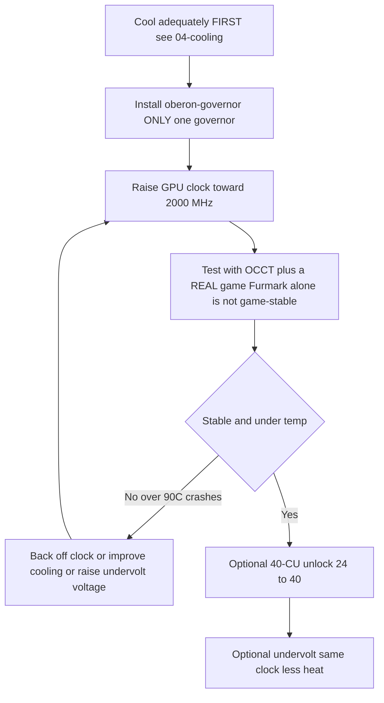

# Overclocking & Undervolting

> **TL;DR** — Out of the box the BC-250's GPU runs slow (often pinned to **1500 MHz**, ~weak). The community fix is a **governor** that overrides the clocks/voltage: most builds run **[oberon-governor](https://gitlab.com/mothenjoyer69/oberon-governor)**, which you edit to push the GPU to **2000 MHz (~+30 % FPS)**. The newer **[bc250_smu_oc](https://github.com/bc250-collective/bc250_smu_oc)** toolkit also overclocks the **CPU** (recommended **4 GHz @ 1275 mV**). Separately, the **[40-CU unlock](https://github.com/duggasco/bc250-40cu-unlock)** re-enables the **24 → 40 compute units** AMD disabled in firmware — a bigger GPU win than clocks alone (one Superposition run went **4647 → 6863** points, ([src](https://t.me/c/2424231195/137035))). **All of this is heat. Cool the board first** — see [04-cooling.md](04-cooling.md) — because OC without adequate cooling crashes and resets the board above ~90 °C.

This is the **last** step of the golden path, not the first. Get a stable, cool board running ([06-linux.md](06-linux.md), [04-cooling.md](04-cooling.md)) before you touch any of this. Everything here is "do it at your own risk" — the community says so repeatedly ([src](https://t.me/c/2424231195/106844)).

---

## The four levers (and what each is worth)

The BC-250 has **four** independent things you can tune. They stack:

| Lever | Tool | Typical gain | Heat cost |
|-------|------|--------------|-----------|
| **GPU clock** 1500 → 2000 MHz | governor (oberon / cyan-skillfish) | **~+30 % FPS** when GPU-bound | high |
| **GPU undervolt** at a fixed clock | same governor | same FPS, **much cooler** | *negative* (less heat) |
| **CPU clock** 3.5 → 4.0 GHz | `bc250_smu_oc` | helps CPU-bound games | high |
| **40-CU unlock** 24 → 40 CUs | `bc250-40cu-unlock` | **up to ~+48 %** GPU work | high |

Two honest caveats from the chat before you start:

- **Most BC-250 games are CPU-bound, not GPU-bound.** Pushing the GPU from 2000 → 2229 MHz gained one tester *1 fps* in Shadow of the Tomb Raider (90 → 91) while power and temps jumped hard — so the headline "+30 %" only lands in the handful of titles where the GPU is the bottleneck ([src](https://t.me/c/2424231195/67029)).
- **Heat scales worse than performance.** Same tester: 2000 MHz @ 960 mV = **75 °C** in a stress test; 2229 MHz @ 1030 mV = **93 °C** — and he backed off because his PSU and cooler couldn't hold it ([src](https://t.me/c/2424231195/66972), [src](https://t.me/c/2424231195/67029)).

> ⚠️ **Safety floor.** Throttling starts around **85 °C** and the board hard-crashes / resets around **90 °C** (see [04-cooling.md](04-cooling.md)). If you cross ~85 °C under load, you are *over* your cooling budget — drop the clock or undervolt, don't push higher.



---

## Step 1 — GPU clock & undervolt: the governor

The BC-250's amdgpu driver does not expose normal sysfs overclocking. The community solution is a **governor** — a small daemon that writes clock/voltage states directly. The default, run by most builds, is **oberon-governor**.

### oberon-governor (the standard)

[mothenjoyer69/oberon-governor](https://gitlab.com/mothenjoyer69/oberon-governor) — a C++ daemon. Per its README it depends on **CMake, a C++ toolchain, and libdrm**, and is **tested only on the ASRock BC-250**. Many distros ship it prebuilt (Arch AUR, a Fedora COPR, the Bazzite images), so building from source is only needed if your distro has no package.

**Build from source** (matches the chat's reproduced sequence, ([src](https://t.me/c/2424231195/54666)) and the repo's standard CMake flow):

```bash
# Dependencies (Arch example — adjust per distro)
sudo pacman -S --needed base-devel cmake pkgconf make libdrm glibc linux-api-headers

git clone https://gitlab.com/mothenjoyer69/oberon-governor.git && cd oberon-governor
sudo cmake . && sudo make && sudo make install
sudo systemctl enable --now oberon-governor.service
```

> If `cmake` errors, the chat fix was simply to install the missing build deps and re-run: `sudo pacman -S pkgconf cmake` then rebuild ([src](https://t.me/c/2424231195/54666)).

**Set your clock & voltage.** The governor reads a YAML config:

```bash
sudo nano /etc/oberon-config.yaml      # adjust min/max frequency and voltage
sudo systemctl restart oberon-governor # apply
```

The file lets you set the **maximum and minimum voltage and frequency** for the GPU states (per the repo README). To go from the weak default to the community sweet spot, raise the max frequency toward **2000 MHz** and dial the voltage down until it's stable (see undervolting below). Restart the service after every edit.

> **Check it took.** Watch live clocks/temps with `amdgpu_top`, MangoHud, or LACT while you load the GPU. If clocks stay at ~1500 MHz, the service isn't running or your config didn't parse — `sudo systemctl status oberon-governor`.

### cyan-skillfish-governor (the SMU fork — idle power)

A newer governor, [bc250-collective/cyan-skillfish-governor](https://github.com/bc250-collective/cyan-skillfish-governor), adds **memory-controller power-profile** control. It gives **no extra performance**, but lowers idle TDP to **~30–35 W** (cooler and quieter at idle) ([src](https://t.me/c/2424231195/125821)). On Arch it's packaged; the chat's swap-over recipe was ([src](https://t.me/c/2424231195/118249)):

```bash
paru -S cyan-skillfish-governor-smu
sudo systemctl stop  oberon-governor.service
sudo systemctl disable  oberon-governor.service
sudo systemctl enable --now cyan-skillfish-governor-smu.service
```

> Run **one** governor at a time — disable oberon before enabling cyan-skillfish, or they fight over the same registers.

---

## Step 2 — CPU overclock & proper undervolt: `bc250_smu_oc`

Released **2025-12-30** by the bc250-collective (reverse-engineering the SMU), [bc250_smu_oc](https://github.com/bc250-collective/bc250_smu_oc) is the tool that finally lets you touch the **CPU** clock and voltage (Zen 2 cores), not just the GPU. The authors recommend **4 GHz @ 1275 mV** as the stability/heat optimum and ship that as the example in the repo ([src](https://t.me/c/2424231195/106844)).

**Install & use** (verbatim from the repo README):

```bash
# Prerequisite: install the `stress` CPU load tool from your package manager
git clone https://github.com/bc250-collective/bc250_smu_oc.git
cd bc250_smu_oc
pip install .        # or: pipx install .

# Detect / test a target (CPU 4 GHz at 1275 mV), keep it applied:
bc250-detect --frequency 4000 --vid 1275 --keep

# Once you've found a stable config, install it and enable at boot:
bc250-apply --install overclock.conf
sudo systemctl enable --now bc250-smu-oc
```

> 🔴 **Hard voltage limit.** Per the repo: never let CPU core voltage (**Vid**) exceed **1.325 V** under any circumstances — silicon degradation starts above ~1.35 V ([src](https://t.me/c/2424231195/115726)). And: **raising CPU frequency without undervolting lets Vid scale uncapped and can destroy the hardware** — always pair a clock bump with a voltage target.

Why 4 GHz is the ceiling: AMD considers up to ~4 GHz safe for this silicon; the 4700S/Xbox-kit BIOS even boots turbo at 4000 MHz / 1.35 V out of the box. Zen 2 *typically* reaches ~4200, but these chips are **mining-reject silicon**, so 4200 only "if you get very lucky" ([src](https://t.me/c/2424231195/115726)).

> The pinned `bc250_smu_oc` post can also **replace** oberon as your governor (it has its own `bc250-smu-oc` service). Don't run both governors at once.

---

## Step 3 — Undervolting (do this for heat, every chip differs)

Undervolting is the highest-value move on this board: **same clock, far less heat**, and it's *required* if you raise the CPU clock. But **every chip is different** — silicon lottery is real here. One owner ran three near-sequential boards and only one held 900 mV under stress; identical cooling, identical temps, different stability ([src](https://t.me/c/2424231195/50568)).

**Target clock → voltage, real community numbers (your chip will vary):**

| GPU clock | Voltage that owners found *game-stable* | Notes |
|-----------|------------------------------------------|-------|
| 1500 MHz | ~710 mV | one tester's "most stable" board ([src](https://t.me/c/2424231195/23545)) |
| 2000 MHz | **~955 mV** | Furmark-stable at 905 mV but artifacts in games until 955 mV ([src](https://t.me/c/2424231195/68126), [src](https://t.me/c/2424231195/136773)) |
| 2000 MHz | ~960 mV → **75 °C** stress | the popular daily-driver setpoint ([src](https://t.me/c/2424231195/66972)) |
| 2229 MHz | ~1030–1050 mV → **93 °C** stress | "turned it off, I'm scared" — diminishing returns ([src](https://t.me/c/2424231195/66972)) |

> **Furmark alone is not a stability test.** Its fixed load hides instability that only shows up when the *context* changes — alt-tabbing, loading textures, menus. A board "stable" in Furmark at 905 mV threw texture artifacts in real games after 1–2 hours until voltage went to 955 mV. Validate in **actual games + an alt-tab/menu sweep**, and use a varied stress tool like **OCCT** (it loads the VRM, not just the shaders), not just Furmark ([src](https://t.me/c/2424231195/68126), [src](https://t.me/c/2424231195/136773), [src](https://t.me/c/2424231195/23545)).

> **Handy hardware tell:** the BC-250 has a **load LED** — **red = GPU idle, green = GPU loaded**. Some "idle" scenes (e.g. Novigrad in Witcher 3) actually hammer the GPU and surface undervolt artifacts that Furmark/Cyberpunk miss ([src](https://t.me/c/2424231195/12285)).

A too-aggressive undervolt is **not dangerous** — at worst the board drops out or disables the M.2 slot, which clears in five seconds because the OC isn't stored in BIOS ([src](https://t.me/c/2424231195/105998)).

---

## Step 4 — The 40-CU unlock (24 → 40 compute units)

The biggest single GPU win, and the newest. The BC-250's Cyan Skillfish die physically has **40 CUs**, but stock firmware leaves only **24 active** (16 "harvested"). The kernel parameter **`amdgpu.bc250_cc_write_mode=3`** plus a patched amdgpu driver re-enables all 40. Measured result — a 4K Superposition run jumped **4647 → 6863** points (24/40 → 40/40 CUs active), with the `cu_map.sh` tool showing the harvest map fill up ([src](https://t.me/c/2424231195/137035)):


People are running **40 CU @ 1850 MHz** (RE4 Remake native 1440p high, 60 fps) and even reporting very low voltages at 40 CU (e.g. 1400 MHz @ 750 mV on a lucky chip) ([src](https://t.me/c/2424231195/137260), [src](https://t.me/c/2424231195/137157)).

> ⚠️ **This requires patching and rebuilding the amdgpu kernel module** — it is the most involved task in this guide and is **BC-250-only** (the patch is guarded by the board's PCI ID). The patch is non-persistent: without the modprobe config, a reboot reverts to 24 CUs.

### Easiest path — the project build script

[duggasco/bc250-40cu-unlock](https://github.com/duggasco/bc250-40cu-unlock) ships a script that does the build/enable for you (needs `gcc`, `make`, `zstd`, and kernel headers):

```bash
git clone https://github.com/duggasco/bc250-40cu-unlock.git
cd bc250-40cu-unlock
sudo ./scripts/bc250-enable-40cu.sh build
sudo ./scripts/bc250-enable-40cu.sh enable   # writes the modprobe config and reboots
```

### Manual path (patch the module yourself)

For when you'd rather drive it (e.g. CachyOS/Arch, the chat's most-used distro for this). Reproduced from the pinned community instruction ([src](https://t.me/c/2424231195/137241)) — cross-check the patch and `-p` strip level against the [repo](https://github.com/duggasco/bc250-40cu-unlock), which uses `patch -p5`:

```bash
# 1. Get matching kernel headers (CachyOS example)
sudo pacman -Suy
sudo pacman -S linux-cachyos-headers
sudo reboot

# 2. Patch the amdgpu source, rebuild & install the module
cd /usr/lib/modules/$(uname -r)/build/drivers/gpu/drm/amd/amdgpu
# apply bc250-40cu-amdgpu.patch to gfx_v10_0.c  (patch -p5 < .../patch/bc250-40cu-amdgpu.patch)
sudo make -C /usr/lib/modules/$(uname -r)/build M=$(pwd) modules
sudo make -C /usr/lib/modules/$(uname -r)/build M=$(pwd) modules_install
sudo reboot

# 3. Turn the feature on via kernel param, rebuild initramfs, reboot
echo 'options amdgpu bc250_cc_write_mode=3' | sudo tee /etc/modprobe.d/bc250-40cu.conf
sudo mkinitcpio -P     # Fedora/atomic: dracut --force  (or rpm-ostree kargs, below)
sudo reboot
```

**On Fedora atomic / Bazzite** (rpm-ostree), the parameter goes in as a kernel arg instead ([src](https://t.me/c/2424231195/137916)):

```bash
sudo rpm-ostree kargs --append-if-missing='amdgpu.bc250_cc_write_mode=3'
sudo systemctl reboot
```

### Verify the unlock worked

```bash
sudo dmesg | grep active_cu_number     # success = ...active_cu_number 40
sudo dmesg | grep bc250-40cu           # shows the mode=3 register writes
```

If the count ends in **40**, all CUs are live ([src](https://t.me/c/2424231195/137241)). You should also see log lines like `bc250-40cu-enable: mode=3 ... CC=0xfff80000->0xffe00000 SPI=0x00000007->0x0000001f` ([src](https://t.me/c/2424231195/137889)).

> **Don't want to recompile a kernel?** The community is building helper scripts and prebuilt module bundles. See [WinnieLV/bc250-cu-live-manager](https://github.com/WinnieLV/bc250-cu-live-manager) (toggle CUs live) and [gennro/bc250-toolkit](https://github.com/gennro/bc250-toolkit) (`bc250-toolkit.sh` / `bc250-unlock.sh`). These move fast — check the repos for current status.

---

## GDDR6 memory: VRAM allocation, overclock & timings

> 🔴 **Read this before anything else in this section. Memory tuning is the one place on the BC-250 that can permanently brick the board.** Unlike the clock/undervolt above — which lives in a governor and clears on reboot — GDDR6 **clock and timings are written into the BIOS/CMOS**, and a bad value can leave the board unable to POST. The community has bricked boards exactly this way: a member set the VRAM clock to **1950 MHz** and killed the board ([src](https://t.me/c/2424231195/55317)); the modded-BIOS author's own release note records a GDDR6 frequency that **booted on one board (1800 MHz) but bricked another** ([src](https://t.me/c/2424231195/54971)), and "too-low timings brick the board, a CMOS reset doesn't help" ([src](https://t.me/c/2424231195/54971), [src](https://t.me/c/2424231195/54851)). Recovery is the BIOS chapter — sometimes a programmer is the only way back. **Do not touch clock/timings unless you have read [08-bios.md](08-bios.md) and accept the brick risk.**

The 16 GB of GDDR6 on the BC-250 is **unified memory (UMA)** — one pool shared between the GPU and the CPU. There are two very different things you can do with it, at two very different risk levels:

| What | Where | Risk | Who should |
|------|-------|------|------------|
| **VRAM / UMA allocation** (GPU↔CPU split) | a normal BIOS menu | **safe** — just a buffer size | everyone, this is routine |
| **GDDR6 clock & timings** | **modded** BIOS only | **brick-level** — see warning above | experts only |

### VRAM / UMA allocation — safe, do this in BIOS

How much of the 16 GB is handed to the GPU vs left for the CPU is an ordinary BIOS setting (no mod needed; even the stripped-down modded BIOS exposes "nothing but the buffer-size setting" ([src](https://t.me/c/2424231195/94419))). The relevant options behave like this ([src](https://t.me/c/2424231195/81203)):

| BIOS option | Observed result |
|-------------|-----------------|
| **Auto** | allocates **8 GB** to the GPU |
| **UMA_SPECIFIED** → Auto | same as Auto (8 GB) |
| **UMA_AUTO** (automatic) | allocates only **256 MB** — **unreliable, avoid** |
| **UMA_SPECIFIED** | you pick a fixed size (512 MB / 1 / 4 / 6 / 8 GB) |

> 🔴 **Don't use automatic (`UMA_AUTO`).** It hands the GPU only ~256 MB, which is not enough — at that size only ~2 GB ends up usable and the GPU can fall back to **llvmpipe (software rendering — no GPU acceleration, everything runs on the CPU)** ([src](https://t.me/c/2424231195/81203)). Set a **fixed** buffer instead.

**What to pick — set a small FIXED 512 MB buffer.** The community consensus is blunt: APUs perform best with the videobuffer at the **minimum (512 MB)**, because the driver then **dynamically shares the full 16 GB GDDR6** pool and pulls exactly what the GPU needs on demand ([src](https://t.me/c/2424231195/38599), [src](https://t.me/c/2424231195/17948)). A bigger fixed split is *not* automatically faster — in one member's game benchmarks the VRAM size barely moved average FPS; it mostly affected **minimum / 1%-low** frames and whether a title would even launch (a couple hung at 256 MB / 512 MB / 1 GB and only ran from 4 GB up) ([src](https://t.me/c/2424231195/81203)). The real win of 512 MB is the *split it produces*: at 512 MB a healthy run lands ~**5.8 GB to video / 11.5 GB to RAM / ~1.6 GB swap**, versus a stuck-at-8 GB split that starves the OS ([src](https://t.me/c/2424231195/138294)).

> **It's workload-dependent.** Some games behave differently and a few **hang outright if misconfigured** ([src](https://t.me/c/2424231195/131105), [src](https://t.me/c/2424231195/94993), [src](https://t.me/c/2424231195/139016)). The clearest example: Cyberpunk 2077, if you give it a fixed **4 GB**, stops treating memory above 8 GB as available RAM and **swaps aggressively** even with headroom to spare; at **512 MB** it still grabs ~4–5 GB for the GPU but correctly leaves 12 GB+ for the OS and only swaps once that's exhausted — so one member's standing advice is *"512 and let it sort itself out"* ([src](https://t.me/c/2424231195/94993), [src](https://t.me/c/2424231195/131105)). For most people: **512 MB fixed, avoid auto.** Raise it to **4 GB** only for a specific title that's documented to prefer it (a handful do), or for memory-hungry GPU workloads (see AI/LLM below). One caveat: a fixed VRAM allocation larger than 512 MB can make **Vulkan large-buffer allocations** misbehave (e.g. `llama.cpp`), which a community kernel patch addresses so dynamic allocation still works above 512 MB ([src](https://t.me/c/2424231195/20001), [src](https://t.me/c/2424231195/20002)).

### GDDR6 clock & timings — modded BIOS, expert-only

The default GDDR6 timings are conservative; there is real bandwidth to gain, but **this is BIOS/mod-tool territory, not the governor** — it ties directly to the modded BIOS in [08-bios.md](08-bios.md). The community reference is the pinned **"#BC-250 GDDR6 Memory Explained"** writeup ([src](https://t.me/c/2424231195/126436)); a parallel English note puts it bluntly: *"if you screw this up, you will crash the chip. That said, the defaults suck, there is a lot of performance to be had"* ([src](https://t.me/c/2424231195/55353)).

What the writeup says is tunable (values are **one tester's** results, not universal — ⚠ verify against your own board) ([src](https://t.me/c/2424231195/126436)):

- **`ClockSpeed`** — stock **1750**. **~1875 MHz appears to be the max that will still POST**; above that the board won't boot. Any change here interacts with `tCL`.
- **`tCL`** (CAS latency) — **24** at 1750 MHz and below; **26** is required at 1755 MHz and above.
- **`tRAS`** — must equal `tCL + tRCD + 1`; the writeup uses the write-RCD value to bring it down for a slight gain.
- **`tRCDRD` / `tRCDWR`** — best left at the stock 27 / 19; the tester found lowering them *hurt* performance.
- **`tRCAb`** — won't POST below ~70; best at 71–72.
- **`tRFC` / `tREF`** (refresh) — higher reduces power and heat; **12000 is stock, ~13000 won't POST**.
- Several fields (`tRPAb`, `tRRDS`, `tRRDL`, `tRTP`, `tFAW`) are believed manufacturer-specific and were **left untouched** — the tester had no data on them.

> 🔴 **Why this bricks and the others don't.** These values are written to **CMOS**, and a set that stops the board *before* it reaches the BIOS's settings-reset routine produces a hard brick that **a CMOS clear / battery pull cannot fix** ([src](https://t.me/c/2424231195/54971), [src](https://t.me/c/2424231195/94419)). One member captured the whole-section vibe in a (literal) song — *"перепутал тайминг, не могу загрузиться"* / "mixed up a timing, can't boot" — and feared bricking ([src](https://t.me/c/2424231195/66381)). Some owners avoid BIOS-persistent memory changes altogether because **GDDR6/CMOS write cycles are finite** and prefer a runtime-only approach ([src](https://t.me/c/2424231195/126437)). ⚠ verify: a robust runtime memory-OC tool is not yet established — treat clock/timing edits as BIOS-flash operations and **have a recovery plan first** ([08-bios.md](08-bios.md)).

### Why memory matters for AI / LLM — and that it must be cooled

The headline reason to care about GDDR6 here is **bandwidth and capacity for AI/LLM** work: members run local LLMs on the BC-250, sizing the **UMA allocation as the model buffer** ([src](https://t.me/c/2424231195/57659)) — one reports a 14B model at **~24 tok/s** and working multimodal models, after patching the kernel so `llama.cpp` can see more of the shared memory ([src](https://t.me/c/2424231195/57767)). For these workloads a **larger VRAM split** (above) is the lever that matters far more than risky timing edits.

> 🌡️ **Cool the memory, not just the die.** The GDDR6 chips sit on the **back** of the board and need their own thermal path — the community backplate/heatsink-pad mods exist specifically to cool the memory. Pushing GDDR6 clock (or just running heavy AI workloads) without cooling the chips is asking for instability — see [04-cooling.md](04-cooling.md) for the backplate pads.

---

## Recommended progression

| Tier | Do this | Expect |
|------|---------|--------|
| **Start** | oberon-governor → GPU **2000 MHz**, undervolt to **~955 mV** game-stable | ~+30 % FPS where GPU-bound, ~75 °C |
| **+ CPU** | `bc250_smu_oc` → **4 GHz @ 1275 mV** (Vid never > 1.325 V) | helps CPU-bound titles |
| **+ Idle** | swap to cyan-skillfish-governor | ~30–35 W idle, cooler/quieter |
| **Max GPU** | 40-CU unlock + tune clock/volt at 40 CU | up to ~+48 % GPU work |

After **any** change: load the GPU **and** CPU together (they share one die and one heatsink), watch temps, and keep load under ~85 °C. If you can't, the answer is **more cooling, not less clock-chasing** — go back to [04-cooling.md](04-cooling.md). Water cooling is what unlocks the top end (e.g. 4.0 GHz CPU on water vs 3.85 GHz on air) ([src](https://t.me/c/2424231195/135417)).

---

## ⏳ Dated / evolving — read before trusting old chat

This tooling changed fast over 2025–2026. Watch the dates:

- **Before ~Dec 2025:** the only governor was **oberon-governor** (GPU clock/voltage only). Older posts that say "you can't overclock the CPU" predate `bc250_smu_oc` (released **2025-12-30**) ([src](https://t.me/c/2424231195/106844)).
- **The 40-CU unlock is new (~May 2026)** and still maturing. Early messages call it "insider info / promising but unreliable" ([src](https://t.me/c/2424231195/137022)); by mid-May it was a working pinned procedure ([src](https://t.me/c/2424231195/137241)). Methods, patches, and prebuilt bundles are still shifting — prefer the [repo](https://github.com/duggasco/bc250-40cu-unlock) over any single chat message. ⚠ verify the patch strip level (`-p5`) and kernel version against the repo before building.
- **cyan-skillfish-governor** (idle-power fork) arrived **~Mar 2026** ([src](https://t.me/c/2424231195/125821)); the SMU "plus" releases are newer still.
- A live **memory-timing** writeup also exists for the truly brave (GDDR6 tCL/tRAS etc.), but it's BIOS/mod-tool territory, not the governor — see [08-bios.md](08-bios.md) and the timing post ([src](https://t.me/c/2424231195/126436)).

---

## Sources

- oberon-governor (default GPU governor) — https://gitlab.com/mothenjoyer69/oberon-governor · build sequence & cmake fix — https://t.me/c/2424231195/54666
- bc250_smu_oc (CPU OC, 4 GHz @ 1275 mV) — https://github.com/bc250-collective/bc250_smu_oc · release/announce — https://t.me/c/2424231195/106844
- cyan-skillfish-governor (idle power) — https://github.com/bc250-collective/cyan-skillfish-governor · idle TDP — https://t.me/c/2424231195/125821 · swap recipe — https://t.me/c/2424231195/118249
- 40-CU unlock — https://github.com/duggasco/bc250-40cu-unlock · pinned manual guide — https://t.me/c/2424231195/137241 · Fedora atomic — https://t.me/c/2424231195/137916 · dmesg confirmation — https://t.me/c/2424231195/137889
- Live CU manager / toolkit — https://github.com/WinnieLV/bc250-cu-live-manager · https://github.com/gennro/bc250-toolkit
- Clock/voltage/heat data — https://t.me/c/2424231195/66972 · https://t.me/c/2424231195/67029 · undervolt stability — https://t.me/c/2424231195/68126 · https://t.me/c/2424231195/136773 · https://t.me/c/2424231195/23545
- Silicon lottery & safe limits — https://t.me/c/2424231195/50568 · https://t.me/c/2424231195/115726
- Superposition 24-vs-40-CU result — https://t.me/c/2424231195/137035
- GDDR6 memory — VRAM/UMA allocation: behaviour & llvmpipe fallback — https://t.me/c/2424231195/81203 · set 512 MB fixed (driver shares full 16 GB) — https://t.me/c/2424231195/38599 · https://t.me/c/2424231195/17948 · correct 5.8/11.5/1.6 split at 512 MB — https://t.me/c/2424231195/138294 · workload-dependent / Cyberpunk swap & hangs — https://t.me/c/2424231195/131105 · https://t.me/c/2424231195/94993 · https://t.me/c/2424231195/139016 · "GDDR6 Memory Explained" timings — https://t.me/c/2424231195/126436 · English timing note — https://t.me/c/2424231195/55353 · CMOS write-cycle caveat — https://t.me/c/2424231195/126437
- GDDR6 brick risk — 1950 MHz brick — https://t.me/c/2424231195/55317 · freq booted on one board, bricked another / CMOS reset doesn't help — https://t.me/c/2424231195/54971 · timings brick — https://t.me/c/2424231195/54851 · programmer-only recovery — https://t.me/c/2424231195/94419 · "перепутал тайминг" — https://t.me/c/2424231195/66381
- Memory for AI/LLM — UMA as model buffer — https://t.me/c/2424231195/57659 · 14B @ ~24 tok/s + kernel patch — https://t.me/c/2424231195/57767 · large-VRAM Vulkan / dynamic-alloc-above-512 patch — https://t.me/c/2424231195/20001 · https://t.me/c/2424231195/20002
- Monitoring tools — [LACT](https://github.com/ilya-zlobintsev/LACT) · [MangoHud](https://github.com/flightlessmango/MangoHud) · [amdgpu_top](https://github.com/Umio-Yasuno/amdgpu_top)

> **Cool first.** None of these clocks are safe without the fin/fan work in [04-cooling.md](04-cooling.md). Over ~90 °C the board resets.
