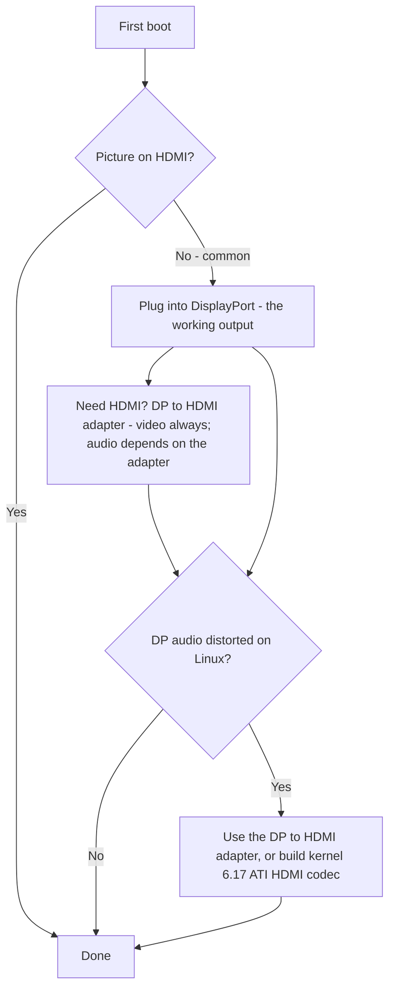

# Display & Output

> **TL;DR** — The BC-250 drives your monitor over **DisplayPort**. That's the connector to plug into. If your board also has an HDMI port, it **frequently shows nothing** — so a black screen there is *not* a dead board, you're just on the wrong output. Need HDMI? Use a **DP→HDMI adapter** — **video always passes, no lag**; some adapters carry **audio** too (a tested one did, [src](https://t.me/c/2424231195/9148)) but audio depends on the specific adapter, so don't count on it (see the audio section). One real quirk: **DisplayPort audio comes out distorted/slowed on Linux**; the same DP→HDMI adapter sidesteps it, and a proper kernel-side fix lands around **kernel 6.17** ([src](https://t.me/c/2424231195/17953), [src](https://t.me/c/2424231195/68051)).

"No picture on first boot" is the **#1 newcomer panic**. Read the box below before you decide anything is broken.

---

## No picture? Do this

1. **Plug into DisplayPort, not HDMI.** The BC-250's working video output is DisplayPort ([src](https://t.me/c/2424231195/104784)). The HDMI port (where present) is the one that's usually blank — don't judge the board by it.
2. **Reseat the card and try again.** Boards routinely don't initialize on the first try — power-cycle (full off/on), and physically reseat. One owner: *"when mine arrived it didn't power up on the first try either … sometimes it doesn't fully initialize on a button reboot — off/on fixes it"* ([src](https://t.me/c/2424231195/15701)).
3. **Suspect the cable/adapter before the board.** With a single card, a bad cable or adapter is the prime suspect ([src](https://t.me/c/2424231195/15699)). Some adapters work in firmware but go black once the OS loads — *"image was fine before GRUB, black screen in the system"* ([src](https://t.me/c/2424231195/38184)).
4. **Reset the BIOS / reflash a known-good image** if several cards in a batch give no image — that points at firmware, not your monitor ([src](https://t.me/c/2424231195/15697), [src](https://t.me/c/2424231195/15705)).

If you cross all four off and still have nothing, head to [troubleshooting.md](troubleshooting.md).



---

## Outputs at a glance

| Output | Works? | Notes |
|--------|--------|-------|
| **DisplayPort** | **Yes — this is the output** | Primary/only display connector; carries audio. Repo I/O spec lists `1x DisplayPort` ([repo](https://github.com/mothenjoyer69/bc250-documentation)). It's **DisplayPort 1.4**, ceiling **4K@120 Hz**, with HDR10 ([elektricM](https://github.com/elektricM/amd-bc250-docs/blob/main/docs/hardware/display.md)). |
| **HDMI port** (if fitted) | **Often blank** | Newcomers think the board is dead; it usually isn't — switch to DP. ([src](https://t.me/c/2424231195/104784)) |
| **DP → HDMI via adapter** | **Video: yes. Audio: depends on the adapter** | Video passes with no lag ([src](https://t.me/c/2424231195/9148)); audio is chipset-dependent — test it (see audio section). Also the standard fix for DP audio distortion (below). |
| **Second video output** | **Not out of the box** | Electrically present but **not populated**; forcing a 2nd monitor needs hacks, and others say the chip has no real 2nd head — treat single-output as the safe assumption. ([src](https://t.me/c/2424231195/92978), [src](https://t.me/c/2424231195/104682)) |
| **Second screen over the network** | **Yes** | Stream the BC-250's output to another machine over LAN (Steam/Sunshine). ([src](https://t.me/c/2424231195/23660)) |

---

## Resolutions, refresh & cable

elektricM's reference pins down what the single DP link actually does — useful when picking a monitor or adapter ([elektricM](https://github.com/elektricM/amd-bc250-docs/blob/main/docs/hardware/display.md)):

| Resolution | Refresh | Path |
|------------|---------|------|
| 1920×1080 (1080p) | 144 Hz+ | Native DP, or any adapter |
| 2560×1440 (1440p) | 144 Hz+ | Native DP (passive adapters often cap at 1440p@60 / DP 1.2) |
| 3840×2160 (4K) | 60 Hz | Native DP, or **active** DP→HDMI 2.0 adapter |
| 3840×2160 (4K) | 120 Hz | **Native DP only** — an active DP 1.4→HDMI 2.1 adapter is needed for 4K@120 over HDMI, and is flaky |

- **Cable:** use a **VESA-certified DisplayPort 1.4** cable, **1–2 m**; longer cables cause sync/dropout issues ([elektricM](https://github.com/elektricM/amd-bc250-docs/blob/main/docs/hardware/display.md)).
- **Stuck at low resolution** (e.g. 1024×768/1080p, 60 Hz only) usually means the GPU driver isn't loaded — check `glxinfo | grep "OpenGL renderer"`; `llvmpipe` = software rendering, install Mesa 25.1+ and remove `nomodeset` ([elektricM](https://github.com/elektricM/amd-bc250-docs/blob/main/docs/troubleshooting/display.md)). See [06-linux.md](06-linux.md).
- **HDR (HDR10) & VRR** work but are experimental on Linux — **KDE Plasma 6+** has the best support and generally needs a Wayland session ([elektricM](https://github.com/elektricM/amd-bc250-docs/blob/main/docs/hardware/display.md)). **Distro matters here:** an r/BC250Gaming (Reddit) community report got **HDR + VRR working properly only on CachyOS** (Plasma 6 + Wayland), while on **Bazzite HDR caused graphical glitches and VRR never worked at all**. Their example: *Forza Horizon 6* at **1440p High, HDR + VRR on, 60–80 FPS** through a **UGREEN DP→HDMI 2.1** adapter. If HDR/VRR is a priority, see the CachyOS note in [06-linux.md](06-linux.md).

> **Black screen *after login* (GRUB and the login screen were fine)** is a desktop-session problem, usually **Wayland** — pick "GNOME on Xorg"/"Plasma (X11)" at the login gear, or set `WaylandEnable=false` in `/etc/gdm/custom.conf` ([elektricM](https://github.com/elektricM/amd-bc250-docs/blob/main/docs/hardware/display.md)). A black screen *before* login is the driver/`nomodeset` issue above, not this.

---

## DisplayPort audio is distorted — the adapter fix

On Linux, audio sent **directly out of DisplayPort** comes out wrong on the BC-250 — described as distorted, *"stretched, like it's slowed to half speed,"* with crackle ([src](https://t.me/c/2424231195/9895)). This is a **Linux/DP-protocol issue, not a board defect** — it has been seen on non-BC-250 hardware too ([src](https://t.me/c/2424231195/15983)).

The blunt, reliable workaround the chat settled on: **run the signal through a DP→HDMI adapter.** Converted to HDMI, the audio artifacts disappear ([src](https://t.me/c/2424231195/17953), [src](https://t.me/c/2424231195/51763)). A user verified it directly: *"I tested audio out through a DisplayPort→HDMI adapter. All fine, no lag"* ([src](https://t.me/c/2424231195/9148)).

**If you have no adapter handy,** route audio over **Bluetooth** instead — most speakers/headsets support it and it dodges the DP path entirely ([src](https://t.me/c/2424231195/89769)). See [10-wifi-bt.md](10-wifi-bt.md) for the BT dongle.

### Adapter notes (community)
- **For 4K@60+ you need an *active* adapter/cable** (passive caps ~1440p@60). A working, tested example: **UGREEN DP125 (DP→HDMI 4K cable)** — rated 4K@30 but negotiated 4K@60 on a TV ([src](https://t.me/c/2424231195/52398)). Active vs passive sets the resolution ceiling — it does **not** decide whether audio passes (see below).
- **Not all adapters carry audio.** One owner's Belsis adapter passed 4K@60 *with* sound, while several pricier Ugreen units showed "HDMI digital audio" in the device list but output no sound — and one shifted voices down an octave ([src](https://t.me/c/2424231195/106617)). If you get video but no audio, the adapter is the variable — try another.
- Cheap **4K@60 DP→HDMI** adapters that pass both video and audio do exist and are reported working ([src](https://t.me/c/2424231195/133977)).
- Some adapters misbehave specifically on **4K monitors** ([src](https://t.me/c/2424231195/1988)).
- **Audio over a DP→HDMI adapter is inconsistent and depends on the adapter's chipset — not simply on active vs passive.** Video always passes; **audio is the variable.** Our community reports are adapter-by-adapter (UGREEN/Belsis units reported carrying sound, some other units silent), and elektricM's guide reports the *opposite* split (passive carrying audio, some active units silent — e.g. Cable Matters/StarTech) — which is exactly why the active/passive label doesn't predict it ([elektricM](https://github.com/elektricM/amd-bc250-docs/blob/main/docs/troubleshooting/display.md)). For **reliable** audio, don't bet on an adapter: prefer a **DisplayPort-native display/AV receiver**, or output sound over **USB (a USB DAC/sound device)**. If you do use an adapter, **test audio before you rely on it** — and remember a **passive** adapter caps at ~**1440p@60**.

### The kernel-6.17 fix (DP-direct audio, no adapter)

If you want clean audio **straight over DisplayPort** without an adapter, the cause and fix were tracked down in the chat. Fedora's stock kernel config built `snd-hda-codec-hdmi.ko` + `snd-hdmi-lpe-audio.ko`; **kernel 6.17 changed the HDMI audio path** and broke sound on that default config. The fix is to also build the **ATI HDMI codec** — flip the kernel config from `# CONFIG_SND_HDA_CODEC_HDMI_ATI is not set` to `CONFIG_SND_HDA_CODEC_HDMI_ATI=m`, which packages `snd-hda-codec-atihdmi.ko`; sound then works **without patches** ([src](https://t.me/c/2424231195/68051), [src](https://t.me/c/2424231195/68061)).

```text
# Fedora kernel config change for DP/HDMI audio on kernel 6.17+
# from:
# CONFIG_SND_HDA_CODEC_HDMI_ATI is not set
# to:
CONFIG_SND_HDA_CODEC_HDMI_ATI=m
```

With that third codec (`snd-hda-codec-atihdmi.ko`) present, ALSA exposes the board's audio outputs (e.g. `pcm=3` and `pcm=7` as two HDMI devices) ([src](https://t.me/c/2424231195/68062), [src](https://t.me/c/2424231195/67569)). ⚠ verify — this requires building a custom kernel; treat the DP→HDMI adapter as the no-build path for most users. See [06-linux.md](06-linux.md) for kernel/driver setup.

---

## The second output (initially inactive)

There is a **second video output on the board that is not active out of the box.** The community read is split and worth knowing both halves:

- It's **electrically present but not populated/soldered**, and *"with hacks you can make a 2nd monitor work"* ([src](https://t.me/c/2424231195/92978)).
- Others report the chip simply **has no usable second head** — *"the problem is in the chip, the second output physically isn't there"* ([src](https://t.me/c/2424231195/104682)).

Practically: **assume one DisplayPort output.** A DP **MST splitter for two independent screens has been asked about but not confirmed working** in our chat ([src](https://t.me/c/2424231195/92109)).

**Update from elektricM — MST can drive two screens with the right hub.** elektricM's testing reports up to **2 displays via a DP MST hub** (bandwidth shared, resolution per display limited), with hub-by-hub results ([elektricM](https://github.com/elektricM/amd-bc250-docs/blob/main/docs/hardware/display.md)):

| MST hub | Out | DP ver | Independent displays? | Audio | Notes |
|---------|-----|--------|-----------------------|-------|-------|
| StarTech MST14DP122DP | 2× DP | 1.4 | **Yes** | Yes | Worked consistently across monitors/cables |
| Monoprice 21972 | 2× DP | 1.2 | **Mirror only** | Yes | Could only mirror |
| ENBUER | 2× DP | 1.2 | **Mirror only** | Yes | Could only mirror |
| Generic HDMI MST | 2× HDMI | — | **No** | No | No video or audio |

So native dual-monitor **is** possible via MST with a DP 1.4 hub (StarTech confirmed); cheaper DP 1.2 hubs may only mirror, and HDMI MST hubs failed. ⚠ verify — single confirmed hub model; results vary by hub.

**Other multi-display route — USB DisplayLink adapter.** Add a USB→HDMI/DP DisplayLink adapter for an extra **desktop** screen (plug in *after* boot for best results). **Not for gaming** — it compresses on the CPU, which is the BC-250's bottleneck, so latency is high; it also doesn't work in Steam Deck **game mode** ([elektricM](https://github.com/elektricM/amd-bc250-docs/blob/main/docs/hardware/display.md)).

---

## Second screen over the network (the easy "2nd display")

If you actually want the BC-250 picture on a second device, the proven route isn't a second cable — it's **streaming over LAN.** One user: *"I launched a Steam game on the BC-250 (Fedora) and streamed it over the network to my work laptop, controlled it from the laptop. Everything worked"* ([src](https://t.me/c/2424231195/23660)).

- **Sunshine** (host encoder) works here because it isn't NVIDIA-only — it does the encoding, the client just decodes ([src](https://t.me/c/2424231195/25091)). Over gigabit LAN it's reported near-flawless ([src](https://t.me/c/2424231195/25563)).
- **Moonlight as the host** does *not* fit — it expects an NVIDIA encoder and stutters/complains about a missing hardware decoder ([src](https://t.me/c/2424231195/25050)). Use Sunshine as host, Moonlight only as the client.

This is also the practical way to get a "dual display" feel without the unpopulated second output above.

---

## Sources

- DP→HDMI adapter passes video+audio, no lag — https://t.me/c/2424231195/9148
- DP audio distortion is a Linux issue; adapter fixes it — https://t.me/c/2424231195/17953 · https://t.me/c/2424231195/9895 · https://t.me/c/2424231195/51763 · https://t.me/c/2424231195/15983
- Kernel 6.17 audio fix (`CONFIG_SND_HDA_CODEC_HDMI_ATI=m`) — https://t.me/c/2424231195/68051 · https://t.me/c/2424231195/68061 · https://t.me/c/2424231195/68062 · https://t.me/c/2424231195/67569
- Working adapters — UGREEN DP125 https://t.me/c/2424231195/52398 · Belsis vs others (audio varies) https://t.me/c/2424231195/106617 · cheap 4K@60 https://t.me/c/2424231195/133977
- DP is the working output; spend on a good DP→HDMI adapter — https://t.me/c/2424231195/104784
- First-boot no-image / reseat / reflash — https://t.me/c/2424231195/15697 · https://t.me/c/2424231195/15699 · https://t.me/c/2424231195/15701 · https://t.me/c/2424231195/38184
- Second output present but not populated / debated — https://t.me/c/2424231195/92978 · https://t.me/c/2424231195/104682 · MST asked https://t.me/c/2424231195/92109
- Network second screen (Sunshine/Steam over LAN) — https://t.me/c/2424231195/23660 · https://t.me/c/2424231195/25091 · https://t.me/c/2424231195/25050 · https://t.me/c/2424231195/25563
- Bluetooth audio as alternative — https://t.me/c/2424231195/89769
- Hardware I/O reference (`1x DisplayPort`) — [mothenjoyer69/bc250-documentation](https://github.com/mothenjoyer69/bc250-documentation) · [`hardware.md`](https://github.com/mothenjoyer69/bc250-documentation/blob/main/hardware.md)
- DP 1.4 / 4K@120 / HDR10, resolution+cable limits, MST hubs (max 2), DisplayLink, Wayland-login black screen — elektricM [`hardware/display.md`](https://github.com/elektricM/amd-bc250-docs/blob/main/docs/hardware/display.md)
- HDR + VRR working on CachyOS (Plasma 6 + Wayland) vs broken on Bazzite; Forza Horizon 6 1440p High HDR+VRR over UGREEN DP→HDMI 2.1 — r/BC250Gaming (Reddit) community report (see [06-linux.md](06-linux.md))
- Adapter audio is chipset-dependent (elektricM saw passive carry it / some active silent; community saw the reverse — so prefer DP-native or a USB DAC), low-res llvmpipe check — elektricM [`troubleshooting/display.md`](https://github.com/elektricM/amd-bc250-docs/blob/main/docs/troubleshooting/display.md)

> Driver/kernel setup is in [06-linux.md](06-linux.md); audio/output gotchas are also indexed in [troubleshooting.md](troubleshooting.md) and [faq.md](faq.md).
