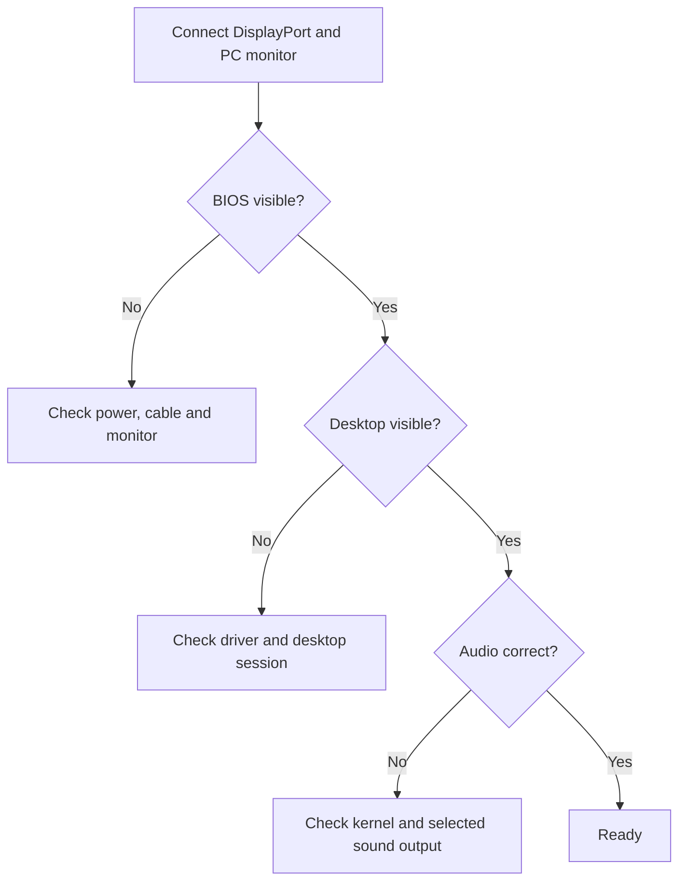

# Display & Output

> **Start with native DisplayPort and a PC monitor.** A DP→HDMI adapter is a separate component with its own mode limits. For silent, slowed or drifting DP audio, check the kernel before buying an adapter or building a codec module.

## No picture? Do this

1. Use the board's documented **DisplayPort** output. The stock I/O reference lists one DP connector, not a second native HDMI output.
2. With the PSU disconnected, check the power cable, monitor cable and mounting. Try a known-working DP cable and PC monitor; do not reseat connectors while powered.
3. **No BIOS on a TV/projector:** the sink may not accept the firmware's display mode. Try a PC monitor for initial setup. Responsive keyboard LEDs are a clue, not a complete POST test ([upstream prerequisites](https://github.com/elektricM/amd-bc250-docs/blob/954b706f0f2a426385229507c1acba00cc812f66/docs/getting-started/prerequisites.md)).
4. **BIOS works, desktop does not:** check the renderer, firmware logs and `nomodeset` using [06 — Linux](06-linux.md). A black screen only after login may instead be the desktop/session; try another supported session before changing firmware.
5. Still no picture? Use [Troubleshooting](troubleshooting.md). A dark screen is not a reason to erase the SSD or flash BIOS without diagnosis and a recovery path ([08 — BIOS](08-bios.md)).


```mermaid
flowchart TD
    A[Connect DisplayPort and PC monitor] --> B{BIOS visible?}
    B -->|No| C[Check power, cable and monitor]
    B -->|Yes| D{Desktop visible?}
    D -->|No| E[Check driver and desktop session]
    D -->|Yes| F{Audio correct?}
    F -->|No| G[Check kernel and selected sound output]
    F -->|Yes| H[Ready]
```

## Outputs at a glance

| Route | What to expect |
|---|---|
| Native DisplayPort | Main physical output. Audio needs a suitable kernel and the correct selected sink. |
| DP→HDMI | Match the adapter, cable and display's resolution/refresh/HDR capabilities. Neither video nor audio is guaranteed by connector shape alone. |
| DP MST hub | Upstream reports two independent screens with StarTech MST14DP122DP; some cheaper hubs only mirror or fail. Shared bandwidth remains a limit. |
| USB DisplayLink | Separate compressed desktop-display route; not a native second GPU connector or a gaming-performance promise. |
| Steam/Sunshine stream | Remote picture over the network, not another physical display head. Sunshine is the host; Moonlight is the client. See [17](17-projects-and-tools.md). |

The [I/O reference](https://github.com/mothenjoyer69/bc250-documentation) and [pinned display guide](https://github.com/elektricM/amd-bc250-docs/blob/954b706f0f2a426385229507c1acba00cc812f66/docs/hardware/display.md) distinguish board outputs from adapter features and single-build reports.

## Resolutions, refresh & cable

Use a suitable DP cable and check the **entire link**, not just an "8K" badge. Native DP and DP→HDMI adapters have different constraints; higher resolutions/refresh over HDMI generally need an active converter. A passive adapter's exact limit is model-specific, not a universal 1440p60 specification.

| Goal | Choose and verify |
|---|---|
| 1080p/1440p | Native DP, or an adapter explicitly supporting the requested mode |
| 4K60 over HDMI | A suitable active DP→HDMI converter and HDMI display/cable |
| 4K120 over HDMI | Matching DP 1.4→HDMI 2.1 conversion, cable and sink; upstream reports a Club3D setup at 4K120, not every adapter |
| HDR/VRR | Check the GPU driver, desktop session, adapter and sink together. A report on another Radeon does not certify BC250. |

Low resolution plus `llvmpipe` points to software rendering; fix that via [06](06-linux.md) before tuning cable modes. HDR/VRR anecdotes from CachyOS or Bazzite are dated reports, not a universal verdict about either OS. The experimental [dyllan500 image](https://github.com/dyllan500/bazzite-amd-hdmi-kde) was tested on a Radeon 9070 XT, not established as a BC250 remedy.

## DisplayPort audio — diagnose, update, then choose a workaround

Earlier advice blamed board firmware or all active adapters. [Upstream retracted that explanation in #39](https://github.com/elektricM/amd-bc250-docs/issues/39). The affected Linux display path has two clock bugs: the large error gives about **17.7% slow playback or silence**; after only its fix, a smaller error can give about **7 seconds of drift per hour**. Slow browser video with healthy downloads can share that audio-clock cause through PipeWire.

### 1. Check the kernel and sound output

```bash
uname -r
wpctl status
```

Select the intended DP/HDMI sink and distinguish silence from a clock/pitch problem. The [kernel matrix at the pinned revision](https://github.com/elektricM/amd-bc250-docs/blob/954b706f0f2a426385229507c1acba00cc812f66/docs/troubleshooting/audio.md) gives:

| Kernel branch | Upstream fixes |
|---|---|
| 7.2+, or 7.1.10+ within 7.1 | Both clock fixes |
| 6.12.78+, 6.18.20+, 6.19.10+ within those branches, and 7.0 | Large error fixed; small drift may remain |
| Older affected versions | Large error or silence may remain |

Vendor backports may differ. Update through your OS's normal path, preserve a working deployment/kernel, reboot and check the actual `uname -r`; an image's name is not a kernel version. For Bazzite update/rollback see [06](06-linux.md).

### 2. If updating is not possible

- **USB audio** bypasses the affected DP clock path.
- A **compatible passive DP++ adapter** uses a different clock path; choose it only if its display-mode limits fit.
- An **active adapter is not inherently audio-broken**; native DP and active sinks were affected by the old kernel path.
- [Weijtmans/bc250-tools](https://github.com/Weijtmans/bc250-tools) provides the historical DTO watcher for systems stuck on old kernels. It writes hardware registers and can install a root service: use its status/revert instructions and a known-good rollback, not a copied register write or wildcard. This handbook does not install it for you.

A one-piece DP→HDMI cable can still contain a converter. It is not "chip-free" simply because there is no separate dongle. Old UGREEN/Belsis/Silver Monkey/BENFEI/AmazonBasics reports are individual cable/adapter/kernel combinations, not a universal shopping rule.

### 3. Keep the historical codec-module issue separate

Some Fedora 6.17 reports involved missing `CONFIG_SND_HDA_CODEC_HDMI_ATI=m` / `snd-hda-codec-atihdmi.ko`. That packaging issue is distinct from the display-clock fixes. Check your current kernel's modules and sound devices before proposing a custom kernel. A DP→HDMI adapter does not universally fix missing drivers.

Historical reports: [68051](https://t.me/c/2424231195/68051), [68061](https://t.me/c/2424231195/68061), [68062](https://t.me/c/2424231195/68062), [67569](https://t.me/c/2424231195/67569).

### Surround sound

Do not infer 5.1 support from an HDMI socket. Check the advertised channels and the whole receiver chain. Earlier [community reports](https://www.reddit.com/r/linux_gaming/comments/1nvsgji/) found stereo-only configurations; they do not establish that every future driver/adapter is incapable. A suitable USB multichannel device is an alternative; verify its actual channel mapping before relying on it.

## No wake after idle

If the screen and network both disappear after idle, inspect the previous boot rather than assuming a cable failure:

```bash
journalctl -b -1 -n 30
cat /sys/power/mem_sleep
```

The [pinned report](https://github.com/elektricM/amd-bc250-docs/blob/954b706f0f2a426385229507c1acba00cc812f66/docs/troubleshooting/display.md) describes unreliable `s2idle` resume. A journal ending at `PM: suspend entry (s2idle)` without resume supports that diagnosis. Desktop idle-suspend settings may not cover Steam Game Mode.

For a confirmed affected machine, disable automatic suspend in the desktop; a system-wide workaround is below. It disables sleep targets, **not just screen blanking**, so record any existing masks before using it:

```bash
sudo systemctl mask sleep.target suspend.target hibernate.target hybrid-sleep.target
# Revert only masks added by this procedure:
sudo systemctl unmask sleep.target suspend.target hibernate.target hybrid-sleep.target
```

Do not replace Sleep with Shutdown as an unexplained default: that changes user-visible behavior and can lose unsaved work.

## HDMI-CEC (optional)

Upstream reports TV control through a UGREEN active adapter with RTD2173. **`/dev/cec0` is not proof that the adapter connects the TV's CEC pin.** With the TV's CEC enabled, the scan must find a device besides this computer:

```bash
cec-ctl -d /dev/cec0 -S
```

This sends CEC bus probes; it is not merely a file-presence check. `cec-ctl` comes from `v4l-utils`. If access is denied, check the node/group permissions; on rpm-ostree an NSS-only `video` group needs special handling, not blind repeated `usermod`. See the [pinned CEC section](https://github.com/elektricM/amd-bc250-docs/blob/954b706f0f2a426385229507c1acba00cc812f66/docs/hardware/display.md) and the identity/check helpers in [bc250-tools](https://github.com/Weijtmans/bc250-tools). A name set by hand may be overwritten by `cec-onboot`; the reported helper orders it afterward. CEC does not itself guarantee TV Game Mode/ALLM.

## Second screen and streaming

For local independent displays, start with the reported DP MST hub above and verify the exact mode on both screens. For a remote picture use Steam Remote Play or Sunshine as the **host** and Moonlight as the **client** ([17](17-projects-and-tools.md)). Codec choices, CPU encoding and compute encoding are separate from native VCN support; do not assume an NVIDIA-only host or that every encoding path is impossible.

## Sources and history

Current procedures use the pinned upstream pages linked above. Earlier community observations remain evidence of those setups, not current universal instructions:

- Cable/adapter and sound reports: [9148](https://t.me/c/2424231195/9148), [17953](https://t.me/c/2424231195/17953), [9895](https://t.me/c/2424231195/9895), [51763](https://t.me/c/2424231195/51763), [15983](https://t.me/c/2424231195/15983), [52398](https://t.me/c/2424231195/52398), [106617](https://t.me/c/2424231195/106617), [133977](https://t.me/c/2424231195/133977), [1988](https://t.me/c/2424231195/1988), [89769](https://t.me/c/2424231195/89769).
- Boot/output reports: [104784](https://t.me/c/2424231195/104784), [15697](https://t.me/c/2424231195/15697), [15699](https://t.me/c/2424231195/15699), [15701](https://t.me/c/2424231195/15701), [38184](https://t.me/c/2424231195/38184), [15705](https://t.me/c/2424231195/15705).
- Second-output discussion: [92978](https://t.me/c/2424231195/92978), [104682](https://t.me/c/2424231195/104682), [92109](https://t.me/c/2424231195/92109).
- Network-streaming reports: [23660](https://t.me/c/2424231195/23660), [25091](https://t.me/c/2424231195/25091), [25050](https://t.me/c/2424231195/25050), [25563](https://t.me/c/2424231195/25563).

GPU installation: [06](06-linux.md). Failure diagnosis: [Troubleshooting](troubleshooting.md) and [FAQ](faq.md). No display, CEC or audio measurements were performed on local BC250 hardware for this rewrite.
