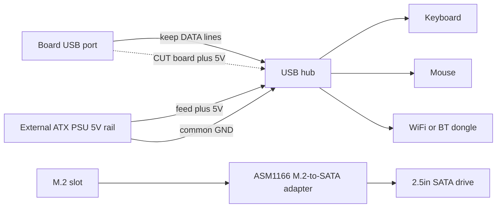

# USB, Hubs & Peripherals

> **TL;DR** — The board gives you **4 rear USB ports (2× USB 2.0 + 2× USB 3.0)** and that's it — no internal headers wired by default. A WiFi/BT dongle, SSD-via-USB, keyboard, mouse and a controller eat those fast, so almost everyone adds a **USB hub**. The catch: the board's **5 V USB rail is weak** and sags under load, so cheap bus-powered hubs (and even direct-connected flash drives) drop out. The reliable fixes, in order: a **powered (active) hub**, or the community **5 V-injection mod** — cut the 5 V the hub takes from the board and feed it 5 V from your ATX PSU instead. ([src](https://t.me/c/2424231195/119741))

This is an **accessories** page. Get the hub right and the rest (audio, Ethernet-over-USB, docks) just works.

---

## How many USB ports you actually get

Per the hardware reference, the rear I/O is **1× DisplayPort, 1× GbE Ethernet, 2× USB 2.0, 2× USB 3.0**. So four physical USB ports. ([hardware.md](https://github.com/mothenjoyer69/bc250-documentation/blob/main/README.md))

In practice the two **USB 3.0** ports are the ones people fight over (faster, used for SSDs/docks), and they're wired **narrow** electrically — one owner describes the connector as effectively "x2", and warns against hanging a splitter off it. ⚠ verify the exact lane width. ([src](https://t.me/c/2424231195/75561))

The squeeze is real once you list what wants a port: **plug in an SSD — one port gone; add a USB WiFi dongle, a joystick, an external drive — you need a hub, otherwise you risk frying the port.** ([src](https://t.me/c/2424231195/75558)) People routinely report "all USB 3.0 occupied, keyboard and mouse going through a hub." ([src](https://t.me/c/2424231195/110875))

There are **no front-panel USB headers populated** out of the box — but the case/board has a spot clearly meant for routing a hub's cable to the front, which several cased builds use. ([src](https://t.me/c/2424231195/91322)) · ([src](https://t.me/c/2424231195/100249))

---

## The real problem: the 5 V USB rail is weak

The BC-250 generates **5 V for USB on the board itself** ([src](https://t.me/c/2424231195/57920)), and that rail can't supply much. The clearest measurement from the chat, on a board that wouldn't enumerate devices:

> "My BC-250 [is] not giving proper 5 V on USB… only a keyboard works; if I plug a mouse the keyboard shuts off. ~**4.3 V** with only the keyboard, **2.3 V–3.2 V** with keyboard + mouse, **5.1 V** with both removed." ([src](https://t.me/c/2424231195/119071))

That voltage sag is why symptoms cluster around **load**: flash drives and microphones that **fall off when plugged in directly but work fine through a hub**, keyboards that lose their LEDs, devices that drop the moment two things draw at once. ([src](https://t.me/c/2424231195/53939)) It's the same power-sensitivity that makes WiFi dongles flaky — see **[10-wifi-bt.md](10-wifi-bt.md)**, where sticks run idle then drop on a download spike.

> ⚠ Not every board is this bad. One owner powers a **WiFi dongle + wired keyboard + mouse via a no-power hub + a 14″ display + a 3.5″ aux screen** off the board's USB and reports it fine. ([src](https://t.me/c/2424231195/119231)) Treat your own board as unknown until you load it up.

---

## Choosing a hub: powered vs unpowered

| Hub type | When it works | Verdict |
|----------|---------------|---------|
| **Unpowered (bus-powered)** | Light loads — keyboard, mouse, a dongle. Some boards run a surprising amount this way. ([src](https://t.me/c/2424231195/119231)) | OK to try first; **expect dropouts** the moment you add a drive or load spikes. |
| **Powered / active (external 5 V brick)** | Anything with drives, multiple dongles, or under load. The community's standing recommendation for the BC-250. ([src](https://t.me/c/2424231195/75558)) · ([src](https://t.me/c/2424231195/119229)) | **Buy this.** Solves the sag without touching the board. ([src](https://t.me/c/2424231195/140091)) |
| **5 V-injection mod** (see below) | When you want a clean, cased build powered entirely from the ATX PSU and don't want a second wall wart. | Best integration, requires soldering. ([src](https://t.me/c/2424231195/119741)) |

The repeated advice when someone's USB devices misbehave is simply: **get an active USB hub with a power-adapter input.** ([src](https://t.me/c/2424231195/119229)) Multiple owners ended up there after fighting dropouts — "it got solved with an externally-powered hub." ([src](https://t.me/c/2424231195/123789))

> One caution raised in chat: relying on an externally-powered hub may be **permanent** — once you offload USB power externally, don't be surprised if you're stuck with that hub for good. ([src](https://t.me/c/2424231195/123924)) That's a fine trade for a desktop build.

---

## The 5 V-injection mod (make a normal hub behave)

This is the elegant fix for a **cased build already running off an ATX/SFX PSU**: instead of buying an actively-powered hub with its own wall adapter, you take an ordinary hub and **swap where its 5 V comes from**.

What one user did, and it worked ([src](https://t.me/c/2424231195/119741)):

> "I modified a normal USB hub and it worked. I **cut the 5 V coming from the motherboard and gave 5 V from the PSU**. I didn't need to connect ground because I'm using the same ATX PSU to power my BC-250."

How it works:

1. Open the hub; find the **5 V (VBUS)** trace/wire on the **upstream** side (the cable that plugs into the board).
2. **Cut that 5 V** so the hub no longer draws power from the board's weak rail.
3. Feed the hub **+5 V from your ATX PSU** (a spare SATA/Molex 5 V line).
4. **Ground is shared** automatically because the same PSU already powers the board — no extra ground wire needed. (If you ever power the hub from a *separate* supply, you **must** common the grounds.)

Data lines stay untouched — you're only changing the power source. The board sees a hub that no longer loads its 5 V rail, and the devices get clean, plentiful power from the PSU.



> ⚠ Cutting the wrong trace bricks the hub (cheap) — but make sure you cut **VBUS, not a data line**. Double-check with a multimeter before soldering.

---

## Junk to avoid

- **Hoco hubs** — called out as unreliable; one owner **had to re-solder the same Hoco hub twice**. ([src](https://t.me/c/2424231195/74531))
- **"USB 3.0" hubs that aren't** — a 160 ₽ AliExpress "USB 3.0 hub/dock" was flagged as **definitely not real 3.0** at that price. ([src](https://t.me/c/2424231195/8761)) · ([src](https://t.me/c/2424231195/8764))
- **Daisy-chaining hubs** to multiply ports — raised as an idea ([src](https://t.me/c/2424231195/104653)) but it stacks the power problem; one weak rail now feeds two hubs. Use a single good powered hub instead.
- **SATA-splitter "hubs"** off the M.2 slot — a recurring confusion. With only **2 PCIe lanes** on the M.2 you can't sanely hang a SATA controller and expect it to fan out; "those one-SATA-in, many-out hubs are rubbish." ([src](https://t.me/c/2424231195/22539)) Not a USB topic — just don't confuse it with USB expansion.
- ★ **M.2→SATA controller PH516 (6-port) — confirmed NOT working.** The port enumerates but the disk won't attach, and a **second person reproduced** the same failure ([4pda — Strange999](https://4pda.to/forum/index.php?showtopic=1104980)). Buy the community-recommended **ASM1166** instead (see the storage section) — PH516 is a known dead end on this board.

A hub with a **built-in audio codec** is a neat space-saver for cased builds (one device gives you extra ports *and* a 3.5 mm jack), and people do use them. ([src](https://t.me/c/2424231195/8751)) Audio-quality varies — it's a cheap codec. ([src](https://t.me/c/2424231195/39708))

---

## USB 3.0 internal header (Type-E)

If your case has a **front USB 3.0 plug** (the 20-pin "Key-A/Type-E" connector) you'll want to feed it from the board's USB 3.0. There's **no native 20-pin header**, so people adapt:

- A **USB 3.1 Type-E → USB 3.0 (Type-A) cable** from AliExpress is the clean path. AXONUS 50 cm was shared in chat. ([src](https://t.me/c/2424231195/133182)) A Xiwai Type-E → 20-pin variant was also posted. ([src](https://t.me/c/2424231195/125127))
- Or **splice** the case's stock cable onto an ordinary USB 3.1 plug — the "join a snake to a hedgehog" method when no adapter fits. ([src](https://t.me/c/2424231195/135957))

**Status:** **USB 2.0 is confirmed working; USB 3.0 was still to be fully tested** by the owner who reported it (test pending after the in-case build). Treat 3.0-over-adapter as ⚠ verify on your hardware. ([src](https://t.me/c/2424231195/136215))

---

## Storage (M.2 slot & SATA drives)

The board's only internal storage connector is a **single M.2 slot**, and it's wired **PCIe 2.0 ×2** — so the practical ceiling is **~1 GB/s** ([src](https://t.me/c/2424231195/66275)) · ([src](https://t.me/c/2424231195/135506)). A fast Gen3/Gen4 NVMe will *work*, but it can't reach its rated speed here, so there's no point paying for a high-end drive. **A normal NVMe M.2 SSD is the simplest boot drive** — drop it in the slot and install Linux to it (see **[06-linux.md](06-linux.md)** for the install).

### Attaching 2.5″ SATA HDDs/SSDs

There's no SATA port on the board, so to hang a **2.5″ SATA drive** (or several) you put an **M.2 → SATA adapter card** in the M.2 slot. The community's confirmed pick is the **ASM1166 (M.2 PCIe → SATA)** expansion card ([src](https://t.me/c/2424231195/135180)). The other route people take is a plain **M.2 SATA SSD straight in the board** — no adapter, just a SATA-protocol M.2 stick. ([src](https://t.me/c/2424231195/87411))

This is one of the **most common newcomer questions** — *"is this the adapter I need to connect a hard drive to the board?"* and *"what other ways are there to connect a drive?"* ([src](https://t.me/c/2424231195/135164)) · ([src](https://t.me/c/2424231195/135165)) — so if you're asking it, you're in good company.

> ⚠ verify — the ASM1166 card is a community recommendation, not a tested-by-many result on the BC-250 specifically. Confirm your chosen adapter enumerates and boots before relying on it. Note also that the M.2's **2 PCIe lanes** can't sanely feed a one-SATA-in / many-out *splitter* — see **Junk to avoid** above. ([src](https://t.me/c/2424231195/22539))

#### ★ Powering a 2.5″ SATA drive (the board is 12 V-only)

The adapter card above handles **data**, but a 2.5″ SATA drive also needs **5 V power** on its SATA-power connector — and the BC-250 board only delivers **12 V**, with no SATA-power header to tap. The practical fix from one build: a **USB→SATA-power adapter feeding 5 V** to the drive, with a **12 V→5 V step-down (buck) converter** producing that 5 V off the board's 12 V ([TMG HD build](https://youtu.be/OEO0r01zcfU); ⚠ approx — paraphrased from the video walkthrough). In other words: ASM1166 (or an M.2 SATA stick) carries the SATA *data*; the buck-converter + USB→SATA-power adapter carries the SATA *power*. A self-powered 2.5″ enclosure or a powered dock sidesteps the whole problem by bringing its own 5 V rail.

#### ★ SteamOS "no nvme drive detected" with an M.2 SATA stick

If you boot SteamOS with an **M.2 SATA SSD** (e.g. a **Kingston SNS41**) instead of NVMe, the installer/repair flow can fail with **"no nvme drive detected"** — SteamOS assumes the disk is an NVMe device (`nvme…`), but a SATA stick enumerates as `sda`. The fix is to edit the repair script and point it at the right device name ([4pda — pornocrat](https://4pda.to/forum/index.php?showtopic=1104980)):

```bash
# Edit the SteamOS repair script and replace the device name nvme -> sda
nano ~/tools/repair_device.sh
# change every "nvme" reference to "sda", save, then re-run the install/repair
```

This is purely a device-naming mismatch — the SATA stick works fine once SteamOS is told to look at `sda` rather than an `nvme` node.

### Older SATA drives are fine

Because the M.2 link caps everything at ~1 GB/s anyway, an old **2.5″ SATA HDD/SSD** is perfectly adequate for a **game library or older games** — the speed you'd lose is speed the board can't deliver. ([src](https://t.me/c/2424231195/132739)) A **USB-NVMe enclosure** is another option if you'd rather keep the M.2 slot free, but the enclosures that actually do NVMe (not SATA) start more expensive — for a small boot stick it's not worth it. ([src](https://t.me/c/2424231195/111022))

### Intel Optane 16 GB as cache/swap — community idea, lukewarm verdict

Using a small **Intel Optane 16 GB NVMe** module as a cache or swap device came up as an idea, with a sober verdict ([4pda](https://4pda.to/forum/index.php?showtopic=1104980)): the **16 GB "Optane" modules sold on Ozon turned out not to be real Optane** by members' own tests, the board's **M.2 slot is slow** (PCIe 2.0 ×2, ~1 GB/s) so the latency advantage is blunted, and while a **swap file is possible in theory**, it isn't a clear win here. Treat it as a curiosity, not a recommended upgrade.

---

## Docks & docking stations

A USB-C / Thunderbolt-style **dock** can act as one fat hub (USB + Ethernet + sometimes video), and owners have used them:

- A **Wavlink WL-UG69DK1 USB-C dual-4K dock** is in use by one member. ([src](https://t.me/c/2424231195/68141))
- A **DisplayLink dock** runs as a **USB hub + USB sound card**; the member could **not** get video out of it (hit a TPM/BIOS wall), so treat dock *video* as unreliable. ([src](https://t.me/c/2424231195/104776))
- For extra **monitors specifically**, a dock won't dodge the GPU's own output limit — see **[14-display.md](14-display.md)** before counting on it.

Bottom line: docks are fine as **powered hubs** (they bring their own supply, which neatly sidesteps the 5 V problem). Don't buy one expecting its **video** output to work.

---

## Controllers & input

Gamepads ride the same weak USB rail and the same flaky-Bluetooth story as everything else (see **[10-wifi-bt.md](10-wifi-bt.md)** for BT dongles). A few specific findings:

- **DualSense on Linux via DS5Dongle (Raspberry Pi Pico 2W).** This open dongle gives the DualSense its **HD haptics + speaker** on Linux and a **web UI** for polling rate / volume — but there's a catch for game audio: Wine/Proton titles only get the controller's audio in **Direct mode** (the controller shows up as a single **4-channel audio card**), and **not every distro exposes that mode** ([4pda — korotyshev](https://4pda.to/forum/index.php?showtopic=1104980)). Separately, the kernel **`hid-playstation`** driver (native DualSense support) needs **Bluetooth ≥ 5.0** on the adapter ([4pda — xDarkman](https://4pda.to/forum/index.php?showtopic=1104980)).
- **GameSir T4 Kaleid + its 2.4 GHz dongle** is a working controller/input path that sidesteps Bluetooth entirely — wired-feel input over a 2.4 GHz USB receiver instead of fighting BT pairing ([TiredDadTech](https://youtu.be/zi7sldeRd2w); ⚠ approx — paraphrased from the video).
- **BT-dongle port matters: UGREEN Bluetooth dongle works only in a USB 2.0 port, not USB 3.0.** The 3.0 ports' RF noise/electrical wiring breaks it; move it to one of the two **USB 2.0** ports and it works ([4pda — InfernalWolf666](https://4pda.to/forum/index.php?showtopic=1104980)). (Same USB-3.0-noise effect that plagues WiFi/BT sticks — see [10-wifi-bt.md](10-wifi-bt.md).)

---

## Recommended starter setup

| Tier | Do this | Why |
|------|---------|-----|
| Minimum | Bus-powered hub for keyboard/mouse/dongle | Free if you own one; fine for light loads ([src](https://t.me/c/2424231195/119231)) |
| **Recommended** | **Powered (active) USB hub** with its own 5 V brick | Fixes the sag, no soldering, drives + dongles stay up ([src](https://t.me/c/2424231195/75558)) |
| Cased build | Ordinary hub + **5 V-injection mod** from the ATX/SFX PSU | Cleanest integration, one fewer wall wart ([src](https://t.me/c/2424231195/119741)) |

A popular cased reference build is exactly this: **Cooler Master MasterBox NR200P + a USB hub + an SFX PSU** — the hub is treated as a default part of the build, not an afterthought. ([src](https://t.me/c/2424231195/81149)) See **[05-case.md](05-case.md)** for the enclosure side; a ready printable case even bundles an HDD + USB-hub layout. ([printables](https://www.printables.com/model/1580750-bc250-amd-case-v3-hp-server-psu-hdd-usb-hub))

---

## Sources

- 5 V-injection mod (cut board 5 V, feed from PSU) — https://t.me/c/2424231195/119741 · how-to question — https://t.me/c/2424231195/119795
- Measured USB voltage sag (4.3 V → 2.3 V) — https://t.me/c/2424231195/119071 · board makes 5 V on-board — https://t.me/c/2424231195/57920
- Port budget / "you need a powered hub or risk frying the port" — https://t.me/c/2424231195/75558 · USB is x2 — https://t.me/c/2424231195/75561 · all 3.0 occupied — https://t.me/c/2424231195/110875
- Active hub is the fix — https://t.me/c/2424231195/119229 · https://t.me/c/2424231195/123789 · https://t.me/c/2424231195/140091 · may be permanent — https://t.me/c/2424231195/123924
- No-power hub works on some boards — https://t.me/c/2424231195/119231 · direct-connect drops, hub fixes it — https://t.me/c/2424231195/53939
- Hoco hub unreliable / resoldered twice — https://t.me/c/2424231195/74531 · fake "3.0" cheap hub — https://t.me/c/2424231195/8761 · https://t.me/c/2424231195/8764
- SATA-splitter confusion — https://t.me/c/2424231195/22539 · daisy-chaining hubs — https://t.me/c/2424231195/104653
- Storage: M.2 is PCIe 2.0 ×2 / ~1 GB/s — https://t.me/c/2424231195/66275 · put M.2 SATA SSD instead — https://t.me/c/2424231195/135506 · ASM1166 M.2→SATA card — https://t.me/c/2424231195/135180 · M.2 SATA straight in board — https://t.me/c/2424231195/87411 · "what adapter to connect a drive?" — https://t.me/c/2424231195/135164 · https://t.me/c/2424231195/135165 · old 2.5″ SATA fine for game library — https://t.me/c/2424231195/132739 · USB-NVMe enclosures cost more — https://t.me/c/2424231195/111022
- ★ Powering a 2.5″ SATA drive (USB→SATA-power + 12 V→5 V buck) on the 12 V-only board — [TMG HD build](https://youtu.be/OEO0r01zcfU) (⚠ approx, paraphrased)
- ★ M.2→SATA PH516 (6-port) confirmed NOT working, reproduced by a second person — [4pda — Strange999](https://4pda.to/forum/index.php?showtopic=1104980)
- ★ SteamOS "no nvme drive detected" with M.2 SATA stick (Kingston SNS41), fix = edit `~/tools/repair_device.sh`, rename `nvme`→`sda` — [4pda — pornocrat](https://4pda.to/forum/index.php?showtopic=1104980)
- Intel Optane 16 GB as cache/swap (Ozon ones not real Optane, slow M.2, swap-file in theory) — [4pda](https://4pda.to/forum/index.php?showtopic=1104980)
- DS5Dongle (RPi Pico 2W) for DualSense on Linux — HD haptics/speaker/web-UI, Wine/Proton audio only in Direct mode (single 4-ch card) — [4pda — korotyshev](https://4pda.to/forum/index.php?showtopic=1104980) · `hid-playstation` needs BT ≥5.0 — [4pda — xDarkman](https://4pda.to/forum/index.php?showtopic=1104980)
- GameSir T4 Kaleid + 2.4 GHz dongle as controller/input fix over Bluetooth — [TiredDadTech](https://youtu.be/zi7sldeRd2w) (⚠ approx, paraphrased)
- UGREEN BT dongle works only in a USB 2.0 port, not 3.0 — [4pda — InfernalWolf666](https://4pda.to/forum/index.php?showtopic=1104980)
- Hub with built-in audio — https://t.me/c/2424231195/8751 · https://t.me/c/2424231195/39708
- USB 3.1 Type-E → USB 3.0 cable (AXONUS) — https://t.me/c/2424231195/133182 · Xiwai Type-E 20-pin — https://t.me/c/2424231195/125127 · splice stock cable — https://t.me/c/2424231195/135957
- USB 2.0 confirmed, 3.0 to be tested — https://t.me/c/2424231195/136215
- Front-panel hole for hub — https://t.me/c/2424231195/91322 · https://t.me/c/2424231195/100249
- Docks: Wavlink dock — https://t.me/c/2424231195/68141 · DisplayLink dock as hub+audio, no video — https://t.me/c/2424231195/104776
- Cased build NR200P + USB hub + SFX — https://t.me/c/2424231195/81149 · printable case with USB hub — https://www.printables.com/model/1580750-bc250-amd-case-v3-hp-server-psu-hdd-usb-hub
- Hardware reference (rear I/O list) — [mothenjoyer69/bc250-documentation `README.md`](https://github.com/mothenjoyer69/bc250-documentation/blob/main/README.md)

> Related: WiFi/BT dongle power-sensitivity → [10-wifi-bt.md](10-wifi-bt.md) · cases & front-panel routing → [05-case.md](05-case.md) · monitor-count limits → [14-display.md](14-display.md)
