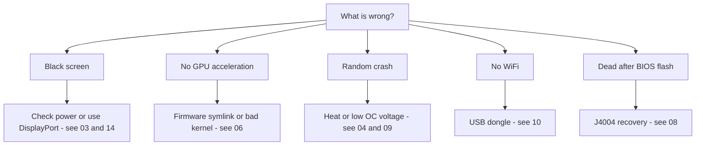

# Troubleshooting

> **TL;DR** — The BC-250's failure modes are well-known: most are **power**, **heat**, **kernel/firmware**, or **a flash gone wrong**. Find your symptom below, apply the fix, and follow the link to the full chapter. When in doubt, the cause is usually *a bad kernel*, *missing the amdgpu firmware symlink*, or *not enough cooling*.

This page is a symptom → cause → fix index, distilled from the community's recurring problems. It does not replace the chapters — it points you to the right one fast.

---

## Boot / display

| Symptom | Likely cause | Fix |
|---------|--------------|-----|
| Black screen / no POST | Power wiring or pinout wrong | Recheck the 8-pin wiring and pinout; use genuine-copper wire of adequate gauge → [03 — Power](03-power-supply.md) |
| Black screen / crashes after it was working | **IOMMU still enabled** (broken on this board) | Disable IOMMU in BIOS (elektricM); `iommu=off`/`amd_iommu=off` kernel param is ⚠ verify → [06 — Linux](06-linux.md) |
| Black screen booting the **installer** / live USB | Installer has no BC-250 GPU driver; KMS fails | Add `nomodeset` at GRUB (Fedora: Troubleshooting → Basic Graphics Mode); **remove it after Mesa is installed** ([elektricM](https://github.com/elektricM/amd-bc250-docs/blob/main/docs/troubleshooting/boot.md)) → [06 — Linux](06-linux.md) |
| Black screen **after login** (GRUB + login screen were fine) | Desktop session, usually **Wayland** | Pick X11 ("GNOME on Xorg"/"Plasma X11") at login, or `WaylandEnable=false` ([elektricM](https://github.com/elektricM/amd-bc250-docs/blob/main/docs/troubleshooting/display.md)) → [14 — Display](14-display.md) |
| Black screen on the **Bazzite KDE/Plasma desktop** (KWin can't drive the output) | KWin's Atomic Mode Setting check relies on the DTM TA, which the BC-250 APU never initializes (community-reported, [r/BC250Gaming]) | Set **`KWIN_DRM_NO_AMS=1`** in a `kwin-drm.conf` drop-in (`~/.config/environment.d/kwin-drm.conf`), then re-login ([ublue-os/bazzite #4447](https://github.com/ublue-os/bazzite/issues/4447)) → [06 — Linux](06-linux.md) |
| Boots but no GPU acceleration (everything on CPU) | Missing amdgpu firmware symlink, or a bad kernel | Apply the `navi10_gpu_info.bin` symlink + kernel params; avoid known-bad kernels (below) → [06 — Linux](06-linux.md) |
| `glxinfo` shows **llvmpipe**, games 5–10 FPS | Mesa too old, or amdgpu not loaded | Install **Mesa 25.1.3+**, remove `nomodeset`, confirm `Kernel driver in use: amdgpu` ([elektricM](https://github.com/elektricM/amd-bc250-docs/blob/main/docs/troubleshooting/performance.md)) → [06 — Linux](06-linux.md) |
| Worked, then broke after a kernel update | Regression in that kernel | Roll back to an LTS kernel; **6.14.7**, **6.15.0–6.15.6** and **6.17.8–6.17.10** are reported to break amdgpu (CPU fallback / GPU crashes); elektricM recommends **6.18.x LTS or 6.17.11+** ⚠ verify exact ranges → [06 — Linux](06-linux.md) |
| No HDMI audio | Kernel 6.17+ regression | Use an LTS kernel, or route audio over USB/DisplayPort → [06 — Linux](06-linux.md) |
| Only one display output works | Driver limitation on this board | Known limitation for native dual; **MST hub gives up to 2 screens** (DP 1.4 hub) ([elektricM](https://github.com/elektricM/amd-bc250-docs/blob/main/docs/hardware/display.md)) → [14 — Display](14-display.md) |
| No display, no POST, **only with the NVMe installed** | SSD still has **Windows** EFI/recovery partitions | Pull the SSD, wipe all partitions on another PC (`wipefs -a`), reinstall ([elektricM](https://github.com/elektricM/amd-bc250-docs/blob/main/docs/troubleshooting/boot.md)) → [06 — Linux](06-linux.md) |
| Won't POST at all (no BIOS) | Some boards won't POST **without a CMOS battery** | Install a fresh CR2032 and retry ([elektricM](https://github.com/elektricM/amd-bc250-docs/blob/main/docs/troubleshooting/boot.md)) → [08 — BIOS](08-bios.md) |
| Boot **hangs ~90 s** then continues | Failed systemd service / network timeout | `systemctl --failed`; disable the stuck unit ([elektricM](https://github.com/elektricM/amd-bc250-docs/blob/main/docs/troubleshooting/boot.md)) → [06 — Linux](06-linux.md) |
| Kernel panic "**unable to mount root**" / "No init found" | Wrong kernel **or** corrupted initramfs | Boot an older/LTS kernel; if still failing, chroot and regenerate initramfs (`dracut -f` / `update-initramfs -u -k all` / `mkinitcpio -P`) ([elektricM](https://github.com/elektricM/amd-bc250-docs/blob/main/docs/troubleshooting/boot.md)) → [06 — Linux](06-linux.md) |
| Drops to `grub>` / `grub rescue>` | GRUB can't find its config/boot files | Set `root`/`prefix`, `insmod normal`, boot; then reinstall GRUB ([elektricM](https://github.com/elektricM/amd-bc250-docs/blob/main/docs/troubleshooting/boot.md)) → [06 — Linux](06-linux.md) |
| Can't enter BIOS (Del/F2 ignored) | Adapter slow to init, or keyboard on USB 3.0 | Tap Del immediately; try a **USB 2.0** port and a native DP cable ([elektricM](https://github.com/elektricM/amd-bc250-docs/blob/main/docs/troubleshooting/display.md)) → [08 — BIOS](08-bios.md) |

## Heat / stability

| Symptom | Likely cause | Fix |
|---------|--------------|-----|
| Throttles / FPS tanks under load | Stock heatsink can't cool on a desk | Thin the fins + high-static-pressure 120 mm fan/shroud; keep <80 °C → [04 — Cooling](04-cooling.md) |
| Random crash / reboot under load | Overheating (>90 °C) **or** overclock voltage too low | Improve cooling first; then raise undervolt voltage — Furmark-stable ≠ game-stable (games need higher) → [04](04-cooling.md) · [09](09-overclock-undervolt.md) |
| Stable in Furmark, crashes in games | Voltage set from Furmark, which under-stresses | Test with OCCT + real games; bump voltage ~50 mV → [09 — Overclock](09-overclock-undervolt.md) |
| Two governors fighting | Running oberon-governor *and* smu_oc/cyan-skillfish together | Run only one governor; disable the others → [09 — Overclock](09-overclock-undervolt.md) |
| **Whole system** dies when the GPU crashes (not just the app) | APU: CPU+GPU share silicon, so a GPU reset can't recover — it takes the system down | Expected on this architecture; prevent GPU crashes (stable voltage + good cooling + good kernel) rather than expecting recovery ([elektricM](https://github.com/elektricM/amd-bc250-docs/blob/main/docs/troubleshooting/stability.md)) → [09 — Overclock](09-overclock-undervolt.md) |
| GPU crashes → **black screen, never recovers** while a governor runs | Governor keeps writing sysfs during the reset → stuck reset loop | Before crash-prone games, `systemctl stop cyan-skillfish-governor-smu`; re-enable after ([elektricM](https://github.com/elektricM/amd-bc250-docs/blob/main/docs/troubleshooting/stability.md)) → [09 — Overclock](09-overclock-undervolt.md) |
| Freezes / white screen at **only 60–65 °C** | Some boards are unusually temperature-sensitive | Improve cooling, reseat heatsink, repaste (PTM7950); silicon varies ([elektricM](https://github.com/elektricM/amd-bc250-docs/blob/main/docs/troubleshooting/stability.md)) → [04 — Cooling](04-cooling.md) |
| GPU **stuck at 1500 MHz**, won't undervolt lower | min voltage set **below 700 mV** — that's a hard floor that re-locks the GPU | Keep min voltage **≥ 700 mV** ([elektricM](https://github.com/elektricM/amd-bc250-docs/blob/main/docs/troubleshooting/stability.md)) → [09 — Overclock](09-overclock-undervolt.md) |
| Artifacts / crashes that more voltage doesn't fix | **Voltage droop** under load (effective V sags below set V) | Set base ~25 mV higher to cover droop, or use a BIOS with the loadline/droop tweak ([elektricM](https://github.com/elektricM/amd-bc250-docs/blob/main/docs/troubleshooting/stability.md)) → [09 — Overclock](09-overclock-undervolt.md) |
| Boots then crashes with **ACPI errors** (black/green screen) | BIOS/ACPI quirk or corruption | Clear CMOS / reset BIOS defaults; try `acpi=off noapic`; reflash if it persists ([elektricM](https://github.com/elektricM/amd-bc250-docs/blob/main/docs/troubleshooting/stability.md)) → [08 — BIOS](08-bios.md) |
| Sleep/suspend = **pseudo-freeze** (black, looks hung) | Board has no proper GPU sleep states; SMU doesn't support Linux suspend | Press power button to wake (don't hold); better, **disable suspend** and use screen-blanking. Idle stays ~65–85 W regardless ([elektricM](https://github.com/elektricM/amd-bc250-docs/blob/main/docs/troubleshooting/stability.md)) → [09 — Overclock](09-overclock-undervolt.md) |

## Performance

| Symptom | Likely cause | Fix |
|---------|--------------|-----|
| FPS lower than expected, GPU not maxed | **CPU-bound** (Zen 2 is the limit in many games) | Normal; lower CPU-heavy settings, accept it — overclocking the GPU won't help here → [11 — Gaming](11-gaming.md) |
| Only 24 CUs active, expected 40 | Stock exposes fewer CUs | Apply the 40-CU unlock (`amdgpu.bc250_cc_write_mode=3` + script) → [09 — Overclock](09-overclock-undervolt.md) |
| Steam / FSR / vsync broken | "Gamer" distro fork interfering | Some tuned forks break these; plain Fedora/Bazzite-bc250 is safer → [06 — Linux](06-linux.md) |
| GPU **locked at 1500 MHz** regardless of load | No user-space governor (default is BIOS-locked) | Install a GPU governor (cyan-skillfish-governor-smu) to scale frequency ([elektricM](https://github.com/elektricM/amd-bc250-docs/blob/main/docs/troubleshooting/performance.md)) → [09 — Overclock](09-overclock-undervolt.md) |
| Governor runs but GPU **won't exceed 2000 MHz** | Kernel lacks the frequency-range patch (default cap 1000–2000) | Use a patched kernel (Bazzite/CachyOS pre-patched) or apply `amdgpu-frequency-range.patch` ([elektricM](https://github.com/elektricM/amd-bc250-docs/blob/main/docs/troubleshooting/performance.md)) → [09 — Overclock](09-overclock-undervolt.md) |
| MangoHud shows **655 %** GPU usage | amdgpu leaves the activity metric at `0xFFFF`; MangoHud reads 65535/100 | Run cyan-skillfish-governor-smu (smu branch) — it patches `gpu_metrics`; no MangoHud change needed. Or apply the standalone **`install_gpu_usage_fix.sh`** ([Old Lamer — Part XV](https://youtu.be/lSipaWjU6D4)) ([elektricM](https://github.com/elektricM/amd-bc250-docs/blob/main/docs/troubleshooting/performance.md)) → [09 — Overclock](09-overclock-undervolt.md) |
| **Headless** "GPU does nothing" in a load test | `glmark2 --off-screen` silently falls back to **llvmpipe** (CPU) without a display | Test with `clpeak` / `vkmark` / `llama-bench -ngl 99`; confirm SCLK & power climb ([elektricM](https://github.com/elektricM/amd-bc250-docs/blob/main/docs/troubleshooting/performance.md)) → [06 — Linux](06-linux.md) |
| 60+ FPS but **stutters** / uneven frame times | Frame pacing (X11 compositor, or audio-tied pacing) | Run through **gamescope** (`-W 1920 -H 1080 -f`), or disable the compositor / try Wayland ([elektricM](https://github.com/elektricM/amd-bc250-docs/blob/main/docs/troubleshooting/performance.md)) → [11 — Gaming](11-gaming.md) |
| Game **crashes OOM / artifacts then dies** (RDR2, CoH3) | **512 MB dynamic VRAM + ZRAM** conflict, or simply **out of RAM** | Switch BIOS to **fixed VRAM** (e.g. 10 GB RAM / 6 GB VRAM); **or** disable systemd ZRAM and use **zswap + a 32 GB Btrfs swapfile** ([Old Lamer — Part XIV](https://youtu.be/A6juAoY70aU), recipe in [06](06-linux.md)/[09](09-overclock-undervolt.md)) ([elektricM](https://github.com/elektricM/amd-bc250-docs/blob/main/docs/troubleshooting/stability.md)) → [08 — BIOS](08-bios.md) |
| Specific game (e.g. **RDR2**) renders on CPU/llvmpipe | Game defaults to the wrong graphics adapter | Set the adapter to the AMD GPU in-game; RDR2: launch with `-useMaximumSettings` ([elektricM](https://github.com/elektricM/amd-bc250-docs/blob/main/docs/troubleshooting/performance.md)) → [11 — Gaming](11-gaming.md) |

## Network

| Symptom | Likely cause | Fix |
|---------|--------------|-----|
| No WiFi at all | No onboard WiFi; dongle needs a driver | Use a known-good dongle (aic8800d80) + build its driver → [10 — WiFi/BT](10-wifi-bt.md) |
| WiFi drops every few minutes | Realtek chipset + USB power under load | Known with some RTL882x dongles; switch to aic8800d80 or a confirmed model → [10 — WiFi/BT](10-wifi-bt.md) |
| Driver gone after reboot | Built with raw `make`, not packaged | Use the repo's RPM/DKMS path so it survives kernel updates → [10 — WiFi/BT](10-wifi-bt.md) |
| ISP **throttles Steam** to a crawl | DPI/throttling on Steam CDN traffic | Anti-throttling tools (`zapret`-style) help — but **Bazzite's read-only FS blocks them**; use a mutable distro (Fedora/Arch). RU-operator specifics (Yota, zapret+warp) in the [Russian edition](../ru/06-linux.md) → [06 — Linux](06-linux.md) |

## Windows

| Symptom | Likely cause | Fix |
|---------|--------------|-----|
| GPU = Code 43 / no acceleration | No working Windows GPU driver (as of early 2026) | Expected. Use Linux. Windows drivers are experimental WIP → [07 — Windows](07-windows.md) |

## BIOS / brick

> ⚠ **Read [08 — BIOS](08-bios.md) fully before any flash.** A bad flash bricks the board and a CMOS clear does **not** recover the 1.0/3.00 mod.

| Symptom | Likely cause | Fix |
|---------|--------------|-----|
| Dead/black after a BIOS flash | Bad image or wrong settings | External recovery: wire a CH341A to the **J4004 header** (the SOIC-8 clip does **not** work on this board) and reflash a known-good image → [08 — BIOS](08-bios.md) |
| **Intermittent no-POST on a used board** (works sometimes, dead others; not a flash) | ⚠ Community-reported failure mode: **BGA solder-joint cracking from thermal cycling** under the APU (these boards are ex-mining, heavily heat-cycled) — community-reported (r/BC250Gaming), not confirmed by elektricM | First rule out power/CMOS/RAM-timing causes above. **Advanced / last-resort only:** an **APU reflow** (controlled reheat to re-seat the BGA joints) is the community fix — high risk of killing the board, needs hot-air/reflow gear and skill; reballing is more durable if you have the tools → [08 — BIOS](08-bios.md) |
| Programmer can't read the chip | 5 V data lines / wrong chip targeted | Use 3.3 V; flash the 16 MB `BIOS_A1`, never the 512 KB SuperIO → [08 — BIOS](08-bios.md) |
| Settings won't stick | Old mod version | Use the 5.00 mod where RAM/GDDR6 timings actually apply → [08 — BIOS](08-bios.md) |
| Won't boot after changing **RAM timings/frequency** | Unstable memory settings **corrupted the BIOS** (P3.00 watchdog; Russian BC-250 chat reported this) | CMOS clear may not be enough — **hardware reflash** (CH341A / Pi Pico) a known-good image. Back up working BIOS *before* tuning RAM; tune one timing at a time (tREF gives the most) ([elektricM](https://github.com/elektricM/amd-bc250-docs/blob/main/docs/troubleshooting/stability.md)) → [08 — BIOS](08-bios.md) |
| BIOS settings not sticking → black screen / low RAM | CMOS not cleared after USB flash (may need 2–3 clears) | Clear CMOS, reconfigure, reboot **into BIOS** to confirm 512 MB still set; verify `free -h` shows ~15.5 GB ([elektricM](https://github.com/elektricM/amd-bc250-docs/blob/main/docs/troubleshooting/stability.md)) → [08 — BIOS](08-bios.md) |

---

## Still stuck?
- Check the **[FAQ](faq.md)**.
- Search the community chat by topic (each chapter's **Sources** link to real discussions).
- When asking for help, state your **distro + kernel version**, **clocks/governor**, and **cooling** — those three explain most problems.

### Sources for the rows above
- elektricM troubleshooting guides — [`boot.md`](https://github.com/elektricM/amd-bc250-docs/blob/main/docs/troubleshooting/boot.md) · [`display.md`](https://github.com/elektricM/amd-bc250-docs/blob/main/docs/troubleshooting/display.md) · [`performance.md`](https://github.com/elektricM/amd-bc250-docs/blob/main/docs/troubleshooting/performance.md) · [`stability.md`](https://github.com/elektricM/amd-bc250-docs/blob/main/docs/troubleshooting/stability.md) · [`hardware/display.md`](https://github.com/elektricM/amd-bc250-docs/blob/main/docs/hardware/display.md)
- Old Lamer (YouTube): [Part XIV — zswap + 32 GB Btrfs swap](https://youtu.be/A6juAoY70aU) · [Part XV — `install_gpu_usage_fix.sh`](https://youtu.be/lSipaWjU6D4)
- [4pda BC-250 thread](https://4pda.to/forum/index.php?showtopic=1104980) — RU ISP Steam-throttling (Yota, zapret+warp).
- Bazzite KDE black screen / `KWIN_DRM_NO_AMS=1` — [ublue-os/bazzite #4447](https://github.com/ublue-os/bazzite/issues/4447).
- Intermittent no-POST → BGA cracking / APU-reflow last-resort fix — community-reported (r/BC250Gaming), not in elektricM; general BGA thermal-cycling failure mechanism is well-established.
- Per-chapter community-chat citations live in each linked chapter's **Sources**.
