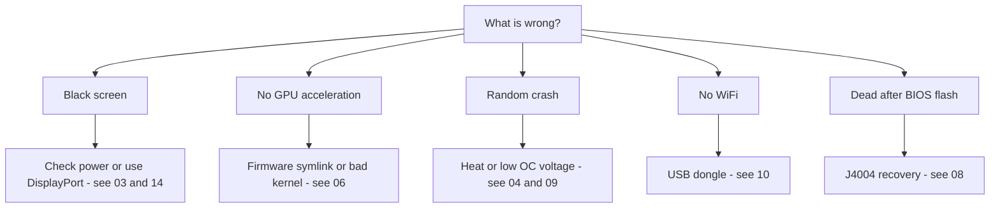

# Troubleshooting

> **TL;DR** — The BC-250's failure modes are well-known: most are **power**, **heat**, **kernel/firmware**, or **a flash gone wrong**. Find your symptom below, apply the fix, and follow the link to the full chapter. When in doubt, the cause is usually *a bad kernel*, *missing the amdgpu firmware symlink*, or *not enough cooling*.

This page is a symptom → cause → fix index, distilled from the community's recurring problems. It does not replace the chapters — it points you to the right one fast.

---

## Boot / display

| Symptom | Likely cause | Fix |
|---------|--------------|-----|
| Black screen / no POST | Power wiring or pinout wrong | Recheck the 8-pin wiring and pinout; use genuine-copper wire of adequate gauge → [03 — Power](03-power-supply.md) |
| Boots but no GPU acceleration (everything on CPU) | Missing amdgpu firmware symlink, or a bad kernel | Apply the `navi10_gpu_info.bin` symlink + kernel params; avoid known-bad kernels (below) → [06 — Linux](06-linux.md) |
| Worked, then broke after a kernel update | Regression in that kernel | Roll back to an LTS kernel; **6.14.7** and **6.17.8** are reported to break amdgpu firmware load (CPU fallback) → [06 — Linux](06-linux.md) |
| No HDMI audio | Kernel 6.17+ regression | Use an LTS kernel, or route audio over USB/DisplayPort → [06 — Linux](06-linux.md) |
| Only one display output works | Driver limitation on this board | Known limitation; single output is normal for now → [06 — Linux](06-linux.md) |

## Heat / stability

| Symptom | Likely cause | Fix |
|---------|--------------|-----|
| Throttles / FPS tanks under load | Stock heatsink can't cool on a desk | Thin the fins + high-static-pressure 120 mm fan/shroud; keep <80 °C → [04 — Cooling](04-cooling.md) |
| Random crash / reboot under load | Overheating (>90 °C) **or** overclock voltage too low | Improve cooling first; then raise undervolt voltage — Furmark-stable ≠ game-stable (games need higher) → [04](04-cooling.md) · [09](09-overclock-undervolt.md) |
| Stable in Furmark, crashes in games | Voltage set from Furmark, which under-stresses | Test with OCCT + real games; bump voltage ~50 mV → [09 — Overclock](09-overclock-undervolt.md) |
| Two governors fighting | Running oberon-governor *and* smu_oc/cyan-skillfish together | Run only one governor; disable the others → [09 — Overclock](09-overclock-undervolt.md) |

## Performance

| Symptom | Likely cause | Fix |
|---------|--------------|-----|
| FPS lower than expected, GPU not maxed | **CPU-bound** (Zen 2 is the limit in many games) | Normal; lower CPU-heavy settings, accept it — overclocking the GPU won't help here → [11 — Gaming](11-gaming.md) |
| Only 24 CUs active, expected 40 | Stock exposes fewer CUs | Apply the 40-CU unlock (`amdgpu.bc250_cc_write_mode=3` + script) → [09 — Overclock](09-overclock-undervolt.md) |
| Steam / FSR / vsync broken | "Gamer" distro fork interfering | Some tuned forks break these; plain Fedora/Bazzite-bc250 is safer → [06 — Linux](06-linux.md) |

## Network

| Symptom | Likely cause | Fix |
|---------|--------------|-----|
| No WiFi at all | No onboard WiFi; dongle needs a driver | Use a known-good dongle (aic8800d80) + build its driver → [10 — WiFi/BT](10-wifi-bt.md) |
| WiFi drops every few minutes | Realtek chipset + USB power under load | Known with some RTL882x dongles; switch to aic8800d80 or a confirmed model → [10 — WiFi/BT](10-wifi-bt.md) |
| Driver gone after reboot | Built with raw `make`, not packaged | Use the repo's RPM/DKMS path so it survives kernel updates → [10 — WiFi/BT](10-wifi-bt.md) |

## Windows

| Symptom | Likely cause | Fix |
|---------|--------------|-----|
| GPU = Code 43 / no acceleration | No working Windows GPU driver (as of early 2026) | Expected. Use Linux. Windows drivers are experimental WIP → [07 — Windows](07-windows.md) |

## BIOS / brick

> ⚠ **Read [08 — BIOS](08-bios.md) fully before any flash.** A bad flash bricks the board and a CMOS clear does **not** recover the 1.0/3.00 mod.

| Symptom | Likely cause | Fix |
|---------|--------------|-----|
| Dead/black after a BIOS flash | Bad image or wrong settings | External recovery: wire a CH341A to the **J4004 header** (the SOIC-8 clip does **not** work on this board) and reflash a known-good image → [08 — BIOS](08-bios.md) |
| Programmer can't read the chip | 5 V data lines / wrong chip targeted | Use 3.3 V; flash the 16 MB `BIOS_A1`, never the 512 KB SuperIO → [08 — BIOS](08-bios.md) |
| Settings won't stick | Old mod version | Use the 5.00 mod where RAM/GDDR6 timings actually apply → [08 — BIOS](08-bios.md) |

---

## Still stuck?
- Check the **[FAQ](faq.md)**.
- Search the community chat by topic (each chapter's **Sources** link to real discussions).
- When asking for help, state your **distro + kernel version**, **clocks/governor**, and **cooling** — those three explain most problems.
