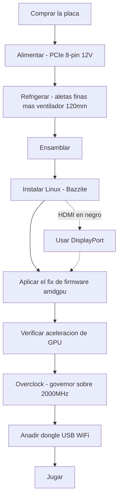

> 🌐 Traducción de la comunidad. La versión en inglés es la fuente de verdad y puede estar más actualizada. ¿Encontraste un error? Abre un issue: [../en/00-start-here.md](../en/00-start-here.md) · https://github.com/lildebil0/awesome-bc250/issues

# Empieza aquí — De cero a jugar

> **TL;DR** — Compraste (o estás a punto de comprar) una AMD BC-250. Es una placa APU derivada de la PlayStation 5 con 16 GB de GDDR6 que se convierte en una caja barata de Linux para juegos/IA — **si** resuelves tres cosas en orden: **alimentación**, **refrigeración** y **drivers de Linux**. Esta página es la línea recta desde una placa en una caja hasta un juego funcionando. Sigue los pasos; cada uno enlaza a un capítulo completo.

Esta placa es un proyecto, no un PC plug-and-play. Reserva un fin de semana. Las dos formas en que la gente mata una placa pronto son **un cableado de alimentación incorrecto** y **hacerla funcionar caliente** — así que empezamos por eso.

---

## Antes de empezar — piezas y herramientas

Ten esto a mano *antes* de comenzar, para no descubrir cada cosa a mitad del montaje:

- **PSU** con una salida PCIe de 8 pines a 12 V → **[03 — Fuente de alimentación](../en/03-power-supply.md)**
- **Ventilador de 120 mm de alta presión estática** + carcasa impresa → **[04 — Refrigeración](../en/04-cooling.md)** / **[05 — Carcasas e impresión 3D](../en/05-case.md)**
- Una **carcasa o soporte impreso** → **[05 — Carcasas e impresión 3D](../en/05-case.md)**
- **Memoria USB ≥ 16 GB** para el instalador de Linux
- Un **cable DisplayPort** (o un adaptador DP→HDMI — el HDMI de la placa a menudo no muestra nada, DisplayPort es lo más seguro)
- Un **destornillador**
- Un **multímetro** — para probar el cableado de la PSU con imán/continuidad → **[03 — Fuente de alimentación](../en/03-power-supply.md)**

---

## El camino



### 0. Conoce lo que tienes
Una BC-250 es una blade de servidor/minería: una APU (CPU Zen 2 + GPU de clase RDNA2, "Cyan Skillfish/Oberon"), 16 GB de GDDR6, **disipador pasivo**, alimentada por un único **PCIe de 8 pines a 12 V**. Sin WiFi integrado, sin driver de GPU funcional en Windows, sin codificación de vídeo por hardware. → **[01 — Qué es la BC-250](../en/01-what-is-bc250.md)**

### 1. Compra lo correcto
Conoce cuál es un precio justo, qué viene en la caja (¿solo la placa? ¿disipador? ¿PSU?) y qué vendedores/estafas evitar. → **[02 — Guía de compra](../en/02-buying.md)**

### 2. Resuelve la alimentación *antes del primer arranque*
La placa quiere ~235 W (más con overclock) a 12 V a través de un PCIe de 8 pines. Usa una PSU de verdad (Flex de servidor / brick Mean Well / ATX), cablea el 8 pines correctamente con **cable de cobre genuino de calibre adecuado** y no adivines el pinout — un error aquí es una placa muerta. → **[03 — Fuente de alimentación](../en/03-power-supply.md)**

### 3. Arregla la refrigeración *antes de exigirla*
El disipador de fábrica está pensado para un túnel de viento de rack y **hace throttling en un escritorio**. Afina las aletas y atornilla un ventilador de 120 mm de alta presión estática a través de una carcasa impresa (o pásate a una AIO). Objetivo: mantenerse por debajo de ~80 °C en Furmark. → **[04 — Refrigeración](../en/04-cooling.md)**

### 4. Mételo en una carcasa (opcional pero agradable)
Imprime una carcasa estilo consola que monte la placa, el ventilador y la PSU con flujo de aire real. Catálogo de STL de la comunidad. → **[05 — Carcasas e impresión 3D](../en/05-case.md)**

### 5. Ensámblalo
Orden físico de operaciones para un build mínimo: monta el ventilador en la carcasa impresa → fija/atornilla la carcasa sobre las aletas (afinadas) del disipador → asienta la placa en la carcasa/soporte → conecta el 8 pines de la PSU a la placa (pinout correcto, **[03 — Fuente de alimentación](../en/03-power-supply.md)**) → conecta un cable DisplayPort al monitor → enciende y confirma que hace **POST** (POST = autodiagnóstico de encendido; arranca y emite vídeo — obtienes imagen / el ventilador gira). Haz cualquier lijado de aletas *antes* de montar (consulta **[04 — Refrigeración](../en/04-cooling.md)**) y mantén el polvo metálico lejos de la placa.

> Una foto/diagrama etiquetado de este ensamblaje sería una contribución bienvenida — el repositorio aún no tiene ninguno.

### 6. Instala Linux + drivers de GPU
Este es el paso decisivo. Lo más fácil para los recién llegados: una **imagen basada en Bazzite** creada para la BC-250 (o **Fedora 43** — la otra elección "simplemente funciona" de elektricM; Fedora 42 está en fin de vida). Luego aplica el **fix de firmware amdgpu** (el symlink `navi10_gpu_info.bin`) y los parámetros del kernel, regenera initramfs/grub y verifica que la GPU está acelerada (`vainfo`, `dmesg`). → **[06 — Drivers y configuración de Linux](../en/06-linux.md)**

> **Dos ajustes que causan horas de sufrimiento si los omites** (elektricM): en la BIOS modificada fija **VRAM = 512 MB dinámica** y **desactiva IOMMU** (un IOMMU defectuoso provoca fallos de pantalla y cuelgues), luego **borra la CMOS** tras el flasheo. Instala con el parámetro de arranque `nomodeset` y **quítalo una vez instalados los drivers**. Mesa **25.1+** es el mínimo (se recomienda 25.3.x). Y **evita los kernels 6.15.0–6.15.6 y 6.17.8–6.17.10** — rompen el driver de la GPU; usa en su lugar un 6.18 LTS / 6.17.11+ / 6.12–6.14 LTS. ([guía rápida de elektricM](https://elektricm.github.io/amd-bc250-docs/getting-started/quick-start/), [referencia rápida](https://elektricm.github.io/amd-bc250-docs/reference/quick-reference/))

> ¿Pensando en Windows? A principios de 2026 **no hay driver de GPU funcional para Windows** — es experimental. Usa Linux. → **[07 — Windows](../en/07-windows.md)**

### 7. Verifica que funciona en stock, luego haz overclock
Una vez que el escritorio está acelerado, instala el **oberon-governor** y sube las frecuencias (1500 MHz de fábrica es débil; **2000 MHz ≈ +30 % de FPS**). Opcionalmente desbloquea las **40 CU** y haz undervolt. Vuelve a probar las temperaturas con las nuevas frecuencias. → **[09 — Overclocking y undervolting](../en/09-overclock-undervolt.md)**

### 8. Conéctate
Sin WiFi integrado — añade un **dongle USB de confianza** (el aic8800d80 es el favorito de la comunidad) y su driver. → **[10 — WiFi y Bluetooth](../en/10-wifi-bt.md)**

### 9. Juega
Establece expectativas realistas (la CPU Zen 2 suele ser el límite, no la GPU), activa FSR y usa los ajustes por juego de la comunidad. → **[11 — Resultados de juego y ajustes](../en/11-gaming.md)**

### Extra — ejecuta LLM locales
16 GB de VRAM es mucho por el precio. Ejecuta llama.cpp en el backend **Vulkan** (ROCm es un callejón sin salida en esta GPU). → **[12 — IA / LLM](../en/12-ai-llm.md)**

### Extra — emulación
Switch, PS3, PS4, retro, arcade — qué funciona de verdad y cómo → **[15 — Emulación](../en/15-emulation.md)**

> ¿Sin imagen en el primer arranque? La placa emite por **DisplayPort** (el HDMI a menudo queda en negro) → **[14 — Pantalla y salida de vídeo](../en/14-display.md)**. ¿Sin puertos USB, o añadiendo una unidad? → **[16 — USB, hubs y almacenamiento](../en/16-usb-peripherals.md)**

---

## Si algo se rompe
Pantalla en negro, sin aceleración, reinicios aleatorios, caídas del dongle, un brick tras un flasheo de BIOS — consulta **[Solución de problemas](troubleshooting.md)** y la **[FAQ](faq.md)**.

> Flashear una BIOS modificada **no** es un paso inicial. Puede dejar la placa en estado de brick y necesita hardware de recuperación. Ve ahí solo de forma deliberada. → **[08 — BIOS y recuperación de brick](../en/08-bios.md)**

---

## La checklist de 60 segundos

| Paso | Hecho cuando |
|------|-----------|
| Alimentación | PSU cableada al 8 pines, pinout correcto, cable de cobre genuino, la placa hace POST |
| Refrigeración | Aletas afinadas + ventilador/carcasa de 120 mm; <80 °C en Furmark |
| SO | Bazzite-bc250 instalado, arranca al escritorio |
| GPU | `vainfo`/`dmesg` muestran amdgpu activo, no fallback a CPU |
| Overclock | oberon-governor en ejecución, ~2000 MHz, estable en un juego real |
| Red | El dongle USB se conecta y se mantiene |
| Juego | Funciona a los FPS esperados para tus frecuencias |

Cuando cada fila esté marcada, has terminado. Bienvenido al club de la BC-250.

---

## Referencia rápida (chuleta)

Comandos y ajustes a los que recurrirás más a menudo, condensados de la [referencia rápida](https://elektricm.github.io/amd-bc250-docs/reference/quick-reference/) de elektricM. El detalle completo está en **[06 — Linux](../en/06-linux.md)** y **[09 — Overclocking](../en/09-overclock-undervolt.md)**.

**BIOS:** VRAM `512MB` dinámica · IOMMU **Disabled** · arranque UEFI · borra la CMOS tras cada flasheo por USB.

**Verifica que la GPU está acelerada (no llvmpipe/CPU):**
```bash
glxinfo | grep "OpenGL version"          # Mesa 25.1+ expected
vulkaninfo | grep deviceName             # → AMD Radeon Graphics (RADV GFX1013)
cat /sys/class/drm/card0/device/pp_dpm_sclk   # multiple freqs, current marked *
```

**Governor** (las frecuencias se quedan en 1500 MHz sin él). El nuestro usa por defecto `oberon-governor`; elektricM distribuye el fork SMU más reciente vía COPR — cualquiera funciona:
```bash
sudo dnf copr enable filippor/bazzite
sudo dnf install cyan-skillfish-governor-smu          # rpm-ostree install … on Bazzite
sudo systemctl enable --now cyan-skillfish-governor-smu.service
systemctl status cyan-skillfish-governor-smu          # → active (running)
```
> Voltaje mínimo **700 mV** — por debajo de eso la GPU se bloquea a 1500 MHz. El governor puede apuntar a la tarjeta equivocada (card0 vs card1) — verifícalo si el escalado no entra en acción.

**Quita `nomodeset` tras instalar los drivers:**
```bash
# GRUB distros: drop "nomodeset" from /etc/default/grub, then
sudo grub2-mkconfig -o /boot/grub2/grub.cfg && sudo reboot
# Bazzite / Fedora Atomic:
rpm-ostree kargs --delete-if-present="nomodeset" && systemctl reboot
```

**Opción de lanzamiento de Steam** que corrige fallos gráficos en algunos juegos: `RADV_DEBUG=nohiz %command%`.

**¿Cuelgue en RDR2 / Company of Heroes 3?** Cambia la VRAM de `512MB` dinámica a **10GB/6GB fija** (conflicto con ZRAM). ([referencia rápida de elektricM](https://elektricm.github.io/amd-bc250-docs/reference/quick-reference/))
