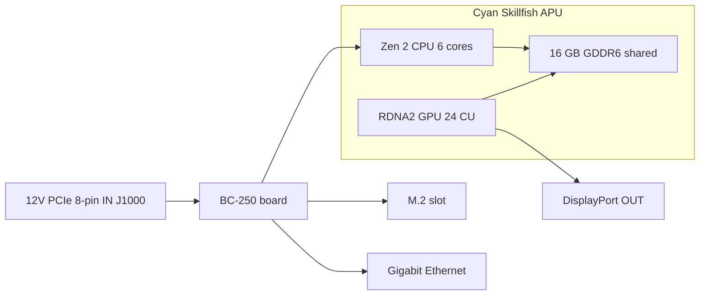

> 🌐 Traducción de la comunidad. La versión en inglés es la fuente de verdad y puede estar más actualizada. ¿Encontraste un error? Abre un issue: [../en/01-what-is-bc250.md](../en/01-what-is-bc250.md) · https://github.com/lildebil0/awesome-bc250/issues

# Qué es la BC-250

> **TL;DR** — La BC-250 es una **APU de clase PlayStation 5 sobre una placa de servidor/minería**. Un solo chip (nombre en clave de AMD **Cyan Skillfish**, una versión recortada del silicio **Oberon/Ariel** de la PS5) lleva una **CPU Zen 2 de 6 núcleos / 12 hilos** y una **GPU RDNA 2 de 24 unidades de cómputo**, alimentadas por **16 GB de GDDR6 soldada**. **No es una tarjeta gráfica ni un PC normal** — no tiene **la BIOS x86 que conoces, ni ranura PCIe, ni conector ATX de 24 pines**: recibe **12 V directos a un conector de alimentación PCIe de 8 pines** y arranca su propio firmware. La gente la compra porque es una **caja de gaming Linux / IA local baratísima**. La gente se enfurece con ella porque los **drivers, la refrigeración y la falta de codificación de vídeo por hardware** la convierten en un proyecto, no en una máquina plug-and-play. Si quieres cero complicaciones, esta placa es la compra equivocada — devuélvela ya. Si te gusta trastear, sigue leyendo.

Esta página es la referencia de "qué fue lo que compré en realidad". La alimentación, la refrigeración, la instalación del SO y los drivers tienen cada uno su propia sección ([03](03-power-supply.md) / [04](04-cooling.md) / [06](06-linux.md)).

---

## Qué es en realidad

AMD construyó la BC-250 como un **acelerador de minería de criptomonedas** (la "BC" viene de blockchain). Para abaratarla, AMD reutilizó **silicio sobrante de procesadores de PlayStation 5** — la misma familia de chip que Sony pone en la consola. Una placa es una APU más su memoria y circuitería de alimentación; eso es todo el producto.

Jerga, definida una vez:

- **APU** (Accelerated Processing Unit) — el nombre de AMD para un único chip que contiene **tanto la CPU como la GPU**. No hay tarjeta gráfica separada; la GPU está dentro del mismo encapsulado, compartiendo la misma memoria.
- **Cyan Skillfish** — el **nombre en clave** de ingeniería de AMD para esta APU. Lo verás por todas partes en Linux: el archivo de firmware de la GPU es literalmente `cyan_skillfish_gpu_info.bin` ([src](https://t.me/c/2424231195/57962) — mira el arreglo del symlink en [src](https://t.me/c/2424231195/41252)). Las herramientas también pueden reportarla bajo los nombres de die de la PS5 **Oberon** / **Ariel**.
- **GDDR6** — la memoria gráfica rápida que normalmente se encuentra en una tarjeta de vídeo. En la BC-250 es la **RAM del sistema y la RAM de vídeo a la vez** (la CPU y la GPU comparten un único pool). No hay ranuras DIMM; los 16 GB están soldados y no son ampliables.
- **RDNA 2** — la generación de arquitectura de la GPU (misma familia que la PS5, la Xbox Series y las tarjetas Radeon RX 6000).

El chip es una pieza de PS5 **recortada**, no la completa. La comunidad fijó esta comparación ([src](https://t.me/c/2424231195/11282), citando la [entrada de Oberon en TechPowerUp](https://www.techpowerup.com/gpu-specs/amd-oberon.g936)):

| | BC-250 | PS5 completa (Oberon) |
|---|---|---|
| Núcleos / hilos de CPU | **6 / 12** | 8 / 16 |
| Unidades de cómputo de GPU (CU) | **24** | 36 |

Una "unidad de cómputo" es un bloque de núcleo de GPU; 24 de ellas es aproximadamente territorio de GPU de portátil de gama media, que es exactamente la franja de rendimiento que el chat reporta en juegos.

La BC-250 no es el único "silicio de consola sobrante sobre una placa de escritorio" de AMD. Tiene dos primos cercanos construidos a partir de la misma idea: el **AMD 4700S Desktop Kit** (un kit de CPU derivado de la **PlayStation 5**) — que el chat advierte que aparece mezclado con la BC-250 en los marketplaces ([02-buying.md](02-buying.md)) — y el **AMD 4800S Desktop Kit**, la versión derivada de la **Xbox Series X** (8 núcleos Zen 2 cableados a GDDR6, con la GPU RDNA 2 de la consola fusionada/desactivada). Ambos son productos reales de AMD que, como la BC-250, emparejan una CPU de consola rescatada con GDDR6 soldada ([VideoCardz](https://videocardz.com/newz/amd-4800s-desktop-kit-a-pc-repurposed-apu-from-xbox-series-x-has-been-tested)). Son contexto útil para distinguir la BC-250 de sus hermanas cuando vas de compras.

La gente ha ejecutado **Linux de escritorio en la BC-250 del mismo modo en que se jailbreakeó la propia PS5** — vídeo + audio 4K HDMI completo, todos los puertos USB funcionando, la APU subiendo hasta ~3,2 GHz en la CPU y ~2,0 GHz en la GPU ([src](https://t.me/c/2424231195/122260)).

---

## En qué es buena

- **La forma más barata de entrar al gaming en Linux en esta franja de rendimiento.** A través de Steam/Proton (una capa de compatibilidad que ejecuta juegos de Windows en Linux) la gente juega a Star Citizen ([src](https://t.me/c/2424231195/38702)), e incluso títulos modernos como *Doom: The Dark Ages* mediante un wrapper de Vulkan de la comunidad a ~60 FPS en bajo/FSR ([src](https://t.me/c/2424231195/127696)). Los resultados por juego están en [11-gaming.md](11-gaming.md).
- **Una caja de IA local capaz.** Con 16 GB de GDDR6 puede albergar modelos de lenguaje de tamaño medio. Los miembros ejecutan LLMs localmente mediante `llama.cpp`/`jan` en el backend de **Vulkan**; configuras la BIOS para asignar primero 12 GB a la GPU ([src](https://t.me/c/2424231195/92421)). Mira [12-ai-llm.md](12-ai-llm.md).
- **Pequeña y autocontenida.** Es una única placa larga con el disipador de estilo GPU integrado — encaja en carcasas DIY/impresas en 3D pequeñas y funciona con una sola fuente de alimentación pequeña ([build src](https://t.me/c/2424231195/137825)).

El consenso de la comunidad sobre *por qué* funciona siquiera: porque el chip está tan cerca del hardware de la Steam Deck / PS5 que Valve y el stack gráfico de código abierto Mesa siguen mejorando exactamente esos mismos drivers, así que la BC-250 se aprovecha gratis ([src](https://t.me/c/2424231195/93006)).

---

## Qué es doloroso (ajusta expectativas)

Esta es la mitad que los recién llegados subestiman. Nada de esto es un factor decisivo en contra, pero todo es trabajo real.

- **Los drivers son un trabajo hazlo-tú-mismo.** AMD no entrega **ningún driver oficial ni documentación pública** para esta placa ([src](https://t.me/c/2424231195/37764)). Todo — el stack gráfico de Linux, el "governor" de reloj/voltaje, la BIOS — está construido por la comunidad. Espera seguir scripts de configuración y, ocasionalmente, arreglar cosas a mano. Empieza en [06-linux.md](06-linux.md).
- **La refrigeración es lo número 1 que la gente hace mal.** El disipador de serie fue diseñado para el túnel de aire forzado de un rack de minería, así que sobre un escritorio se sobrecalienta y hace throttling de fábrica. Tendrás que modificar la refrigeración. Esto tiene su propia sección — lee [04-cooling.md](04-cooling.md) **antes** de perseguir rendimiento.
- **Sin codificador de vídeo por hardware.** El bloque de codificación de vídeo de la GPU (lo que AMD llama **VCN** — el circuito dedicado que comprime vídeo para streaming/grabación) **no está disponible**. La grabación de pantalla y el streaming de juegos recurren a un **codificador por software**, que consume CPU. Funciona (la gente hace streaming con Sunshine/Moonlight) pero es más lento y de menor calidad que una GPU normal ([src](https://t.me/c/2424231195/88026)). Del mismo modo, el primer driver de Mesa fue célebremente **renderizado por software** hasta que la comunidad logró que funcionara la aceleración por hardware ([src](https://t.me/c/2424231195/11243)).
- **Alimentación rara y sin imagen por defecto.** No acepta un conector ATX estándar de 24 pines — mira la siguiente sección. Muchas placas además llegan necesitando un **reseteo de BIOS** antes incluso de hacer POST ([src](https://t.me/c/2424231195/57930)), y normalmente sacas imagen por **DisplayPort** (HDMI necesita un adaptador DP→HDMI, que además lleva el audio sin problema — [src](https://t.me/c/2424231195/9148)).
- **Es una placa de trasteador, punto.** Como lo expresó un miembro veterano: a pesar de ser barata, la BC-250 "requiere ciertas habilidades, esfuerzo y cabeza" ([src](https://t.me/c/2424231195/73002)). Presupuesta tiempo, no solo dinero.
- ⚠ **Una eGPU no la va a salvar — reportado por la comunidad (r/BC250Gaming).** La única ranura M.2 es solo **PCIe 2.0 ×2** (mira la ficha de hardware más abajo), y a ese ancho de banda una GPU externa colgada de la M.2 **se reporta que rinde *peor* que la GPU RDNA 2 integrada** — el enlace lento la estrangula. Si quieres más potencia gráfica, el consenso es que esta no es la placa para ello. *(Reportado por la comunidad; trátalo como una advertencia, no como un benchmark.)*

> ⚠ **Qué significa el LED bicolor — reportado por la comunidad (r/BC250Gaming).** El LED de dos colores junto a la NIC es un **indicador de utilización de la era de minería, no una luz de error**: según relatos de la comunidad **rojo = la GPU/RAM *no* está al 100 % de utilización, verde = utilización plena**. Así que una luz roja en una placa de escritorio en reposo es normal, no un fallo. *(Reportado por la comunidad; AMD no entrega documentación para esta placa, así que trata el mapeo exacto de colores como no confirmado.)*

> ⚠ **Advertencia de manipulación, aprendida a las malas.** **No** dejes que nada metálico toque la placa con alimentación, y cambia la pasta térmica únicamente con cuidado — un miembro mató permanentemente su BC-250 al cortocircuitarla ([src](https://t.me/c/2424231195/95998)). Las placas además llegan ligeramente **dobladas** por el montaje del disipador; un miembro arregló un no-arranque calzando la placa plana contra el disipador con papel ([src](https://t.me/c/2424231195/117347)).

---

## Ficha de referencia de hardware

Las especificaciones están contrastadas contra la ingeniería inversa de hardware de la comunidad (AMD no publica datasheet). Las cifras del bus de memoria y de dimensiones físicas, antes no confirmadas, provienen ahora de la [spec de hardware de elektricM](https://github.com/elektricm/elektricm) (que acredita a mothenjoyer69 / Segfault / neggles / yeyus por la ingeniería inversa). El pinout y las cifras de alimentación de abajo provienen del documento de hardware canónico de la comunidad.

La placa de un vistazo — entrada de alimentación a la izquierda, la APU y su memoria compartida en el centro, E/S a la derecha:



### Especificaciones principales

| Especificación | Valor | Fuente |
|------|-------|--------|
| Clase | APU derivada de PlayStation 5 sobre una placa de minería/servidor | [hardware.md](https://github.com/mothenjoyer69/bc250-documentation/blob/main/hardware.md) |
| Nombre en clave de la APU | **Cyan Skillfish** (die de PS5: Oberon / Ariel) | chat ([src](https://t.me/c/2424231195/57962)) |
| CPU | **6 núcleos / 12 hilos, Zen 2** (6 núcleos confirmados) | [hardware.md](https://github.com/mothenjoyer69/bc250-documentation) · chat ([src](https://t.me/c/2424231195/11282)) |
| Reloj de CPU | hasta **~3,49 GHz** ("más o menos") | [hardware.md](https://github.com/mothenjoyer69/bc250-documentation) · chat ([src](https://t.me/c/2424231195/122260)) |
| GPU | **24 unidades de cómputo, RDNA 2** (`gfx1013`; el SoC de la PS5 tiene 36); rasterización ≈ **entre RX 6600 y RX 6600 XT** / clase GTX 1660 Ti; **Vulkan 1.4** | [hardware.md](https://github.com/mothenjoyer69/bc250-documentation) · chat ([src](https://t.me/c/2424231195/11282)) · [elektricM](https://github.com/elektricm/elektricm) |
| Reloj de GPU | ~1500 MHz de serie, ~2000 MHz overclockeada (≈2,23 GHz máx) | ([src](https://t.me/c/2424231195/122260)) · [09](09-overclock-undervolt.md) |
| Memoria | **16 GB GDDR6**, compartida entre CPU y GPU, soldada (no ampliable) | [hardware.md](https://github.com/mothenjoyer69/bc250-documentation) · [README](../../README.md) |
| Asignación de VRAM de GPU | se configura en la BIOS; **12 GB** seleccionables en BIOS 3.00+ | ([src](https://t.me/c/2424231195/92421)) |
| Bus / ancho de banda de memoria | **256-bit** GDDR6 @ **14 Gbps**, **~448 GB/s** | [spec de hardware de elektricM](https://github.com/elektricm/elektricm) |
| TDP | **220 W** (potencia de diseño térmico de la placa) | [hardware.md](https://github.com/mothenjoyer69/bc250-documentation) |
| Consumo | ~67–85 W típico bajo carga de clase minería | [hashrate.no](https://www.hashrate.no/gpus/bc250) |
| Codificación de vídeo por hardware (VCN) | **Ninguna** — solo codificación por software | ([src](https://t.me/c/2424231195/88026)) |
| Salida de vídeo | **DisplayPort 1.4** (hasta **4K@120 / 8K@60**); usa adaptador DP→HDMI para HDMI; lleva audio | ([src](https://t.me/c/2424231195/9148)) · [elektricM](https://github.com/elektricm/elektricm) |
| Almacenamiento (M.2) | 1x M.2 2280 — **PCIe 2.0 x2 o SATA III** | [elektricM](https://github.com/elektricm/elektricm) |
| 2º DisplayPort | presente pero **sin poblar**; se puede activar por software | ([src](https://t.me/c/2424231195/88026)) |
| Tamaño físico | **340 mm / 310 mm** de largo (según método de medición), **~115 mm** de ancho, **~400 g** con disipador; formato de minería personalizado no estándar | [spec de hardware de elektricM](https://github.com/elektricm/elektricm) |

> ⚠ **Overclock de GDDR6 = ancho de banda, no FPS — reportado por la comunidad (r/BC250Gaming).** Según relatos de la comunidad, overclockear la GDDR6 sube el ancho de banda de memoria de aproximadamente **~256 GB/s a ~445 GB/s** pero no aporta **ninguna ganancia en juegos** — las 24 CUs de la GPU, no el ancho de banda de memoria, son el cuello de botella, así que el ancho de banda extra queda sin usar en juegos. (Ojo: la cifra *de serie* verificada del repo de arriba ya es **~448 GB/s** a 256-bit / 14 Gbps, así que el "baseline de ~256 GB/s" de la comunidad no coincide con la hoja de especificaciones — trata las cifras exactas de GB/s como no confirmadas; la conclusión de que no ganas FPS es la parte duradera.) Para el overclocking de GPU/memoria en general, mira [09-overclock-undervolt.md](09-overclock-undervolt.md).

> **Sobre las dimensiones de la placa:** la [spec de hardware de elektricM](https://github.com/elektricm/elektricm) da **340 mm / 310 mm** de largo (las dos cifras reflejan distintos métodos de medición), **~115 mm** de ancho y **~400 g** con el disipador, en un formato de minería personalizado no estándar. El propio `hardware.md` canónico no lista dimensiones; el post de hardware con más reacciones del chat se titula literalmente *"Размеры amd bc-250"* ("dimensiones de la AMD BC-250", ❤20 — [src](https://t.me/c/2424231195/379)), confirmando que a la gente le importa esto para construir carcasas. Para un encaje exacto en carcasa, trabaja a partir de un modelo 3D medido — los STL de la placa catalogados por la comunidad (p. ej. `BC250 Board.stl`, [Printables 1103626](https://www.printables.com/model/1103626-amd-bc250-board) y el modelo preciso en [Printables 1341336](https://www.printables.com/model/1341336-accurate-3d-model-of-the-amd-bc-250-board)) son dimensionalmente correctos. Mira [05-case.md](05-case.md).

<p align="center">
  <br>
  <sub>Foto: comunidad AMD BC-250 · <a href="https://t.me/c/2424231195/379">fuente</a></sub>
</p>

### Pinout del conector de alimentación (lee esto antes de enchufar nada)

La BC-250 **no tiene cabezal ATX de 24 pines**. Se alimenta con **12 V únicamente**, entregados a través de un **conector de alimentación PCIe de 8 pines (J1000)** — el mismo conector físico que el de una tarjeta gráfica, pero la placa espera los tres contactos de alimentación alimentados desde 12 V. El cableado completo y la elección de PSU están en [03-power-supply.md](03-power-supply.md); el pinout canónico de [hardware.md](https://github.com/mothenjoyer69/bc250-documentation/blob/main/hardware.md):

**J1000 — alimentación principal PCIe de 8 pines (este es el que conectas):**

```
[ GND  GND  GND  GND ]
[ GND  12V  12V  12V ]
```

- Tres contactos de 12 V; el documento clasifica los contactos Mini-Fit Jr en **hasta 9 A cada uno**, así que este conector "puede suministrar hasta **324 W** con seguridad", y recomienda cable de **16 AWG** para uso autónomo ([hardware.md](https://github.com/mothenjoyer69/bc250-documentation)).
- **GND = tierra (0 V), 12V = +12 voltios.** Acierta con la polaridad — esta placa no tiene tolerancia al voltaje inverso.

**J2000 / J2001 — conectores de alimentación de rack (normalmente NO se usan en un escritorio):**

```
        J2000                  J2001
 [ LED1  12V  12V  12V ]   [ 12V  12V  12V  PGD ]
 [ LED2  GND  GND  GND ]   [ GND  GND  GND  GND ]
```

- Estos son conectores **Molex Micro-Fit BMI** ([part 444280801](https://www.molex.com/en-us/products/part-detail/444280801)), *no* conectores PCIe/EPS — alimentaban la placa dentro de su chasis de minería original. **J2000 y J2001 no son idénticos:** como muestra el pinout de arriba, J2000 lleva los pines **LED1/LED2** mientras que J2001 lleva el pin **PGD**, así que los dos conectores difieren ([docs de hardware de elektricM / mothenjoyer69](https://github.com/mothenjoyer69/bc250-documentation)).
- **PGD** (en J2001) es un pin de power-good/sensado: ve **5 V cuando la placa está asentada en la PSU2 del rack**. En un montaje autónomo normalmente alimentas vía J1000 en su lugar y puedes ignorar J2000/J2001 — pero confírmalo contra [03-power-supply.md](03-power-supply.md) para tu adaptador de PSU específico.

---

## Adónde ir a continuación

1. **[02-buying.md](02-buying.md)** — si todavía no la has comprado, o quieres saber cuál es un precio justo y los riesgos reales.
2. **[03-power-supply.md](03-power-supply.md)** — cómo alimentarla de verdad (12 V al de 8 pines).
3. **[04-cooling.md](04-cooling.md)** — haz esto **antes** que cualquier otra cosa en cuanto tengas la placa en mano.
4. **[06-linux.md](06-linux.md)** — ponle un SO y los drivers de la comunidad.

---

## Fuentes

- Documento de hardware y pinout canónicos — [mothenjoyer69/bc250-documentation `hardware.md`](https://github.com/mothenjoyer69/bc250-documentation/blob/main/hardware.md)
- Bus/ancho de banda de memoria, dimensiones físicas, posicionamiento de la GPU, DP 1.4, M.2 — [spec de hardware de elektricM](https://github.com/elektricm/elektricm) (acredita a mothenjoyer69 / Segfault / neggles / yeyus por la ingeniería inversa)
- Silicio de PS5 recortado vs completo (6/12 + 24 CU vs 8/16 + 36 CU) — https://t.me/c/2424231195/11282 · [TechPowerUp Oberon](https://www.techpowerup.com/gpu-specs/amd-oberon.g936)
- Linux sobre hardware de PS5, 4K HDMI, relojes — https://t.me/c/2424231195/122260
- Sin driver oficial / sin docs — https://t.me/c/2424231195/37764
- Renderizado por software / sin codificación por hardware — https://t.me/c/2424231195/11243 · https://t.me/c/2424231195/88026
- DisplayPort + audio DP→HDMI — https://t.me/c/2424231195/9148
- Nombre del firmware Cyan Skillfish — https://t.me/c/2424231195/57962 · https://t.me/c/2424231195/41252
- LLM local + 12 GB de VRAM vía BIOS 3.00 — https://t.me/c/2424231195/92421
- "Requiere habilidades, esfuerzo y cabeza" — https://t.me/c/2424231195/73002
- Advertencia de manipulación/cortocircuito — https://t.me/c/2424231195/95998 · arreglo de placa doblada — https://t.me/c/2424231195/117347
- "Dimensiones de la BC-250" (post de hardware con más reacciones) — https://t.me/c/2424231195/379
- TDP de 220 W, CPU de 6 núcleos/3,49 GHz, GPU de 24 CU, 16 GB GDDR6 (confirmación del repo) — [mothenjoyer69/bc250-documentation README](https://github.com/mothenjoyer69/bc250-documentation)
- Cifras de consumo de clase minería — https://www.hashrate.no/gpus/bc250
- Por qué sigue funcionando (esfuerzo de drivers compartido con Steam Deck/PS5) — https://t.me/c/2424231195/93006
- Kits hermanos — AMD 4700S (kit de CPU de PS5, mezclado con la BC-250, [02-buying.md](02-buying.md)) y AMD 4800S (CPU de Xbox Series X + GDDR6, GPU desactivada) — [VideoCardz: 4800S Desktop Kit](https://videocardz.com/newz/amd-4800s-desktop-kit-a-pc-repurposed-apu-from-xbox-series-x-has-been-tested)
- eGPU sobre M.2 más lenta que la GPU integrada (la M.2 es PCIe 2.0 ×2), LED bicolor de la NIC = señal de utilización (rojo = no al 100 % util, verde = util plena), el overclock de GDDR6 sube el ancho de banda (~256→~445 GB/s) sin ganancia en juegos — reportado por la comunidad (r/BC250Gaming)

> AMD no publica datasheet primario para esta placa; las cifras de arriba son la mejor ingeniería inversa de la comunidad (el `hardware.md` canónico más la spec de hardware de elektricM). Correcciones bienvenidas vía PR (mira [CONTRIBUTING.md](../../CONTRIBUTING.md)).
