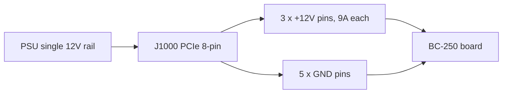

> 🌐 Traducción de la comunidad. La versión en inglés es la fuente de verdad y puede estar más actualizada. ¿Encontraste un error? Abre un issue: [../en/03-power-supply.md](../en/03-power-supply.md) · https://github.com/lildebil0/awesome-bc250/issues

# Fuente de alimentación

> **TL;DR** — La BC-250 **no tiene botón de encendido ni enchufe de alimentación de PC estándar**. Consume **12 V** a través de un único conector **PCIe 8-pin (6+2)** — el mismo enchufe que usa una tarjeta gráfica de escritorio — y alcanza picos de alrededor de **~235 W** (más si haces overclock). Necesitas una fuente de 12 V capaz de entregar **~250–300 W en un solo riel**. La comunidad sigue tres caminos: una **PSU "Flex" de servidor** barata (HP 500 W, ~$12 en eBay), un **brick industrial** (Mean Well LOP-300/LOP-500), o una **PSU ATX normal** (solo enchufa su cable PCIe). Los dos asesinos a evitar: una **PSU vieja que reparte los 12 V entre rieles débiles**, y los **cables falsos de acero con baño de cobre** que se sobrecalientan y se incendian. Usa cobre genuino, **16 AWG o más grueso**.

Alimentar la placa es **lo segundo que un recién llegado debe hacer bien** (después de la [refrigeración](04-cooling.md)) — y lo más probable que provoque un incendio si recortas en el cableado.

---

## Lo que la placa realmente necesita

La BC-250 es un die de PlayStation 5 recortado sobre una placa de minado de cripto/servidor. Estaba pensada para vivir en un rack y ser alimentada con 12 V — así que **no tiene ninguna de las comodidades de una PC normal**:

- **Sin conector de placa base ATX de 24 pines.**
- **Sin botón de encendido** — se enciende en el instante en que llegan los 12 V (el propio interruptor de la PSU es tu botón de encendido).
- **Un solo trabajo para la PSU: entregar 12 V con suficiente corriente.**

**Cifras de potencia (confirmadas):**

| Especificación | Valor | Fuente |
|------|-------|--------|
| Tensión de entrada | 12 V DC | [hardware.md](https://github.com/mothenjoyer69/bc250-documentation/blob/main/hardware.md) |
| Consumo pico típico | ~220–235 W | observado por la comunidad ([src](https://t.me/c/2424231195/31076)) |
| Conector | PCIe 8-pin (6+2) | [hardware.md](https://github.com/mothenjoyer69/bc250-documentation/blob/main/hardware.md) · ([src](https://t.me/c/2424231195/14450)) |
| Corriente pico en 12 V | ~18–20 A típico, margen de diseño hasta ~40 A | ([src](https://t.me/c/2424231195/31076)) |

> **"PCIe 8-pin (6+2)"** significa un enchufe de alimentación de tarjeta gráfica: seis pines en un bloque, más un clip de 2 pines desmontable, de modo que el mismo cable funciona como 6 pines u 8 pines. **6+2** = 6 fijos + 2 extraíbles. Esto *no* es el CPU/EPS 8-pin de tu placa base — mira la advertencia más abajo.

Un PCIe 8-pin está homologado para **150 W** por el estándar PCIe, y los tres contactos de 12 V de la placa (Molex Mini-Fit Jr, 9 A cada uno) pueden pasar con seguridad **hasta ~324 W** ([hardware.md](https://github.com/mothenjoyer69/bc250-documentation/blob/main/hardware.md)). Así que un único 8-pin sobra cómodamente en configuración de fábrica; el margen solo importa cuando aplicas un overclock agresivo.

**Cuánta potencia de PSU comprar:** apunta a **300 W o más en el riel de 12 V**. Una unidad de 300 W da un margen sano sobre el pico de ~235 W y mantiene el ventilador de la PSU tranquilo; la gente reporta que una PSU Flex de servidor de 500 W funciona casi en silencio con esta carga ([src](https://t.me/c/2424231195/31076)). No compres por debajo de ~250 W "para ahorrar dinero" — la harás funcionar al límite y se pondrá ruidosa o se apagará.

> **Curva de potencia con pinza amperimétrica (amperaje de primera mano).** Un despiece colocó un amperímetro DC en pinza sobre la alimentación de 12 V y leyó la corriente real de la placa: **jugando consume ≈17 A / ~190 W**, mientras que una **carga sintética de estrés completa alcanza ≈21 A / ~240–250 W** a **2000 MHz / 960 mV**; subir un poco la tensión la empuja a **22–23 A y más allá** ([Old Lamer — Part VII](https://youtu.be/pxahl9-YgkY) ~9:01). Esto afina las cifras de potencia de pared de la comunidad indicadas arriba con el amperaje de riel medido — y confirma por qué el objetivo de 300 W deja el margen adecuado. *(Cifras leídas de subtítulos automáticos — trata los números exactos como aproximados.)*

> ⚠️ **PSUs nombradas a evitar:** la barata **Dell D220P-01** (220 W) y la **Dell D250AD-00** (250 W) están señaladas como **insuficientes y peligrosas** para esta placa — con 220 W / 250 W quedan por debajo del pico de la placa y se ha reportado que se cortan o incluso se rompen bajo carga de juego. No compres una unidad solo porque es barata y "parece suficiente". ([elektricM: power](https://elektricm.github.io/amd-bc250-docs/hardware/power/))

---

## La física: voltios, amperios, vatios — y por qué el cable fino se quema

Cada regla de este capítulo se deriva de tres ecuaciones. Apréndelas y las tablas de calibre y las advertencias de "nunca uses SATA" dejan de ser arbitrarias.

**Potencia = voltios × amperios (`P = U·I`).** La placa necesita **~235 W** a **12 V**, así que consume `235 ÷ 12 ≈ 19.6 A`. Por eso exactamente una pinza amperimétrica lee **~17 A jugando / ~21 A en estrés** ([arriba](#lo-que-la-placa-realmente-necesita)): la potencia está fijada por el silicio, así que los *amperios* son los que los 12 V fuercen. Sube relojes/tensión y los amperios trepan con los vatios.

**Por qué 12 V — y por qué 24 V la mata.** 12 V es el estándar de rack de centro de datos para el que se construyó la placa; sus VRMs integrados lo reducen al ~1 V al que funciona el núcleo de la APU. La placa está **cableada de fábrica para 12 V sin protección contra sobretensión**, así que alimentarla con 24 V (p. ej. un [LOP-300-**24**](#opción-b--brick-industrial-mean-well)) pone el doble sobre cada parte de 12 V y la destruye al instante. A diferencia del amperaje, la tensión no es negociable.

**Ampacidad — por qué un cable tiene un límite de amperios.** Un cable es una resistencia, y la corriente a través de la resistencia genera calor: `P_loss = I²·R`. Más cobre = más sección transversal = **menor R** = menos calor a los mismos amperios. Ese es el significado completo de la tabla AWG de arriba — **número AWG más bajo = cable más grueso = seguro con más amperios**. A ~20 A, el **cobre de 16 AWG** se mantiene frío; más fino, y `I²·R` derrite el aislamiento. Fíjate en el **cuadrado**: duplicar la corriente *cuadruplica* el calor, por lo que un overclock fuerte necesita una segunda alimentación, no solo "un poco más de cable".

**Caída de tensión — la otra mitad.** El calor perdido en el cable es tensión que la placa nunca ve: `V_drop = I·R`. Un cable largo y fino **se sobrecalienta** y **deja sin alimentación** a la placa a la vez, así que puede caer (brown out) bajo carga aunque nada se derrita a la vista. Cobre corto y grueso arregla ambas cosas de una vez.

**Por qué el "cobre" falso es letal.** El acero con baño de cobre tiene **~6× la resistencia** del cobre genuino — mismos amperios, mismo `I²·R`, así que **6× el calor** en el mismo cable. La prueba del imán de abajo no es una preferencia de calidad; detecta un **multiplicador de 6× sobre un término que ya está al cuadrado en la corriente**.

**Por qué nunca SATA ni Molex.** Es el *conector*, no el cable. Un contacto de alimentación SATA está homologado para **~54 W** → `54 ÷ 12 ≈ 4.5 A` antes de que el pequeño contacto se cueza a sí mismo; la placa quiere ~20 A, **4× por encima** de ese límite. Un PCIe 8-pin en cambio lleva tres contactos gruesos de 12 V (**9 A cada uno = 27 A / 324 W**) — que es *por qué* es el enchufe correcto y SATA/Molex nunca pueden serlo (mira [el pinout](#el-pinout-de-8-pin-j1000)).

---

## ⚠️ Los dos errores que destruyen placas

Lee esta sección antes de comprar nada.

### 1. No confundas el PCIe 8-pin con el CPU/EPS 8-pin

Tu PSU ATX tiene **dos enchufes de 8 pines diferentes**: uno para tarjetas gráficas (**PCIe**) y otro para el CPU (**EPS/CPU**, a veces etiquetado "CPU" o "4+4"). **Se ven casi idénticos pero las formas de sus pines y la polaridad están invertidas.** Forzar un enchufe de CPU en la BC-250 pone **+12 V donde debería ir tierra** — puedes quemar toda la placa.

> *"Se ha discutido mil millones de veces — tenemos una entrada de alimentación PCIe. Si la forma del pin del extremo es diferente, tienes un enchufe de CPU… literalmente tiene la polaridad opuesta, más donde debería ir menos. Puedes quemarlo todo al carajo."* ([src](https://t.me/c/2424231195/14450))

La placa **no comprueba pines de sensado**, así que nada te impide enchufar lo incorrecto. El hábito seguro: **mira la forma del clip del conector, y si tienes dudas, comprueba + y − con un multímetro antes de encender.**

### 2. No uses cable de "cobre" falso — es un riesgo de incendio

Esta es la advertencia de seguridad que más se repite en el chat. Los cables adaptadores prefabricados baratos y los cables "PCIe" de saldo a menudo son de **acero con baño de cobre (CCS)** o **aluminio con baño de cobre (CCA)** — una fina piel de cobre sobre un núcleo de acero/aluminio. El acero tiene **~6× la resistencia del cobre**, así que el cable se sobrecalienta bajo carga y puede derretirse o incendiarse.

> *"El cable del adaptador se sobrecalentó mucho bajo carga. Resultó que no era cobre sino hierro (acero) con un fino recubrimiento de cobre… alta resistencia, se calienta mucho, puede provocar un incendio. Para un funcionamiento fiable y seguro DEBES usar cables de cobre genuino de al menos 2.5 mm²."* ([src](https://t.me/c/2424231195/108733))

> *"Lo comprobé con un imán 🤣 — hilos de acero. La resistencia de estos 'hilos' de acero es 6× mayor que la del cobre. ¿De qué 450 W están hablando siquiera?"* ([src](https://t.me/c/2424231195/133546))

**Prueba antes de confiar:** un imán se pega al acero, no al cobre. Si un conector o cable es magnético, tira el cable a la basura.

Esto no es solo cable sin marca. **Se han visto PSUs Apevia Flex/ITX con cables de acero** — pásales la prueba del imán, porque el acero se calienta mucho bajo carga y es un riesgo de incendio. La Mini-ITX **Apevia ITX-PFC400W** usa un **conector de 14 pines** (funciona con el [adaptador LITE](#ps_on-automático--adaptador-de-la-comunidad) de abajo, pero se desaconseja). (r/BC250Gaming)

> 🔴 **Nunca alimentes la BC-250 a través de un adaptador SATA o Molex.** La placa consume **220–280 W**, y estos conectores físicamente no pueden entregar eso con seguridad:
> - Un **adaptador SATA→PCIe/8-pin es un riesgo de incendio** — un conector de alimentación SATA está homologado para solo **~54 W** ([elektricM: power](https://elektricm.github.io/amd-bc250-docs/hardware/power/)).
> - Una **alimentación Molex pelada tope en ~156 W** combinados (dos conectores Molex) — aún no es suficiente ([elektricM: power](https://elektricm.github.io/amd-bc250-docs/hardware/power/)).
>
> Alimenta la placa solo desde una **fuente de 12 V real PCIe 8-pin / clase EPS**. Esto es independiente de la advertencia cobre-vs-acero de arriba: incluso un adaptador SATA o Molex de *cobre genuino* es inseguro aquí, porque el propio conector está infrahomologado para una carga de 220–280 W.

---

## Guía de calibre de cable y conectores

La documentación de la placa y el chat coinciden en la misma base segura:

| Caso de uso | Cable | Fuente |
|----------|------|--------|
| Un solo 8-pin, stock / OC ligero | **16 AWG** cobre (~1.3 mm²) | [hardware.md](https://github.com/mothenjoyer69/bc250-documentation/blob/main/hardware.md) |
| Cable hecho a mano, con margen | **2.5 mm²** (~13 AWG) cobre genuino | ([src](https://t.me/c/2424231195/108733)) |
| Overclock fuerte | más grueso / **doble alimentación** (mira J2000/J2001) | [hardware.md](https://github.com/mothenjoyer69/bc250-documentation/blob/main/hardware.md) |

Los números no entran en conflicto — **16 AWG es el mínimo documentado**; la cifra de 2.5 mm² es la de un constructor que eligió margen extra tras un susto con cable CCS. **La parte no negociable es "cobre genuino", no el calibre exacto.** Número AWG más bajo = cable más grueso = más seguro.

Para los contactos del conector que llevan toda la corriente, apunta a unos homologados para el pico: los constructores buscan contactos/cable buenos para **~40 A** en una build fuerte, y los atornillan o crimpan correctamente en vez de fiarse de un encaje a presión endeble ([src](https://t.me/c/2424231195/31076)).

---

## El pinout de 8-pin (J1000)

Mirando el conector de alimentación principal de la placa — la **fila superior es toda tierra, la fila inferior es 12 V excepto una tierra**. De [hardware.md](https://github.com/mothenjoyer69/bc250-documentation/blob/main/hardware.md):

```
J1000 (PCIe 8-pin), contacts facing you:

  [ GND  GND  GND  GND ]   ← fila superior: toda tierra (−)
  [ GND  12V  12V  12V ]   ← fila inferior: una tierra + tres 12 V (+)
```

El chat indica la misma polaridad en palabras llanas — cuenta los pines **1 a 3 = +12 V, pines 4 a 8 = tierra**:

> *"Los pines uno a tres deben ser +, el resto del cuatro al ocho son menos… La placa no tiene comprobación de sensado. Coge un tester y mira dónde están + y −."* ([src](https://t.me/c/2424231195/14450))

Cómo el único riel de 12 V se reparte entre los ocho contactos — tres llevan +12 V, cinco son tierra:



Esto coincide exactamente con un PCIe 8-pin estándar, que es *por qué* el cable PCIe de una PSU ATX normal simplemente funciona. **Si construyes tu propio cable, verifica cada pin con un multímetro antes del primer encendido** — los errores de polaridad son implacables aquí.

La placa también tiene dos conectores de alimentación alternativos más pequeños, **J2000** y **J2001** — útiles solo para un overclock fuerte y tratados en detalle más abajo.

---

## Más allá de 300 W — el segundo conector de alimentación J2000 / J2001

> ⚠️ **Lee esto primero.** Todo en esta sección es **cableado de 12 V extra hecho a mano**. La placa **no tiene comprobación de polaridad ni de sensado** en estos pines (igual que J1000) — intercambia +12 V y tierra y quemas la placa en el instante en que se enciende. Una segunda alimentación solo añade margen si **ambas alimentaciones comparten la misma PSU / el mismo riel de 12 V al mismo potencial**; unir dos fuentes diferentes puede empujar corriente hacia atrás a través de una de ellas. Si no te sientes cómodo crimpando y midiendo tus propios conectores, párate aquí y quédate con un único [8-pin J1000](#el-pinout-de-8-pin-j1000).

Un único PCIe 8-pin en [J1000](#el-pinout-de-8-pin-j1000) es cómodo en stock y OC ligero — sus tres contactos de 12 V son buenos para **~324 W** (9 A × 3 × 12 V, o hasta ~468 W con contactos de grado industrial) ([hardware.md](https://github.com/mothenjoyer69/bc250-documentation/blob/main/hardware.md)). La razón por la que existe esta sección: una **placa de 40 CU con un overclock agresivo puede consumir más de 300 W** ([src](https://t.me/c/2424231195/143787)), que está justo en el borde de la zona cómoda de un solo 8-pin. La placa se diseñó para un rack donde una **segunda PSU** alimenta dos conectores extra — **J2000** y **J2001** — así que la forma limpia de conseguir margen de overclock de escritorio es **complementar J1000 con J2000/J2001** (o soldar directamente a la placa) en vez de sobrecargar un solo enchufe ([hardware.md](https://github.com/mothenjoyer69/bc250-documentation/blob/main/hardware.md)). Este es también el diagrama más solicitado del chat ([src](https://t.me/c/2424231195/135741)).

### Pinout (de la documentación de la placa)

J2000 y J2001 **no son idénticos**. Son compatibles con **Molex Micro-Fit BMI** ([part 444280801](https://www.molex.com/en-us/products/part-detail/444280801)). El pin 1 es el triángulo blanco serigrafiado (`v` abajo):

```
        J2000                    J2001
   v                        v
[ LED1  12V  12V  12V ]   [ 12V  12V  12V  PGD ]
[ LED2  GND  GND  GND ]   [ GND  GND  GND  GND ]
```

| Pin | Significado |
|-----|---------|
| `12V` | Entrada de alimentación +12 V (tres por conector) |
| `GND` | Tierra |
| `PGD` | **PGOOD** — lee 5 V cuando hay una segunda PSU presente en un backplane de rack; un pin de señal, **no** una salida de alimentación |
| `LED1` / `LED2` | Salidas LED activas-en-bajo que reflejan los LEDs verde / rojo del backplane |

**Para redundancia, la documentación dice usar tanto J2000 como J2001** ([hardware.md](https://github.com/mothenjoyer69/bc250-documentation/blob/main/hardware.md#j2000-and-j2001)). Fíjate en que el **layout de columnas difiere** entre los dos — en J2000 los pines LED están en la primera columna y los tres pines de 12 V están en la fila superior; en J2001 el pin PGD está arriba a la derecha y la fila inferior es toda tierra. **Mide cada pin antes de conectar** — no asumas que una carcasa Micro-Fit se encaja igual en ambos. ⚠ verifica la orientación exacta del pin 1 contra tu propia placa con un multímetro; los pines LED/PGD **nunca** deben recibir 12 V.

### El método práctico que usa la comunidad

No necesitas el backplane del rack. La receta repetida en el chat es simplemente: **lleva un PCIe 8-pin a J1000, luego crimpa un enchufe Molex Micro-Fit 3.0 y alimenta los mismos 12 V al J2000 adyacente** ([src](https://t.me/c/2424231195/142662), [src](https://t.me/c/2424231195/138371)). Un constructor describe el cable exacto como *"un conector PCIe y dos conectores Micro-Fit 3p"* desde una sola fuente ([src](https://t.me/c/2424231195/143938)) — es decir, separa los 12 V/GND de un cable PCIe hacia el 8-pin y la alimentación Micro-Fit a la vez.

**Conector a comprar** (autoensamblado, Molex Micro-Fit 3.0):

| Pieza | Número Molex | Nota |
|------|--------------|------|
| Carcasa | **43025-0800** (8 circuitos) | el cuerpo del enchufe ([src](https://t.me/c/2424231195/142659), [src](https://t.me/c/2424231195/14797)) |
| Terminales de crimpar | serie **43030** | uno por cable ([src](https://t.me/c/2424231195/142659)) |

Pobla solo las posiciones de **12 V y GND** (haz coincidir la tabla de pinout de arriba); deja `PGD` / `LED1` / `LED2` vacíos. Usa el mismo cable de **cobre genuino, ≥16 AWG** y la misma disciplina de crimpado que el [8-pin principal — mira la guía de calibre de cable](#guía-de-calibre-de-cable-y-conectores); una alimentación de 12 V crimpada a mano que se sobrecalienta es exactamente el riesgo de incendio descrito antes en este capítulo.

> 🛠 **Trampas del ensamblaje Micro-Fit (de un how-to de Molex).** Notas prácticas para crimpar estos enchufes ([Molex Micro-Fit video](https://youtu.be/aaDUkPn9ASE)):
> - **Calibre de cable:** **18 AWG recomendado, 20 AWG aceptable** — la carga se reparte de tres formas entre los tres pines de 12 V, así que cada cable lleva un tercio.
> - **Recorta el pestillo de plástico** del enchufe para que se asiente al ras contra la placa.
> - **Los dos conectores NO son intercambiables** — una vez cableados, **márcalos** para no intercambiar nunca los enchufes de J2000 y J2001.
> - **¿Sin crimpadora? Soldar es una alternativa válida** — suelda el cable al terminal en vez de crimparlo.
> - Bien hecho, las **nueve líneas de 12 V de ambos conectores llevan >400 W con seguridad.**


### Alimentar una placa de 40 CU — el mod de cable de triple salida

Tras un **desbloqueo a 40 CU** la placa puede consumir **~280 W en la pared** en FurMark (medido en CPU-X), y un **solo PCIe 8-pin alcanza picos de ~220 W** en FurMark — así que una placa muy desbloqueada quiere más de una alimentación. La **[Metalfish 500W](#modelos-de-psu-populares-que-usa-la-comunidad)** tiene **3 salidas PCIe/CPU compartidas**; para una build de 40 CU, cablea **las tres** a la placa (un *"mod de cable de triple salida"*):

- Usa **18 AWG** — los cables se mantienen frescos bajo FurMark; antes de repartir la carga entre 3 alimentaciones se ponían peligrosamente calientes.
- **Lado placa** = conectores hembra Micro-Fit 3.0; **lado PSU** = conectores hembra Mini-Fit PCIe de 4.2 mm. **Mapea cada cable con un multímetro primero.**
- Cálculo aproximado de calibre del hilo: 18 AWG ≈ **5 A @ 12 V ≈ 60 W por cable** × 3 en un conector ≈ 180 W, × 2 conectores ≈ 360 W — **pero los conductores en paralelo no comparten la corriente por igual, así que no los lleves al límite.**

(Crédito: **Korayosulu**, r/BC250Gaming, inspirado en un vídeo de YouTube de Oldlamer.)

> **Atribución:** el pinout de J2000/J2001 de arriba es de la **documentación de hardware de elektricM**, cuya ingeniería inversa se basa en la **[bc250-documentation de mothenjoyer69](https://github.com/mothenjoyer69/bc250-documentation)** (crédito también a Segfault, neggles, yeyus). El método práctico de crimpado y los números de pieza vienen del chat de la comunidad, citados en línea.

---

## Opciones de PSU que usa la comunidad

Hay tres caminos prácticos. Todos entregan 12 V; difieren en precio, tamaño, ruido y cuánto trabajo de cableado haces.

> 💡 **¿Alimentando varias placas desde una sola PSU?** Todo en este capítulo está escrito para una sola placa. Para un rig de varias placas alimentado por una sola PSU de servidor grande, usa la **[Needleroozer/bc250-power-board](https://github.com/Needleroozer/bc250-power-board)** de la comunidad — una PCB de distribución de potencia que divide una PSU en alimentaciones limpias de 12 V a cada BC-250 ([elektricM: power](https://elektricm.github.io/amd-bc250-docs/hardware/power/)).

| Opción | Qué es | Precio | Pros | Contras |
|--------|-----------|-------|------|------|
| **PSU "Flex Slot" de servidor** | Brick 1U de centro de datos HP/Dell/etc. (p. ej. HP 500 W Platinum) | ~$12–25 usada | Barata, casi indestructible, enorme riel único de 12 V, muy compacta | Necesita un puente/resistencia para arrancar; el diminuto ventilador de 15 000 RPM suena como un jet salvo que lo reemplaces; cableas el 8-pin tú mismo |
| **Brick industrial (Mean Well)** | Fuente AC→DC cerrada, un solo 12 V (LOP-300 = 300 W/25 A, LRS-350, LOP-500) | ~$25–45 nueva | Nueva, riel único limpio, silenciosa, con especificaciones de datasheet | Cableas el 8-pin tú mismo; los terminales pelados necesitan una caja |
| **PSU de PC ATX / Flex-ATX / SFX normal** | Cualquier fuente de PC moderna decente | varía | **Cero modding** — su cable PCIe 8-pin se enchufa directo; la más segura para recién llegados | Voluminosa para una build mini; potencia excesiva; ojo con la regla de riel único de abajo |

### Opción A — PSU Flex de servidor (la ruta barata más popular)

La favorita de la comunidad es una fuente de servidor **HP Flex Slot 500 W** usada — *"comprada por unos irrisorios $12 en eBay… estas duran casi para siempre, mucho más margen del que tarda un centro de datos en cambiarlas, además de eficiencia Platinum"* ([src](https://t.me/c/2424231195/31076)). Estas no tienen enchufe PCIe, así que adaptas uno:

1. **Arranca la PSU:** puentea los dos pines cortos de arranque (pines 1–2) con un jumper o interruptor de enclavamiento.
2. **Habilita el riel de 12 V:** pon una **resistencia de ~500 Ω entre el pin 3 y GND** (el pin ancho de la izquierda).
3. **Toma los 12 V:** o suelda un PCIe 8-pin directo a los pines de 12 V, o encaja un conector en la carcasa — *"pero los cables y el conector deben aguantar el pico de 40 A"* ([src](https://t.me/c/2424231195/31076)).

Otros bricks de servidor/consola probados que usa la gente: **PSU de PlayStation 3 FAT** (32 A / 12 V — *"más que suficiente y muy estable, la recomiendo para la BC-250"* ([src](https://t.me/c/2424231195/62332)), [src](https://t.me/c/2424231195/102734)), Dell D550E, Juniper JPSU-350, y varias fuentes de minero ASIC.

> **Enciende toda la placa desde un mando de Xbox — [ESP32-BC250-LOP_PSU-PowerON-Xbox](https://github.com/dexikdex/ESP32-BC250-LOP_PSU-PowerON-Xbox)** ([src](https://t.me/c/2424231195/142498)). Esta placa de la comunidad (un **ESP32_Relay X2**, modelo **303E32DC210**, relé dual) hace **escaneo BLE pasivo**: cuando tu mando de Xbox emparejado se enciende, el ESP32 ve su anuncio Bluetooth y dispara un relé en **GPIO17** cableado a los pines **PWR_SW** de la placa para conmutar el encendido. Un segundo relé (**GPIO16**) conmuta simultáneamente 12 V a periféricos (p. ej. un controlador de ventilador). Otros pines: **GPIO23** = entrada de botón físico de la caja, **GPIO19** = salida de LED del botón, **GPIO4** = monitor de estado de la PC. El mando sigue emparejado a la PC con normalidad — el escaneo no le roba su emparejamiento del SO. Licencia GPL-3.0, autor dexikdex.

> **Aviso sobre el ventilador:** el ventilador de 40 mm de fábrica de estos bricks puede girar hasta ~15 000 RPM y *"sonar como un jet despegando."* En la práctica, con la modesta carga de la BC-250 se mantiene tranquilo, y varios usuarios confirman que *"no es nada ruidoso con nuestra placita"* ([src](https://t.me/c/2424231195/33455)). Si te molesta, cámbialo por un ventilador de 40 mm más silencioso con flujo de aire adecuado.

> 💡 **La mejor elección económica = una PSU de servidor usada.** Una fuente de servidor de ~500 W de segunda mano a **$10–30** es la ruta más barata hacia un gran riel único de 12 V y es difícil de superar en precio-por-vatio ([Old Lamer — Part VII](https://youtu.be/pxahl9-YgkY) ~10:12). **Un brick de alimentación para tira LED / CCTV de 12 V también hará funcionar la placa**, pero ten cuidado: estos a menudo **carecen de los circuitos de protección que tiene una PSU de PC** (corte por sobrecorriente, sobretemperatura, cortocircuito), así que un fallo no tiene nada que lo dispare. Prefiere una PSU de PC/servidor real; usa una fuente de tira LED solo como último recurso y manténla bien dentro de su homologación. *(De subtítulos — números aproximados.)*

### Opción B — Brick industrial Mean Well

Un **Mean Well LOP-300-12** nuevo (300 W, 12 V, 25 A) o un **LRS-350** es la elección ordenada y fiable: un solo riel de 12 V directo del datasheet, sin juegos de reparto de rieles, y silencioso. Existe un **LOP-500** más grande si quieres el máximo margen de overclock. Aun así cableas el PCIe 8-pin a sus terminales de tornillo tú mismo, y como los terminales están expuestos deberías meterlo en una caja. Páginas de producto que circularon en el chat: [LOP-300-12 en ChipDip](https://www.chipdip.ru/product/lop-300-12-blok-pitaniya-12v-25a-300vt-mean-well-9001511866) · [LRS-350-12](https://www.chipdip.ru/product/lrs-350-12-blok-pitaniya-12v-29a-348vt-mean-well-9000334417).

> 🔴 **Compra el `-12`, NO el `-24` — el sufijo es la tensión de salida.** Mean Well vende el LOP-300 en varias tensiones, y el **[LOP-300-24](https://www.meanwell.com/webapp/product/search.aspx?prod=LOP-300) entrega 24 V** — **el doble** de lo que esta placa puede aceptar. La BC-250 es **solo de 12 V** (mira [lo que la placa necesita](#lo-que-la-placa-realmente-necesita)); alimentarla con 24 V la **destruirá al instante**. **Debes** usar la variante **LOP-300-_12_** (12 V / 25 A). La misma regla aplica a cada modelo de esta familia — **confirma siempre que el número final es `-12`** (LOP-300-12, LRS-350-12, LOP-500-12 …) antes de cablearlo. Esta placa no tiene protección contra sobretensión.

**BOM DIY de 8-pin para el LOP-300 (build RU).** Un constructor documentó las piezas JST exactas para crimpar un conector del lado de la placa, todas de ChipDip ([4pda — sftk](https://4pda.to/forum/index.php?showtopic=1104980)):

| Pieza | Número JST | Función |
|------|-----------|------|
| Carcasa de 6 pines | **VHR-6N** | el cuerpo del enchufe +12 V / GND |
| Terminal de crimpar | **SVH-21T-P1.1** | uno por cable |
| Carcasa de 3 pines | **VHR-3N** (a.k.a. **PHU2-03**) | alimentación secundaria |

Pinout en el de 6 pines: posiciones **1-2-3 = +12 V (cables amarillos)**, posiciones **4-5-6 = GND (cables negros)**. Cabléalo en cobre de **16 AWG** (el **mínimo de 18 AWG** todavía pasa; **22 AWG no es una opción** — demasiado fino para la corriente). La misma regla de cobre genuino que la [guía de calibre de cable](#guía-de-calibre-de-cable-y-conectores) de arriba.

### Opción C — Una PSU de PC normal (la más fácil, la más segura para un recién llegado)

Si ya tienes una fuente **ATX, Flex-ATX, SFX o TFX** decente, has terminado: **enchufa su cable PCIe 8-pin a la placa.** Sin jumpers, sin soldar, sin resistencia. Esta es la opción de menor riesgo para alguien que desempacó la placa ayer. Para encenderla sin placa base, puentea el **cable verde PS_ON a cualquier tierra negra** del 24-pin (el truco estándar del "clip de papel"). Las unidades compactas **Flex-ATX 400 W** son populares para cajas pequeñas.

---

## Encender y apagar la PSU (no hay botón de encendido en la placa)

La placa **no tiene control de encendido ATX nativo** — arranca en el instante en que aparecen los 12 V (mira la [lista de no-comodidades](#lo-que-la-placa-realmente-necesita) de arriba), así que tu interruptor de encendido/apagado tiene que vivir en el **lado de la PSU**. El hilo de la comunidad r/linux_gaming documenta los métodos prácticos y confirmados:

- **Añade un interruptor de encendido real a PS_ON.** Puentea el **PS_ON → GND** de la PSU a través de un **interruptor basculante / de enclavamiento** en vez de un clip de papel fijo — accionarlo enciende y apaga todo. En un conector de 24 pines PS_ON es típicamente el **cable verde / pin 16**, y cualquier cable negro es tierra. Combina esto con el siguiente punto para que la placa realmente arranque cuando el riel suba.
- **Pon el jumper `AUTO_PWRON` de la placa en auto-encendido-al-alimentar.** Con ese jumper en la posición de auto-encendido, la BC-250 arranca en cuanto la PSU entrega 12 V — así el interruptor PS_ON de la PSU se convierte en un verdadero botón de encendido único para el sistema.
- **Encuentra PS_ON antes de puentearlo en una PSU modular — la ubicación del pin varía según el modelo.** En el cableado de 24 pines estándar es el cable verde, pero las unidades modulares difieren: una **TFSkywind 350 W** usa los **dos pines centrales de cada fila (4 + 11)**, mientras que una **Apevia 400/500 W** usa **dos pines en la misma fila (8 + 13)**. Comprueba la tuya (multímetro / el propio pinout de la PSU) en vez de asumir verde/pin-16.
- **Recorta una PSU barata a un arnés limpio.** Solo necesitas **1 verde (PS_ON) + 3 amarillos (12 V) + 6 negros (GND)** para la placa; el resto del mazo se puede cortar para una build ordenada.
- **Detén el ventilador de la PSU durante la suspensión (apaños de la comunidad).** Como la PSU sigue funcionando mientras la placa duerme, algunos dueños **encadenan el ventilador de la PSU al header de ventilador de la BC-250** para que baje de revoluciones con la placa. Los arreglos más limpios y bien diseñados para esto son el **[adaptador de la comunidad](#ps_on-automático--adaptador-de-la-comunidad)** y el **[mod hardware de ATX real](#mod-hardware-de-atx-real-iamdarkyoshi)** de abajo — ambos hacen que la PSU se apague por completo cuando la placa está apagada, en vez de dejarla al ralentí.
- **Hazte el tuyo con un MCU diminuto.** Si prefieres construir la lógica de auto-PS_ON tú mismo en vez de comprar el [adaptador de la comunidad](#ps_on-automático--adaptador-de-la-comunidad), cualquier microcontrolador pequeño puede mantener PS_ON y vigilar la señal `system_on`/header de ventilador de la placa. Dos opciones reales y baratas a las que recurre la gente: un **ESP32** (usado por la [placa de encendido con mando de Xbox](#opción-a--psu-flex-de-servidor-la-ruta-barata-más-popular) de arriba) o, para una lista de materiales mínima, el **[WCH CH32V003](https://www.wch-ic.com/products/CH32V003.html)** — un MCU RISC-V de menos de $0.15 con **I/O de 3.3 V/5 V** muy adecuado para controlar una línea PS_ON. Es una ruta DIY (escribes el firmware y lo cableas con seguridad); el [adaptador mosfet.party](#ps_on-automático--adaptador-de-la-comunidad) ya hecho y el [mod hardware de iamdarkyoshi](#mod-hardware-de-atx-real-iamdarkyoshi) de abajo son las alternativas sin código.

### PS_ON automático — adaptador de la comunidad

Los métodos de arriba dejan PS_ON o permanentemente puenteado (la PSU nunca se apaga del todo) o en un interruptor que accionas a mano. **u/pilim_** (r/BC250Gaming) vende un **"BC250 ATX PSU Control Adapter"** que mantiene PS_ON **automáticamente**, para que puedas usar una PSU de PC normal **sin** cortocircuitar el cable verde PS_ON ni cablear un botón de enclavamiento. Tienda: https://mosfet.party/products/adapter-1

Cómo se auto-dispara:

1. Pulsas un botón → el adaptador afirma **PS_ON**.
2. La BC-250 (configurada en **auto-encendido en BIOS**) arranca y levanta una señal **`system_on`**.
3. El adaptador **mantiene PS_ON** mientras esa señal esté presente.
4. Al apagar el SO la señal cae → el adaptador mantiene PS_ON durante **~3 segundos más** para que los periféricos se apaguen limpiamente → luego la **PSU se apaga por completo**.

La señal `system_on` se lee del **header de ventilador de la placa**, así que **no se requiere soldar** para instalarlo (y deja un puerto libre para un segundo ventilador). Como **5VSB consume ~nada de corriente en reposo**, la PSU se apaga por completo — esto arregla el común problema *"el ventilador de la PSU sigue girando mientras la placa está apagada"* listado arriba como un apaño sin resolver.

**Tres versiones:**

| Versión | Qué es | Precio aproximado |
|---------|-----------|-------------|
| **FSP500 plug-and-play** | Sin soldadura; usa el cable de 10 pines FSP500-30AS | ~$35–45 |
| **"LITE" universal** | PCB pelada con pads de soldadura | ~$25 |
| **24-pin plug-and-play** | Para PSUs de 24 pines estándar | — |

**Compatibilidad:**

- El **FSP500 plug-and-play** funciona con la **FSP500-30AS** (y algunas otras PSUs de 10 pines) pero **no** con una de 24 pines estándar (p. ej. Corsair CV750) — para esas usa la versión **LITE** o **24-pin**.
- Las versiones **LITE / 24-pin** funcionan con la **Metalfish 500W**.
- **No** controlará una **Mean Well LOP** — la LOP no tiene pin de habilitación, así que necesitaría un relé externo.

**I/O de botón / LED:** acepta cualquier botón **normalmente abierto** (incluso dos cables pelados tocándose); tiene un botón a bordo más footprints para un botón de **6×6 mm** y un switch de teclado mecánico. Una **`BTN_OUT`** opcional puede soldarse al botón de encendido interno de la BC-250 (1 cable) para apagar desde el botón.

**Código abierto:** el creador ha publicado los diagramas de cableado y los modelos 3D en su **GitHub / GitLab**, enlazados desde [mosfet.party](https://mosfet.party/products/adapter-1). También existe un hueco de caja listo — la **NexGen3D "Redux" case (v4.1)** tiene un montaje para la PCB LITE: https://www.printables.com/model/1614131

### Mod hardware de ATX real (iamdarkyoshi)

> ⚠️ **Mod hardware avanzado, bajo tu propio riesgo.** Esto recablea la circuitería de alimentación de la placa — un desliz quema la placa. El [adaptador de arriba](#ps_on-automático--adaptador-de-la-comunidad) te da la misma comodidad sin soldar.

**iamdarkyoshi** (r/BC250Gaming) hizo ingeniería inversa de la circuitería de alimentación de la BC-250 y la modificó para **comportamiento ATX real**: enciendes la BC-250 → la PSU despierta; la apagas → la PSU se apaga; las funciones de standby (p. ej. alimentación de puerto USB) siguen funcionando.

Cableado estándar ATX usado:

| Color de cable | Señal |
|-------------|--------|
| **Verde** | PS_ON (Power On) |
| **Morado** | +5VSB |
| **Gris** | PG (Power Good) |

Confirmado funcionando en una **Corsair SFX450** / unidades clase SFX450. El mod **quita una bobina**; ten en cuenta que **`PLD5`** es la bobina justo encima de la que se quita para el mod, y **su lado izquierdo lleva 5 V** — útil para tomar 5 V de standby.

Documentación: YouTube https://youtube.com/watch?v=jIhgyB8x3fQ · BC-250 Discord https://discord.gg/8eZfFWhczz

---

## Modelos de PSU populares que usa la comunidad

Estas son las unidades exactas con las que la gente del chat realmente construyó — **elecciones compartidas por la comunidad, no recomendaciones.** Sea cual sea el factor de forma, recuerda que la placa necesita **un solo riel de 12 V cableado a un PCIe 8-pin (6+2)** — mira el [pinout (J1000)](#el-pinout-de-8-pin-j1000) y la [guía de calibre de cable](#guía-de-calibre-de-cable-y-conectores) de arriba. Cualquier cosa que no esté cerrada (Mean Well, bricks de servidor, PSUs de consola recuperadas) cableas el 8-pin tú mismo.

> **Elección por zona (r/BC250Gaming):** **fuera de EE. UU.**, la **Metalfish 500W Flex ATX** es la elección de la comunidad; **dentro de EE. UU.**, la **FSP500-30AS**. Se reporta que la variante **Metalfish 600W no** es fiable — según relatos de la comunidad **ni siquiera arranca** con la BC-250, porque su **requisito de carga mínima de ~5 V no se cumple** (la placa consume casi nada en 5 V, así que la PSU nunca ve suficiente carga para arrancar). Quédate con la 500W, que NexGen3D probó incluso bajo OC extremo y que es un modelo recomendado en la [documentación de bc250](https://github.com/mothenjoyer69/bc250-documentation). Su único punto débil es el ruido del ventilador — cámbialo por un Noctua.

| Modelo | Factor de forma | Vataje aproximado | Nota |
|-------|-------------|---------------|------|
| **Mean Well LOP-300(-12)** | Brick industrial abierto/cerrado | 300 W / 25 A en 12 V | La elección compacta más popular; cabe en las cajas más pequeñas. Usada en varias builds ordenadas ([src](https://t.me/c/2424231195/80841), [src](https://t.me/c/2424231195/78870), [src](https://t.me/c/2424231195/134585)) y revendida como nueva ([src](https://t.me/c/2424231195/74703)). 🔴 **Consigue el `-12` (12 V); el `-24` entrega 24 V y matará la placa** — mira la [Opción B](#opción-b--brick-industrial-mean-well). |
| **Mean Well LRS-350-12** | Industrial de marco abierto | 350 W / 29 A en 12 V | Opción de marco abierto de 350 W 12 V de la misma familia ([src](https://t.me/c/2424231195/41013)). |
| **Mean Well LOP-500 / LOP-600** | Brick industrial | 500–600 W | Hermanos mayores para el máximo margen de overclock; un usuario pidió el LOP-500-12 ([src](https://t.me/c/2424231195/111161)). ⚠ verifica las especificaciones exactas en el datasheet. |
| ★ **Mean Well GST280A12-C6P** | Adaptador de escritorio cerrado | 280 W (~252 W utilizables) en 12 V | **La elección sin soldadura.** Viene con una **salida PCIe de 6 pines de fábrica** — conéctalo a través de un **adaptador 8-pin-180°** y listo, sin re-pinar. Comprado en Ozon ([4pda — sairius](https://4pda.to/forum/index.php?showtopic=1104980)). |
| **Flex ATX** (p. ej. Seasonic flex, SSP-250SUB) | Brick de servidor Flex-ATX | ~250–400 W | Factor de servidor compacto común. Una Seasonic flex alimentó un all-in-one modeado ([src](https://t.me/c/2424231195/30914)); otra build usó una flex-ATX genérica ([src](https://t.me/c/2424231195/84001)). |
| **TFX** (p. ej. Vinga 400W / TFX-400) | TFX | ~400 W | Usada en varias builds — p. ej. una Vinga 400 W (TFX-400) corriendo un OC 3750/2000 ([src](https://t.me/c/2424231195/118771)). |
| **SFX** | SFX | varía (~250–600 W) | Factor de PC compacto, encaja directo — p. ej. una unidad SFX en una build MasterBox NR200P ([src](https://t.me/c/2424231195/81149)). |
| **PSU de PS3 FAT ("phat")** | Brick de consola recuperado | ~32 A en 12 V (clase ~380 W) | Opción barata de recuperación, *"más que suficiente y muy estable"* ([src](https://t.me/c/2424231195/62332)); confirmada en uso a largo plazo ([src](https://t.me/c/2424231195/78829), [src](https://t.me/c/2424231195/78821)). Toma de cableado: suelda a los pads de 12 V / 12 V-RTN, puentea STBY+5V para arrancar ([src](https://t.me/c/2424231195/102734)). **Las unidades de primera revisión entregan más vataje** (las FAT tempranas traían una PSU de ~400 W ([src](https://t.me/c/2424231195/9254))) — ⚠ verifica qué revisión tienes, las posteriores rebajan la potencia. |
| **Huntkey 360W** (PSU ASIC) | Brick de minero ASIC | 360 W, cada cable 180 W | Una fuente ASIC recuperada, *"cada cable 180 W"* ([src](https://t.me/c/2424231195/37009)). |
| Estilo **Pico-PSU** | Pico (12 V DC-DC) | bajo — alimenta rieles, no la APU | Mencionada para ultra-compacto / menor consumo en reposo ([src](https://t.me/c/2424231195/66387), [src](https://t.me/c/2424231195/123545)). ⚠ verifica — en el chat una Pico-PSU es un convertidor 12 V→5/3.3 V para una placa base, emparejada con un brick de 12 V externo que hace el trabajo de verdad ([src](https://t.me/c/2424231195/66064)); **no** es una fuente de 12 V independiente para el 8-pin. |
| **Metalfish 500W** Flex ATX | Flex ATX | 500 W | **La elección de la comunidad fuera de EE. UU.** (mira la nota por zona de arriba). NexGen3D la probó incluso bajo OC extremo; el único punto débil es el ruido del ventilador (cámbialo por un Noctua). Tiene **3 salidas PCIe/CPU compartidas** — mira la [alimentación de triple salida para 40 CU](#alimentar-una-placa-de-40-cu--el-mod-de-cable-de-triple-salida) de abajo. (r/BC250Gaming) |
| **FSP500-30AS** | Flex ATX (10 pines) | 500 W | **La elección de la comunidad en EE. UU.** (mira la nota por zona de arriba). Construida originalmente para sistemas NUC, así que **cortocircuita el cable principal para forzar su arranque**, como un ATX de 24 pines. ~$10–30 en eBay. Funciona con el [adaptador FSP500 plug-and-play](#ps_on-automático--adaptador-de-la-comunidad). Truco de re-pinado abajo. |

> **Truco de re-pinado sin crimpar de la FSP500-30AS (r/BC250Gaming).** La RTX serie 30 Founders Edition traía un **pigtail dual PCIe-hembra → Micro-Fit de 12 pines**; compra uno de posventa (~$12–18 en Amazon), más carcasas Micro-Fit en blanco y una **herramienta extractora de pines Micro-Fit de ~$6**, luego **extrae los pines crimpados de fábrica y re-encájalos** en nuevas carcasas que coincidan con el pinout de la BC-250 — **sin cortar, crimpar ni soldar**.

> ★ **La única PSU que se salta el cableado por completo — Mean Well GST280A12-C6P.** Cualquier otra elección de aquí (LOP / LRS / Metalfish / FSP) te obliga a **soldar o re-pinar un 8-pin** tú mismo. La **GST280A12-C6P** es la excepción: sale de fábrica con un **enchufe PCIe de 6 pines ya conectado**, así que solo lo alimentas a través de un **adaptador 8-pin-180°** — **sin soldar, sin re-pinar**. Deja libres los dos pines interiores del 8-pin de la placa (el de 6 pines solo pobla las posiciones exteriores, coincidiendo con el [pinout J1000](#el-pinout-de-8-pin-j1000)). 280 W homologados ≈ **252 W utilizables** en 12 V — suficiente para stock y OC ligero. Conseguida en Ozon ([4pda — sairius](https://4pda.to/forum/index.php?showtopic=1104980)).

---

## ⚠️ La especificación de PSU que pilla a todos: 12 V de riel único vs. multi-riel

Una PSU de marca antigua puede tener un vataje total alto y **aun así fallar**, porque **reparte los 12 V en varios rieles débiles** que cada uno tope por debajo de lo que la placa necesita:

> *"Nota importante para todos los tentados a comprar una FSP antigua de marca y similares. Lo que importa aquí es la entrega de corriente en 12 V. En las PSUs antiguas los 12 V se reparten entre dos rieles, y cada uno por sí solo no puede suministrar suficiente potencia. O compra con un gran margen, o consigue una PSU DC-DC moderna donde los 12 V sean un solo riel que entregue todo el vataje."* ([src](https://t.me/c/2424231195/7561))

**Regla:** prefiere una PSU de **riel único de 12 V** (cualquier diseño DC-DC moderno, Flex de servidor o Mean Well califica). Si tienes que usar una unidad multi-riel antigua, asegúrate de que **un solo riel** cubra ~250 W por sí mismo, o compra con un gran margen.

---

## Cómo se ve una build real

- **Plug-and-play en una caja:** una placa montada en una caja pequeña de aluminio alimentada por un cable **ATX PCIe 8-pin** corriente (manguito marcado *PCI-E 16AWG*) — exactamente la ruta sin mod ([src](https://t.me/c/2424231195/41666)).
- **La zona del conector:** primer plano de la placa mostrando el **header de ventilador** blanco y los **conectores de alimentación** negros (región J2000/J2001) que vas a cablear ([src](https://t.me/c/2424231195/39395)).
- **Una unidad de escritorio funcionando:** placa de pie sobre su bracket de I/O, LEDs encendidos, corriendo con un brick externo de 12 V ([src](https://t.me/c/2424231195/27556)).
- **Solo para expertos:** un **conector Molex Micro-Fit soldado directamente a los pads de 12 V de la placa** con cobre grueso y soldadura abundante — el mod de overclock "salta el enchufe de fábrica". Efectivo pero implacable; solo inténtalo si dominas la soldadura de grado ГОСТ ([src](https://t.me/c/2424231195/135782), y [las notas de despiece de Jack Fisher](https://t.me/c/2424231195/92185)).
- **Una PSU que no aguantó:** un dueño corrió una **Corsair VS450** y vio sus **cables calentarse a 40–60 °C** antes de que la unidad **se apagara bajo carga**; cambiar a una **Aerocool W550** lo arregló sin más problemas ([4pda — IlopGG](https://4pda.to/forum/index.php?showtopic=1104980)). Un caso de manual de la [regla de riel único vs multi-riel / margen](#la-especificación-de-psu-que-pilla-a-todos-12-v-de-riel-único-vs-multi-riel) de abajo — demasiado poco margen de 12 V se manifiesta como cables calientes y apagados.

<p align="center">
  <br>
  <sub>Foto: Maxim · <a href="https://t.me/c/2424231195/39231">fuente</a></sub>
</p>

---

## Configuración inicial recomendada

| Nivel | Haz esto | Por qué |
|------|---------|-----|
| **Más fácil / más seguro** | Cualquier **PSU ATX/SFX de riel único** moderna, enchufa su PCIe 8-pin, clip de papel en PS_ON | Cero modding, polaridad correcta garantizada |
| **Más barato / compacto** | **HP Flex 500 W** usada, jumper en pines 1–2, 500 Ω en pin 3→GND, 8-pin de cobre genuino 16 AWG | ~$12, diminuta, enorme riel de 12 V |
| **Build nueva más limpia** | **Mean Well LOP-300-12** en una caja, 8-pin de 16 AWG crimpado | Nueva, silenciosa, riel único, con especificaciones de datasheet |

Sea lo que sea que elijas: **un solo riel de 12 V, ≥300 W, cable de cobre genuino ≥16 AWG, polaridad PCIe (no CPU), pásales la prueba del imán a tus cables.**

---

## Fuentes

- Referencia de hardware (conector, pinout, AWG, J2000/J2001) — [mothenjoyer69/bc250-documentation `hardware.md`](https://github.com/mothenjoyer69/bc250-documentation/blob/main/hardware.md) · [sección J2000/J2001](https://github.com/mothenjoyer69/bc250-documentation/blob/main/hardware.md#j2000-and-j2001)
- Advertencia de polaridad PCIe-vs-CPU y pinout — https://t.me/c/2424231195/14450
- Riel único vs multi-riel 12 V — https://t.me/c/2424231195/7561
- Riesgo de incendio por cable falso de acero con baño de cobre — https://t.me/c/2424231195/108733 · https://t.me/c/2424231195/133546 · advertencia cable de acero Apevia / ITX-PFC400W 14 pines — r/BC250Gaming
- Adaptadores SATA/Molex inseguros (SATA ~54 W, dos Molex ~156 W combinados), Dell D220P-01 / D250AD-00 señaladas como peligrosas, PCB de distribución de potencia multi-placa ([Needleroozer/bc250-power-board](https://github.com/Needleroozer/bc250-power-board)) — [elektricM: power](https://elektricm.github.io/amd-bc250-docs/hardware/power/)
- Adaptador PS_ON automático (u/pilim_, "BC250 ATX PSU Control Adapter") — tienda https://mosfet.party/products/adapter-1 · montaje LITE NexGen3D "Redux" v4.1 https://www.printables.com/model/1614131 · r/BC250Gaming
- Mod hardware de ATX real (iamdarkyoshi) — YouTube https://youtube.com/watch?v=jIhgyB8x3fQ · BC-250 Discord https://discord.gg/8eZfFWhczz · r/BC250Gaming
- Metalfish 500W (elección fuera de EE. UU.) / FSP500-30AS (elección EE. UU.), 600W no fiable, mod de cable de triple salida para 40 CU (Korayosulu, tras un vídeo de YouTube de Oldlamer), truco de re-pinado sin crimpar de la FSP500-30AS — r/BC250Gaming
- Guía completa de HP Flex 500 W (procedimiento de arranque, ventilador, cableado 40 A) — https://t.me/c/2424231195/31076 · seguimiento sobre ruido de ventilador — https://t.me/c/2424231195/33455
- PSU de PS3 FAT como fuente de 12 V — https://t.me/c/2424231195/62332 · método de toma/arranque https://t.me/c/2424231195/102734 · uso a largo plazo https://t.me/c/2424231195/78829 · https://t.me/c/2424231195/78821 · PSU ~400 W de primera revisión https://t.me/c/2424231195/9254
- Modelos de PSU populares de la comunidad — builds Mean Well LOP-300 https://t.me/c/2424231195/80841 · https://t.me/c/2424231195/78870 · https://t.me/c/2424231195/134585 · https://t.me/c/2424231195/74703 · LRS-350-12 https://t.me/c/2424231195/41013 · LOP-500-12 https://t.me/c/2424231195/111161 · Seasonic/flex-ATX https://t.me/c/2424231195/30914 · https://t.me/c/2424231195/84001 · TFX Vinga 400W https://t.me/c/2424231195/118771 · SFX en NR200P https://t.me/c/2424231195/81149 · Huntkey 360W ASIC https://t.me/c/2424231195/37009 · Pico-PSU https://t.me/c/2424231195/66387 · https://t.me/c/2424231195/66064 · https://t.me/c/2424231195/123545
- Cortar/soldar tu propio 8-pin — https://t.me/c/2424231195/41646 · despiece de conector soldado directo — https://t.me/c/2424231195/92185
- Más allá de 300 W vía J2000/J2001 (segundo conector) — método práctico PCIe-en-J1000 + Micro-Fit-en-J2000 https://t.me/c/2424231195/142662 · https://t.me/c/2424231195/138371 · cable un-PCIe-dos-Micro-Fit https://t.me/c/2424231195/143938 · piezas Micro-Fit 3.0 (carcasa 43025-0800 + terminales 43030) https://t.me/c/2424231195/142659 · https://t.me/c/2424231195/14797 · OC de 40 CU consume >300 W https://t.me/c/2424231195/143787 · solicitud del diagrama del segundo conector https://t.me/c/2424231195/135741
- Fotos de builds — 8-pin en caja https://t.me/c/2424231195/41666 · zona del conector https://t.me/c/2424231195/39395 · unidad funcionando https://t.me/c/2424231195/27556 · Micro-Fit soldado https://t.me/c/2424231195/135782
- Auto-encendido ESP32 para PSU Flex/LOP — [dexikdex/ESP32-BC250-LOP_PSU-PowerON-Xbox](https://github.com/dexikdex/ESP32-BC250-LOP_PSU-PowerON-Xbox) ([src](https://t.me/c/2424231195/142498))
- Control de encendido/apagado de la PSU (interruptor basculante PS_ON → GND + jumper AUTO_PWRON; ubicaciones de pin PS_ON modular — TFSkywind 4+11, Apevia 8+13; arnés 1 verde + 3 amarillos + 6 negros; apaño ventilador-PSU-a-header-de-placa) — hilo de la comunidad r/linux_gaming https://www.reddit.com/r/linux_gaming/comments/1nvsgji/
- Páginas de producto Mean Well — [LOP-300-12](https://www.chipdip.ru/product/lop-300-12-blok-pitaniya-12v-25a-300vt-mean-well-9001511866) · [LRS-350-12](https://www.chipdip.ru/product/lrs-350-12-blok-pitaniya-12v-29a-348vt-mean-well-9000334417)
- 🔴 LOP-300-**24** entrega 24 V (mata la placa de solo 12 V) — usa LOP-300-**12** — [serie Mean Well LOP-300](https://www.meanwell.com/webapp/product/search.aspx?prod=LOP-300) · [listado de datasheet LOP-300-24 (24 V/12.5 A), DigiKey](https://www.digikey.com/en/products/detail/mean-well-usa-inc/LOP-300-24/22040910)
- CH32V003 (MCU RISC-V de WCH, I/O 3.3/5 V, ~$0.10) como alternativa DIY de controlador PS_ON al ESP32 / adaptador mosfet.party / mod iamdarkyoshi — [WCH CH32V003](https://www.wch-ic.com/products/CH32V003.html)
- Metalfish 600 W no arranca (carga mínima de 5 V no cumplida) — reportado por la comunidad (r/BC250Gaming)
- Curva de potencia con pinza amperimétrica (juego ≈17 A/190 W, estrés ≈21 A/240–250 W @2000 MHz/960 mV), precaución con PSU de tira LED de 12 V, PSU de servidor usada como mejor elección económica — [Old Lamer — Part VII](https://youtu.be/pxahl9-YgkY) (subtítulo automático / ASR — cifras exactas aproximadas)
- Mean Well GST280A12-C6P (6 pines de fábrica, sin soldar, vía adaptador 8-pin-180°, Ozon), BOM DIY RU del LOP-300 (JST VHR-6N / SVH-21T-P1.1 / VHR-3N a.k.a. PHU2-03 de ChipDip; 1-2-3=+12 V amarillo, 4-5-6=GND negro; 16 AWG, 18 AWG mín, 22 AWG no es opción), Corsair VS450 se sobrecalentó/apagó → Aerocool W550 — [hilo 4pda](https://4pda.to/forum/index.php?showtopic=1104980) (sairius, sftk, IlopGG)
- Ensamblaje Molex Micro-Fit (18 AWG rec / 20 AWG ok, recorta el pestillo, marca los dos conectores no intercambiables, soldar como alternativa sin crimpar, 9× líneas de 12 V >400 W) — [Molex Micro-Fit video](https://youtu.be/aaDUkPn9ASE)

> La refrigeración del flujo de aire de la PSU hacia el disipador de la placa se trata en [04-cooling.md](04-cooling.md). Las builds de caja que integran la PSU están en [05-case.md](05-case.md).
