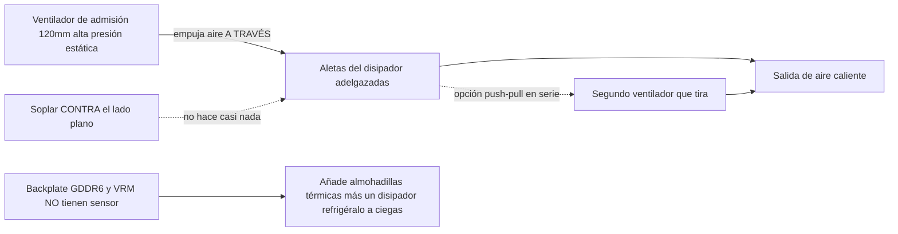

> 🌐 Traducción de la comunidad. La versión en inglés es la fuente de verdad y puede estar más actualizada. ¿Encontraste un error? Abre un issue: [../en/04-cooling.md](../en/04-cooling.md) · https://github.com/lildebil0/awesome-bc250/issues

# Refrigeración

> **TL;DR** — El disipador de serie de la BC-250 fue diseñado para el túnel de aire forzado de un rack de servidores, no para un escritorio. Tal como viene, hace throttling. El arreglo de la comunidad: **adelgazar las densas aletas de serie** (limarlas/lijarlas) y atornillar un **ventilador de 120 mm de alta presión estática** (el **Arctic P12 Max/Pro** es la referencia; el Noctua NF-P12 redux es la alternativa silenciosa premium) que sople *a través* de ellas. Eso por sí solo lleva una placa modificada a **~73 °C en Furmark, 63–65 °C en juegos**. Los AIO líquidos y las cajas totalmente personalizadas son los siguientes niveles.

La refrigeración es **lo número 1 que un recién llegado hace mal**, así que hazlo antes de perseguir overclocks.

---

## Por qué el disipador de serie no es suficiente

La BC-250 es una placa de minería/servidor. Su disipador es **pasivo** y está diseñado para ir dentro de un chasis donde ventiladores ruidosos fuerzan el aire de adelante hacia atrás a través de él. En un escritorio sin flujo de aire se satura de calor y la GPU hace throttling. Soplar un ventilador *contra* el lado plano no hace casi nada — el aire tiene que viajar **a través de los canales de aletas**, además de pasar sobre el backplate (la GDDR6 de la parte trasera **no tiene sensor de temperatura**, así que la refrigeras a ciegas).

Límites observados por la comunidad: el throttling empieza alrededor de **85 °C**, el cuelgue/reset duro alrededor de **90 °C**. Mantén las temperaturas de carga por debajo de ~80 °C con margen.

> **Existen tres variantes de disipador** (aletas de 8 filas y de 9 filas). Identificación rápida: un **código QR junto al conector PCIe de 8 pines** marca la variante de 9 filas. La variante con **menos aletas y de calibre más grueso** puede refrigerar un poco mejor de serie. ([elektricM Cooling](https://elektricm.github.io/amd-bc250-docs/hardware/cooling/))

**Objetivos de temperatura por componente** (cifras probadas por elektricM, de grano más fino que los límites de throttle/cuelgue de arriba):

| Componente | Reposo | Carga ligera | Juegos | Máx |
|-----------|------|-----------|--------|-----|
| Borde GPU/APU | 40–50 °C | 50–60 °C | 65–80 °C | 90 °C |
| CPU (Tctl) | 45–55 °C | 55–65 °C | 70–85 °C | 95 °C |
| Memoria (parte inferior) | 40–55 °C | 50–65 °C | 55–70 °C | 80 °C |
| NVMe/SSD | 40–55 °C | 50–65 °C | 60–75 °C | 80 °C (crítico 81.8 °C) |

Apunta a **70–80 °C de GPU en juegos**. El tope del NVMe importa aquí porque **la GDDR6 y el SSD M.2 comparten el caliente lado trasero de la placa** — el SSD se sitúa en el peor punto térmico y puede cocinarse, así que vigílalo (`80 °C` máx, `81.8 °C` crítico según la especificación de la unidad). ([elektricM: sensors](https://elektricm.github.io/amd-bc250-docs/system/sensors/))

> **Escala del CPU Tctl.** elektricM marca **90 °C Tctl** como el punto recomendado para echarse atrás; los **95 °C** de la tabla son el borde superior que aún verás bajo juego pesado; **TJmax = 100 °C** es el límite absoluto del silicio (la tabla de potencia del paquete de más abajo fija la CPU exactamente ahí bajo una corrida de estrés sostenida). Así que: **90 °C = "échate atrás ya", 95 °C = "entrando en rojo", 100 °C = "contra el muro".** ([elektricM: sensors](https://elektricm.github.io/amd-bc250-docs/system/sensors/))

> **Potencia del paquete por estado térmico** (elektricM empareja cada estado con un consumo de potencia de la placa): Reposo **50–70 W**, Ligera **100–150 W**, Pesada **150–200 W**, Estrés **200–235 W**. Útil para dimensionar la PSU y leer lo duro que la placa realmente está trabajando desde la toma de corriente. ([elektricM: sensors](https://elektricm.github.io/amd-bc250-docs/system/sensors/))

> **Artefactos de píxeles durante el juego = sobrecalentamiento de la VRAM.** Como la GDDR6 del lado trasero no tiene sensor, ese fallo visual es tu señal de aviso — añade flujo de aire/almohadillas al backplate (más abajo). ([elektricM Cooling](https://elektricm.github.io/amd-bc250-docs/hardware/cooling/))

> **Lotería del silicio — presupuesta margen térmico por chip.** Dos placas físicamente idénticas, chasis y configuración de OC idénticos, pueden funcionar con **5–10 °C de diferencia**, y la más caliente siguió más caliente incluso tras volver a aplicar pasta/almohadillas. No asumas que las temperaturas de otra persona coincidirán con las tuyas. ([r/BC250Gaming](https://www.reddit.com/r/BC250Gaming/))



---

## El cómputo sostenido es un régimen distinto (no solo ráfagas de juego)

Los objetivos de arriba asumen **juego**, donde la carga llega en ráfagas. El cómputo **sostenido** — un `llama-bench` en bucle, corridas largas de Stable-Diffusion, cualquier cosa que clave la GPU durante decenas de minutos, **especialmente con el [desbloqueo de 40 CU](09-overclock-undervolt.md)** — es una carga mucho más dura y puede exceder lo que aguanta un sistema de refrigeración de nivel gaming.

elektricM midió un disipador de serie + **dos Arctic P12 Max en push–pull**, `llama-bench` sostenido de 10 min a **40 CU / 2 GHz**:

| Métrica | Promedio | Pico |
|--------|---------|------|
| Borde GPU | 89.6 °C | 107 °C |
| Potencia del paquete | 136 W | 223 W |
| CPU | 96.7 °C | 100 °C (TJmax) |
| MOSFETs del VRM | 57 °C | 58.5 °C |
| Velocidad del ventilador | ~2950 RPM | 2977 RPM (tope) |

El rendimiento decayó **~10 %** a lo largo de la corrida a medida que el paquete hacía throttling. Conclusión: **el disipador de serie + dos P12 Max no dan suficiente margen para 40 CU @ 2 GHz sostenidos** — y nota que los **VRM no están ni cerca de su límite** (57 °C), así que el cuello de botella es *el disipador disipando calor*, no los ventiladores ni la etapa de potencia. Dos arreglos: **limita el governor de la GPU a 1500 MHz** (40 CU aún escala ~1.5× de cómputo, las temperaturas se mantienen ~83 °C — sostenible indefinidamente con dos P12 Max), o **mejora el disipador** (más área de aletas). Para **juego de serie a 24 CU**, dos P12 Max van cómodos; el muro solo aparece bajo cómputo sostenido a CU completos. ([elektricM Cooling](https://elektricm.github.io/amd-bc250-docs/hardware/cooling/))

---

## Camino A — Mod por aire (el más popular, el más barato)

Esto es lo que corre la mayoría del chat.

### 1. Adelgazar/limpiar las aletas de serie
Las aletas de serie son demasiado densas y a menudo desiguales. La gente abre los canales para que el aire pueda pasar:

- **Lijadora orbital (excéntrica)** — la más rápida, hecha en minutos, mejor resultado. ([src](https://t.me/c/2424231195/31571))
- **Papel de lija a mano** — grano 60 y luego grano 240, ~3–4 h + 2 h en dos días. Funciona pero lento. ([src](https://t.me/c/2424231195/50330))
- **Tijeras / alicates de corte** — método burdo de "чекрыжить", último recurso; los resultados son los peores. ([src](https://t.me/c/2424231195/41252))
- **Tijeras + guía de regla (variante limpia)** — desliza tijeras de manualidades/peluquería en el hueco entre aletas con una **regla en ángulo contra la hoja como guía**; una navaja de bolsillo tipo "abrelatas" funciona igual de bien. Advertencia: algunas variantes de placa **no tienen hueco para iniciar la hoja** — abre uno haciendo palanca con un destornillador/pinzas, o corta una ranura de entrada con una **pequeña rueda de corte Dremel**. Hojas más anchas que las ranuras de las aletas pueden dañar el disipador. ([r/BC250Gaming](https://www.reddit.com/r/BC250Gaming/))
- Endereza las aletas dobladas con **pinzas planas + alicates**. ([src](https://t.me/c/2424231195/30670))
- **Arrancar las aletas a mano** — elektricM señala que las blandas aletas de aluminio se pueden **rasgar/arrancar limpiamente a mano** (con el disipador fuera de la placa), evitando la viruta metálica que crean las herramientas de corte. Más lento pero sin residuos. ([elektricM Cooling](https://elektricm.github.io/amd-bc250-docs/hardware/cooling/))
- **"Scooper by Justin"** — una **herramienta imprimible en 3D hecha específicamente para presionar/abrir las aletas del disipador de la BC-250** ([Printables 1282906](https://www.printables.com/model/1282906-bc-250-scooper)). Más segura que un destornillador pelado: te impide empujar demasiado fuerte y rayar la **base** del disipador entre las aletas. ([hilo de la comunidad r/linux_gaming](https://www.reddit.com/r/linux_gaming/comments/1nvsgji/)) Ajusta expectativas: un propietario reportó que la **herramienta "peine/scooper" impresa se rompió al 2.º uso** y agarrotaba las manos. ([r/BC250Gaming](https://www.reddit.com/r/BC250Gaming/))
- **Alicates de hobby — método de "pelado"** — agarra la **parte superior** de las aletas con pequeños alicates de hobby y pélalas, **usando la propia memoria del metal como punto de ruptura** para que se rompan limpiamente en el doblez en lugar de rasgar la base. Una alternativa con pocos residuos frente al corte. ([hilo de la comunidad r/linux_gaming](https://www.reddit.com/r/linux_gaming/comments/1nvsgji/))

Rendimiento aproximado en temperatura (elektricM): **enderezar aletas dobladas ~5–10 °C**, **quitar aletas centrales ~10–15 °C** (irreversible — un buen shroud de ventilador logra ganancias similares sin cortar), **pasta fresca ~5–10 °C** si la pasta vieja se había secado. ([elektricM Cooling](https://elektricm.github.io/amd-bc250-docs/hardware/cooling/))

> ⚠ **Quita el disipador de la placa primero** (o enmascara/protege por completo la placa y el die) antes de lijar/limar, y **limpia hasta la última mota de polvo metálico antes de reensamblar**. La viruta metálica conductora que se deposita sobre la placa puede cortocircuitarla y **matar la placa** — esto ya ha pasado en el chat.

<p align="center">
  <br>
  <sub>Foto: comunidad AMD BC-250 · <a href="https://t.me/c/2424231195/31571">fuente</a></sub>
</p>

### 2. Atornillar un ventilador de verdad
Monta un **ventilador de 120 mm de alta presión estática** empujando aire a través de las aletas. La elección de referencia es el **Arctic P12 Max (o P12 Pro)** — la mayor presión estática (~6.9 mm H₂O), la elección de la comunidad + elektricM para este disipador denso. El **Noctua NF-P12 redux** es la alternativa silenciosa premium, y publicó un resultado de referencia de **máx 73 °C en Furmark, 63–65 °C en juegos** ([src](https://t.me/c/2424231195/42843)).

**Elecciones concretas de ventilador con especificaciones** (elektricM — elige por *presión estática*, no por flujo de aire):

| Ventilador | Tamaño | RPM máx | Presión estática | Flujo de aire | Ruido | Temps en juegos |
|-----|------|---------|----------------|---------|-------|--------------|
| **Arctic P12 Max** | 120 mm | 3300 | **6.9 mm H₂O** | 73.3 CFM | 52.5 dB(A) | 65–75 °C |
| **Arctic P12 Pro** | 120 mm | 2100 | **6.9 mm H₂O** | 68.9 CFM | 37.8 dB(A) | 65–75 °C |
| Arctic P14 PWM | 140 mm | 1700 | 2.40 mm H₂O | 72.8 CFM | 38 dB(A) | 70–80 °C |
| Noctua NF-A12x25 | 120 mm | 2000 | 2.34 mm H₂O | 60.1 CFM | 22.6 dB(A) | 70–85 °C |

La **elección más recomendada de elektricM es el Arctic P12 Max / P12 Pro** — sus ~6.9 mm H₂O de presión estática empequeñecen los 2.34 mm del Noctua y es mucho más barato; el P12 Pro es la versión más silenciosa y de mayor disponibilidad. El Noctua premium es aún más silencioso pero solo iguala al Arctic en temperaturas a mayores RPM. ([elektricM Cooling](https://elektricm.github.io/amd-bc250-docs/hardware/cooling/))

**Otros ventiladores nombrados de builds de la comunidad** (modelos específicos que la gente montó, más allá de la referencia Arctic/Noctua-P12):

- **Noctua NF-A12x25 G2** (PWM) como el **ventilador de 120 mm para el die** — la revisión G2 más nueva del A12x25, usado como ventilador principal ([TiredDadTech](https://youtu.be/zi7sldeRd2w)). (La tabla de ventiladores de arriba lista solo el NF-A12x25 *original*.)
- **Noctua NF-A6x15 PWM** (≈3500 rpm) como **cambio de ventilador de 60 mm de la PSU** — el reemplazo silencioso de un ventilador chillón de fuente de servidor ([TiredDadTech](https://youtu.be/zi7sldeRd2w)).
- **Thermalright 120 mm 1550 rpm ARGB** como ventilador económico para el die, y **almohadillas térmicas de 6.0 W/mK** para el backplate — ambos de un **BOM de build TMG HD** ([resumen del build](https://youtu.be/OEO0r01zcfU)).

> **Referencia frente a alternativa silenciosa.** El **Arctic P12 Max/Pro** es el ventilador de referencia aquí — la mayor presión estática (~6.9 mm H₂O), el más barato, la elección de la comunidad + elektricM para este disipador denso. El **Noctua NF-P12 redux** es la alternativa silenciosa premium (el resultado de 73 °C en Furmark del chat), igualando al Arctic en temperaturas solo a mayores RPM. Elige Arctic por la mejor relación precio/rendimiento, Noctua si lo silencioso es lo más importante.

Usa un **shroud/adaptador de ventilador impreso** para que el ventilador selle contra el disipador en lugar de fugar aire por los lados. STLs de la comunidad:
- `Fan_Shroud_Single_120mm.stl`, `Fan_Shroud_Dual_120mm.stl`, `Fan_Shroud_Single_140mm.stl`, `Twin_120mm_Fan_Shroud.stl`
- `BC250_FanAdapter_120mm.step`, `bc250 cooler mount.stl`, `cooler adapter v3.0.stl`

> **¿Por qué la presión estática y no la cifra de flujo de aire?** Las aletas densas son una carga de alta resistencia. Un "ventilador de caja" de alto flujo de aire se cala contra ellas; un ventilador de alta presión estática (≥3 mm H₂O; Noctua P12, Arctic P12) sí empuja el aire *a través*. Para aletas muy densas, dos ventiladores en **push–pull (en serie)** duplican la presión estática — esa es la jugada correcta aquí, no dos ventiladores lado a lado.

**Montaje:** un shroud impreso es lo mejor, pero **sujetar el ventilador con bridas (zip ties)** al disipador funciona, y un **conducto de cartón/foam-board** pegado con cinta entre el ventilador y las aletas es una alternativa gratuita válida (fea, no duradera, pero sella el camino del aire). ([elektricM Cooling](https://elektricm.github.io/amd-bc250-docs/hardware/cooling/))

> ⚠ **No taladres/atornilles ventiladores directamente en las aletas.** El aluminio es blando y las aletas son finas — atornillar en ellas daña el bloque de aletas y perjudica la refrigeración. Usa bridas o un shroud impreso. ([elektricM Cooling](https://elektricm.github.io/amd-bc250-docs/hardware/cooling/))

> ### 🛠 Ingeniería del flujo de aire — lo que realmente mueve la aguja
>
> Hallazgos de la comunidad sobre *cómo* se mueve el aire, no solo qué ventilador:
>
> - **La presión estática gana al CFM bruto** a través del denso bloque de aletas — por eso el de alta presión estática **Arctic P12 Max (6.9 mm H₂O)** supera a ventiladores más silenciosos de alto flujo/baja presión en este disipador.
> - **Un ventilador centrado puede ganarle a dos lado a lado** en un plano de aletas totalmente cortado: un único ventilador central carga directamente los **4 heat pipes centrales**, mientras que dos ventiladores dejan una "costura" muerta de plástico sobre el centro. El builder que primero cortó las aletas a plano completo midió un par de °C **menos** con un ventilador central que con dos ([src](https://t.me/c/2424231195/46175)). Un despiece llega a la misma conclusión desde el lado del flujo de aire: **dos ventiladores atornillados lado a lado no son mejores que uno** porque se forma una **zona muerta justo sobre el caliente centro del die** donde se encuentran las dos admisiones — **deja un hueco entre ellos, o ve a push-pull en su lugar** ([Old Lamer — Part VII](https://youtu.be/pxahl9-YgkY) ~19:55). *(Procedente de subtítulos — trátalo como cualitativo, no exacto.)*
> - **Suelo de velocidad de ventilador de 120 mm ≈1800 RPM** para de verdad mover aire a través de este bloque denso; el **Arctic P12 Pro** ($8–10, rango **600–3000 rpm**) es una elección fácil que va silencioso en reposo y aún tiene margen ([Old Lamer — Part VII](https://youtu.be/pxahl9-YgkY)). *(Cifras ASR — aproximadas.)*
> - **Añadir un ventilador de extracción = −3 a −5 °C.** Solo admisión **73 °C** → con extracción **67–68 °C** ([src](https://t.me/c/2424231195/68183), [src](https://t.me/c/2424231195/31553)). Así que el setup simple óptimo es **1 admisión central + 1 extracción trasera**, no dos admisiones lado a lado.
> - **El backplate es ciego y caliente.** Los MOSFETs del VRM alcanzan **~100 °C sin refrigerar** ([src](https://t.me/c/2424231195/110955)) — **debe** llevar almohadillas + disipadores + flujo de aire dedicado; con disipadores traseros funciona *"frío bajo carga"* ([src](https://t.me/c/2424231195/93056)).
> - **Física gratis.** El aire caliente sube, así que incluso una orientación de **inclinación/chimenea** ayuda — un backplate apenas ventilado midió **47 °C solo por convección** ([src](https://t.me/c/2424231195/76962)). Y un **radiador anodizado en negro irradia ~1.8×** lo que uno pulido, permitiéndote reducir el área de aletas **~45 %** en builds compactos pasivos/semipasivos ([src](https://t.me/c/2424231195/86878)).
> - **Corre admisión > extracción** (ligera **presión positiva**) para que el VRM/VRAM sin sensor sigan bañados en aire fresco.

### Alternativa: conservar las aletas de serie (caja push-pull sin cortar)
Cortar las aletas no es obligatorio. **penzoiders** diseñó una caja ([MakerWorld, fuente FreeCAD](https://makerworld.com/models/2505974)) que **no** corta el disipador: usa **ventiladores de alta presión estática en push-pull** para forzar aire a través de las aletas **de serie, sin modificar**, más un **diferencial de presión de dos cámaras** que también refrigera el backplate (disipadores de 5 mm + almohadillas térmicas; sirven disipadores de NVMe reutilizados). Un ajuste que se mantiene fresco: **CPU 3800 MHz / 1050 mV, GPU 2100 MHz / 950 mV** → Furmark + `stress-ng` en paralelo se mantiene **por debajo de 85 °C**; juego **~75 °C a aproximadamente 50 % de duty del ventilador** (curva de CoolerControl), "apenas audible". ([r/BC250Gaming](https://www.reddit.com/r/BC250Gaming/))

## Camino B — Refrigeración líquida AIO

Un AIO de 120 mm montado al die mediante un soporte adaptador. Silencioso y frío, pero más piezas y coste. Los builds populares usan AIOs baratos (p. ej. aigo). ([src de ejemplo](https://t.me/c/2424231195/19336))

<p align="center">
  <br>
  <sub>Foto: comunidad AMD BC-250 · <a href="https://t.me/c/2424231195/19336">fuente</a></sub>
</p>

**Soporte de AIO nombrado y descargable — NexGen3D** ([Printables 1554003](https://www.printables.com/model/1554003), imprímelo en ABS-GF o PETG). Verificado con un **AIO Thermalright de 240 mm**: GPU **~50 °C @ 2000 MHz**, CPU **máx 60 °C**. ([r/BC250Gaming](https://www.reddit.com/r/BC250Gaming/))

### Perfiles de overclock con refrigeración líquida
Con un AIO puedes apretar mucho más. **NexGen3D** medido desde la toma de corriente (Furmark Vulkan + `stress-ng --matrix 0 -t 60m` como combo de quemado):

| Perfil | CPU | GPU | Temp máx de quemado | Potencia de la toma | Nota |
|---------|-----|-----|---------------|------------|------|
| 1 | 4000 MHz | 2400 MHz | ~65 °C | >350 W | "silencio total" |
| 2 | 4100 MHz | 2450 MHz | ~75 °C | <400 W | más caliente, más ruidoso |

El juego normal a 1080p corre **10–15 °C por debajo** de estas temperaturas de quemado y **bajo 250 W** en el Perfil 1. **Esquema de flujo de aire que vale la pena copiar:** los ventiladores de 120 mm **expulsan a través del radiador**, lo que tira aire externo fresco hacia adentro a través de los **VRMs / PSU / backplate de la VRAM**; un **ventilador de 80 mm aparte (Arctic P8 Max)** refrigera los VRMs de la GPU — esto responde al aviso de "el VRM/VRAM sin sensor todavía necesitan flujo de aire" de más arriba. ([r/BC250Gaming](https://www.reddit.com/r/BC250Gaming/))

## Circuito de agua personalizado (avanzado)

Más allá de un AIO cerrado, unas pocas personas corren un **loop personalizado completo**. Es una escena real pero **DIY/de experto**: los builders **fresan por CNC o sueldan un bloque de agua personalizado** que cubre el **die *y* el VRM** en un solo bloque ([src](https://t.me/c/2424231195/131065), [src](https://t.me/c/2424231195/131844), [src](https://t.me/c/2424231195/118582)). Los racores no son críticos — *"puedes conseguir, tornear o pegar casi cualquiera"* ([src](https://t.me/c/2424231195/132007)).

**Lo que te aporta:** un loop personalizado tosco alcanza **~50 °C bajo carga con los ventiladores a solo 30 %, la bomba externa casi silenciosa** ([src](https://t.me/c/2424231195/133040)). (Un builder notó luego coil whine de las bobinas del VRM bajo carga en la configuración de governor por defecto de cyan-skillfish — un problema *aparte*, no térmico.) Además **no necesitas un Corsair Commander**: el propio [control de ventiladores](#controlar-la-velocidad-del-ventilador-software) de la BC-250 puede manejar la bomba más **~5 ventiladores** ([src](https://t.me/c/2424231195/140123)).

> ⚠ **Por qué esto es "avanzado": la BC-250 no sobrevive a una inundación de refrigerante.** Fallos reales de la comunidad: una manguera se **dobló a 90°, reventó e inundó la GPU y la PSU** ([src](https://t.me/c/2424231195/81158)); una **bomba AIO Corsair agarrotada cocinó la CPU** ([src](https://t.me/c/2424231195/133147), [src](https://t.me/c/2424231195/126053)). Vigila también la **cavitación/ruido de la bomba por encima de ~50 % de velocidad de bomba** ([src](https://t.me/c/2424231195/7034)). **Haz una prueba de fugas de todo el loop FUERA de la placa durante 24 h antes del primer encendido en húmedo.**

**Veredicto:** las temperaturas más bajas y el más silencioso de cualquier opción, y permite 40-CU sostenidos — pero el mayor riesgo y esfuerzo. **No es un primer build.**

## Camino C — Blower ("улитка") — no recomendado

Los ventiladores blower rescatados de GPUs fueron un experimento temprano. Ruidosos para el resultado; la gente se pasó al Camino A. ([src](https://t.me/c/2424231195/100086))

## Camino D — Conversión a cooler de torre (avanzado)

Algunos usuarios atornillan un **cooler de torre AM4** (p. ej. **Thermalright Peerless Assassin**, u otras torres AM4/AM5) sobre el die para una refrigeración excelente y silenciosa usando hardware comercial. El truco: debes **montarlo mediante un soporte**, y una torre alta puede **bloquear la ranura M.2 u otros componentes**. No es un mod de principiante. Ya no tienes que fabricar uno desde cero — existen dos soportes impresos en 3D publicados:

- **Adaptador para cooler de escritorio AM4/AM5** ([MakerWorld 2596083](https://makerworld.com/en/models/2596083), fuente FreeCAD incluida). Monta un cooler de escritorio AM4/AM5 estándar a la BC-250. Sujeción: **pernos M5 + tuercas, sin separadores** (el OP nota que M4 sería ideal pero M5 entró justo). Imprímelo en **ABS, PETG o ASA**. Verificado a **CPU 3.95 GHz / 1.150 V, GPU 2200 MHz / 1000 mV, temperaturas sin exceder 80 °C**. Coolers usados: un **AXP90-class** de bajo perfil (un comentarista usó un **AXP120**), e incluso un **AMD Wraith Spire** le ganó al disipador de serie. ([r/BC250Gaming](https://www.reddit.com/r/BC250Gaming/))
- **Montaje para Thermalright AXP90-X53** ([Printables 1694793](https://www.printables.com/model/1694793)). Los insertos roscados se **sueldan en la parte inferior** del soporte impreso para que **reutilices los tornillos originales con resorte del disipador de serie**; los pernos de cabeza de botón suben desde abajo y van avellanados, y el soporte tiene un **hueco de 0.5 mm bajo el brazo** para librar componentes de la placa. Diseñado en Fusion 360, **imprímelo en PETG** (el PLA se ablanda a estas temperaturas). Resultado: **65–67 °C a plena carga @ 2150 MHz, 1080p**, muy silencioso (cooler de cobre, emparejado con un Arctic P12 Pro de 120 mm). Altura de stack medida de **54 mm desde el PCB hasta la parte superior del ventilador de 15 mm** — útil para el encaje en la caja. También existen un **set de variantes de 3 grosores** y una versión **AXP120-X67**. ([r/BC250Gaming](https://www.reddit.com/r/BC250Gaming/))

---

## Controlar la velocidad del ventilador (software)

Una vez que un ventilador está atornillado, controlas su PWM a través del chip Super I/O **Nuvoton NCT6686D** de la placa — pero **importa qué driver cargues** ([especificación de hardware de elektricM](https://elektricm.github.io/amd-bc250-docs/)):

- **Sensores de solo lectura** (RPM del ventilador, temperaturas): el módulo del kernel **`nct6683`**, cargado con `force=true`. Reporta lecturas pero **no puede escribir PWM**, así que el ventilador se queda a lo que fije la BIOS/firmware.
- **Lectura + escritura de PWM** (fijar de verdad la velocidad del ventilador): usa el módulo fuera del árbol **`nct6687`** de **[Fred78290/nct6687d](https://github.com/Fred78290/nct6687d)**, también con `force=true`. Este es el que hay que compilar si quieres curvas de ventilador / control manual de velocidad en lugar de solo monitorización.

```bash
# monitoring only (in-kernel):
echo 'options nct6683 force=true' | sudo tee /etc/modprobe.d/nct6683.conf
# PWM control (DKMS from Fred78290/nct6687d):
echo 'options nct6687 force=true' | sudo tee /etc/modprobe.d/nct6687.conf
```

> No cargues ambos — elige `nct6683` para sensores de solo lectura o `nct6687` para lectura+escritura. El cableado de sensores (`CPU_FAN1` / `J4003`) y la numeración de ventiladores BIOS↔Linux están en el paso de verificación de [06-linux.md](06-linux.md).

**¿Qué header es el ventilador principal?** elektricM reporta que el ventilador de refrigeración suele estar en el header **Pump Fan** = **`fan2` / `pwm2`** en sysfs; `CPU Fan` (`fan1`) y los headers `System Fan` (`fan3`+) normalmente no se usan. Habilita el modo manual antes de escribir PWM (`echo 1 > .../pwm2_enable`, luego un valor de 0–255 a `.../pwm2`). La numeración de hwmon puede cambiar entre reinicios — confírmala con `cat /sys/class/hwmon/hwmon*/name`. ([elektricM Cooling](https://elektricm.github.io/amd-bc250-docs/hardware/cooling/))

**Curvas de ventilador con una GUI — CoolerControl.** Una vez cargado `nct6687`, **CoolerControl** te da curvas de ventilador gráficas: selecciona el dispositivo **nct6686**, construye una curva en **pwm2** usando **k10temp Tctl** como fuente. Instalación: `ujust install-coolercontrol` (Bazzite), el copr `codifryed/CoolerControl` (Fedora), o `coolercontrol` del AUR (Arch); interfaz web en `https://localhost:11987`. ([elektricM Cooling](https://elektricm.github.io/amd-bc250-docs/hardware/cooling/))

**Modos de ventilador de la BIOS** (si no corres control desde el OS): **Default** mantiene los ventiladores a un **mínimo de 40 %** (demasiado bajo — no recomendado), **Full Speed** los clava al 100 % (ruidoso pero seguro), **Customize** fija velocidades por umbral. ([elektricM Cooling](https://elektricm.github.io/amd-bc250-docs/hardware/cooling/))

> ⚠ **No corras el modo Customize de la BIOS y CoolerControl al mismo tiempo** — pelean por el control del PWM. Elige uno. ([elektricM Cooling](https://elektricm.github.io/amd-bc250-docs/hardware/cooling/))

---

## Interfaz térmica (pasta, almohadillas, cambio de fase, metal líquido)

Sea cual sea el ventilador/disipador que corras, vale la pena acertar con el **material de interfaz térmica (TIM)** entre el die y el disipador — y entre la parte trasera de la placa y cualquier radiador de backplate. El die de la BC-250 tiene una **alta densidad de calor**, así que un buen TIM son unos grados gratis.

> **Solo cambiar la pasta de serie ayuda.** Un propietario cambió la pasta de fábrica tras un año y las temperaturas de carga bajaron **~4–5 °C**, con todo lo demás sin cambios. ([src](https://t.me/c/2424231195/88565))

### Pastas que funcionan
- **Arctic MX-6** — una pasta de gama alta normal. En un build con caja se mantuvo en **87–88 °C en Furmark**; el mismo propietario notó que PTM7950 le quitaría otros ~4 °C a eso. ([src](https://t.me/c/2424231195/30211))
- **Pasta de serie + almohadillas de serie** son la línea base documentada: ~**76 °C** tras 10 min de carga, ~**55 °C** en reposo (antes del mod de aletas/ventilador). ([src](https://t.me/c/2424231195/22992))
- Otras pastas que elektricM lista como adecuadas aquí: **Arctic MX-4** (relación calidad-precio), **Thermal Grizzly Kryonaut** (premium), **Noctua NT-H1** (fiable), **Thermalright TFX** (económica). La pasta de una placa usada está **a menudo reseca** — solo volver a aplicar pasta vale **~5–10 °C**. Aplica un punto del tamaño de un guisante sobre el die, monta de forma uniforme, aprieta los tornillos en **patrón de X**. ([elektricM Cooling](https://elektricm.github.io/amd-bc250-docs/hardware/cooling/))

### PTM7950 — el favorito de la comunidad (recomendado)
**PTM7950** es una **almohadilla de cambio de fase** (película de grafito/cambio de fase de Honeywell). A temperatura ambiente es una fina lámina sólida; bajo carga (~45–55 °C) se ablanda y fluye en una capa de micras de grosor, y luego se queda en su sitio. **No se bombea hacia afuera** ni se seca como la grasa, que es exactamente lo que quieres bajo un die caliente que cicla térmicamente — así que lo aplicas una vez y te olvidas. El resumen contundente del chat: *"PTM7950 y no le des más vueltas"* ([src](https://t.me/c/2424231195/101582)); el cambio de fase es la recomendación general ([src](https://t.me/c/2424231195/61511)).

**Cómo aplicarlo:**
1. Limpia el die y la base del disipador (alcohol isopropílico), deja secar.
2. Corta un cuadrado de PTM7950 al tamaño del die — una pieza de **~26×30 mm** cubre el die de la BC-250 ([src](https://t.me/c/2424231195/125748)).
3. Despega una película protectora, coloca la almohadilla sobre el die, despega la segunda película.
4. Monta el disipador y aprieta de forma uniforme. **Sin esparcir** — el primer ciclo de calor hace el trabajo. Espera las mejores temperaturas tras unos cuantos ciclos de carga/reposo ("burn-in").

Un build de referencia con caja sobre PTM7950 (Honeywell, 26×30) más un radiador de backplate hace pico de **~84 °C a lo largo de una hora, 66–71 °C en juegos** a CPU 3850 MHz / GPU 2100 MHz. ([src](https://t.me/c/2424231195/125748))

> **Emparejamiento nombrado: masilla Upsiren bajo el disipador + PTM7950 sobre el die.** Un vídeo de build empareja **masilla térmica Upsiren UTP-6 / UTP-8** (el grado **UTP-8** está valorado en ≈**14.8 W/mK**) para los puntos de relleno de huecos con una **lámina de PTM7950 cortada a 40×80×0.25 mm** colocada sobre el die ([vídeo PTM7950 + Upsiren](https://youtu.be/FJapqZSdt6I)). La masilla es para rellenar huecos desiguales hacia un disipador/placa; la película de cambio de fase va sobre el die en sí.
>
> - **El PTM7950 barato de AliExpress funciona.** Se verificó que una lámina de AliExpress de ~**$13** rinde — no necesitas el corte de marca Honeywell ([vídeo PTM7950 + Upsiren](https://youtu.be/FJapqZSdt6I)).
> - **El PTM7950 necesita rodaje.** Alcanza sus mejores temperaturas solo tras **varios ciclos de calor/enfriamiento** — no lo juzgues en la primera corrida ([demo de TIM en portátil](https://youtu.be/U4Zm8msXJHM)).
>
> *(Ambas fuentes son de subtítulos automáticos — trata los W/mK y dimensiones exactos como aproximados.)*

### Almohadillas para backplate y GDDR6 (refrigera la parte trasera, a ciegas)
La **GDDR6 y el VRM de la parte trasera de la placa no tienen sensor de temperatura** — los refrigeras a ciegas. Añade un **disipador/radiador en el backplate** acoplado con **almohadillas térmicas** para que el calor del lado trasero tenga a dónde ir. ([src](https://t.me/c/2424231195/125748)) Un builder ruso simplemente agarró un **disipador de Yandex.Market**, lo pegó al backplate, y **refrigeró bien la placa inferior** — cualquier disipador de aluminio de tamaño razonable hace el trabajo aquí ([4pda — mananoid1](https://4pda.to/forum/index.php?showtopic=1104980)).

Grosores de almohadilla reportados (compartidos por la comunidad, reacción de "guardé esto"):
- **VRM: 1 mm**
- **GDDR6: 2 mm** ([src](https://t.me/c/2424231195/121181))

> ⚠ **verifica** — estos grosores dependen del hueco hasta *tu* backplate/radiador específico. Confírmalo con una medición del hueco (o una prueba de masilla/plastilina) antes de comprar un montón de almohadillas.

elektricM da un **esquema de almohadillas ligeramente distinto** para refrigerar la memoria en sí: **almohadillas de 1.5 mm en el *frente* de la placa, 2.0 mm en la parte *trasera***, y luego una placa/disipador de aluminio en la parte inferior. Usa **solo almohadillas no conductoras** cerca de la placa (nunca pasta/almohadillas conductoras que podrían cortocircuitar componentes). Marcas de almohadilla que lista: **Thermalright Odyssey** (alto rendimiento), **Arctic Thermal Pad** (relación calidad-precio), **Gelid GP-Ultimate** (premium). ([elektricM Cooling](https://elektricm.github.io/amd-bc250-docs/hardware/cooling/))

> ⚠ **verifica (los grosores de almohadilla difieren entre fuentes)** — nuestras cifras del chat son **VRM 1 mm / GDDR6 2 mm (trasera)**; elektricM especifica **1.5 mm frontal / 2.0 mm trasera** para los chips de memoria. Builds distintos, huecos distintos — **mide tu propio espacio libre** en lugar de fiarte de cualquiera de las dos cifras a ciegas.

> **Cuelgues/inestabilidad tras 30–60 min de juego** (a menudo con artefactos de píxeles) es la firma clásica del **sobrecalentamiento de la memoria**. Arreglos: añade almohadillas + una placa inferior, añade un ventilador al backplate, mejora el flujo de aire de la caja, o **reduce temporalmente el reparto de VRAM** (p. ej. 4 GB → 512 MB) para cortar el calor de la memoria. ([elektricM Cooling](https://elektricm.github.io/amd-bc250-docs/hardware/cooling/))

### Metal líquido — en general NO recomendado aquí
El metal líquido (LM) surge porque la PS5 (APU de la misma familia) lo usa ([src](https://t.me/c/2424231195/18105)), y en rendimiento puro le saca ventaja a la pasta/PTM ([src](https://t.me/c/2424231195/124112)). La gente ha preguntado por él y lo ha probado en la BC-250 ([src](https://t.me/c/2424231195/18098), [src](https://t.me/c/2424231195/77180)).

**Pero es la decisión equivocada en esta placa:**
- El LM es **eléctricamente conductor**. El die de la BC-250 se sitúa justo al lado de **densa GDDR6 y VRM**; una gota que escape del die cortocircuita la placa (el mismo riesgo de "una cosa conductora cerca de la memoria la mata" que el aviso de la viruta metálica de más arriba).
- **Se bombea hacia afuera / hay que rehacerlo más o menos cada año**, y ataca el aluminio desnudo — incluso el defensor del PTM7950 abandonó el LM en su propio hardware exactamente por esta molestia, cambiándose a PTM7950 / KryoSheet. ([src](https://t.me/c/2424231195/69688))
- "Ni siquiera todo el mundo aceptará el trabajo de manipular metal líquido." ([src](https://t.me/c/2424231195/106787))

**En resumen:** **el PTM7950 es la opción de alto rendimiento más segura** — ~99 % del beneficio, nada del riesgo de cortocircuito/mantenimiento. Reserva el LM para gente que ya sabe exactamente lo que hace.

---

## Cómo probar tu refrigeración (método de la comunidad, fijado)

Del procedimiento fijado ([src](https://t.me/c/2424231195/108407)):

1. **Estrés de GPU:** Furmark (Vulkan / "Furmark VK").
2. **CPU al mismo tiempo:** añade un bench de CPU (cpu-x) o una carga basada en `stress`/`pipx` — la APU comparte un disipador, así que prueba ambos juntos.
   - Estas herramientas (Furmark, OCCT, cpu-x, `stress`) **no vienen preinstaladas** en una máquina Linux recién hecha — instálalas primero vía tu gestor de paquetes o Flatpak.
3. **Prueba bajo tu overclock**, no de serie — 1500 MHz es flojo; **2000 MHz es ~+30 % de FPS** y lo que de verdad correrás, así que refrigera para eso.
4. Vigila las temperaturas; si cruzas ~85 °C estás haciendo throttling — añade trabajo de ventilador/shroud/aletas.

> ℹ️ **No confundas dos afirmaciones distintas de "+30 %".** El **+30 % de reloj de GPU** de aquí (1500 → 2000 MHz subiendo los FPS más o menos un tercio) es una ganancia de *rendimiento* por overclocking. **No** es lo mismo que la **mejora térmica de ~+30 %** citada para un **re-paste** en una demostración aparte de TIM en portátil ([demo de TIM en portátil](https://youtu.be/U4Zm8msXJHM)) — esa es un resultado de *temperatura* en hardware distinto. El mismo número, cosas no relacionadas.

También hay un breve recorrido en vídeo del método más simple fijado en el tema. ([src](https://t.me/c/2424231195/100024))

---

## Setup inicial recomendado

| Nivel | Haz esto | Espera |
|------|---------|--------|
| Mínimo | Lijar aletas (lijadora orbital) + 1× Arctic P12 Max/Pro (o Noctua NF-P12) + shroud impreso | ~73 °C Furmark |
| Mejor | Push–pull (2× P12) a través del shroud | más bajo, más silencioso a la misma temperatura |
| Máx | AIO de 120 mm en adaptador | el más frío, más esfuerzo de build |

---

## Fuentes

- Método de prueba fijado — https://t.me/c/2424231195/108407 · vídeo — https://t.me/c/2424231195/100024
- Herramientas para aletas — https://t.me/c/2424231195/31571 · https://t.me/c/2424231195/30670 · https://t.me/c/2424231195/50330 · herramienta para aletas "Scooper by Justin" ([Printables 1282906](https://www.printables.com/model/1282906-bc-250-scooper)) + método de pelado con alicates de hobby — [hilo de r/linux_gaming](https://www.reddit.com/r/linux_gaming/comments/1nvsgji/)
- Resultado del Noctua P12 — https://t.me/c/2424231195/42843
- Ejemplo de AIO — https://t.me/c/2424231195/19336
- Interfaz térmica — re-paste −4–5 °C https://t.me/c/2424231195/88565 · MX-6 https://t.me/c/2424231195/30211 · línea base de serie https://t.me/c/2424231195/22992 · PTM7950 https://t.me/c/2424231195/101582 · https://t.me/c/2424231195/61511 · build con PTM7950 + backplate https://t.me/c/2424231195/125748 · grosor de almohadilla https://t.me/c/2424231195/121181 · metal líquido https://t.me/c/2424231195/18098 · https://t.me/c/2424231195/69688
- Guía de refrigeración de elektricM (variantes de disipador, tabla de temperaturas por componente, datos de carga sostenida, especificaciones de ventiladores, modos de ventilador de CoolerControl/BIOS, cooler de torre, esquema de almohadillas) — https://elektricm.github.io/amd-bc250-docs/hardware/cooling/
- [elektricM: sensors](https://elektricm.github.io/amd-bc250-docs/system/sensors/) (umbrales térmicos: CPU Tctl 90 °C máx / TJmax 100 °C, NVMe/SSD 80 °C máx / 81.8 °C crítico, potencia del paquete por estado térmico)
- r/BC250Gaming (reportes de la comunidad: variación de la lotería del silicio, método de aletas con tijeras+regla, rotura de la herramienta peine, caja push-pull sin cortar, soporte de AIO + resultado de 240 mm, perfiles de OC líquido, soportes AM4/AM5 + AXP90-X53) — https://www.reddit.com/r/BC250Gaming/ · adaptador de cooler AM4/AM5 [MakerWorld 2596083](https://makerworld.com/en/models/2596083) · montaje AXP90-X53 [Printables 1694793](https://www.printables.com/model/1694793) · soporte de AIO NexGen3D [Printables 1554003](https://www.printables.com/model/1554003) · caja push-pull sin cortar [MakerWorld 2505974](https://makerworld.com/models/2505974)
- Referencia de hardware — [mothenjoyer69/bc250-documentation `hardware.md`](https://github.com/mothenjoyer69/bc250-documentation/blob/main/hardware.md)
- Cajas/adaptadores con refrigeración — [onemorecap/bc-250-sleeve-adapter](https://github.com/onemorecap/bc-250-sleeve-adapter)
- Zona muerta de dos-ventiladores-lado-a-lado sobre el die / deja un hueco o push-pull, suelo de 120 mm ≈1800 RPM, Arctic P12 Pro ($8–10, 600–3000 rpm) — [Old Lamer — Part VII](https://youtu.be/pxahl9-YgkY) (subtítulos automáticos / ASR — cifras aproximadas)
- Masilla Upsiren UTP-6 / UTP-8 (UTP-8 ≈14.8 W/mK) + PTM7950 cortado a 40×80×0.25 mm sobre el die, PTM7950 barato de AliExpress (~$13) verificado — [vídeo PTM7950 + Upsiren](https://youtu.be/FJapqZSdt6I) · el PTM7950 necesita varios ciclos de rodaje de calor/enfriamiento + el "+30 %" aparte de re-paste (portátil, no el +30 % de reloj de GPU) — [demo de TIM en portátil](https://youtu.be/U4Zm8msXJHM)
- Ventiladores nombrados: Noctua NF-A12x25 G2 (ventilador de 120 mm para el die) + NF-A6x15 PWM 3500 rpm (cambio de ventilador de 60 mm de la PSU) — [TiredDadTech](https://youtu.be/zi7sldeRd2w) · Thermalright 120 mm 1550 rpm ARGB + almohadillas de 6.0 W/mK (BOM de build TMG HD) — [resumen del build](https://youtu.be/OEO0r01zcfU)
- Radiador de backplate ruso (un disipador de Yandex.Market refrigeró la placa inferior) — [4pda — mananoid1](https://4pda.to/forum/index.php?showtopic=1104980)

> Los STLs de shroud y adaptador de ventilador están catalogados en [05-case.md](05-case.md) y reflejados bajo `assets/stl/`.
