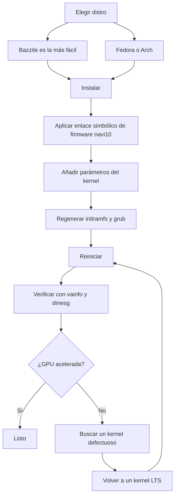

> 🌐 Traducción de la comunidad. La versión en inglés es la fuente de verdad y puede estar más actualizada. ¿Encontraste un error? Abre un issue: [../en/06-linux.md](../en/06-linux.md) · https://github.com/lildebil0/awesome-bc250/issues

# Drivers y configuración de Linux

> **TL;DR** — La mayoría de la gente ejecuta la BC-250 en Linux, y funciona bien *una vez que se arregla la GPU*. De fábrica `amdgpu` no reconoce el chip y obtienes renderizado por CPU, con FPS de un solo dígito. Dos cosas lo hacen real: un **kernel moderno + Mesa fresco (25.1+)**, y el **arreglo de `amdgpu`** — un enlace simbólico de firmware para que el driver pueda cargar (`navi10_gpu_info.bin` → `cyan_skillfish_gpu_info.bin`) más parámetros del kernel (`amdgpu.sg_display=0`, `mitigations=off`, y en kernels nuevos `amdgpu.bc250_cc_write_mode=3`). El camino más fácil para un principiante: flashear **[Bazzite](https://bazzite.gg/)** y hacer rebase a la imagen dedicada **`bazzite-bc250`** — los arreglos vienen integrados. ¿Quieres aprender la máquina?: **Fedora** o **CachyOS/EndeavourOS (Arch)** con un script de configuración de una sola vez.

Esta es la sección que convierte "una placa en una caja" en un escritorio funcional. Haz primero la [refrigeración](04-cooling.md) y la [alimentación](03-power-supply.md) — luego esto.

> **¿Nunca usaste Linux? Un kit de supervivencia de 60 segundos.**
> - **Abre una terminal:** busca una app llamada *Terminal* / *Konsole* (KDE) / *Console* en tu menú, o pulsa `Ctrl-Alt-T`.
> - **`sudo`** delante de un comando lo ejecuta como administrador. Te pedirá tu contraseña — y **mientras escribes, no aparece nada en pantalla** (ni puntos, ni asteriscos). Eso es normal; escríbela y pulsa Enter.
> - **`nano /etc/...`** abre un editor de texto plano en la terminal. Para guardar y salir: **Ctrl-O**, luego **Enter**, luego **Ctrl-X**.
> - **Copiar-pegar** en una terminal suele ser **Ctrl-Shift-V** (no Ctrl-V).
> - Muchos pasos solo surten efecto tras un **reinicio** (`systemctl reboot`). Cuando un paso diga "reinicia", reinicia de verdad antes de juzgar si funcionó.

---

## Lo único que debes entender

La GPU de la BC-250 es **Cyan Skillfish / Oberon** (una pieza RDNA2 derivada de la PlayStation 5). Históricamente `amdgpu` mainline **no tenía un blob de firmware con su nombre**, así que en una instalación de stock el kernel no puede inicializar la GPU y el escritorio recurre al renderizado por software (LLVMpipe) — todo va lento y `vulkaninfo` no muestra ningún dispositivo real. Un usuario pasó días con "drivers rotos" antes de darse cuenta de que su distro simplemente había arrancado un kernel que no podía cargar el firmware de la GPU ([fuente](https://t.me/c/2424231195/98466)).

Así que cada configuración funcional hace las mismas tres cosas, de una forma u otra:

1. **Ejecuta un kernel + Mesa lo bastante nuevos.** Mesa upstream añadió soporte para la BC-250 en **25.1** (sin parches necesarios desde entonces; **25.3.x** es el estable recomendado actual) — ([Mesa MR !33116](https://gitlab.freedesktop.org/mesa/mesa/-/merge_requests/33116), [fuente](https://t.me/c/2424231195/20891)). Los sensores de temperatura llegaron en el **kernel 6.15** ([fuente](https://t.me/c/2424231195/23542)); el kernel **6.18.18 LTS** es el punto óptimo actual.
2. **Dale a `amdgpu` el firmware que quiere** — en configuraciones actuales un **`linux-firmware`** al día ya incluye `cyan_skillfish_gpu_info.bin`; los sistemas más antiguos todavía necesitan el **enlace simbólico de navi10** (o un paquete parcheado de mesa/kernel). Consulta el Camino C.
3. **Pasa los parámetros del kernel correctos** y regenera el initramfs + el bootloader. (E instala el **governor de la GPU** para que los clocks no queden fijados a 1500 MHz.)

Todo lo que sigue no es más que *cómo* hace cada distro esas tres cosas.



---

## ¿Qué distro? (favoritas de las encuestas de la comunidad)

El chat vuelve una y otra vez a cuatro. No hay una única respuesta "correcta" — es un equilibrio entre *cero esfuerzo* y *entender tu máquina*. Los docs de elektricM prueban un campo más amplio; aquí están todas de un vistazo ([elektricM: distribuciones](https://elektricm.github.io/amd-bc250-docs/linux/distributions/)):

| Distro | Base | Esfuerzo | Arreglo de GPU | Mejor para |
|--------|------|----------|----------------|------------|
| **Bazzite** (imagen `bazzite-bc250`) | Fedora atomic | **El menor** — arreglos integrados | Preaplicado en la imagen | Principiantes, "solo jugar" |
| **Fedora 43** (Workstation / KDE) | Fedora | Bajo | Mesa 25.x en repos mainline + governor por COPR | Aprender Linux, mantenerte cerca del upstream |
| **CachyOS** | Arch | Medio | Mesa 25.1+ en repos + governor (AUR) | Máxima fluidez (planificador BORE), HDR+VRR |
| **EndeavourOS / Arch** | Arch | Medio | Mesa 25.1+ en repos + governor | Arch sin el dolor de la instalación |
| **Debian (Testing/Sid) / PikaOS** | Debian | Medio–Alto | Mesa desde `experimental` (Debian) / OOTB (PikaOS) | Estabilidad, **el menor consumo en reposo (~50–60 W)** |
| **Manjaro** | Arch | Medio | Mesa 25.1+ en repos; arranca OOTB tras flashear la BIOS | Arch fácil; GNOME es el más estable |
| **Alpine** | Alpine (OpenRC) | Alto | mesa + firmware + governor manuales | Mínimo/headless, ~150 MB RAM / ~35 W |
| **Fedora CoreOS** | Fedora atomic | Alto | host de contenedores; personalizaciones post-instalación | Servidores headless de contenedores/LLM |
| **SteamOS** (Valve) | Arch (inmutable) | Medio | Mesa desde la imagen de la **rama main** (no la stable) + governor | Sensación de Steam Machine real; sofá/Gaming Mode |
| **Batocera** | Linux (distro de emulación) | Bajo–Medio | Mesa incluido + configuración | Una caja de **emulación** estilo consola ([15-emulation.md](15-emulation.md)) |

Notas del chat y de [elektricM](https://elektricm.github.io/amd-bc250-docs/linux/distributions/):
- **Bazzite es la más fácil** y tiene una **imagen dedicada a la BC-250** con el arreglo del firmware, los parámetros del kernel, el governor de la GPU y el parche de 40 CU/frecuencia ya aplicados. Encuéntrala en artifacthub: [`bazzite-bc250`](https://artifacthub.io/packages/container/bazzite-bc250/bazzite_bc250). Varios usuarios se pasaron a ella precisamente para dejar de parchear a mano ([fuente](https://t.me/c/2424231195/121246)).
- **A partir de Fedora 43, Mesa 25.x está en los repos mainline** — el COPR `mixaill/amd-bc-250` ya no es necesario solo por Mesa. Fedora 42 está en **fin de vida (end-of-life)**; actualiza a la 43. Durante la instalación, si te aparece una pantalla en negro, usa *Troubleshooting → Install in Basic Graphics Mode* ([elektricM: Fedora](https://elektricm.github.io/amd-bc250-docs/linux/fedora/)).
- **No agarres a ciegas las distros "gamer".** Una opinión detallada argumenta que una **Fedora (Workstation/KDE)** simple o un **Arch vanilla con kernel LTS + Mesa fresco** es el término medio sin dolor, y que los forks muy ajustados a veces pueden *romper* Steam/FSR/vsync en lugar de ayudar ([fuente](https://t.me/c/2424231195/102834)). Trata esto como un consejo "a finales de 2025" — la imagen de Bazzite ha madurado desde entonces.
- **CachyOS antes que Bazzite, si persigues la máxima fluidez.** Un informe detallado de la comunidad de r/BC250Gaming (Reddit) cambió de Bazzite a **CachyOS** y encontró los juegos notablemente más fluidos sin importar la fuente, con menos stutters/microcongelaciones (p. ej. *Mortal Kombat 1*), menos cuelgues aleatorios y reinicios del modo Steam, y una sensación muy responsiva en la disposición **Btrfs por defecto**. También logró **HDR + VRR funcionando correctamente** donde Bazzite no pudo (el HDR daba fallos, el VRR nunca funcionó) — consulta [14-display.md](14-display.md). Trátalo como una experiencia bien documentada, no como un veredicto universal, pero es una opción fuerte si Bazzite te deja con stutter o inestabilidad. La configuración está automatizada por el script **[`redbeard1083/bc250-toolkit`](https://github.com/redbeard1083/bc250-toolkit)** (BC-250 en CachyOS). ⚠ Un dato aparte de la comunidad añade un ángulo térmico/de FPS: con un overclock *idéntico*, CachyOS supuestamente corre **~10 °C más frío que Bazzite** y da más FPS en títulos limitados por CPU (p. ej. *Elden Ring* ~60–75 en CachyOS vs ~45–60 en Bazzite) ([+14], r/BC250Gaming — reportado por la comunidad, varía; no confirmado de forma independiente).
- **La versión del kernel importa más que la distro.** Evita los kernels conocidos como defectuosos (consulta el recuadro de advertencia más abajo). En caso de duda, un **kernel LTS** (se recomienda 6.18.18 LTS) es la opción segura — varios usuarios chocaron contra un muro con un kernel demasiado nuevo y se salvaron pasándose a LTS ([fuente](https://t.me/c/2424231195/56529), [fuente](https://t.me/c/2424231195/59839)).
- **Entorno de escritorio:** **GNOME tiene el mejor historial** en la BC-250. KDE Plasma tenía cuelgues de RDRAND/RDSEED en Qt — corregidos en Qt reciente (mediados de 2025) pero GNOME sigue siendo el valor seguro por defecto; Cinnamon (X11) es una opción ligera y estable ([elektricM: distribuciones](https://elektricm.github.io/amd-bc250-docs/linux/distributions/)).
- **Hay dos distros más confirmadas por la comunidad como arrancables** ([hilo de la comunidad de r/linux_gaming](https://www.reddit.com/r/linux_gaming/comments/1nvsgji/)): **SteamOS** corre en la BC-250 — pero usa la imagen de SteamOS de la **rama main**, **no** el canal stable (el stable incluye un Mesa más antiguo sin soporte para la BC-250). Y **Batocera**, la distro de emulación dedicada, también arranca y funciona — una forma cómoda de convertir la placa en una caja de emulación estilo consola (consulta [15-emulation.md](15-emulation.md)). Ambas siguen las mismas tres reglas que todo lo anterior (Mesa reciente + el arreglo del firmware de `amdgpu` + parámetros del kernel/governor).

> Un veterano resumió la experiencia tras tres meses usando a diario la BC-250 en Linux: los juegos se lanzan con un clic, RTX funciona, la VR funciona, "absolutamente sin fricciones" — y cambió su escritorio principal a Linux por ello ([fuente](https://t.me/c/2424231195/61870)).

---

## Camino A — Bazzite (recomendado para principiantes)

Bazzite es un SO de juegos inmutable basado en Fedora (estilo SteamOS). La comunidad mantiene una **imagen específica para la BC-250** para que no tengas que tocar el firmware ni los parámetros del kernel tú mismo.

### A1. Instala primero Bazzite normal
1. Descárgala desde **[bazzite.gg](https://bazzite.gg/#image-picker)** (elige la variante de escritorio o la de "Deck"/Gaming-Mode).
2. Flashéala a un USB (Ventoy, Rufus o balenaEtcher) e instálala normalmente. **Crea un usuario no root** — Steam se niega a lanzarse como root ([fuente](https://t.me/c/2424231195/121246)).

> **Elegir la imagen de Bazzite correcta (paso a paso).** En [bazzite.gg](https://bazzite.gg/) recorre el selector **Desktop PC → AMD (modern) → KDE → imagen Gaming-Mode** — agarra la compilación **Gaming-Mode**, no la ISO live simple: la ISO live se instala bien pero **no puede ejecutar juegos de verdad**. Flashéala con **Balena Etcher** en una memoria USB de **≥16 GB**. El **destino** de la instalación puede ser un M.2 NVMe, un SSD SATA en un adaptador M.2-a-SATA, o incluso una unidad **USB externa**. Una imagen de mediados de noviembre de 2025 incluía **Mesa 25.2.4** de fábrica ([Old Lamer — Parte IV](https://youtu.be/YuBmGF536II)).

> **¿La memoria USB es demasiado pequeña?** La ISO de Bazzite pesa >9 GB. Puedes instalar **Fedora** simple (ISO de ≈3 GB, p. ej. Kinoite/KDE) en una memoria pequeña, y luego hacer *rebase* a Bazzite desde la terminal ([fuente](https://t.me/c/2424231195/121246)):
> ```bash
> # KDE desktop:
> rpm-ostree rebase ostree-image-signed:docker://ghcr.io/ublue-os/bazzite:stable
> # or with Gaming Mode (SteamOS-like):
> rpm-ostree rebase ostree-image-signed:docker://ghcr.io/ublue-os/bazzite-deck:stable
> ```
> Reinicia y estarás en Bazzite.

### A2. Instala el governor de la GPU (el camino actual más simple)
A principios de 2026 el **kernel de stock de Bazzite ya incluye el parche del rango de frecuencia de la GPU** — así que normalmente **no necesitas una imagen personalizada en absoluto**. Solo instala el governor sobre la Bazzite normal ([elektricM: Bazzite](https://elektricm.github.io/amd-bc250-docs/linux/bazzite/)):
```bash
sudo dnf copr enable filippor/bazzite
rpm-ostree install cyan-skillfish-governor-smu   # SMU variant — no kernel patch needed
systemctl reboot
sudo systemctl enable --now cyan-skillfish-governor-smu.service
# Pin the known-good deployment so an update can't silently break you:
rpm-ostree pin 0
```
El **`cyan-skillfish-governor-smu`** controla los clocks mediante llamadas al firmware del SMU y reemplaza al antiguo `oberon-governor` (consulta *[Power governor](#b3-power-governor-cyan-skillfish-governor)*). También existe una variante `cyan-skillfish-governor-tt` pero necesita el parche de frecuencia del kernel (ya en Bazzite). ⚠ El governor puede apuntar a la tarjeta equivocada (card0 vs card1) — verifica si el escalado no se activa.

### A2-alt. (Opcional) Hacer rebase a la imagen de la BC-250
Solo si quieres las optimizaciones extra preintegradas: cámbiate a una imagen mantenida de la BC-250 — las compilaciones **`vietsman` "Bazzite on Steroids"** (arreglo del firmware, parámetros del kernel, governor, parche de frecuencia extendido 350–2230 MHz integrado). Elige el escritorio que instalaste — **GNOME es el valor por defecto recomendado** — y ejecuta:
```bash
# GNOME (recommended):
rpm-ostree rebase ostree-image-signed:docker://ghcr.io/vietsman/bazzite-gnome-patched:latest
# KDE:
rpm-ostree rebase ostree-image-signed:docker://ghcr.io/vietsman/bazzite-kde-patched:latest
# Deck / Gaming-Mode (SteamOS-like):
rpm-ostree rebase ostree-image-signed:docker://ghcr.io/vietsman/bazzite-deck-patched:latest
systemctl reboot
```
⚠ verifica la imagen/tag actual antes de ejecutar — las rutas de imagen cambian. Los comandos al día están en la [página de Bazzite de los docs de la BC-250](https://elektricm.github.io/amd-bc250-docs/linux/bazzite/) (también listada en artifacthub como [`bazzite-bc250`](https://artifacthub.io/packages/container/bazzite-bc250/bazzite_bc250)).

> ⚠ **Hacer rebase a una imagen parcheada puede matar tu WiFi USB (elektricM Issue #10).** El kernel personalizado puede no incluir el driver de tu dongle WiFi/Bluetooth USB (la BC-250 no tiene inalámbrico integrado). Ten Ethernet a mano, comprueba `lsmod | grep <your_driver>` tras el rebase, haz `rpm-ostree install <driver-package>` si falta, o `rpm-ostree rollback && systemctl reboot`.

> **Si el desbloqueo de 40 CU rompe el control de ventiladores o tu gamepad de Xbox, cambia a una imagen de kernel personalizado.** El desbloqueo de 40 CU integrado de Bazzite (el método "Old-Lamer") está reportado por la comunidad como algo que rompe el **control de ventiladores y el soporte del controlador de Xbox** en algunas configuraciones ([+ r/BC250Gaming — reportado por la comunidad, varía]). La imagen **[`hafriedlander/kernel-bazzite`](https://github.com/hafriedlander/kernel-bazzite)** es un kernel personalizado que lo arregla — verificado como *"el kernel (legacy) de Bazzite con el parche de desbloqueo de 40CU para placas BC250"*, compilado directamente desde el kernel-ark de Fedora con el conjunto habitual de parches handheld/rendimiento (también empaquetado en el AUR como `linux-bazzite-bin`). ⚠ Que resuelva tu regresión específica de ventilador/gamepad es un dato de la comunidad, no una garantía — mantén fijado un despliegue conocido como bueno para que puedas hacer `rpm-ostree rollback`.

Tras reiniciar, actualiza de ahí en adelante con el asistente de Bazzite:
```bash
ujust update          # update everything (or: rpm-ostree upgrade && flatpak update)
rpm-ostree rollback   # if an update breaks something, roll back and reboot
```

> **Dos problemillas de Bazzite que conviene conocer** ([elektricM: Bazzite](https://elektricm.github.io/amd-bc250-docs/linux/bazzite/)): el **micro-stutter** constante incluso en juegos 2D ligeros suele ser el Handheld Daemon fallando en bucle — desactívalo con `sudo systemctl mask --now hhd`. Y los **congelamientos al cargar niveles** tras flashear la BIOS suelen significar que el **CMOS no se limpió** — limpia el CMOS, reaplica el ajuste de VRAM.

> ⚠ **La inmutabilidad de Bazzite bloquea las herramientas de red de bajo nivel.** El `/usr` de solo lectura significa que las herramientas de traffic-shaping / anti-throttling que instalan servicios del sistema o piezas del kernel (p. ej. herramientas tipo `zapret`) no se instalan limpiamente. Si dependes de una — común en algunos ISP que estrangulan Steam — una distro mutable (Fedora/Arch) es el host más fácil (detalles específicos de RU en la edición en ruso).

### A3. Listo — verifica
Salta a **[Verificar la aceleración por hardware de la GPU](#verificar-la-aceleración-por-hardware-de-la-gpu)** más abajo. En la imagen de la BC-250 (o tras A2) el enlace simbólico del firmware, los parámetros del kernel y el governor ya están en su sitio.

---

## Camino B — Fedora (Workstation / KDE)

Fedora es el camino no atómico más documentado y se mantiene cerca del upstream. **En Fedora 43 el stack gráfico no necesita ningún repo extra — Mesa 25.x ya está en los repos mainline** ([elektricM: Fedora](https://elektricm.github.io/amd-bc250-docs/linux/fedora/)). El antiguo COPR `mixaill/amd-bc-250` (abajo) solo hace falta en versiones anteriores a la 43.

### B1. Instala Fedora
Descarga **Fedora 43 Workstation o KDE** ([fedoraproject.org](https://fedoraproject.org/workstation/download)) e instala normalmente — **Fedora 42 está en fin de vida (end-of-life)**, actualiza a la 43. Si el instalador muestra una pantalla en negro, elige *Troubleshooting → Install Fedora in basic graphics mode* (esto activa `nomodeset`; quítalo después de tener los drivers). Base reportada como buena en el chat: kernel 6.14, GNOME 48, Mesa 25.0.2+ — "vuela" ([fuente](https://t.me/c/2424231195/29150)). Fedora 41 con Cinnamon fue calificada como "estable a más no poder" ejecutando Cyberpunk, Witcher 3, etc. ([fuente](https://t.me/c/2424231195/12756)). En la 43 prefiere el kernel **6.18.18 LTS** o **6.17.11+** y evita los rangos rotos (recuadro de advertencia más abajo).

### B2. El script de configuración (hace el trabajo por ti)
La configuración canónica de Fedora está automatizada por el **`fedora-setup.sh`** de `mothenjoyer69/bc250-documentation`. Habilita el COPR, instala el mesa parcheado, configura `amdgpu`, compila el governor y arregla el bootloader. Los pasos exactos que ejecuta (contrastados con el script):

```bash
# 1. Patched mesa from COPR
sudo dnf copr enable mixaill/amd-bc-250 -y
sudo dnf upgrade --refresh -y

# 2. amdgpu module option + sensor module
echo 'options amdgpu sg_display=0'    | sudo tee /etc/modprobe.d/options-amdgpu.conf
echo 'nct6683'                        | sudo tee /etc/modules-load.d/99-sensors.conf
echo 'options nct6683 force=true'     | sudo tee /etc/modprobe.d/options-sensors.conf

# 3. Regenerate initramfs (Fedora uses dracut)
sudo dracut --regenerate-all --force

# 4. Bootloader: drop nomodeset, add kernel params
sudo sed -i 's/nomodeset//g' /etc/default/grub
sudo grub2-mkconfig -o /etc/grub2.cfg
sudo grubby --update-kernel=ALL --args="amdgpu.sg_display=0"
sudo grubby --update-kernel=ALL --args="mitigations=off"

# 5. OpenCL (optional, for compute/AI)
sudo dnf install mesa-libOpenCL --allowerasing
```
*(Fuente: `fedora-setup.sh` en [mothenjoyer69/bc250-documentation](https://github.com/mothenjoyer69/bc250-documentation), confirmado al pie de la letra.)*

Para simplemente ejecutar el script en vez de teclear los pasos, consulta la sección **"Simple setup script"** del README de ese repositorio (apunta a [`fedora-setup.sh`](https://raw.githubusercontent.com/mothenjoyer69/bc250-documentation/refs/heads/main/fedora-setup.sh)). ⚠ Lee un script de configuración antes de pasárselo por tubería a un shell.

### B3. Power governor (cyan-skillfish-governor)
La placa corre a 1500 MHz / 1000 mV planos de fábrica; un **governor** escala los clocks (reposo ↔ ~2000 MHz) y te permite hacer undervolt. El recomendado actualmente es **`cyan-skillfish-governor-smu`**, del COPR `filippor/bazzite` ([elektricM: Fedora](https://elektricm.github.io/amd-bc250-docs/linux/fedora/), confirmado en marzo de 2026):
```bash
sudo dnf copr enable filippor/bazzite
sudo dnf install cyan-skillfish-governor-smu
sudo systemctl enable --now cyan-skillfish-governor-smu
systemctl status cyan-skillfish-governor-smu        # check it's running
```
La configuración vive en `/etc/cyan-skillfish-governor-smu/config.toml`. El ajuste completo se cubre en **[09-overclock-undervolt.md](09-overclock-undervolt.md)**.

> **SMU vs el antiguo oberon-governor.** `cyan-skillfish-governor-smu` controla los clocks mediante llamadas al firmware del SMU y **no necesita ningún parche de frecuencia del kernel en ninguna distro** — ha reemplazado de hecho al antiguo `oberon-governor` en todas partes en los docs de elektricM ([elektricM: kernel](https://elektricm.github.io/amd-bc250-docs/linux/kernel/)). El mismo COPR también incluye una variante `cyan-skillfish-governor-tt`, que *sí* necesita el parche del kernel. Si ya ejecutas `oberon-governor`, deténlo/desactívalo/elimínalo (`sudo systemctl disable --now oberon-governor`, elimina `/etc/oberon-config.yaml`) antes de instalar el SMU.

### B4. Reinicia y verifica
Reinicia, luego salta a **[Verificar la aceleración por hardware de la GPU](#verificar-la-aceleración-por-hardware-de-la-gpu)**.

---

## Camino C — Familia Arch (CachyOS / EndeavourOS)

Las instalaciones basadas en Arch históricamente necesitaban el **enlace simbólico de firmware hecho a mano** más un Mesa fresco. Este es el camino más "manual" pero aplican las mismas tres ideas.

> **Aviso — el enlace simbólico puede que ya sea obsoleto para ti.** Las guías por distro de elektricM para [Arch](https://elektricm.github.io/amd-bc250-docs/linux/arch/), [CachyOS](https://elektricm.github.io/amd-bc250-docs/linux/cachyos/) y otras **ya no crean el enlace simbólico de navi10** en absoluto — en un kernel actual con un paquete `linux-firmware` (Arch) / `linux-firmware-amdgpu` (Alpine) al día, el blob `cyan_skillfish_gpu_info.bin` ahora se incluye, y Mesa 25.1+ hace el resto. Prueba **sin** el enlace simbólico primero; solo recurre a C1 si `dmesg` muestra `amdgpu: Failed to get gpu_info firmware` (es decir, tu paquete de firmware es demasiado antiguo para incluirlo).

### C1. El arreglo del firmware de amdgpu (el enlace simbólico crítico) — solo si falta el firmware
`amdgpu` busca `cyan_skillfish_gpu_info.bin`; el blob de **navi10** funciona en su lugar. Este fue el comando más repetido en el chat (5×) ([fuente](https://t.me/c/2424231195/45453)) y sigue siendo el arreglo si el `linux-firmware` de tu distro es anterior al blob:

```bash
sudo ln -s /lib/firmware/amdgpu/navi10_gpu_info.bin.zst \
           /lib/firmware/amdgpu/cyan_skillfish_gpu_info.bin.zst
```

> ⚠ **verifica la ruta en tu sistema.** En distros que incluyen firmware **sin comprimir**, quita el `.zst` de ambos nombres:
> ```bash
> sudo ln -s /lib/firmware/amdgpu/navi10_gpu_info.bin \
>            /lib/firmware/amdgpu/cyan_skillfish_gpu_info.bin
> ```
> **¿Cuál es la tuya?** Ejecuta `ls /lib/firmware/amdgpu/ | grep -i navi10` y mira el nombre del archivo de origen: si termina en `.zst` usa el primer comando (`.zst`), de lo contrario usa el segundo — el nombre del enlace debe coincidir con el archivo que realmente existe. Tras crear el enlace **debes** regenerar el initramfs (siguiente paso) para que el firmware se recoja en el arranque.

### C2. Mesa fresco
En EndeavourOS/CachyOS la ruta de la comunidad es **chaotic-aur** + `mesa-tkg-git`. Condensado de una mini-guía fijada de EndeavourOS ([fuente](https://t.me/c/2424231195/50399)) y una guía de SteamOS ([fuente](https://t.me/c/2424231195/52411)):

```bash
# Add the chaotic-aur key + mirrorlist (see https://aur.chaotic.cx/docs for the current keys)
sudo pacman-key --recv-key 3056513887B78AEB --keyserver keyserver.ubuntu.com
sudo pacman-key --lsign-key 3056513887B78AEB
sudo pacman -U 'https://cdn-mirror.chaotic.cx/chaotic-aur/chaotic-keyring.pkg.tar.zst'
sudo pacman -U 'https://cdn-mirror.chaotic.cx/chaotic-aur/chaotic-mirrorlist.pkg.tar.zst'

# Append to /etc/pacman.conf:
#   [chaotic-aur]
#   Include = /etc/pacman.d/chaotic-mirrorlist
sudo nano /etc/pacman.conf

sudo pacman -Syu
sudo pacman -Sy mesa-tkg-git lib32-mesa-tkg-git   # (or: yay -S mesa-tkg-git lib32-mesa-tkg-git)
sudo pacman -S vulkan-tools                        # for vulkaninfo
```
También hay paquetes precompilados en el AUR: [`amdonly-gaming-mesa-git`](https://aur.archlinux.org/packages/amdonly-gaming-mesa-git) y [`mesa-amd-bc250`](https://aur.archlinux.org/packages/mesa-amd-bc250). ⚠ La clave de firma de chaotic-aur puede rotar — copia siempre las claves actuales de [aur.chaotic.cx/docs](https://aur.chaotic.cx/docs).

> **El camino más simple en Arch/CachyOS actuales:** Mesa **25.1+ está ahora en los repos oficiales `extra`** — `sudo pacman -S mesa vulkan-radeon lib32-vulkan-radeon` es suficiente, no hace falta chaotic-aur ni `mesa-tkg-git`. Las compilaciones `-tkg`/AUR solo importan en distros más antiguas ([elektricM: Arch](https://elektricm.github.io/amd-bc250-docs/linux/arch/), [fuente](https://t.me/c/2424231195/20891)). Mesa **26** (git) ya está confirmado funcionando en Debian sid / Ubuntu 26.04 daily.
>
> Para saltarte por completo los pasos manuales, la guía de Arch de elektricM apunta al script de configuración **`eabarriosTGC/BC250--ARCH`** (`Arch-setup.sh`, o `bc520-manjaro.sh` para Manjaro), que instala el governor, configura los sensores, escribe `/etc/environment.d/99-radv-bc250.conf` con `RADV_DEBUG=nohiz` y regenera el initramfs ([elektricM: Arch](https://elektricm.github.io/amd-bc250-docs/linux/arch/)). En **CachyOS** específicamente, el informe de la comunidad de r/BC250Gaming (Reddit) usa **[`redbeard1083/bc250-toolkit`](https://github.com/redbeard1083/bc250-toolkit)**, un script de configuración adaptado a la BC-250 en CachyOS. ⚠ Lee cualquier script de configuración antes de ejecutarlo.

### C3. Parámetros del kernel + regenerar
Añade los parámetros del kernel de la BC-250, luego reconstruye el initramfs y grub. Edita `/etc/default/grub` y pon estos en `GRUB_CMDLINE_LINUX_DEFAULT` (conjunto canónico según los [docs de la BC-250 de elektricm](https://elektricm.github.io/amd-bc250-docs/linux/kernel/)):

```
amdgpu.sg_display=0 mitigations=off amdgpu.bc250_cc_write_mode=3 ttm.pages_limit=3959290 ttm.page_pool_size=3959290
```

Luego regenera (Arch usa **mkinitcpio**, luego grub):
```bash
sudo mkinitcpio -P
sudo grub-mkconfig -o /boot/grub/grub.cfg
```
En distros que usan `update-grub` (Debian/Ubuntu/SteamOS), ese wrapper reemplaza la línea de `grub-mkconfig` ([fuente](https://t.me/c/2424231195/52411)).

### C4. Governor + reinicio
Instala **`cyan-skillfish-governor-smu`** desde el AUR (el reemplazo moderno de `oberon-governor` — sin parche del kernel necesario), activa el servicio, reinicia y verifica ([elektricM: CachyOS](https://elektricm.github.io/amd-bc250-docs/linux/cachyos/)):
```bash
yay -S cyan-skillfish-governor-smu
sudo systemctl enable --now cyan-skillfish-governor-smu.service
cat /sys/class/drm/card0/device/pp_dpm_sclk   # the * should move between clocks under load
```
Existe una variante `cyan-skillfish-governor-tt` para quienes prefieren la ruta del parche del kernel. El antiguo `oberon-governor` ([gitlab.com/mothenjoyer69/oberon-governor](https://gitlab.com/mothenjoyer69/oberon-governor), `cmake . && make && sudo make install`) todavía funciona pero está siendo retirado gradualmente.

> ⚠ **Peculiaridad conocida de Arch/Manjaro/CachyOS:** el governor a menudo **no empieza a escalar en el arranque** — la GPU se queda a 1500 MHz hasta que lanzas algún juego/benchmark una vez, tras lo cual se comporta. Fedora/Bazzite no se ven afectadas. Solución: `sudo systemctl restart cyan-skillfish-governor-smu` tras el arranque ([elektricM: Arch](https://elektricm.github.io/amd-bc250-docs/linux/arch/)).

---

## Diferencias de distros nicho (Alpine / CoreOS / Debian / CachyOS)

Los cuatro caminos anteriores cubren a la mayoría de la gente. Las distros de abajo necesitan las *mismas tres cosas*, pero con nombres de paquetes y mecanismos específicos de cada distro — estas son las diferencias de la BC-250, no guías de instalación completas.

### CachyOS — elige el nivel de microarquitectura correcto
CachyOS te pide elegir un **nivel de microarquitectura** x86-64 durante la instalación. **Elige `x86-64-v3`** — es la opción de mejor compatibilidad para **Zen 2** ([elektricM: CachyOS](https://elektricm.github.io/amd-bc250-docs/linux/cachyos/)). ⚠ **No** elijas `x86-64-v4`: ese nivel requiere AVX-512, que los núcleos Zen 2 de la BC-250 no tienen, así que una instalación v4 no arrancará. Usa el kernel LTS — `sudo pacman -S linux-cachyos-lts linux-cachyos-lts-headers`. Para migrar una caja de **Arch existente** a los repos de CachyOS en vez de reinstalar:
```bash
wget https://mirror.cachyos.org/cachyos-repo.tar.xz
tar xvf cachyos-repo.tar.xz
cd cachyos-repo
sudo ./cachyos-repo.sh   # choose x86-64-v3 when prompted
```
Todo lo demás (firmware, Mesa 25.1+, governor, parámetros del kernel) sigue el **Camino C** de arriba.

### Debian — fija Mesa a `experimental`
El Mesa de Stable/Testing es demasiado antiguo; quieres Mesa **solo** de `experimental` sin arrastrar el resto del sistema ahí ([elektricM: Debian](https://elektricm.github.io/amd-bc250-docs/linux/debian/)). Añade el repo:
```
deb http://deb.debian.org/debian experimental main contrib non-free non-free-firmware
```
Luego haz **APT-pin** para que solo los paquetes de Mesa sigan experimental — `/etc/apt/preferences.d/experimental`:
```
Package: mesa-vulkan-drivers libgl1-mesa-dri
Pin: release a=experimental
Pin-Priority: 500
```
Instala Mesa y un kernel más nuevo:
```bash
sudo apt install -t experimental mesa-vulkan-drivers libgl1-mesa-dri
sudo apt install linux-xanmod-lts-x64v3       # Xanmod LTS, v3 build
```
El governor **no tiene COPR/AUR en Debian** — instálalo desde el tarball de la release upstream:
```bash
tar -xf cyan-skillfish-governor-smu-*-x86_64-linux.tar.gz
cd cyan-skillfish-governor-smu-*/
sudo ./scripts/install.sh
sudo systemctl enable --now cyan-skillfish-governor-smu.service
```

### Alpine — la única receta de governor sin systemd
Alpine usa **OpenRC**, no systemd, así que el governor necesita cableado a mano ([elektricM: Alpine](https://elektricm.github.io/amd-bc250-docs/linux/alpine/)). El paquete de firmware es **`linux-firmware-amdgpu`** (incluye `cyan_skillfish_gpu_info.bin`) — el nombre genérico `linux-firmware` usado en otras partes de este documento **no aplica en Alpine**. Instala el stack (sin `sudo` por defecto — usa **`doas`**, o `apk add sudo`):
```sh
doas apk add linux-lts linux-firmware-amdgpu \
  mesa-vulkan-ati vulkan-loader vulkan-tools mesa-dri-gallium
```
Los parámetros del kernel van en **`/etc/update-extlinux.conf`** (Alpine usa extlinux, **no** grub/dracut); tras editar, reconstruye:
```sh
doas mkinitfs
doas update-extlinux
```
El governor se compila desde la rama **`smu`** con `cargo build --release`, y como habla por D-Bus necesita **tanto** un archivo de política de D-Bus como un servicio de OpenRC:
- **Política de D-Bus** `/etc/dbus-1/system.d/com.cyan.skillfishgovernor.conf` (le permite ser dueño del nombre de bus `com.cyan.SkillFishGovernor`);
- **Servicio de OpenRC** `/etc/init.d/cyan-skillfish-governor-smu`, que declara `need dbus`.

Activa D-Bus y reinicia:
```sh
doas rc-update add dbus default
doas rc-service dbus start
```

### Fedora CoreOS — desbloqueo de 40 CU en host inmutable y arreglo de ACPI
En el host inmutable de CoreOS no puedes simplemente pasar `amdgpu.bc250_cc_write_mode=3` por la vía fácil, así que el desbloqueo de 40 CU se hace como un **servicio de arranque vía `umr`** que escribe los registros de la GPU una vez por arranque ([elektricM: CoreOS](https://elektricm.github.io/amd-bc250-docs/linux/fedora-coreos/)):
```bash
rpm-ostree install umr
# then a oneshot /etc/systemd/system/gpu-unlock.service that runs the umr
# register writes (mmRLC_PG_ALWAYS_ON_WGP_MASK / mmCC_GC_SHADER_ARRAY_CONFIG /
# mmSPI_PG_ENABLE_STATIC_WGP_MASK on *.gfx1013) after a short boot delay,
# then: systemctl enable gpu-unlock.service
```
El **arreglo de ACPI cpufreq** (las tablas SSDT `bc250-acpi-fix`) se aplica a la manera de rpm-ostree — coloca los archivos `.aml` en `/etc/dracut.conf.d/acpi/`, añade `/etc/dracut.conf.d/99-acpi-override.conf`:
```
acpi_override="yes"
acpi_table_dir="/etc/dracut.conf.d/acpi"
```
luego hornéalas en el initramfs con `rpm-ostree initramfs --enable` y reinicia. (Consulta *Kernels conocidos como defectuosos y problemillas* más abajo para la ruta de dracut no atómica.)

---

## Qué hace cada parámetro del kernel

Contrastado con los [docs de la BC-250 de elektricm](https://elektricm.github.io/amd-bc250-docs/linux/kernel/) y los scripts de configuración de AMD-BC-250 / mothenjoyer69:

| Parámetro | Qué hace |
|-----------|----------|
| `amdgpu.sg_display=0` | Desactiva el display de scatter-gather. Necesario en **kernels < 6.10** para evitar una pantalla en negro; inofensivo mantenerlo. El arreglo de arranque más citado del chat ([fuente](https://t.me/c/2424231195/52411)). |
| `mitigations=off` | Desactiva las mitigaciones de vulnerabilidades de la CPU. elektricM mide **+18 FPS en Cyberpunk 2077** (60 → 78 a 1080p high), ~5–10% de ganancia de CPU en general — a costa de la seguridad. Opcional; sistemas solo de juegos. |
| `amdgpu.bc250_cc_write_mode=3` | **Desbloqueo de 40 CU** opcional para kernels nuevos: escribe dos registros de HW para reactivar las 40 unidades de cómputo (desactivado por defecto). Protegido por el PCI ID `0x13FE`, sin cambio permanente de HW. El consumo sube fuerte (p. ej. 56 W → 181 W en llama-bench) — vale la pena solo para cómputo. Consulta [09-overclock-undervolt.md](09-overclock-undervolt.md). |
| `amdgpu.gttsize=14750` **+** `ttm.pages_limit=3959290` `ttm.page_pool_size=3959290` | Deja que la GPU mapee más RAM del sistema (≈14.5–14.75 GB). elektricM usa **los tres juntos**, no como alternativas — `gttsize` fija el tamaño de la GTT y los dos valores `ttm` elevan los límites de páginas. Combina con un reparto de VRAM de BIOS de 512 MB dinámicos ([elektricM: kernel](https://elektricm.github.io/amd-bc250-docs/linux/kernel/)). |

> ⚠ **NO pases `amd_iommu=on`** para hacer funcionar los parámetros de memoria — funcionan *sin* IOMMU, que debe quedar desactivado (siguiente sección). Los valores de arriba también pueden ir en `/etc/modprobe.d/` en lugar de en la línea de comandos del kernel: `options ttm pages_limit=3959290 page_pool_size=3959290` / `options amdgpu gttsize=14750`, luego reconstruye el initramfs.

> **Una nota sobre el tamaño de VRAM/búfer:** la APU rinde mejor con la reserva de framebuffer de GPU **más pequeña** (p. ej. 512 MB) para que pueda compartir el pool de 16 GB de forma dinámica — pero cambiar eso necesita una **BIOS modificada**, cubierta en [08-bios.md](08-bios.md) ([fuente](https://t.me/c/2424231195/38599)).

> 📋 **La configuración canónica de uso diario de un veterano (referencia rápida):** **CPU 4 GHz / GPU 2 GHz 40 CU / VRAM BIOS 512 MB / `mitigations=off` / zswap + 32 GB de swap.** Esa es toda la configuración ajustada en una línea — clock de GPU + el desbloqueo de 40 CU + un reparto de BIOS minúsculo de 512 MB + mitigaciones desactivadas + el arreglo de swap con zswap de abajo ([Old Lamer](https://youtu.be/bXlKcFPeSoU)). Cada pieza está detallada en [09-overclock-undervolt.md](09-overclock-undervolt.md) y en los recuadros de por aquí.

> 💥 **¿Juegos cayendo por falta de RAM (RDR2, Company of Heroes 3)? Usa zswap + un archivo de swap grande en Btrfs.** Con solo 16 GB compartidos entre CPU y GPU, los títulos hambrientos de memoria se quedan sin ella y caen — y el swap **ZRAM** de systemd lo empeora en el reparto dinámico de 512 MB (confunde al asignador y hace OOM con RAM aún libre). El arreglo que aguanta: **desactiva ZRAM de systemd, activa zswap, y añade un archivo de swap de 32 GB en Btrfs** (en Btrfs usa `btrfs filesystem mkswapfile`). No añade memoria real, pero detiene las caídas por escasez de RAM ([Old Lamer — Parte XIV](https://youtu.be/A6juAoY70aU)). El paso a paso completo (zswap `lz4`, archivo de swap, `vm.swappiness=180`, la variante de Bazzite/`rpm-ostree`) está en [09-overclock-undervolt.md](09-overclock-undervolt.md).

---

## ⚠ Desactiva IOMMU en la BIOS (haz esto una vez)

**IOMMU está roto en la BC-250 y debe desactivarse.** Si se deja activado, causa **fallos de display, pantallas en negro y caídas aleatorias**, y el passthrough de GPU a una VM tampoco es posible de ninguna manera. Esto es un ajuste de la BIOS, no una elección de distro — hazlo en el primer arranque sin importar qué camino de arriba tomaste. Encuentra la opción **IOMMU** en la configuración de la BIOS (normalmente bajo *Advanced → AMD CBS / NBIO* o *North Bridge*) y ponla en **Disabled**, luego guarda y reinicia ([docs de hardware de elektricM](https://elektricm.github.io/amd-bc250-docs/), ingeniería inversa por mothenjoyer69 / Segfault / neggles / yeyus).

> ⚠ verifica — la fuente de elektricM documenta solo el desactivado por **BIOS**. Algunos kernels también aceptan `iommu=off` / `amd_iommu=off` como parámetro del kernel, pero eso **no** se ha confirmado en la BC-250; trátalo como no verificado y prefiere el ajuste de la BIOS.

---

## Verificar la aceleración por hardware de la GPU

Tras el primer reinicio, confirma que la GPU se está usando de verdad (no renderizado por software).

**1. ¿Es visible el dispositivo para Vulkan?** Deberías ver el dispositivo BC-250 / AMD, no solo LLVMpipe:
```bash
vulkaninfo | grep deviceName
```
Una configuración correcta muestra **dos dispositivos** (la iGPU aparece dos veces en esta placa) ([fuente](https://t.me/c/2424231195/50399)).

**2. El driver de Vulkan es RADV** (no AMDVLK ni llvmpipe):
```bash
vulkaninfo | grep driverName     # expect: driverName = radv
```
El nombre del dispositivo debería leerse **`AMD Radeon Graphics (RADV GFX1013)`**.

> ⚠ **No esperes que `vainfo` funcione — la decodificación/codificación de vídeo por hardware está muerta en la BC-250.** El firmware del bloque VCN está **bloqueado por Sony**, así que `vainfo` falla (`vaInitialize failed ... -1`) y no hay aceleración de H.264/H.265 por GPU. Esto no es un bug de tu configuración — usa **decodificación por software** (mpv/VLC recurren a ella automáticamente) y **x264** para OBS. Es poco probable que cambie alguna vez ([elektricM: RADV](https://elektricm.github.io/amd-bc250-docs/drivers/radv/)).

**3. Cadena del renderizador de OpenGL** (debería nombrar AMD/`gfx1013`, no `llvmpipe`):
```bash
glxinfo | grep -i "OpenGL renderer"
# e.g. AMD Radeon Graphics (radv gfx1013 ...) — llvmpipe here means the GPU is NOT working
```

**4. Unidades de cómputo activas** — confirma que `amdgpu` inicializó la GPU y cuántas CU están activas:
```bash
sudo dmesg | grep -i active_cu_number
```
Esta es la comprobación más rápida de que el firmware cargó y (si pusiste `bc250_cc_write_mode=3`) de que las 40 CU se activaron. ⚠ verifica — el nombre exacto del campo de `dmesg` puede variar según el kernel; si está vacío, prueba también `dmesg | grep -i amdgpu` y busca cargas de firmware exitosas en vez de errores de `cyan_skillfish_gpu_info` *failed to load*.

> **¿La comprobación de `dmesg`/CU no muestra nada como usuario normal?** Muchas distros restringen el acceso al log del kernel, así que la lectura de CU y scripts auxiliares como **`cu_map.sh`** imprimen vacío. Levanta la restricción para la sesión para que las comprobaciones se muestren correctamente ([4pda — das504](https://4pda.to/forum/index.php?showtopic=1104980)):
> ```bash
> sudo sysctl kernel.dmesg_restrict=0
> ```

**5. Comprueba temps/clocks** ([fuente](https://t.me/c/2424231195/23542); elektricM señala que el módulo necesita kernel **6.11+**):
```bash
sudo modprobe nct6683 force=true   # force=true is ALWAYS required — the chip isn't auto-detected
sensors                            # reports as nct6686-isa-0a20
```
Un reposo saludable lee ~1500 MHz SCLK / ~47 °C; bajo Furmark ~1900 MHz / ~78 °C ([fuente](https://t.me/c/2424231195/89232)). Para el **control de ventiladores** PWM (no solo monitoreo) necesitas en su lugar el driver `nct6687` fuera del árbol — consulta **[Sensores y control de ventiladores](#sensores-y-control-de-ventiladores)** más abajo.

Si `vulkaninfo` solo muestra `llvmpipe` y `dmesg` muestra errores de carga de firmware de amdgpu, casi con seguridad **arrancaste un kernel defectuoso** o el paso del **enlace simbólico de firmware/initramfs** no surtió efecto — consulta más abajo.

---

## Variables de entorno de RADV (arreglar fallos y juegos)

El driver de Vulkan de la BC-250 es **RADV** (es el *único* driver funcional — AMDVLK y AMDGPU-PRO no soportan GFX1013). Unas pocas variables de entorno arreglan los artefactos que más sufre la gente. Lista completa en [elektricM: environment](https://elektricm.github.io/amd-bc250-docs/drivers/environment/) y [elektricM: RADV](https://elektricm.github.io/amd-bc250-docs/drivers/radv/).

> ⚠ **`RADV_DEBUG` es una variable de entorno, NO un parámetro del kernel.** Nunca lo pongas en `/etc/default/grub`. Configúralo por juego en Steam, en tu shell, o a nivel de sistema en `/etc/environment`.

| Variable | Qué arregla | Dónde |
|----------|-------------|-------|
| `RADV_DEBUG=nohiz` | Artefactos visuales / cuadrados negros — desactiva el Z jerárquico. El **valor por defecto recomendado** en Mesa 25.1+. | Steam: `RADV_DEBUG=nohiz %command%` |
| `RADV_DEBUG=nocompute` | La cola rota de solo cómputo. **Obsoleto en Mesa 25.1+** — ahora se desactiva automáticamente; solo necesario en Mesa ≤ 25.0. | `/etc/environment` |
| `RADV_DEBUG=aco AMD_DEBUG=aco` | **Cuadrados negros** persistentes en kernels personalizados/parcheados cuando `nohiz` por sí solo no ayuda — fuerza el backend de shaders ACO. | por juego |
| `AMD_VULKAN_ICD=RADV` | Fuerza RADV si AMDVLK alguna vez carga en su lugar. | `/etc/environment` |
| `MESA_LOADER_DRIVER_OVERRIDE=zink` | Enruta **OpenGL sobre Vulkan** (Zink) — puede ayudar a algunos títulos GL. | por juego |
| `VK_ICD_FILENAMES=…/radeon_icd.x86_64.json` | Steam Big Picture / apps que no encuentran el driver de Vulkan. | por juego/sesión |

Una buena línea de lanzamiento de Steam por defecto: `RADV_DEBUG=nohiz mangohud %command%`. Para **errores de memoria** en juegos, añade `radv_enable_unified_heap_on_apu` a `/etc/drirc`:
```xml
<driconf><device><application name="Default">
  <option name="radv_enable_unified_heap_on_apu" value="true" />
</application></device></driconf>
```

> **Nota sobre cómputo / LLM:** ROCm en GFX1013 apenas funciona (rocBLAS no incluye kernels de `gfx1013`) — usa en su lugar el backend de **Vulkan**. `llama.cpp` con Vulkan ejecuta un modelo de 8B a 4 bits a ~60 tok/s; configura `GGML_VK_FORCE_MAX_ALLOCATION_SIZE=2000000000` para evitar OOM. Vulkan solo ve ~10 GB de un reparto de 12 GB. Para exponer la GPU a contenedores bajo Podman: `--device /dev/dri --device /dev/kfd` ([elektricM: RADV](https://elektricm.github.io/amd-bc250-docs/drivers/radv/), [elektricM: CoreOS](https://elektricm.github.io/amd-bc250-docs/linux/fedora-coreos/)).

> ⚠ **Tras una actualización de Mesa, una caché de shaders obsoleta puede causar nuevas caídas/artefactos.** Aíslalo lanzando con `MESA_SHADER_CACHE_DISABLE=1` — si el problema desaparece, limpia la caché y deja que se reconstruya ([elektricM: RADV](https://elektricm.github.io/amd-bc250-docs/drivers/radv/)):
> ```bash
> rm -rf ~/.cache/mesa_shader_cache
> rm -rf ~/.local/share/Steam/steamapps/shadercache   # Steam keeps its own
> ```

> **La comprobación definitiva de "¿está la GPU realmente cargada?"** es el `amdgpu_pm_info` de debugfs — imprime SCLK/MCLK y el consumo en vivo, así que un clock en movimiento bajo carga demuestra que la GPU (no LLVMpipe) está haciendo el trabajo; complementa el `pp_dpm_sclk` de las comprobaciones del governor de arriba:
> ```bash
> sudo cat /sys/kernel/debug/dri/0/amdgpu_pm_info
> ```
> ⚠ verifica — la ruta es el nodo de **debugfs** estándar de amdgpu (el índice DRI puede ser `0` o `1`; prueba ambos). La propia página de RADV de elektricM documenta `pp_dpm_sclk` + `nvtop` para esto; trata `amdgpu_pm_info` como el complemento a nivel de kernel.

---

## Sensores y control de ventiladores

El chip Super-I/O de la BC-250 es un **Nuvoton NCT6686D**. Existen dos drivers — elige según lo que necesites ([elektricM: sensors](https://elektricm.github.io/amd-bc250-docs/system/sensors/)):

- **`nct6683`** (en el kernel) — monitoreo de **solo lectura** (temps, voltajes, RPM de ventiladores). Sin control de ventiladores.
- **`nct6687`** (fuera del árbol, [Fred78290/nct6687d](https://github.com/Fred78290/nct6687d)) — **lectura + escritura, incluido el control PWM de ventiladores.** Necesario para CoolerControl/curvas manuales.

Ambos necesitan **`force=true`** (el chip no se autodetecta) y ambos reportan como `nct6686-isa-0a20`. **No cargues ambos** — entran en conflicto.

> **Instala `lm-sensors` primero — el nombre del paquete está dividido.** Es **`lm_sensors`** (guion bajo) en **Fedora/Bazzite** (`sudo dnf install lm_sensors`) y **Arch** (`sudo pacman -S lm_sensors`), pero **`lm-sensors`** (guion) en **Debian/Ubuntu** (`sudo apt install lm-sensors`). Luego ejecuta `sudo sensors-detect` (responde **YES** a todas las preguntas) ([elektricM: sensors](https://elektricm.github.io/amd-bc250-docs/system/sensors/)).

> **Los dos drivers también etiquetan los campos de forma diferente** ([elektricM: sensors](https://elektricm.github.io/amd-bc250-docs/system/sensors/)). `nct6683` (solo lectura) muestra etiquetas **genéricas** — `VIN0`–`VIN16`, `fan1`–`fan5`, y temps como `AMD TSI Addr 98h` / `Thermistor 14/15`. `nct6687` (PWM con escritura) muestra etiquetas **amigables** — `+12V`, `+5V`, `+3.3V`, `CPU Soc`, `CPU Vcore`, `VRM MOS`, `CPU Fan`, `Pump Fan`, `System Fan #1`–`#6`. Junto al chip Nuvoton, la temperatura de la CPU en sí viene de **`k10temp`** (adaptador `k10temp-pci-00c3`, campo `Tctl`) — ese es el sensor del die Zen 2, separado del `nct6686`.

**Solo lectura (nct6683):**
```bash
echo 'options nct6683 force=true' | sudo tee /etc/modprobe.d/sensors.conf
echo 'nct6683'                    | sudo tee /etc/modules-load.d/99-sensors.conf
# then regenerate initramfs: dracut --force (Fedora) / mkinitcpio -P (Arch) / update-initramfs -u (Debian), reboot
```

**Control PWM de ventiladores (nct6687 — compila desde fuente, pon nct6683 en lista negra):**
```bash
git clone https://github.com/Fred78290/nct6687d.git && cd nct6687d && make && sudo make install
echo 'blacklist nct6683'          | sudo tee    /etc/modprobe.d/sensors.conf
echo 'options nct6687 force=true' | sudo tee -a /etc/modprobe.d/sensors.conf
echo 'nct6687'                    | sudo tee    /etc/modules-load.d/99-sensors.conf
# regenerate initramfs + reboot (as above)
```

> ⚠ **Los valores de PWM no persisten entre reinicios** con `nct6687` — usa **CoolerControl** (`ujust install-coolercontrol` en Bazzite; `dnf install coolercontrol` desde el COPR de Terra en Fedora; `yay -S coolercontrol` en Arch) o una regla de systemd/udev para fijarlos en el arranque.

La placa tiene dos conectores de ventilador (**J1** primario, **J4003** secundario); el ventilador principal suele aparecer como **Pump Fan** / `fan2`. Lecturas directas útiles — los archivos crudos de sysfs vienen en unidades mili-/micro-, así que pásalos por `awk` para obtener valores humanos ([elektricM: sensors](https://elektricm.github.io/amd-bc250-docs/system/sensors/)):
```bash
# GPU temp: temp1_input is milli-°C → °C
cat /sys/class/drm/card0/device/hwmon/hwmon*/temp1_input    | awk '{print $1/1000 "°C"}'
# GPU power: power1_average is µW → W
cat /sys/class/drm/card0/device/hwmon/hwmon*/power1_average | awk '{print $1/1000000 "W"}'
```
Monitores de terminal: `nvtop`, `radeontop`, `MangoHud` en juego. La BIOS también tiene modos de ventilador **Default / Full Speed / Customize** — usa **Full Speed** mientras validas la refrigeración ([elektricM: sensors](https://elektricm.github.io/amd-bc250-docs/system/sensors/)).

### Overlay en juego — una configuración de MangoHud lista
`MangoHud` muestra temps de GPU/CPU, consumo, VRAM/RAM y el frame timing justo encima del juego (línea de lanzamiento de Steam `mangohud %command%`, o `mangohud <app>`). Coloca esto en `~/.config/MangoHud/MangoHud.conf` para una lectura apropiada para la BC-250 ([elektricM: sensors](https://elektricm.github.io/amd-bc250-docs/system/sensors/)):
```ini
gpu_temp
cpu_temp
gpu_power
cpu_power
vram
ram
fps_limit=60
frame_timing=1
position=top-left
font_size=24
```
`gpu_power`/`cpu_power` leen los mismos sensores hwmon de arriba; `fps_limit=60` limita la tasa de fotogramas (la BC-250 es más feliz alimentada con un objetivo fijo en vez de corriendo al máximo), y `frame_timing=1` dibuja la gráfica de frametime que revela el stutter.

> **¿No quieres editar la configuración a mano?** Instala **`goverlay`** (`dnf install goverlay` en Fedora, también empaquetado para Arch/Bazzite) — un front-end gráfico que escribe `MangoHud.conf` por ti. Para un monitor de **escritorio** simple siempre activo fuera de los juegos, **GKrellM** es un widget ligero de temp/clock ([4pda](https://4pda.to/forum/index.php?showtopic=1104980)).

---

## ⚠ Kernels conocidos como defectuosos y problemillas

La historia del driver cambió mucho a lo largo de los 17 meses del chat. La matriz de kernels de elektricM es la versión autorizada versión por versión ([elektricM: kernel](https://elektricm.github.io/amd-bc250-docs/linux/kernel/)) — destilada (a marzo de 2026):

| Kernel | Estado | Nota |
|--------|--------|------|
| 6.12 / 6.14 LTS | ✅ Bueno | Fallback estable fiable |
| **6.15.0 – 6.15.6** | ❌ **Roto** | La init de la GPU falla, kernel panics |
| 6.15.7 – 6.17.7 | ✅ Bueno | Soporte completo |
| **6.17.8 – 6.17.10** | ❌ **Roto** | Driver de la GPU roto — **corregido en 6.17.11** |
| 6.17.11+ | ✅ Bueno | Arreglo aplicado (Fedora, dic. 2025+) |
| **6.18.18 LTS** | ✅ **El mejor / recomendado** | LTS actual, ~5–10% más rápido que 6.17 |
| 6.19.x | ✅ Bueno | Estable actual (6.19.8 confirmado) |
| 7.0-rc | 🔬 Mainline | Sin probar en la BC-250, no para uso diario |

- **Dos ventanas rotas, no una.** El chat anterior marcó `6.14.7` ([hilo de advertencia de Fedora](https://www.reddit.com/r/Fedora/comments/1kqyhyf/warning_for_amdgpu_users_dont_update_to_6147_or/)); los rangos duraderos a evitar son **6.15.0–6.15.6** y **6.17.8–6.17.10**. La Fedora de un usuario arrancó silenciosamente un 6.17 defectuoso, amdgpu no pudo cargar el firmware (`amdgpu: Failed to get gpu_info firmware` / `Fatal error during GPU init`), todo se cayó a la CPU. Arreglo: arranca un kernel funcional, luego **elimina y bloquea la versión** del defectuoso ([fuente](https://t.me/c/2424231195/98466)) — `dnf versionlock add kernel` (Fedora), `IgnorePkg = linux` en `/etc/pacman.conf` (Arch), `apt-mark hold` (Debian).
  - **Arch — receta concreta de downgrade.** Para volver a un kernel conocido como bueno y luego fijarlo ([4pda — InfernalWolf666](https://4pda.to/forum/index.php?showtopic=1104980)):
    ```bash
    yay -S downgrade
    sudo downgrade linux          # in the list, pick e.g. 6.17.7 arch 1-2
    sudo grub-mkconfig -o /boot/grub/grub.cfg
    # then skip it on future upgrades:
    sudo pacman -Syu --ignore linux,linux-headers,linux-zen
    ```
- **Cuando estés atascado, usa LTS.** Varios principiantes chocaron contra un muro compilando librerías/drivers de desarrollo en un kernel de última generación y se desbloquearon pasándose a un **kernel LTS** ([fuente](https://t.me/c/2424231195/56529)).
- **En Arch, haz snapshot antes de cada actualización.** Como un salto de kernel/Mesa puede romper la GPU, pon la raíz en **Btrfs** y toma un snapshot con **snapper** o **timeshift** antes de `pacman -Syu` — así una actualización defectuosa es un rollback de un comando en vez de una reinstalación ([4pda](https://4pda.to/forum/index.php?showtopic=1104980)). (Las distros atómicas como Bazzite tienen esto gratis vía `rpm-ostree rollback`.)
- **Los kernels sin parchear limitan los clocks de la GPU a 1000–2000 MHz.** El rango extendido de **350–2230 MHz** necesita o bien el parche de frecuencia del kernel (preaplicado en Bazzite/PikaOS) **o** el governor SMU, que lo desbloquea sin parchear ([elektricM: kernel](https://elektricm.github.io/amd-bc250-docs/linux/kernel/)).
- **El audio HDMI en el kernel 6.17+** necesitó una solución alternativa (recompilar con `CONFIG_SND_HDA_CODEC_HDMI_ATI=m` / `snd-hda-codec-atihdmi.ko`) — DisplayPort es la salida más segura ([fuente](https://t.me/c/2424231195/68051)). El audio por DisplayPort en la BC-250 también puede salir **con el tono bajo/ralentizado** — un adaptador pasivo DP→HDMI o de audio USB es el arreglo ([elektricM: Arch](https://elektricm.github.io/amd-bc250-docs/linux/arch/)).
- **El escalado de frecuencia de la CPU necesita el arreglo de ACPI.** De fábrica la BC-250 **no tiene `cpufreq` funcional** — la CPU está atascada. Instalar las tablas SSDT-PST/CST de [`bc250-acpi-fix`](https://github.com/bc250-collective/bc250-acpi-fix) (coloca los archivos `.aml` vía dracut/initramfs) activa 8 P-states (800–3200 MHz); luego `schedutil` es el governor recomendado ([elektricM: Fedora](https://elektricm.github.io/amd-bc250-docs/linux/fedora/), [elektricM: CoreOS](https://elektricm.github.io/amd-bc250-docs/linux/fedora-coreos/)).
- **`amdgpu.sg_display=0` es para kernels antiguos (< 6.10).** Sigue en la mayoría de las guías porque es inofensivo, pero no hace nada en un kernel actual.
- **Hitos de Mesa:** 25.0.1 arregló un cuelgue de Avowed ([fuente](https://t.me/c/2424231195/22019)); 25.1 trajo el soporte upstream de la BC-250 con ACO + Rusticl por defecto ([fuente](https://t.me/c/2424231195/48588)); **25.3.x es el estable recomendado actual** (p. ej. 25.3.6 en Fedora 43) y **Mesa 26** ya está en Debian sid / Ubuntu 26.04. Si estás en un Mesa anterior a 25.1, actualiza antes de depurar cualquier otra cosa.

- **Se informa que la decodificación de video por hardware (VA-API) no funciona.** `ffmpeg -hwaccel vaapi` falla con `libva error: …/radeonsi_drv_video.so init failed`, por lo que los navegadores y reproductores recurren a la decodificación por CPU. Prueba tu configuración con `ffmpeg -v verbose -hwaccel vaapi -hwaccel_output_format vaapi -i clip.h264.mp4 -vf hwdownload,format=nv12 -f null -`. ([bc250-documentation #21](https://github.com/mothenjoyer69/bc250-documentation/issues/21))
- **KDE/GNOME: las aplicaciones no se inician una segunda vez.** En Fedora 41 KDE y Arch + KDE, iniciar una aplicación más de una vez desde la barra de tareas o el menú falla con `kf.kio.gui: Failed to launch process as service` — también ocurre en GNOME, e incluso desde una Live ISO sin instalar. ([bc250-documentation #13](https://github.com/mothenjoyer69/bc250-documentation/issues/13)) Un miembro descubrió que cambiar a GNOME en Fedora 42 beta evitaba el problema ([src](https://t.me/c/2424231195/29693)).

---

## Caja de la BC-250 construida por la comunidad

Un resultado terminado típico — una BC-250 en una caja personalizada con un pequeño LCD de estado (clocks de GPU/CPU, temps, RAM) y una insignia de "From E-Waste to Steam Machine", ejecutando Steam en Linux ([fuente](https://t.me/c/2424231195/58037)):

> lectura en reposo de esa construcción: `GPU: 1000 MHz 41 °C` · `CPU: 2036 MHz 41 °C` · `RAM: 2.8 GB` — silenciosa, fría y jugando.

---

## Fuentes

- **Docs principales:** [mothenjoyer69/bc250-documentation](https://github.com/mothenjoyer69/bc250-documentation) · [`fedora-setup.sh`](https://raw.githubusercontent.com/mothenjoyer69/bc250-documentation/refs/heads/main/fedora-setup.sh)
- **Docs de la BC-250 de elektricM:** [distribuciones](https://elektricm.github.io/amd-bc250-docs/linux/distributions/) · [Arch](https://elektricm.github.io/amd-bc250-docs/linux/arch/) · [Fedora](https://elektricm.github.io/amd-bc250-docs/linux/fedora/) · [Bazzite](https://elektricm.github.io/amd-bc250-docs/linux/bazzite/) · [CachyOS](https://elektricm.github.io/amd-bc250-docs/linux/cachyos/) · [Debian/PikaOS](https://elektricm.github.io/amd-bc250-docs/linux/debian/) · [Alpine](https://elektricm.github.io/amd-bc250-docs/linux/alpine/) · [Fedora CoreOS](https://elektricm.github.io/amd-bc250-docs/linux/fedora-coreos/) · [kernel](https://elektricm.github.io/amd-bc250-docs/linux/kernel/) · [Mesa](https://elektricm.github.io/amd-bc250-docs/linux/mesa/) · [RADV](https://elektricm.github.io/amd-bc250-docs/drivers/radv/) · [environment](https://elektricm.github.io/amd-bc250-docs/drivers/environment/) · [sensors](https://elektricm.github.io/amd-bc250-docs/system/sensors/)
- **Org AMD-BC-250:** [installation_fedora.md](https://github.com/AMD-BC-250/documentation/blob/main/installation_fedora.md) · [installation_opensuse_tumbleweed.md](https://github.com/AMD-BC-250/documentation/blob/main/installation_opensuse_tumbleweed.md) · [issues.md](https://github.com/AMD-BC-250/documentation/blob/main/issues.md)
- **Bazzite:** [bazzite.gg](https://bazzite.gg/) · [imagen `bazzite-bc250`](https://artifacthub.io/packages/container/bazzite-bc250/bazzite_bc250) · [vietsman/bazzite-patched](https://github.com/vietsman/bazzite-patched) · [buoyantbeaver bazzite-setup.sh](https://github.com/buoyantbeaver/bc250-documentation/blob/main/bazzite-setup.sh) · [hafriedlander/kernel-bazzite](https://github.com/hafriedlander/kernel-bazzite) (kernel legacy de Bazzite + parche de desbloqueo de 40 CU; el arreglo de ventilador/gamepad está reportado por la comunidad)
- **Arch:** [eabarriosTGC/BC250--ARCH](https://github.com/eabarriosTGC/BC250--ARCH) · [pnbarbeito/bc250-arch](https://github.com/pnbarbeito/bc250-arch) · [aur.chaotic.cx/docs](https://aur.chaotic.cx/docs) · AUR [`amdonly-gaming-mesa-git`](https://aur.archlinux.org/packages/amdonly-gaming-mesa-git)
- **CachyOS:** [redbeard1083/bc250-toolkit](https://github.com/redbeard1083/bc250-toolkit) (script de configuración de CachyOS) · Fluidez de CachyOS + HDR/VRR sobre Bazzite, y el dato de ~10 °C más frío / más FPS limitado por CPU — informes de la comunidad de r/BC250Gaming (Reddit) (reportado por la comunidad, varía)
- **COPR de Fedora (mesa parcheado, solo anterior a la 43):** [mixaill/amd-bc-250](https://copr.fedorainfracloud.org/coprs/mixaill/amd-bc-250/package/mesa/)
- **Governor:** [filippor/cyan-skillfish-governor](https://github.com/filippor/cyan-skillfish-governor) (rama SMU, COPR `filippor/bazzite`) · [mothenjoyer69/oberon-governor](https://gitlab.com/mothenjoyer69/oberon-governor) (legacy)
- **Sensores / PWM de ventiladores:** [Fred78290/nct6687d](https://github.com/Fred78290/nct6687d) · **cpufreq de la CPU:** [bc250-collective/bc250-acpi-fix](https://github.com/bc250-collective/bc250-acpi-fix) · **desbloqueo de 40 CU:** [duggasco/bc250-40cu-unlock](https://github.com/duggasco/bc250-40cu-unlock)
- **Mesa upstream:** [MR !33116](https://gitlab.freedesktop.org/mesa/mesa/-/merge_requests/33116) · [MR !33962](https://gitlab.freedesktop.org/mesa/mesa/-/merge_requests/33962)
- **Informes de la comunidad:** SteamOS (imagen de la rama main) + Batocera confirmados arrancando en la BC-250 — [hilo de r/linux_gaming](https://www.reddit.com/r/linux_gaming/comments/1nvsgji/)
- **Serie de la BC-250 de Old Lamer (YouTube):** [Parte IV — instalación de Bazzite](https://youtu.be/YuBmGF536II) · [Parte XIV — zswap + 32 GB de swap en Btrfs](https://youtu.be/A6juAoY70aU) · [Parte XV — `install_gpu_usage_fix.sh` (655 % MangoHud)](https://youtu.be/lSipaWjU6D4) · [configuración de uso diario](https://youtu.be/bXlKcFPeSoU)
- **Hilo de la BC-250 de 4pda** ([tema del foro 1104980](https://4pda.to/forum/index.php?showtopic=1104980)): downgrade de kernel en Arch (InfernalWolf666) · `kernel.dmesg_restrict=0` para comprobaciones de CU (das504) · consejos de goverlay/GKrellM/snapper-timeshift
- **Destacados del chat:** enlace simbólico de firmware — https://t.me/c/2424231195/45453 · guía de EndeavourOS — https://t.me/c/2424231195/50399 · guía de SteamOS — https://t.me/c/2424231195/52411 · rebase de Fedora→Bazzite — https://t.me/c/2424231195/121246 · rescate de kernel defectuoso — https://t.me/c/2424231195/98466 · Mesa 25.1 upstream — https://t.me/c/2424231195/20891

> El overclocking/undervolting y el desbloqueo de 40 CU están en [09-overclock-undervolt.md](09-overclock-undervolt.md). Los drivers de dongles WiFi/BT están en [10-wifi-bt.md](10-wifi-bt.md).
