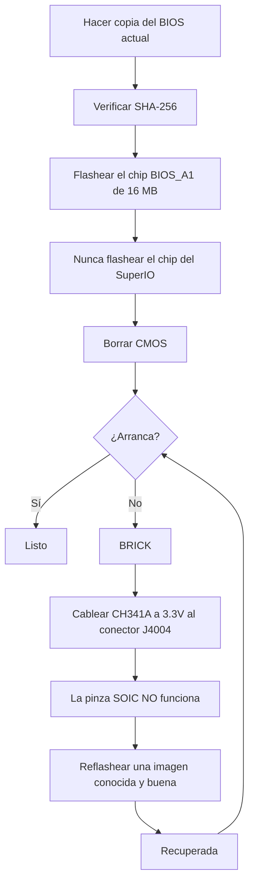

> 🌐 Traducción de la comunidad. La versión en inglés es la fuente de verdad y puede estar más actualizada. ¿Encontraste un error? Abre un issue: [../en/08-bios.md](../en/08-bios.md) · https://github.com/lildebil0/awesome-bc250/issues

# BIOS y recuperación de un brick

> **TL;DR** — Un ajuste de BIOS equivocado puede **dejar la BC-250 muerta (brickeada)**, y en esta placa un borrado de CMOS *no* siempre la recupera ([fuente](https://t.me/c/2424231195/54971)). Antes de flashear *cualquier cosa*, entiende esto: necesitas tener a mano un **kit de recuperación por hardware** (un **programador SPI de clase CH341A + cables DuPont hembra-hembra**), porque la única forma fiable de desbrickear es reflashear el chip externamente a través del **conector J4004** de la placa. El mod popular de la comunidad (el BIOS de "death", el más reciente basado en el de fábrica **5.00**) desbloquea overclocking, timings de GDDR6 y asignación de memoria de la iGPU — útil, pero **no todos los ajustes son seguros, y algunos brickean la placa al instante** ([fuente](https://t.me/c/2424231195/78922)). Verifica primero el **SHA-256** de cada imagen, y lee [`assets/firmware/DISCLAIMER.md`](../../assets/firmware/DISCLAIMER.md). **No flashees a la ligera.**

⚠️ **Este es el capítulo más peligroso del manual.** Flashear es destructivo e irreversible sin hardware de recuperación. Si no estás preparado para soldar/pinzar un chip SPI para revivir un brick, **detente aquí y usa el BIOS de fábrica.**

---

## Qué es el BIOS en la BC-250

La BC-250 es una placa de minería/servidor fabricada por AsRock que lleva una APU PS5 "Oberon" recortada. Su firmware UEFI vive en un **chip de flash SPI de 16 MB** (un Winbond **W25Q128** / Macronix MX25L128 en encapsulado SOIC de 8 pines). El firmware de fábrica está fuertemente bloqueado: casi nada útil queda expuesto en el Setup. Las versiones de fábrica conocidas que se ven en el chat son **3.00** y **5.00**; los BIOS modificados se reconstruyen a partir de estas (el número de versión es tu ancla — anota siempre sobre qué base se construye un mod).

> También existe stock **4.00**. La única diferencia funcional entre stock **v4.0** y **v5.0** es que v5.0 habilita el **arranque por red** por defecto. ([src](https://discord.com/channels/1315924807128449065/1316030225338863636/1326825429595848816))

Dos razones por las que la gente reflashea:

1. **Para instalar un BIOS modificado** que desbloquea menús ocultos (overclock, undervolt, memoria, VRAM de la iGPU).
2. **Para recuperar un brick** — restaurar una imagen conocida y buena tras un ajuste malo o un flasheo fallido.

> 💡 **Puede que no necesites flashear en absoluto.** Si tu *único* objetivo es cambiar el reparto de VRAM/UMA, puedes hacerlo desde un Linux en marcha con el BIOS **de fábrica** P3.00 / P5.00 usando **[fanoush/bc250_memcfg](https://github.com/fanoush/bc250_memcfg)** — sin flashear, sin programador, sin riesgo de brick ([elektricM: BIOS flashing](https://elektricm.github.io/amd-bc250-docs/bios/flashing/), [elektricM: VRAM](https://elektricm.github.io/amd-bc250-docs/bios/vram/)). Flashear un BIOS modificado solo es necesario para los *menús del chipset desbloqueados* y funciones más allá del dimensionamiento de VRAM (consulta [09-overclock-undervolt.md](09-overclock-undervolt.md) para el comando `bc250_memcfg`).

---

## El BIOS modificado (el mod de "death") — qué cambia y por qué

El mod de referencia de la comunidad lo mantiene **death** en el chat. *No* es un firmware hecho desde cero — vuelve a habilitar (deja de ocultar) opciones del Setup de AMD/AMI que el BIOS de fábrica trae ocultas. Sigue la pista de las versiones, porque los consejos cambiaron con el tiempo:

| Versión del mod | Base | Lanzamiento | Qué expuso / cambió | Estado |
|---|---|---|---|---|
| **1.0** (primer lanzamiento) | de fábrica **3.00** | 2025-06-28 | Frecuencia de GDDR6, timings de GDDR6, tamaño de memoria UMA de la iGPU, frecuencia de núcleos, voltajes | ⚠️ Valores malos brickean la placa, **el borrado de CMOS no ayudó** ([fuente](https://t.me/c/2424231195/54971)) |
| Variantes 3.0 | 3.00 | 2025-07 → 10 | Mismos desbloqueos; una build añadió un **logo de arranque de Steam personalizado** | Build cosmética del logo replicada como `bc250-Steam.rom` ([fuente](https://t.me/c/2424231195/86420)) |
| **mod 5.00** (actual) | de fábrica **5.00** | 2025-10-05 | Pestañas reagrupadas; **más ajustes abiertos**; **los ajustes de timing de RAM/GDDR6 ahora sí aplican** en esta placa | El más nuevo; "no todos los ajustes son útiles, pero mejor que nada" ([fuente](https://t.me/c/2424231195/78922)) |

Lo que puedes ajustar realmente con él (según las notas del primer lanzamiento, [fuente](https://t.me/c/2424231195/54971)):

- **Frecuencia de GDDR6** — reportada funcionando a **1800** para un usuario (`@Haswellb`), pero el *mismo tipo de cambio brickeó otra placa* — los valores son específicos de cada placa, no universales.
- **Timings de GDDR6** — sí aplican, pero **timings demasiado bajos/apretados brickean** la placa.
- **Tamaño de memoria (UMA) de la iGPU** — funciona y da una mejora real. Si tu cambio no surte efecto, configura **IGC: Forces** y **UMA Mode: UMA_SPECIFIED** ([fuente](https://t.me/c/2424231195/54971); la misma combinación está confirmada por la documentación de la comunidad).
- **Frecuencia de núcleos / voltajes** — expuestos pero **"no probados"** por el autor.

> ❗ **Dos advertencias del autor, todavía vigentes:** (1) **No desactives Integrated Graphics** — es la única salida de vídeo. (2) En cualquiera de estos mods, **un ajuste equivocado puede brickear la placa y un borrado de CMOS puede que no la recupere** — por eso exactamente necesitas un programador. (Consulta la escalera "¿qué versión?" más abajo para elegir una base.)

> ### ¿Qué versión? (escalera de decisión)
>
> 1. **P3.00 modificado (ROM del menú del chipset) — la opción segura por defecto.** Este es el **"estándar de la comunidad… el más estable y probado"** establecido, verificado-público con un SHA-256 conocido, y ya cubre **desbloqueo de VRAM + ajustes del chipset**. Empieza aquí salvo que tengas una razón específica para no hacerlo ([elektricM: BIOS flashing](https://elektricm.github.io/amd-bc250-docs/bios/flashing/)).
> 2. **5.00 modificado — actual; elígelo si quieres ajustar la memoria.** Es la base más nueva y es la única donde **los ajustes de timing de RAM/GDDR6 sí aplican** en esta placa ([fuente](https://t.me/c/2424231195/78922)). Elígelo sobre P3.00 específicamente cuando quieras ajustar los timings de memoria.
> 3. **`P5.00_clv` — solo para expertos.** "Desbloquea **Todo**" (cada menú oculto, incluyendo el experimental **ReBAR / Resizable BAR** y ajustes de depuración/chipset), lo que hace *"muy fácil brickear la placa si cambias lo que no debes… Quédate con P3.00 salvo que seas un usuario avanzado."* Peor aún, **`P5.00_clv` no está en ningún repo público** que la guía pudiera encontrar — circula solo como adjunto de Discord, así que **no hay hash canónico**; si tienes que usarlo, consigue copias de **dos** personas que lo ejecuten de forma independiente y confirma que ambas tienen el **mismo SHA-256** antes de flashear ([elektricM: BIOS flashing](https://elektricm.github.io/amd-bc250-docs/bios/flashing/)).

> **Particularidades de la versión modificada 5.00 que vale la pena conocer.** Su Setup muestra una **frecuencia de CPU predeterminada de 3600** — un valor estético de la interfaz, no una velocidad de reloj aplicada ([src](https://discord.com/channels/1315924807128449065/1452152658168381593/1452406964780007515)). También expone una opción de **bifurcación PCIe `x1x1x1x1`** en los ajustes del chipset ([src](https://discord.com/channels/1315924807128449065/1452152658168381593/1474231812598534351)). Ten especial cuidado con los tiempos de memoria en esta base: **los valores de temporización extremos pueden dejar la placa inoperativa hasta que se realice un reflasheo externo, y eso es aún más grave en P5.00** ([src](https://discord.com/channels/1315924807128449065/1371527281947971604/1468745940994101372)). Y como con cualquier flasheo, pasar a la versión modificada 5.00 puede dejar **sin señal de video hasta que borres el CMOS** ([src](https://discord.com/channels/1315924807128449065/1315933088668454942/1508568321346502892)).

También existe un **mod del menú del chipset** aparte (`BC250_3.00_CHIPSETMENU.ROM`) del repo de BIOS más referenciado, **[TuxThePenguin0/bc250-bios](https://gitlab.com/TuxThePenguin0/bc250-bios/)**, que expone el **menú del chipset / NBIO Common Options** sobre el de fábrica 3.00. El propio README de ese repo dice sin rodeos: *"Nada en este repositorio está soportado ni tiene ningún tipo de garantía — HAZ COPIAS DE SEGURIDAD."*

> 🚫 **Evita `Smokeless_UMAF`.** La guía de overclocking de la comunidad marca esta herramienta de edición de UEFI como algo que **no se debe ejecutar en la BC-250 — puede causar daño permanente a la placa** ([elektricM: BIOS overclocking](https://elektricm.github.io/amd-bc250-docs/bios/overclocking/)). Quédate con las ROM conocidas y buenas de arriba.

---

## Antes de flashear — la lista de verificación de seguridad

1. **Haz primero una copia de seguridad de tu BIOS actual** (léelo con la misma herramienta con la que vas a flashear — consulta la Ruta B/recuperación). Una copia de seguridad es tu deshacer gratuito.
2. **Verifica el SHA-256** de la imagen contra `assets/PROVENANCE.md` / la publicación de origen. La guía de flasheo de la comunidad publica el hash de la ROM del menú del chipset como
   `48fbe5d366e6a56e2fdffdca848426216ba1f083610dab63db89d2f4e6c940b5` ([documentación de elektricM](https://elektricm.github.io/amd-bc250-docs/bios/flashing/)).
3. **Confirma el tamaño del chip**, no solo el marcado. El chip de BIOS de 16 MB es el objetivo; **no** flashees el pequeño chip del SuperIO (consulta la sección de recuperación). Distintas revisiones de placa pueden llevar números de parte de chip ligeramente diferentes — lo que importa es la **capacidad (16 MB)**, las últimas letras del marcado pueden diferir ([fuente](https://t.me/c/2424231195/67880)).
4. **Ten el hardware de recuperación listo** *antes* del primer flasheo, no después de brickear.
5. Tras flashear, **borra la CMOS** para que los nuevos ajustes (especialmente la asignación de VRAM) surtan efecto (consulta "Después de cada flasheo").



### Verifica el checksum antes de flashear

El paso 2 de arriba dice que verifiques el SHA-256 — aquí está cómo. Calcula el hash del archivo que estás a punto de flashear y compáralo, carácter por carácter, contra el valor listado para ese archivo en [`assets/PROVENANCE.md`](../../assets/PROVENANCE.md).

```bash
# Linux:
sha256sum BC250_3.00_CHIPSETMENU.ROM
```

```powershell
# Windows (PowerShell):
Get-FileHash BC250_3.00_CHIPSETMENU.ROM -Algorithm SHA256
```

`PROVENANCE.md` puede listar solo los **primeros 16 caracteres hexadecimales** como huella corta. Si es así, comprueba que tu hash calculado **empieza con** esos 16 caracteres — una coincidencia completa de ese prefijo ya es una verificación sólida (el mantenedor puede publicar hashes completos a petición).

**Hashes SHA-256 completos verificados** para las imágenes alojadas públicamente (verificados de forma cruzada en múltiples repos de la comunidad — cada archivo de BIOS conocido y bueno de la BC-250 es **exactamente 16 MB / 16777216 bytes**; un tamaño distinto significa que está corrupto, que es una herramienta/parche, o que no tiene relación) ([elektricM: BIOS flashing](https://elektricm.github.io/amd-bc250-docs/bios/flashing/)):

| Archivo | Tipo | SHA-256 |
|---|---|---|
| `BC250_3.00_CHIPSETMENU.ROM` (también `Robin3.00`, `BC250CHIPSETMENU.ROM`) | **P3.00 modificado** — desbloqueo de VRAM + chipset, *recomendado* | `48fbe5d366e6a56e2fdffdca848426216ba1f083610dab63db89d2f4e6c940b5` |
| `Robin5.00` | **De fábrica** P5.00 (no el `P5.00_clv` modificado) | `0d6f136cb120cf3b2de26d5c4d7f255604fdbf4b9442af5ba55419b95b89aa82` |
| `BC250_3.00.ROM` | De fábrica P3.00 | `07595ca3aecf8a4caa28a397b5298f3946a1b769f87b16f67adc369c3f69045c` |
| `BC250_2.00.bin` | De fábrica P2.00 | `ee6150dfed33bd05ea46063a352549416fdf3f45fa0e5edac2a68ef78d71083c` |
| `P5.00_clv` | P5.00 modificado (desbloquea-todo) | **no existe hash público** — solo en Discord, verifica que dos copias independientes coincidan |

> El P3.00 modificado aparece bajo varios nombres de archivo en los repos (`BC250_3.00_CHIPSETMENU.ROM`, `BC250CHIPSETMENU.ROM`, `Robin3.00`) — todos generan el mismo hash de arriba, así que el nombre no importa. `Robin5.00` es el P5.00 **de fábrica**, un *archivo distinto* del `P5.00_clv` modificado. Las fuentes públicas de cada uno (TuxThePenguin0 GitLab, forgenam, tipitochen, csabakecskemeti, scrakcho, dannybastos, kenavru, MrrZed0) están listadas en la [guía de flasheo de elektricM](https://elektricm.github.io/amd-bc250-docs/bios/flashing/).

> 🔴 **Si el checksum no coincide, NO flashees.** Una discrepancia significa un archivo corrupto o equivocado — flashearlo es exactamente cómo se brickea la placa. Vuelve a descargar la imagen y verifica de nuevo.

---

## Ruta A — Flasheo por software (desde la placa, sin programador)

Esta es la forma normal de instalar/actualizar un BIOS mientras la placa todavía arranca. Usa una **memoria USB FAT32** y la utilidad de actualización de firmware de AMI.

**Método EFI / AFU** ([fuente](https://t.me/c/2424231195/54979)):

1. Formatea una memoria USB a **FAT32**.
2. Copia en ella el contenido del archivo AFU (p. ej. `AfuEfi64_5.16.zip`) **y el archivo del BIOS**.
3. Reinicia la BC-250 y **arranca desde la memoria USB** al shell EFI.
4. Ejecuta:
   ```
   afuefix64.efi <filename>.<ext> /P /N
   ```
   - `/P` = programa el BIOS principal.
   - `/N` = programa también la **NVRAM**. Esto evita errores al moverse *entre* versiones (p. ej. a la 3.00 desde otra versión) — **pero borra tus ajustes guardados.** Puedes omitir `/N`, pero entonces espera posibles errores. ([fuente](https://t.me/c/2424231195/54979))
5. Si la herramienta no ve el archivo, prueba `fs0:`, `fs1:`, … para encontrar cuál es la memoria ([fuente](https://t.me/c/2424231195/54979)).

Algunas builds de la comunidad incluyen un script `Flash.nsh` ya hecho y una ROM renombrada (p. ej. renombra la ROM modificada para que coincida con el script) de modo que solo arranques al shell EFI y ejecutes el script ([documentación de elektricM](https://elektricm.github.io/amd-bc250-docs/bios/flashing/)). En Linux también hay una build **`afulnx`** (`afulnx-5.05.04Z.tar.gz`) para flashear desde un sistema en marcha ([fuente](https://t.me/c/2424231195/54507)).

#### Receta canónica del shell EFI (el método `Flash.nsh` / `Robin5.00`)

La guía de flasheo de la comunidad estandariza un kit autocontenido y un nombre de archivo fijo — esta es la ruta USB más reproducida ([elektricM: BIOS flashing](https://elektricm.github.io/amd-bc250-docs/bios/flashing/)):

1. **Consigue el kit EFI:** `4U12G BIOS Update.zip` (del repo [kenavru/BC-250](https://github.com/kenavru/BC-250)) — contiene `AfuEfix64.efi`, `Flash.nsh` y `amdvbflash.efi`. *También incluye un BIOS P5.00 de fábrica llamado `Robin5.00` — quítalo de en medio para no flashearlo por accidente.*
2. **Prepara una memoria FAT32 (≤ 32 GB recomendado).** Copia el contenido de la carpeta `BIOS EFI` del kit a la **raíz**.
3. **Renombra tu ROM modificada a `Robin5.00`** (quita la extensión `.ROM`) — ese es el nombre exacto que `Flash.nsh` busca. *(O edita `Flash.nsh` para que coincida con tu nombre de archivo en su lugar.)* La raíz debería contener entonces: `AfuEfix64.efi`, `Flash.nsh`, `amdvbflash.efi`, `Robin5.00` (tu mod renombrado) y la carpeta `EFI`.
4. **Usa un monitor DisplayPort directo.** Los **adaptadores HDMI activos/pasivos pueden dejar en negro el menú del BIOS** — un problema de pantalla conocido en esta placa.
5. **Desconecta todos los SSD/discos** para que la placa caiga automáticamente al shell EFI, inserta la memoria, enciende. Llegas a un prompt amarillo `Shell>`.
6. En el prompt escribe **`blk0:`** y luego Enter — **fíjate en el espacio después de los dos puntos** (esto selecciona el volumen USB; `blk0:` es el selector documentado por elektricM, distinto del sondeo `fs0:`/`fs1:` de arriba). Luego escribe **`Flash.nsh`** y Enter.
7. **ESPERA. No toques el teclado, no apagues.** Si *parece* colgarse durante la escritura, **espera al menos 15 minutos** — apagar a mitad de escritura brickea la placa. Reinicia (o te pide que lo hagas) cuando termina.
8. **Apaga inmediatamente y retira la memoria** para que no vuelva a entrar en bucle en el flasher.

> 🔴 **Antes de encender para flashear: comprueba el cableado de alimentación PCIe de 8 pines** contra el diagrama de 12 V/GND de tu fuente. **La polaridad invertida puede dañar la placa de forma permanente** ([elektricM: BIOS flashing](https://elektricm.github.io/amd-bc250-docs/bios/flashing/)).

#### Ajustes del BIOS requeridos tras el flasheo (haz esto justo después del borrado de CMOS)

Tras flashear **y** borrar la CMOS (siguiente sección), entra al Setup (machaca **Del**) y configura estos — el reparto de VRAM no se comportará bien hasta que estén correctos ([elektricM: BIOS flashing](https://elektricm.github.io/amd-bc250-docs/bios/flashing/), [elektricM: BIOS VRAM](https://elektricm.github.io/amd-bc250-docs/bios/vram/)):

| Ajuste | Ruta | Valor |
|---|---|---|
| Integrated Graphics Controller | Chipset → GFX Configuration | **Forces** |
| UMA Mode | Chipset → GFX Configuration | **UMA_SPECIFIED** |
| UMA Frame Buffer Size | Chipset → GFX Configuration | **512MB** (recomendado) o un tamaño fijo |
| IOMMU | Advanced → CPU Configuration | **Disabled** |
| Boot Mode | Boot → Boot Mode | **UEFI** |

Primero verifica que el borrado de CMOS realmente surtió efecto — el **reloj debería marcar mal**; si sigue correcto, repite el borrado. Luego F10 para guardar. La elección `512MB` es asignación *dinámica*, no un tope de 512 MB (consulta [09-overclock-undervolt.md](09-overclock-undervolt.md)).

> ★ **Por qué 512 MB de UMA *gana* FPS (el mecanismo).** Configurar el búfer UMA a **512 MB** no deja sin recursos a la GPU — permite que el sistema **equilibre dinámicamente RAM vs VRAM** en lugar de bloquear una porción fija grande, y solo ese reequilibrio se atribuyó a un salto real de FPS: Cyberpunk 2077 pasó de **60 → 66 fps (a 2 GHz de OC) → 76 fps** con FSR 3.0 *balanced*, 1080p, preset Steam-Deck ([Old Lamer — Parte I](https://youtu.be/ohpEY2XQ_lo) ~11:21; ⚠ aprox — cifras transcritas del vídeo, trátalas como el resultado de una build). Así que "512 MB es lo mejor" no es solo un dimensionamiento seguro — el pequeño búfer dinámico es *parte de* la historia del rendimiento, no un compromiso.

**flashrom como alternativa** (si AFU da error) ([fuente](https://t.me/c/2424231195/54979), sugerido y probado por `@mrartemsid`):

```bash
# Read (back up):
sudo flashrom -p internal:boardmismatch=force -r <name>.bin
# Write:
sudo flashrom -p internal:boardmismatch=force -w <name>.bin
```

> ⚠️ El flasheo por software solo ayuda **mientras la placa todavía hace POST**. En el momento en que un ajuste malo la brickea, la Ruta A desaparece y estás en la ruta por hardware de abajo.

---

## Ruta B — Flasheo por hardware / desbrickear (programador SPI CH341A)

Esta es la ruta de **recuperación**, y la fijada como "la forma más conveniente de flashear un brick" ([fuente](https://t.me/c/2424231195/67880)). Reescribes el chip SPI de 16 MB directamente, desde otro PC, usando un programador SPI por USB. Software usado: **NeoProgrammer** (Windows) o **flashrom** (Linux).

> 🔴 **La pinza SOIC-8 NO funciona en esta placa.** death es contundente al respecto: *"la pinza en nuestra placa funciona… básicamente nada."* ([fuente](https://t.me/c/2424231195/67880)). Nota: `assets/firmware/DISCLAIMER.md` menciona una "pinza SOIC" de forma genérica — en la práctica debes **cablear al conector J4004 de la placa en su lugar.** Este es el dato de recuperación más importante de este capítulo.

### Pinout del conector J4004 (cablea aquí)

La placa expone un **conector J4004 de paso 2.54 mm** específicamente para reflashear el chip SPI/BIOS. Pinout (de la captura de cableado fijada, [fuente](https://t.me/c/2424231195/67880)):

```
J4004
[ GND  SCLK  MOSI  UNK ]
[ VCC  CS    MISO      ]
   ^  (pin-1 marker)
```

| Pin J4004 | Señal | Pad CH341A |
|---|---|---|
| VCC | alimentación 3.3 V | VDD / 3.3V |
| GND | tierra | GND |
| CS | chip select | CS / SS |
| SCLK | reloj | CLK / SCK |
| MOSI | datos de entrada (al chip) | MOSI |
| MISO | datos de salida (del chip) | MISO |

El **mapa de colores W25Q128 SOIC-8 / CH341A** correspondiente está en la misma captura fijada — haz coincidir `/CS, DO(MISO), CLK, DI(MOSI), VCC, GND` con los pads `CS, MISO, CLK, MOSI, VDD, GND` del CH341A. **Verifica tres veces VCC y GND** antes de encender; invertirlos mata el chip ([fuente](https://t.me/c/2424231195/67880)).

> **Numeración de pines de J4004 y los dos pines desconocidos.** La guía de elektricM numera el conector VCC=1, GND=2, CS=3, SCLK=4, MISO=5, MOSI=6, con los **pines 7 y 8 sin usar para flashear — están puestos a tierra a través de resistencias de 10 kΩ.** El pin 1 (VCC) está marcado por una **flecha `>` o un pad cuadrado** en el PCB ([elektricM: BIOS flashing](https://elektricm.github.io/amd-bc250-docs/bios/flashing/)).

> **Chip objetivo exacto y el error de densidad.** La parte de 16 MB es un Winbond **W25Q128JVSQ** (128 Mbit / 16 MB) o, en algunos lotes, un Macronix **MX25L12835F**. Algunas documentaciones de la comunidad lo escriben mal como **"25Q168" — eso es incorrecto**; el código de densidad correcto de 16 MB es **128** ([elektricM: BIOS flashing](https://elektricm.github.io/amd-bc250-docs/bios/flashing/)). Si flasheas con una **pinza SOIC-8** pelada en lugar de J4004, el propio orden de pines del chip es la disposición SPI estándar: `1 CS · 2 DO · 3 WP · 4 GND · 5 DI · 6 CLK · 7 HOLD · 8 VCC` ([elektricM: BIOS recovery](https://elektricm.github.io/amd-bc250-docs/bios/recovery/)) — pero recuerda el hallazgo de death de que **la pinza apenas funciona en esta placa**, así que prefiere J4004.

> 🙏 Crédito: el pinout de J4004, la ingeniería inversa y el repositorio de imágenes de firmware modificado son en gran medida trabajo de **Segfault** (la ROM del menú del chipset P3.00 es el "mod de Segfault") ([elektricM: BIOS flashing](https://elektricm.github.io/amd-bc250-docs/bios/flashing/)).

### Procedimiento con NeoProgrammer (fijado) ([fuente](https://t.me/c/2424231195/67880))

1. Conecta el programador a **J4004** con cables hembra-hembra según el pinout. **Comprueba el cableado ~10×, especialmente VCC y GND.** (Fuente desenchufada.)
2. Abre **NeoProgrammer**.
3. Ejecuta la **autodetección** del chip, y lee también el marcado en el propio chip.
4. **Compara los marcados.** Si las últimas letras difieren de la lista pero la **capacidad coincide (16 MB)**, no pasa nada.
5. **Borra** el chip.
6. **Abre el archivo del BIOS** en el software (funciona arrastrar y soltar).
7. **Escribe** el chip.
8. **Desconecta los cables de J4004.**
9. Enciende la placa.

### Equivalente con flashrom (Linux), verificado de forma cruzada con la documentación de la comunidad

La guía de flasheo de la comunidad usa un programador **CH347** y advierte contra las placas CH341A baratas de PCB negro (siguiente sección). Identifica el chip correcto — apunta al **chip BIOS de 16 MB** (`BIOS_A1`), **nunca** al SuperIO de 512 KB (`SIO1_R`), que brickea el SuperIO si se flashea ([documentación de elektricM](https://elektricm.github.io/amd-bc250-docs/bios/flashing/)):

```bash
# Detect / identify the chip:
sudo flashrom -p ch347_spi

# Back up the stock BIOS (twice, then diff to be sure the read is stable):
sudo flashrom -p ch347_spi -r backup_stock.bin
sudo flashrom -p ch347_spi -r backup_verify.bin

# Write the new image, then verify it read back identical:
sudo flashrom -p ch347_spi -w BC250_3.00_CHIPSETMENU.ROM
sudo flashrom -p ch347_spi -v BC250_3.00_CHIPSETMENU.ROM
```

(Usa `-p ch341a_spi` para un CH341A, o `serprog` para un Raspberry Pi Pico, en lugar de `ch347_spi`.) ⚠ El mapeo `ch347_spi` / `serprog` para el cableado exacto de *esta* placa viene de la guía de la comunidad — `⚠ verifica` contra tu propio modelo de programador.

> **La detección te dice en qué chip estás.** Si `flashrom -p …` reporta **`Winbond W25Q128…`** o **`Macronix MX25L128…`**, estás en el chip de BIOS correcto de 16 MB. Si reporta **`Macronix MX25L4005…` (512 KB)**, **DETENTE — estás conectado al chip del SuperIO** (`SIO1_R`); flashearlo brickea el control de ventiladores/sensores. Pásate al otro chip ([elektricM: BIOS flashing](https://elektricm.github.io/amd-bc250-docs/bios/flashing/)). Flashea con la **fuente desenchufada de la pared** y los condensadores descargados (pulsa el botón de encendido unas cuantas veces) — alimentar la placa durante un flasheo con pinza *no* es recomendable ([elektricM: BIOS recovery](https://elektricm.github.io/amd-bc250-docs/bios/recovery/)).

### La trampa de los 3.3 V del CH341A (lee esto o achicharrarás el chip)

Muchos programadores **CH341A baratos de PCB negro** manejan sus **líneas de datos a 5 V aunque VCC sea 3.3 V** — el chip de BIOS de la BC-250 es una parte de **3.3 V**, así que 5 V en las líneas de datos pueden dañarlo. Este es un fallo conocido y medido en algunas placas (la placa de Fabian, y una idéntica en el chat, se confirmaron por medición de voltaje) ([fuente](https://t.me/c/2424231195/100285)). Soluciones:

- Prefiere un programador que sea genuinamente de 3.3 V en sus líneas de datos (p. ej. **CH347**), **o**
- Aplica el **arreglo sin soldadura de líneas de datos 5V→3.3V del CH341A**: corta la línea de alimentación USB de 5 V al chip y aliméntalo con 3.3 V en su lugar — consulta el [artículo de sawyershepherd.org](https://sawyershepherd.org/post/solderless-ch341ab-fix-5v-to-33v-data-lines/) y el [arreglo del CH341A en wej.k.vu](https://wej.k.vu/electronics/ch341a-mini-programmer-fix/) ([fuente](https://t.me/c/2424231195/100285)).

---

### Conectores de bajo nivel, depuración y silicio en placa

Más allá del conector de flasheo J4004 de arriba, la placa lleva varios otros conectores y un conjunto conocido de chips en placa. Estos están analizados por ingeniería inversa en la documentación de hardware de elektricM y son útiles para borrar la CMOS, sondeo de depuración, cableado de ventiladores y confirmar cuál chip es cuál antes de flashear. Valores de pines transcritos textualmente de ([elektricM: pinouts](https://elektricm.github.io/amd-bc250-docs/hardware/pinouts/)).

**CLRCMOS1 — jumper de borrado de CMOS (3 pines).** Este es el jumper referenciado en todas partes de este capítulo como "cortocircuita el jumper de CMOS" — aquí está su mapa:

| Posición | Comportamiento |
|---|---|
| Pines 1–2 | La CR2032 alimenta la CMOS (por defecto) |
| Pines 2–3 | Borrar CMOS |

> 💡 Cuando la [lista de verificación tras el flasheo](#antes-de-flashear--la-lista-de-verificación-de-seguridad) y ["Después de cada flasheo"](#después-de-cada-flasheo--borra-la-cmos-no-te-saltes-esto) te dicen que "cortocircuites el jumper de CMOS durante ~20 segundos", **CLRCMOS1** es ese jumper: muévelo de los pines 1–2 a los pines 2–3, espera, luego vuélvelo a su sitio. (Retirar la CR2032 durante 60+ s es la alternativa.)

**TPMS1 — conector de depuración LPC (18 pines, paso 2.0 mm):**

| Pin | Señal | Pin | Señal |
|---|---|---|---|
| 1 | PCICLK | 2 | GND |
| 3 | FRAME | 4 | SMB_CLK_MAIN |
| 5 | PCIRST# | 6 | SMB_DATA_MAIN |
| 7 | LAD3 | 8 | LAD2 |
| 9 | 3V | 10 | LAD1 |
| 11 | LAD0 | 12 | GND |
| 13 | (vacío) | 14 | S_PWRDWN# |
| 15 | 3VSB | 16 | SERIRQ# |
| 17 | GND | 18 | GND |

> 💡 **El pin 9 (3V) está activo solo cuando la placa está encendida** — así que funciona como señal de detección de "sistema encendido". Eso lo convierte en un punto de sensado alternativo para montajes de auto-encendido / adaptadores ATX reales (referencia cruzada con el [jumper `AUTO_PWRON` en 03-power-supply.md](03-power-supply.md)).

**J2 — conector de depuración JTAG/HDT (20 pines, paso 1.27 mm, sin poblar, en la parte inferior de la placa):**

| Pin | Señal | Pin | Señal |
|---|---|---|---|
| 1 | VDDIO | 2 | TCK |
| 3 | GND | 4 | TMS |
| 5 | GND | 6 | TDI |
| 7 | GND | 8 | TDO |
| 9 | TRST_L | 10 | PWROK_BUF |
| 11 | DBRDY3 | 12 | RESET_L |
| 13 | DBRDY2 | 14 | DBRDY0 |
| 15 | DBRDY1 | 16 | DBREQ_L |
| 17 | GND | 18 | TEST19 |
| 19 | VDDIO | 20 | TEST18 |

> TEST18, TEST19 y DBRDY0 quedan flotando. Esta es la **única** interfaz de reset/depuración por hardware en la placa.

**I2C_HEADER1 (3 pines):** `SCL · SDA · GND`. SCL es el pin **más cercano a los conectores de alimentación**. Este bus lleva **PMBUS a los PMIC de Intersil** — un punto de acceso de telemetría de potencia.

**CPU_FAN1 (4 pines):** `PWM · Tach · 12V · GND`.

**J4003 — conector multi-ventilador (16 pines, 2×8, 2.54 mm):**

| Fila 1 | 1 GND | 2 F1T | 3 F2T | 4 F3T | 5 F4T | 6 F5T | 7 DET | 8 (vacío) |
|---|---|---|---|---|---|---|---|---|
| **Fila 2** | 1 GND | 2 F1P | 3 F2P | 4 F3P | 5 F4P | 6 F5P | 7 GND | 8 GND |

Aquí `T` = tach y `P` = PWM, por ventilador 1–5.

> 💡 **DET (fila 1, pin 7) se pone a tierra cuando la placa se asienta sobre una placa de ventiladores / distribución de potencia** — es decir, detecta el soporte. (La numeración de ventiladores BIOS↔Linux se cubre en [06-linux.md → Sensores y control de ventiladores](06-linux.md#sensors--fan-control); no se duplica aquí.)

**Silicio en placa (BOM).** El repo ya nombra `SIO1_R` y `BIOS_A1` en las secciones de flasheo pero nunca dio números de parte ni tamaños; esta tabla permite a quien va a flashear confirmar cuál chip es cuál (el Winbond de 16 MiB es el BIOS, el Macronix de 512 KiB es el SuperIO — déjalo en paz):

| Designador | Parte | Función |
|---|---|---|
| PUA1 | Intersil ISL69247 | PMIC principal |
| PUIO1 | Intersil ISL95712 | PMIC de alimentación de núcleo |
| PUA11… | Intersil ISL99360 | Etapas de potencia inteligentes (fases) |
| M2U2 | NXP CBTL04083B | Mux PCIe x4 2:1 |
| U30 | Realtek RTL8111H | NIC Ethernet (PCIe x1) |
| SU1 | AMD 218-0844029 | Chipset FCH A68H "Bolton-D2H" |
| UIO1 | Nuvoton NCT6686D | SuperIO (el chip de sensores hwmon) |
| BIOS_A1 | Winbond 25Q128JVSQ | Flash SPI de 16 MiB = el **BIOS** (flashea ESTE) |
| SIO1_R | Macronix MX25L4006E | Flash SPI de 512 KiB = programa del SuperIO (**NO flashear — brickea el SuperIO**) |

> El chip de sensores del SuperIO nombrado aquí (Nuvoton **NCT6686D**) es al que se vincula el driver de Linux `nct6687`/`nct6683` — consulta [06-linux.md](06-linux.md) para la configuración de sensores/ventiladores.

**Herramientas de firmware (avanzado).** Dos utilidades surgen repetidamente para explorar la imagen:

- **`psptool`** inspecciona y extrae los blobs de firmware AMD dentro de un volcado de BIOS. `psptool -E bios.bin` enumera las entradas; `psptool -X -d 0 -e 1 -o firmware.bin bios.bin` extrae el firmware SMU para su análisis. ([bc250-collective/amd_smu_reverse_engineering](https://github.com/bc250-collective/amd_smu_reverse_engineering))
- **`Zentool`** parchea el microcódigo de la CPU — por ejemplo, para reemplazar la instrucción `RDRAND`. ([AMD-BC-250/documentation #1](https://github.com/AMD-BC-250/documentation/issues/1))

---

## Secure Boot y CSM (prerrequisitos de arranque)

Añade estos dos a la lista de prerrequisitos del setup del BIOS — requeridos o **los kernels personalizados/parcheados no arrancarán** (el parche de 40-CU, el parche de frecuencia, etc.):

| Ajuste | Valor |
|---|---|
| Secure Boot | **Disabled** |
| CSM (Compatibility Support Module) | **Disabled** |

Fuente: [elektricM: boot troubleshooting](https://elektricm.github.io/amd-bc250-docs/troubleshooting/boot/).

---

## La idea del auto-reset "srep" (experimental — no es una función terminada)

Como un ajuste malo puede brickear la placa y **el borrado de CMOS no lo arregla**, death experimentó con incrustar una rutina **`srep`** en el BIOS para **auto-resetear los ajustes en un brick** — idea originalmente de `@Jacky_Fish` ([fuente](https://t.me/c/2424231195/60552)). El concepto: que el BIOS parchee sus variables de NVRAM/`amdsetup` de vuelta a los valores por defecto, opcionalmente solo cuando hay archivos disparadores presentes en una memoria USB (para que no borre tus ajustes en cada arranque). Hasta donde llega el chat, **esto todavía no funcionaba** — *"la placa se empeña en hacerse la brickeada completa y nada se resetea"* ([fuente](https://t.me/c/2424231195/60883)). Trata cualquier afirmación de "BIOS auto-reparable" como **no probada**; tu verdadera red de seguridad sigue siendo el programador externo. `⚠ verifica` antes de fiarte de cualquier build de srep.

---

## Después de cada flasheo — borra la CMOS (no te saltes esto)

Flashear el BIOS **no** resetea los ajustes guardados, y varios ajustes (notablemente la **asignación de VRAM/UMA**) no aplicarán realmente hasta que borres la CMOS. Un usuario se topó exactamente con esto: el BIOS mostraba el nuevo tamaño de VRAM y lo "guardó", pero el SO (Bazzite) seguía reportando el viejo reparto de 4 GB de RAM / 12 GB de VRAM hasta que se borró la CMOS ([fuente](https://t.me/c/2424231195/97290)). Cómo borrarla:

- **Retira la pila de botón CR2032 durante 60+ segundos** (recomendado), **o**
- **Cortocircuita el jumper de CMOS durante ~20 segundos.** ([documentación de elektricM](https://elektricm.github.io/amd-bc250-docs/bios/flashing/))

> Ten en cuenta el límite: el borrado de CMOS arregla "los ajustes no aplicaron" y configuraciones malas *leves* — pero en la generación del mod 1.0/3.00 se reportó que **no** recuperaba un brick de verdad ([fuente](https://t.me/c/2424231195/54971)). Para eso, consulta la Ruta B.

---

## Firmware replicado

Las imágenes de BIOS comentadas en el chat están replicadas bajo `assets/firmware/` para **recuperación/preservación** (consulta [`DISCLAIMER.md`](../../assets/firmware/DISCLAIMER.md) y verifica el SHA-256 de cada archivo en `PROVENANCE.md` antes de flashear):

| Archivo | Tamaño | Qué es | Fuente |
|---|---|---|---|
| `BC250_3.00.ROM` | 16 MB | Volcado de fábrica 3.00 | ([fuente](https://t.me/c/2424231195/5215)) |
| `BC250_3.00_CHIPSETMENU.ROM` | 16 MB | Mod del menú del chipset (TuxThePenguin0) | ([fuente](https://t.me/c/2424231195/86395)) |
| `dump_5.00.bin` | 16 MB | Volcado de fábrica 5.00 | ([fuente](https://t.me/c/2424231195/24661)) |
| `BC250_5.00_clv.zip` | 16 MB | **Mod 5.00 de death (actual)** | ([fuente](https://t.me/c/2424231195/78922)) |
| `bc250_3.00_clv1.zip` | 16 MB | Primer mod 3.00 de death (1.0) | ([fuente](https://t.me/c/2424231195/54971)) |
| `bc250-Steam.rom` | 16 MB | Mod 3.0 con logo de arranque de Steam | ([fuente](https://t.me/c/2424231195/86420)) |
| `bc250 modded bios.ROM` | 16 MB | Imagen modificada temprana | ([fuente](https://t.me/c/2424231195/30100)) |
| `my_4.0_MODED.bin` | 16 MB | Mod 4.0 intermedio | ([fuente](https://t.me/c/2424231195/45580)) |
| `W25Q128BV@WSON8_…BIN` | 16 MB | Lectura cruda del chip (W25Q128) | ([fuente](https://t.me/c/2424231195/5217)) |
| `AfuEfi64_5.16.zip` | — | Flasher EFI AMI AFU | ([fuente](https://t.me/c/2424231195/54979)) |
| `afulnx-5.05.04Z.tar.gz` | — | Flasher Linux AMI AFU | ([fuente](https://t.me/c/2424231195/54507)) |

> No flashees un BIOS de PS5 (`PS5 Disk Edition … BIOS.bin`, 2 MB) ni los chips de 512 KB en el chip de BIOS de 16 MB de la BC-250 — objetivo equivocado, consulta las advertencias de recuperación.

---

## Fuentes

- Mod de death — primer lanzamiento (3.00) — https://t.me/c/2424231195/54971 · actual (5.00) — https://t.me/c/2424231195/78922 · build con logo de Steam — https://t.me/c/2424231195/86420
- Flasheo por software (AFU `/P /N`, flashrom) — https://t.me/c/2424231195/54979 · afulnx — https://t.me/c/2424231195/54507
- Desbrickear por hardware (fijado, capturas de NeoProgrammer + cableado J4004) — https://t.me/c/2424231195/67880
- Idea de auto-reset srep — https://t.me/c/2424231195/60552 · resultado (no funcionó) — https://t.me/c/2424231195/60883
- Necesidad de borrar CMOS tras flashear — https://t.me/c/2424231195/97290
- Trampa de líneas de datos 5V→3.3V del CH341A — https://t.me/c/2424231195/100285 · artículo del arreglo — https://sawyershepherd.org/post/solderless-ch341ab-fix-5v-to-33v-data-lines/
- Repo de BIOS más referenciado — [TuxThePenguin0/bc250-bios](https://gitlab.com/TuxThePenguin0/bc250-bios/) (`BC250_3.00_CHIPSETMENU.ROM`, `CHIPSETMENU.md`)
- Guía de flasheo/recuperación de la comunidad (tabla SHA-256 verificada, receta `Flash.nsh`/`Robin5.00`, selector `blk0:`, problema DisplayPort/HDMI, regla de cuelgue de 15 min, pinout de J4004 + pines 7/8, error tipográfico W25Q128JVSQ/"25Q168", CH347, valores de Setup tras flasheo, crédito a Segfault) — [elektricM: BIOS flashing](https://elektricm.github.io/amd-bc250-docs/bios/flashing/)
- Guía de recuperación (pinout SPI de 8 pines, detección MX25L4005 = SuperIO, flashear con la fuente desenchufada, recorridos de escenarios) — [elektricM: BIOS recovery](https://elektricm.github.io/amd-bc250-docs/bios/recovery/)
- Pinouts de la placa y silicio en placa (CLRCMOS1, TPMS1 LPC, J2 JTAG/HDT, I2C_HEADER1, CPU_FAN1, J4003 multi-ventilador, BOM Intersil/NXP/Realtek/Nuvoton/Winbond/Macronix) — [elektricM: pinouts](https://elektricm.github.io/amd-bc250-docs/hardware/pinouts/)
- Guía de VRAM (dimensionamiento sin flasheo con `bc250_memcfg`, valores de UMA Frame Buffer, VRAM por parámetro de kernel, reporte Vulkan-vs-OpenGL) — [elektricM: BIOS VRAM](https://elektricm.github.io/amd-bc250-docs/bios/vram/)
- ★ 512 MB de UMA → equilibrio dinámico RAM/VRAM → mecanismo de ganancia de FPS (Cyberpunk 60 → 66 @ 2 GHz OC → 76 fps, FSR 3.0 balanced, 1080p, preset Steam-Deck) — [Old Lamer — Parte I](https://youtu.be/ohpEY2XQ_lo) ~11:21 (⚠ aprox, transcrito del vídeo)
- Nota de peligro de `Smokeless_UMAF` — [elektricM: BIOS overclocking](https://elektricm.github.io/amd-bc250-docs/bios/overclocking/)
- Herramienta de VRAM sin flasheo — [fanoush/bc250_memcfg](https://github.com/fanoush/bc250_memcfg)
- Utilidad de timings de memoria — `Mem_Timing_Utility.zip` https://t.me/c/2424231195/55351
- Política de réplica de firmware — [`assets/firmware/DISCLAIMER.md`](../../assets/firmware/DISCLAIMER.md)

> El overclock/undervolt *usando* estos ajustes desbloqueados se cubre en [09-overclock-undervolt.md](09-overclock-undervolt.md). Las imágenes de BIOS replicadas viven bajo `assets/firmware/` con SHA-256 por archivo en `PROVENANCE.md`.
