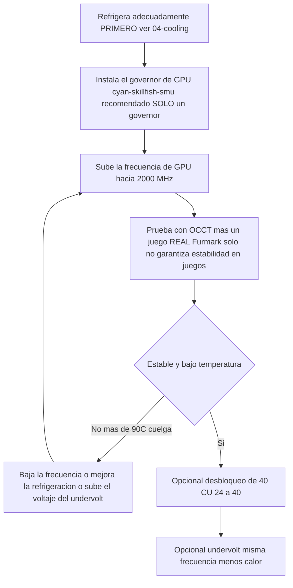

> 🌐 Traducción de la comunidad. La versión en inglés es la fuente de verdad y puede estar más actualizada. ¿Encontraste un error? Abre un issue: [../en/09-overclock-undervolt.md](../en/09-overclock-undervolt.md) · https://github.com/lildebil0/awesome-bc250/issues

# Overclocking y undervolting

> **TL;DR** — De fábrica, la GPU de la BC-250 va lenta (a menudo clavada a **1500 MHz**, ~débil). El arreglo de la comunidad es un **governor** que sobrescribe las frecuencias/voltaje: el recomendado hoy es **[cyan-skillfish-governor-smu](https://github.com/filippor/cyan-skillfish-governor)** (no necesita parche de kernel, empaquetado en Arch/CachyOS/Bazzite/Fedora); **[oberon-governor](https://gitlab.com/mothenjoyer69/oberon-governor)** es el original y sigue funcionando. Cualquiera de los dos lo editas para empujar la GPU a **2000 MHz (~+30 % FPS)**. El más nuevo, el toolkit **[bc250_smu_oc](https://github.com/bc250-collective/bc250_smu_oc)**, también hace overclock a la **CPU** (recomendado **4 GHz @ 1275 mV**). Por separado, el **[desbloqueo de 40 CU](https://github.com/duggasco/bc250-40cu-unlock)** reactiva las **24 → 40 unidades de cómputo** que AMD deshabilitó en el firmware — una victoria de GPU mayor que las frecuencias por sí solas (una prueba de Superposition pasó de **4647 → 6863** puntos, ([src](https://t.me/c/2424231195/137035))). **Todo esto es calor. Refrigera la placa primero** — consulta [04-cooling.md](04-cooling.md) — porque el OC sin refrigeración adecuada cuelga y resetea la placa por encima de ~90 °C.

Este es el **último** paso del camino dorado, no el primero. Ten una placa estable y fría funcionando ([06-linux.md](06-linux.md), [04-cooling.md](04-cooling.md)) antes de tocar nada de esto. Todo aquí es "hazlo bajo tu propia responsabilidad" — la comunidad lo dice repetidamente ([src](https://t.me/c/2424231195/106844)).

---

## Las cuatro palancas (y lo que vale cada una)

La BC-250 tiene **cuatro** cosas independientes que puedes afinar. Se acumulan:

| Palanca | Herramienta | Ganancia típica | Coste de calor |
|-------|------|--------------|-----------|
| **Frecuencia de GPU** 1500 → 2000 MHz | governor (cyan-skillfish-smu / oberon) | **~+30 % FPS** cuando limitada por GPU | alto |
| **Undervolt de GPU** a una frecuencia fija | el mismo governor | mismos FPS, **mucho más fría** | *negativo* (menos calor) |
| **Frecuencia de CPU** 3,5 → 4,0 GHz | `bc250_smu_oc` | ayuda a juegos limitados por CPU | alto |
| **Desbloqueo de 40 CU** 24 → 40 CU | `bc250-40cu-unlock` | **hasta ~+48 %** de trabajo de GPU | alto |

Dos advertencias honestas del chat antes de empezar:

- **La mayoría de los juegos en la BC-250 están limitados por CPU, no por GPU.** Empujar la GPU de 2000 → 2229 MHz le dio a un probador *1 fps* en Shadow of the Tomb Raider (90 → 91) mientras la potencia y las temperaturas se disparaban — así que el titular "+30 %" solo se materializa en el puñado de títulos donde la GPU es el cuello de botella ([src](https://t.me/c/2424231195/67029)).
- **El calor escala peor que el rendimiento.** El mismo probador: 2000 MHz @ 960 mV = **75 °C** en un test de estrés; 2229 MHz @ 1030 mV = **93 °C** — y se echó atrás porque su PSU y su disipador no lo aguantaban ([src](https://t.me/c/2424231195/66972), [src](https://t.me/c/2424231195/67029)).

> ⚠️ **Suelo de seguridad.** El throttling empieza alrededor de **85 °C** y la placa se cuelga en seco / se resetea alrededor de **90 °C** (consulta [04-cooling.md](04-cooling.md)). Si cruzas ~85 °C bajo carga, estás *por encima* de tu presupuesto de refrigeración — baja la frecuencia o haz undervolt, no empujes más arriba.



---

## Paso 1 — Frecuencia y undervolt de GPU: el governor

El driver amdgpu de la BC-250 no expone el overclocking normal por sysfs. La solución de la comunidad es un **governor** — un pequeño demonio que escribe directamente los estados de frecuencia/voltaje. Para una instalación nueva hoy, el recomendado es **cyan-skillfish-governor-smu**; **oberon-governor** es el original y sigue funcionando (lo mantenemos abajo como la alternativa establecida).

<p align="center"></p>
<sub>📈 Fuente editable: <a href="../../assets/diagrams/gpu-clock-tradeoff.drawio">gpu-clock-tradeoff.drawio</a> (ábrela en <a href="https://draw.io">draw.io</a>). Verde = ganancia, rojo = coste.</sub>

### cyan-skillfish-governor-smu (recomendado)

[filippor/cyan-skillfish-governor](https://github.com/filippor/cyan-skillfish-governor), rama SMU — gobierna la frecuencia/voltaje a través de **llamadas al firmware SMU**, así que **no necesita parche de frecuencia del kernel en ninguna distro**, está mantenido activamente y está empaquetado en todas las distros principales. También añade control del **perfil de potencia del controlador de memoria**, que baja el TDP en reposo a **~30–35 W** (más fría y silenciosa en reposo) ([src](https://t.me/c/2424231195/125821)).

**Instalación (empaquetado en todas las distros principales)** — COPR `filippor/bazzite` (Fedora/Bazzite) o AUR `cyan-skillfish-governor-smu` (Arch/CachyOS); Debian/Ubuntu usan el tarball de release + `sudo ./scripts/install.sh`:

```bash
# Fedora / Bazzite (COPR):
sudo dnf copr enable filippor/bazzite
sudo dnf install cyan-skillfish-governor-smu        # rpm-ostree install … on Bazzite
sudo systemctl enable --now cyan-skillfish-governor-smu.service

# Arch / CachyOS (AUR):
paru -S cyan-skillfish-governor-smu                  # or: yay -S …
sudo systemctl enable --now cyan-skillfish-governor-smu.service
```

La rama SMU también se puede compilar desde fuente con `cargo build --release`. **Configura tu frecuencia y voltaje** en `/etc/cyan-skillfish-governor-smu/config.toml` (esquema más abajo) — para pasar del débil valor por defecto al punto dulce de la comunidad, sube el punto-seguro superior hacia **2000 MHz** y baja el voltaje hasta que sea estable (consulta undervolting más abajo); reinicia el servicio tras cada edición.

> **Comprueba que se aplicó.** Vigila las frecuencias/temperaturas en vivo con `amdgpu_top`, MangoHud o LACT mientras cargas la GPU. Si las frecuencias se quedan en ~1500 MHz, el servicio no está corriendo o tu config no se parseó — `sudo systemctl status cyan-skillfish-governor-smu`.

> Corre **un** governor a la vez — si antes corrías oberon, desactívalo antes de activar cyan-skillfish, o pelearán por los mismos registros.

> 🔇 **Afinar para una consola de salón silenciosa.** Maximizar (2000 MHz GPU / 4000 MHz CPU) compra poco en juegos limitados por CPU pero cuesta mucho calor, ruido de ventilador y vatios. Un reporte de la comunidad de r/BC250Gaming (Reddit) encontró que un equilibrado **~1600 MHz GPU / ~3500 MHz CPU** da un rendimiento-por-ruido-por-vatio mucho mejor para el juego diario — casi silencioso y frío, con FPS que aguantan porque la mayoría de los títulos no están limitados por GPU de todas formas (consulta la advertencia de límite-por-CPU de arriba). Si te importa más una caja silenciosa y fría que los benchmarks de récord, pon esos como tus topes del governor en vez del máximo.

### oberon-governor (el original — sigue funcionando)

[mothenjoyer69/oberon-governor](https://gitlab.com/mothenjoyer69/oberon-governor) — un demonio en C++, el primer governor de la BC-250 y el más probado; sigue funcionando, pero a diferencia del governor SMU depende del parche de kernel de frecuencia extendida (o de una distro que lo incluya) para alcanzar las frecuencias máximas. Según su README depende de **CMake, una toolchain de C++ y libdrm**, y está **probado solo en la ASRock BC-250**. Muchas distros lo incluyen precompilado (AUR de Arch, un COPR de Fedora, las imágenes de Bazzite), así que compilar desde fuente solo es necesario si tu distro no tiene paquete.

**Compilar desde fuente** (coincide con la secuencia reproducida del chat, ([src](https://t.me/c/2424231195/54666)) y el flujo CMake estándar del repo):

```bash
# Dependencias (ejemplo de Arch — ajusta según la distro)
sudo pacman -S --needed base-devel cmake pkgconf make libdrm glibc linux-api-headers

git clone https://gitlab.com/mothenjoyer69/oberon-governor.git && cd oberon-governor
sudo cmake . && sudo make && sudo make install
sudo systemctl enable --now oberon-governor.service
```

> Si `cmake` da error, el arreglo del chat fue simplemente instalar las dependencias de build que faltaban y reintentar: `sudo pacman -S pkgconf cmake` y luego recompilar ([src](https://t.me/c/2424231195/54666)).

**Configura tu frecuencia y voltaje.** oberon lee una config YAML:

```bash
sudo nano /etc/oberon-config.yaml      # adjust min/max frequency and voltage
sudo systemctl restart oberon-governor # apply
```

El archivo te deja fijar el **voltaje y la frecuencia máximos y mínimos** para los estados de la GPU (según el README del repo). Sube la frecuencia máxima hacia **2000 MHz** y baja el voltaje hasta que sea estable. Reinicia el servicio tras cada edición. Para migrar al governor SMU más adelante: para+desactiva+elimina `oberon-governor`, `rm /etc/oberon-config.yaml`, luego instala y activa el servicio SMU.

#### TT frente a SMU — las dos variantes de cyan-skillfish

> El build SMU recomendado de arriba es una de **dos** variantes de cyan-skillfish. SMU es la predeterminada; la variante TT es la alternativa para quien quiera específicamente la ruta de parche-de-kernel/sysfs ([elektricM: governor](https://elektricm.github.io/amd-bc250-docs/system/governor/)):

> **`perf_profile` — el nivel del controlador de memoria / Infinity Fabric (independiente de la curva de la GPU).** La SMU expone un índice de perfil de rendimiento `0–3`: **3** es el rendimiento más alto del controlador de memoria / Infinity-Fabric, mientras que **1** es el perfil de bajo consumo recomendado para el punto de inactividad más bajo. El gobernador lo fuerza a **3** automáticamente cada vez que la carga de la CPU supera `cpu-load-target.upper`. ([bc250-collective/cyan-skillfish-governor](https://github.com/bc250-collective/cyan-skillfish-governor))

| Variante | Servicio | Cómo fija las frecuencias | ¿Parche de kernel? | Lanzamiento / notas |
|---|---|---|---|---|
| **SMU** *(recomendada)* | `cyan-skillfish-governor-smu` | **llamadas al firmware** SMU | **No — funciona en cualquier distro sin parchear** | 2026-01-18; alcanza 2300+ MHz; CPU ~0,9–1,3 % |
| **TT** (alternativa) | `cyan-skillfish-governor-tt` | sysfs | **Sí** (preincluido en Bazzite) | consciente del thermal-throttling; alcanza 2175+ MHz |

> **Renombrado del servicio (2025-12-13):** filippor renombró `cyan-skillfish-governor` → `cyan-skillfish-governor-tt`, y el directorio de config se movió `/etc/cyan-skillfish-governor/` → `/etc/cyan-skillfish-governor-tt/`. Si actualizas, copia tu antiguo `config.toml` ([elektricM: governor](https://elektricm.github.io/amd-bc250-docs/system/governor/)). La variante TT está empaquetada en el mismo COPR/AUR (`cyan-skillfish-governor-tt`) y preincluida en Bazzite.

> 🔴 **700 mV es un suelo duro.** Fijar el voltaje *mínimo* de GPU del governor por debajo de **700 mV vuelve a bloquear la GPU a 1500 MHz** — derrota todo el propósito. Mantén el voltaje mínimo ≥ 700 mV en cualquier governor ([elektricM: governor](https://elektricm.github.io/amd-bc250-docs/system/governor/), [elektricM: BIOS overclocking](https://elektricm.github.io/amd-bc250-docs/bios/overclocking/)).

> 🔴 **~1100–1129 mV es el techo — la contraparte del suelo de 700 mV.** No empujes el voltaje *máximo* de GPU del governor más allá del tope de fábrica del `OD_RANGE` de **1129 mV**; más allá de eso hay **riesgo de degradación del silicio sin ganancia de estabilidad**. El techo conservador refrigerado por aire se sitúa en torno a **1100 mV (alto riesgo por encima)**, y solo la refrigeración líquida justifica el nivel superior de **1125 mV** (tabla más abajo). Si una curva necesita más de ~1129 mV para ser estable, el arreglo real es *refrigeración o una frecuencia más baja*, no más voltios ([elektricM: BIOS overclocking](https://elektricm.github.io/amd-bc250-docs/bios/overclocking/)).

> **Verifica que se apunta a la GPU correcta.** El governor puede controlar `card0` o `card1` según tu sistema — `ls /sys/class/drm/ | grep card`. Si los ajustes no se aplican, puede que necesites apuntar la config a la tarjeta correcta. En Arch/CachyOS el governor a veces no se activa hasta que la GPU se usa por primera vez — corre un juego/benchmark una vez tras el arranque ([elektricM: governor](https://elektricm.github.io/amd-bc250-docs/system/governor/)).

#### El esquema de config de cyan-skillfish-smu (TOML basado en secciones)

La rama `smu` usa un esquema **basado en secciones**, **no** el antiguo array `safe-points = [...]` — cada punto de la curva es su propia tabla `[[safe-points]]`. Campos clave ([elektricM: governor](https://elektricm.github.io/amd-bc250-docs/system/governor/)):

```toml
# /etc/cyan-skillfish-governor-smu/config.toml
[timing.intervals]
sample = 500          # µs; raise (e.g. 1000) to cut CPU overhead, keep adjust = sample*400
adjust = 200_000
[gpu-usage]
fix-metrics = true    # fixes the MangoHud "655 %" GPU-usage bug on BC-250
method  = "busy-flag"
[gpu]
set-method = "smu"    # "smu" or "kernel"
[load-target]
upper = 0.80          # fractions, not percents
lower = 0.65
[temperature]
throttling = 85       # °C
throttling_recovery = 75

[[safe-points]]
frequency = 1000
voltage   = 800
[[safe-points]]
frequency = 2000
voltage   = 1000      # gaming
[[safe-points]]
frequency = 2200
voltage   = 1000      # many boards hold a flat 1000 mV here; bump per-board only if it crashes
```

> **Orden de afinado cuando es inestable: refrigeración → frecuencia → *luego* voltaje.** Con la refrigeración de fábrica la causa real es casi siempre el calor (95 °C+). Baja los bloques `[[safe-points]]` superiores para limitar la frecuencia antes de añadir voltaje; solo si las temperaturas están bien y aun así cuelga a 2150–2200 MHz, sube el **punto superior solamente** en +15–25 mV. Pasados ~1075 mV a 2200 MHz solo estás añadiendo calor — baja la frecuencia en su lugar ([elektricM: governor](https://elektricm.github.io/amd-bc250-docs/system/governor/)).

> **Pantalla en negro por reset de GPU, específica del governor.** Si la GPU se cuelga *mientras el governor está escribiendo sysfs activamente*, el reset no puede completarse y obtienes una pantalla en negro permanente (el sistema sigue vivo por SSH) que necesita un reinicio en frío. Apaño: `systemctl stop` el governor antes de juegos propensos a cuelgues conocidos; el arreglo real es una curva estable ([elektricM: governor](https://elektricm.github.io/amd-bc250-docs/system/governor/)).

##### Cómo el governor SMU pasa de los 2230 MHz — y por qué viene desactivado

Como la rama SMU habla con el firmware SMU directamente en vez de a través del `OD_RANGE` de amdgpu, puede **superar el tope duro de 2230 MHz de Oberon** — un tutorial lo llevó a **≈2700 MHz** en una sola placa ([Old Lamer — Parte XII](https://youtu.be/Chzxaryjncs)). Ese margen es exactamente por lo que filippor lo distribuye con cuidado:

> 🔴 **La config por defecto del governor SMU puede dejar la pantalla en negro al arrancar — por eso se distribuye SIN auto-arranque.** filippor deja el servicio deliberadamente desactivado tras la instalación para que una mala curva por defecto no pueda dejarte fuera al arrancar; tienes la oportunidad de **afinar y probar la curva primero, luego `systemctl enable`** una vez que sea estable en tu placa. Actívalo *antes* de haber validado una curva y una pantalla en negro en el siguiente arranque es cosa tuya ([Old Lamer — Parte XII](https://youtu.be/Chzxaryjncs)). *(⚠ cifras auto-subtituladas — trata los MHz exactos como aproximados.)*

A diferencia de la caída dura de frecuencia de Oberon al sobrecalentarse, el governor SMU **sube gradualmente hacia un objetivo de temperatura**. El tutorial también expone campos extra de `config.toml` más allá del esquema de arriba ([Old Lamer — Parte XII](https://youtu.be/Chzxaryjncs)):

```toml
# extra tuning knobs shown in the Part XII walkthrough
[ramp-rates]
normal = 1
burst  = 50
[gpu-usage]
burst-samples = 60
down-events   = 5
[frequency-thresholds]
adjust = 10
[temperature]
throttling_recovery = 80
```

> ⚠️ **Curva de aire de 16 puntos experimental del autor — NO recomendada, supera el techo de aire de esta guía.** El autor de la Parte XII corrió esta curva por aire, pero sus puntos superiores (2333–2400 MHz a 1120–1150 mV) se sitúan **por encima de los límites conservadores de refrigeración por aire documentados en el Paso 3** (≈2230 MHz / 1060 mV por aire; 1125 mV es un nivel *solo-líquido*). Se muestra como referencia, no como objetivo — por aire, párate donde dice la tabla de clase-de-refrigeración del Paso 3:
>
> ```toml
> # ⚠ author-experimental, air-cooled — DO NOT copy blindly (exceeds the air ceiling)
> # frequency (MHz) @ voltage (mV)
> 1000@800,  1175@850,  1500@900,  1700@920,
> 2000@960,  2100@1000, 2150@1035, 2200@1050,
> 2250@1070, 2300@1090, 2333@1120, 2400@1150
> ```
>
> En lo más alto de esa curva, **2,4 GHz tiraba de ~30 A ≈ 360 W** — suficiente como para necesitar **doble Molex / una segunda alimentación de placa** ([03-power-supply.md](03-power-supply.md)), no un solo conector. Superposition escaló **≈4200 a 2,2 GHz → ≈4500 a 2,4 GHz** ([Old Lamer — Parte XII](https://youtu.be/Chzxaryjncs)). *(⚠ todos los valores auto-subtitulados — aproximados.)*

#### Parche de kernel de rango de frecuencia de GPU (solo para TT / sysfs manual)

El rango de GPU de fábrica del driver amdgpu es **1000–2000 MHz**; un parche de driver de una línea (de **ViRazY**, `linux-6.12-bc250-freq.mypatch`, ~**639 bytes**, probado en los kernels **6.12 / 6.15 / 6.16.x**) lo ensancha a **350–2230 MHz** (350 MHz de reposo profundo ahorra energía; el extremo superior habilita los overclocks de 2230+). **Bazzite, PikaOS y los kernels del AUR de Arch lo incluyen ya parcheado**, y el **governor SMU evita la necesidad de él por completo** vía llamadas al firmware — así que solo parcheas manualmente si quieres el governor TT o un OC por sysfs crudo con el rango extendido en una distro sin parchear. Verifica con `cat …/pp_od_clk_voltage` (debería mostrar 350–2230). **No** uses el parche de voltaje extendido (600–1300 mV) — innecesario y arriesgado ([elektricM: BIOS overclocking](https://elektricm.github.io/amd-bc250-docs/bios/overclocking/)).

> 🔧 **Undervolt por sysfs crudo (sondeo puntual).** Para una prueba rápida de estabilidad por punto sin el governor, escribe un punto de la curva de voltaje directamente en sysfs (formato `vc <level> <MHz> <mV>`) y confírmalo ([elektricM: BIOS overclocking](https://elektricm.github.io/amd-bc250-docs/bios/overclocking/)):
> ```bash
> echo "vc 0 2100 1025" | sudo tee /sys/class/drm/card0/device/pp_od_clk_voltage   # set point: 2100 MHz @ 1025 mV
> echo "c" | sudo tee /sys/class/drm/card0/device/pp_od_clk_voltage                # commit
> ```
> Esto es solo para sondeo rápido — no sobrevive a un reinicio. El `config.toml` del governor es el camino **persistente** recomendado; usa sysfs crudo para encontrar un voltaje estable por punto, luego hornéalo en la curva del governor.

#### PS5GPU-BC250 — un controlador con GUI (sin archivos de config)

¿Prefieres una GUI? **[ZEROAESQUERDA/PS5GPU-BC250](https://github.com/ZEROAESQUERDA/PS5GPU-BC250)** es una app Qt (KDE/GNOME) que ajusta la frecuencia y el voltaje mín/máx de la GPU, fija un límite de temperatura y ofrece boost automático en 4 etapas o control manual — estilo MSI Afterburner, sin parches de kernel ni edición de TOML. **Desactiva primero cualquier governor que esté corriendo** (cyan-skillfish-smu/tt u oberon) o entrarán en conflicto ([elektricM: governor](https://elektricm.github.io/amd-bc250-docs/system/governor/)).

---

## Paso 2 — Overclock de CPU y undervolt en condiciones: `bc250_smu_oc`

Lanzado el **2025-12-30** por la bc250-collective (mediante ingeniería inversa de la SMU), [bc250_smu_oc](https://github.com/bc250-collective/bc250_smu_oc) es la herramienta que por fin te deja tocar la frecuencia y el voltaje de la **CPU** (núcleos Zen 2), no solo la GPU. Los autores recomiendan **4 GHz @ 1275 mV** como el óptimo de estabilidad/calor y lo distribuyen como ejemplo en el repo ([src](https://t.me/c/2424231195/106844)).

**Instalación y uso** (literal del README del repo):

```bash
# Prerequisite: install the `stress` CPU load tool from your package manager
git clone https://github.com/bc250-collective/bc250_smu_oc.git
cd bc250_smu_oc
pip install .        # or: pipx install .

# Detect / test a target (CPU 4 GHz at 1275 mV), keep it applied:
bc250-detect --frequency 4000 --vid 1275 --keep

# Once you've found a stable config, install it and enable at boot:
bc250-apply --install overclock.conf
sudo systemctl enable --now bc250-smu-oc
```

> 🔴 **Límite de voltaje duro.** Según el repo: nunca dejes que el voltaje de núcleo de la CPU (**Vid**) supere **1.325 V** bajo ninguna circunstancia — la degradación del silicio empieza por encima de ~1.35 V ([src](https://t.me/c/2424231195/115726)). Y: **subir la frecuencia de la CPU sin hacer undervolt deja que el Vid escale sin tope y puede destruir el hardware** — empareja siempre una subida de frecuencia con un objetivo de voltaje.

Por qué 4 GHz es el techo: AMD considera seguro hasta ~4 GHz para este silicio; la BIOS del kit de escritorio 4700S incluso arranca el turbo a 4000 MHz / 1.35 V de fábrica. Zen 2 *típicamente* alcanza ~4200, pero estos chips son **silicio de descarte de minería**, así que 4200 solo "si tienes mucha suerte" ([src](https://t.me/c/2424231195/115726)).

> ❓ **¿Puedo desbloquear la CPU a 8 núcleos?** Respuesta corta: **no — no actualmente, y de todas formas no ayudaría.** La BC-250 viene con 6 de sus 8 núcleos Zen 2 activos; los reportes de la comunidad de r/BC250Gaming describen los otros dos como **bloqueados por software vía eFuses leídos por la SMU** (el binning es en gran parte artificial — una decisión de la era minera), *no* físicamente cortados. Pero desbloquearlos significaría **saltarse el chequeo de firma del PSP y modificar el microcódigo de la SMU**, y los intentos de la comunidad (en Discord) **no han tenido éxito**. Aunque alguien lo lograra, la ganancia para juegos sería **marginal**: la BC-250 está limitada por **rendimiento mono-hilo débil, una caché L3 pequeña y fragmentada de 2×4 MB, y una FPU solo-AVX2 / mutilada** — añadir núcleos no sube ni los FPS ni las cosas en las que este chip realmente anda escaso. No lo persigas ([reportes de la comunidad de r/BC250Gaming](https://www.reddit.com/r/BC250Gaming/)).

> El post fijado de `bc250_smu_oc` también puede **reemplazar** tu governor de GPU (tiene su propio servicio `bc250-smu-oc`). No corras dos governors a la vez.

**Escalado de OC de CPU verificado** (Fedora 43, kernel 6.19.8; voltaje auto-afinado; MIPS de 7-zip; con una curva de ventilador basada en temperatura) ([elektricM: governor](https://elektricm.github.io/amd-bc250-docs/system/governor/)):

| Frec | Vid Auto | MIPS 7-zip | Temp (carga plena) | vs fábrica |
|---|---|---|---|---|
| 3500 (fábrica) | auto | 26,062 | 60 °C | base |
| 3600 MHz | 1150 mV | 26,518 | 65 °C | +1,7 % |
| 3700 MHz | 1199 mV | 27,212 | 68 °C | +4,4 % |
| 3800 MHz | 1250 mV | 27,919 | 72 °C | +7,1 % |
| 3900 MHz | 1275 mV | 28,410 | 75 °C | +9,0 % |
| 4000 MHz | — | hace throttle a PWM 80 | 77 °C | ❌ (necesita más refrigeración/ventilador) |

Los flags de la herramienta: `bc250-detect -f <MHz> -v <mV>` para probar, añade **`-k`** para mantener el OC tras salir la herramienta, **`-c <path>`** para escribir una config. Hazlo permanente con `bc250-apply -a -i /etc/bc250-overclock.conf` y luego `systemctl enable bc250-smu-oc`. Autores: **mrfrakes & dantistnfs** (ingeniería inversa de la SMU) ([elektricM: governor](https://elektricm.github.io/amd-bc250-docs/system/governor/), [elektricM: BIOS overclocking](https://elektricm.github.io/amd-bc250-docs/bios/overclocking/)). Nota que **4000 MHz hizo throttle con el ventilador a PWM 80 casi-de-fábrica** — el techo está limitado por la refrigeración, consistente con la nota de aire-frente-a-agua de arriba.

#### Cómo busca realmente `bc250-detect` (y el techo de voltaje que impone)

Un tutorial en vídeo de la misma herramienta muestra la mecánica de auto-búsqueda: **sube desde 3,5 GHz en pasos de 100 MHz / 25 mV**, corriendo un **test de estrés de ~300 s** en cada paso y solo avanzando si lo pasa — p. ej. `bc250-detect -f 3850 -v 1150 -k` para probar 3,85 GHz @ 1150 mV y mantenerlo. En Bazzite la instalación es `sudo rpm-ostree install stress pipx` y luego `pipx install .` ([Old Lamer — Parte VIII](https://youtu.be/ciDpPhoioKM)).

> ⚠️ **Dos techos de voltaje — anota ambos, no coinciden.** El vídeo de la Parte VIII menciona un techo de Vid de CPU **duro de 1300 mV**, que es **más conservador** que el límite documentado del repo de **1.325 V** usado arriba. No contradicen el mensaje de seguridad (mantente bien por debajo de ~1.35 V), pero el número *exacto* difiere según la fuente — en caso de duda, toma el más bajo (1300 mV) como tu tope de trabajo y nunca superes 1.325 V ([Old Lamer — Parte VIII](https://youtu.be/ciDpPhoioKM)). *(⚠ la cifra de 1300 mV es auto-subtitulada.)*

En esa prueba, **4 GHz @ 1225 mV pasó el quick-test corto pero se colgó en el juego**, así que el autor bajó a un estable **3,85 GHz @ 1150 mV** — el mismo patrón "4 GHz pasa rápido, falla en sostenido" que muestra la tabla de elektricM ([Old Lamer — Parte VIII](https://youtu.be/ciDpPhoioKM)). *(⚠ ASR — valores aproximados.)*

**Escalado CPU+GPU de extremo a extremo (Horizon Zero Dawn, 1080p Ultra, nativo, 1× Arctic P12 Pro ~2200 rpm).** Un solo vídeo apila cada palanca y mide el resultado en el juego, lo cual es la demostración más clara de por qué esta placa está **limitada por CPU**: la GPU rinde feliz ~88–90 fps mucho antes de que la CPU pueda alimentarla ([Old Lamer — Parte X](https://youtu.be/1hgSQxf6RXE)). *(⚠ todos los fps/°C auto-subtitulados — trátalos como ≈.)*

| Paso (acumulativo) | GPU frec @ mV | CPU frec @ mV | fps en juego | fps que la GPU puede dar | Temp CPU / GPU |
|---|---|---|---|---|---|
| Undervolt de fábrica | 1500 @ 850 | 3,5 G @ 1020 | **≈62** | — | 53 / 51 °C |
| + OC de GPU | 2000 @ 960 | 3,5 G @ 1020 | **≈69** | 81 | 64 / 63 °C |
| + OC de CPU | 2000 @ 960 | 3,85 G @ 1155 | **≈72** | — | 65 / 64 °C |
| + OC de GPU | 2200 @ 1030 | 3,85 G @ 1155 | **≈74** | 88 | ~70 °C |
| + OC de CPU | 2200 @ 1030 | 4,0 G @ 1270 | **≈76–77** | 88 | 72 / 68 °C |
| + mitigaciones off | 2200 @ 1030 | 4,0 G @ 1270 | **≈80** | 90 | — |

**Neto: ≈62 → ≈80 fps (~+29 %), y está duramente limitada por CPU** — la GPU rinde 88–90 fps internamente mientras la CPU limita la tasa jugable en torno a 80. Notas de la misma prueba ([Old Lamer — Parte X](https://youtu.be/1hgSQxf6RXE)):

- **4 GHz necesita ~1270 mV** aquí, o la placa da pantalla verde — emparejar la frecuencia con suficiente Vid es obligatorio (resuena con la regla "nunca subas la frecuencia sin hacer undervolt" de arriba).
- **`bc250_smu_oc` tiene un auto-throttle integrado a ~90 °C**, así que la propia herramienta se echa atrás antes de la temperatura de cuelgue-duro de la placa.
- **mitigations=off compró solo ≈+3 fps** (las mitigaciones de kernel de vulnerabilidades de CPU); un pequeño y opcional último exprimido.
- **Los timings de memoria personalizados no dieron ganancia aquí y conllevan riesgo de brick** — sáltalos (consulta la sección de GDDR6 más abajo).
- **3,85 GHz @ 1155 mV se llama el punto dulce de la CPU** — coincidiendo con la tabla de 7-zip de elektricM, donde 4 GHz hace throttle con refrigeración casi-de-fábrica.
- En el OC final la placa corrió **1440p Ultra nativo @ 60**, y **4K + FSR cerca de 60** ([Old Lamer — Parte X](https://youtu.be/1hgSQxf6RXE)).

> 📊 **Cifras de cordura de FurMark de base-de-fábrica (prueba distinta).** Un tutorial aparte registró FurMark a **FHD de fábrica ≈4085 puntos / 67 fps**; subir la GPU **1500 → 2000 MHz ganó ~+30 % (≈5340 puntos / 87 fps)**, mientras que **2229 MHz no añadió casi nada y corrió >90 °C** (throttle). Regla práctica de ese vídeo: **"<80 °C en FurMark + estrés de CPU ⇒ <70 °C en juegos"**, y **FurMark Vulkan calienta más el chip que el camino GL** ([Old Lamer — Parte IV](https://youtu.be/YuBmGF536II)). *(⚠ ASR — aproximado.)*

#### El escalado de frecuencia de CPU necesita el arreglo ACPI (si no, no hay cpufreq en absoluto)

> ❗ **De fábrica la BC-250 no expone ningún escalado de frecuencia de CPU** — *no* hay interfaz cpufreq, así que `cpupower`/`schedutil` no hacen nada y la CPU se queda a una frecuencia fija. El **[bc250-collective/bc250-acpi-fix](https://github.com/bc250-collective/bc250-acpi-fix)** distribuye dos tablas SSDT (cargadas vía un override del initrd) que arreglan esto ([elektricM: governor](https://elektricm.github.io/amd-bc250-docs/system/governor/)):
> - **SSDT-PST** → habilita el cpufreq estándar de Linux con **8 P-states, 800 MHz → 3200 MHz** (governors: `schedutil`, `powersave`, `performance`, …).
> - **SSDT-CST** → habilita los **estados de reposo C1/C2/C3** para que los núcleos realmente duerman en reposo (menos potencia en reposo).
>
> Ambos confirmados funcionando en el kernel 6.19.8. La instalación construye un cpio de `SSDT-CST.aml`+`SSDT-PST.aml` en `/boot`, antepuesto a la línea del initrd (BLS de Fedora) o vía `GRUB_EARLY_INITRD_LINUX_CUSTOM` (GRUB). Luego `echo schedutil | sudo tee /sys/devices/system/cpu/cpu*/cpufreq/scaling_governor`. **Salvedad:** una actualización de kernel no llevará el override a la nueva entrada de arranque — vuelve a añadirlo o usa un hook de kernel-install. Combinado con `bc250_smu_oc`, la CPU entonces escala **800 MHz en reposo → 3900 MHz en carga** en vez de correr clavada ([elektricM: governor](https://elektricm.github.io/amd-bc250-docs/system/governor/), [elektricM: power](https://elektricm.github.io/amd-bc250-docs/system/power/)).

#### Potencia en reposo — por qué es alta, y hasta dónde llega el afinado

La BC-250 idlea caliente y hambrienta por defecto; el afinado la baja en niveles claros ([elektricM: power](https://elektricm.github.io/amd-bc250-docs/system/power/)):

- **Escalera de reposo: ~105 W (sin governor) → ~85 W (governor) → ~55 W (optimizado: Debian + governor + undervolt).** El governor por sí solo ahorra ~20 W; **~55 W es el mejor suelo de reposo posible**, y solo lo alcanzas apilando distro + governor + undervolt.
- **Por qué el reposo es alto — desglose sin optimizar (~93 W):** **CPU+GPU ~31 W**, **RAM + controlador de memoria ~35 W**, **resto de la placa ~27 W**. El subsistema de memoria es el mayor consumo individual en reposo, y la mayor parte de la cifra de la placa es silicio fijo — es decir, el afinado puede recortar la CPU/GPU y (vía el perfil del controlador de memoria del governor) algo del consumo de la RAM, pero una gran parte es intocable.

Tres perfiles de afinado con nombre acotan los rangos realistas (potencia en reposo / temperatura sostenida) ([elektricM: power](https://elektricm.github.io/amd-bc250-docs/system/power/)):

| Perfil | Potencia | Temp |
|---|---|---|
| Eficiencia | 55–65 W | 60–70 °C |
| Gaming | 70–85 W | 65–75 °C |
| Rendimiento | 85–95 W | 75–85 °C |

---

## Paso 3 — Undervolting (haz esto por el calor, cada chip difiere)

El undervolting es el movimiento de mayor valor en esta placa: **misma frecuencia, mucho menos calor**, y es *obligatorio* si subes la frecuencia de la CPU. Pero **cada chip es diferente** — la lotería del silicio es real aquí. Un propietario corrió tres placas casi secuenciales y solo una aguantó 900 mV bajo estrés; refrigeración idéntica, temperaturas idénticas, estabilidad diferente ([src](https://t.me/c/2424231195/50568)).

<p align="center"></p>
<sub>📈 Fuente editable: <a href="../../assets/diagrams/undervolt-tradeoff.drawio">undervolt-tradeoff.drawio</a> (ábrela en <a href="https://draw.io">draw.io</a>). Verde = ganancia, rojo = coste.</sub>

**Frecuencia objetivo → voltaje, números reales de la comunidad (tu chip variará):**

| Frecuencia de GPU | Voltaje que los propietarios encontraron *estable-en-juegos* | Notas |
|-----------|------------------------------------------|-------|
| 1500 MHz | ~710 mV | la placa "más estable" de un probador ([src](https://t.me/c/2424231195/23545)) |
| 2000 MHz | **~955 mV** | estable en Furmark a 905 mV pero con artefactos en juegos hasta 955 mV ([src](https://t.me/c/2424231195/68126), [src](https://t.me/c/2424231195/136773)) |
| 2000 MHz | ~960 mV → **75 °C** en estrés | el setpoint popular de uso diario ([src](https://t.me/c/2424231195/66972)) |
| 2229 MHz | ~1030–1050 mV → **93 °C** en estrés | "lo apagué, me da miedo" — rendimientos decrecientes ([src](https://t.me/c/2424231195/66972)) |

**Lo que cada clase de refrigeración puede aguantar de verdad** — la tabla de arriba se detiene en "2229 MHz @ ~1030–1050 mV → da miedo" con refrigeración casi-de-fábrica. Para ir más arriba necesitas la refrigeración acorde; estos son los techos por clase-de-refrigeración de elektricM ([elektricM: BIOS overclocking](https://elektricm.github.io/amd-bc250-docs/bios/overclocking/)):

| Refrigeración | Frecuencia de GPU | Voltaje |
|---|---|---|
| Aire conservador (máx) | 2230 MHz | 1060 mV |
| Aire de alta presión estática (Arctic P12 Max) | 2300 MHz | 1075 mV |
| Líquida (según NexGen3D) | 2400 MHz | 1125 mV |

> 🧪 **Setpoints de undervolt de la comunidad (4pda).** Dos curvas reales más del foro ruso, puntos de partida útiles (aún dependientes del chip): en una placa de **24 CU (Oberon)**, una curva de dos puntos `1000 MHz @ 0.8 V + 1700 MHz @ 0.85 V` ([4pda — dreamerok](https://4pda.to/forum/index.php?showtopic=1104980)); en una placa de **40 CU**, `1500 MHz @ 900 mV`. Para un chip de alta fuga, empieza bajo — `500 MHz / 900 mV` — y **añade frecuencia desde ahí** en vez de perseguir el voltaje hacia abajo ([4pda — Lakan](https://4pda.to/forum/index.php?showtopic=1104980)).

> ⚡ **Marco de rendimiento-por-vatio.** Las pruebas de la comunidad notan que una **40 CU con undervolt + underclock tira ~100 W menos que una 24 CU con la misma puntuación de FurMark** — es decir, para igual salida la pieza más-ancha-pero-más-lenta es el punto de operación más eficiente, que es todo el argumento para desbloquear y luego *bajar* la frecuencia en vez de empujar 24 CU a tope.

> **Furmark por sí solo no es un test de estabilidad.** Su carga fija oculta inestabilidad que solo aparece cuando el *contexto* cambia — al hacer alt-tab, al cargar texturas, en menús. Una placa "estable" en Furmark a 905 mV lanzó artefactos de texturas en juegos reales tras 1–2 horas hasta que el voltaje subió a 955 mV. Valida en **juegos reales + un barrido de alt-tab/menús**, y usa una herramienta de estrés variada como **OCCT** (carga el VRM, no solo los shaders), no solo Furmark ([src](https://t.me/c/2424231195/68126), [src](https://t.me/c/2424231195/136773), [src](https://t.me/c/2424231195/23545)).

> **Pista de hardware útil:** la BC-250 tiene un **LED de carga** — **rojo = GPU en reposo, verde = GPU cargada**. Algunas escenas "en reposo" (p. ej. Novigrad en Witcher 3) en realidad machacan la GPU y sacan a la luz artefactos de undervolt que Furmark/Cyberpunk no pillan ([src](https://t.me/c/2424231195/12285)).

Un undervolt demasiado agresivo **no es peligroso** — en el peor caso la placa se cae o deshabilita el slot M.2, lo cual se resuelve en cinco segundos porque el OC no está guardado en la BIOS ([src](https://t.me/c/2424231195/105998)).

> 💡 **¿Artefactos no relacionados con el undervolt?** Las texturas negras / parpadeos también pueden ser un problema de HiZ del driver — prueba a fijar **`RADV_DEBUG=nohiz`** en el entorno del juego antes de perseguir el voltaje. Y nota que la ventana de voltaje del **`OD_RANGE` del kernel de fábrica es 700–1129 mV**; el máximo conservador refrigerado por aire es ~1085 mV, el máximo absoluto ~1100 mV — más allá de eso hay riesgo de degradación sin ganancia real de estabilidad ([elektricM: BIOS overclocking](https://elektricm.github.io/amd-bc250-docs/bios/overclocking/)).

---

## Paso 4 — El desbloqueo de 40 CU (24 → 40 unidades de cómputo)

La mayor victoria individual de GPU, y la más nueva. El die Cyan Skillfish de la BC-250 tiene físicamente **40 CU**, pero el firmware de fábrica deja solo **24 activas** (16 "cosechadas"). El parámetro de kernel **`amdgpu.bc250_cc_write_mode=3`** más un driver amdgpu parcheado reactivan las 40. Resultado medido — una prueba de Superposition en 4K saltó de **4647 → 6863** puntos (24/40 → 40/40 CU activas), con la herramienta `cu_map.sh` mostrando cómo se llena el mapa de cosecha ([src](https://t.me/c/2424231195/137035)):


La gente está corriendo **40 CU @ 1850 MHz** (RE4 Remake nativo 1440p alto, 60 fps) e incluso reportando voltajes muy bajos a 40 CU (p. ej. 1400 MHz @ 750 mV en un chip con suerte) ([src](https://t.me/c/2424231195/137260), [src](https://t.me/c/2424231195/137157)).

> ⚠️ **Esto requiere parchear y recompilar el módulo de kernel amdgpu** — es la tarea más involucrada de esta guía y es **solo-BC-250** (el parche está protegido por el ID de dispositivo PCI de la placa **`0x13FE`**). El parche no es persistente: sin la config de modprobe, un reinicio revierte a 24 CU.

**Cómo funciona en realidad (dos registros, ambos requeridos).** El desbloqueo escribe **dos** registros de hardware durante la inicialización del driver — ninguno por sí solo escala el cómputo ([elektricM: desbloqueo de 40 CU](https://elektricm.github.io/amd-bc250-docs/system/40cu-unlock/)):

| Registro | Rol | Fábrica → desbloqueado |
|---|---|---|
| `CC_GC_SHADER_ARRAY_CONFIG` | le dice al driver cuántas CU existen | `0xfff80000` → `0xffe00000` |
| `SPI_PG_ENABLE_STATIC_WGP_MASK` | le dice a SPI dónde despachar las waves | `0x07` (WGP 0–2) → `0x1F` (WGP 0–4) |

(La herramienta de runtime de abajo escribe un **tercer** registro, `RLC`, también.) Esto es un desbloqueo de **cómputo**, no de juegos: el A/B controlado de duggasco muestra que `llama-bench pp512` en Vulkan salta **1,61×** (230 → 372 tok/s a 1500 MHz), mientras que `glmark2` solo gana **+4,4 %** porque el 3D está limitado por fill-rate, no por CU ([elektricM: desbloqueo de 40 CU](https://elektricm.github.io/amd-bc250-docs/system/40cu-unlock/)). Para detalles de IA/LLM consulta también [akandr/bc250](https://github.com/akandr/bc250).

> 🎯 **El punto de operación recomendado es 1500 MHz, no 2 GHz.** El A/B de duggasco pone **1500 MHz / ~900 mV** como el punto dulce — captura la mayor parte del escalado teórico de ~1,67× sin problemas térmicos (1500 MHz/874 mV: 372 tok/s, 125 W, 83 °C). A 2 GHz el mismo test sube de golpe a 466 tok/s pero la potencia/temperaturas trepan duro y el paquete hace thermal-throttle tras unos minutos ([elektricM: desbloqueo de 40 CU](https://elektricm.github.io/amd-bc250-docs/system/40cu-unlock/)).

> ⚠️ **No todas las placas desbloquean limpiamente — comprueba tu patrón de cosecha primero.** Las 16 CU fusionadas no están garantizadas como silicio sano. Las placas con un patrón de cosecha **contiguo** (p. ej. CU 0–5 activas, 6–9 fusionadas, igual en los 4 shader arrays) tienden a pasar; las placas con un patrón **disperso** pueden tener CU genuinamente defectuosas que se enumeran pero fallan bajo carga. Corre **`./scripts/cu_map.sh`** del repo *antes* de fijar una config de modprobe. Si está disperso, espera correr el test de salud por-WGP y aterrizar en algún punto **entre 24 y 40 CU estables** ([elektricM: desbloqueo de 40 CU](https://elektricm.github.io/amd-bc250-docs/system/40cu-unlock/)). Además: **el Secure Boot debe estar desactivado** (o firma tú mismo el módulo recompilado).

> 🎰 **40 CU es una lotería, no una garantía — muchas placas topan en 38.** Los reportes de la comunidad de r/BC250Gaming convergen en esto: aunque el die tiene 40, muchos chips solo son estables a **38 CU**, y la última una o dos comúnmente causan **artefactos gráficos (una "línea" reveladora a lo ancho del fotograma) o cuelgues duros**. Los recuentos estables reportados varían según el chip — **36, 38 o 40**. Peor aún, "estable a 40" puede ser *engañoso*: una placa puede colgarse en el primer lanzamiento de un juego y luego correr bien en un intento posterior, así que un único benchmark limpio no prueba nada. **Método recomendado — desbloquea las CU de una en una y prueba tras cada una.** Usa **[WinnieLV/bc250-cu-live-manager](https://github.com/WinnieLV/bc250-cu-live-manager)** para activar una sola CU a la vez y validar antes de añadir la siguiente (p. ej. FurMark 20+ min más un par de benchmarks de juegos por paso). Una CU mala **bloquea el sistema al instante**, así que cada test te dice exactamente qué CU dejar enmascarada — mucho más seguro que activar las 16 de golpe y rezar. Trata "24 → 40" como el mejor caso; planifica para **38** ([reportes de la comunidad de r/BC250Gaming](https://www.reddit.com/r/BC250Gaming/)).

El gráfico de abajo resume por qué esta palanca vale la pena pero es delicada: **el cómputo escala fuerte con las CU** (los saltos de Superposition / llama-bench de arriba), mientras que **los FPS de juego apenas se mueven porque la mayoría de los títulos están limitados por CPU**, y el consumo y la inestabilidad trepan cuanto más alto vas — 38 CU es el recuento estable típico, 40 es una lotería.

<p align="center"></p>
<sub>📈 Fuente editable: <a href="../../assets/diagrams/cu40-tradeoff.drawio">cu40-tradeoff.drawio</a> (ábrela en <a href="https://draw.io">draw.io</a>). Verde = cómputo, ámbar = FPS de juego, rojo = potencia/inestabilidad.</sub>

#### Cuánto valen las CU extra (FurMark)

La serie de vídeos de 40 CU cuantifica el salto de cómputo en FurMark — una carga casi-pura de GPU, así que muestra el *límite superior* de lo que compra el desbloqueo (los juegos ganan mucho menos, al estar limitados por CPU). En una placa ([Old Lamer — Parte I](https://youtu.be/Zvo4UsNocDQ)): *(⚠ todas las cifras auto-subtituladas — ≈.)*

| Config | fps FurMark | vs 24-CU de fábrica |
|---|---|---|
| 24 CU @ 2000 MHz | ≈91 | base |
| 40 CU @ 1500 MHz (base) | ≈110 | **~+25 %** |
| 40 CU @ 2000 MHz | — | **≈+60 %** |

Una **24-CU con OC tira aproximadamente la misma potencia/temperatura que una 40-CU de fábrica**, mientras que una **40-CU con OC tira ~+40 W** sobre la de fábrica. Black Myth: Wukong ganó **~+30 % a igual frecuencia pasando de 24 → 40 CU**. Forzándolo, la **placa se colgó a 2,4 GHz con 40 CU** — el sobre combinado de frecuencia+CU es el límite, no ninguno por separado ([Old Lamer — Parte I](https://youtu.be/Zvo4UsNocDQ)).

> 🟢 **Escalado de FurMark en vivo vía `bc250-cu-live-manager` (sin recompilar el kernel).** Alternar CU en vivo a una **1500 MHz** fija en FurMark Vulkan subió la puntuación limpiamente: **24 CU ≈70 → 32 CU ≈100 → 40 CU ≈127–128 fps** ([Old Lamer — 40CU Parte III](https://youtu.be/lAxY2RZcvg0)). Los atajos de la TUI son **E** = editar la tabla WGP, **F** = full-dispatch, **W** = escribir la tabla, **I** = instalar el servicio systemd, **Q** = salir; la contraseña sudo por defecto en la imagen es `bazzite`. No necesita **kernel personalizado** y **sobrevive a las actualizaciones de Bazzite**, porque escribe los registros en runtime vía `umr` en vez de parchear amdgpu — escribe la tabla una vez, instala el servicio una vez, reinicia. *(⚠ fps auto-subtitulados — ≈.)*

### El camino más fácil — el script de build del proyecto

[duggasco/bc250-40cu-unlock](https://github.com/duggasco/bc250-40cu-unlock) distribuye un script que hace el build/activación por ti (necesita `gcc`, `make`, `zstd` y las cabeceras del kernel):

```bash
git clone https://github.com/duggasco/bc250-40cu-unlock.git
cd bc250-40cu-unlock
sudo ./scripts/bc250-enable-40cu.sh build
sudo ./scripts/bc250-enable-40cu.sh enable    # writes the modprobe config and reboots
# Roll back if anything misbehaves:
sudo ./scripts/bc250-enable-40cu.sh disable   # turn the unlock off
sudo ./scripts/bc250-enable-40cu.sh restore   # restore the original amdgpu module
```

El script hace copia de seguridad del módulo de fábrica antes de parchear, como `…/amdgpu/amdgpu.ko.*.bc250-backup-*`, así que `restore` siempre tiene un original al que recurrir. **Dependencias de build por distro** ([elektricM: desbloqueo de 40 CU](https://elektricm.github.io/amd-bc250-docs/system/40cu-unlock/)):

| Distro | Paquetes |
|---|---|
| Debian / Ubuntu | `linux-headers-$(uname -r) build-essential zstd` |
| Fedora | `kernel-devel gcc make zstd curl` |
| Arch / CachyOS | `linux-headers` |

### Camino manual (parchea el módulo tú mismo)

Para cuando prefieras pilotarlo (p. ej. CachyOS/Arch, la distro más usada del chat para esto). Reproducido de la instrucción fijada de la comunidad ([src](https://t.me/c/2424231195/137241)) — contrasta el parche y el nivel de strip `-p` con el [repo](https://github.com/duggasco/bc250-40cu-unlock), que usa `patch -p5`:

```bash
# 1. Get matching kernel headers (CachyOS example)
sudo pacman -Suy
sudo pacman -S linux-cachyos-headers
sudo reboot

# 2. Patch the amdgpu source, rebuild & install the module
cd /usr/lib/modules/$(uname -r)/build/drivers/gpu/drm/amd/amdgpu
# apply bc250-40cu-amdgpu.patch to gfx_v10_0.c  (patch -p5 < .../patch/bc250-40cu-amdgpu.patch)
sudo make -C /usr/lib/modules/$(uname -r)/build M=$(pwd) modules
sudo make -C /usr/lib/modules/$(uname -r)/build M=$(pwd) modules_install
sudo reboot

# 3. Turn the feature on via kernel param, rebuild initramfs, reboot
echo 'options amdgpu bc250_cc_write_mode=3' | sudo tee /etc/modprobe.d/bc250-40cu.conf
sudo mkinitcpio -P     # Fedora/atomic: dracut --force  (or rpm-ostree kargs, below)
sudo reboot
```

**En Fedora atómico / Bazzite** (rpm-ostree), el parámetro entra como un argumento de kernel en su lugar ([src](https://t.me/c/2424231195/137916)):

```bash
sudo rpm-ostree kargs --append-if-missing='amdgpu.bc250_cc_write_mode=3'
sudo systemctl reboot
```

> 📦 **Kernel de desbloqueo de 40 CU precompilado en Bazzite, y el orden seguro.** Hay un kernel de desbloqueo empaquetado `6.17.7-ba29.fc43.bc250cu.x86_64` para Bazzite. La secuencia del tutorial es: `rpm-ostree update` → **fija el despliegue actual** (para poder revertir) → **desactiva + para el governor de GPU *antes* del desbloqueo** (un governor escribiendo frecuencias durante el cambio de CU puede atascar la GPU) → cambia al kernel de desbloqueo → reinicia → vuelve a comprobar el mapa de CU. Haz el paro-del-governor primero; ese orden es la parte que la gente se salta ([Old Lamer — 40CU Parte I](https://youtu.be/Zvo4UsNocDQ)). *(⚠ cadena de kernel según el vídeo — verifícala contra el repo.)*

> 🥾 **En CachyOS el desbloqueo usa Limine, no GRUB.** Si tu instalación de CachyOS arranca vía el gestor de arranque **Limine**, el argumento de kernel `amdgpu.bc250_cc_write_mode=3` va en **`/etc/default/limine`**, no en una config de GRUB — hay un paso-a-paso en la [guía de psenyukov.ru](https://psenyukov.ru/topics/5564) (enlazada desde el [vídeo RU de desbloqueo de CU](https://youtu.be/M7PsojWr4KA)). Mismo parámetro, archivo de gestor de arranque distinto.

### Verifica que el desbloqueo funcionó

```bash
sudo dmesg | grep active_cu_number     # success = ...active_cu_number 40
sudo dmesg | grep bc250-40cu           # shows the mode=3 register writes

# Non-root check (no sudo needed) — ask the Vulkan driver directly:
RADV_DEBUG=info vulkaninfo --summary 2>&1 | grep num_cu   # expect: num_cu = 40 and num_cu_per_sh = 10
```

Si el recuento termina en **40**, todas las CU están vivas ([src](https://t.me/c/2424231195/137241)). También deberías ver líneas de log como `bc250-40cu-enable: mode=3 ... CC=0xfff80000->0xffe00000 SPI=0x00000007->0x0000001f` ([src](https://t.me/c/2424231195/137889)). Si `vulkaninfo` muestra `num_cu = 24` (o `active_cu_number` es 24), el módulo parcheado no se cargó ([elektricM: desbloqueo de 40 CU](https://elektricm.github.io/amd-bc250-docs/system/40cu-unlock/)).

> **¿No quieres recompilar un kernel?** La comunidad está construyendo scripts auxiliares y paquetes de módulos precompilados. Consulta [WinnieLV/bc250-cu-live-manager](https://github.com/WinnieLV/bc250-cu-live-manager) (alternar CU en vivo) y [gennro/bc250-toolkit](https://github.com/gennro/bc250-toolkit) (`bc250-toolkit.sh` / `bc250-unlock.sh`). Estos se mueven rápido — consulta los repos para el estado actual.

> **UMR en runtime frente al parche de kernel — mismo estado final, distinto compromiso.** `bc250-cu-live-manager` escribe los mismos registros (**CC + SPI + RLC**) desde el espacio de usuario vía `umr` *después* de que arranque el driver, con una TUI y una unidad systemd para persistencia — instala `umr` él mismo (pacman/dnf/rpm-ostree). **Elige UMR en runtime** si no quieres recompilar amdgpu en cada actualización de kernel, o quieres hacer A/B de disposiciones de WGP en vivo (genial para placas de cosecha dispersa — se niega a desactivar WGP activas del driver, así que los experimentos por-placa son más seguros que ejecutar `umr -w` a mano). **Elige el parche de kernel** si quieres `active_cu_number 40` en la topología del driver desde el arranque 0, o lo estás horneando en una imagen de distro ([elektricM: desbloqueo de 40 CU](https://elektricm.github.io/amd-bc250-docs/system/40cu-unlock/)).

#### Enmascarado selectivo de CU (para placas de cosecha dispersa)

Si `cu_map.sh` muestra un patrón disperso, duggasco distribuye un test de salud por-WGP que reinicia en cada config de WGP de forma aislada y corre chequeos de corrección, luego enmascara las malas ([elektricM: desbloqueo de 40 CU](https://elektricm.github.io/amd-bc250-docs/system/40cu-unlock/)):

```bash
sudo ./scripts/bc250-cu-health-test.sh start
./scripts/bc250-cu-mask.sh --results /var/lib/bc250-cu-health-test/results.tsv --install
```

El enmascarado usa el parámetro de fábrica **`amdgpu.disable_cu`** con **granularidad de WGP** (desactivar la CU 6 también desactiva la CU 7 — misma WGP).

> 🧩 **Enmascarado manual por pair-id (la ruta hecha a mano).** Un tutorial aparte hace esto a mano: primero **rebasa la imagen** (`brh → bazzite-deck → stable → tag 20260406`), luego enmascara CU mediante una **notación pair-id** `row.col`, donde la fila es una de `00 / 01 / 10 / 11` (los cuatro shader arrays) y la columna es `0–4` (la WGP) — p. ej. `011`, `013`. **Añades esos ids a `rpm-ostree kargs amdgpu.disable_cu`**. Como las CU se desactivan **en pares**, enmascarar dos pares te deja en **36 CU** y enmascarar un solo id en **38 CU**; el autor mantiene un **gráfico de consulta de ~210 combinaciones** para elegir qué ids dejar caer. (AMD supuestamente construyó el die a una **especificación de 24 CU acordada contractualmente con ASRock**, que es por lo que existe la cosecha en primer lugar.) ([Old Lamer — 40CU Parte II](https://youtu.be/iUVLXmoMyqM)) *(⚠ tag/ids según el vídeo — verifícalos antes de aplicar.)*

#### Chequeo de realidad térmica — 40 CU a 2 GHz hará throttle con refrigeración de fábrica

`llama-bench` sostenido verificado de 10 minutos (Llama-3.2-1B Q4_K_M, 40 CU @ 2 GHz, disipador de fábrica + dos Arctic P12 Max en push-pull) ([elektricM: desbloqueo de 40 CU](https://elektricm.github.io/amd-bc250-docs/system/40cu-unlock/)):

| Métrica | Media | Pico |
|---|---|---|
| Borde de GPU | 89,6 °C | **107 °C** |
| Potencia del paquete (PPT) | 136 W | **223 W** |
| Temp de CPU | 96,7 °C | **100 °C (TJmax)** |
| MOSFET del VRM | 57 °C | 58,5 °C |
| Ventilador | ~2950 RPM | 2977 RPM (tope) |

El throughput sostenido **cae ~10 %** a lo largo de 10 min a medida que el paquete hace throttle; el cuello de botella es **el disipador + las térmicas de la CPU, no el VRM**. El desbloqueo *en sí* es sólido — 25 min de testeo de corrección Vulkan en bucle dieron cero errores fp/int, sin cuelgues, sin resets. **En resumen: limita el governor a 1500 MHz para trabajo sostenido de 40 CU** a menos que tengas refrigeración seria — la restricción es el sobre térmico, no el silicio ([elektricM: desbloqueo de 40 CU](https://elektricm.github.io/amd-bc250-docs/system/40cu-unlock/)).

> ⚡ **Correr las 40 de forma fiable necesita más refrigeración *y* más potencia.** Los reportes de la comunidad de r/BC250Gaming son consistentes: 40 CU completas a una frecuencia útil quieren un **AIO o un disipador de aire grande**, no el disipador de fábrica — un propietario solo aguantó 40 CU estables con un **AIO manteniendo las temperaturas por debajo de 70 °C**. También quiere **más corriente de la que el único 8-pin (J1000) entrega cómodamente**: alimenta los conectores **J2000 / J2001** de la placa como segunda alimentación (el método de doble alimentación "Más allá de 300 W" en [03-power-supply.md](03-power-supply.md)). Si la has dejado con el disipador de fábrica y un solo 8-pin, espera que 40 CU haga throttle o tumbe la placa — resuelve primero la refrigeración ([04-cooling.md](04-cooling.md)) y la potencia ([reportes de la comunidad de r/BC250Gaming](https://www.reddit.com/r/BC250Gaming/)).

---

## Memoria GDDR6: asignación de VRAM, overclock y timings

> 🔴 **Lee esto antes que nada en esta sección. El afinado de memoria es el único punto en la BC-250 que puede dejar la placa permanentemente en estado de brick.** A diferencia del clock/undervolt de arriba — que vive en un governor y se borra al reiniciar — el **clock y los timings de GDDR6 se escriben en la BIOS/CMOS**, y un valor malo puede dejar la placa incapaz de hacer POST. La comunidad ha dejado placas en estado de brick exactamente así: un miembro fijó el clock de VRAM a **1950 MHz** y mató la placa ([src](https://t.me/c/2424231195/55317)); la propia nota de release del autor de la BIOS modificada registra una frecuencia de GDDR6 que **arrancó en una placa (1800 MHz) pero dejó otra en estado de brick** ([src](https://t.me/c/2424231195/54971)), y "los timings demasiado bajos dejan la placa en estado de brick, un reset de CMOS no ayuda" ([src](https://t.me/c/2424231195/54971), [src](https://t.me/c/2424231195/54851)). La recuperación es el capítulo de la BIOS — a veces un programador es la única vía de vuelta. **No toques clock/timings a menos que hayas leído [08-bios.md](08-bios.md) y aceptes el riesgo de brick.**

Los 16 GB de GDDR6 de la BC-250 son **memoria unificada (UMA)** — un único pool compartido entre la GPU y la CPU. Hay dos cosas muy distintas que puedes hacer con ella, a dos niveles de riesgo muy distintos:

| Qué | Dónde | Riesgo | Quién debería |
|------|-------|------|------------|
| **Asignación de VRAM / UMA** (reparto GPU↔CPU) | un menú normal de la BIOS | **seguro** — solo un tamaño de buffer | todo el mundo, esto es rutina |
| **Clock y timings de GDDR6** | solo BIOS **modificada** | **nivel-brick** — consulta la advertencia de arriba | solo expertos |

### Asignación de VRAM / UMA — segura, hazla en la BIOS

Cuánto de los 16 GB se le entrega a la GPU frente a lo que se deja para la CPU es un ajuste normal de la BIOS (sin mod necesario; incluso la BIOS modificada y recortada expone "nada salvo el ajuste de tamaño de buffer" ([src](https://t.me/c/2424231195/94419))). Las opciones relevantes se comportan así ([src](https://t.me/c/2424231195/81203)):

| Opción de BIOS | Resultado observado |
|-------------|-----------------|
| **Auto** | asigna **8 GB** a la GPU |
| **UMA_SPECIFIED** → Auto | igual que Auto (8 GB) |
| **UMA_AUTO** (automático) | asigna solo **256 MB** — **poco fiable, evítalo** |
| **UMA_SPECIFIED** | eliges un tamaño fijo (512 MB / 1 / 4 / 6 / 8 GB) |

> 🔴 **No uses el automático (`UMA_AUTO`).** Le entrega a la GPU solo ~256 MB, que no son suficientes — a ese tamaño solo acaban siendo usables ~2 GB y la GPU puede caer a **llvmpipe (renderizado por software — sin aceleración de GPU, todo corre en la CPU)** ([src](https://t.me/c/2424231195/81203)). Fija un buffer **fijo** en su lugar.

**Qué elegir — fija un buffer FIJO pequeño de 512 MB.** El consenso de la comunidad es contundente: las APU rinden mejor con el videobuffer al **mínimo (512 MB)**, porque el driver entonces **comparte dinámicamente el pool completo de 16 GB de GDDR6** y tira exactamente lo que la GPU necesita bajo demanda ([src](https://t.me/c/2424231195/38599), [src](https://t.me/c/2424231195/17948)). Un reparto fijo más grande *no* es automáticamente más rápido — en los benchmarks de juegos de un miembro el tamaño de VRAM apenas movió los FPS medios; afectó sobre todo a los fotogramas **mínimos / 1%-low** y a si un título siquiera arrancaba (un par se colgaron a 256 MB / 512 MB / 1 GB y solo corrieron a partir de 4 GB) ([src](https://t.me/c/2424231195/81203)). La verdadera victoria de 512 MB es el *reparto que produce*: a 512 MB una ejecución sana aterriza en ~**5,8 GB a vídeo / 11,5 GB a RAM / ~1,6 GB de swap**, frente a un reparto atascado en 8 GB que mata de hambre al SO ([src](https://t.me/c/2424231195/138294)).

> **Depende de la carga de trabajo.** Algunos juegos se comportan distinto y unos pocos **se cuelgan directamente si está mal configurado** ([src](https://t.me/c/2424231195/131105), [src](https://t.me/c/2424231195/94993), [src](https://t.me/c/2424231195/139016)). El ejemplo más claro: Cyberpunk 2077, si le das un fijo de **4 GB**, deja de tratar la memoria por encima de 8 GB como RAM disponible y **hace swap agresivamente** incluso con margen de sobra; a **512 MB** sigue agarrando ~4–5 GB para la GPU pero correctamente deja 12 GB+ para el SO y solo hace swap una vez que eso se agota — así que el consejo permanente de un miembro es *"512 y deja que se las arregle solo"* ([src](https://t.me/c/2424231195/94993), [src](https://t.me/c/2424231195/131105)). Para la mayoría: **512 MB fijos, evita el auto.** Súbelo a **4 GB** solo para un título específico que esté documentado como que lo prefiere (un puñado lo hace), o para cargas de GPU hambrientas de memoria (consulta IA/LLM más abajo). Una salvedad: una asignación de VRAM fija mayor de 512 MB puede hacer que las **asignaciones de buffer grande de Vulkan** se porten mal (p. ej. `llama.cpp`), que un parche de kernel de la comunidad aborda para que la asignación dinámica siga funcionando por encima de 512 MB ([src](https://t.me/c/2424231195/20001), [src](https://t.me/c/2424231195/20002)).

> 📋 **Comportamiento concreto por título de la guía de VRAM de la comunidad** ([elektricM: BIOS VRAM](https://elektricm.github.io/amd-bc250-docs/bios/vram/)): con 512 MB dinámicos, **RDR2** y **Company of Heroes 3** pueden colgarse/dar artefactos cuando ZRAM está en juego (ver abajo), y **Expedition 33** y **Mafia** pueden colgarse a menos que se asignen **4–8 GB estáticamente**. Los presets fijos de fábrica se mapean al UMA Frame Buffer Size: **6144 MB = 10 GB/6 GB** (bueno para AAA), **8192 MB = 8 GB/8 GB** (equilibrado, bueno para IA/cómputo), **4096 MB = 12 GB/4 GB** (juego ligero, máx RAM de sistema, menor potencia en reposo).

> 🔧 **Cambia la VRAM sin flashear — `bc250_memcfg`.** En la BIOS *de fábrica* P3.00/P5.00 puedes fijar el reparto desde un Linux en marcha ([elektricM: BIOS VRAM](https://elektricm.github.io/amd-bc250-docs/bios/vram/)):
> ```bash
> git clone https://github.com/fanoush/bc250_memcfg && cd bc250_memcfg && make
> sudo ./bc250memcfg UMA_SIZE 512   # values: 512, 4096, 6144, 8192 — then reboot
> ```
> Verifica tras reiniciar: `cat /sys/class/drm/card0/device/mem_info_vram_total` y `free -h`.

> ⚠ **Reporte de VRAM de Vulkan frente a OpenGL.** Vulkan ve el pool dinámico completo (~10–12 GB), pero **OpenGL solo ve la cantidad asignada por la BIOS** (512 MB) — así que un juego OpenGL puede negarse a arrancar con "512 MB" mientras los títulos Vulkan/Proton van bien. Si un juego OpenGL concreto se queja, cambia a una asignación fija que coincida con su requisito ([elektricM: BIOS VRAM](https://elektricm.github.io/amd-bc250-docs/bios/vram/)).

> ⚙️ **ZRAM entra en conflicto con los 512 MB dinámicos — usa zswap en su lugar.** El swap comprimido ZRAM puede confundir al asignador dinámico y disparar cuelgues por OOM en juegos hambrientos de memoria (RDR2, CoH3) incluso con RAM libre. El arreglo de la comunidad es **desactivar ZRAM, activar zswap (lz4), añadir un swapfile de 16–32 GB y fijar `vm.swappiness=180`** ([elektricM: power](https://elektricm.github.io/amd-bc250-docs/system/power/), [elektricM: BIOS VRAM](https://elektricm.github.io/amd-bc250-docs/bios/vram/)):
> ```bash
> # Fedora example
> sudo systemctl disable --now zram-swap
> sudo dd if=/dev/zero of=/swapfile bs=1G count=16 && sudo chmod 600 /swapfile
> sudo mkswap /swapfile && sudo swapon /swapfile
> echo '/swapfile none swap defaults 0 0' | sudo tee -a /etc/fstab
> echo 'zswap.enabled=1 zswap.max_pool_percent=25 zswap.compressor=lz4' >> /etc/default/grub
> sudo grub2-mkconfig -o /boot/grub2/grub.cfg
> echo 'vm.swappiness=180' | sudo tee /etc/sysctl.d/99-swap.conf && sudo sysctl -p /etc/sysctl.d/99-swap.conf
> ```
> (Bazzite/rpm-ostree usa `btrfs filesystem mkswapfile` + `rpm-ostree kargs`; receta en la página de power de elektricM.) Con zswap, swappiness 180 mantiene los datos de las apps residentes y hace swap de páginas frías en vez de tirar la caché de archivos — el sesgo correcto para una caja con poca RAM.

### Clock y timings de GDDR6 — BIOS modificada, solo para expertos

<p align="center"></p>
<sub>📈 Fuente editable: <a href="../../assets/diagrams/memory-tradeoff.drawio">memory-tradeoff.drawio</a> (ábrela en <a href="https://draw.io">draw.io</a>). Verde = ganancia, rojo = coste.</sub>

Los timings de GDDR6 por defecto son conservadores; hay ancho de banda real que ganar, pero **esto es territorio de BIOS/herramienta-de-mod, no del governor** — se ata directamente a la BIOS modificada de [08-bios.md](08-bios.md). La referencia de la comunidad es el escrito fijado **"#BC-250 GDDR6 Memory Explained"** ([src](https://t.me/c/2424231195/126436)); una nota paralela en inglés lo dice sin rodeos: *"si la cagas con esto, colgarás el chip. Dicho eso, los valores por defecto son malos, hay mucho rendimiento que sacar"* ([src](https://t.me/c/2424231195/55353)).

> ❓ **"¿Qué me compra realmente el afinado de memoria?" — honestamente, muy poco.** El clock de GDDR6 de fábrica es **1750 MHz**, y lo máximo a lo que una placa suele hacer POST es **~1875 MHz** ([src](https://t.me/c/2424231195/126436)); los miembros que lo afinan comúnmente se asientan en torno a **1800 MHz @ 860 mV**, manteniéndolo bajo ~70 °C en juegos ([src](https://t.me/c/2424231195/140223), [src](https://t.me/c/2424231195/139654)). **La ganancia es pequeña.** El clock/timings de memoria sobre todo añaden un poco de ancho de banda, que solo ayuda en los momentos limitados por ancho-de-banda de GPU; el rendimiento real de la BC-250 viene del **clock de núcleo de la GPU + el desbloqueo de 40 CU + la refrigeración**, no de la memoria. El afinado de memoria es el "último puñado de %" para entusiastas — y conlleva el **mayor riesgo de toda la placa**: un clock/timing malo se escribe en CMOS y puede dejar la placa permanentemente en estado de brick (1950 MHz dejó placas en estado de brick; 1800 MHz arrancó una placa y dejó otra en estado de brick). Así que **afina primero el núcleo de la GPU + la refrigeración**, y solo toca la memoria si has leído [08-bios.md](08-bios.md) y aceptas el riesgo de brick. El gráfico de arriba visualiza exactamente esto — una diminuta línea verde de ganancia contra un empinado acantilado rojo de riesgo de brick.

Lo que el escrito dice que es afinable (los valores son resultados de **un solo probador**, no universales — ⚠ verifícalos contra tu propia placa) ([src](https://t.me/c/2424231195/126436)):

- **`ClockSpeed`** — de fábrica **1750**. **~1875 MHz parece ser el máximo que aún hará POST**; por encima de eso la placa no arranca. Cualquier cambio aquí interactúa con `tCL`.
- **`tCL`** (CAS latency) — **24** a 1750 MHz y por debajo; **26** es requerido a 1755 MHz y por encima.
- **`tRAS`** — debe igualar `tCL + tRCD + 1`; el escrito usa el valor write-RCD para bajarlo y obtener una ligera ganancia.
- **`tRCDRD` / `tRCDWR`** — mejor dejarlos en los 27 / 19 de fábrica; el probador encontró que bajarlos *perjudicaba* el rendimiento.
- **`tRCAb`** — no hará POST por debajo de ~70; mejor a 71–72.
- **`tRFC` / `tREF`** (refresco) — más alto reduce potencia y calor; **12000 es de fábrica, ~13000 no hará POST**.
- Varios campos (`tRPAb`, `tRRDS`, `tRRDL`, `tRTP`, `tFAW`) se cree que son específicos del fabricante y se **dejaron sin tocar** — el probador no tenía datos sobre ellos.

> 🔴 **Por qué esto deja en estado de brick y los demás no.** Estos valores se escriben en **CMOS**, y un conjunto que detiene la placa *antes* de que alcance la rutina de reset-de-ajustes de la BIOS produce un brick duro que **un borrado de CMOS / tirón de batería no puede arreglar** ([src](https://t.me/c/2424231195/54971), [src](https://t.me/c/2424231195/94419)). Un miembro capturó el ambiente de toda la sección en una canción (literal) — *"перепутал тайминг, не могу загрузиться"* / "me equivoqué de timing, no puedo arrancar" — y temía dejar la placa en estado de brick ([src](https://t.me/c/2424231195/66381)). Algunos propietarios evitan por completo los cambios de memoria persistentes en BIOS porque **los ciclos de escritura de GDDR6/CMOS son finitos** y prefieren un enfoque solo-en-runtime ([src](https://t.me/c/2424231195/126437)). ⚠ verifícalo: una herramienta robusta de OC de memoria en runtime aún no está establecida — trata las ediciones de clock/timing como operaciones de flasheo de BIOS y **ten un plan de recuperación primero** ([08-bios.md](08-bios.md)).

### Por qué la memoria importa para IA / LLM — y que debe refrigerarse

La razón principal para preocuparse por la GDDR6 aquí es el **ancho de banda y la capacidad para trabajo de IA/LLM**: los miembros corren LLM locales en la BC-250, dimensionando la **asignación de UMA como el buffer del modelo** ([src](https://t.me/c/2424231195/57659)) — uno reporta un modelo de 14B a **~24 tok/s** y modelos multimodales funcionando, tras parchear el kernel para que `llama.cpp` pueda ver más de la memoria compartida ([src](https://t.me/c/2424231195/57767)). Para estas cargas, un **reparto de VRAM más grande** (arriba) es la palanca que importa mucho más que las arriesgadas ediciones de timing.

> 🧠 **Alcanza ~14,75 GB para inferencia vía parámetros de kernel (en vez de un reparto fijo grande).** En vez de reservar VRAM estáticamente, los usuarios avanzados de IA mantienen **512 MB dinámicos** y suben los límites de GTT/TTM para que la GPU pueda tomar prestado casi todo el pool ([elektricM: BIOS VRAM](https://elektricm.github.io/amd-bc250-docs/bios/vram/)):
> ```bash
> # GRUB_CMDLINE_LINUX_DEFAULT:
> amdgpu.gttsize=14750 ttm.pages_limit=3959290 ttm.page_pool_size=3959290
> ```
> Luego limita la asignación del modelo justo por debajo del límite (p. ej. `llama.cpp --mem 14500`) para evitar OOM. Esto es para cómputo/inferencia, no para juegos. La guía akandr/bc250 ([referenciada por elektricM](https://elektricm.github.io/amd-bc250-docs/system/40cu-unlock/)) profundiza en selección de modelo, cuantización, dimensionado de la caché KV y ROCm-frente-a-Vulkan.

> 🌡️ **Refrigera la memoria, no solo el die.** Los chips de GDDR6 están en la **parte trasera** de la placa y necesitan su propio camino térmico — los mods de backplate/almohadilla-disipador de la comunidad existen específicamente para refrigerar la memoria. Empujar el clock de GDDR6 (o simplemente correr cargas pesadas de IA) sin refrigerar los chips es pedir inestabilidad — consulta [04-cooling.md](04-cooling.md) para las almohadillas de backplate.

---

## Progresión recomendada

| Nivel | Haz esto | Espera |
|------|---------|--------|
| **Inicio** | cyan-skillfish-governor-smu → GPU **2000 MHz**, undervolt a **~955 mV** estable en juegos | ~+30 % FPS donde limitada por GPU, ~75 °C, ~30–35 W en reposo |
| **+ CPU** | `bc250_smu_oc` → **4 GHz @ 1275 mV** (Vid nunca > 1.325 V) | ayuda a títulos limitados por CPU |
| **Máx GPU** | desbloqueo de 40 CU + afina clock/volt a 40 CU | hasta ~+48 % de trabajo de GPU |

Tras **cualquier** cambio: carga la GPU **y** la CPU juntas (comparten un die y un disipador), vigila las temperaturas y mantén la carga por debajo de ~85 °C. Si no puedes, la respuesta es **más refrigeración, no menos persecución de frecuencias** — vuelve a [04-cooling.md](04-cooling.md). La refrigeración líquida es lo que desbloquea el extremo superior (p. ej. 4,0 GHz de CPU por agua frente a 3,85 GHz por aire) ([src](https://t.me/c/2424231195/135417)).

---

## ⏳ Datado / en evolución — léelo antes de fiarte de chat antiguo

Esta herramienta cambió rápido a lo largo de 2025–2026. Vigila las fechas:

- **Antes de ~dic 2025:** el único governor era **oberon-governor** (solo clock/voltaje de GPU). Los posts más antiguos que dicen "no puedes hacer overclock a la CPU" son anteriores a `bc250_smu_oc` (lanzado el **2025-12-30**) ([src](https://t.me/c/2424231195/106844)).
- **El desbloqueo de 40 CU es nuevo (~may 2026)** y aún está madurando. Los primeros mensajes lo llaman "info de insider / prometedor pero poco fiable" ([src](https://t.me/c/2424231195/137022)); para mediados de mayo era un procedimiento fijado funcional ([src](https://t.me/c/2424231195/137241)). Los métodos, parches y paquetes precompilados aún están cambiando — prefiere el [repo](https://github.com/duggasco/bc250-40cu-unlock) sobre cualquier mensaje de chat individual. ⚠ verifica el nivel de strip del parche (`-p5`) y la versión de kernel contra el repo antes de compilar.
- **Los governors evolucionaron a lo largo de dic 2025 – ene 2026.** Al original **oberon-governor** (solo clock/voltaje de GPU) se le unió **cyan-skillfish-governor** **~mar 2026** ([src](https://t.me/c/2424231195/125821)); el **servicio se renombró** `cyan-skillfish-governor` → `-tt` el **2025-12-13**, y la **rama SMU salió el 2026-01-18**. Para una instalación nueva hoy, **cyan-skillfish-governor-smu** es el governor recomendado — no necesita **parche de kernel** y está empaquetado en Arch/CachyOS/Bazzite/Fedora — mientras que **oberon-governor** sigue siendo el original y sigue funcionando ([elektricM: governor](https://elektricm.github.io/amd-bc250-docs/system/governor/)).
- **El escalado de frecuencia de CPU está condicionado a `bc250-acpi-fix`.** Sin su tabla SSDT-PST la BC-250 no tiene *ninguna* interfaz cpufreq — los consejos más antiguos que asumen que `schedutil` "simplemente funciona" son anteriores a este hallazgo ([elektricM: governor](https://elektricm.github.io/amd-bc250-docs/system/governor/)).
- También existe un escrito de **timings de memoria** en vivo para los verdaderamente valientes (tCL/tRAS de GDDR6 etc.), pero es territorio de BIOS/herramienta-de-mod, no del governor — consulta [08-bios.md](08-bios.md) y el post de timings ([src](https://t.me/c/2424231195/126436)).

---

## 🔎 Profundiza en Reddit

El chat de Telegram y el **Discord de la BC-250** son donde ocurre el trabajo de vanguardia, pero Reddit tiene los mejores escritos largos y buscables del viaje de overclock / desbloqueo de CU. Dos subreddits:

- **[r/BC250Gaming](https://www.reddit.com/r/BC250Gaming/)** — el hub principal de la BC-250 (OC, desbloqueo de CU, refrigeración, elección de distro).
- **[r/linux_gaming](https://www.reddit.com/r/linux_gaming/)** — contexto más amplio de juegos en Linux y los hilos honestos de "¿debería siquiera comprar una?".

**Términos de búsqueda útiles:** `BC-250 40CU unlock` · `BC-250 overclock` · `BC-250 undervolt governor` · `BC-250 GDDR6 memory timings` · `BC-250 idle power` · `BC-250 2575mhz limit` · `BC-250 cooling fins` · `BC-250 SteamOS Batocera`.

**Hilos notables que vale la pena leer:**
- "GPU CU cores unlock" — el hilo original de descubrimiento del desbloqueo de 40 CU.
- "BC-250 8-Core Unlock possible?" — por qué los dos núcleos de CPU bloqueados siguen bloqueados (y por qué no ayudaría).
- "The 40 CU unlock and BC250 original purpose" — contexto sobre el binning de la era minera.
- "i think i found the limit of my bc250 (2575mhz)" — el techo real de clock de GPU del mundo real.
- "My BC250 Journey: From Bazzite to CachyOS" — un tutorial completo de configuración/afinado.
- "What are the main downsides of the BC-250 board?" (en r/linux_gaming) — los contras honestos antes de comprometerte.

> 💬 La mayor parte del **desarrollo activo de OC / desbloqueo de CU / estados de potencia** ocurre en el **Discord de la BC-250**, al que estos hilos enlazan — Reddit es el mejor sitio para encontrar esa invitación y la historia detrás de cada técnica.

---

## Fuentes

- cyan-skillfish-governor-smu (governor de GPU recomendado — sin parche de kernel, potencia en reposo) — https://github.com/filippor/cyan-skillfish-governor · TDP en reposo — https://t.me/c/2424231195/125821 · receta de swap — https://t.me/c/2424231195/118249
- oberon-governor (el governor de GPU original, sigue funcionando) — https://gitlab.com/mothenjoyer69/oberon-governor · secuencia de build y arreglo de cmake — https://t.me/c/2424231195/54666
- bc250_smu_oc (OC de CPU, 4 GHz @ 1275 mV) — https://github.com/bc250-collective/bc250_smu_oc · release/anuncio — https://t.me/c/2424231195/106844
- Desbloqueo de 40 CU — https://github.com/duggasco/bc250-40cu-unlock · guía manual fijada — https://t.me/c/2424231195/137241 · Fedora atómico — https://t.me/c/2424231195/137916 · confirmación por dmesg — https://t.me/c/2424231195/137889
- Gestor de CU en vivo / toolkit — https://github.com/WinnieLV/bc250-cu-live-manager · https://github.com/gennro/bc250-toolkit
- Datos de clock/voltaje/calor — https://t.me/c/2424231195/66972 · https://t.me/c/2424231195/67029 · estabilidad de undervolt — https://t.me/c/2424231195/68126 · https://t.me/c/2424231195/136773 · https://t.me/c/2424231195/23545
- Lotería del silicio y límites seguros — https://t.me/c/2424231195/50568 · https://t.me/c/2424231195/115726
- Punto dulce silencioso/eficiente (~1600 MHz GPU / ~3500 MHz CPU para el mejor rendimiento-por-ruido-por-vatio) — reporte de la comunidad de r/BC250Gaming (Reddit)
- Resultado de Superposition 24-frente-a-40-CU — https://t.me/c/2424231195/137035
- **Serie de YouTube de Old Lamer (⚠ auto-subtitulada / ASR — cifras exactas aproximadas)** — escalado CPU+GPU de extremo a extremo, Horizon Zero Dawn, punto dulce 3,85 GHz @1155, 4 GHz necesita ~1270 mV, mitigaciones≈+3 fps, 1440p@60 / 4K+FSR — [Parte X](https://youtu.be/1hgSQxf6RXE) · `bc250-detect` pasos de 100 MHz/25 mV, test de estrés de 300 s, techo de 1300 mV (frente a 1.325 V del repo), 4 GHz@1225 se colgó → 3,85 GHz@1150 — [Parte VIII](https://youtu.be/ciDpPhoioKM) · FurMark de fábrica 4085 pts/67 fps, 1500→2000 = +30 %, 2229 mínimo >90 °C, Vulkan más caliente que GL — [Parte IV](https://youtu.be/YuBmGF536II) · el governor SMU supera el tope de 2230 de Oberon (≈2700), se distribuye sin auto-arranque, campos de ramp, curva de aire experimental de 16 puntos (NO recomendada), 2,4 GHz ≈30 A/360 W, Superposition 2,2 GHz≈4200 / 2,4≈4500 — [Parte XII](https://youtu.be/Chzxaryjncs) · escalado FurMark 24/40-CU (91→110→+60 %), Wukong +30 %, cuelgue a 2,4 GHz+40CU, kernel de desbloqueo precompilado `6.17.7-ba29.fc43.bc250cu`, desactiva el governor antes del desbloqueo — [40CU Parte I](https://youtu.be/Zvo4UsNocDQ) · enmascarado selectivo por pair-id, rebase tag 20260406, pares→36/38, gráfico de ~210-combos, especificación de 24-CU de ASRock — [40CU Parte II](https://youtu.be/iUVLXmoMyqM) · FurMark en vivo vía bc250-cu-live-manager @1500 MHz (70→100→127–128), atajos de TUI E/F/W/I/Q, contraseña por defecto `bazzite`, sin kernel personalizado — [40CU Parte III](https://youtu.be/lAxY2RZcvg0) · ruta del gestor de arranque Limine para el desbloqueo en CachyOS — [vídeo RU de desbloqueo de CU](https://youtu.be/M7PsojWr4KA) + [guía de psenyukov.ru](https://psenyukov.ru/topics/5564)
- Setpoints de undervolt de la comunidad (4pda) — 24-CU Oberon `1000@0.8V + 1700@0.85V` / 40-CU `1500@900mV` / inicio `500 MHz/900 mV` para chips de alta fuga — [4pda — dreamerok / Lakan](https://4pda.to/forum/index.php?showtopic=1104980); rendimiento-por-vatio: 40-CU con undervolt ~100 W menos que 24-CU a igual puntuación de FurMark (marco de la comunidad)
- **[reportes de la comunidad de r/BC250Gaming (Reddit)](https://www.reddit.com/r/BC250Gaming/)** — el desbloqueo de 40 CU es una lotería (muchas placas estables solo a 38, artefacto "línea" / cuelgues en las últimas CU, prueba incrementalmente con `bc250-cu-live-manager`); 40 CU completas necesitan AIO/disipador de aire grande + potencia extra en J2000/J2001; el desbloqueo de CPU a 8 núcleos no es posible actualmente (bloqueado por eFuse/SMU) y de todas formas marginal para juegos
- **Profundiza en Reddit** — [r/BC250Gaming](https://www.reddit.com/r/BC250Gaming/) (hub principal) · [r/linux_gaming](https://www.reddit.com/r/linux_gaming/) (contras / contexto); busca `BC-250 40CU unlock`, `BC-250 overclock`, `BC-250 undervolt governor`, `BC-250 GDDR6 memory timings`, `BC-250 2575mhz limit`; hilos "GPU CU cores unlock", "BC-250 8-Core Unlock possible?", "My BC250 Journey: From Bazzite to CachyOS", "What are the main downsides of the BC-250 board?" — la mayor parte del desarrollo activo de OC/CU ocurre en el **Discord de la BC-250** enlazado desde estos
- Memoria GDDR6 — asignación de VRAM/UMA: comportamiento y fallback a llvmpipe — https://t.me/c/2424231195/81203 · fija 512 MB fijos (el driver comparte los 16 GB completos) — https://t.me/c/2424231195/38599 · https://t.me/c/2424231195/17948 · reparto correcto 5,8/11,5/1,6 a 512 MB — https://t.me/c/2424231195/138294 · dependiente de la carga / swap y cuelgues de Cyberpunk — https://t.me/c/2424231195/131105 · https://t.me/c/2424231195/94993 · https://t.me/c/2424231195/139016 · "GDDR6 Memory Explained" timings y POST máx de fábrica 1750 / ~1875 — https://t.me/c/2424231195/126436 · nota de timing en inglés — https://t.me/c/2424231195/55353 · salvedad de ciclos de escritura de CMOS — https://t.me/c/2424231195/126437 · setpoint afinado 1800 MHz @ 860 mV — https://t.me/c/2424231195/140223 · https://t.me/c/2424231195/139654
- Riesgo de brick de GDDR6 — brick a 1950 MHz — https://t.me/c/2424231195/55317 · frecuencia arrancó en una placa, dejó otra en estado de brick / el reset de CMOS no ayuda — https://t.me/c/2424231195/54971 · brick por timings — https://t.me/c/2424231195/54851 · recuperación solo con programador — https://t.me/c/2424231195/94419 · "перепутал тайминг" — https://t.me/c/2424231195/66381
- Memoria para IA/LLM — UMA como buffer del modelo — https://t.me/c/2424231195/57659 · 14B @ ~24 tok/s + parche de kernel — https://t.me/c/2424231195/57767 · parche de VRAM grande Vulkan / asignación-dinámica-por-encima-de-512 — https://t.me/c/2424231195/20001 · https://t.me/c/2424231195/20002
- Herramientas de monitorización — [LACT](https://github.com/ilya-zlobintsev/LACT) · [MangoHud](https://github.com/flightlessmango/MangoHud) · [amdgpu_top](https://github.com/Umio-Yasuno/amdgpu_top)
- Guía de governor de elektricM (variantes TT frente a SMU, renombrado de servicio, esquema TOML, suelo de 700 mV, pantalla en negro por reset de GPU, tabla de OC de CPU, arreglo ACPI, PS5GPU-BC250) — [elektricM: governor](https://elektricm.github.io/amd-bc250-docs/system/governor/)
- Overclocking de BIOS de elektricM (parche de kernel de frecuencia de GPU / ViRazY, OD_RANGE 700–1129 mV, RADV_DEBUG=nohiz, advertencia de Smokeless_UMAF, límites aire/líquida) — [elektricM: BIOS overclocking](https://elektricm.github.io/amd-bc250-docs/bios/overclocking/)
- Desbloqueo de 40 CU de elektricM (mapa de registros dual/triple, PCI ID 0x13FE, cosecha contigua-frente-a-dispersa, cu_map.sh, enmascarado selectivo de CU, UMR en runtime, realidad térmica 107 °C) — [elektricM: desbloqueo de 40 CU](https://elektricm.github.io/amd-bc250-docs/system/40cu-unlock/)
- VRAM de elektricM (`bc250_memcfg` sin flasheo, presets de UMA Frame Buffer, parámetro de kernel ~14,75 GB, reporte Vulkan-frente-a-OpenGL, ZRAM→zswap) — [elektricM: BIOS VRAM](https://elektricm.github.io/amd-bc250-docs/bios/vram/)
- Power de elektricM (niveles de potencia en reposo, receta de zswap/swappiness 180, raíl de PSU/12 V, nota de sin-clock-de-memoria-dinámico) — [elektricM: power](https://elektricm.github.io/amd-bc250-docs/system/power/)
- bc250-acpi-fix (C-states de CPU + P-states 800–3200 MHz) — https://github.com/bc250-collective/bc250-acpi-fix · herramienta de VRAM sin flasheo — [fanoush/bc250_memcfg](https://github.com/fanoush/bc250_memcfg) · controlador con GUI — [PS5GPU-BC250](https://github.com/ZEROAESQUERDA/PS5GPU-BC250)

> **Refrigera primero.** Ninguna de estas frecuencias es segura sin el trabajo de aletas/ventilador de [04-cooling.md](04-cooling.md). Por encima de ~90 °C la placa se resetea.
