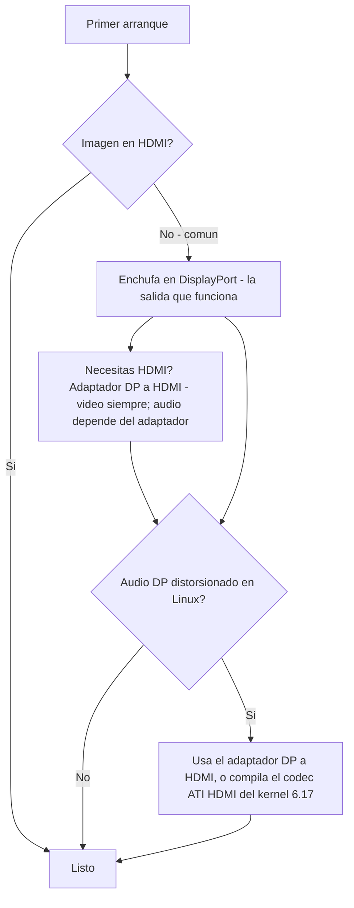

> 🌐 Traducción de la comunidad. La versión en inglés es la fuente de verdad y puede estar más actualizada. ¿Encontraste un error? Abre un issue: [../en/14-display.md](../en/14-display.md) · https://github.com/lildebil0/awesome-bc250/issues

# Pantalla y salida

> **TL;DR** — La BC-250 manda imagen a tu monitor por **DisplayPort**. Ese es el conector que tienes que enchufar. Si tu placa también trae un puerto HDMI, **muy a menudo no muestra nada** — así que una pantalla en negro ahí *no* es una placa muerta, simplemente estás en la salida equivocada. ¿Necesitas HDMI? Usa un **adaptador DP→HDMI** — **el vídeo siempre pasa, sin lag**; algunos adaptadores llevan **audio** también (uno probado lo hizo, [src](https://t.me/c/2424231195/9148)) pero el audio depende del adaptador concreto, así que no cuentes con ello (consulta la sección de audio). Una rareza real: **el audio por DisplayPort sale distorsionado/ralentizado en Linux**; el mismo adaptador DP→HDMI lo esquiva, y un arreglo apropiado del lado del kernel llega alrededor del **kernel 6.17** ([src](https://t.me/c/2424231195/17953), [src](https://t.me/c/2424231195/68051)).

"Sin imagen en el primer arranque" es el **pánico número 1 de los recién llegados**. Lee el recuadro de abajo antes de decidir que algo está roto.

---

## ¿Sin imagen? Haz esto

1. **Enchufa en DisplayPort, no en HDMI.** La salida de vídeo que funciona en la BC-250 es DisplayPort ([src](https://t.me/c/2424231195/104784)). El puerto HDMI (donde lo hay) es el que normalmente está en blanco — no juzgues la placa por él.
2. **Reasienta la tarjeta e inténtalo de nuevo.** Las placas habitualmente no inicializan al primer intento — apaga y enciende del todo (off/on completo), y reasienta físicamente. Un propietario: *"cuando me llegó la mía tampoco encendió al primer intento … a veces no inicializa del todo en un reinicio por botón — off/on lo arregla"* ([src](https://t.me/c/2424231195/15701)).
3. **Sospecha del cable/adaptador antes que de la placa.** Con una sola tarjeta, un cable o adaptador defectuoso es el sospechoso principal ([src](https://t.me/c/2424231195/15699)). Algunos adaptadores funcionan en el firmware pero se van a negro en cuanto carga el SO — *"la imagen iba bien antes de GRUB, pantalla en negro en el sistema"* ([src](https://t.me/c/2424231195/38184)).
4. **Resetea la BIOS / reflashea una imagen que sepas que funciona** si varias tarjetas de un lote no dan imagen — eso apunta al firmware, no a tu monitor ([src](https://t.me/c/2424231195/15697), [src](https://t.me/c/2424231195/15705)).

Si descartas las cuatro y aun así no tienes nada, dirígete a [troubleshooting.md](troubleshooting.md).



---

## Las salidas de un vistazo

| Salida | ¿Funciona? | Notas |
|--------|--------|-------|
| **DisplayPort** | **Sí — esta es la salida** | Conector de pantalla principal/único; lleva audio. La especificación de I/O del repo lista `1x DisplayPort` ([repo](https://github.com/mothenjoyer69/bc250-documentation)). Es **DisplayPort 1.4**, techo **4K@120 Hz**, con HDR10 ([elektricM](https://github.com/elektricM/amd-bc250-docs/blob/main/docs/hardware/display.md)). |
| **Puerto HDMI** (si lo trae) | **A menudo en blanco** | Los recién llegados creen que la placa está muerta; normalmente no lo está — cambia a DP. ([src](https://t.me/c/2424231195/104784)) |
| **DP → HDMI vía adaptador** | **Vídeo: sí. Audio: depende del adaptador** | El vídeo pasa sin lag ([src](https://t.me/c/2424231195/9148)); el audio depende del chipset — pruébalo (consulta la sección de audio). También es el arreglo estándar para la distorsión de audio por DP (abajo). |
| **Segunda salida de vídeo** | **No recién sacada de la caja** | Presente eléctricamente pero **sin poblar**; forzar un 2º monitor requiere hacks, y otros dicen que el chip no tiene un 2º cabezal real — trata la salida única como la suposición segura. ([src](https://t.me/c/2424231195/92978), [src](https://t.me/c/2424231195/104682)) |
| **Segunda pantalla por la red** | **Sí** | Transmite la salida de la BC-250 a otra máquina por LAN (Steam/Sunshine). ([src](https://t.me/c/2424231195/23660)) |

---

## Resoluciones, refresco y cable

La referencia de elektricM concreta lo que realmente hace el único enlace DP — útil al elegir monitor o adaptador ([elektricM](https://github.com/elektricM/amd-bc250-docs/blob/main/docs/hardware/display.md)):

| Resolución | Refresco | Vía |
|------------|---------|------|
| 1920×1080 (1080p) | 144 Hz+ | DP nativo, o cualquier adaptador |
| 2560×1440 (1440p) | 144 Hz+ | DP nativo (los adaptadores pasivos a menudo topan en 1440p@60 / DP 1.2) |
| 3840×2160 (4K) | 60 Hz | DP nativo, o adaptador DP→HDMI 2.0 **activo** |
| 3840×2160 (4K) | 120 Hz | **Solo DP nativo** — se necesita un adaptador activo DP 1.4→HDMI 2.1 para 4K@120 por HDMI, y va inestable |

- **Cable:** usa un cable **DisplayPort 1.4 certificado VESA**, de **1–2 m**; los cables más largos causan problemas de sincronización/cortes ([elektricM](https://github.com/elektricM/amd-bc250-docs/blob/main/docs/hardware/display.md)).
- **Atascado en baja resolución** (p. ej. 1024×768/1080p, solo 60 Hz) normalmente significa que el driver de la GPU no está cargado — comprueba `glxinfo | grep "OpenGL renderer"`; `llvmpipe` = renderizado por software, instala Mesa 25.1+ y quita `nomodeset` ([elektricM](https://github.com/elektricM/amd-bc250-docs/blob/main/docs/troubleshooting/display.md)). Consulta [06-linux.md](06-linux.md).
- **HDR (HDR10) y VRR** funcionan pero son experimentales en Linux — **KDE Plasma 6+** tiene el mejor soporte y en general necesita una sesión Wayland ([elektricM](https://github.com/elektricM/amd-bc250-docs/blob/main/docs/hardware/display.md)). **La distro importa aquí:** un informe de la comunidad r/BC250Gaming (Reddit) consiguió que **HDR + VRR funcionara correctamente solo en CachyOS** (Plasma 6 + Wayland), mientras que en **Bazzite HDR causaba fallos gráficos y VRR nunca funcionó en absoluto**. Su ejemplo: *Forza Horizon 6* a **1440p High, HDR + VRR activados, 60–80 FPS** a través de un adaptador **UGREEN DP→HDMI 2.1**. Si HDR/VRR es prioridad, consulta la nota sobre CachyOS en [06-linux.md](06-linux.md).
  - **Si estás en Bazzite KDE y quieres VRR/FreeSync por HDMI**, hay un remix de la comunidad que mete el trabajo de kernel HDMI 2.1 / FRL de AMD: **[`dyllan500/bazzite-amd-hdmi-kde`](https://github.com/dyllan500/bazzite-amd-hdmi-kde)** — una imagen de Bazzite KDE recompilada sobre un kernel que lleva los parches oficiales de VRR HDMI-2.1 de AMD (de `amd-staging-drm-next`). ⚠ **matiza fuerte:** es una imagen de terceros, el autor probó VRR solo en una **Radeon 9070 XT** (no la BC-250), y está pensada para quedar obsoleta una vez que los parches lleguen a un kernel de Bazzite de serie. *No* es un arreglo confirmado para la BC-250 — trátala como una vía experimental para probar, no como una garantía.

> **Pantalla en negro *tras el login* (GRUB y la pantalla de login iban bien)** es un problema de la sesión de escritorio, normalmente **Wayland** — elige "GNOME on Xorg"/"Plasma (X11)" en el engranaje del login, o pon `WaylandEnable=false` en `/etc/gdm/custom.conf` ([elektricM](https://github.com/elektricM/amd-bc250-docs/blob/main/docs/hardware/display.md)). Una pantalla en negro *antes* del login es el problema del driver/`nomodeset` de arriba, no este.

---

## El audio por DisplayPort sale distorsionado — el arreglo del adaptador

En Linux, el audio enviado **directamente por DisplayPort** sale mal en la BC-250 — descrito como distorsionado, *"estirado, como si fuera a media velocidad"*, con chasquidos ([src](https://t.me/c/2424231195/9895)). Esto es un **problema de Linux/protocolo DP, no un defecto de la placa** — se ha visto también en hardware que no es BC-250 ([src](https://t.me/c/2424231195/15983)).

La solución contundente y fiable que el chat acabó adoptando: **pasa la señal por un adaptador DP→HDMI.** Convertida a HDMI, los artefactos de audio desaparecen ([src](https://t.me/c/2424231195/17953), [src](https://t.me/c/2424231195/51763)). Un usuario lo verificó directamente: *"probé la salida de audio por un adaptador DisplayPort→HDMI. Todo bien, sin lag"* ([src](https://t.me/c/2424231195/9148)).

**La vía más limpia de todas es un *cable* DP→HDMI directo — clavija DP en un extremo, clavija HDMI en el otro, sin dongle ni caja adaptadora en ningún extremo.** Varios usuarios en el hilo de la comunidad r/linux_gaming informan de forma independiente de que esto da el audio más fiable: un cable simple (p. ej. un cable Amazon Basics DP-to-HDMI, ~$10) "simplemente funciona" donde los adaptadores tipo dongle son cuestión de suerte. Aún pueden ocurrir silenciamientos breves ocasionales del audio, pero un cable de una sola pieza elimina el chipset adaptador extra que hace de la vía del dongle una apuesta ([r/linux_gaming](https://www.reddit.com/r/linux_gaming/comments/1nvsgji/)). Si vas a comprar de todas formas, **prefiere el cable antes que un dongle.**

**Si no tienes un adaptador a mano,** enruta el audio por **Bluetooth** en su lugar — la mayoría de altavoces/auriculares lo soportan y esquiva por completo la vía DP ([src](https://t.me/c/2424231195/89769)). Consulta [10-wifi-bt.md](10-wifi-bt.md) para el dongle BT.

### Notas sobre adaptadores (comunidad)
- **Para 4K@60+ necesitas un adaptador/cable *activo*** (los pasivos topan en ~1440p@60). Un ejemplo que funciona y está probado: **UGREEN DP125 (cable DP→HDMI 4K)** — homologado a 4K@30 pero negoció 4K@60 en un televisor ([src](https://t.me/c/2424231195/52398)). Activo vs pasivo fija el techo de resolución — **no** decide si pasa el audio (ver abajo).
- **No todos los adaptadores llevan audio.** El adaptador Belsis de un propietario pasó 4K@60 *con* sonido, mientras que varias unidades Ugreen más caras mostraban "HDMI digital audio" en la lista de dispositivos pero no daban sonido — y una bajó las voces una octava ([src](https://t.me/c/2424231195/106617)). Si tienes vídeo pero no audio, el adaptador es la variable — prueba otro.
- **Para *audio* por HDMI, tira primero de un adaptador *pasivo*.** Un patrón de la comunidad en el hilo de r/linux_gaming: los adaptadores DP→HDMI **pasivos** tienden a pasar el audio limpiamente, mientras que los adaptadores **activos** a menudo **eliminan el audio por completo o le cambian el tono** (voces que, según informan, bajan ~20% / aproximadamente una quinta). El truco: solo *necesitas* un adaptador activo para **HDR** de verdad (y para 4K@60+), así que es un auténtico compromiso — pasivo para sonido fiable, activo para HDR. Opciones *pasivas* confirmadas por la comunidad como funcionales: **Silver Monkey**, **BENFEI (ASIN B017Q8ZVWK)**, y el **_cable_ AmazonBasics DP-to-HDMI** (el cable de una sola pieza — *no* su adaptador tipo dongle) ([r/linux_gaming](https://www.reddit.com/r/linux_gaming/comments/1nvsgji/)). ⚠ los SKU concretos son reportados por la comunidad, no verificados en laboratorio aquí — y un adaptador pasivo aún topa en ~**1440p@60**.
- Existen adaptadores **DP→HDMI 4K@60** baratos que pasan tanto vídeo como audio y se reportan funcionando ([src](https://t.me/c/2424231195/133977)).
- Algunos adaptadores se portan mal específicamente en **monitores 4K** ([src](https://t.me/c/2424231195/1988)).
- **El audio por un adaptador DP→HDMI es inconsistente y depende del chipset del adaptador — no simplemente de activo vs pasivo.** El vídeo siempre pasa; **el audio es la variable.** Nuestros informes de la comunidad son adaptador por adaptador (unidades UGREEN/Belsis reportadas llevando sonido, algunas otras unidades en silencio), y la guía de elektricM reporta la división *contraria* (los pasivos llevando audio, algunas unidades activas en silencio — p. ej. Cable Matters/StarTech) — que es exactamente por qué la etiqueta activo/pasivo no lo predice ([elektricM](https://github.com/elektricM/amd-bc250-docs/blob/main/docs/troubleshooting/display.md)). Para audio **fiable**, no apuestes por un adaptador: prefiere una **pantalla/receptor AV nativo de DisplayPort**, o saca el sonido por **USB (un DAC/dispositivo de sonido USB)**. Si usas un adaptador, **prueba el audio antes de fiarte de él** — y recuerda que un adaptador **pasivo** topa en ~**1440p@60**.

### El arreglo del kernel 6.17 (audio DP-directo, sin adaptador)

Si quieres audio limpio **directamente por DisplayPort** sin adaptador, la causa y el arreglo se rastrearon en el chat. La configuración de kernel de serie de Fedora compilaba `snd-hda-codec-hdmi.ko` + `snd-hdmi-lpe-audio.ko`; **el kernel 6.17 cambió la ruta de audio HDMI** y rompió el sonido con esa configuración por defecto. El arreglo es compilar también el **codec ATI HDMI** — cambia la configuración del kernel de `# CONFIG_SND_HDA_CODEC_HDMI_ATI is not set` a `CONFIG_SND_HDA_CODEC_HDMI_ATI=m`, que empaqueta `snd-hda-codec-atihdmi.ko`; el sonido entonces funciona **sin parches** ([src](https://t.me/c/2424231195/68051), [src](https://t.me/c/2424231195/68061)).

```text
# Fedora kernel config change for DP/HDMI audio on kernel 6.17+
# from:
# CONFIG_SND_HDA_CODEC_HDMI_ATI is not set
# to:
CONFIG_SND_HDA_CODEC_HDMI_ATI=m
```

Con ese tercer codec (`snd-hda-codec-atihdmi.ko`) presente, ALSA expone las salidas de audio de la placa (p. ej. `pcm=3` y `pcm=7` como dos dispositivos HDMI) ([src](https://t.me/c/2424231195/68062), [src](https://t.me/c/2424231195/67569)). ⚠ verifica — esto requiere compilar un kernel personalizado; trata el adaptador DP→HDMI como la vía sin compilación para la mayoría de usuarios. Consulta [06-linux.md](06-linux.md) para la configuración de kernel/driver.

### Sonido envolvente (5.1) — usa una tarjeta de sonido USB, no HDMI

**El envolvente 5.1 por HDMI *no* funciona en la BC-250.** El firmware HDMI de AMD en Linux para este die headless/de minería no expone LPCM multicanal, así que la salida HDMI cae a estéreo plano sin importar lo que soporte el receptor ([r/linux_gaming](https://www.reddit.com/r/linux_gaming/comments/1nvsgji/)). Para multicanal de verdad, saca el audio por una **tarjeta de sonido USB / DAC USB** en su lugar — ponla como sink por defecto en `pavucontrol`, luego confirma los seis canales con:

```bash
speaker-test -D pipewire -c 6 -t wav
```

La misma vía del DAC USB es también el arreglo fiable para el audio estéreo cuando los adaptadores se portan mal (arriba).

---

## La segunda salida (inicialmente inactiva)

Hay una **segunda salida de vídeo en la placa que no está activa recién sacada de la caja.** La lectura de la comunidad está dividida y vale la pena conocer ambas mitades:

- Está **presente eléctricamente pero sin poblar/soldar**, y *"con hacks puedes hacer que funcione un 2º monitor"* ([src](https://t.me/c/2424231195/92978)).
- Otros reportan que el chip simplemente **no tiene un segundo cabezal usable** — *"el problema está en el chip, la segunda salida físicamente no está ahí"* ([src](https://t.me/c/2424231195/104682)).

En la práctica: **asume una salida DisplayPort.** Se ha preguntado por un **divisor DP MST para dos pantallas independientes pero no se ha confirmado funcionando** en nuestro chat ([src](https://t.me/c/2424231195/92109)).

**Actualización de elektricM — MST puede manejar dos pantallas con el hub adecuado.** Las pruebas de elektricM reportan hasta **2 pantallas vía un hub DP MST** (ancho de banda compartido, resolución por pantalla limitada), con resultados hub por hub ([elektricM](https://github.com/elektricM/amd-bc250-docs/blob/main/docs/hardware/display.md)):

| Hub MST | Salida | Versión DP | ¿Pantallas independientes? | Audio | Notas |
|---------|-----|--------|-----------------------|-------|-------|
| StarTech MST14DP122DP | 2× DP | 1.4 | **Sí** | Sí | Funcionó de forma consistente entre monitores/cables |
| Monoprice 21972 | 2× DP | 1.2 | **Solo espejo** | Sí | Solo podía hacer espejo |
| ENBUER | 2× DP | 1.2 | **Solo espejo** | Sí | Solo podía hacer espejo |
| HDMI MST genérico | 2× HDMI | — | **No** | No | Sin vídeo ni audio |

Así que el doble monitor nativo **sí** es posible vía MST con un hub DP 1.4 (StarTech confirmado); los hubs DP 1.2 más baratos puede que solo hagan espejo, y los hubs HDMI MST fallaron. ⚠ verifica — un único modelo de hub confirmado; los resultados varían según el hub.

**Otra vía multi-pantalla — adaptador USB DisplayLink.** Añade un adaptador USB→HDMI/DP DisplayLink para una pantalla de **escritorio** extra (enchúfalo *después* del arranque para mejores resultados). **No para juegos** — comprime en la CPU, que es el cuello de botella de la BC-250, así que la latencia es alta; tampoco funciona en el **game mode** de la Steam Deck ([elektricM](https://github.com/elektricM/amd-bc250-docs/blob/main/docs/hardware/display.md)).

---

## Segunda pantalla por la red (la "2ª pantalla" fácil)

Si lo que de verdad quieres es la imagen de la BC-250 en un segundo dispositivo, la vía probada no es un segundo cable — es **transmitir por LAN.** Un usuario: *"lancé un juego de Steam en la BC-250 (Fedora) y lo transmití por la red a mi portátil de trabajo, lo controlé desde el portátil. Todo funcionó"* ([src](https://t.me/c/2424231195/23660)).

- **Sunshine** (codificador host) funciona aquí porque no es solo-NVIDIA — hace la codificación, el cliente solo decodifica ([src](https://t.me/c/2424231195/25091)). Por LAN gigabit se reporta casi impecable ([src](https://t.me/c/2424231195/25563)).
- **Moonlight como host** *no* encaja — espera un codificador NVIDIA y da tirones/se queja de un decodificador hardware ausente ([src](https://t.me/c/2424231195/25050)). Usa Sunshine como host, Moonlight solo como cliente.

Esta es también la forma práctica de conseguir una sensación de "pantalla dual" sin la segunda salida sin poblar de arriba.

---

## Fuentes

- El adaptador DP→HDMI pasa vídeo+audio, sin lag — https://t.me/c/2424231195/9148
- La distorsión de audio por DP es un problema de Linux; el adaptador lo arregla — https://t.me/c/2424231195/17953 · https://t.me/c/2424231195/9895 · https://t.me/c/2424231195/51763 · https://t.me/c/2424231195/15983
- Arreglo de audio del kernel 6.17 (`CONFIG_SND_HDA_CODEC_HDMI_ATI=m`) — https://t.me/c/2424231195/68051 · https://t.me/c/2424231195/68061 · https://t.me/c/2424231195/68062 · https://t.me/c/2424231195/67569
- Adaptadores que funcionan — UGREEN DP125 https://t.me/c/2424231195/52398 · Belsis vs otros (el audio varía) https://t.me/c/2424231195/106617 · 4K@60 barato https://t.me/c/2424231195/133977
- DP es la salida que funciona; gasta en un buen adaptador DP→HDMI — https://t.me/c/2424231195/104784
- Sin imagen en el primer arranque / reasentar / reflashear — https://t.me/c/2424231195/15697 · https://t.me/c/2424231195/15699 · https://t.me/c/2424231195/15701 · https://t.me/c/2424231195/38184
- Segunda salida presente pero sin poblar / en debate — https://t.me/c/2424231195/92978 · https://t.me/c/2424231195/104682 · MST preguntado https://t.me/c/2424231195/92109
- Segunda pantalla por red (Sunshine/Steam por LAN) — https://t.me/c/2424231195/23660 · https://t.me/c/2424231195/25091 · https://t.me/c/2424231195/25050 · https://t.me/c/2424231195/25563
- Audio Bluetooth como alternativa — https://t.me/c/2424231195/89769
- Un **cable** DP→HDMI directo (sin adaptadores) es el audio más fiable; el 5.1 por HDMI no funciona (sin LPCM multicanal), usa una tarjeta de sonido USB / DAC — hilo de la comunidad r/linux_gaming https://www.reddit.com/r/linux_gaming/comments/1nvsgji/
- Referencia de I/O de hardware (`1x DisplayPort`) — [mothenjoyer69/bc250-documentation](https://github.com/mothenjoyer69/bc250-documentation) · [`hardware.md`](https://github.com/mothenjoyer69/bc250-documentation/blob/main/hardware.md)
- DP 1.4 / 4K@120 / HDR10, límites de resolución+cable, hubs MST (máx 2), DisplayLink, pantalla en negro en login Wayland — elektricM [`hardware/display.md`](https://github.com/elektricM/amd-bc250-docs/blob/main/docs/hardware/display.md)
- HDR + VRR funcionando en CachyOS (Plasma 6 + Wayland) vs roto en Bazzite; Forza Horizon 6 1440p High HDR+VRR por UGREEN DP→HDMI 2.1 — informe de la comunidad r/BC250Gaming (Reddit) (consulta [06-linux.md](06-linux.md))
- El DP→HDMI pasivo lleva audio / el activo lo elimina o le cambia el tono; pasivo pero necesario para HDR; pasivos confirmados Silver Monkey / BENFEI B017Q8ZVWK / cable AmazonBasics DP-to-HDMI — [hilo de la comunidad r/linux_gaming](https://www.reddit.com/r/linux_gaming/comments/1nvsgji/)
- Remix Bazzite KDE VRR/FreeSync por HDMI (kernel AMD HDMI 2.1; probado en 9070 XT, no BC-250) — [`dyllan500/bazzite-amd-hdmi-kde`](https://github.com/dyllan500/bazzite-amd-hdmi-kde)
- El audio del adaptador depende del chipset (elektricM vio el pasivo llevarlo / algunos activos en silencio; la comunidad vio lo contrario — así que prefiere DP-nativo o un DAC USB), comprobación de baja resolución llvmpipe — elektricM [`troubleshooting/display.md`](https://github.com/elektricM/amd-bc250-docs/blob/main/docs/troubleshooting/display.md)

> La configuración de driver/kernel está en [06-linux.md](06-linux.md); las pegas de audio/salida también están indexadas en [troubleshooting.md](troubleshooting.md) y [faq.md](faq.md).
