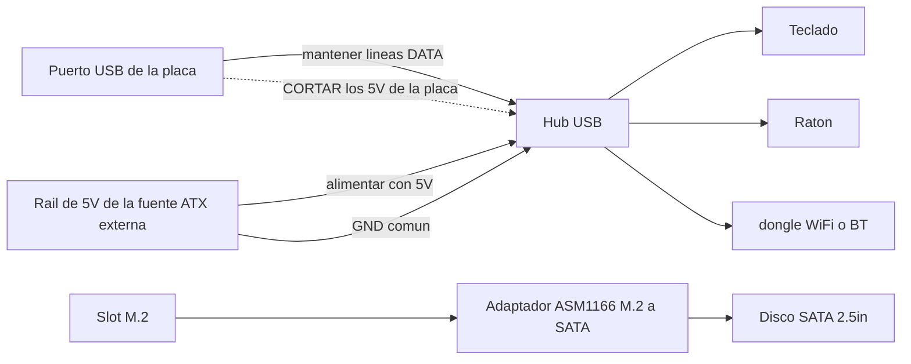

> 🌐 Traducción de la comunidad. La versión en inglés es la fuente de verdad y puede estar más actualizada. ¿Encontraste un error? Abre un issue: [../en/16-usb-peripherals.md](../en/16-usb-peripherals.md) · https://github.com/lildebil0/awesome-bc250/issues

# USB, hubs y periféricos

> **TL;DR** — La placa te da **4 puertos USB traseros (2× USB 2.0 + 2× USB 3.0)** y nada más — sin headers internos cableados por defecto. Un dongle WiFi/BT, un SSD por USB, teclado, ratón y un mando se los comen rápido, así que casi todo el mundo añade un **hub USB**. El problema: la **línea de 5 V del USB de la placa es débil** y cae bajo carga, así que los hubs baratos alimentados por bus (e incluso las memorias flash conectadas directamente) se desconectan. Las soluciones fiables, en orden: un **hub con alimentación (activo)**, o el **mod de inyección de 5 V** de la comunidad — corta los 5 V que el hub toma de la placa y aliméntalo con 5 V desde tu fuente ATX en su lugar. ([src](https://t.me/c/2424231195/119741))

Esta es una página de **accesorios**. Acierta con el hub y el resto (audio, Ethernet por USB, docks) simplemente funciona.

---

## Cuántos puertos USB tienes en realidad

Según la referencia de hardware, la E/S trasera es **1× DisplayPort, 1× GbE Ethernet, 2× USB 2.0, 2× USB 3.0**. Así que cuatro puertos USB físicos. ([hardware.md](https://github.com/mothenjoyer69/bc250-documentation/blob/main/README.md))

En la práctica, los dos puertos **USB 3.0** son por los que la gente pelea (más rápidos, usados para SSDs/docks), y están cableados **estrechos** eléctricamente — un propietario describe el conector como efectivamente "x2", y advierte contra colgar un splitter de él. ⚠ verifica el ancho de carril exacto. ([src](https://t.me/c/2424231195/75561))

El apuro es real en cuanto enumeras lo que quiere un puerto: **conecta un SSD — un puerto fuera; añade un dongle WiFi USB, un joystick, un disco externo — necesitas un hub, de lo contrario te arriesgas a freír el puerto.** ([src](https://t.me/c/2424231195/75558)) La gente reporta de forma rutinaria "todos los USB 3.0 ocupados, teclado y ratón pasando por un hub." ([src](https://t.me/c/2424231195/110875))

**No hay headers USB de panel frontal poblados** recién sacado de la caja — pero el chasis/placa tiene un sitio claramente pensado para enrutar el cable de un hub hacia el frente, que varios montajes con chasis usan. ([src](https://t.me/c/2424231195/91322)) · ([src](https://t.me/c/2424231195/100249))

---

## El problema real: la línea de 5 V del USB es débil

La BC-250 genera los **5 V para el USB en la propia placa** ([src](https://t.me/c/2424231195/57920)), y esa línea no puede suministrar mucho. La medición más clara del chat, en una placa que no enumeraba dispositivos:

> "Mi BC-250 [no] da 5 V correctos en USB… solo funciona un teclado; si conecto un ratón el teclado se apaga. ~**4.3 V** solo con el teclado, **2.3 V–3.2 V** con teclado + ratón, **5.1 V** con ambos retirados." ([src](https://t.me/c/2424231195/119071))

Esa caída de voltaje es la razón por la que los síntomas se agrupan en torno a la **carga**: memorias flash y micrófonos que **se caen al conectarlos directamente pero funcionan bien a través de un hub**, teclados que pierden sus LEDs, dispositivos que se desconectan en el momento en que dos cosas consumen a la vez. ([src](https://t.me/c/2424231195/53939)) Es la misma sensibilidad a la alimentación que hace que los dongles WiFi sean inestables — consulta **[10-wifi-bt.md](10-wifi-bt.md)**, donde los sticks van en reposo y luego se caen en un pico de descarga.

> ⚠ No todas las placas son así de malas. Un propietario alimenta un **dongle WiFi + teclado por cable + ratón vía un hub sin alimentación + una pantalla de 14″ + una pantalla auxiliar de 3.5″** desde el USB de la placa y reporta que va bien. ([src](https://t.me/c/2424231195/119231)) Trata tu propia placa como una incógnita hasta que la cargues.

---

## Elegir un hub: con alimentación vs sin alimentación

| Tipo de hub | Cuándo funciona | Veredicto |
|----------|---------------|---------|
| **Sin alimentación (alimentado por bus)** | Cargas ligeras — teclado, ratón, un dongle. Algunas placas mueven una cantidad sorprendente así. ([src](https://t.me/c/2424231195/119231)) | Vale la pena probarlo primero; **espera desconexiones** en cuanto añadas un disco o haya picos de carga. |
| **Con alimentación / activo (transformador externo de 5 V)** | Cualquier cosa con discos, varios dongles, o bajo carga. La recomendación permanente de la comunidad para la BC-250. ([src](https://t.me/c/2424231195/75558)) · ([src](https://t.me/c/2424231195/119229)) | **Compra esto.** Resuelve la caída sin tocar la placa. ([src](https://t.me/c/2424231195/140091)) |
| **Mod de inyección de 5 V** (ver abajo) | Cuando quieres un montaje limpio, con chasis, alimentado enteramente desde la fuente ATX y no quieres un segundo adaptador de pared. | Mejor integración, requiere soldadura. ([src](https://t.me/c/2424231195/119741)) |

El consejo que se repite cuando los dispositivos USB de alguien se portan mal es simplemente: **consigue un hub USB activo con entrada para adaptador de corriente.** ([src](https://t.me/c/2424231195/119229)) Varios propietarios acabaron ahí tras pelear con desconexiones — "se solucionó con un hub alimentado externamente." ([src](https://t.me/c/2424231195/123789))

> Una advertencia planteada en el chat: depender de un hub alimentado externamente puede ser **permanente** — una vez que descargas la alimentación USB externamente, no te sorprendas si te quedas con ese hub para siempre. ([src](https://t.me/c/2424231195/123924)) Es un buen trato para un montaje de escritorio.

---

## El mod de inyección de 5 V (hacer que un hub normal se comporte)

Esta es la solución elegante para un **montaje con chasis que ya funciona desde una fuente ATX/SFX**: en lugar de comprar un hub con alimentación activa con su propio adaptador de pared, tomas un hub corriente y **cambias de dónde vienen sus 5 V**.

Lo que hizo un usuario, y funcionó ([src](https://t.me/c/2424231195/119741)):

> "Modifiqué un hub USB normal y funcionó. **Corté los 5 V que vienen de la placa base y di 5 V desde la fuente**. No necesité conectar tierra porque estoy usando la misma fuente ATX para alimentar mi BC-250."

Cómo funciona:

1. Abre el hub; encuentra la pista/cable de **5 V (VBUS)** en el lado **upstream** (el cable que se conecta a la placa).
2. **Corta esos 5 V** para que el hub ya no consuma alimentación de la débil línea de la placa.
3. Alimenta el hub con **+5 V desde tu fuente ATX** (una línea de 5 V SATA/Molex libre).
4. **La tierra se comparte** automáticamente porque la misma fuente ya alimenta la placa — no se necesita cable de tierra adicional. (Si alguna vez alimentas el hub desde una fuente *separada*, **debes** unir las tierras en común.)

Las líneas de datos quedan intactas — solo estás cambiando la fuente de alimentación. La placa ve un hub que ya no carga su línea de 5 V, y los dispositivos reciben alimentación limpia y abundante de la fuente.



> ⚠ Cortar la pista equivocada deja el hub en estado de brick (barato) — pero asegúrate de cortar **VBUS, no una línea de datos**. Vuelve a comprobarlo con un multímetro antes de soldar.

---

## Basura a evitar

- **Hubs Hoco** — señalados como poco fiables; un propietario **tuvo que re-soldar el mismo hub Hoco dos veces**. ([src](https://t.me/c/2424231195/74531))
- **Hubs "USB 3.0" que no lo son** — un "hub/dock USB 3.0" de AliExpress de 160 ₽ fue marcado como **definitivamente no 3.0 real** a ese precio. ([src](https://t.me/c/2424231195/8761)) · ([src](https://t.me/c/2424231195/8764))
- **Encadenar hubs en cascada (daisy-chaining)** para multiplicar puertos — planteado como idea ([src](https://t.me/c/2424231195/104653)) pero apila el problema de alimentación; una línea débil ahora alimenta dos hubs. Usa un único buen hub con alimentación en su lugar.
- **"Hubs" splitter de SATA** desde el slot M.2 — una confusión recurrente. Con solo **2 carriles PCIe** en el M.2 no puedes colgar de forma sensata un controlador SATA y esperar que se abra en abanico; "esos hubs de un-SATA-de-entrada, muchos-de-salida son basura." ([src](https://t.me/c/2424231195/22539)) No es un tema de USB — simplemente no lo confundas con la expansión USB.
- ★ **Controlador M.2→SATA PH516 (6 puertos) — confirmado que NO funciona.** El puerto enumera pero el disco no se adjunta, y una **segunda persona reprodujo** el mismo fallo ([4pda — Strange999](https://4pda.to/forum/index.php?showtopic=1104980)). Compra el **ASM1166** recomendado por la comunidad en su lugar (ver la sección de almacenamiento) — el PH516 es un callejón sin salida conocido en esta placa.

Un hub con un **códec de audio integrado** es un ahorro de espacio elegante para montajes con chasis (un dispositivo te da puertos extra *y* un jack de 3.5 mm), y la gente los usa. ([src](https://t.me/c/2424231195/8751)) La calidad de audio varía — es un códec barato. ([src](https://t.me/c/2424231195/39708))

---

## Header USB 3.0 interno (Type-E)

Si tu chasis tiene un **conector USB 3.0 frontal** (el conector de 20 pines "Key-A/Type-E") querrás alimentarlo desde el USB 3.0 de la placa. **No hay header nativo de 20 pines**, así que la gente adapta:

- Un **cable USB 3.1 Type-E → USB 3.0 (Type-A)** de AliExpress es la vía limpia. Se compartió un AXONUS de 50 cm en el chat. ([src](https://t.me/c/2424231195/133182)) También se publicó una variante Xiwai Type-E → 20 pines. ([src](https://t.me/c/2424231195/125127))
- O **empalma** el cable de fábrica del chasis a un conector USB 3.1 corriente — el método "unir una serpiente con un erizo" cuando no encaja ningún adaptador. ([src](https://t.me/c/2424231195/135957))

**Estado:** **El USB 2.0 está confirmado funcionando; el USB 3.0 estaba aún pendiente de probarse del todo** por el propietario que lo reportó (prueba pendiente tras el montaje dentro del chasis). Trata el 3.0 por adaptador como ⚠ verifica en tu hardware. ([src](https://t.me/c/2424231195/136215))

---

## Almacenamiento (slot M.2 y discos SATA)

El único conector de almacenamiento interno de la placa es un **único slot M.2**, y está cableado como **PCIe 2.0 ×2** — así que el techo práctico es **~1 GB/s** ([src](https://t.me/c/2424231195/66275)) · ([src](https://t.me/c/2424231195/135506)). Un NVMe Gen3/Gen4 rápido *funcionará*, pero no puede alcanzar su velocidad nominal aquí, así que no tiene sentido pagar por un disco de gama alta. **Un SSD NVMe M.2 normal es el disco de arranque más simple** — métela en el slot e instala Linux en ella (consulta **[06-linux.md](06-linux.md)** para la instalación).

### Conectar HDDs/SSDs SATA de 2.5″

No hay puerto SATA en la placa, así que para colgar un **disco SATA de 2.5″** (o varios) pones una **tarjeta adaptadora M.2 → SATA** en el slot M.2. La elección confirmada por la comunidad es la tarjeta de expansión **ASM1166 (M.2 PCIe → SATA)** ([src](https://t.me/c/2424231195/135180)). La otra vía que la gente toma es un **SSD M.2 SATA directamente en la placa** — sin adaptador, solo un stick M.2 con protocolo SATA. ([src](https://t.me/c/2424231195/87411))

Esta es una de las **preguntas más comunes de los recién llegados** — *"¿es este el adaptador que necesito para conectar un disco duro a la placa?"* y *"¿qué otras formas hay de conectar un disco?"* ([src](https://t.me/c/2424231195/135164)) · ([src](https://t.me/c/2424231195/135165)) — así que si la estás haciendo, estás en buena compañía.

> ⚠ verifica — la tarjeta ASM1166 es una recomendación de la comunidad, no un resultado probado por muchos en la BC-250 específicamente. Confirma que tu adaptador elegido enumera y arranca antes de depender de él. Ten en cuenta también que los **2 carriles PCIe** del M.2 no pueden alimentar de forma sensata un *splitter* de un-SATA-de-entrada / muchos-de-salida — consulta **Basura a evitar** arriba. ([src](https://t.me/c/2424231195/22539))

#### ★ Alimentar un disco SATA de 2.5″ (la placa es solo de 12 V)

La tarjeta adaptadora de arriba se encarga de los **datos**, pero un disco SATA de 2.5″ también necesita **alimentación de 5 V** en su conector de alimentación SATA — y la placa BC-250 solo entrega **12 V**, sin header de alimentación SATA del que tirar. La solución práctica de un montaje: un **adaptador USB→alimentación-SATA que entrega 5 V** al disco, con un **convertidor reductor (buck) 12 V→5 V** que produce esos 5 V desde los 12 V de la placa ([TMG HD build](https://youtu.be/OEO0r01zcfU); ⚠ aprox — parafraseado del recorrido en vídeo). En otras palabras: el ASM1166 (o un stick M.2 SATA) lleva los *datos* SATA; el convertidor reductor (buck) + adaptador USB→alimentación-SATA lleva la *alimentación* SATA. Una caja de 2.5″ autoalimentada o un dock con alimentación esquiva todo el problema al traer su propia línea de 5 V.

#### ★ SteamOS "no nvme drive detected" con un stick M.2 SATA

Si arrancas SteamOS con un **SSD M.2 SATA** (p. ej. un **Kingston SNS41**) en lugar de NVMe, el flujo de instalación/reparación puede fallar con **"no nvme drive detected"** — SteamOS asume que el disco es un dispositivo NVMe (`nvme…`), pero un stick SATA enumera como `sda`. La solución es editar el script de reparación y apuntarlo al nombre de dispositivo correcto ([4pda — pornocrat](https://4pda.to/forum/index.php?showtopic=1104980)):

```bash
# Edit the SteamOS repair script and replace the device name nvme -> sda
nano ~/tools/repair_device.sh
# change every "nvme" reference to "sda", save, then re-run the install/repair
```

Esto es puramente un desajuste de nombrado de dispositivo — el stick SATA funciona bien una vez que se le dice a SteamOS que mire `sda` en lugar de un nodo `nvme`.

### Los discos SATA antiguos están bien

Como el enlace M.2 limita todo a ~1 GB/s de todas formas, un viejo **HDD/SSD SATA de 2.5″** es perfectamente adecuado para una **biblioteca de juegos o juegos más antiguos** — la velocidad que perderías es velocidad que la placa no puede entregar. ([src](https://t.me/c/2424231195/132739)) Una **caja USB-NVMe** es otra opción si prefieres dejar el slot M.2 libre, pero las cajas que realmente hacen NVMe (no SATA) empiezan más caras — para un pequeño stick de arranque no merece la pena. ([src](https://t.me/c/2424231195/111022))

### Intel Optane 16 GB como caché/swap — idea de la comunidad, veredicto tibio

Usar un pequeño módulo **Intel Optane 16 GB NVMe** como dispositivo de caché o swap surgió como idea, con un veredicto sobrio ([4pda](https://4pda.to/forum/index.php?showtopic=1104980)): los módulos **"Optane" de 16 GB vendidos en Ozon resultaron no ser Optane real** según las propias pruebas de los miembros, el **slot M.2 de la placa es lento** (PCIe 2.0 ×2, ~1 GB/s) así que la ventaja de latencia queda mermada, y aunque un **archivo de swap es posible en teoría**, no es una victoria clara aquí. Trátalo como una curiosidad, no como una mejora recomendada.

---

## Docks y estaciones de acoplamiento

Un **dock** estilo USB-C / Thunderbolt puede actuar como un hub gordo (USB + Ethernet + a veces vídeo), y los propietarios los han usado:

- Un **dock USB-C dual-4K Wavlink WL-UG69DK1** está en uso por un miembro. ([src](https://t.me/c/2424231195/68141))
- Un **dock DisplayLink** funciona como un **hub USB + tarjeta de sonido USB**; el miembro **no** pudo sacar vídeo de él (chocó con un muro de TPM/BIOS), así que trata el *vídeo* del dock como poco fiable. ([src](https://t.me/c/2424231195/104776))
- Para **monitores específicamente**, un dock no esquivará el límite de salida propio de la GPU — consulta **[14-display.md](14-display.md)** antes de contar con ello.

Conclusión: los docks están bien como **hubs con alimentación** (traen su propia fuente, lo que esquiva limpiamente el problema de los 5 V). No compres uno esperando que funcione su salida de **vídeo**.

---

## Mandos y entrada

Los gamepads montan sobre la misma débil línea USB y la misma historia de Bluetooth inestable que todo lo demás (consulta **[10-wifi-bt.md](10-wifi-bt.md)** para dongles BT). Algunos hallazgos específicos:

- **DualSense en Linux vía DS5Dongle (Raspberry Pi Pico 2W).** Este dongle abierto da al DualSense sus **hápticos HD + altavoz** en Linux y una **UI web** para tasa de sondeo / volumen — pero hay un truco para el audio del juego: los títulos Wine/Proton solo reciben el audio del mando en **modo Direct** (el mando aparece como una única **tarjeta de audio de 4 canales**), y **no todas las distros exponen ese modo** ([4pda — korotyshev](https://4pda.to/forum/index.php?showtopic=1104980)). Por separado, el driver del kernel **`hid-playstation`** (soporte nativo de DualSense) necesita **Bluetooth ≥ 5.0** en el adaptador ([4pda — xDarkman](https://4pda.to/forum/index.php?showtopic=1104980)).
- **GameSir T4 Kaleid + su dongle de 2.4 GHz** es una vía de mando/entrada que funciona y esquiva Bluetooth por completo — entrada con sensación de cableado sobre un receptor USB de 2.4 GHz en lugar de pelear con el emparejamiento BT ([TiredDadTech](https://youtu.be/zi7sldeRd2w); ⚠ aprox — parafraseado del vídeo).
- **El puerto del dongle BT importa: el dongle Bluetooth UGREEN funciona solo en un puerto USB 2.0, no en USB 3.0.** El ruido RF / cableado eléctrico de los puertos 3.0 lo rompe; muévelo a uno de los dos puertos **USB 2.0** y funciona ([4pda — InfernalWolf666](https://4pda.to/forum/index.php?showtopic=1104980)). (El mismo efecto de ruido del USB 3.0 que afecta a los sticks WiFi/BT — consulta [10-wifi-bt.md](10-wifi-bt.md).)

---

## Montaje inicial recomendado

| Nivel | Haz esto | Por qué |
|------|---------|-----|
| Mínimo | Hub alimentado por bus para teclado/ratón/dongle | Gratis si ya tienes uno; bien para cargas ligeras ([src](https://t.me/c/2424231195/119231)) |
| **Recomendado** | **Hub USB con alimentación (activo)** con su propio transformador de 5 V | Arregla la caída, sin soldadura, los discos + dongles se mantienen ([src](https://t.me/c/2424231195/75558)) |
| Montaje con chasis | Hub corriente + **mod de inyección de 5 V** desde la fuente ATX/SFX | La integración más limpia, un adaptador de pared menos ([src](https://t.me/c/2424231195/119741)) |

Un montaje de referencia popular con chasis es exactamente este: **Cooler Master MasterBox NR200P + un hub USB + una fuente SFX** — el hub se trata como una parte por defecto del montaje, no como una idea de última hora. ([src](https://t.me/c/2424231195/81149)) Consulta **[05-case.md](05-case.md)** para el lado del chasis; un chasis imprimible listo incluso agrupa una disposición de HDD + hub USB. ([printables](https://www.printables.com/model/1580750-bc250-amd-case-v3-hp-server-psu-hdd-usb-hub))

---

## Fuentes

- Mod de inyección de 5 V (cortar 5 V de la placa, alimentar desde la fuente) — https://t.me/c/2424231195/119741 · pregunta de cómo hacerlo — https://t.me/c/2424231195/119795
- Caída de voltaje USB medida (4.3 V → 2.3 V) — https://t.me/c/2424231195/119071 · la placa genera 5 V on-board — https://t.me/c/2424231195/57920
- Presupuesto de puertos / "necesitas un hub con alimentación o te arriesgas a freír el puerto" — https://t.me/c/2424231195/75558 · el USB es x2 — https://t.me/c/2424231195/75561 · todos los 3.0 ocupados — https://t.me/c/2424231195/110875
- El hub activo es la solución — https://t.me/c/2424231195/119229 · https://t.me/c/2424231195/123789 · https://t.me/c/2424231195/140091 · puede ser permanente — https://t.me/c/2424231195/123924
- El hub sin alimentación funciona en algunas placas — https://t.me/c/2424231195/119231 · la conexión directa se cae, el hub lo arregla — https://t.me/c/2424231195/53939
- Hub Hoco poco fiable / re-soldado dos veces — https://t.me/c/2424231195/74531 · hub barato "3.0" falso — https://t.me/c/2424231195/8761 · https://t.me/c/2424231195/8764
- Confusión con el splitter SATA — https://t.me/c/2424231195/22539 · encadenar hubs en cascada — https://t.me/c/2424231195/104653
- Almacenamiento: el M.2 es PCIe 2.0 ×2 / ~1 GB/s — https://t.me/c/2424231195/66275 · poner un SSD M.2 SATA en su lugar — https://t.me/c/2424231195/135506 · tarjeta ASM1166 M.2→SATA — https://t.me/c/2424231195/135180 · M.2 SATA directamente en la placa — https://t.me/c/2424231195/87411 · "¿qué adaptador para conectar un disco?" — https://t.me/c/2424231195/135164 · https://t.me/c/2424231195/135165 · SATA 2.5″ antiguo bien para biblioteca de juegos — https://t.me/c/2424231195/132739 · las cajas USB-NVMe cuestan más — https://t.me/c/2424231195/111022
- ★ Alimentar un disco SATA de 2.5″ (USB→alimentación-SATA + buck 12 V→5 V) en la placa solo de 12 V — [TMG HD build](https://youtu.be/OEO0r01zcfU) (⚠ aprox, parafraseado)
- ★ M.2→SATA PH516 (6 puertos) confirmado que NO funciona, reproducido por una segunda persona — [4pda — Strange999](https://4pda.to/forum/index.php?showtopic=1104980)
- ★ SteamOS "no nvme drive detected" con stick M.2 SATA (Kingston SNS41), solución = editar `~/tools/repair_device.sh`, renombrar `nvme`→`sda` — [4pda — pornocrat](https://4pda.to/forum/index.php?showtopic=1104980)
- Intel Optane 16 GB como caché/swap (los de Ozon no son Optane real, M.2 lento, archivo de swap en teoría) — [4pda](https://4pda.to/forum/index.php?showtopic=1104980)
- DS5Dongle (RPi Pico 2W) para DualSense en Linux — hápticos HD/altavoz/UI-web, audio Wine/Proton solo en modo Direct (tarjeta única de 4 canales) — [4pda — korotyshev](https://4pda.to/forum/index.php?showtopic=1104980) · `hid-playstation` necesita BT ≥5.0 — [4pda — xDarkman](https://4pda.to/forum/index.php?showtopic=1104980)
- GameSir T4 Kaleid + dongle de 2.4 GHz como solución de mando/entrada sobre Bluetooth — [TiredDadTech](https://youtu.be/zi7sldeRd2w) (⚠ aprox, parafraseado)
- El dongle BT UGREEN funciona solo en un puerto USB 2.0, no en 3.0 — [4pda — InfernalWolf666](https://4pda.to/forum/index.php?showtopic=1104980)
- Hub con audio integrado — https://t.me/c/2424231195/8751 · https://t.me/c/2424231195/39708
- Cable USB 3.1 Type-E → USB 3.0 (AXONUS) — https://t.me/c/2424231195/133182 · Xiwai Type-E 20 pines — https://t.me/c/2424231195/125127 · empalmar cable de fábrica — https://t.me/c/2424231195/135957
- USB 2.0 confirmado, 3.0 por probar — https://t.me/c/2424231195/136215
- Agujero de panel frontal para el hub — https://t.me/c/2424231195/91322 · https://t.me/c/2424231195/100249
- Docks: dock Wavlink — https://t.me/c/2424231195/68141 · dock DisplayLink como hub+audio, sin vídeo — https://t.me/c/2424231195/104776
- Montaje con chasis NR200P + hub USB + SFX — https://t.me/c/2424231195/81149 · chasis imprimible con hub USB — https://www.printables.com/model/1580750-bc250-amd-case-v3-hp-server-psu-hdd-usb-hub
- Referencia de hardware (lista de E/S trasera) — [mothenjoyer69/bc250-documentation `README.md`](https://github.com/mothenjoyer69/bc250-documentation/blob/main/README.md)

> Relacionado: sensibilidad a la alimentación del dongle WiFi/BT → [10-wifi-bt.md](10-wifi-bt.md) · chasis y enrutado de panel frontal → [05-case.md](05-case.md) · límites de número de monitores → [14-display.md](14-display.md)
