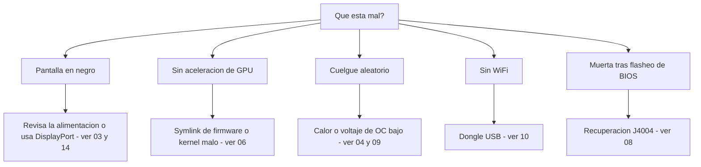

> 🌐 Traducción de la comunidad. La versión en inglés es la fuente de verdad y puede estar más actualizada. ¿Encontraste un error? Abre un issue: [../en/troubleshooting.md](../en/troubleshooting.md) · https://github.com/lildebil0/awesome-bc250/issues

# Solución de problemas

> **TL;DR** — Los modos de fallo de la BC-250 son bien conocidos: la mayoría son de **alimentación**, **calor**, **kernel/firmware** o **un flasheo que salió mal**. Encuentra tu síntoma abajo, aplica el arreglo y sigue el enlace al capítulo completo. En caso de duda, la causa suele ser *un kernel malo*, *falta el symlink de firmware de amdgpu* o *refrigeración insuficiente*.

Esta página es un índice síntoma → causa → arreglo, destilado de los problemas recurrentes de la comunidad. No reemplaza los capítulos — te dirige rápido al correcto.

---

## Arranque / pantalla

| Síntoma | Causa probable | Arreglo |
|---------|--------------|-----|
| Pantalla en negro / sin POST | Cableado o pinout de alimentación incorrecto | Revisa el cableado y el pinout del 8 pines; usa cable de cobre genuino de calibre adecuado → [03 — Alimentación](../en/03-power-supply.md) |
| Pantalla en negro / cuelgues tras haber funcionado | **IOMMU aún activado** (roto en esta placa) | Desactiva IOMMU en la BIOS (elektricM); el parámetro de kernel `iommu=off`/`amd_iommu=off` es ⚠ verificar → [06 — Linux](../en/06-linux.md) |
| Pantalla en negro al arrancar el **instalador** / live USB | El instalador no tiene driver de GPU para la BC-250; KMS falla | Añade `nomodeset` en GRUB (Fedora: Troubleshooting → Basic Graphics Mode); **quítalo tras instalar Mesa** ([elektricM](https://github.com/elektricM/amd-bc250-docs/blob/main/docs/troubleshooting/boot.md)) → [06 — Linux](../en/06-linux.md) |
| Pantalla en negro **tras el login** (GRUB + pantalla de login estaban bien) | Sesión de escritorio, normalmente **Wayland** | Elige X11 ("GNOME on Xorg"/"Plasma X11") en el login, o `WaylandEnable=false` ([elektricM](https://github.com/elektricM/amd-bc250-docs/blob/main/docs/troubleshooting/display.md)) → [14 — Pantalla](../en/14-display.md) |
| Arranca pero sin aceleración de GPU (todo en CPU) | Falta el symlink de firmware de amdgpu, o un kernel malo | Aplica el symlink `navi10_gpu_info.bin` + parámetros de kernel; evita los kernels malos conocidos (abajo) → [06 — Linux](../en/06-linux.md) |
| `glxinfo` muestra **llvmpipe**, juegos a 5–10 FPS | Mesa demasiado antigua, o amdgpu no cargado | Instala **Mesa 25.1.3+**, quita `nomodeset`, confirma `Kernel driver in use: amdgpu` ([elektricM](https://github.com/elektricM/amd-bc250-docs/blob/main/docs/troubleshooting/performance.md)) → [06 — Linux](../en/06-linux.md) |
| Funcionaba, luego se rompió tras una actualización de kernel | Regresión en ese kernel | Haz rollback a un kernel LTS; se reporta que **6.14.7**, **6.15.0–6.15.6** y **6.17.8–6.17.10** rompen amdgpu (fallback a CPU / cuelgues de GPU); elektricM recomienda **6.18.x LTS o 6.17.11+** ⚠ verificar los rangos exactos → [06 — Linux](../en/06-linux.md) |
| Sin audio por HDMI | Regresión del kernel 6.17+ | Usa un kernel LTS, o saca el audio por USB/DisplayPort → [06 — Linux](../en/06-linux.md) |
| Solo funciona una salida de pantalla | Limitación del driver en esta placa | Limitación conocida para dual nativo; **un hub MST da hasta 2 pantallas** (hub DP 1.4) ([elektricM](https://github.com/elektricM/amd-bc250-docs/blob/main/docs/hardware/display.md)) → [14 — Pantalla](../en/14-display.md) |
| Sin imagen, sin POST, **solo con el NVMe instalado** | El SSD aún tiene particiones EFI/recovery de **Windows** | Quita el SSD, borra todas las particiones en otro PC (`wipefs -a`), reinstala ([elektricM](https://github.com/elektricM/amd-bc250-docs/blob/main/docs/troubleshooting/boot.md)) → [06 — Linux](../en/06-linux.md) |
| No hace POST en absoluto (sin BIOS) | Algunas placas no hacen POST **sin batería de CMOS** | Instala una CR2032 nueva y reintenta ([elektricM](https://github.com/elektricM/amd-bc250-docs/blob/main/docs/troubleshooting/boot.md)) → [08 — BIOS](../en/08-bios.md) |
| El arranque **se cuelga ~90 s** y luego continúa | Servicio systemd fallido / timeout de red | `systemctl --failed`; desactiva la unidad atascada ([elektricM](https://github.com/elektricM/amd-bc250-docs/blob/main/docs/troubleshooting/boot.md)) → [06 — Linux](../en/06-linux.md) |
| Kernel panic "**unable to mount root**" / "No init found" | Kernel incorrecto **o** initramfs corrupto | Arranca un kernel más antiguo/LTS; si sigue fallando, haz chroot y regenera el initramfs (`dracut -f` / `update-initramfs -u -k all` / `mkinitcpio -P`) ([elektricM](https://github.com/elektricM/amd-bc250-docs/blob/main/docs/troubleshooting/boot.md)) → [06 — Linux](../en/06-linux.md) |
| Cae a `grub>` / `grub rescue>` | GRUB no encuentra su config/archivos de arranque | Fija `root`/`prefix`, `insmod normal`, arranca; luego reinstala GRUB ([elektricM](https://github.com/elektricM/amd-bc250-docs/blob/main/docs/troubleshooting/boot.md)) → [06 — Linux](../en/06-linux.md) |
| No se puede entrar en la BIOS (Del/F2 ignorados) | Adaptador lento al inicializar, o teclado en USB 3.0 | Pulsa Del inmediatamente; prueba un puerto **USB 2.0** y un cable DP nativo ([elektricM](https://github.com/elektricM/amd-bc250-docs/blob/main/docs/troubleshooting/display.md)) → [08 — BIOS](../en/08-bios.md) |

## Calor / estabilidad

| Síntoma | Causa probable | Arreglo |
|---------|--------------|-----|
| Hace throttling / los FPS se hunden bajo carga | El disipador de fábrica no puede refrigerar en un escritorio | Afina las aletas + ventilador/carcasa de 120 mm de alta presión estática; mantén <80 °C → [04 — Refrigeración](../en/04-cooling.md) |
| Cuelgue / reinicio aleatorio bajo carga | Sobrecalentamiento (>90 °C) **o** voltaje de overclock demasiado bajo | Mejora primero la refrigeración; luego sube el voltaje del undervolt — estable en Furmark ≠ estable en juegos (los juegos necesitan más) → [04](../en/04-cooling.md) · [09](../en/09-overclock-undervolt.md) |
| Estable en Furmark, cuelga en juegos | Voltaje fijado desde Furmark, que exige de menos | Prueba con OCCT + juegos reales; sube el voltaje ~50 mV → [09 — Overclock](../en/09-overclock-undervolt.md) |
| Dos governors peleando | Ejecutar oberon-governor *y* smu_oc/cyan-skillfish a la vez | Ejecuta solo un governor; desactiva los demás → [09 — Overclock](../en/09-overclock-undervolt.md) |
| **Todo el sistema** muere cuando la GPU se cuelga (no solo la app) | APU: CPU+GPU comparten silicio, así que un reset de GPU no puede recuperarse — se lleva el sistema por delante | Esperado en esta arquitectura; previene los cuelgues de GPU (voltaje estable + buena refrigeración + buen kernel) en vez de esperar recuperación ([elektricM](https://github.com/elektricM/amd-bc250-docs/blob/main/docs/troubleshooting/stability.md)) → [09 — Overclock](../en/09-overclock-undervolt.md) |
| La GPU se cuelga → **pantalla en negro, nunca se recupera** mientras un governor está activo | El governor sigue escribiendo en sysfs durante el reset → bucle de reset atascado | Antes de juegos propensos a cuelgues, `systemctl stop cyan-skillfish-governor-smu`; reactívalo después ([elektricM](https://github.com/elektricM/amd-bc250-docs/blob/main/docs/troubleshooting/stability.md)) → [09 — Overclock](../en/09-overclock-undervolt.md) |
| Se congela / pantalla blanca a **solo 60–65 °C** | Algunas placas son inusualmente sensibles a la temperatura | Mejora la refrigeración, reasienta el disipador, repasta (PTM7950); el silicio varía ([elektricM](https://github.com/elektricM/amd-bc250-docs/blob/main/docs/troubleshooting/stability.md)) → [04 — Refrigeración](../en/04-cooling.md) |
| GPU **atascada a 1500 MHz**, no baja el undervolt | Voltaje mínimo fijado **por debajo de 700 mV** — es un suelo duro que vuelve a bloquear la GPU | Mantén el voltaje mínimo **≥ 700 mV** ([elektricM](https://github.com/elektricM/amd-bc250-docs/blob/main/docs/troubleshooting/stability.md)) → [09 — Overclock](../en/09-overclock-undervolt.md) |
| Artefactos / cuelgues que más voltaje no arregla | **Caída de voltaje** bajo carga (la V efectiva baja del valor fijado) | Fija la base ~25 mV más alta para cubrir la caída, o usa una BIOS con el ajuste de loadline/droop ([elektricM](https://github.com/elektricM/amd-bc250-docs/blob/main/docs/troubleshooting/stability.md)) → [09 — Overclock](../en/09-overclock-undervolt.md) |
| Arranca y luego se cuelga con **errores ACPI** (pantalla negra/verde) | Rareza o corrupción de BIOS/ACPI | Borra la CMOS / restablece los valores por defecto de la BIOS; prueba `acpi=off noapic`; reflashea si persiste ([elektricM](https://github.com/elektricM/amd-bc250-docs/blob/main/docs/troubleshooting/stability.md)) → [08 — BIOS](../en/08-bios.md) |
| Suspensión = **pseudo-congelación** (en negro, parece colgado) | La placa no tiene estados de sueño de GPU adecuados; la SMU no soporta suspensión en Linux | Pulsa el botón de encendido para despertar (no lo mantengas); mejor, **desactiva la suspensión** y usa apagado de pantalla. El idle se queda en ~65–85 W de todas formas ([elektricM](https://github.com/elektricM/amd-bc250-docs/blob/main/docs/troubleshooting/stability.md)) → [09 — Overclock](../en/09-overclock-undervolt.md) |

## Rendimiento

| Síntoma | Causa probable | Arreglo |
|---------|--------------|-----|
| FPS más bajos de lo esperado, GPU sin saturar | **Limitado por CPU** (la Zen 2 es el límite en muchos juegos) | Normal; baja los ajustes que cargan la CPU, acéptalo — hacer overclock a la GPU no ayuda aquí → [11 — Juegos](../en/11-gaming.md) |
| Solo 24 CU activas, se esperaban 40 | El stock expone menos CU | Aplica el desbloqueo de 40 CU (`amdgpu.bc250_cc_write_mode=3` + script) → [09 — Overclock](../en/09-overclock-undervolt.md) |
| Steam / FSR / vsync rotos | Un fork de distro "gamer" interfiriendo | Algunos forks ajustados rompen esto; Fedora/Bazzite-bc250 a secas es más seguro → [06 — Linux](../en/06-linux.md) |
| GPU **bloqueada a 1500 MHz** sin importar la carga | Sin governor en espacio de usuario (por defecto bloqueado por BIOS) | Instala un governor de GPU (cyan-skillfish-governor-smu) para escalar la frecuencia ([elektricM](https://github.com/elektricM/amd-bc250-docs/blob/main/docs/troubleshooting/performance.md)) → [09 — Overclock](../en/09-overclock-undervolt.md) |
| El governor corre pero la GPU **no supera 2000 MHz** | Al kernel le falta el parche de rango de frecuencias (tope por defecto 1000–2000) | Usa un kernel parcheado (Bazzite/CachyOS vienen pre-parcheados) o aplica `amdgpu-frequency-range.patch` ([elektricM](https://github.com/elektricM/amd-bc250-docs/blob/main/docs/troubleshooting/performance.md)) → [09 — Overclock](../en/09-overclock-undervolt.md) |
| MangoHud muestra **655 %** de uso de GPU | amdgpu deja la métrica de actividad en `0xFFFF`; MangoHud lee 65535/100 | Ejecuta cyan-skillfish-governor-smu (rama smu) — parchea `gpu_metrics`; no hace falta cambiar nada en MangoHud. O aplica el script independiente **`install_gpu_usage_fix.sh`** ([Old Lamer — Parte XV](https://youtu.be/lSipaWjU6D4)) ([elektricM](https://github.com/elektricM/amd-bc250-docs/blob/main/docs/troubleshooting/performance.md)) → [09 — Overclock](../en/09-overclock-undervolt.md) |
| **Headless** "la GPU no hace nada" en una prueba de carga | `glmark2 --off-screen` recurre silenciosamente a **llvmpipe** (CPU) sin pantalla | Prueba con `clpeak` / `vkmark` / `llama-bench -ngl 99`; confirma que SCLK y la potencia suben ([elektricM](https://github.com/elektricM/amd-bc250-docs/blob/main/docs/troubleshooting/performance.md)) → [06 — Linux](../en/06-linux.md) |
| 60+ FPS pero **tartamudea** / frame times irregulares | Frame pacing (compositor X11, o pacing atado al audio) | Ejecuta a través de **gamescope** (`-W 1920 -H 1080 -f`), o desactiva el compositor / prueba Wayland ([elektricM](https://github.com/elektricM/amd-bc250-docs/blob/main/docs/troubleshooting/performance.md)) → [11 — Juegos](../en/11-gaming.md) |
| El juego **se cuelga por OOM / artefactos y muere** (RDR2, CoH3) | Conflicto **512 MB de VRAM dinámica + ZRAM**, o simplemente **falta de RAM** | Cambia la BIOS a **VRAM fija** (p. ej. 10 GB RAM / 6 GB VRAM); **o** desactiva el ZRAM de systemd y usa **zswap + un swapfile Btrfs de 32 GB** ([Old Lamer — Parte XIV](https://youtu.be/A6juAoY70aU), receta en [06](../en/06-linux.md)/[09](../en/09-overclock-undervolt.md)) ([elektricM](https://github.com/elektricM/amd-bc250-docs/blob/main/docs/troubleshooting/stability.md)) → [08 — BIOS](../en/08-bios.md) |
| Un juego concreto (p. ej. **RDR2**) renderiza en CPU/llvmpipe | El juego usa por defecto el adaptador gráfico equivocado | Fija el adaptador a la GPU AMD dentro del juego; RDR2: lánzalo con `-useMaximumSettings` ([elektricM](https://github.com/elektricM/amd-bc250-docs/blob/main/docs/troubleshooting/performance.md)) → [11 — Juegos](../en/11-gaming.md) |

## Red

| Síntoma | Causa probable | Arreglo |
|---------|--------------|-----|
| Sin WiFi en absoluto | Sin WiFi integrado; el dongle necesita un driver | Usa un dongle de confianza (aic8800d80) + compila su driver → [10 — WiFi/BT](../en/10-wifi-bt.md) |
| El WiFi se cae cada pocos minutos | Chipset Realtek + alimentación USB bajo carga | Conocido con algunos dongles RTL882x; cámbiate a aic8800d80 o a un modelo confirmado → [10 — WiFi/BT](../en/10-wifi-bt.md) |
| El driver desaparece tras reiniciar | Compilado con `make` puro, no empaquetado | Usa la ruta RPM/DKMS del repositorio para que sobreviva a las actualizaciones de kernel → [10 — WiFi/BT](../en/10-wifi-bt.md) |
| El ISP **limita Steam** hasta dejarlo casi parado | DPI/throttling sobre el tráfico del CDN de Steam | Las herramientas anti-throttling (estilo `zapret`) ayudan — pero **el FS de solo lectura de Bazzite las bloquea**; usa una distro mutable (Fedora/Arch). Detalles específicos de operadores RU (Yota, zapret+warp) en la [edición rusa](../ru/06-linux.md) → [06 — Linux](../en/06-linux.md) |

## Windows

| Síntoma | Causa probable | Arreglo |
|---------|--------------|-----|
| GPU = Code 43 / sin aceleración | Sin driver de GPU funcional para Windows (a principios de 2026) | Esperado. Usa Linux. Los drivers de Windows son WIP experimentales → [07 — Windows](../en/07-windows.md) |

## BIOS / brick

> ⚠ **Lee [08 — BIOS](../en/08-bios.md) por completo antes de cualquier flasheo.** Un flasheo malo deja la placa en estado de brick y un borrado de CMOS **no** recupera el mod 1.0/3.00.

| Síntoma | Causa probable | Arreglo |
|---------|--------------|-----|
| Muerta/en negro tras un flasheo de BIOS | Imagen mala o ajustes incorrectos | Recuperación externa: conecta un CH341A al **header J4004** (el clip SOIC-8 **no** funciona en esta placa) y reflashea una imagen buena conocida → [08 — BIOS](../en/08-bios.md) |
| El programador no puede leer el chip | Líneas de datos a 5 V / chip objetivo equivocado | Usa 3,3 V; flashea el `BIOS_A1` de 16 MB, nunca el SuperIO de 512 KB → [08 — BIOS](../en/08-bios.md) |
| Los ajustes no se mantienen | Versión de mod antigua | Usa el mod 5.00 donde los timings de RAM/GDDR6 sí se aplican → [08 — BIOS](../en/08-bios.md) |
| No arranca tras cambiar **timings/frecuencia de RAM** | Ajustes de memoria inestables **corrompieron la BIOS** (watchdog P3.00; el chat ruso de la BC-250 lo reportó) | Un borrado de CMOS puede no bastar — **reflasheo por hardware** (CH341A / Pi Pico) de una imagen buena conocida. Respalda la BIOS funcional *antes* de tunear la RAM; ajusta un timing a la vez (tREF es el que más da) ([elektricM](https://github.com/elektricM/amd-bc250-docs/blob/main/docs/troubleshooting/stability.md)) → [08 — BIOS](../en/08-bios.md) |
| Los ajustes de BIOS no se mantienen → pantalla en negro / poca RAM | CMOS no borrada tras flasheo por USB (puede necesitar 2–3 borrados) | Borra la CMOS, reconfigura, reinicia **entrando en la BIOS** para confirmar que los 512 MB siguen fijados; verifica que `free -h` muestra ~15,5 GB ([elektricM](https://github.com/elektricM/amd-bc250-docs/blob/main/docs/troubleshooting/stability.md)) → [08 — BIOS](../en/08-bios.md) |

---

## ¿Sigues atascado?
- Consulta la **[FAQ](faq.md)**.
- Busca en el chat de la comunidad por tema (el enlace **Fuentes** de cada capítulo lleva a discusiones reales).
- Cuando pidas ayuda, indica tu **distro + versión de kernel**, **frecuencias/governor** y **refrigeración** — esos tres explican la mayoría de los problemas.

### Fuentes de las filas de arriba
- Guías de solución de problemas de elektricM — [`boot.md`](https://github.com/elektricM/amd-bc250-docs/blob/main/docs/troubleshooting/boot.md) · [`display.md`](https://github.com/elektricM/amd-bc250-docs/blob/main/docs/troubleshooting/display.md) · [`performance.md`](https://github.com/elektricM/amd-bc250-docs/blob/main/docs/troubleshooting/performance.md) · [`stability.md`](https://github.com/elektricM/amd-bc250-docs/blob/main/docs/troubleshooting/stability.md) · [`hardware/display.md`](https://github.com/elektricM/amd-bc250-docs/blob/main/docs/hardware/display.md)
- Old Lamer (YouTube): [Parte XIV — zswap + swap Btrfs de 32 GB](https://youtu.be/A6juAoY70aU) · [Parte XV — `install_gpu_usage_fix.sh`](https://youtu.be/lSipaWjU6D4)
- [Hilo BC-250 en 4pda](https://4pda.to/forum/index.php?showtopic=1104980) — throttling de Steam por ISP en RU (Yota, zapret+warp).
- Las citas del chat de la comunidad por capítulo están en las **Fuentes** de cada capítulo enlazado.
