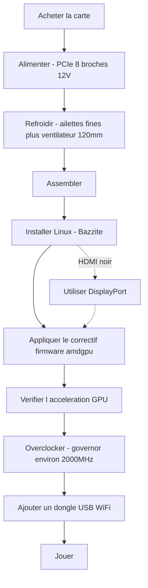

> 🌐 Traduction communautaire. La [version anglaise](../en/00-start-here.md) fait foi et peut être plus à jour. Une erreur ? [Ouvrez une issue](https://github.com/lildebil0/awesome-bc250/issues).

# Commencez ici — De zéro au jeu

> **En bref** — Vous avez acheté (ou êtes sur le point d'acheter) un AMD BC-250. C'est une carte APU dérivée de la PlayStation 5 avec 16 Go de GDDR6 qui fait une machine Linux bon marché pour le jeu/l'IA — **à condition** de résoudre trois choses dans l'ordre : **l'alimentation**, **le refroidissement** et **les pilotes Linux**. Cette page est la ligne droite d'une carte dans un carton à un jeu qui tourne. Suivez les étapes ; chacune renvoie à un chapitre complet.

Cette carte est un projet, pas un PC prêt à l'emploi. Prévoyez un week-end. Les deux façons dont les gens tuent une carte prématurément sont **un mauvais câblage d'alimentation** et **la faire tourner trop chaude** — alors on commence par ça.

---

## Avant de commencer — pièces et outils

Ayez ceci sous la main *avant* de commencer, pour ne pas découvrir chaque élément en plein montage :

- **Une alimentation** avec une sortie PCIe 8 broches 12 V → **[03 — Alimentation](../en/03-power-supply.md)**
- **Un ventilateur 120 mm haute pression statique** + carénage imprimé → **[04 — Refroidissement](../en/04-cooling.md)** / **[05 — Boîtiers et impression 3D](../en/05-case.md)**
- **Un boîtier ou un support imprimé** → **[05 — Boîtiers et impression 3D](../en/05-case.md)**
- **Une clé USB ≥ 16 Go** pour l'installateur Linux
- **Un câble DisplayPort** (ou un adaptateur DP→HDMI — le HDMI de la carte n'affiche souvent rien, le DisplayPort est le plus sûr)
- **Un tournevis**
- **Un multimètre** — pour tester le câblage de l'alimentation à l'aimant/en continuité → **[03 — Alimentation](../en/03-power-supply.md)**

---

## Le chemin



### 0. Sachez ce que vous avez
Un BC-250 est une lame de serveur/minage : un APU (CPU Zen 2 + GPU de classe RDNA2, « Cyan Skillfish/Oberon »), 16 Go GDDR6, **dissipateur passif**, alimenté par une seule **PCIe 8 broches 12 V**. Pas de WiFi intégré, pas de pilote GPU Windows fonctionnel, pas d'encodage vidéo matériel. → **[01 — Qu'est-ce que le BC-250](../en/01-what-is-bc250.md)**

### 1. Achetez la bonne chose
Sachez ce qu'est un prix juste, ce qu'il y a dans le carton (carte seule ? dissipateur ? alimentation ?), et quels vendeurs/arnaques éviter. → **[02 — Guide d'achat](../en/02-buying.md)**

### 2. Réglez l'alimentation *avant le premier démarrage*
La carte demande ~235 W (davantage en overclock) en 12 V via une PCIe 8 broches. Utilisez une vraie alimentation (Flex serveur / brique Mean Well / ATX), câblez correctement le 8 broches avec **du fil en cuivre véritable de section adéquate**, et ne devinez pas le brochage — une erreur ici, c'est une carte morte. → **[03 — Alimentation](../en/03-power-supply.md)**

### 3. Corrigez le refroidissement *avant de la solliciter*
Le dissipateur d'origine est conçu pour une soufflerie en rack et **throttle sur un bureau**. Affinez les ailettes et boulonnez un ventilateur 120 mm haute pression statique à travers un carénage imprimé (ou passez à un AIO). Objectif : rester sous ~80 °C dans Furmark. → **[04 — Refroidissement](../en/04-cooling.md)**

### 4. Mettez-la dans un boîtier (optionnel mais sympa)
Imprimez un boîtier style console qui fixe la carte, le ventilateur et l'alimentation avec une vraie circulation d'air. Catalogue de STL communautaires. → **[05 — Boîtiers et impression 3D](../en/05-case.md)**

### 5. Assemblez-la
Ordre physique des opérations pour un build minimal : fixez le ventilateur au carénage imprimé → clipsez/vissez le carénage par-dessus les ailettes (affinées) du dissipateur → installez la carte dans le boîtier/support → connectez le 8 broches de l'alimentation à la carte (bon brochage, **[03 — Alimentation](../en/03-power-supply.md)**) → connectez un câble DisplayPort au moniteur → mettez sous tension et confirmez qu'elle **POST** (POST = power-on self-test ; elle s'allume et sort de la vidéo — vous obtenez une image / le ventilateur tourne). Faites tout ponçage d'ailettes *avant* le montage (voir **[04 — Refroidissement](../en/04-cooling.md)**) et gardez la poussière de métal loin de la carte.

> Une photo/un schéma annoté de cet assemblage est une contribution bienvenue — le dépôt n'en a pas encore.

### 6. Installez Linux + les pilotes GPU
C'est l'étape décisive. Le plus simple pour les débutants : une **image basée sur Bazzite** conçue pour le BC-250 (ou **Fedora 43** — l'autre choix « ça marche tout seul » d'elektricM ; Fedora 42 est en fin de vie). Appliquez ensuite le **correctif firmware amdgpu** (le lien symbolique `navi10_gpu_info.bin`) et les paramètres noyau, regénérez initramfs/grub, et vérifiez que le GPU est accéléré (`vainfo`, `dmesg`). → **[06 — Pilotes et configuration Linux](../en/06-linux.md)**

> **Deux réglages qui causent des heures de souffrance si vous les sautez** (elektricM) : sur le BIOS moddé, mettez **VRAM = 512 Mo dynamique** et **désactivez l'IOMMU** (un IOMMU cassé provoque des défaillances d'affichage et des plantages), puis **effacez le CMOS** après le flash. Installez avec le paramètre de démarrage `nomodeset` et **retirez-le une fois les pilotes en place**. Mesa **25.1+** est le minimum (25.3.x recommandé). Et **évitez les noyaux 6.15.0–6.15.6 et 6.17.8–6.17.10** — ils cassent le pilote GPU ; utilisez plutôt un 6.18 LTS / 6.17.11+ / 6.12–6.14 LTS. ([démarrage rapide elektricM](https://elektricm.github.io/amd-bc250-docs/getting-started/quick-start/), [référence rapide](https://elektricm.github.io/amd-bc250-docs/reference/quick-reference/))

> Vous pensez à Windows ? Début 2026, il n'y a **aucun pilote GPU Windows fonctionnel** — c'est expérimental. Utilisez Linux. → **[07 — Windows](../en/07-windows.md)**

### 7. Vérifiez que ça marche aux fréquences d'origine, puis overclockez
Une fois le bureau accéléré, installez l'**oberon-governor** et poussez les fréquences (1500 MHz d'origine, c'est faible ; **2000 MHz ≈ +30 % de FPS**). En option, débloquez l'ensemble des **40 CU** et undervoltez. Re-testez les températures aux nouvelles fréquences. → **[09 — Overclocking et undervolting](../en/09-overclock-undervolt.md)**

### 8. Connectez-vous
Pas de WiFi intégré — ajoutez un **dongle USB reconnu fiable** (l'aic8800d80 est le favori de la communauté) et son pilote. → **[10 — WiFi et Bluetooth](../en/10-wifi-bt.md)**

### 9. Jouez
Fixez-vous des attentes réalistes (le CPU Zen 2 est souvent la limite, pas le GPU), activez FSR, et utilisez les réglages par jeu de la communauté. → **[11 — Résultats et réglages de jeu](../en/11-gaming.md)**

### Bonus — faire tourner des LLM en local
16 Go de VRAM, c'est beaucoup pour le prix. Faites tourner llama.cpp sur le backend **Vulkan** (ROCm est une impasse sur ce GPU). → **[12 — IA / LLM](../en/12-ai-llm.md)**

### Bonus — émulation
Switch, PS3, PS4, rétro, arcade — ce qui tourne vraiment, et comment → **[15 — Émulation](../en/15-emulation.md)**

> Pas d'image au premier démarrage ? La carte sort en **DisplayPort** (le HDMI est souvent noir) → **[14 — Affichage et sortie vidéo](../en/14-display.md)**. À court de ports USB, ou vous ajoutez un disque ? → **[16 — USB, hubs et stockage](../en/16-usb-peripherals.md)**

---

## Si quelque chose casse
Écran noir, pas d'accélération, redémarrages aléatoires, dongle qui décroche, un brick après un flash de BIOS — voir **[Dépannage](troubleshooting.md)** et la **[FAQ](faq.md)**.

> Flasher un BIOS moddé n'est **pas** une étape de départ. Cela peut bricker la carte et nécessite du matériel de récupération. N'y allez que délibérément. → **[08 — BIOS et récupération de brick](../en/08-bios.md)**

---

## La checklist en 60 secondes

| Étape | Terminé quand |
|------|-----------|
| Alimentation | Alimentation câblée au 8 broches, bon brochage, fil en cuivre véritable, la carte POST |
| Refroidissement | Ailettes affinées + ventilateur/carénage 120 mm ; <80 °C dans Furmark |
| OS | Bazzite-bc250 installé, démarre sur le bureau |
| GPU | `vainfo`/`dmesg` montrent amdgpu actif, pas le repli CPU |
| Overclock | oberon-governor en marche, ~2000 MHz, stable dans un vrai jeu |
| Réseau | Le dongle USB se connecte et reste connecté |
| Jeu | Tourne au FPS attendu pour vos fréquences |

Quand chaque ligne est cochée, c'est fini. Bienvenue dans le club BC-250.

---

## Référence rapide (aide-mémoire)

Les commandes et réglages dont vous aurez le plus besoin, condensés depuis la [référence rapide](https://elektricm.github.io/amd-bc250-docs/reference/quick-reference/) d'elektricM. Le détail complet se trouve dans **[06 — Linux](../en/06-linux.md)** et **[09 — Overclocking](../en/09-overclock-undervolt.md)**.

**BIOS :** VRAM `512MB` dynamique · IOMMU **Disabled** · démarrage UEFI · effacez le CMOS après chaque flash USB.

**Vérifiez que le GPU est accéléré (pas llvmpipe/CPU) :**
```bash
glxinfo | grep "OpenGL version"          # Mesa 25.1+ expected
vulkaninfo | grep deviceName             # → AMD Radeon Graphics (RADV GFX1013)
cat /sys/class/drm/card0/device/pp_dpm_sclk   # multiple freqs, current marked *
```

**Governor** (sans lui, les fréquences restent bloquées à 1500 MHz). Le nôtre utilise `oberon-governor` par défaut ; elektricM livre le fork SMU plus récent via COPR — les deux fonctionnent :
```bash
sudo dnf copr enable filippor/bazzite
sudo dnf install cyan-skillfish-governor-smu          # rpm-ostree install … on Bazzite
sudo systemctl enable --now cyan-skillfish-governor-smu.service
systemctl status cyan-skillfish-governor-smu          # → active (running)
```
> Plancher de tension **700 mV** — en dessous, le GPU se verrouille à 1500 MHz. Le governor peut viser la mauvaise carte (card0 vs card1) — vérifiez si la mise à l'échelle ne se déclenche pas.

**Retirez `nomodeset` une fois les pilotes en place :**
```bash
# GRUB distros: drop "nomodeset" from /etc/default/grub, then
sudo grub2-mkconfig -o /boot/grub2/grub.cfg && sudo reboot
# Bazzite / Fedora Atomic:
rpm-ostree kargs --delete-if-present="nomodeset" && systemctl reboot
```

**Option de lancement Steam** qui corrige les glitchs graphiques dans certains jeux : `RADV_DEBUG=nohiz %command%`.

**Plantage sur RDR2 / Company of Heroes 3 ?** Passez la VRAM de `512MB` dynamique à **10GB/6GB fixe** (conflit ZRAM). ([référence rapide elektricM](https://elektricm.github.io/amd-bc250-docs/reference/quick-reference/))
